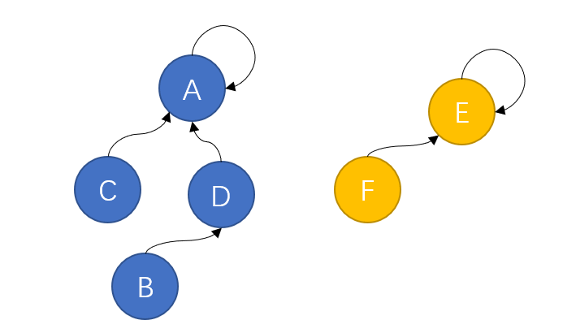
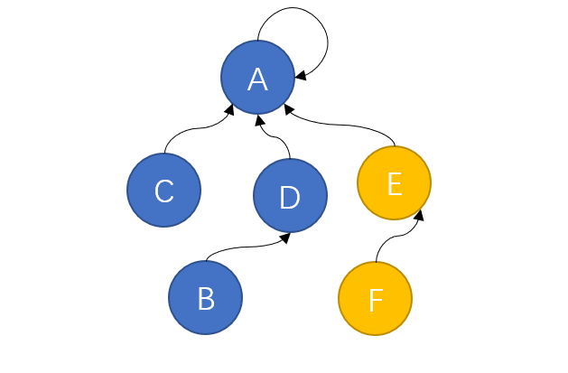
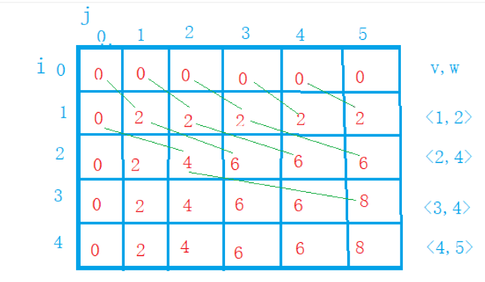

# 一、C语言基本语法

## （一）指针

# 二、C语言快捷函数

# 三、数据结构

## （一）并查集

### ①并查集概念

+ 并查集是一种树型的数据结构，用于处理一些不相交集合（disjoint sets）的合并及查询问题（如**kruskal最小生成树算法**判断是否连通），效率较高。
+ 并查集是一种树型的数据结构
+ 并查集包括初始化、查找、合并等操作。

---

### ②并查集思路

+ 并查集是一种树型的数据结构，因此他们具有树的性质，即子节点与父结点之间的关系
+ 首先是并查集的**初始化**过程，定义一个父节点数组father[n]，最开始每个节点的父节点都指向他们自己
+ 每个子结点只需要知道他们的父节点是什么，而不需要知道其它东西。
+ 初始化之后，一般要进行**查询**操作来查询两个不同结点属不属于同一个集合，每个子节点需要通过递归的方式找到它们的根节点，利用根节点来判断它们是否在同一个集合，递归的结束条件为该节点的父节点是否为它本身，因为根节点的父节点在初始化时为它本身，而子节点在后续的合并过程中父节点会发生变化，根节点是不会变的，因为在它之上没有节点，只有它本身。
+ 如果两个子节点不在同一个集合中，则需要对他们进行**合并**操作，合并就是直接在两棵树的根节点之间随便选出一个出来作父节点，而让另一个作子节点，就完成了合并操作。

---

### ③并查集的初始化

+ 需要定义每个结点最开始的初始化情况，即父节点为其本身。

~~~c
for(int i=0;i<n;i++){
    father[i]=i;
}
~~~

---

### ④并查集的查询

+ 利用递归的方式来查找节点所在树的根节点，递归的结束条件为结点的父节点为其本身

~~~c
int find(int key,int father[]){
	if(father[key]==key){
		return key;  //根节点的父节点为其本身，直接return该结点
	}else{
		key=find(father[key],father);  //不满足条件说明不是根节点，继续递归
	}
	return key;  //最后返回根节点
}
~~~

---

### ⑤并查集的合并

+ 将两棵树的根节点随机挑选一个作父节点，另一个作子节点进行连接即可

~~~c
void merge(int begin,int end,int father[]){
	father[end]=begin;  //begin为一棵树的根节点，end为另一棵树的根节点，随便找一个做父节点，让另一棵树的根节点作它的子节点
}
~~~

---

### ⑥并查集的优化

#### Ⅰ路径压缩

+ 根据最原始的并查集算法来看，一棵树在没有经历任何合并之前，它都是一棵斜树，即它的每一个结点都只有一个子节点或没有，若果是这种情况的话，在处理大量数据时，该树的高度过大，导致它的查询效率会大大降低，因此可以用**路径压缩**的方式改善并查集的查询效率
+ **路径压缩：**即让每一个子节点的父节点都直接是这棵树的根节点，这样一棵树的根节点便可以有多个子节点，这样就可以极大的减少查询时递归所要走过的路径，即通过增加父节点的子节点数量的方式来降低树的高度
+ 在实现路径压缩方法时，只需要在进行查询操作时，每进行一次递归，就让该子节点的父节点变为根节点。对于根节点，由于它的父节点为其本身，因此该方法对于根节点同样适用。
+ 代码如下

~~~C
int find(int key,int father[]){
	if(father[key]==key){
		return key;
	}else{
		father[key]=find(father[key],father);  //查询的同时让当前子节点的父节点直接为根节点
        //继续递归，father[key]发生的变化会直接导致下一次递归必为根节点，但查询最后本来就是要返回根节点的
		key=find(father[key],father);  
	}
	return key;
}
~~~

+ 并查集经过路径压缩后，并不是一定只有两层（即一个根节点和多个子节点），因为并查集的路径压缩仅发生在查询过程期间，如果查询之后该树要和另外一棵树合并时，结果可能就不是只有两层了

---

#### Ⅱ按秩合并

+ 当两个树进行合并的时候，根据他们的树的高度不同，选第一棵树的根节点作父节点与选第二棵树的根节点作父节点最后所生成的总树的高度是不同的。容易得出，让高度大的树的根节点作父节点所合并出来的树的高度是两种可能的情况里最小的，因此要把高度小的树合并到高度大的树里面去，这样合并之后的树是最优的。
+ 按秩合并可以通过选出合并生成的树高度小的那一棵来减少后续查询递归的层数，从而减小时间复杂度，但相应的，由于统计各树的高度需要建立一个数组，在结点数量较多的情况下空间复杂度会大幅度增加。
+ 首先按秩合并需要新建立一个数组来进行**初始化**

~~~c
int father[n],height[n]  //father数组用来存放父节点，height数组存放树的高度
for(int i=0;i<n;i++){
		father[i]=i;
		height[i]=1;  //默认最开始情况下所有仅有一根节点的树高度为1
	}
~~~

+ 接下来在**合并**进程中通过判断两棵树的高度的大小来判断由哪方来作父节点，应该优先让高度大的树的根节点作合并时的父节点，此时合并后的树的高度就是合并前高度较大的那一棵树的高度。在两树高度相等时，这种情况下合并会让合并后的树的高度加一

~~~c
void merge(int begin,int end,int father[],int height[]){
	if(height[begin]<height[end]){  //判断哪一方树的高度更大，选择高度大的一方根节点作父节点
		father[begin]=end;  //合并后的树与合并前高度较大一方的树的高度相等，因此高度不变
	}else{
		father[end]=begin;
	}
	if(height[begin]==height[end]){  //高度相等时让作父节点的树的高度加一
		height[begin]++;
	}
}
~~~

---

# 四、算法

## （一）动态规划问题

### ①算法介绍

---

## （二）动态规划题集

### ①0-1背包问题

#### Ⅰ问题提出

+ 给定n种物品和一个背包。物品i的重量是wi，价值为vi，背包的容量为C。
  应如何选择装入背包中的物品，使得装入背包中物品的总价值最大? 在选择装入背包的物品时，对每种物品i只有两个选择：装入或不装入。不能将物品i装入多次，也不能只装入部分物品i。

---

#### Ⅱ问题分析

+ 0-1背包问题规定每个物品只能取一件，不能重复取，因此保证代码在实现的过程中不会取重复的物品是重要的考虑因素
+ 该情况很容易联想到贪心算法，即每次取都要挑价值最高的物品，但***贪心算法不能求得此类问题的最优解***。
+ 该情况可以有三种解法：***动态规划法、回溯法和分支限界法***。
+ 此问题虽属于动态规划问题分类，但有多种解法。

---

#### Ⅲ算法设计

##### <1>动态规划法

###### 1.定义和初始化

+ 首先要将物品的数量n和背包的容量m存入，然后用数组`weight[n+1]`和数组`value[n+1]`分别存入各物品的重量和价值。
+ 物品有两种属性：重量weight和价值value，因此要求最优解，就要**用一个二维数组`max[j][capacity]`表示，该数组表示背包容量为weight，且只能放入前j个物品时背包中物品的最大价值**。运算之前需要对二维数组进行初始化，即给各项赋0。***初始化时必须的，因为动态规划算法在运算时需要用到之前的解***

---

###### 2.动态规划公式

+ 如果当前物品的weight>当前背包容量capacity，那么该物品不能放入
+ 而如果当前物品的weight<=当前背包容量capacity，那么该物品可以放入
  + 如果可以放入，还需判断放入该物品值不值得
    1. 若**`max[j-1][capacity-weight[i]]+value[i]>max[j-1][capacity]`，**那么该物品是值得放入的，因为放入它价值更高
    2. 若**`max[j-1][capacity-weight[i]]+value[i]<=max[j-1][capacity]`，**那么该物品不能放入，因为放入可能会使背包内物品价值降低，不是最优解。
    3. **`max[j-1][capacity-weight[i]]+value[i]`**公式代表的含义是***在必须放入第j件物品的前提下，背包在只能放入前j件物品，且容量为`capacity`的情况下背包中物品的价值最优解***
    4. 而**`max[j-1][capacity]`**代表的含义是***不放入第j件物品的前提下，背包在只能放入前j-1件物品，且容量为`capacity`的情况下背包中物品的价值最优解***
    5. 很明显，**`max[j][capacity]`的值取决于以上两种情况更大的一方**。
+ 实际上，max的每次外循环循环一次，都是max的对应行依赖于上一行进行更新
+ 图示例如下（右侧v,m分别为重量与价值）：
+ 

---

###### 3.代码构建

+ 接下来构建代码，需要一个外循环，循环m次，每次循环都要让二维数组中“只能放入前i个物品”中的i加1，循环至最后，该二维数组便可以表示“只能放入前m个物品”，也就等价于可以放入任何物品了。

+ 外循环内部需要嵌套内循环，循环n次，该循环表示在“只能放入前i个物品”的前提下求“背包容量为n”的情况下背包中物品的最优解。

+ 循环完后，输出二维数组的最后一项，即**`max[m][n]`**即为所求

+ 代码示例如下：

+ ~~~c
  #include<stdio.h>
  int main(){
  	int m,n;
  	scanf("%d%d",&m,&n);
  	int weight[m+1],value[m+1],max[m+1][n+1];
  	for(int i=1;i<=m;i++){
  		scanf("%d%d",&weight[i],&value[i]);
  		max[i][0]=0;  //给二维数组的每行第一个元素初始化
  	}
  	for(int i=0;i<=n;i++){
  		max[0][i]=0;  //给二位数组的第一列的每个元素初始化
  	}
  	for(int i=1;i<=m;i++){
  		for(int j=1;j<=n;j++){
  			if(weight[i]<=j&&value[i]+max[i-1][j-weight[i]]>max[i-1][j]){
  				max[i][j]=value[i]+max[i-1][j-weight[i]];
  			}else{
  				max[i][j]=max[i-1][j];
  			}
  			//printf("max[%d][%d]=%d\n",i,j,max[i][j]);
  		}
  		//printf("\n");
  	}
  	printf("%d",max[m][n]); //输出最优解
  	return 0;
  }

---

###### 4.代码优化

+ 二维数组实际上可优化为一维数组，减少空间复杂度。

+ 一维数组可定义为**`max[weight]`**，表示背包容量为weight时背包内物品价值的最优解。

+ 需要注意的是，优化为一维数组后，***内循环不能再为顺序循环，而要改为逆序循环***，这是因为**如果为顺序循环，则在比较时，`max[j-weight[i]]`会成为本行的`max[j-weight[i]]`，而不是前一行的`max[j-weight[i]]`，原因是`j-weight[i]`比当前的j要小，因此肯定在前面的循环已经被更新为本行的`max[j-weight[i]]`，这并不是我们期望的**，因此，为解决这一问题，需要让内循环逆序循环。

+ 代码示例如下：

+ ~~~c
  #include<stdio.h>
  int main(){
  	int m,n;
  	scanf("%d%d",&m,&n);
  	int weight[m+1],value[m+1],max[n+1];
  	for(int i=1;i<=m;i++){
  		scanf("%d%d",&weight[i],&value[i]);
  	}
  	for(int i=0;i<=n;i++){
  		max[i]=0;  //一维数组初始化
  	}
  	for(int i=1;i<=m;i++){
            //内循环为逆序循环
  		for(int j=n;j>=1;j--){
  			if(weight[i]<=j&&value[i]+max[j-weight[i]]>max[j]){
  				max[j]=value[i]+max[j-weight[i]];
  			}else{
  				max[j]=max[j];
  			}
  			//printf("max[%d]=%d",j,max[j]);
  		}
  		//printf("\n");
  	}
  	printf("%d",max[n]);  //输出最优解
  	return 0;
  }

---

### ②完全背包问题

