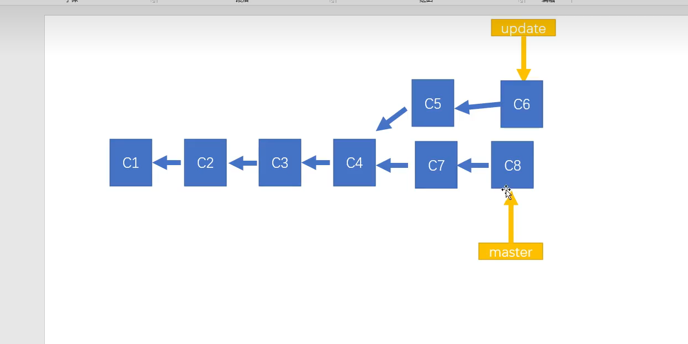
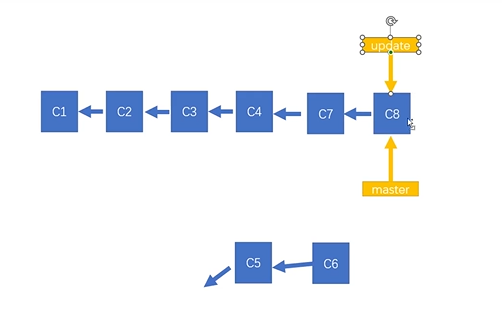
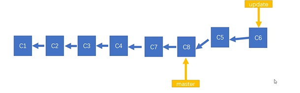

# Git笔记

## 一、Git概述

+ `git`是一个免费开源的版本控制系统，它被设计用来快速高效地管理项目开发的源码。它可以解决下面的问题:
  + 开发中代码会存在多个版本，我们如何将代码在多个版本间进行切换
  + 代码上线后，如何在不影响现行开发工作的情况下对代码进行维护
  + 开发时某段代码被多人修改时，如何处理代码的冲突问题
+ `git`支持创建代码分支和合并代码分支、跟踪代码状态、修改代码后对代码状态进行存储、将已经修改过的代码恢复到之前存储的状态
+ 综上，`git`是目前最优秀的版本控制工具

---

## 二、Git安装

+ 打开`Git`[官网](https://git-scm.com/downloads)
+ 下载
+ 点击安装，除了选择安装位置和选择适合的代码编辑器模式之外，其它都直接选`next`即可
+ 下载好后，在命令行输入`git -v`来查看安装的`git`版本，同时检验`git`是否安装成功
+ 配置信息:`git config --global user.name "xxx"`和`git config --global user.email "xxx"`

---

## 三、Git命令

+ 被`Git`管理的文件有两种状态:
  + 未跟踪:`Git`无法跟踪该文件，因此无法对该文件进行一些操作
  + 已跟踪:`Git`可以对已跟踪的文件进行任意的`Git`操作
    + 暂存:文件的修改被暂存了，但是未提交到本地仓库
    + 已修改:`Git`检测到文件被修改了
    + 未修改:文件没有任何修改，或文件的修改已被提交

|分类|命令|作用|备注|
|:---:|:---:|:---:|:---:|
|**配置Git**|`git config --global user.name "xxx"`|设置git用户名|无|
|^|`git config --global user.email "xxx"`|设置git邮箱|无|
|^|`git config --global http.sslVerify "false"`|设置解除SSL认证|无|
|^|`git config --global --edit`|查看并修改git配置|无|
|^|`git config --global core.editor {"vim"\|"nano"\|"code --wait"\|"subl -n -w"}`|修改git的编辑器模式为vim/nano/VSCode/sublime模式|无|
|^|`git config {user.name\|user.email}`|查看git用户名和邮箱|无|
|**管理项目**|`git init`|初始化项目，使所在目录被`git`管理|无|
|^|`git status`|查看项目内的文件状态|无|
|^|`git add 文件路径`|将指定文件由未跟踪或已修改状态转入暂存状态|无|
|^|`git add .`|将本目录下全部的文件都转入暂存状态|无|
|^|`git commit -m "更新信息"`|提交文件到`git`仓库，此时文件由暂存状态转为未修改状态|无|
|^|`git commit -a -m 文件路径`|将指定文件暂存+提交|无|
|^|`git restore 文件路径`|恢复文件，即撤销操作|无|
|^|`git restore --staged 文件路径`|取消文件的暂存状态|无|
|^|`git rm 文件路径`|安全删除文件|无法删除有修改但未提交的文件|
|^|`git rm 文件路径 -f`|强制删除文件|无|
|^|`git rm -r --cached 文件路径`|让git取消对某文件的监听|**该命令用于在.gitignore不生效时删除git缓存以解决该问题**|
|^|`git mv 文件原路径 文件新路径`|移动/重命名文件|无|
|**分支操作**|`git branch 分支名`|创建一个新的分支|无|
|^|`git branch`|查看当前的分支|无|
|^|`git branch -D 分支名`|删除指定分支|无|
|^|`git branch -M 新名`|重命名当前分支|无|
|^|`git switch 分支名`|跳转到指定分支|无|
|^|`git switch -c 分支名`|创建并切换到该分支|无|
|^|`git switch [-c 分支名] 日志提交id`|使`HEAD`头指针移动到该id所在版本(并创建分支)|这样会导致`分离头指针`的情况，此时应避免修改，如果要修改，应该先创建分支再修改|
|^|`git log`|输出提交日志|无|
|^|`git log --oneline`|打印精简版日志|无|
|^|`git merge 目标分支名`|使当前分支与目标分支合并，该合并以当前分支为起始点|无|
|^|`git merge --abort`|使当前分支回退到合并前的状态|通常在合并出问题回滚时使用|
|^|`git merge --quit`|放弃分支合并|无|
|^|`git rebase 目标分支名`|使当前分支变基，使其起始位置为目标分支的基底|无|
|^|`git stash save <message>`|message:保存本修改记录对应的备注 将本分支的修改记录入栈|无|
|^|`git stash list`|列出栈顶到栈底的全部元素|无|
|^|`git stash show`|显示做了哪些改动|无|
|^|`git stash apply <element>`|element:栈中的元素名 使指定元素（修改记录）作用在当前分支上|无|
|^|`git stash drop <element>`|element:栈中的元素名 从栈中删除指定元素|无|
|^|`git stash clear`|清空栈中的元素|无|
|^|`git stash pop`|将栈顶元素作用在当前分支上，并从栈中移除，相当于`git stash apply`+`git stash drop`|无|
|**远程仓库**|`git remote add <name> <url>`|name:给远程仓库起的别名 url:远程仓库地址 添加远程仓库地址|**一般此命令用于将fork仓库的原始上游仓库与本地库相关联(命名一般为upstream)，以便从原始仓库拉取最新的更新**|
|^|`git push -u 远程仓库地址名 分支名[:远程仓库分支名]`|将本地的指定分支上传到指定的远程仓库[的指定分支]内|如**果本地与远程仓库的版本不匹配，无法上传**|
|^|`git remote`|查看当前的远程仓库地址列表|无|
|^|`git remote remove 远程仓库地址名`|删除指定的远程仓库地址|无|
|^|`git remote -v`|查看当前仓库相关联的远程仓库信息|一般远程仓库都有fetch和push的权限，因此有两行|
|^|`git fetch 远程仓库地址名/远程分支名`|从远程仓库下载代码到当前分支，但**不合并**|无|
|^|`git merge 远程仓库地址名/远程分支名`|将当前分支与远程仓库的指定分支相合并|无|
|^|`git pull [--rebase] 远程仓库地址名 分支名 [--allow-unrelated-histories]`|把远程库中的更新合并到本地仓库内，相当于`fetch+merge`|`--rebase`:以变基的方式进行合并，慎用 `--allow-unrelated-histories`:无视版本合并，它主要是在git报相关的错时使用|
|^|`git clone 链接`|从远程仓库下载代码|无|
|**标签**|`git tag 版本`|为当前`HEAD`指针指向的版本指定一个标签|无|
|^|`git tag 版本 日志提交id`|为指定提交id的版本指定一个标签|无|
|^|`git tag -m 标签说明 版本 作用分支`|为指定分支的当前版本指定一个标签，并提供标签说明|无|
|^|`git tag -d 版本`|删除指定标签|无|
|^|`git push 远程仓库地址名 标签名`|向远程仓库提交标签|无|
|^|`git push 远程仓库地址名 --tags`|向远程仓库提交所有标签|无|
|^|`git push 远程仓库地址名 --delete 标签名`|删除远程仓库的指定标签|无|

---

## 四、分支

### （一）分支与合并

+ `Git`支持我们对项目的修改进行分支操作
  + 分支可以使我们想修改一个项目时，不修改项目的主干，而单分出一个支来进行修改
  + 分支之后，我们可以让主干与分支进行合并
+ 使用`git merge 合并分支名`用来让当前分支与目标分支进行合并
  + 如果目标分支就在当前分支后面，那么合并时可以进行快速合并
  + 如果目标分支相对于当前分支从其祖先节点分开，那么合并可能会产生冲突，此时我们需要做出抉择来决定合并后采用哪个分支的修改

---

### （二）变基

+ 当我们频繁使用分支进行变基时，我们的分支图可能会变得很乱，因此，`Git`为我们提供了另外一种合并的方式:变基
  + 当我们发起变基时，git 会首先找到两条分支的最近的共同祖先
  + 对比当前分支相对于祖先的历史提交，并且将它们提取出来存储到一个临时文件中
  
  + 使想合并的分支的父节点指向当前分支的基底
  
  + 以当前基底开始，重新执行历史操作
  
+ 同样的，变基也可能会导致冲突
+ **大部分情况下，合并和变基是可以互换的**，但如果代码已经上传到了远程仓库，不建议使用变基
+ `git rebase 目标分支名`来进行变基
+ **变基只会合并分支提交的记录**
  + 比如我的`main`分支不小心把文件全删了，然后我进行了回滚,之后修改了一个文件
  + 此时变基只会合并修改文件的这一个提交，并不会把删除的文件全部恢复回来

---

### （三）分支状态存储

+ 当我们不想提交时但是希望保存某一分支的修改记录时(如push时可能本地代码不是最新的，因此需要pull，如果此时把我们修改的代码提交再pull的话可能产生冲突，因此最好先pull最新的代码再提交然后push)，可以使用`git stash`
+ `git stash`会将修改记录放在一个栈中，我们可以把多个分支的修改记录都放到这个栈内，栈中的一个元素对应一个分支的修改记录
+ 可以通过`git stash`的一些命令来查看、删除与取出栈中的对应元素，这些元素被取出就会被合并到当前分支，因此**该命令也能使某一分支的修改记录作用在其它分支上**

---

## 五、远程仓库

+ 在开发时，我们的操作不应该提交到本地，而应该提交到远程仓库
  + 远程仓库可以被多个用户访问，可以便于协同开发
  + 目前使用最广泛的远程仓库是[github](https://github.com/)和[gitee](https://gitee.com/)。github是微软的，有的时候传不上去。gitee是国内的，用起来比较方便

---

## 六、标签

+ 在开发时，我们有的时候想回滚到某个提交记录
  + 我们可以通过`git log`打印日志，来找到我们的提交记录ID
  + 再通过`git switch 提交记录ID`来回滚到某个提交记录结点
+ 回滚的方式会导致一些问题
  + 我们的每个分支都指向它们自己的基底，而当我们转换分支时，实际上是在转换一个`HEAD`指针，该指针默认指向分支基底
  + 当我们进行回滚时，`HEAD`指针会脱离分支的基底，跑到之前的位置
  + 如果此时我们再进行修改，`Git`会不知道该修改操作要提交到哪里
  + 因此，如果执意要进行修改，可以使用`git switch -c 新分支名 提交记录ID`来在回滚时创建一个新分支，使该新分支指向回滚时的节点
+ 当提交记录过多时，此时寻找提交记录会变得非常麻烦，这时可以使用**标签**来记录某个提交版本
  + 使用`git tag 版本 提交id`来指定标签，相当于起别名

---

## 七、gitignore

+ `.gitiignore`文件可以支持我们写入项目内不想让`git`监听的文件路径，写入后，`git`便不会再监听该文件路径下的文件了

---

