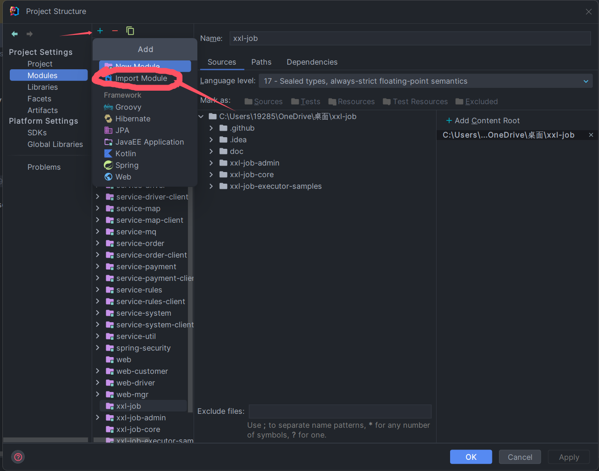
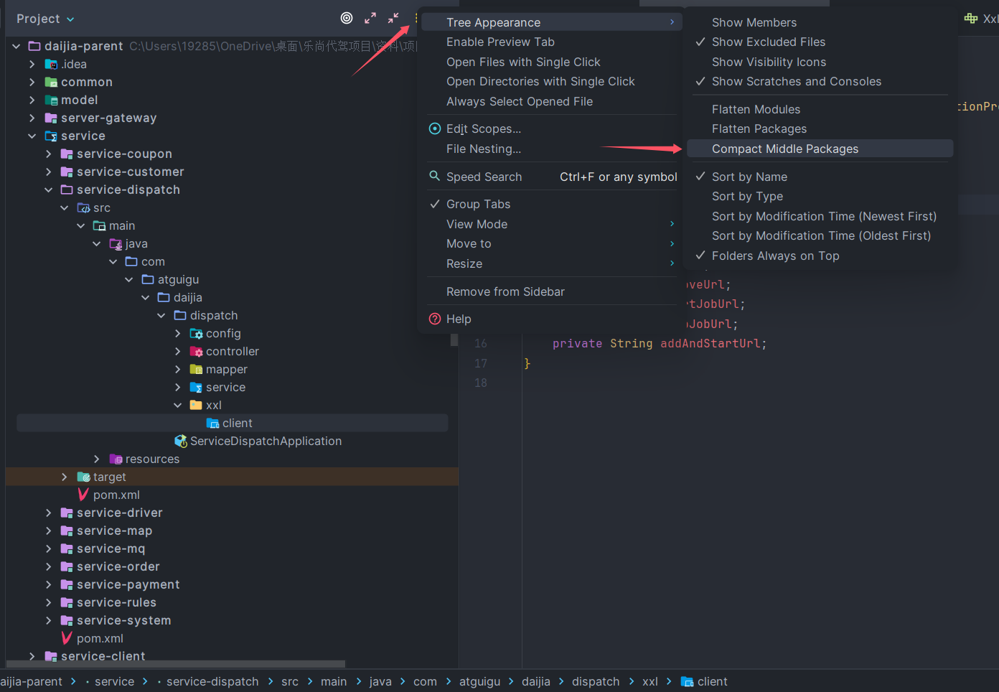
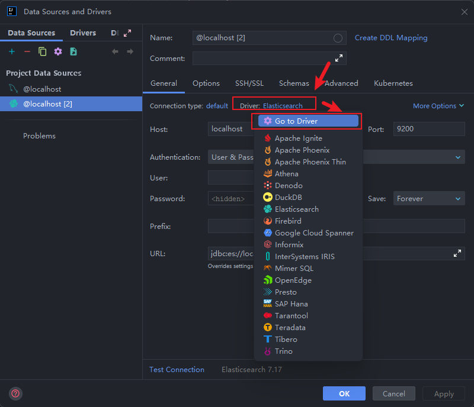

## 一、配置

### （一）配置tomcat

1.  可以在`设置(settings)->编辑(editor)->文件编码(File Encodings)`分别为`全局编码(Global Encoding)`、`项目编码(Project Encoding)`、`属性文件的默认编码(Default > Encoding for Properties Files)`设置 全局、项目和`properties`文件的编码类型
2.  在`设置(settings) -> 构建、执行、部署(Build,Execution,Deployment) -> 应用程序服务器(Application Servers) `下可以添加服务器(`tomcat`等)
3.  在模块的`打开模块设置(Project Structure) -> 项目设置(Modules) -> 选择模块 -> 依赖(Dependencies)`可以添加模块所依赖的库(`tomcat`库等)，这些库不能被`Java`库默认提供，因此需要导入
4.  点击项目再按`Shift+Shift`，搜索`框架(frame)`，可以找到`添加框架支持(Add Framework Support)`来添加框架(`Web Application`)支持，该设置需要先添加
5.  在运行按钮边`编辑配置(Edit Configurations) -> 点击加号 -> 选择tomcat 本地(Local) `可以配置`tomcat`的运行配置，如`应用程序服务器(Application Server)`可以选择`tomcat`的版本，`打开浏览器(Open Browser)`可以选择运行时**默认打开的浏览器**、`部署(deployment)`可以添加**运行时具体运行哪个项目**,(`工件(Artifacts)`),`应用程序上下文(Application Context)`设置打开该项目使用的**上下文路径**

---

## 二、快捷键

---

## 三、内部设置

### （一）关键字模板

+ Settings->Editor->General->Postfix Completion可以自定义后缀模板，即`"aaa".sout->System.out.println("aaa");`的功能
+ Settings->Editor->Live Templates可以自定义关键字模板，即`sout->System.out.println();`的功能
  + 建议自定义一个Template Group来归纳自己自定义的关键字
    + key:我们想自定义的后缀关键字
    + Minimun Language lavel:大概随便写写，写该笔记时，默认为3
    + Application expression types:后缀模板生效的数据类型，一般为`non void`
    + 下面的输入框是自定义模板用的，使用`$EXPR$`来确定前缀被放置在哪里
  + 新建一个Live Template需要填:
    + Abbreviation:自定义的关键字，如:`sout`
    + Template Text:想实现的模板，可以设置光标停留的点位，使用`$var$`来自定义，使用`$END$`来表示结束，可以照着其它系统给的模板照葫芦画瓢
    + Description是描述，即这个关键字是干嘛的，这个不是必须的
    + Template Text最下面有一行小字，这个是设置我们的关键字生效区间的，一般需要把Java勾选上

---

### （二）模块设置

+ 如何在一个项目内导入其它模块
  + 在`Project Structure`中，可以通过模块导入的方式实现一个窗口显示多个项目
    

---

### （三）SpringBoot项目构建设置

+ 构建SpringBoot项目时，Spring官方提供的`Spring.io`只会更新最新的版本，如果想得到老版本就没办法弄了，这时可以换一下SpringBoot initializr url来解决该问题，可以换成阿里云的:`https://start.aliyun.com/`

---

### （四）目录设置

+ 怎么让IDEA每层都显示目录而不折叠
  + 想要不让IDEA自动使用`.`合并只有一个空目录的文件夹（即文件夹仅有一个空目录的时候也要使用缩进展开进行层级区分），需要在左侧项目树菜单栏上的配置选择`Tree Appearance->Compact Middle Packages`
    

---

### （五）编码设置

+ 在idea设置->Editor->General->Console可以找到**终端输出的默认字符集编码**，默认为系统编码，修改为UTF-8
+ 在idea设置->Editor->File Encodings可以找到**idea的文件编码**，有的默认是GBK和ISO8859-1，修改为UTF-8
+ 在中文环境下，貌似Java的输出流的默认输出编码格式是GBK，但是我们想把它转成UTF-8，但我们又不能在程序内指定，因为**字符集编码格式已经在JVM启动时就被缓存下来**，因此我们需要指定JVM启动时的参数配置:
  + 创建系统环境变量：变量名: `JAVA_TOOL_OPTIONS`， 变量值：`-Dfile.encoding=UTF-8`,这样就可以让idea在控制台的输出编码为UTF-8时输出不再乱码

---

### （六）快捷键设置

+ 如何关闭连按两次shift出现的全局搜索框?
  + 在设置内找到高级设置(Advanced Settings)，然后找到`disable double modifier key shortcuts`，开启它来禁用
  + 在按键映射中找到`search everywhere`来配置想配置的全局搜索框快捷键

---

### （七）Maven设置

+ 每次打开idea或者刷新pom.xml再启动项目都会报他妈的JDK版本出错，如何配置?
  + 这是指定的maven配置的问题，idea会读取maven的settings.xml配置文件，如果该配置文件设置了默认的JDK版本，那么它就会自动把该版本置为当前项目使用的JDK版本，每次刷新pom时，idea就会读取一次该配置文件，因此每次刷新再启动项目都会报错
  + 解决问题的办法是修改该配置文件:

    ~~~xml
        <profiles>
            <profile>
                <id>jdk-8</id>
                <activation>
                    <activeByDefault>true</activeByDefault>
                    <jdk>8</jdk>
                </activation>
                <properties>
                    <maven.compiler.source>8</maven.compiler.source>
                    <maven.compiler.target>8</maven.compiler.target>
                    <maven.compiler.compilerVersion>8</maven.compiler.compilerVersion>
                </properties>
            </profile>
        </profiles>
    ~~~

  + 同时在该项目的`pom.xml`内指定`maven-compiler-plugin`插件使用的JDK版本:

    ~~~xml
        <build>
            <plugins>
                <plugin>
                    <groupId>org.apache.maven.plugins</groupId>
                    <artifactId>maven-compiler-plugin</artifactId>
                    <version>3.10.1</version>  <!-- 版本仅供参考 -->
                    <configuration>
                        <source>1.8</source>
                        <target>1.8</target>
                        <encoding>UTF-8</encoding>
                    </configuration>
                </plugin>
            </plugins>
        </build>
    ~~~
  + 同时在项目的`pom.xml`指定properties配置项配置项目JDK
  
    ~~~xml
        <properties>
            <project.build.sourceEncoding>UTF-8</project.build.sourceEncoding>
            <maven.compiler.source>1.8</maven.compiler.source>
            <maven.compiler.target>1.8</maven.compiler.target>
            <skipTests>true</skipTests>  <!-- 这是让maven打包时跳过test的配置 -->
        </properties>
    ~~~

+ 每次打开都要配置maven，怎么才能让idea全局都认一个maven?
  + 

---

### （八）缩进设置

+ 如何让idea在空格里面默认缩进4空格而不是8空格
  + `Settings->Editor->Code Style->Java->Tabs and Indents->Continue indent`置为4即可

---

### （九）JSON格式设置

+ 如何让idea在JSON写注释的情况下不报黄
  + `Settings->Editor->Inspections->JSON and JSON5->Compliance with JSON standard->Options`取消勾选`Warn about comments`

---

### （十）设置数据库驱动

## 四、报错问题

|分类|报错信息|报错原因|解决方法|备注|
|:---:|:---:|:---:|:---:|:---:|
|**构建报错**|java: 无效的目标发行版: xx|在idea的设置中所指定的构建所用的JDK版本与实际项目所指定的JDK版本不一致|1.修改项目JDK（OpenModlueSettings），或者修改IDEA配置（Settings->Build,Execution,Deployment->Compiler->JavaCompiler->右边的项目修改Target bytecode version） 2.详见[Maven设置](#mavenSetting)|无|

---