# JUC笔记

## 一、基础篇

### （一）基本知识

#### ①JUC简介

+ java.util.concurrnt包，于JDK1.5的时候被推出，是用来处理多线程的包

---

#### ②Mark Word

+ 在HotSpot虚拟机中，对象存储在堆空间内，而对象有可以被细分为三部分
  + 对象头（Header）:又分为三部分
    + Mark Word:第一部分Mark Word,**用于存储对象自身的运行时数据**，如哈希码（HashCode）、GC分代年龄、锁状态标志、线程持有的锁、偏向线程ID、偏向时间戳等，这部分数据的长度在32位和64位的虚拟机（未开启压缩指针）中分别为32bit和64bit，官方称它为“Mark Word”。
    + Klass:对象头的另外一部分是klass类型指针，即对象指向它的类元数据的指针，**虚拟机通过这个指针来确定这个对象是哪个类的实例**.
    + 数组长度:**只有数组对象有**，用来记录数组长度
  + 实例数据（Instance Data）:实例数据部分是对象真正存储的有效信息，也是在程序代码中所定义的各种类型的字段内容。无论是从父类继承下来的，还是在子类中定义的，都需要记录起来
  + 对齐填充（Padding）:由于HotSpot VM的自动内存管理系统要求对象起始地址必须是8字节的整数倍，因此当对象实例数据部分不满足该条件时，就需要通过对齐填充来补全
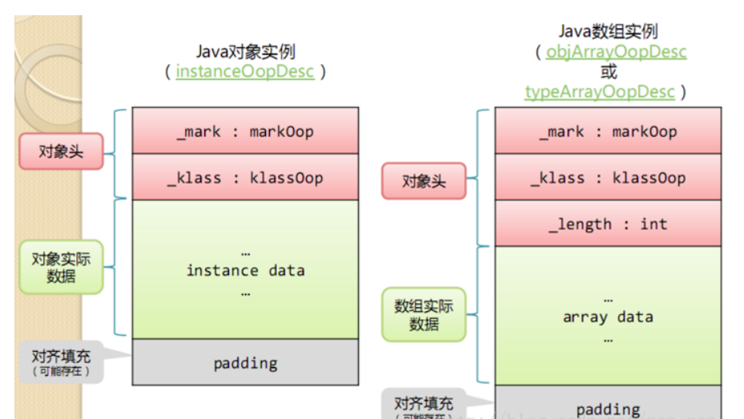

---

#### ③锁

+ 此处明确，以下列举的四种锁都**只针对synchronized**:
  + 偏向级锁
  + 轻量级锁
  + 重量级锁
  + 自旋锁
+ 锁结构都存储在对象的对象头的Mark Word中
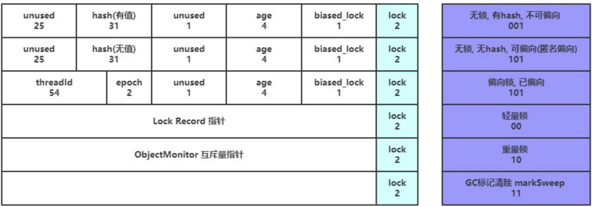

##### Ⅰ重量级锁

+ 重量级锁效率最低，它需要借助于底层操作系统来实现
+ 我们从monitor（监听器，即线程获取的锁）开始说起，在Java虚拟机（HotSpot）中，monitor是由ObjectMonitor实现的:

~~~C++
    ObjectMonitor() {
        _header       = NULL;
        _count        = 0; //记录个数
        _waiters      = 0,
        _recursions   = 0;
        _object       = NULL;
        _owner        = NULL;
        _WaitSet      = NULL; //处于wait状态的线程，会被加入到_WaitSet
        _WaitSetLock  = 0 ;
        _Responsible  = NULL ;
        _succ         = NULL ;
        _cxq          = NULL ;
        FreeNext      = NULL ;
        _EntryList    = NULL ; //处于等待锁block状态的线程，会被加入到该列表
        _SpinFreq     = 0 ;
        _SpinClock    = 0 ;
        OwnerIsThread = 0 ;
    }
~~~

+ 而线程想获取锁(monitor)，每个等待锁的线程都会被封装成ObjectWaiter对象，进入到如下机制：

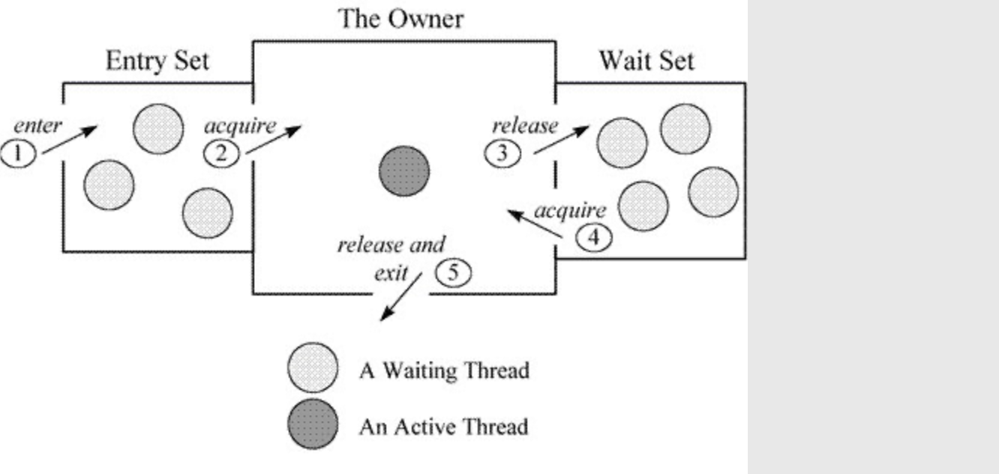

+ 该机制如下:
  + 每个等待获取锁的线程都会被封装为ObjectMonitor对象，先进入Entry Set等待获取锁
  + 线程获取到锁以后，进入The Owner区域，并将`monitor`中的owner变量设置为当前线程，同时`monitor`中的计数器加1
  + 如果线程占用锁时调用了wait方法，线程将释放当前持有的锁，owner变为null,同时计数器减1，同时该线程进入Wait Set等待被唤醒
  + 如果线程在Wait Set被唤醒，它会在Wait Set中等待获取`monitor`
  + 线程执行完毕后，也会释放`monitor`资源
+ 如果我们的同步代码块并不是很长，将竞争中的线程挂起又唤醒会很耗费时间，因此为了应对该问题，`自旋锁`被设计出来了

---

##### Ⅱ自旋锁

+ 我们意识到，大多数情况下，一个线程占用同步代码块的时间并不是很长，我们完全没有必要将竞争中的线程挂起然后又唤醒。因此在JDK1.4.2版本中，首次引入了自旋锁
+ **自旋锁**是轻量级锁，它不会将处于等待中的线程挂起，而是通过无限循环的方式，不断地监测自己是否能够得到锁，如果在一定的循环次数内得到了锁，那么它就会执行同步代码，如果得不到，自旋锁将膨胀为重量级锁，这是因为**自旋锁一直循环需要耗费CPU资源，如果占用该锁的线程执行同步代码时间过长，CPU资源耗费会非常严重**
  + 自旋锁在JDK6之前，其循环次数是10次，如果10次请求不到锁资源，那么将膨胀为重量级锁
  + JDK6以后，自旋锁的次数不被写死了，它会进行自适应变化。如果在同一个锁对象上，自旋等待刚刚成功获得过锁，并且持有锁的线程正在运行，那么这次自旋也是有可能成功的，所以会允许自旋更多次。当然，如果某个锁经常都自旋失败，那么有可能会不再采用自旋策略，而是直接使用重量级锁。
  + 另外，从JDK6开始，自旋锁被默认启用

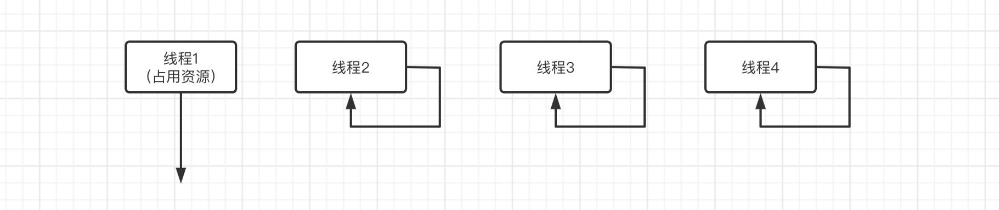

---

##### Ⅲ轻量级锁

+ JDK6引入了轻量级锁，轻量级锁的目的是:在无竞争情况下，减少重量级锁产生的性能消耗。它实际上就是在赌同一时间只有一个线程在占用锁。
+ 轻量级锁的运作机制如下:
  + 步骤1:在代码执行到同步代码块时，会首先检查对象的Mark Word,查看锁对象是否被其它线程占用，如果没有，那么会在当前线程中所处的栈帧中建立一个名为锁记录(`Lock Record`)的空间，用于复制并存储对象当前的Mark Word信息（官方称为`Displaced Mark Word`）
  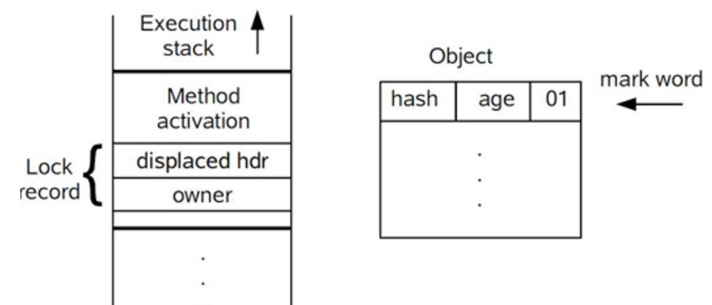
  + 步骤2:接下来，拷贝对象头中的Mark Word信息到锁记录中
  + 步骤3:拷贝完成后，虚拟机将使用CAS操作尝试将对象的Mark Word更新为指向Lock Record的指针，并将Lock record里的owner指针指向对象的mark word。
    + 如果更新成功，那么执行步骤4
    + 否则执行步骤5
  + 步骤4:开始执行同步代码，此时的栈帧情况如下图所示:
  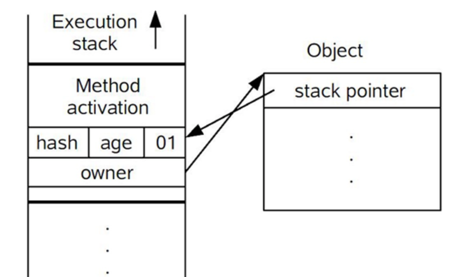
  + 步骤5:虚拟机首先会检查对象的Mark Word是否指向当前线程的栈帧，如果是就说明当前线程已经拥有了这个对象的锁，那就可以直接进入同步块继续执行。否则说明多个线程竞争锁，轻量级锁就要膨胀为重量级锁，锁标志的状态值变为“10”，Mark Word中存储的就是指向重量级锁（互斥量）的指针，后面等待锁的线程也要进入阻塞状态。 而当前线程便尝试使用自旋来获取锁
+ 总流程图如下:

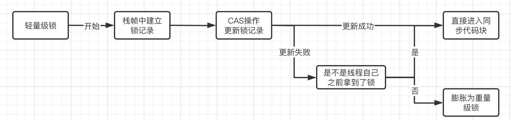

---

##### Ⅳ偏向锁

+ 偏向锁于JDK6时被引入，**JDK15开始，该特性被标记为废弃状态，如果想继续使用那么需要通过JVM参数`-XX:+UseBiasedLocking`手动设置启用**
+ 偏向锁比轻量级锁还轻量，它更纯粹，它的出现是由于人们发现某些情况下某个所频繁的被同一个线程获取而设计出来的，因此它是对轻量级锁的进一步优化
+ 偏向锁实际上就是为单个线程而生的，当某个线程第一次获得该锁时，如果接下来都没有线程来获取该锁，那么得到该锁的线程将不再需要进行同步操作，直到出现其它线程与其竞争该锁
  + 需要注意的是，如果作为锁的对象调用了hashCode方法计算过其一致性哈希值了，那么它将不支持偏向锁，将直接进入到轻量级锁状态。因为它的锁结构中，ThreadId字段和epoch字段占用了hash字段和unused字段，导致哈希不可用，如果调用了哈希方法，就需要找一个能存储哈希值的锁结构来存储该哈希值
  + 如果对象已经是偏向锁状态，再调用其hashCode方法，它将直接变为重量级锁，并将哈希值存放在`monitor`中
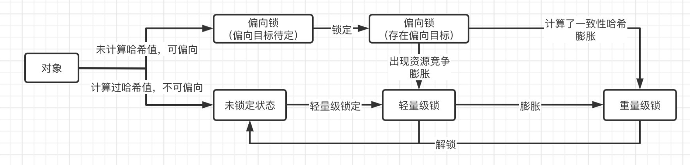

---

##### Ⅴ锁的消除与粗化

+ 锁消除指的是我们的某段代码虽然加了锁，但是在运行时根本不可能出现各个线程之间抢夺资源的情况，因此该锁会被自动消除
+ 锁粗化则指的是我们的代码中如果频繁地出现互斥同步的操作，那么JVM如果检测到该操作，它会将整个同步的范围向外扩展
  + 如我们在一个无限循环里面加了synchronized代码块，JVM会优化到给无限循环加一个synchronized代码块

---

#### ④JMM内存模型

+ 在`计算机组成原理`课程中讲到,CPU中，为了协调内存与CPU的速度，一般会在CPU和内存中假设高速缓存来提高处理器的数据获取效率。
  + 但现在的主流CPU都是多核的，每个核都有它自己的高速缓存，此时如何保证各个高速缓存的数据一致性就成为了一个问题
  + 为了解决该问题，需要各个处理器访问缓存时都遵循一些协议，在读写时要根据协议来进行操作，这类协议有MSI、MESI（Illinois Protocol）、MOSI、Synapse、Firefly及Dragon Protocol等。
  + Java根据上面的解决方案，也采用了类似的模型来支持多线程
+ JMM（Java Memory Model）内存模型规定如下:
  + **所有的变量全部存储在主内存**（这里的变量指的都是会出现竞争的变量，包括成员变量、静态变量等，而**局部变量这种属于线程私有，不包括在内**）
  + **每条线程有着自己的工作内存**（可以类比CPU的高速缓存），线程对变量的所有操作，必须在工作内存中进行，不能直接操作主内存中的数据。
  + **不同线程之间的工作内存相互隔离**，如果需要在线程之间传递内容，只能通过主内存完成，无法直接访问对方的工作内存。

+ 根据上述文字和上图所示，每个线程如果想要对主内存中的数据进行操作，必须先将其数据拷贝到自己的工作内存中，然后进行操作再提交给主内存。具体就是`Save`和`Load`操作
  + 这个主内存就是对应JVM的堆中存放对象的实例的部分
  + 工作内存是对应线程的虚拟机栈的部分区域，虚拟机可能会对这部分内存进行优化，将其放在CPU的寄存器或是高速缓存中。
    + 比如在访问数组时，由于数组是一段连续的内存空间，所以可以将一部分连续空间放入到CPU高速缓存中，那么之后如果我们顺序读取这个数组，那么大概率会直接缓存命中
+ 根据上面的介绍，我们可以通过一段代码验证该模型的存在:

~~~java
  public class Main {
      private static int i = 0;
      public static void main(String[] args) throws InterruptedException {
          new Thread(() -> {
              for (int j = 0; j < 100000; j++) i++;
              System.out.println("线程1结束");
          }).start();
          new Thread(() -> {
              for (int j = 0; j < 100000; j++) i++;
              System.out.println("线程2结束");
          }).start();
          //等上面两个线程结束
          Thread.sleep(1000);
          System.out.println(i);
      }
  }
~~~

+ 该段代码的运行结果绝对不是20000，而是小于该值的整数，出现该问题的原因就是`i++`这句代码被编译为class字节码文件后，其具体执行被拆分为了多条语句。
  + 如果我线程A和线程B同时都拿主线程的i变量，同时进行了自增操作又同时都保存了变量，那么此时线程A和B的工作内存中,i的值是相同的，那么谁先提交谁后提交就没什么区别了，因为**这意味着两个线程各循环了一次，但是i的值仅增加了1**
  + 这个玩意很类似于MySQL的脏写
  + 如果想规避该问题，以Java基础学过的多线程的知识，可以使用synchronized加锁的方式来避免出现该问题

---

#### ⑤重排序

+ Java语言为了优化程序的执行效率,编译器在编译时，或JVM在执行时，常常会对指令进行重排序，有以下情况:
  + 编译器重排序：Java编译器通过对Java代码语义的理解，根据优化规则对代码指令进行重排序
  + 机器指令级别的重排序：现代处理器很高级，能够自主判断和变更机器指令的执行顺序
+ 指令重排序能够在不改变结果的情况（单线程）下，优化程序的运行效率，比如:

~~~java
  int a=10;
  int b=20;
  System.out.println(a+b);
~~~

+ 颠倒a和b的赋值顺序对于后面的结果输出并没有影响，因此这里就可以进行重排序，虽然排序以后貌似效率并没有发生什么变化，但是这里只是举个例子
+ 然而，这个重排序的初衷是好的，但是对于多线程的执行来说，重排序就会导致之后的运行结果出现差异:

~~~java
  public class Main {
      private static int a = 0;
      private static int b = 0;
      public static void main(String[] args) {
          new Thread(
            () -> {
              if(b == 1) {
                  if(a == 0) {
                      System.out.println("A");
                  }else {
                      System.out.println("B");
                  }   
              }
            } 
          ).start();
          new Thread(
            () -> {
              a = 1;
              b = 1;
            }
          ).start();
      }
  }
~~~

+ 在上例中，如果a和b赋值的顺序不颠倒，那么上面的线程会输出`B`。但是如果颠倒了，那输出的可就是`A`了

---

#### ⑥volatile关键字

+ 首先我们需要先了解三个概念:
  + `原子性`:一段代码要么都执行完，要么就不执行，不能出现中间状态
  + `可见性`:当多个线程访问同一个变量时，一个线程修改了这个变量的值，其他线程能够立即看得到修改的值。就是数据同步
  + `有序性`:即程序执行的顺序按照代码的先后顺序执行，就是不进行重排序
+ volatile关键字是Java多线程中的一个非常重要的关键字，它有如下作用:
  + 保证可见性:它可以**在其它线程更新被其修饰的变量后，使得该变量的值会从线程的工作内存强制刷新到主内存中去，并使得其它线程内的工作内存中的该变量缓存失效**
  + 防止指令重排:它可以通过`内存屏障`来**阻止编译器和CPU对与其相关的代码进行指令重排**
+ **内存屏障**（Memory Barrier），又称内存栅栏，是一个CPU指令，它的作用有两个:
  + 保证特定操作的顺序
  + 保证某些变量的内存可见性（volatile的内存可见性，其实就是依靠这个实现的）
+ 由于编译器和处理器都能执行指令重排的优化，如果在指令间插入一条Memory Barrier则会告诉编译器和CPU，不管什么指令都不能和这条Memory Barrier指令重排序。
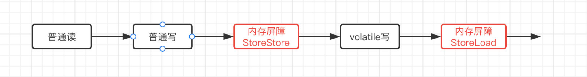
|屏障类型|指令示例|说明|
|:---:|:---:|:---:|
|LoadLoad|Load1;LoadLoad;Load2|保证Load1的读取操作在Load2及后续读取操作之前执行|
|StoreStore|Store1;StoreStore;Store2|在Store2及其后的写操作执行前，保证Store1的写操作已刷新到主内存|
|LoadStore|Load1;LoadStore;Store2|在Store2及其后的写操作执行前，保证Load1的读操作已读取结束|
|StoreLoad|Store1;StoreLoad;Load2|保证load1的写操作已刷新到主内存之后，load2及其后的读操作才能执行|

+ 来看如下案例:

~~~java
  public class Main {
      private static int a = 0;
      public static void main(String[] args) throws InterruptedException {
          new Thread(() -> {
              while (a == 0);
              System.out.println("线程结束！");
          }).start();

          Thread.sleep(1000);
          System.out.println("正在修改a的值...");
          a = 1;   //很明显，按照我们的逻辑来说，a的值被修改那么另一个线程将不再循环
      }
  }
~~~

+ 主线程在修改a变量之前，启动了一个新线程
  + 新线程直接就开始判断a的值，新线程将a的值拷贝到其工作内存中，此时变量a在主内存中的值是0，在该线程的工作内存的值也是0，因此线程会无限循环
  + 之后时间片轮转，轮到主线程执行，主线程在休眠1s后把a的值置为了1，并提交到主内存中，此时主线程的工作内存和主内存的变量a的值是1
  + 但是新线程中已经存在了变量a的缓存，它的值是0，因此新线程并不知道主内存的变量a的值已经发生变化了，因此**即使主线程修改了变量a的值，新线程依旧会继续无限循环下去**
+ 注意:**volatile并不能保证原子性**，可以通过[JMM模型案例](#JMM)进行说明
  + 在该案例中，`i++`这个代码虽然我们只是写了一行，但是class字节码文件为了实现该代码却要执行多段操作，我们希望volatile能够使`i++`这一操作具有原子性，也就是它的class字节码文件在多线程执行时对应的多段操作要么全都执行，要么全都不执行，不能执行到一半切到其它线程执行别的代码去了。**这个volatile是做不到的**
  + 首先volatile只是保证了可见性，即一个线程更新了对应变量的值，那么其它线程的工作内存中的对应变量的缓存也会更新
  + 但是如果其它线程在缓存更新前它对该变量的相关操作已经做完了，就只差提交数据了，那工作内存中的缓存更新了也没用了，因为它就直接提交了。而且在JMM案例中已经提到过，如果多个线程都执行到了提交操作，那就相当于多次循环只让变量i增加了1次

---

#### ⑦happens-before原则

+ JMM还提出了happens-before（先行发生）原则，定义一些禁止编译优化的场景，来向各位程序员做一些保证，只要我们是按照原则进行编程，那么就能够保持并发编程的正确性。具体要求如下:
  + **程序次序规则**:同一个线程中，按照程序顺序，前面的操作相对于其后面操作先行发生
    + 其实就是禁止指令重排
  + **监视器锁规则**:解锁操作先于后续对该锁的加锁操作
  + **volatile变量规则**:对一个volatile变量的写操作先于对该变量的读操作
    + 如果某个线程在其它线程的写操作未执行完毕就读取了该变量，那么其它线程写完毕后，相当于读取变量的线程拿到的值就不是最新的了
  + **线程启动规则**:主线程A启动了线程B，B可以见到A启动它之前的操作
    + 意思就是线程B可以见到线程A在启动它之前对于共享变量的修改结果
  + **线程加入规则**:如果线程A中执行了`ThreadB.join()`方法，就意味着线程A需要等待线程B执行完毕后再执行，如果线程B成功返回，那么线程B的所有操作都要先于线程A调用`ThreadB.join()`的后续操作
  + **传递性规则**:如果A先于B执行，B先于C执行，那么A先于C执行。看起来是句废话
+ 我们通过happens-before原则来解释下面的代码:

~~~java
  public class Main {
      private static int a = 0;
      private static int b = 0;
      public static void main(String[] args) {
          a = 10;
          b = a + 1;
          new Thread(() -> {
            if(b > 10) System.out.println(a); 
          }).start();
      }
  }
~~~

+ 定义A:`a=10;`、B:`b=a+1;`、C:`新线程的操作`
+ 在主线程中，根据**程序次序规则**，A、B、C操作依次顺序执行。之后C在进行判断b>10时，根据**线程启动规则**和**传递性规则**，C可以读取到主线程在启动它之前修改的b的值，此时b已经被修改为11了，因此判断条件为true,输出变量a的值，此时变量a的值为10，故输出10

---

### （二）使用

#### ①锁类

##### ⅠLock与Condition接口

+ 在JUC中，存在Lock接口负责定义锁类的基本方法，Condition接口定义了锁类基本的等待和唤醒方法:

|归属|方法|参数|描述|返回值|返回值类型|异常|备注|样例|
|:---:|:---:|:---:|:---:|:---:|:---:|:---:|:---:|:---:|
|**Lock**|lock()|无参|使当前线程得到锁，得不到锁时会进入阻塞状态，无法响应中断|无返回值|void|无|无|[样例](../源码/JUC/BasicJUC/src/test/java/LockAndConditionTest.java)|
|^|lockInterruptibly()|无参|使当前线程得到锁，但等待过程中会响应中断|无返回值|void|InterruptedException|无|^|
|^|tryLock()|无参|使当前线程尝试获取锁，获取不到不会阻塞线程|成功获取返回true,否则返回false|boolean|无|无|^|
|^|tryLock(long time,TimeUnit unit)|time:等待获取锁的时间 unit:定义等待的时间单位，是分钟还是秒还是什么东西|尝试在指定时间内获取锁|成功返回true，否则返回false|boolean|InterruptedException|无|^|
|^|unlock()|无参|使当前线程释放其占有的锁|无返回值|void|无|无|^|
|^|newCondition()|无参|得到当前锁对象对应的Condition对象|Condition对象|Condition|无|调用一次该方法，就会获得一个新的Condition对象|^|
|**Condition**|await()|无参|使当前线程释放锁并进入等待状态，支持响应中断|无返回值|void|InterruptedException|**线程必须持有锁才能调用该方法**|^|
|^|awaitUninterruptibly()|无参|使当前线程释放锁并进入等待状态，但不支持响应中断|无返回值|void|无|^|^|
|^|awaitNanos(long time)|time:等待的纳秒值|使线程释放锁并等待指定时间|若在期间被唤醒，那么返回等待的剩余时间，否则返回0或负数|long|InterruptedException|^|^|
|^|await(long time, TimeUnit unit)|time:等待的时长 unit:定义等待的时间单位，是分钟还是秒还是什么东西|使线程释放锁并等待指定时间|若在期间被唤醒，那么返回boolean，否则返回false|boolean|InterruptedException|^|^|
|^|awaitUntil(Date deadline)|deadline:线程被唤醒的时间点|使线程释放锁并在指定时间点后被自动唤醒|若在预定时间前被唤醒，那么返回boolean，否则返回false|boolean|InterruptedException|^|^|
|^|signal()|无参|唤醒一个处于等待状态的线程|无返回值|void|无|**对应线程被唤醒后，还得获得锁才能接着运行**|^|
|^|signalAll()|无参|唤醒所有等待着的线程|无返回值|void|无|^|^|
|**TimeUnit**|toXxx(long duration)|duration:时间值|将指定单位的时间值转换为方法名所表示的时间值|数值|long|无|无|^|
|^|sleep(long time)|time:时间值|使线程休眠指定时间|无返回值|void|InterruptedException|实际上使用的是Thread.sleep方法|^|
|^|convert(long time,TimeUnit unit)|time:要转换的时间 unit:时间单位|将指定单位的时间转换为对应TimeUnit对应的时间单位|转换后的时间|long|无|例，`TimeUnit.SECONDS.convert(10L,TimeUnit.MINUTES);`是将10分钟转换为秒|无|

---

##### Ⅱ可重入锁

+ ReentrantLock是可重入锁，即一个线程可以连续请求同一个锁对象而不阻塞。该类实现了Lock接口
  + 实际上，synchronized关键字也是具备该特性的
+ 下面是一些ReentrantLock的常见方法:

|归属|方法|参数|描述|返回值|返回值类型|异常|备注|样例|
|:---:|:---:|:---:|:---:|:---:|:---:|:---:|:---:|:---:|
|**ReentrantLock**|ReentrantLock(boolean fair)|fair:是否是公平锁,传入true表示是|构造器|ReentrantLock对象|ReentrantLock|无|无|[样例](../源码/JUC/BasicJUC/src/test/java/ReentrantLockTest.java)|
|^|getHoldCount()|无参|得到该锁被当前线程占用的次数|数值|int|无|无|^|
|^|isLocked()|无参|查看当前锁是否被线程占用|是返回true，不是返回false|boolean|无|无|^|
|^|getQueueLength()|无参|得到正在等待获取该锁的线程估计值|数值|int|无|**返回值只是一个估计值**|^|
|^|getQueuedThreads()|无参|得到可能正在等待获取该锁的线程组成的集合|集合对象|Collection<Thread>|无|**集合中的元素是估计的，并不是精确的**|^|
|^|hasQueuedThread(Thread thread)|thread:指定判断的线程对象|判断指定的线程是否在等待占用该锁|是返回true，不是返回false|boolean|无|无|^|
|^|getWaitQueueLength(Condition condition)|condition:指定判断的condition对象|根据condition判断等待占用该锁的线程估计值|数值|int|无|**返回值只是一个估计值**|^|
|^|getWaitingThreads(Condition condition)|condition:指定condition对象|根据condition得到可能在等待占用该锁的线程集合|集合对象|Collection<Thread>|无|**集合中的元素是估计的，并不是精确的**|无|

+ ReentrantLock可以区分公平锁与非公平锁
  + 公平锁就是各线程在进行等待获取锁时，根据先到先得的顺序来依次获得锁。也就是各个线程有序排队来获得锁
  + 非公平锁就是各线程在等待获取锁时，不会依据进入等待队列的顺序来获得锁，也就是线程可以插队来获得锁
  + [本样例](../源码/JUC/BasicJUC/src/test/java/ReentrantLockTest.java)中含有对公平锁和非公平锁的测试，但是不明原因导致公平锁与非公平锁输出的没有区别

---

##### Ⅲ读写锁

+ ReentrantReadWriteLock是具有可重入性质的读写锁
  + ReentrantLock仅具有可重入特性，它实际上是一个排它锁，无法同时被两个线程占用
  + 但是ReentrantReadWriteLock实现了ReadWrite接口，维护了一个读锁和一个写锁
    + 读锁:**在没有任何线程占用写锁的情况下**，同一时间可以有**多个**线程加读锁。
    + 写锁：**在没有任何线程占用读锁的情况下**，同一时间只能有**一个**线程加写锁。
  + 另外，ReentrantReadWriteLock仅支持锁降级，不支持锁升级:
    + 锁降级:同一个线程在获取写锁之后，还可以获取到读锁
    + 锁升级:同一个线程在获取到读锁之后，还可以获取到写锁
|归属|方法|参数|描述|返回值|返回值类型|异常|备注|样例|
|:---:|:---:|:---:|:---:|:---:|:---:|:---:|:---:|:---:|
|**ReadWrite**|readLock()|无参|获取读锁|Lock对象|Lock|无|无|[样例](../源码/JUC/BasicJUC/src/test/java/ReentrantReadWriteLockTest.java)|
|^|writeLock()|无参|获取写锁|Lock对象|Lock|无|无|^|

---

#### ②原子类

+ JUC包下提供了用于进行原子操作的类，这些类提供的方法都是具有原子性的

##### Ⅰ原子基本类型

+ 目前JUC只有AtomicInteger、AtomicLong、AtomicBoolean这三个与基本数据类型相关的原子类
+ 它们的常用方法都是差不多的，就只有参数类型可能有变化，以AtomicInteger为例:

|方法|参数|描述|返回值|返回值类型|异常|备注|样例|
|:---:|:---:|:---:|:---:|:---:|:---:|:---:|:---:|
|getAndIncrement()|无参|自增，先用后加|数值|int|无|无|[样例](../源码/JUC/BasicJUC/src/test/java/AtomicClassTest.java)|
|getAndSet(int value)|value:要设置的新值|设置新的值|数值|int|无|无|^|
|getAndAdd(int value)|value:要加的值|自增，先用后加|数值|int|无|无|^|
|incrementAndGet()|无参|自增，先加后用|数值|int|无|无|^|
|addAndGet(int value)|value:要加的值|自增，先加后用|数值|int|无|无|^|
|compareAndSet(int expectValue,int newValue)|expectValue:赋值前期望的值 newValue:要赋的新值|使用CAS操作直接进行赋值|成功返回true|boolean|无|无|^|
|lazySet(int value)|value:要赋的新值|赋值，但不采用volatile的可见机制来设置值|void|无返回值|无|无|^|
|set(int value)|value:要赋的值|赋值，保证各线程对修改都可见|无返回值|void|无|无|^|
|get()|无参|得到当前值|数值|int|无|无|^|

---

##### Ⅱ原子数组

+ JUC提供了数值类型和引用类型的数组:AtomicIntegerArray、AtomicLongArray、AtomicReferenceArray
+ 这些数组的大致使用方法都差不多，API也是在原子基本类型的方法上多加了一个表示下标的参数，这里给出简单的[样例](../源码/JUC/BasicJUC/src/test/java/AtomicClassTest.java)，API可以直接参考上面原子基本类型的API，大部分只是需要多加一个下标索引参数而已

---

##### Ⅲ原子引用类型

+ 原子引用类型即AtomicReference，它需要指定操作的引用类型的泛型，[样例](../源码/JUC/BasicJUC/src/test/java/AtomicClassTest.java)

---

##### Ⅳ原子字段更新器

+ JUC提供了AtomicIntegerFieldUpdater、AtomicLongFieldUpdater、AtomicReferenceFieldUpdater三种原子字段更新器**接口**
  + 调用接口的静态方法newUpdater来得到具体的更新器对象，需要提供属性所在的类的Class对象以及属性名，AtomicReferenceFieldUpdater需要额外提供属性的类型的Class对象并指定泛型
  + 想使用原子字段更新器，需要**保证对应的属性必须被`volatile`关键字作用**
+ [样例](../源码/JUC/BasicJUC/src/test/java/AtomicClassTest.java)

---

##### ⅤAdder

+ JDK8以后新增了DoubleAdder和LongAdder，其中LongAdder的执行效率在高并发情况下比AtomicLong要高
  + AtomicLong在高并发情况下，由于内存里面只有这么一个值，因此许多线程都会对这一个值进行CAS操作，一旦线程变多，就会出现很多线程不停循环进行CAS的情况
  + 而LongAdder则是采用了数组的方式，县城有多少个，数组的元素就有多少个，每个元素都对应一个线程，线程在CAS时只需要更新它对应的数组内的那个CAS元素就行了，就避免了多个线程对同一个值进行CAS的情况，减少了压力

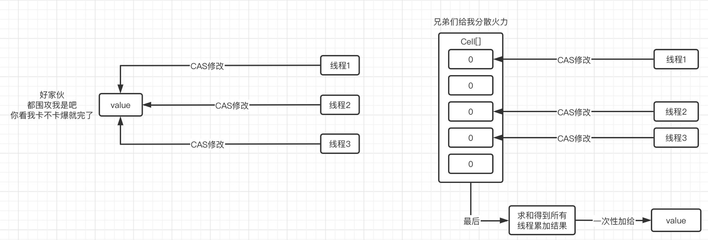

---

##### ⅥABA问题

+ CAS算法实际上是比较当前的字段值与我们线程给它的期望值是否一致，如果一致他就会执行操作
+ 但是这样实际上会导致一些问题
  + 线程A和线程B同时对字段a进行修改，a的初始值为1
  + 线程B希望通过CAS将a的值改为2，它给CAS传递的期望值是1
  + 但是线程B执行的比较慢，在它开始CAS之前，线程A先进行了修改，它修改了两次，第一次把a的值改为了2，第二次又改成了1
  + 这样轮到线程B执行时，它通过CAS比较a的值，发现与期望值是一致的，就把它改成了2
  + **这种情况下的CAS操作无法判断字段是否在之前已经被修改过，只会通过期望值进行比较，只要期望值一致，就会操作**。这种问题被称为ABA问题
+ 为了避免出现ABA问题，可以利用版本号机制来进行解决
  + 在CAS操作进行比较时，它不仅需要比较当前的值是否与期望值相同，还需要比较当前字段的版本号与期望的版本号是否一致，如果全都一致才进行操作
  + 每个线程在对字段执行完操作后，都要修改其版本号
+ JUC的原子类中，有一个AtomicStampedReference类可以支持版本号机制的CAS操作，该类就是使用版本号机制进行更新的原子引用类
+ [样例](../源码/JUC/BasicJUC/src/test/java/AtomicClassTest.java)

---

#### ③并发容器

+ 在[Java笔记](./Java笔记.md)中已经提到，`java.util`包下提供的集合框架类大部分都是线程不安全的，而线程安全的`HashTable`和`Vector`都是JDK1.0的老东西了，它们之所以线程安全是因为全都是使用的`synchronized`来保证同步，因此效率过于低下，在目前的开发中也几乎没有人在使用它们两个类
+ JUC提供了一些专门在并发的情况下还能保证线程安全的集合框架，它们的效率更高，也更好使

##### ⅠCopyOnWriteArrayList

+ JUC提供的与List相关的并发容器是`CopyOnWriteArrayList`，它也是通过synchronized进行的同步，不过至少比Vector要强
+ [样例](../源码/JUC/BasicJUC/src/test/java/ConcurrentCollectionMapTest.java)

---

##### ⅡConcurrentHashMap

+ ConcurrentHashMap是专门针对HashMap设计的并发容器
  + 虽然HashMap可以添加`null->null`类型的键值对，但是ConcurrentHashMap不支持，而且其key和value都不支持空
+ [样例](../源码/JUC/BasicJUC/src/test/java/ConcurrentCollectionMapTest.java)

---

##### Ⅲ阻塞队列

+ 除了Map和List的并发容器外，JUC还提供了阻塞队列用于不同的工作场景
  + ArrayBlockingQueue:有界带缓冲队列（队列有容量可以存数据，队列满了以后就没办法再存了，只能把申请存入的线程阻塞住）
  + SynchronousQueue:无缓冲阻塞队列（队列没有容量，线程会直接阻塞直到另外一个线程来消费该线程的数据。这就意味着生产者和消费者必须匹配才能从阻塞状态中恢复过来）
  + LinkedBlockingQueue:无界带缓冲阻塞队列（该队列没有容量限制，也会阻塞），它使用锁保证原子性
  + LinkedTransferQueue:无界阻塞队列，它结合了LinkedBlockingQueue和SynchronousQueue的优点，使其既有容量又不使用锁，性能更高
  + PriorityBlockingQueue:支持优先级的有界阻塞队列（就是可以排序），元素的获取顺序按照其优先级决定，如果优先级一样，那么按照队列的特性，先入先出
  + DelayQueue:支持延时和优先级的有界阻塞队列
+ 这些队列都实现了BlockingQueue接口，因此它们一般都支持如下方法:

|归属|方法|参数|描述|返回值|返回值类型|异常|备注|样例|
|:---:|:---:|:---:|:---:|:---:|:---:|:---:|:---:|:---:|
|**BlockingQueue<E>**|`add(E e)`|e:想添加进队列的的元素|向阻塞队列添加元素|成功返回true，**如果队列已满会抛出IllegalStateException异常**，官方推荐使用offer|boolean|无|无|[样例](../源码/JUC/BasicJUC/src/test/java/BlockingQueueTest.java)|
|^|`offer(E e)`|e:想添加进队列的的元素|向队列添加元素，不会阻塞线程|如果队列已满返回false,否则返回true|boolean|无|无|^|
|^|`offer(E e, long timeout, TimeUnit unit)`|e:想添加进队列的的元素 timeout:指定超时时间 unit:指定时间单位|向队列添加元素，如果队列已满会阻塞线程|若阻塞超时或线程被打断，以及添加失败，那么返回false,否则返回true|boolean|InterruptedException|无|^|
|^|`put(E e)`|e:想添加进队列的的元素|向队列添加元素，如果线程已满会阻塞线程直到添加成功|无返回值|void|InterruptedException|无|^|
|^|`take()`|无参|得到阻塞队列的第一个元素，如果队列为空会一直阻塞线程直到获得元素为止|队列的第一个元素|E|InterruptedException|无|^|
|^|`poll(long timeout, TimeUnit unit)`|timeout:指定超时时间 unit:指定时间单位|得到阻塞队列的第一个元素，如果队列为空会阻塞线程直到超时、中断或成功获得元素|如果获取失败，返回null，成功则返回正常的第一个元素|E|InterruptedException|无|^|
|^|`remainingCapacity()`|无参|得到该队列在理想情况下还能放多少元素|数值，如果没有固定限制，返回`Integer.MAX`|int|无|无|^|
|^|`remove(Object o)`|e:想移除的元素|移除一个指定的元素|成功返回true|boolean|无|无|^|
|^|`contains(Object o)`|o:想检查的元素|检查队列是否存在指定元素|存在返回true|boolean|无|无|^|
|^|`drainTo(Collection<? super E> c)`|c:用来接收队列元素的集合|得到队列中的所有可用元素，并将这些元素从队列中移除|实际向集合中添加的元素数量(添加了并不代表能加进去，如果出现异常的话，比如加了5个进去，有2个加的时候出现异常了，那么返回5，但是集合内的元素量只有3)|int|无|如果在向集合中添加元素时出现异常，那么该元素可能既不在队列中也不在集合中|^|
|^|`drainTo(Collection<? super E> c, int maxElements)`|e:用来接收队列元素的集合 maxElements:限制得到的元素最大数量|得到队列中最多`maxElememnts`个可用元素，并将这些元素从队列中移除|^|int|无|^|^|
|**Delayed**|`getDelay(TimeUnit unit)`|unit:用来进行时间转换的TimeUnit对象|得到还需要多长时间的延时才能继续向下执行，时间单位是方法参数所指定的时间单位|数值|long|无|无|^|

---

#### ④线程池

+ 类似于数据库连接池一样，JUC也提供了线程池来使我们可以复用线程进行相关的操作，而不需要再频繁的创建和销毁线程了

##### ⅠThreadPoolExecutor

+ ThreadPoolExecutor是JUC提供的线程池类
  + 线程池内的线程数量在达到核心线程池大小前，在收到请求时会一直创建新线程执行，**达到核心线程池大小之后才开始复用之前的线程**
  + 线程池内的线程在执行**请求出现异常**后，该线程会被**销毁**，再次执行请求时会**新创建一个线程**出来
  + 在ThreadPoolExecutor构造器中可以指定ThreadFactory线程工厂对象，自定义线程的创建流程
  + 在ThreadPoolExecutor构造器中可以指定RejectedExecutionHandler接口对象来实现拒绝策略，当线程池和等待队列都没办法继续处理请求时，此时会使用该对象进行拒绝策略的处理，ThreadPoolExecutor提供了**四种拒绝策略**（都是其内部类），由于该接口是一个函数式接口，也可以使用lambda表达式来自定义拒绝策略
    + `AbortPolicy`(默认):直接抛异常
    + `CallerRunsPolicy`:直接让提交任务的线程运行这个任务。
    + `DiscardOldestPolicy`:丢弃队列中最先到的，然后调用`execute`方法尝试分配线程执行或入队。
    + `DiscardPolicy`:什么也不做。
|归属|方法|参数|描述|返回值|返回值类型|异常|备注|样例|
|:---:|:---:|:---:|:---:|:---:|:---:|:---:|:---:|:---:|
|**ThreadPoolExecutor**|`ThreadPoolExecutor(int corePoolSize,int maximumPoolSize,long keepAliveTime,TimeUnit unit,BlockingQueue<Runnable> workQueue,ThreadFactory threadFactory,RejectedExecutionHandler handler)`|**corePoolSize**:核心线程池大小，在线程数量未达到该大小时，线程池会一直创建线程直到达到该大小，才尝试去复用线程 **maximumPoolSize**:最大线程池大小，当核心线程数到达上限且全在执行且等待队列已满时，如果还有请求，此时线程池会继续创建线程直到线程数到达最大线程池大小，这些新创建出来的线程是非核心线程，运行完毕后一段时间如果没有再复用，会自动销毁 **keepAliveTime**:非核心线程空闲存在的最大时间 **unit**:指定时间单位 **workQueue**:指定阻塞队列 **threadFactory**:指定线程创建工厂对象，通过该对象可以干涉线程池中线程的创建过程，进行自定义操作 **handler**:当线程池和等待队列都没办法继续处理请求时，此时会使用该对象进行拒绝策略的处理|构造器|线程池对象|ThreadPoolExecutor|无|该类一共有四个构造器，这里挑了参数最多的一个|[样例](../源码/JUC/BasicJUC/src/test/java/ThreadPoolTest.java)|
|^|>|>|>|>|>|>|构造器参数的getter、setter方法|^|
|^|`execute(Runnable command)`|command:想让线程执行的操作|让线程池复用一个空闲线程或创建一个线程来执行该操作|无返回值|void|无|无|^|
|^|`submit(Callable c)`|c:有返回值的操作,Callable是一个函数式接口|该方法可以得到线程执行完毕后操作的返回值|存有返回值的Future对象|Future|无|无|^|
|^|`submit(Runnable task, T result)`|task:要执行的操作 result:操作执行完毕后要返回的值|^|^|^|无|无|^|
|^|`submit(Runnable task)`|task:要执行的操作|^|带有null返回值的Future对象|^|无|无|^|
|^|`getPoolSize()`|无参|得到当前线程池内的线程数量|数值|int|无|无|^|
|^|`awaitTermination(long timeout, TimeUnit unit)`|timeout:超时时间 unit:时间单位|使调用它的线程在该线程池对象关闭时被唤醒，在此线程池关闭到其调用该方法期间，线程会一直等待|如果超时线程池还未关闭，返回false|boolean|InterruptedException|无|^|
|^|`shutdown()`|无参|有序关闭，即将等待队列中的请求执行完毕再关闭线程池|无返回值|void|无|无|^|
|^|`shutdownNow()`|无参|尝试终止正在运行的线程，取消等待队列的请求，拒绝接收新的请求，直接关闭线程池|被取消的等待队列的请求操作组成的List集合|List<Runnable>|无|无|^|

---

##### ⅡExecutors

+ Excutors工具类可以帮助我们快速的创建对应的线程池
+ 它的大部分方法都是静态方法，可以直接通过类名来调用

|归属|方法|参数|描述|返回值|返回值类型|异常|备注|样例|
|:---:|:---:|:---:|:---:|:---:|:---:|:---:|:---:|:---:|
|**Executors**|`newFixedThreadPool(int nThreads)`|nThreads:指定线程池的容量|得到一个固定容量的线程池|线程池对象|ThreadPoolExecutor|无|**静态方法**|该类的方法大部分都是得到线程池对象，此处不演示样例|
|^|`newSingleThreadExecutor()`|无参|得到一个只有一个容量的线程|线程池对象|FinalizableDelegatedExecutorService|无|1.**静态方法** 2.这里并未返回ThreadPoolExecutor对象是因为ThreadPoolExecutor对象可以在线程池运行时调整其各项属性，经过封装的FinalizableDelegatedExecutorService对象可以防止对线程池属性的修改|^|
|^|`newCachedThreadPool()`|无参|得到一个没有容量限制的只能运行非核心线程的线程池对象|线程池对象|ThreadPoolExecutor|无|**静态方法**|^|
|^|`newScheduledThreadPool(int corePoolSize)`|corePoolSize:指定核心线程池容量|得到一个指定核心线程容量，最大线程容量为Integer.MAX的延时线程池对象|线程池对象|ScheduledExecutorService|无|无|^|

---

##### ⅢFuture

+ 传统的线程执行完毕后，由于Runnable接口定义的run方法返回值类型为void，导致我们无法得到线程执行完毕后的返回值
+ 使用ThreadPoolExecutor的submit方法，可以使我们得到线程操作执行完毕后的返回值

|归属|方法|参数|描述|返回值|返回值类型|异常|备注|样例|
|:---:|:---:|:---:|:---:|:---:|:---:|:---:|:---:|:---:|
|**Future**|`get()`|无参|得到线程执行完毕后的返回值，如果线程尚未执行完毕，阻塞该线程直到对应线程执行完毕|>|取决于线程的返回值|InterruptedException, ExecutionException|无|[样例](../源码/JUC/BasicJUC/src/test/java/ThreadPoolTest.java)|
|^|`isCanclled()`|无参|检查该future对应的线程是否被取消|如果被取消返回true|boolean|无|无|^|
|^|`isDone()`|无参|检查该future对应的线程是否已经执行完毕|如果执行完毕返回true|boolean|无|无|^|
|^|`cancel(boolean mayInterruptIfRunning)`|mayInterruptIfRunning:如果为true那么方法将尝试取消线程的任务执行|尝试取消方法的任务执行|如果成功取消返回true|boolean|无|此方法的返回值并不能代表方法是否已经被取消，例如，当两个或多个线程对同一个future调用该方法时，方法仅保证至少有一个线程返回true|^|
|^|`get(long timeout, TimeUnit unit)`|timeout:超时时间 unit:时间单位|得到线程执行完毕后的返回值，如果线程尚未执行完毕，最多阻塞该线程参数设置的时间然后唤醒线程继续执行|>|取决于线程的返回值|InterruptedException, ExecutionException|无|^|

---

##### ⅣScheduledThreadPoolExecutor

+ ScheduledThreadPoolExecutor是ThreadPoolExecutor的子类，它的阻塞队列全都采用的是延时队列，但并未采用`DelayQueue`，而是使用的内部类`DelayedWorkQueue`。且其最大线程容量都被设置为了Integer.MAX

|归属|方法|参数|描述|返回值|返回值类型|异常|备注|样例|
|:---:|:---:|:---:|:---:|:---:|:---:|:---:|:---:|:---:|
|**ScheduledExecutorService**|`schedule(Runnable command,long delay, TimeUnit unit)`|command:需要执行的操作 delay:延迟时间 unit:时间单位|使操作在延迟指定时长后才开始执行|Future对象|ScheduledFuture，该类型同时继承了Delayed和Future接口，可以用它来调用`getDelay()`方法查看当前还需要延时多长时间才能执行操作|无|无|[样例](../源码/JUC/BasicJUC/src/test/java/ThreadPoolTest.java)|
|^|`scheduleAtFixedRate(Runnable command,long initialDelay,long period,TimeUnit unit)`|command:要执行的操作 initialDelay:第一次执行操作时延迟的时间 period:下一次操作开始执行和上一次操作开始执行所间隔的时间 unit:时间单位|延时并循环执行对应操作|Future对象|ScheduledFuture<?>|无|两次操作的间隔时间是**从上一次操作开始执行来计算**的，如果上一次操作执行已经超过了该时间，那么下一次操作在上一次操作执行完毕后立刻开始执行|^|
|^|`scheduleWithFixedDelay(Runnable command,long initialDelay,long period,TimeUnit unit)`|command:要执行的操作 initialDelay:第一次执行操作时延迟的时间 period:下一次操作开始执行和上一次操作结束执行所间隔的时间 unit:时间单位|^|^|^|无|下一次操作必须等待上一次操作执行完毕后再延时`period`时间才开始执行|^|

---

#### ⑤并发工具类

##### ⅠCountDownLatch

+ CountDownLatch可以用来进行多任务的同步，它的应用场景如下:
  + 现在有10个任务，每个任务都被分配到一个线程在跑，我们并不知道它们的运行结束时间，但是我们需要等待它们全都完成后直接将它们的任务结果进行合并
  + 上面场景的难点在于如何判断这10个任务都做完了，而CountDownLatch就可以轻松实现该目标
  + 它解决该问题的原理是，有多少个任务，它的count就置为几，当线程完成其任务时，线程执行其`countDown`方法会使其count-1,当count被减为0时，就意味着所有线程都执行完了，此时它就会唤醒所有正在等待这些线程执行完毕的线程
+ CountDownLatch的使用是一次性的，也是不可逆的，当其count转为0或减少时，它无法再回滚回去，它只能用一次

|归属|方法|参数|描述|返回值|返回值类型|异常|备注|样例|
|:---:|:---:|:---:|:---:|:---:|:---:|:---:|:---:|:---:|
|**CountDownLatch**|`CountDownLatch(int count)`|count:初始count值|CountDownLatch的构造器|CountDownLatch对象|CountDownLatch|无|无|[样例](../源码/JUC/BasicJUC/src/test/java/ThreadToolTest.java)|
|^|`countDown()`|无参|如果count>0,那么使count-1,如果count=0,那么什么也不做，如果count-1后变成了0，那么唤醒所有调用了其await方法而等待的线程|无返回值|void|无|无|^|
|^|`await()`|无参|等待CountDownLatch的count减为0，在此期间线程会被阻塞|无返回值|void|无|无|^|
|^|`await(long timeout, TimeUnit unit)`|timeout:超时时间 unit:时间单位|在超时时间区间内等待CountDownLatch的count减为0，在此期间线程会被阻塞，达到超时时间后不再等待，继续执行|^|^|无|无|^|
|^|`getCount()`|无参|得到当前count的值|数值|long|无|无|^|

---

##### ⅡCyclicBarrier

+ CyclicBarrier是一个可以反复使用的计数同步工具
  + 其构造器可以确定当等待的线程达到多少个时，把这些线程全部唤醒然后重置CyclicBarrier对象的状态
  + 它的作用是使一定数量的线程（无论什么时候开始执行的）在同一时间开始同步运行
  + 它可以通过`reset()`方法来手动重置CyclicBarrier对象状态
  + 也可以通过`getNumberWaiting()`和`getParties()`来在线程运行时得到当前等待的线程数和冲破壁障的阈值

|归属|方法|参数|描述|返回值|返回值类型|异常|备注|样例|
|:---:|:---:|:---:|:---:|:---:|:---:|:---:|:---:|:---:|
|**CyclicBarrier**|`await()`|无参|使当前线程进入等待状态，直到线程数量达到对象设置的阈值|无返回值|void|无|无|[样例](../源码/JUC/BasicJUC/src/test/java/ThreadToolTest.java)|
|^|`reset()`|无参|重置CyclicBarrier对象的状态，把等待中的线程全部中断并让其抛出BrokenBarrierException|无返回值|void|无|无|^|
|^|`getNumberWaiting()`|无参|得到正在等待的线程数量|数值|int|无|无|^|
|^|`getParties()`|无参|得到冲破壁障需要到达的阈值|数值|int|无|无|^|

---

##### ⅢSemaphore

+ Semaphore类似于操作系统中的信号量机制
  + 它用来保证某个资源同一时间能够被访问的最大线程数。
  + 通过其构造器来设置该对象初始所拥有的许可证总数
  + 每个线程在执行时，如果想要获取指定资源，需要向Semaphore申请指定数量个许可证，当申请的许可证大于当前Semaphore对象所拥有的许可证数量时，线程将阻塞直到Semaphore对象能够分配这么多许可证给它

|归属|方法|参数|描述|返回值|返回值类型|异常|备注|样例|
|:---:|:---:|:---:|:---:|:---:|:---:|:---:|:---:|:---:|
|**Semaphore**|`acquire(int permits)`|permits:想获取的许可证数量|获取指定数量的许可证|无返回值|void|InterruptedException|无|[样例](../源码/JUC/BasicJUC/src/test/java/ThreadToolTest.java)|
|^|`release(int permits)`|permits:想释放的许可证数量|释放指定数量的许可证|无返回值|void|无|无|^|
|^|`drainPermits()`|无参|一次性获取当前可用的全部许可证|数值|获得的许可证数量|无|无|^|
|^|`availablePermits()`|无参|获取当前还可以分配的的许可证数量|数值|int|无|无|^|
|^|`hasQueuedThreads()`|无参|判断是否存在线程在等待分配许可证|存在返回true|boolean|无|无|^|
|^|`getQueueLength()`|无参|估计当前正在等待获取许可证的线程数量|数值|int|无|这是一个估计值|^|

---

##### ⅣExchanger

+ `Exchanger<V>`可以使两个线程之间进行数据的交换

|归属|方法|参数|描述|返回值|返回值类型|异常|备注|样例|
|:---:|:---:|:---:|:---:|:---:|:---:|:---:|:---:|:---:|
|**Exchanger**|`exchange(V x)`|x:想传递给另一个线程的值|交换数据，如果另一个线程还未执行该方法，那么当前线程会阻塞直到另一个线程调用该方法|另一个线程传递过来的值|V|InterruptedException|无|[样例](../源码/JUC/BasicJUC/src/test/java/ThreadToolTest.java)|

---

##### ⅤFork/Join框架

+ JDK7时，JUC提供了Fork/Join框架来利用多核CPU执行**并行**任务（注意是并行不是并发），它利用多线程的特性将一个大任务分解成多个小任务交给多个线程去并行执行，该框架可以实现:
  + 任务分解：将大任务分解成多个小任务并行执行。
  + 工作窃取：线程在空闲时可以从其他线程的任务队列中窃取任务执行，以提高并行度和负载均衡。
+ 想要使用Fork/Join框架，一般需要
  + 先创建一个ForkJoinPool对象
  + 创建一个任务类，使其继承RecursiveTask类，并指明其泛型，该泛型为任务实际要操作的数据类型。**RecursiveTask类是ForkJoinTask类的子类**
  + 实现继承的RecursiveTask类声明的compute方法，用来指明任务的执行逻辑，即如何拆分任务、如何执行任务等
  + 根据自己创建的任务类创建对应的任务对象，然后调用ForkJoinPool对象的invoke方法执行该任务并得到任务的执行结果

|归属|方法|参数|描述|返回值|返回值类型|异常|备注|样例|
|:---:|:---:|:---:|:---:|:---:|:---:|:---:|:---:|:---:|
|**RecursiveTask<V>**|`compute()`|无参|向Fork/Join框架指明计算的具体逻辑，即拆分任务的评判标准、如何汇总任务结果、如何执行本任务|本次任务需要的的返回值|V|无|无|[样例](../源码/JUC/BasicJUC/src/test/java/ThreadToolTest.java)|
|**ForkJoinPool**|`invoke(ForkJoinTask<V> task)`|task:需要执行的任务对象|执行该任务|任务运行结果|取决于任务对象指定的泛型V|无|无|^|
|**FornJoinTask<V>**|`join()`|无参|等待任务执行完毕，并得到任务的运行结果|任务运行结果|取决于任务对象指定的泛型V|无|无|^|
|^|`fork()`|无参|将该任务分配给线程池的另一个线程执行，调用该方法后他会立刻返回值，调用它的线程会继续向下执行|该任务对象本身|ForkJoinTask<V>|无|无|^|

---

## 三、底层原理

### （一）队列同步器AQS

+ AQS(AbstractQueueSynchronizer)队列同步器负责实现各种类型的同步，它基于等待队列的设计可以实现复杂的同步控制逻辑
  + 它可以实现锁的获取、释放和其它操作，同时使用等待队列的设计来使多个线程来等待获取锁
+ 它的底层是使用双向链表来实现的:
  + 这个链表中的节点类型可能是不同的，即共享锁节点可能与排它锁节点在一起
    + 共享锁可以被多个线程获取（结合AQS源码推出结论），在`acquire`方法执行时，如果线程得到了共享锁，它还会唤醒链表后面的等待线程，让它们继续尝试获取锁，并把自己置为链表的头节点
      + 此时后面的线程如果还要获取共享锁，那么它获得后也会把自己置为头节点，然后唤醒它后面的线程，实现多个线程共享一把锁
      + 此时后面的线程如果要获取排它锁，那么他执行的是`tryAcquire`方法，该方法一般都是在state为0的情况下才能获取到的，但是之前获取共享锁的线程就决定了它无法获取排它锁，因此它会继续等待
    + 相较共享锁，排它锁不需要考虑那么多
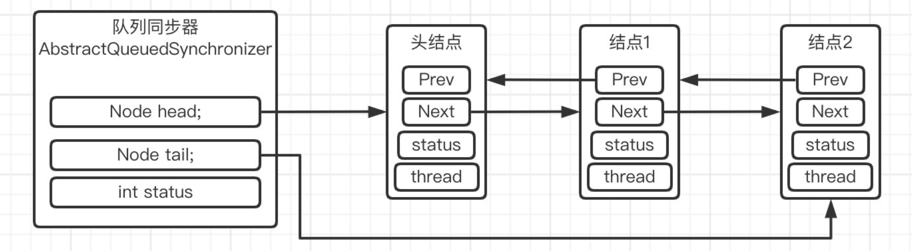
+ 根据JDK17的源码进行分析，其底层代码如下:

~~~java
    public abstract class AbstractQueuedSynchronizer extends AbstractOwnableSynchronizer implements java.io.Serializable {
        ...
        static final int WAITING   = 1;          // must be 1  必须是1，表示正在等待获取锁
        static final int CANCELLED = 0x80000000; // must be negative  取消状态，可能是因为超时或者打断而处于该状态，该值必须是负数
        static final int COND      = 2;          // in a condition wait  该值表示正在处于condition的等待状态

        abstract static class Node {
            volatile Node prev;       // initially attached via casTail  双向链表-指向之前的节点
            volatile Node next;       // visibly nonnull when signallable  双向链表-指向之后的节点
            Thread waiter;            // visibly nonnull when enqueued  正在等待的线程
            volatile int status;      // written by owner, atomic bit ops by others  当前节点的状态

            // methods for atomic operations
            // 下面的方法底层都是调用的C++层面的底层方法来直接通过内存进行值的设置，就是C++直接操控内存来使得对应节点的对应属性发生修改
            final boolean casPrev(Node c, Node v) {  // for cleanQueue
                return U.weakCompareAndSetReference(this, PREV, c, v);
            }
            final boolean casNext(Node c, Node v) {  // for cleanQueue
                return U.weakCompareAndSetReference(this, NEXT, c, v);
            }
            final int getAndUnsetStatus(int v) {     // for signalling
                return U.getAndBitwiseAndInt(this, STATUS, ~v);
            }
            final void setPrevRelaxed(Node p) {      // for off-queue assignment
                U.putReference(this, PREV, p);
            }
            final void setStatusRelaxed(int s) {     // for off-queue assignment
                U.putInt(this, STATUS, s);
            }
            final void clearStatus() {               // for reducing unneeded signals
                U.putIntOpaque(this, STATUS, 0);
            }

            // 这里通过Unsafe工具类来得到对应属性的偏移量
            private static final long STATUS
                = U.objectFieldOffset(Node.class, "status");
            private static final long NEXT
                = U.objectFieldOffset(Node.class, "next");
            private static final long PREV
                = U.objectFieldOffset(Node.class, "prev");
        }

        // 注意这里已经不是Node类中了，这里是AQS类内
        private transient volatile Node head;  // 记录Node链表的头结点

        /**
         * Tail of the wait queue. After initialization, modified only via casTail.
         */
        private transient volatile Node tail;  // 记录Node链表的尾节点

        /**
         * The synchronization state.
         */
        private volatile int state;  // 这个玩意是计数用的，用来统计这个锁当前的占用量
    }
~~~

+ 接下来我们根据ReentrantLock的公平锁，也就是其内部的FairSync来探究公平锁如何通过AQS进行上锁和解锁
  + 首先需要明确的是，ReentrantLock的操作都是通过其Sync类型的属性sync来进行操作的，而Sync是其内部类，它继承了AQS类
  + 同时，公平锁FairSync和非公平锁NoFairSync都继承了Sync类，并重写了Sync定义的`initialTryLock()`方法和AQS定义的`tryAcquire(int acquires)`方法
  + ReentrantLock根据构造器的参数来判断sync属性是公平锁实例还是非公平锁实例，默认是非公平锁，因为其效率更高

~~~java
    public class ReentrantLock implements Lock, java.io.Serializable {
        ...
        private final Sync sync;

        abstract static class Sync extends AbstractQueuedSynchronizer {
            // 上锁的方法
            @ReservedStackAccess
            final void lock() {
                if (!initialTryLock())
                    acquire(1);
            }
            // 定义的抽象方法，需要其子类具体实现
            abstract boolean initialTryLock();
        }
    }
~~~

#### ①公平锁上锁

+ 首先来看上锁方法，ReentrantLock对外暴露lock方法来进行上锁:

~~~java
    public void lock() {
        sync.lock();
    }
~~~

+ 而sync的lock方法是这样写的:
  + 它会让线程先尝试获取一下锁，如果未获取到再执行acquire方法
  + acquire方法又是先执行tryAcquire方法，不行再执行acquire的重载方法
  + 在acquire的重载方法内，最终执行的是将线程加入等待队列的代码:
    + 等待队列的代码内是一个无限循环，用来使线程自旋获得锁
    + 第一次循环，会试图获取锁，获取不到就会创建Node节点
    + 第二次循环（或更多循环），会试图获取锁，获取不到就会初始化等待队列
    + 第三次循环（或更多循环），会试图获取锁，获取不到就会试图向等待队列中添加本节点
    + 第四次循环（或更多循环），会试图获取锁，获取不到就会置node节点的状态为WAITING
    + 加入等待队列后，后面的循环会判断该节点是否是正在等待的第一个节点，如果是就尝试获得锁，如果拿到了就结束方法。如果不是，对于ReentrantLock来说，就会调用LockSupport的park方法使当前线程进入阻塞状态

~~~java
    // 此方法定义于Lock接口，这里展示的是ReentrantLock的实现
    @ReservedStackAccess  // 该注解用来告知JVM添加一些额外的空间，防止在多线程运行的时候出现栈溢出
    final void lock() {
        // 首先先尝试获取一下锁，如果未获取到再执行acquire方法
        if (!initialTryLock())
            acquire(1);
    }

    // 此方法位于ReentrantLock类中
    // 初始化尝试获得锁的方法，该方法包含了与其它线程抢夺锁或出现可重入的情况
    final boolean initialTryLock() {
        Thread current = Thread.currentThread();  // 得到当前线程
        int c = getState();  // 得到当前锁的state
        // 如果是0，那么就说明该锁还未被任何线程占用
        if (c == 0) {
            // 查看是否没有其它线程在尝试获取该锁调用底层CAS算法执行操作
            if (!hasQueuedThreads() && compareAndSetState(0, 1)) {
                setExclusiveOwnerThread(current);  // 把当前线程设置为拥有该锁的线程
                return true;  // 返回true
            }
        // 如果state不是0，那么判断当前拥有锁的线程是否与现在调用该方法的线程一致，由于ReentrantLock是支持可重入的，这里判断的是线程的可重入
        } else if (getExclusiveOwnerThread() == current) {
            if (++c < 0) // overflow  这里小于0是线程可重入太多导致int类型的state属性溢出，此时抛出异常
                throw new Error("Maximum lock count exceeded");
            setState(c);  // 正常情况下自增1后更新state值
            return true;  // 返回true
        }
        return false;  // 上面的条件都不满足，返回false
    }

    // 此方法位于AQS类中
    // 如果第一次获取锁未成功，那么acquire方法将被执行，传入的参数值固定为1
    public final void acquire(int arg) {
        // 先执行tryAcquire方法，如果不成功再执行下面重载的acquire方法
        if (!tryAcquire(arg))
            acquire(null, arg, false, false, false, 0L);
    }

    
    // 此方法于Reentrant类中实现，在AQS类中被定义
    protected final boolean tryAcquire(int acquires) {
        // 如果state值为0（表示无线程在占用）且当前线程是等待队列的头节点或等待队列为空且CAS操作成功
        // 那么就将当前线程设置为锁的占用线程，并返回true
        if (getState() == 0 && !hasQueuedPredecessors() &&
            compareAndSetState(0, acquires)) {
            //  该方法只会在state=0的时候才尝试占用锁，因此它不像initialTryLock方法一样调用setState方法，因为该方法只会使state从0变成1，而该操作是由CAS来完成的
            setExclusiveOwnerThread(Thread.currentThread());
            return true;
        }
        return false;  // 不满足返回false
    }

    // 此方法位于AQS类中
    // 好他妈长
    final int acquire(Node node, int arg, boolean shared,
                      boolean interruptible, boolean timed, long time) {
        Thread current = Thread.currentThread();  // 获取当前线程
        byte spins = 0, postSpins = 0;   // retries upon unpark of first thread  当第一个线程未能解除挂起时，尝试自旋等待的次数
        boolean interrupted = false, first = false;  // 是否被打断、是否是当前队列第一个等待的节点
        Node pred = null;                // predecessor of node when enqueued  pred是当前节点的上一个节点

        /*
         * Repeatedly:
         *  Check if node now first
         *    if so, ensure head stable, else ensure valid predecessor
         *  if node is first or not yet enqueued, try acquiring
         *  else if node not yet created, create it
         *  else if not yet enqueued, try once to enqueue
         *  else if woken from park, retry (up to postSpins times)
         *  else if WAITING status not set, set and retry
         *  else park and clear WAITING status, and check cancellation
         */
        // 开始执行该方法时，直接无限循环进入自旋
        for (;;) {
            // 该判断语句用来判断该节点是否为当前队列的第一个等待节点，第一个等待节点并不代表是队列的第一个节点，因此判断使用的是 head==pred而不是head==node
            // 另外，该语句每次在每次循环执行时都会更新first和pred的值
            if (!first && (pred = (node == null) ? null : node.prev) != null &&
                !(first = (head == pred))) {
                // 如果pred节点的status小于0，即表示其状态变为CANCELLED了，那么把它扔出去
                if (pred.status < 0) {
                    cleanQueue();           // predecessor cancelled  取消掉队列中那些已经处于CANCELLED的节点
                    continue;
                } 
                // 这里的意思是if判断的时候，线程的first是false，但是执行到这里的时候，因为是多线程运行的，可能前面的线程把锁释放了导致等待队列更新了，本线程就变成了第一个等待的节点了
                else if (pred.prev == null) {
                    Thread.onSpinWait();    // ensure serialization  这个静态方法是空体，但是其被一个@IntrinsicCandidate注解作用，根据官方的注释，HotSpot虚拟机会通过该注解得知当前线程正在自旋，它需要做些什么东西来优化自旋等待。另外，@IntrinsicCandidate注解仅能被Hot Spot虚拟机识别
                    continue;
                }
            }
            // 这里判断first是否为true或pred是否为空
            if (first || pred == null) {
                boolean acquired;
                // 代码块中用来尝试获取锁，成功的话会将acquired标记为true
                try {
                    // 如果想获取共享锁的话，调用tryAcquireShared方法尝试获取共享锁
                    if (shared)
                        acquired = (tryAcquireShared(arg) >= 0);
                    else
                        acquired = tryAcquire(arg);  // 尝试获取锁，ReentrantLock是排他锁，因此shared是false
                } catch (Throwable ex) {
                    cancelAcquire(node, interrupted, false);
                    throw ex;
                }
                // 如果获取锁成功而且是队列中第一个等待的节点的话才执行return跳出循环
                if (acquired) {
                    if (first) {
                        node.prev = null;
                        head = node;
                        pred.next = null;
                        node.waiter = null;
                        if (shared)
                            signalNextIfShared(node);
                        if (interrupted)
                            current.interrupt();
                    }
                    // 只要acquire成功了，就返回1，因为线程已经获取到了锁，就不用再进等待队列了
                    return 1;
                }
            }
            // 如果节点是null，即第一次循环，那么直接创建一个节点出来
            if (node == null) {                 // allocate; retry before enqueue
                // 若获取的是共享锁，那么创建共享锁节点出来，否则创建一个排它锁节点
                if (shared)
                    node = new SharedNode();
                else
                    node = new ExclusiveNode();
            }
            // 如果pred是null，即第二次循环节点创建出来了，但是未加入队列执行下面的语句 
            else if (pred == null) {          // try to enqueue
                // 设置该节点的一些属性
                node.waiter = current;
                Node t = tail;  // 得到当前的队列尾节点
                node.setPrevRelaxed(t);         // avoid unnecessary fence  使node的prev属性指向t，即先添加一条单向的node到t的链，此时可以从后向前遍历队列了
                // 如果t是null，那么说明队列都未创建，调用方法创建一个队列并初始化一个头结点，并使head和tail指向该初始化出来的节点
                if (t == null)
                    tryInitializeHead();
                // 使AQS的tail指针由当前的尾节点指向刚创建出来的node,为node加入队列尾做准备
                // 如果失败，将node的prev属性置空
                // 这里考虑的是下次循环的时候，可能中间切换了其它线程执行导致node的prev属性指向的t不再是队列的尾节点了
                // 即在此次CAS操作失败到下次循环执行到这里的过程中，其它线程也执行了相关的操作，使得其它线程的prve也指向了t，可能会导致冲突
                // 同时，如果其它线程比本线程先一步执行完，那么本线程的node对应的prev属性就不应该再是之前那个t了
                // 因此为了避免出现上面的问题，需要将node的prev先置空，下次循环执行到这里再具体赋值
                else if (!casTail(t, node))
                    node.setPrevRelaxed(null);  // back out
                // 如果CAS操作成功，说明node已经成功添加到队列尾，此时再添加由t到node的单向链，形成双链
                else
                    t.next = node;
            }
            // 如果是第一个正在等待的线程且spins有值，那么进入自旋等待
            else if (first && spins != 0) {
                --spins;                        // reduce unfairness on rewaits  每自旋一次就减1
                Thread.onSpinWait();  // 这个静态方法是空体，但是其被一个@IntrinsicCandidate注解作用，根据官方的注释，HotSpot虚拟机会通过该注解得知当前线程正在自旋，它需要做些什么东西来优化自旋等待。另外，@IntrinsicCandidate注解仅能被Hot Spot虚拟机识别
            } 
            // 如果当前节点的status的值是0，即表示当前节点刚刚创建，status还是取得默认值，需要给它一个明确的状态，赋成WAITING值，也就是1
            else if (node.status == 0) {
                node.status = WAITING;          // enable signal and recheck
            }
            // 该情况是在节点已经加入到队列之后才会进的，因为不加到队列里面，node和pred可能为null
            else {
                long nanos;
                spins = postSpins = (byte)((postSpins << 1) | 1);  // 这个spins不知道干嘛的
                // ReentrantLock的lock方法没有设置等待时间，因此timed为false，执行该方法
                // LockSupport.part方法用来使当前线程进入阻塞状态，之后线程将不会执行代码，直到其它线程调用LockSupport.unpark方法解除阻塞或Thread.interrupt方法终端线程的阻塞状态
                if (!timed)
                    LockSupport.park(this);
                // 下面这个就是看看线程是否设置了等待时间，如果设置了那么就进行有等待时间的阻塞
                else if ((nanos = time - System.nanoTime()) > 0L)
                    LockSupport.parkNanos(this, nanos);
                // 如果都没成立，那么直接跳出循环
                else
                    break;
                node.clearStatus();  // 把status置为0
                // 如果线程被打断且该锁支持线程打断打断，那么跳出循环
                if ((interrupted |= Thread.interrupted()) && interruptible)
                    break;
            }
        }
        return cancelAcquire(node, interrupted, interruptible);
    }

    // 该方法位于AQS类中
    // 该方法用于清除当前等待队列中已经处于CANCELLED状态的节点
    private void cleanQueue() {
        // 这个外层循环用来维持内层循环遍历完一整个等待队列
        for (;;) {
            // 内层循环从尾节点开始遍历，原因是acquire方法是先建立node指向当前尾节点tail的prev链，CAS操作完成后才建立的当前尾节点tail指向node的next链。也就是说它添加节点时，先建立的是向前的链，然后再建立的向后的链
            // q表示当前遍历到的节点，p表示prev，即当前节点的上一个节点，n表示next，即当前节点的下一个节点。s表示上次循环遍历到的节点                       
            for (Node q = tail, s = null, p, n;;) {
                // 这里先判断是否遍历到头了，到头就return结束方法
                // 同时给p赋值
                if (q == null || (p = q.prev) == null)
                    return;                      // end of list
                // 这里在判断代码执行到这里是否出现了等待队列指针不一致的问题，导致其不一致的原因可能是因为其它线程的执行更新了等待队列导致的
                // 比如其它线程由于获取不到锁进入了等待队列，在内层循环开始的时候，其它线程还未加入等待队列，执行到这里的时候，可能其它线程加进来了就导致tail指向了其它线程的节点而不指向刚开始循环的那个原来的tail节点了，而tail变了但是q没变，此时如果正好在第一次内循环中，就会导致出现s==null&&tail!=q的情况
                // 另外，如果其它线程也在执行该方法，且它率先完整遍历了一次队列并清除了不合法的节点，而被清除的节点中正好有当前线程执行的该方法内的q节点，那么根据下面的代码，就会出现s!=null&&s.prev!=q的情况了。另外，如果其它线程执行完解锁了，q指向的节点被移出了等待队列，或者出现了一些其它情况也更新了一下等待队列，也可能出现该情况
                // 最后就是s!=null&&s.status<0，这个就是之前判断的时候没处于CANCELLED状态，到这次代码执行的时候可能由于等待时间到了或者其它线程的interrupt等方法导致了s.status<0了
                if (s == null ? tail != q : (s.prev != q || s.status < 0))
                    break;                       // inconsistent  出现不一致现象需要跳出内循环重新遍历
                // 如果当前节点已经是CANCELLED状态了
                if (q.status < 0) {              // cancelled
                    // 如果s==null，那么说明此时在等待队列的尾部，直接CAS更新tail属性
                    // 如果s!=null，那么CAS更新s的prev属性
                    // 同时需要保证q.prev==p，确保一致性
                    if ((s == null ? casTail(q, p) : s.casPrev(q, p)) &&
                        q.prev == p) {
                        p.casNext(q, s);         // OK if fails  CAS更新p的next属性，让它指向s，也就是q.next
                        // 如果p.prev是null，那么说明p已经处在等待队列的最前面了，直接使用LockSupport.unpark唤醒它（该行代码在signalNext方法内）
                        if (p.prev == null)  
                            signalNext(p);
                    }
                    break;  // 跳出内循环重新遍历
                }
                // 这里也是判断是不是出现了不一致的问题，然后改
                if ((n = p.next) != q) {         // help finish
                    if (n != null && q.prev == p) {
                        p.casNext(n, q);
                        if (p.prev == null)
                            signalNext(p);
                    }
                    break;
                }
                s = q;  // 使s记住当前遍历到的节点，它在下一次循环时就会表示上一次循环遍历到的节点
                q = q.prev;  // 让q指针指向当前节点的前一个节点
            }
        }
    }
~~~

---

#### ②公平锁解锁

+ ReentrantLock的unlock方法如下:
  + 它的逻辑很简单
  + 先调用tryRelease方法，更新state的值并更新锁的exclusiveOwnerThread属性
  + 唤醒下一个等待中的队列线程

~~~java
  public void unlock() {
      sync.release(1);  // 传入的参数固定为1
  }
  // 该方法位于AQS类中
  public final boolean release(int arg) {
      // 先调用tryRelease方法尝试释放锁
      if (tryRelease(arg)) {
          signalNext(head);  // 释放成功后唤醒下一个节点
          return true;
      }
      return false;
  }

  @ReservedStackAccess
  protected final boolean tryRelease(int releases) {
      int c = getState() - releases;  // 把state-1
      // 判断调用该方法的线程是否持有锁，没有就报错
      if (getExclusiveOwnerThread() != Thread.currentThread())
          throw new IllegalMonitorStateException();
      boolean free = (c == 0);  // free表示当前锁是否已经没有线程占用了
      // 如果free是true,那么把锁的对应属性置空
      if (free)
          setExclusiveOwnerThread(null);
      setState(c);  // 更新state
      return free;
  }
~~~

---

#### ③公平锁是否公平

+ 在tryAcquire方法中，明确使用了hasQueuedThreads方法作为判断条件，不过判断条件是`!hasQueuedThreads()`，该判断条件的意思是**判断当前线程是否为等待队列的第一个正在等待的节点或者判断等待队列是否为空**，也就是说如果满足该条件，线程就会去尝试获取锁
+ 而我们根据判断条件可以分析，只要等待队列是空的，那么执行到该方法的线程就会去尝试获得锁:
  + 假设线程A正占用锁进行操作
  + 线程B此时来获取锁了，但是线程A占用着锁，线程B几次获取不到，就尝试加入等待队列，由于此时等待队列是空的，因此需要初始化等待队列并将线程B加进去
  + 然而线程B还没有初始化好等待队列，线程C就来了，而且线程C已经执行到了判断条件
  + 此时线程A完成了释放，但是线程B还没有加进等待队列里面，而线程C恰好发现等待队列是空的并执行CAS操作成功了
  + 最后线程A用完锁之后，锁就被线程C占用了，线程B只能加入到等待队列等线程C释放锁它才能用
+ 根据上面的例子，我们发现**公平锁的公平只是当存在等待队列时才公平**

~~~java
    protected final boolean tryAcquire(int acquires) {
        // 这里的判断条件包含!hasQueuedPredecessors()
        if (getState() == 0 && !hasQueuedPredecessors() &&
            compareAndSetState(0, acquires)) {
            // 设置占用锁的线程
            setExclusiveOwnerThread(Thread.currentThread());
            return true;
        }
        return false;
    }
    // 来看看hasQueuedPredecessors的具体实现
    // 我们假定线程B此时刚刚初始化完成等待队列，此时其head与tail是相等的，因为线程B所在节点还未添加进等待队列
    public final boolean hasQueuedPredecessors() {
        Thread first = null; Node h, s;
        // 这里先判断head!=null，是true
        // 接下来判断h.next==null，很明显也是true,因为线程B节点还没有加进去
        // 这样判断结果直接为true，然后调用getFirstQueuedThread方法拿到线程，问题是一个刚初始化完的等待队列的线程根本就没有线程对象可以给它
        if ((h = head) != null && ((s = h.next) == null ||
                                   (first = s.waiter) == null ||
                                   s.prev == null))
            first = getFirstQueuedThread(); // retry via getFirstQueuedThread
        return first != null && first != Thread.currentThread();
    }
    // 看看该方法是怎么获得线程对象的
    public final Thread getFirstQueuedThread() {
        Thread first = null, w; Node h, s;
        // 判断条件与上面方法的判断条件完全一致，直接就true了
        if ((h = head) != null && ((s = h.next) == null ||
                                   (first = s.waiter) == null ||
                                   s.prev == null)) {
            // 这里满足条件以后，从尾部向前遍历
            for (Node p = tail, q; p != null && (q = p.prev) != null; p = q)
                // 如果当前节点的waiter属性不为null，那么更新first
                // 此时线程B刚刚把等待队列初始化完，根本不可能会有值，因此这里不可能赋上值
                if ((w = p.waiter) != null)
                    first = w;
        }
        return first;  // 最后返回first，也就是返回个null回去
    }

    // 再看看线程B执行到的进度
    final int acquire(Node node, int arg, boolean shared,boolean interruptible, boolean timed, long time) {
      ...

      else if (pred == null) {

          node.waiter = current;
          Node t = tail;
          node.setPrevRelaxed(t);
          // 假设线程B执行完了这段代码
          if (t == null)
              tryInitializeHead();  // 初始化等待队列
          ...
      }
    }

    // tryInitializeHead实际上就是初始化等待队列的方法，它只是简单的创建了一个头结点，并将尾节点也指向该节点了
    private void tryInitializeHead() {
        Node h = new ExclusiveNode();  // ExclusiveNode继承自Node，这个类里面什么也没有，完全就是继承了Node，那么此时它节点的prev、next、status、waiter就完全是默认值，全是null（status是0）
        if (U.compareAndSetReference(this, HEAD, null, h))
            tail = h;
    }

~~~

---

#### ④await原理

+ Condition的await方法可以用来替代传统的wait方法，对于Condition来说，在AQS中维护了一个单向链表来记录被await作用的而处于等待状态的节点
+ 由于锁对象可以创建多个Condition对象，因此每个Condition对象都有自己的一条链表
+ 在ReentrantLock中，创建的Condition对象实际上是通过sync属性创建的，而sync属性调用方法返回的condition对象实际上是AQS类内部的ConditionObject对象
  + 该类维护了两个属性
    + firstWaiter:指向链表的头结点
    + tailWaiter:指向链表的尾节点
  + 这两个属性都是ConditionNode类型的，该类型就是Condition链表的节点类型，它继承自Node节点，并添加了一个nextWaiter属性用来指向该节点的下一个节点。
  + **Condition链表是单向的**，虽然它也有指向尾节点的指针，但是它是单向的

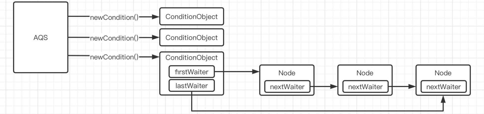

+ 对于await方法来说，其目的是
  + 释放锁，并使线程进入等待状态
  + 当其它线程调用signal方法时才会唤醒等待中的线程
  + 被唤醒后还需要重新获取锁才能执行
+ 另外，await方法还需要调用该方法的线程本身占用锁

~~~java
    
    public final void await() throws InterruptedException {
        // 如果线程已经被打断了，那么直接抛异常
        if (Thread.interrupted())
            throw new InterruptedException();
        ConditionNode node = new ConditionNode();  // 创建一个conditionNode节点
        int savedState = enableWait(node);  // 将node节点添加进condition队列中，并释放锁，同时记录之前占用的锁的数量
        LockSupport.setCurrentBlocker(this); // for back-compatibility  设置当前线程的阻塞器
        boolean interrupted = false, cancelled = false, rejected = false;
        // while循环会先检查该节点是否还可以重新获取锁，如果无法获取再进循环体
        while (!canReacquire(node)) {
            // 这里是被打断的情况
            if (interrupted |= Thread.interrupted()) {
                // 给cancelled赋值并跳出循环
                if (cancelled = (node.getAndUnsetStatus(COND) & COND) != 0)
                    break;              // else interrupted after signal
            } 
            // 如果node的status不为0
            else if ((node.status & COND) != 0) {
                try {
                    // 如果rejected不为true，这里不出异常的话rejected一直是false
                    if (rejected)
                        // 调用block方法阻塞线程
                        node.block();
                    else
                        // 调用此方法来处理当前node
                        ForkJoinPool.managedBlock(node);
                } catch (RejectedExecutionException ex) {
                    rejected = true;  // 碰到该异常将rejected置为true，该异常与线程池有关
                } catch (InterruptedException ie) {
                    interrupted = true;  // 如果线程被打断，那么将interrupted置为true
                }
            }
            // 上面的情况都不满足，那么调用Thread的onSpinWait方法，它用来告诉Hot Spot虚拟机该线程正在自旋，希望虚拟机优化一下自旋操作，该方法在Java程序层面没有任何代码执行 
            else
                Thread.onSpinWait();    // awoke while enqueuing
        }
        LockSupport.setCurrentBlocker(null);  // 解除线程的阻塞器
        node.clearStatus();  // 将node的status属性置为0
        acquire(node, savedState, false, false, false, 0L);  // 将node加入等待队列
        // 被打断的处理
        if (interrupted) {
            if (cancelled) {
                unlinkCancelledWaiters(node);
                throw new InterruptedException();
            }
            Thread.currentThread().interrupt();
        }
    }

    // 该方法用来释放锁、将node节点加入Condition队列同时返回该线程占用的该锁的数量
    private int enableWait(ConditionNode node) {
        // ReentrantLock给出的isHeldExclusively()方法是判断当前线程是否占用着当前的锁，如果占用着才返回true
        // 这里对应await方法的条件:线程只有在占用锁的情况下才能调用await方法
        if (isHeldExclusively()) {
            node.waiter = Thread.currentThread();  // 将线程加入到节点中
            node.setStatusRelaxed(COND | WAITING);  // 设置node的status值，COND|WAITING=3
            ConditionNode last = lastWaiter;  // 得到Condition链表的的尾节点
            // 如果last为空，那么将该node作为头节点加入链表
            if (last == null)
                firstWaiter = node;  
            else
                last.nextWaiter = node;  // 否则把它加到链表后面
            lastWaiter = node;  // 更新lastWaiter
            int savedState = getState();  // 得到该线程占用的该锁的数量
            // 调用release方法释放指定数量的锁
            if (release(savedState))
                return savedState;  // 成功返回保存的线程原来占有的锁的数量
        }
        // 如果线程未占用锁，将其status置为CANCELLED，同时抛出异常
        node.status = CANCELLED; // lock not held or inconsistent
        throw new IllegalMonitorStateException();
    }

    // canReacquire方法用来检查线程是否可以重新获取锁
    // 当node不为空、node的prev属性不为空且在等待队列能够找到该节点时，方法返回true
    private boolean canReacquire(ConditionNode node) {
        // check links, not status to avoid enqueue race
        // isEnqueued方法会从后向前在等待队列中寻找该节点，如果找到了那么返回true
        return node != null && node.prev != null && isEnqueued(node);
    }

    // 该方法位于ForkJoinPool类中
    public static void managedBlock(ManagedBlocker blocker)
        throws InterruptedException {
        Thread t; ForkJoinPool p;
        // 这个东西与Fork/Join框架相关，如果是一个普通的Thread线程，那么该if判断必定为false
        if ((t = Thread.currentThread()) instanceof ForkJoinWorkerThread &&
            (p = ((ForkJoinWorkerThread)t).pool) != null)
            p.compensatedBlock(blocker);
        else
            // 普通的Thread线程走这里
            unmanagedBlock(blocker);
    }

    private static void unmanagedBlock(ManagedBlocker blocker)
        throws InterruptedException {
        // 如果node节点是空的，那么抛出异常
        if (blocker == null) throw new NullPointerException();
        do {} while (!blocker.isReleasable() && !blocker.block());  // 调用isReleasable和block方法执行
    }

    // 该方法于ForkJoinPool类中的内部静态接口ManagedBlocker中被定义
    // AQS的内部类ConditionNode（继承自Node）实现了接口，并实现了该方法
    // 该方法的目的是检查线程是否不需要再处于阻塞状态，如果线程的情况不需要再处于阻塞状态了，返回true
    public final boolean isReleasable() {
        // 如果当前节点的status<=1（即处于WAITING或CANCELLED状态）或当前节点的线程被打断，则返回true
        return status <= 1 || Thread.currentThread().isInterrupted();
    }

    // 该方法于ForkJoinPool类中的内部静态接口ManagedBlocker中被定义
    // AQS的内部类ConditionNode（继承自Node）实现了接口，并实现了该方法
    public final boolean block() {
        // 这里只要isReleasable方法返回false就一直执行，即当线程一直需要处于阻塞状态时就一直执行，且循环体内调用了LockSupport.park方法使线程阻塞
        // 该方法最终会使线程被阻塞
        while (!isReleasable()) LockSupport.park();
        return true;
    }
~~~

+ 根据await源码的分析来看
  + await方法会先创建ConditionNode节点，然后释放当前线程的锁，将node节点加入到Condition链表中并记录当前线程占用的锁的数量，方便以后被唤醒后重新占用指定数量的锁
  + 接下来就是让线程进入自旋等待状态，或者最终调用LockSupport.park方法让其进入阻塞状态
  + 最后被唤醒时重置node的status、并把它加入到等待队列中去等待获取锁

---

#### ⑤signal原理

+ Condition的signal就是把在等待唤醒的node节点从condition链表挪到AQS的等待队列里面
+ signal方法也需要线程持有锁

~~~java
    // 唤醒的方法
    public final void signal() {
        ConditionNode first = firstWaiter;  // 得到condition链表的第一个节点
        // 判断当前线程是否持有锁，如果不持有那么抛出异常
        if (!isHeldExclusively())
            throw new IllegalMonitorStateException();
        // 如果节点不为空，那么执行doSignal方法
        if (first != null)
            doSignal(first, false);
    }
    // 该方法的第二个参数的意思是是否需要把condition链表内的线程全部唤醒，如果是signal调用该方法的话，只需要唤醒一个，因此为false
    // 如果是signalAll调用该方法，就是true了
    private void doSignal(ConditionNode first, boolean all) {
        // 遍历链表找到对应的满足唤醒条件的节点
        while (first != null) {
            ConditionNode next = first.nextWaiter;  // 得到当前节点的下一个节点
            // 如果next是Null，那说明链表内只有一个节点，该节点被唤醒后链表就空了，因此把lastWaiter置为null
            if ((firstWaiter = next) == null)
                lastWaiter = null;
            // 继续判断
            if ((first.getAndUnsetStatus(COND) & COND) != 0) {
                // 一旦进入该代码块，就说明找到了能够唤醒的线程
                enqueue(first);
                // 如果并不是要求唤醒全部线程，此时跳出循环，结束方法
                if (!all)
                    break;
            }
            first = next;  // 指针向后挪一位，继续遍历
        }
    }

    final void enqueue(Node node) {
        // 判断节点是否为空
        if (node != null) {
            // 自旋尝试加入到等待队列中
            for (;;) {
                Node t = tail;  // 得到等待队列的尾节点
                node.setPrevRelaxed(t);        // avoid unnecessary fence  设置node的prev属性为t
                if (t == null)                 // initialize  如果尾节点为null,说明等待队列未初始化，初始化等待队列
                    tryInitializeHead();
                // 尝试执行CAS操作，将尾节点指针从t改为node
                else if (casTail(t, node)) {
                    t.next = node;  // 让t的next指向node,完成两个节点的相互指向
                    // 如果此时t的状态是CANCELLED，那么直接唤醒该节点，让其去尝试获取锁
                    if (t.status < 0)          // wake up to clean link
                        LockSupport.unpark(node.waiter);
                    break;
                }
            }
        }
    }
~~~

---

### （二）原子类

#### ①原子基本类型原理

+ 从底层来看，它们实现原子性的方式实际上就是在不断地调用CAS操作直到成功:

~~~java
    public final int getAndIncrement() {
        return U.getAndAddInt(this, VALUE, 1);
    }

    @IntrinsicCandidate
    public final int getAndAddInt(Object o, long offset, int delta) {
        int v;
        do {
            v = getIntVolatile(o, offset);  // 拿到当前字段的值
        } while (!weakCompareAndSetInt(o, offset, v, v + delta));  // 执行CAS操作，如果CAS没成功就一直循环，直到成功才跳出循环
        return v;  // 执行完以后返回v，这里是先用后加，因此返回修改之前的值
    }
~~~

---

### （三）并发容器

#### ①传统集合框架问题

##### ⅠArrayList的越界问题

+ 首先，在多线程的情况下，先执行如下代码:

~~~java
    ArrayList<Integer> list=new ArrayList<>();
    Runnable run=()->{
        for (int i = 0; i < 100000; i++) {
            list.add(i);
        }
    };
    for(int j=1;j<=100;j++){
        new Thread(run).start();
    }
    TimeUnit.SECONDS.sleep(1);
    log.info("{}",list.size());
~~~

+ 之后就会很明显的看到它爆出了`ArrayIndexOutOfBoundsException`，即数组越界了
+ 接下来从JDK8和JDK17的层面分别分析为什么会出现该问题
  + 首先是JDK8，出现问题的代码是这里:
    + 在`elementData[size++] = e;`这一句代码中出现了数组越界的问题，这个很容易想出原因
    + 两个线程并发执行，ensureCapacityInternal方法用来判断数组是否需要扩容，此时设其数组长度为15，现在size是14，因此不需要扩容（该方法的逻辑是size+1-数组长度>0时才扩容）
    + 线程A和线程B都通过了检验，因为此时它们读取到的size都是14
    + 线程B先完成了问题代码，即添加了一个元素进去，此时size自增了1变为了15
    + 接下来轮到线程A执行了，数组长度是15，但是数组下标是从0开始的，此时`element[15]`就会导致数组越界了
  ~~~java
    public boolean add(E e) {
        ensureCapacityInternal(size + 1);
        elementData[size++] = e;
        return true;
    }
  ~~~
  + 接下来是JDK17，出现问题的代码是这里:
    + 从代码上来看，除非扩容的代码出现问题，否则JDK17里面貌似没办法找到导致数组越界的异常原因，主要原因是JDK8出现该问题的原因是直接使用了size++作为下标，但是JDK17使用的是方法的一个参数s作为的下标，而该参数是外面的add传过来的，这就使得add方法的s参数在方法入栈时就已经固定下来，即该线程什么时候调用的add方法，那么就取当时的size值作为参数s的值，之后s就没办法再变了。这样它就没办法再像JDK8那样动态的获取size值了
  ~~~java
    // 我们的代码add方法从这里开始执行，可以看到它执行了add的重载方法
    public boolean add(E e) {
        modCount++;
        add(e, elementData, size);
        return true;
    }
    private void add(E e, Object[] elementData, int s) {
        if (s == elementData.length)
            elementData = grow();
        elementData[s] = e;
        size = s + 1;
    }
  ~~~
    + 既然看不出什么东西来，那么只能通过grow方法来看了:
      + 在最后的grow方法中可以看到，grow方法是导致数组越界的主要原因
      + 假设现在我们有两个线程（线程A、B）在执行，设此时size为10，数组长度是10
      + 线程A和B此时都在扩容
      + 此时线程A的扩容进度是完成了`int oldCapacity = elementData.length;`代码的执行，此时线程A拿到的数组旧容量是10，但没有扩容完成
      + 接下来线程B完成了扩容，然后一直执行，把size搞到了100
      + 接下来线程A完成了扩容，但是线程A真的在“扩容”吗？从下面的代码我们可以得知，一般来说数组是扩容1.5倍，但是此时线程A拿到的数组旧容量是10，那么线程A扩容之后数组就成功的从100（线程B干的）扩容到了15
      + 之后线程B再执行，肯定就会出现数组越界的问题了，因为add方法的判断条件是`s == elementData.length`而不是`s >= elementData.length`
  ~~~java
    // 不是很明白一句代码怎么变成一个方法了
    private Object[] grow() {
        return grow(size + 1);
    }

    private Object[] grow(int minCapacity) {
        int oldCapacity = elementData.length;
        if (oldCapacity > 0 || elementData != DEFAULTCAPACITY_EMPTY_ELEMENTDATA) {
            // ArraysSupport.newLength就是比较minCapacity - oldCapacity和oldCapacity >> 谁更大，谁大那么新的数组容量就是oldCapacity大的一方容量
            // 一般来说，size+1-oldCapacity实际上就是1，因为size==elementData.length时才会进行扩容，因此oldCapacity >> 1不出意外的话就是大的一方
            // 因此就是把数组扩容1.5倍
            int newCapacity = ArraysSupport.newLength(oldCapacity,
                    minCapacity - oldCapacity, /* minimum growth */
                    oldCapacity >> 1           /* preferred growth */);
            return elementData = Arrays.copyOf(elementData, newCapacity);
        } else {
            return elementData = new Object[Math.max(DEFAULT_CAPACITY, minCapacity)];
        }
    }
  ~~~

---

##### ⅡHashMap的数据覆盖问题

+ 尝试执行如下代码:

~~~java
    Map<Integer, String> map = new HashMap<>();
    for (int i = 0; i < 100; i++) {
        int number = i;
        new Thread(() -> {
            for (int j = 0; j < 100; j++)
                map.put(number * 1000 + j, "haha");
        }).start();
    }
    TimeUnit.SECONDS.sleep(2);
    System.out.println(map.size());
~~~

+ 我们期望它的size值是100*100=10000，但是结果却比10000小
+ 原因是发生了数据覆盖:
  + 详情分析见注释

~~~java
    public V put(K key, V value) {
        return putVal(hash(key), key, value, false, true);
    }

    final V putVal(int hash, K key, V value, boolean onlyIfAbsent,
                   boolean evict) {
        ...
        // tab:Entry数组  hash:key计算出来的哈希值  n:当前Entry数组的长度
        // 在这段代码中，当前Entry数组的长度-1会与key的哈希值想与计算出该键值对所在的下标，通过数组查看该下标有没有值来判断是否可以直接插入
        // 在多线程的环境下，有两个线程都进入了该if判断，且都通过了判断，那么此时不管哪个线程先执行，后执行的线程一定会把先执行的那个线程所插入的数据覆盖掉
        // 因为它们两个线程都通过了if的条件判断，因此它们都只差执行最后的插入语句了
        if ((p = tab[i = (n - 1) & hash]) == null)  
            tab[i] = newNode(hash, key, value, null);
        ...
    }
~~~

---

#### ②并发容器源码

##### ⅠCopyOnWriteArrayList

+ 这里主要看add方法，get方法是读方法，因此不需要同步

~~~java
    public boolean add(E e) {
        // 这个lock是CopyOnWriteArrayList在自己类里面定义的一个属性，就是一个纯Object对象
        // 使用synchronized同步代码块保证同步
        synchronized (lock) {
            Object[] es = getArray();  // 先得到数组对象
            int len = es.length;  // 得到数组对象的长度
            es = Arrays.copyOf(es, len + 1);  // 根据数组复制一个长度是原数组长度+1的数组出来
            es[len] = e;  // 在复制的数组中添加元素
            setArray(es);  // 把复制的数组设置成当前数组
            return true;
        }
    }
~~~

---

##### ⅡConcurrentHashMap

+ ConcurrentHashMap与LonggAdder类似，也是采用的压力分散思想针对Map进行操作
  + 当一个线程想对该Map进行操作时，它只会占用它想操作的节点所在的链表，它会通过占用该链表（或红黑树）的头节点的方式阻止其它线程占用该链表（或红黑树）
  + 但是其它线程如果想对Map的其它链表（或红黑树）进行操作时，也是可以的
  + 这种方法类似于MySQL中InnoDB通过行锁而不是使用表锁来提高并发效率

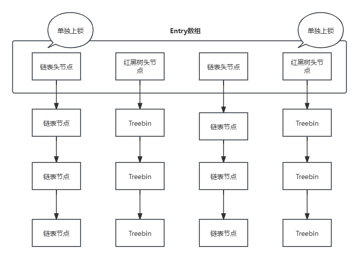

~~~java
    // put调用了内部的putVal来向里面添加键值对数据
    public V put(K key, V value) {
        return putVal(key, value, false);
    }

    /** Implementation for put and putIfAbsent */
    final V putVal(K key, V value, boolean onlyIfAbsent) {
        // 如果key和value是空，那么抛异常
        if (key == null || value == null) throw new NullPointerException();
        // 计算哈希值
        int hash = spread(key.hashCode());
        int binCount = 0;  // 表示要插入的链表的长度
        // 无限循环，第一次循环时得到Entry数组对象
        for (Node<K,V>[] tab = table;;) {
            Node<K,V> f; int n, i, fh; K fk; V fv;
            // 如果数组为空或数组长度为0，那么进行数组的初始化
            if (tab == null || (n = tab.length) == 0)
                tab = initTable();
            // n表示数组的长度，(n-1)&hash计算出来该键值对所在的数组下标，然后判断该地方是否为空
            else if ((f = tabAt(tab, i = (n - 1) & hash)) == null) {
                // 如果为空，那么执行CAS操作尝试添加节点，如果CAS成功，跳出循环
                if (casTabAt(tab, i, null, new Node<K,V>(hash, key, value)))
                    break;                   // no lock when adding to empty bin
            }
            // 
            else if ((fh = f.hash) == MOVED)
                tab = helpTransfer(tab, f);
            else if (onlyIfAbsent // check first node without acquiring lock
                     && fh == hash
                     && ((fk = f.key) == key || (fk != null && key.equals(fk)))
                     && (fv = f.val) != null)
                return fv;
            else {
                V oldVal = null;
                // 占用f，f就是当前想插入的数组下标的链表的头节点
                synchronized (f) {
                    // 这里再判断一次头节点和之前得到的f是否一致
                    // 猜测可能是防止其它线程在第一次if判断到该同步代码块期间执行了remove等方法改变了头节点
                    if (tabAt(tab, i) == f) {
                        if (fh >= 0) {
                            binCount = 1;
                            for (Node<K,V> e = f;; ++binCount) {
                                K ek;
                                // 查看哈希值和key的值是否全都相等
                                if (e.hash == hash &&
                                    ((ek = e.key) == key ||
                                     (ek != null && key.equals(ek)))) {
                                    // 记录之前的值
                                    oldVal = e.val;
                                    if (!onlyIfAbsent)
                                        // 如果不是处于onlyIfAbsent模式（就是存在该key的值就直接返回对应的value，不存在再插入，调用putIfAbsent方法时该值才为true，普通的put方法都是false）那就更新key对应的value值
                                        e.val = value;
                                    break;
                                }
                                // 如果上面的判断条件不满足，那么直接遍历链表，使用尾插法插入新的键值对节点
                                Node<K,V> pred = e;
                                if ((e = e.next) == null) {
                                    pred.next = new Node<K,V>(hash, key, value);
                                    break;
                                }
                            }
                        }
                        // 这里是判断f是否为红黑树节点，即当前链表已经转为了红黑树的情况
                        else if (f instanceof TreeBin) {
                            Node<K,V> p;
                            binCount = 2;
                            if ((p = ((TreeBin<K,V>)f).putTreeVal(hash, key,
                                                           value)) != null) {
                                oldVal = p.val;
                                if (!onlyIfAbsent)
                                    p.val = value;
                            }
                        }
                        // 这里不知道在干嘛，反正是抛了一个异常
                        else if (f instanceof ReservationNode)
                            throw new IllegalStateException("Recursive update");
                    }
                }
                // 如果binCount!=0说明成功插入了
                if (binCount != 0) {
                    // 如果链表长度太长，考虑转换为红黑树，不过如果Entry数组不够长，那么优先考虑数组扩容
                    if (binCount >= TREEIFY_THRESHOLD)
                        treeifyBin(tab, i);
                    // 如果oldValue不为空，那么返回之前记录的oldValue值
                    if (oldVal != null)
                        return oldVal;
                    break;
                }
            }
        }
        addCount(1L, binCount);  // 更新计数器
        return null;
    }
~~~

---

##### ⅢArrayBlockingQueue

+ 它的put和offer方法就是使用ReentrantLock执行了加锁以后，如果队列已满就加入到condition的condition链表内等待，如果没满就执行enqueue方法入队或直接返回false
+ 而take和poll方法也是先用ReentrantLock加锁，如果队列为空就加入到condition的condition链表内等待，还有元素就执行dequeue方法返回队列元素
+ 如果是带超时时间的，也就是从调用condition的await()方法转成了调awaitNanos(long time)方法而已
+ ArrayBlockingQueue维护了一个锁和两个condition对象
  + 一个ReentrantLock锁,线程在进行相关队列的操作时，必须先获取该锁才能继续操作
  + 一个叫`notEmpty`的Condition对象，它是专门用来存储**消费者**的condition链表的对象
  + 一个叫`notFull`的Condition对象，它是专门用来存储**生产者**的condition链表的对象
  + enqueue方法执行时，最终会调用`notEmpty`对象的`signal`方法唤醒一个消费者线程，dequeue方法执行时最终会调用`notFull`对象的signal方法唤醒一个生产者线程

~~~java

    public void put(E e) throws InterruptedException {
        Objects.requireNonNull(e);  // 如果参数为空，抛NullPointerException
        final ReentrantLock lock = this.lock;  // 得到锁
        lock.lockInterruptibly();  //  上可以被打断的锁
        try {
            // 循环入队，如果队列已满加入生产者condition链表内等待唤醒
            while (count == items.length)
                notFull.await();
            // 当队列不满时才尝试入队
            enqueue(e);
        } finally {
            lock.unlock();
        }
    }

    // 此处只注释不带超时时间的，若是带超时时间的,也就是从调用condition的await()方法转成了调awaitNanos(long time)方法而已
    // 这个不带超时时间的offer方法并不会阻塞线程
    public boolean offer(E e) {
        Objects.requireNonNull(e);  // 如果参数为空，抛NullPointerException
        final ReentrantLock lock = this.lock;  // 得到锁
        lock.lock();  //  直接上锁
        // 这个不带超时时间的offer方法并不会阻塞线程，因此只会判断一次
        try {
            // 如果队列当前的元素数量与队列容量相等，那么返回false
            if (count == items.length)
                return false;
            else {
                // 尝试入队并返回true
                enqueue(e);
                return true;
            }
        } finally {
            lock.unlock();
        }
    }

    private void enqueue(E e) {
        // assert lock.isHeldByCurrentThread();
        // assert lock.getHoldCount() == 1;
        // assert items[putIndex] == null;
        final Object[] items = this.items;  // 拿到队列对象
        items[putIndex] = e;  // putIndex表示下一个元素对应的下标，这里直接把元素加进队列里
        // 如果putIndex++以后与队列容量相等了，那么让putIndex重新置0
        if (++putIndex == items.length) putIndex = 0;
        count++;  // count表示当前队列的元素数量，使其自增
        notEmpty.signal();  // 唤醒一个消费者condition链表内的线程
    }

    public E take() throws InterruptedException {
        final ReentrantLock lock = this.lock;  // 得到锁
        lock.lockInterruptibly();  //  上可以被打断的锁
        try {
            // 如果队列为空，那么进入消费者condition链表等待
            while (count == 0)
                notEmpty.await();
            return dequeue();  // 不空则调用dequeue方法
        } finally {
            lock.unlock();
        }
    }

    public E poll() {

        final ReentrantLock lock = this.lock;    // 得到锁
        lock.lock();  // 上锁
        try {
            // 如果队列为空直接返回Null，否则调用dequeue
            return (count == 0) ? null : dequeue();
        } finally {
            lock.unlock();
        }
    }

    private E dequeue() {
        // assert lock.isHeldByCurrentThread();
        // assert lock.getHoldCount() == 1;
        // assert items[takeIndex] != null;
        final Object[] items = this.items;  // 拿到队列数组
        @SuppressWarnings("unchecked")
        E e = (E) items[takeIndex];  // takeIndex表示下一个要取出的元素对应的下标，这里是取出该元素
        items[takeIndex] = null;  // 将对应值置空
        if (++takeIndex == items.length) takeIndex = 0;  // 如果takeIndex自增以后与数组容量相等，那么重新置0
        count--;  // count表示当前队列的元素数量，使其自减
        // itrs是ArrayBlockingQueue的迭代器对象，如果它不为空，那么处理一下该对象的一些东西，感觉阻塞队列的迭代器没什么人用，不是很重要的样子
        // itrs除非在调用ArrayBlockingQueue的iterator方法时被调用，否则都是null
        if (itrs != null)
            itrs.elementDequeued();
        notFull.signal();  // 唤醒一个生产者condition链表的等待线程
        return e;  // 返回取出的元素
    }

~~~

---

##### ⅣSynchronousQueue

+ SynchronousQueue内部维护了一个链表用来记录被阻塞的线程，该链表记录的节点类型取决于第一个加入链表的线程类型。如果是生产者线程，那么该链表就是生产者线程的链表，反之就是消费者线程的链表
+ 该队列内部使用其transferer属性进行相关的操作，与ReentrantLock类似，它有公平模式和非公平模式，因此它的内部类Transferer就有两个子类:TransferQueue和TransferStack。此处源码选择了分析公平模式相关的源码
+ 在源码中可以看到`put`、`offer`、`take`和`poll`都调用了transfer来完成它们的功能，因此transfer是一个既可以取数据又可以加数据的方法
+ SynchronousQueue的相关源码中并没有加锁的操作，因此使用if判断来检验链表是否被更改的操作非常频繁

~~~java
    public class SynchronousQueue<E> extends AbstractQueue<E>
        implements BlockingQueue<E>, java.io.Serializable {
            ....
            static final class TransferQueue<E> extends Transferer<E> {
                static final class QNode implements ForkJoinPool.ManagedBlocker {
                    volatile QNode next;          // next node in queue  指向节点的下一个节点
                    volatile Object item;         // CAS'ed to or from null  当前线程向阻塞队列发送的数据，如果是消费者，此项为null
                    volatile Thread waiter;       // to control park/unpark  当前线程
                    final boolean isData;  // 是否是数据，如果为true表示当前线程为生产者，否则为消费者
                }
                ...
            }

            public void put(E e) throws InterruptedException {
                if (e == null) throw new NullPointerException();  // 如果是null那么抛异常
                // 调用transfer方法，若返回null，则打断当前线程
                if (transferer.transfer(e, false, 0) == null) {
                    Thread.interrupted();
                    throw new InterruptedException();
                }
            }

            public boolean offer(E e) {
                if (e == null) throw new NullPointerException();  // 如果是null那么抛异常
                return transferer.transfer(e, true, 0) != null;
            }

            public E take() throws InterruptedException {
                E e = transferer.transfer(null, false, 0);
                if (e != null)
                    return e;
                Thread.interrupted();
                throw new InterruptedException();
            }

            public E poll() {
                return transferer.transfer(null, true, 0);
            }

            // 此处演示的是TransferQueue类内的transfer方法
            // e表示线程想入队的数据，timed表示是否有超时时间，nanos表示以纳秒为单位的时间
            E transfer(E e, boolean timed, long nanos) {

                QNode s = null;                  // s表示本线程对应的节点，会在需要插入链表时才生成
                boolean isData = (e != null);  // 通过传入的e判断是否为数据，如果是null说明是消费者线程
                // 无限循环
                for (;;) {
                    QNode t = tail, h = head, m, tn;         // m is node to fulfill
                    // 判断链表是否未初始化，该情况下什么都不做进入下一次循环
                    if (t == null || h == null)  
                        ;                                    // inconsistent
                    // 如果链表只有一个节点或者isData与尾节点的isData一致，那么说明该生产者（或消费者）线程要么没有匹配的消费者（或生产者）线程，要么就是当前线程与链表内尾节点的线程类型是一样的，而不能达到生产者-消费者的匹配
                    else if (h == t || t.isData == isData) { // empty or same-mode
                        // 检验t是否还是尾节点，这里是检查是否当前线程执行到这里但是其它线程已经修改了链表的情况
                        if (t != tail)                       // inconsistent
                            ;
                        // 如果t.next!=null，也是检查t是否还是尾节点
                        else if ((tn = t.next) != null)      // lagging tail
                            advanceTail(t, tn);  // 尝试让尾节点指针指向t.next，但是无论是否成功，都需要进入下一轮循环了
                        // 查看线程是否已经超时，超时的话返回null
                        else if (timed && nanos <= 0L)       // can't wait
                            return null; 
                        // 尝试使用CAS操作向链表添加本线程所在的节点，在这里Node节点才被创建出来
                        else if (t.casNext(null, (s != null) ? s :
                                        (s = new QNode(e, isData)))) {
                            // 将尾节点指针指向该新的Node节点
                            advanceTail(t, s);
                            long deadline = timed ? System.nanoTime() + nanos : 0L;  // 计算超时时间
                            Thread w = Thread.currentThread();  // 得到当前线程对象
                            int stat = -1; // same idea as TransferStack  不知道干嘛的
                            Object item;
                            // 
                            while ((item = s.item) == e) {
                                // 如果出现超时的情况，那么将该节点从链表上搞下来，然后返回null
                                if ((timed &&
                                    (nanos = deadline - System.nanoTime()) <= 0) ||
                                    w.isInterrupted()) {
                                    if (s.tryCancel(e)) {
                                        clean(t, s);
                                        return null;
                                    }
                                
                                } 
                                // 如果出现了当前节点的item与线程传递过来的数据e（或者指定的消费者线程的null）不相同的情况，那么跳出循环
                                // 如果出现该情况就意味着出现了对应线程匹配到了该链表内的线程，因为匹配到的话会使用CAS修改其item
                                else if ((item = s.item) != e) {
                                    break;                   // recheck
                                } 
                                // 如果stat<=0，刚才在进入循环前，stat是被赋值为了-1，如果到了这里，肯定是要进一次的
                                else if (stat <= 0) {
                                    // 判断链表是否发生了更改，即判断t是否还指向s
                                    if (t.next == s) {
                                        // isFulfilled方法的代码只返回一个判断结果: isData == ((x = item) == null) || x == this
                                        // 一个节点如果其isData是true的话，那么item应该!=null，如果isData是false，那么item才==null
                                        // 上面的代码在一般情况下不可能是true，就算是true，下面的代码也会让它执行Thread.yield让一下其他线程执行
                                        if (stat < 0 && t.isFulfilled()) {
                                            stat = 0;        // yield once if first
                                            Thread.yield();
                                        }
                                        // 不满足的话把stat置1，然后设置上s的waiter，也就是当前线程
                                        else {
                                            stat = 1;
                                            s.waiter = w;
                                        }
                                    }
                                }
                                // 如果没有设置等待时间
                                else if (!timed) {
                                    LockSupport.setCurrentBlocker(this);
                                    try {
                                        // 该方法在condition的await源码有详细解析，目的就是让线程阻塞
                                        ForkJoinPool.managedBlock(s);
                                    } catch (InterruptedException cannotHappen) { }
                                    LockSupport.setCurrentBlocker(null);
                                }
                                // 如果nanos>1023L，那么就让它自旋等待，估计是嫌等待时间太短，不如直接自旋得了
                                else if (nanos > SPIN_FOR_TIMEOUT_THRESHOLD)
                                    LockSupport.parkNanos(this, nanos);
                            }
                            // 这里是阻塞之后被唤醒的情况了，或者while循环都没进的情况
                            // 如果stat为1，那么使当前节点将waiter置空(之前stat置1的操作和设置waiter在一个else代码块内)
                            if (stat == 1)
                                s.forgetWaiter();
                            // 如果s操作完成之后还在队列里边，那么就把它手动扔出去
                            if (!s.isOffList()) {            // not already unlinked
                                advanceHead(t, s);           // unlink if head
                                if (item != null)            // and forget fields
                                    s.item = s;
                            }
                            return (item != null) ? (E)item : e;  // 当前线程为消费者线程时，该返回值表示取到的队列值，为生产者线程时，返回值用来判断数据是否加入队列成功
                        }

                    } 
                    // 这里是生产者和消费者匹配到的情况，首先还是校验一下链表是否被更改
                    // 由于链表的头节点只是一个普通的头节点，因此h.next才是第一个等待的线程节点
                    else if ((m = h.next) != null && t == tail && h == head) {
                        Thread waiter;
                        Object x = m.item;  // 得到节点的item
                        // isData是此时本线程的isData，如果此时本线程是生产者，那么匹配到的就是消费者的节点，那么x就应该==null。消费者也是一样的道理
                        // x!=m这个我怎么看感觉都不可能是false
                        // 最后CAS一下m的原item值，改成匹配线程的数据值e。就是消费者的item改成非空的值，生产者的item改成空值，方便节点跳出上面的while循环
                        boolean fulfilled = ((isData == (x == null)) &&
                                            x != m && m.casItem(x, e));
                        advanceHead(h, m);                    // 如果成功CAS修改头节点指针指向m，因为m此时已经没用了，它会成为队列的头节点
                        // 如果操作成功了
                        if (fulfilled) {
                            // 如果waiter!=null，正常情况下应该都不是null
                            if ((waiter = m.waiter) != null)
                                LockSupport.unpark(waiter);  // 唤醒该线程
                            return (x != null) ? (E)x : e;  // 最后返回取到的数据值，否则返回方法参数e
                        }
                    }
                }
            }
        }
~~~

---

### （四）线程池

#### ①ThreadPoolExecutor

+ ThreadPoolExecutor源码中大量使用位运算来提高运行效率并减少内存占用，并利用位运算巧妙地使一个32位的数值既能表示当前线程池状态又能表示当前在工作的线程数量
+ 这里先分析其基本属性，并展示execute的实现

~~~java
    public class ThreadPoolExecutor extends AbstractExecutorService {
        // 该原子类对象既用来表示当前线程池的状态，也用来表示当前线程池的工作线程数量
        // ctlOf方法用来通过传入的两个参数的或运算计算得到ctl值，这里RUNNING常量和0相或，结果还是RUNNING
        private final AtomicInteger ctl = new AtomicInteger(ctlOf(RUNNING, 0));
        // 该值表示32位数值有多少位被分配来表示工作线程数量，这里减了3，即表示有29位用来表示数量，那么其余的3位就用来表示当前线程的状态
        // 实际上，32位的前3位就是表示的状态，后面的29位表示线程数量
        private static final int COUNT_BITS = Integer.SIZE - 3;
        // 最大线程数量
        private static final int COUNT_MASK = (1 << COUNT_BITS) - 1;

        // runState is stored in the high-order bits
        // 定义线程池的状态，可以看到除RUNNING状态以外，其它的状态都是大于0的值
        // 计算机底层存储负数使用的是补码，这里存储RUNNING最终得到的二进制就是11100000000000000000...
        private static final int RUNNING    = -1 << COUNT_BITS;
        private static final int SHUTDOWN   =  0 << COUNT_BITS;
        private static final int STOP       =  1 << COUNT_BITS;
        private static final int TIDYING    =  2 << COUNT_BITS;
        private static final int TERMINATED =  3 << COUNT_BITS;

        // Packing and unpacking ctl
        // 使c与最大线程数量各位取反想与，最大线程数量是00011111111...，取反之后就是11100000000...，那么与该值想与的值最后只会保留前3位的值
        // 因此该方法的作用就是得到当前线程的状态，这个参数c就是当前的ctl值
        private static int runStateOf(int c)     { return c & ~COUNT_MASK; }
        // 如果不使COUNT_MASK取反，根据上面的注释，那么就是得到后29位的值，即此方法的作用就是得到当前正在工作的线程数量
        private static int workerCountOf(int c)  { return c & COUNT_MASK; }
        // 这个方法是用来计算ctl的，使用方式见初始化ctl时的代码（就是最上面第一行代码）
        private static int ctlOf(int rs, int wc) { return rs | wc; }

        /*
        * Bit field accessors that don't require unpacking ctl.
        * These depend on the bit layout and on workerCount being never negative.
        */
       // 用来判断当前的线程池状态是否在某个值以下
       // 该方法的c值ctl值，s一般是上面线程池的状态常量
        private static boolean runStateLessThan(int c, int s) {
            return c < s;
        }
        // 与上面的方法正好相反，用来判断当前的线程池状态是否在某个值以上
        // 参数同上
        private static boolean runStateAtLeast(int c, int s) {
            return c >= s;
        }
        // 如果c<SHUTDOWN肯定是处于执行状态的，因为SHUTDOWN=0
        // 小于这个值肯定是线程池处于RUNNING，因为ctl<0的情况只有RUNNING状态才会满足
        private static boolean isRunning(int c) {
            return c < SHUTDOWN;
        }

        /**
         * Attempts to CAS-increment the workerCount field of ctl.
         */
        // 这个就是让ctl通过CAS操作自增的
        private boolean compareAndIncrementWorkerCount(int expect) {
            return ctl.compareAndSet(expect, expect + 1);
        }

        // 同步需要用到的锁
        private final ReentrantLock mainLock = new ReentrantLock();

        // 该Set集合用来装正在工作的Worker对象
        private final HashSet<Worker> workers = new HashSet<>();

        // Condition对象
        private final Condition termination = mainLock.newCondition();

        // 用来记录该线程池历史的最大线程数的变量
        private int largestPoolSize;

        // 记录完成的任务数量
        private long completedTaskCount;

        // 先来分析execute方法
        public void execute(Runnable command) {
            // 可以看到该方法并没有加锁
            // 如果command是null，抛异常
            if (command == null)
                throw new NullPointerException();
            int c = ctl.get();  // 得到ctl
            // 如果工作线程数量少于核心线程数量
            if (workerCountOf(c) < corePoolSize) {
                // 执行addWorker方法加一个县城进去，如果成功直接返回
                if (addWorker(command, true))
                    return;
                c = ctl.get();  // 如果添加失败那么重新得到ctl值，此时由于多线程的原因可能其它线程修改了ctl的值
            }
            // 如果加入核心线程失败，那么此处就要把任务加到阻塞队列里面了
            // 如果线程池处于运行状态且加入阻塞队列成功
            if (isRunning(c) && workQueue.offer(command)) {
                int recheck = ctl.get();  // 再得到一次ctl值
                // 如果此时线程池不处于RUNNING状态了，那么就把本命令从阻塞队列中移除掉并调用reject方法执行拒绝策略的相关代码
                if (! isRunning(recheck) && remove(command))
                    reject(command);
                // 如果工作线程的数量是0
                else if (workerCountOf(recheck) == 0)
                    addWorker(null, false);  // 加一个任务是null的非核心工作线程
            }
            // 这里是如果核心线程没有创建且阻塞队列加不进去的情况
            // 其实就是核心线程已满而且阻塞队列也满了的情况
            // 尝试添加非核心线程执行此任务，如果失败，也执行reject方法执行拒绝策略
            else if (!addWorker(command, false))
                reject(command);
        }

        // execute频繁的调用了addWorker方法:
        private boolean addWorker(Runnable firstTask, boolean core) {
            // 给外层的无限循环打标签
            retry:
            for (int c = ctl.get();;) {
                // Check if queue empty only if necessary.
                // 先判断线程池是否在SHUTDOWN状态或以上，就是线程池是否处于非RUNNING状态
                // 而且在以上情况的前提下，满足线程池处于STOP及以上状态、任务是null、阻塞队列是空这三种情况中的任意一个，那么直接返回false
                // 该判断语句判断的是线程池是否处于无法再创建新工作线程的状态，因此此处会直接返回false
                if (runStateAtLeast(c, SHUTDOWN)
                    && (runStateAtLeast(c, STOP)
                        || firstTask != null
                        || workQueue.isEmpty()))
                    return false;
                // 判断通过进入内层循环
                for (;;) {
                    // 这里是看工作线程数是否超过了核心线程或最大线程数的限制，跟哪个做比较取决于core参数的值
                    // 超过了肯定就不能再创建新的线程了，因此直接返回false
                    if (workerCountOf(c)
                        >= ((core ? corePoolSize : maximumPoolSize) & COUNT_MASK))
                        return false;
                    // 如果线程数还没有超标，那么尝试执行CAS操作把ctl的值+1
                    // 如果成功了那么直接跳出外层循环
                    if (compareAndIncrementWorkerCount(c))
                        break retry;
                    c = ctl.get();  // Re-read ctl  失败的话更新ctl
                    // 再次判断线程池是否在SHUTDOWN状态或以上，如果是那么重新从外层循环开始循环
                    if (runStateAtLeast(c, SHUTDOWN))
                        continue retry;
                    // else CAS failed due to workerCount change; retry inner loop
                }
            }
            // 线程执行到这里那么意味着它的CAS操作已经通过了
            boolean workerStarted = false;
            boolean workerAdded = false;
            Worker w = null;
            try {
                // 新建一个Worker对象
                w = new Worker(firstTask);
                // 得到worker的线程对象
                final Thread t = w.thread;
                // 如果t不是空
                if (t != null) {
                    // 上锁
                    final ReentrantLock mainLock = this.mainLock;
                    mainLock.lock();
                    try {
                        // Recheck while holding lock.
                        // Back out on ThreadFactory failure or if
                        // shut down before lock acquired.
                        // 得到当前的ctl值
                        int c = ctl.get();
                        // 如果线程池处于RUNNING状态 或 线程池处于SHUTDOWN态且任务是null
                        if (isRunning(c) ||
                            (runStateLessThan(c, STOP) && firstTask == null)) {
                            // 判断线程是否是新创建的，如果不是那么抛异常
                            if (t.getState() != Thread.State.NEW)
                                throw new IllegalThreadStateException();
                            // 把worker对象加入到workers中，workers是Worker对象组成的集合，是一个HashSet
                            workers.add(w);
                            workerAdded = true;  // 将该值置true
                            int s = workers.size();  // 拿到集合的元素数量
                            // 如果比历史最大数量大，那么更新一下
                            if (s > largestPoolSize)
                                largestPoolSize = s;
                        }
                    } finally {
                        mainLock.unlock();
                    }
                    // 如果该值被置true了
                    if (workerAdded) {
                        // 启动线程，并将workerStarted置true
                        t.start();
                        workerStarted = true;
                    }
                }
            } finally {
                // 如果最后workerStarted不为true，那么执行添加Worker失败了的方法
                if (! workerStarted)
                    addWorkerFailed(w);
            }
            // 返回workerStarted的值，true即表示添加成功，false即表示失败
            return workerStarted;
        }

        // 这是addWorker失败之后要执行的方法
        private void addWorkerFailed(Worker w) {
            final ReentrantLock mainLock = this.mainLock;
            // 上锁
            mainLock.lock();
            try {
                // 如果该w对象不为空
                if (w != null)
                    // 从workers集合中移除该Worker
                    workers.remove(w);
                // 将工作线程数减1，能调用该方法说明在addWorker方法中已经成功地CAS了WorkerCount,因此这里要把它减回去
                decrementWorkerCount();
                tryTerminate();
            } finally {
                mainLock.unlock();
            }
        }

    }
~~~

+ 接下来展示Worker的工作原理

~~~java
    /*
        Worker类是ThreadPoolExecutor类的内部类，它继承于AQS类，因此它自己就可以当锁
        另外，它还实现了Runnable接口，这意味着它可以作为Runnable对象在新建Thread时作为线程需要的Runnable参数传入
     */
    private final class Worker extends AbstractQueuedSynchronizer implements Runnable{
        // 该Worker对象对应的线程
        final Thread thread;
        // 要执行的任务，可能为null
        Runnable firstTask;
        // 本Worker完成的任务数量
        volatile long completedTasks;

        Worker(Runnable firstTask) {
            // 构造方法中将state的值设置为了-1，目的是防止线程在执行任务之前被中断
            setState(-1); // inhibit interrupts until runWorker
            this.firstTask = firstTask;
            this.thread = getThreadFactory().newThread(this);  // 这里会调用newThred生成一个新的线程对象
        }

        // Worker实现了Runnable接口，因此实现了其run方法
        public void run() {
            runWorker(this);
        }

        final void runWorker(Worker w) {
            Thread wt = Thread.currentThread();  // 得到当前线程
            Runnable task = w.firstTask;  // 得到当前的任务
            w.firstTask = null;  // 把当前任务置空
            w.unlock(); // unlock代码中重新将state置为了0，此时线程将支持被中断
            boolean completedAbruptly = true;  // completedAbruptly表示线程是否因任务执行出现异常而中断
            try {
                // 循环的条件是拿到的任务不为空或从阻塞队列中取到的任务不为空
                // 实际上就是线程一直在运行并尝试给自己找事干
                while (task != null || (task = getTask()) != null) {
                    // 拿到自己的锁
                    w.lock();
                    // If pool is stopping, ensure thread is interrupted;
                    // if not, ensure thread is not interrupted.  This
                    // requires a recheck in second case to deal with
                    // shutdownNow race while clearing interrupt
                    // 如果(线程池当前状态在STOP及以上 或 线程已被中断且线程池当前状态在STOP及以上) 且 当前线程未被中断(interrupted方法在检测到线程中断后会返回true并修改interrupted为false),那么将此线程打断
                    if ((runStateAtLeast(ctl.get(), STOP) ||
                        (Thread.interrupted() &&
                        runStateAtLeast(ctl.get(), STOP))) &&
                        !wt.isInterrupted())
                        wt.interrupt();
                    try {
                        // 该方法在ThreadPoolExecutor类中无具体实现
                        beforeExecute(wt, task);
                        try {
                            // 执行当前任务
                            task.run();
                            // 该方法在ThreadPoolExecutor类中无具体实现
                            afterExecute(task, null);
                        } catch (Throwable ex) {
                            // 该方法在ThreadPoolExecutor类中无具体实现
                            afterExecute(task, ex);
                            throw ex;
                        }
                    } finally {
                        // 最终任务执行完毕后把task置空、将completedTasks自增1并解锁
                        task = null;
                        w.completedTasks++;
                        w.unlock();
                    }
                }
                // 如果执行到这里，那么说明阻塞队列和线程都没事干了，即循环是自己主动跳出的，那么置completedAbruptly为false，说明线程并未发生任务执行的异常导致循环异常跳出
                completedAbruptly = false;
            } finally {
                // 执行到此表示线程执行出现了异常导致循环异常结束
                // 此时需要将该异常worker对象弹出
                processWorkerExit(w, completedAbruptly);
            }
        }

        // 得到任务的方法
        private Runnable getTask() {
            boolean timedOut = false; // Did the last poll() time out?  默认的timeOut是false

            for (;;) {
                int c = ctl.get();  // 得到ctl

                // Check if queue empty only if necessary.
                // 如果线程池至少为SHUTDOWN状态 且 线程池至少为STOP状态或阻塞队列为空，那么直接返回null
                // 这里的意思就是如果线程池是SHUTDOWN状态但是阻塞队列不为空，那么可以继续执行
                if (runStateAtLeast(c, SHUTDOWN)
                    && (runStateAtLeast(c, STOP) || workQueue.isEmpty())) {
                    decrementWorkerCount();
                    return null;
                }

                // 得到当前正在工作的线程数量
                int wc = workerCountOf(c);

                // Are workers subject to culling?
                // 这里是判断是否需要减少线程
                // allowCoreThreadTimeOut属性用于表示允许核心线程有空闲超时时间，而wc>corePoolSize说明存在非核心线程
                // 这两种情况只要满足一种就说明可以减少线程
                boolean timed = allowCoreThreadTimeOut || wc > corePoolSize;

                // 如果当前线程数大于最大线程数（一般是不存在该情况的，我能想到的情况就是在线程池运行过程中调用了setter方法重新设置了其maximumPoolSize属性）或(timed&&timeOut)为true 且 当前线程数大于1或阻塞队列为空
                // 这里是返回null的代码
                if ((wc > maximumPoolSize || (timed && timedOut))
                    && (wc > 1 || workQueue.isEmpty())) {
                    // 那么就使用CAS操作减少使WorkerCount自减，然后返回null
                    if (compareAndDecrementWorkerCount(c))
                        return null;
                    // 否则继续循环
                    continue;
                }

                try {
                    // 根据timed值来确定是一直等下去还是设置超时时间进行等待
                    // timed就是上面的需不需要减少线程的变量，它的代码为 allowCoreThreadTimeOut || wc > corePoolSize;
                    // 因此可以看到非核心线程的空闲超时机制是在getTask方法里面实现的，如果此时阻塞队列为空，那么就会返回null
                    // 这个代码块是返回非null值的代码，如果此处得到的r是null，那么在下一个循环中它将进入上面的返回null的代码块
                    Runnable r = timed ?
                        workQueue.poll(keepAliveTime, TimeUnit.NANOSECONDS) :
                        workQueue.take();
                    // 如果得到的r不为空，那么返回r
                    if (r != null)
                        return r;
                    timedOut = true;  // 如果执行到这，那么说明r为空，将timedOut置为true
                } catch (InterruptedException retry) {
                    timedOut = false;
                }
            }
        }

        private void processWorkerExit(Worker w, boolean completedAbruptly) {
            // 如果是因为出现异常导致该方法执行
            if (completedAbruptly) // If abrupt, then workerCount wasn't adjusted
                decrementWorkerCount();  // 使WorkerCount-1

            final ReentrantLock mainLock = this.mainLock;
            // 上锁
            mainLock.lock();
            try {
                // 更新汇总的任务完成数量，让它与当前Worker对象完成的数量相加
                completedTaskCount += w.completedTasks;
                // 从workers集合中移除该Worker
                workers.remove(w);
            } finally {
                mainLock.unlock();
            }

            // 尝试终止该线程池
            tryTerminate();
            // 得到ctl值
            int c = ctl.get();
            // 如果ctl值在STOP以下，即处在RUNNING或SHUTDOWN状态
            if (runStateLessThan(c, STOP)) {
                // 如果不是因为出现异常导致该方法执行的
                if (!completedAbruptly) {
                    // allowCoreThreadTimeOut在调用线程池的allowCoreThreadTimeOut方法时才有可能是true，否则都是false
                    // 如果核心线程池有超时终止时间，那么min=0，否则min=线程池最大核心线程数
                    int min = allowCoreThreadTimeOut ? 0 : corePoolSize;
                    // 如果min=0且阻塞队列不是空的，把min置为1
                    if (min == 0 && ! workQueue.isEmpty())
                        min = 1;
                    // 如果当前正在工作的线程大于等于min值，直接return
                    // 一般allowCoreThreadTimeOut为false的情况下，这里的意思就是将非核心线程彻底移除掉了，因为不会执行下面的addWorker方法了
                    if (workerCountOf(c) >= min)
                        return; // replacement not needed
                }
                // 增加一个没有任务的非核心线程
                // 这里之所以第二个参数是false,是因为该代码所在的环境是多线程环境，可能有多个线程在执行该段代码，为了尽可能地保证线程的创建，因此将core参数标识为false以便addWorker在进行线程数判断时判断的更宽松一点，使得创建出来的线程更多，我是这样理解的
                addWorker(null, false);
            }
        }
    }
~~~

+ 从源码中实际上可以看到，核心线程和非核心线程是没有区别的，该类的源码没有使用任何的属性来显式地区分它们，他们唯一的区别就在于`addWorker`方法执行时用来进行判断的`core`参数，除此之外，**核心线程和非核心线程没有任何区别**
+ 非核心线程通过`keepAliveTime`的空闲等待超时时间的机制被销毁的流程实际上是:
  + getTask方法判断`timed`变量为true,因此对阻塞队列进行有超时时间的等待，如果在此期间阻塞队列为空，那么就会返回null
  + 返回null导致runWorker方法内的while循环条件不成立，跳出循环，将`completedAbruptly`置为false，并执行finally代码块内的`processWorkerExit`方法，将Worker移除，即将非核心线程移除
  + `processWorkerExit`方法执行到最后，会通过判断`workerCountOf(c) >= min`来决定直接return还是执行下面的`addWorker`。此处如果存在非核心线程的话，一般判断是成立的，那么直接返回，就不会再新添一个线程了
  + 这样就实现了非核心线程的移除
  + 最终还是要强调，**非核心线程与核心线程没有任何区别**，因此在线程数超过最大核心线程数时，这些线程中的任意线程都可能作为“非核心线程”被移除直到线程数小于等于最大核心线程数
+ 另外，透过源码可以知道，`execute`方法是主线程执行的，而`run`方法及`runWorker`等方法都是线程池内的线程自己执行的
+ 接下来看看最后的线程池关闭方法:

~~~java
    // 对外暴露的shutdown方法
    public void shutdown() {
        // 上锁
        final ReentrantLock mainLock = this.mainLock;
        mainLock.lock();
        try {
            checkShutdownAccess();  // 判断是否有权限终止
            advanceRunState(SHUTDOWN);  // 将线程池状态设置为SHUTDOWN
            interruptIdleWorkers();  // 尝试打断空闲的线程
            onShutdown(); // hook for ScheduledThreadPoolExecutor  该方法在本类中是空体
        } finally {
            mainLock.unlock();
        }
        tryTerminate();
    }

    private void advanceRunState(int targetState) {
        // assert targetState == SHUTDOWN || targetState == STOP;
        for (;;) {
            int c = ctl.get();
            // 这里要么ctl的状态大于等于传入的targetState参数，要么执行CAS成功
            // 对于shutdown方法调用来说，第一个条件一般是无法满足的，因为在SHUTDOWN之前线程池一般是RUNNING状态，它肯定比SHUTDOWN的状态小
            // 该CAS操作使用了ctlOf方法，它会将 targetState 和 workerCountOf(c) 想与，对于shutdown方法来说，targetState是SHUTDOWN,也就是0
            // 而workerCountOf方法会返回29位二进制数表示的线程数量，这就意味着它前面表示状态的三个位全是0，因此状态位数与0想与就变成了0，如果CAS成功，那么线程池将被修改为SHUTDOWN状态
            if (runStateAtLeast(c, targetState) ||
                ctl.compareAndSet(c, ctlOf(targetState, workerCountOf(c))))
                break;
        }
    }

    private void interruptIdleWorkers() {
        interruptIdleWorkers(false);
    }

    private void interruptIdleWorkers(boolean onlyOne) {
        // 上锁
        final ReentrantLock mainLock = this.mainLock;
        mainLock.lock();
        try {
            // 遍历当前的workers集合
            for (Worker w : workers) {
                Thread t = w.thread;
                // 如果线程未被中断，且尝试获取锁成功
                // 此处如果线程还在执行任务，尝试获取锁会失败，因为runWorker方法中已经占用了锁了
                if (!t.isInterrupted() && w.tryLock()) {
                    try {
                        // 这里是尝试将处于空闲状态的线程中断
                        t.interrupt();
                    } catch (SecurityException ignore) {
                    } finally {
                        w.unlock();
                    }
                }
                // 如果onlyOne参数为true，那么执行一次就跳出循环
                if (onlyOne)
                    break;
            }
        } finally {
            mainLock.unlock();
        }
    }

    // 与shutdown相比，shutdown更加粗暴，他直接将线程置为STOP状态，并直接打断全部线程同时拒绝接收任务，且不再执行阻塞队列的任务
    public List<Runnable> shutdownNow() {
        List<Runnable> tasks;
        final ReentrantLock mainLock = this.mainLock;
        mainLock.lock();
        try {
            checkShutdownAccess();
            advanceRunState(STOP);  // 直接将线程置为STOP状态
            interruptWorkers();  // 直接打断全部线程
            tasks = drainQueue();  // 将剩下的阻塞队列中的任务取出
        } finally {
            mainLock.unlock();
        }
        tryTerminate();
        return tasks;  // 返回未能执行的任务集合
    }

    private void interruptWorkers() {
        // assert mainLock.isHeldByCurrentThread();
        for (Worker w : workers)
            w.interruptIfStarted();
    }

    void interruptIfStarted() {
        Thread t;
        // 如果线程>=0，即不管线程是空闲还是运行状态
        // 而且线程不为空
        // 而且线程未被打断
        if (getState() >= 0 && (t = thread) != null && !t.isInterrupted()) {
            try {
                // 打断线程
                t.interrupt();
            } catch (SecurityException ignore) {
            }
        }
    }

    private List<Runnable> drainQueue() {
        BlockingQueue<Runnable> q = workQueue;
        ArrayList<Runnable> taskList = new ArrayList<>();
        // 调用阻塞队列的drainTo方法来使集合得到阻塞队列中的任务
        q.drainTo(taskList);
        // 如果阻塞队列执行完毕以后还不是空的，那么手动循环遍历阻塞队列，把里面的任务一个一个加进集合
        if (!q.isEmpty()) {
            for (Runnable r : q.toArray(new Runnable[0])) {
                if (q.remove(r))
                    taskList.add(r);
            }
        }
        return taskList;  // 最后返回集合
    }

    // shutdown、shutdownNow和源码的其它方法都大量调用了该方法
    final void tryTerminate() {
        for (;;) {
            int c = ctl.get();  // 得到ctl值
            // 如果线程池还在运行状态 或 线程池现在至少为TIDYING状态 或 (线程池现在是SHUTDOWN状态但是阻塞队列不为空)，那么直接return
            // 这些都是特殊情况，运行状态不需要终止，TIDYING状态已经终止完了，SHUTDOWN状态需要阻塞队列为空才能继续终止，因为它需要等待线程把阻塞队列中的任务执行完
            if (isRunning(c) ||
                runStateAtLeast(c, TIDYING) ||
                (runStateLessThan(c, STOP) && ! workQueue.isEmpty()))
                return;
            // 如果工作线程数量不为0，那么终止一个线程然后返回
            if (workerCountOf(c) != 0) { // Eligible to terminate
                interruptIdleWorkers(ONLY_ONE);
                return;
            }
            // 上锁
            final ReentrantLock mainLock = this.mainLock;
            mainLock.lock();
            try {
                // 把线程池状态设置为YIDYING状态
                if (ctl.compareAndSet(c, ctlOf(TIDYING, 0))) {
                    try {
                        // 方法是空体
                        terminated();
                    } finally {
                        // 最后把线程池状态设置为TERMINATED
                        ctl.set(ctlOf(TERMINATED, 0));
                        // 把那些调用了awaitTermination方法的线程唤醒
                        // awaitTermination方法使得调用它的线程在该线程池对象关闭时被唤醒，在此线程池关闭到其调用该方法期间，线程会一直等待
                        termination.signalAll();
                    }
                    return;  // 直接return
                }
            } finally {
                mainLock.unlock();
            }
            // else retry on failed CAS
        }
    }

~~~

---

### （五）线程工具类

#### ①CountDownLatch

+ 直接看源码
  + 从源码中可以观察到:
    + CountDownLatch内部也有一个内部类Sync继承AbstractQueuedSynchronizer，它在构造器执行时就尝试获取指定数量的**共享锁**
    + 共享锁可以被多个线程获取（结合AQS源码推出结论），在`acquire`方法执行时，如果线程得到了共享锁，它还会唤醒链表后面的等待线程，让它们继续尝试获取锁，并把自己置为链表的头节点
      + 此时后面的线程如果还要获取共享锁，那么它获得后也会把自己置为头节点，然后唤醒它后面的线程，实现多个线程共享一把锁
      + 此时后面的线程如果要获取排它锁，那么他执行的是`tryAcquire`方法，该方法一般都是在state为0的情况下才能获取到的，但是之前获取共享锁的线程就决定了它无法获取排它锁，因此它会继续等待
    + 线程在释放共享锁时，会唤醒下一个线程节点

~~~java
    public class CountDownLatch {
        
        public CountDownLatch(int count) {
            if (count < 0) throw new IllegalArgumentException("count < 0");
            this.sync = new Sync(count);
        }
        // 这里有一个内部类继承自AQS类，因此它必定是通过AQS实现的功能
        private static final class Sync extends AbstractQueuedSynchronizer {
            private static final long serialVersionUID = 4982264981922014374L;

            // 这里直接把AQS的state置为构造器传来的参数count
            Sync(int count) {
                setState(count);
            }

            int getCount() {
                return getState();
            }

            protected int tryAcquireShared(int acquires) {
                return (getState() == 0) ? 1 : -1;
            }

            protected boolean tryReleaseShared(int releases) {
                // Decrement count; signal when transition to zero
                for (;;) {
                    int c = getState();
                    if (c == 0)
                        return false;
                    int nextc = c - 1;
                    if (compareAndSetState(c, nextc))
                        return nextc == 0;
                }
            }
        }
    }

    private final Sync sync;  // 该sync对象负责所有的操作

    // await内部调用的是sync的acquireSharedInterruptibly方法，即获取共享AQS锁
    public void await() throws InterruptedException {
        sync.acquireSharedInterruptibly(1);
    }

    // 该方法位于AQS类中
    public final void acquireSharedInterruptibly(int arg)
        throws InterruptedException {
        // 如果线程已经被打断，或者当前锁已经被其他线程占有(见下面的tryAcquireShared源码)且尝试获取锁的acquire方法返回了负数（这种情况在锁支持打断且线程在获取锁被打断的情况下才会出现，详情见AQS的acquire源码），那么就抛出打断异常
        // 该判断语句在确定线程是否已被打断的同时，同时还尝试让线程获得该锁
        if (Thread.interrupted() ||
            (tryAcquireShared(arg) < 0 &&
             acquire(null, arg, true, true, false, 0L) < 0))
            throw new InterruptedException();
    }
    // 该方法是CountDownLatch的内部类重写的方法
    protected int tryAcquireShared(int acquires) {
        return (getState() == 0) ? 1 : -1;
    }

    // 接下来看countDown方法的实现
    public void countDown() {
        sync.releaseShared(1);
    }

    public final boolean releaseShared(int arg) {
        // 它尝试释放一个锁,因为countDown调用它时传递的参数值为1，如果成功，那么唤醒下一个节点
        // 唤醒下一个节点是必须的，这是排它锁和共享锁在释放时都需要做的操作，因为必须保证锁在被释放后，那些正在等待获得锁的线程能够得到机会获取到锁而不是一直等下去
        // 如果此时state正好减为了0，那么共享锁和排它锁都可以被获取，如果state不等于0，此时调用该方法只能说明是共享锁被释放了，因此此时只有共享锁会被获取
        if (tryReleaseShared(arg)) {
            signalNext(head);
            return true;
        }
        return false;
    }

    protected boolean tryReleaseShared(int releases) {
        // Decrement count; signal when transition to zero
        // 这里很简单，就是一直循环尝试CAS操作直到成功
        // 减到0就返回true，否则返回false，如果在CAS之前state就是0（可能是其他线程干的，或者state为0还在执行countDown方法），那么直接返回不执行CAS操作
        for (;;) {
            int c = getState();
            if (c == 0)
                return false;
            int nextc = c - 1;
            if (compareAndSetState(c, nextc))
                return nextc == 0;
        }
    }
~~~

---

#### ②CyclicBarrier

~~~java
    public class CyclicBarrier {
        private final ReentrantLock lock = new ReentrantLock();  // 方法执行要用到的ReentrantLock

        private final Condition trip = lock.newCondition();  // 用来进行等待的condition对象

        private final int parties;  // 循环壁障的阈值
        
        private final Runnable barrierCommand;  // 在壁障破裂时（即等待的线程数大于等于阈值时）需要做的操作
        
        private Generation generation = new Generation();

        private int count;  // 还需要多少个线程等待才能冲破壁障

        // Generation类用来标识此次循环的壁障是否已被打破
        private static class Generation {
            Generation() {}                 // prevent access constructor creation
            boolean broken;                 // initially false  该值初始为false
        }

        public CyclicBarrier(int parties) {
            this(parties, null);
        }

        public CyclicBarrier(int parties, Runnable barrierAction) {
            // 这里检查传入的数值是否合法
            if (parties <= 0) throw new IllegalArgumentException();
            // 赋值
            this.parties = parties;
            this.count = parties;
            this.barrierCommand = barrierAction;
        }

        public int await() throws InterruptedException, BrokenBarrierException {
            try {
                // 直接调dowait方法
                return dowait(false, 0L);
            } catch (TimeoutException toe) {
                throw new Error(toe); // cannot happen
            }
        }

        private int dowait(boolean timed, long nanos) throws InterruptedException, BrokenBarrierException,TimeoutException {
            // 上锁
            final ReentrantLock lock = this.lock;
            lock.lock();
            try {
                // 得到承载此次循环壁障状态的Generation对象
                final Generation g = generation;

                // 如果壁障已经破了，那么抛异常
                if (g.broken)
                    throw new BrokenBarrierException();
                // 如果线程被打断了
                if (Thread.interrupted()) {
                    breakBarrier();
                    throw new InterruptedException();
                }
                // 让count自减1
                int index = --count;
                // 该条件语句内是等待线程数到达阈值的情况
                // 如果自减后index为0
                if (index == 0) {  // tripped
                    // 得到存储的Runnable对象
                    Runnable command = barrierCommand;
                    // 若该对象不为空，那么执行该操作
                    if (command != null) {
                        try {
                            command.run();
                        } catch (Throwable ex) {
                            breakBarrier();
                            throw ex;
                        }
                    }
                    nextGeneration();
                    return 0;
                }
                // 这是等待线程数未到达阈值的情况
                // loop until tripped, broken, interrupted, or timed out
                for (;;) {
                    try {
                        // 如果没设置等待超时时间，调用Condition对象的await方法一直等下去
                        if (!timed)
                            trip.await();
                        // 如果超时时间合法，那么调用awaitNanos方法等待
                        else if (nanos > 0L)
                            nanos = trip.awaitNanos(nanos);
                    } catch (InterruptedException ie) {
                        // 如果方法内的g与当前的Generation对象是一致的，而且壁障还没破
                        if (g == generation && ! g.broken) {
                            breakBarrier();  // 执行壁障破裂的方法
                            throw ie;  // 抛出异常
                        } else {
                            // We're about to finish waiting even if we had not
                            // been interrupted, so this interrupt is deemed to
                            // "belong" to subsequent execution.
                            // 否则就打断当前线程
                            Thread.currentThread().interrupt();
                        }
                    }

                    // 如果当前壁障已经破了，那么抛异常
                    if (g.broken)
                        throw new BrokenBarrierException();

                    // 如果当前的Generation对象与方法内的g不一致，那么返回count自减后的值
                    if (g != generation)
                        return index;
                    // 如果设置了超时时间但是超时时间非法
                    if (timed && nanos <= 0L) {
                        breakBarrier();  // 执行壁障破裂的方法
                        throw new TimeoutException();  //抛异常
                    }
                }
            } finally {
                lock.unlock();
            }
        }

        // 该方法在等待线程数到达阈值时被触发
        private void breakBarrier() {
            // 将generation的broken属性置为true
            generation.broken = true;
            count = parties; // 重新把count置为壁障阈值
            trip.signalAll();  // 唤醒所有正在等待的线程
        }

        // 该方法在等待线程数到达阈值时被触发
        private void nextGeneration() {
            // signal completion of last generation
            trip.signalAll();  // 唤醒所有正在等待的线程
            // set up next generation
            count = parties;  // 重新把count置为壁障阈值
            generation = new Generation();  // 换一个新的Generation对象
        }
    }
~~~