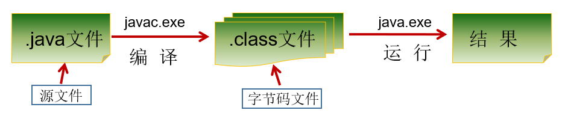
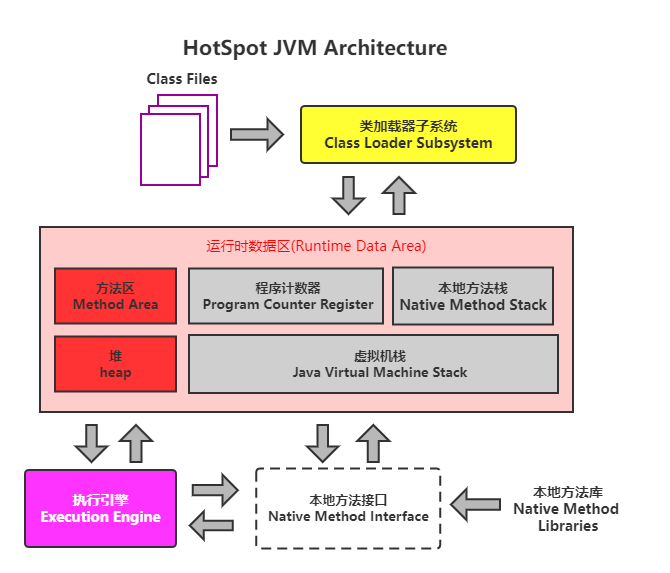
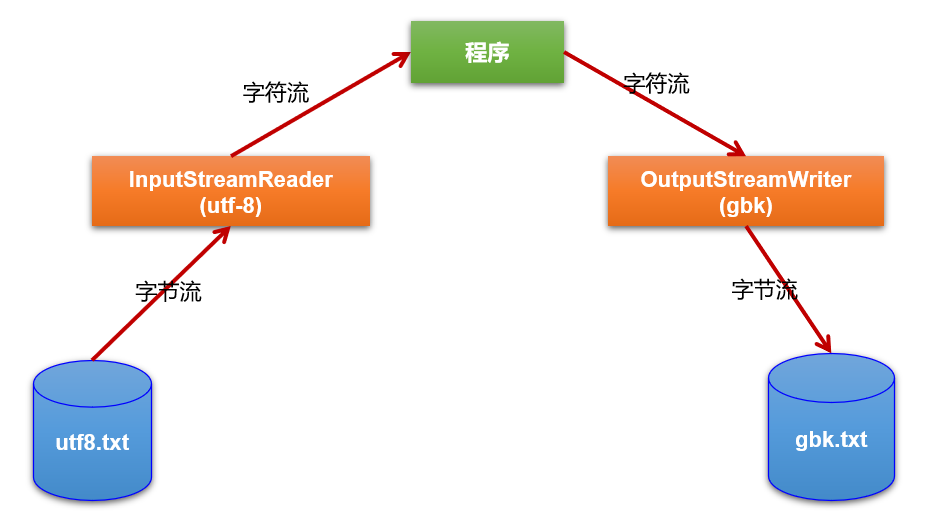

# Java基础

## 一、Java概述

### （一）Java简介

#### ①Java历史

+ `Java`在`1.4`版本前都是`1.x`的版本命名的，直到`Java 5.0`发布时，其更新变动较大，为凸显其重要性，直接称为`Java 5.0`，后续版本也随之变化
+ `Java 8.0(又称Java 1.8)`是继`Java 5.0`之后的变化最大的版本，它是`Java`的**长期支持版本(LTS)**
  + 长期支持版本:该类型的版本不会随着其后续版本的更新而不再更新，而是会持续更新
  + 现在的`Java 8.0(又称Java 1.8)`最新版的`JDK`已经包含`JRE`了，无需再单独安装`JRE`
+ `Java 9.0`后,官方宣布版本每半年更新一次
+ `Java 11.0`发布于`2018.9.25`,是**长期支持版本**
+ `Java 17.0`发布于`2021.9`，是**长期支持版本**

---

#### ②Java特点

+ 跨平台性
  + `Java`在设计时就着重考虑了可移植性和跨平台性，比如：Java的int永远都是32位。不像C++可能是16，32，可能是根据编译器厂商规定的变化。
+ 面向对象性
  + `Java`是完全的面向对象的语言
+ 安全性高:
  + `Java`有自己的安全防范机制(`ClassLoader`加载器)，可以分配不同的命名空间以防替代本地的同名类、字节代码检查。
+ 简单性:
  + 顾名思义，`Java`学起来比`C++`和`C`简单
+ 高性能：
  + `Java`最初发展阶段，总是被人诟病“性能低”,但在其之后的发展中，通过`JIT(JUST IN TIME)`即时编译技术等措施提高了其运行效率，目前其运行效率不是太低

---

### （二）JDK

#### ①JDK概述

+ `JDK=JRE+开发工具集(javac等)`
+ `JRE=JVM+ Java SE标准类库`
+ [下载地址](https://www.oracle.com/cn/java/technologies/downloads/#java17)

---

#### ②JVM

+ `JVM（Java Virtual Machine ，Java虚拟机）`：是一个虚拟的计算机，是`Java`程序的运行环境。`JVM`具有指令集并**使用不同的存储区域，负责执行指令，管理数据、内存、寄存器**。
+ 作用:
  1. `JVM`保证了`Java`语言的跨平台性,我们生成的字节码文件事实上都运行在`JVM`内，由`JVM`与操作系统及硬件底层进行交互
  2. `JVM`还可以进行`Java`程序的内存管理，该操作是自动的:
     + `Java`程序在运行时，涉及到运算的操作和存储操作，都是`JVM`来执行的
     + `Java`消除了程序员回收无用内存空间的职责。提供了一种系统级线程跟踪存储空间的分配情况，在内存空间达到相应阈值时，检查并释放可被释放的存储器空间。
     + `GC`的自动回收，提高了内存空间的利用效率，也提高了编程人员的效率，**很大程度上减少**了因为没有释放空间而导致的**内存泄漏**。
---

### （三）编译与运行

#### ①编译与运行基础

+ 使用命令提示符进行编译与运行流程:
  1. `javac xxxx.java`:编译`java`文件为`class`字节码文件
  2. `java xxxx.class`:运行`class`字节码文件

#### ②Hello World

+ [HelloWorld](../源码/Java/StudyCode/src/helloWorld/HelloWorld.java)

> + 一个`java`文件内**可以编写多个类**，但仅能**至多一个**类被`public`修饰，且该类必须与`java`文件名相同
> + 如果出现类名相同的情况，编译会出现错误，但如果类名不区分大小写相同，编译可能会成功，但生成的`java`文件仅为一个，**因为`Windows`操作系统不区分大小写**，后面编译的`class`文件会覆盖掉前面的`class`文件

---

### （四）注释

+ `Java`有三种注释:
  + 单行注释:用于注释单行文本
  + 多行注释:可以注释多行文本
  + 文档注释（`Java`特有）:可以被`javadoc`识别的注释，生成一套以网页文件形式体现的该程序的说明文档
    + 生成方式:`javadoc -d 生成的文件夹名称 -author -version 指定java文件`

+ 注意：
> + 多行注释不支持嵌套
> + 注释不会被编译

---

## 二、内存结构

+ `JVM`的基本内存划分如下图所示:

|区域名称|作用|
|:---:|:---:|
|`虚拟机栈`|用于存储正在执行的每个`Java方法`的局部变量表等。局部变量表存放了编译期可知长度的各种基本数据类型、对象引用，**方法执行完，自动释放**。|
|`堆内存`|存储对象（包括数组对象），**new来创建的，都存储在堆内存**。|
|`方法区`|存储已被虚拟机加载的类的模板、常量、静态变量、即时编译器编译后的代码等数据。|
|`本地方法栈`|当程序中调用了native的本地方法时(如底层执行调用的`C语言`函数)，本地方法执行期间的内存区域|
|`程序计数器`|程序计数器是CPU中的寄存器，它包含每一个线程下一条要执行的指令的地址|

### （一）数组的内存划分

#### ①一维数组的内存结构

+ 一维数组内存结构可以概括为:
  + `栈`中存放指向真正的数组对象的**变量**，该变量通过**指针**指向数组对象的第一个元素，由于数组对象各元素之间是连续的，因此只要知道首个元素的地址，那么其它元素的地址也就都知道了
  + **数组对象**会被存放在`堆`中
  + 数组变量之间互相赋值时，实际上更改的是变量指向数组对象的内存地址
+ 一维数组之间的内存结构如下图所示:

---

#### ②多维数组的内存结构

+ 多维数组的内存结构实际上就是由外到内逐层使用指针指向下一级的一维数组的第一个元素，使这些数组建立起关联，让我们感觉到像是构造了多维数组一样
+ 下图示例以二维数组做样例来显示多维数组的内存结构

---

### （二）对象

#### ①单对象的内存划分

+ 实例对象这一变量被分配在**栈**中
+ 对象实体被分配在**堆**中
+ 类的模板在**方法区**中被储存

---

#### ②对象数组的内存划分

+ 变量指向对象数组的首地址
+ 对象数组的每个元素指向对应堆内的对象实体
+ 对象实体内的属性指向或存储其对应的值

### （三）方法

#### ①方法调用时

+ 方法在被**调用时，会入栈执行**。当方法**执行完毕后，方法会出栈**
+ 当方法被调用时，方法内定义的局部变量会被创建，方法出栈时，内部的局部变量会被销毁
+ 栈中没有`GC`，当栈内的元素**出栈时，它会被自动销毁**
+ 方法内调用方法时，尽管在逻辑上它们是有嵌套关系的，但在栈内，每调用一个方法，该方法都会入栈(这意味着它们实际上是同级关系，即都是一个栈内的元素)，然后**调用该方法的方法会等待该方法执行完毕后再执行**，因为栈总是先执行最上面的元素语句，因此最晚入栈的最先执行

---

#### ②方法参数传递时

+ 方法进行值传递时，如果是基本数据类型，那么直接将数据值传递过去，如果是引用数据类型，那么将地址值传递过去

---

### （四）字符串

---

## 三、变量与数据类型

### （一）标识符与关键字

#### ①标识符

+ `标识符`是`Java`中变量、方法、类等要素命名时使用的字符序列

+ 命名规则(**强制性要求，否则无法编译**):
  1. 由英文字母、数字、下划线和`$`组成
  2. 数字不可以作为`标识符`的开头
  3. 不可以使用`关键字`和`保留字`，但能包含`关键字`和`保留字`。
  4. `Java`中**严格区分大小写，长度无限制**。
  5. `标识符`不能包含空格。

+ 命名规范(建议性要求)
  1. 包名在多单词组成时**所有字母小写**
  2. 类名和接口名依照**大驼峰命名法**编写
  3. 变量名和方法名编写时按照**小驼峰命名法**进行编写
  4. 常量名需要**所有字母大写**

---

#### ②关键字

+ 关键字是被`Java语言`赋予了特殊含义，用做专门用途的字符串（或单词）
+ 特点：全部关键字都是`小写字母`。

+ 注意:
> + `true`、`false`和`null`并**不是关键字，而是字面量**

|分类|常用关键字|作用|备注|
|:---:|:---:|:---:|:---:|
|声明数据类型|`int`|声明`int`型变量|无|
|^|`double`|声明`double`型变量|无|
|^|`boolean`|声明`boolean`型变量|无|
|^|`String`|声明`String`型变量|无|
|^|`char`|声明`char`型变量|无|
|^|`byte`|声明`byte`型变量|无|
|^|`short`|声明`short`型变量|无|
|^|`long`|声明`long`型变量|无|
|^|`float`|声明`float`型变量|无|
|^|`var`|声明有**明确返回值类型**的**局部变量**|于`JDK10`引入|
|流程控制|`if`|执行判断语句，为真则执行其代码块中的代码|无|
|^|`else if`|同级`if`判断不通过时执行该判断语句，为真则执行其代码块中的代码|无|
|^|`else`|同级`if`和`else if`判断都不通过时执行该代码块内的代码，可有可无，但必须写在`if-else`结构最后|无|
|^|`switch`|`switch-case`结构的入口，需要传入一个表达式|`switch`中表达式中的值必须是如下类型:`int`、`byte`、`short`、`char`、`enum`(`JDK5.0`新增)、`String`(`JDK7.0`新增规范)|
|^|`case`|在`switch-case`结构内，用于顺序判断`switch`中表达式的值是否与`case`对应的常量相等，如果相等，执行后面的语句直到`break`|无|
|^|`default`|同级的`case`全部不通过时执行其后面的语句，不必写在`switch-case`结构的最后|无论写在`switch-case`结构的何处位置，`default`都会在**没有一个`case`匹配**的前提下才执行，但是，如果`default`后的代码没有`break`且其并没有写在结构的最后，那么它后面的`case`中的代码也会执行，因为**代码会执行到出现`break`或结构执行完毕为止**|
|^|`break`|跳出循环结构或`switch-case`结构|无|
|^|`for`|声明循环|无|
|^|`while`|声明循环|无|
|^|`yield`|使`switch`语句返回值|`JDK13`引入|
|面向对象|`class`|声明类|无|
|^|`return`|返回值操作|后面不写返回值时强制方法结束执行；后面写返回值时既强制方法结束执行又将该值返回|
|^|`new`|新建指定对象|无|
|^|`package`|指定对应类或接口所属的包|无|
|^|`import`|引入指定的外部类|`java.lang`和同一个包下的类不需要引入就能直接用|
|^|`extends`|指定继承的类对象|无|
|^|`this`|表示当前对象|无|
|^|`super`|表示父类对象|无|
|^|`instanceof`|判断当前实例对象是否为指定类或其子类的实例对象|无|
|^|`interface`|声明接口|无|
|^|`implements`|指定实现的接口|无|
|^|`sealed`|指定该类为密封类|`JDK15`引入,`JDK17`转正|
|^|`permits`|指定可以继承密封类的指定类|^|
|^|`non-sealed`|指定该类是可以继承密封类的非密封类|^|
|修饰符|`private`|使修饰对象仅能在类内部被调用|无|
|^|缺省|使修饰对象仅能在类内部和同一个包内被调用|无|
|^|`protected`|使修饰对象能在类内部、同一个包下和外包的子类中被调用|无|
|^|`public`|使修饰对象能在类内部、同一个包下、外包的子类和非子类中被调用|无|
|^|`static`|静态修饰符|无|
|^|`final`|使类无法被继承、方法无法被重写或变量无法被修改值|无|
|^|`abstract`|声明抽象类或抽象方法|无|
|^|`default`|在接口中修饰默认方法，在类中声明时，表示缺省修饰|无|
|^|`enum`|声明枚举类|`JDK5`被引入|
|异常处理|`throws`|指定方法需要向上抛出的异常类型|可以抛出多个异常。彼此使用逗号隔开|
|^|`throw`|手动抛出异常对象|`throw`后只能跟随`Throwable`类或其子类对象，且该语句后面的代码不会执行|
|多线程|`synchronized`|修饰代码块或方法同步|无|
|^|`volatile`|标记一个变量可以被多个线程访问|无|
|序列化|`transient`|标记一个变量不需要被序列化|无|
|[更多](https://docs.oracle.com/javase/tutorial/java/nutsandbolts/_keywords.html)|

---

### （二）变量

+ 变量是内存中的一个存储区域，该区域的数据可以**在同一类型范围内**不断变化,变量的作用是用于在内存中保存数据
+ 变量由三个部分构成:`数据类型`、`变量名`和`存储的值`
+ 声明变量的格式:`数据类型 变量名=值`，变量第一次被赋值时，称为变量的初始化
+ 在返回值确定的前提下，可以使用`var`关键字声明变量，但是不推荐
   
+ 注意
> + 每个变量必须先声明，后使用
> + 使用变量名来访问该变量存储的数据
> + 变量是由作用域的，它仅在其作用域内生效，相同作用域内无法声明重复的变量
> + 定义变量时，变量名应遵循标识符命名的规则和规范
> + 变量名赋值时，必须满足变量的数据类型，不能超出其类型范围

---

### （三）数据类型

#### ①基本数据类型

|基本数据类型|关键字|描述|可容纳数值|备注|样例|
|:---:|:---:|:---:|:---:|:---:|:---:|
|整型|`byte`|容纳很小的整数|占一个字节`8bit`，`-128~127`|使用字面量赋值时，需要使用类型转换|[整型数据类型样例](../源码/Java/StudyCode/src/dataTypeSample/NumberType.java)|
|^|`short`|容纳较小的整数|占两个字节`16bit`，`-65536~65535`|^|^|
|^|`int`|容纳一般大小的整数|占四个字节`32bit`，`-4294967296~4294967295`|`Java`默认`int`型数据为**整数字面量的默认数据类型**|^|
|^|`long`|容纳数值较大的整数|占八个字节`64bit`,`-2^64~2^64-1`|数值后需要加上字母`l`或`L`|^|
|浮点型|`float`|容纳较小的浮点数|占四个字节|数值后需要加上字母`f`|^|
|^|`double`|容纳较大的浮点数|占八个字节|`Java`默认`int`型数据为**浮点数字面量的默认数据类型**|^|
|字符型|`char`|容纳一个字符|占两个字节`16bit`,仅能表示一个字符|该类型可以分四种情况表示，具体请看示例|[字符型数据类型样例](../源码/Java/StudyCode/src/dataTypeSample/CharType.java)|
|布尔型|`boolean`|容纳布尔值|`true`和`false`,编译时不分配字节，`JVM`执行时会为其分配4个字节|无法使用`1`和`0`进行替换|[布尔型数据类型样例](../源码/Java/StudyCode/src/dataTypeSample/BooleanType.java)|

|进制|数字组成|进位规则|
|:---:|:---:|:---:|
|`二进制(binary)`|`0`和`1`|满二进一，以`0b`或`0B`开头|
|`八进制(octal)`|`0-7`|满八进一|
|`十进制(decimal)`|`0-9`|满十进一,以数字`0`开头表示|
|`十六进制`|`0-9`、`A-F`(不区分大小写)|满十六进一,以`0x`或`0X`开头|

+ 注意:
> + `float`表示范围比`long`大，且占用字节数较`long`小，但`float`类型的**精度没有`long`类型高**
> + 无论是`double`还是`float`，都有精度问题，这是**所有编程语言的通病**。如果需要高精度的运算，需要使用`BigDecimal`类

---

#### ②引用数据类型

|引用数据类型|描述|备注|
|:---:|:---:|:---:|
|类(`class`)|类|无|
|接口(`interface`)|接口|无|
|数组(`Array`)|数组|无|
|枚举(`enum`)|枚举|于`Java 5.0`提出|
|注解(`annotation`)|注解|于`Java 5.0`提出|
|记录(`record`)|记录|无|

##### Ⅰ字符串(String)

+ 字符串是比较常用的`Java`的引用数据类型，它可以用来表示一段长文本
+ 使用`String str="xxxx";`来定义一个`String`类型的变量
+ `String`类型**仅能与基本数据类型做拼接操作**，除此以外，它无法与基本数据类型做任何操作
+ `String`类型可以转换为一些基本数据类型，但**无法通过强制转换的方式来进行转换**
+ [样例](../源码/Java/StudyCode/src/classSample/commonClass/StringType.java)
+ [字符串小练习](../源码/Java/StudyCode/src/classSample/commonClass/StringExercise.java)

---

#### ③自动类型提升

+ `Java`的**基本数据类型**在进行运算时，运算结果的类型取决于一众运算数据的类型中表示**范围最大**的那个。该表示范围不是说占用的内存空间大小，而是说**实际上能表示的数值范围**。
+ 依据上述运算规则，可以得出如下类型提升规则:
  + `byte、short、char -> int -> long -> float -> double`
+ [样例](../源码/Java/StudyCode/src/typeConversionSample/AutoTypeElevation.java)
+ 注意
> + `Java`默认将整型字面量识别为`int`类型，将浮点型字面量识别为`double`类型，因此在进行数值运算时需要额外注意该情况
> + 依据上面的运算规则，可以**将`char`类型存储的字符直接赋值给`int`类型变量**
> + 使用`char`类型进行运算时，该类型变量将会被转换为其对应的编码数值(`int`类型)参与运算

---

#### ④强制类型转换

+ `Java`的基本数据类型间，如果想将范围大的类型转换为范围小的类型，可以在变量或字面量前写上`(int(不一定是int，写入想转换到的类型的关键字))`即可，如:`int a = (int)12L;`
+ [样例](../源码/Java/StudyCode/src/typeConversionSample/CastTypeConversion.java)
+ 注意:
> + 强制类型转换可能会出现**精度损失**，因为基本类型在进行强制类型转换时，实际上会从二进制的**低位到高位**截取对应长度的项，然后得到结果
> + 强制类型转换转换浮点数为整数时，遵循的是**取整原则**而不是四舍五入原则

---

### （四）读取键盘输入

+ `Java`提供了`Scanner`类帮助我们读取键盘输入的数据，但该类无法被直接使用，因为它不在`java.lang`中，需要导入`java.util.Scanner`才能使用
+ `Scanner`类提供了一系列方法供我们调用来读取键盘输入的各种类型的数据，这些方法一般用`nextxxx`表示，但没有`nextChar`方法

~~~java

  // 由于Scanner类不在Java.lang中，需要导包
  import java.util.Scanner;

  public class ScannerTest {
    public static void main(String[] args) {
        Scanner sc = new Scanner(System.in);  // 创建一个Scanner类的示例对象
        int number = sc.nextInt();  // 调用Scanner对象的方法，nextxxx()方法用来读取输入的各个类型的数据，但没有nextChar方法
        System.out.println(number);
        sc.close();  // 关闭sc对象，取消其对内存的占用，方便GC进行垃圾回收
    }
}

~~~

---

### （五）随机数

+ 可以使用`Java`提供的`Math.random()`方法来生成`[0.0,1.0)`的随机数
+ 因此，如果想得到`[a,b]`范围的随机数，只需要使用`(int)(Math.random()*(b-a+1))+a`，此处使用`(int)`进行强转的原因是为了向下取整
+ [随机数样例](../源码/Java/StudyCode/src/classSample/commonClass//GetRandom.java)

---

## 四、运算符

|运算符|描述|备注|样例|
|:---:|:---:|:---:|:---:|
|`+`|加法/拼接/取正运算符|无|略|
|`-`|减法/取负运算符|无|略|
|`*`|乘法运算符|无|略|
|`/`|除法运算符|取的是商|略|
|`%`|取余(取模)运算符|取的是余数|略|
|`++`|自增运算符,根据运算符所在的**先后顺序**决定是先用后加还是先加后用|运算**不会**改变变量的数据类型|[样例](../源码/Java/StudyCode/src/operatorSample/Operator1.java)|
|`--`|自减运算符,根据运算符所在的**先后顺序**决定是先用后减还是先减后用|^|^|
|`+=`|加法运算符|^|^|
|`-=`|减法运算符|^|^|
|`*=`|乘法运算符|^|^|
|`/=`|除法运算符|^|^|
|`%=`|取余运算符|^|^|
|`=`|赋值运算符|无|[比较运算符样例](../源码/Java/StudyCode/src/operatorSample/Operator2.java)|
|`==`|判断是否等于|引用数据类型比较时，比较内存地址|^|
|`>=`|判断是否大于等于|无|^|
|`<=`|判断是否小于等于|无|^|
|`!=`|判断是否不等于|无|^|
|`大于号(>)`|判断是否大于|无|^|
|`<`|判断是否小于|无|^|
|`!`|取非运算符|无|[逻辑运算符样例](../源码/Java/StudyCode/src/operatorSample/Operator3.java)|
|`&`|逻辑与运算，该运算执行全部判断|无|^|
|`&&`|短路与运算，在确定前面的是`false`之后，后面的判断不会执行|无|^|
|`\|`|逻辑或运算，该运算执行全部判断|无|^|
|`\|\|`|短路或运算，在确定前面的是`true`之后，后面的判断不会执行|无|^|
|`>>`|右移，在一定范围内，相当于该数除以2|仅能作用于数值类型|[位运算符样例](../源码/Java/StudyCode/src/operatorSample/Operator4.java)|
|`<<`|左移，在一定范围内，相当于该数乘以2|^|^|
|`>>>`|无符号右移，空缺出来的最高位用0补|^|^|
|`&`|按位与运算|^|^|
|`\|`|按位或运算|^|^|
|`倒v符(^)`|异或运算|^|^|
|`~`|按位取反|^|^|
|`(条件表达式?表达式1:表达式2)`|条件表达式为真时执行表达式1,条件表达式为假时执行表达式2|无|略|

---

## 五、流程控制

### （一）分支

#### ①if-else语句

+ 分支结构通过`if-else`语句实现
+ `if-else`语句可以通过如下语句进行判断操作:

~~~java

  // 如果括号内的条件语句成立，那么执行该if语句代码块内的操作，如果语句不成立，那么会顺着if-else结构向下判断，直到某一条件语句成立
  // 如果全部的条件语句全不成立，那么执行else代码块中的代码
  if(条件语句1){
    ....
  }else if(条件语句2){
    .....
  }else if(条件语句3){
    ....
    // if-else语句支持嵌套
    if(条件语句4){
      ....
    }else{
      ....
    }
    ....
  }else{
    ....
  }

~~~

+ `if-else`语句支持嵌套

#### ②switch-case语句

+ `switch-case`语句可以实现简单的，进行分支比较的操作，它相较于`if-else`，在代码层面上实现上述功能看起来更好看一点
+ 其基本语句为:

~~~java

  // switch结构在进行判断时，会先按代码编写顺序判断每个case对应的常量与表达式的值是否相等，如果相等，那么执行该case后面的代码直到碰到break或结构结束
  // break在此处的作用是跳出switch-case结构，继续执行结构后面的代码
  switch(表达式){
    case 常量:代码;break;
    case 常量:代码;break;
    default:代码;break;
  }

~~~

+ [样例](../源码/Java/StudyCode/src/switchSample/SwitchCase.java)

+ 注意:
> + `default`所在的位置不是必须的，只要写在结构里，且和`case`平级就行,它也是可有可无的，不是必须要写
> + 无论`default`的位置在哪，它都会在**与其同级的`case`全部不匹配**时才执行其后面的代码,但是，当`default`后的代码并没有`break`时，且它本身并没有写在结构的最后,**代码会继续向下执行直到碰到`break`或结构结束**
> + `switch`(表达式)中表达式的值必须是下述几种类型之一：`byte`，`short`，`char`，`int`，`enum(jdk 5.0新增)`，`String(jdk 7.0新增规范)`，比较字符串时会比较其值，而不是其内存地址
> + `case`后必须要写常量，而不能是其它玩意

---

#### ③改进型switch-case语句

+ `JDK12`引入了改进的`switch`表达式,于`JDK14`转正
+ 传统的`switch`语句具有的弊端如下:
  + 存在`case`穿透问题，只要没有写`break`语句就会自上而下依次执行
  + 所有的`case`语句共用一个块，这意味着不同的`case`对应的语句所声明的变量无法同名
  + 不能在一个`case`里面写多个条件
  + `switch`没有返回值
+ 改进的`switch`表达式就是为了解决这些问题设计的:
  + 使用`case x->`来替代以前的`break`,避免因为少写`break`出现问题。但为了兼容性，依然可以使用`:`，但**同一个`switch`不能同时存在两种写法**
  + `case`**可以跟随多个条件**:`case "aa","bb","cc"->System.out.println("匹配");`该语句表示只要匹配三个条件中的一个就能够执行后面的语句
  + `JDK13`的预览阶段追加了`yield`语句，它不同于`return`，是专门为`switch`返回对应值而设计的
  + `JDK17`引入了对`instanceof`功能的支持，即支持判断该变量属于哪个类的实例对象。但**要求匹配的类型后跟着一个变量来接收进行检验的变量强转后的对象**
+ [示例](../源码/Java/StudyCode/src/switchSample/NewSwitchSample.java)

+ 注意:
> + 如果`switch`语句想有返回值，需要确保它能够检查到变量的每一种可能的值，差不多就**相当于`default`必须得写**
> + 使用`case xxx->`的方式类似于`lambda`表达式，它不写代码块时仅能写一句代码，且该代码的运算结果会返回。

### （二）循环

+ 任何循环都有四个要素:
  1. 初始化部分
  2. 循环条件部分
  3. 循环体部分
  4. 迭代部分

#### ①for循环

+ 语法:`for(初始化表达式;条件表达式;循环处理表达式1,循环处理表达式2,...){循环体代码}`
+ 增强for循环语法:`for(类型 变量:遍历对象){循环体代码}`
+ [for循环样例](../源码/Java/StudyCode/src/circulateSample/ForCirculate.java)
+ [增强for循环](../源码/Java/StudyCode/src/circulateSample/EnhanceForCirculate.java)
+ 注意:
> + `for`循环括号内的三个表达式**均可忽略**,若全部忽略，那么将导致**无限循环**
> + `for`循环每次循环完成的循环后处理表达式如果想进行多个操作，那么只需将**每行代码间使用逗号(英文)隔开**即可

---

#### ②while循环

+ 语法:`while(条件表达式){代码}`
+ [while循环样例](../源码/Java/StudyCode/src/circulateSample/WhileCirculate.java)
+ 能用`for`循环做到的，`while`一样可以做到

 

+ `do-while`是`while`循环的一种特殊情况，无论如何，它将至少执行一次循环体语句
+ 语法:`do{代码}while(条件表达式)`

---

### （三）break与continue

+ `break`用于跳出`switch-case`语句或当前循环语句
+ `continue`用于跳过本次循环体代码执行，直接执行下一次循环
+ 二者可以通过指定标签的形式来指定跳出或跳过哪个循环
+ [样例](../源码/Java/StudyCode/src/circulateSample/BreakAndContinue.java)

---

## 六、数组

+ `数组(Array)`，是多个**相同类型**数据按一定顺序排列的集合，并使用一个名字命名，并通过编号的方式对这些数据进行统一管理
+ 数组有如下特点:
  + 数组初始化以后，长度是确定的
  + 数组中的添加的元素是**依次紧密排列的，有序的，可以重复**的。
  + 数组声明的类型，就决定了进行元素初始化时的类型。不是此类型的变量，就不能添加
  + 可以存储基本数据类型值，也可以存储引用数据类型的变量

### （一）一维数组

+ 数组有两种定义方式:
  1. 静态声明:`int[] arr1=new int[]{1,2,3,4};`，该声明方式提供数组元素的初值
  2. 动态声明:`int[] arr2=new int[4];`，该声明方式仅声明数组长度，但不提供数组具体元素的初值
+ 数组可以通过下标进行访问，下标表示**该元素相对于数组首地址的偏移量**
+ [数组样例1](../源码/Java/StudyCode/src/arraySample/Array1.java)

+ 注意:
> + `JVM`为其分配内存时，会为其分配一整块连续的内存空间供其使用。占据空间的大小取决于**数组的长度**和**数组中元素的类型**
> + `Java`中的数组长度一旦确定就无法更改，数组长度可以通过`array.length`访问到，该变量是只读属性，无法修改
> + **数组属于引用数据类型**
> + 静态声明时，如果赋值语句和声明语句写在一起，可以省略`new`语句，因为此时编译器能够进行**类型推断**
> + 由于数组不属于基本数据类型，引用数据类型这样做**无法进行自动类型提升**。因此`int[] arr5=new byte[5];`之类的代码无法通过编译
> + 数组中的元素，如果未赋初值，那么会自动得到一个初始化值，依据初始化的数组类型的不同，元素的初始化值也不同:
>    1. `int/long/short/byte[]`:`0`
>    2. `double/float[]`:`0.0`
>    3. `char[]`:`'\u0000'`,即`0`,**不是字符`'0'`,字符`'0'`对应的是数值48**
>    4. `boolean[]`:`false`
>    5. 引用数据类型的数组:`null`,**不是字符串`"null"`**

---

### （二）一维数组的内存结构

+ 一维数组内存结构可以概括为:
  + `栈`中存放指向真正的数组对象的**变量**，该变量通过**指针**指向数组对象的第一个元素，由于数组对象各元素之间是连续的，因此只要知道首个元素的地址，那么其它元素的地址也就都知道了
  + **数组对象**会被存放在`堆`中
  + 数组变量之间互相赋值时，实际上更改的是变量指向数组对象的内存地址
+ 一维数组之间的内存结构如下图所示:

---

### （三）多维数组

+ `Java`语言里提供了支持多维数组的语法:想定义几维的，就写几对中括号
+ [多维数组样例](../源码/Java/StudyCode/src/arraySample/Array2.java)

+ 注意:
> + 二维数组实际上相当于**一个一维数组的每个元素都是一个一维数组**，这些元素通过下标索引来得到其指向数组的对应元素的值。根据这个底层机制，可以推断出实际上不存在多维数组
> + 由于数组是引用数据类型，因此**无法像基本数据类型一样进行自动类型提升**，这句话的意思是诸如`int[] arr1 = new byte[5];`之类的代码是无法通过编译的
> + 以二维数组为例说明其默认初值:
>    + 如果是以`xxx[][] arr = new xxx[2][]`声明的，那么外层元素的初值都是`null`,**内层元素不存在，尝试读取时会出现空指针异常(`NullPointerException`)**
>    + 如果是以`xxx[][] arr = new xxx[2][3]`声明的，那么外层元素的初值是**已经被分配内存空间的对应数组元素所指向的数组的第一个元素的内存地址**，内层元素初值根据类型不同，初值也不同，详情查看笔记`一维数组`部分

---

### （四）多维数组的内存结构

+ 多维数组的内存结构实际上就是由外到内逐层使用指针指向下一级的一维数组的第一个元素，使这些数组建立起关联，让我们感觉到像是构造了多维数组一样
+ 下图示例以二维数组做样例来显示多维数组的内存结构

---

### （五）数组小练习

+ [数组的反转](../源码/Java/StudyCode/src/arraySample/Array3.java)
+ [数组的扩容与缩容](../源码/Java/StudyCode/src/arraySample/Array4.java)
+ [二分查找、冒泡排序和快速排序](../源码/Java/StudyCode/src/arraySample/Array5.java)

+ `稳定性`：若两个记录A和B的关键字值相等，但排序后A、B的先后次序保持不变，则称这种排序算法是稳定的。

---

## 七、面向对象

### （一）概述

+ 面向对象，是软件开发中的一类编程风格、开发范式，除`面向对象`外，还有`面向过程`、`指令式编程`和`函数式编程`等

|编程风格|关注焦点|代码结构|特点|典型语言|
|:---:|:---:|:---:|:---:|:---:|
|面向对象|`类`，即对事务特征的抽象|以`类`为组织单位，类里面有其独特的`属性`和`行为/功能`|适合解决复杂问题，代码扩展性强，可维护性高|`Java`、`Python`、`C++`、`C#`等|
|面向过程|`过程`，即操作数据的步骤|以`函数`为组织单位，以应对重复性的代码|适合解决简单问题，扩展能力差，后期维护难度较大|`C语言`|

+ 面向对象是**宏观**上的，在微观上，我们依旧需要用面向过程的思路去处理。因此，面向对象和面向过程是**相辅相成**的

---

### （二）工程、模块、包与类

+ `idea`在管理`Java`项目时，依据`Project(工程)->Module(模块)->package(包)->Class(类)`的顺序逐级向下展开
  + 一个工程内可以有多个模块
  + 一个模块内可以有多个包
  + 一个包内可以有多个类
+ `package`关键字可以用来指定该类或接口属于哪个包
  + 语法:`package xxx.xx.xxxxx`
  + 一个类或接口只能有一个`package`关键字，因为一个类或接口只能在一个包下
  + `package`语句作为`Java`源文件的第一条语句出现。若**缺省该语句，则指定为无名包**
  + 包通常使用**所在公司域名的倒置**
  + 同一个包下可以声明多个结构（类、接口），但是不能定义同名的结构（类、接口）。不同的包下可以定义同名的结构（类、接口）
+ `import`关键字可以用来引入外部类
  + 语法:`import java.lang.*;`,其中`*`表示引入该包下的全部类
  + `import static`组合使用可以调用指定类或接口下的**静态**的属性或方法
  + 如果在代码中使用**不同包下的同名的类**，那么就需要**使用类的全类名**的方式指明调用的是哪个类
+ `JDK`内的常用包:
  + `java.lang`，`Java`语言的核心类，不需要`import`引入就可以直接使用该包里面的类,如`String`、`System`、`Math`、`Integer`、`Thread`等
  + `java.net`，`Java`执行网络相关操作的类和接口
  + `java.io`，专门针对`IO`操作的类
  + `java.util`，包含了一些实用工具类，如`Arrays`、`List`、`Date`、`HashMap`等
  + `java.text`，包含了一些`Java`格式化相关的类
  + `java.sql`，包含了`Java`进行`JDBC`数据库编程的相关类/接口
  + `java.awt`，`Java`用来设计`GUI`的类
+ [样例](../源码/Java/StudyCode/src/packageTest/PackageAndImport.java)

---

### （三）类与对象

+ 在`Java`中，`类`和`对象`是面向对象的**核心概念**
  + 类:**具有相同特征的事物的抽象描述**，是抽象的、概念上的定义
  + 对象:**实际存在的该类事物的每个个体**，是具体的，因而也称为`实例(instance) `

#### ①类的创建

+ 类中可以声明`属性`，用来表示对某一事物特征的描述；还可以声明`方法(method)`，用来表示某一事物的具体操作
+ 类的声明格式为:`[修饰符] 类名{ 类的内容 }`
+ 类的声明语句示例如下:

~~~java
    class Test{
        // 定义类的属性
        int age;
        char gender;
        String name;
        // 定义构造器
        public Test(){
          ...
        }
        // 定义方法
        public void test(){
            代码
        }
    }
~~~

---

#### ②成员变量与局部变量

+ 在类中定义的属性，我们称为`成员变量`
+ 在方法内声明或为方法形参的变量，我们称为`局部变量`

|变量类型|声明位置|声明方式|内存中的存储位置|生命周期|作用域|修饰符|默认值|
|:---:|:---:|:---:|:---:|:---:|:---:|:---:|:---:|
|成员变量|在类的方法之外，类里面|正常声明变量的方式|堆，因为**对象实体存放在堆中**|随类的实例对象创建而创建，每一个实例对象都有其自己的成员变量，**各实例对象的成员变量间互不影响**|在类里面可以直接调用，在类外面需要使用实例对象进行调用|略|有默认值|
|局部变量|在类的方法内|^|栈，因为**局部变量在方法执行时才被创建，而方法执行是在栈中执行的**|随方法的执行而创建，方法执行完后被销毁，每个方法执行时，**内部的局部变量都是互不影响的**|方法内|`final`|没有默认值|

+ [样例](../源码/Java/StudyCode/src/classSample/MemberVariableAndLocalVariable.java)

---

#### ③构造器

+ 在`Java`中，可以在类中写一个或多个构造器，通过调用这些构造器，我们可以得到类的对应的对象
+ 构造器的语法格式为:
  ~~~java
    [修饰符] 类名(参数列表){
      代码
    }
  ~~~
  + 构造器名必须与它所在的类名必须相同
  + 它没有返回值，所以不需要返回值类型，也不需要void
  + 构造器的修饰符只能是**权限修饰符**，不能被其他任何修饰
   
+ 注意:
> + 如果我们并没有显式的生命构造器，`Java`会自动为该类创建一个**无参构造器**
> + 当我们**显式的声明构造器**后，自动的无参构造器就会**消失**，此时我们如果想再次使用无参构造器需要自己手动定义
> + 在类中，至少会存在一个构造器，“至少”说明构造器是**可以重载**的
> + 构造器又被称为构造方法，但它与方法没有关系，只是有一些性质与方法一致。**在编译生成的字节码文件中，每个构造器都被解释为一个`init`方法**,`init`方法内实际上包含了**变量的显式赋值、代码块内的赋值和构造器内的代码**

---

#### ④代码块

+ 如果类的属性赋值无法通过简单的一句代码实现，那么可以考虑使用代码块进行赋值
+ 格式:`{代码}`，很简单的格式，只需要使用一对大括号把代码包起来
+ 代码块**只能被`static`关键字修饰**
  + 被`static`关键字修饰的代码块称为静态代码块，它具有`static`修饰的一些性质
  + 没有被声明的就是普通代码块

|代码块|输出语句|对类进行初始化操作|调用静态属性和静态方法|调用非静态属性和方法|执行时机|执行次数|
|:---:|:---:|:---:|:---:|:---:|:---:|:---:|
|静态代码块|√|√|√|×|类加载时|一次|
|非静态代码块|√|√|√|√|对象创建时，**先于构造器执行**|每个对象创建时都执行一次|

+ 如果重载的构造器内存在重复的代码，可以把这些代码抽取出来放在非静态代码中
+ [样例1](../源码/Java/StudyCode/src/block_sample/BlockSample1.java)
+ [样例2](../源码/Java/StudyCode/src/block_sample/BlockSample2.java)
+ [操蛋面试题1](../源码/Java/StudyCode/src/block_sample/BlockSample3.java)
+ [操蛋面试题2](../源码/Java/StudyCode/src/block_sample/BlockSample4.java)
+ [操蛋面试题3](../源码/Java/StudyCode/src/block_sample/BlockSample5.java)
+ 以上样例记住:`由父及子，静态先行`
   
+ 注意:
> + 静态代码块会随着类加载而执行，因此**一般静态代码块的输出操作会最先显示**
> + 非静态代码块会在构造器内默认的`super()`或自定义的`super(xxx)`或`this()`执行后，在构造器其它代码执行前执行，也就是说，一个类的实例创建时，**先创建父类实例对象，再执行非静态代码块，再执行构造器内的显式代码**
> + 代码块可以写多个，但是写多少个**最后编译成字节码时也会被整合成一个**

---

#### ⑤内部类

+ 定义在类内部的类，叫内部类，包裹内部类的类称为外部类
  + 直接声明在外部类内部的类叫成员内部类
    + 如果被`static`修饰，称为静态成员内部类
    + 如果未被`static`修饰，称为非静态成员内部类
  + 声明在方法体中、构造器内、代码块内的类称为局部内部类
    + 如果类有名字，称为非匿名局部内部类
    + 如果类没有名字，称为匿名局部内部类
+ 内部类有如下特点:
  + 可以**被四个权限修饰符修饰**(一般类无法被`private`修饰)
  + 可以使用外部类的结构(**静态内部类无法使用外部类的非静态结构**)
  + 可以被`static`、`abstract`、`final`修饰，被`abstract`修饰时，可以被其它内部类继承
  + 可以定义自己的**属性、方法、构造器、代码块、内部类**
  + 可以继承自己想继承的类，实现自己想实现的接口，**与外部的父类和父接口无关**，不写默认继承`Object`、不实现任何接口
  + 编译后生成`OuterClass$InnerClass.class`字节码文件
  + 匿名内部类对象实际上是`new`的**对应类的子类对象或接口的实现类对象**
  + 由于内部类可以使用它的外部类的结构，因此**非静态内部类**在构造其对象时会**记住调用它的构造器的外部类对象当前的结构**
+ [成员内部类样例](../源码/Java/StudyCode/src/classSample/InnerClassSample1.java)
+ [局部内部类样例](../源码/Java/StudyCode/src/classSample/InnerClassSample2.java)

---

#### ⑥属性赋值流程

+ 成员变量的赋值顺序为:`①默认初始化->②显式初始化/代码块初始化->③构造器初始化->④通过方法或对象赋值`。其中，①②③仅能赋值一次，④可以赋值多次
+ [样例](../源码/Java/StudyCode/src/classSample/AssignmentSample.java)

---

#### ⑦对象的创建与使用

+ 如果我们想使用这个类，我们需要创建这个类的`实例对象`,创建实例对象需要使用`new`关键字:`Test t = new Test();`
+ 创建完对象后，就可以使用该对象了:

~~~java
    Test t = new Test();
    // 访问类中定义的属性，并给它们赋值
    t.age=12;
    t.name="李子轩";
    t.gender='男';
    t.test();  // 调用类中定义的方法
~~~

---

### （四）方法

#### ①方法基础

+ `方法`是**类或对象行为特征的抽象**，用来完成某个功能操作。在某些语言中也称为`函数` 或`过程`。方法可以减少代码冗余，实现代码重用，简化代码
+ `Java`中的方法不能独立存在，必须定义在类中
+ 方法声明的格式:`[修饰符] 返回值类型 方法名 (形参列表) [throws 异常列表]{方法体}`
  + 修饰符:用于修饰方法的一些**关键字**
  + 返回值类型:规定方法的返回值类型，如果不返回值,写`void`。方法在进行返回值返回时，需要使用`return`关键字，格式为:`return 返回值;`如果不写返回值，那么`return`的作用是**强制该方法结束执行**
  + 方法名:属于标识符，命名时建议遵循标识符命名规则和规范
  + 形参列表:表示完成方法体功能时**需要外部提供的数据列表**，如果不需要接收，不写即可，如果要写，格式为:`形参类型1 形参1,形参类型2 形参2,....`
  + 异常列表:详情参考[异常处理](#Exception)
   
+ 注意:
> + 即使编写顺序在上的方法调用了编写顺序在下的方法，**编译时不会报错**，因为**在调用方法的代码执行前，`JVM`已经创建好了这些方法，并将它们存放在`方法区`中**

#### ②重载

+ 只要满足下面的条件,我们就称为方法的`重载(overload)`:
  + 在同一个类中
  + 方法名称相同
  + 形参列表不同(包括参数类型和参数数量)
+ [样例](../源码/Java/StudyCode/src/functionSample/MethodOverload.java)
+ [操蛋面试题](../源码/Java/StudyCode/src/functionSample/SillyQuestion1.java)
   
+ 注意:
> + 编译器只会识别类、方法名和形参列表，**它不会看方法的返回值类型**，因此，仅仅只有返回值类型不同而其它都相同的方法不能称为方法的重载，且编译时会报错
> + 调用重载的方法时，传入的参数不会自动类型提升或强制类型转换，除非我们强制它这样做重写

---

#### ③重写

+ 由于子类相对于父类可以进行拓展，因此子类可以声明**与父类方法的方法名和参数列表一致**的方法，并对该方法进行改造，通过这种方式可以在子类中调用方法时覆盖父类的方法调用而调用子类的方法，称为方法的`重写(Override)`
+ 方法重写**依赖于继承**的实现，它的具体规范为:
  + 重写的方法必须与父类**方法名一样**，且**参数列表一样**
  + 如果被重写方法的返回值类型为`void`或基本数据类型，那么重写方法的返回值类型也**必须为`void`或基本数据类型**
  + 如果被重写方法的返回值类型为引用数据类型，那么重写方法的返回值类型可以为**被重写方法的返回值类型或其子类**
  + 重写方法的权限修饰符范围必须**不小于**被重写方法的权限修饰符范围
    + `private`修饰的方法无法被重写。缺省修饰的类的方法无法在包外被重写，因为**缺省修饰的类无法在包外被访问**
  + 重写方法抛出的异常可以是**被重写方法抛出异常的子类或其本身**，该规则**仅限于编译时异常**
  + 使用`static`修饰的方法无法被重写，但子类和父类中都**可以**定义同名同参数的方法，因为它们属于类，可以被直接调用，不存在覆盖关系。只有不被`static`修饰的方法才有可能被重写
+ [样例](../源码/Java/StudyCode/src/functionSample/Override2.java)

---

#### ④可变参数

+ 从`JDK5.0`起，`Java`开始支持方法接收可变个数的参数，其声明格式为:`参数类型 ...参数名`
+ 可变参数能接收**多个相同类型的值**，在方法中，它会以**数组**形式提供给我们使用
+ 可变参数只能**写在参数列表的最后面**
+ 如果想进行方法的重载，当两个方法所在类、方法名以及参数列表的参数数量都一致时，如果它们中有一个方法使用的是可变参数，而另一个方法使用了与该可变参数承接的类型相同的对应类型数组接收参数时，编译器**不认为**它们两个是重载关系，而是认为它们是相同的
  + 举例:
  ~~~java
    // 编译器会认为以下两个方法是相同的
    public int test1(int ...x){
      方法体
    }

    public int test1(int[] x){
      方法体
    }
  ~~~
+ [可变参数样例](../源码/Java/StudyCode/src/functionSample/VariableParameter.java)
+ 注意:
> + 可变参数接收数组时，**如果数组内的元素属于引用数据类型，那么会将该数组展开，将其内部的元素依次放入可变参数表示的数组内(如果为多重数组，仅会将最外层展开)**。如果数组内的元素是基本数据类型，那么会将数组整体作为一个元素放入可变参数表示的数组内。该情况**仅适用于实参数量为1时**

---

#### ⑤方法值传递机制

+ `Java`的基本数据类型，由于**已经确定**了它们占用多少的内存空间，因此**可以用变量直接存储**，而**不用像引用数据类型一样使用指针指向堆中的对应实体**
+ `Java`的引用数据类型，由于**无法确定**它们到底占用多少内存空间，因此**变量需要使用指针指向堆内存中的对应对象实体**
+ 基于以上说法，方法在进行值传递时，也分为基本数据类型的值传递和引用数据类型的值传递:
  + 基本数据类型传递参数时，传递的就是**数据的值**，而不是内存地址
  + 引用数据类型传递参数时，传递的是**内存地址**，即**地址值**
  + 因此，`Java`中方法的参数传递方式只有一种，就是**值传递**(没有什么引用传递之类的一说)
+ [值传递机制样例1](../源码/Java/StudyCode/src/functionSample/PassByValue1.java)
+ [值传递机制样例2](../源码/Java/StudyCode/src/functionSample/PassByValue2.java)

---

#### ⑥递归

+ 递归就是**方法自己调用自己**来解决问题的一种方案，它包含了一种隐式的循环
+ 递归方法会重复的调用某一段代码，但这种重复**必须在可控范围内**，否则会导致由于一直调用方法使得**栈内存溢出**
+ 递归时，方法会调用多次，每次调用方法式都需要让方法入栈，这样一直重复调用，直到栈顶的方法到达了递归的临界条件开始出栈，这意味着最先调用的方法最后执行完毕
+ [递归样例1](../源码/Java/StudyCode/src/functionSample/Recursion1.java)
+ [递归样例2](../源码/Java/StudyCode/src/functionSample/Recursion2.java)
   
+ 注意:
> + 递归调用会**占用大量的系统堆栈，内存耗用多**，在递归调用层次多时**速度要比循环慢**，所以在使用递归时要慎重
> + 在要求高性能的情况下尽量避免使用递归，递归调用**既花时间又耗内存**。考虑使用**循环**迭代

---

### （五）封装、继承与多态

#### ①封装

+ 为了实现**高内聚低耦合**，我们需要让我们定义的类满足一些规范，使它们尽量向这方面靠近
+ 所谓封装，就是**把客观事物封装成抽象概念的类**，并且类可以把自己的数据和方法**只向可信的类或者对象开放**，向没必要开放的类或者对象隐藏信息
+ 为了实现封装，需要引入四个权限修饰符，它们可以作用于`类`、`成员变量`、`方法`、`构造器`、`内部类`

|修饰符|本类内部|本包内|其它包的子类|其他包的非子类|
|:---:|:---:|:---:|:---:|:---:|
|`private`|√|×|×|×|
|缺省|√|√|×|×|
|`protected`|√|√|√|×|
|`public`|√|√|√|√|

+ 另外，为了实现对数据修改和读取的限制，还需要实现类中对应属性的`getter`和`setter`方法
+ [示例1](../源码/Java/StudyCode/src/permissionmodifiers1/Sample1.java)
+ [示例2](../源码/Java/StudyCode/src/permissionmodifiers2/Sample3.java)
+ 例:

~~~java
  public class Test{
    // 用不同的修饰符修饰类中的属性
    private int number;
    String name;
    protected boolean isBoy;
    public double weight;
    // set方法示例
    private int setNumber(int number){
      this.number=number;
    }
    // get方法示例
    public getNumber(){
      return number;
    }
  }
~~~

+ 注意:
> + 主方法格式是固定的，必须使用`public static void main(String[] args)`来修饰，**如果更改修饰符，那么它会变成一个普通的方法**
> + `final`修饰的变量不提供`set`方法

---

#### ②继承

+ `Java`支持类与类之间存在继承关系:
  + 让一个类继承一个类，被继承的类中包含有继承类的基本信息与操作，此时继承的类可以进行相关拓展，这属于**自上而下**的继承
  + 当多个类存在相同的属性和方法时，可以将它们抽离出来，单独组成一个类作为这些类的父类，这属于**自下而上**的继承
+ 继承使用`extends`关键字来实现，其格式为:`[修饰符] 子类类名 extends 父类类名{代码}`，继承的类称为`子类`，被继承的类称为`父类`
  + 继承使得子类可以使用父类的属性和方法，但**会受到权限修饰符的限制**
  + 继承可以**减少代码冗余，提高代码复用性**
  + 继承有利于子类进行**功能拓展**
  + 继承**为多态的实现提供了前提**
+ [继承样例](../源码/Java/StudyCode/src/extendtest/Extends2.java)
   
+ 注意:
> + 一个父类可以被多个子类继承，但是**一个子类只能继承一个父类**
> + `Java`支持**多层继承**，因此子类在调用属性或方法时，如果在自己类里面找不到，则会去父类里面找，如果也找不到，则到父类的父类找，以此类推直到找到或全都找不到。
> + 如果一个类**没有显式的声明它的父类**，则它**默认继承`Object`类**

---

#### ③多态

##### Ⅰ多态基础

+ 多态就是以相同方式处理不同对象实现不同效果，在`Java`中，多态以**父类的引用指向子类的对象**来体现
+ 多态的实现前提是:①类之间实现了继承②重写了对应方法
+ 多态的利与弊:
  + 变量引用的子类对象不同，执行的方法就不同，实现动态绑定。代码编写更灵活、功能更强大，可维护性和扩展性更好了。
  + 一个引用类型变量如果声明为父类的类型，但实际引用的是子类对象，那么该变量就**不能**再访问子类中添加的属性和方法。
+ [多态样例](../源码/Java/StudyCode/src/polymorphism/Polymorphism.java)
+ [多态练习](../源码/Java/StudyCode/src/polymorphism/PolymorphismExer1.java)
   
+ 注意:
> + `Java`的引用变量有两种类型，分别是`编译时类型`和`运行时类型`。编译时的类型由**声明该变量的类型**决定，运行时的类型由**该变量实际被赋给的值的类型**决定。因此，判断时可以依据“编译看左边，运行看右边”的原则判断类型
> + 多态仅能作用于方法，无法作用于类中的属性，即**成员变量没有多态性**
> + 多态的实现使用了`虚方法调用(Virtual Method Invocation)`的特性:
>   + 虚方法是指在编译阶段不能确定方法的调用入口地址，在运行阶段才能确定的方法，即**可能被重写的方法**。
>   + 当一个字节码文件被装载进`JVM`内部时，如果被调用的目标方法**在编译期可知，且运行期保持不变**时。这种情况下将调用方法的符号引用转换为直接引用的过程称之为**静态链接**。那么调用这样的方法，就称为**非虚方法调用**。比如调用`静态方法`、`私有方法`、`final方法`、`父类构造器`、`本类重载构造器`等
>   + 如果被调用的方法**在编译期无法被确定下来**，也就是说，只能够**在程序运行期将调用方法的符号引用转换为直接引用**，由于这种引用转换过程具备动态性，因此也就被称之为**动态链接**。调用这样的方法，就称为**虚方法调用**。比如调用`重写的方法（针对父类）`、`实现的方法（针对接口）`

---

##### Ⅱ向上转型与向下转型

+ 使用`new`关键字创建一个对象的时候，该对象在创建到回收的全过程中，其本质都不会变。但根据指向它的变量的实际声明类型的不同，这些变量在编译时的类型会不相同
+ 使用多态进行操作时，虽然在一些程度上使代码更加灵活，但变量实际上会**向上转型**使我们无法调用子类独特的方法和属性。
+ 如果想要继续使用子类的方法和属性，就需要进行**向下转型**，但是首先需要**判断该对象属于哪个类的实例**
  + `instanceof`关键字用于判断对象是否属于对应类或其子类的实例对象
  + 如果不进行判断而贸然进行强制类型转换，那么可能会发生`ClassCastException`，因为在不知情的前提下向下转型可能出现错误
+ [样例](../源码/Java/StudyCode/src/Polymorphism/Transformation.java)

---

### （六）关键字汇总

#### ①this与super

+ `this`关键字用于在方法内部使用，表示调用该方法的对象
  + `this`可以调用类中的属性、方法以及构造器
  + [this样例](../源码/Java/StudyCode/src/keywordSample/ThisKeywords.java)
     
  + 注意:
  > + `this`如果要调用构造器，那么`this`**仅能在构造器内使用**，且必须是**第一条语句**，但必须**保证调用`this`时不会出现环路**
  > + `this`在方法的形参名和类的属性名冲突时可以用来区分两者
  > + 如果本类中找不到对应的属性和方法，那么`this`会向其**父类**寻找
  > + 在本类中，如果直接使用属性或方法而不写`this`，实际上是默认省略了`this`，它相当于写了`this`
  > + 对于调用方法来说，在创建对象时，`this`会指向`new`关键字声明的对象，而在对象直接调用时，`this`仅指向调用该方法的对象
+ `super`关键字用于在一些特殊情况下调用父类的方法和属性，如在子类和父类出现同名属性时、子类重写了父类的对应方法但需要调用父类被重写的方法时
  + `super`可以调用父类的属性、方法以及构造器
  + [super样例](../源码/Java/StudyCode/src/keywordSample/ThisAndSuperExer2.java)
       
  + 注意:
  > + ①子类继承父类时，**不会继承父类的构造器**。
  > + ②使用`super(参数)`调用构造器时，它只能作为子类**构造器**内的**第一行代码**出现，这意味着`this`与`super`在同一个构造器内**仅能出现一个，不能同时出现**
  > + ③子类在构造对象时，在没有显示使用`this`和`super`调用构造器时，默认使用`super()`方法调用父类的**无参构造器**构造其父类对象，然后再构造子类对象，这意味着**父类对象会先于子类对象被创建**
  > + ④由②③可以推出，子类构造器中**要么会调用本类中重载的构造器，要么会调用父类的构造器**
  > + 由⑤和`this`不能闭环的性质可以推出，一个类中声明有n个构造器，**最多**有n-1个构造器中使用了`this(形参列表)`，则剩下的那个一定使用`super(形参列表)`
   
+ [super与this练习1](../源码/Java/StudyCode/src/keywordSample/ThisAndSuperExer1.java)
+ [super与this练习2](../源码/Java/StudyCode/src/keywordSample/ThisAndSuperExer2.java)

---

#### ②static

+ 有时我们希望类的不同实例对象有一些共享属性或方法，使用`static`关键字可以实现上述效果:
  + `static`关键字可用于修饰属性、方法、代码块和内部类
  + `static`修饰的成员具备以下特点:
    + 随着类的加载而加载
    + 优先于对象存在，即在对象还未创建时便可以直接调用
    + 修饰的成员，被所有对象所共享
    + 访问权限允许时，可以不创建对象，直接被类调用
+ 格式:
~~~java
  class Test{
    private static nation="中国";
    private int age;
    private String name;

    public Test(){

    }

    static{
      System.out.println("静态代码块输出");
    }

    public static void show1(){
      System.out.println("静态方法输出");
    }

  }
~~~

|变量类型|个数|内存位置|调用者|加载时机|消亡时机|
|:---:|:---:|:---:|:---:|:---:|:---:|
|静态变量|内存中仅一个|`JDK6`及之前存放于方法区中，从`JDK7`开始存放于堆内|能被类或对象调用|类加载时|随类的消亡而消亡|
|实例变量|每个对象都有自己的变量|堆|只能被对象调用|对象创建时|随对象消亡而消亡|

+ 由于类加载时对象可能还未创建，因此实例变量无法直接通过类名访问，而变量创建时，类一定已经加载好了，因此静态变量既可以通过类名访问也可以通过对象访问
+ 什么时候使用`static`关键字修饰:
  + 对于变量，考虑当所有实例对象共享该变量时，或声明类中的常量时,将变量声明为静态变量。如`Math.PI`
  + 对于方法，考虑方法内操作的是静态变量时，或撰写的类是工具类，将方法声明为静态方法。如:`Arrays`、`Math`类
   
+ 注意:
> + 静态方法在本类的任意方法、代码块、构造器中都可以直接被调用
> + 只要权限修饰符允许，静态方法在其他类中可以通过“类名.静态方法“的方式调用。也可以通过”对象.静态方法“的方式调用（但是更推荐使用类名.静态方法的方式）
> + 在static方法内部**只能访问类的static修饰的属性或方法，不能访问类的非静态结构**，而在非静态方法内部**既能访问静态成员也能访问实例成员**
> + 静态方法**可以被子类继承**（继承后通过子类的类名也可以访问了），但**不能被子类重写**，因为可以直接通过类名调用，重写了也没有任何意义
> + 静态方法的调用都**只看编译时类型**。
> + 因为不需要实例就可以访问静态方法，因此静态方法内部**不能有`this`，也不能有`super`**。如果有重名问题，使用“类名.”进行区别

+ [样例](../源码/Java/StudyCode/src/keywordSample/StaticSample1.java)
+ [操蛋面试题](../源码/Java/StudyCode/src/keywordSample/StaticSample2.java)

---

#### ③final

+ `final`可以用来修饰类、变量、方法
  + 修饰类时，**该类无法被继承**
  + 修饰变量时，该**变量必须被赋值，且一旦赋值便无法被修改**
    + 修饰类的成员变量时，可以选择`显式赋值`、`代码块赋值`、`构造器赋值`这三种赋值方式其中之一进行赋值，**不能通过`默认赋值`、`对象直接赋值`、`方法赋值`的方式来赋值**
    + 修饰方法内的局部变量时(方法的形参，或方法内定义的变量)，一旦赋值便不能再修改
  + 修饰方法时，**方法无法被重写**
+ 如果`static`与`final`关键字搭配（一般都作用在类的成员变量上，因为静态方法本来就无法被重写，而局部变量无法被`static`修饰），那么该变量实际上就变成了一个不可变的、静态的常量，它同时具备`final`和`static`的特性
+ 注意
> + 在静态代码块中进行赋值本身是没有问题的，但是如果在静态代码块里面的`try-catch`语句进行赋值，就会出现**编译错误**的问题
+ [final样例](../源码/Java/StudyCode/src/keywordSample/FinalSample1.java)

---

### （七）Object类

+ `java.lang.Object`类是所有其它类的父类

|方法|参数|描述|返回值|返回值类型|备注|样例|
|:---:|:---:|:---:|:---:|:---:|:---:|:---:|
|`clone()`|无参数|浅拷贝|一个新对象|`Object`|调用该方法的前提是**类实现`Cloneable`接口**|[Object方法样例1](../源码/Java/StudyCode/src/classSample/commonClass/ObjectSample1.java)|
|`finalize()`|无参数|在`GC`回收对象实体之前调用该方法来执行一些操作(如断开相关连接资源)，即“临死前的遗言”|无返回值|`void`|该方法在`JDK 9`以后属于过时方法，虽然能够调用但是可能会出现循环调用对象而无法实现对象回收的问题|^|
|`equals(Object obj)`|`obj`:要比较的对象|比较两个对象是否一致，默认比较内存地址|相等返回`true`,不等返回`false`|`boolean`|可以通过重写该方法来更改比较规则|^|
|`toString()`|无参数|返回表示该对象具体信息的字符串|字符串|`String`|可以通过重写该方法自定义返回的字符串|^|
|`getClass()`|无参数|获取对象的**运行时**其所在类对应的`Class`对象|运行时其所在类对应的`Class`对象|`Class<?>`|无|^|
|`hashCode()`|无参数|获取对象的哈希值|哈希值(数值)|`int`|无|^|
|`notify()`|无参数|唤醒一个因为调用`wait()`方法而等待的线程|无返回值|`void`|**1.该方法需要在同步代码块或同步方法内被调用，且调用者必须是同步监视器** 2.如果有多个线程在等待，那么优先唤醒优先级高的，如果优先级相同，那么随机唤醒一个|[Object方法样例2](../源码/Java/StudyCode/src/ThreadSample/ThreadSample5.java)|
|`notifyAll()`|无参数|唤醒所有因为调用`wait()`方法而等待的线程|无返回值|`void`|**该方法需要在同步代码块或同步方法内被调用，且调用者必须是同步监视器**|^|
|`wait()`|无参数|使线程释放对同步监视器的调用，并进入等待状态|无返回值|`void`|^|^|
|`wait(long timeoutMillis)`|`timeoutMillis`:指定线程等待的最大毫秒数|使线程释放对同步监视器的调用，并进入等待状态，线程最多等待`timeoutMillis毫秒`时长后自动被唤醒|无返回值|`void`|^|^|
|`wait(long timeoutMillis,int nanos)`|`timeoutMillis`:指定线程等待的最大毫秒数 `nanos`:指定线程等待的最大纳秒数|线程释放对同步监视器的调用，并进入等待状态，线程最多等待`timeoutMillis毫秒+nanos纳秒`时长后自动被唤醒|无返回值|`void`|^|^|

---

### （八）抽象类与抽象方法

+ 随着继承层次中一个个新子类的定义，类变得越来越具体，而父类则更一般，更通用。类的设计应该**保证父类和子类能够共享特征**。有时将一个父类设计得非常抽象，以至于它没有具体的实例，这样的类叫做抽象类。
  + 举例:汽车、电动车、自行车都属于交通工具，而它们都有一些共同特征，比如用什么驱动、有几个轮子、消耗什么能源等，它们的父类（交通工具类）无法统一设置它们的具体细节，但是可以把它们的共同特征声明出来，而子类在继承父类的时候，再根据自身特征具体的去实现父类声明的这些特征
+ `Java`使用`abstract`关键字声明`抽象类`和`抽象方法`
  + `抽象类`:被`abstract`关键字声明的类，内部**可以声明属性、非抽象方法和抽象方法**
  + `抽象方法`:被`abstract`关键字声明的方法，没有方法体。它**必须写在抽象类中**
+ 抽象类可以继承抽象类，也可以重写其父类内声明的方法
+ 抽象方法无法创建自己的实例，但是需要有构造器，因为**子类继承该类，在创建子类实例时需要调用该抽象类的构造器**
  + 即使创建了实例也没有意义，因为实例没有具体的方法体。因此试图创建该实例时会出现编译错误
+ 子类在继承抽象类后，需要**实现抽象类内声明的全部抽象方法**，或者**子类也为抽象类**。否则会编译错误
+ [样例](../源码/Java/StudyCode/src/abstractSample/AbstractSample1.java)
+ 注意:
> + `abstract`关键字**不能修饰私有方法(私有方法无法被重写)、静态方法(无法被重写)、`final`修饰的方法(无法被重写，且需要方法体)和类(无法被继承)**
> + `abstract`关键字**不能修饰变量、代码块、构造器**

---

### （九）接口

#### ①接口定义

+ 接口用来定义规范，它使用`interface`关键字来声明:

~~~java
  [修饰符] interface 接口名{
    public final static 修饰的常量
    public abstract 修饰的方法
    public default 修饰的默认方法。可以有方法体  // JDK8新增
    public static 修饰的静态方法，可以有方法体  // JDK8新增
    private 修饰的私有方法，可以有方法体，仅能在接口内被调用  // JDK9新增
  }
~~~

+ 接口内可以定义:
  + `public final static`修饰的常量，前缀可忽略。必须使用接口名或子接口名来访问
  + `public abstract`修饰的方法，前缀可忽略
  + `public default`修饰的**默认方法**，该方法可以有方法体，`JDK8`新增特性
  + `public static`修饰的**静态方法**，该方法可以有方法体，`JDK8`新增特性。必须使用接口名来访问
  + `private`修饰的**私有方法**，该方法可以有方法体，`JDK9`新增特性
+ 接口内**不能声明构造器和代码块**，因为没有成员变量需要初始化，他们都是常量

---

#### ②接口的实现和多继承

+ 类通过`implements`关键字来实现对应的接口
  + 如果类实现了对应接口，那么必须实现接口内定义的方法，或者实现类为抽象类
  + 默认方法可以不重写，静态方法和私有方法不能被重写
  + 类可以**实现多个接口**
  + 可以使用接口类型声明的变量接收实现了接口的类对象，从而实现接口的多态性
+ 接口可以通过`extends`关键字来继承接口，且**接口间可以多继承**
  + 继承后的接口继承了其父接口的抽象方法、默认方法和静态变量，但**无法继承静态方法**

---

#### ③样例及注意事项

+ [样例](../源码/Java/StudyCode/src/interfaceSample/InterfaceSampleImpl1.java)
+ [接口练习1](../源码/Java/StudyCode/src/interfaceSample/InterfaceSampleImpl2.java)
+ [接口练习2](../源码/Java/StudyCode/src/interfaceSample/InterfaceSampleImpl3.java)
+ 注意:
> + 子接口继承时，**无法继承父接口的静态方法**
> + 同时实现多个接口，或子接口同时继承多个类导致冲突时，需要**重写方法**来解决该问题，否则编译不通过
> + 接口的静态方法和静态变量**只能通过接口名去调用，无法通过对象调用**
> + 如果类已经重写了接口的方法，但依然像调用接口内的默认方法，可以**通过`接口名.super.方法()`来调用接口内的默认**
> + 如果一个类的父类和其实现的接口内的默认方法存在冲突，**父类的方法会优先被调用**，这被称为`类优先原则`
> + 如果一个类的父类和其实现的接口内的变量名存在冲突，需要**明确的指明要调用的变量**，否则编译不通过
> + 接口内`default`不能被省略，类内可以被省略

---

#### ④接口与抽象类的异同

---

### （十）枚举类

+ 枚举类型（`JDK5.0`）本质上也是一种类，只不过是这个类的对象是有限的、固定的几个，不能让用户随意创建。
  + 当枚举类的类对象为一个时，它就相当于单例模式了
+ 枚举类使用`enum`修饰:
~~~java
  [修饰符] enum Test{
    TEST1,TEST2,TEST3;
    private Test(){

    } 
    方法...
  }
~~~
+ 枚举类在`JDK5.0`时被提出，在`JDK5.0`之前，程序员需要自己定义枚举类型
+ 枚举类的实现要求:
  + 私有化构造器，保证用户无法随意创建实例对象
  + 在类的内部声明有限个`public final static`修饰的类对象，以达到向外暴露这些变量且无法随意修改的目的
  + 实例对象需要写在类的最前面,使用`变量名(参数)`的方式声明，可以省略`public static final`前缀，同时省略`new 构造器`后缀，各实例对象彼此使用英文`,`隔开，最后的变量以`;`结尾
  + 枚举类可以实现接口，但是无法继承类，因为被`enum`修饰的类默认继承`Enum`类
+ [枚举类样例](../源码/Java/StudyCode/src/enumerationSample/EnumerationSample1.java)
+ [改造单例模式](../源码/Java/StudyCode/src/enumerationSample/EnumerationSample2.java)
+ [早期声明枚举类的样例](../源码/Java/StudyCode/src/enumerationSample/enumerationSample3.java)
   
+ `Enum`类常用方法:

|方法/属性|参数|描述|返回值|返回值类型|备注|
|:---:|:---:|:---:|:---:|:---:|:---:|
|`String toString`|无参数|默认返回对象名|对象名|`String`|可以重写|
|`static T[] values()`|无参数|返回枚举类型的对象数组|枚举类型的对象数组|枚举类型[]|静态方法|
|`static valueOf(String name)`|`name`:想得到的枚举类对象的名称|得到对应名称的枚举类对象|枚举类对象|枚举类型|如果枚举类中没有该对象会报错|
|`String name()`|无参数|得到当前枚举对象的名字|枚举对象名字|`String`|建议用`toString`|
|`int ordinal()`|无参数|返回当前枚举对象的序列号|枚举对象的序列号|`int`|序列号从0开始，序列顺序取决于枚举类型对象在类中的定义顺序|

---

### （十一）注解

+ `JDK5.0`引入了`注解(annotation)`,它可以在不改变原有逻辑的前提下，在源文件中嵌入一些补充信息:
  + 使用`@注解名`的方式来使用
  + 可用于修饰包、类、构造器、方法、成员变量、参数、局部变量的声明
  + 支持添加`key=value`形式的参数值
  + 注解可以在类编译、运行时进行加载，体现不同的功能

|分类|常见注解|描述|备注|
|:---:|:---:|:---:|:---:|
|文档相关注解|`@author`|标明作者|无|
|^|`@version`|标明版本|无|
|^|`@see`|参考转向，即相关主题|无|
|^|`@since`|从哪个版本开始增加的|无|
|^|`@param`|方法中的参数说明|无|
|^|`@return`|方法的返回值说明|无|
|^|`@exception`|方法抛出的异常说明|无|
|`JDK`内置注解|`@Override`|检查方法重写是否合法|仅能作用于方法|
|^|`@Deprecated`|提示修饰的元素（类、方法等）已过时，但该版本依然能正常使用|可以用于修饰属性、方法、构造、类、包、局部变量、参数|
|^|`@SuppressWarnings`|抑制编译器警告|可以用于修饰类、属性、方法、构造、局部变量、参数|

+ 元注解:对其它注解进行限制、声明的注解。`JDK1.5`声明了四个元注解

|元注解|值|描述|备注|
|:---:|:---:|:---:|:---:|
|`@Target`|枚举类型`ElementType`的10个常量对象|描述注解的使用范围,如参数、类、方法等|无|
|`@Retention`|`SOURCE`:源代码阶段被读取 `CLASS`:字节码阶段被读取 `RUNTIME`:运行时被读取，仅在该阶段注解能被反射读取到|描述注解的声明周期|无|
|`@Documented`|无|声明该注解应被`javadoc`工具记录|无|
|`@Inherited`|无|允许子类继承父类中的注解|无|

+ 自定义注解格式如下:
~~~java
  [元注解]
  [修饰符] @interface 注解名{
    [成员列表]
  }
~~~
+ 自定义注解可以通过四个元注解来声明其生命周期、作用范围、能否被继承、是否被生成到`API`文档内
+ 注解的成员以无参数有返回值的抽象方法来进行声明，如:`String[] value()`，返回值类型只能为八种：`String`、`Class`、`enum`、`Annotation`，及这四种类型的数组类型
+ 可以使用`default`关键字为抽象方法**指定默认值**，即`String name default "aaa";`
+ 使用注解时，如果它有抽象方法，那么必须给它指定值(除非它有默认值)，格式为`key=value`的形式。如果**仅一个抽象方法且该抽象方法名`value`**，那么可以直接传入值而不指定`key`
+ [自定义注解样例](../源码/Java/StudyCode/src/annotationSample/AnnotationSample1.java)

---

### （十二）包装类

+ 对于基本数据类型来说，它无法参与到与对象相关的操作中去，为了解决这一问题，`Java`提供了包装类来使基本数据类型对应自己的引用数据类型

+ 从基本数据类型向包装对象间的转换称为装箱，而反过来则称为拆箱
  + 装箱可以通过各包装类的构造器实现，也可以通过对应包装类的`valueOf`方法实现(这是个静态方法)。如`Integer integer1 = Integer.valueOf(4);`
  + 拆箱可以通过各包装类对象的`xxValue`方法实现，如:`int n = integer1.intValue();`
  + 从`JDK5.0`开始，基本类型与包装类的装箱、拆箱动作可以自动完成
+ 一般来说，大部分操作都围绕字符串、包装类对象和基本数据类型之间进行:
  + 使用`String.valueOf()`方法来实现包装类对象和基本数据类型转换字符串,如:`String str = String.valueOf(1);`，也可以用更直接的方式:`String str = 1 + "";`
  + 使用各包装类的`parseXxx`方法来将字符串转换为基本数据类型,如:`int n = Integer.parseInt("12");`
+ 在创建包装类对象时，一些包装类对象会有缓存，如果要转换的值在这些缓存的区间内，那么会直接从对应的缓存中直接抽取出对应已经创建好的对象的内存地址出来

|包装类|缓存区间|
|:---:|:---:|
|`Byte`|-128~127|
|`Short`|-128~127|
|`Integer`|-128~127|
|`Long`|-128~127|
|`Float`|无|
|`Double`|无|
|`Character`|-128~127|
|`Boolean`|`true`和`false`|

+ [包装类样例1](../源码/Java/StudyCode/src/WrapperSample/WrapperSample1.java)
+ [操蛋面试题1](../源码/Java/StudyCode/src/WrapperSample/WrapperSample2.java)
+ [操蛋面试题2](../源码/Java/StudyCode/src/WrapperSample/WrapperSample3.java)
+ [操蛋面试题3](../源码/Java/StudyCode/src/WrapperSample/WrapperSample4.java)
+ 注意:
> + `boolean`类型装箱时，它只会将字符串`"true"`和关键字`true`转换为`true`，其余情况全部为`false`
> + 各包装类之间没有可比性(无法使用`==`符号做判断)，但三元运算符在返回结果时，如果至少一方为对象，那么返回结果时会返回对应的对象且根据表示范围返回表示范围大的对象。如果没有对象，那么返回时会进行自动类型提升

---

### （十三）杂项

#### ①JavaBean

+ `JavaBean`是一种`Java`写成的可复用组件，它要求:
  1. 类是公共的
  2. 有一个无参的公共的构造器
  3. 有属性，且有`getter`和`setter`方法

---

#### ②UML类图

+ `UML（Unified Modeling Language，统一建模语言）`，用来描述**软件模型**和**架构**的图形化语言
+ 常用的UML工具软件有`PowerDesinger`、`Rose`和`Enterprise Architect`
+ 在软件开发中，使用UML类图可以**更加直观地描述类内部结构**（类的属性和操作）以及类之间的关系（如关联、依赖、聚合等）
  + `+`表示`public`类型,`-`表示`private`类型,`#`表示`protected`类型，缺省不写
  + 方法的表示方法:`[方法类型] 方法名 (参数名:参数类型):返回值类型`
  + 斜体表示抽象方法或类

---

## 八、常用类

+ 笔记内记录的常用类包括:
  + [System](#System)
  + [Scanner](#Scanner)
  + [String](#String)
  + [StringBuffer和StringBuilder](#OtherString)
  + [Arrays](#Arrays)
  + [Math](#Math)
  + [Collection、List、Set](#Collection)
  + [Map](#Map)
  + [Collections](#Collections)
  + [Iterator](#Iterator)
  + [比较器](#compare)
  + [Date](#Date)
  + [Calendar](#Calendar)
  + [SimpleDateFormat](#SimpleDateFormat)
  + [新日期类](#NewDate)
  + [Object](#Object)

### （一）系统相关类

#### ①System

+ `java.lang.System`是属于`Java`核心包下的类，它包含了一些基本的属性和方法

|方法/属性|参数|描述|返回值|返回值类型|备注|样例|
|:---:|:---:|:---:|:---:|:---:|:---:|:---:|
|`System.gc()`|无参数|强制调用`GC`进行垃圾回收|无返回值|`void`|无|有空填上|
|`System.currentTimeMillis()`|无参数|返回当前距离`1970-1-1T00:00:00`时刻的毫秒数|数值|`long`|无|^|
|`System.exit(int status)`|`status`:退出状态|终止当前正在运行的`Java`虚拟机|无返回值|`void`|无|^|
|`System.in`|无参|标准输入流对象|输入流对象|`InputStream`|无|^|
|`System.out`|无参|标准输出流对象|输出流对象|`PrintStream`|无|^|
|`System.err`|无参|标准错误输出流对象|输出流对象|^|无|^|
|`System.setIn(InputStream in)`|`in`:标准输入流对象|重新设置`System.in`|无返回值|`void`|源码里`in`是`final`修饰的，这里是调用了`native`方法进行的修改|^|
|`System.setOut(PrintStream out)`|`out`:标准输出流对象|重新设置`System.out`|无返回值|`void`|源码里`out`是`final`修饰的，这里是调用了`native`方法进行的修改|^|
|`System.setErr(PrintStream err)`|`err`:标准输出流对象|重新设置`System.err`|无返回值|`void`|无|^|
|`String getProperty(String key)`|`key`:系统内的属性名|获得操作系统中对应属性名的值|字符串值|`String`|无|^|

---

#### ②Runtime

+ 每个`Java`进程都有其对应的`Runtime`实例对象，使应用程序能够与其运行的环境相连接

|方法/属性|参数|描述|返回值|返回值类型|备注|样例|
|:---:|:---:|:---:|:---:|:---:|:---:|:---:|
|`public static Runtime getRuntime()`|无参|返回当前`Java`进程的`Runtime`对象|`Runtime`对象|`Runtime`|无|有空填上|
|`public long totalMemory()`|无参|得到`JVM`初始化时的内存总量|数值|`long`|无|^|
|`public long maxMemory()`|无参|得到`JVM`最大程度能够使用的内存容量|数值|`long`|无|^|
|`public long freeMemory()`|无参|得到`JVM`的空闲内存量|数值|`long`|无|^|

---

### （二）数学相关类

#### ①Math

+ `java.lang.Math`是属于`Java`核心包下的类，它包含了一些与数学运算相关的常量和类

|方法/属性|参数|描述|返回值|返回值类型|备注|样例|
|:---:|:---:|:---:|:---:|:---:|:---:|:---:|
|`Math.E`|无参|自然对数的底数(`e`)|`e`的近似值|`double`|无|有空再写|
|`Math.PI`|无参|圆周率(`Π`)|圆周率近似值|`double`|无|^|
|`public static double pow(double a,double b)`|`a`:底数 `b`:幂|求`a^b`|算术结果|`double`|无|^|
|`public static double sqrt(double a)`|`a`:待处理数值|求数的**平方根**|^|`double`|无|^|
|`public static double random()`|无参|返回`[0,1)`区间的随机数|^|`double`|无|^|
|`public static double abs(double a)`|`a`:待处理数值|求数的**绝对值**|^|`double`|无|^|
|`public static double ceil(double a)`|^|得到**大于等于该数的最小整数**|^|`double`|无|^|
|`public static double floor(double a)`|^|得到**小于等于该数的最大整数**|^|`double`|无|^|
|`public static long round(double a)`|^|四舍五入，如果是负数那么**向数轴右侧算入**|^|`double`|无|^|

---

#### ②Random

+ `java.util.Random`类专门用来进行随机数相关的操作

|方法/属性|参数|描述|返回值|返回值类型|备注|样例|
|:---:|:---:|:---:|:---:|:---:|:---:|:---:|
|`public boolean nextBoolean()`|无参|返回一个伪随机数，它取自该随机数对象的均匀分布的`boolean`值|一个布尔值|`boolean`|无|有空再写|
|`public void nextBytes(byte[] bytes)`|`bytes`:`byte`类型数组|生成随机字节并将其置于用户提供的`byte`数组中|无返回值|`void`|无|^|
|`public double nextDouble()`|无参|返回一个伪随机数，它取自该随机数对象的**均匀分布的在`[0.0,1.0)`区间**分布的值|一个浮点值|`double`|无|^|
|`float float nextFloat()`|无参|^|^|`float`|无|^|
|`public double nextGaussian()`|无参|返回一个伪随机数，该数是该随机数对象的呈**正态分布**的浮点值，其平均值为`0.0`,标准差为`1.0`|一个浮点值|`double`|无|^|
|`public int nextInt()`|无参|返回一个伪随机数，该数是随机数对象的**满足`int`类型可容纳数值区间**内的均匀分布的值|一个整数|`int`|无|^|
|`public int nextInt(int n)`|`n`:指定最大值|返回一个伪随机数，该数是随机数对象的**均匀分布在`[0,n)`区间**的整数值|一个整数|`int`|无|^|
|`public long nextLong()`|无参|返回一个伪随机数，该数是随机数对象的**满足`long`类型可容纳数值区间**内的均匀分布的数值|一个整数|`long`|无|^|

---

#### ③BigInteger

+ `java.math.BigTnteger`类用来表示**不可变的任意大小的整数值**

|方法/属性|参数|描述|返回值|返回值类型|备注|样例|
|:---:|:---:|:---:|:---:|:---:|:---:|:---:|
|`public BigInteger(String val)`|`val`:想表示的数值|生成对应值的`BigInteger`对象|新的`BigInteger`对象|`BigInteger`|无|有空再写|
|`public BigInteger abs()`|无参|返回此对象的绝对值|^|^|无|^|
|`public BigInteger add(BigInteger val)`|`val`:要进行运算的`BigInteger`对象|加法运算|^|^|引用数据类型不能使用四则运算符|^|
|`public BigInteger subtract(BigInteger val)`|^|减法运算|^|^|^|^|
|`public BigInteger multiply(BigInteger val)`|^|乘法运算|^|^|^|^|
|`public BigInteger divide(BigInteger val)`|^|除运算|^|^|^|^|
|`public BigInteger remainder(BigInteger val)`|^|取余运算|^|^|^|^|
|`public BigInteger pow(int exponent)`|`exponent`:幂|幂运算|^|^|^|^|
|`public BigInteger[] divideAndRemainder(BigInteger val)`|^|进行除法和取余运算，并将结果存放进`BigInteger`数组内|`BigInteger`数组|`BigInteger[]`|^|^|

---

#### ④BigDecimal

+ `java.math.BigDecimal`类用来表示**不可变的任意大小的浮点值**,且该值**没有精度误差**

|方法/属性|参数|描述|返回值|返回值类型|备注|样例|
|:---:|:---:|:---:|:---:|:---:|:---:|:---:|
|`public BigDecimal(double val)`|`val`:想表示的浮点值|生成对应值的`BigDecimal`对象|新的`BigDecimal`对象|`BigDecimal`|无|有空再写|
|`public BigDecimal(String val)`|`val`:想表示的浮点值|^|^|^|**推荐使用该方式构造**|^|
|`public BigDecimal add(BigDecimal augend)`|`augend`:要进行运算的`BigDecimal`对象|加法运算|^|^|引用数据类型不能使用四则运算符|^|
|`public BigDecimal subtract(BigDecimal subtrahend)`|`subtrahend`:要进行运算的`BigDecimal`对象|减法运算|^|^|^|^|
|`public BigDecimal multiply(BigDecimal multiplicand)`|`multiplicand`:要进行运算的`BigDecimal`对象|乘法运算|^|^|^|^|
|`public BigDecimal divide(BigDecimal divisor, int scale, int roundingMode)`|`divisor`:除数 `scale`:指定保留小数的位数 `roundingMode`:指定舍入模式(`ROUND_UP`:向上+1、`ROUND_DOWN`:直接舍去、`ROUND_HALF_UP`:四舍五入)|除法运算|^|^|^|^|

---

### （三）字符串

#### ①String

+ `java.lang.String`是属于`Java`核心类中的一个包，它代表字符串
+ 字符串属于常量,使用双引号表示，**可以直接使用赋值运算符赋值，也能使用`new`关键字赋值**
~~~java
  // 该处是JDK8的源码
    /*
      可以看到String实现了三个接口:
        Serializable:可序列化的接口。凡是实现此接口的类的对象就可以通过网络或本地流进行数据的传输
        Comparable:凡是实现此接口的类，其对象都可以比较大小
        CharSequence:实现此接口的类可以提供其内部属性的只读访问方法(文档:该接口提供对许多不同类型序列的统一只读访问)
      同时可以观察到String被final修饰，说明String无法被继承
      JDK8时，String底层依旧使用char[]类型来存储字符串
    */
  public final class String implements java.io.Serializable, Comparable<String>, CharSequence{
    private final char value[];  // 该数组使用final修饰，说明该类型不可变
    ...
  }
~~~

~~~java
  // 该处是JDK17的源码
    /*
      可以看到String在JDK8源码的基础上多实现了两个类
      同时，为了节省内存，String底层默认使用byte[]类型来存储字符串了,该变化从JDK9延续至今。
      因此，在声明一般的英文字符的时候，会默认使用byte[]类型存储，而在使用中文字符时，仍然会使用char[]类型进行存储
    */
  public final class String implements java.io.Serializable, Comparable<String>, CharSequence,Constable, ConstantDesc {
    @Stable
    private final byte[] value;  // 该数组使用final修饰，说明该类型不可变
    ...
~~~

---

##### Ⅰ字符串的不可变性

+ 一般在对字符串进行操作时，都要**频繁的修改、添加和删除字符串**，这会极大的浪费内存空间。为解决这一问题，`Java`的**字符串存储在字符串常量池**中:
  + `JDK7`之前，字符串常量池位于`方法区`内，`JDK7`及之后，字符串常量池位于堆中。因为堆内的`GC`操作比方法区的频繁，可以更好地节省内存空间。也是在`JDK7`及之后，**静态变量**的存储地也由`方法区`转到`堆`中了
  + 字符串常量都存放在字符串常量池内，但**字符串常量池不允许存放两个相同的字符串常量**
+ 每个变量指向一个字符串时，最终都会指向字符串常量池里面的字符串，而当该变量指向其它字符串时，字符串常量池内的原字符串不会更改，更改的是**变量指向的对象的内存地址**，这被称为字符串的不可变性
  + 使用`new`关键字进行字符串的创建时，会在**字符串常量池外的堆内空间**创建一个对象，对象的`value`指针**指向字符串常量池之内的字符串对象**
  + 使用赋值运算符直接赋值时，`value`指针直接指向字符串常量池内的字符串对象
    + 如果是字符串进行了拼接操作再进行赋值，那么依据它们的情况判断对象在哪里创建:
      + 如果是两个或多个常量做拼接，那么编译器编译时会进行优化，**最后生成的字节码文件中会直接赋值拼接完的字符串**，赋值对象会直接指向常量池内的字符串对象
      + 如果拼接操作中存在变量，那么会在字符串常量池外的堆内空间创建一个对象，由该对象的`value`指针再指向字符串常量池内的值，如果参与拼接的变量是`final`修饰的，那么会直接指向字符串常量池内的对象
    + 使用`concat`方法时，无论是变量还是常量，都会`new`一个对象返回
    + 调用字符串的`intern`方法时，返回的是字符串常量池中字面量的地址
+ 如果字符串常量池内没有对应的字符串值，那么会创建一个该字符串值，如果有，会直接将字符串常量池内的对应字符串值的地址返回，因此如果多个变量指向的字符串值相等时，**它们实际上最终指向的是同一个字符串值，但其直接指向的对象可能不同**
+ [样例](../源码/Java/StudyCode/src/classSample/commonClass/StringSample1.java)

---

##### Ⅱ常用方法

|方法/构造器|参数|描述|返回值|返回值类型|备注|样例|
|:---:|:---:|:---:|:---:|:---:|:---:|:---:|
|`public String()`|无参|创建一个String对象|字符串对象|`String`|无|[样例]()|
|`public String(String original)`|`original`:字符串|根据一个字符串创建一个字符串对象|^|^|无|^|
|`public String(char[] value)`|`value`:字符数组|根据一个字符数组创建字符串对象|^|^|无|^|
|`public String(byte[] bytes)`|`bytes`:`byte`类型的数组|根据一个`byte`类型数组创建字符串对象|^|^|无|^|
|`public String(byte[] bytes,String charsetName)`|`bytes`:`byte`类型的数组 `charsetName`:指定解码时的字符集|根据指定的解码字符集来对`byte`类型的数组解码并生成字符串对象|^|^|无|^|
|`public int length()`|无参|得到字符串长度|字符串长度值|`int`|无|^|
|`public boolean isEmpty()`|无参|判断字符串是否为空串|是返回`true`,不是返回`false`|`boolean`|无|^|
|`public boolean equals(Object obj)`|`obj`:待比较的对象|比较两个字符串是否相等|相等返回`true`,不相等返回`false`|`boolean`|无|^|
|`public boolean equalsIgnoreCase(Object obj)`|^|比较两个字符串是否相等，**不区分大小写**|^|^|无|^|
|`public int compareTo(String str)`|`str`:待比较的字符串|按照`Unicode`编码比较两个字符串大小|如果相等返回0，调用该方法的字符串大返回一个大于0的值，被比较的字符串大返回一个小于0的值|`int`|返回值实际上是两字符串中的字符**第一次出现不等时相减的结果**|^|
|`public int compareToIgnoreCase(String str)`|^|按照`Unicode`编码比较两个字符串的大小，**不区分大小写**|^|^|^|^|
|`public String[] split(String regex)`|`regex`:正则表达式|按照正则表达式的要求分割字符串|分割后的字符串组成的字符数组|`String[]`|无|^|
|`public String trim()`|无参|去除字符串两边的空白字符|新的字符串|`String`|**不会去除字符串内的空白字符**|^|
|`public String subString(int beginIndex)`|`beginIndex`:开始截取的字符串下标|从指定下标开始截取字符串直到结束|截取得到的字符串|`String`|无|^|
|`public String subString(int beginIndex,int endIndex)`|`beginIndex`:开始截取的字符串下标 `endIndex`:结束截取的字符串下标|截取下标区间`[beginIndex,endIndex)`的字符串|截取得到的字符串|`String`|无|^|
|`public char[] toCharArray()`|无参|将字符串转为字符数组|转换后的字符数组|`char[]`|无|^|
|`public byte[] getBytes()`|无参|将字符串转为`byte`类型数组|转换后的`byte`类型数组|`byte[]`|无|^|
|`public String replace(char oldChar, char newChar)`|`oldChar`:待替换的字符 `newChar`:要替换上去的字符|将字符串内的`oldChar`全部替换为`newChar`|替换后的新字符串|`String`|无|^|
|`public String replace(CharSequence target, CharSequence replacement)`|`target`:实现了`CharSequence`接口的待替换的类对象(`String`、`StringBuilder`、`StringBuffer`、`CharBuffer`、`Segment`) `replacement`:要替换上去的对象|将字符串内的`target`全部替换为`replacement`|替换后的新字符串|`String`|无|^|
|`public String replaceAll(String regex,String replacement)`|`regex`:正则表达式 `replacement`:要替换上去的字符串|将字符串内满足正则条件的子串全部替换为`replacement`|替换后的新字符串|`String`|无|^|
|`public String replaceFirst(String regex, String replacement)`|`regex`:正则表达式 `replacement`:要替换上去的字符串|将字符串内满足正则条件的**第一个**子串全部替换为`replacement`|替换后的新字符串|`String`|无|^|
|`public boolean contains(CharSequence c)`|`c`:实现了`CharSequence`接口的类对象(`String`、`StringBuilder`、`StringBuffer`、`CharBuffer`、`Segment`)|查找当前字符串内是否存在指定字符串|存在返回`true`,不存在返回`false`|`boolean`|无|^|
|`public int indexOf(int ch)`|`ch`:想查找的值|查找当前字符串中是否存在`ch`，如果存在返回其第一次被找到时的开始下标，不存在返回`-1`|下标索引|`int`|无|^|
|`public int indexOf(String str)`|`str`:想查找的字符串|查找当前字符串中是否存在对应字符串，如果存在返回其第一次被找到时的开始下标|下标索引|`int`|无|^|
|`public int indexOf(String str,int fromIndex)`|`str`:想查找的字符串 `fromIndex`:指定从哪个下标开始查找|从指定的索引处开始查找当前字符串中是否存在对应字符串，如果存在返回其第一次被找到时的开始下标|下标索引|`int`|无|^|
|`public int lastIndexOf(int ch)`|`ch`:想查找的值|**从后向前**查找当前字符串中是否存在`ch`，如果存在返回其第一次被找到时的开始下标，不存在返回`-1`|下标索引|`int`|无|^|
|`public int lastIndexOf(String str)`|`str`:想查找的字符串|**从后向前**查找当前字符串中是否存在对应字符串，如果存在返回其第一次被找到时的开始下标|下标索引|`int`|无|^|
|`public int lastIndexOf(String str,int fromIndex)`|`str`:想查找的字符串 `fromIndex`:指定从哪个下标开始查找|**从指定索引开始从后向前**查找当前字符串中是否存在对应字符串，如果存在返回其第一次被找到时的开始下标|下标索引|`int`|无|^|
|`public boolean startsWith(String str)`|`str`:要匹配的字符串|判断当前字符串是否以指定字符串开头|是返回`true`,不是返回`false`|`boolean`|无|^|
|`public boolean startsWith(String str,int toffset)`|`str`:要匹配的字符串 `toffset`:指定开始下标|判断当前字符串从指定下标开始是否以指定指定字符串开头|^|^|^|^|
|`public boolean endsWith(String)`|`str`:要匹配的字符串|判断当前字符串是否以指定字符串结尾|是返回`true`,不是返回`false`|`boolean`|无|^|
|`public static String valueOf(Object obj)`|`obj`:基本数据类型值或`char[]`类型数组|将`obj`转换为字符串|新的字符串|`String`|这是一个静态方法|^|
|`public static String valueOf(Object obj,int beginIndex,int endIndex)`|`obj`:基本数据类型值或`char[]`类型数组 `beginIndex`:转换的开始索引 `endIndex`:转换的结束索引|将`obj`的`[beginIndex,endIndex)`区间内的数据转换为字符串|新的字符串|`String`|^|^|
|`public static String copyValueOf(char[] data)`|`data`:要复制的字符数组|复制该字符数组并转换为字符串|新的字符串|`String`|^|^|
|`public static String copyValueOf(char[] data,int beginIndex,int endIndex)`|`data`:要复制的字符数组 `beginIndex`:复制的开始索引 `endIndex`:复制的结束索引|复制该字符数组的`[beginIndex,endIndex)`区间内的数据并转换为字符串|新的字符串|`String`|^|^|
|`public char charAt(int index)`|`index`:下标|得到字符串指定下标的字符|对应下标的字符|`char`|无|^|
|`public String toLowerCase()`|无参|将字符串的大写字母转换为小写|新的字符串|`String`|无|^|
|`public String toUpperCase()`|无参|将字符串的小写字母转换为大写|新的字符串|`String`|无|^|
|`public String concat(String str)`|`str`:要拼接的字符串|将两个字符串拼接起来|拼接后生成的新字符串|`String`|无|^|
|`public String intern()`|无参|>|返回常量池内的字符串对象|`String`|无|^|

---

#### ②StringBuilder与StringBuffer

+ `java.lang.StringBuffer`代表**可变**的字符序列，于`JDK1.0`中声明，它线程安全，但效率较低
+ `java.lang.StringBuilder`也代表**可变**的字符序列，于`JDK5.0`中声明。它线程不安全，但是效率高
+ 这两个类都可以进行字符串的增删改，此时不会产生新的对象

|字符串相关类|增删改操作是否产生新对象|是否线程安全|效率|底层存储类型|
|:---:|:---:|:---:|:---:|:---:|
|`String`|√|不知道|极低|`char[]`(JDK8),`byte[]`(JDK9及之后)|
|`StringBuffer`|×|√|较低|^|
|`StringBuilder`|×|×|高|^|

+ StringBuffer和StringBuilder的大部分方法都与String一致
|方法/构造器|参数|描述|返回值|返回值类型|备注|样例|
|:---:|:---:|:---:|:---:|:---:|:---:|:---:|
|`public StringBuffer/StringBuilder append(T data)`|`data`:基本数据类型、`char[]`或`AbstractStringBuilder`类型的值|向字符串中添加内容|字符串本身|`StringBuffer/StringBuilder`|无|[样例]()|
|`public StringBuffer/StringBuilder delete(int beginIndex,int endIndex)`|`beginIndex`:删除的起始下标 `endIndex`:删除的结束下标|删除本字符串内`[beginIndex,endIndex)`区间内的字符数据|字符串本身|^|无|^|
|`public StringBuffer/StringBuilder deleteCharAt(int index)`|`index`:要删除的下标|删除下标为`index`的字符|字符串本身|^|无|^|
|`public StringBuffer/StringBuilder insert(int index,T data)`|`index`:指定下标 `data`:基本数据类型、`char[]`、`Object`或`AbstractStringBuilder`类型的值|在指定下标前插入对应的值|字符串本身|^|无|^|
|`public StringBuffer/StringBuilder replace(int start, int end, String str)`|`start`:替换的起始下标 `end`:替换的结束下标 `str`:要替换原字符的字符串|将字符串内`[start,end)`区间内的字符串替换为`str`|字符串本身|^|无|^|
|`public StringBuffer/StringBuilder reverse()`|无参|字符串反转|字符串本身|^|无|^|
|`public void setCharAt(int index,char c)`|`index`:指定下标 `c`:指定设置的值|设置指定下标的字符为`c`|无返回值|`void`|无|^|
|`public void setLength(int length)`|`length`:要设置的长度|设置字符串长度为`length`|无返回值|`void`|无|^|
|`public String toString()`|无参|转换为字符串类型|转换后的字符串|`String`|无|^|
|`indexOf`、`lastIndexOf`、`substring`方法同`String`|

+ 注意:
> + `StringBuffer`、`StringBuilder`初始化时默认的字符数组长度为16,每次扩容时长度变化`2*length+2`

---

#### ③正则表达式

+ 基本语法与`JS`的正则表达式大致相同，详情参考`JS`笔记
+ 区别：

> 在其他语言中，**\\\\** 表示：**我想要在正则表达式中插入一个普通的（字面上的）反斜杠，请不要给它任何特殊的意义。**
> 在 Java 中，**\\\\** 表示：**我要插入一个正则表达式的反斜线，所以其后的字符具有特殊的意义。**
> 所以，在其他的语言中（如 Perl），一个反斜杠 **\\** 就足以具有转义的作用，而在 Java 中**正则表达式**中则需要有两个反斜杠才能被解析为其他语言中的转义作用。也可以简单的理解在 Java 的正则表达式中，两个 **\\\\** 代表其他语言中的一个 **\\**，这也就是为什么表示一位数字的正则表达式是 **\\\\d**，而表示一个普通的反斜杠是 **\\\\**。
> 根据实践，md的语法也遵从这一规律，虽然机理不一样。
> 省流：**\\\\**会将原本为正则表达式的特殊字符转义为Java中的字符。

+ 常见问题：

  1. 如果要用**正则表达式**匹配字符‘\’的话，需要写的**正则表达式**为:

     + 以匹配字符串“\d+”为例

     +  ~~~java
        package general;
        import java.util.*;
        import java.util.regex.*;
        public class Main {
            public static void main(String[] args) {
                Scanner sc = new Scanner(System.in);
                String a="a\\d+b";
                String x[]=a.split("\\\\d\\+");
                //我的理解：对于正则表达式，2个\\连在一起表示正则表达式中的'\'字符，4个一起的话，第一个和第二个变成一个正则表达式的‘\’，第三个和第四个也变成一个正则表达式的‘\’，而第一个‘\’会将第二个‘\’转义，使其变为字符'\'，因此四个用正则表达式表示的连续的\连在一起就会变成一个字符'\'而进行后续的正则运算
                //在字符串中，如果正则表达式的特殊字符与正常字符产生冲突时，例如'*'，他在正则表达式中表示匹配零次或多次，但它也是一个普通字符，此时它的正则表达式优先级更高，因此会表现出正则表达式的字符'*'的效果，如果要识别正常字符'*'，需要用到正则表达式的'\'（即两个\连在一起）,将'*'转为字符'*'。
                //在字符串中，一个\表示字符串转义，它可以匹配“\t、\b、\n、\r、\f、\'和\" ”。
                //在字符串中，两个\表示正则表达式的'\'，它可以将下一字符标记为特殊字符、文本、反向引用或八进制转义符。
                //在字符串中，三个\无法被编译器识别，目前不是很明白为什么正则表达式的\不能将转义\转化为字符\。
                //在字符串中，四个\表示字符'\'，四个\应该会成为两个正则表达式\，然后前面的\将后面的\转变为字符\。
                System.out.println(x.length);
                for(int i=0;i<x.length;i++){
                    System.out.println(x[i]);
                }
            }
        }
     
     
---

### （四）日期类

#### ①Date

+ `java.util.Date`于`JDK1.0`时被定义，它的大多数方法已经在`JDK1.1`引入`Calendar`类后被废弃

|方法/构造器|参数|描述|返回值|返回值类型|备注|样例|
|:---:|:---:|:---:|:---:|:---:|:---:|:---:|
|`public Date()`|无参|构造当前时间的`Date`对象|当前时间的`Date`对象|`Date`|无|[样例]()|
|`public Date(long time)`|`time`:时间戳毫秒值|构造时间戳对应的`Date`对象|`Date`对象|`Date`|无|^|
|`public long getTime()`|无参|得到对象对应的时间戳|时间戳|`long`|无|^|
|`public String toString()`|无参|将日期对象转换为字符串输出|日期字符串|`String`|无|^|

---

#### ②SimpleDateFormat

+ `java.text.SimpleDateFormat`类是一个不与语言环境有关的方式来格式化和解析日期的具体类。
  + 它可以将日期转化为指定格式的文本，也可以将指定格式文本转化为对应日期对象

|方法/构造器|参数|描述|返回值|返回值类型|备注|样例|
|:---:|:---:|:---:|:---:|:---:|:---:|:---:|
|`public SimpleDateFormat()`|无参|以默认的模式和语言环境创建对象|`SimpleDateFormat`对象|`SimpleDateFormat`|无|[样例]()|
|`public SimpleDateFormat(String pattern)`|`pattern`:自定义的格式|以自定义格式创建对象|^|^|无|^|
|`public String format(Date date)`|`date`:待转换的日期对象|以构造时的格式将日期对象转换为固定格式的文本|文本|`String`|无|^|
|`public Date parse(String source)`|`source`:待转换文本对象|将指定格式文本转化为对应日期对象|`Date`对象|`Date`|传入的文本格式必须与该对象构造时的格式一致|^|

+ `pattern`所遵循的格式也与要一定的规则，其具体规范如下表所示:

---

#### ③Calendar

+ `java.util.③Calendar`类于`JDK1.1`被引入，它是一个抽象类，用于完成日期子段之间相互操作的功能

|方法/构造器|参数|描述|返回值|返回值类型|备注|样例|
|:---:|:---:|:---:|:---:|:---:|:---:|:---:|
|`Calendar.getInstance()`|无参|得到`Calendar`的子类实例|`Calendar`的子类实例|`Calendar`|无|[样例]()|
|`public int get(int field)`|`field`:`Calendar`中声明的日期字段|得到对应日期字段的值|数值|`int`|无|^|
|`public void set(int field,int value)`|`field`:`Calendar`中声明的日期字段 `value`:要设置的值|将给定的日历字段设置为指定的值|无返回值|`void`|无|^|
|`public void add(int field,int amount)`|`field`:`Calendar`中声明的日期字段 `amoung`:增加或减少的量|为给定的日历字段添加或者减去指定的时间量|无返回值|`void`|无|^|
|`public final Date getTime()`|无参|将`Calendar`对象转换为`Date`对象|转换后的`Date`对象|`Date`|无|^|
|`public final void setTime(Date date)`|`date`:`Date`对象|将`Calendar`对象的时间设置为指定`Date`对象对应的时间|无返回值|`void`|无|^|

---

#### ③新日期类

+ `Date`和`Calendar`都属于`Java`早期的类，它们在设计之初都存在一些问题:
  + 日期和时间对象应该是不可变的
  + `Date`中的年份有偏移量，如年份的偏移量为1900
  + 格式化仅对`Date`类对象有效，对`Calendar`对象无效。但`Calendar`的引入导致`Date`方法大部分被弃用
  + 它们不是线程安全的，具有线程安全隐患
+ 为了解决这些问题，`JDK8`引入了`java.time`包，重新提供了新的日期时间API
  + `java.time` – 包含值对象的基础包
  + `java.time.chrono` – 提供对不同的日历系统的访问。
  + `java.time.format` – 格式化和解析时间和日期
  + `java.time.temporal` – 包括底层框架和扩展特性
  + `java.time.zone` – 包含时区支持的类

##### Ⅰ本地日期时间类

+ 本地日期时间类包括三个类:`LocalDate`、`LocalTime`、`LocalDateTime`

|方法/构造器|参数|描述|返回值|返回值类型|备注|样例|
|:---:|:---:|:---:|:---:|:---:|:---:|:---:|
|`now() `/ `now(ZoneId zone)`|无参/`ZoneID`对象|静态方法，根据当前时间创建对象/指定时区的对象|类的实例|`LocalDate`/`LocalTime`/`LocalDateTime`|无|[样例]()|
|`of(int year,int month,int day,int hour,int minute,int second)`|参数分别对应:年、月、日、时、分、秒|静态方法，根据指定日期/时间创建对象|类的实例|^|无|^|
|`getDayOfMonth()`/`getDayOfYear()`|无参|获得月份天数(1-31) /获得年份天数(1-366)|天数|`int`|无|^|
|`getDayOfWeek()`|无参|获得星期几(返回一个`DayOfWeek`枚举值)|`DayOfWeek`枚举值|`DayOfWeek`|无|^|
|`getMonth()`|无参|获得月份, 返回一个`Month`枚举值|`Month`枚举值|`Month`|无|^|
|`getMonthValue()` / `getYear()`|无参|获得月份(1-12) /获得年份|数值|`int`|无|^|
|`getHour()`/`getMinute()`/`getSecond()`|无参|获得当前对象对应的小时、分钟、秒|数值|`int`|无|^|
|`withDayOfMonth(int dayOfMonth)`/`withDayOfYear(int dayOfYear)`/`withMonth(int month)`/`withYear(int year)`|各参数分别表示 要设置的月份天数、要设置的年份天数、要设置的月份、要设置的年份|将月份天数、年份天数、月份、年份修改为指定的值并返回新的对象|类的实例|`LocalDate`/`LocalTime`/`LocalDateTime`|无|^|
|`with(TemporalAdjuster t)`|`t`:校对器对象|将当前日期时间设置为校对器指定的日期时间|^|^|无|^|
|`plusDays(long day)`, `plusWeeks(long week)`, `plusMonths(long month)`, `plusYears(long year)`,`plusHours(long hour)`|各参数分别对应 要添加的日、周、月、年、小时|向当前对象添加几天、几周、几个月、几年、几小时|^|^|无|^|
|`minusMonths(long month)` / `minusWeeks(long week)`/`minusDays(long day)`/`minusYears(long year)`/`minusHours(long hour)`|各参数分别对应 要减少的日、周、月、年、小时|向当前对象减少几天、几周、几个月、几年、几小时|^|^|无|^|
|`plus(TemporalAmount t)`/`minus(TemporalAmount t)`|`t`:校对器对象|添加或减少一个 `Duration` 或 `Period`|^|^|无|^|
|`isBefore(T t)`/`isAfter(T t)`|`t`:`LocalDate`或`LocalTime`或`LocalDateTime`对象|比较两个对象谁更靠前/后|>|`boolean`|无|^|
|`isLeapYear()`|无参|判断本年是否为闰年|是返回`true`,不是返回`false`|`boolean`|该方法仅存在于`LocalDate`内瞬时：Instant|^|
|`format(DateTimeFormatter t)`|`t`:`DateTimeFormatter`对象|格式化本地日期、时间，返回一个字符串|格式化的字符串|`String`|无|^|
|`parse(Charsequence text)`|`text`:`String`、`StringBuilder`、`StringBuffer`、`CharBuffer`、`Segment`对象|将指定格式的字符串解析为日期、时间|类的实例|`LocalDate`/`LocalTime`/`LocalDateTime`|无|^|

---

##### ⅡInstant

+ Instant类表示时间戳，即格林威治时间1970年01月01日00时00分00秒(北京时间1970年01月01日08时00分00秒)起至现在的总秒数

|方法/构造器|参数|描述|返回值|返回值类型|备注|样例|
|:---:|:---:|:---:|:---:|:---:|:---:|:---:|
|`now()`|无参|静态方法，返回默认`UTC时区`的`Instant`类的对象|`Instant`类对象|`Instant`|无|[样例]()|
|`ofEpochMilli(long epochMilli)`|`epochMilli`:指定时间戳|返回指定时间戳的对象|^|^|无|^|
|`atOffset(ZoneOffset offset)`|`offset`:`ZoneOffset`对象|根据`offset`对象生成一个`OffsetDateTime`对象|`OffsetDateTime`对象|`OffsetDateTime`|无|^|
|`toEpochMilli()`|无参|返回当前时间的时间戳|时间戳数值|`long`|无|^|

---

##### ⅢDateTimeFormatter

+ `java.time.format.DateTimeFormatter`类用来对日期对象进行格式化

|方法/构造器|参数|描述|返回值|返回值类型|备注|样例|
|:---:|:---:|:---:|:---:|:---:|:---:|:---:|
|`ofPattern(String pattern)`|`pattern`:指定日期格式|**静态方法**，返回一个指定字符串格式的`DateTimeFormatter`对象|`DateTimeFormatter`对象|`DateTimeFormatter`|无|[样例]()|
|`format(TemporalAccessor t)`|`t`:校对器对象|格式化一个日期、时间|格式化后的字符串|`String`|无|^|
|`parse(CharSequence text)`|`text`:`String`、`StringBuilder`、`StringBuffer`、`CharBuffer`、`Segment`对象|将指定格式的字符序列解析为一个日期、时间|`TemporalAccessor`对象|`TemporalAccessor`|无|^|

---

### （五）比较器

#### ①Comparable

+ `java.lang.Comprarable`是`Java`核心包下的接口，有一些类(如`String`、`Date`等)实现了该接口，可以用来进行排序
  + 实现了该接口的类必须重写`public int compareTo(Object obj)`方法，方法内可以定义进行排序的依据，如果本对象比传入的对象大，那么返回正数，如果小返回负数，相等返回0
  + `Arrays.sort`、`Collections.sort`等方法在排序时会调用重写的方法
+ [样例](../源码/Java/StudyCode/src/classSample/commonClass/ComparableSample.java)

---

#### ②Comparator

+ `java.util.Comparator`接口用来针对无法修改源代码的类来自定义其排序方式，如`Java`核心类提供的类对象，或者第三方类的类对象，这些都无法更改其源代码。
  + 实现该接口的类必须实现`public int compare(Object obj1,Object obj2)`方法，方法内可以自定义两个对象间进行排序的依据
+ [样例](../源码/Java/StudyCode/src/classSample/commonClass/ComparatorSample.java)

---

### （六）集合框架

+ 使用数组存储数据存在一些弊端:
  + 数组长度不可更改
  + 数组的属性和方法少，不利于操作
  + 数组存储数据的类型单一，且仅能存储有序的、可重复的数据
+ 为了解决这些弊端，`Java`提供了集合框架来辅助进行数据存储和操作，但集合框架**仅能存储引用数据类型值**:
  + `Collection`接口
    + `List`子接口
      + `ArrayList`类、`LinkedList`类、`Vector`类
    + `Set`子接口
      + `HashSet`类、`LinkedHashSet`类、`TreeSet`类
  + `Map`接口
    + `HashMap`类、`LinkedHashMap`类、`TreeMap`类、`HashTable`类、`Properties`类
+ 从上面可以看出，`Java`集合可分为`Collection`和`Map`两大体系

#### ①Collection接口

+ `java.util.Collection`接口是`List`接口和`Set`接口的共同父接口，它们的实现类都可以使用该接口的方法

|方法/构造器|参数|描述|返回值|返回值类型|备注|样例|
|:---:|:---:|:---:|:---:|:---:|:---:|:---:|
|`public int size()`|无参|得到当前容器的元素数量|数值|`int`|无|[Collection接口方法样例](../源码/Java/StudyCode/src/classSample/commonClass/collectionSample/CollectionSample1.java)|
|`public boolean isEmpty()`|无参|判断当前容器是否为空|`true`或`false`|`boolean`|判断的依据是当前容器的长度是否为0|^|
|`public boolean add(T obj)`|`obj`:任意类型的值|向容器内添加数据|^|^|无|^|
|`public boolean addAll(Collection c)`|`c`:一个`Collection`对象|将对应容器内的所有元素**依次加入**当前容器|^|^|无|^|
|`public boolean remove(Object obj)`|`obj`:任意类型的数据|从当前容器移除找到的第一个对应元素|^|^|无|^|
|`public boolean removeAll(Collection c)`|`c`:一个`Collection`对象|相当于数学上集合的`A-B`操作,仅保留当前容器独特的元素，移除共同的元素|^|^|无|^|
|`public boolean retainAll(Collection c)`|^|取交集|^|^|无|^|
|`public void clear()`|无参|清空容器|无返回值|`void`|该方法会**逐一移除容器内的元素**，而不是简单的将其长度重新置为0，因为**这样做可以尽量避免内存泄露**|^|
|`public boolean contains(Object obj)`|`obj`:任意类型的值|检查当前容器内是否存在该元素|`true`或`false`|`boolean`|**该方法会调用其内部元素的`equals`方法**，如果对应元素的类重写了`equals`方法，那么效果可能会出现变化|^|
|`public boolean containsAll(Collection c)`|`c`:一个`Collection`对象|判断`c`是否为当前容器的子集|^|^|^|^|
|`public boolean equals(Object obj)`|`obj`:任意类型的值|判断当前容器与指定对象是否相等|^|^|无|^|
|`public Object[] toArray()`|无参|将当前容器转换为数组|数组对象|`Object[]`|无|^|
|`public int hashCode()`|无参|返回当前对象的哈希值|数值|`int`|无|^|
|`public Iterator iterator()`|无参|返回当前容器的可迭代对象|迭代对象|`Iterator`|无|^|
|`default Stream<E> stream()`|无参|返回当前容器的**顺序流**对象|流对象|`Stream`|`JDK8`新增|[Stream样例]()|
|`default Stream<E> parallelStream()`|无参|返回当前容器的**并行流**对象|流对象|`Stream`|`JDK8`新增|^|

+ [Collection方法练习](../源码/Java/StudyCode/src/classSample/commonClass/collectionSample/CollectionExer1.java)

---

##### ⅠList接口

+ `java.util.List`接口专门规定了带有**元素有序、可重复**的元素所属集合的类的方法，因此**其相关实现方法一般都与下标索引有关**
  + 实现了`List`接口的类主要有:`ArrayList`、`LinkedList`、`Vector`

|方法/构造器|参数|描述|返回值|返回值类型|备注|样例|
|:---:|:---:|:---:|:---:|:---:|:---:|:---:|
|`public void add(int index,Object obj)`|`index`:要插入元素的下标 `obj`:要插入的元素|将指定元素插入到指定下标下，使插入后该元素对应的下标为该下标|无返回值|`void`|无|[样例]()|
|`public boolean addAll(int index,Collection c)`|`index`:要插入元素的下标 `c`:要插入的集合类对象|将指定对象中的所有元素从该下标开始依次插入，使插入后插入的对象的第一个元素对应的下标是指定下标|`true`或`false`|`boolean`|无|^|
|`public Object get(int index)`|`index`:指定下标|获取指定下标的值|值|`Object`|无|^|
|`public List subList(int fromIndex,int toIndex)`|`fromIndex`:指定开始下标 `toIndex`:指定结束下标|将集合的`[fromIndex,toIndex)`区间内的元素生成一个新`List`对象返回|新的`List`对象|`List`|无|^|
|`public int indexOf(Object obj)`|`obj`:想查找的对象|返回指定对象在集合中首次出现的下标|下标或`-1`|`int`|无|^|
|`public int lastIndexOf(Object obj)`|^|返回指定对象在集合中最后出现的下标|下标或`-1`|`int`|无|^|
|`public Object remove(int index)`|`index`:指定下标|移除指定下标的元素，并返回该元素|移除的元素|`Object`|无|^|
|`public Object set(int index,Object obj)`|`index`:指定下标 `obj`:要新设置的值|设置指定下标元素的值|先前位于该位置的元素|`Object`|无|^|
+ [List样例](../源码/Java/StudyCode/src/classSample/commonClass/collectionSample/ListSample.java)
+ [List练习](../源码/Java/StudyCode/src/classSample/commonClass/collectionSample/ListExer1.java)

###### <一>ArrayList类

+ `ArrayList`类对象本质上是引用的一个可变长的数组，它是`List`接口的主要实现类，它**效率高，但是线程不安全**
+ 由于其本质上引用的是一个可变长的数组，因此它在**添加数据、查找数据时，效率较高；在插入、删除数据时，效率较低**

|方法/构造器|参数|描述|返回值|返回值类型|备注|样例|
|:---:|:---:|:---:|:---:|:---:|:---:|:---:|
|`public ArrayList()`|无参|创建一个空的`ArrayList`对象|对象|`ArrayList`|底层存储的数组长度**默认为10**|无|
|`public ArrayList(int length)`|`length`:指定集合初始长度|创建一个具有初始长度的`ArrayList`对象|^|^|无|^|
|`public ArrayList(Collection c)`|`c`:`Collection`集合对象|创建一个带有指定集合对象全部元素的`ArrayList`对象，其元素顺序取决于指定集合对象迭代时的数据|^|^|无|^|
+ [ArrayList样例](../源码/Java/StudyCode/src/classSample/commonClass/collectionSample/ArrayListSample.java)
+ 源码分析
  + `ArrayList`在新建对象时，在`JDK7`早期版本，其会创建一个长度为10的新数组。在`JDK7`靠后的版本以及往后，会先创建一个长度为0的新数组，等到添加第一个元素的时候再创建长度为10的数组，这样做是为了节省内存空间，避免浪费
  + `ArrayList`添加元素时，会先判断数组是否还能装下，如果装不下会扩容，将数组长度扩容到之前的1.5倍再将该元素添加到末尾

---

###### <二>LinkedList类

+ `ArrayList`类使用**双向链表**实现可变，它依然**线程不安全**
+ 使用双向链表意味着`LinkedList`在**插入、删除数据时，效率较高；在添加数据、查找数据时，效率较低**

|方法/构造器|参数|描述|返回值|返回值类型|备注|样例|
|:---:|:---:|:---:|:---:|:---:|:---:|:---:|
|`public LinkedList()`|无参|创建一个空的`LinkedList`对象|对象|`LinkedList`|无|[样例]()|
|`public LinkedList(Collection c)`|`c`:`Collection`集合对象|创建一个带有指定集合对象全部元素的`LinkedList`对象，其元素顺序取决于指定集合对象迭代时的数据|^|^|无|^|
|`public void addFirst(Object obj)`|`obj`:要添加的值|在列表开头插入指定元素|无返回值|`void`|无|^|
|`public void addLast(Object obj)`|^|在列表结尾添加指定元素|无返回值|`void`|无|^|
|`public Object getFirst()`|无参|得到列表的第一个值|对应值|`Object`|无|^|
|`public Object getLast()`|无参|得到列表的最后一个值|对应值|`Object`|无|^|
|`public Object removeFirst()`|无参|移除列表的第一个元素并将该元素返回|移除的元素|`Object`|无|^|
|`public Object removeLast()`|无参|移除列表的最后一个元素并将该元素返回|移除的元素|`Object`|无|^|
+ [LinkedList样例](../源码/Java/StudyCode/src/classSample/commonClass/collectionSample/LinkedListSample.java)
+ 源码分析:
  + `LinkedList`使用双向链表进行数据存储，它的属性会记住链表的头和尾。在创建对象时，会先创建其内部类的一个`Node`对象，然后更新头和尾
  + 如果是添加操作，那么会先创建一个`Node`对象，再让其前面的结点指向它，它再指向它后面的结点，实现添加
  + 使用链表进行操作可以有效的加快插入和删除的效率

---

###### <三>Vector

+ `Vector`在`JDK1.0`即被定义，是`Java`中古老的集合类，它的大多数操作与`ArrayList`相同。它**效率较低，但是线程安全**
+ `Vector`类底层使用`Object[]`数组存储数据

|方法/构造器|参数|描述|返回值|返回值类型|备注|样例|
|:---:|:---:|:---:|:---:|:---:|:---:|:---:|
|`public Vector()`|无参|创建一个空的`Vector`对象|对象|`Vector`|无|[样例]()|
|`public Vector(int initialCapacity)`|`initialCapacity`:指定初始化列表长度|创建一个带有指定长度的`Vector`对象(增量默认为0)|^|^|无|^|
|`public Vector(int initialCapacity,int capacityIncrement)`|`initialCapacity`:指定初始化列表长度 `capacityIncrement`:指定数组扩容时的增量|创建一个带有指定长度和指定增量的`Vector`对象|^|^|无|^|
|`public Vector(Collection c)`|`c`:`Collection`集合对象|创建一个带有指定集合对象全部元素的`Vector`对象，其元素顺序取决于指定集合对象迭代时的数据|^|^|无|^|
|`public void addElement(Object obj)`|`obj`:要添加的值|添加值|无返回值|`void`|无|^|
|`public void insertElementAt(Object obj,int index)`|`obj`:要插入的值 `index`:插入的下标|在指定位置插入该值，使该值在插入后对应的下标为该下标|无返回值|`void`|无|^|
|`public void setElementAt(Object obj,int index)`|`obj`:要新设置的值 `index`:设置的对应下标|给指定下标的元素设置新值|无返回值|`void`|无|^|
|`public boolean removeElement(Object obj,int index)`|`obj`:要删除的值|删除找到的第一个匹配值|无返回值|`void`|无|^|
|`public void removeAllElements()`|无参|清空列表|无返回值|`void`|无|^|
+ [Vector样例](../源码/Java/StudyCode/src/classSample/commonClass/collectionSample/VectorSample.java)
+ 源码分析:
  + `Vector`类比较老，它在创建对象时就直接分配了一个长度为10的数组，该传统延续至今
  + 添加时与`ArrayList`基本一致，当加不进去时会扩容到原数组的2倍

---

##### ⅡSet接口

+ `Set`子接口相较于`Collection`父接口，并未提供额外的方法
+ 实现了`Set`接口的类，都是**乱序的，且不允许存储相同的元素**，它的实现类有:
  + `HashSet`、`LinkedHashSet`、`TreeSet`这三个实现类其**底层分别由`HashMap`、`LinkedHashMap`、`TreeMap`三个类对象实现**
+ 注意:
> + `Set`对象每次调用操作方法时**仅会计算参数的哈希值**，其**已经加入集合的对象不会重新计算并更新其哈希值**，即使对象的属性值可能已经发生了变化

---

###### <一>HashSet

|方法/构造器|参数|描述|返回值|返回值类型|备注|样例|
|:---:|:---:|:---:|:---:|:---:|:---:|:---:|
|`public Object[] toArray()`|无参|转换为数组|数组对象|`Object[]`|无|[样例](../源码/Java/StudyCode/src/classSample/commonClass/collectionSample/HashSetSample.java)|
|`public <T> T[] toArray(T[] arr)`|`arr`:数组对象|将自己所有元素存入传入的数组中去并返回|>|取决于传入的数组对象类型|^|

+ `HashSet`是`Set`接口的主要实现类，它可适用于大多数使用场景
  + `HashSet`通过哈希算法来存储集合中的元素，因此**它拥有良好的存储、查找、删除性能**
  + `HashSet`底层通过`数组+单向链表+红黑树`的方式来实现
  + `HashSet`在判断是否重复时需要**调用添加对象**的`equals`方法和`hashCode`方法
+ `HashSet`的添加流程:
  + 调用`hashCode`方法取得该对象的`hashCode`值，再通过某种映射关系得到该对象的在底层的存储位置
  + 位置是否存在元素:
    + 否，则添加成功
    + 是，则**调用添加对象**的`equals`方法
      + 返回`true`，认为重复，不会添加
      + 返回`false`,认为不重复，此时通过链表重新开辟一个内存空间，将元素添加到新的空间中
+ 重写`hashCode`方法时需要注意:
  + 当两个对象进行`equals`方法判定为`true`时，它们的哈希值应该是一致的
  + 同一个方法调用`hashCode`方法时，返回的值应该是相同的
  + 对象中用作`equals`方法比较的属性，都应该拿来计算哈希值
+ 重写`equals`方法时需要注意:
  + 推荐直接用`idea`自动生成的算法
  + 重写`equals`方法时通常也要带上`hashCode`方法
  + 算法使用`31`进行运算的原因:
    + **系数比较大**，运算得到的哈希值也大，不同对象运算得到的哈希值冲突概率就会减少
    + 31仅占5bits，相乘造成**数据溢出的概率小**
    + 31可以**由位运算(`1<<5-1`)得到**，算法效率较高
    + 31是一个**素数，能整除运算值的数较少**
+ [Set练习](../源码/Java/StudyCode/src/classSample/commonClass/collectionSample/SetExer1.java)

---

###### <二>LinkedHashSet类

+ `LinkedHashSet`是`HashSet`的子类，它在其父类的基础上，添加了一组双向链表来记录元素的添加顺序，从而**方便进行遍历和查询操作,但在进行插入操作时性能略低于其父类**
+ 并没有什么方法，基本都是继承的父类方法
+ 样例略

---

###### <三>TreeSet类

+ `TreeSet`也实现了`Set`接口，它底层使用了红黑树进行数据存储，且通过`Comparable`接口的`compareTo`方法或`Comparator`接口的`compare`方法进行重复性判断
+ `TreeSet`容器内的所有元素必须都是同一个类型的对象，否则会报`ClassCastException`异常
+ [TreeSet样例](../源码/Java/StudyCode/src/classSample/commonClass/collectionSample/TreeSetSample.java)

---

#### ②Map接口

+ `java.util.Map`接口定义了组成元素以**键值对**形式存在的集合的一些方法

+ `Map`接口的常用实现类有:`HashMap`、`LinkedHashMap`、`TreeMap`、`Properties`,其中`HashMap`使用最为普遍

|方法/构造器|参数|描述|返回值|返回值类型|备注|样例|
|:---:|:---:|:---:|:---:|:---:|:---:|:---:|
|`public Object put(Object key,Object value)`|`key`:键 `value`:值|向`map`对象内添加或修改键值对|原来的键对应的值|`Object`|无|[样例](../源码/Java/StudyCode/src/classSample/commonClass/mapSample/HashMapSample.java)|
|`public void putAll(Map m)`|`m`:`Map`类型的对象|将对应`map`中的键值对依次添加到本对象内|无返回值|`void`|无|^|
|`public Object remove(Object key)`|`key`:键|删除键对应的键值对|删除的键值对的值|`Object`|无|^|
|`public void clear()`|无参|清空`map`集合|无返回值|`void`|无|^|
|`public Object get(Object obj)`|`obj`:键|获取指定键对应的值|值|`Object`|无|^|
|`public boolean containsKey(Object key)`|`key`:键|判断本集合内是否包含指定的键|`true`或`false`|`boolean`|无|^|
|`public boolean containsValue(Object value)`|`value`:值|判断本集合内是否包含指定的值|^|^|无|^|
|`public int size()`|无参|得到当前的元素个数|数值|`int`|无|^|
|`public boolean isEmpty()`|无参|判断当前集合是否为空|`true`或`false`|`boolean`|无|^|
|`public boolean equals(Object obj)`|`obj`:指定对象|判断当前集合与指定元素是否相等|^|^|无|^|
|`public Set keySet()`|无参|返回所有`key`组成的`Set`类型集合|`Set`对象|`Set`|无|^|
|`public Collection values()`|无参|返回所有`value`组成的`Collection`集合|`Collection`对象|`Collection`|无|^|
|`public Set entrySet()`|无参|返回键值对形式的`Set`集合|`Set`对象|`Set`|无|^|

---

##### ⅠHashMap类

+ `java.util.HashMap`类底层使用`数组+单向链表+红黑树`的结构来实现，它在`JDK1.2`时被添加。红黑树的结构在`JDK8`时被添加用来提高操作效率
  + `HashMap`中的`key`(键)是不可重复的，它的底层使用`Set`进行存储
  + `HashMap`中的`value`(值)可以重复，它的底层使用`Collection`进行存储
  + 每一个键值对都是一个`Entry`类型的对象，它是**无序、不可重复的**，因此，`Map`集合的元素也是无序、不可重复的
+ `HashMap`**线程不安全**的，但是效率较高，它是**使用频率最高**的`Map`接口实现类
+ 它**可以添加`null->null`格式的键值对**
+ `HashMap`判断`key`的重复性时，需要调用`equals`方法和`hashCode`方法，因为`key`使用`Set`进行存储。判断`value`是否重复时，使用`equals`方法
+ [HashMap样例](../源码/Java/StudyCode/src/classSample/commonClass/mapSample/HashMapSample.java)
+ 源码分析(`JDK7`):
  + 在该版本下，`HashMap`使用数组和链表进行存储，它在创建对象时会**直接创建**一个长度为`16`的数组，每个数组**存储一个链表结点对象**，如果**下一个要添加的对象也在该索引下，那么它们会构成一个链表**
  + 在`JDK7`中，`HashMap`的对象想添加一个`(k1,v1)`需要进行如下判断:
    + 调用`k1`的`hashCode()`方法，得到`k1`的哈希值1，依据某种算法(`hash()`方法)将哈希值1转换为哈希值2，再通过某种方式(将所得哈希值2与当前数组长度-1相与)得到哈希值2对应的数组下标索引`index`
      + 如果下标对应的位置为空，那么直接添加
      + 如果下标对应位置不为空，那么**把该位置所有元素的哈希值2与添加对象的哈希值2进行比较**
        + 如果都不相同，那么**使用头插法添加进该下标对应的链表内**
        + 如果出现相同，那么调用`k1`的`equals()`方法比较两个`key`
          + 如果相等，那么将`v1`设置为该元素新的`value`
          + 如果不相等，那么**使用头插法**添加进该下标对应的链表内
  + 根据以上过程，添加成功的情况有三个，分别为**下标对应位置空**、**哈希值2比较时不相等**、**`equals`方法比较时不相等**。剩下的一个情况就是修改`value`值
  + `JDK7`底层使用单向链表+数组的方式来存储数据，且存储数据的类对象为`HashMap.Entry`
+ `JDK8`的不同:
  + 使用`HashMap()`的构造器创建对象时，并**没有在底层初始化长度为16的table数组**。该操作**推迟到第一次向该对象添加元素**
  + `JDK8`中添加的`key`和`value`封装到了`HashMap.Node`类的对象中。而非`JDK7`中的`HashMap.Entry`。
  + `JDK8`在添加链表元素时**改用尾插法**进行添加
  + `JDK8`新增了`红黑树`来提高效率，当有链表的**长度超过8且数组长度大于64**时，会将该链表转换为红黑树，而当该**红黑树的结点数小于等于6**时，再退化为单向链表
+ 下面的是`JDK17`的部分源码:
~~~java

    private static final long serialVersionUID = 362498820763181265L;  // 可序列化的依据，指定该类的唯一标识，使变量在反序列化时可以根据该值确定自己的变量类型，这里没什么用
    static final int DEFAULT_INITIAL_CAPACITY = 1 << 4; // 初始数组的容量，即16。在官方源码的注释里，它被注为 “必须是2的幂”
    static final int MAXIMUM_CAPACITY = 1 << 30;  // 最大数组容量
    static final float DEFAULT_LOAD_FACTOR = 0.75f;  // 增长因子，用来计算threshold
    static final int TREEIFY_THRESHOLD = 8;  // 表示链表转红黑树的指标，链表长度超过该指标时会考虑转换
    static final int UNTREEIFY_THRESHOLD = 6;  // 表示红黑树退化为链表的指标，当链表长度小于等于该指标时会转换
    static final int MIN_TREEIFY_CAPACITY = 64;  // 表示链表转红黑树的指标，当数组长度大于等于该指标时会考虑转换
    transient Node<K,V>[] table;  // HashMap存储元素所依据的数组
    transient Set<Map.Entry<K,V>> entrySet;
    transient int size;  // 数组当前的元素数量
    transient int modCount;  // 用来记录操作执行次数的变量
    int threshold;  // 数组考虑扩容的指标之一，数组元素数量达到该指标时会考虑扩容
    // 表示链表结点的内部类Node
    static class Node<K,V> implements Map.Entry<K,V> {
        final int hash;  // 存储key的哈希值
        final K key;  // 存储key
        V value;  // 存储value
        Node<K,V> next;  // 指向下一个结点
        // 内部类构造器
        Node(int hash, K key, V value, Node<K,V> next) {
            this.hash = hash;
            this.key = key;
            this.value = value;
            this.next = next;
        }
        // 下面是内部类的一些基本方法
        public final K getKey()        { return key; }
        public final V getValue()      { return value; }
        public final String toString() { return key + "=" + value; }

        public final int hashCode() {
            return Objects.hashCode(key) ^ Objects.hashCode(value);
        }

        public final V setValue(V newValue) {
            V oldValue = value;
            value = newValue;
            return oldValue;
        }

        public final boolean equals(Object o) {
            if (o == this)
                return true;

            return o instanceof Map.Entry<?, ?> e
                    && Objects.equals(key, e.getKey())
                    && Objects.equals(value, e.getValue());
        }
    }

    // 空参的构造参数
    public HashMap() {
        this.loadFactor = DEFAULT_LOAD_FACTOR; // 设置增长因子,设置为0.75
    }
    // 一般的添加操作
    public V put(K key, V value) {
        // 后面那俩参数不用管
        // JDK17的源码中，调用hashCode的操作被整合在了hash方法内
        return putVal(hash(key), key, value, false, true);
    }

    final V putVal(int hash, K key, V value, boolean onlyIfAbsent,
                   boolean evict) {
        Node<K,V>[] tab; Node<K,V> p; int n, i;  // 声明一些方法要用到的变量
        if ((tab = table) == null || (n = tab.length) == 0)  // 判断数组是否为空或长度是否为0，如果出现该情况说明数组尚未被初始化
            n = (tab = resize()).length;  // 调用resize()方法初始化数组并将数组长度赋值给n
        // (n-1)&hash表示将key的哈希值与(当前数组长度-1)进行与运算,然后得到结果(根据与运算的性质，结果小于等于运算方小的那一方)，用位运算是因为效率快
        // 一般都是 当前数组长度-1 的值比较小，因此就会得到该元素要添加进的数组的下标，将下标赋值给i,检查该数组的对应下标对应的元素值是否为null
        if ((p = tab[i = (n - 1) & hash]) == null)  
            tab[i] = newNode(hash, key, value, null);  // 如果是，生成一个新的链表节点，添加进HashMap的数组对应的下标中去
        // 如果不是，执行下面的
        else {
            Node<K,V> e; K k;
            // 首先判断当前要添加的元素的key的哈希值是否与当前下标的元素的key的哈希值是否一致
            // 接下来判断 当前下标的key值的内存地址是否与要添加的元素的key的内存地址一致 或
            // 当前要添加的元素的key不为空 且 当前要添加的元素的key根据equals方法的判断依据与当前下标的元素的key相等
            // 实际上就是看两个key的哈希值和调用equals方法进行判断是不是都是相等的
            if (p.hash == hash &&
                ((k = p.key) == key || (key != null && key.equals(k))))
                e = p;  // 如果上面的条件成立，那么取出当前下标对应的元素
            // 下面是红黑树的操作，看不懂
            else if (p instanceof TreeNode)
                e = ((TreeNode<K,V>)p).putTreeVal(this, tab, hash, key, value);
            else {
                // 这里是一般常规的情况，即普通的添加
                // 使用无限循环遍历数组对应下标的链表
                for (int binCount = 0; ; ++binCount) {
                    // 如果当前遍历到的当前数组下标对应链表的元素的下一个结点指向空，那么说明已经遍历结束了
                    // e=p.next不仅能对e进行赋值，使e直接跳过链表首部到达链表的第二个元素，避免e在进行后面的判断时进行重复判断
                    // 还可以根据其返回值查看是否为null，如果为null那么e相当于还是null，从而保证e不会进入后面的更新value操作
                    if ((e = p.next) == null) {
                        // 通过链表的尾插法插入该元素
                        p.next = newNode(hash, key, value, null);
                        // 如果binCount(上面的for循环声明的统计循环次数的变量，也代表链表元素数量)>TREEIFY_THRESHOLD-1，那么将该链表转换为红黑树
                        if (binCount >= TREEIFY_THRESHOLD - 1)
                            treeifyBin(tab, hash);
                        break;  // 执行完后跳出循环
                    }
                    // 如果当前遍历的当前数组下标对应链表的元素与想添加的元素哈希值和调用equals方法进行判断都是相等的，那么跳出循环
                    if (e.hash == hash &&
                        ((k = e.key) == key || (key != null && key.equals(k))))
                        break;
                    p = e; // 保证每次循环p都是下一个链表节点，e在每次循环的第一次判断时已经通过e=p.next赋值了
                }
            }
            // 判断这个取出来的e是不是空的
            // 
            if (e != null) {
                V oldValue = e.value;  // 使用一个变量把当前下标对应的元素的value值存储起来
                // 如果 onlyIfAbsent 是false(使用put方法传递该参数时直接传的就是false)
                // 或者当前下标对应的元素的value是null
                if (!onlyIfAbsent || oldValue == null) 
                    e.value = value;  // 满足条件，那么更新当前下标对应的元素的value为想添加的value
                afterNodeAccess(e); // 该方法与其子类LinkedHashMap有关，与HashMap本身无关系，在HashMap源码里它的方法体是空的
                return oldValue;
            }
        }
        // 使modCount++,该值每次进行一次操作都会++
        ++modCount;
        // 使size++,以表示该hashMap对象又增加了一个元素
        // 判断增加后的数量是否大于threshold这一扩容指标，如果是，那么进行扩容
        if (++size > threshold)
            resize();
        afterNodeInsertion(evict);  // 该方法与其子类LinkedHashMap有关，与HashMap本身无关系，在HashMap源码里它的方法体是空的
        return null;  
    }

    final Node<K,V>[] resize() {
        // oldTab表示旧数组
        Node<K,V>[] oldTab = table;  
        // 如果是第一种情况说明数组未初始化，即赋值为0，不是说明数组是来扩容的，oldCap表示扩容前数组的长度
        int oldCap = (oldTab == null) ? 0 : oldTab.length;  
        // oldThr表示扩容前数组的扩容指标，即数组元素需要到达的指定数值
        int oldThr = threshold;
        // 声明新扩容的数组的长度和扩容指标
        int newCap, newThr = 0;
        // 如果旧数组长度大于0
        if (oldCap > 0) {
            // 如果旧的数组长度已经大于等于 MAXIMUM_CAPACITY(最大容量) 了
            if (oldCap >= MAXIMUM_CAPACITY) {
                threshold = Integer.MAX_VALUE;  // 把数组扩容指标提高到Integer.MAX_VALUE
                return oldTab;  // 直接返回老数组
            }
            // 如果老数组长度乘以2小于 MAXIMUM_CAPACITY(最大容量) 而且老数组的长度大于等于 DEFAULT_INITIAL_CAPACITY(默认初始化数组长度)
            // 该判断语句同时会给newCap赋值以声明扩容的新数组的长度
            else if ((newCap = oldCap << 1) < MAXIMUM_CAPACITY &&
                     oldCap >= DEFAULT_INITIAL_CAPACITY)
                newThr = oldThr << 1; // 使扩容指标提高两倍
        }
        // 如果旧的扩容指标大于0
        else if (oldThr > 0) 
            newCap = oldThr;  // 使新数组的长度等于扩容指标
        // 这里是初始化数组的语句
        else {               
            newCap = DEFAULT_INITIAL_CAPACITY;  // 让新扩容的数组长度到达 DEFAULT_INITIAL_CAPACITY ，即1<<4,即16
            // 让新扩容的数组扩容指标是 DEFAULT_LOAD_FACTOR * DEFAULT_INITIAL_CAPACITY ，即16*0.75=12
            newThr = (int)(DEFAULT_LOAD_FACTOR * DEFAULT_INITIAL_CAPACITY);  
        }
        // 如果新数组的扩容指标为0
        if (newThr == 0) {
            float ft = (float)newCap * loadFactor;
            newThr = (newCap < MAXIMUM_CAPACITY && ft < (float)MAXIMUM_CAPACITY ?
                      (int)ft : Integer.MAX_VALUE);
        }
        threshold = newThr;  // 依据newThr的值更新数组的扩容指标
        @SuppressWarnings({"rawtypes","unchecked"})
        Node<K,V>[] newTab = (Node<K,V>[])new Node[newCap];  // 生成一个新的数组，该数组的长度是newCap，如果是初始化，那么为16
        table = newTab;  // 使HashMap对象存储数据的数组指向该扩容后的新数组
        // 如果老的数组不是null，那么执行下面的语句，如果老的数组是空的(即未初始化)，那么该方法会直接返回并结束执行
        if (oldTab != null) {
            // 对老数组元素进行遍历
            for (int j = 0; j < oldCap; ++j) {
                Node<K,V> e;
                // 如果发现有老数组元素不为空的，需要把它们复制到新数组，同时给e赋值
                if ((e = oldTab[j]) != null) {
                    oldTab[j] = null;  // 为了使gc进行垃圾回收，给老数组的元素置空，由于提前给e赋值了，因此还是能通过e找到原来的老数组元素
                    // 如果e.next为null，即当前数组下标对应的链表仅一个结点
                    if (e.next == null)
                        newTab[e.hash & (newCap - 1)] = e;  // 再通过哈希算法找到该元素对应的新的数组的下标并添加
                    // 下面是红黑树的操作
                    else if (e instanceof TreeNode)
                        ((TreeNode<K,V>)e).split(this, newTab, j, oldCap);
                    else {
                        Node<K,V> loHead = null, loTail = null;
                        Node<K,V> hiHead = null, hiTail = null;
                        Node<K,V> next;
                        do {
                            next = e.next;
                            // 如果遍历到的当前数组下标对应的链表元素的哈希值与旧数组长度相与得到的结果是0，那么意味着该元素在扩容后还是待在原来的地方
                            // 举例: 如果旧数组长度为 16,那么在扩容前，哈希值后5位为 11011 和 01011 的两个元素，在与 15 相与后。也就是与01111相与后
                            // 它们要添加进的下标都是一致的，都是 01011，即下标为11
                            // 但当数组扩容两倍后，我们发现它们对应的下标就不一样了: 011011 和 001011 与 011111 想与后分别得到了两个结果: 011011 和 001011，可以发现它们之间正好相差一个二进制位,即一个旧数组的长度
                            // 因此，为了在扩容后让这些元素回到他们应该在的位置，需要使它们与旧数组长度相与
                            // 如果为0那么说明其扩容后对应下标与扩容前对应下标一致，如果不为0说明扩容后它们的对应下标发生了变化，应该为它们重新分配下标
                            if ((e.hash & oldCap) == 0) {
                                if (loTail == null)
                                    loHead = e;  // 如果loTail为null,说明e是对应改下标的该链表的第一个元素
                                else
                                    loTail.next = e;  // 如果不是，使用尾插法添加一个链表元素
                                loTail = e;  // 使loTail指向e，达到每次循环该指针都指向链表最后的元素
                            }
                            // 下面情况不是0的处理与上面的处理一致
                            else {
                                if (hiTail == null)
                                    hiHead = e;
                                else
                                    hiTail.next = e;
                                hiTail = e;
                            }
                        } while ((e = next) != null);
                        // 如果loTail非空，那么说明扩容后该下标对应的链表非空
                        if (loTail != null) {
                            loTail.next = null;
                            newTab[j] = loHead;  // j表示按顺序遍历的旧数组下标，因此j的值即表示该链表对应的下标位置，只需要把首结点添加进去即可
                        }
                        // 如果hiTail非空，那么说明扩容后该下标对应的链表非空
                        if (hiTail != null) {
                            hiTail.next = null;
                            newTab[j + oldCap] = hiHead;  // 因为扩容是添加两倍，那么不在原下标的链表对应的新下标就是旧数组长度+j，只需要把首结点添加进去即可
                        }
                    }
                }
            }
        }
        return newTab;  // 返回新扩容的数组对象
    }

    final void treeifyBin(Node<K,V>[] tab, int hash) {
        int n, index; Node<K,V> e;
        // 如果数组是null或者数组的长度小于 MIN_TREEIFY_CAPACITY ，那么会优先让数组扩容
        if (tab == null || (n = tab.length) < MIN_TREEIFY_CAPACITY)
            resize();  // 使数组扩容
        // 如果不满足条件，即数组的长度已经达到了64及以上以及它内部的链表长度已经超过了8，那么再进行红黑树的转换
        else if ((e = tab[index = (n - 1) & hash]) != null) {
          // 下面是转换红黑树的过程，看不懂因为不知道红黑树是什么
            TreeNode<K,V> hd = null, tl = null;
            do {
                TreeNode<K,V> p = replacementTreeNode(e, null);
                if (tl == null)
                    hd = p;
                else {
                    p.prev = tl;
                    tl.next = p;
                }
                tl = p;
            } while ((e = e.next) != null);
            if ((tab[index] = hd) != null)
                hd.treeify(tab);
        }
    }

    // 一般的移除操作
    public V remove(Object key) {
        Node<K,V> e;
        // 这里调用removeNode方法，根据其返回值是否为null决定向上返回的值
        return (e = removeNode(hash(key), key, null, false, true)) == null ?
            null : e.value;
    }

    final Node<K,V> removeNode(int hash, Object key, Object value,
                               boolean matchValue, boolean movable) {
        Node<K,V>[] tab; Node<K,V> p; int n, index;
        // 当前数组不空 且 数组长度大于0 且 根据要删除的元素的哈希值求得的对应数组下标的元素不为空
        if ((tab = table) != null && (n = tab.length) > 0 &&
            (p = tab[index = (n - 1) & hash]) != null) {
            Node<K,V> node = null, e; K k; V v;
            // 要删除的数组下标与当前链表的首结点哈希值一致 且 内存地址一致 或 (调用想删除元素的key所在的类的equals判断两者是否相等返回true)
            if (p.hash == hash &&
                ((k = p.key) == key || (key != null && key.equals(k))))
                node = p;  // 把p给node赋值，p即为当前链表的首结点
            // 如果链表的首结点指向下一个节点非空
            else if ((e = p.next) != null) {
                // 如果是红黑树结构，执行下面的
                if (p instanceof TreeNode)
                    node = ((TreeNode<K,V>)p).getTreeNode(hash, key);
                else {
                    // 遍历该链表
                    do {
                        // 要删除的数组下标与当前链表的首结点哈希值一致 且 内存地址一致 或 (调用想删除元素的key所在的类的equals判断两者是否相等返回true)
                        if (e.hash == hash &&
                            ((k = e.key) == key ||
                             (key != null && key.equals(k)))) {
                            node = e;  // 使node指向当前遍历到的链表的元素
                            break;  // 跳出循环
                        }
                        p = e;// 这个p每次在下次循环前都会记住本次循环的链表元素值
                    } while ((e = e.next) != null);
                }
            }
            // node非空 且 (matchValue为false 或 node对应的value值与想删除元素的value值内存地址相等 或 调用想删除元素的value所在类的equals方法判断二者是否相等返回true)
            if (node != null && (!matchValue || (v = node.value) == value ||
                                 (value != null && value.equals(v)))) {
                // 如果为红黑树结构,执行下面的
                if (node instanceof TreeNode)
                    ((TreeNode<K,V>)node).removeTreeNode(this, tab, movable);
                // 如果node==p,也就是想删除的元素是链表的首节点
                else if (node == p)
                    // 使当前下标的元素为链表首结点的下一元素，这样的话如果链表就一个元素，那么会置空，如果不是那么会指向下一个链表结点
                    tab[index] = node.next;  
                else
                    // 该情况是想删除的元素在链表内，但不是链表的首结点
                    // p是node的前一个结点，直接让它指向node的下一个结点，就相当于将node对应结点移除出去了
                    p.next = node.next;
                ++modCount;  // 每次操作该变量都会++
                --size;  // 由于删除了一个元素，因此对size--
                afterNodeRemoval(node);  // 该方法与其子类LinkedHashMap有关，与HashMap本身无关系，在HashMap源码里它的方法体是空的
                return node;  // 返回node
            }
        }
        // 不满足前提条件或想移除的元素不在map对象内，返回null
        return null;
    }

~~~

---

##### ⅡLinkedHashMap类

+ `java.util.LinkedHashMap`类是`HashMap`的子类，它在其基础上新增了一对双向链表来记录元素添加的先后顺序，因此它可以**保证遍历时遍历顺序与元素添加顺序一致**
+ 因为是`HashMap`的子类，因此其性质与`HashMap`一致
+ `LinkedHashMap`的方法与`HashMap`变化不大,样例略
+ 源码分析:
  + `LinkedHashMap`在`HashMap`的基础上，其声明的内部类`Entry`继承了其父类`Node`，并新增了两个属性用来记录元素的添加顺序
~~~java
  static class Entry<K,V> extends HashMap.Node<K,V> {
        Entry<K,V> before, after;  // 新增的两个结点属性，用来记录元素的添加顺序
        Entry(int hash, K key, V value, Node<K,V> next) {
            super(hash, key, value, next);
        }
    }
~~~
  + 同时，它重写了`newNode`和`newTreeNode`方法，以适应新添加进来的双向链表。还重写了`afterNodeRemoval`、`afterNodeInsertion`、`afterNodeAccess`这三个在`HashMap`的源码内为空体的方法，使其在调用父类的操作方法时(如`put`、`remove`等)，其父类操作方法调用这三个方法时会执行它重写过的方法(`this`指向调用该方法的对象)

---

##### ⅢTreeMap类

+ `java.util.TreeMap`底层使用`红黑树`进行存储，它仅能添加同一个类型的元素
+ 添加元素时，会根据键值对进行排序，保证键值对处于有序状态
  + 可以通过自然排序来达到排序的目的，为了实现这一目的，需要`key`的所在类实现`Comparable`接口并重写其`compareTo`方法
  + 也可以通过定制排序来达到排序目的，为实现这一目的，需要给`TreeMap`的构造器传递一个`Comparator`对象来指定其排序依据
+ `TreeMap`的定义方式与`TreeSet`类似，都可以接收`Comparator`接口对象，此处样例略

---

##### ⅣHashTable类

+ `java.util.HashTable`是`Map`接口的古老实现类，在`JDK1.0`就被定义。它是**线程安全的**
+ `HashTable`底层使用`数组+单向链表`实现，查询速度快
+ 它的大致性质与`HashMap`相同，但它不允许`null`作为`key`或`value`值存在
+ [HashTable样例](../源码/Java/StudyCode/src/classSample/commonClass/mapSample/HashTableSample.java)

---

##### ⅤProperties类

+ `java.util.Properties`是`HashTable`的子类，一般用来处理项目的属性配置文件。该类是唯一一个与`IO`流相结合的集合类
+ 它仅允许`key`和`value`为`String`类型

|方法/构造器|参数|描述|返回值|返回值类型|备注|样例|
|:---:|:---:|:---:|:---:|:---:|:---:|:---:|
|`public synchronized void load(Reader reader) throws IOException`|`reader`:字符输入流对象|加载对应文件|无返回值|`void`|无|[Properties样例](../源码/Java/StudyCode/src/classSample/commonClass/mapSample/PropertiesSample.java)|
|`public synchronized void load(InputStream inStream) throws IOException`|`inStream`:字节输入流对象|加载对应文件信息|无返回值|`void`|无|^|
|`public Object setProperties(String key,String value)`|`key`:键 `value`:值|设置或新增Properties文件的键值对|原来的值|`Object`|无|^|
|`public String getProperties(String key)`|`key`:键|得到键对应的值|对应值|`String`|无|^|

+ `properties`文件使用`key=value`的形式来编写，**不允许有空格**

---

#### ③Iterator接口

+ `java.util.Iterator`是`Java`专门提供的用于遍历集合元素的接口

|方法/构造器|参数|描述|返回值|返回值类型|备注|样例|
|:---:|:---:|:---:|:---:|:---:|:---:|:---:|
|`public T next()`|无参|指针向下移动一单位，获得迭代对象的下一个值|返回对应元素|对应元素的类型|无|[迭代样例](../源码/Java/StudyCode/src/classSample/commonClass/collectionSample/CollectionSample1.java)|
|`public boolean hasNext()`|无参|检查对象是否还有元素可以迭代|`true`或`false`|`boolean`|无|^|
|`public Iterator iterator()`|无参|返回对应集合对象的迭代器|迭代器对象|`Iterator`|无|^|

---

#### ④Collections工具类

+ 与`Arrays`类一样，`java.util.Collections`类提供了一系列对集合对象操作的方法

|方法/构造器|参数|描述|返回值|返回值类型|备注|样例|
|:---:|:---:|:---:|:---:|:---:|:---:|:---:|
|`public static void reverse(List<?> list)`|`list`:`List`类型的对象|反转列表|无返回值|`void`|无|[样例](../源码/Java/StudyCode/src/classSample/commonClass/CollectionsSample.java)|
|`public static void shuffle(List<?> list)`|^|随机对列表排序，即使列表乱序|无返回值|`void`|无|^|
|`public static void sort(List list)`|`list`:`List`类型的且其元素实现了`Comparable`接口的对象|对列表进行升序排序|无返回值|`void`|无|^|
|`public static void sort(List list,Comparator c)`|`list`:`List`对象 `c`:`Comparator`接口对象|根据指定的排序依据进行排序|无返回值|`void`|无|^|
|`public static void swap(List<?> list, int i, int j)`|`list`:`List`对象 `i`:待交换下标1 `j`:待交换下标2|交换两个元素的值|无返回值|`void`|无|^|
|`public static <T> T max(Collection<? extends T> coll)`|`coll`:`Collection`对象|找到对应集合内的最大值|集合内元素|`T`|无|^|
|`public static <T> T max(Collection<? extends T> coll,Comparator c)`|`coll`:`Collection`对象 `c`:`Comparator`接口对象|根据指定的比较依据来找到该集合内的最大值|集合内元素|`T`|无|^|
|`public static <T> T min(Collection<? extends T> coll)`|`coll`:`Collection`对象|找到对应集合内的最小值|集合内元素|`T`|无|^|
|`public static <T> T min(Collection<? extends T> coll,Comparator c)`|`coll`:`Collection`对象 `c`:`Comparator`接口对象|根据指定的比较依据来找到该集合内的最小值|集合内元素|`T`|无|^|
|`public static <T> int binarySearch(List<? extends T> list,T key)`|`list`:`List`对象 `key`:要查找的元素|使用二分查找查找对应元素|下标|`int`|列表需要是有序的|^|
|`public static <T> int binarySearch(List<? extends T> list,T key,Comparator c)`|`list`:`List`对象 `key`:要查找的元素 `c`:指定比较条件的`Comparator`接口对象|使用二分查找法根据指定比较依据查找对应元素|下标|`int`|^|^|
|`public static int frequency(Collection<?> c,Object o)`|`c`:`Collection`对象 `o`:要统计的值|统计该元素在集合内的出现次数|数值|`int`|无|^|
|`public static void copy(List list1,List list2)`|`list1`:复制对象 `list2`:被复制对象|将`list2`的元素复制到`list1`中|无返回值|`void`|需要两个列表的长度一致,可以**使用`Arrays.asList(new Object[数值])`的方式来创建一个`list1`对象**|^|
|`public static <T> boolean replaceAll(List<T> list,T oldValue,T newValue)`|`list`:`List`对象 `oldValue`:想要替换的值 `newValue`:新的要替换上去的值|将指定集合内的指定元素都替换为新值|`true`或`false`|`boolean`|无|^|
|`public static Collection unmodifiableCollection(Collection c)`|`c`:`Collection`对象|得到一个不可修改的只读的`Collection`对象|不可修改的只读的`Collection`对象|`Collection`|**同样的方法还有`unmodifiableList`、`unmodifiableMap`、`unmodifiableSet`等**|^|
|`public static <T> boolean addAll(Collection coll,T ...elements)`|`coll`:`Collection`对象 `elements`:多个对象|将指定值依次加入指定集合内|`true`或`false`|`boolean`|无|^|
|`public static Collection synchronizedCollection(Collection c)`|`c`:`Collection`对象|得到一个线程安全的`Collection`对象|线程安全的`Collection`对象|`Collection`|**同样的方法还有`synchronizedList`、`synchronizedMap`、`synchronizedSet`等**|^|

---

### （七）数组

+ `java.util.Arrays`类提供了专门针对数组的操作方法

|分类|方法/属性|参数|描述|返回值|返回值类型|备注|
|:---:|:---:|:---:|:---:|:---:|:---:|:---:|
|数组基本属性|`array.length`|无参数|数组对象的长度|数组对象长度|`int`|无|
|数组相等比较|`Arrays.equals(T[] array1,T[] array2)`|`array1`、`array2`:数组对象|比较两个数组对象的元素值是否全部相等|相等返回`true`，不相等返回`false`|`boolean`|无|
|数组排序|`Arrays.sort(T[] array)`|^|使用**快速排序**将数组**从小到大**排序|无返回值|`void`|无|
|^|`Arrays.sort(T[] array,int fromIndex,int toIndex)`|`array`:数组对象 `fromIndex`:开始排序的下标 `toIndex`:结束排序的下标|使用快速排序对数组的`[fromIndex,toIndex)`区间内的元素进行**升序排序**|^|^|无|
|^|`Arrays.sort(Object[] array)`|`array`:数组对象|根据元素的**自然顺序**对数组元素进行**升序排序**|^|^|无|
|^|`Arrays.sort(T[] array,Comparator<? super T> c)`|`array`:数组对象 `c`:规定排序依据的比较器对象|根据指定比较器产生的顺序对指定对象数组进行排序|^|^|无|
|转换集合|`Arrays.asList(T ...a)`|`a`:任意类型的可变参数|将指定数组对象转换为`List`对象|新的`List`对象|`List`|无|
|数组转换字符串|`Arrays.toString(T[] array)`|`array`:数组对象|将数组对象转换成字符串，整体使用`[]`括起来，元素间使用`, `隔开|转换后的字符串|`String`|无|
|^|`Arrays.toString(Object[] array)`|^|^|^|^|元素将自动调用自己从`Object`继承的`toString`方法将对象转为字符串进行拼接，如果没有重写，则返回类型`@hash`值，如果重写则按重写返回的字符串进行拼接|
|数组查找|`Arrays.binarySearch(T[] array,T key)`|`array`:数组对象 `key`:想查找的值|使用二分查找法查找数组对象内是否包含`key`|数组中对应元素值的下标索引|`int`|如果找不到，返回负数|
|数组复制|`Arrays.copyOf(T[] array,int newLength)`|`array`:要复制的数组对象 `newLength`:指定复制的新数组的长度|根据原数组复制一个长度为`newLength`的新数组|复制好的新数组|`T[]`|无|
|^|`Arrays.copyOfRange(T[] array,int from,int to)`|`array`:要复制的数组对象 `from`:指定复制的起始索引 `to`:指定复制的结束索引|复制原数组的`[from,to)`的区间内的元素构成新数组|^|^|无|
|填充数组|`Arrays.fill(T[] array,T value)`|`array`:数组对象 `value`:要填充进去的值|将数组的全部元素值都被替换为`value`|无返回值|`void`|无|
|^|`Arrays.fill(T[] array,int fromIndex,int toIndex,T value)`|`array`:数组对象 `fromIndex`:指定从该下标开始填充 `toIndex`:指定到该下标填充结束 `value`:要填充进去的值|将数组`[fromIndex,toIndex)`的下标区间内的元素值替换为`value`值|^|^|无|

## 九、异常处理

### （一）异常概述

+ 异常指程序在执行过程中，出现的**非正常情况**，如果不处理最终会**导致`JVM`的非正常停止**。
+ `Java`将每种异常都都用不同的类来表示，一旦出现对应的异常，就会创建该异常的对象，然后抛出
  + 抛出后，如果设计了代码来捕获并处理该异常，那么程序可以向后执行
  + 如果异常无法被处理，或未设计代码处理该异常，该异常对象会导致程序结束运行
+ `Java`的异常体系如下:
  + `Java.lang.Throwable`是所有异常对应的根父类
    + `Java.lang.Error`表示`Java`虚拟机无法解决的严重问题，一般不会对该情况进行特别处理
      + 例:`StackOverflowError`（栈溢出，常见于递归次数太多）、`OutOfMemoryError`（堆溢出，一般为堆内创建的对象过多）
    + `Java.lang.Exception`表示因编程错误或其它偶然因素导致的一般性错误
      + 编译时异常:编译时可能会出现的异常，必须对其进行处理，否则无法通过编译
      + 运行时异常:运行时可能会出现的异常，可以不对其进行处理

|常见异常|描述|分类|备注|一般触发条件|
|:---:|:---:|:---:|:---:|:---:|
|`ClassNotFoundException`|未找到相关类|`Exception`:编译时异常|无|未导入相关类、相关类的权限修饰符限制|
|`FileNotFoundException`|未找到相关文件|^|无|操作文件时文件路径错误|
|`IOException`|IO操作异常|^|无|操作文件时出现异常|
|`ArrayIndexOutOfBoundsException`|数组越界异常|`Exception`:运行时异常|无|访问数组元素时传入的数组下标超过数组长度区间|
|`NullPointerException`|空指针异常|^|无|使用空指针调用一些方法、二维数组未初始化时便访问元素|
|`ClassCastException`|类转换异常|^|无|一般是由于错误的将一个类型的对象转换为另一个毫不相关的对象引起的|
|`NumberFormatException`|数值格式异常|^|无|数值与其它类型对象进行相关运算时或其它类型对象无法通过方法转换为数值类型时引起|
|`InputMismatchException`|输入异常|^|无|程序想接收的输入数据与实际输入数据不符时引起|
|`ArithmeticException`|算术异常|^|无|程序进行错误的数学运算(如分母为0)时引起|
|`StackOverflowError`|栈内存溢出|`Error`|无|递归次数过多|
|`OutOfMemoryError`|堆内存溢出|^|无|堆内对象过多|

+ [常见异常示例](../源码/Java/StudyCode/src/exceptionSample/CommonExceptionSample.java)
+ 注意:
> + 方法重写时，重写的方法抛出的异常需要为被重写方法抛出异常本身或其子类，实际上限制的是编译时异常，运行时异常不受此限制

---

### （二）异常处理机制

+ `Error`对象被抛出时，一般不用进行针对性处理，因此主要是针对`Exception`对象抛出时的处理:
  + 可以使用`try-catch-finally`语句进行处理
  + 可以使用`throws`关键字使方法抛出异常，将异常向上反馈给调用该方法的方法处理
+ `try-catch-finally`语句:
  + `try`内的代码是可以被与其同级的`catch`语句捕获的可能会发生异常的代码，由于`try`内的代码是由代码块包围起来的，因此**除非将对应变量先声明在外，否则`try`之外代码无法访问到`try`内部的变量**
  + `catch(Exception e)`可以捕获`try`包围的代码内产生的`Exception`异常(也**可以写更详细的异常类型**)，并在其代码块内进行处理
  + `finally`语句内的代码，无论是否出现异常，都会执行
      + 即使`return`时，也会在`return`之前执行`finally`内的代码
      + 使用`System.exit(0);`无法是一个特例。因为该方法会直接使`JVM`停止运行
+ `throws`抛出异常:
  + 使用该处理方式实际上是将抛出的异常继续向上反馈给调用它的方法来处理
  + `main`方法如果继续`throws`的话，会直接抛给`JVM`，使`JVM`直接停止运行
+ [异常处理方法示例](../源码/Java/StudyCode/src/exceptionSample/ExceptionSample1.java)
+ [finally语句示例](../源码/Java/StudyCode/src/exceptionSample/ExceptionSample2.java)

### （三）throw和自定义异常

+ 除上述两种情况，还能手动抛出异常:`throw new Exception(String description)`
  + 手动抛出异常时，需要创建异常对象，然后使用`throw`关键字抛出
  + **手动抛出异常后的代码不会被执行**
  + 如果手动抛出的是编译时的异常，需要对该异常对象进行异常处理
  + 可以抛出的异常必须是`Throwable`或其子类的实例对象
+ 如果官方给的异常不能满足我们的需求，我们还可以自定义异常
  + 如果自定义的是编译时异常，需要继承`Exception`类，如果自定义的是运行时异常，需要继承`RuntimeException`类
  + 建议至少定义两个构造器,无参的和一个有`String`类型参数的构造器
  + 自定义异常需要提供`static final long serialVersionUID`，用来表示该类的唯一标识
+ [样例](../源码/Java/StudyCode/src/exceptionSample/ExceptionSample3.java)
+ 注意:
> + 自定义的异常只能通过`throw`抛出

### （四）改进try-catch语句

+ `JDK7`改进了`try-catch`语句，使我们不必在`finally`语句内关闭资源了:
~~~java
  // try语句后可以跟一个大括号，在括号里定义的变量，在try-catch语句结束时会自动释放资源
  // 在括号里定义的变量，无法再次进行赋值，不然会报错
  /*
    想要这样写，需要满足如下条件:
      ①变量所属类必须实现AutoCloseable或Closeable接口。不过Java7在改进时也同时让几乎所有资源类（IO相关类、JDBC相关类等）都实现了该接口
      ②写在括号里面的会被final修饰，因此无法再赋值
  */
  try(
    Connection con=JDBCUtil.getConnection();
    Statement sta=con.createStatement();
  ){

  }catch(Exception e){
    ...
  }
~~~
+ `JDK9`又改进了一下，使得声明语句不需要再写在括号里了，括号内只需要写变量即可
~~~java
  // 声明语句可以写在外面
  Connection con=JDBCUtil.getConnection();
  Statement sta=con.createStatement();
  // 变量写在括号里面
  try(con,sta){

  }catch(Exception e){
    ...
  }
~~~
+ 注意:
> + 想要这样写，需要**变量所属类必须实现`AutoCloseable`或`Closeable`接口**。不过`Java7`在改进时也同时让几乎所有资源类（IO相关类、JDBC相关类等）都实现了该接口
> + 写在括号里面的会被`final`修饰，因此无法再赋值

---

## 十、多线程

### （一）程序、进程与线程

+ `程序(program)`是未完成特定任务，用某种语言编写的`一组指令的集合`。即指`一段静态的代码`，静态对象
+ `进程(process)`是程序的一次执行，或是正在内存中运行的应用程序。它是**操作系统调度和分配资源的最小单位**
+ `线程(thread)`是程序内部的一条执行路径，一个进程中至少有一个线程。线程是`CPU`执行和调度的基本单位
+ 一个程序如果在同一时间执行多个线程，那么就是支持多线程的
  + 并行:指两个或多个事件在`同一时刻`发生（同时发生）。指在同一时刻，有`多条指令`在`多个CPU`上`同时`执行。
  + 并发:指两个或多个事件在`同一个时间段内`发生。即在一段时间内，有`多条指令`在`单个CPU`上`快速轮换、交替`执行，使得在宏观上具有多个进程同时执行的效果。
+ 在`Java`中，多个线程共享相同的内存单元，它们从同一个堆中分配对象，可以访问相同的变量和对象
  + 下图中红框的蓝色区域为线程独享，黄色区域为线程共享。

---

### （二）线程的创建与运行

+ `JVM`支持`Java`程序同时运行多个线程，并采用抢占式调度来为线程分配`CPU`
  + 抢占式调度:优先级高的线程有较大的概率分配到`CPU`，如果线程优先级相同，那么会随机选择一个线程分配`CPU`
+ 在`JDK5.0`之前，有两种方式来创建线程并运行:
  + 继承`Thread`类:
    + 重写`run`方法
    + 创建该类对象
    + 调用该类的`start`方法来创建线程并使`JVM`调用`run`方法执行
  + 实现`Runnable`接口
    + 实现`run`方法
    + 创建`Runnable`的实例对象，并将该对象作为参数创建`Thread`类的实例对象
    + 调用`Thread`类实例对象的`start`方法
+ [继承Thread类样例](../源码/Java/StudyCode/src/ThreadSample/ThreadSample1.java)
+ [实现Runnable接口样例](../源码/Java/StudyCode/src/ThreadSample/ThreadSample2.java)
+ [匿名内部类创建线程样例](../源码/Java/StudyCode/src/ThreadSample/ThreadSample3.java)
+ [多线程练习1](../源码/Java/StudyCode/src/ThreadSample/ThreadExer1.java)
+ [多线程练习2](../源码/Java/StudyCode/src/ThreadSample/ThreadExer2.java)
+ 注意:
> + 主方法执行时会自动创建一个线程，称为主线程
> + `run`方法有两个作用:①创建线程②使`JVM`调用该线程的`run`方法，因此不能直接在主线程内调用线程对象的`run`方法，因为直接调用相当于没有创建线程
> + `run`方法的执行靠的是`Thread`类的`target`属性，该属性在向构造器传入`Runnable`对象后被赋值，从而调用该对象的`run`方法。如果是空参，那么`target`为`null`,为`null`时不执行,继承`Thread`类创建并运行线程调用空参构造器也能运行的原因是使用了多态的特性，使`run`方法在调用时调用的是子类的`run`方法

+ `JDK5.0`新增了两种线程创建的方式:
  + 实现`Callable`接口
    + `run`方法可以有返回值，并通过`Future`接口来获取
    + 方法可以抛出异常
    + 支持泛型的返回值
    + [样例,看看就好](../源码/Java/StudyCode/src/ThreadSample/ThreadSample6.java)
  + 线程池
    + 线程池使线程可以被复用，减少频繁创建线程的次数，并提高响应速度、降低资源消耗、便于线程管理
    + [样例,看看就好](../源码/Java/StudyCode/src/ThreadSample/ThreadSample7.java)
+ 注意:
> + 使用实现`Callable`接口的方式在**获取分线程执行结果的时候，当前线程（或是主线程）受阻塞，效率较低**。

---

### （三）Thread类常用方法

|分类|方法/属性/构造器|参数|描述|返回值|返回值类型|备注|
|:---:|:---:|:---:|:---:|:---:|:---:|:---:|
|构造器|`public Thread()`|无参|创建一个线程对象|无返回值|不知道|无|
|^|`public Thread(String name)`|`name`:指定线程的名字|^|^|^|^|
|^|`public Thread(Runnable target)`|`target`:指定调用`run`方法的对象|^|^|^|^|
|^|`public Thread(Runnable target,String name)`|`name`:指定线程的名字 `target`:指定调用`run`方法的对象|^|^|^|^|
|方法|`public void run()`|无参|定义线程运行时要执行的代码|无返回值|`void`|无|
|^|`public void start()`|无参|让该线程开始执行并使`JVM`调用该线程的`run`方法|无返回值|`void`|无|
|^|`public String getName()`|无参|得到线程对象的名字|线程名字|`String`|无|
|^|`public void setName(String name)`|`name`:指定线程的名字|指定线程的名字|无返回值|`void`|无|
|^|`public static Thread currentThread()`|无参|返回当前正在执行的线程对象的引用|当前在执行的线程对象|`Thread`|无|
|^|`public static void sleep(long millis)`|`millis`:指定线程休眠的毫秒数|让当前线程暂停执行指定的毫秒数|无返回值|`void`|无|
|^|`public static void yield()`|无参|使当前线程停止执行，并重新调度线程|无返回值|`void`|该方法意图是礼让一下其它线程，使其它线程先执行。但实际上重新调度后依然轮到该线程执行也是可能的|
|^|`public final boolean isAlive()`|无参|判断当前线程是否还存活|存活返回`true`,反之返回`false`|`boolean`|如果线程已经启动且尚未终止，则为活动状态|
|^|`void join()`|无参|等待调用该方法的线程对象执行完毕后，本线程再执行|无返回值|`void`|无|
|^|`void join(long millis)`|`millis`:设定等待的最长时间（单位:毫秒）|如果调用方法的线程超过`millis`毫秒后依然未执行完毕，本线程将不会等待，而继续执行|无返回值|`void`|无|
|^|`void join(long millis, int nanos)`|`millis`:设置等待的毫秒数 `nanos`:设置等待的纳秒数|如果调用方法的线程超过`millis毫秒+nanos纳秒`后依然未执行完毕，本线程将不会等待，而继续执行|无返回值|`void`|无|
|^|`public final void stop()`|无参|强制结束线程执行并使线程直接进入死亡状态|无返回值|`void`|**该方法已过时**|
|^|`void suspend()`|无参|使线程暂停执行，但不释放线程占用的锁资源|无返回值|`void`|**需要与`resume`方法配对使用，否则容易出现死锁**|
|^|`void resume()`|无参|使调用了`suspend`方法的线程恢复执行|无返回值|`void`|**需要与`suspend`方法配对使用，否则容易出现死锁**|
|^|`public final int getPriority()`|无参|得到线程当前的优先级|优先级|`int`|无|
|^|`public final void setPriority(int newPriority)`|`newPriority`:要设定的优先级（1~10）|设定线程对象的优先级|无返回值|`void`|无|
|^|`public final boolean isDaemon()`|无参|判断该线程是否为守护线程|是返回`true`,反之返回`false`|`boolean`|无|
|^|`public final void setDaemon(boolean on)`|`on`:写成`true`表示设置为守护线程，`false`表示不设置成守护线程|设置该线程对象为守护线程|无返回值|`void`|**必须在线程启动之前设置**，否则会报`IllegalThreadStateException`异常|
|^|public ClassLoader getContextClassLoader()|无参|获得上下文类加载器对象，一般就是应用程序类加载器对象|ClassLoader对象|ClassLoader|无|
|优先级常量|`MAX_PRIORITY`|非方法|最高优先级|非方法|非方法|相当于10|
|^|`MIN _PRIORITY`|^|最低优先级|^|^|相当于1|
|^|`NORM_PRIORITY`|^|普通优先级|^|^|默认情况下`main`主方法所在的主线程拥有该优先级，相当于5|

---

### （四）线程生命周期

+ 在`JDK 5.0`之前，线程的生命周期分为5个阶段
.png)

+ 1.`新建`:当一个`Thread`类的实例对象被创建时，仅仅由`JVM`为其分配了内存，并初始化了实例变量的值,此时线程处于`新建`状态
+ 2.`就绪`:线程对象调用`run`方法后，线程从新建状态转为`就绪`状态，JVM会为其创建方法调用栈和程序计数器，使**它可以随时被调度执行，但不一定是立刻执行**
  + **程序仅能对新建状态的线程调用`start`方法**，如果在其其它生命周期内调用该方法，会爆出异常
+ 3.`运行`:线程被分配到`CPU`资源且开始执行`run`方法时，处于`运行`状态，对于`抢占式策略`的系统而言，系统会给每个可执行的线程一个小时间段来处理任务，**当该时间用完，系统会剥夺该线程所占用的资源，让其回到`就绪`状态等待下一次被调度**。此时其他线程将获得执行机会，而在选择下一个线程时，系统会**适当考虑线程的优先级**。
+ 4.`阻塞`:当线程遇到如下情况时，会让出`CPU`并进入阻塞状态:
  + 线程主动调用了`sleep()`方法
  + 线程试图获取一个同步监视器，但该同步监视器正被其他线程持有
  + 线程执行过程中，同步监视器调用了`wait()`，让它等待被唤醒（`notify`）
  + 线程执行过程中，同步监视器调用了`wait(time)`
  + 线程执行过程中，遇到了其他线程对象的加塞（`join`）
  + 线程被调用`suspend`方法被挂起（已过时，因为容易发生死锁）
+ 而当发生如下情况时，线程会从`阻塞`状态重现转为`就绪`状态:
  + 线程的`sleep()`时间到
  + 线程成功获得了同步监视器
  + 线程被唤醒(`notify`)
  + 线程`wait`的时间到了
  + 加塞的线程结束了或超过了`wait`设定的时间
  + 被挂起的线程又被调用了`resume`恢复方法（已过时，因为容易发生死锁）
+ 5.`死亡`:线程会以以下三种方式之一结束，结束后的线程就处于死亡状态:
  + `run`方法执行完毕
  + 线程执行过程中抛出了一个未捕获的异常（`Exception`）或错误（`Error`）
  + 直接调用该线程的`stop()`来结束该线程（已过时）

+ `JDK5.0`及其之后，线程生命周期被划分为了6种状态:

+ 在`java.lang.Thread.State`的枚举类中这样定义:
  + 1.`NEW（新建）`:线程刚被创建，但是并未启动。还没调用`start`方法
  + 2.`RUNNABLE（可运行）`:这里没有区分就绪和运行状态。因为对于`Java`对象来说，只能标记为可运行，至于什么时候运行，不是`JVM`来控制的了，是`OS`来进行调度的，而且时间非常短暂，因此对于`Java`对象的状态来说，无法区分
  + 3.`Teminated（被终止）`:表明此线程已经结束生命周期，终止运行
  + 在新的生命周期内，**阻塞被拆分为了三种状态**:
    + 4.`BLOCKED（锁阻塞）`:一个正在阻塞、等待一个监视器锁（锁对象）的线程处于这一状态（来源于API文档）
      + 例:线程A和B使用同一个锁，如果A获得锁，那么B进入该状态
    + 5.`TIMED_WAITING（计时等待）`:一个正在限时等待另一个线程执行一个（唤醒）动作的线程处于这一状态(来源于API文档)
      + 线程执行时碰到明确设置了时间的`Thread`类的`sleep`、`join`方法，或`Object`类的`wait`方法，或`LockSupport`的`park`方法后，处于该状态
    + 6.`WAITING（无限等待）`:一个正在无限期等待另一个线程执行一个特别的（唤醒）动作的线程处于这一状态(来源于API文档)
      + 线程执行时碰到未设置时间的`Thread`类的`join`方法，或`Object`类的`wait`方法，或`LockSupport`的`park`方法后，处于该状态
        + 通过`Object`类的`wait`进入`WAITING`状态的要由`Object`的`notify/notifyAll`唤醒
        + 通过`Condition`的`await`进入`WAITING`状态的要有`Condition`的`signal`方法唤醒
        + 通过`LockSupport`类的`park`方法进入`WAITING`状态的要有`LockSupport`类的`unpark`方法唤醒
        + 通过`Thread`类的`join`进入`WAITING`状态，只有调用`join`方法的线程对象结束才能让当前线程恢复

---

### （五）守护线程

+ 守护线程是一种在后台运行，为其它线程提供服务的线程。`JVM`的垃圾回收机制就是典型的守护线程
+ 如果所有的非守护线程都进入了死亡状态，那么守护线程会自动死亡
+ 我们可以通过`setDaemon(boolean on)`方法来设定线程为守护线程，通过`isDaemon()`方法来判断对应线程是否为守护线程

---

### （六）同步

+ 当我们使用多个线程访问**同一资源**（可以是同一个变量、同一个文件、同一条记录等）的时候，若多个线程`只有读操作`，那么不会发生线程安全问题。但是如果多个线程中对资源有`读和写`的操作，就容易出现线程安全问题。
+ 为了避免出现线程安全问题，需要协调各线程的执行顺序，`Java`提供了`synchronized`关键字来进行线程的同步以处理线程安全问题
  + `synchronized`关键字可以用于修饰方法和代码块，被它修饰的代码块和方法同一时间仅允许一个线程执行，其他线程只能等待
  + `synchronized`通过使用**同步锁**来确保每次仅一个线程执行该段代码。一旦一个线程获得了该锁，那么其它线程就会进入阻塞状态直到该线程释放该锁
+ **同步代码块**通过使用`synchronized`关键字修饰代码块来使该段代码被同步执行
  + 格式:`synchronized(同步锁/同步监视器){...}`
  + `同步锁/同步监视器`需要是唯一的（即**该变量在不同线程执行该代码时始终指向的是同一个对象**），且需要是对象，使用继承`Thread`类的方式，建议将同步锁设置为`类名.class`。使用实现`Runnable`接口的方式，建议将同步锁设置为`this`
+ **同步方法**通过直接使用`synchronized`关键字修饰方法来使该方法成为同步方法
  + 同步方法在同一时间段内仅允许一个线程调用
  + 格式:`[权限修饰符] synchronized [其他修饰符] 方法名(){}`
  + 如果修饰的是一般方法，那么同步锁默认为`this`且无法更改，如果修饰的是静态方法，那么同步锁默认为`类名.class`且无法更改
+ `JDK5.0`新增了使用`Lock`的方式来进行同步，与`synchronized`相比，`Lock`可提供多种锁方案，更灵活、更强大、效率更高
  + 具体使用方式是在想进行同步操作的代码段前后分别使用`lock.lock()`方法和`lock.unlock()`方法围住，从而这两个方法之间的代码段被同步执行
+ [样例](../源码/Java/StudyCode/src/ThreadSample/ThreadSample4.java)
+ [生产者消费者样例](../源码/Java/StudyCode/src/ThreadSample/ThreadSample5.java)

---

### （七）死锁

+ 死锁指不同的线程分别**占用对方需要的同步资源**不放弃，都在**等待对方放弃自己需要的同步资源**
+ 死锁的形成需要四个条件
  + 互斥条件
  + 占用且等待
  + 不可抢夺
  + 循环等待
+ 只要破坏其中一个条件，就可以让死锁不成立:
  + 互斥条件基本上无法被破坏。因为线程需要通过互斥解决安全问题。
  + 占用且等待:可以考虑一次性申请所有所需的资源，这样就不存在等待的问题。
  + 不可抢夺:占用部分资源的线程在进一步申请其他资源时，如果申请不到，就主动释放掉已经占用的资源。
  + 循环等待:可以将资源改为线性顺序。申请资源时，先申请序号较小的，这样避免循环等待问题。

---

### （八）线程通信

+ 我们有时需要各线程之间有规律的执行，因此`Java`提供了一些方法来进行线程间的通信
  + `wait()`:线程一旦执行此方法，就进入`等待`状态。同时，会**释放对同步监视器的调用**,`wait`方法支持传入参数，传入一个参数表示该线程需要等待`timeoutMillis`毫秒才能继续执行。传入两个参数表示该线程需要等待`timeoutMillis毫秒+nanos纳秒`才能继续执行
  + `notify()`:一旦执行此方法，就会唤醒被`wait()`的线程中**优先级最高**的那一个线程。（如果被`wait()`的多个线程的优先级相同，则随机唤醒一个）。被唤醒的线程从当初被`wait`的位置继续执行。
  + `notifyAll()`:一旦执行此方法，就会**唤醒所有**被`wait`的线程。
+ [生产者-消费者问题样例](../源码/Java/StudyCode/src/ThreadSample/ThreadSample5.java)

|区分方法|定义类|使用范围|是否释放同步监视器|结束等待的方式|
|:---:|:---:|:---:|:---:|:---:|
|`wait`|`Object`|同步代码块或同步方法内|是|`notify`、`notifyAll`或时长到达自动结束等待|
|`sleep`|`Thread`|任何地方|否|时长到了自动结束阻塞|

+ 注意:
> + 以上方法**只能使用在同步代码块或同步方法内**
> + 以上三个方法必须是被同步调用器来调用的
> + 以上三个方法声明在`Object`类种

---

## 十一、泛型

+ 泛型于`JDK5`被引入，它表示该类、接口或方法中代表未知的通用类型
+ 我们可以在定义类和接口时声明泛型，它可以在**类被继承、接口被实现、创建对象或调用方法**时明确该泛型类型
+ 泛型的引入是为了解决仅使用`Object`类型来接收任意参数的麻烦性与不安全性，由于泛型的引入，`JDK5`改写了`Java`核心库、集合框架和比较器中的类和接口，使他们能够支持泛型

### （一）泛型的使用

+ [集合框架和比较器中使用泛型](../源码/Java/StudyCode/src/genericity/GenericitySample5.java)

---

### （二）自定义泛型

#### ①泛型类与接口

+ 类和接口在声明泛型时，其格式为`修饰符 class 类名<T>{代码}`，其中`T`表示`Type`，用来表示**未知的通用引用数据类型**。
  + 不是必须要写`T`,写什么都可以，一般习惯上都写`T`
  + 泛型可以声明多个，格式为`<T,E,K,V>`，每个泛型类型间使用逗号隔开
  + 使用泛型后，可以继续**使用泛型来代替详细的数据类型来声明属性类型**，但此时该属性无法使用`static`关键字修饰，因为**静态变量在加载时无法确定该属性的具体类型**
+ [自定义泛型样例](../源码/Java/StudyCode/src/genericity/GenericitySample3.java)
+ [泛型的继承与实现样例](../源码/Java/StudyCode/src/genericity/GenericitySample4.java)
+ 注意:
> + 泛型的**指定类型仅能为引用数据类型**，不能使用基本数据类型，如果传递参数时传递的是基本数据类型，那么会被自动装箱
> + 类和接口的泛型约束被指定后，可以在**属性、方法、构造器等**类的内部使用该泛型
> + 将泛型提供给子类时，子类也可以使用该泛型，同时，子类还能定义新的泛型约束，**子类继承该泛型时，生成子类对象指定泛型类型后，其继承的父类的属性、方法等也会随之发生变化**
> + 子类继承泛型父类时，**要么将父类的泛型继承过来使自己变为泛型类，要么继承时不写父类的泛型**

---

#### ②自定义泛型方法

+ 泛型方法的格式为:`修饰符 <泛型> 返回值类型 方法名(泛型标识 参数名,....) 抛出异常`
  + 泛型方法可以在非泛型类中被声明
  + 泛型方法的泛型参数在其被调用时确定，因为调用方法必须传递参数
  + 泛型方法可以被`static`关键字修饰，因为**它的泛型类型被确认一定是在静态方法加载之后的，即调用时被确定**
+ [泛型方法样例](../源码/Java/StudyCode/src/genericity/GenericitySample2.java)
+ 注意:
> + 泛型方法的泛型类型并不取决于其所属类的泛型类型，而是**由其返回值前面的泛型标识决定**
> + 识别泛型方法只需要**看其返回值前面或修饰符后面有没有泛型标识**，即类似`<T>`的标志
> + 如果方法**不属于泛型方法**，而其参数列表或返回值类型为泛型，那么该类型则**取决于所属类的泛型约束**

---

#### ③通配符

+ 请看下例:
~~~java
  List<Object> list1=new ArrayList<>();
  List<String> list2=new ArrayList<>();
  list1=list2;  // 这样做是会报错的
  // 出现该情况的原因如下:
  list1.add(1);  // 由于list1的泛型是Object类型，它理应接收任意类型的参数，但由于赋给它的是String类型的泛型类，导致无法进行操作
~~~
+ 从上例可以看出，适用于一般对象的多态对于泛型来说是无法实现的，因此需要其它解决方案来实现多态
+ 泛型通配符`?`可以在不确定泛型类或泛型接口对象的具体类型的时候，使用`<?>`来声明以进行赋值和使用
+ 例:
~~~java

  List<Integer> list1=new ArrayList<>();
  List<Double> list2=new ArrayList<>();
  test(list1);  // 可以调用
  test(list2);  // 可以调用

  // 此时List<?>相当于所有List泛型的父类，可以接收任意类型的List泛型对象实现多态
  public void test(List<?> list){
    ...
  }
~~~
+ 通配符可以配合`super`和`extends`关键字来实现泛型的类型限制:
  + `<? extends Object>`表示该泛型类型必须满足**是`Object`本身或其子类对象**
    + 这里的`extends`关键字也可以作用于接口，因此不能只理解为“继承”，**需要理解为继承或实现**。即如果泛型这样声明:`<T extends Comparable>`，如果因为`Comparable`是一个接口，就理解为该泛型仅接收`Comparable`接口的子接口对象是不对的，它**实际上接收的是实现了`Comparable`接口的类对象和`Comparable`接口的子接口对象**，也就是说，这两种情况的对象，它都可以接收
    + 泛型也可以直接使用该方式,例:`public <T extends Object> test1(T a)`
  + `<? super ArrayList>`表示该泛型类型必须满足**是`ArrayList`本身或其父类对象**
    + 此处的`super`关键字无法被泛型类直接使用，即`public <T super ArrayList> test1(T a)`是不合法的，编译时会报错
+ 通配符不能作为**泛型方法的泛型标识**存在、不能作为**类和接口的泛型约束**存在、不能作为**属性的泛型类型**存在
+ [通配符样例](../源码/Java/StudyCode/src/genericity/GenericitySample1.java)

---

### （三）泛型擦除

+ `Java`的泛型实际上是编译层面的，在编译生成的字节码文件中，不会有泛型的存在
+ 因此，泛型没有自己独有的`Class`类对象，比如`ArrayList<Integer>`和`ArrayList<String>`生成的对象都属于`ArrayList.class`:
~~~java
    List<Integer> list1=new ArrayList<>();
    List<String> list2=new ArrayList<>();
    System.out.println(list1.getClass()==list2.getClass());  // 输出true
~~~

---

## 十二、文件操作与IO流

### （一）File类

+ `java.io.File`类用来操作文件目录以及文件，它可以实现新建、删除、重命名等操作，但**不能访问文件内容**

|方法/构造器|参数|描述|返回值|返回值类型|备注|样例|
|:---:|:---:|:---:|:---:|:---:|:---:|:---:|
|`public File(String pathname)`|`pathname`:对应文件的相对路径或绝对路径|创建一个对应路径下的文件对象|文件对象|`File`|无|[样例]()|
|`public File(String parent,String child)`|`parent`:父路径 `child`:子路径|创建一个将父路径和子路径拼接起来得到的路径的文件对象|文件对象|`File`|无|^|
|`public File(File parent,String child)`|`parent`:父文件对象 `child`:子路径|创建一个根据父文件对象和子路径拼接起来得到的路径的文件对象|文件对象|`File`|无|^|
|`public String getName()`|无参|得到文件对象对应的文件名称|文件名称|`String`|无|^|
|`public String getAbsolutePath()`|无参|得到文件对象的绝对路径|绝对路径|`String`|无|^|
|`public String getPath()`|无参|得到文件对象的路径|路径|`String`|无|^|
|`public File getAbsoluteFile()`|无参|获得使用绝对路径表示的该文件对象|文件对象|`File`|无|^|
|`public String getParent()`|无参|获得上层文件目录|上层文件目录|`String`|如果不存在返回null|^|
|`public long length()`|无参|获得文件长度|数值|`long`|**无法获得文件夹的长度**|^|
|`public long lastModified()`|无参|获得文件最后修改的时间戳|数值|`long`|无|^|
|`public String[] list()`|无参|获得本文件目录下的所有子文件和目录|所有子文件和目录|`String[]`|无|^|
|`public File[] listFiles()`|无参|获得本目录下的所有子文件和目录对象|所有子文件和目录对象|`File[]`|无|^|
|`public boolean renameTo(File dest)`|`dest`:指定文件对象|把文件重命名到指定的文件路径|`true`或`false`|`boolean`|无|^|
|`public boolean exists()`|无参|判断该对象表示的实体是否真实存在|`true`或`false`|`boolean`|无|^|
|`public boolean isDirection()`|无参|判断该对象表示的实体是否为文件目录|^|^|无|^|
|`public boolean isFile()`|无参|判断该对象表示的实体是否为文件|^|^|无|^|
|`public boolean canRead()`|无参|判断该对象是否可读|^|^|无|^|
|`public boolean canWrite()`|无参|判断该对象是否可写|^|^|无|^|
|`public boolean isHidden()`|无参|判断该对象是否被隐藏|^|^|无|^|
|`public boolean createNewFile()`|无参|创建文件|`true`或`false`|`boolean`|无|^|
|`public boolean mkdir()`|无参|创建文件目录|`true`或`false`|`boolean`|如果该文件的**上层目录不存在，不会创建**|^|
|`public boolean mkdirs()`|无参|创建文件目录|`true`或`false`|`boolean`|如果该文件的**上层目录存在，一并创建**|^|
|`public boolean delete()`|无参|删除文件或文件目录|`true`或`false`|`boolean`|该**删除操作不走回收站**，且**若删除的目标是目录，需要目录为空**|^|

+ 注意:
> + 在`idea`中，`main`方法内的相对路径相对于其所在项目(Project)，而单元测试方法的相对路径相对于其所在模块(Module)
> + 如果文件或目录不存在，那么`exists()`、`isFile()`和`isDirectory()`都是返回`false`

---

### （二）IO流

#### ①IO概述

+ `Java`程序对数据的操作以“流”的方式进行，可以看做是一种数据的流动。
+ `Java`以程序为中心，将外部数据读取到程序内称为输入，将程序内数据输出到外部称为输出
+ `Java`的流，根据划分方式的不同，可以分为:
  + 根据流向，分为`输入流`和`输出流`
  + 根据操作的数据单位，分为`字节流`和`字符流`
  + 根据是否直接连接数据源或目的地，分为`节点流`(直接连接)和`处理流`(连接在已有的流上)
+ `Java`的`IO`流涉及的类非常多，但他们都来源于如下**四个抽象基类**

|抽象基类|输入流|输出流|
|:---:|:---:|:---:|
|字节流|InputStream|OutputStream|
|字符流|Reader|Writer|

+ 由这**四个类派生出来的子类名称都是以其父类名作为子类名后缀**
+ 常用的节点流包括:`FileInputStream`、`FileOutputStream`、`FileReader`、`FileWriter`
+ 常用处理流:
  + 缓冲流:`BufferedInputStream`、`BufferedOutputStream`、`BufferedReader`、`BufferedWriter`
    + 缓冲流有缓冲功能，避免频繁读写硬盘，进而提升读写效率
  + 转换流：`InputStreamReader`、`OutputStreamReader`
    + 转换流可以实现字节流和字符流之间的转换。
  + 对象流：`ObjectInputStream`、`ObjectOutputStream`
    + 对象流提供了直接读写Java对象功能

---

#### ②节点流

+ `Java`的`IO`相关类的相关操作都十分规范，因此它们的方法大致都一样
+ 以`FileInputStream`、`FileOutputStream`、`FileReader`、`FileWriter`为例

|方法/构造器|参数|描述|返回值|返回值类型|备注|所属|样例|
|:---:|:---:|:---:|:---:|:---:|:---:|:---:|:---:|
|`public int read()`|无参|从输入流读取一个字符|字符对应的`int`值，如果已到达末尾，返回-1|`int`|无|`java.io.Reader`|[样例]()|
|`public int read(char[] cbuf)`|`cbuf`:接收输入流读取字符的数组|从输入流读取一些字符，并将这些字符存入指定数组内|返回读取的字符数量，如果已到达末尾，返回-1|`int`|无|^|^|
|`public int read(char[] cbuf,int off,int len)`|`cbuf`:接收输入流读取字符的数组 `off`:指定字符开始存储的数组下标 `len`:指定一次最大读取的字符数|从输入流读取一些字符，它们会从`off`的下标开始存，最多存放`len`个|^|`int`|无|^|^|
|`public void close()`|无参|关闭该该并释放与该流相关联的任何系统资源|无返回值|`void`|无|^|^|
|`public FileReader(File file)`|`file`:想读取的文件对象|创建指定文件对象的字符输入流对象|字符输入流对象|`FileReader`|无|`java.io.FileReader`|^|
|`public FileReader(String fileName)`|`fileName`:文件名|根据给定的文件名称创建字符输入流对象|字符输入流对象|`FileReader`|无|^|^|
|`public void write(int c)`|`c`:字符|输出单个字符|无返回值|`void`|无|`java.io.Writer`|^|
|`public void write(char[] cbuf)`|`cbuf`:字符数组|将整个字符数组的字符输出|无返回值|`void`|无|^|^|
|`public void write(char[] cbuf, int off, int len)`|`cbuf`:字符数组 `off`:指定开始输出的下标 `len`:指定输出字符数量|从指定字符数组的指定下标开始，输出指定数量的字符|无返回值|`void`|无|^|^|
|`public void write(String str)`|`str`:字符串|输出指定字符串|无返回值|`void`|无|^|^|
|`public void write(String str, int off, int len)`|`str`:字符串 `off`:指定开始输出的下标 `len`:指定输出字符数量|从指定字符串的指定下标开始，输出指定数量的字符|无返回值|`void`|无|^|^|
|`public void flush()`|无参|刷新流的缓冲，即清空缓冲区|无返回值|`void`|无|^|^|
|`public void close()`|无参|关闭此流|无返回值|`void`|无|^|^|
|`public FileWriter(File file)`|`file`:文件对象|创建指定文件对象的字符输出流对象|字符输出流对象|`FileWriter`|无|`java.io.FileWriter`|^|
|`public FileWriter(String fileName)`|`fileName`:文件名称|根据给定的文件名称创建字符输入流对象|字符输出流对象|`FileWriter`|无|^|^|
|`public FileWriter(File file,boolean append)`|`file`:文件对象 `append`:设置输出的内容是否追加在原文件内容后|根据给定的文件名称和模式创建字符输入流对象|字符输出流对象|`FileWriter`|无|^|^|
|`public int read()`|无参|从输入流读取一个字节|字节对应的`int`值，如果已到达末尾，返回-1|`int`|无|`java.io.InputStream`|^|
|`public int read(byte[] b)`|`b`:接收输入流读取字节的数组|从输入流读取一些字节，并将这些字节存入指定数组内|返回读取的字节数量，如果已到达末尾，返回-1|`int`|无|^|^|
|`public int read(byte[] b,int off,int len)`|`b`:接收输入流读取字节的数组 `off`:指定字节开始存储的数组下标 `len`:指定一次最大读取的字节数|从输入流读取一些字节，它们会从`off`的下标开始存，最多存放`len`个|^|`int`|无|^|^|
|`public void close()`|无参|关闭该该并释放与该流相关联的任何系统资源|无返回值|`void`|无|^|^|
|`public FileInputStream(File file)`|`file`:想读取的文件对象|创建指定文件对象的字节输入流对象|字节输入流对象|`FileInputStream`|无|`java.io.FileInputStream`|^|
|`public FileInputStream(String name)`|`name`:文件名|根据给定的文件名称创建字节输入流对象|字节输入流对象|`FileInputStream`|无|^|^|
|`public void write(int b)`|`b`:字节|输出单个字节|无返回值|`void`|无|`java.io.OutputStream`|^|
|`public void write(byte[] b)`|`b`:字节数组|将整个字节数组的字节输出|无返回值|`void`|无|^|^|
|`public void write(byte[] b, int off, int len)`|`b`:字节数组 `off`:指定开始输出的下标 `len`:指定输出字节数量|从指定字节数组的指定下标开始，输出指定数量的字节|无返回值|`void`|无|^|^|
|`public void flush()`|无参|刷新流的缓冲，即清空缓冲区|无返回值|`void`|无|^|^|
|`public void close()`|无参|关闭此流|无返回值|`void`|无|^|^|
|`public FileOutputStream(File file)`|`file`:文件对象|创建指定文件对象的字节输出流对象|字节输出流对象|`FileOutputStream`|无|`java.io.FileOutputStream`|^|
|`public FileOutputStream(String name)`|`name`:文件名称|根据给定的文件名称创建字节输入流对象|字节输出流对象|`FileOutputStream`|无|^|^|
|`public FileOutputStream(File file, boolean append)`|`file`:文件对象 `append`:设置输出的内容是否追加在原文件内容后|根据给定的文件名称和模式创建字节输入流对象|字节输出流对象|`FileOutputStream`|无|^|^|

+ 注意:
> + 因为出现流资源的调用，为了避免内存泄漏，需要使用`try-catch-finally`处理异常，即将`close`方法的调用操作写在`finally`内
> + **对于输入流来说，必须确保文件对象存在**，否则会报异常
> + 对于输出流来说，文件对象可以不存在，如果不存在会创建一个，如果存在，**根据调用的构造器是哪个会区分输出内容是覆盖原内容还是追加在原内容之后**
> + 输出流在执行`write`方法后，不会直接将内容写入文件中，而是会先把内容保存在缓冲区内，待调用`close`或`flush`方法时才写入文件(`close`方法内置了`flush`的操作)

---

#### ③缓冲流

+ 缓冲流是自带缓冲功能的流，与其它流相比，它的读取和写入效率更高
  + 字节缓冲流:`BufferedInputStream`、`BufferedOutputStream`
  + 字符缓冲流:`BufferedReader`、`BufferedWriter`

|构造器|参数|描述|返回值|返回值类型|备注|样例|
|:---:|:---:|:---:|:---:|:---:|:---:|:---:|
|`public BufferedInputStream(InputStream in)`|`in`:抽象基类字节输入流对象|根据传入的字节输入流对象创建缓冲字节输入流对象|缓冲字节输入流对象|`BufferedInputStream`|无|[样例]()|
|`public BufferedOutputStream(OutputStream out)`|`out`:抽象基类字节输出流对象|根据传入的字节输出流对象创建缓冲字节输出流对象|缓冲字节输出流对象|`BufferedOutputStream`|无|^|
|`public BufferedReader(Reader read)`|`read`:抽象基类字符输入流对象|根据传入的字符输入流对象创建缓冲字符输入流对象|缓冲字符输入流对象|`BufferedInputStream`|无|^|
|`public BufferedWriter(Writer weite)`|`weite`:抽象基类字符输出流对象|根据传入的字符输出流对象创建缓冲字符输出流对象|缓冲字符输出流对象|`BufferedInputStream`|无|^|

---

#### ④转换流

+ 由于`idea`默认使用`UTF-8`编码格式输出字符，如果读取的内容是通过`GBK`进行编码的，那么会输出乱码
+ 转换流可以在读入和输出时对编码格式进行转换

|构造器|参数|描述|返回值|返回值类型|备注|样例|
|:---:|:---:|:---:|:---:|:---:|:---:|:---:|
|`public InputStreamReader(InputStream in)`|`in`:抽象基类字符输入流对象|根据传入的字符输入流对象创建默认的字符集的转换字符输入流对象|转换字符输入流对象|`InputStreamReader`|无|[样例]()|
|`public InputStreamReader(InputStream in,String charsetName)`|`out`:抽象基类字符输入流对象 `charsetName`:字符集编码格式|根据传入的字符输入流对象创建指定的字符集的转换字符输入流对象|转换字符输入流对象|`InputStreamReader`|无|^|
|`public OutputStreamWriter(OutputStream out)`|`in`:抽象基类字符输出流对象|根据传入的字符输出流对象创建默认的字符集的转换字符输出流对象|转换字符输出流对象|`OutputStreamWriter`|无|^|
|`public OutputStreamWriter(OutputStream out,String charsetName)`|`out`:抽象基类字符输出流对象 `charsetName`:字符集编码格式|根据传入的字符输出流对象创建指定的字符集的转换字符输出流对象|转换字符输出流对象|`OutputStreamWriter`|无|^|

---

#### ⑤数据流与对象流

+ 数据流`DataOutputStream`和`DataInputStream`可以将基本数据类型和`String`类型变量进行序列化转换
+ 而对象流`ObjectOutputStream`和`ObjectInputStream`可以将基本数据类型和引用数据类型都进行序列化转换

|构造器/方法|参数|描述|返回值|返回值类型|备注|所属|样例|
|:---:|:---:|:---:|:---:|:---:|:---:|:---:|:---:|
|`public ObjectOutputStream(OutputStream out)`|`out`:抽象基类字节输出流对象|根据传入的字节输出流对象创建缓冲字节输出流对象|缓冲字节输出流对象|`ObjectOutputStream`|无|`java.io.OutputStream`|[样例]()|
|`public void writeBoolean(boolean val)`|`val`:想写出的值|写出一个`boolean`值|无返回值|`void`|无|^|^|
|`public void writeByte(int val)`|^|写出一个`byte`值|^|^|无|^|^|
|`public void writeShort(int val)`|^|写出一个`short`值|^|^|无|^|^|
|`public void writeChar(int val)`|^|写出一个`char`值|^|^|无|^|^|
|`public void writeInt(int val)`|^|写出一个`int`值|^|^|无|^|^|
|`public void writeLong(long val)`|^|写出一个`long`值|^|^|无|^|^|
|`public void writeFloat(float val)`|^|写出一个`float`值|^|^|无|^|^|
|`public void writeDouble(double val)`|^|写出一个`double`值|^|^|无|^|^|
|`public void writeUTF(String str)`|`str`:想写出的字符串|将字符串以一种特定格式写入输出流|^|^|无|^|^|
|`public void writeObject(Object obj)`|`obj`:像写出的引用数据类型对象|写出一个对象|^|^|无|^|^|
|`public void close()`|无参|关闭流|^|^|无|^|^|
|`public  ObjectInputStream(InputStream in)`|`in`:抽象基类字节输入流对象|根据传入的字节输入流对象创建缓冲字节输入流对象|缓冲字节输入流对象|`ObjectInputStream`|无|`java.io.ObjectInputStream`|^|
|`public boolean readBoolean()`|无参|读取一个`boolean`类型的值|布尔值|`boolean`|无|^|^|
|`public byte readByte()`|无参|读取一个`byte`类型的值|1字节数值|`byte`|无|^|^|
|`public short readShort()`|无参|读取一个`short`类型的值|2字节数值|`short`|无|^|^|
|`public char readChar()`|无参|读取一个`char`类型的值|2字节字符|`char`|无|^|^|
|`public int readInt()`|无参|读取一个`int`类型的值|4字节数值|`int`|无|^|^|
|`public long readLong()`|无参|读取一个`long`类型的值|8字节数值|`long`|无|^|^|
|`public float readFloat()`|无参|读取一个`float`类型的值|单精度浮点值|`float`|无|^|^|
|`public double readDouble()`|无参|读取一个`double`类型的值|双精度浮点值|`double`|无|^|^|
|`public String readUTF()`|无参|读取一个`UTF-8`编码的字符串|字符串|`String`|无|^|^|
|`public void readObject(Object obj)`|`obj`:接收读取对象的参数|读取一个对象|无返回值|`void`|无|^|^|
|`public void close()`|无参|关闭流|无返回值|`void`|无|^|^|

+ 注意:
> + 想实现对象流的传输，需要实现如下条件:
>   1. 传输的变量所属的类**必须实现`java.io.Serializable`接口**，且**必须指定`private static final long serialVersionUID`值**用来唯一标识当前类。如果未指定该值，`JVM`会自动给一个，但修改该类时，其值也会发生变化，这样可能会**导致原来的变量由于现在的类发生了一些修改无法反序列化的问题**
>   2. 类内的**各个属性也必须是可序列化**的(基本数据类型默认可序列化，引用数据类型有部分如`String`已经实现了，自定义类需要手动实现)

---

#### ⑥打印流

+ 打印流包含了`PrintStream`和`PrintWriter`
+ `System.out`默认就是`PrintStream`的实例，在`System`是观察不到`out`和`in`的赋值的，反而会看到他们被`final`修饰而且被赋值为`null`,因为**他们底层使用的`native`方法进行的初始化赋值**
+ 打印流的构造方法与上面的流基本一致，其打印方法为熟知的`println()`、`print()`等

---

#### ⑦Scanner类

+ `java.util.Scanner`是一个可以用来从外部读取输入信息的类

|方法/属性|参数|描述|返回值|返回值类型|备注|样例|
|:---:|:---:|:---:|:---:|:---:|:---:|:---:|
|`Scanner(InputStream source)`|`source`:输入流对象|`Scanner`的构造器之一，通过它创建`Scanner`实例便可以从键盘读取信息|新的`Scanner`对象(和`new`关键字一起用)|`Scanner`|无|有空再写|
|`sc.nextLine()`|无参数|读取一整行的信息|一整行的信息|`String`|无|^|
|`sc.hasNext()`|无参数|判断后面是否还有输入|如果还有返回`true`,没有返回`false`|`boolean`|无|^|
|`sc.nextInt()`|无参数|读取信息并作为整型数值返回|整型数值|`int`|它会忽略前面的空格直到碰到非空的值，但后面再碰到空格就会结束|^|
|`sc.nextDouble()`|无参数|读取信息并作为浮点型数值返回|浮点型数值|`double`|^|^|
|`sc.next()`|无参数|读取信息并返回|字符串|`String`|^|^|
|`sc.nextFloat()`|无参数|读取信息并作为浮点型数值返回|浮点型数值|`float`|^|^|
|`sc.nextByte()`|无参数|读取信息并作为整型数值返回|整型数值|`byte`|^|^|
|`sc.nextShort()`|无参数|读取信息并作为整型数值返回|整型数值|`short`|^|^|
|`sc.nextLong()`|无参数|读取信息并作为整型数值返回|整型数值|`long`|^|^|
|`sc.nextBoolean()`|无参数|读取数据并作为布尔型数据返回|布尔类型数据|`boolean`|^|^|

+ 注意:
> + **没有`sc.nextChar()`方法**
> + 因为它不是`java.lang`包下的类，因此需要使用`import`关键字引入

---

## 十三、网络编程

## 十四、反射

### （一）反射概述

+ 反射允许程序在运行期间借助于`Reflection API`**取得任何类的内部信息，并能直接操作任意对象的内部属性及方法**
+ 每个`Java`类在经过类加载器加载完毕后都会得到一个`Java.lang.Class`类型的对象，这个对象包含了完整的类的结构信息。**我们可以通过这个对象看到类的结构**

+ 反射的优缺点:
  + 优点:
    + 提高了`Java`程序的灵活性和扩展性，降低了耦合性，**提高自适应能力**
    + 允许程序**创建和控制任何类的对象**，无需提前硬编码目标类
  + 缺点:
    + **性能较差**，主要应用在对灵活性和扩展性要求很高的系统框架上
    + 反射会模糊程序内部逻辑，**可读性较差**

---

### （二）类的加载过程

+ 一个类在内存中完整的生命周期为：加载-->使用-->卸载。其中加载过程又分为：装载、链接、初始化三个阶段
  + `装载(Loading)`:将类的`class`文件读入内存，为它创建一个`Java.lang.Class`类型的对象，该操作由类加载器完成
  + `链接(Linking)`
    + ①`验证Verify`:确保加载的类信息**符合JVM规范**，例如：字节码文件以`cafebabe`开头，没有安全方面的问题
    + ②`准备Prepare`:正式**为类的静态变量分配内存**并**设置其默认初始化值**
    + ③`解析Resolve`:虚拟机常量池内的符号引用（常量名）替换为直接引用（地址）的过程，即进行**地址的转换**
  + `初始化(Initialization)`
    + 执行类构造器`<clinit>()`方法,该方法是**将编译器自动收集类内属性的赋值操作与静态代码块合并**产生的
    + 若初始化一个类时，如果其父类还未初始化，那么先对父类进行初始化
    + `<clinit>()`方法是**线程安全**的，它的安全性由虚拟机保证

---

### （三）类加载器

+ `JDK8`中共存在两种加载器:`引导类加载器(Bootstrap ClassLoader)`和`自定义类加载器(User-Defined ClassLoader)`，`JVM`规范规定，所有派生于抽象类`ClassLoader`类的类加载器都属于自定义加载器，在程序中我们能看到的类加载器主要为:

+ `启动类加载器(引导类加载器，Bootstrap ClassLoader)`
  + 该类加载器由`C/C++`实现，嵌套于`JVM`内部，用来加载`Java`的核心库(`JAVA_HOME/jre/lib/rt.jar`或`sun.boot.class.path`路径下的内容)，用于提供`JVM`自身需要的类
  + 它没有父加载器，在企图获取其对象时会得到null
  + 负责加载后面的`扩展类加载器``和应用程序类加载器`，并**指定为它们的父类**
+ `扩展类加载器（Extension ClassLoader）`
  + 由`Java`语言编写，继承于`ClassLoader`类，父类加载器为启动类加载器，这个“父”并**不是指继承关系**，而是指层级关系
  + 从`java.ext.dirs`系统属性所指定的目录中加载类库，或从JDK的安装目录的`jre/lib/ext`子目录下加载类库。如果用户创建的`JAR`放在此目录下，也会自动由扩展类加载器加载。
+ `应用程序类加载器（系统类加载器，AppClassLoader）`
  + 由`Java`语言编写，继承于`ClassLoader`类，父类加载器为启动类加载器，这个“父”并**不是指继承关系**，而是指层级关系
  + 它负责加载环境变量`classpath`或系统属性`java.class.path`指定路径下的类库，**我们自定义的类在加载时是经过该加载器加载的**
  + 应用程序中的类加载器默认是系统类加载器
  + 是用户自定义类加载器的默认父加载器
  + 通过`ClassLoader.getSystemClassLoader()`方法可以获取到该类加载器
+ `用户自定义类加载器`
  + 在必要时，用户可以手动自定义类加载器，如`tomcat`、`Spring`等中间件或组件框架都在它们的内部实现了自定义的类加载器，以自定义类的加载并通过自定义加载器隔离不同的组件模块

---

### （四）Class与其实例的获取

+ `java.lang.Class`类是专门记录各个类的`class`对象的类
  + `Class`对象只能由系统建立，且一个类仅有一个对应的`Class`对象
  + 一个`Class`对象对应的是一个加载到`JVM`中的一个`.class`文件
  + 每个类的实例都会记得自己是由哪个`Class`实例所生成
  + `Class`类**是反射的根源**，通过`Class`可以完整地得到一个类中的所有被加载的结构,针对任何我们想动态加载、运行的类，唯有先获得相应的Class对象
+ 我们有四种方式可以获得指定类的`Class`对象，重点掌握前三种:
~~~java
  // 方法1：直接调用类名的class属性
  Class clazz1=String.class;
  // 方法二：调用对应类对象的getClass()方法
  Class clazz2=(new String("aaa")).getClass();
  // 方法三：使用Class的forName()静态方法
  Class clazz3=Class.forName("java.lang.String");  // 传入的参数必须是对应类的全类名
  // 方法四：使用类加载器加载
  Class clazz4=this.getClass().getClassLoader().loadClass("类的全类名");  // 这个了解即可，
~~~

---

### （五）反射常用方法

|归属|方法名|参数|描述|返回值|返回值类型|备注|样例|
|:---:|:---:|:---:|:---:|:---:|:---:|:---:|:---:|
|`java.lang.Class`|`public static Class forName(String  name)`|`name`:全类名|返回指定类名的`Class`对象|`Class`对象|`Class`|无|[样例]()|
|^|`public String getName()`|无参|返回此`Class`对象所表示的实体所属的类型名称|名称|`String`|无|^|
|^|`public Class getSuperClass()`|无参|返回当前`Class`对象的父类的`Class`对象|`Class`对象|`Class`|无|^|
|^|`public Field[] getFields()`|无参|得到**该类本身和其继承的所有类的被`public`修饰的属性**数组|>|`Field`数组|无|^|
|^|`public Field[] getDeclaredFields()`|无参|得到该类内声明的属性数组|>|`Field`数组|无|^|
|^|`public Method getMethod(String  name,Class … paramTypes)`|`name`:方法名 `paramTypes`:该方法的各参数类型所对应的`Class`对象|得到指定的方法对象|方法对象|`Method`|无|^|
|^|`public Method[] getDeclaredMethods()`|无参|得到该类中所有的方法对象数组|>|`Method`数组|无|^|
|^|`public Constructor[] getConstructors()`|无参|得到**该类及其继承的父类和祖先中所有的被`public`修饰的构造器**对象数组|>|`Constructor`数组|无|^|
|^|`public Constructor<T>[] getDeclaredConstructors()`|无参|得到该类中所有的构造器对象数组|>|`Constructor`数组|**无法得到父类及祖先的构造器**|^|
|^|`public Constructor<T> getDeclaredConstructor(Class<?>... parameterTypes)`|`parameterTypes`:构造器接受的各参数对应的`Class`对象|得到该类的指定构造器对象|构造器对象|`Constructor`|无|^|
|^|`public T newInstance()`|无参|调用缺省构造函数，返回该`Class`对象的一个实例|实例对象|`T`|该方法从`JDK9`被标记为过时|^|
|^|`public Class[] getInterfaces()`|无参|获取当前`Class`对象的接口|>|`Class`数组|无|^|
|^|`public ClassLoader getClassLoader()`|无参|返回该类的类加载器|类加载器对象|`ClassLoader`|无|^|
|^|`public T getAnnotation(Class<T> annotationClass)`|`annotationClass`:注解类对应的`Class`对象|得到该类对应的注解对象|注解对象|`T`|**该方法是通用方法，其它反射相关类也可以用**|^|
|^|`public Annotation[] getDeclaredAnnotations()`|无参|得到该类的注解对象数组|>|`Annotation`数组|无|^|
|^|`public Type getGenericSuperclass()`|无参|获得父类的泛型类型|`Type`对象|`Type`|无|^|
|^|`public Package getPackage()`|无参|得到所在包的对象|包的对象|`Package`|无|^|
|^|`public InputStream getResourceAsStream(String name)`|`name`:相对路径|得到相对于当前类所在目录下的文件的输入流对象|输入流对象|`InputStream`|无|^|
|^|isArray()|无参|判断是否为数组|布尔值|boolean|无|^|
|^|isAnnotation()|无参|判断是否为注解|^|^|无|^|
|^|isInterface()|无参|判断是否为接口|^|^|无|^|
|^|isEnum()|无参|判断是否为枚举类|^|^|无|^|
|java.lang.ClassLoader|getResource(String name)|name:相对路径|得到相对于类加载器所在根路径的资源的URL对象|对应资源的URL对象|URL|**不同的类加载器作用路径是不同的，它们的根路径都是他们负责加载的类所在的公共路径**，参见[类加载器](#classLoader)。一般都使用应用程序类加载器对象来调用该方法，因为其根路径是classpath，后面就是`com.xx.xxxx`|^|
|`java.lang.reflect.Method`|`public Class<?> getReturnType()`|无参|得到方法的返回值类型|返回值类型对应的`Class`对象|`Class`|无|^|
|^|`public Class<?>[] getParameterTypes()`|无参|得到方法的参数类型数组|>|`Class`类型数组|无|^|
|^|`public int getModifiers()`|无参|得到方法的修饰符|数值|`int`|每个修饰符都有自己对应的`int`值，详情看[下表](#ModifierValue)|^|
|^|`public Class<?>[] getExceptionTypes()`|无参|得到|>|`Class`类型数组|无|^|
|^|`public void setAccessible(boolean flag)`|`flag`:布尔值|设置`true`可以取消权限修饰符的限制|无返回值|`void`|无|^|
|^|`public Object invoke(Object obj, Object... args)`|`obj`:方法所在的类对象 `args`:向方法传入的实参，没有就不写|调用该指定方法|取决于调用方法的返回值|取决于调用方法的返回值类型|无|^|
|`java.lang.reflect.Field`|`public int getModifiers()`|无参|得到参数的修饰符|数值|`int`|每个修饰符都有自己对应的`int`值，详情看[下表](#ModifierValue)|^|
|^|`public Class<?> getType()`|无参|得到属性的类型|类型对应的`Class`对象|`Class`|无|^|
|^|`public String getName()`|无参|得到属性名|名称|`String`|无|^|
|^|`public void setAccessible(boolean flag)`|`flag`:布尔值|设置`true`可以取消权限修饰符的限制|无返回值|`void`|无|^|
|^|`public void set(Object obj, Object value)`|`obj`:该属性所在类的对象 `value`:想设置的值|设置该属性的值|无返回值|`void`|如果操作的是静态变量，那么`obj`可以写成`null`|^|
|^|`public Object get(Object obj)`|`obj`:属性所在类对象对应的`Class`对象|得到对应类对象的属性值|属性值|`Object`|^|无|
|`java.lang.reflect.Constructor`|`public int getModifiers()`|无参|得到构造器的修饰符|数值|`int`|每个修饰符都有自己对应的`int`值，详情看[下表](#ModifierValue)|^|
|^|`public String getName()`|无参|得到构造器的名称|名称|`String`|无|^|
|^|`public Class<?>[] getParameterTypes()`|无参|得到构造器的参数列表|>|`Class`类型数组|无|^|
|^|`public void setAccessible(boolean flag)`|`flag`:布尔值|设置`true`可以取消权限修饰符的限制|无返回值|`void`|无|^|
|^|`public T newInstance(Object ... initargs)`|`initargs`:向构造器传入的参数|调用该构造器创建对象|取决于构造器所属类|取决于构造器所属类|无|^|
|`java.lang.reflect.ParameterizedType`|`public Type[] getActualTypeArguments()`|无参|获得实际的泛型类型参数数组|>|`Type`类型数组|无|^|

|修饰符|`Modifier`对应字段|权重|
|:---:|:---:|:---|
|`public`|`Modifier.PUBLIC`|1|
|`private`|`Modifier.PRIVATE`|2|
|`protected`|`Modifier.PROTECTED`|4|
|`static`|`Modifier.STATIC`|8|
|`final`|`Modifier.FINAL`|16|
|`synchronized`|`Modifier.SYNCHRONIZED`|32|
|`volatile`|`Modifier.VOLATILE`|64|
|`transient`|`Modifier.TRANSIENT`|128|
|`native`|`Modifier.NATIVE`|256|
|`interface`|`Modifier.INTERFACE`|512|
|`abstract`|`Modifier.ABSTRACT`|1024|
|`strict`|`Modifier.STRICT`|2048|

---

## 十五、JDK特性

+ 此处收录的新特性包括:
  + [lambda表达式、方法引用、构造器引用和数组引用](#lambdaExpression)
  + [函数式接口](#FunctionInterface)
  + [Stream工具类](#Stream)
  + [改进的try-catch语句](#newTryCatch)
  + [var关键字](#varKeyword)
  + [instanceof模式匹配](#newInstanceof)
  + [改进switch表达式](#switchCasePlus)
  + [文本块](#StringPlus)
  + [Record](#Record)
  + [密封类](#SealedClass)
  + [Optional类](#Optional)
  + [GC改进](#GC)
  + [更改JS引擎](#JavaScriptEngine)

### （一）新特性一览

|JDK版本|特性|备注|
|:---:|:---:|:---:|
|`JDK1.1`|新增`Calendar`类|无|
|`JDK1.2`|新增`ArrayList`、`LinkedList`、`HashMap`、`TreeMap`、`Collections`等集合框架相关类|无|
|`JDK1.4`|新增`LinkedHashMap`集合框架相关类|无|
|`JDK5`|引入**注解**，并声明了四个元注解|无|
|^|引入**泛型**，并针对集合框架、比较器等类和接口添加泛型支持|无|
|^|基本数据类型的**自动装箱和拆箱**|无|
|^|支持**可变参数**|无|
|^|添加**枚举类型**（`enum`），使`switch-case`语句支持判断`enum`类型|无|
|^|**新增`StringBuilder`类**，它线程不安全但效率高|无|
|^|**重新划分线程的生命周期**，将阻塞拆分为三个阶段，将就绪阶段与运行阶段合并|无|
|^|新增**使用`Callable`和线程池**的方式创建和运行线程|无|
|^|新增**使用`Lock`的方式来进行同步**，该方式更灵活，效率更高|无|
|`JDK7`|**新增泛型的类型推断**，即声明的类型写泛型后，赋值时调用的构造器后仅用写一对`<>`即可|无|
|^|`switch-case`语句支持判断`String`类型|无|
|^|**静态变量**和**字符串常量池**由方法区转移到堆|无|
|^|`try-catch`语句支持自动关闭资源|想自动关闭的资源所属类**必须实现`AutoClosable`接口**|
|`JDK8`|**新增一堆日期时间相关类**，解决`Date`和`Calendar`类面临的问题|无|
|^|支持接口定义**默认方法和静态方法**|无|
|^|引入`lambda`表达式|好抽象的玩意|
|^|添加`java.util.function`函数式接口包|无|
|^|添加`Stream`工具类|无|
|^|引入`Optional`来避免空指针异常问题|无|
|^|修改`JS`引擎为`Nashorn`|无|
|`JDK9`|支持接口定义**私有方法**|无|
|^|`String`、`StringBuilder`、`StringBuffer`默认**改用`byte[]`类型来存储字符串**|无|
|^|简化`try-catch`语句中自动关闭资源的操作，即`try`的括号内变量的声明操作可以写在外面了，只需要依据`a;b;c...`的顺序在括号内依次写入变量即可|这样写只能使用变量，**无法在语句内修改变量**|
|^|改进`Nashorn`引擎|无|
|`JDK10`|引入`var`关键字|该关键字仅能**声明局部的，有明确返回值类型的变量**，可以用来进行循环遍历的声明循环变量操作|
|`JDK11`|支持命令行直接使用`java xxx.java`运行`java`文件，且不生成字节码文件|无|
|^|引入`ZGC`垃圾回收器，加快垃圾回收速度|该`GC`存在于`Oracle JDK`中，`Open JDK`的垃圾回收器是`Shenandoah`|
|^|引入`GraalVM`|无|
|^|标记`Nashorn`引擎为过时|`JDK15`时，`Nashorn`引擎被移除|
|`JDK12`|引入新的`switch-case`结构|`JDK14`转正|
|`JDK13`|引入文本块(模板字符串)|`JDK15`转正|
|`JDK14`|引入自动`instanceof`匹配成功后强转变量操作|该特性于`JDK14`引入，`JDK16`转正|
|^|引入`record`|`JDK16`转正，感觉没什么用|
|`JDK15`|引入`sealed`和`permits`关键字指定类的被继承对象|于`JDK17`转正|
|`JDK17`|为`switch-case`结构提供`instanceof`判断功能|无|

---

### （二）Lambda表达式

+ `JDK8`有两个最重大的改变，第一个就是`lambda`表达式
  + `lambda`表达式可以帮助我们编写**更简洁**、**更快速**且**可读性更低**的代码
+ 对于实现`Comparator`接口对象，我们为了编写简单，可以使用匿名内部类直接将生成的对象传入方法的实参中，但这实际上依然非常麻烦
  + 为了实现`Comparator`接口对象，需要写`new Comparator{}`声明，但**类型推断可以辅助编译器知道该对象的类型**
  + 在声明中还需要重写`compare`方法，但**我们需要重写的方法就只有这一个**
  + 综上所述，对于**一个仅需要重写一个抽象方法的接口**，我们可以进一步省略，为此，`Java`官方提供了`lambda`表达式来进一步简化创建接口对象的编写流程
+ 下面是`lambda`表达式和匿名内部类代码实现以及对`lambda`表达式格式的备注:
~~~java
  TreeSet<Integer> set=new TreeSet<>(
    new Comparator<Integer>() {
        @Override
        public int compare(Integer o1, Integer o2) {
            return 0;
        }
    }
  );
  TreeSet set2=new TreeSet(
    // lambda表达式格式类似JavaScript的箭头函数，只是箭头不一样
    // 由于类型推断，编译器能够知道我们的lambda表达式创建的是什么接口对象，且由于该类只有一个需要被重写的方法，因此类名和方法都可以省略不写
    // 最后剩下方法的参数列表和方法体，虽然它看着像一个方法，但其返回值依然为接口对象
    (o1,o2)->{
      return 0;
    }
  );
~~~
+ 上面是`lambda`表达式的一般写法，该写法还可以继续简化，根据调用方法的方式不同，分为:
  + `类名::方法名`:使用类名的静态方法进行代码执行，方法传入的参数都会传入静态方法中,如:`Integer.compareTo(1,2)`
  + `类名::方法名`:使用类型为对应类对象的方法进行代码执行，方法传入的参数都会传入该方法中，如:`t1.test(t2)`
  + `对象::方法名`:使用指定对象的方法进行代码执行，方法传入的参数都会传入该方法中
  + 这三种方式统称为`方法引用`
+ 除`方法引用`外，还有`构造器引用`和`数组引用`，他们两个的格式是相同的，即`类名::new`，如果是数组，那么是`int[]::new`,方法传入的参数都会传入类的构造器中
~~~java
  Function<Integer,String[]> func1 = length -> new String[length];
    String[] arr1 = func1.apply(5);
    System.out.println(Arrays.toString(arr1));

    System.out.println("*******************");

    Function<Integer,String[]> func2 = String[] :: new;
    String[] arr2 = func2.apply(10);
    System.out.println(Arrays.toString(arr2));
~~~

+ 注意:
> + `lambda`表达式的一些特性与`JS`的箭头函数相同，如单一参数时可以省略括号，单一语句时可以省略大括号等，在此不再说明
> + `lambda`表达式仅适用于**一个仅需要重写一个抽象方法的接口**，如果该接口需要重写多个方法，那么`lambda`表达式无法发挥作用

---

### （三）函数式接口

#### ①概述

+ `JDK8`在引入`lambda`表达式后，由于`lambda`表达式适用的条件是**一个仅需要重写一个抽象方法的接口**，而`Java`之前的接口都是为了规范具体的类而制定的，因此`JDK8`又引入了大量的适用于`lambda`表达式的**函数式接口**来推广`lambda`表达式，因此，函数式接口就是仅需要重写一个抽象方法的接口
+ 另一方面，由于`python`、`scala`等函数式编程语言的兴起，对`Java`提出了新的挑战与要求，因此`Java`必须进行调整在支持面向对象编程的同时，也要支持面向函数的编程
+ 声明函数式接口，可以通过添加`@FunctionalInterface`

---

#### ②常用的函数式接口

|分类|接口名称|接口用途|实现方法|用途|备注|
|:---:|:---:|:---:|:---:|:---:|:---:|
|之前存在的|`Comparable<T>`|自然排序|`public int compareTo(T t)`|以某种要求比较两个对象的值并返回结果|无|
|^|`Comparator<T>`|定制排序|`public int compare(T t1,T t2)`|^|无|
|^|`Runnable`|声明多线程|`public void run()`|让线程干的事情写在该方法内|无|
|^|`Iterable<T>`|迭代|`public Iterator<T> iterate()`|用于创建一个无限循环的迭代器|无|
|`JDK8`及之后新增|`Consumer<T>`|消费型接口|`public void (T t)`|使用该参数进行一些操作|无|
|^|`Supplier<T>`|供给型接口|`public T get()`|返回指定的值|无|
|^|`Function<T, R>`|函数型接口|`public R apply(T t)`|对参数进行一些操作，然后根据结果返回对应类型的值|无|
|^|`Predicate<T>`|判断型接口|`public boolean test(T t)`|对传入的参数进行判断，根据判断结果返回布尔值|无|

+ 以上的四个`JDK8`新增的接口都是**核心且常用**的函数式接口，下面的接口都继承自上面的四个核心接口

**类型1：消费型接口**

消费型接口的抽象方法特点：有形参，但是返回值类型是void

| 接口名               | 抽象方法                       | 描述                       |
| -------------------- | ------------------------------ | -------------------------- |
| BiConsumer<T,U>      | void accept(T t, U u)          | 接收两个对象用于完成功能   |
| DoubleConsumer       | void accept(double value)      | 接收一个double值           |
| IntConsumer          | void accept(int value)         | 接收一个int值              |
| LongConsumer         | void accept(long value)        | 接收一个long值             |
| ObjDoubleConsumer<T> | void accept(T t, double value) | 接收一个对象和一个double值 |
| ObjIntConsumer<T>    | void accept(T t, int value)    | 接收一个对象和一个int值    |
| ObjLongConsumer<T>   | void accept(T t, long value)   | 接收一个对象和一个long值   |

**类型2：供给型接口**

这类接口的抽象方法特点：无参，但是有返回值

| 接口名          | 抽象方法               | 描述              |
| --------------- | ---------------------- | ----------------- |
| BooleanSupplier | boolean getAsBoolean() | 返回一个boolean值 |
| DoubleSupplier  | double getAsDouble()   | 返回一个double值  |
| IntSupplier     | int getAsInt()         | 返回一个int值     |
| LongSupplier    | long getAsLong()       | 返回一个long值    |

**类型3：函数型接口**

这类接口的抽象方法特点：既有参数又有返回值

| 接口名                  | 抽象方法                                        | 描述                                                |
| ----------------------- | ----------------------------------------------- | --------------------------------------------------- |
| UnaryOperator<T>        | T apply(T t)                                    | 接收一个T类型对象，返回一个T类型对象结果            |
| DoubleFunction<R>       | R apply(double value)                           | 接收一个double值，返回一个R类型对象                 |
| IntFunction<R>          | R apply(int value)                              | 接收一个int值，返回一个R类型对象                    |
| LongFunction<R>         | R apply(long value)                             | 接收一个long值，返回一个R类型对象                   |
| ToDoubleFunction<T>     | double applyAsDouble(T value)                   | 接收一个T类型对象，返回一个double                   |
| ToIntFunction<T>        | int applyAsInt(T value)                         | 接收一个T类型对象，返回一个int                      |
| ToLongFunction<T>       | long applyAsLong(T value)                       | 接收一个T类型对象，返回一个long                     |
| DoubleToIntFunction     | int applyAsInt(double value)                    | 接收一个double值，返回一个int结果                   |
| DoubleToLongFunction    | long applyAsLong(double value)                  | 接收一个double值，返回一个long结果                  |
| IntToDoubleFunction     | double applyAsDouble(int value)                 | 接收一个int值，返回一个double结果                   |
| IntToLongFunction       | long applyAsLong(int value)                     | 接收一个int值，返回一个long结果                     |
| LongToDoubleFunction    | double applyAsDouble(long value)                | 接收一个long值，返回一个double结果                  |
| LongToIntFunction       | int applyAsInt(long value)                      | 接收一个long值，返回一个int结果                     |
| DoubleUnaryOperator     | double applyAsDouble(double operand)            | 接收一个double值，返回一个double                    |
| IntUnaryOperator        | int applyAsInt(int operand)                     | 接收一个int值，返回一个int结果                      |
| LongUnaryOperator       | long applyAsLong(long operand)                  | 接收一个long值，返回一个long结果                    |
| BiFunction<T,U,R>       | R apply(T t, U u)                               | 接收一个T类型和一个U类型对象，返回一个R类型对象结果 |
| BinaryOperator<T>       | T apply(T t, T u)                               | 接收两个T类型对象，返回一个T类型对象结果            |
| ToDoubleBiFunction<T,U> | double applyAsDouble(T t, U u)                  | 接收一个T类型和一个U类型对象，返回一个double        |
| ToIntBiFunction<T,U>    | int applyAsInt(T t, U u)                        | 接收一个T类型和一个U类型对象，返回一个int           |
| ToLongBiFunction<T,U>   | long applyAsLong(T t, U u)                      | 接收一个T类型和一个U类型对象，返回一个long          |
| DoubleBinaryOperator    | double applyAsDouble(double left, double right) | 接收两个double值，返回一个double结果                |
| IntBinaryOperator       | int applyAsInt(int left, int right)             | 接收两个int值，返回一个int结果                      |
| LongBinaryOperator      | long applyAsLong(long left, long right)         | 接收两个long值，返回一个long结果                    |

**类型4：判断型接口**

这类接口的抽象方法特点：有参，但是返回值类型是boolean结果。

| 接口名           | 抽象方法                   | 描述             |
| ---------------- | -------------------------- | ---------------- |
| BiPredicate<T,U> | boolean test(T t, U u)     | 接收两个对象     |
| DoublePredicate  | boolean test(double value) | 接收一个double值 |
| IntPredicate     | boolean test(int value)    | 接收一个int值    |
| LongPredicate    | boolean test(long value)   | 接收一个long值   |

---

#### ③Stream工具类

##### Ⅰ概述

+ `JDK8`中有另一个最为重要的改变是`Stream API`
+ `Stream API`将真正的函数式编程风格引入到Java中。这是目前为止对Java类库`最好的补充`，它定义的一些方法**极大的简化了集合的复杂操作**，也提高了`Java`程序员的生产力
+ **StreamAPI对集合的意义，就如同使用SQL增删改查代码对数据库的意义。**，`Stream`有如下特性:
  + `Stream`**不会改变源对象**，而是返回一个持有结果的新的`Stream`
  + `Stream`**不会存储数据**
  + `Stream`操作是延迟执行的。这意味着他们会**等到需要结果的时候才执行**。即一旦执行终止操作，就执行中间操作链，并产生结果。
  + `Stream`一旦执行了终止操作，就不能再调用其它中间操作或终止操作了，否则会报异常

##### ⅡStream操作流程

+ 使用`Stream`需要三个流程:创建`Stream`对象、中间操作和终止操作
  + 创建`Stream`对象可以通过多种方式创建
    + 通过集合:`Collection`的`stream()`和`parallelStream()`可以分别得到顺序流和并行流对象
    + 通过数组:`Arrays`的`stream(T[] array)`可以获得数组流
    + 通过`Stream`:`Stream.of(T... values)`方法可以直接获得一个对应流对象
    + 使用`Stream.iterate()` 和 `Stream.generate()`可以创建无限流对象
    + 一些集合类内部提供了`stream()`方法进行转换，如`list.stream()`、`set.stream()`等
  + 进行中间操作:通过一系列中间操作来进行`Stream`对象的过滤、排序等操作
  + 终止操作:调用终止操作后，流将不可用

---

##### Ⅲ常用API

+ 下面是`Stream`类的方法

|分类|方法名|参数|描述|返回值|返回值类型|所属步骤|备注|样例|
|:---:|:---:|:---:|:---:|:---:|:---:|:---:|:---:|:---:|
|筛选与切片|`filter(Predicatep p)`|参数为指定函数式接口对象|进行过滤|流对象|`Stream`|中间操作|无|[样例](../源码/Java/StudyCode/src/streamAPISample/StramAPISample.java)|
|^|`distinct()`|无参|通过流内元素的`hashCode()`和`equals()`方法去除重复元素|^|^|^|无|^|
|^|`limit(long maxSize)`|`maxSize`:指定数值|使流的元素不超过给定数量，如果超过了进行截取|^|^|^|无|^|
|^|`skip(long n)`|`n`:指定数量|将流前面的指定数量的元素舍弃|^|^|^|无|^|
|映射|`map(Function f)`|参数为指定函数式接口对象|遍历每个元素，并针对这些元素进行统一的修改|^|^|^|无|^|
|^|`mapToDouble(ToDoubleFunction f)`|^|^|^|^|^|无|^|
|^|`mapToInt(ToIntFunction  f)`|^|^|^|^|^|无|^|
|^|`mapToLong(ToLongFunction  f)`|^|^|^|^|^|无|^|
|^|`flatMap(Function  f)`|^|将流中的每个值都换成另一个流(函数需要实现这一操作)，然后把所有流连接成一个流|^|^|^|无|^|
|排序|`sorted()`|无参|将流中的每个元素都按照自然排序规则进行排序|^|^|^|无|^|
|^|`sorted(Comparator com)`|`com`:`Comparator`实现了定制排序的对象|将流中的每个元素都按照指定排序规则进行排序|^|^|^|无|^|
|创建新对象|`ofNullable(T t)`|`t`:向流中添加的元素，可以为null|得到一个仅有一个元素的`Stream`对象|`Stream`对象|`Stream`|^|无|^|
|匹配与查找|`max(Comparator c)`|参数为指定函数式接口对象|根据指定排序规则返回流中的最大值|>|`Optional`对象|终止操作|无|^|
|^|`min(Comparator c)`|^|根据指定排序规则返回流中的最小值|>|`Optional`对象|^|无|^|
|^|`count()`|无参|得到当前流的元素数量|数值|`long`|^|无|^|
|^|`findAny()`|无参|得到当前流的任意元素|>|`Optinal`对象|^|无|^|
|^|`findFirst()`|无参|得到流内的第一个元素|>|`Optional`对象|^|无|^|
|^|`allMatch(Predicate  p)`|参数为指定函数式接口对象|检查流中的元素是否都满足一个固定规范|`true`或`false`|`boolean`|^|无|^|
|^|`anyMatch(Predicate  p)`|^|检查流中的元素是否至少有一个满足一个固定规范|^|^|^|无|^|
|^|`noneMatch(Predicate p)`|^|检查流中的元素是否都不满足一个固定规范|^|^|^|无|^|
|^|`forEach(Consumer c)`|^|遍历每个元素，执行操作|^|^|^|无|^|
|归约|`reduce(T  identity, BinaryOperator b)`|`identity`:指定基值，即第一次运算时参与运算的初始值 `b`:指定函数式接口对象|得到一个依据固定的算法依次对流内的各元素进行运算的结果|取决于泛型类型|`T`|^|无|^|
|^|`reduce(BinaryOperator  b)`|参数为指定函数式接口对象|^|^|^|^|无|^|
|收集|`<R, A> R collect(Collector<? super T, A, R> collector)`|`c`:`Collector`接口的实现类对象|将流转换为其它形式|取决于泛型类型|`T`|^|无|^|

+ 下面是`Collectors`类的方法

|方法名|参数|描述|返回值|返回值类型|备注|样例|
|:---:|:---:|:---:|:---:|:---:|:---:|:---:|
|`public static Collector toList()`|无参|得到一个可以**把流对象转换为`List`对象**的`Collector`对象|`Collector`对象|`Collector`|一般与`collect`方法配合使用 |[样例]()|
|`public static Collector toSet()`|^|得到一个可以**把流对象转换为`Set`对象**的`Collector`对象|^|^|^|^|
|`public static Collector toCollection(Supplier collectionFactory)`|参数为指定函数式接口对象|得到一个可以**把流对象转换为指定的`Collection`对象**的`Collector`对象|^|^|^|^|
|`public static Collector toMap(Function keyMapper, Function valueMapper)`|`keyMapper`:该对象内重写的方法用于指定`map`的`key` `valueMapper`:该对象内重写的方法用于指定`map`的`value`|得到一个可以**把流对象转换为`Map`对象**的`Collector`对象|^|^|^|^|
|`public static Collector counting()`|无参|得到一个可以**统计流内元素数量**的`Collector`对象|^|^|^|^|
|`public static Collector summingInt(ToIntFunction mapper)`|`mapper`:该对象内重写的方法用于指定参与运算的`int`类型值|得到一个可以**对流内每个元素的整型属性求和**的`Collector`对象|^|^|^|^|
|`public static Collector averagingInt(ToIntFunction mapper)`|`mapper`:该对象内重写的方法用于指定参与运算的`int`类型值|得到一个可以**对流内每个元素的整型属性求平均值**的`Collector`对象|^|^|^|^|
|`public static Collector summarizingInt(ToIntFunction mapper)`|`mapper`:该对象内重写的方法用于指定参与运算的`int`类型值|得到一个可以**统计流内每个元素的某一整型属性**的`Collector`对象|^|^|^|^|
|`public static Collector<CharSequence, ?, String> joining()`|无参|得到一个可以拼接流内每个元素的字符串的`Collector`对象|^|^|^|^|
|`public static Collector maxBy(Comparator comparator)`|`comparator`:`Comparator`对象|得到一个可以**根据指定排序依据返回最大值**的`Collector`对象|^|^|^|^|
|`public static Collector maxBy(Comparator comparator)`|^|得到一个可以**根据指定排序依据返回最小值**的`Collector`对象|^|^|^|^|
|`public static <T, U> Collector reducing(U identity,Function mapper,BinaryOperator op)`|`identity`:指定基值 `mapper`:该对象内重写的方法用于指定参与运算的值 `op`:用于指定运算规则,如:`Integer::sum`等|得到一个可以**根据指定运算规则计算结果**的`Collector`对象|^|^|^|^|
|`public static Collector collectingAndThen(Collector downstream,Function finisher)`|`downstream`:一个指定进行的操作的`Collector`对象 `finisher`:在执行完毕前面参数所指定的操作后，进行的追加操作的对象|得到一个可以**进行追加操作**的`Collector`对象|^|^|**该追加操作必须有能力处理第一个参数进行处理后的结果**|^|
|`public static Collector groupingBy(Function classifier)`|`classifier`:该对象内重写的方法用于指定参与运算的分组依据|得到一个可以**对流元素进行分组**的`Collector`对象|使用`collect`方法时，该方法最终**要求返回**`Map<K, List<T>>`对象|^|通过比较分组依据是否相等来确定该元素在哪一组中|^|
|`public static Collector partitioningBy(Predicate predicate)`|`predicate`:该对象内重写的方法用于判断该元素所在的分区是`true`还是`false`|得到一个可以**根据`true`和`false`对流元素进行分组**的`Collector`对象|使用`collect`方法时，该方法最终**要求返回**`Map<Boolean, List<T>>`对象|^|^|^|

+ 注意:
> + `Collectors`类内的`xxxInt`方法一般都还有对应的`xxxLong`、`xxxDouble`等方法
> + `collect`方法可以这样简单理解:它的参数写的是什么操作，它就执行什么操作然后返回对应值
> + `JDK8`不允许`Stream`全都是空，`JDK9`则新添加了一个方法`ofNullable`，允许我们创建一个创建一个单元素`Stream`，**可以包含一个非空元素，也可以创建一个空Stream**。

---

### （四）杂项新特性

#### ①var关键字

+ `var`关键字用于声明一个有**明确返回值类型**的**局部变量**，它是`JDK10`提出的新特性
+ `var`关键字可以适当的减少`Java`的代码量，并提高`Java`语言的体验性和可读性
+ `var`关键字在有些地方无法被使用:
  + 声明类中的属性
  + 声明数组时不使用`new`进行赋值
  + 声明方法参数类型
  + 未初始化的方法内的局部变量声明
  + `catch`语句捕获的异常声明
  + `lambda`表达式中函数式接口对象的类型声明
~~~java
  public Main{
    var a=1;  // 不适用于声明类内的属性
    // 不适用于方法参数类型的声明
    public void test(var a){
      var b={1,2,3,4};  // 不适用于声明数组时不使用`new`进行赋值
      try{
        int c=1;
        // 不适用于下面的catch语句内异常的捕获类型声明
      }catch(var w){
        ...
      }
    }
    // 不适用于lambda表达式的函数式接口对象的类型声明
    var a=(a,b)->{
      return a+b;
    };
  }
~~~

---

#### ②instanceof的模式匹配

+ `JDK14`提供了`instanceof`模式匹配的预览，该特性经`JDK14`和`JDK15`预览，最终于`JDK16`转正
+ 模式匹配在`instanceof`运算成立时，会自动将该对象强制转换为其后面声明的变量，我们便能够直接使用强制转换后的变量进行操作了

~~~java
  class A extends C{
    int age;
  }

  class B{
    public void test(){
      C a=new A();
      // 如果 a instanceof A,那么将a的强制转换为A类型的对象赋值给aInstance
      if(a instanceof A aInstance){
        aInstance.age=10;
      }
    }
  }

  class C{
    String name;
  }
~~~

+ 注意:
> + 模式匹配后，原来的变量**未发生变化**

---

#### ③文本块

+ `Java`原本的字符串并不支持换行，想换行必须要使用`\n`来表示而**不能直接在编辑器上按个回车**
+ `JDK13`引入的文本块(预览)可以打破这一限制，相当于`JS`的模板字符串的精简版，因为它无法插值，依然要使用`+`进行字符串拼接
+ `JDK14`为文本块(预览)新增了特性，分别是`\`(取消换行)和`\s`(添加空格)
+ `JDK15`转正

~~~java

String a="""
a
a
a
bb
c\s\
aafgaf\n

""";

~~~

---

#### ④Record

+ `Record`于`JDK14`被引入预览，`JDK16`转正
+ `Record`用来自动给`Java`类生成固定的一个模板，它包含了获取成员变量的简单方法，一个`equals`方法(比较所有的成员变量)、重写过的`hashCode()`方法、一个`toString`方法以及取决于参数列表的一个构造器
+ 语法:`[权限修饰符] record 类名(构造器实参列表){}`
+ 该类本质上是一个被`final`修饰的类，它的所有方法、属性和类都是被`final`所修饰的
  + 因此它无法被`abstract`关键字修饰、不能声明显式的父类、不能声明实例字段
  + 它可以定义静态方法、静态子段、构造器及实例方法

+ 样例
~~~java
public record Person(String name,Person partner) {

    //还可以声明静态的属性、静态的方法、构造器、实例方法

    public static String nation;

    public static String showNation(){
        return nation;
    }

    public Person(String name){
        this(name,null);
    }

    public String getNameInUpperCase(){
        return name.toUpperCase();
    }
    //不可以声明非静态的属性
//    private int id;//报错
}

//不可以将record定义的类声明为abstract的
//abstract record Order(){
//
//}

//不可以给record定义的类声明显式的父类（非Record类）
//record Order() extends Thread{
//
//}
~~~

---

#### ⑤密封类

+ `Java`原本的`final`对于类限制的太死，所有类都无法继承被`final`修饰的类，但不被`final`修饰就意味着该类可以被任何类所继承
+ 为此，`JDK15`引入了密封类，即引入了`sealed`、`permits`、`non-sealed`关键字来对类的继承进行定向的限制，该特性于`JDK17`转正
~~~java
public abstract sealed class Shape permits Circle, Rectangle, Square {...}

public final class Circle extends Shape {...} //final表示Circle不能再被继承了

public sealed class Rectangle extends Shape permits TransparentRectangle, FilledRectangle {...}

public final class TransparentRectangle extends Rectangle {...}

public final class FilledRectangle extends Rectangle {...}

public non-sealed class Square extends Shape {...} //non-sealed表示可以允许任何类继承
~~~

---

#### ⑥Optional类

+ `Java`的空指针异常非常的操蛋，`Google`在著名的`Guava`项目引入了`Optional`类来解决空指针异常，受该项目的启发，`Java`在`JDK8`中引入了`Optional`类，它的全类名为`java.util.Optional`

|方法/构造器|参数|描述|返回值|返回值类型|备注|样例|
|:---:|:---:|:---:|:---:|:---:|:---:|:---:|
|`public static <T> Optional<T> empty()`|无参|创建一个空的`Optional`实例|`Optional`对象|`Optional`|无|[样例]()|
|`public static <T> Optional<T> of(T value)`|`value`:一个**非空的值**|创建一个值为`value`的`Optional`实例|^|^|`value`必须非空|^|
|`public static <T> Optional<T> ofNullable(T value)`|`value`:一个值|创建一个值为`value`的`Optional`实例|^|^|无|^|
|`public boolean isPresent()`|无参|判断容器内的`value`值是否存在|存在返回`true`,不存在返回`false`|`boolean`|无|^|
|`public void ifPresent(Consumer<? super T> consumer)`|`consumer`:消费型函数式接口对象|判断容器内的`value`值是否存在，如果存在则对它执行对应操作，如果不存在什么都不执行|无返回值|`void`|无|^|
|`public T get()`|无参|得到容器内的值|返回值取决于泛型类型|`T`|如果值不存在会抛出异常，因此一般会让它跟`of`方法配合使用|^|
|`public T orElse(T other)`|`other`:替换的值|如果容器内的值非空，就返回该值。如果为空，那么使用传入的值替换原来的值|返回值取决于泛型类型|`T`|无|^|
|`public T orElseGet(Supplier<? extends T> other)`|`other`:供给型函数式接口对象|如果容器内的值非空，就返回该值。如果为空，那么使用该接口的`lambda`表达式提供的值代替，并返回代替后的值|返回值取决于泛型类型|`T`|无|^|
|`public T orElseThrow(Supplier<? extends X> exceptionSupplier)`|`exceptionSupplier`:供给型函数式接口对象|如果容器内的值非空，就返回该值。如果为空，那么就抛出`exceptionSupplier`自定义的异常|返回值取决于泛型类型|`T`|无|^|

---

#### ⑦GC的一些事

GC是Java主要优势之一。 然而，当GC停顿太长，就会开始影响应用的响应时间。随着现代系统中内存不断增长，用户和程序员希望JVM能够以高效的方式充分利用这些内存， 并且无需长时间的GC暂停时间。

##### ⅠG1 GC

+ `JDK9`以后**默认的垃圾回收器是G1GC**。
+ `JDK10`为G1提供了并行的`Full GC`
  + G1最大的亮点就是可以尽量的避免`full gc`。但毕竟是“尽量”，在有些情况下，`G1`就要进行`full gc`了，**如果它无法足够快的回收内存的时候，它就会强制停止所有的应用线程然后清理**。
  + 在`Java10`之前，一个单线程版的标记-清除-压缩算法被用于`full gc`。为了尽量减少`full gc`带来的影响，在Java10中，就把之前的那个单线程版的标记-清除-压缩的`full gc`算法改成了支持多个线程同时`full gc`。这样也算是减少了`full gc`所带来的停顿，从而提高性能。
  + 我们可以通过`-XX:ParallelGCThreads`参数来指定用于并行GC的线程数。
+ `JDK12`时添加了可中断的`G1 Mixed GC`，并增强了`G1`，自动返回未用堆内存给操作系统

---

##### Ⅱ Shenandoah GC

+ `Shenandoah`垃圾回收器是`Red Hat`在2014年宣布进行的一项垃圾收集器研究项目`Pauseless GC`的实现，旨在**针对 JVM 上的内存收回实现低停顿的需求**。
+ `Shenandoah`的效率非常高
+ `JDK12`时，**引入**了`Shenandoah GC`
+ `JDK15`时,`Shenandoah`垃圾回收算法**转正**
+ `Shenandoah`在`JDK12`被作为`experimental`引入，在`JDK15`变为`Production`；之前需要通过`-XX:+UnlockExperimentalVMOptions` `-XX:+UseShenandoahGC`来启用，现在只需要`-XX:+UseShenandoahGC`即可启用
+ 注意:
> + **`Shenandoah`只存在于`OpenJDK`中**

---

##### ⅢZGC

+ `ZGC`于`JDK11`被引入,是一个并发、基于`region`、压缩型的垃圾收集器。
+ `JDK13`中，`ZGC`可以将未使用的堆内存归还给操作系统
+ `JDK14`添加了`ZGC`对于`Windows`和`mac`的适配，在这之前，只有`linux`才支持`ZGC`
  + 使用`-XX:+UnlockExperimentalVMOptions -XX:+UseZGC`来在`Windows`和`mac`上使用`ZGC`
+ `JDK15`正式让`ZGC`转正了，但转正并不意味着它成为了默认的`GC`,**默认的GC仍然还是G1**。之前需要通过`-XX:+UnlockExperimentalVMOptions`、` -XX:+UseZGC`来启用ZGC，现在只需要`-XX:+UseZGC`就可以。
+ `JDK16`添加了`ZGC`对于并发线程处理的支持，提高其效率
  + 在之前，需要`GC`的时候，为了进行垃圾回收，需要所有的线程都暂停下来，这个暂停的时间我们称为 **Stop The World**。
  + 而为了实现`STW`这个操作， `JVM`需要为每个线程选择一个点停止运行，这个点就叫做**安全点（Safepoints）**。
  + ZGC的并发线程堆栈处理可以保证`Java`线程可以在`GC safepoints`的同时可以并发执行。它有助于提高所开发的`Java`软件应用程序的性能和效率。
+ 区分`Shenandoah`和`ZGC`:
  + 相同点：性能几乎可认为是相同的
  + 不同点：`ZGC`是`Oracle JDK`的，根正苗红。而`Shenandoah`只存在于`OpenJDK`中，因此使用时需注意你的`JDK`版本

---

#### ⑧JS引擎的一些事

+ `JDK8`将`JVM`执行`js`的引擎换成了`Nashorn`引擎，官方的解释是原来的`Rhino`相比其他`JavaScript`引擎（比如`google`的`V8`）实在太慢了
+ `Nashorn`项目在`JDK 9`中**得到改进**；在`JDK11`中**被标记为过时**，后续`JDK15`版本中**被移除**
+ `JDK11`中取以代之的是`GraalVM`,它是一个运行时平台，它支持`Java`和其他基于`Java`字节码的语言，但也支持其他语言，如`JavaScript`，`Ruby`，`Python`或`LLVM`。性能是`Nashorn`的2倍以上

---

# Java面试题

## 一、Java概述

1. `Java`程序不再有`内存溢出`和`内存泄漏`问题了?
  + 不对，`Java`依然存在内存溢出和内存泄露的问题。严重的内存泄漏会导致内存溢出问题
  + `内存溢出`:需要的内存大小**超出**了当前可用内存大小
  + `内存泄漏`:垃圾回收**不彻底**导致部分垃圾未被回收而依然占用内存空间，导致内存泄漏
2. 一个`.java`源文件中是否可以包含多个类？有什么限制?
  + 可以包含多个类
  + 这些类仅能有一个被`public`关键字修饰，且被修饰的类名必须与`java`文件名相同
3. `Java`的优势?
  + 见上
4. 如何看待`Java`是一门半编译半解释型的语言
  + `Java`的`.java`文件被编译为字节码文件后，会经过`JVM`的类加载器进行处理，然后被字节码验证器处理，然后该文件要么被`解释器`解释执行为机器码，要么需要被`JIT编译器`编译执行为机器码，最后交由操作系统执行
  + 

---

## 二、变量与数据类型

1. 高效计算`2 * 8`的值
   + 使用位运算符进行计算:`2<<3`或`8<<1`
2. `&`和`&&`的区别
   + 逻辑与和短路与,逻辑与不管之前是否已经出现`false`，会将所有的表达式全部执行一边。短路与在执行表达式得到`false`之后便不再执行后续表达式
3. `Java`中的基本类型有哪些？`String`是最基本的数据类型吗
   + 基本数据类型有八种类型:`byte`、`short`、`int`、`long`、`float`、`double`、`char`、`boolean`
   + `String`不属于基本数据类型
4. `Java`开发中计算金额时使用什么数据类型
   + 使用`BigDecimal`类，可以实现任意精度的数据的运算
5. `char`型变量中能不能存储一个中文汉字，为什么
   + 可以
   + 因为使用了`Unicode`字符集，该字符集包含了世界上所有的字符
6. `int i=0; i=i++`执行这两句化后变量`i`的值为
   + `i`的值为`0`:
     1. `i`初始化
     2. `i`当前的值(为0)被取出，放置在一个临时空间内
     3. `i`执行自增操作，并被赋值，此时`i`的值为`1`
     4. 将临时空间内的值赋值给`i`，此时`i`的值为`0`
7. 如何将两个变量的值互换
   + [交换变量的值](../源码/Java/StudyCode/src/Operator4.java)
8. `boolean`类型占用多少字节
   + `boolean`类型在编译时不谈占用多少字节
   + 在`JVM`中执行时，`boolean`类型的变量会被分配一个槽位(`slot`,相当于4个字节)
   + 在内存中，`byte`、`short`、`int`、`char`、`float`、`boolean`都会占用一个槽位
   + `long`、`double`占用两个槽位
9. `0.1+0.2`的结果为什么不是`0.3`
   + `Java`使用`IEEE754`标准来表示浮点数，根据该标准，小数的二进制表达能够有最大的精度上限提升。但依然无法实现一个十进制小数对应一个二进制小数，即浮点数无法被精确表示

---

## 三、数组

1. 数组有没有`length()`方法，字符串有没有`length()`方法
   + 数组没有`length()`方法，数组对象自带其`length`属性值。字符串有`length()`方法
2. 为什么数组要从0开始编号，而不是1
   + 因为数组下标表示当前元素相对于数组首元素的偏移量.因为第1个元素的地址与首地址相同，所以偏移量就是0。所以从0开始。
3. 最大子段和问题:
   + [最大子段和问题](../源码/Java/StudyCode/src/arraySample/Array6.java)

---

# 杂项

## 一、快捷键

|分类|快捷键|作用|
|:---:|:---:|:---:|
|复制粘贴|ctrl + c|复制代码|
|^|ctrl + v|粘贴|
|^|ctrl + x|剪切|
|^|ctrl + z|撤销|
|^|ctrl + shift + z|反撤销|
|^|ctrl + s|保存|
|^|ctrl + a|全选|
|查找与替换|ctlr+f|查找指定的结构|
|^|ctrl+l|快速查找：选中的Word快速定位到下一个|
|^|ctrl+r|查找与替换|
|^|home|直接定位到当前行的首位|
|^|end|直接定位到当前行的末位|
|^|ctrl+f7|查询当前元素在当前文件中的引用，然后按 F3 可以选择|
|^|ctrl+shift+f|全项目搜索文本|
|^|ctrl+f4|关闭当前窗口|
|格式调整|ctrl+alt+l|格式化代码|
|^|ctrl + /|使用单行注释|
|^|ctrl + shift + /|使用/取消多行注释|
|^|tab|选中数行，整体往后移动|
|^|shift + tab|选中数行，整体往前移动|
|代码编辑|alt + enter|智能提示|
|^|ctrl+j|提示代码模板|
|^|ctrl+alt+t|使用xx块环绕|
|^|alt+insert|调出生成|
|^|ctrl+alt+v|自动生成返回值变量|
|^|ctrl+d|复制指定行的代码|
|^|ctrl+y|删除指定行的代码|
|^|shift + enter|切换到下一行代码空位|
|^|ctrl +alt+ enter|切换到上一行代码空位|
|^|ctrl+shift+↑|向上移动代码|
|^|ctrl+shift+↓|向下移动代码|
|^|alt+shift+↑|向上移动一行|
|^|alt+shift+↓|向下移动一行|
|^|ctrl+p|方法的形参列表提醒|
|^|shift+f6|批量修改指定的变量名、方法名、类名等|
|^|ctrl+alt+m|抽取代码重构方法|
|^|ctrl+o|重写父类的方法|
|^|ctrl+i|实现接口的方法|
|^|ctrl+shift+u|选中的结构的大小写的切换|
|^|ctrl+alt+o|批量导包|
|查看类结构与源码|ctrl + 选中指定的结构 或 ctrl+n|查看源码|
|^|ctrl+f12|显示当前类结构，支持搜索指定的方法、属性等|
|^|ctrl+alt+←|退回到前一个编辑的页面|
|^|ctrl+alt+→|进入到下一个编辑的页面|
|^|alt+←/→|打开的类文件之间切换|
|^|ctrl+h|光标选中指定的类，查看继承树结构|
|^|ctrl+q|查看方法文档|
|^|ctrl+alt+u|类的UML关系图|
|^|ctrl+g|定位某行|
|^|ctrl+alt+b|回溯变量或方法的来源|
|^|ctrl+shift+减号|折叠方法实现|
|^|ctrl+shift+加号|展开方法实现|
|调试|F8|单步调试（不进入函数内部）|
|^|单步调试（进入函数内部）|F7|
|^|强制单步调试（进入函数内部）|alt+shift+f7|
|^|选择要进入的函数|shift + F7|
|^|跳出函数|shift + F8|
|^|运行到断点|alt + F9|
|^|继续执行，进入下一个断点或执行完程序|F9|
|^|停止|Ctrl+F2|
|^|查看断点|Ctrl+Shift+F8|
|^|关闭|Ctrl+F4|