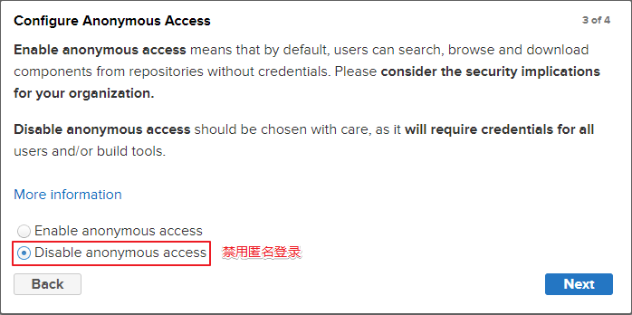

# Maven笔记

## 一、Maven简介

+ 随着我们使用越来越多的框架，或者框架封装程度越来越高，项目中使用的jar包也越来越多
  + 这些jar包的**来源各不相同**，因此无法一次性得到，获取非常麻烦
  + 即使得到了这些包，也需要将它们**放在指定的文件夹下**，非常的局限
  + 在这种情况下，手动导包会变的非常麻烦，此时我们就需要一个工具，即`Maven`来帮助我们实现包的管理与导入
+ 同时，如果脱离了`IDEA`的生产环境，项目的构建和部署会变得非常困难
  + `Maven`可以帮助我们进行项目的构建工作
+ 因此，`Maven`是一款**为`Java`项目管理构建、依赖管理的工具**（软件），使用Maven可以自动化构建、测试、打包和发布项目，大大提高了开发效率和质量

---

## 二、Maven安装与配置

1. 在[Maven官网](https://maven.apache.org/download.cgi)下载`Maven`（下载`Binary`，不要下`Source`）
2. 解压`Maven`压缩包到指定的目录
  + 解压后的`Maven`是下面这样的:
    + bin目录:含有Maven的运行脚本
    + boot目录:含有plexus-classworlds类加载器框架
    + conf目录:含有Maven的核心配置文件
    + lib目录:含有`Maven`运行时所需的`Java`类库
    + LICENSE、NOTICE、README.txt：针对Maven版本，第三方软件等简要介绍
3. 配置`MAVEN_HOME`环境变量，值为`Maven`所在目录。同时配置`%MAVEN_HOME%\bin`环境变量。通过`mvn -v`命令验证是否配置成功
4. 配置`Maven->conf->setting.xml`文件，主要为下面的部分:

~~~xml
    <!-- 配置本地仓库，在下面的注释下面配置 -->
    <!-- localRepository
       | The path to the local repository maven will use to store artifacts.
       |
       | Default: ${user.home}/.m2/repository
      <localRepository>/path/to/local/repo</localRepository>
      -->
      <!-- 文件夹可以不存在，如果不存在，第一次创建Maven工程时会自动创建 -->
    <localRepository>E:\Programming Language\Java\maven-repository</localRepository>  
~~~

~~~xml
    <!-- 配置阿里镜像源(在mirrors标签内) -->
    <mirror>
        <id>alimaven</id>
        <name>aliyun maven</name>
        <url>http://maven.aliyun.com/nexus/content/groups/public/</url>
        <mirrorOf>central</mirrorOf>
    </mirror>
~~~

~~~xml
    <!-- 配置JDK版本项目构建 -->
    <profile>
        <id>jdk-17</id>
        <activation>
          <activeByDefault>true</activeByDefault>
          <jdk>17</jdk>
        </activation>
        <properties>
          <maven.compiler.source>17</maven.compiler.source>
          <maven.compiler.target>17</maven.compiler.target>
          <maven.compiler.compilerVersion>17</maven.compiler.compilerVersion>
        </properties>
    </profile>

~~~

5. 在`IDEA`的`settings->Build,Execution,Deployment->Build Tools->Maven`中配置`Maven home path`为我们安装的`Maven`路径，此时如果`setting.xml`文件配置成功，在配置完路径后，下面的`Local repository`会变为我们自己配置的本地路径。接下来将`User settings file`改为我们刚才配置的`settings.xml`的文件路径即可

+ **注意**:
> + `Maven`的配置需要本机配置了`Java`并拥有`JAVA_HOME`

---

## 三、Maven工程

### （一）Maven工程项目结构

~~~xml
|-- pom.xml                               # Maven 项目管理文件 
|-- src
    |-- main                              # 项目主要代码
    |   |-- java                          # Java 源代码目录
    |   |   `-- com/example/myapp         # 开发者代码主目录
    |   |       |-- controller            # 存放 Controller 层代码的目录
    |   |       |-- service               # 存放 Service 层代码的目录
    |   |       |-- dao                   # 存放 DAO 层代码的目录
    |   |       `-- model                 # 存放数据模型的目录
    |   |-- resources                     # 资源目录，存放配置文件、静态资源等
    |   |   |-- log4j.properties          # 日志配置文件
    |   |   |-- spring-mybatis.xml        # Spring Mybatis 配置文件
    |   |   `-- static                    # 存放静态资源的目录
    |   |       |-- css                   # 存放 CSS 文件的目录
    |   |       |-- js                    # 存放 JavaScript 文件的目录
    |   |       `-- images                # 存放图片资源的目录
    |   `-- webapp                        # 存放 WEB 相关配置和资源
    |       |-- WEB-INF                   # 存放 WEB 应用配置文件
    |       |   |-- web.xml               # Web 应用的部署描述文件
    |       |   `-- classes               # 存放编译后的 class 文件
    |       `-- index.html                # Web 应用入口页面
    `-- test                              # 项目测试代码
        |-- java                          # 单元测试目录
        `-- resources                     # 测试资源目录
~~~

+  pom.xml：Maven 项目管理文件，用于**描述项目的依赖和构建配置**等信息。
+  src/main/java：**存放项目的Java源代码**。
+  src/main/resources：**存放项目的资源文件**，如配置文件、静态资源等。
+  src/main/webapp/WEB-INF：**存放 Web应用的配置文件**。
+  src/main/webapp/index.jsp：Web应用的**入口页面**。
+  src/test/java：**存放项目的测试代码**。
+  src/test/resources：**存放测试相关的资源文件**，如测试配置文件等。

---

### （二）创建工程

#### ①GAVP

+ GAVP是四个英文单词的大写字母拼凑:
  + GroupID:用于告知Maven该项目属于哪个组，一般都使用`com.公司/BU.业务线.\子业务线`来编写，如公司是mycom，有一个项目为myapp，那么groupId就应该是`com.mycom.myapp`
  + ArtifactID:在组内的唯一id，默认与当前模块名一致
  + Version:版本号，`IDEA`会自动设置，格式为`主版本号.次版本号.修订号`
  + Packaging:配置打包方式
    + jar:打成jar包，用于普通的`JavaSE`工程
    + war:打成war包，用于`JavaWeb`工程
    + pom:不打包，用来做继承的父工程

#### ②创建JavaSE工程

+ 我们在新创建一个项目后，新创建一个模块，构建系统选择`Maven`
+ 点开高级选项，填写`Group ID`，然后点击创建
+ 创建后，会打开`pom.xml`
+ 第一次打开时,`idea`可能会报错，因为此时`Maven`缺少自己运行的库，在`IDEA`进度可以看到在下载一些东西，等下载完成后，就不报错了

~~~xml

    <?xml version="1.0" encoding="UTF-8"?>
    <project xmlns="http://maven.apache.org/POM/4.0.0"
            xmlns:xsi="http://www.w3.org/2001/XMLSchema-instance"
            xsi:schemaLocation="http://maven.apache.org/POM/4.0.0 http://maven.apache.org/xsd/maven-4.0.0.xsd">
        <modelVersion>4.0.0</modelVersion>  <!-- 该配置代表xml的版本，不用管 -->

        <groupId>com.maven.javase</groupId>  <!-- 刚才设置的GroupID -->
        <artifactId>Maven_JavaSE</artifactId>  <!-- 刚才默认的artifactedID -->
        <version>1.0-SNAPSHOT</version>  <!-- 默认的version -->
        <packaging>jar</packaging>  <!-- 默认的打包方式就是打jar包，这句话写不写都行 -->
    </project>
~~~

+ 新创建项目后，会发现项目内出现了下面的内容:

~~~java
    模块名
        src
            main  // 这里负责编写代码
                com
                    ...
            test  // 这里负责对代码进行测试
~~~

---

#### ③创建JavaWeb工程

+ 创建方式1:
  + 首先创建一个`JavaSE`工程
  + `JavaWeb`工程与`JavaSE`工程的区别实际上就是模块设置下，`JavaWeb`工程多了一个`web`。
  + 我们可以通过设置`pom.xml`的`<packaging>war</packaging>`标签，来手动指定我们的项目将要被打包为`war`包，从而可以使`IDEA`自动帮我们创建模块设置下  `web`
  + 这样就可以使我们的项目变为`JavaWeb`项目了，但是我们还需要创建一个`web.xml`文件
  + `Open Module Settings->Modules->项目名->Web->Deployment Descriptions`下面的加号，然后指定`web.xml`文件的路径,**默认的路径是错的**，需要改一下
+ 创建方式2:
  + 安装插件`JBLJavaToWeb`
  + 创建一个`JavaSE`项目
  + 右键项目，点击`JBLJavaToWeb`，然后跟着它的提示点
+ 创建方式3:
  + 创建模块时选择`Maven Archetype`，`archetype`选择`xxx-webapp`(最后一个),然后等着他创建
  + 这样写创建的`web.xml`版本会低
+ 这样就创建完了，然后可以根据[JavaWeb笔记](javaweb笔记.md)的部署`tomcat`步骤来部署到`tomcat`

---

### （三）依赖管理

#### ①pom.xml文件配置

+ **pom.xml**文件是Maven项目的核心配置文件，它可以配置我们项目的依赖项，并进行管理
+ [该网站](https://mvnrepository.com/)可以寻找我们想要得到的库，并提供给我们其相应的xml标签

+ **pom.xml**文件的文件配置如下:

~~~xml
<?xml version="1.0" encoding="UTF-8"?>
    <project xmlns="http://maven.apache.org/POM/4.0.0"
         xmlns:xsi="http://www.w3.org/2001/XMLSchema-instance"
         xsi:schemaLocation="http://maven.apache.org/POM/4.0.0 http://maven.apache.org/xsd/maven-4.0.0.xsd">

        <modelVersion>4.0.0</modelVersion>  <!-- 指定pom.xml的版本 -->
        <groupId>com.maven.javase</groupId>  <!-- 指定项目所属的组ID，必填。如果是子项目，该标签内的值由父项目决定 -->
        <artifactId>Maven_JavaSE</artifactId>  <!-- 指定项目在组内的唯一标识ID，默认与项目名称一致，必填 -->
        <version>1.0-SNAPSHOT</version>  <!-- 指定项目版本，IDEA会自动创建，必填。如果是子项目，该标签内的值由父项目决定-->
        <packaging>jar</packaging>  <!-- 指定打包方式，有三个可选值:jar war pom,分别表示打包成jar包、war包和不打包作为被继承的父工程 -->

        <!-- 这是项目是子项目时才需要指定的标签，它用于表示其父项目的索引 -->
        <parent>
          <!-- 父工程的坐标 -->
          <groupId>com.atguigu.maven</groupId>
          <artifactId>pro03-maven-parent</artifactId>
          <version>1.0-SNAPSHOT</version>
        </parent>

        <!-- 这是项目是父项目时才需要指定的标签，它用于表示聚合关系 -->
        <modules>
            <module>child-project1</module>  <!-- 注意：里面的值是路径 -->
            <module>child-project2</module>
        </modules>

        <properties>
            <project.build.sourceEncoding>UTF-8</project.build.sourceEncoding>  <!-- 告知Maven编译时使用UTF-8字符集 -->
            <project.reporting.outputEncoding>UTF-8</project.reporting.outputEncoding>  <!-- 告知Maven打印报告时使用UTF-8进行字符集 -->
            <junit.version>4.12</junit.version>  <!-- 自定义版本声明，主要用于便捷修改依赖版本，标签名称可以随便起 -->
        </properties>

        <!-- 在该标签内写入要导入的依赖，每个依赖都以一个dependency标签作为单位 -->
        <!-- 如果是父项目，这样写会导致子项目继承其全部的依赖项 -->
        <dependencies>
            <dependency>
                <groupId>junit</groupId>  <!-- 指定想导入依赖所属的组 -->
                <artifactId>junit</artifactId>  <!-- 指定想导入依赖的组内ID -->
                <version>${junit.version}</version> <!-- 指定想导入依赖的版本，支持嵌入在properties标签内自定义的版本，也可以直接指定版本 -->
                <scope>test</scope>  <!-- 指定依赖的作用范围 -->
                <optional>true</optional>  <!-- 设定该依赖无法被子依赖所继承 -->
            </dependency>
            <!-- https://mvnrepository.com/artifact/org.projectlombok/lombok -->
            <dependency>
                <groupId>org.projectlombok</groupId>
                <artifactId>lombok</artifactId>
                <version>1.18.30</version>
                <scope>provided</scope>
                <exclusions>  <!-- 使用exclusions用来在出现依赖冲突时，我们手动的去排除我们不想要的依赖项 -->
                  <!-- 在exclude标签中配置一个具体的排除 -->
                    <exclusion>
                        <!-- 指定要排除的依赖的坐标（不需要写version） -->
                        <groupId>commons-logging</groupId>
                        <artifactId>commons-logging</artifactId>
                    </exclusion>
                </exclusions>
            </dependency>
        </dependencies>

        <!-- 
            使用dependencyManagement包裹dependencies标签来让子项目自己选择继承父项目的什么依赖项，而不是把全部的依赖项全塞给子项目 
            如果这样写的话，子项目内的dependencies中的dependency内就不需要写version了，因为都继承的父项目的
        -->
        <dependencyManagement>
            <dependencies>
                <dependency>
                    <groupId>org.springframework</groupId>
                    <artifactId>spring-core</artifactId>
                    <version>6.0.10</version>
                </dependency>
                <dependency>
                    <groupId>org.springframework</groupId>
                    <artifactId>spring-beans</artifactId>
                    <version>6.0.10</version>
                </dependency>
                <dependency>
                    <groupId>org.springframework</groupId>
                    <artifactId>spring-context</artifactId>
                    <version>6.0.10</version>
                </dependency>
                <dependency>
                    <groupId>org.springframework</groupId>
                    <artifactId>spring-expression</artifactId>
                    <version>6.0.10</version>
                </dependency>
                <dependency>
                    <groupId>org.springframework</groupId>
                    <artifactId>spring-aop</artifactId>
                    <version>6.0.10</version>
                </dependency>
            </dependencies>
        </dependencyManagement>

        <build>
        <!--设置要打包的资源位置-->
            <resources>
                <resource>
                    <!--设置资源所在目录-->
                    <!-- 该配置解决了一些配置文件不在resource文件夹下的问题，因为默认情况下，这些文件不会被打包 -->
                    <directory>src/main/java</directory>  <!-- 指定目录 -->
                    <includes>
                        <!--设置包含的资源类型-->
                        <!-- 该设置可以使非reource目录下的指定路径下的配置文件被打包 -->
                        <include>**/*.xml</include>  <!-- 完整路径为src/main/java**/*.xml，**表示任意文件夹，*.xml表示任意后缀是.xml的文件 -->
                    </includes>
                </resource>
            </resources>

            <!-- 
                plugins用来配置一些插件，这些插件常用来解决一些问题
                如JDK版本与Maven当前使用的打包插件对不上、想更便捷的使用tomcat等
             -->
            <plugins>
                <finalName>定义打包名称</finalName>  <!-- 自定义打包的名称，默认的打包名称是artifactid+verson.打包方式 -->
            <!-- java编译插件，配jdk的编译版本 -->
                <plugin>
                        <groupId>org.apache.maven.plugins</groupId>
                        <artifactId>maven-compiler-plugin</artifactId>
                    <configuration>
                        <source>17</source>
                        <target>17</target>
                        <encoding>UTF-8</encoding>
                    </configuration>
                </plugin>
                <!-- tomcat插件 -->
                <plugin>
                    <groupId>org.apache.tomcat.maven</groupId>
                    <artifactId>tomcat7-maven-plugin</artifactId>
                    <version>2.2</version>
                    <configuration>
                        <port>8090</port> <!-- 配置tomcat端口 -->
                        <path>/</path>  <!-- 配置tomcat访问根路径 -->
                        <uriEncoding>UTF-8</uriEncoding>  <!-- 配置tomcat在接收get请求时，解码所依据的解码格式 -->
                        <server>tomcat7</server> <!-- 配置tomcat服务版本 -->
                    </configuration>
                </plugin>
            </plugins>
        </build>

        <!-- 上传私服要用到的标签配置 -->
        <distributionManagement>
            <snapshotRepository>
                <id>nexus-mine</id>  <!-- 指定上传的私服id，与Maven内的settings.xml中配置的id一致 -->
                <name>Nexus Snapshot</name>
                <url>http://localhost:8081/repository/maven-snapshots/</url>  <!-- 上传的路径，由私服内的仓库提供 -->
            </snapshotRepository>
        </distributionManagement>

        <!-- 
            repositories标签内可以指定我们希望Maven从哪里下载我们需要的依赖到我们的本地仓库 
            pom.xml配置的仓库路径优先级大于settings.xml配置的镜像路径
            因为settings.xml配置的是全局的，而pom.xml内配置的是本项目的
            只有当pom.xml内的路径找不到资源或全部失效时，才会去找settings.xml的路径
        -->
        <repositories>
            <repository>
                <id>nexus-mine</id>  <!-- 需要与setting.xml文件保持一致 -->
                <name>nexus-mine</name>
                <url>http://localhost:8081/repository/maven-snapshots/</url>
                <snapshots>
                    <enabled>true</enabled>  <!-- 是否接收快照版本 -->
                </snapshots>
                <releases>
                    <enabled>true</enabled>  <!-- 是否接收正式版本 -->
                </releases>
            </repository>
        </repositories>

    </project>

~~~

#### ②依赖范围

+ 依赖可以作用的Java范围有三种:
  + 编译范围:即 src/main/ 路径内的代码范围
  + 测试范围:即 src/test 路径下的代码范围
  + 运行时:即部署后，程序运行时的范围
+ 在[上例](#pom.xml-template)中，dependency标签内的**scope标签**用来指定依赖的作用范围，其可选值如下表所示:

|值|范围|备注|
|:---:|:---:|:---:|
|**compile**|编译依赖范围，**是scope标签不写时的默认值**，在编译范围、测试范围和运行时都起作用|无|
|**test**|测试依赖范围。**仅在测试范围内有效**|无|
|**provided**|已提供依赖范围。**在测试范围内和编译范围内有效**|Servlet就属于这一类，因为它在运行时由tomcat提供|
|runtime|运行时依赖范围。**在测试范围内和运行时有效**|JDBC就属于这一类，因为它在编译时仅需要验证是否符合接口规范，在测试和运行时才用到JDBC的驱动|
|system|系统依赖范围，其效果与 provided 的依赖范围一致。其用于添加非 Maven 仓库的本地依赖，通过依赖元素 dependency 中的 systemPath 元素指定本地依赖的路径。鉴于使用其会导致项目的可移植性降低，一般不推荐使用。|无|
|import|导入依赖范围，该依赖范围只能与 dependencyManagement 元素配合使用，其功能是将目标 pom.xml 文件中 dependencyManagement 的配置导入合并到当前 pom.xml 的 dependencyManagement 中。|无|

---

#### ③依赖传递与冲突

+ 在Maven工程下，我们可以通过`pom.xml`文件来指定我们所依赖的项目
+ 指定后，**依赖项目的依赖项也会传递给我们**，这样，我们就不用再配置一遍我们项目所依赖的项目的依赖了
+ 我们称这种特性为**依赖传递**
  + 在IDEA的Maven可视化界面可以通过其项目的`Dependencies`来查看其当前依赖

  + 依赖项的依赖范围是`test`或`provided`时，无法传递依赖
  + 依赖项存在optional标签设置为true时，无法传递依赖
+ 当我们的项目所指定的依赖与我们依赖项目所指定的依赖重复时，我们称这种情况为**依赖冲突**
  + Maven默认已经考虑到了该情况，因此它默认会根据一些情况处理这些冲突
  + 当发生冲突的双方的依赖深度不同时，取较近的一方。
    + 例:A依赖了B，同时也依赖了C，B也依赖C，A依赖C的依赖深度是1，因为是直接依赖的，而A依赖的B的C是间接依赖的，依赖深度是2，因此会依据就近原则，**选择A直接依赖的C**，而不是B依赖的C
  + 如果双方的依赖深度相同，那么Maven将比较双方谁在`pom.xml`文件内先声明，先声明的，就是被选择的一方
+ 我们也可以进行手动排除，手动排除需要使用`exclusions`标签使用

---

#### ④继承与聚合

+ 我们可以通过创建一个项目并指定该项目是项目，而其他项目可以通过**继承**的方式来成为该项目的子项目,**使得子项目得到父项目的一些依赖而不用手动配置**
  + 父项目的打包方式需要是`pom`
  + 配置的`dependencies`中的依赖默认会被子项目全部继承过去，但我们也可以为其套上`dependencyManagement`标签来让子项目自己选择想继承的依赖项
  + 继承的子项目的`pom.xml`文件内不需要指定其groupId和version了，因为会强制与父项目保持一致，因此只需要指定其artifactId
+ 父项目也可以通过`modules`标签来统一管理其子项目的构建过程，这样，当父项目执行构建的一个生命周期操作时，它**聚合**的所有子项目也都会执行该操作
+ 继承保证了整个项目使用规范、准确的 jar 包。同时还能够将以往的经验沉淀下来，节约时间和精力。
+ 聚合方便了项目的管理与维护

---

### （四）构建

#### ①构建过程

+ 项目构建是指将源代码、依赖库和资源文件等转换成可执行或可部署的应用程序的过程，在这个过程中包括编译源代码、链接依赖库、打包和部署等多个步骤
+ Maven提供了简便的命令来提高构建的效率，使得开发人员能够**更加专注于应用程序的开发和维护**，而不必关心应用程序的构建细节
+ 构建分为多个步骤
  + 清理:删除之前编译生成的结果
  + 编译:对源码进行编译，并放入`target`文件夹内
  + 测试:测试test文件夹的东西
  + 报告:测试的时候会自动生成报告，存放在`target/surefire-reports`内
  + 打包:生成项目对应的jar或war包
  + 部署:将生成的jar或war包上传到本地或私服仓库
+ 本地仓库内各依赖按照`groupId->artifactId->version`来区分每个依赖，我们也可以通过这种方式找到我们想要的包
+ 生命周期靠后的步骤在执行时，会先执行其生命周期之前的步骤，这样是为了**简化我们的构建流程，使我们不必每次构建都要执行多次步骤**

---

#### ②构建命令

|命令|描述|备注|
|:---:|:---:|:---:|
|mvn compile|编译项目，生成target文件|不会编译test文件夹下的源码|
|mvn package|打包项目，生成jar或war文件|无|
|mvn clean|清理编译或打包后的项目结构|无|
|mvn install|打包后上传到maven本地仓库|无|
|mvn deploy|只打包，上传到maven私服仓库|无|
|mvn site|生成站点|无|
|mvn test|执行测试源码|建议**测试类以`Test`开头或结尾**，且**方法以`test`开头或结尾**|
|mvn test-compile|编译测试源码|无|

+ Maven的命令可以通过空格隔开来执行多个，并根据从左到右的顺序依次执行:`mvn clean conpile`
+ 使用`package`命令打war包时，可能会出现报错，大概率是因为**打war包的插件与当前的JDK版本不匹配**

~~~xml
  <!-- 添加如下配置让插件匹配JDK17 -->
  <build>
      <!-- jdk17 和 war包版本插件不匹配 -->
      <plugins>
          <plugin>
              <groupId>org.apache.maven.plugins</groupId>
              <artifactId>maven-war-plugin</artifactId>
              <version>3.2.2</version>
          </plugin>
      </plugins>
  </build>
~~~

+ 如果是`IDEA`等图形化界面，直接点开右边的Maven选项，点开项目，在`lifecycle`中选择生命周期（双击）执行即可

---

## 四、Maven私服

### （一）私服简介

+ Maven 私服是一种特殊的Maven远程仓库，它是架设在局域网内的仓库服务，用来代理位于外部的远程仓库（中央仓库、其他远程公共仓库）

+ Maven私服具有如下优势:
  1. **节省外网带宽**:消除对外部远程仓库的大量重复请求（会消耗很大量的带宽），降低外网带宽压力。
  2. **下载速度更快**:Maven私服位于局域网内，从私服下载构建更快更稳定。
  3. **便于部署第三方构件**:有些构件无法从任何一个远程仓库中获得（如：公司或组织内部的私有构件、Oracle的JDBC驱动等），建立私服之后，就可以将这些构件部署到私服中，供内部Maven项目使用。
  4. **提高项目的稳定性，增强对项目的控制**:如果不建立私服，那么Maven项目的构件就高度依赖外部的远程仓库，若外部网络不稳定，则项目的构建过程也会变得不稳定。建立私服后，即使外部网络状况不佳甚至中断，只要私服中已经缓存了所需的构件，Maven也能够正常运行。私服软件（如：Nexus）提供了很多控制功能（如：权限管理、RELEASE/SNAPSHOT版本控制等），可以对仓库进行一些更加高级的控制。
  5. **降低中央仓库得负荷压力**:由于私服会缓存中央仓库得构件，避免了很多对中央仓库的重复下载，降低了中央仓库的负荷。
+ 常用的Maven私服有:
  + Apache的Archiva
  + JFrog的Artifactory
  + Sonatype的Nexus（`neksəs`）（当前最流行、使用最广泛）

---

### （二）Nexus

#### ①安装与运行

+ [下载链接](https://help.sonatype.com/en/download.html)
+ 下载后，安装到指定的文件夹内
+ **使用管理员权限打开PowerShell**，然后运行其bin目录下的nexus.exe文件，具体命令为`./nexus /run`
+ 等待它配置好（可能会很慢），当输出`Started Sonatype Nexus OSS 3.66.0-02`类似的语句时，说明初始化成功了
+ 打开[默认的8081端口](http://localhost:8081/)来访问私服，如果进不去就按`Ctrl+C`终止nexus.exe文件运行，然后就能进去了
+ 进去说明已经安装和运行好了

---

#### ②仓库详解

| 仓库类型 | 说明                                           |
| -------- | ---------------------------------------------- |
| proxy    | 某个远程仓库的代理                             |
| group    | 存放：通过 Nexus 获取的第三方 jar 包           |
| hosted   | 存放：本团队其他开发人员部署到 Nexus 的 jar 包 |

| 仓库名称        | 说明                                                         |
| --------------- | ------------------------------------------------------------ |
| maven-central   | Nexus 对 Maven 中央仓库的代理                                |
| maven-public    | Nexus 默认创建，供开发人员下载使用的组仓库                   |
| maven-releases  | Nexus 默认创建，供开发人员部署自己 jar 包的宿主仓库 要求 releases 版本 |
| maven-snapshots | Nexus 默认创建，供开发人员部署自己 jar 包的宿主仓库 要求 snapshots 版本 |

---

#### ③配置

+ 刚刚进入网页，点击右上角的`Sign in`

+ 接下来让我们输入账户名和密码
  + 账户叫`admin`
  + 初始化时会为我们自动在`nexus\sonatype-work\nexus3\admin.password`生成一个密码，我们可以打开该文件查看密码

+ 接下来点next，然后会让我们重新配置密码
+ 一路点next,然后会让我们选择是否支持匿名访问

+ 由于支持匿名登录会很容易，因此我们选择不支持匿名登录
+ 接下来开始配置Maven的`settings.xml`文件，**建议在修改前备份一下当前的`settings.xml`文件**

~~~xml

    <!-- 配置一个新的 Maven 本地仓库 -->
    <localRepository>D:/maven-repository-new</localRepository>

    <!-- 这里覆盖我们原来配置的那个mirror，也就是把下载路径从阿里云镜像改成我们的私服网址 -->
    <mirror>
        <id>nexus-mine</id>  <!-- 随便写一个id值，但是后面要用 -->
        <mirrorOf>central</mirrorOf>
        <name>Nexus mine</name>
        <url>http://localhost:8081/repository/maven-public/</url>  <!-- 该网址来源于私服内的Maven-public那个URL -->
    </mirror>

    <!-- 这里要放到servers标签内 -->
    <server>
    <id>nexus-mine</id>  <!-- 该id与mirror标签内的id值必须保持一致 -->
    <username>admin</username>  <!-- 由于不支持匿名登陆，因此配置用户名，用户名需要与之前的用户名一致 -->
    <password>atguigu</password>  <!-- 由于不支持匿名登陆，因此配置密码，改密码需要与之前重新更改的密码一致 -->
    </server>

~~~

+ 接下来打开IDEA,查看其Maven的设置内，本地仓库的路径是否发生变化，如果发生了变化说明配置成功了
+ 新建一个Maven项目，由于我们配置了新的本地仓库，仓库里面什么都没有，Maven就会从中央仓库开始下载依赖到私服，然后我们再从私服下载到本地。下载完后可以看到Nexus网页内的`maven-central`文件夹内有东西了
+ 如果嫌下载的太慢，可以为Nexus配置阿里云镜像:`http://maven.aliyun.com/nexus/content/groups/public/`

---

#### ④上传与引用

+ 如果我们想把jar包部署到nexus,我们可以在对应项目的xml文件内配置信息:

~~~xml
    <distributionManagement>
        <snapshotRepository>
            <id>nexus-mine</id>  <!-- 指定与settings.xml一样的id -->
            <name>Nexus Snapshot</name>  <!-- 名字随便取 -->
            <url>http://localhost:8081/repository/maven-snapshots/</url>
        </snapshotRepository>
    </distributionManagement>
~~~

+ 之后运行`mvn deploy`即可上传
+ 如果我们想使用别人上传的jar包,需要在应项目的xml文件内配置信息:

~~~xml
<!-- repositories用来配置我们的Maven优先从哪里下载依赖到我们的本地仓库 -->
<repositories>
    <repository>
        <id>nexus-mine</id>  <!-- 指定与settings.xml一样的id -->
        <name>nexus-mine</name>
        <url>http://localhost:8081/repository/maven-snapshots/</url>
        <snapshots>
            <enabled>true</enabled>  <!-- 是否支持快照版本 -->
        </snapshots>
        <releases>
            <enabled>true</enabled>  <!-- 是否支持正式版本 -->
        </releases>
    </repository>
</repositories>

~~~

---

## 五、综合案例

+ 需求案例：搭建一个电商平台项目模板，该平台包括用户服务、订单服务、通用工具模块等。

项目架构：

1. **用户服务**：负责处理用户相关的逻辑，例如用户信息的管理、用户注册、登录等。
   - spring-context 6.0.6 
   - spring-core 6.0.6
   - spring-beans 6.0.6
   - common-service
2. **订单服务**：负责处理订单相关的逻辑，例如订单的创建、订单支付、退货、订单查看等。
   - spring-context 6.0.6 
   - spring-core 6.0.6
   - spring-beans 6.0.6
   - spring-security 6.0.6
   - common-service
3. **通用模块**：负责存储其他服务需要通用工具类，其他服务依赖此模块。
   - commons-io 2.11.0
   - junit 5.9.2

+ 分析
  + 可以搭建一个父项目，将三个服务聚合在一起
  + 三个子项目分别是用户服务、订单服务和通用模块
  + 父项目有全部的依赖，**通用模块完全继承父项目的依赖，用户服务和订单服务依赖于通用模块**，并根据自己的需求剔除调不需要传递过来的依赖
+ [样例1](../源码/Maven/Maven_Father/pom.xml)
+ [样例2](../源码/Maven/Maven_Father/Maven_Son_Common/pom.xml)
+ [样例3](../源码/Maven/Maven_Father/Maven_Son_Service/pom.xml)
+ [样例4](../源码/Maven/Maven_Father/Maven_Son_User/pom.xml)