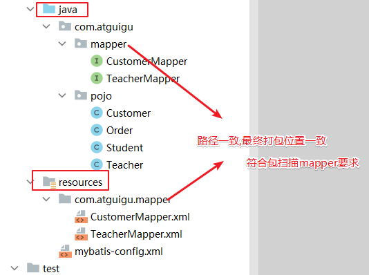
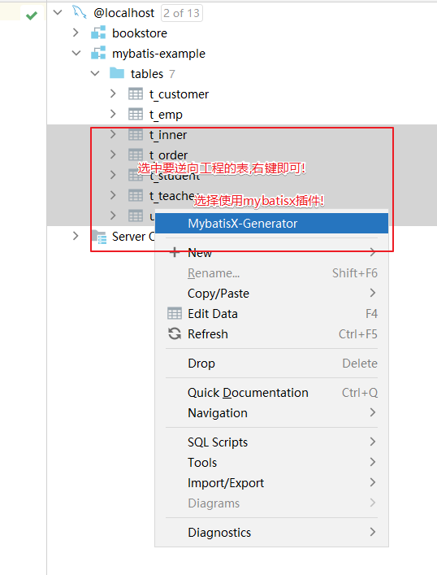

# Mybatis笔记

## 一、简介

+ MyBatis最初是Apache的一个开源项目iBatis，在2010年6月该项目被迁移到了Google Code，随后开发团队转投到Google Code旗下。随后 iBatis3.x正式更名为MyBatis。代码于2013年11月迁移到Github。
+ MyBatis 是一款优秀的持久层框架，它**支持自定义 SQL、存储过程以及高级映射**
+ MyBatis 可以**通过简单的 XML 或注解**来配置和映射原始类型、接口和 Java POJO（Plain Old Java Objects，普通老式 Java 对象）为数据库中的记录。

---

## 二、HelloMybatis

+ 导入依赖:

~~~xml
    <dependencies>
    <!-- mybatis依赖 -->
    <dependency>
        <groupId>org.mybatis</groupId>
        <artifactId>mybatis</artifactId>
        <version>3.5.11</version>
    </dependency>

    <!-- MySQL驱动 mybatis底层依赖jdbc驱动实现,本次不需要导入连接池,mybatis自带! -->
    <dependency>
        <groupId>mysql</groupId>
        <artifactId>mysql-connector-java</artifactId>
        <version>8.0.25</version>
    </dependency>

    <!--junit5测试-->
    <dependency>
        <groupId>org.junit.jupiter</groupId>
        <artifactId>junit-jupiter-api</artifactId>
        <version>5.3.1</version>
    </dependency>
    </dependencies>
~~~

+ 创建一个数据库表:

~~~sql
    create table mybatis_emp
    (
        emp_id     int auto_increment
            primary key,
        emp_name   char(100)     null,
        emp_salary double(10, 5) null
    );
~~~

+ 创建对应的Java实体类和接口，一般**接口都命名为XxxMapper，放在mappers包下**。Java实体类与数据库表名按照大驼峰命名法书写，**放在pojo包下**
+ [实体类](../源码/Mybatis/src/main/java/com/mybatis/example/hellomybatis/pojo/Employee.java)
+ [接口](../源码/Mybatis/src/main/java/com/mybatis/example/hellomybatis/mapper/EmployeeMapper.java)
+ 随后是xml文件配置，我们需要将xml文件放在resources目录下，首先是详细的mapper相关的xml文件:
  + 为方便管理，mapper相关xml文件可以**放在resources下的mappers目录里**
  + [示例](../源码/Mybatis/src/main/resources/hellomybatis/mappers/employeeMapper.xml)
+ 接下来是mybatis整合mapper的配置xml文件，**一般叫mybatis-config.xml，放在与mappers目录同级的目录下**
  + [示例](../源码/Mybatis/src/main/resources/hellomybatis/mybatis-config.xml)
+ 随后编写测试代码运行:

~~~java
    @Test
    // 测试HelloMybatis的基本使用
    public void test() throws IOException {
        // 获得配置文件的输入流对象
        InputStream in = Resources.getResourceAsStream("hellomybatis/mybatis-config.xml");
        // 使用SqlSessionFactoryBuilder工厂构建对象构建SqlSessionFactory工厂对象
        SqlSessionFactory factory = new SqlSessionFactoryBuilder().build(in);
        // 使用工厂对象打开一个会话，并得到会话对象
        SqlSession session = factory.openSession();
        // 调用会话的getMapper方法，来得到接口的代理对象
        EmployeeMapper mapper = session.getMapper(EmployeeMapper.class);
        // 执行接口代理对象的方法，得到结果
        Employee result1 = mapper.selectEmployeeById(1);
        Integer result2 = mapper.deleteEmployeeById(1);
        System.out.println(result1);
        System.out.println(result2);
        // 执行会话的提交
        session.commit();
        // 关闭会话
        session.close();
    }
~~~

---

## 三、相关API

|归属|方法|参数|描述|返回值|返回值类型|异常|备注|样例|
|:---:|:---:|:---:|:---:|:---:|:---:|:---:|:---:|:---:|
|Resources(ibatis)|getResourceAsStream(String resource)|resource:mybatis配置xml文件**相对于classpath的路径**|得到配置文件的输入流对象|输入流对象|InputStream|IOException|无|[样例](../源码/Mybatis/src/test/java/hellomybatis/HelloMybatisTest.java)
|SqlSessionFactoryBuilder|SqlSessionFactoryBuilder()|无参|SqlSessionFactory实现类的空参构造器|得到生成会话对象的工厂对象的构建器对象|SqlSessionFactory|无|无|^|
|^|build(InputStream inputStream)|inputStream:配置文件的输入流对象|>|得到生成数据库会话的工厂对象|SqlSessionFactory|无|无|^|
|SqlSessionFactory|openSession()|无参|>|得到一个数据库会话对象|SqlSession|无|无|^|
|^|openSession(boolean autoCommit)|autoCommit:设置执行数据库操作时是否自动提交，默认否|^|^|^|^|无|^|
|SqlSession|<T> getMapper(Class<T> type)|type:接口类的Class对象|>|得到对应接口类的代理对象|T|无|无|^|
|^|commit()|无参|手动进行事务提交|无返回值|void|无|无|^|
|^|close()|无参|关闭会话|无返回值|void|无|无|^|

---

## 四、类型传入与结果输出

### （一）插值运算符

+ mybatis提供`#{}`和`${}`两种插值表达式来向sql语句中插入相关的值
  + 使用#{}表达式插值，Mybatis会将其转换为PreparedStatement的占位符，可以防止xss注入攻击。但仅能插入变量值，**无法插入数据库表名、字段名之类的值**
  + 使用${}表达式插值，Mybatis会使用字符串拼接的方式直接插入，**有xss注入攻击风险。但可以在任意地方插入**
+ 因此，尽量使用更安全的#{}插值运算符

---

### （二）类型传入

+ 如果我们想传入一个简单的数据类型，那么只需要在插值表达式内任意写一个值即可，**推荐写参数的名称**
+ 如果我们想传入多个简单的数据类型，那么需要遵循如下写法:
  + Mybatis默认从左到右给每个参数以arg0、arg1、arg2...等顺序编号，我们可以这样写
  + Mybatis默认也从左到右给每个参数以param1、param2、param3...等顺序编号，我们可以这样写
  + **推荐:使用@Param(value)注解作用于每个形参上**，这样可以使Mybatis读取到多个参数的名称，这样我们就可以通过指定每个参数名称的方式赋值了
+ 如果我们想传入一个引用数据类型，需要遵循如下写法:
  + 如果传入的是一个实体类对象，可以写它的属性名
  + 如果传入的是List类型，需要使用foreach标签来遍历list中的所有元素，并将它们一一放在查询语句内
  + 如果传入的是Map类型，可以直接写它的key值即可
+ [样例](../源码/Mybatis/src/test/java/hellomybatis/TypeInjectTest.java)

---

### （三）结果输出

+ resultType属性用来指定sql语句的返回值，它专门作用于select标签。他需要**指定类的全类名**
  + Mybatis已经为我们**提供了常用的JDK类型的别名**，我们也可以**使用这些别名来代指类的全类名**
    + 基本数据类型,如`int`对应的全类名是`_int`，即**在基本数据类型名前加上下划线**
    + 引用数据类型，采用小写:如HashMap->hashmap、Integer->int/integer
    + 除此以外，我们还可以自行指定类的别名。指定别名的操作需要在mybatis-config.xml文件内进行
      + 在typeAliases标签内指定typeAlias标签可以为一个类指定别名
      + 在typeAliases标签内指定package标签可以为指定包下的所有类都起别名，且**别名默认是首字母小写的类名**
      + 如果使用了package标签且类名上有@Alias(value)注解，那么别名将是注解指定的名称
+ 如果返回值类型是JDK数据类型，那么直接写别名或全类名即可
+ 如果返回值类型是Map类型，那么直接写map，该情况适用于我们没有实体类可以接收的情况
+ 如果返回值类型是List类型，那么**需要写的类型是List内元素对应的泛型类型**
+ [mapper.xml样例](../源码/Mybatis/src/main/resources/hellomybatis/mappers/employeeMapper.xml)
+ [config.xml样例](../源码/Mybatis/src/main/resources/hellomybatis/mybatis-config.xml)
+ [接口](../源码/Mybatis/src/main/java/com/mybatis/example/hellomybatis/mapper/EmployeeMapper.java)
+ [实现类](../源码/Mybatis/src/main/java/com/mybatis/example/hellomybatis/pojo/Employee.java)
+ [测试样例](../源码/Mybatis/src/test/java/hellomybatis/TypeInjectTest.java)

---

## 五、主键回显与维护

+ 主键回显一般出现在我们进行插入时，我们可以在insert标签上设置useGeneratedKeys和keyProperty来**指定开启主键回显和主键赋值的目标属性**
  + **主键回显会将主键赋值给对应实体类的属性**，而不是以方法的返回值返回，除select语句外，DML语句全都返回数值类型的值
+ 如果我们想给非自增长类型主键赋值，我们可以:
  + 使用Java手动生成主键:该方法使得我们生成主键的过程被内嵌在了代码中
  + 使用mybatis自动进行主键维护:
    + selectKey标签可以嵌套在insert标签内，用来在插入语句被调用前执行其内部的sql语句
    + 其keyProperty用来设置主键名，order用来设置执行时机，resultType用来告知mybatis其返回值类型
    + 然后将主键名插入到insert语句内即可
+ [xml文件1](../源码/Mybatis/src/main/resources/hellomybatis/mappers/employeeMapper.xml)
+ [xml文件2](../源码/Mybatis/src/main/resources/hellomybatis/mappers/teacherMapper.xml)
+ [实现类1](../源码/Mybatis/src/main/java/com/mybatis/example/hellomybatis/pojo/Employee.java)
+ [实现类2](../源码/Mybatis/src/main/java/com/mybatis/example/hellomybatis/pojo/Teacher.java)
+ [接口1](../源码/Mybatis/src/main/java/com/mybatis/example/hellomybatis/mapper/EmployeeMapper.java)
+ [接口2](../源码/Mybatis/src/main/java/com/mybatis/example/hellomybatis/mapper/TeacherMapper.java)
+ [样例](../源码/Mybatis/src/test/java/hellomybatis/KeyTest.java)

---

## 六、多表映射

+ 如果我们有一个订单表和一个顾客表，一个订单对应一个顾客，但一个顾客可以下多个订单
  + 此时一个订单需要对应一个顾客，此时订单实体类内需要有一个属性是顾客实体类对象
  + 而顾客可以下多个订单，因此顾客实体类下需要有一个属性是订单实体类对象组成的List集合
  + 可以看到，如果这样的话，**我们的实体类下的属性就会出现对象的嵌套行为**，在使用mybatis赋值时，就**无法通过简单的resultType属性来赋值了**
+ mybatis提供了resultMap属性来解决这一问题:
  + 它可以**自定义映射**
  + 它**支持嵌套映射**
  + **它与resultType属性不能共用，也就是说，他们是互斥的**
+ 想使用resultMap属性，我们需要在mapper标签下创建一个自定义映射标签，它就叫resultMap标签:

~~~xml

    <!--
        resultMap用来实现实体类属性的嵌套映射，即自定义映射
        其id属性便于后面引用
        type属性为生成的实体类的类型
     -->
    <resultMap id="selectCustomerByCustomerIdMap" type="customer">
        <!--
            id用来映射主键
                column属性用来指定数据库查询结果的字段名称
                property属性用来指定该字段对应的值赋值给实体类的哪一个属性，写属性名
         -->
        <id column="customer_id" property="customerId"/>
        <!--  result用来映射普通属性  -->
        <result column="customer_name" property="customerName" />

        <!--
            collection用来映射集合(List)类型
                property用来指定被赋值的属性的属性名
                ofType用来指定集合内的元素的类型，即指定其泛型
         -->
        <collection property="list" ofType="order">
            <id column="order_id" property="orderId" />
            <result column="order_name" property="orderName" />
        </collection>
        <!--
            association用来映射其它实体类类型
                property用来指定被赋值的属性的属性名
                javaType用来其他实体类型的具体名称，可以是全类名，也可以是别名
         -->
        <association property="customer" javaType="customer">
            <id column="customer_id" property="customerId" />
            <result column="customer_name" property="customerName" />
        </association>
    </resultMap>

~~~

+ [xml文件1](../源码/Mybatis/src/main/resources/multitablemapping/mappers/CustomerMapper.xml)
+ [xml文件2](../源码/Mybatis/src/main/resources/multitablemapping/mappers/OrderMapper.xml)
+ [实体类1](../源码/Mybatis/src/main/java/com/mybatis/example/multitablemapping/pojo/Customer.java)
+ [实体类2](../源码/Mybatis/src/main/java/com/mybatis/example/multitablemapping/pojo/Order.java)
+ [接口1](../源码/Mybatis/src/main/java/com/mybatis/example/multitablemapping/mapper/CustomerMapper.java)
+ [接口2](../源码/Mybatis/src/main/java/com/mybatis/example/multitablemapping/mapper/OrderMapper.java)
+ [测试样例](../源码/Mybatis/src/test/java/multitablemapping/TableMappingTest.java)

---

## 七、动态语句

+ 当查询的条件增多时，如果使用传统的JDBC的方式来生成查询语句，那么我们需要根据传入的参数进行复杂的字符串拼接操作，这是非常痛苦的事情
+ mybatis为了解决这一问题，在对应的mapper.xml文件中添加了许多动态生成sql语句的相关标签，通过使用这些标签，我们将可以便捷的生成动态sql语句

|标签|属性|属性作用|作用|备注|样例|
|:---:|:---:|:---:|:---:|:---:|:---:|
|where|>|无属性|**自动补全where关键字，并去掉多余的and和or关键字**|无|[样例](../源码/Mybatis/src/main/resources/dynamicsql/mappers/EmployeeMapper.xml)|
|if|test|测试表达式是否为真|若test内的表达式值为true,那么将标签内的语句拼接到sql语句上|**如果想写`>`、`<`、`>=`、`<=`等符号，推荐使用[字符实体](https://www.w3school.com.cn/charsets/ref_html_8859.asp)**|^|
|set|>|无属性|**自动补全set关键字，并去掉多余的逗号**|无|^|
|trim|prefix|指定要动态添加的前缀，如where、set等|自定义补全前后缀语句并去掉多余符号|无|^|
|^|suffix|指定要动态添加的后缀|^|无|^|
|^|prefixOverrides|指定要动态去掉的前缀，如果有多个，使用`\|`隔开|^|无|^|
|^|suffixOverrides|指定要动态去掉的后缀，如果有多个，使用`\|`隔开|^|无|^|
|choose|>|无属性|类似于switch开始，内部的when从上到下，哪个成立就将其内容拼接上去，且之后的when无论**是否正确都不再拼接**|无|^|
|when|test|同if标签的test|类似于case|无|^|
|otherwise|>|无属性|类似于default,都不成立时执行|无|^|
|foreach|collection|想遍历的集合对象，**需要与参数名一致**|遍历集合，并对每个元素进行操作|无|^|
|^|item|给当前遍历到的元素起个名字|^|无|^|
|^|separator|指定每个元素拼接时，相互之间隔开使用的字符|^|无|^|
|^|open|在遍历完成的字符串整体前需要加的字符串|^|无|^|
|^|close|在遍历完成的字符串整体后需要加的字符串|^|无|^|
|^|index|给当前遍历到的元素对应的下标索引起别名，如果是List，得到的是索引。如果是Map,得到的是key|^|无|^|
|sql|id|起一个id值|生成可复用的sql片段|无|^|
|include|refid|指定sql标签的id值|复用sql片段|无|^|

+ [测试样例](../源码/Mybatis/src/test/java/dynamicsql/DynamicSQLTest.java)

---

## 八、缓存

---

## 九、批量映射

+ mapper标签总是需要我们一个一个的去配，如果xml文件量过大，会变的非常麻烦
+ mybatis提供了package标签来解决该问题，它可以自动扫描指定路径下的包，并找到对应的mapper文件映射
  + **需要mapper文件名与接口名一致**
  + **需要它们所在包的路径相对于classpath路径相同**
+ 由于相对于classpath路径相同的包内的文件最终会被合并到一起，而resources和java目录都是classpath的起始路径，因此我们可以**在resources目录下创建与java目录内完全相同的包，然后把mapper文件放入，这样，他们在打包后就会被放置在一起**

---

## 十、插件

+ mybatis提供了插件功能，在mybatis的基础上可以对其功能进行进一步的拓展
  + MyBatis 的插件机制包括以下三个组件
    + Interceptor（拦截器）:定义一个拦截方法，该方法在执行SQL语句、执行查询、查询结果的映射时会被调用
    + Invocation（调用）：实际上是对被拦截的方法的封装，封装了 Object target、Method method 和 Object[] args 这三个字段
    + InterceptorChain（拦截器链）：对所有的拦截器进行管理，包括将所有的 Interceptor 链接成一条链，并在执行 SQL 语句时按顺序调用
+ 插件的开发非常简单，只需要实现 Interceptor 接口，并使用注解 @Intercepts 来标注需要拦截的对象和方法，然后在 MyBatis 的配置文件中添加插件即可。

### （一）PageHelper

+ PageHelper是一个分页插件，它可以帮助我们进行分页操作，而不需要我们再手写limit子句
+ 依赖:

~~~xml

    <dependency>
        <groupId>com.github.pagehelper</groupId>
        <artifactId>pagehelper</artifactId>
        <version>6.1.0</version>
    </dependency>

~~~

+ 在mybatis-config.xml文件下的plugins标签内配置:

~~~xml

    <plugins>
        <!-- 指定拦截器的全类名 -->
        <plugin interceptor="com.github.pagehelper.PageInterceptor">
            <!-- 
                helperDialect的作用是分页插件会自动检测当前的数据库链接，自动选择合适的分页方式
                value属性告知插件使用什么数据库
             -->
            <property name="helperDialect" value="mysql"/>
        </plugin>
    </plugins>

~~~

+ 相关API

|归属|方法|参数|描述|返回值|返回值类型|异常|备注|样例|
|:---:|:---:|:---:|:---:|:---:|:---:|:---:|:---:|:---:|
|PageHelper|static startPage(int pageNum, int pageSize)|pageNum:当前页码(从1开始) pageSize:每页的数据量|告诉插件我们想得到的页的基本参数|返回一个Page对象，里面有此次分页的基本配置信息|List<Object>|无异常|无|[样例](../源码/Mybatis/src/test/java/dynamicsql/DynamicSQLTest.java)|
|PageInfo|PageInfo(List list)|list:查询得到的list对象|通过查询结果得到页的信息对象|>|PageInfo对象|无|无|^|
|^|getPageSize()|无参|得到每页的标准数据量|数值|int|无|无|^|
|^|getPages()|^|得到总页数|数值|int|无|无|^|
|^|getSize()|^|得到当前页包含的数据量|数值|int|无|无|^|
|^|getList()|^|得到页的List集合|List集合|List|无|无|^|
|^|getTotal()|^|得到数据总量|数值|long|无|无|^|
|^|getEndRow()|^|得到本页的最后一行数据的下标(从1开始)|数值|long|无|无|^|
|^|getStartRow()|^|得到本页的第一行数据的下标(从1开始)|数值|long|无|无|^|

---

### （二）MybatisX

+ MyBatisX 是一个 MyBatis 的代码生成插件，可以通过简单的配置和操作快速生成 MyBatis Mapper、pojo 类和 Mapper.xml 文件
+ 我们可以通过idea下载该插件，直接在插件界面下载即可
+ 按照下图进行配置即可

+ 去查看生成结果即可

---

## 十一、逆向工程

+ ORM（Object-Relational Mapping，对象-关系映射）是一种**将数据库和面向对象编程语言中的对象之间进行转换的技术**，它通常有半自动和全自动两种方式
  + 半自动 ORM 通常**需要程序员手动编写 SQL 语句或者配置文件**，将实体类和数据表进行映射，还需要手动将查询的结果集转换成实体对象，Mybatis是典型的半自动ORM的代表
  + 全自动则**不需要程序员手动进行映射**，它会自动完成，hibernate、Spring Data JPA、MyBatis-Plus是全自动ORM的典型代表

|各方面|半自动ORM|全自动ORM|
|:---:|:---:|:---:|
|**映射方式**|需要程序员手动指定实体类和数据表之间的映射关系，通常使用 XML 文件或注解方式来指定|可以自动进行实体类和数据表的映射，无需手动干预|
|**查询方式**|需要程序员手动编写 SQL 语句并将查询结果集转换成实体对象|自动组装 SQL 语句、执行查询操作，并将查询结果转换成实体对象|
|**性能**|程序员必须对 SQL 语句和数据库的底层知识有一定的了解，才能编写高效的 SQL 语句|通过自动优化生成的 SQL 语句来提高性能，程序员无需进行优化，也不能进行优化|
|**学习成本**|要求程序员具备较高的数据库和 SQL 知识|程序员无需了解过多的数据库和 SQL 知识|

+ 通过自动化生成持久层代码和映射文件，被称为**逆向工程**
  + 逆向工程工具可以根据数据库表结构和设置的参数生成对应的实体类、Mapper.xml 文件、Mapper 接口等代码文件，简化手动生成过程
  + Mybatis的逆向工程可以通过两种方式实现
    + MyBatis Generator 插件
    + Maven 插件
  + **逆向工程仅能生成单表CRUD的操作，多表查询依旧需要我们自己编写**

---

## 配置汇总

### （一）Mybatis配置文件

+ mybatis配置文件一般被命名为mybatis-config.xml，它的标签结构如下:
  + **各结构必须严格按照顺序编写**，不然会出现问题

~~~xml
    <?xml version="1.0" encoding="UTF-8" ?>

    <!DOCTYPE configuration PUBLIC "-//mybatis.org//DTD Config 3.0//EN"
            "http://mybatis.org/dtd/mybatis-3-config.dtd">

    <configuration>
        <!-- 该标签内用于配置一些xml内可以直接调用的属性 -->
        <properties>...</properties>
        <!-- 该标签内用于配置mybatis在运行时支持的行为 -->
        <settings>...</settings>
        <!-- 该标签内用于配置mybatis能够识别的类型别名 -->
        <typeAliases>...</typeAliases>
        <!-- 该标签内用于配置mybatis能够识别的类型处理器 -->
        <typeHandlers>...</typeHandlers>
        <!-- 该标签内用于配置mybatis的对象工厂 -->
        <objectFactory>...</objectFactory>
        <!-- 该标签内用于配置mybatis插件 -->
        <plugins>...</plugins>
        <!-- 该标签内用于配置mybatis的环境变量，如连接数据库要用到的用户名、密码、驱动全类名、数据库路径等在此处配置 -->
        <environments>...</environments>
        <!-- 该标签内用于配置mybatis的数据库厂商标识 -->
        <databaseIdProvider>...</databaseIdProvider>
        <!-- 该标签用于配置映射，即将我们定义的mapper.xml文件配置到config.xml文件中，使mybatis能够识别到 -->
        <mappers>...</mappers>
    </configuration>
~~~

#### ①properties标签

---

#### ②settings标签

+ settings标签内用于配置mybatis运行时的设置

~~~xml

    <settings>
        <!-- 每个setting标签都是一项设置，name属性即设置的具体参数，value就是其具体值 -->
        <setting name="mapUnderscoreToCamelCase" value="true"/>
    </settings>

~~~

|name属性值|作用|可选值|默认值|备注|
|:---:|:---:|:---:|:---:|:---:|
|mapUnderscoreToCamelCase|是否开启数据库表字段的驼峰命名自动映射|true/false|false|无|
|logImpl|指定mybatis日志的具体实现方式|1.SLF4J:使用SLF4J输出日志 2.LOG4J:使用LOG4J输出日志 3.LOG4J2:使用LOG4J2输出日志 4.JDK_LOGGING:使用JDK的日志类输出日志 5.COMMONS_LOGGING:不知道干嘛的 6.STDOUT_LOGGING:以传统的sout形式输出日志<nr>7.NO_LOGGING:不输出日志|无默认值|无|

---

#### ③typeAliases标签

+ typeAliases标签用来给类起别名，它有两个子标签
  + typeAlias:用来给单个类起别名
  + package:用来给一整个包下的类都起别名，默认别名是首字母小写的类名，如果有@Alias注解，那么别名是@Alias注解设置的值

~~~xml

<typeAliases>
    <typeAlias type="com.atguigu.pojo.Employee" alias="ergouzi" />
    <package name="com.mybatis.example.hellomybatis.pojo"/>
</typeAliases>

~~~

---

### （二）mapper配置文件

+ mapper配置文件一般被命名为xxxMapper.xml，它的标签结构如下:

~~~xml

<?xml version="1.0" encoding="UTF-8" ?>
<!DOCTYPE mapper
        PUBLIC "-//mybatis.org//DTD Mapper 3.0//EN"
        "https://mybatis.org/dtd/mybatis-3-mapper.dtd">

    <mapper>
        <select></select>
        <insert></insert>
        <update></update>
        <delete></delete>
    </mapper>

~~~

#### ①mapper标签 

+ mapper标签是mapper文件的根标签

|属性|作用|可选值|默认值|备注|
|:---:|:---:|:---:|:---:|:---:|
|namespace|声明该mapper文件相关联的接口全类名|接口的全类名|无|无|

#### ②select标签

|属性|作用|可选值|默认值|备注|
|:---:|:---:|:---:|:---:|:---:|
|id|关联接口的对应方法|接口的方法名|无|无|
|parameterType|指定传入参数的类型|类型所属类的全类名或别名|无|**mybatis可以通过类型处理器推断出参数类型，因此该属性可选**|
|resultType|指定返回值类型|返回值类型的全类名或别名|无|**如果返回的是集合，那应该设置为集合包含的类型，而不是集合本身的类型**|
|useGeneratedKeys|设置主键是否回显|true/false|false|无|
|keyProperty|指定主键回显赋值的对象属性|属性名|无|无|
|

#### ③update/delete/insert标签

---

### （三）配置日志

