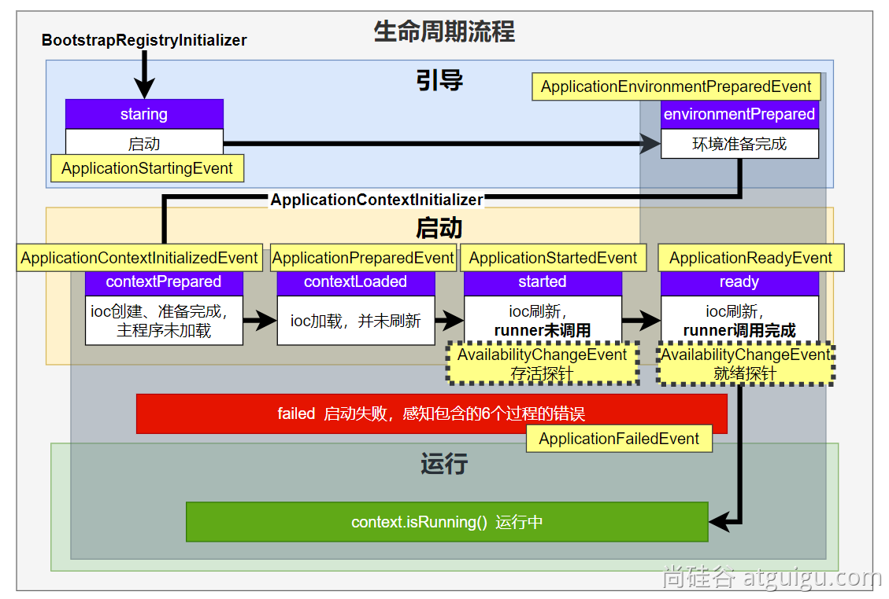
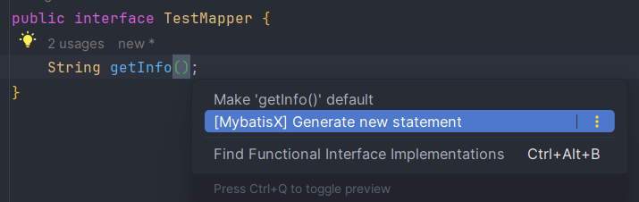
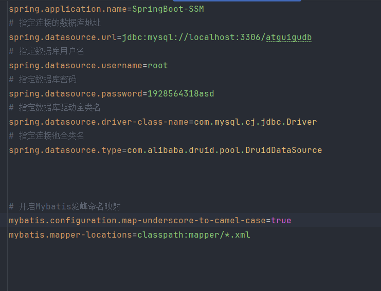
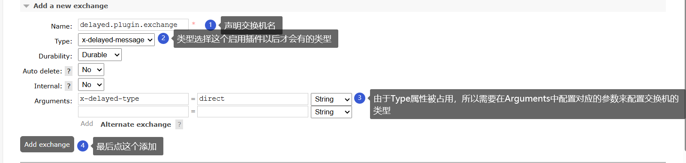
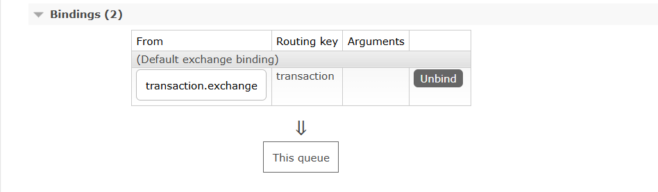

# Springboot笔记

## 一、简介与特性

+ Springboot是Spring官方提供的可以帮我们简单、快速地创建一个独立的、生产级别的 Spring 应用
+ SpringBoot可以:
  + 快速创建独立的Spring应用
  + 直接嵌入Tomcat、Jetty or Undertow（无需部署 war 包）(Servlet容器):如果是jar包可以通过`java -jar`命令运行，当然war包也可以，但建议war包放到tomcact的webapps目录内运行
  + 提供可选的starter，简化应用整合:**SpringBoot提供了许多场景启动器，并为每种场景准备了对应依赖，且自动为我们导入了符合当前版本的包**
  + 按需自动配置 Spring 以及 第三方库:**SpringBoot遵循约定大于配置的原则，它的每个场景都有很多默认配置**，如果我们想自定义，只需要修改几项即可
  + 提供生产级特性：如 监控指标、健康检查、外部化配置等
  + 无代码生成、无xml
+ 总结：SpringBoot可以简化开发，简化配置，简化整合，简化部署，简化监控，简化运维
  + **简化整合**:我们想实现什么功能，就导入什么场景。
    + 官方提供的场景一般叫`spring-boot-starter-*`，而第三方提供的场景一般叫`*-spring-boot-starter`
    + [默认支持的场景](https://docs.spring.io/spring-boot/docs/current/reference/html/using.html#using.build-systems.starters)
  + **简化开发**:无需进行任何配置，直接就可以开始开发
  + **简化配置**:SpringBoot的约定大于配置
    + 它提供了许多默认的配置，这样就不用我们在每次开始开发的时候先进行大量的配置工作
    + 如果想更改配置，可以创建一个`application.properties`文件，所有的配置都写在该文件中修改即可
    + [可修改的配置](https://docs.spring.io/spring-boot/docs/current/reference/html/application-properties.html#appendix.application-properties)
  + **简化部署**:打包为可执行的jar包，只需要linux系统上有java环境即可
  + **简化运维**:可以快速地修改配置（通过application.properties）、监控、健康检测

---

## 二、使用

### （一）HelloWorld

+ 首先需要创建一个项目，在项目内指定该项目继承自spring-boot-starter-parent

~~~xml

    <parent>
        <groupId>org.springframework.boot</groupId>
        <artifactId>spring-boot-starter-parent</artifactId>
        <version>3.0.5</version>
        <!-- 
          该标签的作用是Maven在查找依赖时先从该标签指定的本地路径下（这个本地路径不是仓库路径，而是父项目的pom.xml路径）查找，找不到再找本地仓库，找不到再找全局仓库
          但是不写IDEA（比较老的版本可能不报）可能会报错
          将该标签设置为空体可以使Maven直接从本地仓库中寻找依赖项，就直接绕过了本地路径
         -->
        <relativePath/>
    </parent>

~~~

+ 接下来指定依赖项:

~~~xml

    <dependencies>
        <dependency>
            <groupId>org.springframework.boot</groupId>
            <artifactId>spring-boot-starter-web</artifactId>
        </dependency>
    </dependencies>

~~~

+ 接下来开始编写Application类，该类是整个SpringBoot项目的启动类:

~~~java
    import org.springframework.boot.SpringApplication;
    import org.springframework.boot.autoconfigure.SpringBootApplication;

    @SpringBootApplication  // 该注解用来声明这是SpringBoot的项目启动类
    public class MainApplication {
        public static void main(String[] args) {
            // 调用SpringApplication的run方法，传入本类的Class对象和参数来启动SpringBoot项目
            // 这是固定写法
            SpringApplication.run(MainApplication.class,args);
        }
    }

~~~

+ 启动main方法便可以开始运行了
+ SpringBoot内置了对应的tomcat,因此我们无需再配置，它的默认端口为8080,通过访问可以发现它返回了404:

+ 这是因为我们一个controller都没写，没有接受任何请求
+ 接下来创建controller类:

~~~java
    import org.springframework.web.bind.annotation.GetMapping;
    import org.springframework.web.bind.annotation.RequestMapping;
    import org.springframework.web.bind.annotation.RestController;

    @RestController  // @ResponseBody+@Controller
    @RequestMapping("/index")  // 匹配映射/index访问
    public class HelloSpringBootController {
        @GetMapping
        public String helloSpringBoot(){
            return "Hello SpringBoot3";
        }
    }
~~~

+ 接下来就能访问了，直接访问[指定路径](http://localhost:8080/index)来测试是否正确配置
 

+ 除此以外，SpringBoot还额外提供了插件，供我们通过命令行的方式直接运行该jar包或war包
  + 首先执行`mvn clean package`重新打包
  + 接下来在所在包的对应目录下打开cmd,执行`java -jar xxxx.jar/war`来运行
  + 访问路径确认是否项目已经运行
 
 

+ 由于SpringBoot为了简化配置，它自动的配置了很多默认配置项
+ 如果我们想修改，我们可以在对应jar包或war包的同级目录下新建一个叫`application.properties`的配置文件，在该配置文件内指定自定义配置:

~~~properties
    <!-- 这里指定端口号为8888 -->
    server.port=8888
~~~

---

### （二）构建项目

#### ①手动构建

+ 这种创建方式可以创建老版本的SpringBoot项目
+ 首先创建一个普通的Java项目:

+ 然后在pom.xml文件内指定项目的父项目为SpringBoot项目，并指定继承的父项目版本:
  + 还可以指定子项目的版本

~~~xml
    <parent>
        <groupId>org.springframework.boot</groupId>
        <artifactId>spring-boot-starter-parent</artifactId>
        <version>3.2.5</version>
        <relativePath/> <!-- lookup parent from repository -->
    </parent>

    <version>0.0.1-SNAPSHOT</version>
~~~

+ 接下来添加依赖:
  + 一般就添加一个spring-boot-starter-web依赖就行:
  + 按需求添加test测试依赖

~~~xml
    <!-- web依赖 -->
    <dependency>
        <groupId>org.springframework.boot</groupId>
        <artifactId>spring-boot-starter-web</artifactId>
    </dependency>
    <!-- 测试依赖 -->
    <dependency>
        <groupId>org.springframework.boot</groupId>
        <artifactId>spring-boot-starter-test</artifactId>
        <scope>test</scope>
    </dependency>
~~~

+ 添加完之后，会发现出现了一个小选项:

+ 点击该选项，就可以选择SpringBoot帮我们整合好的依赖了:

+ 接下来引入构建依赖，没有它会导致我们的Maven项目在构建成jar包以后无法启动:

~~~xml
    <build>
        <plugins>
            <plugin>
                <groupId>org.springframework.boot</groupId>
                <artifactId>spring-boot-maven-plugin</artifactId>
            </plugin>
        </plugins>
    </build>
~~~

+ 接下来在resources目录下创建一个application.properties或application.yml配置文件
+ 根据本项目的artifactid在java目录下创建包，再写一个Application启动类，加上@SpringBootApplication注解，尝试启动。如果成功，此时我们的项目就构建完了
+ 但是，会出现两个问题
  1. 右边的Maven选项中，并未显示我们新创建的项目。**这意味着我们只能通过命令行的方式对项目进行Maven操作，也无法便捷的查看依赖**
  2. 我们的项目编译之后，放到了父项目的out目录下，而不是放到了自己模块的target目录下。**这会导致一些情况下的ClassNotFound异常**
  3. 项目报错:`未找到Java类`
+ 因此，我们需要解决这两个问题
  + 问题1:首先打开我们父项目的pom.xml文件，会发现一个modules标签，**我们创建的项目存在于该标签内，删掉它，然后刷新Maven**。该问题的原因是idea认为我们创建的项目是该项目的子项目，因为我们并没有以`Spring Initializr`模块的方式创建，于是它自动就把我们的项目归为了上层项目的子模块了
    + 其实该问题出现的原因是我们指定了spring-boot-starter-parent作为其父项目，而不是我们自己的Project，因此Maven显示不出来
    + **解决该问题后，idea可能会在其右下角弹出一个load maven project的选项，如果有，直接选上，这样下面的问题2也会被同步解决**
  + 问题2:右键项目->Open Module Steeings->Modules->我们新创建的项目->选择target目录->取消右上角的Excluded选项
  + 问题3:检查构建输出的target是否在本模块下，还是在父项目下，如果在父项目下，那么按照问题1的解决方案执行一遍即可解决

---

#### ②自动构建

+ IDEA提供了自动创建SpringBoot项目的模板模块:SpringInitializr，他可以为我们快速创建一个对应的SpringBoot项目
+ 首先new->Module，在左边的目录选择SpringInitializr

+ Name后写项目名称
+ Type选择Maven
+ Group自己指定一个对应的Group
+ JDK推荐选择17及以上
+ 打包方式随便
+ 接下来点击Next,进到选择场景界面

+ 在此界面的左上角可以选择SpringBoot的对应版本
+ 下面的Depemdencies下可以选择对应的场景:
  + 一般都是写JavaWeb项目，所以需要勾选Web下的SpringWeb
  + 如果想使用数据库，在SQL选择JDBC API和MySQL Driver，还可以选择Mybatis Framework
  + 如果想使用与jsp相关的视图解析器，可以在Template Engines下选择Thymleaf
  + 如果想使用Lombok，在Developers Tools下选择Lombok
+ 选择好之后点击创建，IDEA会**自动导入相关依赖**并**创建好相对应的项目启动类**
+ 如果我们想编写业务代码，我们需要把我们的代码及它们所在包写在项目启动类所在包的子包或后代包下，因为**SpringBoot默认只会扫描项目启动类所在包的子包及后代包的类**
+ 我们只需要指定基本的配置就行，它就会自动为我们创建好
+ 该自动构建的方式，由于是依靠`start.spring.io`的项目模型来构建的，因此其版本也会随着该网站的更新而更新。该网站是spring官方提供的自动构建项目的网站，它仅会提供最新的几个SpringBoot项目模板，**如果想使用老版本的SpringBoot，可以自己手动构建，也可以替换构建项目的url，把它换成`https://start.aliyun.com/`**

---

### （三）依赖管理

+ SpringBoot容易使用，其中的原因之一就是依靠依赖管理来实现的
  + 根据Maven的依赖传递原则，A依赖了B，且B依赖了C，那么A同时拥有B和C
    + 根据该情况，我们只需要导入对应的场景，而**SpringBoot提供的对应场景启动器依赖本身已经导入了许多依赖**，这样，当我们想开发什么场景时，就导入指定的场景启动器就可以直接进行开发了，因为这些场景启动器已经导入了我们想导入的依赖
  + 我们在**导入依赖时，不需要写版本号**
    + 这是因为每个SpringBoot项目都有公共的父项目——`spring-boot-starter-parent`，而该项目的父项目又是`spring-boot-dependencies`，它**为我们声明了许多常用依赖的适配版本**
    + 如果我们想改变依赖的版本号，可以依据Maven的就近原则，直接在我们项目的pom.xml文件内的properties标签内声明对应的版本，然后再在denpendency标签内声明版本即可；或者直接在dependency标签内声明版本也可以。由于就近原则，Maven会认定我们手动指定的版本优先级更高
  + 如果我们想导入的依赖没有在我们继承的父项目内，那么我们只能自己导入了（如Druid连接池）

---

### （四）核心

#### ①配置文件

##### Ⅰyaml文件

+ 我们的application.properties文件不能明显的表示层级关系，因此当其配置变多以后，里面的内容会变得难以阅读和维护
+ 为了解决这方面的困境，我们可以提供另外一种配置文件:application.yaml配置文件
  + YAML 是 "YAML Ain't a Markup Language"（YAML 不是一种标记语言）。在开发的这种语言时，YAML 的意思其实是："Yet Another Markup Language"（是另一种标记语言）
  + 该文件层次分明，方便人类读写
+ 它的基本语法很简单
  + 区分大小写
  + 使用缩进表示层级关系
  + 使用`key:(空格)value`的键值对形式表示数据，**value前的空格必须写**
  + 只要两个key的左侧是对齐的，那么它们就是相同层级的
  + #表示注释
  + 不能使用Tab键，只能使用空格
  + **二者的部分配置冲突时，properties文件的优先级比yaml文件的优先级高**
+ 示例:
  + 现在我们想对一个java实体类进行属性注入，我们需要在配置类中配置其属性默认值:

~~~java

@Component
@ConfigurationProperties(prefix = "people")
@Data
public class People {
    private String name;
    private Integer age;
    private Date birthDay;
    private Boolean like;
    private Child child; //嵌套对象
    private List<Dog> dogs; //数组（里面是对象）
    private Map<String,Cat> cats; //表示Map
}

~~~

+ 首先是[使用properties文件进行配置](../../源码/SpringBoot/SpringBootInitializrDemo/src/main/resources/application.properties)
+ 接下来[使用yaml文件进行配置](../../源码/SpringBoot/SpringBootInitializrDemo/src/main/resources/application.yaml)

---

##### Ⅱ复杂对象表示与语法细节

+ 如果我们想使用properties文件表示复杂对象的话:
  + 对于Map对象，就直接写xxx.xxx.key.propertyName=yyy
  + 对于List或数组对象，直接写xxx.xxx.arr[index].propertyName=yyy
+ 如果我们想使用yml文件表示复杂对象:

~~~yml
  xxx:
    yyy: [value1,value2,...] # 表示数组
    zzz: 
      - name: lzx  # 如果是对象数组，直接在- 后面加上属性，然后赋值
      - age: 10
    kkk: {name: ly,age: 20}  # 如果是对象，可以直接用大括号表示
    jjj:
      name: ly  # 或者使用这种方法进行测试
      age: 20
~~~

+ 配置文件还有一些特殊语法:
  + 如果我们的属性名是小驼峰命名法命名的，如birthDay,那么**yml文件或properties文件内都可以写成birth-day**
  + **在properties文件中**，如果一行文本过长，那么可以写一个`\`字符，然后换行接着写
  + 对于文本，一般不需要加引号，就默认是字符串。但是yml文件确实提供了引号:
    + 单引号内的转义字符不会生效
    + 双引号内的转义字符会生效
  + 对于大文本，即多行文本
    + 使用`|`开头，然后将大文本写在其下方，**注意是正下方或右下，不能写的相对于该符号靠左**，它可以保留文本格式，即文本写的是什么样，输出就是什么样
    + 使用`>`开头，然后将大文本写在其下方，**注意是正下方或右下，不能写的相对于该符号靠左**，它会折叠换行符，改为一个空格隔开
  + 还可以使用`---`将多个yml文档合并在一个文档中，每个文档区依然认为内容独立

---

##### Ⅲ优先级

+ SpringBoot接收多个来源的配置，这些配置生效的优先级如下（靠后的配置会覆盖掉靠前的）:
  + 通过SpringApplication对象的setDefaultProperties方法指定的配置
  + 通过@PropertySource注解导入的配置
  + **通过配置文件指定的配置**
  + RandomValuePropertySource支持的random.*配置（如：@Value("${random.int}")）
  + 操作系统的环境变量，**这里注意username是操作系统内用户名的环境变量名**
  + Java 系统属性（System.getProperties()）
  + JNDI 属性（来自java:comp/env）
  + ServletContext 初始化参数
  + ServletConfig 初始化参数
  + SPRING_APPLICATION_JSON属性（内置在环境变量或系统属性中的 JSON）
  + **命令行参数**
  + 测试属性。(@SpringBootTest进行测试时指定的属性)
  + 测试类@TestPropertySource注解导入的配置
  + Devtools 设置的全局属性。($HOME/.config/spring-boot)
+ 这些配置优先级的原理就是靠前的配置被先加载，靠后的配置被后加载，而后加载的配置覆盖掉了先前配置的值。但是**如果导入了多个配置，但是这些配置都不冲突，最终他们都会生效**
+ 在配置文件中，其优先级又可以被细分为:
  + 同级properties文件>yaml文件
  + jar包外的profile文件>jar包外的properties文件>jar包内的profile文件>jar包内的properties文件
  + jar包内的`classpath:/config`目录下的直接子目录内的文件>`classpath:/config`目录下的文件>类根路径下的文件（即深层的>浅层的）

--

#### ②场景处理

+ 在了解完成SpringBoot的自动配置机制后，我们就可以进行基本的场景定制化处理了
  + 首先我们需要导入对应的场景启动器
  + 接下来可以修改配置文件，以达到我们期望的配置
  + 分析该场景向IOC容器内增加了什么组件，这些组件是否能够满足我们的需求
    + 如果满足，我们就可以使用@AutoWired注解自动装配了
    + 如果不满足，我们可以进行定制化
      + 可以看到每个AutoConfiguration类内要加入IOC容器的组件，如果想加入，**它们都有前置条件**
      + 因此只要打破这些前置条件，其自动配置就不会执行
      + 而我们打**破这些前置条件最简单的方法就是我们在自己编写的配置类或其它地方也提供对应的bean**
      + 这样就实现了定制化

---

#### ③自动配置

+ SpringBoot提供了自动配置的服务，让我们能够享受如下的便利:
  + 编写SpringBoot项目时，只需要在application.properties或yaml文件中编写配置就可以对项目进行配置了，非常的方便
  + SpringBoot项目在扫描包时，会**扫描主程序类(就是被@SpringBootApplication注解作用的类)所在包及其后代包**，就不需要我们在配置类中手动指定@ComponentScan注解了
  + 一旦我们导入了场景，启动时运行的run方法在执行过程中会自动将场景的相关组件加入到IOC容器内并配置好，便于我们使用
  + run方法返回ioc容器对象，方便我们使用
+ 它的流程如下:

+ 我们实现自动配置的流程如下:
  + 首先我们想实现什么功能，就需要导入什么场景
  + SpringBoot自动进行依赖导入
  + 寻找类路径下 META-INF/spring/org.springframework.boot.autoconfigure.AutoConfiguration.imports文件
  + 项目启动时，就加载自动配置类，但**并不是所有自动配置都会生效，因为每个自动配置类生效都有其先决条件**
+ SPI机制
  + Java中的SPI（Service Provider Interface）是一种软件设计模式，用于在应用程序中动态地发现和加载组件。SPI的思想是，定义一个接口或抽象类，然后通过在classpath中定义实现该接口的类来实现对组件的动态发现和加载。
  + 在Java中，SPI的实现方式是通过在META-INF/services目录下创建一个以服务接口全限定名为名字的文件，文件中包含实现该服务接口的类的全限定名。当应用程序启动时，Java的SPI机制会自动扫描classpath中的这些文件，并根据文件中指定的类名来加载实现类。
  + SpringBoot也提供了SPI的实现，就是寻找META-INF/spring/org.springframework.boot.autoconfigure.AutoConfiguration.imports文件来达到自动配置
+ SpringBoot可以通过@EnableXxx注解手动开启某些功能的开关
  + 这些注解生效的原理都是利用@Import把此功能要用的组件导入进去

---

#### ④生命周期、事件与监听器

##### Ⅰ自定义监听器

+ 这里以实现全生命周期监听器为例来示范:
+ 在应用运行的各个生命周期下，我们可以自定义监听器来对事件的生命周期进行监听，并针对其事件做出不同的响应
  + 我们需要自定义一个类**实现SpringApplicationRunListener接口**
  + 在META-INF/spring.factories文件内配置`org.springframework.boot.SpringApplicationRunListener=自定义Listener全类名`
  + 除了我们自定义的监听器，SpringBoot还配置了默认的Listener，因为在org.springframework.boot包下的META-INF目录中的spring.factories文件内就配置了对应的监听器:`sorg.springframework.boot.SpringApplicationRunListener=org.springframework.boot.context.event.EventPublishingRunListener`
+ [监听器示例](../../源码/SpringBoot/EventAndListener/src/main/java/com/springboot/example/eventandlistener/listener/MyListener.java)

---

##### Ⅱ事件与探针

+ SpringBoot提供了九大事件，其中包括两个探针:
  + ApplicationStartingEvent:应用启动但未做任何事情, 除过注册listeners and initializers
  + ApplicationEnvironmentPreparedEvent: 环境变量已经准备好了，但IOC容器还未创建
  + ApplicationContextInitializedEvent:IOC容器创建完毕，但还没有任何bean加载
  + ApplicationPreparedEvent:容器刷新之前，bean定义信息加载
  + ApplicationStartedEvent:容器刷新完成， runner未调用
  + AvailabilityChangeEvent:**存活探针**，它表示项目启动到现在，项目依然在运行，但**它不意味着项目能对外界的请求做出响应**
  + ApplicationReadyEvent:任何runner被调用，该事件就会触发
  + AvailabilityChangeEvent:ReadinessState.ACCEPTING_TRAFFIC**就绪探针**，可以接请求，它表示runners都执行成功了，项目现在可以接受请求并响应了
  + ApplicationFailedEvent:启动出错事件
+ 另外，SpringBoot还提供了多个事件回调监听器:
  + BootstrapRegistryInitializer:感知引导初始化阶段的事件
  + ApplicationContextInitializer:感知ioc容器初始化的相关事件
  + ApplicationListener:**感知全阶段事件**。 一旦到了哪个阶段可以做别的事
  + SpringApplicationRunListener:**感知全阶段生命周期** + 各种阶段都能自定义操作；功能更完善。
  + ApplicationRunner:感知特定阶段：感知应用就绪Ready。卡死应用，就不会就绪
  + CommandLineRunner:感知特定阶段：感知应用就绪Ready。卡死应用，就不会就绪
+ 如果我们想使用这些回调监听器，我们需要
  + 自定义一个类，实现我们想实现的接口，即上面列举的各个的事件回调监听器
  + 接下来在`classpath:META-INF/spring.factories`文件内编写`实现的监听器接口全类名=自定义监听器全类名`
+ 总之，如果我们想做一些事情
  + 如果项目启动前做事：使用 BootstrapRegistryInitializer和 ApplicationContextInitializer
  + 如果想要在项目启动完成后做事： 使用ApplicationRunner和 CommandLineRunner
  + 如果要干涉生命周期做事：SpringApplicationRunListener
  + 如果想要用事件机制：ApplicationListener

---

##### Ⅲ生命周期启动加载机制

+ 如下图所示:

+ 项目启动先进行生命周期的加载，具体就是上面的监听器能够监听到的生命周期，其中掺杂着一些事件
+ 在加载到一半时，即在contextLoaded完成，但started之前会进行IOC容器的刷新操作
+ 刷新操作会将所有的bean加载进IOC容器，就是Spring容器刷新的经典12大步，这12大步可以划分成两部分
  + 创建工厂
  + 使用工厂创建bean
+ 其中，自动配置相关的加载会在创建工厂的最后一步，即invokeBeanFactoryPostProcessors（执行bean工厂后置处理器）的方法调用时执行

---

#### ⑤自定义starter

+ 如果我们想自定义starter，需要首先写好业务类:
  + [controller层](../../源码/SpringBoot/SpringBoot-starter-robot/src/main/java/com/springboot/example/springbootstarterrobot/controller/RobotController.java)
  + [service层](../../源码/SpringBoot/SpringBoot-starter-robot/src/main/java/com/springboot/example/springbootstarterrobot/service/RobotService.java)
+ 之后要可以写Properties配置类，使用@ConfigurationProperties注解可以指定配置文件的前缀:
  + [Properties配置类](../../源码/SpringBoot/SpringBoot-starter-robot/src/main/java/com/springboot/example/springbootstarterrobot/properties/RobotProperties.java)
+ 之后编写AutoConfiguration类，**可以使用@Import注解或者@Bean注解向IOC容器提供bean**
  + 我们在此之前，即在controller、service和properties类中写的@Component、@Service和@Controller注解实际上是不会生效的，只是为了防止IDEA报错才写。因为导入时这些类不会被直接导入，而是通过AutoConfiguration类导入，因此**只有在AutoConfiguration类中提供了它们的bean,他们才会加入到IOC容器中**
  + [AutoConfiguration类](../../源码/SpringBoot/SpringBoot-starter-robot/src/main/java/com/springboot/example/springbootstarterrobot/autoconfiguration/RobotAutoConfiguration.java)
+ 接下来我们要使用`mvn install`命令将我们的自定义starter放入本地仓库，因为不放的话Maven就会去别的仓库找，别的仓库那肯定是没有的
  + 放入本地仓库时，我们需要提供至少一个主类，可以随便写一个然后提供一个main方法，但是main方法里面什么都不写
  + 这个主类在未来其他人导入本依赖时它不会起作用，因为我们只能使用通过AutoConfiguration类提供的bean，我们只需要让AutoConfiguration类不导入主类，我们就使不了这个主类了
+ 之后就是在pom.xml文件内使用dependency标签导入依赖，注意要**加上版本号（version），要不然Maven依旧认为本地仓库没有这个依赖而去别的仓库寻找**
+ 之后就是使用了，但是仅导入依赖是使用不了的，因为**SpringBoot默认只能扫描项目启动类所在目录内的包，而我们导入的依赖不在这个包下**。我们有三种方式解决该问题
  + 可以在项目启动类上直接使用@Import导入依赖的自动配置类，然后由自动配置类导入bean
  + 可以自定义Enable注解，[样例](../../源码/SpringBoot/SpringBoot-use-robot/src/main/java/com/springboot/example/springbootuserobot/customannotation/EnableRobot.java)
  + 依靠SpringBoot的SPI机制，在META-INF/spring/org.springframework.boot.autoconfigure.AutoConfiguration.imports文件内提供自动配置类的全类名，[样例](../../源码/SpringBoot/SpringBoot-use-robot/src/main/resources/META-INF/spring/org.springframework.boot.autoconfigure.AutoConfiguration.imports)
+ 最后，我们自定义的Properties内的属性与properties或yaml文件的映射是没有提示的，如果想让IDEA提供提示，需要导入一个依赖:
  + 这个依赖就在SpringBoot创建模板时，选择依赖一栏中Developer Tools下的Lombok下面，勾一下就行

~~~xml
    <dependency>
        <groupId>org.springframework.boot</groupId>
        <artifactId>spring-boot-configuration-processor</artifactId>
        <optional>true</optional>
    </dependency>
~~~

---

#### ⑥配置隔离

+ 在开发时，我们可能有多种不同的环境，我们希望我们的环境不同，我们项目的部分类的生效情况也不同
+ SpringBoot针对这种需求，提供了一种配置隔离的方式，来进行配置:
  + Springboot提供了@Profile注解来让我们指定当我们的项目处于什么环境时，被其作用的类的@Component、@Configuration等注解才会生效
  + 在项目中，**默认的环境是default**，在该环境下，没有被@Profile注解作用的其他类都可以使用,当然，@Profile("default")注解作用的类也能使用
  + 我们的环境名可以随便起
  + 可以在配置文件中指定spring.profiles.active配置项来切换对应环境，它是一个数组对象，可以传多个值
  + spring.profiles.default配置项可以配置默认环境，默认的默认环境是default
  + spring.profiles.include用来表示包含的环境
    + 最终生效的环境=(spring.profiles.active配置的环境)+(spring.profiles.include配置的环境)
    + **一般我们把基础的环境，也就是无论什么情况都用到的环境加入到包含环境（spring.profiles.include）中去**
    + **需要动态切换的环境使用spring.profiles.active指定**
  + 我们还可以进行环境的分组
    + spring.profiles.group.{groupName}用来进行分组，我们可以把多个环境放到同一个组下，并给组起名字（在groupName那里起）
    + 必须把profile文件放在与application同级的目录下才有效
  + 除properties文件外，我们还能编写application-{profile}.properties文件，其中profile与我们的环境名一致
    + 在application-{profile}.properties文件中，我们可以编写该环境下对应的配置
    + 如果该环境被激活，SpringBoot就会读取该profile文件
    + application-{profile}.properties文件内**无法配置profile的相关配置**
  + 如果@Profile作用在配置类上以及其方法上，那么意思就是，当同时开启满足两个@Profile场景时，该方法上的其它注解才会生效
+ [配置类样例](../../源码/SpringBoot/SpringBootConfiguration/src/main/java/com/springboot/example/springbootconfiguration/config/MyConfig.java)
+ [总配置文件](../../源码/SpringBoot/SpringBootConfiguration/src/main/resources/application.properties)
+ [profile文件](../../源码/SpringBoot/SpringBootConfiguration/src/main/resources/application-other.properties)
+ [启动类](../../源码/SpringBoot/SpringBootConfiguration/src/main/java/com/springboot/example/springbootconfiguration/SpringBootConfigurationApplication.java)

---

#### 杂项

##### Ⅰbanner

+ 我们项目启动的时候，可以看到SpringBoot输出了一段类似logo的东西，这玩意叫banner。
+ SpringBoot默认读取spring.banner.location所指定的txt文件来读取banner
+ 我们可以通过配置项spring.banner.location指定对应的banner.txt相关位置来让控制台输出我们自定义的banner
+ 此处提供一个[自定义banner自动生成网站](https://www.bootschool.net/ascii)
+ [banner文件示例](../../源码/SpringBoot/SpringBootConfiguration/src/main/resources/banner/myBanner.txt)
+ 另外，SpringBoot在启动时，我们还可以以代码的方式给项目进行一些配置:
  + 我们都知道项目通过run方法来运行
  + 在点开源码后，我们发现它实际上是根据我们的Application类对象创建了一个SpringApplication对象，又调用的该对象run方法
  + 这样，我们其实可以将一行代码拆成两行代码，这样做的目的是为了得到SpringApplication对象
  + 得到SpringApplication对象，我们只需要保证运行它的run方法即可，但是在中间，我们还可以对该对象进行一些配置
  + **这些配置会在运行期间生效，但它的优先级没有配置文件设置的优先级高**
  + 为了简化我们的操作，SpringBoot提供了SpringApplicationBuilder类对象来供我们进行链式调用，方便我们进行配置

~~~java
    public static ConfigurableApplicationContext run(Class<?> primarySource, String... args) {
        // 这是我们调用的静态run方法，可以看到它调用了重载的run方法
        return run(new Class[]{primarySource}, args);
    }
    public static ConfigurableApplicationContext run(Class<?>[] primarySources, String[] args) {
        // 该run方法根据传来的Class数组创建了一个SpringApplication对象，然后调用了该对象的run方法
        return (new SpringApplication(primarySources)).run(args);
    }
~~~

+ [代码配置样例](../../源码/SpringBoot/SpringBootConfiguration/src/main/java/com/springboot/example/springbootconfiguration/SpringBootConfigurationApplication.java)

---

### （五）处理流程

+ 一般的SpringBoot项目对于一个请求的处理流程如下:

---

### （六）项目规范

#### ①返回格式

+ 我们给前端的返回值应该有一个统一的返回格式:
  + 表示请求状态的code状态码
    + 该状态码一般使用枚举类来呈现,**可以使用Spring官方提供的HttpStatus来得到对应的Http请求状态码**
    + [枚举类样例](../../源码/SpringCloud/SpringCloud-Common-API/src/main/java/com/example/cloud/resp/ReturnCodeEnum.java)
  + 本次请求所返回的数据data
    + 如果数据内包含日期时间相关的属性或对象，可以参考下面的日期时间格式自定义规范表来自定义时间样式
      + 可以通过`spring.jackson.date-format`来自定义时间样式，一般使用`yyyy-MM-dd HH:mm:ss`就行。另外可以通过`spring.jackson.time-zone`指定时区，`GMT+8`为东八区
      + 也可以使用@JsonFormat，将其作用在时间属性上，通过pattern和timezone属性来指定自定义时间格式与时区
      + 
  + 描述本次请求的结果message
  + 处理请求的时间戳timeStamp,用来**判断是否使用了缓存**
  + [返回类样例](../../源码/SpringCloud/SpringCloud-Pay/src/main/java/com/example/cloud/resp/ReturnData.java)

---

#### ②全局异常处理

+ 使用全局异常处理处理异常
  + 使用Spring官方提供的**HttpStatus枚举类**来得到对应的状态码对象
  + 使用`log.error`方法来进行日志的记录
  + 利用通用的返回类将异常返回给前端，或者处理异常

---

#### ③请求与响应

##### Ⅰ前后端交互

+ 前端给后端传数据用DTO
+ 后端给前端传用VO

---

##### Ⅱ数据转换

###### <一>JSON转换

+ 一般使用Jackson进行JSON数据转换，jackson是目前SpringBoot自带的转换器，因此Ioc容器中自带ObjectMapper，直接用就行
  + 转换时严格使用JSON格式，可以避免很多不必要的问题，比如上传redis时，把值转成JSON串再传，那么转回来时也这么转换，出现的问题就会减少
  + readValue用来解析JSON串
  + convertValue用来转换对象

---

###### <二>时间格式转换

+ SpringBoot内置了Jackson进行时间单位的转换，但是如果我们想将时间对象转换为我们制定的格式时，有两种方式:
  + 使用@JsonFormat注解并指定pattern属性告诉Jackson如何转换(局部)
  + 自定义消息转换器转换:
  ~~~java
    // 自定义消息转换器就是向消息转换器集合里面添加一个我们自己定义的消息转换器，为了达到该目的，需要让类继承WebMvcConfigurationSupport类或实现
    public class WebMvcConfiguration extends WebMvcConfigurationSupport {

        // 需要继承extendMessageConverters方法，向converters里面加一个消息转换器进去
        @Override
        protected void extendMessageConverters(List<HttpMessageConverter<?>> converters) {
            //创建一个消息转换器对象
            MappingJackson2HttpMessageConverter converter = new MappingJackson2HttpMessageConverter();
            //需要为消息转换器设置一个对象转换器，对象转换器可以将Java对象序列化为json数据
            // 这个设置的对象转换器需要我们自己去手动编写，它需要继承ObjectMapper类(即Jackson用于进行JSON转换的类)
            converter.setObjectMapper(new JacksonObjectMapper());
            //将自己的消息转化器加入容器中
            converters.add(0,converter);
        }
    }
    // 自定义日期格式的对象转换器类
    class JacksonObjectMapper extends ObjectMapper {

        public static final String DEFAULT_DATE_FORMAT = "yyyy-MM-dd";
        //public static final String DEFAULT_DATE_TIME_FORMAT = "yyyy-MM-dd HH:mm:ss";
        public static final String DEFAULT_DATE_TIME_FORMAT = "yyyy-MM-dd HH:mm";
        public static final String DEFAULT_TIME_FORMAT = "HH:mm:ss";

        public JacksonObjectMapper() {
            super();
            //收到未知属性时不报异常
            this.configure(FAIL_ON_UNKNOWN_PROPERTIES, false);

            //反序列化时，属性不存在的兼容处理
            this.getDeserializationConfig().withoutFeatures(DeserializationFeature.FAIL_ON_UNKNOWN_PROPERTIES);

            SimpleModule simpleModule = new SimpleModule()
                    .addDeserializer(LocalDateTime.class, new LocalDateTimeDeserializer(DateTimeFormatter.ofPattern(DEFAULT_DATE_TIME_FORMAT)))
                    .addDeserializer(LocalDate.class, new LocalDateDeserializer(DateTimeFormatter.ofPattern(DEFAULT_DATE_FORMAT)))
                    .addDeserializer(LocalTime.class, new LocalTimeDeserializer(DateTimeFormatter.ofPattern(DEFAULT_TIME_FORMAT)))
                    .addSerializer(LocalDateTime.class, new LocalDateTimeSerializer(DateTimeFormatter.ofPattern(DEFAULT_DATE_TIME_FORMAT)))
                    .addSerializer(LocalDate.class, new LocalDateSerializer(DateTimeFormatter.ofPattern(DEFAULT_DATE_FORMAT)))
                    .addSerializer(LocalTime.class, new LocalTimeSerializer(DateTimeFormatter.ofPattern(DEFAULT_TIME_FORMAT)));

            //注册功能模块 例如，可以添加自定义序列化器和反序列化器
            this.registerModule(simpleModule);
        }
    }
  ~~~

---

## 三、整合

### （一）Redis

#### ①Jedis

+ Jedis是Redis官方提供的类似JDBC的与Redis数据库进行交互的库
+ 首先记得导包:

~~~xml
  <dependency>
      <groupId>redis.clients</groupId>
      <artifactId>jedis</artifactId>
      <version>5.1.0</version>
  </dependency>
~~~

+ [Jedis样例](../../源码/Redis/src/main/java/com/springboot/example/redis/redisdemo/JedisSample.java)

---

#### ②lettuce

+ Lettuce是一个Redis的Java驱动包，Lettuce翻译为生菜，没错，就是吃的那种生菜，所以它的Logo就是生菜
+ Jedis的相关操作在使用Redis客户端的时候，每个线程都要拿自己创建的Redis实例去连接Redis客户端，当存在很多线程的时候，不仅开销大需要反复创建关闭一个Redis连接，而且还线程不安全，一个线程通过Jedis实例更改Redis服务器中的数据之后会影响另一个线程
+ Lettuce底层使用的是Netty,当有多个线程需要连接Redis服务器时，它可以保证只创建一个Redis连接，使所有线程都共享该连接。这样既减少了资源开销，也是线程安全的(不会出现一个线程通过Jedis实例更改Redis服务器中的数据之后会影响另一个线程的情况)
+ 导包时，如果使用的是SpringBoot,那么直接把`Spring Data Redis`勾上就行，它内部已经导入了Lettuce依赖
+ 也可以手动导入:

~~~xml
  <!--lettuce-->
   <dependency>
       <groupId>io.lettuce</groupId>
       <artifactId>lettuce-core</artifactId>
       <version>6.2.1.RELEASE</version>
   </dependency>
~~~

+ [lettuce样例](../../源码/Redis/src/main/java/com/springboot/example/redis/redisdemo/LettuceSample.java)

#### ③RedisTemplate

+ 配置项参考:

~~~properties

  # 设置Redis所在IP
  spring.data.redis.host=xxx
  # 指定Redis所在端口号
  spring.data.redis.port=6379
  # 指定要连接的Redis数据库序号
  spring.data.redis.database=0
  # 指定Redis密码
  spring.data.redis.password=123456
  # 设置最大连接池最大数量
  spring.data.redis.lettuce.pool.max-active=8
  # 连接池阻塞的最大等待时间
  spring.data.redis.lettuce.pool.max-wait=-1ms
  # 连接池中的最大空闲连接
  spring.data.redis.lettuce.pool.max-idle=8
  # 连接池中的最小空闲连接
  spring.data.redis.lettuce.pool.min-idle=0

~~~

|归属|方法|参数|描述|返回值|返回值类型|异常|备注|样例|
|:---:|:---:|:---:|:---:|:---:|:---:|:---:|:---:|:---:|
|**RedisTemplate<K,V>**|`opsForValue()`|无参|得到针对String类型的操作对象|>|ValueOperations<K,V>|无|无|无|
|^|`opsForHash()`|^|得到针对Hash类型的操作对象|>|HashOperations<K,HK,HV>|无|无|^|
|^|`opsForGeo()`|^|得到针对Geo类型的操作对象|>|GeoOperations<K,V>|无|无|^|
|^|`opsForList()`|^|得到针对List类型的操作对象|>|ListOperations<K,V>|无|无|^|
|^|`opsForHyperLogLog()`|^|得到针对HyperLogLog类型的操作对象|>|HyperLogLogOperations<K,V>|无|无|^|
|^|`opsForSet()`|^|得到针对Set类型的操作对象|>|SetOperations<K,V>|无|无|^|
|^|`opsForZSet()`|^|得到针对ZSet类型的操作对象|>|ZSetOperations<K,V>|无|无|^|
|**DefaultValueOperations<K,V>**|`set(K key, V value)`|key:键 value:值|创建或修改一个键值对|无返回值|void|无|无|^|
|^|`set(K key, V value, final long timeout, final TimeUnit unit)`|key:键 value:值 timeout:键值对的过期时间 unit:时间单位|创建一个有过期时间的键值对|无返回值|void|无|无|^|
|^|`get(Object key)`|key:键|得到指定键的值|键对应的值|V|无|无|^|
|^|`getAndSet(K key, V newValue)`|key:想得到的键 newValue:想设置的新值|先get再set|旧值|V|无|无|^|
|^|`increment(K key)`|key:键|使指定键对应的值自增1|自增后的值|Long|无|无|^|
|^|`increment(K key, long delta)`|key:键 delta:要增加的值|使指定键对应的值增加指定值|增加后的值|Long|无|无|^|
|^|`decrement(K key)`|key:键|使指定键对应的值自减1|自减后的值|Long|无|无|^|
|^|`Long decrement(K key, long delta)`|key:键 delta:要减少的值|使指定键对应的值减少指定值|减少后的值|Long|无|无|^|
|^|`multiGet(Collection<K> keys)`|keys:想得到的键组成的集合|批量得到指定数量的键所对应的值|所有对应值组成的集合|List<V>|无|无|^|
|^|`multiSet(Map<? extends K, ? extends V> m`|m:想设置的键值对组成的Map|批量修改或创建键值对|无返回值|void|无|无|^|
|^|`append(K key, String value)`|key:键 value:要拼接上去的字符串|字符串的拼接|新字符串的长度|Integer|无|无|^|
|**DefaultHyperLogLogOperations<K,V>**|`add(K key, V... values)`|key:键 values:用于加入基数统计的一个或多个值|如果这些值有至少一个被统计到HyperLogLog中了，那么返回1，否则返回0|Long|无|无|^|
|^|`delete(K key)`|key:键|删除指定HyperLogLog|无返回值|void|无|无|^|
|^|`size(K ...keys)`|keys:一个或多个键|将多个HyperLogLog取并集并统计不重复元素的个数|数值|Long|无|无|^|
|^|`union(K destination, K ...sourceKeys)`|destination:用于合并的HyperLogLog sourceKeys:被合并的HyperLogLog|将一个或多个HyperLogLog的结果合并到指定HyperLogLog中去|
|**Point**|`Point(double x, double y)`|x:经度 y:纬度|构造器|Point对象|Point|无|无|^|
|**GeoLocation<T>**|`GeoLocation(T name, Point point)`|name:地理坐标信息 point:Point对象，表示该地理坐标的经纬度位置|向指定GEO对象添加地理信息|添加进去的元素数量|Long|无|无|^|
|**Distance**|`Distance(double value, Metric metric)`|value:距离 metric:距离单位|构造器|Distance对象|Distance|无|无|^|
|^|`getValue()`|无参|得到该对象表示的距离值|浮点值|double|无|无|^|
|^|`getMetric()`|无参|得到该对象距离值所属的的长度单位对象|>|Metric|无|无|^|
|^|`getUnit()`|无参|返回长度单位的英文缩写|字符串|String|无|无|^|
|^|`getNormalizedValue()`|无参|返回当前距离值与赤道半径长度的比值|浮点值|double|无|无|^|
|**DefaultGeoOperations<K,M>**|`add(K key, Map<M, Point> memberCoordinateMap)`|key:键 memberCoordinateMap:各地理位置组成的Map集合，由M泛型类型的key和表示地理信息的Point类型的value组成|向指定GEO对象内添加地理信息|添加进去的元素数量|Long|无|无|^|
|^|`add(K key, GeoLocation<M> location)`|key:键 location:地理位置信息|向指定GEO对象添加地理信息|添加进去的元素数量|Long|无|无|^|
|^|`distance(K key, M member1, M member2, Metric metric)`|key:键 member1:要比较的地理坐标1 member2:要比较的地理坐标2 metric:指定长度单位|得到指定单位的两个地理坐标相隔的位置|一个Distance对象|Distance|无|无|^|
|^|`radius(K key, M member, Distance distance, GeoRadiusCommandArgs args)`|key:键 member:指定的地理坐标 distance:指定半径 args:额外参数项，可以指定结果的排序方式、限制返回的结果数量、顺带返回经纬度坐标等|得到GEO对象中给定地理坐标指定半径以内的圆内的对应地理坐标信息|>|GeoResults<GeoLocation<M>>|无|无|^|

+ RedisTemplate是Spring官方整合的与Redis进行交互的封装类
+ 首先配置config类，我们**需要在配置类中手动提供RedisTemplate对象并设置其数据的序列化器**，因为自动注入的对象，其序列化方式会导致Redis中文乱码:
  + 自动注入的对象无法序列化中文的原因是它默认使用JDK的序列化方式，没办法序列化中文
  + 另外，**也可以通过使用RedisTemplate的子类StringRedisTemplate类来避免中文的无法序列化**，因为其子类采用的序列化方式与父类不同。这一点在其无参构造器源码中就有显著体现

~~~java
    @Configuration
    public class RedisConfig {

        @Bean
        public RedisTemplate<String, Object> redisTemplate(LettuceConnectionFactory lettuceConnectionFactory) {
            // 手动创建RedisTemplate对象
            RedisTemplate<String,Object> redisTemplate = new RedisTemplate<>();

            redisTemplate.setConnectionFactory(lettuceConnectionFactory);
            //设置key序列化方式string，防止key乱码
            redisTemplate.setKeySerializer(new StringRedisSerializer());
            //设置value的序列化方式json，使用GenericJackson2JsonRedisSerializer替换默认序列化，防止value乱码
            redisTemplate.setValueSerializer(new GenericJackson2JsonRedisSerializer());

            redisTemplate.setHashKeySerializer(new StringRedisSerializer());
            redisTemplate.setHashValueSerializer(new GenericJackson2JsonRedisSerializer());

            redisTemplate.afterPropertiesSet();

            return redisTemplate;
        }
    }
~~~

+ 接下来是RedisTemplate的使用方法:
  + 先调用`opsXxx`方法来确定要操作的数据类型，再进行相关的操作

~~~java
    @Service
    @Slf4j
    public class RedisService {
        @Resource
        // 这个玩意也可以直接注入StringRedisTemplate类，因为它是RedisTemplate的子类，功能更丰富，也支持中文序列化。缺点是操作对象只能是字符串类型
        RedisTemplate<String,Object> redisTemplate;  
        public String setData(String key,String value){
            redisTemplate.opsForValue().set(key,value);
            log.info(key);
            return getData(key);
        }

        public String getData(String key){
            return (String)redisTemplate.opsForValue().get(key);
        }
    }
~~~

---

#### ④连接Redis集群

+ 配置项:

~~~properties

    spring.application.name=Redis

    spring.data.redis.password=123456
    # 设置最大重定向次数
    spring.data.redis.cluster.max-redirects=3
    # 设置最大连接池最大数量
    spring.data.redis.lettuce.pool.max-active=8
    # 连接池阻塞的最大等待时间
    spring.data.redis.lettuce.pool.max-wait=-1ms
    # 连接池中的最大空闲连接
    spring.data.redis.lettuce.pool.max-idle=8
    # 连接池中的最小空闲连接
    spring.data.redis.lettuce.pool.min-idle=0
    # 连接的集群节点，使用xxx表示的是节点所在服务器的IP地址
    spring.data.redis.cluster.nodes=xxx:6381,xxx:6382,\
      xxx:6383,xxx:6384,\
      xxx:6385,xxx:6386
    # 开启集群拓扑动态感应刷新
    spring.data.redis.lettuce.cluster.refresh.adaptive=true
    # 设置定时刷新频率
    spring.data.redis.lettuce.cluster.refresh.period=2000

~~~

+ 接下来直接操作即可，操作方式与redisTemplate一致

---

### （二）Mybatis

+ SpringBoot把Spring跟SpringMVC都整合好了，我们需要做的就是配置Mybatis以及一些数据库相关配置

  + 如果想导入Druid连接池，由于SpringBoot没有提供，我们需要自己导:

~~~xml
    <properties>
        <java.version>17</java.version>

        <druid.version>1.2.22</druid.version>
    </properties>

    <dependency>
        <groupId>com.alibaba</groupId>
        <artifactId>druid</artifactId>
        <version>${druid.version}</version>
    </dependency>

~~~

  + 接下来就创建controller、mapper等java文件
  + 在创建mapper时，我们在创建接口之后，可以依靠MybatisX插件快速的生成对应的xml文件（按Alt+Enter）
  + 选择Generate mapper of xml

  + 在下面的页面选择我们的xml文件生成位置，一般我们都会选择resources目录下的mapper目录

  + 在我们创建出对应的方法时，也可以通过MybatisX快速在对应的xml文件内生成标签

  + 接下来创建对应的实体类对象，**不要忘记提供setter方法**，一般加一个@Data注解就行了
  + 最后配置配置文件，提供JDBC相关的四个必须配置和Mybatis的xml文件映射路径，以及选择性提供连接池、配置Mybatis的驼峰映射、主键回显等

---

### （三）WebSocket

#### ①简要概述

+ WebSocket可以实现服务端向客户端发送信息

#### ②整合流程

+ 前置条件:
  + tomcat7.0.5版本及以上（tomcat在7.0.5版本才开始支持WebSocket）
+ 接下来开始:
  + 首先是前端，前端的部分很简单，就是WebSocket的API，详见[MDN](https://developer.mozilla.org/zh-CN/docs/Web/API/WebSocket)
  
  ~~~jsx

    let webSocketLink=new WebSocket(`ws://localhost:8080/chat/${userContext.userName}`);
    webSocketLink.onopen=(params)=>{
        console.log('客户端连接成功');
    };
    webSocketLink.onmessage=({data})=>{
        console.log(`收到信息:${data}`);
    };
    ...

  ~~~

  + 接下来是后端，需要导入Spring WebSocket依赖，这里Spring官方已经提供了，可以直接导
  + 我们需要先写一个配置类，提供ServerEndPointExporter对象:
    + 提供该对象后，如果在测试包下测试方法，可能会出现报错，如果出现报错，在测试类上的@SpringBootTest注解上面指定属性:`@SpringBootTest(webEnvironment = SpringBootTest.WebEnvironment.RANDOM_PORT)`

  ~~~java

    @Configuration
    @EnableWebSocket
    public class WebSocketConfig {
        @Bean
        public ServerEndpointExporter getServerEndpointExporter(){
            return new ServerEndpointExporter();
        }
    }

  ~~~

  + 然后是业务层的代码:
    + WebSocket主要有三个事件:创建连接、发送信息和关闭连接，我们主要就需要实现这三个方法。除此之外，还可以实现出现错误时的处理代码
      + 我们可以通过继承类来实现
      + 也可以通过Jarkarta官方提供的注解来实现，前提是导入Spring WebSocket依赖

|注解|作用|备注|
|:---:|:---:|:---:|
|@ServerEndpoint|声明对应类为WebSocket服务类，也就是让Spring知道这个类是处理WebSocket请求的。除此以外，还负责指定该类负责处理的路径|1.**路径必须有`/`作为前缀** 2.**该注解使得Spring的依赖注入无法实现**，因为WebSocket是只要有一个连接，就会创建一个对应服务类的实例，而这与Spring默认的单实例冲突，因此无法执行依赖注入|
|@OnOpen|声明对应方法在WebSocket连接时触发|无|
|@OnMessage|声明对应方法在收到信息时触发|无|
|@OnClose|声明对应方法在关闭连接时触发|无|
|@OnError|声明对应方法在出现异常时触发|无|

  + 接下来是对应的方法:

  ~~~java
    @ServerEndpoint(value = "/chat/{userName}")  // 这个B玩意会导致依赖注入没法注入
    @Slf4j
    @Component
    public class ChatEndPoint {
        private static final Map<String, Session> onLineUsers = new ConcurrentHashMap<>();

        @OnOpen
        public void onOpen(Session session, EndpointConfig config, @PathParam("userName") String userName) {
            // onOpen要做的有两件事，一件是将连接的该用户加入到在线序列中去，另一件事是向所有用户广播该用户已在线
            try {
                // 将session对象加入到在线用户的map集合中
                onLineUsers.put(userName, session);
                // 得到向所有在线成员广播的系统信息
                String message = "测试";
                // 向所有成员进行广播
                broadcastAllUserMessage(message);
            } catch (Exception e) {
                e.printStackTrace();
                log.error(e.toString());
            }
        }

        @OnMessage
        public void onMessage(String msg) throws Exception{
            Session session = onLineUsers.get("test");
            session.getBasicRemote().sendText(msg);
        }

        @OnClose
        public void onClose(CloseReason reason,Session session){
            log.info(reason.toString());
        }

        @OnError
        public void onError(Throwable e){
            log.info(e.toString());
        }

        private void broadcastAllUserMessage(String msg) throws Exception{
            // 遍历每个在线用户，向它们的客户端发送消息
            for (Map.Entry<String, Session> entry : onLineUsers.entrySet()) {
                Session userSession = entry.getValue();
                userSession.getBasicRemote().sendText(msg);
            }
        }
    }

  ~~~

---

### （四）Mybatis-Plus

+ [官网](https://baomidou.com)
+ MyBatis-Plus 是一个MyBatis的增强工具，在MyBatis的基础上只做增强不做改变，为简化开发、提高效率而生。

#### ①依赖

+ 如果是**SpringBoot3**，那么引入:

~~~xml
    <dependency>
        <groupId>com.baomidou</groupId>
        <artifactId>mybatis-plus-spring-boot3-starter</artifactId>
        <version>3.5.7</version>
    </dependency>
~~~

+ 如果是**SpringBoot2**，那么引入:

~~~xml
    <dependency>
        <groupId>com.baomidou</groupId>
        <artifactId>mybatis-plus-boot-starter</artifactId>
        <version>3.5.7</version>
    </dependency>
~~~

+ **引入MyBatis-Plus之后不要再次引入Mybatis相关依赖。以避免因版本差异导致的问题**。如果引了，那么大概率会报错
+ 从3.5.4开始，在没有使用mybatis-plus-boot-starter或mybatis-plus-spring-boot3-starter情况下，请自行根据项目情况引入mybatis-spring

~~~xml
    <dependency>
        <groupId>com.baomidou</groupId>
        <artifactId>mybatis-plus-boot-starter</artifactId>
    </dependency>
~~~

---

#### ②BaseMapper

+ [参考](https://baomidou.com/guides/data-interface/#mapper-interface)
+ BaseMapper是Mybatis-Plus提供的一个通用Mapper接口，它封装了一系列常用的数据库操作方法，包括增、删、改、查等。通过继承BaseMapper，开发者可以快速地对数据库进行操作，而无需编写繁琐的SQL语句
+ 我们的mapper接口通过继承BaseMapper接口来实现对该基础接口的继承，继承时需要制定接口的泛型，需要指定要操作的数据库表对应的实体类:

~~~java
    // User即数据库user表对应的实体类
    public interface UserMapper extends BaseMapper<User>{ ... }
~~~

+ BaseMapper提供了一系列的操作方法，参见[官网](https://baomidou.com/guides/data-interface/#mapper-interface)
+ [BaseMapper测试样例](../../源码/SpringBoot/SpringBoot-Mybatis-Plus/src/test/java/com/springboot/example/mybatisplus/MapperTest.java)
+ [Wrapper测试样例](../../源码/SpringBoot/SpringBoot-Mybatis-Plus/src/test/java/com/springboot/example/mybatisplus/WrapperTest.java)

---

#### ③IService

+ IService 是MyBatis-Plus提供的一个通用Service层接口，它封装了常见的CRUD操作，包括插入、删除、查询和分页等。通过继承IService接口，可以快速实现对数据库的基本操作，同时保持代码的简洁性和可维护性
+ 我们可以让我们的Service接口继承该接口，来得到该接口定义的方法，再让接口实现类继承ServiceImpl类实现对IService内定义方法的实现，同时实现我们的Service接口来进行拓展:

~~~java

// IService的泛型指定数据库表对应的实体类对象
public interface UserService extends IService<User> {...}

// ServiceImpl的第一个泛型指定继承了BaseMapper的自定义Mapper类接口
// 第二个泛型指定数据库表对应的实体类对象
@Service
public class UserServiceImpl extends ServiceImpl<UserMapper, User> implements UserService {...}
~~~

+ [IService测试样例](../../源码/SpringBoot/SpringBoot-Mybatis-Plus/src/test/java/com/springboot/example/mybatisplus/ServiceTest.java)

---

#### ④常用注解

+ [参考](https://baomidou.com/reference/annotation/)

|注解|作用|属性|属性作用|备注|
|:---:|:---:|:---:|:---:|:---:|
|@TableName|指定实体类对应的数据库表名|value|指定实体类对应的数据库表名|无|
|^|^|keepGlobalPrefix|是否保持使用全局的表前缀|无|
|^|^|excludeProperty|指定在映射时需要排除的属性名|无|
|@TableId|标记实体类中的主键字段|value|指定实体类主键属性对应的数据库主键名，如果不设置，Mybatis-Plus将使用属性名作为主键名|无|
|^|^|type|指定主键的生成策略|无|
|@TableField|标记实体类中的非主键属性|value|指定实体类非主键属性对应的数据库字段名|无|
|^|^|exist|表示是否该字段存在于数据库中，若指定为false,则Mybatis-Plus在生成 SQL 时会忽略这个字段|默认为true|
|@TableLogic|标记实体类中的属性作为逻辑删除字段|value|指定实体类属性对应的数据库逻辑删除字段名|无|
|@Version|标记实体类中的字段作为乐观锁版本号字段|>|略|无|
|@EnumValue|标记枚举类中的字段，指定在数据库中存储的枚举值|>|略|无|

---

#### ⑤常用配置

+ [参考](https://baomidou.com/reference/)

|配置|作用|值|备注|
|:---:|:---:|:---:|:---:|
|mybatis-plus.mapper-locations|指定mapper接口对应的mapper.xml文件的位置，默认为`classpath:/mapper/**/*.xml`|classpath:xxxx|无|
|mybatis-plus.configuration.map-underscore-to-camel-case|是否开启小驼峰命名映射，默认开启|布尔值|无|
|mybatis-plus.configuration.log-impl|指定对应日志在SQL执行时进行输出，默认没有配置|日志类全路径|无|
|mybatis-plus.type-aliases-package|指定实体类别名的包类路径|路径，一般为`com.example.xxx.pojo`|无|

---

#### ⑥插件

+ Mybatis_plus支持一些好用的插件，可以通过配置类来进行导入:

~~~java

    @Bean
    public MybatisPlusInterceptor mybatisPlusInterceptor(){
        MybatisPlusInterceptor mybatisPlusInterceptor=new MybatisPlusInterceptor();
        mybatisPlusInterceptor.addInnerInterceptor(new PaginationInnerInterceptor(DbType.MYSQL));  // 添加分页插件
        mybatisPlusInterceptor.addInnerInterceptor(new OptimisticLockerInnerInterceptor());  // 添加乐观锁插件
        return mybatisPlusInterceptor;
    }
~~~

+ [插件样例](../../源码/SpringBoot/SpringBoot-Mybatis-Plus/src/test/java/com/springboot/example/mybatisplus/PluginTest.java)
+ 其他插件见[官网](https://baomidou.com/plugins/)

---

#### ⑦多数据源

+ [官网介绍](https://baomidou.com/guides/dynamic-datasource/)
+ [github官方](https://github.com/baomidou/dynamic-datasource)
+ 顾名思义，就是对多个数据源的支持
+ 首先要导入新的依赖:

~~~xml
    <!-- SpringBoot1和SpringBoot2用这个 -->
    <dependency>
        <groupId>com.baomidou</groupId>
        <artifactId>dynamic-datasource-spring-boot-starter</artifactId>
        <version>${version}</version>
    </dependency>

    <!-- SpringBoot3用这个，用上面的会报错 -->
    
    <dependency>
        <groupId>com.baomidou</groupId>
        <artifactId>dynamic-datasource-spring-boot3-starter</artifactId>
        <version>${version}</version>
    </dependency>

~~~

+ 在[配置文件](../../源码/SpringBoot/SpringBoot-Mybatis-Plus/src/main/resources/application.properties)中进行相关配置
+ 在[Service类](../../源码/SpringBoot/SpringBoot-Mybatis-Plus/src/main/java/com/springboot/example/mybatisplus/service/impl/MasterUserServiceImpl.java)中写上@DS注解，**该注解用于指定所使用的数据源**
+ 进行[测试](../../源码/SpringBoot/SpringBoot-Mybatis-Plus/src/test/java/com/springboot/example/mybatisplus/DynamicDatasourceTest.java)

---

### （五）Swagger

#### ①依赖导入

+ 导入依赖

~~~xml
  <!-- Swagger3 调用方式 http://你的主机IP地址:5555/swagger-ui/index.html -->
  <dependency>
      <groupId>org.springdoc</groupId>
      <artifactId>springdoc-openapi-starter-webmvc-ui</artifactId>
  </dependency>
~~~

---

#### ②配置信息

~~~java

    @Configuration
    public class SwaggerOpenApiConfig {
        @Bean
        public OpenAPI createOpenAPI() {

            // 联系人信息(contact)，构建API的联系人信息，用于描述API开发者的联系信息，包括名称、URL、邮箱等
            // name：文档的发布者名称 url：文档发布者的网站地址，一般为企业网站 email：文档发布者的电子邮箱
            Contact contact = new Contact()
                    .name("unreal")                             // 作者名称
                    .email("752586164@qq.com")                   // 作者邮箱
                    .url("https://www.unreal.com/")  // 介绍作者的URL地址
                    .extensions(new HashMap<String, Object>()); // 使用Map配置信息（如key为"name","email","url"）

            // 授权许可信息(license)，用于描述API的授权许可信息，包括名称、URL等；假设当前的授权信息为Apache 2.0的开源标准
            License license = new License()
                    .name("Apache 2.0")                         // 授权名称
                    .url("https://www.apache.org/licenses/LICENSE-2.0.html")    // 授权信息
                    .identifier("Apache-2.0")                   // 标识授权许可
                    .extensions(new HashMap<String, Object>());// 使用Map配置信息（如key为"name","url","identifier"）

            //创建Api帮助文档的描述信息、联系人信息(contact)、授权许可信息(license)
            Info info = new Info()
                    .title("xxx文档")      // Api接口文档标题（必填）
                    .description("后端数据测试")     // Api接口文档描述
                    .version("1.0.1")                                  // Api接口版本
                    .termsOfService("https://localhost:8888/")            // Api接口的服务条款地址
                    .license(license)                                  // 设置联系人信息
                    .contact(contact);                                 // 授权许可信息
            // 返回信息
            return new OpenAPI()
                    .openapi("3.0.1")  // Open API 3.0.1(默认)
                    .info(info);       // 配置Swagger3.0描述信息
            @Bean
            public GroupedOpenApi PayApi() {
                // 这个group里面指定的描述信息需要与@Tag的name属性指定的描述信息一致，其controller中的方法才会被加入该组内的测试中去
                return GroupedOpenApi.builder().group("支付微服务模块").pathsToMatch("/pay/**").build();
            }
            @Bean
            public GroupedOpenApi OtherApi() {
                return GroupedOpenApi.builder().group("其它微服务模块").pathsToMatch("/other/**", "/others").build();
            }
        }
    }

~~~

+ OpenAPI对象是Swagger中的核心类之一，用于描述整个API的结构和元数据。可以理解为一个API文档对象，其中包含了许多元素，如：
  - `openapi`:表示使用的 OpenAPI 规范版本（例如 3.0.1）。
  - `info`:表示API的基本信息，包括标题、版本号、描述、联系人等。使用Info类来创建这个对象。
  - `servers`:表示服务器地址或者URL模板列表。每个URL模板可以包含占位符，这些占位符可以被路径参数或者查询参数替换。使用Server类来创建这个对象。
  - `paths`:（推荐使用注解方式，不推荐使用配置类配置）：表示API的所有路径和操作信息，使用PathItem类来描述每一个路径，使用Operation类来描述操作。
  - `components`:表示API的组件信息，比如响应模板、请求模板和安全方案等。使用Schema、Response、Parameter、SecurityScheme等类来创建这些对象。
  - `tags`:表示API的标签信息，用于对相似的操作进行分组。
  - `addServersItem(Server server)方法`:向servers属性中添加一个Server对象。
  - `addPaths(String name, PathItem pathItem)方法`:向paths属性中添加一个PathItem对象，其中name参数表示路径模板。
  - `addTag(Tag tag)方法`:向tags属性中添加一个Tag对象。
  - `setComponents(Components components)方法`:设置components属性的值。
+ 根据注解在Controller类、Controller方法和实体类的类和属性上添加注解
+ 访问`http://localhost:<port>/swagger-ui/index.html`进行测试

---

#### ③注解使用

|注解|作用|属性|属性作用|属性值|属性备注|主要作用范围|备注|
|:---:|:---:|:---:|:---:|:---:|:---:|:---:|:---:|
|@Tag|声明Controller类的作用，与配置类内的配置相对应|name|表示标签的名称|略|无|类|无|
|^|^|description|标签的描述信息|略|无|^|^|
|^|^|externalDoc|用于指定URL地址文档信息来追加描述接口的信息|例:`externalDocs = @ExternalDocumentation(description = "这是一个接口文档介绍",url = "https://www.unreal.com/xxx/")`|无|^|^|
|@Operation|描述方法作用|summary|简要描述此接口的作用|略|无|方法|无|
|^|^|description|详细描述此接口的作用|略|无|^|^|
|^|^|parameters|使用@Parameter注解描述该接口各个参数的作用|略|无|^|^|
|^|^|operationId|给该接口指定一个唯一的文档id，生成文档时有用|略|无|^|^|
|^|^|requestBody|使用@RequestBody注解(是swagger的，不是Spring的)描述接口接收的实体参数|略|无|^|^|
|^|^|responses|使用@ApiResponse注解描述接口的相应列表|略|无|^|^|
|^|^|security|用于对API操作进行安全控制，可以使用@SecurityRequirement注解进一步定义安全需求|略|无|^|^|
|@Schema|描述实体类作用，以及它各个属性的作用|description|描述该实体或属性的作用|略|无|类、属性|name属性会修改swagger初始发送的json的key,用title才是描述作用|
|^|^|name|指定属性名，该属性仅对属性有效|略|无|^|^|
|^|^|title|用于显示在生成的文档中的标题|略|无|^|^|
|^|^|type|用于指定数据类型|略|无|^|^|
|^|^|requireMode|指定该属性是否是必填项|略|无|^|^|
|^|^|accessMode|指定该属性的访问方式|略|无|^|^|
|^|^|format|用于指定属性的数据格式|略|无|^|^|
|^|^|example|为当前的属性创建一个示例的值，后期测试可以使用该值|略|无|^|^|
|^|^|deprecated|指定该属性是否为已过时的属性|略|无|^|^|
|^|^|defaultValue|指定该属性的默认值|略|无|^|^|
|^|^|implementation|指定自定义类 类型属性的 类的class对象|例:`@Schema(description = "老师信息",implementation = Teacher.class)`|无|^|^|
|@Parameter|描述参数作用|name|指定参数名|略|无|方法|无|
|^|^|in|参数位置|略|无|^|^|
|^|^|description|参数描述|略|无|^|^|
|^|^|required|参数是否必须|默认为false|无|^|^|
|^|^|deprecated|参数是否已过时|默认为false|无|^|^|
|^|^|allowEmptyValue|是否允许空值|默认为false|无|^|^|
|^|^|style|参数的序列化风格|可以是 "matrix"、"label"、"form"、"simple"、"spaceDelimited"、"pipeDelimited"、"deepObject"|无|^|^|
|^|^|explode|当参数值是对象或数组时，是否将其展开成多个参数|默认为 false|无|^|^|
|^|^|schema|参数类型和格式的定义，通常使用@Schema注解|略|无|^|^|
|^|^|example|参数值的示例|`parameters = {@Parameter(name = "levelStatus", description = "护理状态", required = true, example = "1：启用，2：停用")}`|无|^|^|
|@Parameters|描述参数作用|略|无|方法|无|
|@ApiResponse|描述响应状态码等|略|无|方法|无|

#### ④注解示例

1. @Tag注解

~~~java
    @Tag(
     name = "NurseControllerAPI",
     description = "护理控制器接口",
     externalDocs = @ExternalDocumentation(
        description = "这是一个接口文档介绍",
        url = "https://www.unreal.com/xxx/")
    )
~~~

2. @Operation注解

~~~java
    @Operation(
      summary = "根据 levelNurse 查询护理信息",
      description = "根据 levelNurse 查询护理信息，并返回响应结果信息",
      parameters = {
              @Parameter(name = "levelStatus", description = "护理状态", required = true, example = "1：启用，2：停用")
      },
      responses = {
        @ApiResponse(
            responseCode = "200",
            description = "响应成功",
            content = @Content(
              mediaType = "application/json",
              schema = @Schema(
                title = "ResultVo 和 NurseLevel 组合模型",
                description = "返回实体，ResultVo 内 data 为 NurseLevel",
                anyOf = {ResultVo.class, NurseLevel.class})
            )
        )
    }
~~~

3. @Schema注解

~~~java
  @Data
  @AllArgsConstructor
  @NoArgsConstructor
  @Schema(name = "NurseLevel", description = "护理级别模型")
  public class NurseLevel implements Serializable {
      @Schema(name = "id", description = "护理级别编号")
      Integer id;
      @JsonProperty(value = "levelName") // pName = pname 
      @Schema(name = "levelName", description = "护理级别名称")
      String levelName;
      @JsonProperty(value = "levelStatus")
      @Schema(name = "levelStatus", description = "护理级别状态(1：启用；2：停用) ")
      Integer levelStatus;
      @JsonProperty(value = "isDeleted")
      @Schema(name = "isDeleted", description = "逻辑删除标记（0：显示；1：隐藏）")
      Integer isDeleted;
  }
~~~

---

### （六）RabbitMQ

#### 方法汇总

|归属|方法|参数|描述|返回值|返回值类型|异常|备注|样例|
|:---:|:---:|:---:|:---:|:---:|:---:|:---:|:---:|:---:|
|**RabbitTemplate**|`convertAndSend(String exchange,String routingKey,Object message)`|exchange:交换机名 routingKey:路由键名 message:消息数据|发送消息|无返回值|void|AmqpException|该方法有很多重载方法，参数名一般都不难理解，此处不再列举|[样例](../../源码/SpringBoot/SpringBoot-RabbitMQ-Producer/src/test/java/com/example/boot/RMQTest.java)|
|^|`setConfirmCallback(RabbitTemplate.ConfirmCallback confirmCallback)`|confirmCallBack:实现了RabbitTemplate.ConfirmCallback接口的对象|设置该属性可以进行消息确认的回调函数的执行|无返回值|void|无|无|[样例](../../源码/SpringBoot/SpringBoot-RabbitMQ-Producer/src/main/java/com/example/boot/config/RabbitMQConfig.java)|
|^|`setReturnsCallback(RabbitTemplate.ReturnsCallback returnCallback)`|returnCallback:实现了RabbitTemplate.ReturnsCallback接口的对象|设置该属性可以进行消息转发结果确认的回调函数的执行|无返回值|void|无|无|^|
|**RabbitTemplate.ConfirmCallback**|`confirm(CorrelationData correlationData, boolean ack, String cause)`|correlationData:消息数据 ack:消息是否成功到达交换机 cause:消息未到达交换机的原因，如果消息到达了那么为null|无论消息是否到达交换机，RabbitMQ在确认后，该回调函数都会执行|无返回值|void|无|无|^|
|**RabbitTemplate.ReturnsCallback**|`returnedMessage(ReturnedMessage returned)`|returned:消息对象|若消息未被成功转发到队列，此回调函数会被执行|无返回值|void|无|无|^|
|**ReturnedMessage**|`getMessage()`|无参|得到Message消息对象|Message对象|Message|无|无|^|
|^|`getReplyCode()`|无参|得到应答码|数值|int|无|应答码与Http状态码类似，表示出现问题的分类|^|
|^|`getReplyText()`|无参|得到问题描述文本|字符串|String|无|无|^|
|^|`getExchange()`|无参|得到转发消息的交换机名称|字符串|String|无|无|^|
|^|`getRoutingKey()`|无参|得到消息的路由键|字符串|String|无|无|^|
|**Message**|`getBody()`|无参|得到消息主体|byte类型数组|byte[]|无|无|无|
|^|`getMessageProperties()`|无参|>|>|得到MessageProperties对象|无|无|[样例](../../源码/SpringBoot/SpringBoot-RabbitMQ-Consumer/src/main/java/com/example/boot/listener/MyMessageListener.java)|
|**MessageProperties**|`getExpiration()`|无参|得到该消息在消息队列保留时间|字符串类型的数值|String|无|无|无|
|^|`setExpiration(String time)`|time:在消息队列的保留时间，单位:毫秒|设置该消息在消息队列的保留时间|无返回值|void|无|无|[样例](../../源码/SpringBoot/SpringBoot-RabbitMQ-Producer/src/test/java/com/example/boot/RMQTest.java)|
`getDeliveryTag()`|无参|得到deliveredTag值，即消息的唯一标识|数值|long|无|无|[样例](../../源码/SpringBoot/SpringBoot-RabbitMQ-Consumer/src/main/java/com/example/boot/listener/MyMessageListener.java)|
|^|`getRedelivered()`|无参|得到消息是否经过重新入队列操作，即该消息第一次消费时未成功消费而且又重新进到队列里面了，第二次拿到时，该值就为true|为true说明经历过|boolean|无|无|^|
|**Channel**|basicAck(long deliveryTag,boolean requeue)|deliveryTag:消息的标签(id) requeue:是否要将消息重新加入队列|向RabbitMQ服务端返回ack信息|无返回值|void|无|无|^|
|^|basicNack(long deliveryTag,boolean multiple,boolean requeue)|deliveryTag:消息的标签(id) multiple:是否进行批量操作 requeue:是否要将消息重新加入队列|向RabbitMQ服务端返回nack信息|无返回值|void|无|无|^|
|^|basicReject(long deliveryTag,boolean requeue)|deliveryTag:消息的标签(id) requeue:是否要将消息重新加入队列|向RabbitMQ服务端返回nack信息|无返回值|void|无|与basicNack的唯一区别就是无法进行批量操作|^|

---

#### ①依赖导入

+ 依赖:
  + 该依赖可以直接通过IDEA的Spring initializr直接导入

~~~xml
    <dependency>
        <groupId>org.springframework.boot</groupId>
        <artifactId>spring-boot-starter-amqp</artifactId>
    </dependency>
    <dependency>
        <groupId>org.springframework.amqp</groupId>
        <artifactId>spring-rabbit-test</artifactId>
        <scope>test</scope>
    </dependency>
~~~

---

#### ②消息发送消费

##### Ⅰ消息发送

+ RabbitTemplate对象专门用来进行消息的操作，其convertAndSend方法可以用来发送消息

---

##### Ⅱ消费消息

+ @RabbitListener注解作用在方法上，可以使方法监听队列
+ [例](../../源码/SpringBoot/SpringBoot-RabbitMQ-Consumer/src/main/java/com/example/boot/listener/MyMessageListener.java)

---

#### ③消息可靠性

##### Ⅰ主要问题

+ 上面已经实现了最基本的消息发送与消费功能了，但是该功能还是面临着一些问题:
  + 消息未发送到消息队列:我们无法保证消息是否发送到了消息队列
    + 解决方案1:利用RabbitMQ的消息确认机制，在生产者端进行确认，RabbitMQ提供了消息到达交换机的确认机制和消息到达队列的确认机制
    + 解决方案2:为目标交换机指定备用交换机，当目标交换机转发消息失败时，它会把消息交给备用交换机来转发，但**交给备用交换机时不会携带路由键，因此备用交换机需要以广播的方式转发消息**
  + 消息队列服务器宕机导致消息丢失:RabbitMQ的消息一般存放在内存中，服务器宕机会导致RabbitMQ中存储的消息丢失
    + 解决方案:消息持久化到硬盘上
  + 消费端宕机或消费时出现异常导致消息未被成功消费
    + 解决方案:如果消费成功给服务器返回ACK信息，然后消息队列删除该消息，如果消费失败给服务器返回NACK信息，同时把消息恢复成待消费状态，这样就可以再次取得消息进行消费，它需要消费端接口支持幂等性

---

##### Ⅱ消息确认机制

+ 消息确认机制用于我们能够确定消息已经发送到了队列上
+ 首先需要声明一个类，实现RabbitTemplate.ConfirmCallback和RabbitTemplate.ReturnsCallback接口，并实现两个接口的方法
+ 然后需要配置rabbitTemplate对象的属性
  + 调用其setConfirmCallback方法来将该类对象设置进去，以支持消息确认的回调函数的执行
  + 调用其setReturnsCallback方法来将该类对象设置进去，以支持消息转发结果确认的回调函数的执行
+ [样例](../../源码/SpringBoot/SpringBoot-RabbitMQ-Producer/src/main/java/com/example/boot/config/RabbitMQConfig.java)
+ [测试样例](../../源码/SpringBoot/SpringBoot-RabbitMQ-Producer/src/test/java/com/example/boot/RMQTest.java)

---

##### Ⅲ指定备份交换机

+ 我们可以通过RabbitMQ的图形化界面来指定备份交换机，具体需要:
  + 先将原交换机删除
  + 接下来创建备用交换机，Type需要设置为fanout
  
  + 新建新的交换机，添加argument参数`alternate-exchange`
  
  + 接下来让两个交换机都绑定上消息队列:
  
  

---

##### Ⅳ消息数据持久化

+ 默认就是持久化的，可以通过@RabbitListener注解进行相关配置

---

##### Ⅴ消费端确认机制

+ 消费者在拿到消息并消费完成后，需要向RabbitMQ服务器返回一个ack信息，RabbitMQ才会删除队列中的指定消息
+ 如果消费者拿到消息但是消费失败，那么就会向RabbitMQ服务返回一个nack信息，RabbitMQ会根据情况决定是否将消息再放回队列中
+ 在此过程中，需要注意一些变量
  + `deliveryTag`:即消费的消息的id，是一个64位的数值，即8字节，因此是long类型。它用来唯一的标识该消息，便于消费者返回信息时，RabbitMQ会根据该参数定位到对应消费的消息进行相关操作
  + `multiple`:取值为true则为小于等于`deliveryTag`的消息批量返回ACK信息。取值为false则仅为指定的deliveryTag返回ACK信息
  + `requeue`:是否让RabbitMQ将消息放回到消息队列中，true表示让，false表示不让
+ 如果要实现该机制，需要在yml文件中添加如下配置:

~~~yml
  # manual:手动ack
  # auto:RabbitMQ自动ack，成功则返回ack,失败返回nack
  # none:关闭ack,消息投递以后立即被删除
  spring.rabbitmq.listener.simple.acknowledge-mode: manual
~~~
+ [消费者样例](../../源码/SpringBoot/SpringBoot-RabbitMQ-Consumer/src/main/java/com/example/boot/listener/MyMessageListener.java)

---

#### ④限流

+ 有时我们的消费者没有办法一次性消费很多消息，因此我们需要对消费者进行限流
  + 使用`spring.rabbitmq.listener.simple.prefetch`配置项可以全局配置消费者最多可以一次性拿多少个消息进行消费，从而达到限流的目的
+ [消费者样例](../../源码/SpringBoot/SpringBoot-RabbitMQ-Consumer/src/main/java/com/example/boot/listener/PrefetchMessageListener.java)

---

#### ⑤死信

##### Ⅰ简介

+ 当一个消息无法被消费，它就变成了死信
+ 死信产生的原因有以下三个:
  + **拒绝**:消费者拒绝接收该消息，并使用basicNack()或basicReject()方法返回nack信息，且不把消息重新放回队列，即requeue参数设置为false
  + **溢出**:队列中的消息到达上限后，再有来的消息，会把队列中已经存在的最早到达且还未消费的消息顶掉，而被顶掉的消息就成为了死信
  + **超时**:消息到达其设置的存在于队列的时间但仍未被消费
+ 对死信的处理方式大致有以下三种:
  + **丢弃**:对不重要的数据直接丢弃，不做处理
  + **入库**:把死信写入数据库，日后处理
  + **监听**:消息变为死信后加入到死信队列，专门设置消费端消费死信队列中的消息，做后续处理（常用）

##### Ⅱ消息超时

+ 我们可以设置消息超时的时间，通过@Queue的arguments属性设置，或者通过图形化界面的方式进行设置

+ 也可以通过编码的方式，设置每个消息的保存时间
  + 首先需要创建一个MessagePostProcessor接口对象，它是一个函数式接口，因此可以使用lambda表达式来进行创建
  + 回调函数接收一个Message类型的参数，它可以用来设置当前消息的各个属性，我们可以通过`message.getMessageProperties().setExpiration(String time)`来设置其保存时间
  + 最后在发送消息的时候，将该MessagePostProcessor对象作为convertAndSend方法的第四个参数传入即可
  + [样例](../../源码/SpringBoot/SpringBoot-RabbitMQ-Producer/src/test/java/com/example/boot/RMQTest.java)
+ 如果两个层面都做了设置，当然是看谁的保存时间更短

---

##### Ⅲ测试死信队列

+ 此处所有的交换机、路由键和队列以及它们之间的关联关系都由@RabbitListener来指定并自动生成
+ [消费者样例](../../源码/SpringBoot/SpringBoot-RabbitMQ-Consumer/src/main/java/com/example/boot/listener/DeadLetterMessageListener.java)
+ [发送消息测试](../../源码/SpringBoot/SpringBoot-RabbitMQ-Producer/src/test/java/com/example/boot/RMQTest.java)

---

##### Ⅳ延迟队列

+ 延迟队列就是消息发送到消息队列上以后，消费者并不立即消费消息队列中的消息，而是等待一段时间后再消费，就相当于在延迟队列上消费消息一样
+ 实现延迟队列有两种思路
  + 将消息发送到正常的消息队列中去，消息带有超时时间，超时后进入死信队列。消费者不监听该正常的消息队列，而是监听死信队列，从而达到延迟消费的目的
  + 使用[RabbitMQ 延迟队列插件](https://github.com/rabbitmq/rabbitmq-delayed-message-exchange)
+ 此处不演示第一种思路，仅演示第二种思路的实现方式:
  + 首先将插件下载到Linux服务器上:`wget https://github.com/rabbitmq/rabbitmq-delayed-message-exchange/releases/download/v3.13.0/rabbitmq_delayed_message_exchange-3.13.0.ez`
  + 接下来将该文件移动到对应的卷目录下，可以通过`docker volume ls <容器名>`查看卷名+`docker volume inspect <卷名>`的方式来查找卷的具体位置
    + 注意，**如果是使用compose方式来启动容器的话，那么卷名是由`compose.yml`文件的`name`和具体服务的`volumes`配置项共同决定的**
  + 之后`docker exec -it <容器名> bash`进入容器内，`cd /plugins`到达插件目录下，运行`rabbitmq-plugins enable rabbitmq_delayed_message_exchange`来开启插件
  + 可以使用`rabbitmq-plugins directories -s`命令来查看各插件相关目录或文件所在的位置，一般的话可以通过`cat /etc/rabbitmq/enabled_plugins`打印生效的插件，以确定开启插件成功
  + 开启成功以后，`exit`退出容器
  + 接下来`docker restart <容器名>`重启容器，**注意是重启，不能删除再新开一个**
+ 接下来就是测试了
  
  
  + [消费端样例](../../源码/SpringBoot/SpringBoot-RabbitMQ-Consumer/src/main/java/com/example/boot/listener/DelayedQueueMessageListener.java)
  + [生产者测试样例](../../源码/SpringBoot/SpringBoot-RabbitMQ-Producer/src/test/java/com/example/boot/RMQTest.java)

---

#### ⑥事务消息

+ RabbitMQ的事务消息就是将消息在发送之前，先放到缓存中，等缓存中的消息就绪以后，再一起发送出去
  + 这样，如果Java代码中在事务执行时出现异常，那么缓存中的消息就没有全部就绪，就会触发事务的回滚
  + 然而，它也只能保证这些了，它依然无法保证消息在最终发送后是否能够成功抵达RabbitMQ服务器，或者是否被消费者消费。因此，它的事务消息只是在Java客户端层面的事务，它仅保证了Java客户端层面上对事务消息的发送是具有事务特性的

+ [测试样例](../../源码/SpringBoot/SpringBoot-RabbitMQ-Producer/src/test/java/com/example/boot/RMQTest.java)
+ 注意:事务控制对消费端无效

---

#### ⑦队列

##### Ⅰ惰性队列

+ 在队列中使用`x-queue-mode`配置项配置为`lazy`来开启惰性队列
+ 惰性队列会尽可能地将消息存入到磁盘中，当消费者消费到对应的消息中时，再通过IO去磁盘中加载对应消息
  + 这样做可以有效地应对大量消息的情况并减少内存占用
    + 可能出现的导致大量消息的原因:
      + 消费端离线/崩溃/维护
      + 突然出现的消息峰值，导致单位时间内生产者生产的消息大于消费者消费的消息
      + 消费者消费消息的时间比以往慢
+ 配合持久化可以更好的处理消息

---

##### Ⅱ优先级队列

+ 我们可以为队列的消息设置优先级，优先级越高的消息，越先被消费者消费
+ 首先我们需要在创建队列时声明参数来让该队列能够处理优先级消息:
  + `x-max-priority`表示该队列最大能够接收的优先级消息，实际上发送的消息比它大也会接收，且按照最高优先级处理。如果有多个消息优先级一致，按照先到先得的策略消费
+ 另外，在生产者发送消息时，需要给消息带有priority属性，以声明该消息的优先级，不声明默认以0（最低优先级）处理
+ [生产者样例](../../源码/SpringBoot/SpringBoot-RabbitMQ-Producer/src/test/java/com/example/boot/RMQTest.java)
+ [消费者样例](../../源码/SpringBoot/SpringBoot-RabbitMQ-Consumer/src/main/java/com/example/boot/listener/PriorityMessageListener.java)

---

### （七）定时任务

#### ①xxl-job

+ xxl-job是一个国产的分布式任务调度平台，一般拿它做定时任务用
+ [官网](https://www.xuxueli.com/xxl-job/)

##### Ⅰ依赖

+ 引入依赖:

~~~xml
    <!-- xxl-job-core -->
    <dependency>
        <groupId>com.xuxueli</groupId>
        <artifactId>xxl-job-core</artifactId>
    </dependency>
~~~

---

##### Ⅱ使用

+ 首先先查看一下[开源项目](https://gitee.com/xuxueli0323/xxl-job)的结构

###### <一>任务调度中心

+ **非特殊情况下，不要试图去整合该任务调度中心模块到自己的项目中**，因为里面的很多代码用的都是老依赖
+ 把源码下载下来，把依赖下好
+ 执行[SQL程序](../../源码/SpringBoot/SpringBoot-Xxl-Job/db/xxl-job.sql)，该SQL语句见官方开源项目的doc目录的db目录内
+ 修改application.properties文件，主要修改的是要连接的数据库相关的项，连接的数据库要与刚才的SQL文件执行创建出来的表所在的库一致:

~~~properties
    # 主要是改这里
    ### xxl-job, datasource
    spring.datasource.url=xxx?useUnicode=true&characterEncoding=UTF-8&autoReconnect=true&serverTimezone=Asia/Shanghai
    spring.datasource.username=root
    spring.datasource.password=123456
    spring.datasource.driver-class-name=com.mysql.cj.jdbc.Driver

    
    ### 这里是定义访问的token的，如果配置中心配置了token，那么对应的执行器也要提供相同的token
    xxl.job.accessToken=default_token

    ### 默认为zh_CN的国际化配置
    xxl.job.i18n=zh_CN

    ## xxl-job, triggerpool max size
    xxl.job.triggerpool.fast.max=200
    xxl.job.triggerpool.slow.max=100

    ### xxl-job, log retention days
    xxl.job.logretentiondays=30
~~~

+ 直接启动任务调度中心
+ 访问[这里](http://localhost:8080/xxl-job-admin)打开任务调度中心，默认`admin/123456`作为用户名和密码

---

###### <二>任务执行

+ 首先写[配置文件](../../源码/SpringBoot/SpringBoot-Xxl-Job/src/main/resources/application.properties)
+ [配置类](../../源码/SpringBoot/SpringBoot-Xxl-Job/src/main/java/com/example/boot/config/XxlJobConfig.java)
+ [任务执行接口](../../源码/SpringBoot/SpringBoot-Xxl-Job/src/main/java/com/example/boot/service/ExampleExecutorService.java)

---

#### ②Spring Task

---

### （八）Drools

---

### （九）Spring Cache

+ 导入依赖:

~~~xml
  <dependency>
      <groupId>org.springframework.boot</groupId>
      <artifactId>spring-boot-starter-cache</artifactId>
  </dependency>
~~~

+ Spring Cache是Spring官方提供的缓存框架，它可以利用Redis等缓存工具配合注解实现缓存功能
+ 使用很简单，直接在配置类上加上@EnableCaching注解，然后开始使缓存相关注解就行了
+ 其注解有:

|注解|作用|注解主要作用范围|备注|参数|参数作用|参数值|参数备注|通用备注|
|:---:|:---:|:---:|:---:|:---:|:---:|:---:|:---:|:---:|
|@EnableCaching|开启注解缓存的功能，使后面的注解能够生效|配置类|无|>|>|>|无|`cacheNames`、`key`、`unless`、`condition`是缓存相关注解的通用注解|
|@Cacheable|使作用的方法在查询时，先查询缓存，缓存查不到再执行业务代码。如果缓存查不到时，会将业务代码的返回值存入缓存|方法|无|value|指定缓存键的前缀|字符串|无|^|
|^|^|^|^|`cacheNames`|^|^|^|^|
|^|^|^|^|`key`|指定缓存键的后缀|字符串|支持SpEL表达式|^|
|^|^|^|^|`unless`|指定该注解不生效的条件|条件表达式|无|^|
|^|^|^|^|`condition`|指定该注解生效的条件|条件表达式|无|^|
|@CacheEvict|使作用的方法在执行后将指定的缓存删除|方法、类|无|`allEntries`|指定是否将以`cacheNames`为前缀的键全部删除|布尔值，true为确定全部删除|无|^|
|@CachePut|将作用方法的返回值存入缓存|类、方法|无|>|>|>|无|^|

---

## 四、WebMVC相关整合

### （一）跨域问题

+ 在前后端分离项目中，经常会出现跨域问题:
  + 跨域问题的出现，是由于浏览器的同源策略导致的，同源策略是浏览器的一种保护机制:
    + 当浏览器网页主动向某一地址发送请求时，**浏览器会先查看该请求的协议、域名与端口号是否一致，只要有一个不一致，那么就不接收响应数据，完全一致才接收**
    + 不接收响应数据的原因**是浏览器认为网页想要获取与它不同源的数据，这是非法的**，简单来说就是浏览器不允许网页拿取与它非同源的数据，错的是网页，而不是后端
  + 而在前后端分离项目中，端口号肯定是不能一致的，因此一定会出现跨域问题

#### ①注解解决

+ 为了解决跨域问题，SpringMVC**提供了@CrossOrigin注解**，该注解可以作用于方法和类上，用来解决跨域问题
  + 作用于方法上时，说明该方法支持跨域
  + 作用于类上时，说明类中的全部方法都支持跨域
+ 在配置了相关注解后，由于被请求方主动接受请求方的请求，因此浏览器就不会管了

---

#### ②过滤器解决

+ 可以通过配置类的方式，向IOC容器提供一个CorsFilter类型的对象，对象内编写支持跨域的逻辑:
  + **该方式会配置全局跨域，即整个项目都支持跨域**

~~~java
    @Configuration
    public class GlobalCorsConfig {
        @Bean
        public CorsFilter corsFilter() {
            //1. 添加 CORS配置信息
            CorsConfiguration config = new CorsConfiguration();
            //放行哪些原始域
            config.addAllowedOrigin("*");
            //是否发送 Cookie
            config.setAllowCredentials(true);
            //放行哪些请求方式
            config.addAllowedMethod("*");
            //放行哪些原始请求头部信息
            config.addAllowedHeader("*");
            //暴露哪些头部信息
            config.addExposedHeader("*");
            //2. 添加映射路径
            UrlBasedCorsConfigurationSource corsConfigurationSource = new UrlBasedCorsConfigurationSource();
            corsConfigurationSource.registerCorsConfiguration("/**",config);
            //3. 返回新的CorsFilter
            return new CorsFilter(corsConfigurationSource);
        }
    }
~~~

---

#### ③WebMvcConfigurer接口解决

+ 通过实现WebMvcConfigurer接口并实现其addCorsMappings方法来配置跨域支持:

~~~java
    @Configuration
    public class CorsConfig implements WebMvcConfigurer {
        @Override
        public void addCorsMappings(CorsRegistry registry) {
            registry.addMapping("/**")
                    //是否发送Cookie
                    .allowCredentials(true)
                    //放行哪些原始域
                    .allowedOrigins("*")
                    .allowedMethods(new String[]{"GET", "POST", "PUT", "DELETE"})
                    .allowedHeaders("*")
                    .exposedHeaders("*");
        }
    }
~~~

---

#### ④自定义过滤器解决

+ 像JavaWeb解决跨域一样，使用一个Servlet原生的过滤器来进行跨域问题的解决
  + **如果想让SpringBoot能够识别到原生Servlet的相关注解，需要在配置类或启动类上添加一个@ServletComponentScan注解**:

~~~java
    @SpringBootApplication
    //让SpringBoot能够认得Servlet的相关注解
    @ServletComponentScan
    public class RaiseApplication {
        public static void main(String[] args) {
            SpringApplication.run(RaiseApplication.class, args);
        }
    }
~~~

+ 接下来自定义一个过滤器就行了:

~~~java
  @WebFilter("/*")
  public class ServletFilter implements Filter {
      @Override
      public void doFilter(ServletRequest servletRequest, ServletResponse servletResponse, FilterChain filterChain) throws IOException, ServletException {
          HttpServletRequest request = (HttpServletRequest) servletRequest;
          System.out.println(request.getMethod());
          HttpServletResponse response = (HttpServletResponse) servletResponse;
          // 设置允许跨域的请求源，可以设置为*，表示所有请求都可以跨域
          response.setHeader("Access-Control-Allow-Origin", "http://localhost:5173");
          // 设置允许跨域的请求方式，也可以设置为*，表示所有请求方式都可以跨域
          response.setHeader("Access-Control-Allow-Methods", "POST, GET, PUT,OPTIONS, DELETE, HEAD");
          // 设置此次跨域凭证的持续时间，单位为秒，需要使用字符串进行设置
          response.setHeader("Access-Control-Max-Age", "3600");
          // 设置允许跨域的请求头中的属性，可以设置为*，表示请求头随便写，都可以跨域
          response.setHeader("Access-Control-Allow-Headers", "access-control-allow-origin, authority, content-type, version-info, X-Requested-With");
          // 设置跨域需要跨域凭证，该设置需要在前后端都进行设置，设置该项后，后端的session便不会出现一次请求更新一次session的情况了
          response.setHeader("Access-Control-Allow-Credentials", "true");
          // 如果是跨域预检请求,则直接在此响应200业务码
          if(request.getMethod().equalsIgnoreCase("OPTIONS")){
              response.getWriter().write("OK");
              System.out.println("跨域响应");
          }else{
              // 非预检请求,放行即可
              filterChain.doFilter(servletRequest, servletResponse);
          }
      }
  }
~~~

---

#### ⑤响应体手动设置

+ 可以使用 HttpServletResponse 对象添加响应头(Access-Control-Allow-Origin)来授权原始域，这里 Origin的值也可以设置为 “*”,表示全部放行:

~~~java
    @RequestMapping("/index")
    public String index(HttpServletResponse response) {
        response.addHeader("Access-Allow-Control-Origin","*");
        return "index";
    }
~~~

---

#### ⑥前端解决

+ 让前端部署时，利用nginx进行反向代理解决，详情见[React笔记](../../../前端/笔记/React.md)

---

### （二）全局异常处理

#### ①使用方法

+ 异常处理有两种方式:
  + 第一种方式（编程式异常处理）是在代码内部显式的调用try-catch-finally语句来处理异常，该语句会**导致代码混杂在业务代码中**，且团队协作时不同的人编写的针对相同异常处理的逻辑可能会不同，**不利于代码维护，且可读性较差**
  + 另一种方式（声明式异常处理）是通过配置的方式统一处理程序运行时出现的异常，**声明式异常处理可以使代码更加简洁、易于维护和扩展**
+ 想使用声明式异常处理，我们需要:
  + 创建一个异常处理的控制类，并**使用@ControllerAdvice注解作用于该类，该注解可以声明作用类为异常处理的控制类**
  + @RestControllerAdvice注解相当于@ControllerAdvice+@ResponseBody注解
  + 接下来**在异常处理控制类内的方法上使用@ExceptionHadler注解，传入指定异常的Class对象,来声明该方法用来处理什么异常**
    + 如果某个控制类的方法出现了异常，但是异常控制类的方法中仅有该异常父类的处理方法，那么该方法会被执行
    + 如果有具体的异常类方法，那么具体的类方法会执行而其异常父类的处理方法不会执行
    + 也就是说，**具体的异常类处理方法比其父类异常类处理方法优先级更高**
  + 在控制类中手动抛出异常，查看处理情况
+ [异常处理类](../../源码/SpringMVC/Response/src/main/java/com/springmvc/example/controller/ExceptionClass.java)
+ [异常控制类](../../源码/SpringMVC/Response/src/main/java/com/springmvc/example/controller/ExceptionClassSample.java)

---

#### ②错误处理机制

##### Ⅰ处理流程

+ SpringBoot在原来的SpringMVC对于错误处理的基础上做了对应拓展
  + SpringMVC的异常处理机制如下:
    + SpringMVC在发生了异常后，先寻找是否存在对应的ExceptionHandler来处理该异常，如果有，那么就执行该handler
    + 如果没有找到，就去寻找@ResponseStatus机制能否解决，如果可以解决那么进行解决
    + 如果依然不能，确认SpringMVC定义的默认错误响应能否处理，如果能够处理那么进行处理。如果依旧不能处理，那么就进入SpringBoot的拓展异常处理机制
  + SpringBoot的拓展异常处理机制如下:
    + 如果是出现了状态码相关的异常
      + SpringBoot先精准匹配对应页面的视图模板，先从`templates/error`目录下找，找不到再在静态资源中找
      + 如果都找不到，那么继续模糊匹配对应页面的视图模板，也遵循刚才的顺序寻找，默认寻找`4xx.html`和`5xx.html`文件
      + 如果找不到，那么继续去匹配templates目录下error的视图模板
      + 如果没有找到我们自定义的，那么SpringBoot默认会自己提供一个并返回
    + 如果出现了非状态码相关的异常
      + SpringBoot会提供DefaultErrorAttributes错误信息并返回

---

##### Ⅱ自定义异常处理

+ 如果是处理页面响应，需要根据SpringBoot配置的规则，在指定目录下配置相关的错误信息视图
  + 如果发生了500、404、503、403 这些错误
    + 若视图解析器存在，那么我们在`classpath:templates/error`目录下或者静态资源目录下创建对应的错误状态码视图文件
    + 或者在在`classpath:templates/error`目录下或者静态资源目录下创建对应的模糊状态码视图文件，如`4xx.html`、`5xx.html`
    + 或者在`classpath:templates`目录下直接创建一个`error.html`文件
+ 如果处理JSON相关的响应，直接通过@RestControllerAdvice注解和@ExceptionHandler注解进行统一的异常处理

---

### （三）拦截器

+ 首先先创建一个拦截器类，该类需要**实现HandlerInterceptor接口**，并实现接口的三个方法
+ 让配置类**实现WebMvcConfigurer接口，实现addInterceptors(InterceptorRegistry registry)方法**
  + 调用registry.addInterceptor()方法，传入我们刚才创建的拦截器对象，该配置会使所有方法都被拦截器拦截
  + 在上面的基础上，我们可以再调用addPathPatterns方法（可以链式调用），并向方法传入多个字符串匹配路径来精确的设置哪些方法需要被拦截
  + excludePathPatterns（可以链式调用）方法可以指定哪些方法被排除在拦截范围内，也是向方法内传入指定字符串即可

|方法|参数|作用|返回值|返回值类型|异常|备注|
|:---:|:---:|:---:|:---:|:---:|:---:|:---:|
|preHandle(HttpServletRequest request, HttpServletResponse response, Object handler)|request:请求对象 response:响应对象 handler:handler方法对象|在handler方法执行前执行|返回true代表放行，false代表不放行|boolean|Exception|无|
|postHandle(HttpServletRequest request, HttpServletResponse response, Object handler, ModelAndView modelAndView)|request:请求对象 response:响应对象 handler:handler方法对象 modelAndView:不知道干嘛的|在handler方法**正常执行完毕后**执行|无返回值|void|Exception|**如果handler方法执行时出现异常,那么该方法不会执行**|
|afterCompletion(HttpServletRequest request, HttpServletResponse response, Object handler, Exception ex)|request:请求对象 response:响应对象 handler:handler方法对象 ex:不知道干嘛的|在逻辑上是在视图解析器解析完毕后执行，但**返回值不经过视图解析器时，也会执行**|无返回值|void|Exception|无|

~~~java

    @Override
    public void addInterceptors(InterceptorRegistry registry) {
        
        //将拦截器添加到Springmvc环境,默认拦截所有Springmvc分发的请求
        registry.addInterceptor(new Process01Interceptor());
        
        //精准匹配,设置拦截器处理指定请求 路径可以设置一个或者多个,为项目下路径即可
        //addPathPatterns("/common/request/one") 添加拦截路径
        registry.addInterceptor(new Process01Interceptor()).addPathPatterns("/common/request/one","/common/request/tow");
        
        
        //排除匹配,排除应该在匹配的范围内排除
        //addPathPatterns("/common/request/one") 添加拦截路径
        //excludePathPatterns("/common/request/tow"); 排除路径,排除应该在拦截的范围内
        registry.addInterceptor(new Process01Interceptor())
                .addPathPatterns("/common/request/*")
                .excludePathPatterns("/common/request/tow");
    }

~~~

---

### （四）WebMvcConfigurer接口

+ 实现WebMvcConfigurer接口可以配置SpringMVC底层的运作规则:

|接口方法|参数|作用|返回值|备注|
|:---:|:---:|:---:|:---:|:---:|
|configurePathMatch(PathMatchConfigurer configurer)|configurer:配置对象|配置路径匹配|void|无|
|configureContentNegotiation(ContentNegotiationConfigurer configurer)|^|配置内容协商|void|无|
|configureAsyncSupport(AsyncSupportConfigurer configurer)|^|配置异步支持|void|无|
|configureDefaultServletHandling(DefaultServletHandlerConfigurer configurer)|^|配置项会覆盖Servlet的默认处理配置|void|无|
|addFormatters(FormatterRegistry registry)|registry:格式化器注册对象|添加格式化器|void|无|
|addInterceptors(InterceptorRegistry registry)|registry:拦截器注册对象|添加拦截器，以及设置拦截规则|void|无|
|addResourceHandlers(ResourceHandlerRegistry registry)|registry:资源处理器注册对象|添加资源处理器|void|无|
|addCorsMappings(CorsRegistry registry)|registry:跨域映射注册对象|添加跨域映射|void|无|
|addViewControllers(ViewControllerRegistry registry)|registry:视图控制器注册对象|添加视图控制器|void|无|
|configureViewResolvers(ViewResolverRegistry registry)|registry:视图解析器注册对象|添加视图解析器|void|无|
|addArgumentResolvers(List<HandlerMethodArgumentResolver> resolvers)|resolvers:参数解析器集合|添加参数解析器|void|无|
|addReturnValueHandlers(List<HandlerMethodReturnValueHandler> handlers)|handlers:返回值处理器集合|添加拦返回值处理器|void|无|
|configureMessageConverters(List<HttpMessageConverter<?>> converters)|converters:消息转换器集合|添加消息转换器|void|无|
|extendMessageConverters(List<HttpMessageConverter<?>> converters)|converters:消息转换器集合|拓展消息转换|void|无|
|configureHandlerExceptionResolvers(List<HandlerExceptionResolver> resolvers)|resolvers:异常处理器集合|添加异常处理器|void|无|
|extendHandlerExceptionResolvers(List<HandlerExceptionResolver> resolvers)|resolvers:异常处理器集合|拓展异常处理|void|无|
|getValidator()|无参|得到校验器对象|void|无|
|getMessageCodesResolver()|无参|得到错误代码规则对象|void|无|

+ 我们可以通过@EnableWebMvc注解来禁用掉WebMvcAutoConfiguration的自动配置
  + 其原理是EnableWebMvc注解内部有`@Import({DelegatingWebMvcConfiguration.class})`注解，导入了DelegatingWebMvcConfiguration类
  + DelegatingWebMvcConfiguration类是WebMvcConfigurationSupport类的子类对象
  + 而WebMvcAutoConfiguration类生效的前提之一就是WebMvcConfigurationSupport类对象不在IOC容器内
  + 因此如果我们想在SpringBoot的默认配置的前提下做一些拓展，不要给配置类加上@EnableWebMvc注解

---

### （五）数据校验

+ [参见1](https://blog.csdn.net/wangjiangongchn/article/details/86477386)
+ [参见2](https://blog.csdn.net/m0_69632475/article/details/136531252)

+ 引入依赖:

~~~xml
    <!-- 数据校验 -->
    <dependency>
        <groupId>org.springframework.boot</groupId>
        <artifactId>spring-boot-starter-validation</artifactId>
    </dependency>
~~~

#### ①一般校验

+ @Valid和@Validated注解都支持对实体类的一般校验方式
+ 实体类如下:

~~~java
  @Data
  public class LoginDto {
      @NotBlank(message = "用户名不能为空")
      private String username;
      @NotBlank(message = "密码不能为空")
      private String password;
      @NotBlank(message = "验证码不能为空")
      private String verifyCode;
  }
~~~

+ 校验方式:

~~~java
    @PostMapping("/login")
    // 下面的@Valid注解换成@Validated也可
    public Result<?> login(@RequestBody @Valid LoginDto loginDto) throws VerifyCodeException {...}
~~~

---

#### ②分组校验

+ **分组校验是@Validated独有的校验方式**，该校验允许我们对于同一个实体类根据其不同的分组采用不同的验证机制来进行验证
+ 分组定义

~~~java
  // 这是用于充当分组依据的类，当空体就好
  public interface First{
  }

  public interface Second{
  }
~~~

+ 分组示例

~~~java
    public class UserModel{
      // 该校验表示当执行分组First的校验时才生效，使用groups来指定该校验的分组
      @NotNull(message = "{id.empty}", groups = { First.class })
      private int id;
      // 两个都写表示该校验在两个分组都生效
      @NotNull(message = "{username.empty}", groups = { First.class, Second.class })
      private String username;
    
      @NotNull(message = "{content.empty}", groups = { First.class, Second.class })
      private String content;
      // 根据不同的分组选择不同的校验方式
      @NotEmpty(groups = { First.class })  
      @Size(min = 3, max = 8, groups = { Second.class })  
      private String name; 
    }
~~~

+ 执行校验:

~~~java
    // 仅@Validated注解有分组校验功能，@Valid注解是没有的，二者不能互换
    public String save(@Validated( { Second.class }) UserModel userModel, BindingResult result){}
~~~

---

#### ③嵌套校验

+ 由于@Validated无法作用在实体类属性上，因此**仅@Valid注解支持嵌套校验**:
+ 实体类示例:

~~~java
    public class Item {

        @NotNull(message = "id不能为空")
        @Min(value = 1, message = "id必须为正整数")
        private Long id;

        @NotNull(message = "props不能为空")
        @Size(min = 1, message = "至少要有一个属性")
        // 可以看到这里有一个List嵌套的属性，我们需要使用@Valid注解来校验List中的每一个Prop属性是否合法，即每一个Prop元素是否都满足Prop类中定义的校验规则
        // 此时我们只需要使用一个@Valid注解即可进行嵌套校验，在校验Item类中的props属性时，该属性不仅需要满足上面的两个条件，其中的每隔元素还要满足Prop类中定义的条件才算校验成功
        @Valid
        private List<Prop> props;
    }

    public class Prop {

        @NotNull(message = "pid不能为空")
        @Min(value = 1, message = "pid必须为正整数")
        private Long pid;

        @NotNull(message = "vid不能为空")
        @Min(value = 1, message = "vid必须为正整数")
        private Long vid;

        @NotBlank(message = "pidName不能为空")
        private String pidName;

        @NotBlank(message = "vidName不能为空")
        private String vidName;
    }
~~~

+ 校验示例:

~~~java
    // 把注解改为@Valid也可
    public void addItem(@Validated Item item, BindingResult bindingResult) {...}
~~~

---

#### ④参数校验

+ 参数校验适用于针对使用@PathVariable和@RequestParam注解直接注入的方法参数，它的实现比较简单，即**在controller类上添加@Validated注解，然后给对应参数添加对应的校验注解即可**

~~~java
    @RestController
    @Validated
    public class UserController {
        // 路径变量
        @GetMapping("{userId}")
        public Result detail(@PathVariable("userId") @Min(10000000000000000L) Long userId) {...}
    
        // 查询参数
        @GetMapping("getByAccount")
        public Result getByAccount(@Length(min = 6, max = 20) @NotNull String account) {...}
    }
~~~

---

#### ⑤集合校验

+ 如果请求体直接传递了json数组给后台，并希望对数组中的每一项都进行参数校验。此时，**如果我们直接使用java.util.Collection下的list或者set来接收数据，参数校验并不会生效**，我们可以使用自定义list集合来接收参数：

~~~java
    public class ValidationList<E> implements List<E> {
    
        @Delegate // @Delegate是lombok注解
        @Valid // 一定要加@Valid注解
        public List<E> list = new ArrayList<>();
    
        // 一定要记得重写toString方法
        @Override
        public String toString() {
            return list.toString();
        }
    }
~~~

+ 或者我们使用参数校验和嵌套校验的逻辑，在类上添加@Validated注解，然后在List参数上添加@Valid注解:

~~~java
    // 在类上添加@Validated注解
    @Validated
    @RestController
    @RequestMapping(value = "/test")
    public class TestController {
    
    @PostMapping(value = "/create")
    // 给参数添加@Valid注解
    public String test(@RequestBody @Valid List<User> users){
        return "success";
      }
    }
~~~

#### ⑥自定义校验

+ 如果上面的校验方式都不满足，我们也可以自定义校验方式
  + 首先我们需要自定义一个注解类:

~~~java
    import jakarta.validation.Constraint;
    import jakarta.validation.Payload;
    import jakarta.validation.constraints.NotNull;
    import org.hibernate.validator.internal.constraintvalidators.bv.NotBlankValidator;

    import java.lang.annotation.*;

    @Target({ElementType.METHOD, ElementType.FIELD, ElementType.ANNOTATION_TYPE, ElementType.CONSTRUCTOR, ElementType.PARAMETER})
    @Retention(RetentionPolicy.RUNTIME)
    @Documented
    // 在这里指定哪个类负责校验我们的注解
    @Constraint(validatedBy = {NoBlankValidator.class})
    public @interface NoBlank {
        // 提示信息
        String message() default "{不能包含空格}";
        // 指定分组信息，用来进行分组校验
        Class<?>[] groups() default {}; 
        // payload信息
        Class<? extends Payload>[] payload() default {};
        @Target({ElementType.METHOD, ElementType.FIELD, ElementType.ANNOTATION_TYPE, ElementType.CONSTRUCTOR, ElementType.PARAMETER, ElementType.TYPE_USE})
        @Retention(RetentionPolicy.RUNTIME)
        @Documented
        public @interface List {
            NotNull[] value();
        }
    }
~~~

+ 接下来定义一个类实现ConstraintValidator接口来进行自定义校验

~~~java
    import jakarta.validation.ConstraintValidator;
    import jakarta.validation.ConstraintValidatorContext;
    import jakarta.validation.ConstraintViolation;

    // 实现的校验器需要实现ConstraintValidator接口，它的两个泛型分别表示该校验器作用的自定义校验注解，以及被该注解作用的属性的类型
    public class NoBlankValidator implements ConstraintValidator<NoBlank,String> {

        @Override
        public void initialize(NoBlank constraintAnnotation) {
            ConstraintValidator.super.initialize(constraintAnnotation);
        }

        @Override
        // isValid用来指定校验逻辑，如果通过校验返回true
        public boolean isValid(String s, ConstraintValidatorContext context) {
            if(s==null||s.contains(" ")){
                //获取默认提示信息
                String defaultConstraintMessageTemplate = context.getDefaultConstraintMessageTemplate();
                System.out.println("default message :" + defaultConstraintMessageTemplate);
                //禁用默认提示信息
                context.disableDefaultConstraintViolation();
                //设置提示语
                context.buildConstraintViolationWithTemplate("不能包含空格").addConstraintViolation();
                return false;
            }
            return true;
        }
    }
~~~

---

#### ⑦校验失败的处理

+ 一般我们使用全局异常处理来进行校验失败的处理
+ 校验失败会抛出MethodArgumentNotValidException异常，该异常可以获得BindingResult对象，由BindingResult对象可以得到本次数据校验的信息:

~~~java
    @ExceptionHandler(value = MethodArgumentNotValidException.class)
    public Result<?> ValidationExceptionHandler(MethodArgumentNotValidException e){
        List<String> errorList=new ArrayList<>();
        // getBindingResult方法来得到BindingResult对象
        // getFieldErrors来得到属性校验错误的集合对象
        // 遍历该集合
        e.getBindingResult().getFieldErrors().forEach(
            (item)->{
                // getDefaultMessage方法用来得到我们在校验注解中手动指定的message校验出错的提示信息
                // 如: @NotNull(message="xxx不能为空") 注解中的 xxx不能为空
                errorList.add(item.getDefaultMessage());
            }
        );
        // 返回Result对象
        return Result.getResult(
            ResponseStatus.VALIDATION_EXCEPTION.getStatusCode(),
            ResponseStatus.VALIDATION_EXCEPTION.getMessage(),
            errorList
        );
    }
~~~

---

#### ⑧校验快速失败

+ Spring Validation默认会校验完所有字段，然后才抛出异常。可以通过一些简单的配置，开启Fali Fast模式，一旦校验失败就立即返回。

~~~java
    @Bean
    public Validator validator() {
        ValidatorFactory validatorFactory = Validation.byProvider(HibernateValidator.class)
                .configure()
                // 快速失败模式
                .failFast(true)
                .buildValidatorFactory();
        return validatorFactory.getValidator();
    }
~~~

---

#### ⑨总结

|注解|作用|作用区间|备注|
|:---:|:---:|:---:|:---:|
|@Valid|数据校验|属性、待校验实体类|1.作用于属性时用于嵌套校验，作用于实体类时仅作校验该实体类的作用。 2.嵌套校验一般用于校验属性也是自定义实体类型的数据，该数据的内部元素也是实体类对象，如果我们需要对该类型数据的内部元素继续校验，可以使用@Valid注解作用于该属性上 3.该注解是jarkarta依赖提供的|
|@Validated|数据校验|

### （六）请求与响应

#### ①RequestContextHolder

+ RequestContextHolder是Spring官方提供的用于承载requestAttributes（request和response的封装）对象的一个工具类，它提供了相关的静态方法，可以在任意位置获得请求和响应
+ 我们可以通过getRequestAttributes静态方法来获得request和response的封装对象，然后通过该封装对象的getRequest方法来获得请求对象。同理也可以获得响应对象

|归属|方法|参数|描述|返回值|返回值类型|异常|备注|样例|
|RequestContextHolder|`getRequestAttributes()`|无参|>|得到request和response的封装对象|RequestAttributes|无异常|无|[任意位置获取请求样例](../../源码/SpringBoot/SpringBootThymeleaf/src/main/java/com/springboot/example/springbootthymeleaf/service/MyService.java)|
|ServletRequestAttributes（它间接实现了RequestAttributes接口）|`getRequest()`|无参|得到请求对象|HttpServletRequest对象|HttpServletRequest|无|无|^|
|^|`getResponse()`|无参|得到响应对象|HttpServletResponse对象|HttpServletResponse|无|无|^|

---

### （七）文件上传

#### ①文件保存本地

+ 后端在接收文件时，如果是单文件，可以这样接收:

~~~java
    @PostMapping(value = "xxx")
    public String fileUpload(@RequestParam(name = "xxx")MultipartFile file) throws Exception{
        // fileUploadService是业务处理的service层类
        fileUploadService.fileUpload(file);
        return "OK";
    }
~~~

+ 如果是多文件，可以这样接收:

~~~java
    @PostMapping(value = "xxx")
    // 使用实体类接收，实体类的属性为 public List<MultipartFile> files 。该属性需要与前端传来的多文件数组保持一致
    // 如果使用List<MultipartFile>直接来接收，会报错
    public String fileUpload( FileEntity files) throws Exception{
        List<MultipartFile> multipartFiles = files.getFiles();
        for(MultipartFile file:multipartFiles){
            System.out.println(file);
            fileUploadService.fileUpload(file);
        }
        return "OK";
    }
~~~

+ 接收到文件以后，为了防止多个用户同时上传同名的文件导致保存的文件出现冲突，可以使用UUID给文件进行重命名再保存:

~~~java
    public boolean fileUpload(MultipartFile file) throws Exception{
        String fileName = file.getOriginalFilename();  
        fileName=fileName.substring(fileName.lastIndexOf('.'));
        file.transferTo(new File("E:"+ File.separator+"testImg"+File.separator+ UUID.randomUUID().toString()+fileName));
        return true;
    }
~~~

+ 相关API

|归属|方法|参数|描述|返回值|返回值类型|异常|备注|样例|
|:---:|:---:|:---:|:---:|:---:|:---:|:---:|:---:|:---:|
|MultipartFile|getOriginalFilename()|无参|得到文件名称|>|字符串|无异常|无|[样例](../../源码/SpringBoot/FileUpload/src/main/java/com/springboot/example/fileupload/service/FileUploadService.java)|
|^|getInputStream()|无参|获得文件的输入流对象|>|输入流对象|无异常|无|^|
|^|getSize()|无参|得到文件大小|>|long类型数值|无异常|无|^|

+ 相关配置:
  + `spring.servlet.multipart.enabled`:开启文件上传功能，默认就是开启的
  + `spring.servlet.multipart.max-file-size`:限制单文件上传的最大大小
  + `spring.servlet.multipart.max-request-size`:限制单次请求上传的文件总量大小

---

#### ②阿里云

##### Ⅰ文件上传OSS

+ 这里以上传阿里云为例，详情参见[官方文档](https://help.aliyun.com/zh/oss/getting-started/sdk-quick-start?spm=a2c4g.11186623.0.0.47422b4cPAOzJK)
+ 使用阿里云的OSS需要先创建一个bucket，另外再申请一个acesskey
  + bucket直接在控制台创建就行
  + accesskey需要在右上角点击AccessKey管理，然后创建一个。**创建以后需要记住我们的AccessKey和KeySecret，否则将无法再查询到**
   
  
+ 接下来引入依赖:

~~~xml
  <!-- 阿里云OSS依赖 -->
  <dependency>
      <groupId>com.aliyun.oss</groupId>
      <artifactId>aliyun-sdk-oss</artifactId>
      <version>3.17.4</version>
  </dependency>
  <!-- 下面的是JDK9及以上版本才需要安 -->
  <dependency>
    <groupId>javax.xml.bind</groupId>
    <artifactId>jaxb-api</artifactId>
    <version>2.3.1</version>
  </dependency>
  <dependency>
      <groupId>javax.activation</groupId>
      <artifactId>activation</artifactId>
      <version>1.1.1</version>
  </dependency>
  <!-- no more than 2.3.3-->
  <dependency>
      <groupId>org.glassfish.jaxb</groupId>
      <artifactId>jaxb-runtime</artifactId>
      <version>2.3.3</version>
  </dependency>
~~~

+ 接下来写一下上传逻辑
  + 首先不应该把一些配置信息，如endPoint、acessKey等信息写在代码里面，应该写在配置文件中:[配置文件](../../源码/SpringBoot/FileUpload/src/main/resources/application.properties)
  + 之后创建一个Properties类，通过SpringBoot的自动装配，把这些配置加载进来:[类样例](../../源码/SpringBoot/FileUpload/src/main/java/com/springboot/example/fileupload/components/FileUploadConfig.java)
  + 把该配置类导入到Service类中，通过getter方法得到对象，然后进行文件上传的业务:[service类](../../源码/SpringBoot/FileUpload/src/main/java/com/springboot/example/fileupload/service/impl/FileUploadServiceImpl.java)
+ 额外项:
  + 我们可以通过[授权访问](https://help.aliyun.com/zh/oss/developer-reference/authorize-access-1?spm=a2c4g.11186623.0.i29)的方式让外界在规定时间内访问某个资源

---

##### Ⅱ图片识别OCR

+ [官方SDK示例](https://next.api.aliyun.com/api/ocr-api/2021-07-07/RecognizeIdcard?spm=api-workbench.API%20Document.0.0.45954dc3rdW9C8&lang=JAVA&sdkStyle=dara&RegionId=cn-hangzhou&tab=DEMO&useCommon=true)
+ [官方使用文档](https://next.api.aliyun.com/api/ocr-api/2021-07-07/RecognizeIdcard?spm=api-workbench.API%20Document.0.0.45954dc3k6BrTS&lang=JAVA&sdkStyle=dara&RegionId=cn-hangzhou&tab=DOC)
+ 使用OCR需要开通[个人证照识别服务](https://common-buy.aliyun.com/?spm=api-workbench.api_explorer.0.0.4057246f0V6FiQ&commodityCode=ocr_personalcard_public_cn)，该服务每个月会赠送200次免费识别额度，如果另有需求可以购买[OCR共享资源包](https://common-buy.aliyun.com/?spm=5176.25115836.commonbuy2container.2.808e778b6PBKBw&commodityCode=ocr_share_dp_cn)

+ 依赖:

~~~xml
  <!-- 阿里云OCR识别依赖 -->
  <dependency>
      <groupId>com.aliyun</groupId>
      <artifactId>ocr_api20210707</artifactId>
      <version>3.1.1</version>
  </dependency>
~~~

+ 代码(以身份证识别为例):

~~~java
    private Client createClient() throws Exception {
        Config config = new Config()
            // 必填，请确保代码运行环境设置了环境变量 ALIBABA_CLOUD_ACCESS_KEY_ID。
            .setAccessKeyId(ossProperties.getAccessKey())
            // 必填，请确保代码运行环境设置了环境变量 ALIBABA_CLOUD_ACCESS_KEY_SECRET。
            .setAccessKeySecret(ossProperties.getKeySecret());
        // Endpoint 请参考 https://api.aliyun.com/product/ocr-api
        config.endpoint = "ocr-api.cn-hangzhou.aliyuncs.com";
        return new Client(config);
    }
    @Override
    public IdCardOcrVo idCardOcr(MultipartFile file) {
        try {
            Client client = createClient();
            RecognizeIdcardRequest request = new RecognizeIdcardRequest();
            // OCR支持传入输入流或字符串进行识别，它们对应的方法分别是setBody和setUrl，这里选择setBody
            request.setBody(file.getInputStream());
            // 这是选择字符串URL进行识别的方式
//            request.setUrl(new String(file.getBytes()));
            RuntimeOptions runtime = new RuntimeOptions();
            // 复制代码运行请自行打印 API 的返回值
            RecognizeIdcardResponse response = client.recognizeIdcardWithOptions(request, runtime);
            Map map = objectMapper.readValue(response.getBody().getData(), Map.class);
            Map<String, Map<String, Map<String,String>>> data = (Map<String, Map<String, Map<String,String>>>) (map.get("data"));
            // 是正面的情况
            if(data.containsKey("face")){
                Map<String, String> idCardInfoMap = data.get("face").get("data");
                log.info("{}",idCardInfoMap);
                ....
            }else{
                // 是反面的情况
                Map<String, String> idCardInfoMap = data.get("back").get("data");
                log.info("{}",idCardInfoMap);
                ...
            }
            return idCardOcrVo;
        } catch (TeaException error) {
            // 此处仅做打印展示，请谨慎对待异常处理，在工程项目中切勿直接忽略异常。
            // 错误 message
            System.out.println(error.getMessage());
            // 诊断地址
            System.out.println(error.getData().get("Recommend"));
            Common.assertAsString(error.message);
        } catch (Exception _error) {
            TeaException error = new TeaException(_error.getMessage(), _error);
            // 此处仅做打印展示，请谨慎对待异常处理，在工程项目中切勿直接忽略异常。
            // 错误 message
            System.out.println(error.getMessage());
            // 诊断地址
            System.out.println(error.getData().get("Recommend"));
            Common.assertAsString(error.message);
        }
        return null;
    }
~~~

---

#### ③腾讯云

+ [点我](https://console.cloud.tencent.com/api/explorer?Product=cvm&Version=2017-03-12&Action=DescribeRegions)查看可用的region列表，该列表的region项可用于配置腾讯云API调用时所需的region

### （八）日志配置

#### ①日志简述

+ 在开发中，我们应该使用日志来记录信息

|日志门面|日志实现|
|:---:|:---:|
|JCL(Jakarta Commons Logging)|Log4J JUL(java.util.logging) Log4j2 Logback|
|SLF4J(Simple Logging Facade for Java)|^|
|jboss-logging|^|

+ SpringBoot的默认日志配置是`SLF4J+Logback`，但我们可以自定义想实现的日志，不过SpringBoot的默认日志配置已经够用了
+ 在Spring5版本后，commons-logging被spring直接自己封装了

---

#### ②实现原理

+ 核心场景`spring-boot-starter`内引入了`spring-boot-starter-logging`
+ 一般情况下，对应的依赖都会有一个自动配置类，叫XxxAutoConfiguration
+ 但是日志比较特殊，它需要在程序启动时就执行，因此不能在程序启动时再加载器配置项
+ 因此**日志利用的是监听器机制配置**好的
+ 不过，我们依然能够通过配置文件来修改日志的配置

---

#### ③输出格式

+ SpringBoot的默认输出格式为（从左到右）:
  + 时间和日期:精确到毫秒
  + 日志级别:根据情况，会打印**ERROR**、**WARN**、**INFO**、**DEBUG**或**TRACE**
  + 进程ID
  + ---:消息分隔符
  + 线程名:当前执行操作的方法所在的线程，使用[]包含
  + Logger名:通常是产生日志的类名
  + 消息:打印的日志信息
+ **Logback并没有FATAL级别的日志，取而代之的是ERROR**
+ 其默认的输出格式参数参照spring-boot包下的additional-spring-configuration-metadata.json文件
+ 默认输出值为:`%clr(%d{${LOG_DATEFORMAT_PATTERN:-yyyy-MM-dd'T'HH:mm:ss.SSSXXX}}){faint} %clr(${LOG_LEVEL_PATTERN:-%5p}) %clr(${PID:- }){magenta} %clr(---){faint} %clr([%15.15t]){faint} %clr(%-40.40logger{39}){cyan} %clr(:){faint} %m%n${LOG_EXCEPTION_CONVERSION_WORD:-%wEx}`
+ 可以修改为`%d{yyyy-MM-dd HH:mm:ss.SSS} %-5level [%thread] %logger{15} ===> %msg%n`

+ [配置类样例](../../源码/SpringBoot/SpringBootLogging/src/main/resources/application.properties)

---

#### ④日志级别与分组

+ 日志级别一般分为如下类别（由高到低）:
  + ALL:打印所有日志
  + TRACE:追踪框架的详细流程日志并打印
  + DEBUG:开发调试细节日志
  + INFO:关键的、感兴趣的日志
  + WARN:警告但不是错误的日志，如版本过时的信息
  + ERROR:业务错误日志，如出现各种异常
  + FATAL:致命错误日志，如JVM虚拟机系统崩溃
  + OFF:关闭所有日志记录
+ 在以上的日志级别中，**我们可以主动输出日志信息的有TRACE、DEBUG、INFO、WARN、ERROR这五个**
+ **在指定某一日志级别后，系统只会打印该级别或该级别以下的日志信息**，如指定了INFO作为日志级别，那么系统仅会打印INFO、WARN、ERROR、FATAL等日志信息，而级别高的DEBUG和TRACE不会打印
+ **SpringBoot默认使用Logback作为日志实现依赖，且默认指定的日志级别为INFO**
+ SpringBoot支持我们自定义全局的日志级别，或自定义某一类的日志级别
  + 我们可以通过[下表]查阅如何指定，或者查看[样例]()
  + 但是，当我们想手动指定的类的日志级别变多时，配置会非常繁琐，因此SpringBoot又提供了分组功能来简化配置
    + 我们可以将多个类组成一个组，然后将这一个组看成一个整体，进行日志级别的指定
    + SpringBoot已经为我们提供了两个默认的组:
      + web组:包含org.springframework.core.codec、org.springframework.http、org.springframework.web、org.springframework.boot.actuate.endpoint.web、org.springframework.boot.web.servlet.ServletContextInitializerBeans类
      + sql组:包含org.springframework.jdbc.core、org.hibernate.SQL、org.jooq.tools.LoggerListener类

+ [配置类样例](../../源码/SpringBoot/SpringBootLogging/src/main/resources/application.properties)

---

#### ⑤文件输出、归档与滚动切割

+ **文件输出**
  + 通过`logging.file.name`可以指定输出的文件的名字，如果文件不存在，会在当前项目所在目录内创建一个，然后输出日志
    + 可以为其指定路径，使得日志文件保存在指定路径下，且名称也可以自定义，因此**推荐使用该方式**
  + 通过`logging.file.path`可以指定输出的文件的路径，使用该方式输出文件，spring会自动创建一个Spring.log文件。当`logging.file.name`配置存在时，后者优先级更高
+ **归档**
  + 通过某种区分方式来将日志划分到指定目录叫做归档（一般按时间，如一天对应一个目录）
  + 该方式主要是为了防止一直将日志输出到一个文件导致文件过大的问题
  + 归档是只有当一整天结束时，SpringBoot才会进行本日的日志归档，因此我们如果想看到效果，需要向后调一天
+ **滚动切割**
  + 即使使用了归档，可能也会出现日志文件过大的情况，因此我们可以按某些标准（如限制单文件最大大小）来将文件切片
  + 该方式进一步解决了文件过大的问题
  + 这玩意貌似只能识别整数，比如设置的是1MB大小的限制，它会等到日志文件到2MB以上才会进行切割

+ [配置类样例](../../源码/SpringBoot/SpringBootLogging/src/main/resources/application.properties)

---

#### ⑥自定义配置

+ 如果我们认为SpringBoot的配置文件用着不爽，我们也可以使用传统的xml文件的方式来自定义日志
  + xml文件的命名需要严格遵守SpringBoot的对应规范:
    + 建议名称都以`xxx-spring.xml`的规范命名，因为这样SpringBoot可以完全控制该配置文件

|日志系统|文件命名规范|
|:---:|:---:|
|Logback|logback-spring.xml(**推荐**), logback-spring.groovy, logback.xml, or logback.groovy|
|Log4j2|log4j2-spring.xml（**推荐**） or log4j2.xml|
|JDK (Java Util Logging)|logging.properties|

+ 另外，当我们想切换日志组合时，我们需要先排除掉SpringBoot所指定的默认日志组合
  + 我们可以利用Maven的就近原则，在我们的项目内直接引入spring-boot-starter依赖，然后在下面排除掉spring-boot-starter-logging依赖

~~~xml

  <dependency>
      <groupId>org.springframework.boot</groupId>
      <artifactId>spring-boot-starter</artifactId>
      <exclusions>
          <exclusion>
              <groupId>org.springframework.boot</groupId>
              <artifactId>spring-boot-starter-logging</artifactId>
          </exclusion>
      </exclusions>
  </dependency>

~~~

+ 接下来导入我们对应的场景，比如我们想导入log4j2的场景，导入前需要确认[官方](https://docs.spring.io/spring-boot/docs/current/reference/html/features.html#features.logging)是否支持

~~~xml
  <dependency>
      <groupId>org.springframework.boot</groupId>
      <artifactId>spring-boot-starter-log4j2</artifactId>
  </dependency>
~~~

+ 然后就可以使用了
+ log4j2的性能相较于Logback有很大提升，推荐使用log4j2
+ 如果想使用log4j2,**Spring官方推荐其配置文件写log4j2-spring.xml**
+ **log4j2支持yaml和json格式的配置文件**:

|文件格式|实现支持需要导入的依赖|规范文件名|
|YAML|**com.fasterxml.jackson.core:jackson-databind**和**com.fasterxml.jackson.dataformat:jackson-dataformat-yaml**|log4j2.yaml或log4j2.yml|
|JSON|com.fasterxml.jackson.core:jackson-databind|log4j2.json或log4j2.jsn|

+ [项目pom.xml文件](../../源码/SpringBoot/SpringBootLogging/pom.xml)
+ [配置类样例](../../源码/SpringBoot/SpringBootLogging/src/main/resources/application.properties)
+ [log4j2-spring.xml样例](../../源码/SpringBoot/SpringBootLogging/src/main/resources/log4j2-spring.xml)

---

#### ⑦配置总览

|配置|作用|备注|
|:---:|:---:|:---:|
|logging.level.{root\|sql\|web\|类的全类名\|自定义组名}|指定全局/sql组/web组/类/自定义组的日志级别|无|
|logging.group.自定义组名|将多个类划分为一个组|无|
|logging.file.name|指定日志输出的文件|也可以写路径，如果是相对路径，那么是相对于项目所在目录的|
|loggging.file.path|指定日志输出的路径|优先级没有logging.file.name高|
|logging.logback.rollingpolicy.file-name-pattern|指定日志归档的命名格式，默认值是`${LOG_FILE}.%d{yyyy-MM-dd}.%i.gz`|从配置项可以看出，只有使用Logback才能使用该配置|
|logging.logback.rollingpolicy.clean-history-on-start|应用启动前是否清除以前日志文件（默认为false）|^|
|logging.logback.rollingpolicy.max-file-size|指定每个日志文件的最大大小|^|
|logging.logback.rollingpolicy.total-size-cap|指定日志文件总大小超过指定大小后，就删除旧的日志文件（默认0B）|^|
|logging.logback.rollingpolicy.max-history|日志文件保存的最大天数（默认7，单位天）|^|

---

### （九）资源与路径映射

#### ①路径匹配

+ 路径匹配就是Controller层在接受请求时针对请求路径的路径匹配
+ Spring5.3之前，只支持AntPathMatcher的路径匹配策略，在Spring5.3时，添加了新的PathPatternParser的路径匹配策略
+ 我们也可以在配置文件内进行相对的配置

|Ant风格通配符|作用|备注|样例|
|:---:|:---:|:---:|:---:|
|*|匹配一层下所有字符|无|`*.html`表示匹配任意html文件|
|?|表示匹配一个任意字符|无|`/fol?er/*.html`表示匹配fol(任意字符)er目录下的任意html文件|
|**|匹配后面的所有层|无|`/folder2/**/*.jsp` 匹配在folder2目录下任意目录深度的.jsp文件|
|{name}|将对应层的值取出，放入name中|无|`/{type}/{id}.html` 匹配任意文件名为{id}.html，在任意命名的{type}目录下的文件|
|[]|匹配对应的字符集合|无|无|

+ PathPatternParser兼容 AntPathMatcher语法，并支持更多类型的路径模式，**它的效率较PathPatternParser的效率高**
+ **PathPatternParser的`**`多段匹配仅能写在路径最后，不能再在中间写**。如果想这样用，需要在配置文件内把匹配准则改为PathPatternParser
+ 新版的默认路径匹配规则是PathPatternParser匹配原则
+ 使用`spring.mvc.pathmatch.matching-strategy`来手动修改路径匹配原则
  + ant_path_matcher表示恢复到AntPathMatcher
  + path_pattern_parser表示改为新版匹配原则

---

#### ②静态资源配置

+ SpringBoot默认已经配置了一些静态资源的配置:
  + 当前端请求/webjars/**相关资源时，后端从默认从classpath:META-INF/resources/webjars文件夹内找
  + 当前端请求/**相关资源时，后端默认从下面四个路径下找:
    + classpath:/META-INF/resources/
    + classpath:/resources/
    + classpath:/static/
    + classpath:/public/
+ 静态资源配置可以通过两种方式配置:
  + 通过**配置文件配置**:由于在上面出现了配置文件前缀，因此只要找对应的前缀，配置对应的属性即可
  + 通过**代码进行配置**:通过配置类实现WebMvcConfigurer接口并实现其addResourceHandlers来进行配置，但**不要在配置类上加@EnableWebMvc注解，一旦加上，原有的默认配置会失效**
+ 另外，部分浏览器会自动请求favicon.ico这个文件，因此在`/**`路径想映射的后端路径内加一个favicon.ico文件，就可以让网页显示出自定义的小图标了

|配置|作用|属性值|备注|
|:---:|:---:|:---:|:---:|
|spring.mvc.static-path-pattern|用来**设置匹配的前端请求静态资源的路径**|字符串值|无|
|spring.mvc.webjars-path-pattern|用来**设置匹配的前端请求webjars资源的路径**|字符串值|无|
|spring.web.resources.static-locations|配置用来设置后端处理静态资源要寻找的目录，**它会覆盖掉SpringBoot默认配置的四个路径**|字符串值|**针对webjars的路径匹配依然有效，因为根据源码，webjars相关的路径匹配被单独配置了，而该项配置与webjars的路径匹配没有关系**|
|spring.web.resources.add-mappings|开启静态资源映射|默认为true|无|
|spring.web.resources.cache.period|配置浏览器使用资源的大概时间|数值，单位秒|**如果配置了控制项，该配置会被覆盖**|
|spring.web.resources.cache.use-last-modified|配置是否在浏览器找服务器请求资源前，先发送请求确认资源是否发生了更改|布尔值|无|
|spring.web.resources.cache.cachecontrol.max-age|配置浏览器使用缓存的最大时间，在此期间，浏览器会使用缓存加载资源|数值，单位秒|无|
|spring.web.resources.cache.cachecontrol.cache-public|设置是否共享缓存|布尔值|无|

+ 可以通过查看状态码来确认是否有缓存，**出现304状态码或网络栏中的履行者显示为`disk cache`即为使用了缓存**
  + 刷新网页不会使用缓存，详情见下图:
    + 其中Etag 是 HTTP 响应头部的一部分，用于标识资源的版本。它通常由服务器生成，并在响应中发送给客户端

+ 另外，配置的寻找路径可以有两个头符号:
  + `classpath:`:即表示类路径下，也就是从target目录中classes目录开始的东西，或者java目录或resources目录下的东西
  + `file:`:表示文件系统路径，它支持相对路径（相对于本项目的跟路径）和绝对路径。
+ 最后，静态资源是这样匹配的
  + 如果前端请求`localhost:8080/context-path/haha/upload/aaa.png`，上下文路径是`context-path`
  + 我们匹配的是`/haha/**`
  + 那么我们截取的就是`/upload/aaa.png`这一段，然后我们重新配置静态资源的路径，比如我们配置了一个`classpath:/xxx/`
  + 那么最后服务器要去寻找的对应静态资源路径就是`classpath:/xxx/upload/aaa.png`这一路径，也就是说，如果前端的请求路径成功与们设置的匹配路径匹配到了，那么我们服务器就会把我们配置的静态资源路径+`**`后面的路径拼接起来，作为它最后会去寻找的路径
+ [配置文件](../../源码/SpringBoot/SpringBootWebStaticResource/src/main/resources/application.properties)
+ [配置类](../../源码/SpringBoot/SpringBootWebStaticResource/src/main/java/com/springboot/example/springbootwebstaticresource/config/MyConfig.java)

---

#### ③内容协商

##### Ⅰ默认协商

+ 如果我们有多个端向服务器器发送同一个请求，但是各个端期望服务器返回的请求格式不一致，此时SpringBoot会根据前端传来的**请求头参数(Accept)**或**路径参数(Param)**来进行对应的返回格式转换，该操作被称为**内容协商**
  + SpringBoot默认开启基于请求头的内容协商，服务器会根据Accept请求参数来确认使用什么格式进行返回。通过`spring.mvc.contentnegotiation.favor-parameter`来配置是否开启，默认是true
  + SpringBoot**默认不开启**基于路径参数的内容协商
    + 我们需要配置`spring.mvc.contentnegotiation.favor-parameter`来手动设置为true，以开启该方式的内容协商，默认的该方式的请求参数名为format
    + 还可以设置`spring.mvc.contentnegotiation.parameter-name`参数来手动设置以路径参数请求返回值类型时，传递该返回值类型的请求参数的名字。即SpringBoot会依据该配置的值去请求路径中去寻找对应的参数名，然后读取该值期望的返回值类型
    + **使用该方式请求的值与Accept请求值略有不同，如Accept指定的application/json，请求参数仅需要传递json即可**

---

##### Ⅱ自定义内容返回

+ SpringBoot的默认转换器能转换的格式实在有限，因此我们需要会怎么自定义内容返回
+ 我们以增加yaml返回值类型为例，来举例如何自定义内容返回
+ 首先需要导入相关依赖:

~~~xml

  <dependency>
      <groupId>com.fasterxml.jackson.dataformat</groupId>
      <artifactId>jackson-dataformat-yaml</artifactId>
  </dependency>

~~~

+ 在配置类中添加HttpMessageConverter组件，将能够转换yaml文件格式的对象添加进去

~~~java

    @Bean
    public WebMvcConfigurer webMvcConfigurer(){
        return new WebMvcConfigurer() {
            @Override //配置一个能把对象转为yaml的messageConverter
            public void configureMessageConverters(List<HttpMessageConverter<?>> converters) {
                converters.add(new MyYamlHttpMessageConverter());
            }
        };
    }

~~~

+ 编写配置新增支持的媒体类型:
  + spring.mvc.contentnegotiation.media-types.{type}=aaa/bbb
  + 其中type是我们给这个媒体类型起的名字，这个名字是用来路径传参的时候携带的值，比如`spring.mvc.contentnegotiation.media-types.yaml=text/yaml`,那么路径传参的时候请求参数就是`type=yaml`

~~~properties
    spring.mvc.contentnegotiation.media-types.yaml=text/yaml
~~~

+ 创建一个实现了HttpMessageConverter接口的类
  + SpringBoot提供了AbstractHttpMessageConverter类，供我们更简便的实现HttpMessageConverter接口，我们只需继承该类即可
+ 继承了AbstractHttpMessageConverter类**要实现三个方法**
  + protected boolean supports(Class clazz)这里用来**筛选我们的转换器对象能够把什么类型的对象转换为我们期望的格式**
  + protected Object readInternal(Class clazz, HttpInputMessage inputMessage) throws IOException, HttpMessageNotReadableException:这玩意是**用来将前端传来的参数转换为被@RequestBody注解作用的变量对象**的
  + protected void writeInternal(Object o, HttpOutputMessage outputMessage) throws IOException, HttpMessageNotWritableException:这玩意是**用来将我们的handler执行结果转换为我们期望的格式**的
+ [自定义实现类样例](../../源码/SpringBoot/SpringBootMessageConverter/src/main/java/com/springboot/example/springbootmessageconverter/component/MyHttpMessageConverter.java)
+ 提示:如果使用浏览器进行请求测试，**浏览器因为无法解析yaml格式的返回值，会把它下载下来保存为一个文件**

---

### （十）Thymeleaf

#### ①快速体验

+ [Thymeleaf](https://www.thymeleaf.org/)是一款用于前后端不分离时渲染页面的模板引擎，SpringBoot默认支持该模板引擎，但未导入对应场景
  + 除ThymeLeaf外，SpringBoot还默认支持以下引擎:
    + FreeMarker
    + Groovy
    + Mustache
+ 首先我们要导入场景

~~~xml

  <dependency>
      <groupId>org.springframework.boot</groupId>
      <artifactId>spring-boot-starter-thymeleaf</artifactId>
  </dependency>

~~~

+ SpringBoot有专门的ThymeleafAutoConfiguration类，在其内部类DefaultTemplateResolverConfiguration内的defaultTemplateResolver方法中，设置了寻找对应模板的前缀和后缀:

~~~java
    @Bean
    SpringResourceTemplateResolver defaultTemplateResolver() {
        SpringResourceTemplateResolver resolver = new SpringResourceTemplateResolver();
        ...
        resolver.setPrefix(this.properties.getPrefix());  // 设置寻找模板引擎的前缀
        resolver.setSuffix(this.properties.getSuffix());  // 设置寻找模板引擎的后缀
        ...
        return resolver;
    }
~~~

+ 我们通过查看getPrefix方法和getSuffix方法可以看到，默认的值分别为`classpath:/templates/`和`.html`
+ 也就是说，**该模板引擎默认从类路径下的tamplates目录下寻找xxx.html文件**
+ 现在我们可以开始编写一个简单的Thtmeleaf模板了:
  + 首先写一个controller，不要写@ResponseBody,直接返回我们想渲染的模板名称，也不需要带后缀，直接返回字符串即可
  + 在对应路径下声明一个对应的html模板，可以在其html标签下加上属性约束:`<html lang="en" xmlns:th="http://www.thymeleaf.org">`，这样idea会有提示
+ 然后就可以用了
+ [模板样例](../../源码/SpringBoot/SpringBootThymeleaf/src/main/resources/templates/hello.html)
+ [controller样例](../../源码/SpringBoot/SpringBootThymeleaf/src/main/java/com/springboot/example/springbootthymeleaf/controller/ThymeleafController.java)

---

#### ②核心语法

|语法|作用|值|备注|样例|
|:---:|:---:|:---:|:---:|:---:|
|th:text|将文本值渲染到对应标签内|一般使用插值表达式插入|无|[样例1](../../源码/SpringBoot/SpringBootThymeleaf/src/main/resources/templates/hello.html)|
|th:utext|将HTML渲染到对应标签内|^|浏览器会当成HTML语句渲染|^|
|th:属性|渲染属性值|^|无|^|
|th:attr|批量渲染属性值|例:`th:attr="style=${style},src=${src}"`|无|^|
|th:if|如果其表达式为真，那么该属性所在标签会被渲染|一般使用插值表达式插入，并运算|无|^|
|th:switch|相当于switch语句|一般使用插值表达式插入|无|^|
|th:case|相当于case语句|^|无|^|
|th:object|变量选择，配合*{}插值表达式可以在子标签中引用该变量|^|无|^|
|th:each|遍历集合|例:`th:each="item,state : ${list}"`|[样例2](../../源码/SpringBoot/SpringBootThymeleaf/src/main/resources/templates/list.html)|
|th:fragment|定义模板|例:`th:fragment="xxx"`|无|[样例3](../../源码/SpringBoot/SpringBootThymeleaf/src/main/resources/templates/template.html)|
|th:insert|在标签内部插入对应组件|例:`th:insert="~{templateName :: fragmentName}"`|无|[样例4](../../源码/SpringBoot/SpringBootThymeleaf/src/main/resources/templates/useTemplate.html)|
|th:replace|将该标签替换为组件|例:`th:replace="~{templateName :: fragmentName}"`|无|^|

|插值表达式|作用|备注|
|:---:|:---:|:---:|
|${}|将request域中的变量取出使用|无|
|@{}|专门用于适配URL路径，会动态的加上后端的上下文路径|无|
|#{}|国际化消息|无|
|~{}|导入片段（模板）时使用|无|
|*{}|变量选择，需要配合th:object绑定对象|无|

|系统工具/内置对象|作用|备注|
|:---:|:---:|:---:|
|param|请求参数对象|无|
|session|session对象|无|
|application|context对象|无|
|#execInfo|模板执行消息|无|
|#messages|国际化消息|无|
|#uris|uri/url工具|无|
|#conversions|类型转换工具|无|
|#dates|日期工具，是java.util.Date的工具类|无|
|#calendars|日期工具，是java.util.Calendar的工具类|无|
|#temporals|JDK8+,java.time的工具类|无|
|#numbers|数字操作工具|无|
|#strings|字符串操作工具|无|
|#objects|对象操作工具|无|
|#bools|布尔值操作工具|无|
|#arrays|数组操作工具|无|
|#lists|List操作工具|无|
|#sets|Set操作工具|无|
|#maps|Map操作工具|无|
|#aggregates|集合聚合工具(sum、avg)|无|
|#ids|id生成工具|无|

+ 其它相关操作与java基本一致，但是有几个特殊的:
  + 布尔运算中，**与操作需要使用`and`关键字，或操作需要使用`or`关键字**
  + 字符串拼接时，可以在拼接的字符串开头和结尾加上`|`来避免传统的使用`+`符号进行拼接，而是使用类似模板字符串的拼接方式进行拼接
  + 条件运算发生了一些变化:
    + if-then： `(value)?(then)`
    + if-then-else: `(value)?(then):(else)`（三元运算符）
    + default: `(value)?:(defaultValue)`
  + 如果想在属性内表示字符串，需要使用单引号引起来
  + **如果想在标签内部直接插值，可以使用`[[...]]`或`[(...)]`进行插值**

---

#### ③遍历

+ 使用th:each可以对集合进行遍历:
  + `th:each="item,state : ${list}`
    + item表示当前遍历到的集合元素，变量名可以随便取
    + state表示当前遍历到的元素的状态，这是个键值对类型的集合对象
    + list表示被遍历的集合对象，它的名字取决于request域中的待遍历对象的变量名
+ state变量中有多个属性，这些属性都有他们各自的名称:

|属性名|作用|备注|
|:---:|:---:|:---:|
|index|索引|无|
|count|遍历到的是第几个元素|无|
|size|遍历的元素总量|无|
|current|遍历到的当前元素值|无|
|even|当前的count是否是偶数|无|
|odd|当前的count是否是奇数|无|
|first|是否是第一个元素|无|
|last|是否是最后一个元素|无|

+ [样例](../../源码/SpringBoot/SpringBootThymeleaf/src/main/resources/templates/list.html)

---

#### ④属性优先级

+ Order值越低，优先级越高

|Order|分类|属性|
|:---:|:---:|:---:|
|1|片段包含|th:insert th:replace|
|2|遍历|th:each|
|3|判断|th:if th:unless th:switch th:case|
|4|定义本地变量|th:object th:with|
|5|通用方式属性修改|th:attr th:attrprepend th:attrappend|
|6|指定属性修改|th:value th:href th:src ...|
|7|文本值|th:text th:utext|
|8|片段指定|th:fragment|
|9|片段移除|th:remove|

---

#### ⑤模板布局

+ 我们有时想将网页变成一些可复用的组件，Thymeleaf也为我们提供了这一功能:
  + 如果我们想定义一个可复用的组件，我们需要在该组件最外层的标签上加上`th:fragment`属性，并给该组件起一个名字
  + 接下来我们就可以在别的地方引用了
    + 使用`th:insert`或`th:replace`属性来引用该组件
    + 属性内使用`~{}`插值表达式来专门进行引用
    + 语法为`templateName :: componentName`，如我们的组件名字叫top，它所在的文件名是template，那么引用时就是`~{template :: top}`
+ [组件样例](../../源码/SpringBoot/SpringBootThymeleaf/src/main/resources/templates/template.html)
+ [调用组件样例](../../源码/SpringBoot/SpringBootThymeleaf/src/main/resources/templates/useTemplate.html)

---

#### ⑥相关配置

|配置项|作用|值|备注|
|:---:|:---:|:---:|:---:|
|server.servlet.context-path|设置项目的上下文路径|默认是`/`|无|
|spring.thymeleaf.prefix|指定thymeleaf的匹配前缀|默认是`classpath:/templates/`|无|
|spring.thymeleaf.suffix|指定thymeleaf的匹配后缀|默认是`.html`|无|
|spring.thymeleaf.check-template|在响应前确认对应模板是否存在，不存在会报错|布尔值，默认为true|无|
|spring.thymeleaf.check-template-location|在响应前确认模板所在路径是否存在，不存在会报错|布尔值，默认为true|无|
|spring.thymeleaf.cache|如果浏览器已经缓存了该模板，那么就让浏览器用缓存|布尔值，默认为true|无|

---

### （十一）国际化

+ SpringBoot默认寻找messages.properties文件来配置国际化
  + messages.properties文件是默认的国际化配置文件，**该文件必须存在，否则会报错**
  + messages_en_US.properties文件是英语（美国）的国际化配置文件，注意**该配置文件对应的语言是英语（美国）而不是英语**
  + messages_zh_CN.properties文件是简体中文的国际化配置文件
  + SpringBoot在寻找对应的国际化配置时，会先查找浏览器端的最高优先级的语言配置文件，如果没有再去其它语言配置文件寻找，寻找依据也是按照浏览器端的各语言优先级来找
  + 如果要使用Thymeleaf,那么需要使用#{}的插值表达式来读取国际化配置文件中的对应值
  + 我们可以通过spring.messages.basename配置来指定SpringBoot默认寻找的国际化文件，也可以通过spring.messages.encoding来指定国际化配置文件的解码格式
    + spring.messages.basename配置**不仅要指定上路径，还要指定上配置文件的前缀名**。如classpath:static/test.properties要指定为`static/test`
  + 关于国际化配置的相关配置类是MessageSourceAutoConfiguration类，它默认会使用MessageSourceProperties类对象进行一些操作
    + 在MessageSourceProperties类中，我们可以看到默认的basename是`messages`
+ [国际化样例](../../源码/SpringBoot/SpringBootThymeleaf/src/main/java/com/springboot/example/springbootthymeleaf/controller/ThymeleafController.java)
+ [Thymeleaf国际化样例](../../源码/SpringBoot/SpringBootThymeleaf/src/main/resources/templates/national.html)

---

### （十二）Ioc对象的获取

+ SpringBoot中，如果我们不想让我们的工具类加入到Ioc容器去，又想让工具类使用ioc容器中的对象且保证该对象不通过方法的参数传入，那么就需要工具类能够主动与ioc容器进行交互，可以**写一个SpringUtil类，让该类实现ApplicationContextAware接口，该接口只有一个setApplicationContext方法，用来提供ioc容器对象:**

~~~java
    // @Component注解是必须的，否则没办法得到ioc对象
    @Component
    @Slf4j
    public class SpringUtil implements ApplicationContextAware {
        @Getter
        private static ApplicationContext ioc;

        @Override
        public void setApplicationContext(ApplicationContext applicationContext) throws BeansException {
            SpringUtil.ioc = applicationContext;
        }

        public ApplicationContext getApplicationContext(){
            return ioc;
        }

        public static Object getBean(String beanName){
            return ioc.getBean(beanName);
        }

        public static <T> T getBean(Class<T> clazz){
            log.info("{}", clazz.getName());
            T res;
            try{
                res=(T)ioc.getBean(clazz);
            }catch (Exception e){
                // 进入此代码块时，意味着ioc通过Class对象得到指定对象可能出现了问题
                // 出现的问题可能包括
                //    找不到
                //    有多个满足条件的bean，出现该问题时，下面的代码会尝试继续使用传入的类名和类名的小驼峰命名法继续尝试得到对应的对象
                //    出现异常
                // 下面是得到类名的小驼峰命名法字符串，首先通过getName得到类名的全路径并使用.隔开
                String[] split = clazz.getName().split("\\.");
                // 得到最后一项，即类名
                String className=split[split.length-1];
                // 将第一个字符替换为小驼峰字符
                className=className.replace(className.charAt(0),(char)(className.charAt(0)+32));
                try{
                    // 尝试继续使用传入的类名和类名的小驼峰命名法继续尝试得到对应的对象
                    res = ioc.getBean(className, clazz);
                }catch(Exception ex){
                    // 如果再出现异常，那么抛出
                    throw ex;
                }
                return res;
            }
            return res;
        }
    }

    // 通过SpringBoot提供的RequestContextHolder可以得到本次请求的Request对象，因此把该方法放到SpringUtil中
    public static HttpServletRequest getRequest(){
        ServletRequestAttributes requestAttributes = (ServletRequestAttributes) RequestContextHolder.getRequestAttributes();
        return requestAttributes.getRequest();
    }

~~~

+ 除上面的方式外，还可以通过其它方式得到ioc容器对象:
  + 使用[监听器](#listener)
  + 在启动类获得ioc容器:`SpringApplication.run`方法直接就返回ioc容器对象
+ 其它见[这里](https://blog.csdn.net/siaok/article/details/134278243)

---

## 五、部署

### （一）部署SpringBoot项目

+ 下面展示使用阿里云进行部署的步骤:
  + 首先在确定无误后，运行`mvn package`得到项目jar包
  + 使用Xftp将对应文件放到对应的阿里云服务器中
  + 接下来安装Java环境，直接在本地下下来，然后用Xftp传过去，注意需要下载linux版本的JDK，不是Windows版本的JDK
  + 使用`tar -zxvf xxx.gz`解压
  + `vim /etc/profile`打开配置文件，在文件下面配置:

    ~~~profile
        export JAVA_HOME=/home/study/java/jdk-17.0.11  # 这个JAVA_HOME要写自己的linux服务器上面的java的实际地址
        export CLASSPATH=$JAVA_HOME/lib/
        export PATH=$PATH:$JAVA_HOME/bin
        export PATH JAVA_HOME CLASSPATH
    ~~~

  + 执行`source /etc/profile`来进行配置文件的重新加载，然后运行`java -version`来查看是否配置好了
  + 接下来使用`java -jar xxx.jar`来使项目启动，但是**该种部署方式会导致终端被java进程占用，无法进行后续操作，因此不推荐**。如果使用该方式，那么`Ctrl+C`回到终端时，服务也会同步停止运行
  + 如果想使用其他方式启动，可以使用:
    + `nohup java -jar xxxx.jar > /dev/null 2>&1 &`来使其在后台进行运行。如果想停止，先使用`ps -ef | grep java`获取Java项目的pid,接下来`kill -9 pid`来杀死进程
    + [参考](https://blog.csdn.net/Jason_We/article/details/113663318)
  + 如果在本地测试无误，但是部署上去之后请求报错`net::ERR_CONNECTION_REFUSED`，考虑是不是阿里云的安全组未开放端口

---

### （二）部署MySQL数据库

+ 关于MySQL数据库在linux上的安装详见[MySQL笔记](../../../../数据库/笔记/MySQL笔记.md)
+ 我们首先需要保证MySQL数据库是能被连接到的，因此需要:
  + 关闭防火墙，或者防火墙放行端口，以及允许外部访问
  + 如果是云服务器，还需要设置安全组，也要放行端口
  + 数据库需要创建出能够建立连接的对应用户，也就是**host为连接方ip(是连接方ip，不是本服务器ip)**的用户，且拥有能够满足业务的权限
+ 实际上就这么点，但是我们需要保证我们的Java程序能够访问到，因此这里摆提供一些SpringBoot的配置:
  + 数据库连接的url格式为:`jdbc:{mysql\|oracle}://{ip地址\|主机名}:端口号/数据库名[?key1=value1&key2=value2&....(可选信息)]`

~~~properties
    # 配置数据库
    spring.datasource.username=root
    spring.datasource.url=jdbc:mysql://xxx:3306/chat
    spring.datasource.password=123456
    spring.datasource.driver-class-name=com.mysql.cj.jdbc.Driver
    spring.datasource.type=com.alibaba.druid.pool.DruidDataSource
~~~

---

## 六、新特性

### （一）Problemdetails

+ Spring官方根据[RFC7807](https://www.rfc-editor.org/rfc/rfc7807)的规范，添加了对媒体类型`application/problem+json`返回的支持:
+ 为此，SpringBoot特地在WebMvcAutoConfiguration中加入了ProblemDetailsExceptionHandler对象
  + 想使用该特性，需要在配置文件中配置`spring.mvc.problemdetails.enabled`属性，并置为true
  + 这里@ConditionalOnProperty明示的很明显

~~~java
    @Configuration(proxyBeanMethods = false)
    @ConditionalOnProperty(
        prefix = "spring.mvc.problemdetails",
        name = {"enabled"},
        havingValue = "true"
    )
    static class ProblemDetailsErrorHandlingConfiguration {
        ProblemDetailsErrorHandlingConfiguration() {
        }

        @Bean
        @ConditionalOnMissingBean({ResponseEntityExceptionHandler.class})
        @Order(0)
        ProblemDetailsExceptionHandler problemDetailsExceptionHandler() {
            return new ProblemDetailsExceptionHandler();
        }
    }
~~~

+ ProblemDetailsExceptionHandler继承自ResponseEntityExceptionHandler，在该类中，SpringBoot默认处理了一些可能的异常:

~~~java
    @ExceptionHandler(
        {
            HttpRequestMethodNotSupportedException.class, 
            HttpMediaTypeNotSupportedException.class, 
            HttpMediaTypeNotAcceptableException.class, 
            MissingPathVariableException.class, 
            MissingServletRequestParameterException.class, 
            MissingServletRequestPartException.class, 
            ServletRequestBindingException.class, 
            MethodArgumentNotValidException.class, 
            HandlerMethodValidationException.class, 
            NoHandlerFoundException.class, 
            NoResourceFoundException.class, 
            AsyncRequestTimeoutException.class, 
            ErrorResponseException.class, 
            MaxUploadSizeExceededException.class, 
            ConversionNotSupportedException.class, 
            TypeMismatchException.class, 
            HttpMessageNotReadableException.class, 
            HttpMessageNotWritableException.class, 
            MethodValidationException.class, 
            BindException.class
        }
    )
    @Nullable
    public final ResponseEntity<Object> handleException(Exception ex, WebRequest request) throws Exception {
        if (ex instanceof HttpRequestMethodNotSupportedException subEx) {
            return this.handleHttpRequestMethodNotSupported(subEx, subEx.getHeaders(), subEx.getStatusCode(), request);
        } else if (ex instanceof HttpMediaTypeNotSupportedException subEx) {
            return this.handleHttpMediaTypeNotSupported(subEx, subEx.getHeaders(), subEx.getStatusCode(), request);
        } else if (ex instanceof HttpMediaTypeNotAcceptableException subEx) {
            return this.handleHttpMediaTypeNotAcceptable(subEx, subEx.getHeaders(), subEx.getStatusCode(), request);
        } else if (ex instanceof MissingPathVariableException subEx) {
            return this.handleMissingPathVariable(subEx, subEx.getHeaders(), subEx.getStatusCode(), request);
        } else if (ex instanceof MissingServletRequestParameterException subEx) {
            return this.handleMissingServletRequestParameter(subEx, subEx.getHeaders(), subEx.getStatusCode(), request);
        } else if (ex instanceof MissingServletRequestPartException subEx) {
            return this.handleMissingServletRequestPart(subEx, subEx.getHeaders(), subEx.getStatusCode(), request);
        } else if (ex instanceof ServletRequestBindingException subEx) {
            return this.handleServletRequestBindingException(subEx, subEx.getHeaders(), subEx.getStatusCode(), request);
        } else if (ex instanceof MethodArgumentNotValidException subEx) {
            return this.handleMethodArgumentNotValid(subEx, subEx.getHeaders(), subEx.getStatusCode(), request);
        } else if (ex instanceof HandlerMethodValidationException subEx) {
            return this.handleHandlerMethodValidationException(subEx, subEx.getHeaders(), subEx.getStatusCode(), request);
        } else if (ex instanceof NoHandlerFoundException subEx) {
            return this.handleNoHandlerFoundException(subEx, subEx.getHeaders(), subEx.getStatusCode(), request);
        } else if (ex instanceof NoResourceFoundException subEx) {
            return this.handleNoResourceFoundException(subEx, subEx.getHeaders(), subEx.getStatusCode(), request);
        } else if (ex instanceof AsyncRequestTimeoutException subEx) {
            return this.handleAsyncRequestTimeoutException(subEx, subEx.getHeaders(), subEx.getStatusCode(), request);
        } else if (ex instanceof ErrorResponseException subEx) {
            return this.handleErrorResponseException(subEx, subEx.getHeaders(), subEx.getStatusCode(), request);
        } else if (ex instanceof MaxUploadSizeExceededException subEx) {
            return this.handleMaxUploadSizeExceededException(subEx, subEx.getHeaders(), subEx.getStatusCode(), request);
        } else {
            HttpHeaders headers = new HttpHeaders();
            if (ex instanceof ConversionNotSupportedException theEx) {
                return this.handleConversionNotSupported(theEx, headers, HttpStatus.INTERNAL_SERVER_ERROR, request);
            } else if (ex instanceof TypeMismatchException theEx) {
                return this.handleTypeMismatch(theEx, headers, HttpStatus.BAD_REQUEST, request);
            } else if (ex instanceof HttpMessageNotReadableException theEx) {
                return this.handleHttpMessageNotReadable(theEx, headers, HttpStatus.BAD_REQUEST, request);
            } else if (ex instanceof HttpMessageNotWritableException theEx) {
                return this.handleHttpMessageNotWritable(theEx, headers, HttpStatus.INTERNAL_SERVER_ERROR, request);
            } else if (ex instanceof MethodValidationException subEx) {
                return this.handleMethodValidationException(subEx, headers, HttpStatus.INTERNAL_SERVER_ERROR, request);
            } else if (ex instanceof BindException theEx) {
                return this.handleBindException(theEx, headers, HttpStatus.BAD_REQUEST, request);
            } else {
                throw ex;
            }
        }
    }
~~~

---

### （二）函数式Web

+ Spring官方认为控制层与路由映射耦合在一起不是很好，企图降低耦合
+ 于是Spring在5.2以后推出了新的请求处理流程:
  + 在配置文件中提供一个方法:`public RouterFunction<ServerResponse> [自定义方法名]()`，并让该方法被@Bean注解注释
  + 在里面进行路由的映射以及请求方法的分配:
+ [函数式Web样例](../../源码/SpringBoot/SpringBootThymeleaf/src/main/java/com/springboot/example/springbootthymeleaf/config/MyConfig.java)

---