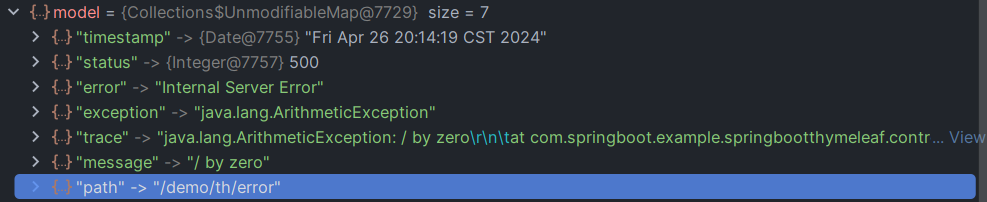

## 底层原理

### （一）IOC过程

+ SpringBoot在运行启动类时，执行了run方法，在run方法内部开始进行相关操作:

~~~java
    // 我们调用的是这个run方法
    public static ConfigurableApplicationContext run(Class<?> primarySource, String... args) {
        // 调用重载方法
		return run(new Class<?>[] { primarySource }, args);
	}

	/**
	 * Static helper that can be used to run a {@link SpringApplication} from the
	 * specified sources using default settings and user supplied arguments.
	 * @param primarySources the primary sources to load
	 * @param args the application arguments (usually passed from a Java main method)
	 * @return the running {@link ApplicationContext}
	 */
	public static ConfigurableApplicationContext run(Class<?>[] primarySources, String[] args) {
        // 生成SpringApplication对象，并调用run方法
		return new SpringApplication(primarySources).run(args);
	}
~~~

+ 最后会来到这个run方法下:

~~~java
    public ConfigurableApplicationContext run(String... args) {...}
~~~

+ 我们并不关心在IOC容器创建前的操作，这里只描述直接与IOC相关的操作:

~~~java
    ...
    try {
        ApplicationArguments applicationArguments = new DefaultApplicationArguments(args);
        ConfigurableEnvironment environment = prepareEnvironment(listeners, bootstrapContext, applicationArguments);
        Banner printedBanner = printBanner(environment);
        context = createApplicationContext();  // IOC容器创建
        context.setApplicationStartup(this.applicationStartup);  // 设置ApplicationStartup对象，不知道干嘛的
        prepareContext(bootstrapContext, context, environment, listeners, applicationArguments, printedBanner);  // 准备IOC容器的一些配置
        refreshContext(context);  // 执行IOC容器的刷新
        afterRefresh(context, applicationArguments);  // 执行刷新后的一些操作
        startup.started();
        if (this.logStartupInfo) {
            new StartupInfoLogger(this.mainApplicationClass).logStarted(getApplicationLog(), startup);
        }
        listeners.started(context, startup.timeTakenToStarted());
        callRunners(context, applicationArguments);
    }
    ...
~~~

+ 我们先看prepareContext方法:

~~~java
    private void prepareContext(DefaultBootstrapContext bootstrapContext, ConfigurableApplicationContext context,
			ConfigurableEnvironment environment, SpringApplicationRunListeners listeners,
			ApplicationArguments applicationArguments, Banner printedBanner) {
		context.setEnvironment(environment);  // 设置环境参数
		postProcessApplicationContext(context);  // 干点什么事
		addAotGeneratedInitializerIfNecessary(this.initializers);  // 干点什么事
		applyInitializers(context);  // 执行初始化器的方法，这个initializers在 生命周期、事件与监听器中有提到
		listeners.contextPrepared(context);  // 监听器方法的调用
		bootstrapContext.close(context);  // 干点什么事
		if (this.logStartupInfo) {
			logStartupInfo(context.getParent() == null);
			logStartupProfileInfo(context);
		}
		// Add boot specific singleton beans
		...
        // 监听器方法的调用
		listeners.contextLoaded(context);
	}
~~~

+ 在这之中，我们看applyInitializers方法:

~~~java
    /*
        Apply any ApplicationContextInitializers to the context before it is refreshed.
        Params: context – the configured ApplicationContext (not refreshed yet)
        See Also: ConfigurableApplicationContext.refresh()
    */
    protected void applyInitializers(ConfigurableApplicationContext context) {
        // 遍历每一个initializer，并调用其initialize方法
		for (ApplicationContextInitializer initializer : getInitializers()) {
			Class<?> requiredType = GenericTypeResolver.resolveTypeArgument(initializer.getClass(),
					ApplicationContextInitializer.class);
			Assert.isInstanceOf(requiredType, context, "Unable to call initializer.");
			initializer.initialize(context);
		}
	}
~~~

+ 如果我们不自定义的话，这堆initializer一共有7个
+ 我们重点看ContextIdApplicationContextInitializer，遍历到它时进入其initialize方法内:

~~~java
    public void initialize(ConfigurableApplicationContext applicationContext) {
		ContextId contextId = getContextId(applicationContext);  // 得到Application类的id，即类名的小驼峰类名，方法详情见下
		applicationContext.setId(contextId.getId());  // 设置id
		applicationContext.getBeanFactory().registerSingleton(ContextId.class.getName(), contextId);  // 注册一个该initializer的bean
	}

    private ContextId getContextId(ConfigurableApplicationContext applicationContext) {
		ApplicationContext parent = applicationContext.getParent();  // 一般会得到null
		if (parent != null && parent.containsBean(ContextId.class.getName())) {
			return parent.getBean(ContextId.class).createChildId();
		}
        // 可以看到该ContextId对象是通过IOC的environment环境参数得到的
		return new ContextId(getApplicationId(applicationContext.getEnvironment()));  
	}
~~~

+ 我们可以看到IOC容器经过该操作，其id被替换成了我们的Application类所在的id
+ 接下来回到run方法内
+ bean会在refreshContext方法执行过程中依次完成创建，refreshContext方法调用了一堆方法，最后到达了AbstractApplicationContext类中的refresh方法内:
  + 在该refresh方法中，提供了IOC容器刷新十二大步的操作

~~~java
    @Override
    // AbstractApplicationContext类中的refresh方法
	public void refresh() throws BeansException, IllegalStateException {
		this.startupShutdownLock.lock();  // 上锁
		try {
			this.startupShutdownThread = Thread.currentThread();

			StartupStep contextRefresh = this.applicationStartup.start("spring.context.refresh");

			// 进行IOC容器刷新的准备操作，主要是给IOC容器对象的一些属性进行赋值
			prepareRefresh();

			// ConfigurableListableBeanFactory对象，它在IOC容器刷新过程中负责创建bean并存储bean
            // 这个玩意本质上是DefaultListableBeanFactory类对象，该对象实际上是IOC容器对象中的beanFactory属性
			ConfigurableListableBeanFactory beanFactory = obtainFreshBeanFactory();

			// 给beanFactory进行初始化
			prepareBeanFactory(beanFactory);

			try {
				// 处理这个beanFactory
				postProcessBeanFactory(beanFactory);

				StartupStep beanPostProcess = this.applicationStartup.start("spring.context.beans.post-process");
				// 执行beanFactory相关的后置处理器操作
				invokeBeanFactoryPostProcessors(beanFactory);
				// 注册bean生命周期后置处理器
				registerBeanPostProcessors(beanFactory);
				beanPostProcess.end();

				// 初始化消息源相关的bean
				initMessageSource();

				// 初始化ApplicationEventMulticaster相关的bean
				initApplicationEventMulticaster();

				// 初始化一些特殊的bean
				onRefresh();

				// 注册监听器组件类到IOC容器
				registerListeners();

				// 把剩下的单例bean全部放到IOC容器内
				finishBeanFactoryInitialization(beanFactory);

				// 结束refresh操作并发布相应的事件
				finishRefresh();
			}

			catch (RuntimeException | Error ex ) {
				if (logger.isWarnEnabled()) {
					logger.warn("Exception encountered during context initialization - " +
							"cancelling refresh attempt: " + ex);
				}

				// Destroy already created singletons to avoid dangling resources.
				destroyBeans();

				// Reset 'active' flag.
				cancelRefresh(ex);

				// Propagate exception to caller.
				throw ex;
			}

			finally {
				contextRefresh.end();
			}
		}
		finally {
			this.startupShutdownThread = null;
			this.startupShutdownLock.unlock();
		}
	}
~~~

+ 我们直接看invokeBeanFactoryPostProcessors方法，直接点进去

~~~java
    protected void invokeBeanFactoryPostProcessors(ConfigurableListableBeanFactory beanFactory) {
		PostProcessorRegistrationDelegate.invokeBeanFactoryPostProcessors(beanFactory, getBeanFactoryPostProcessors());

		// Detect a LoadTimeWeaver and prepare for weaving, if found in the meantime
		// (e.g. through an @Bean method registered by ConfigurationClassPostProcessor)
		if (!NativeDetector.inNativeImage() && beanFactory.getTempClassLoader() == null &&
				beanFactory.containsBean(LOAD_TIME_WEAVER_BEAN_NAME)) {
			beanFactory.addBeanPostProcessor(new LoadTimeWeaverAwareProcessor(beanFactory));
			beanFactory.setTempClassLoader(new ContextTypeMatchClassLoader(beanFactory.getBeanClassLoader()));
		}
	}
~~~

+ 点开PostProcessorRegistrationDelegate的静态方法invokeBeanFactoryPostProcessors
  + 我们可以看到，方法中在重复调用一些代码
  + 我们需要关注invokeBeanDefinitionRegistryPostProcessors方法
+ 我们先看如下代码:

~~~java
    public static void invokeBeanFactoryPostProcessors(
			ConfigurableListableBeanFactory beanFactory, List<BeanFactoryPostProcessor> beanFactoryPostProcessors) {

        // Spring团队给的牛逼注释:
		// WARNING: Although it may appear that the body of this method can be easily
		// refactored to avoid the use of multiple loops and multiple lists, the use
		// of multiple lists and multiple passes over the names of processors is
		// intentional. We must ensure that we honor the contracts for PriorityOrdered
		// and Ordered processors. Specifically, we must NOT cause processors to be
		// instantiated (via getBean() invocations) or registered in the ApplicationContext
		// in the wrong order.
		//
		// Before submitting a pull request (PR) to change this method, please review the
		// list of all declined PRs involving changes to PostProcessorRegistrationDelegate
		// to ensure that your proposal does not result in a breaking change:
		// https://github.com/spring-projects/spring-framework/issues?q=PostProcessorRegistrationDelegate+is%3Aclosed+label%3A%22status%3A+declined%22

		// Invoke BeanDefinitionRegistryPostProcessors first, if any.
		Set<String> processedBeans = new HashSet<>();  

		if (beanFactory instanceof BeanDefinitionRegistry registry) {
			List<BeanFactoryPostProcessor> regularPostProcessors = new ArrayList<>();
			List<BeanDefinitionRegistryPostProcessor> registryProcessors = new ArrayList<>();

			for (BeanFactoryPostProcessor postProcessor : beanFactoryPostProcessors) {
				if (postProcessor instanceof BeanDefinitionRegistryPostProcessor registryProcessor) {
					registryProcessor.postProcessBeanDefinitionRegistry(registry);
					registryProcessors.add(registryProcessor);
				}
				else {
					regularPostProcessors.add(postProcessor);
				}
			}
        }
    }
~~~

+ 主要是看最后一段:
  + 它遍历了beanFactoryPostProcessors，即方法接收的第二个参数，如果追溯其来源，它来自IOC容器内的一个属性
  + 一般来说，它有三个值，因此需要遍历进行执行
  + 每个遍历元素都需要经过一些操作，其中有一个processor的操作执行，使得我们的Application启动类被添加进入了DefaultListableBeanFactory对象(即beanFactory)内的beanDefinitionMap中
    + 该Map用于记录bean的别名和它的定义对象之间的映射关系，所有被它记录的类，一般都会被注册为bean,并加入到IOC容器中去
    + 也就是说，**该操作使得我们的Application类加入了待注册bean的行列中，但此时我们的其它类还未加入**
+ 接下来我们继续向下分析:

~~~java
    public static void invokeBeanFactoryPostProcessors(
			ConfigurableListableBeanFactory beanFactory, List<BeanFactoryPostProcessor> beanFactoryPostProcessors) {
        
        
            // 我们记下面的四行代码为A操作，可以看到方法中重复调用了许多次这样的操作
			sortPostProcessors(currentRegistryProcessors, beanFactory);
			registryProcessors.addAll(currentRegistryProcessors);
			invokeBeanDefinitionRegistryPostProcessors(currentRegistryProcessors, registry, beanFactory.getApplicationStartup());
			currentRegistryProcessors.clear();

			// Next, invoke the BeanDefinitionRegistryPostProcessors that implement Ordered.
			postProcessorNames = beanFactory.getBeanNamesForType(BeanDefinitionRegistryPostProcessor.class, true, false);
			for (String ppName : postProcessorNames) {
				if (!processedBeans.contains(ppName) && beanFactory.isTypeMatch(ppName, Ordered.class)) {
					currentRegistryProcessors.add(beanFactory.getBean(ppName, BeanDefinitionRegistryPostProcessor.class));
					processedBeans.add(ppName);
				}
			}
			A操作

			// Finally, invoke all other BeanDefinitionRegistryPostProcessors until no further ones appear.
			boolean reiterate = true;
			while (reiterate) {
				reiterate = false;
				postProcessorNames = beanFactory.getBeanNamesForType(BeanDefinitionRegistryPostProcessor.class, true, false);
				for (String ppName : postProcessorNames) {
					if (!processedBeans.contains(ppName)) {
						currentRegistryProcessors.add(beanFactory.getBean(ppName, BeanDefinitionRegistryPostProcessor.class));
						processedBeans.add(ppName);
						reiterate = true;
					}
				}
				A操作
			}

			// Now, invoke the postProcessBeanFactory callback of all processors handled so far.
			invokeBeanFactoryPostProcessors(registryProcessors, beanFactory);
			invokeBeanFactoryPostProcessors(regularPostProcessors, beanFactory);
		}

		else {
			// Invoke factory processors registered with the context instance.
			invokeBeanFactoryPostProcessors(beanFactoryPostProcessors, beanFactory);
		}

		// Do not initialize FactoryBeans here: We need to leave all regular beans
		// uninitialized to let the bean factory post-processors apply to them!
		String[] postProcessorNames =
				beanFactory.getBeanNamesForType(BeanFactoryPostProcessor.class, true, false);

		// Separate between BeanFactoryPostProcessors that implement PriorityOrdered,
		// Ordered, and the rest.
		List<BeanFactoryPostProcessor> priorityOrderedPostProcessors = new ArrayList<>();
		List<String> orderedPostProcessorNames = new ArrayList<>();
		List<String> nonOrderedPostProcessorNames = new ArrayList<>();
		for (String ppName : postProcessorNames) {
			if (processedBeans.contains(ppName)) {
				// skip - already processed in first phase above
			}
			else if (beanFactory.isTypeMatch(ppName, PriorityOrdered.class)) {
				priorityOrderedPostProcessors.add(beanFactory.getBean(ppName, BeanFactoryPostProcessor.class));
			}
			else if (beanFactory.isTypeMatch(ppName, Ordered.class)) {
				orderedPostProcessorNames.add(ppName);
			}
			else {
				nonOrderedPostProcessorNames.add(ppName);
			}
		}

		// First, invoke the BeanFactoryPostProcessors that implement PriorityOrdered.
		sortPostProcessors(priorityOrderedPostProcessors, beanFactory);
		invokeBeanFactoryPostProcessors(priorityOrderedPostProcessors, beanFactory);

		// Next, invoke the BeanFactoryPostProcessors that implement Ordered.
		List<BeanFactoryPostProcessor> orderedPostProcessors = new ArrayList<>(orderedPostProcessorNames.size());
		for (String postProcessorName : orderedPostProcessorNames) {
			orderedPostProcessors.add(beanFactory.getBean(postProcessorName, BeanFactoryPostProcessor.class));
		}
		sortPostProcessors(orderedPostProcessors, beanFactory);
		invokeBeanFactoryPostProcessors(orderedPostProcessors, beanFactory);

		// Finally, invoke all other BeanFactoryPostProcessors.
		List<BeanFactoryPostProcessor> nonOrderedPostProcessors = new ArrayList<>(nonOrderedPostProcessorNames.size());
		for (String postProcessorName : nonOrderedPostProcessorNames) {
			nonOrderedPostProcessors.add(beanFactory.getBean(postProcessorName, BeanFactoryPostProcessor.class));
		}
		invokeBeanFactoryPostProcessors(nonOrderedPostProcessors, beanFactory);

		// Clear cached merged bean definitions since the post-processors might have
		// modified the original metadata, e.g. replacing placeholders in values...
		beanFactory.clearMetadataCache();
	}
~~~

+ 我们先来看第一个invokeBeanDefinitionRegistryPostProcessors方法

~~~java
    private static void invokeBeanDefinitionRegistryPostProcessors(
			Collection<? extends BeanDefinitionRegistryPostProcessor> postProcessors, BeanDefinitionRegistry registry, ApplicationStartup applicationStartup) {

		for (BeanDefinitionRegistryPostProcessor postProcessor : postProcessors) {
            // 不知道在start什么玩意
			StartupStep postProcessBeanDefRegistry = applicationStartup.start("spring.context.beandef-registry.post-process")
					.tag("postProcessor", postProcessor::toString);
            
			postProcessor.postProcessBeanDefinitionRegistry(registry);
			postProcessBeanDefRegistry.end();
		}
	}
~~~

+ 点进去postProcessor.postProcessBeanDefinitionRegistry(registry)方法:

~~~java
    @Override
	public void postProcessBeanDefinitionRegistry(BeanDefinitionRegistry registry) {
		int registryId = System.identityHashCode(registry);
		if (this.registriesPostProcessed.contains(registryId)) {
			throw new IllegalStateException(
					"postProcessBeanDefinitionRegistry already called on this post-processor against " + registry);
		}
		if (this.factoriesPostProcessed.contains(registryId)) {
			throw new IllegalStateException(
					"postProcessBeanFactory already called on this post-processor against " + registry);
		}
		this.registriesPostProcessed.add(registryId);
        
		processConfigBeanDefinitions(registry);
	}
~~~

+ 全都是一些判断，点进去最后一行调用的processConfigBeanDefinitions方法:

~~~java

    // Build and validate a configuration model based on the registry of Configuration classes.

    public void processConfigBeanDefinitions(BeanDefinitionRegistry registry) {
		List<BeanDefinitionHolder> configCandidates = new ArrayList<>();
		String[] candidateNames = registry.getBeanDefinitionNames();  // 得到存在beanFactory的当前的每一个配置类名称
        // 遍历这些名称
		for (String beanName : candidateNames) {
            // 根据名称获取对应的BeanDefinition对象
			BeanDefinition beanDef = registry.getBeanDefinition(beanName);
            // 输出相关日志
			if (beanDef.getAttribute(ConfigurationClassUtils.CONFIGURATION_CLASS_ATTRIBUTE) != null) {
				if (logger.isDebugEnabled()) {
					logger.debug("Bean definition has already been processed as a configuration class: " + beanDef);
				}
			}
            // 检查类有无别名，即类的名称不是全类名的，如果有，就生成对应的BeanDefinitionHolder对象并加入到configCandidates对象内
			else if (ConfigurationClassUtils.checkConfigurationClassCandidate(beanDef, this.metadataReaderFactory)) {
				configCandidates.add(new BeanDefinitionHolder(beanDef, beanName));
			}
		}

		// Return immediately if no @Configuration classes were found  如果一个配置类都没有找到，那么返回
		if (configCandidates.isEmpty()) {
			return;
		}

		// Sort by previously determined @Order value, if applicable  根据@Order注解指定的值进行配置类的排序
		configCandidates.sort((bd1, bd2) -> {
			int i1 = ConfigurationClassUtils.getOrder(bd1.getBeanDefinition());
			int i2 = ConfigurationClassUtils.getOrder(bd2.getBeanDefinition());
			return Integer.compare(i1, i2);
		});

		// Detect any custom bean name generation strategy supplied through the enclosing application context
        // 不知道这是干嘛的
		SingletonBeanRegistry sbr = null;
		if (registry instanceof SingletonBeanRegistry _sbr) {
			sbr = _sbr;
			if (!this.localBeanNameGeneratorSet) {
				BeanNameGenerator generator = (BeanNameGenerator) sbr.getSingleton(
						AnnotationConfigUtils.CONFIGURATION_BEAN_NAME_GENERATOR);
				if (generator != null) {
					this.componentScanBeanNameGenerator = generator;
					this.importBeanNameGenerator = generator;
				}
			}
		}

		if (this.environment == null) {
			this.environment = new StandardEnvironment();
		}

		// Parse each @Configuration class  : 解析每个配置类
        // 得到配置类解析器对象
		ConfigurationClassParser parser = new ConfigurationClassParser(
				this.metadataReaderFactory, this.problemReporter, this.environment,
				this.resourceLoader, this.componentScanBeanNameGenerator, registry);
        // 把之前configCandidates对象内的全部元素全都加进一个新的LinkedHashSet集合内
		Set<BeanDefinitionHolder> candidates = new LinkedHashSet<>(configCandidates);
        // 创建一个集合用来记录已经被解析的配置类
		Set<ConfigurationClass> alreadyParsed = new HashSet<>(configCandidates.size());
		do {
            // 不知道在start什么东西
			StartupStep processConfig = this.applicationStartup.start("spring.context.config-classes.parse");
            // 进行解析
			parser.parse(candidates);
            // 进行校验
			parser.validate();

			Set<ConfigurationClass> configClasses = new LinkedHashSet<>(parser.getConfigurationClasses());
			configClasses.removeAll(alreadyParsed);

			// Read the model and create bean definitions based on its content
			if (this.reader == null) {
				this.reader = new ConfigurationClassBeanDefinitionReader(
						registry, this.sourceExtractor, this.resourceLoader, this.environment,
						this.importBeanNameGenerator, parser.getImportRegistry());
			}
			this.reader.loadBeanDefinitions(configClasses);
			alreadyParsed.addAll(configClasses);
			processConfig.tag("classCount", () -> String.valueOf(configClasses.size())).end();

			candidates.clear();
			if (registry.getBeanDefinitionCount() > candidateNames.length) {
				String[] newCandidateNames = registry.getBeanDefinitionNames();
				Set<String> oldCandidateNames = Set.of(candidateNames);
				Set<String> alreadyParsedClasses = new HashSet<>();
				for (ConfigurationClass configurationClass : alreadyParsed) {
					alreadyParsedClasses.add(configurationClass.getMetadata().getClassName());
				}
				for (String candidateName : newCandidateNames) {
					if (!oldCandidateNames.contains(candidateName)) {
						BeanDefinition bd = registry.getBeanDefinition(candidateName);
						if (ConfigurationClassUtils.checkConfigurationClassCandidate(bd, this.metadataReaderFactory) &&
								!alreadyParsedClasses.contains(bd.getBeanClassName())) {
							candidates.add(new BeanDefinitionHolder(bd, candidateName));
						}
					}
				}
				candidateNames = newCandidateNames;
			}
		}
		while (!candidates.isEmpty());

		// Register the ImportRegistry as a bean in order to support ImportAware @Configuration classes
		if (sbr != null && !sbr.containsSingleton(IMPORT_REGISTRY_BEAN_NAME)) {
			sbr.registerSingleton(IMPORT_REGISTRY_BEAN_NAME, parser.getImportRegistry());
		}

		// Store the PropertySourceDescriptors to contribute them Ahead-of-time if necessary
		this.propertySourceDescriptors = parser.getPropertySourceDescriptors();

		if (this.metadataReaderFactory instanceof CachingMetadataReaderFactory cachingMetadataReaderFactory) {
			// Clear cache in externally provided MetadataReaderFactory; this is a no-op
			// for a shared cache since it'll be cleared by the ApplicationContext.
			cachingMetadataReaderFactory.clearCache();
		}
	}

~~~

+ 我们先看parse方法:

~~~java
    public void parse(Set<BeanDefinitionHolder> configCandidates) {
		for (BeanDefinitionHolder holder : configCandidates) {
			BeanDefinition bd = holder.getBeanDefinition();
			try {
				if (bd instanceof AnnotatedBeanDefinition annotatedBeanDef) {
					parse(annotatedBeanDef.getMetadata(), holder.getBeanName());
				}
				else if (bd instanceof AbstractBeanDefinition abstractBeanDef && abstractBeanDef.hasBeanClass()) {
					parse(abstractBeanDef.getBeanClass(), holder.getBeanName());
				}
				else {
					parse(bd.getBeanClassName(), holder.getBeanName());
				}
			}
			catch (BeanDefinitionStoreException ex) {
				throw ex;
			}
			catch (Throwable ex) {
				throw new BeanDefinitionStoreException(
						"Failed to parse configuration class [" + bd.getBeanClassName() + "]", ex);
			}
		}

		this.deferredImportSelectorHandler.process();
	}
~~~

+ 一般都是AnnotatedBeanDefinition类型的，所以我们进入第一个parse方法，然后点进去processConfigurationClass方法:

~~~java
    protected void processConfigurationClass(ConfigurationClass configClass, Predicate<String> filter) throws IOException {
		if (this.conditionEvaluator.shouldSkip(configClass.getMetadata(), ConfigurationPhase.PARSE_CONFIGURATION)) {
			return;
		}
        // 从configurationClasses属性中尝试拿取该配置类对象
		ConfigurationClass existingClass = this.configurationClasses.get(configClass);
        // 一般来说是不会得到的，也就是null，这里不考虑
		if (existingClass != null) {
			if (configClass.isImported()) {
				if (existingClass.isImported()) {
					existingClass.mergeImportedBy(configClass);
				}
				// Otherwise ignore new imported config class; existing non-imported class overrides it.
				return;
			}
			else {
				// Explicit bean definition found, probably replacing an import.
				// Let's remove the old one and go with the new one.
				this.configurationClasses.remove(configClass);
				this.knownSuperclasses.values().removeIf(configClass::equals);
			}
		}

		// Recursively process the configuration class and its superclass hierarchy.
		SourceClass sourceClass = null;
		try {
            // 得到一个配置类对象的封装对象
			sourceClass = asSourceClass(configClass, filter);
			do {
                // 执行doProcessConfigurationClass方法
				sourceClass = doProcessConfigurationClass(configClass, sourceClass, filter);
			}
			while (sourceClass != null);
		}
		catch (IOException ex) {
			throw new BeanDefinitionStoreException(
					"I/O failure while processing configuration class [" + sourceClass + "]", ex);
		}

		this.configurationClasses.put(configClass, configClass);
	}
~~~

+ 现在我们来看doProcessConfigurationClass方法:
  + **该方法的源码详细的向我们展示了经由配置类加载的bean的加载顺序**:
    + @PropertySource
    + @ComponentScan
    + @Import
    + @ImportResource
    + @Bean

~~~java

    /*
        Apply processing and build a complete ConfigurationClass by reading the annotations, members and methods from the source class. This method can be called multiple times as relevant sources are discovered.
        Params: configClass – the configuration class being build sourceClass – a source class
        Returns: the superclass, or null if none found or previously processed
    */
    @Nullable
	protected final SourceClass doProcessConfigurationClass(
			ConfigurationClass configClass, SourceClass sourceClass, Predicate<String> filter)
			throws IOException {
        // 首先判断这个类是否包含Component相关注解
		if (configClass.getMetadata().isAnnotated(Component.class.getName())) {
			// Recursively process any member (nested) classes first
			processMemberClasses(configClass, sourceClass, filter);
		}

		// Process any @PropertySource annotations:先寻找@PropertySource注解
		for (AnnotationAttributes propertySource : AnnotationConfigUtils.attributesForRepeatable(
				sourceClass.getMetadata(), org.springframework.context.annotation.PropertySource.class,
				PropertySources.class, true)) {
			if (this.propertySourceRegistry != null) {
				this.propertySourceRegistry.processPropertySource(propertySource);
			}
			else {
				logger.info("Ignoring @PropertySource annotation on [" + sourceClass.getMetadata().getClassName() +
						"]. Reason: Environment must implement ConfigurableEnvironment");
			}
		}

		// Search for locally declared @ComponentScan annotations first.:寻找本类下是否直接使用了@ComponentScan注解
		Set<AnnotationAttributes> componentScans = AnnotationConfigUtils.attributesForRepeatable(
				sourceClass.getMetadata(), ComponentScan.class, ComponentScans.class,
				MergedAnnotation::isDirectlyPresent);

		// Fall back to searching for @ComponentScan meta-annotations (which indirectly
		// includes locally declared composed annotations).
        // 寻找本类下是否间接使用了@ComponentScan注解
		if (componentScans.isEmpty()) {
			componentScans = AnnotationConfigUtils.attributesForRepeatable(sourceClass.getMetadata(),
					ComponentScan.class, ComponentScans.class, MergedAnnotation::isMetaPresent);
		}
        // 如果经由上面两个操作发现了@ComponentScan注解，那么立即执行扫描
		if (!componentScans.isEmpty() &&
				!this.conditionEvaluator.shouldSkip(sourceClass.getMetadata(), ConfigurationPhase.REGISTER_BEAN)) {
			for (AnnotationAttributes componentScan : componentScans) {
				// The config class is annotated with @ComponentScan -> perform the scan immediately
				Set<BeanDefinitionHolder> scannedBeanDefinitions =
						this.componentScanParser.parse(componentScan, sourceClass.getMetadata().getClassName());
				// Check the set of scanned definitions for any further config classes and parse recursively if needed
				for (BeanDefinitionHolder holder : scannedBeanDefinitions) {
					BeanDefinition bdCand = holder.getBeanDefinition().getOriginatingBeanDefinition();
					if (bdCand == null) {
						bdCand = holder.getBeanDefinition();
					}
					if (ConfigurationClassUtils.checkConfigurationClassCandidate(bdCand, this.metadataReaderFactory)) {
						parse(bdCand.getBeanClassName(), holder.getBeanName());
					}
				}
			}
		}

		// Process any @Import annotations:寻找是否存在@Import注解并进行处理
		processImports(configClass, sourceClass, getImports(sourceClass), filter, true);

		// Process any @ImportResource annotations，寻找是否存在@ImportResource注解并进行处理
		AnnotationAttributes importResource =
				AnnotationConfigUtils.attributesFor(sourceClass.getMetadata(), ImportResource.class);
		if (importResource != null) {
			String[] resources = importResource.getStringArray("locations");
			Class<? extends BeanDefinitionReader> readerClass = importResource.getClass("reader");
			for (String resource : resources) {
				String resolvedResource = this.environment.resolveRequiredPlaceholders(resource);
				configClass.addImportedResource(resolvedResource, readerClass);
			}
		}

		// Process individual @Bean methods:处理@Bean注解作用的方法
		Set<MethodMetadata> beanMethods = retrieveBeanMethodMetadata(sourceClass);
		for (MethodMetadata methodMetadata : beanMethods) {
			configClass.addBeanMethod(new BeanMethod(methodMetadata, configClass));
		}

		// Process default methods on interfaces:处理接口的默认方法
		processInterfaces(configClass, sourceClass);

		// Process superclass, if any:处理父类，如果其存在
		if (sourceClass.getMetadata().hasSuperClass()) {
			String superclass = sourceClass.getMetadata().getSuperClassName();
			if (superclass != null && !superclass.startsWith("java") &&
					!this.knownSuperclasses.containsKey(superclass)) {
				this.knownSuperclasses.put(superclass, configClass);
				// Superclass found, return its annotation metadata and recurse
				return sourceClass.getSuperClass();
			}
		}

		// No superclass -> processing is complete
		return null;
	}
~~~

---

### （二）自动配置原理

#### ①简要概述

+ @SpringBootApplication注解是一个复合注解，从下面的常用注解中我们已经知道:
  + @SpringBootConfiguration用来声明该类是一个SpringBoot配置类
  + @omponentScan注解用来扫描指定包
+ 只剩下一个@EnableAutoConfiguration注解，点开该注解，可以看到:

~~~java

  import java.lang.annotation.Documented;
  import java.lang.annotation.ElementType;
  import java.lang.annotation.Inherited;
  import java.lang.annotation.Retention;
  import java.lang.annotation.RetentionPolicy;
  import java.lang.annotation.Target;
  import org.springframework.context.annotation.Import;

  @Target({ElementType.TYPE})
  @Retention(RetentionPolicy.RUNTIME)
  @Documented
  @Inherited
  @AutoConfigurationPackage
  @Import({AutoConfigurationImportSelector.class})  // 导入AutoConfigurationImportSelector类
  public @interface EnableAutoConfiguration {
      String ENABLED_OVERRIDE_PROPERTY = "spring.boot.enableautoconfiguration";

      Class<?>[] exclude() default {};

      String[] excludeName() default {};
  }

~~~

+ 该注解也是一个复合注解，其中它的作用之一就是导入AutoConfigurationImportSelector类的bean
  + AutoConfigurationImportSelector类就是SpringBoot自动装配的关键
  + 之所以要导入该类，是因为**默认的@ComponentScan注解扫描不到我们的自动配置类（spring-boot-autoconfigure依赖）所在的包**，而该类正好是spring-boot-autoconfigure依赖包下的类,**只要加载它，他就可以加载它所在包下的我们导入的场景对应的自动配置类**
  + AutoConfigurationImportSelector类作用就是**将对应的IOC容器所需的自动配置类加载进IOC，从而达到自动配置的目的**
  + 该类会自动从其所在包下的`META-INF\spring\org.springframework.boot.autoconfigure.AutoConfiguration.imports`加载对应的自动配置类
    + 每个配置类下一般都有**被@Bean注解作用的方法，用来将对应类的对象放入IOC容器中**，也就是说，该自动配置类会给容器中导入一堆相关组件
    + 同时，对应方法还有可能会存在@EnableConfigurationProperties类，并在方法参数列表内接收了指定的类对象，用来配置放入IOC容器对象内的bean的基本配置，而**该注解所指定的类就是我们的application.properties内所声明属性对应的指定Peoperties配置类**
  + 加载时会经过getAutoConfigurationEntry方法，在该方法内调用getCandidateConfigurations方法，再调用ImportCandidates.load方法来加载上面的imports文件中的对应值来放入待加载配置类列表，最后经由一系列操作实现自动配置
  + 但是，**并不是加载的全部的配置类都会生效**，对应的配置类也需要指定条件才会生效。因为**每一个配置类都有条件注解约束**

#### ②详情

+ 项目的主程序类上的@SpringBootApplication注解可以进行项目的自动配置
  + 在该注解内部，它被三个注解作用
    + @SpringBootConfiguration:这就是个配置类，用来声明作用类是个配置类，其它没什么用
    + @EnableAutoConfiguration
    + @ComponentScan(...)

~~~java
...
@SpringBootConfiguration
@EnableAutoConfiguration
@ComponentScan(
    excludeFilters = {@Filter(
    type = FilterType.CUSTOM,
    classes = {TypeExcludeFilter.class}
), @Filter(
    type = FilterType.CUSTOM,
    classes = {AutoConfigurationExcludeFilter.class}
)}
)
public @interface SpringBootApplication {
    ...
}
~~~

##### Ⅰ@EnableAutoConfiguration

+ @EnableAutoConfiguration内又有两个注解作用:
  + @AutoConfigurationPackage
  + @Import({AutoConfigurationImportSelector.class})

~~~java
...
@AutoConfigurationPackage
@Import({AutoConfigurationImportSelector.class})
public @interface EnableAutoConfiguration {
    ....
}
~~~

+ 我们先看@AutoConfigurationPackage注解，发现它使用@Import注解导入了一个类`@Import({AutoConfigurationPackages.Registrar.class})`
+ 在该类下有一个方法:

~~~java
    @Override
	public void registerBeanDefinitions(AnnotationMetadata metadata, BeanDefinitionRegistry registry) {
		register(registry, new PackageImports(metadata).getPackageNames().toArray(new String[0]));
	}
~~~

+ 在该方法中调用了PackageImports对象的getPackageNames方法:

~~~java
    // 在该类的构造器中，我们可以发现这个packageNames是个什么玩意
    PackageImports(AnnotationMetadata metadata) {
        // 在该语句的最里面，可以看到调用了AutoConfigurationPackage.class.getName()
        // 这个在该语句的最里面，可以看到调用了AutoConfigurationPackage注解就是聚合注解@EnableAutoConfiguration注解的两个注解之一
        // 也就是说，它通过反射得到的class得到的名称是项目启动类所在包的路径
		AnnotationAttributes attributes = AnnotationAttributes
			.fromMap(metadata.getAnnotationAttributes(AutoConfigurationPackage.class.getName(), false));
            // 给packageNames属性赋值
		List<String> packageNames = new ArrayList<>(Arrays.asList(attributes.getStringArray("basePackages")));
		for (Class<?> basePackageClass : attributes.getClassArray("basePackageClasses")) {
			packageNames.add(basePackageClass.getPackage().getName());
		}
		if (packageNames.isEmpty()) {
			packageNames.add(ClassUtils.getPackageName(metadata.getClassName()));
		}
		this.packageNames = Collections.unmodifiableList(packageNames);
	}
    // 得到packageNames属性
	List<String> getPackageNames() {
		return this.packageNames;
	}
~~~

+ 因此，@AutoConfigurationPackage注解用来将我们自定义的包进行自动配置
+ 现在来讨论@Import({AutoConfigurationImportSelector.class})注解导入的AutoConfigurationImportSelector类:
  + 在该类中可以找到getAutoConfigurationEntry方法

~~~java
    protected AutoConfigurationEntry getAutoConfigurationEntry(AnnotationMetadata annotationMetadata) {
		if (!isEnabled(annotationMetadata)) {
			return EMPTY_ENTRY;
		}
		AnnotationAttributes attributes = getAttributes(annotationMetadata);
        // 在getCandidateConfigurations中来获得配置类对象
		List<String> configurations = getCandidateConfigurations(annotationMetadata, attributes);
		configurations = removeDuplicates(configurations);
		Set<String> exclusions = getExclusions(annotationMetadata, attributes);
		checkExcludedClasses(configurations, exclusions);
		configurations.removeAll(exclusions);
		configurations = getConfigurationClassFilter().filter(configurations);
		fireAutoConfigurationImportEvents(configurations, exclusions);
		return new AutoConfigurationEntry(configurations, exclusions);
	}
~~~

+ 接下来来看getCandidateConfigurations方法，可以看到它又调用了ImportCandidates.load方法

~~~java
    protected List<String> getCandidateConfigurations(AnnotationMetadata metadata, AnnotationAttributes attributes) {
		List<String> configurations = ImportCandidates.load(AutoConfiguration.class, getBeanClassLoader())
			.getCandidates();
		Assert.notEmpty(configurations,
				"No auto configuration classes found in "
						+ "META-INF/spring/org.springframework.boot.autoconfigure.AutoConfiguration.imports. If you "
						+ "are using a custom packaging, make sure that file is correct.");
		return configurations;
	}
~~~

+ 去看load方法:

~~~java
    public static ImportCandidates load(Class<?> annotation, ClassLoader classLoader) {
		Assert.notNull(annotation, "'annotation' must not be null");
		ClassLoader classLoaderToUse = decideClassloader(classLoader);
        // LOCATION是"META-INF/spring/%s.imports"，调用annotation.getName()，与扫描我们自定义的那个包下的所有文件一样的方式，得到包名
        // 由于AutoConfiguration在org.springframework.boot.autoconfigure包下，得到的是这个包
		String location = String.format(LOCATION, annotation.getName());
		Enumeration<URL> urls = findUrlsInClasspath(classLoaderToUse, location);
		List<String> importCandidates = new ArrayList<>();
		while (urls.hasMoreElements()) {
			URL url = urls.nextElement();
            // 在这里又调用readCandidateConfigurations方法，将自动配置类放入一个List集合中
			importCandidates.addAll(readCandidateConfigurations(url));
		}
		return new ImportCandidates(importCandidates);
	}
~~~

+ 接下来看readCandidateConfigurations是什么玩意:

~~~java
    private static List<String> readCandidateConfigurations(URL url) {
		try (
            // 得到对应文件的缓冲字符输入流对象
            BufferedReader reader = new BufferedReader(new InputStreamReader(new UrlResource(url).getInputStream(), StandardCharsets.UTF_8))
            ) {
			List<String> candidates = new ArrayList<>();
			String line;
			while ((line = reader.readLine()) != null) {
                // 经过一些处理，把这些自动配置类依次加入一个List中
				line = stripComment(line);
				line = line.trim();
				if (line.isEmpty()) {
					continue;
				}
				candidates.add(line);
			}
            // 返回List
			return candidates;
		}
		catch (IOException ex) {
			throw new IllegalArgumentException("Unable to load configurations from location [" + url + "]", ex);
		}
	}
~~~

+ 至此，我们看到了@Application的@EnableAutoConfiguration可以自动加载项目所在包以及各个自动配置类的组件，从而实现自动装配功能

##### Ⅱ@ComponentScan(...)

+ 这玩意在学Spring的时候就见过了，他用来进行组件的扫描
  + @SpringBootApplication上的这个注解并不是干这个的，因为@EnableAutoConfiguration已经能够扫描指定包下的东西了
  + 它的全部代码是:`@ComponentScan(excludeFilters = { @Filter(type = FilterType.CUSTOM, classes = TypeExcludeFilter.class),@Filter(type = FilterType.CUSTOM, classes = AutoConfigurationExcludeFilter.class) })`
  + 我们可以明显的看到@Filter这个注解，它是用来进行过滤的
  + 该注解的作用主要是为了防止配置类重复的问题，我们的项目启动类已经是一个配置类了，如果我们还设置了别的自动配置类，SpringBoot会自动过滤掉

---

### （三）JDBC配置底层原理

+ SpringBoot的自动配置包（org.springframework.boot.spring-boot.autoconfiguration）中META-INF目录下的spring目录里的文件中已经默认导入了一些jdbc相关的配置类:

~~~java
    // 配置连接池相关
    org.springframework.boot.autoconfigure.jdbc.DataSourceAutoConfiguration
    // 不知道干嘛的
    org.springframework.boot.autoconfigure.jdbc.JdbcClientAutoConfiguration
    // 配置Spring提供的JdbcTemplate的配置
    org.springframework.boot.autoconfigure.jdbc.JdbcTemplateAutoConfiguration
    // 下面的没什么关联，也不知道干嘛的
    org.springframework.boot.autoconfigure.jdbc.JndiDataSourceAutoConfiguration
    org.springframework.boot.autoconfigure.jdbc.XADataSourceAutoConfiguration
    // 配置事务的相关类
    org.springframework.boot.autoconfigure.jdbc.DataSourceTransactionManagerAutoConfiguration
~~~

+ DataSourceAutoConfiguration类默认绑定了DataSourceProperties属性配置类，它的相关前缀是`spring.datasource`
+ 另外，他还默认导入了一些数据库连接池:

~~~java
    @Configuration(proxyBeanMethods = false)
    @Conditional({PooledDataSourceCondition.class})
    @ConditionalOnMissingBean({DataSource.class, XADataSource.class})
    // 导入了下面的连接池对象，
    @Import({DataSourceConfiguration.Hikari.class, DataSourceConfiguration.Tomcat.class, DataSourceConfiguration.Dbcp2.class, DataSourceConfiguration.OracleUcp.class, DataSourceConfiguration.Generic.class, DataSourceJmxConfiguration.class})
    protected static class PooledDataSourceConfiguration {
        protected PooledDataSourceConfiguration() {

        }

        @Bean
        @ConditionalOnMissingBean({JdbcConnectionDetails.class})
        PropertiesJdbcConnectionDetails jdbcConnectionDetails(DataSourceProperties properties) {
            return new PropertiesJdbcConnectionDetails(properties);
        }
    }
~~~

+ 另外，在Mybatis的场景启动器中(org.mybatis.spring.boot.mybatis-spring-boot-autoconfiguration)的META-INF目录下的spring目录中也导入了相关配置类:

~~~java
    // 语言驱动的自动配置
    org.mybatis.spring.boot.autoconfigure.MybatisLanguageDriverAutoConfiguration
    // Mybatis的相关自动配置
    org.mybatis.spring.boot.autoconfigure.MybatisAutoConfiguration
~~~

+ 在MybatisAutoConfiguration类中，可以看到它绑定了MybatisProperties属性配置类，可以看到它的配置前缀是`mybatis`
  + MybatisAutoConfiguration类向IOC容器提供了SqlSessionFactory对象，用来创建数据库会话
  + 还提供了SqlSessionTemplate对象，用来进行数据库的相关操作
+ 另外，Mybatis能够自动向IOC容器提供代理对象，是因为@MapperScan注解的原因:
  + 可以看到它导入了MapperScannerRegistrar类

~~~java
    @Retention(RetentionPolicy.RUNTIME)
    @Target({ElementType.TYPE})
    @Documented
    @Import({MapperScannerRegistrar.class})
    @Repeatable(MapperScans.class)
    public @interface MapperScan {
        ...
    }
~~~

+ 在MapperScannerRegistrar类中，它会利用扫描机制，扫描指定路径下的对应接口，并批量创建这些接口的bean加入IOC容器中。该操作调用的是registerBeanDefinitions方法来实现的

---

---

### （四）整合SpringMVC原理

#### ①DispatcherServlet执行流程

+ `spring-boot-starter-web`场景导入了`spring-boot-starter-json`场景，而该场景又导入了jackson依赖，使**SpringBoot项目默认就支持JSON数据转换**
+ DispatcherServlet执行的大致流程:
  + 该类对象拦截请求，并执行doService方法，在方法内执行了doDispatch方法
  + 在doDispatch方法内通过执行getHandlerAdapter得到HandlerAdapter派发器对象ha，接下来执行派发器对象的handle方法来开始执行方法
  + 派发器对象是RequestMappingHandlerAdapter类对象，但该类没有实现handle方法，因此执行的handle方法是其父类AbstractHandlerMethodAdapter类的handle方法
  + 其父类的handle方法调用了handleInternal方法，而在handleInternal方法内部调用了invokeHandlerMethod方法执行
    + 在invokeHandlerMethod方法执行前，需要准备好两个东西
      + HandlerMethodArgumentResolver：**参数解析器，确定目标方法每个参数值**
      + HandlerMethodReturnValueHandler：**返回值处理器，确定目标方法的返回值该怎么处理**
  + 在invokeHandlerMethod方法最后，执行了ServletInvocableHandlerMethod类对象的invokeAndHandle方法来执行handler
  + invokeAndHandle方法又调用invokeForRequest来获得handler方法的执行结果
  + ServletInvocableHandlerMethod类并未实现invokeForRequest方法，因此执行其父类InvocableHandlerMethod的invokeForRequest方法
  + invokeForRequest方法调用doInvoke方法来执行handler方法
  + 最终，**在doInvoke方法内，通过得到handler方法的Method对象，通过反射的方式来调用我们定义的handler方法，得到返回结果后开始向上返回**
  + 现在回到invokeAndHandle方法内，invokeForRequest方法已经返回，开始处理返回值
  + 在方法的try-catch语句内调用HandlerMethodReturnValueHandlerComposite类对象的handleReturnValue方法
  + 在handleReturnValue方法中，执行了selectHandler方法来筛选出**能处理请求指定的返回方式的处理对象**，该对象会直接执行下面的handleReturnValue方法
  + 如果方法被@ResponseBody注解作用，那么得到的处理对象是RequestResponseBodyMethodProcessor类对象,它是HandlerMethodReturnValueHandler接口对象。**handleReturnValue方法调用了该处理对象的handleReturnValue方法**
  + 该方法的实际执行者是RequestResponseBodyMethodProcessor类对象
  + 该方法在调用了writeWithMessageConverters方法，来向HttpResponse对象内写入最终内容
  + **方法在最后使用GenericHttpMessageConverter对象的write方法，最终将我们handler方法的返回值转换成对应的返回类型，然后写入到response中**
+ 总流程:`DispatcherServlet.doService`->`this.doDispatch`->`HandlerAdapter.handle`->`AbstractHandlerMethodAdapter.handle`->`this.handleInternal`->`this.invokeHandlerMethod`->`ServletInvocableHandlerMethod.invokeAndHandle`->`this.invokeForRequest`->`this.doInvoke（使用反射执行handler,并向上返回）`->`ServletInvocableHandlerMethod.invokeAndHandle（方法继续执行）`->`HandlerMethodReturnValueHandlerComposite.handleReturnValue`->`RequestResponseBodyMethodProcessor.handleReturnValue`->`this.writeWithMessageConverters`->`GenericHttpMessageConverter.write（进行返回类型转换并加入response中）`

---

#### ②资源配置原理

+ SpringBoot的Web开发能力，是由SpringMVC实现的
+ 如果我们想配置Web,我们需要明确配置什么东西，下面是与Web相关的AutoConfiguration:

~~~java
    org.springframework.boot.autoconfigure.web.client.RestTemplateAutoConfiguration
    org.springframework.boot.autoconfigure.web.embedded.EmbeddedWebServerFactoryCustomizerAutoConfiguration
    ====以下是响应式web场景和现在的没关系======
    org.springframework.boot.autoconfigure.web.reactive.HttpHandlerAutoConfiguration
    org.springframework.boot.autoconfigure.web.reactive.ReactiveMultipartAutoConfiguration
    org.springframework.boot.autoconfigure.web.reactive.ReactiveWebServerFactoryAutoConfiguration
    org.springframework.boot.autoconfigure.web.reactive.WebFluxAutoConfiguration
    org.springframework.boot.autoconfigure.web.reactive.WebSessionIdResolverAutoConfiguration
    org.springframework.boot.autoconfigure.web.reactive.error.ErrorWebFluxAutoConfiguration
    org.springframework.boot.autoconfigure.web.reactive.function.client.ClientHttpConnectorAutoConfiguration
    org.springframework.boot.autoconfigure.web.reactive.function.client.WebClientAutoConfiguration
    ================以上没关系=================
    org.springframework.boot.autoconfigure.web.servlet.DispatcherServletAutoConfiguration
    org.springframework.boot.autoconfigure.web.servlet.ServletWebServerFactoryAutoConfiguration
    org.springframework.boot.autoconfigure.web.servlet.error.ErrorMvcAutoConfiguration
    org.springframework.boot.autoconfigure.web.servlet.HttpEncodingAutoConfiguration
    org.springframework.boot.autoconfigure.web.servlet.MultipartAutoConfiguration
    org.springframework.boot.autoconfigure.web.servlet.WebMvcAutoConfiguration
~~~

+ 上面是与web相关的AutoConfiguration类，它们都是负责自动装配我们的Web项目的
+ 同时，它们对应的配置类绑定了配置文件的一堆配置项:
  + SpringMVC的所有配置 spring.mvc
  + Web场景通用配置 spring.web
  + 文件上传配置 spring.servlet.multipart
  + 服务器的配置 server: 比如：编码方式

##### ⅠWebMvcAutoConfiguration类

+ 与SpringMVC相关的自动配置功能，都由WebMvcAutoConfiguration类来装配:

~~~java
    @AutoConfiguration(
        after = {DispatcherServletAutoConfiguration.class, TaskExecutionAutoConfiguration.class, ValidationAutoConfiguration.class}
    )  // 该配置类的初始化在这些配置类之后
    @ConditionalOnWebApplication(
        type = Type.SERVLET
    )  // 如果type属于SERVLET时才生效
    @ConditionalOnClass({Servlet.class, DispatcherServlet.class, WebMvcConfigurer.class})  // 类路径下存在这些类才生效
    @ConditionalOnMissingBean({WebMvcConfigurationSupport.class})  // 不存在WebMvcConfigurationSupport的bean时生效，默认确实不存在
    @AutoConfigureOrder(-2147483638)  // 设置初始化优先级
    @ImportRuntimeHints({WebResourcesRuntimeHints.class})  // 不知道干嘛的
    public class WebMvcAutoConfiguration {
        ...

        @Bean
        @ConditionalOnMissingBean({HiddenHttpMethodFilter.class})
        @ConditionalOnProperty(
            prefix = "spring.mvc.hiddenmethod.filter",
            name = {"enabled"}
        )
        // 该过滤器用来支持服务器接收表单提交Rest请求
        public OrderedHiddenHttpMethodFilter hiddenHttpMethodFilter() {
            return new OrderedHiddenHttpMethodFilter();
        }

        @Bean
        @ConditionalOnMissingBean({FormContentFilter.class})
        @ConditionalOnProperty(
            prefix = "spring.mvc.formcontent.filter",
            name = {"enabled"},
            matchIfMissing = true
        )
        // 该过滤器可以得到表单提交到的内容
        public OrderedFormContentFilter formContentFilter() {
            return new OrderedFormContentFilter();
        }

        ...

        private <T extends AbstractUrlHandlerMapping> T createWelcomePageHandlerMapping(ApplicationContext applicationContext, FormattingConversionService mvcConversionService, ResourceUrlProvider mvcResourceUrlProvider, WelcomePageHandlerMappingFactory<T> factory) {
            TemplateAvailabilityProviders templateAvailabilityProviders = new TemplateAvailabilityProviders(applicationContext);
            // 得到静态的前端请求路径，即/**
            String staticPathPattern = this.mvcProperties.getStaticPathPattern();
            // this.getIndexHtmlResource()方法会得到四个默认的请求资源路径下，包含默认的index前缀文件的Resource对象
            // 所以该方法的作用就是建立/**的前端请求路径和默认寻找静态资源路径下的index文件路径之间的映射
            T handlerMapping = factory.create(templateAvailabilityProviders, applicationContext, this.getIndexHtmlResource(), staticPathPattern);
            // 下面又配了点东西，看不懂，不过没关系
            handlerMapping.setInterceptors(this.getInterceptors(mvcConversionService, mvcResourceUrlProvider));
            handlerMapping.setCorsConfigurations(this.getCorsConfigurations());
            return handlerMapping;
        }
    }
~~~

---

##### ⅡWebMvcConfigurer接口

+ WebMvcConfigurer接口内有多个方法，我们只需要让我们的配置类实现对应的方法，就可以使我们的项目支持一些功能

|方法|作用|备注|
|:---:|:---:|:---:|
|addArgumentResolvers|添加请求参数的解析器|无|
|addCorsMappings|添加跨域请求配置|无|
|addFormatters|添加格式化器|无|
|addInterceptors|添加拦截器|无|
|addResourceHandlers|添加静态资源处理器，用来处理静态资源的映射关系|无|
|addReturnValueHandlers|添加返回值处理器|无|
|addViewControllers|添加视图控制器|无|
|configureAsyncSupport|配置异步支持|无|
|configureContentNegotiation|配置内容协商|无|
|configureDefaultServletHandling|配置默认处理的请求路径，默认为/，表示接收所有请求|无|
|configureHandlerExceptionResolvers|配置异常处理器|无|
|configureMessageConverters|配置消息转换器|无|
|configurePathMatch|配置路径匹配|无|
|configureViewResolvers|配置视图解析|无|
|extendsHandlerExceptionResolvers|拓展异常处理器|无|
|extendsMessageConverters|拓展消息转换器|无|

+ 我们可以让配置类实现WebMvcConfigurer接口，在里面实现对应的方法来进行相关的配置，**推荐配置类不要加@EnableWebMvc注解，因为不加这个注解可以在保留SpringBoot默认配置的前提下追加配置，而加了以后SpringBoot的相关默认配置就会失效，我们就需要全部自己进行相应的配置**
+ 另外，我们其实也可以直接提供一个WebMvcConfigurer接口对象，在该对象内实现指定的方法(使用匿名内部类)。
+ 第二种方式也可行的原因是，**SpringBoot在底层会把全部的实现了WebMvcConfigurer接口的对象汇聚成一个List，然后逐个调用对应的方法**，我们的配置类实现了该接口，且配置类也会加入IOC容器，因此配置类对象也满足WebMvcConfigurer接口的对象条件，故也会执行里面的方法
  + 详细的源码在DelegatingWebMvcConfiguration，该类是WebMvcAutoConfiguration的一个内部类EnableWebMvcConfiguration父类

~~~java
    @Configuration(proxyBeanMethods = false)
    public class DelegatingWebMvcConfiguration extends WebMvcConfigurationSupport {
        private final WebMvcConfigurerComposite configurers = new WebMvcConfigurerComposite();

        @Autowired(required = false)
        // 收集全部的WebMvcConfigurer实现类对象，并加入configurers中，方便以后使用
        public void setConfigurers(List<WebMvcConfigurer> configurers) {
            if (!CollectionUtils.isEmpty(configurers)) {
                this.configurers.addWebMvcConfigurers(configurers);
            }

        }
    }
~~~

---

##### ⅢWebMvcConfigurationSupport类

+ 提供了很多的默认设置。
+ 判断系统中是否有相应的类：如果有，就加入相应的HttpMessageConverter

~~~java
    static {
        ClassLoader classLoader = WebMvcConfigurationSupport.class.getClassLoader();
        romePresent = ClassUtils.isPresent("com.rometools.rome.feed.WireFeed", classLoader);
        jaxb2Present = ClassUtils.isPresent("jakarta.xml.bind.Binder", classLoader);
        jackson2Present = ClassUtils.isPresent("com.fasterxml.jackson.databind.ObjectMapper", classLoader) && ClassUtils.isPresent("com.fasterxml.jackson.core.JsonGenerator", classLoader);
        jackson2XmlPresent = ClassUtils.isPresent("com.fasterxml.jackson.dataformat.xml.XmlMapper", classLoader);
        jackson2SmilePresent = ClassUtils.isPresent("com.fasterxml.jackson.dataformat.smile.SmileFactory", classLoader);
        jackson2CborPresent = ClassUtils.isPresent("com.fasterxml.jackson.dataformat.cbor.CBORFactory", classLoader);
        gsonPresent = ClassUtils.isPresent("com.google.gson.Gson", classLoader);
        jsonbPresent = ClassUtils.isPresent("jakarta.json.bind.Jsonb", classLoader);
        kotlinSerializationCborPresent = ClassUtils.isPresent("kotlinx.serialization.cbor.Cbor", classLoader);
        kotlinSerializationJsonPresent = ClassUtils.isPresent("kotlinx.serialization.json.Json", classLoader);
        kotlinSerializationProtobufPresent = ClassUtils.isPresent("kotlinx.serialization.protobuf.ProtoBuf", classLoader);
    }

~~~

---

##### Ⅳ静态资源配置原理

+ SpringBoot通过WebMvcAutoConfiguration类向IOC容器内自动装配对应的bean:
  + 该自动配置类中自动配置了静态资源相关的配置，具体为:
    + 当前端请求/webjars/**相关资源时，后端从默认从classpath:META-INF/resources/webjars文件夹内找
    + 当前端请求/**相关资源时，后端默认从下面四个路径下找:
      + classpath:/META-INF/resources/
      + classpath:/resources/
      + classpath:/static/
      + classpath:/public/
  + 同时，该自动配置类内也配置了缓存相关的内容，大概有
    + period:**什么时候浏览器找服务器要新的资源**，单位是秒，默认空
    + cacheControl:**缓存控制对象**，默认没什么用
    + useLastModified:**开启后，浏览器找服务器请求资源前，先发送请求资源是否发生了更改，在服务器确认后，再发送请求**。默认是true
+ WebMvcAutoConfiguration类内的WebMvcAutoConfigurationAdapter内部类配置了静态资源的相关路径匹配映射:

~~~java

    // 下面是WebMvcAutoConfiguration内声明的内部类，可以看到它实现了WebMvcConfigurer接口

    @Configuration(proxyBeanMethods = false)  // 声明为配置类
    @Import({EnableWebMvcConfiguration.class})  // 导入对应类加入IOC容器
    @EnableConfigurationProperties({WebMvcProperties.class, WebProperties.class})  // 声明两个类通过属性依赖注入属性值，并将这俩类加入IOC容器
    @Order(0)  // 没用
    public static class WebMvcAutoConfigurationAdapter implements WebMvcConfigurer, ServletContextAware {
        private static final Log logger = LogFactory.getLog(WebMvcConfigurer.class);
        private final WebProperties.Resources resourceProperties;
        private final WebMvcProperties mvcProperties;
        private final ListableBeanFactory beanFactory;
        private final ObjectProvider<HttpMessageConverters> messageConvertersProvider;
        private final ObjectProvider<DispatcherServletPath> dispatcherServletPath;
        private final ObjectProvider<ServletRegistrationBean<?>> servletRegistrations;
        private final ResourceHandlerRegistrationCustomizer resourceHandlerRegistrationCustomizer;
        private ServletContext servletContext;

        // 内部类构造器
        public WebMvcAutoConfigurationAdapter(
            WebProperties webProperties, 
            WebMvcProperties mvcProperties, 
            ListableBeanFactory beanFactory, 
            ObjectProvider<HttpMessageConverters> messageConvertersProvider, 
            ObjectProvider<ResourceHandlerRegistrationCustomizer> resourceHandlerRegistrationCustomizerProvider, ObjectProvider<DispatcherServletPath> dispatcherServletPath, 
            ObjectProvider<ServletRegistrationBean<?>> servletRegistrations
        ) {
            this.resourceProperties = webProperties.getResources();
            this.mvcProperties = mvcProperties;
            this.beanFactory = beanFactory;
            this.messageConvertersProvider = messageConvertersProvider;
            this.resourceHandlerRegistrationCustomizer = (ResourceHandlerRegistrationCustomizer)resourceHandlerRegistrationCustomizerProvider.getIfAvailable();
            this.dispatcherServletPath = dispatcherServletPath;
            this.servletRegistrations = servletRegistrations;
        }

        ...

        // 实现WebMvcConfigurer声明的addResourceHandler方法
        public void addResourceHandlers(ResourceHandlerRegistry registry) {

            // resourceProperties在上面的构造器中被赋值，而正常情况下addMappings属性的值都是true，因此一般情况下都会走else
            if (!this.resourceProperties.isAddMappings()) {
                logger.debug("Default resource handling disabled");
            } else {
                //  添加请求路径与静态资源匹配路径
                //  这里的getWebjarsPathPattern方法得到的路径是"/webjars/**"，它直接被写在了WebMvcProperties内的属性中
                // 这句话的意思是，当前端请求的/webjars/**资源时，后端去类路径下的META-INF/resources/webjars文件夹下找
                // 这里调用的是重载的addResourceHandler方法
                this.addResourceHandler(registry, this.mvcProperties.getWebjarsPathPattern(), "classpath:/META-INF/resources/webjars/");
                /* 这里的getStaticPathPattern方法返回"/**"，而下面的getStaticLocations方法返回值是 
                    new String[]{"classpath:/META-INF/resources/", "classpath:/resources/", "classpath:/static/", "classpath:/public/"}
                    这个值就是WebProperties类的内部类Resources类的staticLocations属性
                    它在构造器中被赋值为CLASSPATH_RESOURCE_LOCATIONS，而上面的值就是CLASSPATH_RESOURCE_LOCATIONS属性被显式赋在代码中的值
                    这里调用的也是重载的addResourceHandler方法，但是调用的方法是不一样的，因为二者传的参数不一样
                */
                this.addResourceHandler(registry, this.mvcProperties.getStaticPathPattern(), (registration) -> {
                    registration.addResourceLocations(this.resourceProperties.getStaticLocations());
                    // 查看是否配置了ServletContext类对象，这取决于我们是否配置了ServletContext
                    if (this.servletContext != null) {
                        ServletContextResource resource = new ServletContextResource(this.servletContext, "/");
                        // 为后端响应前端的请求路径再添加一个路径映射
                        registration.addResourceLocations(new Resource[]{resource});
                    }

                });
                // 整体上来说，SpringBoot让WebMvcAutoConfigurationAdapter类对象先调用其重载的方法，再经过重载的方法将前端请求路径和后端寻找路径加入映射中去
            }
        }

        private void addResourceHandler(ResourceHandlerRegistry registry, String pattern, String... locations) {
            // 这里最后调的也是下面的方法
            this.addResourceHandler(registry, pattern, (registration) -> {
                // 设置对应的后端寻找资源的路径
                registration.addResourceLocations(locations);
            });
        }

        private void addResourceHandler(ResourceHandlerRegistry registry, String pattern, Consumer<ResourceHandlerRegistration> customizer) {
            // 判断要加入的pattern是否已经有映射了
            if (!registry.hasMappingForPattern(pattern)) {
                // 这里真正将前端请求的路径加入映射
                ResourceHandlerRegistration registration = registry.addResourceHandler(new String[]{pattern});
                // 这里将对应前端请求的后端寻找资源路径加入映射
                customizer.accept(registration);
                // 设置缓存
                registration.setCachePeriod(this.getSeconds(this.resourceProperties.getCache().getPeriod()));
                registration.setCacheControl(this.resourceProperties.getCache().getCachecontrol().toHttpCacheControl());
                registration.setUseLastModified(this.resourceProperties.getCache().isUseLastModified());
                this.customizeResourceHandlerRegistration(registration);
            }
        }
    }

~~~

+ 在上面的代码中，有些代码与WebMvcProperties类和WebProperties配置类有关
  + WebMvcProperties类包含了前端的请求路径相关的配置
  + WebProperties类包含了后端对于请求路径和静态资源的响应相关的配置

~~~java

    //WebMvcProperties类的部分代码:
    // 从这里可以看出，如果想mvc的相关配置，对应前缀是spring.mvc
    @ConfigurationProperties(prefix = "spring.mvc")
    public class WebMvcProperties {
        private String staticPathPattern = "/**";  // 静态资源匹配路径
        private String webjarsPathPattern = "/webjars/**";  // webjars资源匹配路径
    }
    // 得到默认的Webjars路径映射
    public String getWebjarsPathPattern() {
        return this.webjarsPathPattern;
    }

    // WebProperties类的部分代码:
    // 从这里可以看出，如果想配置web相关配置，对应前缀是spring.web
    @ConfigurationProperties("spring.web")
    public class WebProperties {
        // Resources类是WebProperties的内部类
        public static class Resources {
            // 默认后端寻找静态资源锁寻找的路径
            private static final String[] CLASSPATH_RESOURCE_LOCATIONS = new String[]{"classpath:/META-INF/resources/", "classpath:/resources/", "classpath:/static/", "classpath:/public/"};
            private String[] staticLocations;  // 静态资源锁寻找的路径
            private boolean addMappings;  
            private boolean customized;
            private final Chain chain;
            private final Cache cache;  // 前端缓存相关配置

            public Resources() {
                this.staticLocations = CLASSPATH_RESOURCE_LOCATIONS;  // staticLocations属性直接被赋值为CLASSPATH_RESOURCE_LOCATIONS，就是上面那一串
                this.addMappings = true;  //addMappings属性默认是true
                this.customized = false;
                this.chain = new Chain();
                this.cache = new Cache();
            }

            // 得到后端寻找静态资源的默认路径
            public String[] getStaticLocations() {
                return this.staticLocations;  
            }

              // 注意，这个Cache类是Resources的内部类
            public static class Cache {
                private boolean customized = false;
                @DurationUnit(ChronoUnit.SECONDS)
                private Duration period;  // period默认是空
                private final Cachecontrol cachecontrol = new Cachecontrol();  // cachecontrol会得到对应的对象，但是该对象没有进行任何配置
                private boolean useLastModified = true;  // 默认开启useLastModified
                // Cachecontrol类是Cache类的内部类
                public static class Cachecontrol {
                    private boolean customized = false;
                    @DurationUnit(ChronoUnit.SECONDS)
                    private Duration maxAge;
                    private Boolean noCache;
                    private Boolean noStore;
                    private Boolean mustRevalidate;
                    private Boolean noTransform;
                    private Boolean cachePublic;
                    private Boolean cachePrivate;
                    private Boolean proxyRevalidate;
                    @DurationUnit(ChronoUnit.SECONDS)
                    private Duration staleWhileRevalidate;
                    @DurationUnit(ChronoUnit.SECONDS)
                    private Duration staleIfError;
                    @DurationUnit(ChronoUnit.SECONDS)
                    private Duration sMaxAge;
                }
            }

        }
    }

~~~

---

#### ③内容协商原理

##### Ⅰ执行原理

+ SpringBoot在HandlerMethodReturnValueHandlerComposite类对象的handleReturnValue方法一执行，就调用了selectHandler方法，来筛选出能处理请求指定的返回方式的

~~~java

    private HandlerMethodReturnValueHandler selectHandler(@Nullable Object value, MethodParameter returnType) {
            boolean isAsyncValue = this.isAsyncReturnValue(value, returnType);
            // 这个returnValueHandlers就是SpringBoot中默认的用于处理各种返回方式的处理对象组成的集合
            // 这个处理对象并不是XML转换器对象或者JSON转换器对象之类的东西，它是用于处理我们声明的该方法是以何种方式返回的处理对象
            // 比如我在类上声明了@ResponseBody注解，那么就会选择到RequestResponseBodyMethodProcessor对象
            // 因此它是处理返回方式的对象，不是处理返回类型的转换对象
            Iterator var4 = this.returnValueHandlers.iterator();

            HandlerMethodReturnValueHandler handler;
            do {
                do {
                    if (!var4.hasNext()) {
                        return null;
                    }

                    handler = (HandlerMethodReturnValueHandler)var4.next();
                } while(isAsyncValue && !(handler instanceof AsyncHandlerMethodReturnValueHandler));
            } while(!handler.supportsReturnType(returnType)); // 如果选中的handler满足类型匹配就停止循环，相当于找到了能进行处理的对象
            // supportsReturnType对于ResponseBody的判断原理就是判断方法是否被@ResponseBody注解作用

            return handler;
        }

~~~

+ 在得到对应的处理对象之后，调用处理对象的handleReturnValue方法，在handleReturnValue方法内最后又调用了writeWithMessageConverters方法进行最终的操作:

~~~java

    // 这是writeWithMessageConverters方法的部分截取

        ....
        MediaType selectedMediaType = null;  // 该变量用来表示前端想让后端返回的返回类型
        MediaType contentType = outputMessage.getHeaders().getContentType();
        boolean isContentTypePreset = contentType != null && contentType.isConcrete();
        if (isContentTypePreset) {
            ...
            selectedMediaType = contentType;
        }else{
            ....

            // 看不懂
            // 这个compatibleMediaTypes是前端发来的能够接受的返回格式组成的集合
            // 貌似路径参数会把请求头参数覆盖掉
            Iterator var15 = compatibleMediaTypes.iterator();

            while(var15.hasNext()) {
                MediaType mediaType = (MediaType)var15.next();
                if (mediaType.isConcrete()) {
                    selectedMediaType = mediaType;  // 最后赋的是这玩意
                    break;
                }

                if (mediaType.isPresentIn(ALL_APPLICATION_MEDIA_TYPES)) {
                    selectedMediaType = MediaType.APPLICATION_OCTET_STREAM;
                    break;
                }
            }
        }

        if (selectedMediaType != null) {
            // 什么抽象代码块
            label166: {
                selectedMediaType = selectedMediaType.removeQualityValue();
                // messageConverters里面是能够进行对应的返回值格式的转换器,这里调用iterator方法就是要一个一个遍历来看哪个转换器能够进行对应格式的转换
                // 可以看到messageConverters是一个List<HttpMessageConverter<?>>对象，也就是说里面的元素都是HttpMessageConverter接口对象
                Iterator var21 = this.messageConverters.iterator();

                HttpMessageConverter converter;  // 提前声明converter变量
                GenericHttpMessageConverter genericConverter;
                // 开始遍历
                while(true) {
                    // 遍历到最后直接跳出抽象代码块
                    if (!var21.hasNext()) {
                        break label166;
                    }
                    // 使用converter进行承接
                    converter = (HttpMessageConverter)var21.next();
                    GenericHttpMessageConverter var10000;
                    // 判断遍历到的converter是否属于GenericHttpMessageConverter相关实例对象
                    if (converter instanceof GenericHttpMessageConverter) {
                        GenericHttpMessageConverter ghmc = (GenericHttpMessageConverter)converter;
                        var10000 = ghmc;
                    } else {
                        var10000 = null;
                    }
                    // 把当前var10000，也就是当前converter赋给genericConverter，只是如果实例对象不满足条件赋null
                    genericConverter = var10000;
                    // 下面开始判断genericConverter能够进行相对应的类型转换
                    if (genericConverter != null) {
                        // 如果可以，直接跳出循环
                        if (((GenericHttpMessageConverter)converter).canWrite((Type)targetType, valueType, selectedMediaType)) {
                            break;
                        }
                        // 如果负责converter也能处理，也跳出循环
                    } else if (converter.canWrite(valueType, selectedMediaType)) {
                        break;
                    }
                }
                // 下面的代码一定是循环找到了能进行转换的对象才执行的
                body = this.getAdvice().beforeBodyWrite(body, returnType, selectedMediaType, converter.getClass(), inputMessage, outputMessage);
                if (body != null) {
                    
                    ...

                    if (genericConverter != null) {
                        // 进行对应的类型转换，并将其写进response中
                        genericConverter.write(body, (Type)targetType, selectedMediaType, outputMessage);
                    } else {
                        // 如果genericConverter!=null，那么就执行这个
                        converter.write(body, selectedMediaType, outputMessage);
                    }
                }

                ...

                return;
            }
        }

~~~

+ 因此，**我们如果想自定义内容返回，就需要向IOC容器内添加对应的HttpMessageConverter接口对象**

---

##### Ⅱ配置原理

+ WebMvcAutoConfiguration中有一个内部类EnableWebMvcConfiguration，该类继承自DelegatingWebMvcConfiguration类，而DelegatingWebMvcConfiguration类又继承自WebMvcConfigurationSupport
+ 在资源匹配中我们已经得知，WebMvcConfigurationSupport类中有一个静态代码块，只要项目一开始运行，它的静态代码块就会判断依赖中是否有一些指定的依赖，如果有，就将相关的变量置为true

~~~java

    static {
        ClassLoader classLoader = WebMvcConfigurationSupport.class.getClassLoader();
        romePresent = ClassUtils.isPresent("com.rometools.rome.feed.WireFeed", classLoader);
        jaxb2Present = ClassUtils.isPresent("jakarta.xml.bind.Binder", classLoader);
        jackson2Present = ClassUtils.isPresent("com.fasterxml.jackson.databind.ObjectMapper", classLoader) && ClassUtils.isPresent("com.fasterxml.jackson.core.JsonGenerator", classLoader);
        jackson2XmlPresent = ClassUtils.isPresent("com.fasterxml.jackson.dataformat.xml.XmlMapper", classLoader);
        jackson2SmilePresent = ClassUtils.isPresent("com.fasterxml.jackson.dataformat.smile.SmileFactory", classLoader);
        jackson2CborPresent = ClassUtils.isPresent("com.fasterxml.jackson.dataformat.cbor.CBORFactory", classLoader);
        gsonPresent = ClassUtils.isPresent("com.google.gson.Gson", classLoader);
        jsonbPresent = ClassUtils.isPresent("jakarta.json.bind.Jsonb", classLoader);
        kotlinSerializationCborPresent = ClassUtils.isPresent("kotlinx.serialization.cbor.Cbor", classLoader);
        kotlinSerializationJsonPresent = ClassUtils.isPresent("kotlinx.serialization.json.Json", classLoader);
        kotlinSerializationProtobufPresent = ClassUtils.isPresent("kotlinx.serialization.protobuf.ProtoBuf", classLoader);
    }

~~~

+ WebMvcConfigurationSupport类中提供了getMessageConverters的方法:
  

~~~java
    protected final List<HttpMessageConverter<?>> getMessageConverters() {
        if (this.messageConverters == null) {
            this.messageConverters = new ArrayList();
            this.configureMessageConverters(this.messageConverters);
            if (this.messageConverters.isEmpty()) {
                // 配置全在该方法内
                this.addDefaultHttpMessageConverters(this.messageConverters);
            }

            this.extendMessageConverters(this.messageConverters);
        }

        return this.messageConverters;
    }
~~~

+ 这里主要看全都是空的情况下的addDefaultMessageConverters方法

~~~java
    protected final void addDefaultHttpMessageConverters(List<HttpMessageConverter<?>> messageConverters) {
        // 这里导入了一堆的默认转换器
        messageConverters.add(new ByteArrayHttpMessageConverter());
        messageConverters.add(new StringHttpMessageConverter());
        messageConverters.add(new ResourceHttpMessageConverter());
        messageConverters.add(new ResourceRegionHttpMessageConverter());
        messageConverters.add(new AllEncompassingFormHttpMessageConverter());
        if (romePresent) {
            messageConverters.add(new AtomFeedHttpMessageConverter());
            messageConverters.add(new RssChannelHttpMessageConverter());
        }

        Jackson2ObjectMapperBuilder builder;
        // 静态代码块中被赋值的变量，在这里被使用了
        if (jackson2XmlPresent) {
            builder = Jackson2ObjectMapperBuilder.xml();
            if (this.applicationContext != null) {
                builder.applicationContext(this.applicationContext);
            }

            messageConverters.add(new MappingJackson2XmlHttpMessageConverter(builder.build()));
        } else if (jaxb2Present) {
            messageConverters.add(new Jaxb2RootElementHttpMessageConverter());
        }

        if (kotlinSerializationCborPresent) {
            messageConverters.add(new KotlinSerializationCborHttpMessageConverter());
        }

        if (kotlinSerializationJsonPresent) {
            messageConverters.add(new KotlinSerializationJsonHttpMessageConverter());
        }

        if (kotlinSerializationProtobufPresent) {
            messageConverters.add(new KotlinSerializationProtobufHttpMessageConverter());
        }

        if (jackson2Present) {
            builder = Jackson2ObjectMapperBuilder.json();
            if (this.applicationContext != null) {
                builder.applicationContext(this.applicationContext);
            }

            messageConverters.add(new MappingJackson2HttpMessageConverter(builder.build()));
        } else if (gsonPresent) {
            messageConverters.add(new GsonHttpMessageConverter());
        } else if (jsonbPresent) {
            messageConverters.add(new JsonbHttpMessageConverter());
        }

        if (jackson2SmilePresent) {
            builder = Jackson2ObjectMapperBuilder.smile();
            if (this.applicationContext != null) {
                builder.applicationContext(this.applicationContext);
            }

            messageConverters.add(new MappingJackson2SmileHttpMessageConverter(builder.build()));
        }

        if (jackson2CborPresent) {
            builder = Jackson2ObjectMapperBuilder.cbor();
            if (this.applicationContext != null) {
                builder.applicationContext(this.applicationContext);
            }

            messageConverters.add(new MappingJackson2CborHttpMessageConverter(builder.build()));
        }

    }
~~~

---

#### ④错误处理原理

+ SpringBoot对错误处理的相关自动配置都在ErrorMvcAutoConfiguration
  + 在ErrorMvcAutoConfiguration配置类内提供了BasicErrorController类对象
  + BasicErrorController类中定义了处理相关异常的对应方法:
    + BasicErrorController类被@RequestMapping注解作用，说明该类中的方法需要前端发送请求才能执行
    + 在底层，SpringBoot会通过请求转发的方式让该类中的方法执行
    + `${server.error.path:${error.path:/error}}`的意思是先寻找server.error.path配置，如果没有就寻找error.path,再没有就匹配/error路径
    + 因此，默认的请求路径就是/error
    + 我们也可以直接发送请求，也能得到该类的响应

~~~java
    // 这是该类默认处理的请求路径
    @RequestMapping({"${server.error.path:${error.path:/error}}"})
    public class BasicErrorController extends AbstractErrorController {
        @RequestMapping(produces = {"text/html"})
        // 该方法用来返回错误的html文件
        public ModelAndView errorHtml(HttpServletRequest request, HttpServletResponse response) {
            ...
            // 调用resolveErrorView方法，来执行对应的异常处理方案
            ModelAndView modelAndView = this.resolveErrorView(request, response, status, model);
            // 如果通过resolveErrorView方法得到了ModelAndView对象，那么直接返回该视图对象
            // 如果不是，那么返回视图解析前缀目录下的error视图文件
            // 当然，如果这个文件也没有，SpringBoot会默认使用IOC容器内自动配置的默认的error视图文件并返回
            return modelAndView != null ? modelAndView : new ModelAndView("error", model);
        }

        @RequestMapping
        // 该方法用来返回JSON格式的异常响应，ResponseEntity对象将来会直接被转为JSON返回
        public ResponseEntity<Map<String, Object>> error(HttpServletRequest request) {
            HttpStatus status = this.getStatus(request);

            if (status == HttpStatus.NO_CONTENT) {
                return new ResponseEntity(status);
            } else {
                Map<String, Object> body = this.getErrorAttributes(request, this.getErrorAttributeOptions(request, MediaType.ALL));
                return new ResponseEntity(body, status);
            }
        }

        @Bean(name = {"error"})
        @ConditionalOnMissingBean(name = {"error"})
        // 这里SpringBoot默认会返回一个error视图对象加入IOC容器
        public View defaultErrorView() {
            return this.defaultErrorView;
        }
    }
~~~

+ 在errorHtml方法内调用的是resolveErrorView如下

~~~java

    protected ModelAndView resolveErrorView(HttpServletRequest request, HttpServletResponse response, HttpStatus status, Map<String, Object> model) {
        // 这里是遍历能够用的视图解析器，如果没有视图解析器，就会返回null
        Iterator var5 = this.errorViewResolvers.iterator();

        ModelAndView modelAndView;
        do {
            if (!var5.hasNext()) {
                return null;
            }
            // 得到对应的错误视图处理器对象
            ErrorViewResolver resolver = (ErrorViewResolver)var5.next();
            // 调用该对象的resolveErrorView方法，企图进行错误处理
            modelAndView = resolver.resolveErrorView(request, status, model);
        } while(modelAndView == null);

        return modelAndView;
    }
~~~

+ 错误视图处理器对象所属的类是DefaultErrorViewResolver，实现了ErrorViewResolver接口
+ 接下来它三个方法用来寻找对应的视图

~~~java

    static {
        // 创建一个Map
        Map<HttpStatus.Series, String> views = new EnumMap(HttpStatus.Series.class);
        // 静态代码块中声明了默认的模糊处理指标是出现4xx或5xx状态码
        views.put(Series.CLIENT_ERROR, "4xx");
        views.put(Series.SERVER_ERROR, "5xx");
        // 把SERIES_VIEWS赋值为无法修改的与views内容相同的map对象
        SERIES_VIEWS = Collections.unmodifiableMap(views);
    }

    // 直接调用的是这个方法
    public ModelAndView resolveErrorView(HttpServletRequest request, HttpStatus status, Map<String, Object> model) {
        // 得到当前的错误状态码，然后调用resolve方法来解决
        ModelAndView modelAndView = this.resolve(String.valueOf(status.value()), model);
        // 这是精确查找找不到的情况，且出现错误的情况对应的状态码是4xx或5xx，这是默认情况，详情见上面的静态代码块
        if (modelAndView == null && SERIES_VIEWS.containsKey(status.series())) {
            // 进行模糊查找，再调用resolve方法，流程就和上面的resolve方法一致了
            modelAndView = this.resolve((String)SERIES_VIEWS.get(status.series()), model);
        }

        return modelAndView;
    }

    // resolve方法是用来精确查找视图的方法
    private ModelAndView resolve(String viewName, Map<String, Object> model) {
        // 该语句就是SpringBoot默认从error目录下去寻找对应的状态码相关的视图文件，即精确查找错误状态码对应的视图文件
        // 如果是模糊查找，默认寻找4xx或5xx这样的视图文件
        // 该路径是视图解析器的中间路径，它相当于我们控制层返回的字符串，视图解析器会把它和默认前缀以及默认后缀拼凑起来进行解析
        String errorViewName = "error/" + viewName;
        // 这里去对应路径下寻找是否存在该视图，如果有就返回
        TemplateAvailabilityProvider provider = this.templateAvailabilityProviders.getProvider(errorViewName, this.applicationContext);
        // 如果找到了就返回对应的视图文件
        // 如果找不到继续调用resolveResource方法来进行查找
        return provider != null ? new ModelAndView(errorViewName, model) : this.resolveResource(errorViewName, model);
    }

    private ModelAndView resolveResource(String viewName, Map<String, Object> model) {
        // 这里得到静态资源的查找目录
        String[] var3 = this.resources.getStaticLocations();
        int var4 = var3.length;

        // 遍历静态资源文件夹，查找是否存在对应的文件
        for(int var5 = 0; var5 < var4; ++var5) {
            String location = var3[var5];

            try {
                Resource resource = this.applicationContext.getResource(location);
                // 找后缀是.html的文件
                resource = resource.createRelative(viewName + ".html");
                if (resource.exists()) {
                    // 如果存在就返回
                    return new ModelAndView(new HtmlResourceView(resource), model);
                }
            } catch (Exception var8) {
            }
        }

        // 全找不到就返回null
        return null;
    }

~~~

+ 在上面的分析中，我们可以看到这些方法总是接收一个model的Map类型参数，该参数用于向错误视图提供错误信息
  + 该参数会向上返回到DispatcherServlet（中途会封装一下），再把它交给Thymeleaf的相关视图类进行处理
+ 对应的配置类是ErrorProperties类:

~~~java
  public class ErrorProperties {
      @Value("${error.path:/error}")
      private String path = "/error";
      private boolean includeException;
      private IncludeAttribute includeStacktrace;
      private IncludeAttribute includeMessage;
      private IncludeAttribute includeBindingErrors;
      private final Whitelabel whitelabel;
  }
~~~

+ 但是model默认不会携带类似异常堆栈、异常信息等重要信息，因此如果我们想用，我们就要在配置文件里配置它们:

~~~properties

  server.error.include-stacktrace=always
  server.error.include-binding-errors=always
  server.error.include-exception=true
  server.error.include-message=always

~~~

+ 在添加后，我们可以看到model中包含如下元素:
  + 下面的元素可以在视图中直接使用插值表达式读取

---

#### ⑤嵌入式容器原理

+ 省流:想配置服务相关配置，以server开头，如果想进行精确配置，去查看ServerProperties类
+ 通过向容器中提供ServletWebServerFactory对象，来禁用掉SpringBoot默认放的服务器工厂，实现自定义嵌入任意服务器。

+ 我们知道SpringBoot自动内嵌了Tomcat作为其启动Servlet的容器，其对应的自动配置类是ServletWebServerFactoryAutoConfiguration
  + 从ServletWebServerFactoryAutoConfiguration的类注解上可以看到它导入了三个嵌入式的服务器对象
  + 同时，它内部导入了tomcat工厂的配置类对象

~~~java

@AutoConfiguration(after = {SslAutoConfiguration.class})
@AutoConfigureOrder(Integer.MIN_VALUE)
@ConditionalOnClass({ServletRequest.class})  // 如果有Servlet依赖
@ConditionalOnWebApplication(type = Type.SERVLET)  // 如果是Web开发环境
@EnableConfigurationProperties({ServerProperties.class})  // 关联ServerProperties配置文件
// 该配置类导入了三个嵌入式的服务器类
@Import(
    {
        BeanPostProcessorsRegistrar.class,
        ServletWebServerFactoryConfiguration.EmbeddedTomcat.class, 
        ServletWebServerFactoryConfiguration.EmbeddedJetty.class, 
        ServletWebServerFactoryConfiguration.EmbeddedUndertow.class
    }
)
public class ServletWebServerFactoryAutoConfiguration {
  ...
}

~~~

+ 在导入的嵌入式服务器对象中，它们各自导入了可以创建对应服务器对象实例的工厂对象加入IOC容器:
+ 表面上导了三个，实际上这三个类都是ServletWebServerFactoryConfiguration类的内部类
  + 虽然导入了三个，但是它们加入IOC容器都有前提条件
  + **这些前提条件限制了只有当导入它们的相关依赖时，且IOC容器中未存在ServletWebServerFactory接口对象时，对应的bean才会加入IOC容器中**
  + 因此，只要我们手动向IOC容器内提供ServletWebServerFactory接口对象，那么我们就可以自己指定使用的服务器对象了
+ 如果导入了多个服务器依赖，那么依然仅会有一个服务器运行
  + 其默认优先级是tomcat>jetty>undertow
  + 因为在ServletWebServerFactoryAutoConfiguration上的@Import注解是这样按顺序导入的
  + 第一个tomcat会被先导入，其工厂对象加入IOC容器时，容器内并没有ServletWebServerFactory接口对象，因此该类可以正常加入
  + 当tomcat的工厂对象加入后，容器内就有ServletWebServerFactory接口对象了，因此后面的类即使导入了也无法加入IOC容器，因为它们不满足条件了

~~~java
    @Configuration(proxyBeanMethods = false)
    class ServletWebServerFactoryConfiguration {
        ServletWebServerFactoryConfiguration() {}

        @Configuration(proxyBeanMethods = false)
        @ConditionalOnClass({Servlet.class, Undertow.class, SslClientAuthMode.class})
        @ConditionalOnMissingBean(value = {ServletWebServerFactory.class},search = SearchStrategy.CURRENT)  // 
        static class EmbeddedUndertow {
            ...
            @Bean
            // 导入Undertow工厂对象
            UndertowServletWebServerFactory undertowServletWebServerFactory(ObjectProvider<UndertowDeploymentInfoCustomizer> deploymentInfoCustomizers, ObjectProvider<UndertowBuilderCustomizer> builderCustomizers) {
                UndertowServletWebServerFactory factory = new UndertowServletWebServerFactory();
                factory.getDeploymentInfoCustomizers().addAll(deploymentInfoCustomizers.orderedStream().toList());
                factory.getBuilderCustomizers().addAll(builderCustomizers.orderedStream().toList());
                return factory;
            }
            ...
        }

        @Configuration(proxyBeanMethods = false)
        @ConditionalOnClass({Servlet.class, Server.class, Loader.class, WebAppContext.class})
        @ConditionalOnMissingBean(value = {ServletWebServerFactory.class},search = SearchStrategy.CURRENT)
        static class EmbeddedJetty {
            ...
            @Bean
            // 提供Jetty工厂对象
            JettyServletWebServerFactory jettyServletWebServerFactory(ObjectProvider<JettyServerCustomizer> serverCustomizers) {
                JettyServletWebServerFactory factory = new JettyServletWebServerFactory();
                factory.getServerCustomizers().addAll(serverCustomizers.orderedStream().toList());
                return factory;
            }
        }

        @Configuration(proxyBeanMethods = false)
        @ConditionalOnClass({Servlet.class, Tomcat.class, UpgradeProtocol.class})
        @ConditionalOnMissingBean(value = {ServletWebServerFactory.class},search = SearchStrategy.CURRENT)
        static class EmbeddedTomcat {
            ...
            @Bean
            // 导入Tomcat工厂对象
            TomcatServletWebServerFactory tomcatServletWebServerFactory(ObjectProvider<TomcatConnectorCustomizer> connectorCustomizers, ObjectProvider<TomcatContextCustomizer> contextCustomizers, ObjectProvider<TomcatProtocolHandlerCustomizer<?>> protocolHandlerCustomizers) {
                TomcatServletWebServerFactory factory = new TomcatServletWebServerFactory();
                factory.getTomcatConnectorCustomizers().addAll(connectorCustomizers.orderedStream().toList());
                factory.getTomcatContextCustomizers().addAll(contextCustomizers.orderedStream().toList());
                factory.getTomcatProtocolHandlerCustomizers().addAll(protocolHandlerCustomizers.orderedStream().toList());
                return factory;
            }
        }
    }
~~~

+ 各服务器的工厂对象提供了getWebServer方法来返回服务器对象，这里以tomcat为例:

~~~java

    public WebServer getWebServer(ServletContextInitializer... initializers) {
        ...
        Tomcat tomcat = new Tomcat();  // 创建一个Tomcat对象
        ...
        return this.getTomcatWebServer(tomcat);  // 调用getTomcatWebServer来把tomcat整合进WebServer对象然后返回
    }

    protected TomcatWebServer getTomcatWebServer(Tomcat tomcat) {
        // 这里会返回整合tomcat的WebServer对象
        return new TomcatWebServer(tomcat, this.getPort() >= 0, this.getShutdown());
    }

~~~

+ 该方法会在IOC容器初始化时调用，即在IOC中的AbstractApplicationContext类的refresh方法中的十二大步中的onrefresh方法内被调用
  + 刷新子容器相当于初始化其子容器
  + 该方法位于ServletWebServerApplicationContext类内，它以ApplicationContext为后缀，可以明显看出这是一个IOC子容器

~~~java

    protected void onRefresh() {
        super.onRefresh();

        try {
            this.createWebServer();  // 调用createWebServer方法
        } catch (Throwable var2) {
            throw new ApplicationContextException("Unable to start web server", var2);
        }
    }

    private void createWebServer() {
        ...
        if (webServer == null && servletContext == null) {
            StartupStep createWebServer = this.getApplicationStartup().start("spring.boot.webserver.create");
            // 得到对应的ServletWebServer工厂对象
            ServletWebServerFactory factory = this.getWebServerFactory();
            createWebServer.tag("factory", factory.getClass().toString());
            // 调用工厂对象的getWebServer方法
            this.webServer = factory.getWebServer(new ServletContextInitializer[]{this.getSelfInitializer()});
            createWebServer.end();
            ...
        } else if (servletContext != null) {
            try {
                this.getSelfInitializer().onStartup(servletContext);
            } catch (ServletException var5) {
                throw new ApplicationContextException("Cannot initialize servlet context", var5);
            }
        }

        this.initPropertySources();
    }

~~~

+ 因此，WebServer对象在IOC容器初始化时就被加入到IOC容器中去
+ 接下来再看看ServletWebServerFactoryAutoConfiguration类关联的Properties类:

~~~java
    @ConfigurationProperties(
        prefix = "server",  // 想使用配置文件配置，需要前缀以servr开头
        ignoreUnknownFields = true
    )
    public class ServerProperties {
        // 可以看到该配置类下有许多配置
        private Integer port;
        private InetAddress address;
        @NestedConfigurationProperty
        private final ErrorProperties error = new ErrorProperties();
        private ForwardHeadersStrategy forwardHeadersStrategy;
        private String serverHeader;
        private DataSize maxHttpRequestHeaderSize = DataSize.ofKilobytes(8L);
        private Shutdown shutdown;
        @NestedConfigurationProperty
        private Ssl ssl;
        @NestedConfigurationProperty
        private final Compression compression;
        @NestedConfigurationProperty
        private final Http2 http2;
        private final Servlet servlet;
        private final Reactive reactive;
        private final Tomcat tomcat;
        private final Jetty jetty;
        private final Netty netty;
        private final Undertow undertow;

        public ServerProperties() {
            // 该配置类还专门提供了精确的对象，用来方便我们在配置文件内进行精确的配置
            this.shutdown = Shutdown.IMMEDIATE;
            this.compression = new Compression();
            this.http2 = new Http2();
            this.servlet = new Servlet();
            this.reactive = new Reactive();
            this.tomcat = new Tomcat();
            this.jetty = new Jetty();
            this.netty = new Netty();
            this.undertow = new Undertow();
        }
    }
~~~

---

#### ⑥SpringMVC自动配置详解

+ SpringMVC的相关配置都集中在WebMvcAutoConfiguration中，该类向IOC容器提供了非常多的bean，我们在资源配置中已经说明了一部分，接下来继续说明剩下的:
  + WebMvcAutoConfigurationAdapter类实现了WebMvcConfigurer，因此进行了一些默认配置，同时它还导入了EnableWebMvcConfiguration类

|加入IOC的bean类型|作用|备注|
|:---:|:---:|:---:|
|OrderedHiddenHttpMethodFilter|支持RESTful的filter|无|
|OrderedFormContentFilter|支持非POST请求的请求体携带数据|无|
|RequestMappingHandlerAdapter|映射方法执行器|无|
|WelcomePageHandlerMapping|欢迎页映射匹配器|无|
|LocaleResolver|国际化解析器|无|
|ThemeResolver|主题解析器|无|
|FlashMapManager|临时数据共享|无|
|FormattingConversionService|数据格式化器|无|
|Validator|数据校验器|无|
|RequestMappingHandlerMapping|请求映射匹配器|无|
|ConfigurableWebBindingInitializer|负责请求参数的封装与绑定|无|
|ExceptionHandlerExceptionResolver|默认的异常处理器|无|
|ContentNegotiationManager|内容协商管理器|无|
|InternalResourceViewResolver|视图解析器|无|
|BeanNameViewResolver|通过bean名称解析的视图解析器|无|
|ContentNegotiatingViewResolver|内容协商视图解析器，它用来选择合适的视图解析器进行内容协商|无|
|RequestContextFilter|请求上下文过滤器，通过它可以在任意位置获得请求和响应对象|无|
|MessageCodesResolver|定义错误代码规则|无|

+ RequestContextFilter内部的initContextHolders方法会拦截请求，并将请求和一些其它配置封装起来

~~~java
    protected void doFilterInternal(HttpServletRequest request, HttpServletResponse response, FilterChain filterChain) throws ServletException, IOException {
        // 把request和response封装在一起
        ServletRequestAttributes attributes = new ServletRequestAttributes(request, response);
        this.initContextHolders(request, attributes);  // 执行initContextHolders方法

        try {
            filterChain.doFilter(request, response);  // 放行
        } finally {
            this.resetContextHolders();
            if (this.logger.isTraceEnabled()) {
                this.logger.trace("Cleared thread-bound request context: " + request);
            }

            attributes.requestCompleted();
        }
    }

    private void initContextHolders(HttpServletRequest request, ServletRequestAttributes requestAttributes) {
        LocaleContextHolder.setLocale(request.getLocale(), this.threadContextInheritable);
        // RequestContextHolder是Spring官方提供的用于承载requestAttributes（request和response的封装）对象的一个工具类，它提供了相关的静态方法，可以在任意位置获得请求和响应
        // 使用RequestContextHolder的静态方法，把requestAttributes（request和response的封装）加入到RequestContextHolder类中
        // setRequestAttributes方法内使用ThreadLocal对象存储requestAttributes
        RequestContextHolder.setRequestAttributes(requestAttributes, this.threadContextInheritable);  
        if (this.logger.isTraceEnabled()) {
            this.logger.trace("Bound request context to thread: " + request);
        }
    }
~~~

+ [任意位置获取请求样例](../../源码/SpringBoot/SpringBootThymeleaf/src/main/java/com/springboot/example/springbootthymeleaf/service/MyService.java)

---

### （五）监听器原理

+ 底层监听器的调用都在SpringApplication类中的run方法内有所体现:

~~~java

    // 这里是我们调的run方法
    public static ConfigurableApplicationContext run(Class<?> primarySource, String... args) {
        // 调用下面的run方法
        return run(new Class[]{primarySource}, args);
    }

    
    public static ConfigurableApplicationContext run(Class<?>[] primarySources, String[] args) {
        // 该run方法又调用下面的run方法
        return (new SpringApplication(primarySources)).run(args);
    }

    public ConfigurableApplicationContext run(String... args) {
        Startup startup = SpringApplication.Startup.create();
        if (this.registerShutdownHook) {
            shutdownHook.enableShutdownHookAddition();
        }

        // 创建一个引导项目启动的对象
        DefaultBootstrapContext bootstrapContext = this.createBootstrapContext();
        ConfigurableApplicationContext context = null;
        this.configureHeadlessProperty();
        // 得到监听器对象组成的集合
        SpringApplicationRunListeners listeners = this.getRunListeners(args);
        ...
    }
~~~

+ 从上面的片段可以看出，run方法几乎一开始执行，就要获得监听器对象
+ 接下来分析监听器对象怎么获得的

~~~java

    private SpringApplicationRunListeners getRunListeners(String[] args) {
        // 这里是参数解析器的相关操作
        SpringFactoriesLoader.ArgumentResolver argumentResolver = ArgumentResolver.of(SpringApplication.class, this);
        argumentResolver = argumentResolver.and(String[].class, args);
        // 这里调用了getSpringFactoriesInstances方法来从各个spring.factories的配置中得到listener对象集合
        List<SpringApplicationRunListener> listeners = this.getSpringFactoriesInstances(SpringApplicationRunListener.class, argumentResolver);
        SpringApplicationHook hook = (SpringApplicationHook)applicationHook.get();
        SpringApplicationRunListener hookListener = hook != null ? hook.getRunListener(this) : null;
        if (hookListener != null) {
            // 这里把listeners转成ArrayList集合
            listeners = new ArrayList((Collection)listeners);
            ((List)listeners).add(hookListener);
        }
        // 封装一下，返回
        return new SpringApplicationRunListeners(logger, (List)listeners, this.applicationStartup);
    }

    // 调用的getSpringFactoriesInstances方法又调用了forDefaultResourceLocation方法
    private <T> List<T> getSpringFactoriesInstances(Class<T> type, SpringFactoriesLoader.ArgumentResolver argumentResolver) {
        return SpringFactoriesLoader.forDefaultResourceLocation(this.getClassLoader()).load(type, argumentResolver);
    }

~~~

+ 现在我们查看一下forDefaultResourceLocation是什么玩意
+ 这里就可以知道为什么文件需要是META-INF/spring.factories这样的路径

~~~java
    // 可以看到它从META-INF/spring.factories中用类加载器去加载东西
    public static SpringFactoriesLoader forDefaultResourceLocation(@Nullable ClassLoader classLoader) {
        return forResourceLocation("META-INF/spring.factories", classLoader);
    }
~~~

+ 接下来继续回到run方法

~~~java

        ...
        // 这里得到listeners之后直接就调用了各Listeners的starting方法
        // 因此starting方法几乎在项目开始执行之后就被调用
        // 此时IOC容器未创建，环境变量也未准备
        listeners.starting(bootstrapContext, this.mainApplicationClass);

        try {
            ApplicationArguments applicationArguments = new DefaultApplicationArguments(args);
            // 这里配置相关的环境变量
            // 如果点开该方法，就会发现listeners的environmentPrepared方法被调用了
            // environmentPrepared方法在环境准备好后，但IOC容器创建前被调用
            ConfigurableEnvironment environment = this.prepareEnvironment(listeners, bootstrapContext, applicationArguments);
            Banner printedBanner = this.printBanner(environment);
            // 这里创建IOC容器对象
            context = this.createApplicationContext();
            context.setApplicationStartup(this.applicationStartup);
            // 在该方法内部，listeners的contextPrepared方法和contextLoaded相继被调用
            // contextPrepared方法在IOC容器创建与准备完成之后，加载之前执行
            // contextLoaded方法在IOC容器加载完毕，刷新之前执行
            this.prepareContext(bootstrapContext, context, environment, listeners, applicationArguments, printedBanner);
            this.refreshContext(context);
            this.afterRefresh(context, applicationArguments);
            
            startup.started();
            if (this.logStartupInfo) {
                (new StartupInfoLogger(this.mainApplicationClass)).logStarted(this.getApplicationLog(), startup);
            }
            // 在IOC容器refresh之后，调用started方法
            listeners.started(context, startup.timeTakenToStarted());
            this.callRunners(context, applicationArguments);
        } catch (Throwable var10) {
            // 如果出现问题，在该方法内调用了listeners的failed方法
            throw this.handleRunFailure(context, var10, listeners);
        }

        try {
            if (context.isRunning()) {
                // 在项目启动完成以后，调用ready方法
                listeners.ready(context, startup.ready());
            }

            return context;
        } catch (Throwable var9) {
            throw this.handleRunFailure(context, var9, (SpringApplicationRunListeners)null);
        }

~~~

---