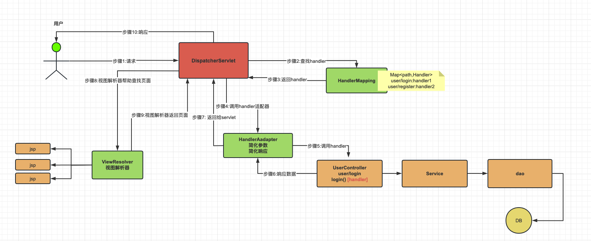

# SpringMVC笔记

## 一、简介

+ Spring Web MVC是基于Servlet API构建的原始Web框架，从一开始就包含在Spring Framework中
+ 其正式名称为Spring Web MVC，来源于其源模块的名称
+ SpringMVC是当前Java EE项目表述层开发的首选方案
  + Spring 家族原生产品，与IOC容器等基础设施无缝对接
  + 表述层各细分领域需要解决的问题全方位覆盖，提供全面解决方案
  + 代码清新简洁，大幅度提升开发效率
  + 内部组件化程度高，可插拔式组件即插即用，想要什么功能配置相应组件即可
  + 性能卓著，尤其适合现代大型、超大型互联网项目要求

---

## 二、使用

### （一）调用流程

+ Spring MVC与许多其他Web框架一样，是围绕前端控制器模式设计的，其中**中央Servlet  DispatcherServlet做整体请求处理调度**

+ DispatcherServlet :SpringMVC提供，我们需要使用web.xml配置使其生效，它是**整个流程处理的核心，所有请求都经过它的处理和分发**
+ HandlerMapping :SpringMVC提供，我们**需要进行IoC配置使其加入IoC容器方可生效**，它内部缓存handler(controller方法)和handler访问路径数据，**DispatcherServlet收到请求时，首先调用它来确认访问路径能否匹配，用于查找路径对应的handler**
+ HandlerAdapter : SpringMVC提供，我们**需要进行IoC配置使其加入IoC容器方可生效**，它可以处理请求参数和处理响应数据数据，**DispatcherServlet确认路径映射后，便通过handlerAdapter间接调用handler**，他是handler和DispatcherServlet之间的适配器
+ Handler : handler又称处理器，他是Controller类内部的方法简称，是**由我们自己定义，用来接收参数，向后调用业务，最终返回响应结果**
+ ViewResovler : SpringMVC提供，我们**需要进行IoC配置使其加入IoC容器方可生效**！视图解析器主要作用简化模版视图页面查找的，但是需要注意，前后端分离项目，后端只返回JSON数据，不返回页面，那就不需要视图解析器！所以，**视图解析器，相对其他的组件不是必须的**

---

### （二）HelloSpringMVC

+ 想实现一个最基本的SpringMVC接收请求并处理的后端代码，需要如下操作:
  + 将本项目变为web项目，即添加webapp以及web.xml等
  + 从调用流程可以看到，大部分的组件都依赖于IoC容器，因此我们需要先创建一个IoC配置类，并提供RequestMappingHandlerMapping和RequestMappingHandlerAdapter的bean对象
  + 创建Controller层的类，配置@Controller注解。在里面写一个方法，方法**使用@RequestMapping(value)指定映射路径，使用@ResponseBody指定返回值直接返回给前端**
  + 创建一个类，继承AbstractAnnotationConfigDispatcherServletInitializer类，并实现其中的三个方法
  + 配置tomcat
  + 运行，访问刚刚使用@RequestMapping配置的映射路径

+ [配置类](../源码/SpringMVC/HelloMVC/src/main/java/com/springmvc/example/config/MvcConfig.java)
+ [SpringMVC初始配置](../源码/SpringMVC/HelloMVC/src/main/java/com/springmvc/example/config/MvcInit.java)
+ [控制层类](../源码/SpringMVC/HelloMVC/src/main/java/com/springmvc/example/controller/HelloController.java)

---

### （三）访问路径设置

+ @RequestMapping注解用来设置访问路径的映射，它可以作用于类和方法上
  + 作用于类上时，设置的路径会**成为其类内所有方法匹配路径的公共前缀**
  + 作用于方法上时，设置的路径会与类上的前缀做拼接，从而得到完整路径的映射，匹配时，匹配的是该完整路径的映射。如果类上无路径，那么设置路径就是完整路径
  + 除此以外，该注解还能指定作用的方法接收什么类型的请求。直接通过它的method属性接收枚举类RequestMethod中的属性值
    + 同时，为了方便我们指定类型请求，SpringMVC提供了一些注解专门就可以直接设置接收类型请求，它们的含义也可以直接看名字看出来
      + @GetMapping
      + @PostMapping
      + @PutMapping
      + @DeleteMapping
      + @PatchMapping
+ 设置路径时，路径可以使用通配符来匹配

|通配符|作用|备注|例|
|:---:|:---:|:---:|:---:|
|?|匹配任意一个字符|无|`/pages/t?st.html` 匹配 `/pages/test.html`|
|*|匹配一层路径的零个或多个字符|无|`/*/test.html` 匹配 `/pages/test.html`|
|**|匹配零层或多层路径|**必须写在路径最后**|`/pages/**`匹配`/pages/test/page.html`|
|{name}|取出对应路径的字段值|无|`/{page}/test.html`匹配`/pages/test.html`，读取到的值为name=pages|
|{name:[a-z]}|取出对应路径满足后面的正则表达式的值|`/{page:[a-z]}/test.html`匹配`/pages/test.html`，但不匹配`/pages1/test.html`|
|{*path}|从当前路径开始截取，直到最后|**需要写在路径最后**|`/resources/{*file}`匹配`/resources/images/file.png`，读取到的值为file=/images/file.png|

---

### （四）参数接收

#### ①param参数

+ 可以使用@RequestParam注解param参数的接收
  + @RequestParam注解是专门接收param参数的
    + 如果传来的参数名与方法对应的参数名不同，可以使用value**指定传来的前端参数名**，并将该注解作用于其对应的方法参数上
    + required可以**指定该参数是否必须**，默认是true，改为false为不必须，**此时参数可以不传，不传不会报错**
    + defaultValue用来**指定参数的默认值**
    + **注解必须作用于相关参数，否则会报500错误**
+ 使用Param参数传递可以传递有多种情况
  + 前端传来的参数名与方法对应的参数名不一致:指定@RequestParam的value为前端参数名，并将该注解作用于对应的方法参数上
  + 一个key对应多个值:使用List来接收，使用@RequestParam指定List接收的key的名称
  + 使用实体类接收:要求**前端参数名与方法实体类的属性名必须一致**（不需要注解）
+ [样例](../源码/SpringMVC/HelloMVC/src/main/java/com/springmvc/example/controller/ParamController.java)

---

#### ②路径参数

+ @PathVariable注解是用于将通过通配符得到的值注入到方法参数中去的，但通配符也可以得到param参数，因此它也能接收
  + value属性用来指定要注入的通配符的名称，该名称**必须与通配符中写的名称一致**
  + required与上面的@RequestParam一致
+ [样例](../源码/SpringMVC/HelloMVC/src/main/java/com/springmvc/example/controller/ParamController.java)

---

#### ③JSON参数

+ 为了接收参数，我们需要在配置类上**加上@EnableWebMvc注解**
  + 该注解可以自动提供RequestMappingHandlerMapping和RequestMappingHandlerAdapter的bean对象，就不需要我们再手动提供了
  + 该注解可以在接收到JSON类型参数时自动解析JSON，从而避免出现415错误
+ 接下来创建一个该JSON串对应的实体类，**实体类的属性需要与JSON的key一致**
+ 在对应的方法内使用该实体类对象接收JSON，并**使用@RequestBody注解将JSON值注入**
+ [样例](../源码/SpringMVC/GetParam/src/main/java/com/springmvc/example/controller/ParamController.java)

---

#### ④Cookie、Session与请求头参数

+ @CookieValue注解用来读取Cookie内的指定字段的值，可以使用value属性指定要读取的key的字段名
+ @SessionAttribute注解用来读取session内的指定key的值，可以使用value属性指定要读取的key的字段名
+ @RequestHeader注解用来读取请求头内的指定字段的值，使用value属性指定要读取的key的字段名，这里是请求头的[参数列表](https://developer.mozilla.org/zh-CN/docs/Web/HTTP/Headers/Accept)
+ [样例](../源码/SpringMVC/GetParam/src/main/java/com/springmvc/example/controller/ParamController.java)

---

#### ⑤原生API对象

+ SpringMVC支持我们直接在方法内声明Servlet的原生API对象并调用它们，其中:
  + 在Request域中，我们可以**通过方法参数的ServletRequest、Map、Model、ModelMap、ModelAndView等对象来直接获得**
  + 在Session域中，我们可以**通过方法参数的HttpSession对象来获得**
  + 在Application域中，我们可以**直接在类中声明一个ServletContext对象，然后给它一个@AutoWired注解直接注入**

|对象所属类|作用|
|:---:|:---:|
|ServletRequest|请求信息对象|
|ServletResponse|响应信息对象|
|HttpSession|会话对象，该会话对象永不为空|
|InputStream|请求信息的字节输入流对象|
|Reader|请求信息的字符输入流对象|
|OutputStream|响应信息的字节输出流对象|
|Writter|相应信息的字符输出流对象|
|Map/Model/ModelMap|request域对象|
|Errors、BindingResult|验证中的错误对象和数据绑定结果对象|

---

## 部分内容汇总

### （一）注解汇总

|注解|作用|备注|
|:---:|:---:|:---:|
|@EnableWebMvc|1.自动提供RequestMappingHandlerMapping和RequestMappingHandlerAdapter的bean对象 2.在接收到JSON类型参数时自动解析JSON，避免出现415错误|无|
|@RequestMapping|指定映射路径与支持的请求类型等|无|
|@ResponseBody|使当前类的所有方法或当前方法的返回值直接返回给前端|无|
|@{Get\|Post\|Put\|Delete\|Patch}Mapping|指定不同请求类型的映射路径|无|
|@RequestParam|接收param参数|无|
|@PathVariable|接收路径参数|无|
|@RequestBody|接收JSON参数|无|
|@Cookie|得到Cookie携带的指定值|无|
|@SessionAttribute|得到session内的指定值|无|
|@RequestHeader|读取请求头内的指定字段的值|无|

