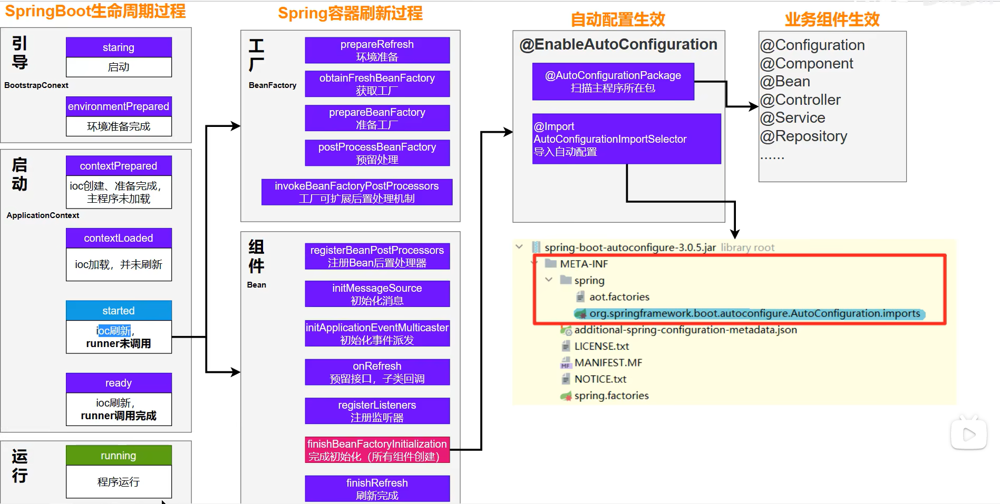

# Springboot笔记

## 一、简介

+ Springboot是Spring官方提供的可以帮我们简单、快速地创建一个独立的、生产级别的 Spring 应用
+ SpringBoot可以:
  + 快速创建独立的Spring应用
  + 直接嵌入Tomcat、Jetty or Undertow（无需部署 war 包）(Servlet容器):如果是jar包可以通过`java -jar`命令运行，当然war包也可以，但建议war包放到tomcact的webapps目录内运行
  + 提供可选的starter，简化应用整合:**SpringBoot提供了许多场景启动器，并为每种场景准备了对应依赖，且自动为我们导入了符合当前版本的包**
  + 按需自动配置 Spring 以及 第三方库:**SpringBoot遵循约定大于配置的原则，它的每个场景都有很多默认配置**，如果我们想自定义，只需要修改几项即可
  + 提供生产级特性：如 监控指标、健康检查、外部化配置等
  + 无代码生成、无xml
+ 总结：SpringBoot可以简化开发，简化配置，简化整合，简化部署，简化监控，简化运维

---

## 二、HelloSpringBoot

+ 首先需要创建一个项目，在项目内指定该项目继承自spring-boot-starter-parent

~~~xml

    <parent>
        <groupId>org.springframework.boot</groupId>
        <artifactId>spring-boot-starter-parent</artifactId>
        <version>3.0.5</version>
        <!-- 
          该标签的作用是Maven在查找依赖时先从该标签指定的本地路径下（这个本地路径不是仓库路径，而是父项目的pom.xml路径）查找，找不到再找本地仓库，找不到再找全局仓库
          但是不写IDEA（比较老的版本可能不报）可能会报错
          将该标签设置为空体可以使Maven直接从本地仓库中寻找依赖项，就直接绕过了本地路径
         -->
        <relativePath/>
    </parent>

~~~

+ 接下来指定依赖项:

~~~xml

    <dependencies>
        <dependency>
            <groupId>org.springframework.boot</groupId>
            <artifactId>spring-boot-starter-web</artifactId>
        </dependency>
    </dependencies>

~~~

+ 接下来开始编写Application类，该类是整个SpringBoot项目的启动类:

~~~java
    import org.springframework.boot.SpringApplication;
    import org.springframework.boot.autoconfigure.SpringBootApplication;

    @SpringBootApplication  // 该注解用来声明这是SpringBoot的项目启动类
    public class MainApplication {
        public static void main(String[] args) {
            // 调用SpringApplication的run方法，传入本类的Class对象和参数来启动SpringBoot项目
            // 这是固定写法
            SpringApplication.run(MainApplication.class,args);
        }
    }

~~~

+ 启动main方法便可以开始运行了
+ SpringBoot内置了对应的tomcat,因此我们无需再配置，它的默认端口为8080,通过访问可以发现它返回了404:

+ 这是因为我们一个controller都没写，没有接受任何请求
+ 接下来创建controller类:

~~~java
    import org.springframework.web.bind.annotation.GetMapping;
    import org.springframework.web.bind.annotation.RequestMapping;
    import org.springframework.web.bind.annotation.RestController;

    @RestController  // @ResponseBody+@Controller
    @RequestMapping("/index")  // 匹配映射/index访问
    public class HelloSpringBootController {
        @GetMapping
        public String helloSpringBoot(){
            return "Hello SpringBoot3";
        }
    }
~~~

+ 接下来就能访问了，直接访问[指定路径](http://localhost:8080/index)来测试是否正确配置
 

+ 除此以外，SpringBoot还额外提供了插件，供我们通过命令行的方式直接运行该jar包或war包
  + 首先执行`mvn clean package`重新打包
  + 接下来在所在包的对应目录下打开cmd,执行`java -jar xxxx.jar/war`来运行
  + 访问路径确认是否项目已经运行
 
 

+ 由于SpringBoot为了简化配置，它自动的配置了很多默认配置项
+ 如果我们想修改，我们可以在对应jar包或war包的同级目录下新建一个叫`application.properties`的配置文件，在该配置文件内指定自定义配置:

~~~properties
    <!-- 这里指定端口号为8888 -->
    server.port=8888
~~~

---

## 三、基础知识

### （一）特性

+ SpringBoot可以简化多个方面:
  + **简化整合**:我们想实现什么功能，就导入什么场景。
    + 官方提供的场景一般叫`spring-boot-starter-*`，而第三方提供的场景一般叫`*-spring-boot-starter`
    + [默认支持的场景](https://docs.spring.io/spring-boot/docs/current/reference/html/using.html#using.build-systems.starters)
  + **简化开发**:无需进行任何配置，直接就可以开始开发
  + **简化配置**:SpringBoot的约定大于配置
    + 它提供了许多默认的配置，这样就不用我们在每次开始开发的时候先进行大量的配置工作
    + 如果想更改配置，可以创建一个`application.properties`文件，所有的配置都写在该文件中修改即可
    + [可修改的配置](https://docs.spring.io/spring-boot/docs/current/reference/html/application-properties.html#appendix.application-properties)
  + **简化部署**:打包为可执行的jar包，只需要linux系统上有java环境即可
  + **简化运维**:可以快速地修改配置（通过application.properties）、监控、健康检测

---

### （二）SpringInitializr

+ IDEA提供了自动创建SpringBoot项目的模板模块:SpringInitializr，他可以为我们快速创建一个对应的SpringBoot项目
+ 首先new->Module，在左边的目录选择SpringInitializr

+ Name后写项目名称
+ Type选择Maven
+ Group自己指定一个对应的Group
+ JDK推荐选择17及以上
+ 打包方式随便
+ 接下来点击Next,进到选择场景界面

+ 在此界面的左上角可以选择SpringBoot的对应版本
+ 下面的Depemdencies下可以选择对应的场景:
  + 一般都是写JavaWeb项目，所以需要勾选Web下的SpringWeb
  + 如果想使用数据库，在SQL选择JDBC API和MySQL Driver，还可以选择Mybatis Framework
  + 如果想使用与jsp相关的视图解析器，可以在Template Engines下选择Thymleaf
  + 如果想使用Lombok，在Developers Tools下选择Lombok
+ 选择好之后点击创建，IDEA会**自动导入相关依赖**并**创建好相对应的项目启动类**
+ 如果我们想编写业务代码，我们需要把我们的代码及它们所在包写在项目启动类所在包的子包或后代包下，因为**SpringBoot默认只会扫描项目启动类所在包的子包及后代包的类**

---

### （三）依赖管理

+ SpringBoot容易使用，其中的原因之一就是依靠依赖管理来实现的
  + 根据Maven的依赖传递原则，A依赖了B，且B依赖了C，那么A同时拥有B和C
    + 根据该情况，我们只需要导入对应的场景，而**SpringBoot提供的对应场景启动器依赖本身已经导入了许多依赖**，这样，当我们想开发什么场景时，就导入指定的场景启动器就可以直接进行开发了，因为这些场景启动器已经导入了我们想导入的依赖
  + 我们在**导入依赖时，不需要写版本号**
    + 这是因为每个SpringBoot项目都有公共的父项目——`spring-boot-starter-parent`，而该项目的父项目又是`spring-boot-dependencies`，它**为我们声明了许多常用依赖的适配版本**
    + 如果我们想改变依赖的版本号，可以依据Maven的就近原则，直接在我们项目的pom.xml文件内的properties标签内声明对应的版本，然后再在denpendency标签内声明版本即可；或者直接在dependency标签内声明版本也可以。由于就近原则，Maven会认定我们手动指定的版本优先级更高
  + 如果我们想导入的依赖没有在我们继承的父项目内，那么我们只能自己导入了（如Druid连接池）

---

### （四）自动配置机制

#### ①初步认识

+ 一旦我们导入了场景，我们在启动SpringBoot项目启动类的时候，其run方法在执行过程中会自动为我们向IOC容器内装配好该场景的相关组件，便于我们使用
+ 验证:
  + run方法会返回IOC容器对象，我们可以使用IOC容器对象得到其内部所有的bean:
  + [验证样例](../源码/SpringBoot/SpringBootInitializrDemo/src/main/java/com/springboot/example/springbootinitializrdemo/SpringBootInitializrDemoApplication.java)

#### ②主程序类

+ 被@SpringBootApplication注解作用的类就是SpringBoot项目的主程序类
  + 默认SpringBoot项目在扫描包时，只会扫描主程序类所在包及其后代包
    + 如果想更改，可以**通过@SpringBootApplication注解的scanBasePackages属性指定想扫描的包**
    + 观察@SpringBootApplication的源码可以发现，它被@SpringBootConfiguration、@EnableAutoConfiguration、@ComponentScan注解作用，因此我们也可以**将@SpringBootApplication注解拆分成这三个注解，并通过@ComponentScan注解来实现自定义扫描路径**

---

#### ③配置文件

+ 可以使用application.properties配置文件来进行SpringBoot项目的配置修改
  + 我们修改的每一个属性都对应着配置类中的一个属性，如
    + ServerProperties类内的属性都是关于Tomcat服务器配置相关的
    + MultipartProperties类内的属性都是关于文件上传相关的
+ 我们导入的依赖`spring-boot-starter-xxx`，它们都会依赖于`spring-boot-starter`
  + 该依赖是所有starter的starter
  + `spring-boot-starter`又导入了`spring-boot-autoconfigure`包，在该包下存放着各个场景下的自动配置类
    + **这些配置类并不是全都生效，如果我们并未导入某些配置类的依赖项，那么对应的配置类就不会生效**

---

#### ④完整流程

+ @SpringBootApplication注解是一个复合注解，从下面的常用注解中我们已经知道:
  + @SpringBootConfiguration用来声明该类是一个SpringBoot配置类
  + @omponentScan注解用来扫描指定包
+ 只剩下一个@EnableAutoConfiguration注解，点开该注解，可以看到:

~~~java

  import java.lang.annotation.Documented;
  import java.lang.annotation.ElementType;
  import java.lang.annotation.Inherited;
  import java.lang.annotation.Retention;
  import java.lang.annotation.RetentionPolicy;
  import java.lang.annotation.Target;
  import org.springframework.context.annotation.Import;

  @Target({ElementType.TYPE})
  @Retention(RetentionPolicy.RUNTIME)
  @Documented
  @Inherited
  @AutoConfigurationPackage
  @Import({AutoConfigurationImportSelector.class})  // 导入AutoConfigurationImportSelector类
  public @interface EnableAutoConfiguration {
      String ENABLED_OVERRIDE_PROPERTY = "spring.boot.enableautoconfiguration";

      Class<?>[] exclude() default {};

      String[] excludeName() default {};
  }

~~~

+ 该注解也是一个复合注解，其中它的作用之一就是导入AutoConfigurationImportSelector类的bean
  + AutoConfigurationImportSelector类就是SpringBoot自动装配的关键
  + 之所以要导入该类，是因为**默认的@ComponentScan注解扫描不到我们的自动配置类（spring-boot-autoconfigure依赖）所在的包**，而该类正好是spring-boot-autoconfigure依赖包下的类,**只要加载它，他就可以加载它所在包下的我们导入的场景对应的自动配置类**
  + AutoConfigurationImportSelector类作用就是**将对应的IOC容器所需的自动配置类加载进IOC，从而达到自动配置的目的**
  + 该类会自动从其所在包下的`META-INF\spring\org.springframework.boot.autoconfigure.AutoConfiguration.imports`加载对应的自动配置类
    + 每个配置类下一般都有**被@Bean注解作用的方法，用来将对应类的对象放入IOC容器中**，也就是说，该自动配置类会给容器中导入一堆相关组件
    + 同时，对应方法还有可能会存在@EnableConfigurationProperties类，并在方法参数列表内接收了指定的类对象，用来配置放入IOC容器对象内的bean的基本配置，而**该注解所指定的类就是我们的application.properties内所声明属性对应的指定Peoperties配置类**
  + 加载时会经过getAutoConfigurationEntry方法，在该方法内调用getCandidateConfigurations方法，再调用ImportCandidates.load方法来加载上面的imports文件中的对应值来放入待加载配置类列表，最后经由一系列操作实现自动配置
  + 但是，**并不是加载的全部的配置类都会生效**，对应的配置类也需要指定条件才会生效。因为**每一个配置类都有条件注解约束**

---

### （五）常用注解

#### ①组件注册注解

|注解|作用|作用范围|备注|
|:---:|:---:|:---:|:---:|
|@Configuration|声明对应类为配置类|类|无|
|@SpringBootConfiguration|生命对应类为SpringBoot项目的配置类|类|其实跟上面的注解没有区别|
|@Bean|使方法返回值作为bean加入到IOC容器内|方法|无|
|@Scope|声明该类型的bean是单实例还是多实例|方法|无|
|@Controller/@Service/@Repository/@Conponent|声明对应类属于控制层/服务层/DAO层/其它层，并将其纳入IOC容器管理|类|无|
|@Import|指定对应类受IOC容器管理|类|一般用于将第三方包下的类纳入IOC容器管理|
|@ComponentScan|开启组件扫描|类|作用于配置类上|

+ [样例](../源码/SpringBoot/SpringBootInitializrDemo/src/main/java/com/springboot/example/springbootinitializrdemo/config/MyConfig.java)

---

#### ②条件注解

|注解|作用|作用范围|备注|
|:---:|:---:|:---:|:---:|
|@ConditionalOnClass|若类路径下存在该类，那么触发指定行为|类/方法|触发指定行为需要利用其他注解实现，如加入IOC容器需要@Bean注解|
|@ConditionalOnMissingClass|若类路径下不存在该类，那么触发指定行为|^|^|
|@ConditionalOnBean|若IOC容器内存在指定的bean,那么触发指定行为|^|^|
|@ConditionalOnMissingBean|如果容器中不存在这个Bean（组件）,那么触发指定行为|^|^|

+ 例:
  + 如果存在FastSqlException这个类，给容器中放一个Cat组件，名cat01
  + 否则，就给容器中放一个Dog组件，名dog01
  + 如果系统中有dog01这个组件，就给容器中放一个 User组件，名zhangsan
  + 否则，就放一个User，名叫lisi

+ [样例](../源码/SpringBoot/SpringBootInitializrDemo/src/main/java/com/springboot/example/springbootinitializrdemo/config/MyConfig.java)

---

#### ③属性绑定

|注解|作用|作用范围|备注|
|:---:|:---:|:---:|:---:|
|@ConfigurationProperties|声明组件的属性和配置文件内key的前缀项以进行项绑定|类|该注解生效必须**使作用类被@Component及相关注解作用或被配置类的@EnableConfigurationProperties指定**，且**对应的实体类需要有getter和setter方法** 该注解生效的时机貌似是bean创建时检查|
|@EnableConfigurationProperties|指定某些类是属性绑定类|类|应作用于配置类|

+ [实体类绑定样例](../源码/SpringBoot/SpringBootInitializrDemo/src/main/java/com/springboot/example/springbootinitializrdemo/pojo/Person.java)
+ [配置类样例](../源码/SpringBoot/SpringBootInitializrDemo/src/main/java/com/springboot/example/springbootinitializrdemo/config/MyConfig.java)

---

## 四、核心

### （一）场景处理

+ 在了解完成SpringBoot的自动配置机制后，我们就可以进行基本的场景定制化处理了
  + 首先我们需要导入对应的场景启动器
  + 接下来可以修改配置文件，以达到我们期望的配置
  + 分析该场景向IOC容器内增加了什么组件，这些组件是否能够满足我们的需求
    + 如果满足，我们就可以使用@AutoWired注解自动装配了
    + 如果不满足，我们可以进行定制化
      + 可以看到每个AutoConfiguration类内要加入IOC容器的组件，如果想加入，**它们都有前置条件**
      + 因此只要打破这些前置条件，其自动配置就不会执行
      + 而我们打**破这些前置条件最简单的方法就是我们在自己编写的配置类或其它地方也提供对应的bean**
      + 这样就实现了定制化

---

### （二）Web开发

#### ①DispatcherServlet执行流程

+ `spring-boot-starter-web`场景导入了`spring-boot-starter-json`场景，而该场景又导入了jackson依赖，使**SpringBoot项目默认就支持JSON数据转换**
+ DispatcherServlet执行的大致流程:
  + 该类对象拦截请求，并执行doService方法，在方法内执行了doDispatch方法
  + 在doDispatch方法内通过执行getHandlerAdapter得到HandlerAdapter派发器对象ha，接下来执行派发器对象的handle方法来开始执行方法
  + 派发器对象是RequestMappingHandlerAdapter类对象，但该类没有实现handle方法，因此执行的handle方法是其父类AbstractHandlerMethodAdapter类的handle方法
  + 其父类的handle方法调用了handleInternal方法，而在handleInternal方法内部调用了invokeHandlerMethod方法执行
    + 在invokeHandlerMethod方法执行前，需要准备好两个东西
      + HandlerMethodArgumentResolver：**参数解析器，确定目标方法每个参数值**
      + HandlerMethodReturnValueHandler：**返回值处理器，确定目标方法的返回值该怎么处理**
  + 在invokeHandlerMethod方法最后，执行了ServletInvocableHandlerMethod类对象的invokeAndHandle方法来执行handler
  + invokeAndHandle方法又调用invokeForRequest来获得handler方法的执行结果
  + ServletInvocableHandlerMethod类并未实现invokeForRequest方法，因此执行其父类InvocableHandlerMethod的invokeForRequest方法
  + invokeForRequest方法调用doInvoke方法来执行handler方法
  + 最终，**在doInvoke方法内，通过得到handler方法的Method对象，通过反射的方式来调用我们定义的handler方法，得到返回结果后开始向上返回**
  + 现在回到invokeAndHandle方法内，invokeForRequest方法已经返回，开始处理返回值
  + 在方法的try-catch语句内调用HandlerMethodReturnValueHandlerComposite类对象的handleReturnValue方法
  + 在handleReturnValue方法中，执行了selectHandler方法来筛选出**能处理请求指定的返回方式的处理对象**，该对象会直接执行下面的handleReturnValue方法
  + 如果方法被@ResponseBody注解作用，那么得到的处理对象是RequestResponseBodyMethodProcessor类对象,它是HandlerMethodReturnValueHandler接口对象。**handleReturnValue方法调用了该处理对象的handleReturnValue方法**
  + 该方法的实际执行者是RequestResponseBodyMethodProcessor类对象
  + 该方法在调用了writeWithMessageConverters方法，来向HttpResponse对象内写入最终内容
  + **方法在最后使用GenericHttpMessageConverter对象的write方法，最终将我们handler方法的返回值转换成对应的返回类型，然后写入到response中**
+ 总流程:`DispatcherServlet.doService`->`this.doDispatch`->`HandlerAdapter.handle`->`AbstractHandlerMethodAdapter.handle`->`this.handleInternal`->`this.invokeHandlerMethod`->`ServletInvocableHandlerMethod.invokeAndHandle`->`this.invokeForRequest`->`this.doInvoke（使用反射执行handler,并向上返回）`->`ServletInvocableHandlerMethod.invokeAndHandle（方法继续执行）`->`HandlerMethodReturnValueHandlerComposite.handleReturnValue`->`RequestResponseBodyMethodProcessor.handleReturnValue`->`this.writeWithMessageConverters`->`GenericHttpMessageConverter.write（进行返回类型转换并加入response中）`

---

#### ②路径匹配

+ Spring5.3之前，只支持AntPathMatcher的路径匹配策略，在Spring5.3时，添加了新的PathPatternParser的路径匹配策略
+ 我们也可以在配置文件内进行相对的配置

|Ant风格通配符|作用|备注|样例|
|:---:|:---:|:---:|:---:|
|*|匹配一层下所有字符|无|`*.html`表示匹配任意html文件|
|?|表示匹配一个任意字符|无|`/fol?er/*.html`表示匹配fol(任意字符)er目录下的任意html文件|
|**|匹配后面的所有层|无|`/folder2/**/*.jsp` 匹配在folder2目录下任意目录深度的.jsp文件|
|{name}|将对应层的值取出，放入name中|无|`/{type}/{id}.html` 匹配任意文件名为{id}.html，在任意命名的{type}目录下的文件|
|[]|匹配对应的字符集合|无|无|

+ PathPatternParser兼容 AntPathMatcher语法，并支持更多类型的路径模式，**它的效率较PathPatternParser的效率高**
+ **PathPatternParser的`**`多段匹配仅能写在路径最后，不能再在中间写**。如果想这样用，需要在配置文件内把匹配准则改为PathPatternParser
+ 新版的默认路径匹配规则是PathPatternParser匹配原则
+ 使用`spring.mvc.pathmatch.matching-strategy`来手动修改路径匹配原则
  + ant_path_matcher表示恢复到AntPathMatcher
  + path_pattern_parser表示改为新版匹配原则

---

#### ③资源配置

+ SpringBoot的Web开发能力，是由SpringMVC实现的
+ 如果我们想配置Web,我们需要明确配置什么东西，下面是与Web相关的AutoConfiguration:

~~~java
    org.springframework.boot.autoconfigure.web.client.RestTemplateAutoConfiguration
    org.springframework.boot.autoconfigure.web.embedded.EmbeddedWebServerFactoryCustomizerAutoConfiguration
    ====以下是响应式web场景和现在的没关系======
    org.springframework.boot.autoconfigure.web.reactive.HttpHandlerAutoConfiguration
    org.springframework.boot.autoconfigure.web.reactive.ReactiveMultipartAutoConfiguration
    org.springframework.boot.autoconfigure.web.reactive.ReactiveWebServerFactoryAutoConfiguration
    org.springframework.boot.autoconfigure.web.reactive.WebFluxAutoConfiguration
    org.springframework.boot.autoconfigure.web.reactive.WebSessionIdResolverAutoConfiguration
    org.springframework.boot.autoconfigure.web.reactive.error.ErrorWebFluxAutoConfiguration
    org.springframework.boot.autoconfigure.web.reactive.function.client.ClientHttpConnectorAutoConfiguration
    org.springframework.boot.autoconfigure.web.reactive.function.client.WebClientAutoConfiguration
    ================以上没关系=================
    org.springframework.boot.autoconfigure.web.servlet.DispatcherServletAutoConfiguration
    org.springframework.boot.autoconfigure.web.servlet.ServletWebServerFactoryAutoConfiguration
    org.springframework.boot.autoconfigure.web.servlet.error.ErrorMvcAutoConfiguration
    org.springframework.boot.autoconfigure.web.servlet.HttpEncodingAutoConfiguration
    org.springframework.boot.autoconfigure.web.servlet.MultipartAutoConfiguration
    org.springframework.boot.autoconfigure.web.servlet.WebMvcAutoConfiguration
~~~

+ 上面是与web相关的AutoConfiguration类，它们都是负责自动装配我们的Web项目的
+ 同时，它们对应的配置类绑定了配置文件的一堆配置项:
  + SpringMVC的所有配置 spring.mvc
  + Web场景通用配置 spring.web
  + 文件上传配置 spring.servlet.multipart
  + 服务器的配置 server: 比如：编码方式

##### ⅠWebMvcAutoConfiguration类

+ 与SpringMVC相关的自动配置功能，都由WebMvcAutoConfiguration类来装配:

~~~java
    @AutoConfiguration(
        after = {DispatcherServletAutoConfiguration.class, TaskExecutionAutoConfiguration.class, ValidationAutoConfiguration.class}
    )  // 该配置类的初始化在这些配置类之后
    @ConditionalOnWebApplication(
        type = Type.SERVLET
    )  // 如果type属于SERVLET时才生效
    @ConditionalOnClass({Servlet.class, DispatcherServlet.class, WebMvcConfigurer.class})  // 类路径下存在这些类才生效
    @ConditionalOnMissingBean({WebMvcConfigurationSupport.class})  // 不存在WebMvcConfigurationSupport的bean时生效，默认确实不存在
    @AutoConfigureOrder(-2147483638)  // 设置初始化优先级
    @ImportRuntimeHints({WebResourcesRuntimeHints.class})  // 不知道干嘛的
    public class WebMvcAutoConfiguration {
        ...

        @Bean
        @ConditionalOnMissingBean({HiddenHttpMethodFilter.class})
        @ConditionalOnProperty(
            prefix = "spring.mvc.hiddenmethod.filter",
            name = {"enabled"}
        )
        // 该过滤器用来支持服务器接收表单提交Rest请求
        public OrderedHiddenHttpMethodFilter hiddenHttpMethodFilter() {
            return new OrderedHiddenHttpMethodFilter();
        }

        @Bean
        @ConditionalOnMissingBean({FormContentFilter.class})
        @ConditionalOnProperty(
            prefix = "spring.mvc.formcontent.filter",
            name = {"enabled"},
            matchIfMissing = true
        )
        // 该过滤器可以得到表单提交到的内容
        public OrderedFormContentFilter formContentFilter() {
            return new OrderedFormContentFilter();
        }

        ...

        private <T extends AbstractUrlHandlerMapping> T createWelcomePageHandlerMapping(ApplicationContext applicationContext, FormattingConversionService mvcConversionService, ResourceUrlProvider mvcResourceUrlProvider, WelcomePageHandlerMappingFactory<T> factory) {
            TemplateAvailabilityProviders templateAvailabilityProviders = new TemplateAvailabilityProviders(applicationContext);
            // 得到静态的前端请求路径，即/**
            String staticPathPattern = this.mvcProperties.getStaticPathPattern();
            // this.getIndexHtmlResource()方法会得到四个默认的请求资源路径下，包含默认的index前缀文件的Resource对象
            // 所以该方法的作用就是建立/**的前端请求路径和默认寻找静态资源路径下的index文件路径之间的映射
            T handlerMapping = factory.create(templateAvailabilityProviders, applicationContext, this.getIndexHtmlResource(), staticPathPattern);
            // 下面又配了点东西，看不懂，不过没关系
            handlerMapping.setInterceptors(this.getInterceptors(mvcConversionService, mvcResourceUrlProvider));
            handlerMapping.setCorsConfigurations(this.getCorsConfigurations());
            return handlerMapping;
        }
    }
~~~

---

##### ⅡWebMvcConfigurer接口

+ WebMvcConfigurer接口内有多个方法，我们只需要让我们的配置类实现对应的方法，就可以使我们的项目支持一些功能

|方法|作用|备注|
|:---:|:---:|:---:|
|addArgumentResolvers|添加请求参数的解析器|无|
|addCorsMappings|添加跨域请求配置|无|
|addFormatters|添加格式化器|无|
|addInterceptors|添加拦截器|无|
|addResourceHandlers|添加静态资源处理器，用来处理静态资源的映射关系|无|
|addReturnValueHandlers|添加返回值处理器|无|
|addViewControllers|添加视图控制器|无|
|configureAsyncSupport|配置异步支持|无|
|configureContentNegotiation|配置内容协商|无|
|configureDefaultServletHandling|配置默认处理的请求路径，默认为/，表示接收所有请求|无|
|configureHandlerExceptionResolvers|配置异常处理器|无|
|configureMessageConverters|配置消息转换器|无|
|configurePathMatch|配置路径匹配|无|
|configureViewResolvers|配置视图解析|无|
|extendsHandlerExceptionResolvers|拓展异常处理器|无|
|extendsMessageConverters|拓展消息转换器|无|

+ 我们可以让配置类实现WebMvcConfigurer接口，在里面实现对应的方法来进行相关的配置，**推荐配置类不要加@EnableWebMvc注解，因为不加这个注解可以在保留SpringBoot默认配置的前提下追加配置，而加了以后SpringBoot的相关默认配置就会失效，我们就需要全部自己进行相应的配置**
+ 另外，我们其实也可以直接提供一个WebMvcConfigurer接口对象，在该对象内实现指定的方法(使用匿名内部类)。
+ 第二种方式也可行的原因是，**SpringBoot在底层会把全部的实现了WebMvcConfigurer接口的对象汇聚成一个List，然后逐个调用对应的方法**，我们的配置类实现了该接口，且配置类也会加入IOC容器，因此配置类对象也满足WebMvcConfigurer接口的对象条件，故也会执行里面的方法
  + 详细的源码在DelegatingWebMvcConfiguration，该类是WebMvcAutoConfiguration的一个内部类EnableWebMvcConfiguration父类

~~~java
    @Configuration(proxyBeanMethods = false)
    public class DelegatingWebMvcConfiguration extends WebMvcConfigurationSupport {
        private final WebMvcConfigurerComposite configurers = new WebMvcConfigurerComposite();

        @Autowired(required = false)
        // 收集全部的WebMvcConfigurer实现类对象，并加入configurers中，方便以后使用
        public void setConfigurers(List<WebMvcConfigurer> configurers) {
            if (!CollectionUtils.isEmpty(configurers)) {
                this.configurers.addWebMvcConfigurers(configurers);  
            }

        }
    }
~~~

---

##### ⅢWebMvcConfigurationSupport类

+ 提供了很多的默认设置。
+ 判断系统中是否有相应的类：如果有，就加入相应的HttpMessageConverter

~~~java
    static {
        ClassLoader classLoader = WebMvcConfigurationSupport.class.getClassLoader();
        romePresent = ClassUtils.isPresent("com.rometools.rome.feed.WireFeed", classLoader);
        jaxb2Present = ClassUtils.isPresent("jakarta.xml.bind.Binder", classLoader);
        jackson2Present = ClassUtils.isPresent("com.fasterxml.jackson.databind.ObjectMapper", classLoader) && ClassUtils.isPresent("com.fasterxml.jackson.core.JsonGenerator", classLoader);
        jackson2XmlPresent = ClassUtils.isPresent("com.fasterxml.jackson.dataformat.xml.XmlMapper", classLoader);
        jackson2SmilePresent = ClassUtils.isPresent("com.fasterxml.jackson.dataformat.smile.SmileFactory", classLoader);
        jackson2CborPresent = ClassUtils.isPresent("com.fasterxml.jackson.dataformat.cbor.CBORFactory", classLoader);
        gsonPresent = ClassUtils.isPresent("com.google.gson.Gson", classLoader);
        jsonbPresent = ClassUtils.isPresent("jakarta.json.bind.Jsonb", classLoader);
        kotlinSerializationCborPresent = ClassUtils.isPresent("kotlinx.serialization.cbor.Cbor", classLoader);
        kotlinSerializationJsonPresent = ClassUtils.isPresent("kotlinx.serialization.json.Json", classLoader);
        kotlinSerializationProtobufPresent = ClassUtils.isPresent("kotlinx.serialization.protobuf.ProtoBuf", classLoader);
    }

~~~

---

##### Ⅳ静态资源配置

###### <一>源码分析

+ SpringBoot通过WebMvcAutoConfiguration类向IOC容器内自动装配对应的bean:
  + 该自动配置类中自动配置了静态资源相关的配置，具体为:
    + 当前端请求/webjars/**相关资源时，后端从默认从classpath:META-INF/resources/webjars文件夹内找
    + 当前端请求/**相关资源时，后端默认从下面四个路径下找:
      + classpath:/META-INF/resources/
      + classpath:/resources/
      + classpath:/static/
      + classpath:/public/
  + 同时，该自动配置类内也配置了缓存相关的内容，大概有
    + period:**什么时候浏览器找服务器要新的资源**，单位是秒，默认空
    + cacheControl:**缓存控制对象**，默认没什么用
    + useLastModified:**开启后，浏览器找服务器请求资源前，先发送请求资源是否发生了更改，在服务器确认后，再发送请求**。默认是true
+ WebMvcAutoConfiguration类内的WebMvcAutoConfigurationAdapter内部类配置了静态资源的相关路径匹配映射:

~~~java

    // 下面是WebMvcAutoConfiguration内声明的内部类，可以看到它实现了WebMvcConfigurer接口

    @Configuration(proxyBeanMethods = false)  // 声明为配置类
    @Import({EnableWebMvcConfiguration.class})  // 导入对应类加入IOC容器
    @EnableConfigurationProperties({WebMvcProperties.class, WebProperties.class})  // 声明两个类通过属性依赖注入属性值，并将这俩类加入IOC容器
    @Order(0)  // 没用
    public static class WebMvcAutoConfigurationAdapter implements WebMvcConfigurer, ServletContextAware {
        private static final Log logger = LogFactory.getLog(WebMvcConfigurer.class);
        private final WebProperties.Resources resourceProperties;
        private final WebMvcProperties mvcProperties;
        private final ListableBeanFactory beanFactory;
        private final ObjectProvider<HttpMessageConverters> messageConvertersProvider;
        private final ObjectProvider<DispatcherServletPath> dispatcherServletPath;
        private final ObjectProvider<ServletRegistrationBean<?>> servletRegistrations;
        private final ResourceHandlerRegistrationCustomizer resourceHandlerRegistrationCustomizer;
        private ServletContext servletContext;

        // 内部类构造器
        public WebMvcAutoConfigurationAdapter(
            WebProperties webProperties, 
            WebMvcProperties mvcProperties, 
            ListableBeanFactory beanFactory, 
            ObjectProvider<HttpMessageConverters> messageConvertersProvider, 
            ObjectProvider<ResourceHandlerRegistrationCustomizer> resourceHandlerRegistrationCustomizerProvider, ObjectProvider<DispatcherServletPath> dispatcherServletPath, 
            ObjectProvider<ServletRegistrationBean<?>> servletRegistrations
        ) {
            this.resourceProperties = webProperties.getResources();
            this.mvcProperties = mvcProperties;
            this.beanFactory = beanFactory;
            this.messageConvertersProvider = messageConvertersProvider;
            this.resourceHandlerRegistrationCustomizer = (ResourceHandlerRegistrationCustomizer)resourceHandlerRegistrationCustomizerProvider.getIfAvailable();
            this.dispatcherServletPath = dispatcherServletPath;
            this.servletRegistrations = servletRegistrations;
        }

        ...

        // 实现WebMvcConfigurer声明的addResourceHandler方法
        public void addResourceHandlers(ResourceHandlerRegistry registry) {

            // resourceProperties在上面的构造器中被赋值，而正常情况下addMappings属性的值都是true，因此一般情况下都会走else
            if (!this.resourceProperties.isAddMappings()) {
                logger.debug("Default resource handling disabled");
            } else {
                //  添加请求路径与静态资源匹配路径
                //  这里的getWebjarsPathPattern方法得到的路径是"/webjars/**"，它直接被写在了WebMvcProperties内的属性中
                // 这句话的意思是，当前端请求的/webjars/**资源时，后端去类路径下的META-INF/resources/webjars文件夹下找
                // 这里调用的是重载的addResourceHandler方法
                this.addResourceHandler(registry, this.mvcProperties.getWebjarsPathPattern(), "classpath:/META-INF/resources/webjars/");
                /* 这里的getStaticPathPattern方法返回"/**"，而下面的getStaticLocations方法返回值是 
                    new String[]{"classpath:/META-INF/resources/", "classpath:/resources/", "classpath:/static/", "classpath:/public/"}
                    这个值就是WebProperties类的内部类Resources类的staticLocations属性
                    它在构造器中被赋值为CLASSPATH_RESOURCE_LOCATIONS，而上面的值就是CLASSPATH_RESOURCE_LOCATIONS属性被显式赋在代码中的值
                    这里调用的也是重载的addResourceHandler方法，但是调用的方法是不一样的，因为二者传的参数不一样
                */
                this.addResourceHandler(registry, this.mvcProperties.getStaticPathPattern(), (registration) -> {
                    registration.addResourceLocations(this.resourceProperties.getStaticLocations());
                    // 查看是否配置了ServletContext类对象，这取决于我们是否配置了ServletContext
                    if (this.servletContext != null) {
                        ServletContextResource resource = new ServletContextResource(this.servletContext, "/");
                        // 为后端响应前端的请求路径再添加一个路径映射
                        registration.addResourceLocations(new Resource[]{resource});
                    }

                });
                // 整体上来说，SpringBoot让WebMvcAutoConfigurationAdapter类对象先调用其重载的方法，再经过重载的方法将前端请求路径和后端寻找路径加入映射中去
            }
        }

        private void addResourceHandler(ResourceHandlerRegistry registry, String pattern, String... locations) {
            // 这里最后调的也是下面的方法
            this.addResourceHandler(registry, pattern, (registration) -> {
                // 设置对应的后端寻找资源的路径
                registration.addResourceLocations(locations);
            });
        }

        private void addResourceHandler(ResourceHandlerRegistry registry, String pattern, Consumer<ResourceHandlerRegistration> customizer) {
            // 判断要加入的pattern是否已经有映射了
            if (!registry.hasMappingForPattern(pattern)) {
                // 这里真正将前端请求的路径加入映射
                ResourceHandlerRegistration registration = registry.addResourceHandler(new String[]{pattern});
                // 这里将对应前端请求的后端寻找资源路径加入映射
                customizer.accept(registration);
                // 设置缓存
                registration.setCachePeriod(this.getSeconds(this.resourceProperties.getCache().getPeriod()));
                registration.setCacheControl(this.resourceProperties.getCache().getCachecontrol().toHttpCacheControl());
                registration.setUseLastModified(this.resourceProperties.getCache().isUseLastModified());
                this.customizeResourceHandlerRegistration(registration);
            }
        }
    }

~~~

+ 在上面的代码中，有些代码与WebMvcProperties类和WebProperties配置类有关
  + WebMvcProperties类包含了前端的请求路径相关的配置
  + WebProperties类包含了后端对于请求路径和静态资源的响应相关的配置

~~~java

    //WebMvcProperties类的部分代码:
    // 从这里可以看出，如果想mvc的相关配置，对应前缀是spring.mvc
    @ConfigurationProperties(prefix = "spring.mvc")
    public class WebMvcProperties {
        private String staticPathPattern = "/**";  // 静态资源匹配路径
        private String webjarsPathPattern = "/webjars/**";  // webjars资源匹配路径
    }
    // 得到默认的Webjars路径映射
    public String getWebjarsPathPattern() {
        return this.webjarsPathPattern;
    }

    // WebProperties类的部分代码:
    // 从这里可以看出，如果想配置web相关配置，对应前缀是spring.web
    @ConfigurationProperties("spring.web")
    public class WebProperties {
        // Resources类是WebProperties的内部类
        public static class Resources {
            // 默认后端寻找静态资源锁寻找的路径
            private static final String[] CLASSPATH_RESOURCE_LOCATIONS = new String[]{"classpath:/META-INF/resources/", "classpath:/resources/", "classpath:/static/", "classpath:/public/"};
            private String[] staticLocations;  // 静态资源锁寻找的路径
            private boolean addMappings;  
            private boolean customized;
            private final Chain chain;
            private final Cache cache;  // 前端缓存相关配置

            public Resources() {
                this.staticLocations = CLASSPATH_RESOURCE_LOCATIONS;  // staticLocations属性直接被赋值为CLASSPATH_RESOURCE_LOCATIONS，就是上面那一串
                this.addMappings = true;  //addMappings属性默认是true
                this.customized = false;
                this.chain = new Chain();
                this.cache = new Cache();
            }

            // 得到后端寻找静态资源的默认路径
            public String[] getStaticLocations() {
                return this.staticLocations;  
            }

              // 注意，这个Cache类是Resources的内部类
            public static class Cache {
                private boolean customized = false;
                @DurationUnit(ChronoUnit.SECONDS)
                private Duration period;  // period默认是空
                private final Cachecontrol cachecontrol = new Cachecontrol();  // cachecontrol会得到对应的对象，但是该对象没有进行任何配置
                private boolean useLastModified = true;  // 默认开启useLastModified
                // Cachecontrol类是Cache类的内部类
                public static class Cachecontrol {
                    private boolean customized = false;
                    @DurationUnit(ChronoUnit.SECONDS)
                    private Duration maxAge;
                    private Boolean noCache;
                    private Boolean noStore;
                    private Boolean mustRevalidate;
                    private Boolean noTransform;
                    private Boolean cachePublic;
                    private Boolean cachePrivate;
                    private Boolean proxyRevalidate;
                    @DurationUnit(ChronoUnit.SECONDS)
                    private Duration staleWhileRevalidate;
                    @DurationUnit(ChronoUnit.SECONDS)
                    private Duration staleIfError;
                    @DurationUnit(ChronoUnit.SECONDS)
                    private Duration sMaxAge;
                }
            }

        }
    }

~~~

---

###### <二>静态资源配置

+ 静态资源配置可以通过两种方式配置:
  + 通过配置文件配置:由于在上面出现了配置文件前缀，因此只要找对应的前缀，配置对应的属性即可
  + 通过代码进行配置:通过配置类实现WebMvcConfigurer接口并实现其addResourceHandlers来进行配置，但**不要在配置类上加@EnableWebMvc注解，一旦加上，原有的默认配置会失效**
+ 另外，部分浏览器会自动请求favicon.ico这个文件，因此在`/**`路径想映射的后端路径内加一个favicon.ico文件，就可以让网页显示出自定义的小图标了

|配置|作用|属性值|备注|
|:---:|:---:|:---:|:---:|
|spring.mvc.static-path-pattern|用来**设置匹配的前端请求静态资源的路径**|字符串值|无|
|spring.mvc.webjars-path-pattern|用来**设置匹配的前端请求webjars资源的路径**|字符串值|无|
|spring.web.resources.static-locations|配置用来设置后端处理静态资源要寻找的目录，**它会覆盖掉SpringBoot默认配置的四个路径**|字符串值|**针对webjars的路径匹配依然有效，因为根据源码，webjars相关的路径匹配被单独配置了，而该项配置与webjars的路径匹配没有关系**|
|spring.web.resources.add-mappings|开启静态资源映射|默认为true|无|
|spring.web.resources.cache.period|配置浏览器使用资源的大概时间|数值，单位秒|**如果配置了控制项，该配置会被覆盖**|
|spring.web.resources.cache.use-last-modified|配置是否在浏览器找服务器请求资源前，先发送请求确认资源是否发生了更改|布尔值|无|
|spring.web.resources.cache.cachecontrol.max-age|配置浏览器使用缓存的最大时间，在此期间，浏览器会使用缓存加载资源|数值，单位秒|无|
|spring.web.resources.cache.cachecontrol.cache-public|设置是否共享缓存|布尔值|无|

+ 可以通过查看状态码来确认是否有缓存，**出现304状态码或网络栏中的履行者显示为`disk cache`即为使用了缓存**
  + 刷新网页不会使用缓存，详情见下图:
    + 其中Etag 是 HTTP 响应头部的一部分，用于标识资源的版本。它通常由服务器生成，并在响应中发送给客户端

+ [配置文件](../源码/SpringBoot/SpringBootWebStaticResource/src/main/resources/application.properties)
+ [配置类](../源码/SpringBoot/SpringBootWebStaticResource/src/main/java/com/springboot/example/springbootwebstaticresource/config/MyConfig.java)

---

#### ④内容协商

##### Ⅰ默认协商

+ 如果我们有多个端向服务器器发送同一个请求，但是各个端期望服务器返回的请求格式不一致，此时SpringBoot会根据前端传来的**请求头参数(Accept)**或**路径参数(Param)**来进行对应的返回格式转换，该操作被称为**内容协商**
  + SpringBoot默认开启基于请求头的内容协商，服务器会根据Accept请求参数来确认使用什么格式进行返回。通过`spring.mvc.contentnegotiation.favor-parameter`来配置是否开启，默认是true
  + SpringBoot**默认不开启**基于路径参数的内容协商
    + 我们需要配置`spring.mvc.contentnegotiation.favor-parameter`来手动设置为true，以开启该方式的内容协商，默认的该方式的请求参数名为format
    + 还可以设置`spring.mvc.contentnegotiation.parameter-name`参数来手动设置以路径参数请求返回值类型时，传递该返回值类型的请求参数的名字。即SpringBoot会依据该配置的值去请求路径中去寻找对应的参数名，然后读取该值期望的返回值类型
    + **使用该方式请求的值与Accept请求值略有不同，如Accept指定的application/json，请求参数仅需要传递json即可**

---

##### Ⅱ自定义内容返回

+ SpringBoot的默认转换器能转换的格式实在有限，因此我们需要会怎么自定义内容返回
+ 我们以增加yaml返回值类型为例，来举例如何自定义内容返回
+ 首先需要导入相关依赖:

~~~xml

  <dependency>
      <groupId>com.fasterxml.jackson.dataformat</groupId>
      <artifactId>jackson-dataformat-yaml</artifactId>
  </dependency>

~~~

+ 在配置类中添加HttpMessageConverter组件，将能够转换yaml文件格式的对象添加进去

~~~java

    @Bean
    public WebMvcConfigurer webMvcConfigurer(){
        return new WebMvcConfigurer() {
            @Override //配置一个能把对象转为yaml的messageConverter
            public void configureMessageConverters(List<HttpMessageConverter<?>> converters) {
                converters.add(new MyYamlHttpMessageConverter());
            }
        };
    }

~~~

+ 编写配置新增支持的媒体类型:
  + spring.mvc.contentnegotiation.media-types.{type}=aaa/bbb
  + 其中type是我们给这个媒体类型起的名字，这个名字是用来路径传参的时候携带的值，比如`spring.mvc.contentnegotiation.media-types.yaml=text/yaml`,那么路径传参的时候请求参数就是`type=yaml`

~~~properties
    spring.mvc.contentnegotiation.media-types.yaml=text/yaml
~~~

+ 创建一个实现了HttpMessageConverter接口的类
  + SpringBoot提供了AbstractHttpMessageConverter类，供我们更简便的实现HttpMessageConverter接口，我们只需继承该类即可
+ 继承了AbstractHttpMessageConverter类**要实现三个方法**
  + protected boolean supports(Class clazz)这里用来**筛选我们的转换器对象能够把什么类型的对象转换为我们期望的格式**
  + protected Object readInternal(Class clazz, HttpInputMessage inputMessage) throws IOException, HttpMessageNotReadableException:这玩意是**用来将前端传来的参数转换为被@RequestBody注解作用的变量对象**的
  + protected void writeInternal(Object o, HttpOutputMessage outputMessage) throws IOException, HttpMessageNotWritableException:这玩意是**用来将我们的handler执行结果转换为我们期望的格式**的
+ [自定义实现类样例](../源码/SpringBoot/SpringBootMessageConverter/src/main/java/com/springboot/example/springbootmessageconverter/component/MyHttpMessageConverter.java)
+ 提示:如果使用浏览器进行请求测试，**浏览器因为无法解析yaml格式的返回值，会把它下载下来保存为一个文件**
---

##### Ⅲ执行原理

+ SpringBoot在HandlerMethodReturnValueHandlerComposite类对象的handleReturnValue方法一执行，就调用了selectHandler方法，来筛选出能处理请求指定的返回方式的

~~~java

    private HandlerMethodReturnValueHandler selectHandler(@Nullable Object value, MethodParameter returnType) {
            boolean isAsyncValue = this.isAsyncReturnValue(value, returnType);
            // 这个returnValueHandlers就是SpringBoot中默认的用于处理各种返回方式的处理对象组成的集合
            // 这个处理对象并不是XML转换器对象或者JSON转换器对象之类的东西，它是用于处理我们声明的该方法是以何种方式返回的处理对象
            // 比如我在类上声明了@ResponseBody注解，那么就会选择到RequestResponseBodyMethodProcessor对象
            // 因此它是处理返回方式的对象，不是处理返回类型的转换对象
            Iterator var4 = this.returnValueHandlers.iterator();

            HandlerMethodReturnValueHandler handler;
            do {
                do {
                    if (!var4.hasNext()) {
                        return null;
                    }

                    handler = (HandlerMethodReturnValueHandler)var4.next();
                } while(isAsyncValue && !(handler instanceof AsyncHandlerMethodReturnValueHandler));
            } while(!handler.supportsReturnType(returnType)); // 如果选中的handler满足类型匹配就停止循环，相当于找到了能进行处理的对象
            // supportsReturnType对于ResponseBody的判断原理就是判断方法是否被@ResponseBody注解作用

            return handler;
        }

~~~

+ 在得到对应的处理对象之后，调用处理对象的handleReturnValue方法，在handleReturnValue方法内最后又调用了writeWithMessageConverters方法进行最终的操作:

~~~java

    // 这是writeWithMessageConverters方法的部分截取

        ....
        MediaType selectedMediaType = null;  // 该变量用来表示前端想让后端返回的返回类型
        MediaType contentType = outputMessage.getHeaders().getContentType();
        boolean isContentTypePreset = contentType != null && contentType.isConcrete();
        if (isContentTypePreset) {
            ...
            selectedMediaType = contentType;
        }else{
            ....

            // 看不懂
            // 这个compatibleMediaTypes是前端发来的能够接受的返回格式组成的集合
            // 貌似路径参数会把请求头参数覆盖掉
            Iterator var15 = compatibleMediaTypes.iterator();

            while(var15.hasNext()) {
                MediaType mediaType = (MediaType)var15.next();
                if (mediaType.isConcrete()) {
                    selectedMediaType = mediaType;  // 最后赋的是这玩意
                    break;
                }

                if (mediaType.isPresentIn(ALL_APPLICATION_MEDIA_TYPES)) {
                    selectedMediaType = MediaType.APPLICATION_OCTET_STREAM;
                    break;
                }
            }
        }

        if (selectedMediaType != null) {
            // 什么抽象代码块
            label166: {
                selectedMediaType = selectedMediaType.removeQualityValue();
                // messageConverters里面是能够进行对应的返回值格式的转换器,这里调用iterator方法就是要一个一个遍历来看哪个转换器能够进行对应格式的转换
                // 可以看到messageConverters是一个List<HttpMessageConverter<?>>对象，也就是说里面的元素都是HttpMessageConverter接口对象
                Iterator var21 = this.messageConverters.iterator();

                HttpMessageConverter converter;  // 提前声明converter变量
                GenericHttpMessageConverter genericConverter;
                // 开始遍历
                while(true) {
                    // 遍历到最后直接跳出抽象代码块
                    if (!var21.hasNext()) {
                        break label166;
                    }
                    // 使用converter进行承接
                    converter = (HttpMessageConverter)var21.next();
                    GenericHttpMessageConverter var10000;
                    // 判断遍历到的converter是否属于GenericHttpMessageConverter相关实例对象
                    if (converter instanceof GenericHttpMessageConverter) {
                        GenericHttpMessageConverter ghmc = (GenericHttpMessageConverter)converter;
                        var10000 = ghmc;
                    } else {
                        var10000 = null;
                    }
                    // 把当前var10000，也就是当前converter赋给genericConverter，只是如果实例对象不满足条件赋null
                    genericConverter = var10000;
                    // 下面开始判断genericConverter能够进行相对应的类型转换
                    if (genericConverter != null) {
                        // 如果可以，直接跳出循环
                        if (((GenericHttpMessageConverter)converter).canWrite((Type)targetType, valueType, selectedMediaType)) {
                            break;
                        }
                        // 如果负责converter也能处理，也跳出循环
                    } else if (converter.canWrite(valueType, selectedMediaType)) {
                        break;
                    }
                }
                // 下面的代码一定是循环找到了能进行转换的对象才执行的
                body = this.getAdvice().beforeBodyWrite(body, returnType, selectedMediaType, converter.getClass(), inputMessage, outputMessage);
                if (body != null) {
                    
                    ...

                    if (genericConverter != null) {
                        // 进行对应的类型转换，并将其写进response中
                        genericConverter.write(body, (Type)targetType, selectedMediaType, outputMessage);
                    } else {
                        // 如果genericConverter!=null，那么就执行这个
                        converter.write(body, selectedMediaType, outputMessage);
                    }
                }

                ...

                return;
            }
        }

~~~

+ 因此，**我们如果想自定义内容返回，就需要向IOC容器内添加对应的HttpMessageConverter接口对象**

---

##### Ⅳ配置原理

+ WebMvcAutoConfiguration中有一个内部类EnableWebMvcConfiguration，该类继承自DelegatingWebMvcConfiguration类，而DelegatingWebMvcConfiguration类又继承自WebMvcConfigurationSupport
+ 在资源匹配中我们已经得知，WebMvcConfigurationSupport类中有一个静态代码块，只要项目一开始运行，它的静态代码块就会判断依赖中是否有一些指定的依赖，如果有，就将相关的变量置为true

~~~java

    static {
        ClassLoader classLoader = WebMvcConfigurationSupport.class.getClassLoader();
        romePresent = ClassUtils.isPresent("com.rometools.rome.feed.WireFeed", classLoader);
        jaxb2Present = ClassUtils.isPresent("jakarta.xml.bind.Binder", classLoader);
        jackson2Present = ClassUtils.isPresent("com.fasterxml.jackson.databind.ObjectMapper", classLoader) && ClassUtils.isPresent("com.fasterxml.jackson.core.JsonGenerator", classLoader);
        jackson2XmlPresent = ClassUtils.isPresent("com.fasterxml.jackson.dataformat.xml.XmlMapper", classLoader);
        jackson2SmilePresent = ClassUtils.isPresent("com.fasterxml.jackson.dataformat.smile.SmileFactory", classLoader);
        jackson2CborPresent = ClassUtils.isPresent("com.fasterxml.jackson.dataformat.cbor.CBORFactory", classLoader);
        gsonPresent = ClassUtils.isPresent("com.google.gson.Gson", classLoader);
        jsonbPresent = ClassUtils.isPresent("jakarta.json.bind.Jsonb", classLoader);
        kotlinSerializationCborPresent = ClassUtils.isPresent("kotlinx.serialization.cbor.Cbor", classLoader);
        kotlinSerializationJsonPresent = ClassUtils.isPresent("kotlinx.serialization.json.Json", classLoader);
        kotlinSerializationProtobufPresent = ClassUtils.isPresent("kotlinx.serialization.protobuf.ProtoBuf", classLoader);
    }

~~~

+ WebMvcConfigurationSupport类中提供了getMessageConverters的方法:
  

~~~java
    protected final List<HttpMessageConverter<?>> getMessageConverters() {
        if (this.messageConverters == null) {
            this.messageConverters = new ArrayList();
            this.configureMessageConverters(this.messageConverters);
            if (this.messageConverters.isEmpty()) {
                // 配置全在该方法内
                this.addDefaultHttpMessageConverters(this.messageConverters);
            }

            this.extendMessageConverters(this.messageConverters);
        }

        return this.messageConverters;
    }
~~~

+ 这里主要看全都是空的情况下的addDefaultMessageConverters方法

~~~java
    protected final void addDefaultHttpMessageConverters(List<HttpMessageConverter<?>> messageConverters) {
        // 这里导入了一堆的默认转换器
        messageConverters.add(new ByteArrayHttpMessageConverter());
        messageConverters.add(new StringHttpMessageConverter());
        messageConverters.add(new ResourceHttpMessageConverter());
        messageConverters.add(new ResourceRegionHttpMessageConverter());
        messageConverters.add(new AllEncompassingFormHttpMessageConverter());
        if (romePresent) {
            messageConverters.add(new AtomFeedHttpMessageConverter());
            messageConverters.add(new RssChannelHttpMessageConverter());
        }

        Jackson2ObjectMapperBuilder builder;
        // 静态代码块中被赋值的变量，在这里被使用了
        if (jackson2XmlPresent) {
            builder = Jackson2ObjectMapperBuilder.xml();
            if (this.applicationContext != null) {
                builder.applicationContext(this.applicationContext);
            }

            messageConverters.add(new MappingJackson2XmlHttpMessageConverter(builder.build()));
        } else if (jaxb2Present) {
            messageConverters.add(new Jaxb2RootElementHttpMessageConverter());
        }

        if (kotlinSerializationCborPresent) {
            messageConverters.add(new KotlinSerializationCborHttpMessageConverter());
        }

        if (kotlinSerializationJsonPresent) {
            messageConverters.add(new KotlinSerializationJsonHttpMessageConverter());
        }

        if (kotlinSerializationProtobufPresent) {
            messageConverters.add(new KotlinSerializationProtobufHttpMessageConverter());
        }

        if (jackson2Present) {
            builder = Jackson2ObjectMapperBuilder.json();
            if (this.applicationContext != null) {
                builder.applicationContext(this.applicationContext);
            }

            messageConverters.add(new MappingJackson2HttpMessageConverter(builder.build()));
        } else if (gsonPresent) {
            messageConverters.add(new GsonHttpMessageConverter());
        } else if (jsonbPresent) {
            messageConverters.add(new JsonbHttpMessageConverter());
        }

        if (jackson2SmilePresent) {
            builder = Jackson2ObjectMapperBuilder.smile();
            if (this.applicationContext != null) {
                builder.applicationContext(this.applicationContext);
            }

            messageConverters.add(new MappingJackson2SmileHttpMessageConverter(builder.build()));
        }

        if (jackson2CborPresent) {
            builder = Jackson2ObjectMapperBuilder.cbor();
            if (this.applicationContext != null) {
                builder.applicationContext(this.applicationContext);
            }

            messageConverters.add(new MappingJackson2CborHttpMessageConverter(builder.build()));
        }

    }
~~~

---

#### ⑤Thyemeleaf

##### Ⅰ快速体验

+ [Thymeleaf](https://www.thymeleaf.org/)是一款用于前后端不分离时渲染页面的模板引擎，SpringBoot默认支持该模板引擎，但未导入对应场景
  + 除ThymeLeaf外，SpringBoot还默认支持以下引擎:
    + FreeMarker
    + Groovy
    + Mustache
+ 首先我们要导入场景

~~~xml

  <dependency>
      <groupId>org.springframework.boot</groupId>
      <artifactId>spring-boot-starter-thymeleaf</artifactId>
  </dependency>

~~~

+ SpringBoot有专门的ThymeleafAutoConfiguration类，在其内部类DefaultTemplateResolverConfiguration内的defaultTemplateResolver方法中，设置了寻找对应模板的前缀和后缀:

~~~java
    @Bean
    SpringResourceTemplateResolver defaultTemplateResolver() {
        SpringResourceTemplateResolver resolver = new SpringResourceTemplateResolver();
        ...
        resolver.setPrefix(this.properties.getPrefix());  // 设置寻找模板引擎的前缀
        resolver.setSuffix(this.properties.getSuffix());  // 设置寻找模板引擎的后缀
        ...
        return resolver;
    }
~~~

+ 我们通过查看getPrefix方法和getSuffix方法可以看到，默认的值分别为`classpath:/templates/`和`.html`
+ 也就是说，**该模板引擎默认从类路径下的tamplates目录下寻找xxx.html文件**
+ 现在我们可以开始编写一个简单的Thtmeleaf模板了:
  + 首先写一个controller，不要写@ResponseBody,直接返回我们想渲染的模板名称，也不需要带后缀，直接返回字符串即可
  + 在对应路径下声明一个对应的html模板，可以在其html标签下加上属性约束:`<html lang="en" xmlns:th="http://www.thymeleaf.org">`，这样idea会有提示
+ 然后就可以用了
+ [模板样例](../源码/SpringBoot/SpringBootThymeleaf/src/main/resources/templates/hello.html)
+ [controller样例](../源码/SpringBoot/SpringBootThymeleaf/src/main/java/com/springboot/example/springbootthymeleaf/controller/ThymeleafController.java)

---

##### Ⅱ核心语法

|语法|作用|值|备注|样例|
|:---:|:---:|:---:|:---:|:---:|
|th:text|将文本值渲染到对应标签内|一般使用插值表达式插入|无|[样例1](../源码/SpringBoot/SpringBootThymeleaf/src/main/resources/templates/hello.html)|
|th:utext|将HTML渲染到对应标签内|^|浏览器会当成HTML语句渲染|^|
|th:属性|渲染属性值|^|无|^|
|th:attr|批量渲染属性值|例:`th:attr="style=${style},src=${src}"`|无|^|
|th:if|如果其表达式为真，那么该属性所在标签会被渲染|一般使用插值表达式插入，并运算|无|^|
|th:switch|相当于switch语句|一般使用插值表达式插入|无|^|
|th:case|相当于case语句|^|无|^|
|th:object|变量选择，配合*{}插值表达式可以在子标签中引用该变量|^|无|^|
|th:each|遍历集合|例:`th:each="item,state : ${list}"`|[样例2](../源码/SpringBoot/SpringBootThymeleaf/src/main/resources/templates/list.html)|
|th:fragment|定义模板|例:`th:fragment="xxx"`|无|[样例3](../源码/SpringBoot/SpringBootThymeleaf/src/main/resources/templates/template.html)|
|th:insert|在标签内部插入对应组件|例:`th:insert="~{templateName :: fragmentName}"`|无|[样例4](../源码/SpringBoot/SpringBootThymeleaf/src/main/resources/templates/useTemplate.html)|
|th:replace|将该标签替换为组件|例:`th:replace="~{templateName :: fragmentName}"`|无|^|

|插值表达式|作用|备注|
|:---:|:---:|:---:|
|${}|将request域中的变量取出使用|无|
|@{}|专门用于适配URL路径，会动态的加上后端的上下文路径|无|
|#{}|国际化消息|无|
|~{}|导入片段（模板）时使用|无|
|*{}|变量选择，需要配合th:object绑定对象|无|

|系统工具/内置对象|作用|备注|
|:---:|:---:|:---:|
|param|请求参数对象|无|
|session|session对象|无|
|application|context对象|无|
|#execInfo|模板执行消息|无|
|#messages|国际化消息|无|
|#uris|uri/url工具|无|
|#conversions|类型转换工具|无|
|#dates|日期工具，是java.util.Date的工具类|无|
|#calendars|日期工具，是java.util.Calendar的工具类|无|
|#temporals|JDK8+,java.time的工具类|无|
|#numbers|数字操作工具|无|
|#strings|字符串操作工具|无|
|#objects|对象操作工具|无|
|#bools|布尔值操作工具|无|
|#arrays|数组操作工具|无|
|#lists|List操作工具|无|
|#sets|Set操作工具|无|
|#maps|Map操作工具|无|
|#aggregates|集合聚合工具(sum、avg)|无|
|#ids|id生成工具|无|

+ 其它相关操作与java基本一致，但是有几个特殊的:
  + 布尔运算中，**与操作需要使用`and`关键字，或操作需要使用`or`关键字**
  + 字符串拼接时，可以在拼接的字符串开头和结尾加上`|`来避免传统的使用`+`符号进行拼接，而是使用类似模板字符串的拼接方式进行拼接
  + 条件运算发生了一些变化:
    + if-then： `(value)?(then)`
    + if-then-else: `(value)?(then):(else)`（三元运算符）
    + default: `(value)?:(defaultValue)`
  + 如果想在属性内表示字符串，需要使用单引号引起来
  + **如果想在标签内部直接插值，可以使用`[[...]]`或`[(...)]`进行插值**

---

##### Ⅲ遍历

+ 使用th:each可以对集合进行遍历:
  + `th:each="item,state : ${list}`
    + item表示当前遍历到的集合元素，变量名可以随便取
    + state表示当前遍历到的元素的状态，这是个键值对类型的集合对象
    + list表示被遍历的集合对象，它的名字取决于request域中的待遍历对象的变量名
+ state变量中有多个属性，这些属性都有他们各自的名称:

|属性名|作用|备注|
|:---:|:---:|:---:|
|index|索引|无|
|count|遍历到的是第几个元素|无|
|size|遍历的元素总量|无|
|current|遍历到的当前元素值|无|
|even|当前的count是否是偶数|无|
|odd|当前的count是否是奇数|无|
|first|是否是第一个元素|无|
|last|是否是最后一个元素|无|

+ [样例](../源码/SpringBoot/SpringBootThymeleaf/src/main/resources/templates/list.html)

---

##### Ⅳ属性优先级

+ Order值越低，优先级越高

|Order|分类|属性|
|:---:|:---:|:---:|
|1|片段包含|th:insert th:replace|
|2|遍历|th:each|
|3|判断|th:if th:unless th:switch th:case|
|4|定义本地变量|th:object th:with|
|5|通用方式属性修改|th:attr th:attrprepend th:attrappend|
|6|指定属性修改|th:value th:href th:src ...|
|7|文本值|th:text th:utext|
|8|片段指定|th:fragment|
|9|片段移除|th:remove|

---

##### Ⅴ模板布局

+ 我们有时想将网页变成一些可复用的组件，Thymeleaf也为我们提供了这一功能:
  + 如果我们想定义一个可复用的组件，我们需要在该组件最外层的标签上加上`th:fragment`属性，并给该组件起一个名字
  + 接下来我们就可以在别的地方引用了
    + 使用`th:insert`或`th:replace`属性来引用该组件
    + 属性内使用`~{}`插值表达式来专门进行引用
    + 语法为`templateName :: componentName`，如我们的组件名字叫top，它所在的文件名是template，那么引用时就是`~{template :: top}`
+ [组件样例](../源码/SpringBoot/SpringBootThymeleaf/src/main/resources/templates/template.html)
+ [调用组件样例](../源码/SpringBoot/SpringBootThymeleaf/src/main/resources/templates/useTemplate.html)

---

##### Ⅵ相关配置

|配置项|作用|值|备注|
|:---:|:---:|:---:|:---:|
|server.servlet.context-path|设置项目的上下文路径|默认是`/`|无|
|spring.thymeleaf.prefix|指定thymeleaf的匹配前缀|默认是`classpath:/templates/`|无|
|spring.thymeleaf.suffix|指定thymeleaf的匹配后缀|默认是`.html`|无|
|spring.thymeleaf.check-template|在响应前确认对应模板是否存在，不存在会报错|布尔值，默认为true|无|
|spring.thymeleaf.check-template-location|在响应前确认模板所在路径是否存在，不存在会报错|布尔值，默认为true|无|
|spring.thymeleaf.cache|如果浏览器已经缓存了该模板，那么就让浏览器用缓存|布尔值，默认为true|无|

---

#### ⑥国际化

+ SpringBoot默认寻找messages.properties文件来配置国际化
  + messages.properties文件是默认的国际化配置文件，**该文件必须存在，否则会报错**
  + messages_en_US.properties文件是英语（美国）的国际化配置文件，注意**该配置文件对应的语言是英语（美国）而不是英语**
  + messages_zh_CN.properties文件是简体中文的国际化配置文件
  + SpringBoot在寻找对应的国际化配置时，会先查找浏览器端的最高优先级的语言配置文件，如果没有再去其它语言配置文件寻找，寻找依据也是按照浏览器端的各语言优先级来找
  + 如果要使用Thymeleaf,那么需要使用#{}的插值表达式来读取国际化配置文件中的对应值
  + 我们可以通过spring.messages.basename配置来指定SpringBoot默认寻找的国际化文件，也可以通过spring.messages.encoding来指定国际化配置文件的解码格式
    + spring.messages.basename配置**不仅要指定上路径，还要指定上配置文件的前缀名**。如classpath:static/test.properties要指定为`static/test`
  + 关于国际化配置的相关配置类是MessageSourceAutoConfiguration类，它默认会使用MessageSourceProperties类对象进行一些操作
    + 在MessageSourceProperties类中，我们可以看到默认的basename是`messages`
+ [国际化样例](../源码/SpringBoot/SpringBootThymeleaf/src/main/java/com/springboot/example/springbootthymeleaf/controller/ThymeleafController.java)
+ [Thymeleaf国际化样例](../源码/SpringBoot/SpringBootThymeleaf/src/main/resources/templates/national.html)

---

#### ⑦错误处理机制

##### Ⅰ处理流程

+ SpringBoot在原来的SpringMVC对于错误处理的基础上做了对应拓展
  + SpringMVC的异常处理机制如下:
    + SpringMVC在发生了异常后，先寻找是否存在对应的ExceptionHandler来处理该异常，如果有，那么就执行该handler
    + 如果没有找到，就去寻找@ResponseStatus机制能否解决，如果可以解决那么进行解决
    + 如果依然不能，确认SpringMVC定义的默认错误响应能否处理，如果能够处理那么进行处理。如果依旧不能处理，那么就进入SpringBoot的拓展异常处理机制
  + SpringBoot的拓展异常处理机制如下:
    + 如果是出现了状态码相关的异常
      + SpringBoot先精准匹配对应页面的视图模板，先从`templates/error`目录下找，找不到再在静态资源中找
      + 如果都找不到，那么继续模糊匹配对应页面的视图模板，也遵循刚才的顺序寻找，默认寻找`4xx.html`和`5xx.html`文件
      + 如果找不到，那么继续去匹配templates目录下error的视图模板
      + 如果没有找到我们自定义的，那么SpringBoot默认会自己提供一个并返回
    + 如果出现了非状态码相关的异常
      + SpringBoot会提供DefaultErrorAttributes错误信息并返回

---

##### Ⅱ底层分析

+ SpringBoot对错误处理的相关自动配置都在ErrorMvcAutoConfiguration
  + 在ErrorMvcAutoConfiguration配置类内提供了BasicErrorController类对象
  + BasicErrorController类中定义了处理相关异常的对应方法:
    + BasicErrorController类被@RequestMapping注解作用，说明该类中的方法需要前端发送请求才能执行
    + 在底层，SpringBoot会通过请求转发的方式让该类中的方法执行
    + `${server.error.path:${error.path:/error}}`的意思是先寻找server.error.path配置，如果没有就寻找error.path,再没有就匹配/error路径
    + 因此，默认的请求路径就是/error
    + 我们也可以直接发送请求，也能得到该类的响应

~~~java
    // 这是该类默认处理的请求路径
    @RequestMapping({"${server.error.path:${error.path:/error}}"})
    public class BasicErrorController extends AbstractErrorController {
        @RequestMapping(produces = {"text/html"})
        // 该方法用来返回错误的html文件
        public ModelAndView errorHtml(HttpServletRequest request, HttpServletResponse response) {
            ...
            // 调用resolveErrorView方法，来执行对应的异常处理方案
            ModelAndView modelAndView = this.resolveErrorView(request, response, status, model);
            // 如果通过resolveErrorView方法得到了ModelAndView对象，那么直接返回该视图对象
            // 如果不是，那么返回视图解析前缀目录下的error视图文件
            // 当然，如果这个文件也没有，SpringBoot会默认使用IOC容器内自动配置的默认的error视图文件并返回
            return modelAndView != null ? modelAndView : new ModelAndView("error", model);
        }

        @RequestMapping
        // 该方法用来返回JSON格式的异常响应，ResponseEntity对象将来会直接被转为JSON返回
        public ResponseEntity<Map<String, Object>> error(HttpServletRequest request) {
            HttpStatus status = this.getStatus(request);

            if (status == HttpStatus.NO_CONTENT) {
                return new ResponseEntity(status);
            } else {
                Map<String, Object> body = this.getErrorAttributes(request, this.getErrorAttributeOptions(request, MediaType.ALL));
                return new ResponseEntity(body, status);
            }
        }

        @Bean(name = {"error"})
        @ConditionalOnMissingBean(name = {"error"})
        // 这里SpringBoot默认会返回一个error视图对象加入IOC容器
        public View defaultErrorView() {
            return this.defaultErrorView;
        }
    }
~~~

+ 在errorHtml方法内调用的是resolveErrorView如下

~~~java

    protected ModelAndView resolveErrorView(HttpServletRequest request, HttpServletResponse response, HttpStatus status, Map<String, Object> model) {
        // 这里是遍历能够用的视图解析器，如果没有视图解析器，就会返回null
        Iterator var5 = this.errorViewResolvers.iterator();

        ModelAndView modelAndView;
        do {
            if (!var5.hasNext()) {
                return null;
            }
            // 得到对应的错误视图处理器对象
            ErrorViewResolver resolver = (ErrorViewResolver)var5.next();
            // 调用该对象的resolveErrorView方法，企图进行错误处理
            modelAndView = resolver.resolveErrorView(request, status, model);
        } while(modelAndView == null);

        return modelAndView;
    }
~~~

+ 错误视图处理器对象所属的类是DefaultErrorViewResolver，实现了ErrorViewResolver接口
+ 接下来它三个方法用来寻找对应的视图

~~~java

    static {
        // 创建一个Map
        Map<HttpStatus.Series, String> views = new EnumMap(HttpStatus.Series.class);
        // 静态代码块中声明了默认的模糊处理指标是出现4xx或5xx状态码
        views.put(Series.CLIENT_ERROR, "4xx");
        views.put(Series.SERVER_ERROR, "5xx");
        // 把SERIES_VIEWS赋值为无法修改的与views内容相同的map对象
        SERIES_VIEWS = Collections.unmodifiableMap(views);
    }

    // 直接调用的是这个方法
    public ModelAndView resolveErrorView(HttpServletRequest request, HttpStatus status, Map<String, Object> model) {
        // 得到当前的错误状态码，然后调用resolve方法来解决
        ModelAndView modelAndView = this.resolve(String.valueOf(status.value()), model);
        // 这是精确查找找不到的情况，且出现错误的情况对应的状态码是4xx或5xx，这是默认情况，详情见上面的静态代码块
        if (modelAndView == null && SERIES_VIEWS.containsKey(status.series())) {
            // 进行模糊查找，再调用resolve方法，流程就和上面的resolve方法一致了
            modelAndView = this.resolve((String)SERIES_VIEWS.get(status.series()), model);
        }

        return modelAndView;
    }

    // resolve方法是用来精确查找视图的方法
    private ModelAndView resolve(String viewName, Map<String, Object> model) {
        // 该语句就是SpringBoot默认从error目录下去寻找对应的状态码相关的视图文件，即精确查找错误状态码对应的视图文件
        // 如果是模糊查找，默认寻找4xx或5xx这样的视图文件
        // 该路径是视图解析器的中间路径，它相当于我们控制层返回的字符串，视图解析器会把它和默认前缀以及默认后缀拼凑起来进行解析
        String errorViewName = "error/" + viewName;
        // 这里去对应路径下寻找是否存在该视图，如果有就返回
        TemplateAvailabilityProvider provider = this.templateAvailabilityProviders.getProvider(errorViewName, this.applicationContext);
        // 如果找到了就返回对应的视图文件
        // 如果找不到继续调用resolveResource方法来进行查找
        return provider != null ? new ModelAndView(errorViewName, model) : this.resolveResource(errorViewName, model);
    }

    private ModelAndView resolveResource(String viewName, Map<String, Object> model) {
        // 这里得到静态资源的查找目录
        String[] var3 = this.resources.getStaticLocations();
        int var4 = var3.length;

        // 遍历静态资源文件夹，查找是否存在对应的文件
        for(int var5 = 0; var5 < var4; ++var5) {
            String location = var3[var5];

            try {
                Resource resource = this.applicationContext.getResource(location);
                // 找后缀是.html的文件
                resource = resource.createRelative(viewName + ".html");
                if (resource.exists()) {
                    // 如果存在就返回
                    return new ModelAndView(new HtmlResourceView(resource), model);
                }
            } catch (Exception var8) {
            }
        }

        // 全找不到就返回null
        return null;
    }

~~~

+ 在上面的分析中，我们可以看到这些方法总是接收一个model的Map类型参数，该参数用于向错误视图提供错误信息
  + 该参数会向上返回到DispatcherServlet（中途会封装一下），再把它交给Thymeleaf的相关视图类进行处理
+ 对应的配置类是ErrorProperties类:

~~~java
  public class ErrorProperties {
      @Value("${error.path:/error}")
      private String path = "/error";
      private boolean includeException;
      private IncludeAttribute includeStacktrace;
      private IncludeAttribute includeMessage;
      private IncludeAttribute includeBindingErrors;
      private final Whitelabel whitelabel;
  }
~~~

+ 但是model默认不会携带类似异常堆栈、异常信息等重要信息，因此如果我们想用，我们就要在配置文件里配置它们:

~~~properties

  server.error.include-stacktrace=always
  server.error.include-binding-errors=always
  server.error.include-exception=true
  server.error.include-message=always

~~~

+ 在添加后，我们可以看到model中包含如下元素:
  + 下面的元素可以在视图中直接使用插值表达式读取

---

##### Ⅲ自定义异常处理

+ 如果是处理页面响应，需要根据SpringBoot配置的规则，在指定目录下配置相关的错误信息视图
  + 如果发生了500、404、503、403 这些错误
    + 若视图解析器存在，那么我们在`classpath:templates/error`目录下或者静态资源目录下创建对应的错误状态码视图文件
    + 或者在在`classpath:templates/error`目录下或者静态资源目录下创建对应的模糊状态码视图文件，如`4xx.html`、`5xx.html`
    + 或者在`classpath:templates`目录下直接创建一个`error.html`文件
+ 如果处理JSON相关的响应，直接通过@RestControllerAdvice注解和@ExceptionHandler注解进行统一的异常处理

---

#### ⑧嵌入式容器

+ 省流:想配置服务相关配置，以server开头，如果想进行精确配置，去查看ServerProperties类
+ 通过向容器中提供ServletWebServerFactory对象，来禁用掉SpringBoot默认放的服务器工厂，实现自定义嵌入任意服务器。

+ 我们知道SpringBoot自动内嵌了Tomcat作为其启动Servlet的容器，其对应的自动配置类是ServletWebServerFactoryAutoConfiguration
  + 从ServletWebServerFactoryAutoConfiguration的类注解上可以看到它导入了三个嵌入式的服务器对象
  + 同时，它内部导入了tomcat工厂的配置类对象

~~~java

@AutoConfiguration(after = {SslAutoConfiguration.class})
@AutoConfigureOrder(Integer.MIN_VALUE)
@ConditionalOnClass({ServletRequest.class})  // 如果有Servlet依赖
@ConditionalOnWebApplication(type = Type.SERVLET)  // 如果是Web开发环境
@EnableConfigurationProperties({ServerProperties.class})  // 关联ServerProperties配置文件
// 该配置类导入了三个嵌入式的服务器类
@Import(
    {
        BeanPostProcessorsRegistrar.class,
        ServletWebServerFactoryConfiguration.EmbeddedTomcat.class, 
        ServletWebServerFactoryConfiguration.EmbeddedJetty.class, 
        ServletWebServerFactoryConfiguration.EmbeddedUndertow.class
    }
)
public class ServletWebServerFactoryAutoConfiguration {
  ...
}

~~~

+ 在导入的嵌入式服务器对象中，它们各自导入了可以创建对应服务器对象实例的工厂对象加入IOC容器:
+ 表面上导了三个，实际上这三个类都是ServletWebServerFactoryConfiguration类的内部类
  + 虽然导入了三个，但是它们加入IOC容器都有前提条件
  + **这些前提条件限制了只有当导入它们的相关依赖时，且IOC容器中未存在ServletWebServerFactory接口对象时，对应的bean才会加入IOC容器中**
  + 因此，只要我们手动向IOC容器内提供ServletWebServerFactory接口对象，那么我们就可以自己指定使用的服务器对象了
+ 如果导入了多个服务器依赖，那么依然仅会有一个服务器运行
  + 其默认优先级是tomcat>jetty>undertow
  + 因为在ServletWebServerFactoryAutoConfiguration上的@Import注解是这样按顺序导入的
  + 第一个tomcat会被先导入，其工厂对象加入IOC容器时，容器内并没有ServletWebServerFactory接口对象，因此该类可以正常加入
  + 当tomcat的工厂对象加入后，容器内就有ServletWebServerFactory接口对象了，因此后面的类即使导入了也无法加入IOC容器，因为它们不满足条件了

~~~java
    @Configuration(proxyBeanMethods = false)
    class ServletWebServerFactoryConfiguration {
        ServletWebServerFactoryConfiguration() {}

        @Configuration(proxyBeanMethods = false)
        @ConditionalOnClass({Servlet.class, Undertow.class, SslClientAuthMode.class})
        @ConditionalOnMissingBean(value = {ServletWebServerFactory.class},search = SearchStrategy.CURRENT)  // 
        static class EmbeddedUndertow {
            ...
            @Bean
            // 导入Undertow工厂对象
            UndertowServletWebServerFactory undertowServletWebServerFactory(ObjectProvider<UndertowDeploymentInfoCustomizer> deploymentInfoCustomizers, ObjectProvider<UndertowBuilderCustomizer> builderCustomizers) {
                UndertowServletWebServerFactory factory = new UndertowServletWebServerFactory();
                factory.getDeploymentInfoCustomizers().addAll(deploymentInfoCustomizers.orderedStream().toList());
                factory.getBuilderCustomizers().addAll(builderCustomizers.orderedStream().toList());
                return factory;
            }
            ...
        }

        @Configuration(proxyBeanMethods = false)
        @ConditionalOnClass({Servlet.class, Server.class, Loader.class, WebAppContext.class})
        @ConditionalOnMissingBean(value = {ServletWebServerFactory.class},search = SearchStrategy.CURRENT)
        static class EmbeddedJetty {
            ...
            @Bean
            // 提供Jetty工厂对象
            JettyServletWebServerFactory jettyServletWebServerFactory(ObjectProvider<JettyServerCustomizer> serverCustomizers) {
                JettyServletWebServerFactory factory = new JettyServletWebServerFactory();
                factory.getServerCustomizers().addAll(serverCustomizers.orderedStream().toList());
                return factory;
            }
        }

        @Configuration(proxyBeanMethods = false)
        @ConditionalOnClass({Servlet.class, Tomcat.class, UpgradeProtocol.class})
        @ConditionalOnMissingBean(value = {ServletWebServerFactory.class},search = SearchStrategy.CURRENT)
        static class EmbeddedTomcat {
            ...
            @Bean
            // 导入Tomcat工厂对象
            TomcatServletWebServerFactory tomcatServletWebServerFactory(ObjectProvider<TomcatConnectorCustomizer> connectorCustomizers, ObjectProvider<TomcatContextCustomizer> contextCustomizers, ObjectProvider<TomcatProtocolHandlerCustomizer<?>> protocolHandlerCustomizers) {
                TomcatServletWebServerFactory factory = new TomcatServletWebServerFactory();
                factory.getTomcatConnectorCustomizers().addAll(connectorCustomizers.orderedStream().toList());
                factory.getTomcatContextCustomizers().addAll(contextCustomizers.orderedStream().toList());
                factory.getTomcatProtocolHandlerCustomizers().addAll(protocolHandlerCustomizers.orderedStream().toList());
                return factory;
            }
        }
    }
~~~

+ 各服务器的工厂对象提供了getWebServer方法来返回服务器对象，这里以tomcat为例:

~~~java

    public WebServer getWebServer(ServletContextInitializer... initializers) {
        ...
        Tomcat tomcat = new Tomcat();  // 创建一个Tomcat对象
        ...
        return this.getTomcatWebServer(tomcat);  // 调用getTomcatWebServer来把tomcat整合进WebServer对象然后返回
    }

    protected TomcatWebServer getTomcatWebServer(Tomcat tomcat) {
        // 这里会返回整合tomcat的WebServer对象
        return new TomcatWebServer(tomcat, this.getPort() >= 0, this.getShutdown());
    }

~~~

+ 该方法会在IOC容器初始化时调用，即在IOC中的AbstractApplicationContext类的refresh方法中的十二大步中的onrefresh方法内被调用
  + 刷新子容器相当于初始化其子容器
  + 该方法位于ServletWebServerApplicationContext类内，它以ApplicationContext为后缀，可以明显看出这是一个IOC子容器

~~~java

    protected void onRefresh() {
        super.onRefresh();

        try {
            this.createWebServer();  // 调用createWebServer方法
        } catch (Throwable var2) {
            throw new ApplicationContextException("Unable to start web server", var2);
        }
    }

    private void createWebServer() {
        ...
        if (webServer == null && servletContext == null) {
            StartupStep createWebServer = this.getApplicationStartup().start("spring.boot.webserver.create");
            // 得到对应的ServletWebServer工厂对象
            ServletWebServerFactory factory = this.getWebServerFactory();
            createWebServer.tag("factory", factory.getClass().toString());
            // 调用工厂对象的getWebServer方法
            this.webServer = factory.getWebServer(new ServletContextInitializer[]{this.getSelfInitializer()});
            createWebServer.end();
            ...
        } else if (servletContext != null) {
            try {
                this.getSelfInitializer().onStartup(servletContext);
            } catch (ServletException var5) {
                throw new ApplicationContextException("Cannot initialize servlet context", var5);
            }
        }

        this.initPropertySources();
    }

~~~

+ 因此，WebServer对象在IOC容器初始化时就被加入到IOC容器中去
+ 接下来再看看ServletWebServerFactoryAutoConfiguration类关联的Properties类:

~~~java
    @ConfigurationProperties(
        prefix = "server",  // 想使用配置文件配置，需要前缀以servr开头
        ignoreUnknownFields = true
    )
    public class ServerProperties {
        // 可以看到该配置类下有许多配置
        private Integer port;
        private InetAddress address;
        @NestedConfigurationProperty
        private final ErrorProperties error = new ErrorProperties();
        private ForwardHeadersStrategy forwardHeadersStrategy;
        private String serverHeader;
        private DataSize maxHttpRequestHeaderSize = DataSize.ofKilobytes(8L);
        private Shutdown shutdown;
        @NestedConfigurationProperty
        private Ssl ssl;
        @NestedConfigurationProperty
        private final Compression compression;
        @NestedConfigurationProperty
        private final Http2 http2;
        private final Servlet servlet;
        private final Reactive reactive;
        private final Tomcat tomcat;
        private final Jetty jetty;
        private final Netty netty;
        private final Undertow undertow;

        public ServerProperties() {
            // 该配置类还专门提供了精确的对象，用来方便我们在配置文件内进行精确的配置
            this.shutdown = Shutdown.IMMEDIATE;
            this.compression = new Compression();
            this.http2 = new Http2();
            this.servlet = new Servlet();
            this.reactive = new Reactive();
            this.tomcat = new Tomcat();
            this.jetty = new Jetty();
            this.netty = new Netty();
            this.undertow = new Undertow();
        }
    }
~~~

---

#### ⑨SpringMVC自动配置详解

+ SpringMVC的相关配置都集中在WebMvcAutoConfiguration中，该类向IOC容器提供了非常多的bean，我们在资源配置中已经说明了一部分，接下来继续说明剩下的:
  + WebMvcAutoConfigurationAdapter类实现了WebMvcConfigurer，因此进行了一些默认配置，同时它还导入了EnableWebMvcConfiguration类

|加入IOC的bean类型|作用|备注|
|:---:|:---:|:---:|
|OrderedHiddenHttpMethodFilter|支持RESTful的filter|无|
|OrderedFormContentFilter|支持非POST请求的请求体携带数据|无|
|RequestMappingHandlerAdapter|映射方法执行器|无|
|WelcomePageHandlerMapping|欢迎页映射匹配器|无|
|LocaleResolver|国际化解析器|无|
|ThemeResolver|主题解析器|无|
|FlashMapManager|临时数据共享|无|
|FormattingConversionService|数据格式化器|无|
|Validator|数据校验器|无|
|RequestMappingHandlerMapping|请求映射匹配器|无|
|ConfigurableWebBindingInitializer|负责请求参数的封装与绑定|无|
|ExceptionHandlerExceptionResolver|默认的异常处理器|无|
|ContentNegotiationManager|内容协商管理器|无|
|InternalResourceViewResolver|视图解析器|无|
|BeanNameViewResolver|通过bean名称解析的视图解析器|无|
|ContentNegotiatingViewResolver|内容协商视图解析器，它用来选择合适的视图解析器进行内容协商|无|
|RequestContextFilter|请求上下文过滤器，通过它可以在任意位置获得请求和响应对象|无|
|MessageCodesResolver|定义错误代码规则|无|

+ RequestContextFilter内部的initContextHolders方法会拦截请求，并将请求和一些其它配置封装起来

~~~java
    protected void doFilterInternal(HttpServletRequest request, HttpServletResponse response, FilterChain filterChain) throws ServletException, IOException {
        // 把request和response封装在一起
        ServletRequestAttributes attributes = new ServletRequestAttributes(request, response);
        this.initContextHolders(request, attributes);  // 执行initContextHolders方法

        try {
            filterChain.doFilter(request, response);  // 放行
        } finally {
            this.resetContextHolders();
            if (this.logger.isTraceEnabled()) {
                this.logger.trace("Cleared thread-bound request context: " + request);
            }

            attributes.requestCompleted();
        }
    }

    private void initContextHolders(HttpServletRequest request, ServletRequestAttributes requestAttributes) {
        LocaleContextHolder.setLocale(request.getLocale(), this.threadContextInheritable);
        // 使用RequestContextHolder的静态方法，把requestAttributes（request和response的封装）加入到RequestContextHolder类中
        // setRequestAttributes方法内使用ThreadLocal对象存储requestAttributes
        RequestContextHolder.setRequestAttributes(requestAttributes, this.threadContextInheritable);  
        if (this.logger.isTraceEnabled()) {
            this.logger.trace("Bound request context to thread: " + request);
        }
    }
~~~

+ [任意位置获取请求样例](../源码/SpringBoot/SpringBootThymeleaf/src/main/java/com/springboot/example/springbootthymeleaf/service/MyService.java)

+ 另外，实现WebMvcConfigurer接口可以配置SpringMVC底层的运作规则:

|接口方法|参数|作用|返回值|备注|
|:---:|:---:|:---:|:---:|:---:|
|configurePathMatch(PathMatchConfigurer configurer)|configurer:配置对象|配置路径匹配|void|无|
|configureContentNegotiation(ContentNegotiationConfigurer configurer)|^|配置内容协商|void|无|
|configureAsyncSupport(AsyncSupportConfigurer configurer)|^|配置异步支持|void|无|
|configureDefaultServletHandling(DefaultServletHandlerConfigurer configurer)|^|配置项会覆盖Servlet的默认处理配置|void|无|
|addFormatters(FormatterRegistry registry)|registry:格式化器注册对象|添加格式化器|void|无|
|addInterceptors(InterceptorRegistry registry)|registry:拦截器注册对象|添加拦截器|void|无|
|addResourceHandlers(ResourceHandlerRegistry registry)|registry:资源处理器注册对象|添加资源处理器|void|无|
|addCorsMappings(CorsRegistry registry)|registry:跨域映射注册对象|添加跨域映射|void|无|
|addViewControllers(ViewControllerRegistry registry)|registry:视图控制器注册对象|添加视图控制器|void|无|
|configureViewResolvers(ViewResolverRegistry registry)|registry:视图解析器注册对象|添加视图解析器|void|无|
|addArgumentResolvers(List<HandlerMethodArgumentResolver> resolvers)|resolvers:参数解析器集合|添加参数解析器|void|无|
|addReturnValueHandlers(List<HandlerMethodReturnValueHandler> handlers)|handlers:返回值处理器集合|添加拦返回值处理器|void|无|
|configureMessageConverters(List<HttpMessageConverter<?>> converters)|converters:消息转换器集合|添加消息转换器|void|无|
|extendMessageConverters(List<HttpMessageConverter<?>> converters)|converters:消息转换器集合|拓展消息转换|void|无|
|configureHandlerExceptionResolvers(List<HandlerExceptionResolver> resolvers)|resolvers:异常处理器集合|添加异常处理器|void|无|
|extendHandlerExceptionResolvers(List<HandlerExceptionResolver> resolvers)|resolvers:异常处理器集合|拓展异常处理|void|无|
|getValidator()|无参|得到校验器对象|void|无|
|getMessageCodesResolver()|无参|得到错误代码规则对象|void|无|

+ 我们可以通过@EnableWebMvc注解来禁用掉WebMvcAutoConfiguration的自动配置
  + 其原理是EnableWebMvc注解内部有`@Import({DelegatingWebMvcConfiguration.class})`注解，导入了DelegatingWebMvcConfiguration类
  + DelegatingWebMvcConfiguration类是WebMvcConfigurationSupport类的子类对象
  + 而WebMvcAutoConfiguration类生效的前提之一就是WebMvcConfigurationSupport类对象不在IOC容器内
  + 因此如果我们想在SpringBoot的默认配置的前提下做一些拓展，不要给配置类加上@EnableWebMvc注解

---

#### ⑩新特性

##### ⅠProblemdetails

+ Spring官方根据[RFC7807](https://www.rfc-editor.org/rfc/rfc7807)的规范，添加了对媒体类型`application/problem+json`返回的支持:
+ 为此，SpringBoot特地在WebMvcAutoConfiguration中加入了ProblemDetailsExceptionHandler对象
  + 想使用该特性，需要在配置文件中配置`spring.mvc.problemdetails.enabled`属性，并置为true
  + 这里@ConditionalOnProperty明示的很明显

~~~java
    @Configuration(proxyBeanMethods = false)
    @ConditionalOnProperty(
        prefix = "spring.mvc.problemdetails",
        name = {"enabled"},
        havingValue = "true"
    )
    static class ProblemDetailsErrorHandlingConfiguration {
        ProblemDetailsErrorHandlingConfiguration() {
        }

        @Bean
        @ConditionalOnMissingBean({ResponseEntityExceptionHandler.class})
        @Order(0)
        ProblemDetailsExceptionHandler problemDetailsExceptionHandler() {
            return new ProblemDetailsExceptionHandler();
        }
    }
~~~

+ ProblemDetailsExceptionHandler继承自ResponseEntityExceptionHandler，在该类中，SpringBoot默认处理了一些可能的异常:

~~~java
    @ExceptionHandler(
        {
            HttpRequestMethodNotSupportedException.class, 
            HttpMediaTypeNotSupportedException.class, 
            HttpMediaTypeNotAcceptableException.class, 
            MissingPathVariableException.class, 
            MissingServletRequestParameterException.class, 
            MissingServletRequestPartException.class, 
            ServletRequestBindingException.class, 
            MethodArgumentNotValidException.class, 
            HandlerMethodValidationException.class, 
            NoHandlerFoundException.class, 
            NoResourceFoundException.class, 
            AsyncRequestTimeoutException.class, 
            ErrorResponseException.class, 
            MaxUploadSizeExceededException.class, 
            ConversionNotSupportedException.class, 
            TypeMismatchException.class, 
            HttpMessageNotReadableException.class, 
            HttpMessageNotWritableException.class, 
            MethodValidationException.class, 
            BindException.class
        }
    )
    @Nullable
    public final ResponseEntity<Object> handleException(Exception ex, WebRequest request) throws Exception {
        if (ex instanceof HttpRequestMethodNotSupportedException subEx) {
            return this.handleHttpRequestMethodNotSupported(subEx, subEx.getHeaders(), subEx.getStatusCode(), request);
        } else if (ex instanceof HttpMediaTypeNotSupportedException subEx) {
            return this.handleHttpMediaTypeNotSupported(subEx, subEx.getHeaders(), subEx.getStatusCode(), request);
        } else if (ex instanceof HttpMediaTypeNotAcceptableException subEx) {
            return this.handleHttpMediaTypeNotAcceptable(subEx, subEx.getHeaders(), subEx.getStatusCode(), request);
        } else if (ex instanceof MissingPathVariableException subEx) {
            return this.handleMissingPathVariable(subEx, subEx.getHeaders(), subEx.getStatusCode(), request);
        } else if (ex instanceof MissingServletRequestParameterException subEx) {
            return this.handleMissingServletRequestParameter(subEx, subEx.getHeaders(), subEx.getStatusCode(), request);
        } else if (ex instanceof MissingServletRequestPartException subEx) {
            return this.handleMissingServletRequestPart(subEx, subEx.getHeaders(), subEx.getStatusCode(), request);
        } else if (ex instanceof ServletRequestBindingException subEx) {
            return this.handleServletRequestBindingException(subEx, subEx.getHeaders(), subEx.getStatusCode(), request);
        } else if (ex instanceof MethodArgumentNotValidException subEx) {
            return this.handleMethodArgumentNotValid(subEx, subEx.getHeaders(), subEx.getStatusCode(), request);
        } else if (ex instanceof HandlerMethodValidationException subEx) {
            return this.handleHandlerMethodValidationException(subEx, subEx.getHeaders(), subEx.getStatusCode(), request);
        } else if (ex instanceof NoHandlerFoundException subEx) {
            return this.handleNoHandlerFoundException(subEx, subEx.getHeaders(), subEx.getStatusCode(), request);
        } else if (ex instanceof NoResourceFoundException subEx) {
            return this.handleNoResourceFoundException(subEx, subEx.getHeaders(), subEx.getStatusCode(), request);
        } else if (ex instanceof AsyncRequestTimeoutException subEx) {
            return this.handleAsyncRequestTimeoutException(subEx, subEx.getHeaders(), subEx.getStatusCode(), request);
        } else if (ex instanceof ErrorResponseException subEx) {
            return this.handleErrorResponseException(subEx, subEx.getHeaders(), subEx.getStatusCode(), request);
        } else if (ex instanceof MaxUploadSizeExceededException subEx) {
            return this.handleMaxUploadSizeExceededException(subEx, subEx.getHeaders(), subEx.getStatusCode(), request);
        } else {
            HttpHeaders headers = new HttpHeaders();
            if (ex instanceof ConversionNotSupportedException theEx) {
                return this.handleConversionNotSupported(theEx, headers, HttpStatus.INTERNAL_SERVER_ERROR, request);
            } else if (ex instanceof TypeMismatchException theEx) {
                return this.handleTypeMismatch(theEx, headers, HttpStatus.BAD_REQUEST, request);
            } else if (ex instanceof HttpMessageNotReadableException theEx) {
                return this.handleHttpMessageNotReadable(theEx, headers, HttpStatus.BAD_REQUEST, request);
            } else if (ex instanceof HttpMessageNotWritableException theEx) {
                return this.handleHttpMessageNotWritable(theEx, headers, HttpStatus.INTERNAL_SERVER_ERROR, request);
            } else if (ex instanceof MethodValidationException subEx) {
                return this.handleMethodValidationException(subEx, headers, HttpStatus.INTERNAL_SERVER_ERROR, request);
            } else if (ex instanceof BindException theEx) {
                return this.handleBindException(theEx, headers, HttpStatus.BAD_REQUEST, request);
            } else {
                throw ex;
            }
        }
    }
~~~

---

##### Ⅱ函数式Web

+ Spring官方认为控制层与路由映射耦合在一起不是很好，企图降低耦合
+ 于是Spring在5.2以后推出了新的请求处理流程:
  + 在配置文件中提供一个方法:`public RouterFunction<ServerResponse> [自定义方法名]()`，并让该方法被@Bean注解注释
  + 在里面进行路由的映射以及请求方法的分配:
+ [函数式Web样例](../源码/SpringBoot/SpringBootThymeleaf/src/main/java/com/springboot/example/springbootthymeleaf/config/MyConfig.java)

---

### （三）数据访问

#### ①整合SSM

+ 由于SpringBoot自动装配的便捷性，我们整合SSM会十分的方便
  + 首先需要导入相关依赖，在SpringBoot的项目创建页选择Web开发依赖、Lombok、MySQL驱动、Mybatis依赖（这四个都可以选）

  + 如果想导入Druid连接池，由于SpringBoot没有提供，我们需要自己导:

~~~xml
    <properties>
        <java.version>17</java.version>

        <druid.version>1.2.22</druid.version>
    </properties>

    <dependency>
        <groupId>com.alibaba</groupId>
        <artifactId>druid</artifactId>
        <version>${druid.version}</version>
    </dependency>

~~~

  + 接下来就创建controller、mapper等java文件
  + 在创建mapper时，我们在创建接口之后，可以依靠MybatisX插件快速的生成对应的xml文件（按Alt+Enter）
  + 选择Generate mapper of xml

  + 在下面的页面选择我们的xml文件生成位置，一般我们都会选择resources目录下的mapper目录

  + 在我们创建出对应的方法时，也可以通过MybatisX快速在对应的xml文件内生成标签

  + 接下来创建对应的实体类对象，**不要忘记提供setter方法**，一般加一个@Data注解就行了
  + 最后配置配置文件，提供JDBC相关的四个必须配置和Mybatis的xml文件映射路径，以及选择性提供连接池、配置Mybatis的驼峰映射、主键回显等

---

#### ②底层原理

+ SpringBoot的自动配置包（org.springframework.boot.spring-boot.autoconfiguration）中META-INF目录下的spring目录里的文件中已经默认导入了一些jdbc相关的配置类:

~~~java
    // 配置连接池相关
    org.springframework.boot.autoconfigure.jdbc.DataSourceAutoConfiguration
    // 不知道干嘛的
    org.springframework.boot.autoconfigure.jdbc.JdbcClientAutoConfiguration
    // 配置Spring提供的JdbcTemplate的配置
    org.springframework.boot.autoconfigure.jdbc.JdbcTemplateAutoConfiguration
    // 下面的没什么关联，也不知道干嘛的
    org.springframework.boot.autoconfigure.jdbc.JndiDataSourceAutoConfiguration
    org.springframework.boot.autoconfigure.jdbc.XADataSourceAutoConfiguration
    // 配置事务的相关类
    org.springframework.boot.autoconfigure.jdbc.DataSourceTransactionManagerAutoConfiguration
~~~

+ DataSourceAutoConfiguration类默认绑定了DataSourceProperties属性配置类，它的相关前缀是`spring.datasource`
+ 另外，他还默认导入了一些数据库连接池:

~~~java
    @Configuration(proxyBeanMethods = false)
    @Conditional({PooledDataSourceCondition.class})
    @ConditionalOnMissingBean({DataSource.class, XADataSource.class})
    // 导入了下面的连接池对象，
    @Import({DataSourceConfiguration.Hikari.class, DataSourceConfiguration.Tomcat.class, DataSourceConfiguration.Dbcp2.class, DataSourceConfiguration.OracleUcp.class, DataSourceConfiguration.Generic.class, DataSourceJmxConfiguration.class})
    protected static class PooledDataSourceConfiguration {
        protected PooledDataSourceConfiguration() {

        }

        @Bean
        @ConditionalOnMissingBean({JdbcConnectionDetails.class})
        PropertiesJdbcConnectionDetails jdbcConnectionDetails(DataSourceProperties properties) {
            return new PropertiesJdbcConnectionDetails(properties);
        }
    }
~~~

+ 另外，在Mybatis的场景启动器中(org.mybatis.spring.boot.mybatis-spring-boot-autoconfiguration)的META-INF目录下的spring目录中也导入了相关配置类:

~~~java
    // 语言驱动的自动配置
    org.mybatis.spring.boot.autoconfigure.MybatisLanguageDriverAutoConfiguration
    // Mybatis的相关自动配置
    org.mybatis.spring.boot.autoconfigure.MybatisAutoConfiguration
~~~

+ 在MybatisAutoConfiguration类中，可以看到它绑定了MybatisProperties属性配置类，可以看到它的配置前缀是`mybatis`
  + MybatisAutoConfiguration类向IOC容器提供了SqlSessionFactory对象，用来创建数据库会话
  + 还提供了SqlSessionTemplate对象，用来进行数据库的相关操作
+ 另外，Mybatis能够自动向IOC容器提供代理对象，是因为@MapperScan注解的原因:
  + 可以看到它导入了MapperScannerRegistrar类

~~~java
    @Retention(RetentionPolicy.RUNTIME)
    @Target({ElementType.TYPE})
    @Documented
    @Import({MapperScannerRegistrar.class})
    @Repeatable(MapperScans.class)
    public @interface MapperScan {
        ...
    }
~~~

+ 在MapperScannerRegistrar类中，它会利用扫描机制，扫描指定路径下的对应接口，并批量创建这些接口的bean加入IOC容器中。该操作调用的是registerBeanDefinitions方法来实现的

---

### （四）生命周期、事件与监听器

#### ①自定义监听器

+ 在应用运行的各个生命周期下，我们可以自定义监听器来对事件的生命周期进行监听，并针对其事件做出不同的响应
  + 我们需要自定义一个类**实现SpringApplicationRunListener接口**
  + 在META-INF/spring.factories文件内配置`org.springframework.boot.SpringApplicationRunListener=自定义Listener全类名`
  + 除了我们自定义的监听器，SpringBoot还配置了默认的Listener，因为在org.springframework.boot包下的META-INF目录中的spring.factories文件内就配置了对应的监听器:`sorg.springframework.boot.SpringApplicationRunListener=org.springframework.boot.context.event.EventPublishingRunListener`
+ [监听器示例](../源码/SpringBoot/EventAndListener/src/main/java/com/springboot/example/eventandlistener/listener/MyListener.java)

---

#### ②底层监听器的调用

+ 底层监听器的调用都在SpringApplication类中的run方法内有所体现:

~~~java

    // 这里是我们调的run方法
    public static ConfigurableApplicationContext run(Class<?> primarySource, String... args) {
        // 调用下面的run方法
        return run(new Class[]{primarySource}, args);
    }

    
    public static ConfigurableApplicationContext run(Class<?>[] primarySources, String[] args) {
        // 该run方法又调用下面的run方法
        return (new SpringApplication(primarySources)).run(args);
    }

    public ConfigurableApplicationContext run(String... args) {
        Startup startup = SpringApplication.Startup.create();
        if (this.registerShutdownHook) {
            shutdownHook.enableShutdownHookAddition();
        }

        // 创建一个引导项目启动的对象
        DefaultBootstrapContext bootstrapContext = this.createBootstrapContext();
        ConfigurableApplicationContext context = null;
        this.configureHeadlessProperty();
        // 得到监听器对象组成的集合
        SpringApplicationRunListeners listeners = this.getRunListeners(args);
        ...
    }
~~~

+ 从上面的片段可以看出，run方法几乎一开始执行，就要获得监听器对象
+ 接下来分析监听器对象怎么获得的

~~~java

    private SpringApplicationRunListeners getRunListeners(String[] args) {
        // 这里是参数解析器的相关操作
        SpringFactoriesLoader.ArgumentResolver argumentResolver = ArgumentResolver.of(SpringApplication.class, this);
        argumentResolver = argumentResolver.and(String[].class, args);
        // 这里调用了getSpringFactoriesInstances方法来从各个spring.factories的配置中得到listener对象集合
        List<SpringApplicationRunListener> listeners = this.getSpringFactoriesInstances(SpringApplicationRunListener.class, argumentResolver);
        SpringApplicationHook hook = (SpringApplicationHook)applicationHook.get();
        SpringApplicationRunListener hookListener = hook != null ? hook.getRunListener(this) : null;
        if (hookListener != null) {
            // 这里把listeners转成ArrayList集合
            listeners = new ArrayList((Collection)listeners);
            ((List)listeners).add(hookListener);
        }
        // 封装一下，返回
        return new SpringApplicationRunListeners(logger, (List)listeners, this.applicationStartup);
    }

    // 调用的getSpringFactoriesInstances方法又调用了forDefaultResourceLocation方法
    private <T> List<T> getSpringFactoriesInstances(Class<T> type, SpringFactoriesLoader.ArgumentResolver argumentResolver) {
        return SpringFactoriesLoader.forDefaultResourceLocation(this.getClassLoader()).load(type, argumentResolver);
    }

~~~

+ 现在我们查看一下forDefaultResourceLocation是什么玩意
+ 这里就可以知道为什么文件需要是META-INF/spring.factories这样的路径

~~~java
    // 可以看到它从META-INF/spring.factories中用类加载器去加载东西
    public static SpringFactoriesLoader forDefaultResourceLocation(@Nullable ClassLoader classLoader) {
        return forResourceLocation("META-INF/spring.factories", classLoader);
    }
~~~

+ 接下来继续回到run方法

~~~java

        ...
        // 这里得到listeners之后直接就调用了各Listeners的starting方法
        // 因此starting方法几乎在项目开始执行之后就被调用
        // 此时IOC容器未创建，环境变量也未准备
        listeners.starting(bootstrapContext, this.mainApplicationClass);

        try {
            ApplicationArguments applicationArguments = new DefaultApplicationArguments(args);
            // 这里配置相关的环境变量
            // 如果点开该方法，就会发现listeners的environmentPrepared方法被调用了
            // environmentPrepared方法在环境准备好后，但IOC容器创建前被调用
            ConfigurableEnvironment environment = this.prepareEnvironment(listeners, bootstrapContext, applicationArguments);
            Banner printedBanner = this.printBanner(environment);
            // 这里创建IOC容器对象
            context = this.createApplicationContext();
            context.setApplicationStartup(this.applicationStartup);
            // 在该方法内部，listeners的contextPrepared方法和contextLoaded相继被调用
            // contextPrepared方法在IOC容器创建与准备完成之后，加载之前执行
            // contextLoaded方法在IOC容器加载完毕，刷新之前执行
            this.prepareContext(bootstrapContext, context, environment, listeners, applicationArguments, printedBanner);
            this.refreshContext(context);
            this.afterRefresh(context, applicationArguments);
            
            startup.started();
            if (this.logStartupInfo) {
                (new StartupInfoLogger(this.mainApplicationClass)).logStarted(this.getApplicationLog(), startup);
            }
            // 在IOC容器refresh之后，调用started方法
            listeners.started(context, startup.timeTakenToStarted());
            this.callRunners(context, applicationArguments);
        } catch (Throwable var10) {
            // 如果出现问题，在该方法内调用了listeners的failed方法
            throw this.handleRunFailure(context, var10, listeners);
        }

        try {
            if (context.isRunning()) {
                // 在项目启动完成以后，调用ready方法
                listeners.ready(context, startup.ready());
            }

            return context;
        } catch (Throwable var9) {
            throw this.handleRunFailure(context, var9, (SpringApplicationRunListeners)null);
        }

~~~

---

#### ③事件触发时机

+ SpringBoot提供了九大事件，其中包括两个探针:
  + ApplicationStartingEvent:应用启动但未做任何事情, 除过注册listeners and initializers
  + ApplicationEnvironmentPreparedEvent: 环境变量已经准备好了，但IOC容器还未创建
  + ApplicationContextInitializedEvent:IOC容器创建完毕，但还没有任何bean加载
  + ApplicationPreparedEvent:容器刷新之前，bean定义信息加载
  + ApplicationStartedEvent:容器刷新完成， runner未调用
  + AvailabilityChangeEvent:**存活探针**，它表示项目启动到现在，项目依然在运行，但**它不意味着项目能对外界的请求做出响应**
  + ApplicationReadyEvent:任何runner被调用，该事件就会触发
  + AvailabilityChangeEvent:ReadinessState.ACCEPTING_TRAFFIC**就绪探针**，可以接请求，它表示runners都执行成功了，项目现在可以接受请求并响应了
  + ApplicationFailedEvent:启动出错事件
+ 另外，SpringBoot还提供了多个事件回调监听器:
  + BootstrapRegistryInitializer:感知引导初始化阶段的事件
  + ApplicationContextInitializer:感知ioc容器初始化的相关事件
  + ApplicationListener:**感知全阶段事件**。 一旦到了哪个阶段可以做别的事
  + SpringApplicationRunListener:**感知全阶段生命周期** + 各种阶段都能自定义操作；功能更完善。
  + ApplicationRunner:感知特定阶段：感知应用就绪Ready。卡死应用，就不会就绪
  + CommandLineRunner:感知特定阶段：感知应用就绪Ready。卡死应用，就不会就绪
+ 如果我们想使用这些回调监听器，我们需要
  + 自定义一个类，实现我们想实现的接口，即上面的回调监听器
  + 接下来在`classpath:META-INF/spring.factories`文件内编写`实现的监听器接口全类名=自定义监听器全类名`
+ 总之，如果我们想做一些事情
  + 如果项目启动前做事：使用 BootstrapRegistryInitializer和 ApplicationContextInitializer
  + 如果想要在项目启动完成后做事： 使用ApplicationRunner和 CommandLineRunner
  + 如果要干涉生命周期做事：SpringApplicationRunListener
  + 如果想要用事件机制：ApplicationListener

---

#### ④生命周期启动加载机制

+ 如下图所示:

+ 项目启动先进行生命周期的加载，具体就是上面的监听器能够监听到的生命周期，其中掺杂者一些事件
+ 在加载到一半时，即在contextLoaded完成，但started之前会进行IOC容器的刷新操作
+ 刷新操作会将所有的bean加载进IOC容器，就是Spring容器刷新的经典12大步，这12大步可以划分成两部分
  + 创建工厂
  + 使用工厂创建bean
+ 其中，自动配置相关的加载会在创建工厂的最后一步，即invokeBeanFactoryPostProcessors（执行bean工厂后置处理器）的方法调用时执行

---

### （五）自动配置

#### ①自动配置流程

+ SpringBoot提供了自动配置的服务，它的流程如下:

+ 我们实现自动配置的流程如下:
  + 首先我们想实现什么功能，就需要导入什么场景
  + SpringBoot自动进行依赖导入
  + 寻找类路径下 META-INF/spring/org.springframework.boot.autoconfigure.AutoConfiguration.imports文件
  + 项目启动时，就加载自动配置类，但**并不是所有自动配置都会生效，因为每个自动配置类生效都有其先决条件**
+ SPI机制
  + Java中的SPI（Service Provider Interface）是一种软件设计模式，用于在应用程序中动态地发现和加载组件。SPI的思想是，定义一个接口或抽象类，然后通过在classpath中定义实现该接口的类来实现对组件的动态发现和加载。
  + 在Java中，SPI的实现方式是通过在META-INF/services目录下创建一个以服务接口全限定名为名字的文件，文件中包含实现该服务接口的类的全限定名。当应用程序启动时，Java的SPI机制会自动扫描classpath中的这些文件，并根据文件中指定的类名来加载实现类。
  + SpringBoot也提供了SPI的实现，就是寻找META-INF/spring/org.springframework.boot.autoconfigure.AutoConfiguration.imports文件来达到自动配置
+ SpringBoot可以通过@EnableXxx注解手动开启某些功能的开关
  + 这些注解生效的原理都是利用@Import把此功能要用的组件导入进去

---

#### ②底层原理

+ 项目的主程序类上的@SpringBootApplication注解可以进行项目的自动配置
  + 在该注解内部，它被三个注解作用
    + @SpringBootConfiguration:这就是个配置类，用来声明作用类是个配置类，其它没什么用
    + @EnableAutoConfiguration
    + @ComponentScan(...)

~~~java
...
@SpringBootConfiguration
@EnableAutoConfiguration
@ComponentScan(
    excludeFilters = {@Filter(
    type = FilterType.CUSTOM,
    classes = {TypeExcludeFilter.class}
), @Filter(
    type = FilterType.CUSTOM,
    classes = {AutoConfigurationExcludeFilter.class}
)}
)
public @interface SpringBootApplication {
    ...
}
~~~

##### Ⅰ@EnableAutoConfiguration

+ @EnableAutoConfiguration内又有两个注解作用:
  + @AutoConfigurationPackage
  + @Import({AutoConfigurationImportSelector.class})

~~~java
...
@AutoConfigurationPackage
@Import({AutoConfigurationImportSelector.class})
public @interface EnableAutoConfiguration {
    ....
}
~~~

+ 我们先看@AutoConfigurationPackage注解，发现它使用@Import注解导入了一个类`@Import({AutoConfigurationPackages.Registrar.class})`
+ 在该类下有一个方法:

~~~java
    @Override
	public void registerBeanDefinitions(AnnotationMetadata metadata, BeanDefinitionRegistry registry) {
		register(registry, new PackageImports(metadata).getPackageNames().toArray(new String[0]));
	}
~~~

+ 在该方法中调用了PackageImports对象的getPackageNames方法:

~~~java
    // 在该类的构造器中，我们可以发现这个packageNames是个什么玩意
    PackageImports(AnnotationMetadata metadata) {
        // 在该语句的最里面，可以看到调用了AutoConfigurationPackage.class.getName()
        // 这个在该语句的最里面，可以看到调用了AutoConfigurationPackage注解就是聚合注解@EnableAutoConfiguration注解的两个注解之一
        // 也就是说，它通过反射得到的class得到的名称是项目启动类所在包的路径
		AnnotationAttributes attributes = AnnotationAttributes
			.fromMap(metadata.getAnnotationAttributes(AutoConfigurationPackage.class.getName(), false));
            // 给packageNames属性赋值
		List<String> packageNames = new ArrayList<>(Arrays.asList(attributes.getStringArray("basePackages")));
		for (Class<?> basePackageClass : attributes.getClassArray("basePackageClasses")) {
			packageNames.add(basePackageClass.getPackage().getName());
		}
		if (packageNames.isEmpty()) {
			packageNames.add(ClassUtils.getPackageName(metadata.getClassName()));
		}
		this.packageNames = Collections.unmodifiableList(packageNames);
	}
    // 得到packageNames属性
	List<String> getPackageNames() {
		return this.packageNames;
	}
~~~

+ 因此，@AutoConfigurationPackage注解用来将我们自定义的包进行自动配置
+ 现在来讨论@Import({AutoConfigurationImportSelector.class})注解导入的AutoConfigurationImportSelector类:
  + 在该类中可以找到getAutoConfigurationEntry方法

~~~java
    protected AutoConfigurationEntry getAutoConfigurationEntry(AnnotationMetadata annotationMetadata) {
		if (!isEnabled(annotationMetadata)) {
			return EMPTY_ENTRY;
		}
		AnnotationAttributes attributes = getAttributes(annotationMetadata);
        // 在getCandidateConfigurations中来获得配置类对象
		List<String> configurations = getCandidateConfigurations(annotationMetadata, attributes);
		configurations = removeDuplicates(configurations);
		Set<String> exclusions = getExclusions(annotationMetadata, attributes);
		checkExcludedClasses(configurations, exclusions);
		configurations.removeAll(exclusions);
		configurations = getConfigurationClassFilter().filter(configurations);
		fireAutoConfigurationImportEvents(configurations, exclusions);
		return new AutoConfigurationEntry(configurations, exclusions);
	}
~~~

+ 接下来来看getCandidateConfigurations方法，可以看到它又调用了ImportCandidates.load方法

~~~java
    protected List<String> getCandidateConfigurations(AnnotationMetadata metadata, AnnotationAttributes attributes) {
		List<String> configurations = ImportCandidates.load(AutoConfiguration.class, getBeanClassLoader())
			.getCandidates();
		Assert.notEmpty(configurations,
				"No auto configuration classes found in "
						+ "META-INF/spring/org.springframework.boot.autoconfigure.AutoConfiguration.imports. If you "
						+ "are using a custom packaging, make sure that file is correct.");
		return configurations;
	}
~~~

+ 去看load方法:

~~~java
    public static ImportCandidates load(Class<?> annotation, ClassLoader classLoader) {
		Assert.notNull(annotation, "'annotation' must not be null");
		ClassLoader classLoaderToUse = decideClassloader(classLoader);
        // LOCATION是"META-INF/spring/%s.imports"，调用annotation.getName()，与扫描我们自定义的那个包下的所有文件一样的方式，得到包名
        // 由于AutoConfiguration在org.springframework.boot.autoconfigure包下，得到的是这个包
		String location = String.format(LOCATION, annotation.getName());
		Enumeration<URL> urls = findUrlsInClasspath(classLoaderToUse, location);
		List<String> importCandidates = new ArrayList<>();
		while (urls.hasMoreElements()) {
			URL url = urls.nextElement();
            // 在这里又调用readCandidateConfigurations方法，将自动配置类放入一个List集合中
			importCandidates.addAll(readCandidateConfigurations(url));
		}
		return new ImportCandidates(importCandidates);
	}
~~~

+ 接下来看readCandidateConfigurations是什么玩意:

~~~java
    private static List<String> readCandidateConfigurations(URL url) {
		try (
            // 得到对应文件的缓冲字符输入流对象
            BufferedReader reader = new BufferedReader(new InputStreamReader(new UrlResource(url).getInputStream(), StandardCharsets.UTF_8))
            ) {
			List<String> candidates = new ArrayList<>();
			String line;
			while ((line = reader.readLine()) != null) {
                // 经过一些处理，把这些自动配置类依次加入一个List中
				line = stripComment(line);
				line = line.trim();
				if (line.isEmpty()) {
					continue;
				}
				candidates.add(line);
			}
            // 返回List
			return candidates;
		}
		catch (IOException ex) {
			throw new IllegalArgumentException("Unable to load configurations from location [" + url + "]", ex);
		}
	}
~~~

+ 至此，我们看到了@Application的@EnableAutoConfiguration可以自动加载项目所在包以及各个自动配置类的组件，从而实现自动装配功能

##### Ⅱ@ComponentScan(...)

+ 这玩意在学Spring的时候就见过了，他用来进行组件的扫描
  + @SpringBootApplication上的这个注解并不是干这个的，因为@EnableAutoConfiguration已经能够扫描指定包下的东西了
  + 它的全部代码是:`@ComponentScan(excludeFilters = { @Filter(type = FilterType.CUSTOM, classes = TypeExcludeFilter.class),@Filter(type = FilterType.CUSTOM, classes = AutoConfigurationExcludeFilter.class) })`
  + 我们可以明显的看到@Filter这个注解，它是用来进行过滤的
  + 该注解的作用主要是为了防止配置类重复的问题，我们的项目启动类已经是一个配置类了，如果我们还设置了别的自动配置类，SpringBoot会自动过滤掉

---

### （六）自定义starter

+ 如果我们想自定义starter，需要首先写好业务类:
  + [controller层](../源码/SpringBoot/SpringBoot-starter-robot/src/main/java/com/springboot/example/springbootstarterrobot/controller/RobotController.java)
  + [service层](../源码/SpringBoot/SpringBoot-starter-robot/src/main/java/com/springboot/example/springbootstarterrobot/service/RobotService.java)
+ 之后要可以写Properties配置类，使用@ConfigurationProperties注解可以指定配置文件的前缀:
  + [Properties配置类](../源码/SpringBoot/SpringBoot-starter-robot/src/main/java/com/springboot/example/springbootstarterrobot/properties/RobotProperties.java)
+ 之后编写AutoConfiguration类，**可以使用@Import注解或者@Bean注解向IOC容器提供bean**
  + 我们在此之前，即在controller、service和properties类中写的@Component、@Service和@Controller注解实际上是不会生效的，只是为了防止IDEA报错才写。因为导入时这些类不会被直接导入，而是通过AutoConfiguration类导入，因此**只有在AutoConfiguration类中提供了它们的bean,他们才会加入到IOC容器中**
  + [AutoConfiguration类](../源码/SpringBoot/SpringBoot-starter-robot/src/main/java/com/springboot/example/springbootstarterrobot/autoconfiguration/RobotAutoConfiguration.java)
+ 接下来我们要使用`mvn install`命令将我们的自定义starter放入本地仓库，因为不放的话Maven就会去别的仓库找，别的仓库那肯定是没有的
  + 放入本地仓库时，我们需要提供至少一个主类，可以随便写一个然后提供一个main方法，但是main方法里面什么都不写
  + 这个主类在未来其他人导入本依赖时它不会起作用，因为我们只能使用通过AutoConfiguration类提供的bean，我们只需要让AutoConfiguration类不导入主类，我们就使不了这个主类了
+ 之后就是在pom.xml文件内使用dependency标签导入依赖，注意要**加上版本号（version），要不然Maven依旧认为本地仓库没有这个依赖而去别的仓库寻找**
+ 之后就是使用了，但是仅导入依赖是使用不了的，因为**SpringBoot默认只能扫描项目启动类所在目录内的包，而我们导入的依赖不在这个包下**。我们有三种方式解决该问题
  + 可以在项目启动类上直接使用@Import导入依赖的自动配置类，然后由自动配置类导入bean
  + 可以自定义Enable注解，[样例](../源码/SpringBoot/SpringBoot-use-robot/src/main/java/com/springboot/example/springbootuserobot/customannotation/EnableRobot.java)
  + 依靠SpringBoot的SPI机制，在META-INF/spring/org.springframework.boot.autoconfigure.AutoConfiguration.imports文件内提供自动配置类的全类名，[样例](../源码/SpringBoot/SpringBoot-use-robot/src/main/resources/META-INF/spring/org.springframework.boot.autoconfigure.AutoConfiguration.imports)
+ 最后，我们自定义的Properties内的属性与properties或yaml文件的映射是没有提示的，如果想让IDEA提供提示，需要导入一个依赖:
  + 这个依赖就在SpringBoot创建模板时，选择依赖一栏中Developer Tools下的Lombok下面，勾一下就行

~~~xml
    <dependency>
        <groupId>org.springframework.boot</groupId>
        <artifactId>spring-boot-configuration-processor</artifactId>
        <optional>true</optional>
    </dependency>
~~~

---

## 五、整合

### （一）整合Redis

#### ①Jedis

+ Jedis是Redis官方提供的类似JDBC的与Redis数据库进行交互的库
+ 首先记得导包:

~~~xml
  <dependency>
      <groupId>redis.clients</groupId>
      <artifactId>jedis</artifactId>
      <version>5.1.0</version>
  </dependency>
~~~

+ [Jedis样例](../源码/Redis/Redis/src/main/java/com/springboot/example/redis/redisdemo/JedisSample.java)

---

#### ②lettuce

+ Lettuce是一个Redis的Java驱动包，Lettuce翻译为生菜，没错，就是吃的那种生菜，所以它的Logo就是生菜
+ Jedis的相关操作在使用Redis客户端的时候，每个线程都要拿自己创建的Redis实例去连接Redis客户端，当存在很多线程的时候，不仅开销大需要反复创建关闭一个Redis连接，而且还线程不安全，一个线程通过Jedis实例更改Redis服务器中的数据之后会影响另一个线程
+ Lettuce底层使用的是Netty,当有多个线程需要连接Redis服务器时，它可以保证只创建一个Redis连接，使所有线程都共享该连接。这样既减少了资源开销，也是线程安全的(不会出现一个线程通过Jedis实例更改Redis服务器中的数据之后会影响另一个线程的情况)
+ 导包时，如果使用的是SpringBoot,那么直接把`Spring Data Redis`勾上就行，它内部已经导入了Lettuce依赖
+ 也可以手动导入:

~~~xml
  <!--lettuce-->
   <dependency>
       <groupId>io.lettuce</groupId>
       <artifactId>lettuce-core</artifactId>
       <version>6.2.1.RELEASE</version>
   </dependency>
~~~

#### ③RedisTemplate

+ RedisTemplate是Spring官方整合的与Redis进行交互的封装类
+ 首先配置config类，我们**需要在配置类中手动提供RedisTemplate对象并设置其数据的序列化器**，因为自动注入的对象，其序列化方式会导致Redis中文乱码:
  + 自动注入的对象无法序列化中文的原因是它默认使用JDK的序列化方式，没办法序列化中文
  + 另外，**也可以通过使用RedisTemplate的子类StringRedisTemplate类来避免中文的无法序列化**，因为其子类采用的序列化方式与父类不同。这一点在其无参构造器源码中就有显著体现

~~~java
    public class RedisConfig {

        @Bean
        public RedisTemplate<String, Object> redisTemplate(LettuceConnectionFactory lettuceConnectionFactory) {
            // 手动创建RedisTemplate对象
            RedisTemplate<String,Object> redisTemplate = new RedisTemplate<>();

            redisTemplate.setConnectionFactory(lettuceConnectionFactory);
            //设置key序列化方式string，防止key乱码
            redisTemplate.setKeySerializer(new StringRedisSerializer());
            //设置value的序列化方式json，使用GenericJackson2JsonRedisSerializer替换默认序列化，防止value乱码
            redisTemplate.setValueSerializer(new GenericJackson2JsonRedisSerializer());

            redisTemplate.setHashKeySerializer(new StringRedisSerializer());
            redisTemplate.setHashValueSerializer(new GenericJackson2JsonRedisSerializer());

            redisTemplate.afterPropertiesSet();

            return redisTemplate;
        }

    }
~~~

+ 接下来是RedisTemplate的使用方法:
  + 先调用`opsXxx`方法来确定要操作的数据类型，再进行相关的操作

~~~java
    @Service
    @Slf4j
    public class RedisService {
        @Resource
        // 这个玩意也可以直接注入StringRedisTemplate类，因为它是RedisTemplate的子类，功能更丰富，也支持中文序列化。缺点是操作对象只能是字符串类型
        RedisTemplate<String,Object> redisTemplate;  
        public String setData(String key,String value){
            redisTemplate.opsForValue().set(key,value);
            log.info(key);
            return getData(key);
        }

        public String getData(String key){
            return (String)redisTemplate.opsForValue().get(key);
        }
    }
~~~

---

### （二）文件上传

#### ①文件保存本地

+ 后端在接收文件时，如果是单文件，可以这样接收:

~~~java
    @PostMapping(value = "xxx")
    public String fileUpload(@RequestParam(name = "xxx")MultipartFile file) throws Exception{
        // fileUploadService是业务处理的service层类
        fileUploadService.fileUpload(file);
        return "OK";
    }
~~~

+ 如果是多文件，可以这样接收:

~~~java
    @PostMapping(value = "xxx")
    // 使用实体类接收，实体类的属性为 public List<MultipartFile> files 。该属性需要与前端传来的多文件数组保持一致
    // 如果使用List<MultipartFile>直接来接收，会报错
    public String fileUpload( FileEntity files) throws Exception{
        List<MultipartFile> multipartFiles = files.getFiles();
        for(MultipartFile file:multipartFiles){
            System.out.println(file);
            fileUploadService.fileUpload(file);
        }
        return "OK";
    }
~~~

+ 接收到文件以后，为了防止多个用户同时上传同名的文件导致保存的文件出现冲突，可以使用UUID给文件进行重命名再保存:

~~~java
    public boolean fileUpload(MultipartFile file) throws Exception{
        String fileName = file.getOriginalFilename();  // 
        fileName=fileName.substring(fileName.lastIndexOf('.'));
        file.transferTo(new File("E:"+ File.separator+"testImg"+File.separator+ UUID.randomUUID().toString()+fileName));
        return true;
    }
~~~

+ 相关API

|归属|方法|参数|描述|返回值|返回值类型|异常|备注|样例|
|:---:|:---:|:---:|:---:|:---:|:---:|:---:|:---:|:---:|
|MultipartFile|getOriginalFilename()|无参|得到文件名称|>|字符串|无异常|无|[样例](../源码/SpringBoot/FileUpload/src/main/java/com/springboot/example/fileupload/service/FileUploadService.java)|
|^|getInputStream()|无参|获得文件的输入流对象|>|输入流对象|无异常|无|^|
|^|getSize()|无参|得到文件大小|>|long类型数值|无异常|无|^|

---

#### ②文件上传OSS

+ 这里以上传阿里云为例，详情参见[官方文档](https://help.aliyun.com/zh/oss/getting-started/sdk-quick-start?spm=a2c4g.11186623.0.0.47422b4cPAOzJK)
+ 使用阿里云的OSS需要先创建一个bucket，另外再申请一个acesskey
  + bucket直接在控制台创建就行
  + accesskey需要在右上角点击AccessKey管理，然后创建一个。**创建以后需要记住我们的AccessKey和KeySecret，否则将无法再查询到**
   
  

+ 接下来写一下上传逻辑
  + 首先不应该把一些配置信息，如endPoint、acessKey等信息写在代码里面，应该写在配置文件中:[配置文件](../源码/SpringBoot/FileUpload/src/main/resources/application.properties)
  + 之后创建一个Properties类，通过SpringBoot的自动装配，把这些配置加载进来:[类样例](../源码/SpringBoot/FileUpload/src/main/java/com/springboot/example/fileupload/components/FileUploadConfig.java)
  + 把该配置类导入到Service类中，通过getter方法得到对象，然后进行文件上传的业务:[service类](../源码/SpringBoot/FileUpload/src/main/java/com/springboot/example/fileupload/service/impl/FileUploadServiceImpl.java)

---

## 配置汇总

### （一）日志配置

#### ①日志简述

+ 在开发中，我们应该使用日志来记录信息

|日志门面|日志实现|
|:---:|:---:|
|JCL(Jakarta Commons Logging)|Log4J JUL(java.util.logging) Log4j2 Logback|
|SLF4J(Simple Logging Facade for Java)|^|
|jboss-logging|^|

+ SpringBoot的默认日志配置是`SLF4J+Logback`，但我们可以自定义想实现的日志，不过SpringBoot的默认日志配置已经够用了
+ 在Spring5版本后，commons-logging被spring直接自己封装了

---

#### ②实现原理

+ 核心场景`spring-boot-starter`内引入了`spring-boot-starter-logging`
+ 一般情况下，对应的依赖都会有一个自动配置类，叫XxxAutoConfiguration
+ 但是日志比较特殊，它需要在程序启动时就执行，因此不能在程序启动时再加载器配置项
+ 因此**日志利用的是监听器机制配置**好的
+ 不过，我们依然能够通过配置文件来修改日志的配置

---

#### ③输出格式

+ SpringBoot的默认输出格式为（从左到右）:
  + 时间和日期:精确到毫秒
  + 日志级别:根据情况，会打印**ERROR**、**WARN**、**INFO**、**DEBUG**或**TRACE**
  + 进程ID
  + ---:消息分隔符
  + 线程名:当前执行操作的方法所在的线程，使用[]包含
  + Logger名:通常是产生日志的类名
  + 消息:打印的日志信息
+ **Logback并没有FATAL级别的日志，取而代之的是ERROR**
+ 其默认的输出格式参数参照spring-boot包下的additional-spring-configuration-metadata.json文件
+ 默认输出值为:`%clr(%d{${LOG_DATEFORMAT_PATTERN:-yyyy-MM-dd'T'HH:mm:ss.SSSXXX}}){faint} %clr(${LOG_LEVEL_PATTERN:-%5p}) %clr(${PID:- }){magenta} %clr(---){faint} %clr([%15.15t]){faint} %clr(%-40.40logger{39}){cyan} %clr(:){faint} %m%n${LOG_EXCEPTION_CONVERSION_WORD:-%wEx}`
+ 可以修改为`%d{yyyy-MM-dd HH:mm:ss.SSS} %-5level [%thread] %logger{15} ===> %msg%n`

+ [配置类样例](../源码/SpringBoot/SpringBootLogging/src/main/resources/application.properties)

---

#### ④日志级别与分组

+ 日志级别一般分为如下类别（由高到低）:
  + ALL:打印所有日志
  + TRACE:追踪框架的详细流程日志并打印
  + DEBUG:开发调试细节日志
  + INFO:关键的、感兴趣的日志
  + WARN:警告但不是错误的日志，如版本过时的信息
  + ERROR:业务错误日志，如出现各种异常
  + FATAL:致命错误日志，如JVM虚拟机系统崩溃
  + OFF:关闭所有日志记录
+ 在以上的日志级别中，**我们可以主动输出日志信息的有TRACE、DEBUG、INFO、WARN、ERROR这五个**
+ **在指定某一日志级别后，系统只会打印该级别或该级别以下的日志信息**，如指定了INFO作为日志级别，那么系统仅会打印INFO、WARN、ERROR、FATAL等日志信息，而级别高的DEBUG和TRACE不会打印
+ **SpringBoot默认使用Logback作为日志实现依赖，且默认指定的日志级别为INFO**
+ SpringBoot支持我们自定义全局的日志级别，或自定义某一类的日志级别
  + 我们可以通过[下表]查阅如何指定，或者查看[样例]()
  + 但是，当我们想手动指定的类的日志级别变多时，配置会非常繁琐，因此SpringBoot又提供了分组功能来简化配置
    + 我们可以将多个类组成一个组，然后将这一个组看成一个整体，进行日志级别的指定
    + SpringBoot已经为我们提供了两个默认的组:
      + web组:包含org.springframework.core.codec、org.springframework.http、org.springframework.web、org.springframework.boot.actuate.endpoint.web、org.springframework.boot.web.servlet.ServletContextInitializerBeans类
      + sql组:包含org.springframework.jdbc.core、org.hibernate.SQL、org.jooq.tools.LoggerListener类

+ [配置类样例](../源码/SpringBoot/SpringBootLogging/src/main/resources/application.properties)

---

#### ⑤文件输出、归档与滚动切割

+ **文件输出**
  + 通过`logging.file.name`可以指定输出的文件的名字，如果文件不存在，会在当前项目所在目录内创建一个，然后输出日志
    + 可以为其指定路径，使得日志文件保存在指定路径下，且名称也可以自定义，因此**推荐使用该方式**
  + 通过`logging.file.path`可以指定输出的文件的路径，使用该方式输出文件，spring会自动创建一个Spring.log文件。当`logging.file.name`配置存在时，后者优先级更高
+ **归档**
  + 通过某种区分方式来将日志划分到指定目录叫做归档（一般按时间，如一天对应一个目录）
  + 该方式主要是为了防止一直将日志输出到一个文件导致文件过大的问题
  + 归档是只有当一整天结束时，SpringBoot才会进行本日的日志归档，因此我们如果想看到效果，需要向后调一天
+ **滚动切割**
  + 即使使用了归档，可能也会出现日志文件过大的情况，因此我们可以按某些标准（如限制单文件最大大小）来将文件切片
  + 该方式进一步解决了文件过大的问题
  + 这玩意貌似只能识别整数，比如设置的是1MB大小的限制，它会等到日志文件到2MB以上才会进行切割

+ [配置类样例](../源码/SpringBoot/SpringBootLogging/src/main/resources/application.properties)

---

#### ⑥自定义配置

+ 如果我们认为SpringBoot的配置文件用着不爽，我们也可以使用传统的xml文件的方式来自定义日志
  + xml文件的命名需要严格遵守SpringBoot的对应规范:
    + 建议名称都以`xxx-spring.xml`的规范命名，因为这样SpringBoot可以完全控制该配置文件

|日志系统|文件命名规范|
|:---:|:---:|
|Logback|logback-spring.xml(**推荐**), logback-spring.groovy, logback.xml, or logback.groovy|
|Log4j2|log4j2-spring.xml（**推荐**） or log4j2.xml|
|JDK (Java Util Logging)|logging.properties|

+ 另外，当我们想切换日志组合时，我们需要先排除掉SpringBoot所指定的默认日志组合
  + 我们可以利用Maven的就近原则，在我们的项目内直接引入spring-boot-starter依赖，然后在下面排除掉spring-boot-starter-logging依赖

~~~xml

  <dependency>
      <groupId>org.springframework.boot</groupId>
      <artifactId>spring-boot-starter</artifactId>
      <exclusions>
          <exclusion>
              <groupId>org.springframework.boot</groupId>
              <artifactId>spring-boot-starter-logging</artifactId>
          </exclusion>
      </exclusions>
  </dependency>

~~~

+ 接下来导入我们对应的场景，比如我们想导入log4j2的场景，导入前需要确认[官方](https://docs.spring.io/spring-boot/docs/current/reference/html/features.html#features.logging)是否支持

~~~xml
  <dependency>
      <groupId>org.springframework.boot</groupId>
      <artifactId>spring-boot-starter-log4j2</artifactId>
  </dependency>
~~~

+ 然后就可以使用了
+ log4j2的性能相较于Logback有很大提升，推荐使用log4j2
+ 如果想使用log4j2,**Spring官方推荐其配置文件写log4j2-spring.xml**
+ **log4j2支持yaml和json格式的配置文件**:

|文件格式|实现支持需要导入的依赖|规范文件名|
|YAML|**com.fasterxml.jackson.core:jackson-databind**和**com.fasterxml.jackson.dataformat:jackson-dataformat-yaml**|log4j2.yaml或log4j2.yml|
|JSON|com.fasterxml.jackson.core:jackson-databind|log4j2.json或log4j2.jsn|

+ [项目pom.xml文件](../源码/SpringBoot/SpringBootLogging/pom.xml)
+ [配置类样例](../源码/SpringBoot/SpringBootLogging/src/main/resources/application.properties)
+ [log4j2-spring.xml样例](../源码/SpringBoot/SpringBootLogging/src/main/resources/log4j2-spring.xml)

---

#### ⑦配置总览

|配置|作用|备注|
|:---:|:---:|:---:|
|logging.level.{root\|sql\|web\|类的全类名\|自定义组名}|指定全局/sql组/web组/类/自定义组的日志级别|无|
|logging.group.自定义组名|将多个类划分为一个组|无|
|logging.file.name|指定日志输出的文件|也可以写路径，如果是相对路径，那么是相对于项目所在目录的|
|loggging.file.path|指定日志输出的路径|优先级没有logging.file.name高|
|logging.logback.rollingpolicy.file-name-pattern|指定日志归档的命名格式，默认值是`${LOG_FILE}.%d{yyyy-MM-dd}.%i.gz`|从配置项可以看出，只有使用Logback才能使用该配置|
|logging.logback.rollingpolicy.clean-history-on-start|应用启动前是否清除以前日志文件（默认为false）|^|
|logging.logback.rollingpolicy.max-file-size|指定每个日志文件的最大大小|^|
|logging.logback.rollingpolicy.total-size-cap|指定日志文件总大小超过指定大小后，就删除旧的日志文件（默认0B）|^|
|logging.logback.rollingpolicy.max-history|日志文件保存的最大天数（默认7，单位天）|^|

---

### （二）配置文件

#### ①yaml文件

##### Ⅰ基本语法

+ 我们的application.properties文件不能明显的表示层级关系，因此当其配置变多以后，里面的内容会变得难以阅读和维护
+ 为了解决这方面的困境，我们可以提供另外一种配置文件:application.yaml配置文件
  + YAML 是 "YAML Ain't a Markup Language"（YAML 不是一种标记语言）。在开发的这种语言时，YAML 的意思其实是："Yet Another Markup Language"（是另一种标记语言）
  + 该文件层次分明，方便人类读写
+ 它的基本语法很简单
  + 区分大小写
  + 使用缩进表示层级关系
  + 使用`key:(空格)value`的键值对形式表示数据，**value前的空格必须写**
  + 只要两个key的左侧是对齐的，那么它们就是相同层级的
  + #表示注释
  + 不能使用Tab键，只能使用空格
  + **二者的部分配置冲突时，properties文件的优先级比yaml文件的优先级高**
+ 示例:
  + 现在我们想对一个java实体类进行属性注入，我们需要在配置类中配置其属性默认值:

~~~java

@Component
@ConfigurationProperties(prefix = "people")
@Data
public class People {
    private String name;
    private Integer age;
    private Date birthDay;
    private Boolean like;
    private Child child; //嵌套对象
    private List<Dog> dogs; //数组（里面是对象）
    private Map<String,Cat> cats; //表示Map
}

~~~

+ 首先是[使用properties文件进行配置](../源码/SpringBoot/SpringBootInitializrDemo/src/main/resources/application.properties)
+ 接下来[使用yaml文件进行配置](../源码/SpringBoot/SpringBootInitializrDemo/src/main/resources/application.yaml)

---

##### Ⅱ复杂对象表示与语法细节

+ 如果我们想使用properties文件表示复杂对象的话:
  + 对于Map对象，就直接写xxx.xxx.key.propertyName=yyy
  + 对于List或数组对象，直接写xxx.xxx.arr[index].propertyName=yyy
+ 如果我们想使用yml文件表示复杂对象:

~~~yml
  xxx:
    yyy: [value1,value2,...] # 表示数组
    zzz: 
      - name: lzx  # 如果是对象数组，直接在- 后面加上属性，然后赋值
      - age: 10
    kkk: {name: ly,age: 20}  # 如果是对象，可以直接用大括号表示
    jjj:
      name: ly  # 或者使用这种方法进行测试
      age: 20
~~~

+ 配置文件还有一些特殊语法:
  + 如果我们的属性名是小驼峰命名法命名的，如birthDay,那么**yml文件或properties文件内都可以写成birth-day**
  + **在properties文件中**，如果一行文本过长，那么可以写一个`\`字符，然后换行接着写
  + 对于文本，一般不需要加引号，就默认是字符串。但是yml文件确实提供了引号:
    + 单引号内的转义字符不会生效
    + 双引号内的转义字符会生效
  + 对于大文本，即多行文本
    + 使用`|`开头，然后将大文本写在其下方，**注意是正下方或右下，不能写的相对于该符号靠左**，它可以保留文本格式，即文本写的是什么样，输出就是什么样
    + 使用`>`开头，然后将大文本写在其下方，**注意是正下方或右下，不能写的相对于该符号靠左**，它会折叠换行符，改为一个空格隔开
  + 还可以使用`---`将多个yml文档合并在一个文档中，每个文档区依然认为内容独立

---

#### ②SpringBootApplication相关配置

+ 我们项目启动的时候，可以看到SpringBoot输出了一段类似logo的东西，这玩意叫banner。
+ SpringBoot默认读取spring.banner.location所指定的txt文件来读取banner
+ 我们可以通过配置项spring.banner.location指定对应的banner.txt相关位置来让控制台输出我们自定义的banner
+ 此处提供一个[自定义banner自动生成网站](https://www.bootschool.net/ascii)
+ [banner文件示例](../源码/SpringBoot/SpringBootConfiguration/src/main/resources/banner/myBanner.txt)
+ 另外，SpringBoot在启动时，我们还可以以代码的方式给项目进行一些配置:
  + 我们都知道项目通过run方法来运行
  + 在点开源码后，我们发现它实际上是根据我们的Application类对象创建了一个SpringApplication对象，又调用的该对象run方法
  + 这样，我们其实可以将一行代码拆成两行代码，这样做的目的是为了得到SpringApplication对象
  + 得到SpringApplication对象，我们只需要保证运行它的run方法即可，但是在中间，我们还可以对该对象进行一些配置
  + **这些配置会在运行期间生效，但它的优先级没有配置文件设置的优先级高**
  + 为了简化我们的操作，SpringBoot提供了SpringApplicationBuilder类对象来供我们进行链式调用，方便我们进行配置

~~~java
    public static ConfigurableApplicationContext run(Class<?> primarySource, String... args) {
        // 这是我们调用的静态run方法，可以看到它调用了重载的run方法
        return run(new Class[]{primarySource}, args);
    }
    public static ConfigurableApplicationContext run(Class<?>[] primarySources, String[] args) {
        // 该run方法根据传来的Class数组创建了一个SpringApplication对象，然后调用了该对象的run方法
        return (new SpringApplication(primarySources)).run(args);
    }
~~~

+ [代码配置样例](../源码/SpringBoot/SpringBootConfiguration/src/main/java/com/springboot/example/springbootconfiguration/SpringBootConfigurationApplication.java)

---

#### ③配置隔离

+ 在开发时，我们可能有多种不同的环境，我们希望我们的环境不同，我们项目的部分类的生效情况也不同
+ SpringBoot针对这种需求，提供了一种配置隔离的方式，来进行配置:
  + Springboot提供了@Profile注解来让我们指定当我们的项目处于什么环境时，被其作用的类的@Component、@Configuration等注解才会生效
  + 在项目中，**默认的环境是default**，在该环境下，没有被@Profile注解作用的其他类都可以使用,当然，@Profile("default")注解作用的类也能使用
  + 我们的环境名可以随便起
  + 可以在配置文件中指定spring.profiles.active配置项来切换对应环境，它是一个数组对象，可以传多个值
  + spring.profiles.default配置项可以配置默认环境，默认的默认环境是default
  + spring.profiles.include用来表示包含的环境
    + 最终生效的环境=(spring.profiles.active配置的环境)+(spring.profiles.include配置的环境)
    + **一般我们把基础的环境，也就是无论什么情况都用到的环境加入到包含环境（spring.profiles.include）中去**
    + **需要动态切换的环境使用spring.profiles.active指定**
  + 我们还可以进行环境的分组
    + spring.profiles.group.{groupName}用来进行分组，我们可以把多个环境放到同一个组下，并给组起名字（在groupName那里起）
    + 必须把profile文件放在与application同级的目录下才有效
  + 除properties文件外，我们还能编写application-{profile}.properties文件，其中profile与我们的环境名一致
    + 在application-{profile}.properties文件中，我们可以编写该环境下对应的配置
    + 如果该环境被激活，SpringBoot就会读取该profile文件
    + application-{profile}.properties文件内**无法配置profile的相关配置**
  + 如果@Profile作用在配置类上以及其方法上，那么意思就是，当同时开启满足两个@Profile场景时，该方法上的其它注解才会生效
+ [配置类样例](../源码/SpringBoot/SpringBootConfiguration/src/main/java/com/springboot/example/springbootconfiguration/config/MyConfig.java)
+ [总配置文件](../源码/SpringBoot/SpringBootConfiguration/src/main/resources/application.properties)
+ [profile文件](../源码/SpringBoot/SpringBootConfiguration/src/main/resources/application-other.properties)
+ [启动类](../源码/SpringBoot/SpringBootConfiguration/src/main/java/com/springboot/example/springbootconfiguration/SpringBootConfigurationApplication.java)

---

#### ④优先级

+ SpringBoot接收多个来源的配置，这些配置生效的优先级如下（靠后的配置会覆盖掉靠前的）:
  + 通过SpringApplication对象的setDefaultProperties方法指定的配置
  + 通过@PropertySource注解导入的配置
  + **通过配置文件指定的配置**
  + RandomValuePropertySource支持的random.*配置（如：@Value("${random.int}")）
  + 操作系统的环境变量，**这里注意username是操作系统内用户名的环境变量名**
  + Java 系统属性（System.getProperties()）
  + JNDI 属性（来自java:comp/env）
  + ServletContext 初始化参数
  + ServletConfig 初始化参数
  + SPRING_APPLICATION_JSON属性（内置在环境变量或系统属性中的 JSON）
  + **命令行参数**
  + 测试属性。(@SpringBootTest进行测试时指定的属性)
  + 测试类@TestPropertySource注解导入的配置
  + Devtools 设置的全局属性。($HOME/.config/spring-boot)
+ 这些配置优先级的原理就是靠前的配置被先加载，靠后的配置被后加载，而后加载的配置覆盖掉了先前配置的值。但是**如果导入了多个配置，但是这些配置都不冲突，最终他们都会生效**
+ 在配置文件中，其优先级又可以被细分为:
  + 同级properties文件>yaml文件
  + jar包外的profile文件>jar包外的properties文件>jar包内的profile文件>jar包内的properties文件
  + jar包内的`classpath:/config`目录下的直接子目录内的文件>`classpath:/config`目录下的文件>类根路径下的文件（即深层的>浅层的）

--

### （三）配置项汇总

|分组|配置|作用|值|备注|
|:---:|:---:|:---:|:---:|:---:|
|**调试**|debug|开启调试模式，终端会打印开启了哪些自动配置|布尔值，默认为false|无|
|**日志**|logging.level.{root\|sql\|web\|类的全类名\|自定义组名}|指定全局/sql组/web组/类/自定义组的日志级别|字符串值|无|
|^|logging.group.自定义组名|将多个类划分为一个组|全类名|无|
|^|logging.file.name|指定日志输出的文件|文件路径|也可以写路径，如果是相对路径，那么是相对于项目所在目录的|
|^|loggging.file.path|指定日志输出的路径|文件路径|优先级没有logging.file.name高|
|^|logging.logback.rollingpolicy.file-name-pattern|指定日志归档的命名格式，默认值是`${LOG_FILE}.%d{yyyy-MM-dd}.%i.gz`|配置规则|从配置项可以看出，只有使用Logback才能使用该配置|
|^|logging.logback.rollingpolicy.clean-history-on-start|应用启动前是否清除以前日志文件|布尔值，默认为false|^|
|^|logging.logback.rollingpolicy.max-file-size|指定每个日志文件的最大大小|数值|^|
|^|logging.logback.rollingpolicy.total-size-cap|指定日志文件总大小超过指定大小后，就删除旧的日志文件|大小，默认为0B|^|
|^|logging.logback.rollingpolicy.max-history|日志文件保存的最大天数|数值，默认7，单位天|^|
|**静态资源**|spring.mvc.static-path-pattern|用来**设置匹配的前端请求静态资源的路径**|字符串值|无|
|^|spring.mvc.webjars-path-pattern|用来**设置匹配的前端请求webjars资源的路径**|字符串值|无|
|^|spring.web.resources.static-locations|配置用来设置后端处理静态资源要寻找的目录，**它会覆盖掉SpringBoot默认配置的四个路径**|字符串值|**针对webjars的路径匹配依然有效，因为根据源码，webjars相关的路径匹配被单独配置了，而该项配置与webjars的路径匹配没有关系**|
|^|spring.web.resources.add-mappings|开启静态资源映射|默认为true|无|
|^|spring.web.resources.cache.period|配置浏览器使用资源的大概时间|数值，单位秒|**如果配置了控制项，该配置会被覆盖**|
|^|spring.web.resources.cache.use-last-modified|配置是否在浏览器找服务器请求资源前，先发送请求确认资源是否发生了更改|布尔值|无|
|^|spring.web.resources.cache.cachecontrol.max-age|配置浏览器使用缓存的最大时间，在此期间，浏览器会使用缓存加载资源|数值，单位秒|无|
|^|spring.web.resources.cache.cachecontrol.cache-public|设置是否共享缓存|布尔值|无|
|**路径匹配**|spring.mvc.pathmatch.matching-strategy|设置路径匹配原则|无|
|^|server.servlet.context-path|设置项目的上下文路径|路径字符串|详见[问题汇总](问题汇总.md)|
|**内容协商**|spring.mvc.contentnegotiation.favor-parameter|设置SpringBoot开启基于路径参数的内容协商|布尔值，默认false|无|
|^|spring.mvc.contentnegotiation.parameter-name|指定通过参数内容协商传递返回类型的参数名|字符串值|无|
|^|spring.mvc.contentnegotiation.media-types.{type}=aaa/bbb|type是我们给这个媒体类型起的名字，这个名字是用来路径传参的时候携带的值，比如`spring.mvc.contentnegotiation.media-types.yaml=text/yaml`,那么路径传参的时候请求参数就是`type=yaml`|媒体类型|无|
|Thymeleaf|spring.thymeleaf.prefix|指定thymeleaf的匹配前缀|默认是`classpath:/templates/`|无|
|^|spring.thymeleaf.suffix|指定thymeleaf的匹配后缀|默认是`.html`|无|
|^|spring.thymeleaf.check-template|在响应前确认对应模板是否存在，不存在会报错|布尔值，默认为true|无|
|^|spring.thymeleaf.check-template-location|在响应前确认模板所在路径是否存在，不存在会报错|布尔值，默认为true|无|
|^|spring.thymeleaf.cache|如果浏览器已经缓存了该模板，那么就让浏览器用缓存|布尔值，默认为true|无|
|**国际化**|spring.messages.basename|指定国际化默认的配置文件路径|路径|不仅要指定路径，还要指定文件的前缀|
|^|spring.messages.encoding|指定国际化默认的配置文件的解码方式|编码格式|无|
|**错误处理**|server.error.path|设定默认的错误视图寻找路径|默认值为`/error`|无|
|^|server.error.include-stacktrace|是否允许报错信息携带异常堆栈信息|always:总是携带 on_param:不知道干嘛的 never:默认值，从不携带|无|
|^|server.error.include-binding-errors|是否允许携带errors属性|always:总是携带 on_param:不知道干嘛的 never:默认值，从不携带|无|
|^|server.error.include-exception|是否允许携带异常全类名|true/false，默认为false|无|
|^|server.error.include-message|是否允许携带异常描述|always:总是携带 on_param:不知道干嘛的 never:默认值，从不携带|无|
|**Mybatis**|spring.datasource.url|指定连接的数据库地址|地址值|无|
|^|spring.datasource.username|指定数据库用户名|字符串|无|
|^|spring.datasource.password|指定数据库密码|字符串|无|
|^|spring.datasource.driver-class-name|指定数据库驱动全类名|全类名|无|
|^|spring.datasource.type|指定连接池全类名|全类名|无|
|^|mybatis.configuration.map-underscore-to-camel-case|开启Mybatis驼峰命名映射|布尔值，默认为true(不开启)|无|
|^|mybatis.mapper-locations|指定mapper对应的xml文件路径映射|路径映射|无|
|**banner**|spring.banner.location|指定读取的banner文件|路径|无|
|^|spring.main.banner-mode|指定banner的显示模式|off:不显示 log:使用日志显示 console:控制台输出|无|
|**配置隔离**|spring.profiles.active|指定要开启的环境|一个或多个环境名|需要动态切换的环境使用它指定|
|^|spring.profiles.default|指定默认的环境|环境名|默认是default|
|^|spring.profiles.include|指定包含的环境|一个或多个环境名|一般把基础的环境，也就是无论什么情况都用到的环境加入到这里面|
|^|spring.profiles.group.{groupName}|配置环境组,groupName是组的名称|一个或多个环境名|无|
|**Redis**|spring.data.redis.host|配置redis所在的服务器ip|ip号|无|
|^|spring.data.redis.port|配置redis所使用的端口号|端口号|无|
|^|spring.data.redis.password|配置连接redis需要的密码|字符串|无|

---

### （四）注解汇总

|分组|注解|作用|作用范围|备注|
|:---:|:---:|:---:|:---:|:---:|
|项目启动|@SSpringBootApplication|声明对应类为配置类并自动配置|类|无|
|组件注册|@Configuration|声明对应类为配置类|类|无|
|^|@SpringBootConfiguration|声明对应类为SpringBoot项目的配置类|类|其实跟上面的注解没有区别|
|^|@Bean|使方法返回值作为bean加入到IOC容器内|方法|无|
|^|@Scope|声明该类型的bean是单实例还是多实例|方法|无|
|^|@Controller/@Service/@Repository/@Conponent|声明对应类属于控制层/服务层/DAO层/其它层，并将其纳入IOC容器管理|类|无|
|^|@Import|指定对应类受IOC容器管理|类|一般用于将第三方包下的类纳入IOC容器管理|
|^|@ComponentScan|开启组件扫描|类|作用于配置类上|
|条件注解|@ConditionalOnClass|若类路径下存在该类，那么触发指定行为|类/方法|触发指定行为需要利用其他注解实现，如加入IOC容器需要@Bean注解|
|^|@ConditionalOnMissingClass|若类路径下不存在该类，那么触发指定行为|^|^|
|^|@ConditionalOnBean|若IOC容器内存在指定的bean,那么触发指定行为|^|^|
|^|@ConditionalOnMissingBean|如果容器中不存在这个Bean（组件）,那么触发指定行为|^|^|
|@ConfigurationProperties|声明组件的属性和配置文件内key的前缀项以进行项绑定|类|该注解生效必须**使作用类被@Component及相关注解作用或被配置类的@EnableConfigurationProperties指定**，且**对应的实体类需要有getter和setter方法** 该注解生效的时机貌似是bean创建时检查|
|@EnableConfigurationProperties|指定某些类是属性绑定类|类|应作用于配置类|
|Jackson|@JacksonXmlRootElement|声明对应类可被转换为xml格式|类|无|
|日志|@Slf4j|被该注解作用的类中的方法内，都默认可以得到一个实现了SLF4J日志门面的日志对象|类|该注解来自于Lombok|
|Mybatis|@MapperScan|指定mapper接口所在的包，用于创建mapper的代理对象|类|无|
|配置隔离|@Profile|在开启指定环境后，类或方法上的注解才生效|类或方法|无|
|junit|@SpringBootTest|执行测试时会启动SpringBoot项目进行测试|类|无|
|^|其它详见[其它依赖笔记](其它依赖笔记.md)|
|自定义starter|@ConfigurationProperties|设置Properties配置类的一些常见配置，如对应的配置文件前缀|类|无|

---

## 底层原理

### （一）IOC过程

+ SpringBoot在运行启动类时，执行了run方法，在run方法内部开始进行相关操作:

~~~java
    // 我们调用的是这个run方法
    public static ConfigurableApplicationContext run(Class<?> primarySource, String... args) {
        // 调用重载方法
		return run(new Class<?>[] { primarySource }, args);
	}

	/**
	 * Static helper that can be used to run a {@link SpringApplication} from the
	 * specified sources using default settings and user supplied arguments.
	 * @param primarySources the primary sources to load
	 * @param args the application arguments (usually passed from a Java main method)
	 * @return the running {@link ApplicationContext}
	 */
	public static ConfigurableApplicationContext run(Class<?>[] primarySources, String[] args) {
        // 生成SpringApplication对象，并调用run方法
		return new SpringApplication(primarySources).run(args);
	}
~~~

+ 最后会来到这个run方法下:

~~~java
    public ConfigurableApplicationContext run(String... args) {...}
~~~

+ 我们并不关心在IOC容器创建前的操作，这里只描述直接与IOC相关的操作:

~~~java
    ...
    try {
        ApplicationArguments applicationArguments = new DefaultApplicationArguments(args);
        ConfigurableEnvironment environment = prepareEnvironment(listeners, bootstrapContext, applicationArguments);
        Banner printedBanner = printBanner(environment);
        context = createApplicationContext();  // IOC容器创建
        context.setApplicationStartup(this.applicationStartup);  // 设置ApplicationStartup对象，不知道干嘛的
        prepareContext(bootstrapContext, context, environment, listeners, applicationArguments, printedBanner);  // 准备IOC容器的一些配置
        refreshContext(context);  // 执行IOC容器的刷新
        afterRefresh(context, applicationArguments);  // 执行刷新后的一些操作
        startup.started();
        if (this.logStartupInfo) {
            new StartupInfoLogger(this.mainApplicationClass).logStarted(getApplicationLog(), startup);
        }
        listeners.started(context, startup.timeTakenToStarted());
        callRunners(context, applicationArguments);
    }
    ...
~~~

+ 我们先看prepareContext方法:

~~~java
    private void prepareContext(DefaultBootstrapContext bootstrapContext, ConfigurableApplicationContext context,
			ConfigurableEnvironment environment, SpringApplicationRunListeners listeners,
			ApplicationArguments applicationArguments, Banner printedBanner) {
		context.setEnvironment(environment);  // 设置环境参数
		postProcessApplicationContext(context);  // 干点什么事
		addAotGeneratedInitializerIfNecessary(this.initializers);  // 干点什么事
		applyInitializers(context);  // 执行初始化器的方法，这个initializers在 生命周期、事件与监听器中有提到
		listeners.contextPrepared(context);  // 监听器方法的调用
		bootstrapContext.close(context);  // 干点什么事
		if (this.logStartupInfo) {
			logStartupInfo(context.getParent() == null);
			logStartupProfileInfo(context);
		}
		// Add boot specific singleton beans
		...
        // 监听器方法的调用
		listeners.contextLoaded(context);
	}
~~~

+ 在这之中，我们看applyInitializers方法:

~~~java
    /*
        Apply any ApplicationContextInitializers to the context before it is refreshed.
        Params: context – the configured ApplicationContext (not refreshed yet)
        See Also: ConfigurableApplicationContext.refresh()
    */
    protected void applyInitializers(ConfigurableApplicationContext context) {
        // 遍历每一个initializer，并调用其initialize方法
		for (ApplicationContextInitializer initializer : getInitializers()) {
			Class<?> requiredType = GenericTypeResolver.resolveTypeArgument(initializer.getClass(),
					ApplicationContextInitializer.class);
			Assert.isInstanceOf(requiredType, context, "Unable to call initializer.");
			initializer.initialize(context);
		}
	}
~~~

+ 如果我们不自定义的话，这堆initializer一共有7个

+ 我们重点看ContextIdApplicationContextInitializer，遍历到它时进入其initialize方法内:

~~~java
    public void initialize(ConfigurableApplicationContext applicationContext) {
		ContextId contextId = getContextId(applicationContext);  // 得到Application类的id，即类名的小驼峰类名，方法详情见下
		applicationContext.setId(contextId.getId());  // 设置id
		applicationContext.getBeanFactory().registerSingleton(ContextId.class.getName(), contextId);  // 注册一个该initializer的bean
	}

    private ContextId getContextId(ConfigurableApplicationContext applicationContext) {
		ApplicationContext parent = applicationContext.getParent();  // 一般会得到null
		if (parent != null && parent.containsBean(ContextId.class.getName())) {
			return parent.getBean(ContextId.class).createChildId();
		}
        // 可以看到该ContextId对象是通过IOC的environment环境参数得到的
		return new ContextId(getApplicationId(applicationContext.getEnvironment()));  
	}
~~~

+ 我们可以看到IOC容器经过该操作，其id被替换成了我们的Application类所在的id
+ 接下来回到run方法内
+ bean会在refreshContext方法执行过程中依次完成创建，refreshContext方法调用了一堆方法，最后到达了AbstractApplicationContext类中的refresh方法内:
  + 在该refresh方法中，提供了IOC容器刷新十二大步的操作

~~~java
    @Override
    // AbstractApplicationContext类中的refresh方法
	public void refresh() throws BeansException, IllegalStateException {
		this.startupShutdownLock.lock();  // 上锁
		try {
			this.startupShutdownThread = Thread.currentThread();

			StartupStep contextRefresh = this.applicationStartup.start("spring.context.refresh");

			// 进行IOC容器刷新的准备操作，主要是给IOC容器对象的一些属性进行赋值
			prepareRefresh();

			// ConfigurableListableBeanFactory对象，它在IOC容器刷新过程中负责创建bean并存储bean
            // 这个玩意本质上是DefaultListableBeanFactory类对象，该对象实际上是IOC容器对象中的beanFactory属性
			ConfigurableListableBeanFactory beanFactory = obtainFreshBeanFactory();

			// 给beanFactory进行初始化
			prepareBeanFactory(beanFactory);

			try {
				// 处理这个beanFactory
				postProcessBeanFactory(beanFactory);

				StartupStep beanPostProcess = this.applicationStartup.start("spring.context.beans.post-process");
				// 执行beanFactory相关的后置处理器操作
				invokeBeanFactoryPostProcessors(beanFactory);
				// 注册bean生命周期后置处理器
				registerBeanPostProcessors(beanFactory);
				beanPostProcess.end();

				// 初始化消息源相关的bean
				initMessageSource();

				// 初始化ApplicationEventMulticaster相关的bean
				initApplicationEventMulticaster();

				// 初始化一些特殊的bean
				onRefresh();

				// 注册监听器组件类到IOC容器
				registerListeners();

				// 把剩下的单例bean全部放到IOC容器内
				finishBeanFactoryInitialization(beanFactory);

				// 结束refresh操作并发布相应的事件
				finishRefresh();
			}

			catch (RuntimeException | Error ex ) {
				if (logger.isWarnEnabled()) {
					logger.warn("Exception encountered during context initialization - " +
							"cancelling refresh attempt: " + ex);
				}

				// Destroy already created singletons to avoid dangling resources.
				destroyBeans();

				// Reset 'active' flag.
				cancelRefresh(ex);

				// Propagate exception to caller.
				throw ex;
			}

			finally {
				contextRefresh.end();
			}
		}
		finally {
			this.startupShutdownThread = null;
			this.startupShutdownLock.unlock();
		}
	}
~~~

+ 我们直接看invokeBeanFactoryPostProcessors方法，直接点进去

~~~java
    protected void invokeBeanFactoryPostProcessors(ConfigurableListableBeanFactory beanFactory) {
		PostProcessorRegistrationDelegate.invokeBeanFactoryPostProcessors(beanFactory, getBeanFactoryPostProcessors());

		// Detect a LoadTimeWeaver and prepare for weaving, if found in the meantime
		// (e.g. through an @Bean method registered by ConfigurationClassPostProcessor)
		if (!NativeDetector.inNativeImage() && beanFactory.getTempClassLoader() == null &&
				beanFactory.containsBean(LOAD_TIME_WEAVER_BEAN_NAME)) {
			beanFactory.addBeanPostProcessor(new LoadTimeWeaverAwareProcessor(beanFactory));
			beanFactory.setTempClassLoader(new ContextTypeMatchClassLoader(beanFactory.getBeanClassLoader()));
		}
	}
~~~

+ 点开PostProcessorRegistrationDelegate的静态方法invokeBeanFactoryPostProcessors
  + 我们可以看到，方法中在重复调用一些代码
  + 我们需要关注invokeBeanDefinitionRegistryPostProcessors方法
+ 我们先看如下代码:

~~~java
    public static void invokeBeanFactoryPostProcessors(
			ConfigurableListableBeanFactory beanFactory, List<BeanFactoryPostProcessor> beanFactoryPostProcessors) {

        // Spring团队给的牛逼注释:
		// WARNING: Although it may appear that the body of this method can be easily
		// refactored to avoid the use of multiple loops and multiple lists, the use
		// of multiple lists and multiple passes over the names of processors is
		// intentional. We must ensure that we honor the contracts for PriorityOrdered
		// and Ordered processors. Specifically, we must NOT cause processors to be
		// instantiated (via getBean() invocations) or registered in the ApplicationContext
		// in the wrong order.
		//
		// Before submitting a pull request (PR) to change this method, please review the
		// list of all declined PRs involving changes to PostProcessorRegistrationDelegate
		// to ensure that your proposal does not result in a breaking change:
		// https://github.com/spring-projects/spring-framework/issues?q=PostProcessorRegistrationDelegate+is%3Aclosed+label%3A%22status%3A+declined%22

		// Invoke BeanDefinitionRegistryPostProcessors first, if any.
		Set<String> processedBeans = new HashSet<>();  

		if (beanFactory instanceof BeanDefinitionRegistry registry) {
			List<BeanFactoryPostProcessor> regularPostProcessors = new ArrayList<>();
			List<BeanDefinitionRegistryPostProcessor> registryProcessors = new ArrayList<>();

			for (BeanFactoryPostProcessor postProcessor : beanFactoryPostProcessors) {
				if (postProcessor instanceof BeanDefinitionRegistryPostProcessor registryProcessor) {
					registryProcessor.postProcessBeanDefinitionRegistry(registry);
					registryProcessors.add(registryProcessor);
				}
				else {
					regularPostProcessors.add(postProcessor);
				}
			}
        }
    }
~~~

+ 主要是看最后一段:
  + 它遍历了beanFactoryPostProcessors，即方法接收的第二个参数，如果追溯其来源，它来自IOC容器内的一个属性
  + 一般来说，它有三个值，因此需要遍历进行执行
  + 每个遍历元素都需要经过一些操作，其中有一个processor的操作执行，使得我们的Application启动类被添加进入了DefaultListableBeanFactory对象(即beanFactory)内的beanDefinitionMap中
    + 该Map用于记录bean的别名和它的定义对象之间的映射关系，所有被它记录的类，一般都会被注册为bean,并加入到IOC容器中去
    + 也就是说，**该操作使得我们的Application类加入了待注册bean的行列中，但此时我们的其它类还未加入**
+ 接下来我们继续向下分析:

~~~java
    public static void invokeBeanFactoryPostProcessors(
			ConfigurableListableBeanFactory beanFactory, List<BeanFactoryPostProcessor> beanFactoryPostProcessors) {
        
        
            // 我们记下面的四行代码为A操作，可以看到方法中重复调用了许多次这样的操作
			sortPostProcessors(currentRegistryProcessors, beanFactory);
			registryProcessors.addAll(currentRegistryProcessors);
			invokeBeanDefinitionRegistryPostProcessors(currentRegistryProcessors, registry, beanFactory.getApplicationStartup());
			currentRegistryProcessors.clear();

			// Next, invoke the BeanDefinitionRegistryPostProcessors that implement Ordered.
			postProcessorNames = beanFactory.getBeanNamesForType(BeanDefinitionRegistryPostProcessor.class, true, false);
			for (String ppName : postProcessorNames) {
				if (!processedBeans.contains(ppName) && beanFactory.isTypeMatch(ppName, Ordered.class)) {
					currentRegistryProcessors.add(beanFactory.getBean(ppName, BeanDefinitionRegistryPostProcessor.class));
					processedBeans.add(ppName);
				}
			}
			A操作

			// Finally, invoke all other BeanDefinitionRegistryPostProcessors until no further ones appear.
			boolean reiterate = true;
			while (reiterate) {
				reiterate = false;
				postProcessorNames = beanFactory.getBeanNamesForType(BeanDefinitionRegistryPostProcessor.class, true, false);
				for (String ppName : postProcessorNames) {
					if (!processedBeans.contains(ppName)) {
						currentRegistryProcessors.add(beanFactory.getBean(ppName, BeanDefinitionRegistryPostProcessor.class));
						processedBeans.add(ppName);
						reiterate = true;
					}
				}
				A操作
			}

			// Now, invoke the postProcessBeanFactory callback of all processors handled so far.
			invokeBeanFactoryPostProcessors(registryProcessors, beanFactory);
			invokeBeanFactoryPostProcessors(regularPostProcessors, beanFactory);
		}

		else {
			// Invoke factory processors registered with the context instance.
			invokeBeanFactoryPostProcessors(beanFactoryPostProcessors, beanFactory);
		}

		// Do not initialize FactoryBeans here: We need to leave all regular beans
		// uninitialized to let the bean factory post-processors apply to them!
		String[] postProcessorNames =
				beanFactory.getBeanNamesForType(BeanFactoryPostProcessor.class, true, false);

		// Separate between BeanFactoryPostProcessors that implement PriorityOrdered,
		// Ordered, and the rest.
		List<BeanFactoryPostProcessor> priorityOrderedPostProcessors = new ArrayList<>();
		List<String> orderedPostProcessorNames = new ArrayList<>();
		List<String> nonOrderedPostProcessorNames = new ArrayList<>();
		for (String ppName : postProcessorNames) {
			if (processedBeans.contains(ppName)) {
				// skip - already processed in first phase above
			}
			else if (beanFactory.isTypeMatch(ppName, PriorityOrdered.class)) {
				priorityOrderedPostProcessors.add(beanFactory.getBean(ppName, BeanFactoryPostProcessor.class));
			}
			else if (beanFactory.isTypeMatch(ppName, Ordered.class)) {
				orderedPostProcessorNames.add(ppName);
			}
			else {
				nonOrderedPostProcessorNames.add(ppName);
			}
		}

		// First, invoke the BeanFactoryPostProcessors that implement PriorityOrdered.
		sortPostProcessors(priorityOrderedPostProcessors, beanFactory);
		invokeBeanFactoryPostProcessors(priorityOrderedPostProcessors, beanFactory);

		// Next, invoke the BeanFactoryPostProcessors that implement Ordered.
		List<BeanFactoryPostProcessor> orderedPostProcessors = new ArrayList<>(orderedPostProcessorNames.size());
		for (String postProcessorName : orderedPostProcessorNames) {
			orderedPostProcessors.add(beanFactory.getBean(postProcessorName, BeanFactoryPostProcessor.class));
		}
		sortPostProcessors(orderedPostProcessors, beanFactory);
		invokeBeanFactoryPostProcessors(orderedPostProcessors, beanFactory);

		// Finally, invoke all other BeanFactoryPostProcessors.
		List<BeanFactoryPostProcessor> nonOrderedPostProcessors = new ArrayList<>(nonOrderedPostProcessorNames.size());
		for (String postProcessorName : nonOrderedPostProcessorNames) {
			nonOrderedPostProcessors.add(beanFactory.getBean(postProcessorName, BeanFactoryPostProcessor.class));
		}
		invokeBeanFactoryPostProcessors(nonOrderedPostProcessors, beanFactory);

		// Clear cached merged bean definitions since the post-processors might have
		// modified the original metadata, e.g. replacing placeholders in values...
		beanFactory.clearMetadataCache();
	}
~~~

+ 我们先来看第一个invokeBeanDefinitionRegistryPostProcessors方法

~~~java
    private static void invokeBeanDefinitionRegistryPostProcessors(
			Collection<? extends BeanDefinitionRegistryPostProcessor> postProcessors, BeanDefinitionRegistry registry, ApplicationStartup applicationStartup) {

		for (BeanDefinitionRegistryPostProcessor postProcessor : postProcessors) {
            // 不知道在start什么玩意
			StartupStep postProcessBeanDefRegistry = applicationStartup.start("spring.context.beandef-registry.post-process")
					.tag("postProcessor", postProcessor::toString);
            
			postProcessor.postProcessBeanDefinitionRegistry(registry);
			postProcessBeanDefRegistry.end();
		}
	}
~~~

+ 点进去postProcessor.postProcessBeanDefinitionRegistry(registry)方法:

~~~java
    @Override
	public void postProcessBeanDefinitionRegistry(BeanDefinitionRegistry registry) {
		int registryId = System.identityHashCode(registry);
		if (this.registriesPostProcessed.contains(registryId)) {
			throw new IllegalStateException(
					"postProcessBeanDefinitionRegistry already called on this post-processor against " + registry);
		}
		if (this.factoriesPostProcessed.contains(registryId)) {
			throw new IllegalStateException(
					"postProcessBeanFactory already called on this post-processor against " + registry);
		}
		this.registriesPostProcessed.add(registryId);
        
		processConfigBeanDefinitions(registry);
	}
~~~

+ 全都是一些判断，点进去最后一行调用的processConfigBeanDefinitions方法:

~~~java

    // Build and validate a configuration model based on the registry of Configuration classes.

    public void processConfigBeanDefinitions(BeanDefinitionRegistry registry) {
		List<BeanDefinitionHolder> configCandidates = new ArrayList<>();
		String[] candidateNames = registry.getBeanDefinitionNames();  // 得到存在beanFactory的当前的每一个配置类名称
        // 遍历这些名称
		for (String beanName : candidateNames) {
            // 根据名称获取对应的BeanDefinition对象
			BeanDefinition beanDef = registry.getBeanDefinition(beanName);
            // 输出相关日志
			if (beanDef.getAttribute(ConfigurationClassUtils.CONFIGURATION_CLASS_ATTRIBUTE) != null) {
				if (logger.isDebugEnabled()) {
					logger.debug("Bean definition has already been processed as a configuration class: " + beanDef);
				}
			}
            // 检查类有无别名，即类的名称不是全类名的，如果有，就生成对应的BeanDefinitionHolder对象并加入到configCandidates对象内
			else if (ConfigurationClassUtils.checkConfigurationClassCandidate(beanDef, this.metadataReaderFactory)) {
				configCandidates.add(new BeanDefinitionHolder(beanDef, beanName));
			}
		}

		// Return immediately if no @Configuration classes were found  如果一个配置类都没有找到，那么返回
		if (configCandidates.isEmpty()) {
			return;
		}

		// Sort by previously determined @Order value, if applicable  根据@Order注解指定的值进行配置类的排序
		configCandidates.sort((bd1, bd2) -> {
			int i1 = ConfigurationClassUtils.getOrder(bd1.getBeanDefinition());
			int i2 = ConfigurationClassUtils.getOrder(bd2.getBeanDefinition());
			return Integer.compare(i1, i2);
		});

		// Detect any custom bean name generation strategy supplied through the enclosing application context
        // 不知道这是干嘛的
		SingletonBeanRegistry sbr = null;
		if (registry instanceof SingletonBeanRegistry _sbr) {
			sbr = _sbr;
			if (!this.localBeanNameGeneratorSet) {
				BeanNameGenerator generator = (BeanNameGenerator) sbr.getSingleton(
						AnnotationConfigUtils.CONFIGURATION_BEAN_NAME_GENERATOR);
				if (generator != null) {
					this.componentScanBeanNameGenerator = generator;
					this.importBeanNameGenerator = generator;
				}
			}
		}

		if (this.environment == null) {
			this.environment = new StandardEnvironment();
		}

		// Parse each @Configuration class  : 解析每个配置类
        // 得到配置类解析器对象
		ConfigurationClassParser parser = new ConfigurationClassParser(
				this.metadataReaderFactory, this.problemReporter, this.environment,
				this.resourceLoader, this.componentScanBeanNameGenerator, registry);
        // 把之前configCandidates对象内的全部元素全都加进一个新的LinkedHashSet集合内
		Set<BeanDefinitionHolder> candidates = new LinkedHashSet<>(configCandidates);
        // 创建一个集合用来记录已经被解析的配置类
		Set<ConfigurationClass> alreadyParsed = new HashSet<>(configCandidates.size());
		do {
            // 不知道在start什么东西
			StartupStep processConfig = this.applicationStartup.start("spring.context.config-classes.parse");
            // 进行解析
			parser.parse(candidates);
            // 进行校验
			parser.validate();

			Set<ConfigurationClass> configClasses = new LinkedHashSet<>(parser.getConfigurationClasses());
			configClasses.removeAll(alreadyParsed);

			// Read the model and create bean definitions based on its content
			if (this.reader == null) {
				this.reader = new ConfigurationClassBeanDefinitionReader(
						registry, this.sourceExtractor, this.resourceLoader, this.environment,
						this.importBeanNameGenerator, parser.getImportRegistry());
			}
			this.reader.loadBeanDefinitions(configClasses);
			alreadyParsed.addAll(configClasses);
			processConfig.tag("classCount", () -> String.valueOf(configClasses.size())).end();

			candidates.clear();
			if (registry.getBeanDefinitionCount() > candidateNames.length) {
				String[] newCandidateNames = registry.getBeanDefinitionNames();
				Set<String> oldCandidateNames = Set.of(candidateNames);
				Set<String> alreadyParsedClasses = new HashSet<>();
				for (ConfigurationClass configurationClass : alreadyParsed) {
					alreadyParsedClasses.add(configurationClass.getMetadata().getClassName());
				}
				for (String candidateName : newCandidateNames) {
					if (!oldCandidateNames.contains(candidateName)) {
						BeanDefinition bd = registry.getBeanDefinition(candidateName);
						if (ConfigurationClassUtils.checkConfigurationClassCandidate(bd, this.metadataReaderFactory) &&
								!alreadyParsedClasses.contains(bd.getBeanClassName())) {
							candidates.add(new BeanDefinitionHolder(bd, candidateName));
						}
					}
				}
				candidateNames = newCandidateNames;
			}
		}
		while (!candidates.isEmpty());

		// Register the ImportRegistry as a bean in order to support ImportAware @Configuration classes
		if (sbr != null && !sbr.containsSingleton(IMPORT_REGISTRY_BEAN_NAME)) {
			sbr.registerSingleton(IMPORT_REGISTRY_BEAN_NAME, parser.getImportRegistry());
		}

		// Store the PropertySourceDescriptors to contribute them Ahead-of-time if necessary
		this.propertySourceDescriptors = parser.getPropertySourceDescriptors();

		if (this.metadataReaderFactory instanceof CachingMetadataReaderFactory cachingMetadataReaderFactory) {
			// Clear cache in externally provided MetadataReaderFactory; this is a no-op
			// for a shared cache since it'll be cleared by the ApplicationContext.
			cachingMetadataReaderFactory.clearCache();
		}
	}

~~~

+ 我们先看parse方法:

~~~java
    public void parse(Set<BeanDefinitionHolder> configCandidates) {
		for (BeanDefinitionHolder holder : configCandidates) {
			BeanDefinition bd = holder.getBeanDefinition();
			try {
				if (bd instanceof AnnotatedBeanDefinition annotatedBeanDef) {
					parse(annotatedBeanDef.getMetadata(), holder.getBeanName());
				}
				else if (bd instanceof AbstractBeanDefinition abstractBeanDef && abstractBeanDef.hasBeanClass()) {
					parse(abstractBeanDef.getBeanClass(), holder.getBeanName());
				}
				else {
					parse(bd.getBeanClassName(), holder.getBeanName());
				}
			}
			catch (BeanDefinitionStoreException ex) {
				throw ex;
			}
			catch (Throwable ex) {
				throw new BeanDefinitionStoreException(
						"Failed to parse configuration class [" + bd.getBeanClassName() + "]", ex);
			}
		}

		this.deferredImportSelectorHandler.process();
	}
~~~

+ 一般都是AnnotatedBeanDefinition类型的，所以我们进入第一个parse方法，然后点进去processConfigurationClass方法:

~~~java
    protected void processConfigurationClass(ConfigurationClass configClass, Predicate<String> filter) throws IOException {
		if (this.conditionEvaluator.shouldSkip(configClass.getMetadata(), ConfigurationPhase.PARSE_CONFIGURATION)) {
			return;
		}
        // 从configurationClasses属性中尝试拿取该配置类对象
		ConfigurationClass existingClass = this.configurationClasses.get(configClass);
        // 一般来说是不会得到的，也就是null，这里不考虑
		if (existingClass != null) {
			if (configClass.isImported()) {
				if (existingClass.isImported()) {
					existingClass.mergeImportedBy(configClass);
				}
				// Otherwise ignore new imported config class; existing non-imported class overrides it.
				return;
			}
			else {
				// Explicit bean definition found, probably replacing an import.
				// Let's remove the old one and go with the new one.
				this.configurationClasses.remove(configClass);
				this.knownSuperclasses.values().removeIf(configClass::equals);
			}
		}

		// Recursively process the configuration class and its superclass hierarchy.
		SourceClass sourceClass = null;
		try {
            // 得到一个配置类对象的封装对象
			sourceClass = asSourceClass(configClass, filter);
			do {
                // 执行doProcessConfigurationClass方法
				sourceClass = doProcessConfigurationClass(configClass, sourceClass, filter);
			}
			while (sourceClass != null);
		}
		catch (IOException ex) {
			throw new BeanDefinitionStoreException(
					"I/O failure while processing configuration class [" + sourceClass + "]", ex);
		}

		this.configurationClasses.put(configClass, configClass);
	}
~~~

+ 现在我们来看doProcessConfigurationClass方法:
  + **该方法的源码详细的向我们展示了经由配置类加载的bean的加载顺序**:
    + @PropertySource
    + @ComponentScan
    + @Import
    + @ImportResource
    + @Bean

~~~java

    /*
        Apply processing and build a complete ConfigurationClass by reading the annotations, members and methods from the source class. This method can be called multiple times as relevant sources are discovered.
        Params: configClass – the configuration class being build sourceClass – a source class
        Returns: the superclass, or null if none found or previously processed
    */
    @Nullable
	protected final SourceClass doProcessConfigurationClass(
			ConfigurationClass configClass, SourceClass sourceClass, Predicate<String> filter)
			throws IOException {
        // 首先判断这个类是否包含Component相关注解
		if (configClass.getMetadata().isAnnotated(Component.class.getName())) {
			// Recursively process any member (nested) classes first
			processMemberClasses(configClass, sourceClass, filter);
		}

		// Process any @PropertySource annotations:先寻找@PropertySource注解
		for (AnnotationAttributes propertySource : AnnotationConfigUtils.attributesForRepeatable(
				sourceClass.getMetadata(), org.springframework.context.annotation.PropertySource.class,
				PropertySources.class, true)) {
			if (this.propertySourceRegistry != null) {
				this.propertySourceRegistry.processPropertySource(propertySource);
			}
			else {
				logger.info("Ignoring @PropertySource annotation on [" + sourceClass.getMetadata().getClassName() +
						"]. Reason: Environment must implement ConfigurableEnvironment");
			}
		}

		// Search for locally declared @ComponentScan annotations first.:寻找本类下是否直接使用了@ComponentScan注解
		Set<AnnotationAttributes> componentScans = AnnotationConfigUtils.attributesForRepeatable(
				sourceClass.getMetadata(), ComponentScan.class, ComponentScans.class,
				MergedAnnotation::isDirectlyPresent);

		// Fall back to searching for @ComponentScan meta-annotations (which indirectly
		// includes locally declared composed annotations).
        // 寻找本类下是否间接使用了@ComponentScan注解
		if (componentScans.isEmpty()) {
			componentScans = AnnotationConfigUtils.attributesForRepeatable(sourceClass.getMetadata(),
					ComponentScan.class, ComponentScans.class, MergedAnnotation::isMetaPresent);
		}
        // 如果经由上面两个操作发现了@ComponentScan注解，那么立即执行扫描
		if (!componentScans.isEmpty() &&
				!this.conditionEvaluator.shouldSkip(sourceClass.getMetadata(), ConfigurationPhase.REGISTER_BEAN)) {
			for (AnnotationAttributes componentScan : componentScans) {
				// The config class is annotated with @ComponentScan -> perform the scan immediately
				Set<BeanDefinitionHolder> scannedBeanDefinitions =
						this.componentScanParser.parse(componentScan, sourceClass.getMetadata().getClassName());
				// Check the set of scanned definitions for any further config classes and parse recursively if needed
				for (BeanDefinitionHolder holder : scannedBeanDefinitions) {
					BeanDefinition bdCand = holder.getBeanDefinition().getOriginatingBeanDefinition();
					if (bdCand == null) {
						bdCand = holder.getBeanDefinition();
					}
					if (ConfigurationClassUtils.checkConfigurationClassCandidate(bdCand, this.metadataReaderFactory)) {
						parse(bdCand.getBeanClassName(), holder.getBeanName());
					}
				}
			}
		}

		// Process any @Import annotations:寻找是否存在@Import注解并进行处理
		processImports(configClass, sourceClass, getImports(sourceClass), filter, true);

		// Process any @ImportResource annotations，寻找是否存在@ImportResource注解并进行处理
		AnnotationAttributes importResource =
				AnnotationConfigUtils.attributesFor(sourceClass.getMetadata(), ImportResource.class);
		if (importResource != null) {
			String[] resources = importResource.getStringArray("locations");
			Class<? extends BeanDefinitionReader> readerClass = importResource.getClass("reader");
			for (String resource : resources) {
				String resolvedResource = this.environment.resolveRequiredPlaceholders(resource);
				configClass.addImportedResource(resolvedResource, readerClass);
			}
		}

		// Process individual @Bean methods:处理@Bean注解作用的方法
		Set<MethodMetadata> beanMethods = retrieveBeanMethodMetadata(sourceClass);
		for (MethodMetadata methodMetadata : beanMethods) {
			configClass.addBeanMethod(new BeanMethod(methodMetadata, configClass));
		}

		// Process default methods on interfaces:处理接口的默认方法
		processInterfaces(configClass, sourceClass);

		// Process superclass, if any:处理父类，如果其存在
		if (sourceClass.getMetadata().hasSuperClass()) {
			String superclass = sourceClass.getMetadata().getSuperClassName();
			if (superclass != null && !superclass.startsWith("java") &&
					!this.knownSuperclasses.containsKey(superclass)) {
				this.knownSuperclasses.put(superclass, configClass);
				// Superclass found, return its annotation metadata and recurse
				return sourceClass.getSuperClass();
			}
		}

		// No superclass -> processing is complete
		return null;
	}
~~~