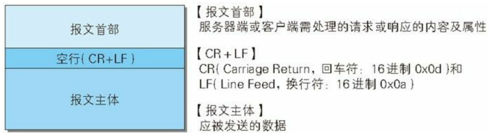
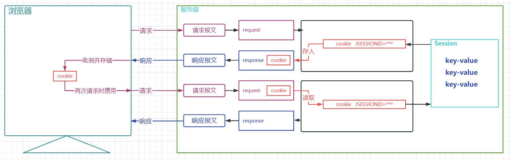
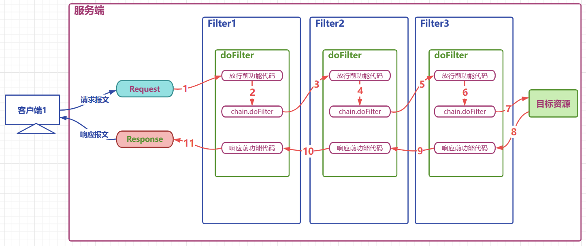

# javaweb

## 一、Tomcat基础

### （一）XML介绍

+ `XML`(`EXtensible Markup Language`)是一种可扩展标记语言，它与`html`一样都是标记语言，因此它们的基本语法都是标签
+ `XML`的语法格式如下:
  1. 文档声明:`<!xml version="1.0" encoding="UTF-8"!>`，该声明**写在`XML`文件的最上面**，且一般为固定格式
  2. 根标签(即除文档声明外最外层的标签)**只能有一个**
  3. 标签可以嵌套但不能交叉嵌套，注释无法嵌套
  4. 开始标签与结束标签**成对出现**，单标签在标签内关闭
  5. 属性必须有值，值需要用单引号或双引号括起来
+ `XML`一般有**两种规范**:
  1. `dtd`:该规范**简单、上手快，但约束没有`schema`细致**
  2. `schema`:该**规范复杂，上手慢，但约束细致**
+ 一般情况下，约束都是框架与`IDE`为我们提供，我们无需手动编写
+ [XML文件示例](../源码/JavaWeb/XML文件配置/jdbc.xml)
+ [idea创建javaweb项目时的xml文件](../源码/JavaWeb/XML文件配置/idea自动生成的xml文件.xml)

---

### （二）常见目录

+ `conf`文件夹用于存放配置`tomcat`的**配置**文件
  + `server.xml`可以**修改`tomcat`的端口号**、查看`servlet`的`HTTP`协议等
  + `tomcat-user.xml`用于存储`tomcat`用户信息，如`tomcat`用户的用户名和密码，以及用户的角色信息
  + `web.xml`用于部署描述符文件，它用来**通过服务器告知浏览器其请求的文档类型**，`tomcat`的`web.xml`文件是所有项目的共享配置文件，它作用于所有部署于`tomcat`的项目
  + `context.xml`:对所有应用的统一配置文件
+ `lib`文件夹用于存放`tomcat`运行时所需的**项目`jar`包**，它可以作用于`webapp`下**所有**的项目
+ `logs`文件夹用于存放`tomcat`运行时的**日志**
+ `temp`文件夹用于存放`tomcat`的**临时文件**
+ `webapp`文件夹用于存放`tomcat`的**项目文件**，其中的**每一个文件夹都是一个项目**，可以直接通过`http://localhost:8080/项目路径`在浏览器上呈现项目中的文件
+ `work`文件夹主要用于存放与`jsp`相关的文件，其运行时生成的文件都放在该文件夹下
+ `LICENSE`:许可证
+ `NOTICE`:说明文件

+ 如果想向进入`tomcat Manager`的界面，需要向`tomcat-user.xml`中添加信息，那么需要添加如下代码:

~~~xml
    <role rolename="admin-gui"/>
    <role rolename="admin-script"/>
    <role rolename="manager-gui"/>
    <role rolename="manager-script"/>
    <role rolename="manager-jmx"/>
    <role rolename="manager-status"/>
    <user 	username="admin" 
        password="admin" 
        roles="admin-gui,admin-script,manager-gui,manager-script,manager-jmx,manager-status"
    />
~~~

---

### （三）项目标准结构

+ `webapp`
  + `static`(非必要目录，名字可更改，一般在此处存放静态资源`css`、`js`、`img`等)
  + **`WEB-INF`**(**受保护的资源目录**，浏览器无法直接访问，必须这样命名)
    + `classes`(必要目录，`src`下的源码和配置文件编译后存放在此，如果项目中没有`java`文件，该目录不会出现)
    + `lib`(必要目录，**项目依赖的`jar`包存放在此**)
    + `web.xml`:`web`项目的**基本配置文件**
  + `index.html`:非必要文件，默认为`index.jsp`

+ 浏览器的**地址栏**中的各个项与**项目资源**的对应关系如下图所示:

+ 注意:
> 1. `web`项目的标准结构指的是`webApp`的标准结构，而不是`web工程`的标准结构，**`web工程`经过构建才会生成`webApp`**

---

### （四）项目部署

1. 可以将编译好的项目直接放在`tomcat`的`webapp`文件夹下，或将编译好的项目`war`包放在`webapp`文件夹下
2. 将项目放在非`tomcat`的`webapp`目录下，并通过配置文件来告知`tomcat`该项目的地址
   1. 先在磁盘的目录上定义一个`webapp`目录
   2. 在`tomcat`的`conf`下创建`Catalina/localhost`目录,并在该目录下准备一个`app.xml`文件
   3. 在`app.xml`文件中写入如下语句
   ~~~xml
      <!-- 
      path: 项目的访问路径,也是项目的上下文路径,就是在浏览器中,输入的项目名称
      docBase: 项目在磁盘中的实际路径
      -->
      <Context path="/app" docBase="D:\mywebapps\app" />
   ~~~
   4. 使用该方法部署时，`xml`文件的名称、`path`的路径和`docBase`的最后一层路径必须相同

---

### （五）idea关联tomcat

1. 添加`tomcat`关联:`设置(settings) -> 构建、执行、部署(Build,Execution,Deployment) -> 应用程序服务器(Application Servers) -> 点击加号+ -> Tomcat服务器 ->选择本地tomcat根目录 -> Apply`
2. 添加`tomcat`依赖:`右击模块 -> 打开模块设置(Project Structure) -> 项目设置(Modules) -> 选择模块 -> 依赖(Dependencies) -> 点击加号 -> 库(Library) -> 选择对应tomcat -> Apply`
3. 添加`web Application`框架:`右击模块 -> 添加框架支持(Add Framework Support) -> Java EE -> 勾选Web Application -> Apply`(必须先完成第二步再进行第三步，因为不给模块添加支持，`idea`默认添加的`web`约束`version`为`4`,但是**高版本的`tomcat`需要更高的级别**，只有在添加依赖后，`idea`才会增加框架支持的`version`)
4. 编辑`tomcat`配置:`点击老UI界面的运行小按钮的左侧 -> 编辑配置(Edit Configurations) -> 点击加号 -> 选择tomcat 本地(Local) -> 在应用程序服务器(Application Server)选择tomcat的版本 -> 在 打开浏览器(Open Browser)下选择默认使用什么浏览器打开 -> 点开部署(deployment) -> 点击加号 -> 选择工件(Artifacts) -> 选择tomcat要启动的工件 -> 在下面的 应用程序上下文(Application Context)编辑浏览器打开该项目应该使用什么路径`

+ 注意:
> 1. `上下文路径`:浏览器的地址栏中，在端口的后面最终呈现的路径，**该路径可以与部署的`webapp`名称不一致**
> 2. 使用`idea`编辑时，实际上在编辑`web项目`，`web项目`经过**构建**后才会生成`webapp`，在不执行构建时直接运行`tomcat`打开项目，其会首先进行构建,再进行项目的部署,再打开
> 3. 在`idea`中，按照`构建(Build) -> 构建工件 -> 选择要构建的模块 -> 构建`来生成指定模块的`webapp`
> 4. 在`resources`和`src`中的配置文件和`java`代码**编译后最终会存放到`WEB-INF`的`classes`目录下**
> 5. `tomcat`运行时，其在启动过程中打印的`Tomcat Catalina 日志`中可能会乱码，需要在`tomcat根目录 -> conf ->logging.properties`中修改编码为`GBK`或`UTF-8`

---

### （六）idea运行javaweb的原理

1. 根据项目构建`webapp`
2. 对本地的`tomcat`文件进行复制，并生成一个`tomcat副本`，该副本仅包含了当前项目的配置信息，它使得本地的`tomcat`依据副本的配置信息运行，从而保证了本地`tomcat`的纯洁性，同时也不会使副本过大，占用大量磁盘空间(一般副本都存储在`C`盘，这一路径在使用`idea`打开`tomcat`运行时其打印的日志中可以看出)
3. 部署`webapp`并运行

---

## 二、HTTP

### （一）简介

+ 历史沿革:
  + `HTTP`协议于`1989`年被**创建**，在`1991`年被命名为`HTTP/0.9`
  + `1996`年，`HTTP/1.0`发布，它显著扩大了`HTTP/0.9`的规范，同时增加了一些新的支持，但它并**不是官方标准**
  + `1997`年初，第一个标准化版本`HTTP/1.1`发布，它添加了对**缓存和持久连接(长连接)a**等机制的支持，在之后的`15`年之间，该协议都非常稳定，在此期间，出现了`HTTPS`协议，直到现在，这两个协议依旧是互联网之间的**主要组成部分**
  + `HTTP/2`和`HTTP/3`分别于`2015`年和`2021`年发布，由于其比较新，它的使用范围不是很广，目前`chorme`、`firefox`、`edge`、`opera`和一些移动端浏览器支持这些协议
+ `tomcat10`使用的是`HTTP/1.1`，这可以在它的`conf`文件夹下的`sever.xml`文件中的`Connector`标签中看到
+ `HTTP`协议为我们提供了两个东西:
  1. 客户端与服务器端**交互的方式**
  2. 客户端与服务器端**交互数据的格式**

### （二）交互的方式

+ 交互方式分为两种:
  1. 客户端向服务器端发送**请求**
  2. 服务器端**响应**客户端，向客户端返回数据
+ 长连接:
  + `HTTP`是一种**应用层协议**，其默认以`TCP`协议传输，而`TCP`**传输层协议**通过`IP`**网络层协议**来确定网络通信实体
  + 客户端与服务器端每次进行交互，都要进行四个步骤:建立连接、发送请求、响应请求、关闭连接
  + 浏览器与WEB服务器的连接过程是**短暂**的，每次连接**只处理一个请求和响应**。对每一个页面的访问，浏览器与WEB服务器都要建立一次单独的连接
  + 在客户端解析返回的包时，它发现包里面也引用了地址(如`html`通过`link`标签引入`css`,通过`script`标签引入`js`等)，它就要再次向客户端进行交互
  + 发送请求后再次建立连接，但每次连接都仅返回一个包，因此**在引入外部文件过多的情况下，短连接对`TCP`协议非常不友好**
  + 长连接可以在建立连接后**一直保持连接状态**，并在浏览器拿到当前请求对应的**全部资源**后再关闭连接,这提高了传输效率
+ 缓存:
  + 浏览器得到请求的数据后，不会使用过后就进行删除，而是暂时存放在客户端，在用户打开一个新的页面时，浏览器会**首先检查自己手里有没有一些对应的资源**，如果有就不再向服务器端申请，这样就**减少了带宽压力，同时提高了浏览器加载效率**
+ 注意:
> 1. **长连接**和**缓存**都是`HTTP/1.1`新增的支持

---

### （三）交互数据的格式

+ 报文分为首部和主体，中间用空行隔开

+ 报文部首可继续细分为“头”和“尾”

---

#### ①请求报文格式

+ 请求报文的格式分为:
  + 请求首行(**请求行**):大体格式`GET/POST 资源路径?参数 HTTP/1.1`
  + 请求头信息(请求头):格式为`键:值`
  + 空行
  + 请求体(`post`请求才有请求体)
+ 可以通过浏览器的开发者工具的`网络`查看请求数据的信息，需要在`网络`选项内找到一个文件，然后在`请求标头`内勾选原始(`edge`中想查看原始要禁用缓存)查看请求报文的数据信息
+ 查看`post`请求的请求体时，需要**确保表单格式正确**(如`name`属性齐全、`method`属性为`post`等)，然后在网络内找到提交的数据文件，点击`负载`，再点击`查看源`即可查看`post`请求的原始数据格式

+ 请求行组成部分
  + 请求方式  `GET`
  + `访问服务器的资源路径?参数1=值1&参数2=值2 ... ...`
  + 协议及版本 `HTTP/1.1`
+ 常见的请求头属性:

~~~http
Host: localhost:8080    // 当前的端口号
Connection: keep-alive  // 用户使用的是连接类型，keep-alive为长连接
Content-Length: 31     -请求体内容的长度
Cache-Control: max-age=0  -无缓存
Origin: http://localhost:8080  // 源路径
Upgrade-Insecure-Requests: 1  // 协议的自动升级
Content-Type: application/x-www-form-urlencoded   // 请求体内容类型（服务器根据类型解析请求体参数）
User-Agent: Mozilla/5.0 (Windows NT 6.1; WOW64) AppleWebKit/537.36 (KHTML, like Gecko) Chrome/68.0.3440.75 Safari/537.36  // 浏览器的基本信息
Accept:text/html,application/xhtml+xml,application/xml;q=0.9,image/webp,image/apng,*/*;q=0.8  // 支持接收的文件类型
Referer: http://localhost:8080/05_web_tomcat/login.html  // 上一次访问的网页
Accept-Encoding: gzip, deflate, br  // 响应是否进行压缩
Accept-Language: zh-CN,zh;q=0.9,en-US;q=0.8,en;q=0.7  // 支持的语言
Cookie:JSESSIONID-
~~~

+ 使用`form`表单进行`get`请求时:
  + 由于请求参数在请求首行中已经携带了，所以没有请求体，也没有请求空行
  + 请求参数拼接在`url`地址中，地址栏可见`url?name1=value1&name2=value2...`，**不安全**
  + 由于参数在地址栏中携带，所以大小受到限制，地址栏数据大小一般限制为`4k`，**只能携带纯文本**
  + `get`请求参数只能上传文本数据
  + 没有请求体。所以**封装和解析都快，效率高**， 浏览器默认提交的请求都是`get`请求比如：地址栏输入**回车**,**超链接**,**表单**默认的提交方式
+ 使用`form`表单进行`post`请求时:
  + `post`请求有请求体，其数据在请求体中携带，请求体数据**大小没有限制，可以用来上传所有内容**
  + 只能使用`post`请求上传文件
  + `post`请求报文多了和请求体相关的配置
  + 地址栏参数不可见，相对安全
  + 效率比`get`低

---

#### ②响应报文格式

+ 请求报文的格式分为:
  + 响应首行(**请求行**):大体格式`协议/版本 状态码 状态码描述`
  + 响应头信息(请求头)
  + 空行
  + 响应体

+ 响应行组成部分
  + 协议及版本:`HTTP/1.1`
  + 响应状态码:`200`
  + 状态描述:`OK`(高版本`tomcat`忽略了此参数)

+ 常用的响应头属性:

~~~http
Server: Apache-Coyote/1.1   服务器的版本信息
Accept-Ranges: bytes
ETag: W/"157-1534126125811"
Last-Modified: Mon, 13 Aug 2018 02:08:45 GMT
Content-Type: text/html    响应体数据的类型(浏览器根据类型解析响应体数据)
Content-Length: 157   响应体内容的字节数(方便客户端进行校验)
Date: Mon, 13 Aug 2018 02:47:57 GMT  响应的时间，这可能会有8小时的时区差
~~~

---

### （四）响应状态码

+ 响应状态码用来告知浏览器响应的结果
+ 常见的状态码如下:
  + `200`:请求成功，浏览器会把响应体内容（通常是`html`）显示在浏览器中
  + `302`:重定向，当响应码为`302`时，表示服务器要求浏览器重新再发一个请求，服务器会发送一个响应头`Location`指定新请求的`URL`地址
  + `304`:使用了本地缓存
  + `404`:请求的资源没有找到，说明客户端错误的请求了不存在的资源
  + `405`:请求的方式不允许
  + `500`:请求资源找到了，但服务器内部出现了错误

|状态码|状态码英文描述|中文含义|
|:---|:---:|:-----------------------------------------------------------|
|1**|||
|`100`|`Continue`|继续。客户端应继续其请求|
|`101`|`Switching Protocols`|切换协议。服务器根据客户端的请求切换协议。只能切换到更高级的协议，例如，切换到HTTP的新版本协议|
|2**|||
|**`200`**|`OK`|请求成功。一般用于GET与POST请求|
|`201`|`Created`|已创建。成功请求并创建了新的资源|
|`202`|`Accepted`|已接受。已经接受请求，但未处理完成|
|`203`|`Non-Authoritative Information`|非授权信息。请求成功。但返回的meta信息不在原始的服务器，而是一个副本|
|`204`|`No Content`|无内容。服务器成功处理，但未返回内容。在未更新网页的情况下，可确保浏览器继续显示当前文档|
|`205`|`Reset Content`|重置内容。服务器处理成功，用户终端（例如：浏览器）应重置文档视图。可通过此返回码清除浏览器的表单域|
|`206`|`Partial Content`|部分内容。服务器成功处理了部分GET请求|
|3**|||
|`300`|`Multiple Choices`|多种选择。请求的资源可包括多个位置，相应可返回一个资源特征与地址的列表用于用户终端（例如：浏览器）选择|
|`301`|`Moved Permanently`|永久移动。请求的资源已被永久的移动到新URI，返回信息会包括新的URI，浏览器会自动定向到新URI。今后任何新的请求都应使用新的URI代替|
|**`302`**|`Found`|临时移动。与301类似。但资源只是临时被移动。客户端应继续使用原有URI|
|`303`|`See Other`|查看其它地址。与301类似。使用GET和POST请求查看|
|**`304`**|`Not Modified`|未修改。所请求的资源未修改，服务器返回此状态码时，不会返回任何资源。客户端通常会缓存访问过的资源，通过提供一个头信息指出客户端希望只返回在指定日期之后修改的资源 |
|`305`|`Use Proxy`|使用代理。所请求的资源必须通过代理访问|
|`306`|`Unused`|已经被废弃的HTTP状态码|
|`307`|`Temporary Redirect`|临时重定向。与302类似。使用GET请求重定向|
|4**|||
|`400`|`Bad Request`|客户端请求的语法错误，服务器无法理解|
|`401`|`Unauthorized`|请求要求用户的身份认证|
|`402`|`Payment Required`|保留，将来使用|
|`403`|`Forbidden`|服务器理解请求客户端的请求，但是拒绝执行此请求|
|**`404`**|`Not Found`|服务器无法根据客户端的请求找到资源（网页）。通过此代码，网站设计人员可设置"您所请求的资源无法找到"的个性页面|
|**`405`**|`Method Not Allowed`|客户端请求中的方法被禁止|
|`406`|`Not Acceptable`|服务器无法根据客户端请求的内容特性完成请求|
|`407`|`Proxy Authentication Required`|请求要求代理的身份认证，与401类似，但请求者应当使用代理进行授权|
|`408`|`Request Time-out`|服务器等待客户端发送的请求时间过长，超时|
|`409`|`Conflict`|服务器完成客户端的 PUT 请求时可能返回此代码，服务器处理请求时发生了冲突|
|`410`|`Gone`|客户端请求的资源已经不存在。410不同于404，如果资源以前有现在被永久删除了可使用410代码，网站设计人员可通过301代码指定资源的新位置|
|`411`|`Length Required`|服务器无法处理客户端发送的不带Content-Length的请求信息|
|`412`|`Precondition Failed`|客户端请求信息的先决条件错误|
|`413`|`Request Entity Too Large`|由于请求的实体过大，服务器无法处理，因此拒绝请求。为防止客户端的连续请求，服务器可能会关闭连接。如果只是服务器暂时无法处理，则会包含一个Retry-After的响应信息|
|`414`|`Request-URI Too Large`|请求的URI过长（URI通常为网址），服务器无法处理|
|`415`|`Unsupported Media Type`|服务器无法处理请求附带的媒体格式|
|`416`|`Requested range not satisfiable`|客户端请求的范围无效|
|`417`|`Expectation Failed`|服务器无法满足Expect的请求头信息|
|5**|||
|**`500`**|`Internal Server Error`|服务器内部错误，无法完成请求|
|`501`|`Not Implemented`|服务器不支持请求的功能，无法完成请求|
|`502`|`Bad Gateway`|作为网关或者代理工作的服务器尝试执行请求时，从远程服务器接收到了一个无效的响应|
|`503`|`Service Unavailable`|由于超载或系统维护，服务器暂时的无法处理客户端的请求。延时的长度可包含在服务器的Retry-After头信息中|
|`504`|`Gateway Time-out`|充当网关或代理的服务器，未及时从远端服务器获取请求|
|`505`|`HTTP Version not supported`|服务器不支持请求的HTTP协议的版本，无法完成处理|

---

## 三、Servlet

### （一）简介

1. 静态资源:无需在程序运行时通过代码生成的资源，即**在程序运行前就已经被写好的资源**，如:`js`、`css`、`html`、`img`等
2. 动态资源:需要在程序运行时通过代码运行生成的资源,**在程序运行之前无法确定的数据**,运行时动态生成,例如`Servlet`,`Thymeleaf`,...
3. `Servlet`的功能与作用:
> + `Servlet`是运行在服务端(`tomcat`)的`Java`小程序，是`sun`公司提供一套**定义动态资源规范**; 从代码层面上来讲`Servlet`就是一个**接口**
> + `Servlet`用来**接收并处理客户端请求、响应给浏览器的动态资源**，在整个`webapp`中，`Servlet`主要**负责接收和处理请求、协同调度功能及响应数据**，因此，我们可以认为`Servlet`是`Web`应用中的**控制器**
> + `Servlet`是运行在服务器端的，因此`Servlet`必须在`tomcat`这样的服务器容器中运行
4. 我们可以在`Java`代码中定义一个实现了`Servlet`接口的类，并在该类中重写`service(HttpServletRequest request,HttpServletResponse response)`方法，该方法:
   1. 从`request`对象中获**取请求的所有信息**
   2. 根据参数处理请求，生成要响应给客户端的数据
   3. 将响应的数据**放入`response`对象中**
   4. 该方法最终**被`tomcat`调用**

+ `Servlet`处理请求流程如下:
  1. 客户端向服务器端请求
  2. `tomcat`受到请求后，将请求的报文信息转换为一个`HttpServletRequest`对象，**该对象中包含了请求中的所有信息**
  3. `tomcat`也会同时创建一个`HttpServletResponse`对象，该对象用于**承载要响应给客户端的信息**，在后面，该对象**会被转换为响应报文响应给客户端**
  4. `tomcat`根据请求中的资源路径找到对应的`Servlet`,将`Servlet`实例化，调用其中的`service`方法，同时将`HttpServletRequest`对象和`HttpServletResponse`对象传入，经过方法处理后，将`HttpServletResponse`对象转换为响应报文传给客户端

---

### （二）开发流程

+ `Servlet`开发流程:
  1. 创建`JavaWeb`项目，同时将`tomcat`添加为项目依赖
  2. 重写`service`方法，该方法是`protected`的
  3. 在`service`方法中，写入业务处理代码
  4. 在`web.xml`文件中，配置`servlet`对应的请求映射路径

+ `web.xml`的配置代码如下:

~~~xml
  <servlet>
      <!--给UserServlet起一个别名-->
      <servlet-name>userServlet</servlet-name>
      <!-- 告诉tomcat在这个要实例化的servlet类在哪里 -->
      <servlet-class>com.atguigu.servlet.UserServlet</servlet-class>
  </servlet>

  <!-- 
    servlet-name可以对应多个url-pattern，但一个url-pattern仅能对应一个servlet-name
    一个servlet可以对应多个servlet-mapping
   -->

  <servlet-mapping>
      <!--关联别名和映射路径-->
      <servlet-name>userServlet</servlet-name>
      <!--可以为一个Servlet匹配多个不同的映射路径,但是不同的Servlet不能使用相同的url-pattern-->
      <url-pattern>/userServlet</url-pattern>
     <!-- <url-pattern>/userServlet2</url-pattern>-->
      <!--
          *        *在哪里，哪里就模糊，即可以匹配任意路径，但是*不是写在哪里都可以
          /        表示通配所有资源,不包括jsp文件
          /*       表示通配所有资源,包括jsp文件
          /a/*     精确匹配前缀a,模糊匹配后缀
          *.action 精确匹配后缀.action,模糊匹配前缀
      -->
     <!-- <url-pattern>/*</url-pattern>-->
  </servlet-mapping>
~~~

---

### （三）servlet_jar包与Content-Type

1. `servlet`的`jar`包**在`tomcat`被`idea`关联时**便已经被携带过去，不需要再在`lib`文件夹下进行导入
> + 在添加项目依赖时，加入的`tomcat`依赖默认的`作用域(scope)`为`已提供(provided)`，它的意思是**仅在编码时添加该依赖，而在构建和运行时不添加**
> + 因此`servlet`的`jar`包仅在进行编码的时候被需要，在构建、运行的环境下由`tomcat`提供，因为`tomcat`的`lib`文件夹下的所有`jar`包都可以被其部署的项目所共享
> + 因此我们的`javaweb`项目在构建时，**无需自主携带`servlet`的`jar`包**
2. 响应头中的`Content-Type`应该在后端处理时被设置，以告知浏览器后端响应回来的是什么格式的文件/数据
> + `Content-Type`用来告知浏览器响应回来的数据与文件是什么格式的
> + 可以使用`setsetHeader`或`setContentType`方法来设置响应头的`Content-Type`值
> + 在`tomcat`中的`conf`文件夹下的`web.xml`详细描述了指定文件对应的`Content-Type`值

---

### （四）生命周期

|生命周期|对应方法|执行时机|执行次数|
|:---:|:---:|:---:|:---:|
|构造对象|构造器|第一次请求或容器启动|`1`|
|初始化|`init()`(无参)|构造完毕后|`1`|
|处理服务|`service(HttpServletRequest req,HttpServletResponse resp)`|每次请求时|多次|
|销毁|`destroy()`|容器关闭|`1`|

+ `Servlet`在`tomcat`中是单例的,这就意味着
  + `Servlet`的成员变量在多个线程栈之中是共享的，在**并发**处理时，服务器处理**多个客户端请求**都会使用到这些成员变量
  + 因此，不建议在`service`方法中修改成员变量，因为这可能会导致**线程安全问题**
+ 如果我们想**在`tomcat`启动时就进行`Servlet`的构造**:
  + 我们需要为该`Servlet`的注解设置`loadOnStartup`,或在项目的`web.xml`内的`servlet`标签内添加`load-on-startup`标签，并设置值为一个**正值**
  + `tomcat`中已经有一些默认的`java`类**占用了一部分`load-on-startup`值**，这些类可以**在`conf`文件夹内的`web.xml`文件被查看到**
+ `Default Servlet`是一个`tomcat`在**启动时就进行构造**的`Servlet`，它的作用机理是:
  1. 浏览器向服务器端发送请求
  2. 服务器端受到请求，并**首先查看是否有项目内的`Servlet`对应该请求的路径**
  3. **没有找到**相对应的`Servlet`,使用`Default Servlet`进行处理
  4. `Default Servlet`根据浏览器的请求寻找服务器内的数据或文件，找到后**通过`IO`流放到`HTTPServletResponse`对象身上**
  5. `tomcat`处理`HTTPServletResponse`对象，将其转化为响应报文，返回给浏览器
+ 因此，浏览器请求的**所有静态资源**都是由`Default Servlet`进行处理的

---

### （五）注解配置

+ 使用`WebServlet`注解可以**简洁**的配置`Servlet`对应的请求映射路径

|属性名|描述|属性值|对应`xml`标签|备注|
|:---:|:---:|:---:|:---:|:---:|
|`name`|当前的类的别名|字符串|`servlet-name`|无|
|`value`|`urlPatterns`的别名，二者互相影响，用来指定对应`Servlet`类对应的请求映射路径|字符串或`{"xxx","yyy"}`型的数组|`url-pattern`|注解中仅写有单个路径的前提下，可以只写属性值，不写属性名|
|`urlPatterns`|`value`的别名，用来指定对应`Servlet`类对应的请求映射路径|^|^|^|
|`loadOnStartup`|设置该类在`tomcat`启动时的构建优先级|传入数值,`tomcat`会**依据此数值判断是否在容器启动时进行类的实例化，并根据数值协调各个类之间的实例顺序**，`1`为第一个，`2`为第二个...默认值为`-1`，表示**不在容器启动时进行构建**|`load-on-startup`(写在`servlet`标签内)|数值设置一致导致冲突时，`tomcat`会**自动协调**|
|`initParams`|为当前`Servlet`配置`ServletConfig`初始化参数|`initParams={@WebInitParam(name="xxxx",value="xxxx",description(可选)="xxxx"),@WebInitParam(...)}`|`init-param`:写在`servlet`标签内 `param-name`:设置键,写在`init-param`内 `param-value`:设置值,写在`init-param`内. 一个`init-param`**仅允许包含一对键值对**|`initParams`所需的数组内的参数**实际上也是一个类型注解**|

---

### （六）继承结构

#### ①Servlet接口

+ `Servlet`接口是进行规范的接口，所有`Servlet`都必须实现该接口

|方法|参数|描述|备注|
|:---:|:---:|:---:|:---:|
|`public void init(ServletConfig config) throws ServletException`|`ServletConfig`对象，该对象可以为`Servlet`**提供初始化参数**|初始化方法,容器在构造`servlet`对象后,会自动调用该方法|无|
|`public ServletConfig getServletConfig()`|无参数|获取`ServletConfig`对象|无|
|`public void service(ServletRequest req, ServletResponse res) throws ServletException, IOException`|**承载请求信息**的`ServletRequest`对象和**承载响应信息**的`ServletResponse`对象|处理请求并做出响应的服务方法,由容器调用|无|
|`public String getServletInfo()`|无参数|获取`ServletInfo`信息|无|
|`public void destroy()`|无参数|`Servlet`在回收前，由容器调用该方法，一般用于资源的释放工作|无|

---

#### ②GenericServlet类

+ `GenericServlet`是一个抽象类，它实现了`Servlet`接口
+ `GenericServlet`类是对`Servlet`接口一些固定功能的粗糙实现，以及对`Service`方法的再次抽象声明，它**侧重于对除了`service`方法的基础处理**

|方法/属性|参数|描述|备注|
|:---:|:---:|:---:|:---:|
|`private transient ServletConfig config`|无参数|初始化配置对象作为**属性**|无|
|`public GenericServlet() { }`|无参数|构造器，为满足继承而准备|无|
|`public void destroy() { }`|无参数|销毁方法的平庸实现|无|
|`public String getInitParameter(String name)`|`name`:客户端向服务器端传入的属性名|获取初始参数的快捷方法|无|
|`public Enumeration getInitParameterNames()`|无参数|返回所有初始化参数名的方法|无|
|`public ServletConfig getServletConfig()`|无参数|获取初始`Servlet`初始配置对象`ServletConfig`的方法|无|
|`public ServletContext getServletContext()`|无参数|获取上下文对象`ServletContext`的方法|无|
|`public String getServletInfo()`|无参数|获取`Servlet`信息的平庸实现|无|
|`public void init(ServletConfig config) throws ServletException()`|`config`:提供初始化参数的对象|初始化方法的实现,并在此调用了`init`的重载方法|无|
|`public void init() throws ServletException`|无参数|重载`init`方法,**为了让我们自己定义初始化功能的方法**|无|
|`public void log(String msg)`|`msg`:日志对象|打印日志的方法|无|
|`public void log(String message, Throwable t)`|`msg`:日志对象 `t`:不知道干嘛的|打印日志的方法和重载|无|
|`public abstract void service(ServletRequest req, ServletResponse res) throws ServletException, IOException`|参数与`Servlet`接口参数相同|服务方法再次声明|无|
|`public String getServletName()`|无参数|获取`ServletName`的方法|无|

---

#### ③HTTPServlet类

+ `HTTPServlet`抽象类继承了`GenericServlet`类,它主要侧重于实现了`service`方法，同时增加了更多的基础功能
+ `HTTPServlet`定义了一些常见的表示请求方式名的常量值

~~~java
private static final String METHOD_DELETE = "DELETE";
private static final String METHOD_HEAD = "HEAD";
private static final String METHOD_GET = "GET";
private static final String METHOD_OPTIONS = "OPTIONS";
private static final String METHOD_POST = "POST";
private static final String METHOD_PUT = "PUT";
private static final String METHOD_TRACE = "TRACE";
~~~

|方法/属性|参数|描述|备注|
|:---:|:---:|:---:|:---:|
|`public HttpServlet() {}`|无参数|构造器，用于处理继承|无|
|`public void service(ServletRequest req, ServletResponse res) throws ServletException, IOException`|与上面的`service`方法参数相同|在此方法中，`req`和`res`被向下转型为`HTTPServletRequest`对象和`HTTPServletResponse`对象，同时调用重载的`service`方法|无|
|`public void service(HttpServletRequest req, HttpServletResponse res) throws ServletException, IOException`|向下转型后的`req`和`res`对象|重载的`service`方法,**被重写的`service`方法所调用**，在该方法中对请求进行了处理，并**根据请求调用了`doxxx`方法**|无|

~~~java
  protected void doGet(HttpServletRequest req, HttpServletResponse resp) throws ServletException, IOException
  protected void doPost(HttpServletRequest req, HttpServletResponse resp) throws ServletException, IOException
  protected void doHead(HttpServletRequest req, HttpServletResponse resp) throws ServletException, IOException
  protected void doPut(HttpServletRequest req, HttpServletResponse resp) throws ServletException, IOException
  protected void doDelete(HttpServletRequest req, HttpServletResponse resp) throws ServletException, IOException
  protected void doOptions(HttpServletRequest req, HttpServletResponse resp) throws ServletException, IOException
  protected void doTrace(HttpServletRequest req, HttpServletResponse resp) throws ServletException, IOException
  /* 
     这些doxxx方法都是根据不同的请求方式而被service方法所调用的不同的doxxx方法
     除了doOptions和doTrace方法,其他的do*** 方法都在故意响应错误信息
  */
~~~

+ 部分程序员不推荐重写`service`方法，而是推荐重写其调用的`doxxx`方法来进行请求处理
+ 因为他们认为**重写`service`方法会使得`HTTPServlet`中的`service`方法的一些操作失效**而影响一些事情
+ 但目前重写`service`方法是没有问题的，`HTTPServlet`的`service`方法目前还不至于影响到项目的正常运行

---

#### ④ServletConfig

+ `ServletConfig`接口用来承载项目中的初始化参数

|方法|参数|描述|备注|
|:---:|:---:|:---:|:---:|
|`String getServletName()`|无参数|获取`<servlet-name>HelloServlet</servlet-name>`定义的`Servlet`名称|无|
|`ServletContext getServletContext();`|无参数|获取`ServletContext`对象|无|
|`String getInitParameter(String var1)`|`var1`:键的值|获取传入的键对应的值|无|
|`Enumeration<String> getInitParameterNames()`|无参数|获取所有初始化参数名组成的`Enumeration`对象|`Enumeration`:`Java`早期的迭代器|

|`Enumeration`迭代器方法|参数|描述|备注|
|:---:|:---:|:---:|:---:|
|`boolean hasMoreElements()`|无参数|判断游标指针的下一个键是否存在|无|
|`E nextElement()`|无参数|得到游标指针的下一个键值，同时游标指针下移一位|无|

+ 可以通过如下方式为`ServletConfig`对象传递参数:

~~~xml
  <servlet>
    <servlet-name>Servlet1</servlet-name>
    <servlet-class>com.myServlet.Demo.Servlet1</servlet-class>
    <!--
        使用init-param标签、param-name标签和param-value标签以向指定Servlet传递ServletConfig的初始化参数
        一个init-param仅能包含一对键值对
    -->
    <init-param>
        <!-- 设置键 -->
        <param-name>keyA</param-name>
        <!-- 设置值 -->
        <param-value>valueA</param-value>
    </init-param>
~~~

+ `tomcat`在运行时，会自动读取项目内的`web.xml`文件的配置信息，并**将里面设置的初始化参数转换为`ServletConfig`对象**
+ 在调用`init`方法时，会将`ServletConfig`对象传入，**该`init`方法是`GenericServlet`中的，并不是我们自定义要重写的，我们重写的是无参的`init`方法**

---

#### ⑤ServletContext

##### Ⅰ全体配置

+ `ServletContext`中的参数会**被全部项目所共享**，因此，`ServletContext`可以**为所有的`Servlet`提供初始配置参数**,但每个项目得到的`ServletContext`对象都是**独立且唯一**的

+ 可以在项目的`web.xml`文件中写如下标签来配置`ServletContext`:

~~~xml
  <?xml version="1.0" encoding="UTF-8"?>
  <web-app xmlns="https://jakarta.ee/xml/ns/jakartaee"
          xmlns:xsi="http://www.w3.org/2001/XMLSchema-instance"
          xsi:schemaLocation="https://jakarta.ee/xml/ns/jakartaee https://jakarta.ee/xml/ns/jakartaee/web-app_5_0.xsd"
          version="5.0">

      <context-param>
          <param-name>paramA</param-name>
          <param-value>valueA</param-value>
      </context-param>
      <context-param>
          <param-name>paramB</param-name>
          <param-value>valueB</param-value>
      </context-param>
  </web-app>
~~~

---

##### Ⅱ项目路径

|方法|参数|描述|备注|
|:---:|:---:|:---:|:---:|
|`String getContextPath()`|无参数|获取项目的上下文路径|无|
|`String getRealPath(String var1)`|`var1`:项目目录下的对应目录或文件名|获取`webapp`项目目录下的指定目录,文件等的路径|**是`webapp`而不是`web工程`**|

---

#### ⑥HttpServletRequest接口

+ `HttpServletRequest`接口继承了`ServletRequest`接口,它代表客户端发来的请求,**所有请求中的信息都可以通过该对象获得**
+ `HttpServletRequest`在`tomcat`接收到客户端请求时被**自动创建**，并**被传入到`service`方法中**

+ 获取请求行信息相关(方式,请求的url,协议及版本)

|分类|API|参数|功能解释|备注|
|:---:|:---:|:---:|:---:|:---:|
|请求参数相关方法|`String getParameter(String parameterName)`|`parameterName`:属性的键的名称|根据请求参数名获取请求单个参数值|该方法**专门用于获取键值对格式的参数**，无论该方法是否在`url`后还是请求体内.如果未得到任何数据，会返回`null`|
|^|`String[] getParameterValues(String parameterName)`|^|根据请求参数名获取请求多个参数值数组|^|
|^|`Enumeration<String> getParameterNames()`|无参数|获取所有请求参数名|^|
|^|`Map<String, String[]> getParameterMap()`|^|获取所有请求参数的键值对集合|^|
|^|`BufferedReader getReader() throws IOException`|^|获取读取请求体的字符输入流|^|
|^|`ServletInputStream getInputStream() throws IOException`|^|获取读取请求体的字节输入流|无|
|请求行相关方法|`StringBuffer getRequestURL()`|无参数|获取客户端请求的`url`|无|
|^|`String getRequestURI()`|^|获取客户端请求项目中的具体资源|无|
|^|`int getServerPort()`|^|获取客户端发送请求时的端口|无|
|^|`int getLocalPort()`|^|获取本应用在所在容器的端口|无|
|^|`int getRemotePort()`|^|获取客户端程序的端口|无|
|^|`String getScheme()`|^|获取请求协议|无|
|^|`String getProtocol()`|^|获取请求协议及版本号|无|
|^|`String getMethod()`|^|获取请求方式|无|
|^|`Cookie[] getCookies()`|^|获取请求中的所有`cookie`|没有`cookie`时，返回`null`|
|^|`HttpSession getSession()`|^|获取`Session`对象|无|
|请求头相关方法|`String getHeader(String headerName)`|`headerName`:请求头内的键的名称|根据头名称获取请求头|无|
|^|`Enumeration<String> getHeaderNames()`|无参数|获取所有的请求头名字|无|
|^|`String getContentType()`|^|获取`content-type`请求头|无|
|^|`int getContentLength()`|^|获得请求体长度的字节数|无|
|请求体相关方法|`void setCharacterEncoding(String encoding)`|`encoding`:解码方式|设置对请求体的解码方式|该方法可以**解决`post`请求乱码问题**|
|内部方法|`String getServletPath()`|无参数|获取请求的`Servlet`的映射路径|无|
|^|`ServletContext getServletContext()`|^|获取`ServletContext`对象|无|
|^|`RequestDispatcher getRequestDispatcher(String var1)`|`var1`:要转发到的资源路径|获得请求转发器|无|

---

#### ⑦HttpServletResponse接口

+ `HttpServletResponse`接口继承了`ServletResponse`接口代,它**代表对客户端的响应**,该对象会被转换成响应的报文发送给客户端,通过该对象我们可以**设置响应信息**
+ `HttpServletResponse`在`tomcat`接收到客户端请求时被**自动创建**，并**被传入到`service`方法中**

+ 设置响应行相关

|分类|API|参数|功能解释|备注|
|:---:|:---:|:---:|:---:|:---:|
|响应行相关方法|`void setStatus(int code)`|`code`:状态码|设置[响应状态码](#Status)|无|
|响应头相关方法|`void setHeader(String headerName,String headerValue)`|`headerName`:响应头的属性名 `headerValue`:响应头的属性值|设置/修改响应头键值对|无|
|^|`void setContentType(String contentType)`|`contentType`:字符集|设置`content-type`响应头及响应字符集(设置`MIME`类型)|无|
|响应体相关方法|`PrintWriter getWriter() throws IOException`|无参数|获得向响应体放入信息的字符输出流|无|
|^|`ServletOutputStream getOutputStream() throws IOException`|^|获得向响应体放入信息的字节输出流|无|
|^|`void setContentLength(int length)`|`length`:响应体数据的字节长度|设置响应体的字节长度,其实就是在设置`content-length`响应头|无|
|^|`void setCharacterEncoding(String encoding)`|`encoding`:响应体字符集|设置响应体字符集|无|
|^|`void addCookie(Cookie cookie)`|`cookie`要增加的`cookie`对象|向响应体中增加`cookie`|无|
|内部方法|`void sendError(int code, String message) throws IOException`|`code`:响应码 `message`:相应信息|向客户端响应错误信息的方法,需要指定响应码和响应信息|无|

---

### （七）请求转发

+ 请求转发可以通过`getRequestDispatcher`方法和`forward`方法实现
+ 请求转发的特点:
> 1. 请求转发通过`HttpServletRequest`对象获取请求转发器实现
> 2. 请求转发是服务器内部的行为,对客户端是屏蔽的，因此**客户端的地址栏不会变**
> 3. 客户端**只发送了一次请求**,所以服务端**只产生了一对请求和响应对象**,这一对请求和响应对象会**继续传递给下一个资源**
> 5. 因为全程只有一个`HttpServletRequset`对象,所以**请求参数可以传递,请求域中的数据也可以传递**
> 6. 请求转发**可以转发给其他`Servlet`动态资源,也可以转发给一些静态资源**以实现页面跳转
> 7. 请求转发**可以转发给`WEB-INF`下受保护的资源**
> 8. 请求转发**不能**转发到本项目以外的外部资源

|相关方法|参数|功能解释|备注|
|:---:|:---:|:---:|:---:|
|`RequestDispatcher getRequestDispatcher(String var1)`|`var1`:要转发到的资源路径|获得请求转发器|该方法需要被`request`对象调用|
|`void forward(ServletRequest var1, ServletResponse var2) throws ServletException, IOException`|`var1`:本次请求的`ServletRequest`对象 `var2`:本次请求的`ServletResponse`对象|进行请求转发|该方法需要被`getRequestDispatcher`方法返回的对象调用|

---

### （八）响应重定向

+ 响应重定向是通过`sendRedirect`方法实现的
+ 响应重定向的特点:
> 1. 响应重定向通过`HttpServletResponse`对象的`sendRedirect`方法实现
> 2. 响应重定向是服务端通过`302`响应码和路径,告诉客户端自己去找其他资源,**是在服务端提示下的,客户端的行为**
> 3. 客户端**至少**发送了两次请求,客户端**地址栏会变化**
> 4. 服务端产生了**多对**请求和响应对象,且请求和响应对象**不会传递给下一个资源**
> 5. 因为全程产生了多个`HttpServletRequset`对象,所以**请求参数不可以传递,请求域中的数据也不可以传递**
> 6. 重定向**可以是其他`Servlet`动态资源,也可以是一些静态资源**以实现页面跳转
> 7. 重定向**不可以**到`WEB-INF`下受保护的资源
> 8. 重定向**可以到本项目以外的外部资源**

|相关方法|参数|功能解释|备注|
|:---:|:---:|:---:|:---:|
|`void setStatus(int code)`|`code`:状态码,重定向状态码为`302`|设置[响应状态码](#Status)|无|
|`void setHeader(String headerName,String headerValue)`|`headerName`:响应头的属性名 `headerValue`:响应头的属性值|设置/修改响应头键值对|无|
|`void sendRedirect(String var1) throws IOException`|`var1`:重定向路径，重定向到其它`Servlet`时应该写入其对应的**请求映射路径**|向客户端发送状态码`302`，并将写入的重定向路径写入响应头中返回给客户端让其重定向|无|

---

### （九）MVC架构

+ `MVC（Model View Controller）`是软件工程中的一种**软件架构模式，它把软件系统分为模型、视图和控制器**三个基本部分。用一种业务逻辑、数据、界面显示分离的方法组织代码，将业务逻辑聚集到一个部件里面，在改进和个性化定制界面及用户交互的同时，不需要重新编写业务逻辑。
  + `Model` **模型层**:
    1. 存放和数据库对象的实体类以及一些用于存储非数据库表完整相关的`VO`对象
    2. 存放一些**对数据进行逻辑运算操作**的的一些业务处理代码
  + `View` **视图层**,具体功能如下:
    1. 存放一些视图文件相关的代码`html、css、js`等
    2. 在前后端分离的项目中,后端已经没有视图文件,该层次已经衍化成独立的前端项目
  + `Controller` **控制层**,具体功能如下:
    1. **接收**客户端请求,获得请求数据
    2. 将准备好的数据**响应**给客户端
+ `MVC`模式下，常见的包有:
  + `Model` 模型层:
    1. 实体类包(`pojo /entity /bean`) 专门**存放和数据库对应的实体类和一些`VO`对象**
    2. 数据库访问包(`dao/mapper`) 专门存放**对数据库不同表格`CURD`方法封装**的一些类
    3. 服务包(`service`) 专门存放**对数据进行业务逻辑运算**的一些类
  + `View` 视图层:
    1. `web`目录下的**视图资源**`html、css、js、img`等
    2. 前端工程化后,在后端项目中已经不存在了
  + `Controller` 控制层:
    1. 控制层包(`controller`)

---

## 四、会话、过滤器与监听器

### （一）会话管理

+ `HTTP`协议是一种**无状态协议(stateless)**,协议自身不对请求和响应之间的通信状态进行保存,也就是说,在`HTTP`协议这个级别,协议对于发送过的请求或者响应都**不做持久化处理**

#### ①Cookie

##### Ⅰ简介

+ `Cookie`是一种**客户端会话技术**,它**由服务端产生**,是服务器存放在浏览器的**一小份数据**,浏览器以后**每次访问**该服务器的时候都会将这小份数据携带到服务器去。
+ `Cookie`是在客户端保留少量数据的技术，主要通过**响应头**向客户端响应一些客户端要保留的信息
+ Cookie也采用键值对的形式来存储值，因此，在传输时它的格式一般为`key1=value1,key2=value2....`

---

##### Ⅱ原理

1. 服务端创建`cookie`,并将`cookie`放入响应对象中,`Tomcat`容器**将`cookie`转化为`set-cookie`响应头**,响应给客户端
2. 客户端在收到`cookie`的响应头后,在**之后请求该服务的资源**时,会以`cookie`请求头的形式携带之前收到的`Cookie`
3. `cookie`是一种键值对格式的数据,从`tomcat8.5`开始可以保存中文,但是**不推荐**
4. 由于`cookie`是存储于客户端的数据,比较**容易暴露**,一般**不存储一些敏感或者影响安全的数据**

---

##### Ⅲ时效性

+ 根据时效性，可以划分`Cookie`为:
  1. 会话级`Cookie`:
     + 这是`Cookie`被创建时默认的情况
     + 服务器端**并没有明确指定`Cookie`的存在时间**
     + 该类型的`Cookie`会**保存在浏览器内存中**，只要浏览器在运行，`Cookie`就会存在
     + 但是**浏览器关闭时，`Cookie`就会从内存中被释放**，下次打开浏览器时就不会再有该`Cookie`了
  2. 持久化`Cookie`:
     + 可以通过`cookie.setMaxAge(int expity)`方法设置`Cookie`的存在时间，传入的参数单位为秒，设置了时间的`Cookie`会成为持久化`Cookie`
     + 该类型的`Cookie`数据会被**保存到硬盘上**,到达预定时间会被释放，**不受浏览器开关的影响**

---

##### Ⅳ提交路径

+ 如果我们不想浏览器每次请求都要让全部的`cookie`都加入到请求体中，我们可以通过`cookie.setPath(String path)`方法对`cookie`对象进行配置
+ 该方法可以告知浏览器只有在向指定路径请求时才传递某一`cookie`对象

---

##### Ⅴ常用方法

|方法/操作|参数描述|方法描述|返回值|备注|
|:---:|:---:|:---:|:---:|:---:|
|`new Cookie(String name,String value)`|`name`:`cookie`对象存储的键 `value`:`cookie`对象存储的值|新创建一个`Cookie`对象|`Cookie`对象|`cookie`中的数据以键值对形式存储，创建时必须传入对应参数|
|`cookie.setMaxAge(int expity)`|`expity`:该`cookie`对象的存在时间，是一个数值，单位为秒|为`cookie`对象设置存在时间|`void`|调用了该方法的`cookie`对象会成为**持久化`cookie`**|
|`cookie.setPath(String path)`|`path`:请求路径|设置指定`cookie`对象请求的指定路径,设置后客户端请求其他路径时不会将该`cookie`对象传入请求头中|`void`|无|
|`request.getCookies()`|无参数|获得请求体内的全部`cookie`|`Cookie []`(`Cookie`数组),**如果没有`cookie`会返回`null`**|无|

---

#### ②session

+ `HttpSession`是一种**保留更多信息在服务端**的一种技术,服务器会**为每一个客户端开辟一块内存空间**,即`session`对象. 客户端在发送请求时,都可以使用自己的`session`. 这样服务端就可以通过`session`来记录某个客户端的状态了

##### Ⅰ原理

+ 服务端在为客户端创建`session`时,会同时创建一个`Cookie`对象，该对象被表示为`JSESSIONID`,它承载有`session`对象的`id`，并被放置到响应头中被返回给客户端
+ 客户端下一次请求时携带`JSESSIONID`,后端收到后,根据`JSESSIONID`找到对应的`session`对象
+ 通过该机制,服务端通过`session`就可以存储一些专门针对某个客户端的信息了

---

##### Ⅱ处理逻辑

+ 使用`getSession()`方法可以得到对应的`session`对象，其逻辑为:
  1. 查看请求中是否携带了`JSESSIONID`
     1. 如果携带了，那么寻找该`JSESSIONID`中存储的`sessionID`
        1. 如果找到，那么返回该`session`对象
        2. 如果未找到，那么重新创建一个`session`对象并返回
     2. 如果未携带，那么重新创建一个`session`对象并返回

---

##### Ⅲ时效性

+ `session`对象一般被设置为`30`分钟的有效时长，如果该`session`对象在上一次被访问后的`30`分钟内再次被访问，它会**重新开始计时**，进入下一个`30`分钟再进行释放
+ 该设定在`tomcat -> conf -> web.xml -> <session-config> -> <session-timeout>`中可以被修改
+ 也可以通过`session.setMaxInactiveInterval(int time)`方法进行修改
+ 同时。也能通过`session.invalidate()`方法直接使`session`无效
+ `session`的`cookie`默认是**会话级`cookie`**，可以通过新建一个`Cookie`对象并**将键值对设置为`JSESSIONID:sessionID`的形式**，然后通过`response.addCookie(cookie)`方法传给客户端来使其`cookie`变成持久级的`cookie`

---

##### Ⅳ常用方法

|方法/操作|参数描述|方法描述|返回值|备注|
|:---:|:---:|:---:|:---:|:---:|
|`request.getSession()`|无参数|得到`session`对象|`HTTPSession`对象|无|
|`session.setMaxInactiveInterval(int time)`|`time`:时长，单位为秒|设置`session`对象的有效时长|`void`|无|
|`session.getMaxInactiveInterval()`|无参数|得到当前`session`对象的有效时长|`int`|无|
|`session.getID()`|无参数|得到当前`session`对象的`id`|`String`|无|
|`session.setAttribute(String name,String value)`|`name`:属性名 `value`:属性值|设置/修改`session`对象的属性|`void`|无|
|`session.getAttribute(String name)`|`name`:属性名|读取`session`对象中指定属性名的属性值|`Object`|无|
|`session.getAttributeNames()`|无参数|得到当前`session`对象的所有属性名组成的迭代器|`Enumeration<String>`|无|
|`session.removeAttribute(String name)`|`name`:属性名|从当前`session`对象中移除指定属性|`void`|无|
|`session.invalidate()`|无参数|使当前`session`无效|`void`|无|
|`session.isNew()`|无参数|检查当前`session`对象是否为新创建的对象|`boolean`值，如果是返回`true`,不是返回`false`|无|
|`session.getCreationTime()`|无参数|返回当前`session`对象创建时间的时间戳|`int`|无|
|`session.getLastAccessedTime()`|无参数|返回当前`session`对象上次访问时间的时间戳|`int`|无|

---

##### Ⅴ钝化与活化

1. 钝化
   + 如果`session`对象在服务器端过多，它将占用大量内存，服务器便无法正常工作。而且服务器重启时，内存无法保留`session`数据，因此`session`中的数据会丢失
   + 为了解决这一问题，可以在**服务器端关闭或运行指定时间时**将存储的`session`对象序列化到磁盘中去，称为`session`的钝化
2. 活化
   + 在**服务器启动**时，或者**客户端请求某个`session`时**，将磁盘中的`session`反序列化到服务器内存中，称为`session`的活化

---

### （二）域对象

+ 域对象是一些用于**传递和存储数据**的对象
  + 它们**传递数据的范围**各不相同，我们称之为不同的**域**
  + 不同的域对象代表不同的域,共享数据的范围也不同
+ `webapp`中含有三大域对象:
  1. 应用域:应用域对象为`ServletContext`对象，该对象是`webapp`中**最大**的域，可以在**本应用内**实现数据的传递和共享，可以**跨多个会话**
  2. 会话域:会话域对象为`HttpSession`对象,该对象递数据的范围是**一次会话之内**,可以**跨多个请求**
  3. 请求域:请求域对象为`HttpServletRequest`对象,该对象传递数据的范围是**一次请求之内及请求转发**

|公共`API`|参数|描述|备注|
|:---:|:---:|:---:|:---:|
|`void setAttribute(String key,Object value)`|`key`:设置数据名 `value`:设置属性值|向域中**添加/修改**数据|无|
|`Object getAttribute(String key)`|`key`:想得到的数据的名字|**获取**域中的数据|无|
|`Object removeAttribute(String key)`|`key`:想移除的数据的名字|**移除**域中的数据|无|

> 1. 请求转发时，请求域可以传递数据，请求域内一般存放**本次请求业务有关的数据**，如：查询到的所有部门信息
> 2. 同一个会话内,不同的业务之间，会话域可以传递数据会话域内一般放**本次会话的客户端有关的数据**,如:当前客户端登录的用户
> 3. 同一个APP内,不同的客户端,应用域可以传递数据应用域内一般放**本程序应用有关的数据** 如:`Spring`框架的`IOC`容器

---

### （三）过滤器

+ `Filter(过滤器)`是`JAVAEE`技术规范之一,作用目标资源的请求进行过滤的一套技术规范,是`Java Web`项目中**最为实用的技术之一**

#### ①工作流程

+ 过滤器在一次请求响应过程内会工作两次:
  1. 第一次是受到请求时，在**请求到达`service`方法前**进行过滤操作，**如果不放行，那么便无法执行`service`方法**
  2. 第二次是请求到资源，**服务器准备响应前**进行过滤操作，**无论第一次放不放行，都会执行这部分代码，然后再响应**

---

#### ②常用操作

|方法|参数描述|方法描述|返回值|备注|
|:---:|:---:|:---:|:---:|:---:|
|`filterChain.doFilter(ServletRequest servletRequest, ServletResponse servletResponse)`|`servletRequest`、`servletResponse`:要传递给`service`方法的`req`和`resp`对象|第一次过滤操作后的放行操作|`void`|不进行放行，将不会处理请求|
|``

---

#### ③生命周期

+ `filter`的生命周期与`Servlet`类似，但其构造在服务启动时便会进行构造

|阶段|对应方法|执行时机|执行次数|
|:---:|:---:|:---:|:---:|
|创建对象|构造器|`web`应用启动时|`1`|
|初始化方法|`void init(FilterConfig filterConfig)`|构造完毕|`1`|
|过滤请求|`void doFilter(ServletRequest servletRequest, ServletResponse servletResponse, FilterChain filterChain)`|每次请求|多次|
|销毁|`default void destroy()`|`web`应用关闭时|`1`次|

---

#### ④过滤器链

+ 一个`web`项目中,可以**同时定义多个过滤器**,**多个过滤器**对**同一个资源**进行过滤时,工作位置有先后,整体形成一个工作链,称之为过滤器链
+ 使用`web.xml`进行过滤器配置时，根据其`filter-mapping`标签定义的先后顺序确定`filter`执行的先后顺序
+ 如果使用注解方式配置，那么它的执行顺序由其**名称排序**确定
+ 如果某个`Filter`是使用`ServletName`进行匹配规则的配置，那么这个`Filter`**执行的优先级要更低**

---

#### 注解与xml配置

+ 注解配置

|分类|属性名|描述|属性值|备注|
|:---:|:---:|:---:|:---:|:---:|
|`@WebFilter`|`filterName`|设置`filter`的别名|字符串|无|
|^|`value`|`urlPatterns`的别名，二者互相影响，用来指定对应`Servlet`类对应的请求映射路径|字符串或`{"xxx","yyy"}`型的数组|注解中仅写有单个路径的前提下，可以只写属性值，不写属性名|
|^|`urlPatterns`|`value`的别名，用来指定对应`Servlet`类对应的请求映射路径|^|^|
|^|`servletNames`|用来指定哪些`Servlet`类在处理请求前交给该`filter`进行过滤|字符串或`{"xxx","yyy"}`型的数组|无|
|^|`initParams`|为当前`filter`配置`FilterConfig`初始化参数|`initParams={@WebInitParam(name="xxxx",value="xxxx",description(可选)="xxxx"),@WebInitParam(...)}`|`initParams`所需的数组内的参数**实际上也是一个类型注解**|

+ `xml`文件配置

|分类|标签|内容描述|标签描述|写入位置|备注|
|:---:|:---:|:---:|:---:|:---:|:---:|
|配置`filter`|`filter`|内部嵌套配置`filter`的详细标签|配置`filter`的总标签|应写在`web-app`根目录内|无|
|^|`filter-name`|过滤器的别名|给过滤器设定别名|应写在`filter`标签内|无|
|^|`filter-class`|对应的`filter`别名的位置|在这里告诉`tomcat`指定`filter`的路径|应写在`filter`标签内|无|
|^|`filter-mapping`|内部嵌套配置指定`filter`对应的映射路径的详细标签|配置`filter`映射关系的总标签|应写在`web-app`根目录内|1.该标签可以包含多个`servlet-name`和`url-pattern` 2.**该标签的上下顺序是过滤器执行的先后顺序**|

---

### （四）监听器

+ 监听器专门用于对**域对象**身上发生的事件或状态改变进行监听和相应处理的对象
+ 监听器并不监听`web`项目中的所有组件,仅仅是对三大域对象做相关的事件监听

|类|描述|备注|
|:---:|:---:|:---:|
|`ServletContextListener`|监听应用域(`ServletContext`)的初始化和销毁事件的接口|无|
|`ServletContextAttributeListener`|监听应用域(`ServletContext`)的属性的增、删、改事件的接口|无|
|`HttpSessionListener`|监听会话域(`HttpSession`)的初始化和销毁事件的接口|无|
|`HttpSessionAttributeListener`|监听会话域(`HttpSession`)的属性的增、删、改事件的接口|无|
|`HttpSessionBindingListener`|监听当前类对象添加到会话域(`HttpSession`)或从会话域中移除出去的事件的接口|无|
|`HttpSessionActivationListener`|监听当前会话域(`HttpSession`)对象的钝化与活化事件的接口|无|
|`ServletRequestListener`|监听当前请求域(`HttpServletRequest`)对象的初始化和销毁事件的接口|无|
|`ServletRequestAttributeListener`|监听当前请求域(`HttpServletRequest`)的属性的增、删、改事件的接口|无|

+ `ServletRequestAttributeEvent`对象代表属性变化事件，它包含的方法如下

|方法名|作用|
|:---:|:---:|
|`getName()`|获取修改或添加的属性名|
|`getValue()`|获取修改或添加的属性值|
|`getServletRequest`|获取触发事件的`ServletRequest`对象|

+ `HttpSessionBindingEvent`对象代表属性变化事件，它包含的方法如下

|方法名|作用|
|:---:|:---:|
|`getName()`|获取修改或添加的属性名|
|`getValue()`|获取修改或添加的属性值|
|`getSession()`|获取触发事件的`HttpSession`对象|

+ `ServletContextAttributeEvent`对象代表属性变化事件，它包含的方法如下

|方法名|作用|
|:---:|:---:|
|`getName()`|获取修改或添加的属性名|
|`getValue()`|获取修改或添加的属性值|
|`getServletContext()`|获取`ServletContext`对象|

+ `HttpSessionEvent`对象代表事件对象，通过`getSession()`方法获取事件涉及的`HttpSession`对象

---

# 前端工程化

+ **前端工程化**是使用软件工程的方法来**单独解决**前端的开发流程中**模块化、组件化、规范化、自动化**的问题,其主要目的为了**提高效率和降低成本**。 
+ 原因:`Maven`可以有效管理后端工程但无法有效管理前端工程

## 一、Ajax

### （一）同步与异步

1. 同步:`HTML`标签，如`a`标签、`img`标签、`link`等标签在请求资源时都**会导致地址栏的变化**，而地址栏变化后用户便无法再进行客户端的操作，必须等待后端进行响应后才能进行操作，这会**导致服务器和客户端都出现大量的闲置时间并增加用户等待响应的时间**。这**无法提高时间的利用率且效率低下**，因为每次请求都要跳转，导致**下次请求必须等待上次请求完毕后才能执行**
2. 异步:使用`JavaScript`代码与后端进行交互，这种方式**无需使地址栏变化就可以与后端交互**，这意味着客户端只要有请求就能立刻发给服务器，且用户可以在等待响应时继续操作客户端

### （二）简介

+ `AJAX(Asynchronous JavaScript and XML)`是一种使用`JavaScript`实现的与后端进行交互的技术
+ 它不需要进行地址栏的更换，仅需使用`JS`自带的功能即可完成与后端的交互功能

---

### （三）工作原理

+ 浏览器通过`JS`监听用户的事件，从而向服务器发送请求
+ 服务器接收到请求后进行处理，并将处理结果返回
+ `JS`接收到响应，并处理响应，展示给用户

---

## 二、Node.js

+ `Node.js`是一个基于`Chrome V8`引擎的`JavaScript`运行时环境，可以使`JavaScript`运行在服务器端。使用`Node.js`,可以方便地开发服务器端应用程序
+ 特点:
> 1. 单线程，但是采用了事件驱动、异步`I/O`模型，可以处理高并发请求
> 2. 轻量级，使用 `C++` 编写的 `V8` 引擎让 `Node.js` 的运行速度很快。
> 3. 模块化，`Node.js` 内置了大量模块，同时也可以通过第三方模块扩展功能。
> 4. 跨平台，可以在 `Windows`、`Linux`、`Mac` 等多种平台下运行。
+ 安装:
  1. 可以通过安装`github`上的`nvm`来进行多个不同版本的`node.js`的安装、管理与切换
  2. 可以去`node.js`的官网直接下载并安装
  + 安装完后，在命令提示符中输入`node -v`显示版本表名安装完成，输入`npm -v`可以查看当前的`npm`是否一带安装完成
  + 可以在指定位置编写一段`js`代码，然后使用`node js文件路径`进行执行

---

## 三、npm

+ `NPM(Node Package Manager)`是`Node.js`的包管理工具，是全球最大的模块生态系统，里面所有的模块都是开源免费的
+ `npm`在`node.js`被安装后一般也会被连带安装

|nvm指令|描述|备注|
|:---:|:---:|:---:|
|`nvm ls/list`|查看当前已有的`node`|无|
|`nvm ls/list available`|查看可以下载的`node`版本|无|
|`nvm install 20.10.0`|下载指定版本的`node`|无|
|`nvm use 20.10.0`|选择指定版本的`node`来进行使用|无|
|`nvm uninstall 20.10.0`|卸载指定版本的`node`|无|
|`nvm node_mirror`|配置`nvm`下载`node`的镜像源|无|
|`nvm npm_mirror`|配置`npm`默认的下载镜像源|无|
|`nvm on`|解除对当前`nvm`的禁用状态|无|
|`nvm off`|禁用当前`nvm`|无|

|npm指令|描述|备注|
|:---:|:---:|:---:|
|`npm config get registry`|得到`npm`当前下载包的镜像源|无|
|`npm config set registry`|设置`npm`下载包的镜像源,一般设置国内的`https://registry.npmmirror.com`|设置的路径不对会报错|
|`npm config get profix`|得到`npm`的全局依赖存储目录路径,一般在`C`盘|无|
|`npm config set profix`|设置`npm`的全局依赖存储目录路径|无|
|`npm version`|查看`npm`版本详细信息|无|
|`npm -v`|查看当前`npm`版本|无|
|`npm install -g npm@9.6.6`|更新`nom`到指定版本|无|
|`npm update`|更新`npm`到最新版本|无|
|`npm init`|初始化当前项目，需要逐一确认，可以进行基本信息的配置|会生成`json`文件，存储项目配置|
|`npm init -y`|初始化当前项目，所有信息使用默认值，无需逐一确认|^|
|`npm install jquery`|下载指定名称的包的最新版本到当前项目|无|
|`npm install jquery@3.7.1`|下载指定名称和版本的包到当前项目|无|
|`npm install`|下载项目的`package.json`文件中`dependencies`属性对应的所有包|无|
|`npm install -g jquery`|将指定包的最新版本下载到全局依赖目录中去|无|
|`npm install -g jquery@3.7.1`|将指定名称和版本的包下载到全局依赖目录中去|无|
|`npm uninstall jquery@3.7.1`|将指定名称和版本的包下载到全局依赖目录中去|无|
|`npm uninstall -g jquery@3.7.1`|将指定名称和版本的包下载到全局依赖目录中去|无|
|`npm ls`|查看项目依赖|无|
|`npm ls -g`|查看全局依赖|无|
|`npm run test`|执行`npm`脚本|只有在`package.json`文件中的`scripts`属性对应的对象中存在的脚本才能运行|
|`npm create vite`|在当前目录下创建一个`vite`项目|如果没有安装`vite`会被先提示安装`vite`|

+ `npm`初始化生成的`json`文件，包含了项目的配置信息:
  + `dependencies`:项目的依赖，用于表示哪些包被当前项目所依赖。当使用`npm i`时，会自动向包中添加`dependencies`对应的全部包
  + `scripts`:`npm run`所需要的脚本，只有在`scripts`属性中的脚本才能被`run`

---

## 四、Vue

+ `Vue`是一个渐变式(即项目仅需下载自己当前需要的依赖)`JavaScript`框架,它有两个核心功能:
  1. 声明式渲染:`Vue`可以绑定`js`的指定变量和`HTML`元素的关系，并对他们之间进行操作
  2. 响应性:`Vue`会自动跟踪`JavaScript`状态并在其发生变化时响应式地更新`DOM`

### 一、Vite

+ `Vite`是`Vue`团队官方推出的进行前端模块化管理的开发工具

#### ①构建vite项目

1. 创建一个文件夹，使用终端进入该文件夹
2. 使用`npm create vite`命令创建项目，第一次运行该命令会提示安装`vite`，输入`yes`同意即可
3. 在选择时，会要求选择项目名称、所使用的框架、要使用的语言等，依次进行项目命名、选择`Vue`、选择`JavaScript`
4. 项目构建完成后，用终端进入项目，执行`npm i`下载项目所需依赖
5. 下载完后，执行`npm run dev`检验项目能否正常运行，其显示在终端的`URL`可以复制到浏览器地址栏中

---

#### ②项目结构

+   `public` 目录：用于存放一些**公共资源**，如 `HTML` 文件、图像、字体等，这些资源会被直接复制到构建出的目标目录中。
+   `src` 目录：存放项目的源代码，包括 `JavaScript`、`CSS`、`Vue` 组件、图像和字体等资源。在开发过程中，这些文件会被 `Vite` 实时编译和处理，并在浏览器中进行实时预览和调试。以下是`src`内部划分建议：
    1.  `assets/` 目录：用于存放一些项目中用到的**静态资源**，如图片、字体、样式文件等。
    2.  `components/` 目录：用于存放**组件**相关的文件。组件是代码复用的一种方式，用于抽象出一个**可复用的 `UI` 部件**，方便在不同的场景中进行**重复使用**。
    3.  `layouts/` 目录：用于存放**布局组件**的文件。布局组件通常负责整个应用程序的整体布局，如头部、底部、导航菜单等。
    4.  `pages/` 目录：用于存放**页面级别的组件**文件，通常是路由对应的组件文件。在这个目录下，可以创建对应的文件夹，用于存储不同的页面组件。
    5.  `plugins/` 目录：用于存放 `Vite` **插件**相关的文件，可以按需加载不同的插件来实现不同的功能，如自动化测试、代码压缩等。
    6.  `router/` 目录：用于存放 `Vue.js` 的**路由配置**文件，负责管理视图和 `URL` 之间的映射关系，方便实现页面之间的跳转和数据传递。
    7.  `store/` 目录：用于存放 `Vuex` **状态管理**相关的文件，负责管理应用程序中的数据和状态，方便统一管理和共享数据，提高开发效率。
    8.  `utils/` 目录：用于存放一些**通用的工具函数**，如日期处理函数、字符串操作函数等。
+   `vite.config.js` 文件：`Vite` 的配置文件，可以通过该文件配置**项目的参数、插件、打包优化**等。该文件可以使用`CommonJS`或`ES6`模块的语法进行配置。
+   `package.json` 文件：标准的 `Node.js` 项目配置文件，包含了**项目的基本信息和依赖关系**。其中可以通过`scripts`字段定义几个命令，如`dev`、`build`、`serve`等，用于启动开发、构建和启动本地服务器等操作。
+   `Vite` 项目的入口为 `src`目录下的`main.js` 文件，**这是 `Vue.js` 应用程序的启动文件，也是整个前端应用程序的入口文件**。在该文件中，通常会引入 `Vue.js` 及其相关插件和组件，同时会创建 `Vue` 实例，挂载到 `HTML` 页面上指定的 `DOM` 元素中。
+ 项目运行机制:
  + `index.html`是项目的入口，其中的`

`是**用于挂载所有组建的元素**
  + `index.html`中的`script`标签引入了一个`main.js`文件,具体的挂载过程在`main.js`中执行
  + `main.js`可以**决定项目中使用哪些依赖**
  + `App.vue`是`vue`中的核心组件，**所有的其他组件都要通过该组件进行导入**,该组件通过路由可以控制页面的切换

+ 配置:

~~~js
  /*  在vite.config.js文件中修改此代码段可以设置占用的端口号  */
  export default defineConfig({
    plugins: [vue()],
    server:{
      port:3000
    }
  })
~~~

---

### 二、基本语法

#### ①响应式数据

+ 响应式数据就是`vue`中的数据修改后，`vue`也会**同步修改`DOM`树中的数据**，使呈现的`HTML`元素内容也发生变化
  + 在`vue2`中，定义的变量默认就会进行响应式更新
  + 但在`vue3`中，定义的变量默认**不会**再进行响应时更新了，**需要使用`ref`或`reactive`方法进行赋值**才行

|方法|参数|描述|备注|样例|
|:---:|:---:|:---:|:---:|:---:|
|`ref(attr)`|`attr`:`js`中的原始数据类型|针对原始数据类型进行响应式数据处理|使用该方法时，在`script`标签内应该使用`变量.value`进行修改，而`template`标签内只需写变量名即可|[ref样例](../源码/JavaWeb/前端工程/02VueSetup/components/Ref.vue)|
|`reactive(attr)`|`attr`:`js`对象，数组、`Object`等|针对`js`对象进行响应式数据处理|使用该方法时，`script`和`template`标签都只需写变量名进行运算|[reactive样例](../源码/JavaWeb/前端工程/02VueSetup/components/Reactive.vue)|
|`toRef(obj,attr)`|`obj`:`reactive`方法处理过的对象 `attr`:要进行转换的对象中的属性|将被`reactive`处理的对象的某一属性转换为`ref`处理的对象|无|无|
|`toRefs(obj)`|`obj`:`reactive`方法处理过的对象|将被`reactive`处理的对象转换为`ref`处理的对象|无|^|

#### ②渲染与绑定

|语法/方法|描述|备注|
|:---:|:---:|:---:|
|`v-text="变量/表达式"`|给标签中的文本与变量/表达式的值进行绑定而动态更新|无法渲染`html`代码|
|`v-html="变量/表达式"`|^|可以渲染`html`代码|
|`{{ 表达式 }}`|将数据渲染到元素的指定位置|无|
|`v-bind:属性="变量/表达式"`|对属性进行渲染|可以简写为`:属性="变量/表达式"`|
|`v-if="变量/表达式"`|判断结果是否为`true`,如果为`true`那么渲染该元素到`DOM`树中去，如果为`false`将该元素从`DOM`树中移除|无|
|`v-else`|与`v-if`对应|该指令会与离其最近的且在其元素上面的具有`v-if`相匹配|
|`v-show="变量/表达式"`|与`v-if`基本一致，但值为`false`时不会将元素从`DOM`树中移除，而是设置`display:none`|无|
|`v-for="(item,index(可选)) in items"`|渲染的`HTML`元素数量取决于`items`中的元素数量,每个`HTML`元素所对应的`item`和`index`都对应同位置的`items`中的元素和索引|语法上，每个元素都要写`:key="xxxx"`来指定每个渲染的元素的唯一标识，但不写也没事|
|`v-on:事件="函数"`|监听对应事件并作出处理|1.可以简写为`@事件="函数"` 可以在事件后添加[修饰符](#Vue_Event_Modifier)|
|`v-model:value="变量/表达式"`|进行双向绑定|无|
|`computed`|函数接受一个回调函数作为参数，并将该函数的返回值返回|一般使用一个变量接收该返回值，该变量被称为计算属性，计**算属性值会基于其响应式依赖被缓存。一个计算属性仅会在其响应式依赖更新时才重新计算**|

##### Ⅰ插值表达式

+ 插值表达式是`vue`定义的将数据渲染到元素的指定位置的手段之一,它使用的是`“Mustache”`语法 ,即双大括号`{{}}`
  + 插值表达式不依赖标签，可以在任意位置插入，相对比较自由
  + 插值表达式中支持`js`的运算表达式
  + 插值表达式支持函数调用
+ [样例](../源码/JavaWeb/前端工程/03RenderAndBind/components/InterpolationExpression.vue)

---

##### Ⅱ属性渲染

+ 使用`v-bind:属性="表达式"`可以使指定属性与变量或表达式运行结果进行绑定，该操作可以进一步被简写为`:属性="表达式"`
+ [样例](../源码/JavaWeb/前端工程/03RenderAndBind/components/Bind.vue)

---

##### Ⅲ条件渲染

+ 使用`v-if`、`v-else`来进行条件渲染
  + `v-if="表达式"`会根据表达式(可以为变量、`js`代码等)中的值来判断，如果为`true`那么该元素会被添加进`DOM`树中
  + `v-else`会在`v-if`中的表达式为`false`时进行判断
+ 使用`v-show`进行条件渲染
  + `v-show="表达式"`会根据表达式(可以为变量、`js`代码等)中的值来判断，如果为`true`那么该元素会被添加一个`display:none;`的`css`样式而**不会从`DOM`树中移除**
+ [样例](../源码/JavaWeb/前端工程/03RenderAndBind/components/ConditionBind.vue)

---

##### Ⅳ列表渲染

+ 使用`v-for`指令以对列表进行渲染
+ 需要使用`:key="xxx"`来指定每个渲染的元素的唯一标识，该语法**不是必须的**，它是`vue`自己定义的
+ [样例](../源码/JavaWeb/前端工程/03RenderAndBind/components/LiRender.vue)

---

##### Ⅴ事件绑定

+ 使用`v-on`以监听对应事件并作出处理
+ `vue`中的事件，全部都可以省略`on`:如`onclick->click`、`onfocus->focus`

+ 可以在事件后添加如下修饰符:

|修饰符|作用|备注|
|`.once`|该事件仅处理一次|无|
|`.prevent`|阻止默认事件|无|
|`.stop`|阻止事件冒泡|无|
|`capture`|使用事件捕获模式而不是冒泡模式|无|
|`self`|只有触发事件的是本身才进行处理|无|

+ 其具体格式为:`v-on:事件.once(修饰符可选)="回调函数"`
+ [示例](../源码/JavaWeb/前端工程/03RenderAndBind/components/EventBind.vue)

---

##### Ⅵ双向绑定

+ `ref`和`reactive`处理的变量仅能进行单向绑定，即它们的变化会引起`HTML`元素的变化，但`HTML`元素的变化无法影响到这些变量的变化
+ `v-mode`指令专门用于进行双向绑定,其语法为:`v-model:value=""`，可以简写为:`v-model=""`
+ [双向绑定样例](../源码/JavaWeb/前端工程/03RenderAndBind/components/Two-Way-Bind.vue)

---

##### Ⅶ计算属性

+ 如果仅使用插值表达式进行运算，那么**碰到较为冗长的表达式时就会难以读懂其意思**
+ 此时就应该使用计算属性来进行运算了:
  + `computed`函数接收一个函数作为参数，他会立即执行该函数中的语句，函数中可以定义运算逻辑来得到想要的结果
  + 计算属性即**接收`computed`函数返回值的变量**，将该属性插入插值表达式而不是将一整串运算式子插入表达式更为简洁
  + 对于运算式的处理逻辑通过`computed`函数来完成，该函数**接收一个回调函数作为参数，并将该函数的执行结果返回**
  + **计算属性值会基于其响应式依赖被缓存。一个计算属性仅会在其响应式依赖更新时才重新计算**
+ [计算属性样例](../源码/JavaWeb/前端工程/03RenderAndBind/components/CalculateAttribute.vue)

---

##### Ⅷ数据监听

|方法|参数|描述|备注|
|:---:|:---:|:---:|:---:|
|`watch(source,callback(newValue,oldValue),option(可选))`|`source`:要监测的数据源 `callback(newValue,oldValue)`:执行操作的回调函数，`newValue`表示监测对象变化后的值，`oldValue`表示监测对象变化前的值 `option`:一些可选参数，如:`{deep:true,immediate:false}`,这表示进行深度监测，且不在进入页面时就执行函数|针对指定数据源进行监听|无|
|`watchEffect(callback(parameter),option)`|`callback(onclean)`:执行操作的回调函数，`onclean`:一个注册清理回调函数的函数，它会在下次回调函数执行前执行 `opotion`:对象形式的可选参数,详情[查看文档](https://cn.vuejs.org/api/reactivity-core.html#watcheffect)|对所有的响应时数据进行监听并进行处理|只要**代码中出现过的变量发生了变化，那么所有代码都会执行**|

+ `watch`函数和`watchEffect`函数用于**对响应数据变化**进行监听，并针对监听对象的状态进行处理
  + `watch`函数:
    1. 有明确的数据源
    2. 不会追踪任何在回调中访问到的东西
    3. 会避免在发生副作用时追踪依赖
  + `watchEffect`函数:
    1. 没有明确的数据源
    2. 自动追踪所有能访问到的响应式属性
    3. 只要**代码中出现过的变量发生了变化，那么所有代码都会执行**
+ [数据监听样例](../源码/JavaWeb/前端工程/03RenderAndBind/components/DataListen.vue)

---

### 三、生命周期

+ 每个`Vue`组件实例**在创建时都需要经历一系列的初始化步骤**，比如设置好数据侦听，编译模板，挂载实例到`DOM`，以及在数据改变时更新`DOM`。在此过程中，它也会运行被称为生命周期钩子的函数，让开发者有机会在特定阶段运行自己的代码。

+ 常见钩子函数
  + `onBeforeMount()`:注册一个钩子，在**组件被挂载之前**被调用。 
  + `onMounted()`:注册一个回调函数，在组件**挂载完成后**执行。 
  + `onBeforeUpdate()`:注册一个钩子，在**组件即将因为响应式状态变更而更新其`DOM`树之前**调用。 
  + `onUpdated()`:注册一个回调函数，在**组件因为响应式状态变更而更新其`DOM`树之后**调用。 
  + `onBeforeUnmount()`:注册一个钩子，在**组件实例被卸载之前**调用。 
  + `onUnmounted()`:注册一个回调函数，在**组件实例被卸载之后**调用。 

---

### 四、vue组件

#### ①组件基础

+ 一个页面作为整体,是**由多个部分组成**的,每个部分可以理解为一个组件
  + 传统的页面一般由`html`、`css`、`js`三个文件组成
  
  

  + `vue`将这些文件合成为一个`.vue`文件(`Single-File Component`单文件组件，简称`SFC`)
+ `vue`文件有三个组成部分:
  + `script`标签:用来存放当前组件的`js`代码
  + `style`标签:用来存放当前组件的`css`代码
  + `template`标签:用来存放当前组件的`html`代码

---

#### ②组件传参

+ 请查看`前端工程/Demo5-Assembly/src`中的三个`vue`文件和`app.vue`文件

---

### 五、路由

#### ①路由简介

+ 路由就是**根据不同的`URL`地址展示不同的内容或页面**
  + 单页应用程序（`SPA`）中，路由可以实现**不同视图之间的无刷新切换**，提升用户体验
  + 路由还可以实现页面的认证和权限控制，保护用户的隐私和安全
  + 路由还可以利用浏览器的前进与后退，帮助用户更好地回到之前访问过的页面

+ 
+ 查看`前端工程/Demo7-RouterPlus/srccomponents`中的三个`vue`文件和`app.vue`文件以**查看`路由传参样例`**

#### ②重定向与编程式路由

|方法|描述|备注|导入源|
|:---:|:---:|:---:|:---:|
|`createRouter`|创建一个路由对象|无|`vue-router`|
|`createWebHashHistory`|创建一个记录路由历史的对象|无|^|
|`useRouter`|生成一个可以进行跳转的路由对象|无|`vue-router`|

|标签|属性|属性描述|属性备注|标签描述|备注|依赖|
|:---:|:---:|:---:|:---:|:---:|:---:|:---:|
|`router-link`|`to`|要请求的项目路径|无|在路由组件之间跳转|标签也可以写在路由组件里面|`vue-router`|
|`router-view`|`name`|指定该标签呈现哪个路由对象|无|呈现路由对象|无|`vue-router`|

1. 重定向:路由支持我们可以无刷新的从一个路由组件替换为另一个路由组件:
2. 编程式路由:可以通过不同的情况，通过编程的方式动态的切换路由组件

+ 请查看`前端工程/Demo6-Router/src/components`中的三个`vue`文件和`app.vue`文件以**查看`路由重定向`和`编程式路由`样例**

+ 注意:
> 1. `router.js`中的路由对象在被定义后，**必须使用`export`让其暴露出来**，使其被`main.js`导入，然后令`app`对象使用`use`方法绑定路由
> 2. `router.js`中，路由对象向`createRouter`传参时，需要传递一个对象，对象中包含:
>   + `history`:`createWebHashHistory()`
>   + `routes`:配置各个路由对应的项目请求路径，它的**值为一个数组，数组的每个元素是对象**,对象里边包含:
>     + `path`:项目的请求路径
>     + `component`:请求路径对应的路由对象
>     + `components`:该属性对应一个对象:
>       + `default`:默认的对应请求路径的路由对象
>       + `homeView`:`homeView`是可变的，它取决于`app.vue`文件中`router-view`的`name`属性值，它的值是对应请求路径的路由对象
> 3. `router.js`需要**使用`import`引入各路由对象**

---

#### ②路由传参

|方法|描述|备注|导入源|
|:---:|:---:|:---:|:---:|
|`useRoute`|获得进行路由跳转的对象|无|`vue-router`|
|`push`|进行跳转，可以直接传入路径，也可以传入对象|详情查看示例代码|`vue-router`|

+ 在路径中，有两种传递参数的形式:
  1. `xxx/xx/xxxx?key1=value1&key2=value2`:我们称这种方式为键值对形式的参数
  2. `xxx/xx/xxxx/value1/value2/value3/....`:我们称这种方式为路径参数
+ 使用`push`方法进行传参时，其支持参数为:
  1. 直接传入一个路径(字符串)
  2. 传入一个对象:
     1. `path`:要传递的路径
     2. `params`:路径参数，是一个对象，指定传输的键值对
     3. `query`:键值对参数，也是一个对象，指定传输的键值对
+ 请查看`前端工程/07RouterPlus/components`中的三个`vue`文件和`app.vue`文件以**查看`路由重定向`和`编程式路由`样例**

---

#### ③路由守卫

|方法/属性|参数|描述|备注|导入源|
|:---:|:---:|:---:|:---:|:---:|
|`beforeEach`|传入一个函数，函数有三个参数:`to`:请求的路径、`from`:发出请求的路径、`next`:放行函数|全局前置路由守卫，在路由跳转前进行判断，可以阻止路由继续跳转|该方法需写在`router.js`中|`vue-router`|
|`afterEach()`|传入一个函数，函数有两个参数:`to`:请求的路径、`from`:发出请求的路径|全局后置路由守卫，在路由跳转后进行一些操作|^|^|
|`window.sessionStorage`|这是个属性|浏览器端负责存储数据的属性|无|`JS`属性，无需导入|
|`window.sessionStorage.setItem(key,value)`|`key`:属性名,`value`:属性值|向`sessionStorage`添加/修改属性|无|`JS`方法，无需导入|
|`window.sessionStorage.removeItem(key)`|`key`:属性名|移除`sessionStorage`中的指定属性|无|`JS`方法，无需导入|
|`window.sessionStorage.getItem(key,value)`|`key`:属性名|得到`sessionStorage`对应属性的属性值|无|`JS`方法，无需导入|

+ 请查看`前端工程/08RouterGuard/components`中的三个`vue`文件和`app.vue`文件以**查看`路由重定向`和`编程式路由`样例**

---

### 六、promise

#### ①简介

+ `Promise`是异步编程的一种解决方案，**比传统的解决方案——回调函数和事件——更合理和更强大**。它由社区最早提出和实现，`ES6`将其写进了语言标准，统一了用法，**原生提供**了`Promise`对象。
+ `Promise`对象有两个特点:
>  1. `Promise`对象代表一个异步操作，有**三种状态：`Pending`（进行中）、`Resolved`（已完成，又称 Fulfilled）和`Rejected`（已失败）**。只有**异步操作的结果**，可以**决定当前是哪一种状态**，**任何其他操作都无法改变这个状态**。
>  2. **一旦状态改变，就不会再变**，任何时候都可以得到这个结果。`Promise`对象的状态改变，只有两种可能：从`Pending`变为`Resolved`和从`Pending`变为`Rejected`。只要这两种情况发生，状态就凝固了，不会再变了，会一直保持这个结果。

---

#### ②常用方法

|方法|参数|描述|返回值|备注|样例|
|:---:|:---:|:---:|:---:|:---:|:---:|
|`Promise(executor(resolveFunc,rejectFunc))`|`executor`:一个函数，该**函数的返回值将被忽略，且其内部导致的任何异常都将使`promise`对象进入`rejected`状态**。它有两个参数: `resolveFunc`:`Promise`对象变为`Resolved`状态时执行该函数，函数接收一个任意类型的参数 `rejectFunc`:`Promise`对象变为`rejectFunc`状态时执行该函数，函数接收一个任意类型的参数|生成一个新的`Promise`对象|新的`Promise`对象|无|[原生promise样例](../源码/JavaWeb/前端工程/09Promise/原生promise样例.html)|
|`promise.then(onFulfilled,onRejected(可选))`|`onFulfilled`:`promise`对象**处于`Resolved`状态时**执行此函数,函数接收一个任意类型的参数`value` `onRejected`:`promise`对象**处于`Rejected`状态时或对象抛出异常时**执行此函数,函数接收一个任意类型的参数`value`|注册`promise`对象处于`Resolved`和`Rejected`状态时的函数|一个等效的`promise`对象，这意味着**它支持链式调用**|无|^|
|`promise.catch(onRejected)`|`onRejected`:该`promise`对象**处于`Rejected`状态时或抛出异常时**执行的函数，函数接收一个任意类型的参数|注册一个在`promise`对象处于`Rejected`状态时调用的函数|^|无|^|
|`async`|这是个关键字|得到`promise`对象的简易式写法|修饰函数，并根据其返回值返回`promise`对象或抛出异常|返回值正常返回会得到`resolved`状态的`promise`对象，如果出现异常则得到`rejected`状态的`promise`对象。如果返回值是一个`promise`对象，则返回结果取决于该`promise`对象的状态|[async与await关键字样例](../源码/JavaWeb/前端工程/09Promise/async与await关键字样例.html)|
|`await`|这也是个关键字|获取`promise`的对应函数执行完成的返回值，如果为异常直接抛出异常|正常返回时得到返回值，出现异常时抛出异常|1.`await`必须写在`async`关键字修饰的函数中 2.将`await`写在`return`语句中好像没有效果|^|

#### ③axios

+ `Axios`是一个基于`promise`网络请求库，作用于`node.js`和浏览器中
+ [官方文档](https://www.axios-http.cn/)

|方法|参数|描述|返回值|备注|样例|
|:---:|:---:|:---:|:---:|:---:|:---:|
|`axios(config)`|`config`:装有各种配置的对象|生成一个`promise`请求对象|`promise`请求对象|无|[原生axios样例](../源码/JavaWeb/前端工程/09Promise/原生axios.html)|
|`axios(url,config(可选))`|`url`:要发送请求的路径(字符串),`config`:装有各种配置的对象|^|^|无|^|
|`axios.get(url,config(可选))`|^|生成一个`get`请求的`promise`对象|^|无|[get与post方法样例](../源码/JavaWeb/前端工程/09Promise/axios_get与_post方法.html)|
|`axios.post(url,config(可选))`|^|生成一个`post`请求的`promise`对象|^|无|^|

|`config`参数可用键|对应值|描述|备注|
|:---:|:---:|:---:|:---:|
|`url`|字符串|要发送**请求的路径**|无|
|`method`|字符串|设置**请求方式**|无|
|`baseURL`|字符串|添加`url`公共前缀|无|
|`params`|对象，里面是想传给服务器的一些键值对形式的`parameter`|与请求一起发送的`url`参数，添加在`url`后面|无|
|`data`|对象，里面的键值对会作为请求体的数据|设置**请求体**中的数据|仅适用 `put`, `post`, `delete` 和 `patch` 请求方法|
|`responseType`|字符串|设置浏览器将要**响应的数据类型**|默认为`json`|
|`responseEncoding`|字符串|设置浏览器用于**解码响应的编码格式**|默认为`utf-8`|
|`timeout`|数值|设置请求超时的**毫秒**数|默认为`0`(永不超时)|

|响应信息|描述|备注|
|:---:|:---:|:---:|
|`data`|响应体数据,是一个对象|无|
|`status`|状态码|无|
|`statusText`|状态码描述信息|无|
|`headers`|响应头信息，是一个对象|无|
|`request`|生成此响应的请求对象|无|

---