# 其他依赖笔记

## 一、junit

### （一）简介

+ [官网](https://junit.org/junit5/)
+ junit提供了许多测试相关的API
+ SpringBoot在其spring-boot-starter-test中提供了junit的依赖
+ 除此之外，他还提供了如下依赖
  + [SpringTest](https://docs.spring.io/spring-framework/docs/6.0.4/reference/html/testing.html#integration-testing)
  + [AssertJ](https://assertj.github.io/doc/)
  + [Hamcrest](https://github.com/hamcrest/JavaHamcrest)
  + [Mockito](https://site.mockito.org/)
  + [JSONassert](https://github.com/skyscreamer/JSONassert)
  + [JsonPath](https://github.com/json-path/JsonPath)
+ **如果在SpringBoot项目内使用junit,需要把它所测试的类放在项目入口所在目录或其后代目录中，才能被SpringBoot扫描到**

---

### （二）相关注解

|注解|作用|作用对象|备注|
|:---:|:---:|:---:|:---:|
|@SpringBootTest|执行测试时会启动SpringBoot项目进行测试|类|无|
|@Test|声明方法为测试方法|方法|无|
|@BeforeEach|作用的方法在在每个测试方法执行前都执行|方法|无|
|@BeforeAll|作用的方法在所有单元测试之前执行|方法|作用方法必须是静态方法|
|@AfterEach|作用的方法在在每个测试方法执行后都执行|方法|无|
|@AfterAll|作用的方法在所有测试方法后执行|方法|作用方法必须是静态方法|
|@DispayName|给测试的方法打一个标签（起别名）|方法|无|
|@Tag|标记单元测试类别|方法|无|
|@Disabled|表示测试类或测试方法不执行|类或方法|无|
|@Timeout|测试方法执行超过指定时间时（单位:秒），报错|方法|无|
|@RepeatedTest|表示方法可重复执行|方法|无|
|@ExtendWith|未测试类或方法提供拓展引用|类或方法|无|
|@ParameterizedTest|表示方法是参数化测试方法|方法|无|
|@Nested|声明内部类是嵌套测试类|类|无|
|@ValueSource|为参数化测试指定入参来源，支持八大基础类以及String类型,Class类型|方法|无|
|@NullSource|表示为参数化测试提供一个null的入参|方法|无|
|@EnumSource|表示为参数化测试提供一个枚举入参|方法|无|
|@CsvFileSource|表示读取指定CSV文件内容作为参数化测试入参|方法|无|
|@MethodSource|表示读取指定方法的返回值作为参数化测试入参(注意方法返回需要是一个流)|方法|无|
|@Rollback|表示测试完毕后是否执行事务回滚|方法|默认是支持回滚的，即value属性是true|

---

### （三）断言

+ junit提供了断言的相关的工具类Assertions，它有很多方法用来进行断言测试
+ 如果我们测试的对象与我们声明的断言是一致的，那么测试方法会正常测试成功，如果不一致，会报异常

|方法|说明|
|:---:|:---:|
|assertEquals|判断两个对象或两个原始类型是否相等|
|assertNotEquals|判断两个对象或两个原始类型是否不相等|
|assertSame|判断两个对象引用是否指向同一个对象|
|assertNotSame|判断两个对象引用是否指向不同的对象|
|assertTrue|判断给定的布尔值是否为 true|
|assertFalse|判断给定的布尔值是否为 false|
|assertNull|判断给定的对象引用是否为 null|
|assertNotNull|判断给定的对象引用是否不为 null|
|assertArrayEquals|数组断言|
|assertAll|组合断言|
|assertThrows|异常断言|
|assertTimeout|超时断言|
|fail|快速失败|

---

### （四）其它

+ JUnit 5 可以**通过 Java 中的内部类和@Nested 注解实现嵌套测试**，从而可以更好的把相关的测试方法组织在一起。在内部类中可以使用@BeforeEach和@AfterEach 注解，而且嵌套的层次没有限制。
+ [嵌套测试样例](../源码/SpringBoot/SpringBootConfiguration/src/main/java/com/springboot/example/springbootconfiguration/test/NestedTest.java)
+ 参数化测试是junit5一个重要的特性，它使得用不同的参数多次运行测试成为了可能，也为我们的单元测试带来许多便利
  + @ValueSource: 为参数化测试指定入参来源，支持八大基础类以及String类型,Class类型
  + @NullSource: 表示为参数化测试提供一个null的入参
  + @EnumSource: 表示为参数化测试提供一个枚举入参
  + @CsvFileSource：表示读取指定CSV文件内容作为参数化测试入参
  + @MethodSource：表示读取指定方法的返回值作为参数化测试入参(注意方法返回需要是一个流)
+ [参数测试样例](../源码/SpringBoot/SpringBootConfiguration/src/main/java/com/springboot/example/springbootconfiguration/test/ParamTest.java)

---

## 二、Jackson

+ Jackson是一个非常好用的Java数据类型与JSON字符串之间相互转换的依赖，SpringBoot当前默认使用的就是该依赖

### （一）基本使用

+ 一般常用的就是它的ObjectMapper类型对象，它可以将Java实体类转换为JSON串，也能将JSON转换为Java实体类
  + 如果要将实体类转JSON,要使用`writeValueAsString(Object obj)`方法，传入待转换的实体类即可。它会抛出异常，需要进行异常处理
  + 如果要将JSON转换为对应实体类，要使用`readValue(String content, Class<T> valueType)`方法，它会抛出异常，需要进行异常处理

---

### （二）JSON串格式化

+ `objectMapper.writerWithDefaultPrettyPrinter().writeValue(str);`可以格式化

### （三）属性命名映射

+ jackson**默认使用小驼峰映射**进行属性名称的命名映射，但是**此映射策略在处理一些属性时可能会导致错误的映射从而导致@RequestBody在映射时明明传了正确的值但是却在对应属性映射了null(如映射`pCategotyId`，2.13.5版本的jackson就会将其映射为`pcategoryId`)**

#### <一>@JsonNaming注解

+ 使用@JsonNaming注解以指定jackson对某个类的属性的命名映射策略，例:`@JsonNaming(PropertyNamingStrategies.LowerCaseStrategy.class)`
+ 映射策略有很多，可以通过`PropertyNamingStrategies`拿到
  + LOWER_CAMEL_CASE：小驼峰命名法，例如:`firstName`
  + UPPER_CAMEL_CASE：大驼峰命名法，例如 `UpperCamelCase`
  + LOWER_CASE：所有字母均为小写字母，没有分隔符，例如 `lowercase`
  + LOWER_DOT_CASE：所有字母均为小写字母，用`.`连接字符，例如 `lower.case`
  + KEBAB_CASE：名称元素之间用减号分隔，例如 `kebab-case`。
  + SNAKE_CASE：所有字母均为小写，并在名称元素之间使用下划线作为分隔符，例如 `snake_case`
  + UPPER_SNAKE_CASE：所有字母均为大写，并在名称元素之间使用下划线作为分隔符，例如:`SNAKE_CASE`
+ 也可以**自定义映射策略**:

~~~java
  public class CustomPropertyNamingStrategy extends PropertyNamingStrategy {
      @Override
      public String nameForField(MapperConfig<?> config, AnnotatedField field, String defaultName) {
          return defaultName;
      }

      @Override
      public String nameForGetterMethod(MapperConfig<?> config, AnnotatedMethod method, String defaultName) {
          return defaultName;
      }

      // jackson在进行JSON与实体类之间的映射时设置属性会采用使用setter方法的办法，因此是该方法执行
      // 本例呈现了自定义使对应属性名称的第一个首字母小写的策略进行映射
      @Override
      public String nameForSetterMethod(MapperConfig<?> config, AnnotatedMethod method, String defaultName) {
          String methodName = method.getName();
          char c = methodName.charAt(3);
          if(c>=65 && c<=90){
              c+=32;
          }
          StringBuilder sb=new StringBuilder();
          String res = sb.append(c).append(methodName.substring(4, methodName.length())).toString();
          System.out.println(res);
          return res;
      }

      @Override
      public String nameForConstructorParameter(MapperConfig<?> config, AnnotatedParameter ctorParam, String defaultName) {
          return defaultName;
      }
  }
~~~

---

#### <二>@JsonProperty注解

+ 使用@JsonProperty注解以指定JSON串的哪个key对应的value会被赋值到指定属性上，这样可以实现属性和JSON串中的key名称不同时也可以映射
  + 例:`@JsonProperty("pCategoryId") private Integer pCategoryId;`
  + 该注解可以作用在属性、方法(getter和setter方法)和参数上

---

### （四）日期格式化

#### <一>@JsonFormat注解

+ 使用@JsonFormat注解并指定pattern属性告诉Jackson如何转换(局部)。例:`@JsonFormat("yyyy-MM-dd HH:mm:ss") private Date time;`

---

#### <二>自定义全局消息转换器

+ 这是全局消息转换，作用于全局

~~~java
  // 自定义消息转换器就是向消息转换器集合里面添加一个我们自己定义的消息转换器，为了达到该目的，需要让类继承WebMvcConfigurationSupport类或实现
  public class WebMvcConfiguration extends WebMvcConfigurationSupport {

      // 需要继承extendMessageConverters方法，向converters里面加一个消息转换器进去
      @Override
      protected void extendMessageConverters(List<HttpMessageConverter<?>> converters) {
          //创建一个消息转换器对象
          MappingJackson2HttpMessageConverter converter = new MappingJackson2HttpMessageConverter();
          //需要为消息转换器设置一个对象转换器，对象转换器可以将Java对象序列化为json数据
          // 这个设置的对象转换器需要我们自己去手动编写，它需要继承ObjectMapper类(即Jackson用于进行JSON转换的类)
          converter.setObjectMapper(new JacksonObjectMapper());
          //将自己的消息转化器加入容器中
          converters.add(0,converter);
      }
  }
  // 自定义日期格式的对象转换器类
  class JacksonObjectMapper extends ObjectMapper {

      public static final String DEFAULT_DATE_FORMAT = "yyyy-MM-dd";
      //public static final String DEFAULT_DATE_TIME_FORMAT = "yyyy-MM-dd HH:mm:ss";
      public static final String DEFAULT_DATE_TIME_FORMAT = "yyyy-MM-dd HH:mm";
      public static final String DEFAULT_TIME_FORMAT = "HH:mm:ss";

      public JacksonObjectMapper() {
          super();
          //收到未知属性时不报异常
          this.configure(FAIL_ON_UNKNOWN_PROPERTIES, false);

          //反序列化时，属性不存在的兼容处理
          this.getDeserializationConfig().withoutFeatures(DeserializationFeature.FAIL_ON_UNKNOWN_PROPERTIES);

          SimpleModule simpleModule = new SimpleModule()
                  .addDeserializer(LocalDateTime.class, new LocalDateTimeDeserializer(DateTimeFormatter.ofPattern(DEFAULT_DATE_TIME_FORMAT)))
                  .addDeserializer(LocalDate.class, new LocalDateDeserializer(DateTimeFormatter.ofPattern(DEFAULT_DATE_FORMAT)))
                  .addDeserializer(LocalTime.class, new LocalTimeDeserializer(DateTimeFormatter.ofPattern(DEFAULT_TIME_FORMAT)))
                  .addSerializer(LocalDateTime.class, new LocalDateTimeSerializer(DateTimeFormatter.ofPattern(DEFAULT_DATE_TIME_FORMAT)))
                  .addSerializer(LocalDate.class, new LocalDateSerializer(DateTimeFormatter.ofPattern(DEFAULT_DATE_FORMAT)))
                  .addSerializer(LocalTime.class, new LocalTimeSerializer(DateTimeFormatter.ofPattern(DEFAULT_TIME_FORMAT)));

          //注册功能模块 例如，可以添加自定义序列化器和反序列化器
          this.registerModule(simpleModule);
      }
  }
~~~

---

# 实用工具

## 一、Jmeter

### （一）安装

+ [官网](https://jmeter.apache.org/)
+ [下载](https://jmeter.apache.org/download_jmeter.cgi)
+ 下面的是要下载的:

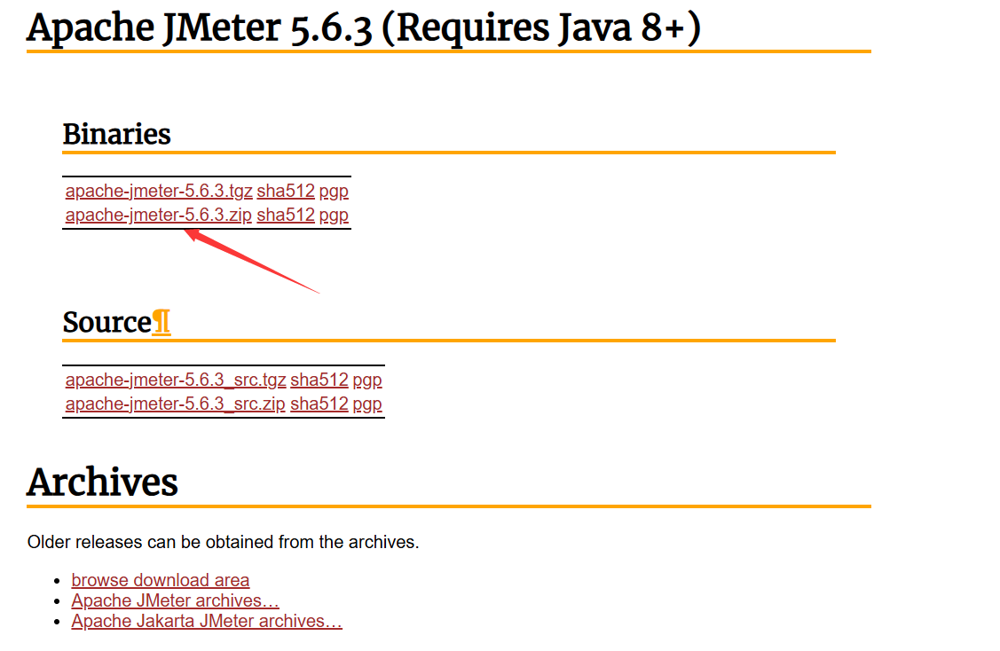

+ 下载完进行解压，之后配置环境变量
  + 配置`JMETER_HOME`，对应的值为Jmeter所在路径
  + 在path内配置`%JMETER_HOME%\bin`
+ 之后运行`jmeter -v`如果出现版本号说明成功配置环境变量
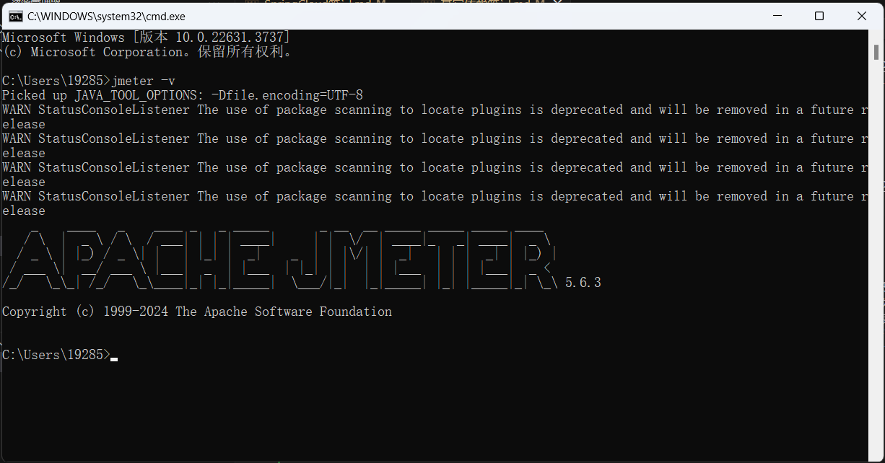
+ 接下来在bin目录中找到`jmeter.properties`，在其中修改其`language`配置项为`zh_CN`，这样就可以使用中文了
+ 如果成功，直接运行`jmeter`打开jmeter进行使用

---

### （二）使用

+ 首先我们创建一个线程组，一般都是SetUp线程组:
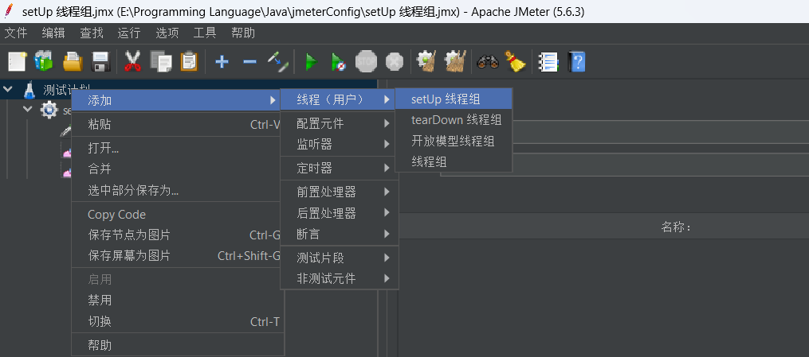
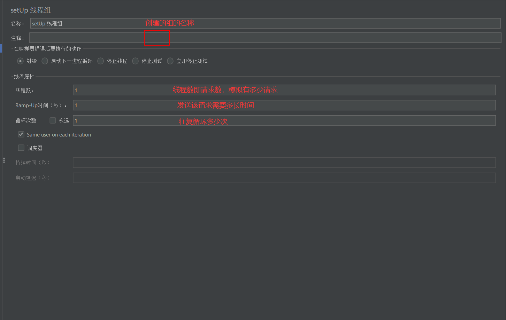
+ 接下来创建一个Http请求:
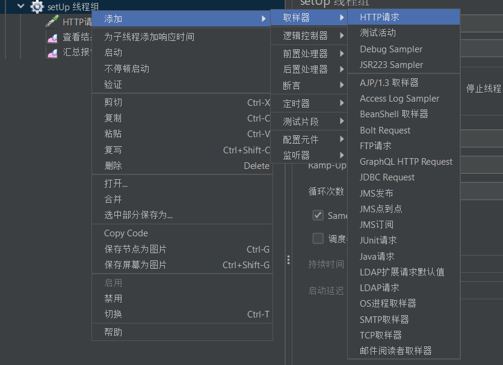
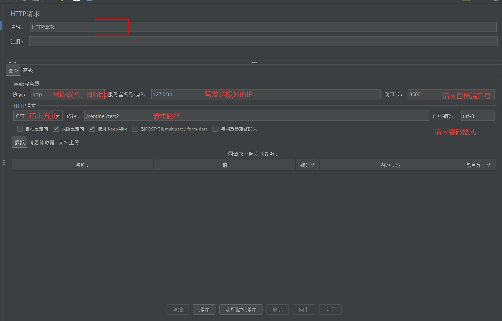
+ 随后添加结果树以查看结果，添加汇总报告以查看汇总:
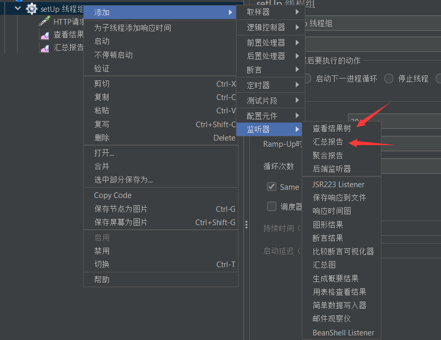
+ 接下来点击左上角那个非常明显的启动按钮就可以发送请求了，请求会根据我们的线程组的配置进行发送，发送路径和编码等会根据详细的HTTP请求进行发送
+ 请求完毕后就可以在结果树和汇总报告中查看结果了
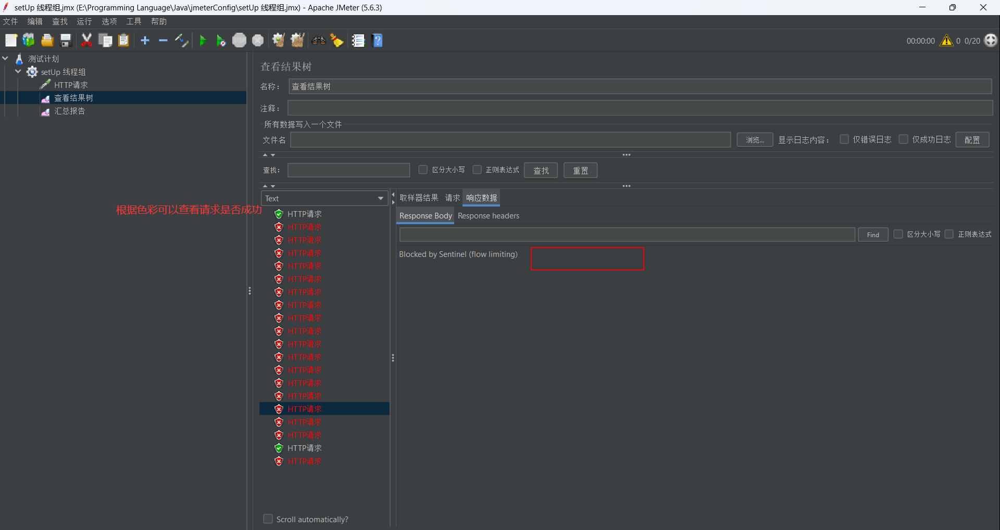

---

## 二、Jrebel

+ [Jrebel插件](https://plugins.jetbrains.com/plugin/4441-jrebel-and-xrebel)是一款支持在线热部署SpringBoot项目的小插件(付费)
  + 下载完插件后会弹出激活框，点击激活
  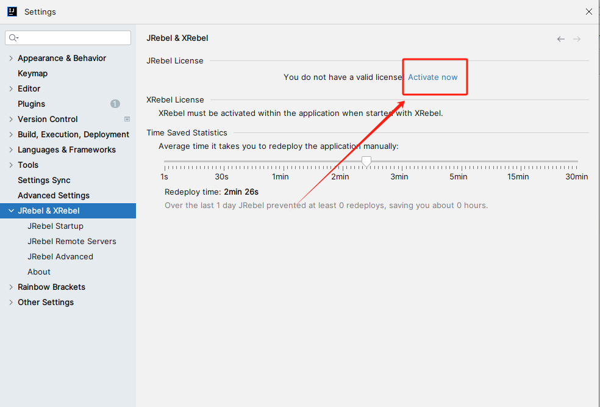
  + 然后选择第一种激活方式（要求提供邮箱和激活URL的）
  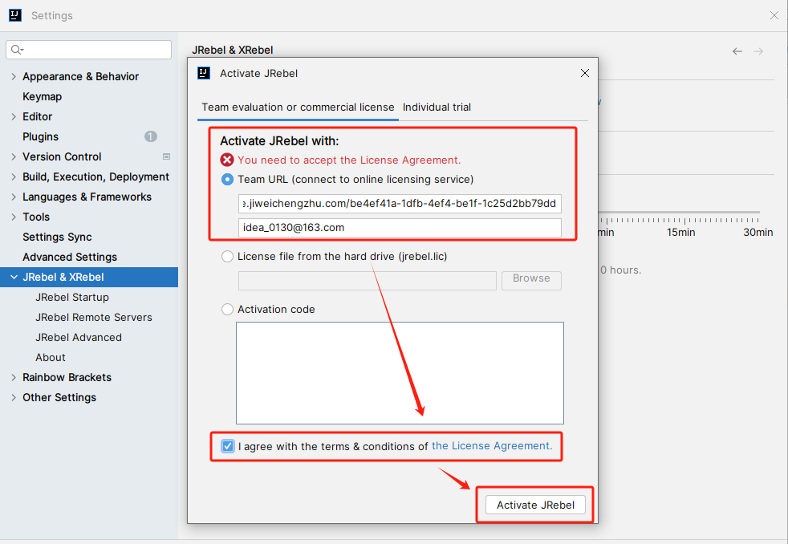
  + 在网上随便找一个在线生成UUID的网址随机声明一个UUID，然后URL以`https://jrebel.abcde.work/{UUID}`的格式填进去，如果失效了去网上翻帖子
  + 邮箱可以随便写，无所谓
  + 接下来将Jrebel切换到离线模式，防止激活一段时间后需要重新激活:直接在设置里找到Jrebel设置，然后设置成下图那样，下图是设置完的样子(点那个Work online的按钮)
  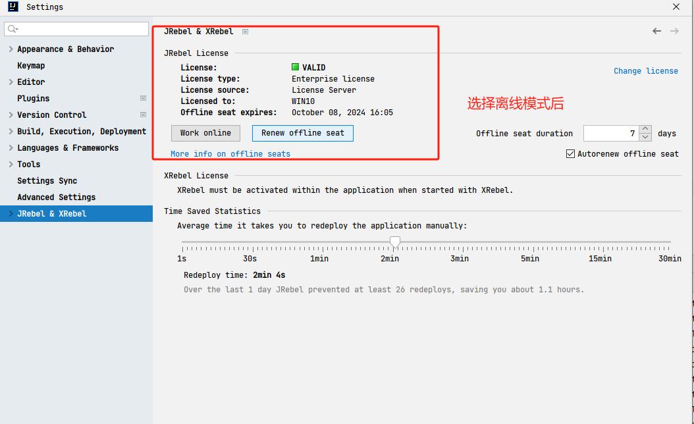

---

