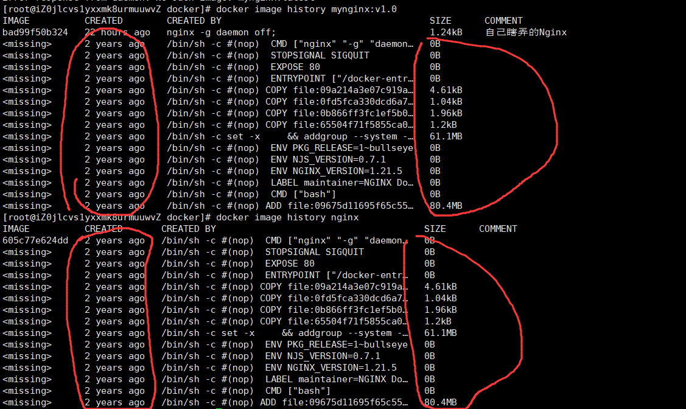

# Docker笔记

## 一、简介

+ Docker是一个开源的应用容器引擎，它支持将应用程序运行在一个轻量级、可移植的容器中
  + **镜像**:用户可以将自己的应用程序打包为docker镜像发布在Docker hub网站上，其他人想使用时，可以从网站拉取该镜像到其本地Docker即可。镜像实际上就是整合过的应用程序软件包
  + **容器**:每个镜像在Docker中运行时，Docker都会创建一个容器，使其在Docker创建的容器中运行，这样就保证了各程序之间运行的隔离性，当一个程序崩溃时,不会影响到其它程序，因为它们在不同的容器中运行。容器内自带一套自己的文件系统，类似于一个纯净版的操作系统，但是比操作系统更轻量级

## 二、安装

+ 以CentOS为例，先进入[Docker官网](https://www.docker.com/)
+ 进入文档，选择`Manuals`和`Docker Engine`，选择`CentOS`，根据官网进行安装
  
  + 首先运行如下命令:
~~~shell
    sudo yum remove docker \
        docker-client \
        docker-client-latest \
        docker-common \
        docker-latest \
        docker-latest-logrotate \
        docker-logrotate \
        docker-engine
~~~
  + 接下来通过yum安装Docker,为了下载速度快一些，配置阿里云的镜像进行下载:
~~~shell

    sudo yum install -y yum-utils  # 安装yum-utils
    sudo yum-config-manager \
    --add-repo \
    http://mirrors.aliyun.com/docker-ce/linux/centos/docker-ce.repo  # 配置阿里云镜像源

~~~
  
  + 然后开始安装Docker:
    + 期间如果询问的话直接输入y同意即可
~~~shell
    sudo yum install docker-ce docker-ce-cli containerd.io docker-buildx-plugin docker-compose-plugin
~~~
  + 接下来启动Docker
    + 顺便附带让Docker开启自启动的命令
~~~shell
    sudo systemctl start docker
    sudo systemctl enable docker
~~~
  
  + 最后配置一下Docker下载镜像的镜像源:
    + 由于2024.6开始国内的Docker镜像疑似出现了集体挂掉的情况，下面配置的镜像源可能会失效
~~~shell
    sudo mkdir -p /etc/docker
    sudo tee /etc/docker/daemon.json <<-'EOF'
    {
      "registry-mirrors": [
          "https://ustc-edu-cn.mirror.aliyuncs.com/",
          "https://ccr.ccs.tencentyun.com/",
          "https://docker.m.daocloud.io/",
          "https://hub.uuuadc.top",
          "https://docker.anyhub.us.kg",
          "https://dockerhub.jobcher.com",
          "https://dockerhub.icu",
          "https://docker.ckyl.me",
          "https://docker.awsl9527.cn"
      ]
    }
    EOF
~~~
  + 之后重启Docker:
~~~shell
    sudo systemctl daemon-reload
    sudo systemctl restart docker
~~~

---

## 三、使用

### （一）镜像操作

#### ①下载镜像

|命令|参数|命令项格式|命令项作用|命令项参数|命令项值|作用|备注|
|:---:|:---:|:---:|:---:|:---:|:---:|:---:|:---:|
|`docker pull <imageName>[:<imageVersion>]`|imageName:要下载的镜像名称|imageVersion:想下载的镜像版本|无|无|无|无|下载指定镜像|不写版本时默认下载lastest即最新版本|
|`docker images`/`docker image ls`|无参|无|无|无|无|查看当前docker下载的镜像|无|
|`docker search <imageName>`|imageName:想查询的镜像名|无|无|无|无|查询当前可用的镜像|无|
|`docker rmi <...imageId>`|imageId:想删除的镜像所对应的docker给该镜像赋予的唯一id(可以使用`docker images`查看)，可以不用写全，写部分前缀，只要能区分就行，或以`<imageName>:<imageVersion>`形式呈现的具体镜像名。如果想删除多个，使用空格隔开|无|无|无|无|删除指定镜像|无|

+ 我们可以通过`docker search nginx`来查看指定可用的当前镜像:

+ 另外，我们也可以通过[dockerhub网站](https://hub.docker.com/)来寻找具体的镜像（可以找到镜像的具体版本等）

+ 找到指定的镜像后，可以通过`docker pull 镜像名[:镜像版本]`的格式下载镜像到docker，如果未指定版本，那么下载最新的
+ 下载完成以后，使用`docker images`或`docker image ls`命令来查看本地docker当前拥有的镜像

+ 如果我们想删除，可以使用`docker rmi 镜像id`或`docker rmi 镜像名:镜像版本`命令来删除指定镜像

---

#### ②打包、导入与上传镜像

|命令|参数|命令项格式|命令项作用|命令项参数|命令项值|作用|备注|
|:---:|:---:|:---:|:---:|:---:|:---:|:---:|:---:|
|`docker commit <containerId> <imageName>:<imageVersion>`|containerId:容器运行时分配的id，可以不用写全，写部分前缀，只要能区分就行。或者也可以指定容器名称（可以通过`docker ps`查看） imageName:自定义打包的docker镜像名，**只能写小写字母** imageVersion:自定义打包的docker镜像版本|-a <author>|指定该镜像的作者|字符串|将容器打包为一个镜像，放入本地docker|无|
|^|^|`-m <message>`|指定镜像的描述|message:描述文字|字符串|^|^|
|`docker save <imageId>`|imageId:镜像所对应的docker给该镜像赋予的唯一id(可以使用`docker images`查看)，可以不用写全，写部分前缀，只要能区分就行，或以`<imageName>:<imageVersion>`形式呈现的具体镜像名|`-o <fileName>`|将镜像打包为一个文件|fileName:文件名|一般我们都打包为tar文件|将本地镜像打包为文件|无|
|`docker load [options]`|无参|`-i <fileName>`|导入tar文件，并将其作为一个镜像存入本地docker|fileName:想导入的文件名|文件名|加载文件来得到镜像|无|
|`docker login`|无参|>|>|>|无|登录自己的docker hub账户|这是向docker上传镜像的必须过程|
|`docker tag <prevImageName>:<imageVersion> <targetImageName>:<imageVersion>`|prevImageName:想上传的镜像原名称 imageVersion:镜像版本 targetImageName:改名后的想上传的镜像名，一般都在原名称上加自己的用户名，如原来的镜像为`mynginx:v1.0`，现在就叫`a1928564318/mynginx:v1.0`|>|>|>|无|给想上传的镜像重新命名|无|
|`docker push <targetImageName>:<imageVersion>`|imageVersion:镜像版本 targetImageName:改名后的想上传的镜像名，一般都在原名称上加自己的用户名，如原来的镜像为`mynginx:v1.0`，现在就叫`a1928564318/mynginx:v1.0`|>|>|>|无|上传自己的镜像到Docker Hub|无|

+ 一般流程是先commit将容器打包为镜像，再save为一个文件发给别人
+ 或者将容器打包为镜像，执行`docker login`、`docker tag`和`docker push`上传Docker镜像

---

#### ③Dockerfile

+ DockerFile是Docker提供的帮助我们构建镜像的工具
+ 以把一个SpringBoot项目的jar包制作成一个镜像为例
  + 首先将jar包引入到Linux服务器上
  + 接下来创建一个Dockerfile文件，写入以下内容:

~~~java
  FROM openjdk:17  // 表示需要的依赖，需要java环境

  LABEL author=lzx  // 打标签，以key=value的形式写一些无关紧要的东西

  COPY app.jar /app.jar  // 这里是把本地目录下的app.jar文件复制为容器内的根目录下的app.jar

  EXPOSE 8080  // 向外暴露8080端口，但是没什么用，docker可以指定端口

  ENTRYPOINT ["java","-jar","/app.jar"]  // 运行命令为 java -jar /app.jar，一般以空格分隔，将该命令的每一段按顺序组成数组
~~~

|Dockerfile语法|作用|
|:---:|:---:|
|FROM|指定镜像运行的依赖环境|
|RUN|运行自定义命令|
|CMD|容器启动命令或参数|
|LABEL|自定义标签|
|EXPOSE|指定暴露端口|
|ENV|环境变量|
|ADD|添加文件到镜像|
|COPY|复制文件到镜像|
|ENTRYPOINT|容器固定启动命令|
|VOLUME|数据卷|
|USER|指定用户和用户组|
|WORKDIR|指定默认工作目录|
|ARG|指定构建参数|

  + 接下来使用`docker build -f Dockerfile -t lzx/myjavaapp:v1.0 ./`来构建一个镜像，构架完成后镜像会被添加到本地的docker里
    + -f表示指定要读取的Dockerfile文件
    + -t表示给镜像打一个标签
    + 最后的`./`表示的是app.jar所在的目录路径，因为Dockerfile中指定的app.jar是镜像的主要运行主体，需要告知docker该jar包在哪

---

#### ④镜像分层

+ 如果Docker下载的镜像越来越多，那么它就会越来越占用存储空间
  + 但是，我们下载的镜像可能有一些需要的底层的环境依赖是通用的，如下载了两个java相关的镜像，它们都依赖OpenJDK:17版本
  + 为了解决镜像占用存储空间大的问题，Docker利用上面的特性，采用了镜像分层的技术
    + 镜像分层，就是镜像的存储空间被分割为了多个层级，每一个层级都负责存储镜像的不同数据
    + 如果不同镜像依赖相同的环境，那么它们就会有相同的层级，因此在下载其它的相关镜像时，就不用再去下载对应的层级数据，直接用之前镜像的就可以了
    + 我们的容器在启动时，这些**原生层级是只读的**，容器无法针对它们进行写操作，写操作的执行是会单独创建一个层级，专门存储我们的写操作所产生的影响
    + 基于此，当我们的容器被删除再run时，如果没有做相关的数据持久化操作，那么数据就会丢失，因为删除的是新创建的层级，当然我们写操作所产生的影响也就被删除了
+ 为了证明该说法，可以使用`docker image history <imageId>`来查看此镜像的历史:

  + 从上图可以看出，这两个镜像除第一个层不同外，其它层都是相同的，且mynginx的对应层的创建时间与nginx官方的层的创建时间，以及大小都相同，说明它们使用的都是同一层级

---

### （二）容器操作

|命令|参数|命令项格式|命令项作用|命令项参数|命令项值|作用|备注|
|:---:|:---:|:---:|:---:|:---:|:---:|:---:|:---:|
|`docker run [options] <imageId>`|imageId:镜像所对应的docker给该镜像赋予的唯一id(可以使用`docker images`查看)，可以不用写全，写部分前缀，只要能区分就行，或以`<imageName>:<imageVersion>`形式呈现的具体镜像名|-d|在后台运行，即不占用控制台进程|无|无|启动一个容器，在该容器内运行指定镜像|无|
|^|^|`--name`|给容器起一个名字|无|自定义名字|^|^|
|^|^|`-p <externalPort></externalPort>:<internalPort>`|端口映射，使外界访问linux服务器的指定端口时，相当于访问在linux服务器内运行的容器的对应端口|externalPort:外部端口，即被访问的Linux服务端口 internalPort:映射的容器内端口|端口号|^|^|
|^|^|`-v {<externalFolder>\|<volumeName>}:<internalFolder>`|进行目录挂载或卷映射|externalFolder:要建立映射关系的Linux服务器上的目录路径 volumeName:建立卷映射关系的卷名 internalFolder:容器内要建立映射关系的目录路径|示例:`myNginxConfig:/etc/nginx`、`/home/study/docker/nginxHtml:/usr/share/nginx/html`|^|^|
|^|^|`--network <netName>`|为新运行的容器指定其所属网络|netName:网络名|网络名|^|^|
|^|^|`-e <envName>=<envValue>`|为新运行的容器应用程序指定环境变量|envName:环境变量名 envValue:环境变量值|例:`-e RABBITMQ_DEFAULT_USER=guest`|^|^|
|`docker ps`|无参|-a|查看全部容器，即使已经停止运行|无|无|查看容器状态，默认查看正在运行的容器|无|
|^|^|-q|只打印检索到的容器id|无|无|^|^|
|`docker stop <containerId>`|containerId:容器运行时分配的id，可以不用写全，写部分前缀，只要能区分就行。或者也可以指定容器名称（可以通过`docker ps`查看）|无|无|无|无|停止指定容器|无|
|`docker start <containerId>`|^|无|无|无|无|使停止运行的容器重新开始运行|无|
|`docker restart <containerId>`|^|无|无|无|无|重启指定容器|无|
|`docker stats <containerId>`|^|无|无|无|无|查看指定容器的状态|无|
|`docker logs <containerId>`|^|无|无|无|无|查看容器运行打印的日志|无|
|`docker exec [options] <containerId> <interactionMode>`|imageId:镜像所对应的docker给该镜像赋予的唯一id(可以使用`docker images`查看)，可以不用写全，写部分前缀，只要能区分就行，或以`<imageName>:<imageVersion>`形式呈现的具体镜像名 interactionMode:交互方式，`/bin/bash`或直接写`bash`是使用控制台进行交互|-it|这是一个复合命令项，用来声明进入容器并进行交互操作|无|无|进入指定容器进行相关操作|使用`exit`退出容器|
|`docker rm <containerId>`|^|-f|强制删除，该命令在容器运行时也能删除|无|无|删除指定的容器，被删除掉的容器无法被`docker ps`查看到|**删除容器时，容器需要停止运行**|
|`docker container inspect <containerId>`|^|>|>|>|无|查看指定容器的详细信息|无|
|`docker rm -f $(docker ps -aq)`|无参|>|>|>|无|这是一个小技巧，直接删除全部容器|无|

---

### （三）存储

+ 使用`docker exec`命令需要**进入容器内才能修改对应的配置非常麻烦**，而且一旦容器被删除，再启动的话，配置就变回去了，**无法持久化保存**
+ 针对该问题，docker提供了**目录挂载**和**卷映射**两种方式来提供解决方案

#### ①目录挂载

+ 目录挂载就是将容器内某一目录与Linux服务器对应目录之间建立映射关系，如果Linux服务器的映射目录发生变化，容器内的对应文件内容也会发生变化
+ 使用`docker run`命令的`-v`命令项可以指定目录挂载
  + 具体要求为-v后面跟着的值的格式需要为`Linux服务器映射目录路径:容器映射目录路径`
  + -v可以多次使用，即建立多个目录的映射
  + 如果设置的Linux服务器映射路径不存在，那么Docker会新建一个
+ 但是，目录挂载的弊端是**Linux服务器映射目录不会与容器目录中的文件内容进行同步**，这意味着我们的Linux服务器映射目录如果没有提前创建并向里面塞一些提前写好的文件，那么目录挂载所对应的目录就是空的，对应的容器内的目录也是空的，而不是镜像默认提供的。

---

#### ②卷映射

+ 针对目录挂载的弊端，也就是二者不会开始就进行同步的问题，docker还提供了卷映射的方式解决该问题
+ 其具体格式与目录挂载几乎没有区别，唯一的区别就是-v后面跟着的值变成了`卷名:容器映射目录路径`
  + 卷名就是我们为Linux服务器上的映射目录起的名字，该“卷”的具体路径无法由我们自己决定，统一存放在`/var/lib/docker/volumes/<volumeName>`中
  + 一旦建立卷映射，容器在启动时，就会把它默认的映射目录中的文件同步到对应的卷中，实现同步
  + 我们在Linux上对卷内的文件进行改动时，容器内也会进行同步改动

|命令|参数|命令项格式|命令项作用|命令项参数|命令项值|作用|备注|
|:---:|:---:|:---:|:---:|:---:|:---:|:---:|:---:|
|`docker volume ls`|无参|>|>|>|无|列出所有的卷|无|
|`docker volume create <volumeName>`|volumeName:卷名|>|>|>|无|创建一个卷|无|
|`docker volume inspect <volumeName>`|^|>|>|>|无|输出指定卷的详细信息|可以查看卷所在目录等信息|
|`docker volume rm <...volumeName>`|^|>|>|>|无|删除指定的卷|无|

---

### （四）网络

+ Docker默认存在一个叫docker0的网络，我们运行镜像所启动起来的容器默认都属于该网络
+ 但是该docker0网络不支持容器之间通过它进行直接访问，因此我们需要新创建一个网络来使Docker之间的容器之间进行互相访问

#### ①自定义网络

|命令|参数|命令项格式|命令项作用|命令项参数|命令项值|作用|备注|
|:---:|:---:|:---:|:---:|:---:|:---:|:---:|:---:|
|`docker network create <newNet>`|newNet:想创建的网络名称|>|>|>|无|创建一个网络|无|
|`docker network ls`|无参|>|>|>|无|查看当前网络|无|
|`docker network rm <...net>`|net:网络名称|>|>|>|无|删除指定网络|无|

+ 我们可以通过`docker network create 网络名`先创建一个网络出来
+ 之后通过`docker run -d -p 88:80 --name app1 --network 网络名 nginx`和`docker run -d -p 89:80 --name app2 --network 网络名 nginx`分别启动两个容器
+ 之后`docker exec -it app1 bash`进入一个容器
+ 然后`curl http://app2:80`进行测试
  + 这里的IP地址可以通过写容器名来实现IP映射，因为IP可能会发生变化，但是容器名一般是不会变的。就像网络域名基本上是不变的，但是域名对应的IP可能会动态变化
  + 端口写的是容器内的镜像占用的端口，而不是外界访问Linux服务器所需要输入的端口，因为容器间访问可以直接访问，它本身就在Docker内，且同属于一个网络，因此端口不是Linux服务器映射端口

---

### （五）Compose

+ 每次我们都要运行命令并配置命令项参数，很烦，因此Docker提供了Docker Compose的方式来简化容器的启动流程，**使我们可以一次性便捷的启动多个容器**
+ 其实就是把要运行的镜像都用配置文件进行一下配置就行
  + 一般使用`compose.yaml`文件进行配置
  + 配置项有几个顶级元素，即yaml配置最外层的配置项
    + name:名字
    + services:服务
    + networks:网络
    + volumes:卷
    + configs:配置
    + secrets:密钥
  + 每个顶级元素下都有很多参数，详情参见[官方文档](https://docs.docker.com/compose/compose-file/)
+ 示例yaml文件:

~~~yaml
name: myblog # 声明名字
services:
  mysql: # 表示服务名
    container_name: mysql  # 配置容器名
    image: mysql:8.0  # 镜像源
    ports:
      - "3306:3306"  # 端口映射
    environment:
      - MYSQL_ROOT_PASSWORD=123456  # 配置环境变量
      - MYSQL_DATABASE=wordpress
    volumes:
      - mysql-data:/var/lib/mysql  # 配置卷映射和目录挂载
      - /app/myconf:/etc/mysql/conf.d
    restart: always  # docker启动时自动启动
    networks:
      - blog  # 分配网络

  wordpress:
    image: wordpress
    ports:
      - "8080:80"
    environment:
      WORDPRESS_DB_HOST: mysql
      WORDPRESS_DB_USER: root
      WORDPRESS_DB_PASSWORD: 123456
      WORDPRESS_DB_NAME: wordpress
    volumes:
      - wordpress:/var/www/html
    restart: always
    networks:
      - blog
    depends_on:
      - mysql  # 用于指定启动顺序，该容器需要等待其依赖项全部启动完毕后启动

volumes:
  mysql-data:  # 上面用到的卷，需要在此声明
  wordpress:

networks:
  blog:  # 上面用到的网络，需要在此声明
~~~

|命令|参数|命令项格式|命令项作用|命令项参数|命令项值|作用|备注|
|:---:|:---:|:---:|:---:|:---:|:---:|:---:|:---:|
|`docker compose [options]`|无参|`-f <fileName>`|指定要运行的文件|fileName:想运行的文件路径|路径|执行compose的相关操作|无|
|`docker compose [options1] up [options2]`|无参|`-d`|后台运行|无|无|根据文件启动容器，默认读取的文件是当前目录下的`compose.yaml`文件|无|
|`docker compose down`|无参|>|>|>|无|删除容器和网络|无|
|`docker compose stop`|无参|>|>|>|无|使容器停止运行|无|
|`docker compose start`|无参|>|>|>|无|使容器开始运行|无|

---

# 汇总

## 一、命令汇总

+ 对于任何docker命令，都可以使用`--help`来查看其使用语法

|分组|命令|参数|命令项格式|命令项作用|命令项参数|命令项值|作用|备注|
|:---:|:---:|:---:|:---:|:---:|:---:|:---:|:---:|:---:|
|**镜像下载**|`docker pull <imageName>[:<imageVersion>]`|imageName:要下载的镜像名称|imageVersion:想下载的镜像版本|无|无|无|无|下载指定镜像|不写版本时默认下载lastest即最新版本|
|^|`docker images`/`docker image ls`|无参|无|无|无|无|查看当前docker下载的镜像|无|
|^|`docker search <imageName>`|imageName:想查询的镜像名|无|无|无|无|查询当前可用的镜像|无|
|^|`docker rmi <...imageId>`|imageId:想删除的镜像所对应的docker给该镜像赋予的唯一id(可以使用`docker images`查看)，可以不用写全，写部分前缀，只要能区分就行，或以`<imageName>:<imageVersion>`形式呈现的具体镜像名。如果想删除多个，使用空格隔开|无|无|无|无|删除指定镜像|无|
|**镜像打包、导入与上传**|`docker commit <containerId> <imageName>:<imageVersion>`|containerId:容器运行时分配的id，可以不用写全，写部分前缀，只要能区分就行。或者也可以指定容器名称（可以通过`docker ps`查看） imageName:自定义打包的docker镜像名，**只能写小写字母** imageVersion:自定义打包的docker镜像版本|-a <author>|指定该镜像的作者|字符串|将容器打包为一个镜像，放入本地docker|无|
|^|^|^|`-m <message>`|指定镜像的描述|message:描述文字|字符串|^|^|
|^|`docker save <imageId>`|imageId:镜像所对应的docker给该镜像赋予的唯一id(可以使用`docker images`查看)，可以不用写全，写部分前缀，只要能区分就行，或以`<imageName>:<imageVersion>`形式呈现的具体镜像名|`-o <fileName>`|将镜像打包为一个文件|fileName:文件名|一般我们都打包为tar文件|将本地镜像打包为文件|无|
|^|`docker load [options]`|无参|`-i <fileName>`|导入tar文件，并将其作为一个镜像存入本地docker|fileName:想导入的文件名|文件名|加载文件来得到镜像|无|
|^|`docker login`|无参|>|>|>|无|登录自己的docker hub账户|这是向docker上传镜像的必须过程|
|^|`docker tag <prevImageName>:<imageVersion> <targetImageName>:<imageVersion>`|prevImageName:想上传的镜像原名称 imageVersion:镜像版本 targetImageName:改名后的想上传的镜像名，一般都在原名称上加自己的用户名，如原来的镜像为`mynginx:v1.0`，现在就叫`a1928564318/mynginx:v1.0`|>|>|>|无|给想上传的镜像重新命名|无|
|^|`docker push <targetImageName>:<imageVersion>`|imageVersion:镜像版本 targetImageName:改名后的想上传的镜像名，一般都在原名称上加自己的用户名，如原来的镜像为`mynginx:v1.0`，现在就叫`a1928564318/mynginx:v1.0`|>|>|>|无|上传自己的镜像到Docker Hub|无|
|**镜像构建**|`docker build -f Dockerfile -t lzx/myjavaapp:v1.0 <path>`|path:要构建的主体文件所在目录的路径|`-f <fileName>`|指定要读取的对应Dockerfile文件|fileName:Dockerfile文件路径|路径|构建镜像|无|
|^|^|^|`-t <imageId>:<imageVersion>`|给镜像起名，并打版本号|imageId:指定自定义镜像名字 imageVersion:指定自定义镜像版本|例:`lzx/java:v1.0`|^|^|
|**其它镜像操作**|`docker image history <imageId>`|imageId:镜像所对应的docker给该镜像赋予的唯一id(可以使用`docker images`查看)，可以不用写全，写部分前缀，只要能区分就行，或以`<imageName>:<imageVersion>`形式呈现的具体镜像名|>|>|>|无|查看指定镜像的构建历史|可以通过该命令验证镜像分层|
|^|`docker image inspect <imageId>`|^|>|>|>|无|查看指定镜像详情|无|
|**容器操作**|`docker run [options] <imageId>`|imageId:镜像所对应的docker给该镜像赋予的唯一id(可以使用`docker images`查看)，可以不用写全，写部分前缀，只要能区分就行，或以`<imageName>:<imageVersion>`形式呈现的具体镜像名|-d|在后台运行，即不占用控制台进程|无|无|启动一个容器，在该容器内运行指定镜像|无|
|^|^|^|`--name`|给容器起一个名字|无|自定义名字|^|^|
|^|^|^|`-p <externalPort></externalPort>:<internalPort>`|端口映射，使外界访问linux服务器的指定端口时，相当于访问在linux服务器内运行的容器的对应端口|externalPort:外部端口，即被访问的Linux服务端口 internalPort:映射的容器内端口|端口号|^|^|
|^|^|^|`-v {<externalFolder>\|<volumeName>}:<internalFolder>`|进行目录挂载或卷映射|externalFolder:要建立映射关系的Linux服务器上的目录路径 volumeName:建立卷映射关系的卷名 internalFolder:容器内要建立映射关系的目录路径|示例:`myNginxConfig:/etc/nginx`、`/home/study/docker/nginxHtml:/usr/share/nginx/html`|^|^|
|^|^|^|`--network <netName>`|为新运行的容器指定其所属网络|netName:网络名|网络名|^|^|
|^|^|^|`-e <envName>=<envValue>`|为新运行的容器应用程序指定环境变量|envName:环境变量名 envValue:环境变量值|例:`-e RABBITMQ_DEFAULT_USER=guest`|^|^|
|^|`docker ps`|无参|-a|查看全部容器，即使已经停止运行|无|无|查看容器状态，默认查看正在运行的容器|无|
|^|^|^|-q|只打印检索到的容器id|无|无|^|^|
|^|`docker stop <containerId>`|containerId:容器运行时分配的id，可以不用写全，写部分前缀，只要能区分就行。或者也可以指定容器名称（可以通过`docker ps`查看）|无|无|无|无|停止指定容器|无|
|^|`docker start <containerId>`|^|无|无|无|无|使停止运行的容器重新开始运行|无|
|^|`docker restart <containerId>`|^|无|无|无|无|重启指定容器|无|
|^|`docker stats <containerId>`|^|无|无|无|无|查看指定容器的状态|无|
|^|`docker logs <containerId>`|^|无|无|无|无|查看容器运行打印的日志|无|
|^|`docker exec [options] <containerId> <interactionMode>`|imageId:镜像所对应的docker给该镜像赋予的唯一id(可以使用`docker images`查看)，可以不用写全，写部分前缀，只要能区分就行，或以`<imageName>:<imageVersion>`形式呈现的具体镜像名 interactionMode:交互方式，`/bin/bash`或直接写`bash`是使用控制台进行交互|-it|这是一个复合命令项，用来声明进入容器并进行交互操作|无|无|进入指定容器进行相关操作|使用`exit`退出容器|
|^|`docker rm <containerId>`|^|-f|强制删除，该命令在容器运行时也能删除|无|无|删除指定的容器，被删除掉的容器无法被`docker ps`查看到|**删除容器时，容器需要停止运行**|
|^|`docker container inspect <containerId>`|^|>|>|>|无|查看指定容器的详细信息|无|
|^|`docker rm -f $(docker ps -aq)`|无参|>|>|>|无|这是一个小技巧，直接删除全部容器|无|
|**存储**|`docker volume ls`|无参|>|>|>|无|列出所有的卷|无|
|^|`docker volume create <volumeName>`|volumeName:卷名|>|>|>|无|创建一个卷|无|
|^|`docker volume inspect <volumeName>`|^|>|>|>|无|输出指定卷的详细信息|可以查看卷所在目录等信息|
|^|`docker volume rm <...volumeName>`|^|>|>|>|无|删除指定的卷|无|
|**网络**|`docker network create <newNet>`|newNet:想创建的网络名称|>|>|>|无|创建一个网络|无|
|^|`docker network ls`|无参|>|>|>|无|查看当前网络|无|
|^|`docker network rm <...net>`|net:网络名称|>|>|>|无|删除指定网络|无|
|**Compose**|`docker compose [options]`|无参|`-f <fileName>`|指定要运行的文件|fileName:想运行的文件路径|路径|执行compose的相关操作|无|
|^|`docker compose [options1] up [options2]`|无参|`-d`|后台运行|无|无|根据文件启动容器，默认读取的文件是当前目录下的`compose.yaml`文件|无|
|^|`docker compose down`|无参|>|>|>|无|删除容器和网络|无|
|^|`docker compose stop`|无参|>|>|>|无|使容器停止运行|无|
|^|`docker compose start`|无参|>|>|>|无|使容器开始运行|无|