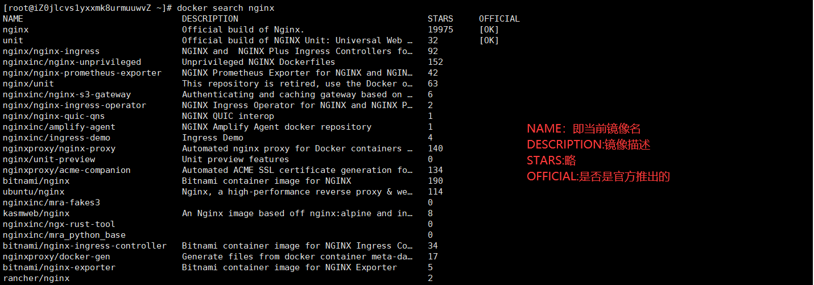

# Docker笔记

## 一、安装

+ 以CentOS为例，先进入[Docker官网](https://www.docker.com/)
+ 进入文档，选择`Manuals`和`Docker Engine`，选择`CentOS`，根据官网进行安装
  
  + 首先运行如下命令:
~~~shell
    sudo yum remove docker \
        docker-client \
        docker-client-latest \
        docker-common \
        docker-latest \
        docker-latest-logrotate \
        docker-logrotate \
        docker-engine
~~~
  + 接下来通过yum安装Docker,为了下载速度快一些，配置阿里云的镜像进行下载:
~~~shell

    sudo yum install -y yum-utils  # 安装yum-utils
    sudo yum-config-manager \
    --add-repo \
    http://mirrors.aliyun.com/docker-ce/linux/centos/docker-ce.repo  # 配置阿里云镜像源

~~~
  
  + 然后开始安装Docker:
    + 期间如果询问的话直接输入y同意即可
~~~shell
    sudo yum install docker-ce docker-ce-cli containerd.io docker-buildx-plugin docker-compose-plugin
~~~
  + 接下来启动Docker
    + 顺便附带让Docker开启自启动的命令
~~~shell
    sudo systemctl start docker
    sudo systemctl enable docker
~~~
  
  + 最后配置一下Docker下载镜像的镜像源:
~~~shell
    sudo mkdir -p /etc/docker
    sudo tee /etc/docker/daemon.json <<-'EOF'
    {
    "registry-mirrors": ["https://82m9ar63.mirror.aliyuncs.com"]
    }
    EOF
~~~
  + 之后重启Docker:
~~~shell
    sudo systemctl daemon-reload
    sudo systemctl restart docker
~~~

---

## 二、使用

### （一）镜像操作

#### ①下载镜像

|命令|参数|命令项格式|命令项作用|命令项参数|命令项值|作用|备注|
|:---:|:---:|:---:|:---:|:---:|:---:|:---:|:---:|
|`docker pull <imageName>[:<imageVersion>]`|imageName:要下载的镜像名称|imageVersion:想下载的镜像版本|无|无|无|无|下载指定镜像|不写版本时默认下载lastest即最新版本|
|`docker images`/`docker image ls`|无参|无|无|无|无|查看当前docker下载的镜像|无|
|`docker search <imageName>`|imageName:想查询的镜像名|无|无|无|无|查询当前可用的镜像|无|
|`docker rmi <...imageId>`|imageId:想删除的镜像所对应的docker给该镜像赋予的唯一id(可以使用`docker images`查看)，可以不用写全，写部分前缀，只要能区分就行，或以`<imageName>:<imageVersion>`形式呈现的具体镜像名。如果想删除多个，使用空格隔开|无|无|无|无|删除指定镜像|无|

+ 我们可以通过`docker search nginx`来查看指定可用的当前镜像:

+ 另外，我们也可以通过[dockerhub网站](https://hub.docker.com/)来寻找具体的镜像（可以找到镜像的具体版本等）

+ 找到指定的镜像后，可以通过`docker pull 镜像名[:镜像版本]`的格式下载镜像到docker，如果未指定版本，那么下载最新的
+ 下载完成以后，使用`docker images`或`docker image ls`命令来查看本地docker当前拥有的镜像

+ 如果我们想删除，可以使用`docker rmi 镜像id`或`docker rmi 镜像名:镜像版本`命令来删除指定镜像

---

#### ②打包、导入与上传镜像

|命令|参数|命令项格式|命令项作用|命令项参数|命令项值|作用|备注|
|:---:|:---:|:---:|:---:|:---:|:---:|:---:|:---:|
|`docker commit <containerId> <imageName>:<imageVersion>`|containerId:容器运行时分配的id，可以不用写全，写部分前缀，只要能区分就行。或者也可以指定容器名称（可以通过`docker ps`查看） imageName:自定义打包的docker镜像名，**只能写小写字母** imageVersion:自定义打包的docker镜像版本|-a <author>|指定该镜像的作者|字符串|将容器打包为一个镜像，放入本地docker|无|
|^|^|`-m <message>`|指定镜像的描述|message:描述文字|字符串|^|^|
|`docker save <imageId>`|imageId:镜像所对应的docker给该镜像赋予的唯一id(可以使用`docker images`查看)，可以不用写全，写部分前缀，只要能区分就行，或以`<imageName>:<imageVersion>`形式呈现的具体镜像名|`-o <fileName>`|将镜像打包为一个文件|fileName:文件名|一般我们都打包为tar文件|将本地镜像打包为文件|无|
|`docker load [options]`|无参|`-i <fileName>`|导入tar文件，并将其作为一个镜像存入本地docker|fileName:想导入的文件名|文件名|加载文件来得到镜像|无|
|`docker login`|无参|>|>|>|无|登录自己的docker hub账户|这是向docker上传镜像的必须过程|
|`docker tag <prevImageName>:<imageVersion> <targetImageName>:<imageVersion>`|prevImageName:想上传的镜像原名称 imageVersion:镜像版本 targetImageName:改名后的想上传的镜像名，一般都在原名称上加自己的用户名，如原来的镜像为`mynginx:v1.0`，现在就叫`a1928564318/mynginx:v1.0`|>|>|>|无|给想上传的镜像重新命名|无|
|`docker push <targetImageName>:<imageVersion>`|imageVersion:镜像版本 targetImageName:改名后的想上传的镜像名，一般都在原名称上加自己的用户名，如原来的镜像为`mynginx:v1.0`，现在就叫`a1928564318/mynginx:v1.0`|>|>|>|无|上传自己的镜像到Docker Hub|无|

+ 一般流程是先commit将容器打包为镜像，再save为一个文件发给别人
+ 或者将容器打包为镜像，执行`docker login`、`docker tag`和`docker push`上传Docker镜像

---

### （二）容器操作

|命令|参数|命令项格式|命令项作用|命令项参数|命令项值|作用|备注|
|:---:|:---:|:---:|:---:|:---:|:---:|:---:|:---:|
|`docker run [options] <imageId>`|imageId:镜像所对应的docker给该镜像赋予的唯一id(可以使用`docker images`查看)，可以不用写全，写部分前缀，只要能区分就行，或以`<imageName>:<imageVersion>`形式呈现的具体镜像名|-d|在后台运行，即不占用控制台进程|无|无|启动一个容器，在该容器内运行指定镜像|无|
|^|^|`--name`|给容器起一个名字|无|自定义名字|^|^|
|^|^|`-p <externalPort></externalPort>:<internalPort>`|端口映射，使外界访问linux服务器的指定端口时，相当于访问在linux服务器内运行的容器的对应端口|externalPort:外部端口，即被访问的Linux服务端口 internalPort:映射的容器内端口|端口号|^|^|
|^|^|`-v {<externalFolder>\|<volumeName>}:<internalFolder>`|进行目录挂载或卷映射|externalFolder:要建立映射关系的Linux服务器上的目录路径 volumeName:建立卷映射关系的卷名 internalFolder:容器内要建立映射关系的目录路径|示例:`myNginxConfig:/etc/nginx`、`/home/study/docker/nginxHtml:/usr/share/nginx/html`|^|^|
|`docker ps`|无参|-a|查看全部运行容器，即使已经停止运行|无|无|查看当前正在运行的容器|无|
|`docker stop <containerId>`|containerId:容器运行时分配的id，可以不用写全，写部分前缀，只要能区分就行。或者也可以指定容器名称（可以通过`docker ps`查看）|无|无|无|无|停止指定容器|无|
|`docker start <containerId>`|^|无|无|无|无|使停止运行的容器重新开始运行|无|
|`docker restart <containerId>`|^|无|无|无|无|重启指定容器|无|
|`docker stats <containerId>`|^|无|无|无|无|查看指定容器的状态|无|
|`docker logs <containerId>`|^|无|无|无|无|查看容器运行打印的日志|无|
|`docker exec [options] <containerId> <interactionMode>`|imageId:镜像所对应的docker给该镜像赋予的唯一id(可以使用`docker images`查看)，可以不用写全，写部分前缀，只要能区分就行，或以`<imageName>:<imageVersion>`形式呈现的具体镜像名 interactionMode:交互方式，`/bin/bash`或直接写`bash`是使用控制台进行交互|-it|这是一个复合命令项，用来声明进入容器并进行交互操作|无|无|进入指定容器进行相关操作|使用`exit`退出容器|
|`docker rm <containerId>`|^|-f|强制删除，该命令在容器运行时也能删除|无|无|删除指定的容器，被删除掉的容器无法被`docker ps`查看到|**删除容器时，容器需要停止运行**|

---

### （三）存储

+ 使用`docker exec`命令需要**进入容器内才能修改对应的配置非常麻烦**，而且一旦容器被删除，再启动的话，配置就变回去了，**无法持久化保存**
+ 针对该问题，docker提供了**目录挂载**和**卷映射**两种方式来提供解决方案

#### ①目录挂载

+ 目录挂载就是将容器内某一目录与Linux服务器对应目录之间建立映射关系，如果Linux服务器的映射目录发生变化，容器内的对应文件内容也会发生变化
+ 使用`docker run`命令的`-v`命令项可以指定目录挂载
  + 具体要求为-v后面跟着的值的格式需要为`Linux服务器映射目录路径:容器映射目录路径`
  + -v可以多次使用，即建立多个目录的映射
  + 如果设置的Linux服务器映射路径不存在，那么Docker会新建一个
+ 但是，目录挂载的弊端是**Linux服务器映射目录不会与容器目录中的文件内容进行同步**，这意味着我们的Linux服务器映射目录如果没有提前创建并向里面塞一些提前写好的文件，那么目录挂载所对应的目录就是空的，对应的容器内的目录也是空的，而不是镜像默认提供的。

---

#### ②卷映射

+ 针对目录挂载的弊端，也就是二者不会开始就进行同步的问题，docker还提供了卷映射的方式解决该问题
+ 其具体格式与目录挂载几乎没有区别，唯一的区别就是-v后面跟着的值变成了`卷名:容器映射目录路径`
  + 卷名就是我们为Linux服务器上的映射目录起的名字，该“卷”的具体路径无法由我们自己决定，统一存放在`/var/lib/docker/volumes/<volumeName>`中
  + 一旦建立卷映射，容器在启动时，就会把它默认的映射目录中的文件同步到对应的卷中，实现同步
  + 我们在Linux上对卷内的文件进行改动时，容器内也会进行同步改动

|命令|参数|命令项格式|命令项作用|命令项参数|命令项值|作用|备注|
|:---:|:---:|:---:|:---:|:---:|:---:|:---:|:---:|
|`docker volume ls`|无参|>|>|>|无|列出所有的卷|无|
|`docker volume create <volumeName>`|volumeName:卷名|>|>|>|无|创建一个卷|无|
|`docker volume inspect <volumeName>`|^|>|>|>|无|输出指定卷的详细信息|可以查看卷所在目录等信息|
|`docker volume rm <...volumeName>`|^|>|>|>|无|删除指定的卷|无|

---

# 汇总

## 一、命令汇总

+ 对于任何docker命令，都可以使用`--help`来查看其使用语法

|分组|命令|参数|命令项格式|命令项作用|命令项参数|命令项值|作用|备注|
|:---:|:---:|:---:|:---:|:---:|:---:|:---:|:---:|:---:|
|**镜像**|`docker pull <imageName>[:<imageVersion>]`|imageName:要下载的镜像名称|imageVersion:想下载的镜像版本|无|无|无|无|下载指定镜像|不写版本时默认下载lastest即最新版本|
|^|`docker images`/`docker image ls`|无参|无|无|无|无|查看当前docker下载的镜像|无|
|^|`docker search <imageName>`|imageName:想查询的镜像名|无|无|无|无|查询当前可用的镜像|无|
|^|`docker rmi <...imageId>`|imageId:想删除的镜像所对应的docker给该镜像赋予的唯一id(可以使用`docker images`查看)，可以不用写全，写部分前缀，只要能区分就行，或以`<imageName>:<imageVersion>`形式呈现的具体镜像名。如果想删除多个，使用空格隔开|无|无|无|无|删除指定镜像|无|