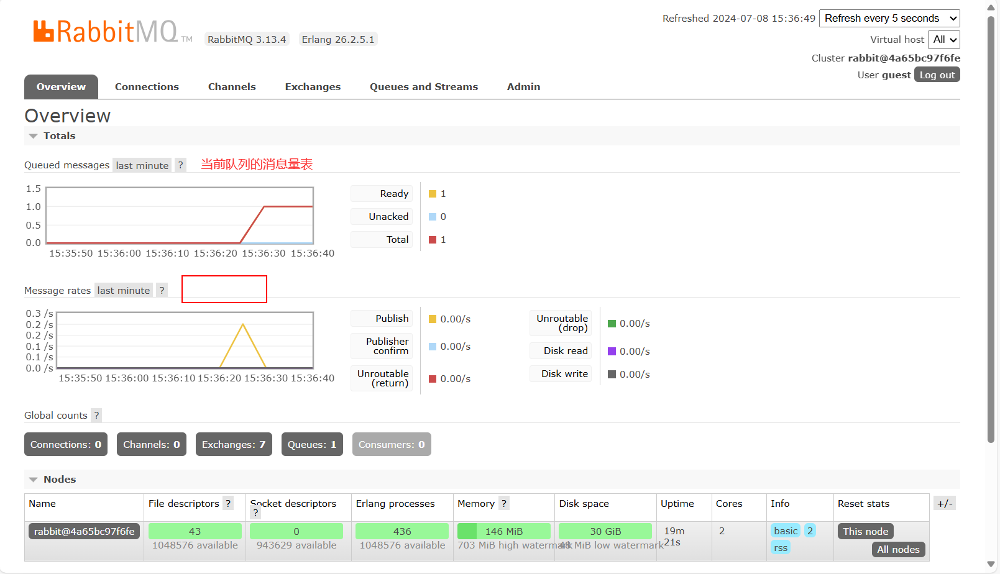
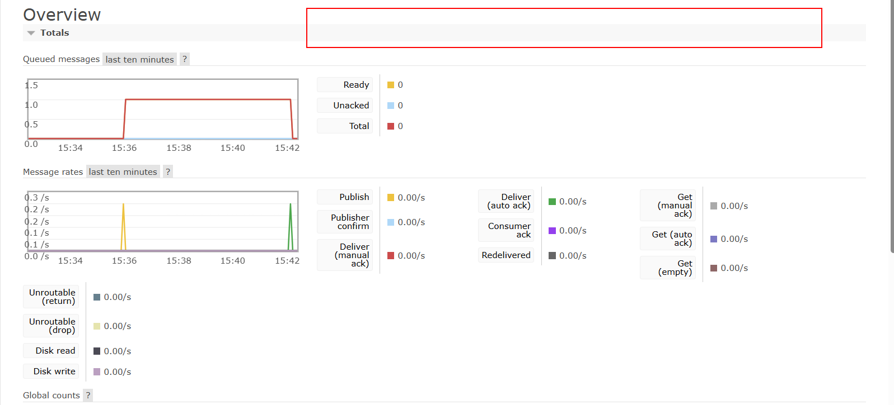

# RabbitMQ笔记

## 一、简介

## 二、安装

+ 为了简便，使用Docker进行安装

~~~sh
# 拉取镜像
docker pull rabbitmq:3.13-management
# -d 参数：后台运行 Docker 容器
# --name 参数：设置容器名称
# -p 参数：映射端口号，格式是“宿主机端口号:容器内端口号”。5672供客户端程序访问，15672供后台管理界面访问
# -v 参数：卷映射目录
# -e 参数：设置容器内的环境变量，这里我们设置了登录RabbitMQ管理后台的默认用户和密码
docker run -d \
--name rabbitmq \
-p 5672:5672 \
-p 15672:15672 \
-v rabbitmq-plugin:/plugins \
-e RABBITMQ_DEFAULT_USER=guest \
-e RABBITMQ_DEFAULT_PASS=123456 \
rabbitmq:3.13-management

~~~

---

## 三、使用

### （一）HelloWorld

+ 首先创建一个项目
+ 导入依赖:

~~~xml
    <dependency>
        <groupId>com.rabbitmq</groupId>
        <artifactId>amqp-client</artifactId>
        <version>5.20.0</version>
    </dependency>
~~~

+ 编写[生产者代码](../../源码/SpringBoot/SpringBoot-RabbitMQ/src/main/java/com/example/boot/Producer.java)
+ 运行该类来发送消息，此时图形化网页也会出现两个图表

+ 接下来编写[消费者代码](../../源码/SpringBoot/SpringBoot-RabbitMQ/src/main/java/com/example/boot/Consumer.java)来消费消息
