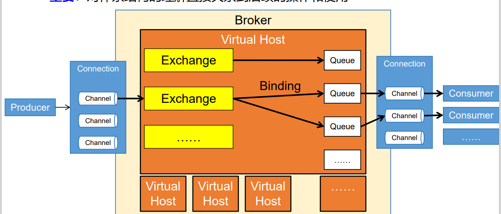
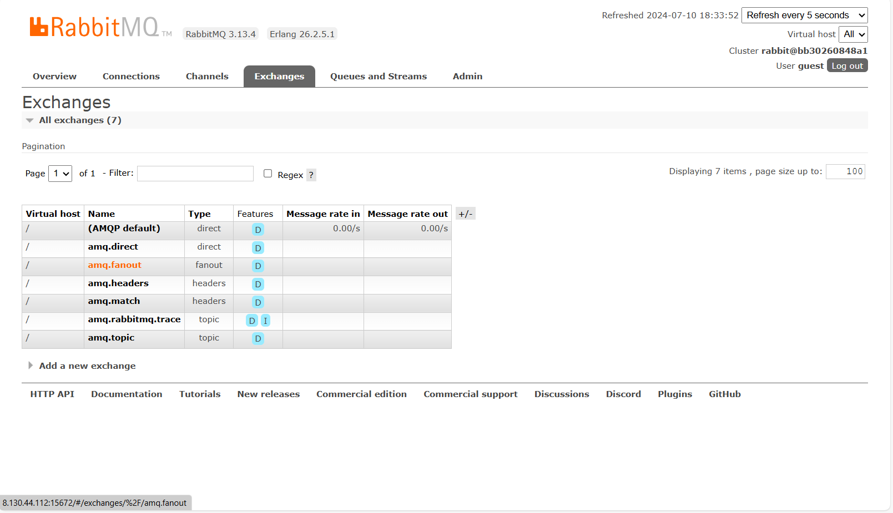
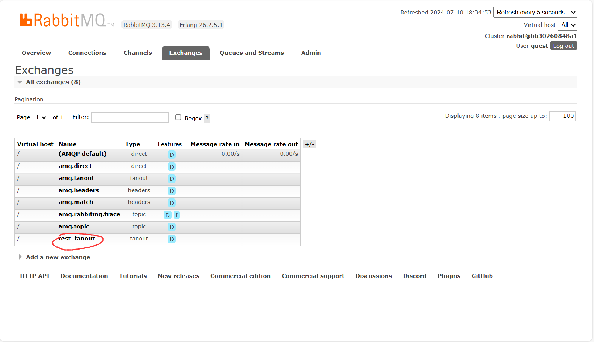
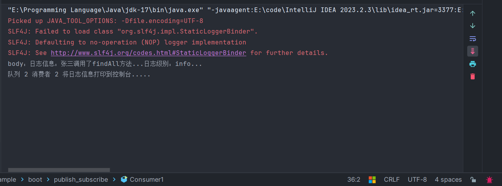
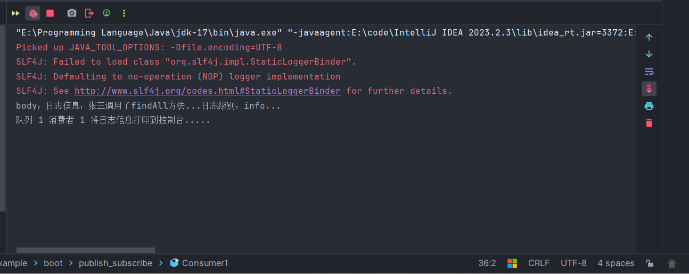
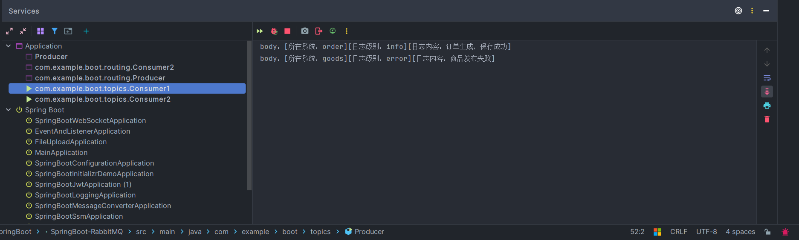
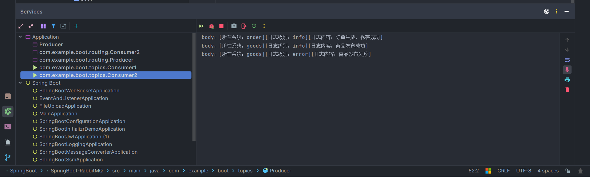

# RabbitMQ笔记

## 一、简介

## 二、安装

+ 为了简便，使用Docker进行安装

~~~sh
  # 拉取镜像
  docker pull rabbitmq:3.13-management
  # -d 参数：后台运行 Docker 容器
  # --name 参数：设置容器名称
  # -p 参数：映射端口号，格式是“宿主机端口号:容器内端口号”。5672供客户端程序访问，15672供后台管理界面访问
  # -v 参数：卷映射目录
  # -e 参数：设置容器内的环境变量，这里我们设置了登录RabbitMQ管理后台的默认用户和密码
  docker run -d \
  --name rabbitmq \
  -p 5672:5672 \
  -p 15672:15672 \
  -v rabbitmq-plugin:/plugins \
  -e RABBITMQ_DEFAULT_USER=guest \
  -e RABBITMQ_DEFAULT_PASS=123456 \
  rabbitmq:3.13-management

~~~

---

## 三、使用

### （一）HelloWorld

+ 首先创建一个项目
+ 导入依赖:

~~~xml
    <dependency>
        <groupId>com.rabbitmq</groupId>
        <artifactId>amqp-client</artifactId>
        <version>5.20.0</version>
    </dependency>
~~~

+ 编写[生产者代码](../../源码/SpringBoot/SpringBoot-RabbitMQ/src/main/java/com/example/boot/simple_queue/Producer.java)
+ 运行该类来发送消息，此时图形化网页也会出现两个图表

+ 接下来编写[消费者代码](../../源码/SpringBoot/SpringBoot-RabbitMQ/src/main/java/com/example/boot/simple_queue/Consumer.java)来消费消息

---

### （二）工作模式

+ RabbitMQ共有如下模式:
  + Simple Queues:即我们编写的HelloWorld，一个生产者生产，一个消费者消费
  + Work Queues:生产者生产的消息，可以被多个消费者竞争获取，但是每个消息最终只能被一个消费者消费
  + Publish/Subscribe:利用交换机的广播机制进行消息的转发
  + Routing:利用交换机的路由键匹配机制进行消息的转发
  + Topics:利用交换机的路由规则匹配机制进行消息的转发
  + Remote procedure call(RPC):
  + Publish Confirms
+ 另外，RabbitMQ的体系结构如下图所示:

  + Producer:生产消息的一方统称为Producer,即生产者
  + Connection:生产者和消费者需要与Broker之间建立连接，以发送消息
  + Broker:可以简单的理解为RabbitMQ服务器，负责消息的接收、存储和转发
  + Virtual Host:一个RabbitMQ可以有多个Virtual Host,每个Virtual Host都有自己的Exchange、Queue等，如果RabbitMQ是一个Excel文件，那么Virtual Host可以理解为一个个Sheet
  + Channel:生产者通过连接的管道来向队列发送消息，消费者通过连接的管道来读取消息
  + Exchange:交换机负根据一定的转发策略责转发消息，转发策略有多种，**它无法存储消息，因此如果没有任何队列匹配到交换机的转发策略，消息就会丢失**
  + Queue:队列负责装载消息，供消费者消费
  + Consumer:消息的消费者，用来读取消息并消费

#### ①Work Queues

+ 该模式就是生产者将消息发送到队列，多个消费者抢夺消息的控制权，谁抢到谁就消费

+ 为了方便起见，我们封装一个[工具类](../../源码/SpringBoot/SpringBoot-RabbitMQ/src/main/java/com/example/boot/utils/ConnectionUtil.java)
+ 定义一个[生产者](../../源码/SpringBoot/SpringBoot-RabbitMQ/src/main/java/com/example/boot/work_queue/Producer.java)，让其创建一个队列，并向队列中发送10条消息
+ 定义两个消费者，模拟多个消费者的情况
  + [消费者1](../../源码/SpringBoot/SpringBoot-RabbitMQ/src/main/java/com/example/boot/work_queue/Consumer1.java)
  + [消费者2](../../源码/SpringBoot/SpringBoot-RabbitMQ/src/main/java/com/example/boot/work_queue/Consumer2.java)
+ 启动时先启动两个消费者，最后启动生产者，就可以看到两个消费者各打印出了各自消费的消息数据
  + 如果先启动生产者，那么在启动第一个消费者的时候，第一个消费者会把消息全部消费，因为它消费的太快了，我们来不及启动第二个消费者它就消费完了

---

#### ②Publish/Subscribe

+ Publish/Subscribe就是通过Exchange（交换机）将生产者生产的消息**通过广播的方式**转发到对应队列中，从而让绑定了对应队列的消费者进行消费
  + 交换机常用的转发消息方式有三种:
    + `Fanout`:广播，将消息发送给所有绑定到交换机的队列
    + `Direct`:定向，把消息交给符合指定routing key的队列
    + `Topic`:通配符，把消息交给符合routing pattern（路由模式）的队列
  + Pubilsh/Subscribe使用的是广播模式
+ [生产者示例](../../源码/SpringBoot/SpringBoot-RabbitMQ/src/main/java/com/example/boot/publish_subscribe/Producer.java)、[消费者1示例](../../源码/SpringBoot/SpringBoot-RabbitMQ/src/main/java/com/example/boot/publish_subscribe/Consumer1.java)、[消费者2示例](../../源码/SpringBoot/SpringBoot-RabbitMQ/src/main/java/com/example/boot/publish_subscribe/Consumer2.java)
+ 生产者创建了两个队列，消费者1消费队列1，消费者2消费队列2，同时还创建了一个交换机，交换机同时绑定了这两个队列，使得交换机通过广播方式转发消息时，这两个队列都能收到

---

#### ③Routing

+ Routing就是Publish/Subscribe把交换机转发消息的方式由`Fanout`改为了`Direct`，利用路由键进行匹配
+ [生产者示例](../../源码/SpringBoot/SpringBoot-RabbitMQ/src/main/java/com/example/boot/routing/Producer.java)、[消费者1示例](../../源码/SpringBoot/SpringBoot-RabbitMQ/src/main/java/com/example/boot/routing/Consumer1.java)、[消费者2示例](../../源码/SpringBoot/SpringBoot-RabbitMQ/src/main/java/com/example/boot/routing/Consumer2.java)

---

#### ④Topics

+ Routing就是Publish/Subscribe把交换机转发消息的方式由`Fanout`改为了`Topics`，利用指定的路由规则进行匹配
+ [生产者示例](../../源码/SpringBoot/SpringBoot-RabbitMQ/src/main/java/com/example/boot/topics/Producer.java)、[消费者1示例](../../源码/SpringBoot/SpringBoot-RabbitMQ/src/main/java/com/example/boot/topics/Consumer1.java)、[消费者2示例](../../源码/SpringBoot/SpringBoot-RabbitMQ/src/main/java/com/example/boot/topics/Consumer2.java)

---

#### ⑤Publish Confirms

# 汇总

## 一、配置汇总

