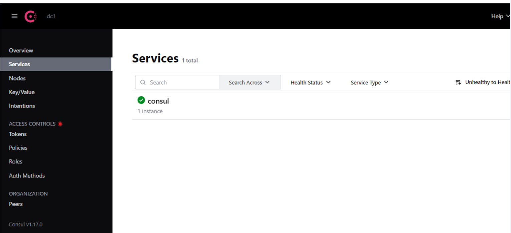
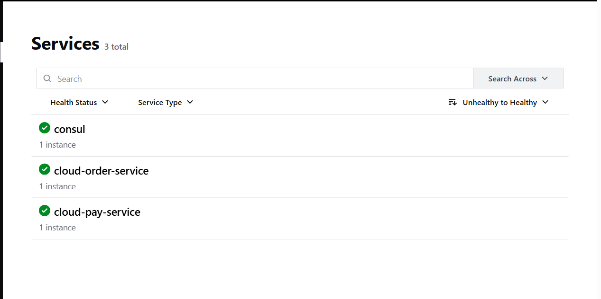
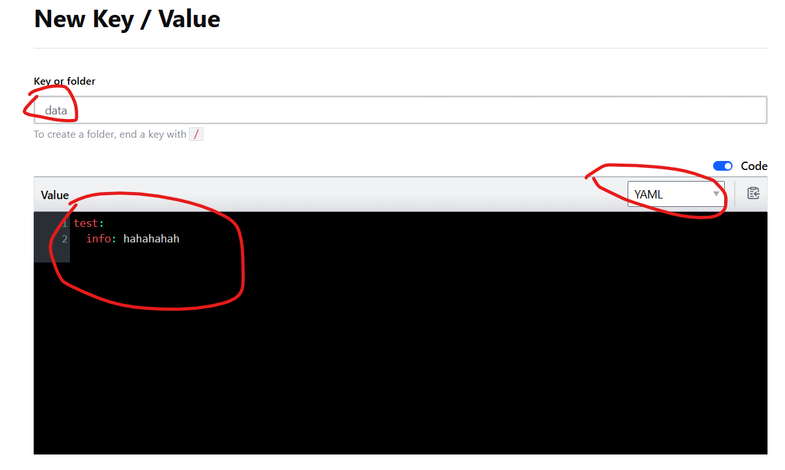
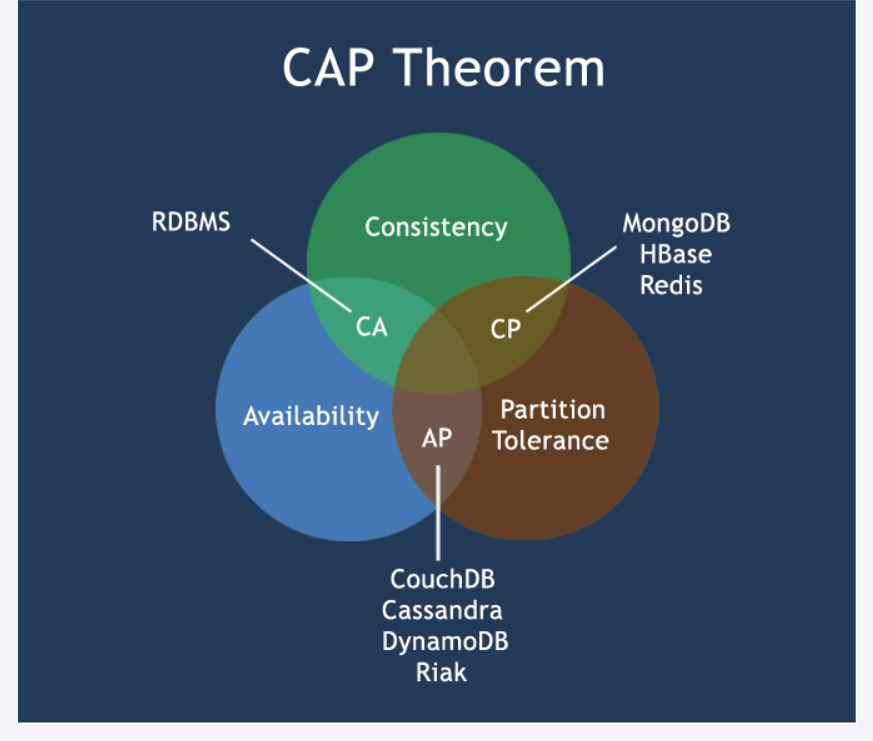
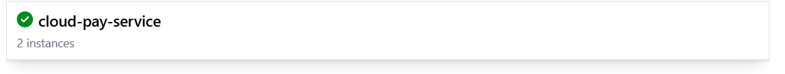
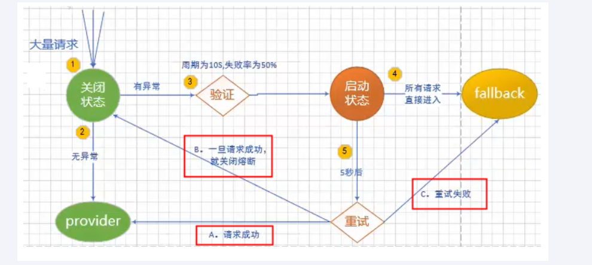

# SpringCloud笔记

## 一、概述

+ SpringCloud[官方文档](https://spring.io/projects/spring-cloud)
+ SpringCloudAlibaba[官方文档](https://sca.aliyun.com/)
+ **想使用SpringCloud,必须严格遵照官网提供的版本适配来搭配对应的依赖，否则可能会出现各种报错问题**

---

## 二、使用

### （一）consul

#### ①概述

+ 为什么使用consul:
  + 我们的微服务模块，如果想将请求转发给其它微服务模块，需要通过硬编码的方式记录下对应的微服务模块的模块服务host、端口和请求信息，如果对应的请求微服务模块的服务端口、host发生了变化，也需要同步修改硬编码。而随着模块数量的提升，硬编码将变得难以维护。
  + 如果系统中存在多个相同的微服务，无法实现微服务的负载均衡功能
+ Eureka:
  + Eureka已经停止更新
  + Eureka的自我保护机制，对初学者不友好
  + Eureka需要作为微服务的一个模块嵌入到微服务中去，但是这个玩意不是业务模块，我们希望该服务中心单独隔离出来，与微服务功能进行解耦
  + Nacos、consul等开源cloud组件的的崛起
+ consul能做什么
  + 服务发现:提供Http和DNS两种发现方式
  + 健康检测:支持多种方式，HTTP、TCP、Docker、Shell脚本定制化监控
  + KV存储:键值对的存储方式
  + 多数据中心:Consul支持多数据中心
  + 可视化Web界面
+ consul是干嘛的
  + 我们在通过RestTemplate对象转发请求调用时，如果没有consul，那么就是一种硬编码的情况，需要在代码中写死目的路径
  + 而consul可以帮助我们管理这些微服务模块，这样，我们的微服务模块就可以从硬编码转而向consul进行查询目的微服务模块信息，然后consul向其反馈对应路径从而得到目的路径，达到削弱服务之间关联性的目的
  + 因此，**consul就是集中管理微服务模块的**，它可以**建立微服务模块与其对应路径之间的映射**、**配置各微服务模块的全局配置**、**管理各微服务模块之间的状态和信息**以及其它作用

---

#### ②安装

+ [下载链接](https://developer.hashicorp.com/consul/install?product_intent=consul)
+ Windows它提供两种架构的下载，一种386(就是32位)，另一种是AMD64(一般如果电脑是64位的，下这个)
  + 不确定的通过`wmic cpu get AddressWidth`查看当前CPU处理位数
+ 下载好之后对压缩包进行解压，解压完以后就一个`consul.exe`文件，在该文件所在目录打开终端，输入`.\consul.exe --version`来查看版本情况。通过该步骤也可以判别下载的版本是否符合电脑CPU处理位数的版本
+ 如果安装成功，推荐把它加到环境变量里，即直接把它所在的目录路径加到环境变量的path中去
+ 输入`consul agent -dev`来以开发模式进行启动，启动后在[8500端口下](http://localhost:8500)可以看到如下界面，说明安装成功:

---

#### ③服务注册与发现

+ 我们需要把我们的模块注册进consul，因此需要先引入依赖:

~~~xml
    <!-- Spring-Cloud-Consul依赖 -->
    <dependency>
        <groupId>org.springframework.cloud</groupId>
        <artifactId>spring-cloud-starter-consul-discovery</artifactId>
    </dependency>   
~~~

+ 接下来进行配置文件的配置:

~~~yaml
    spring:
        application:
            name: cloud-pay-service
        cloud:
            consul:
                # 默认端口就是localhost
                host: localhost  
                # port端口默认是8500
                port: 8500
                # 我们想访问要进行请求的服务名称
                discovery:
                    service-name: ${spring.application.name}
~~~

+ 接下来在项目启动类上或者配置类上加上@EnableDiscoveryClient来开启微服务模块的服务发现
+ 同时在Controller可以改变一下硬编码，由之前的写host、port和请求路径改为写对应微服务模块在consul的注册名，如`http://cloud-pay-service`
+ 然后启动模块，就能看到consul服务页已经加入了该微服务模块了，刚开始可能是红的，过一会就会变绿

+ 尝试发送一个请求，如果此时使用了restTemplate进行请求转发，把它交给别的微服务模块处理，可能会导致问题
  + `java.net.UnknownHostException: xxx`
  + 这是因为consul默认开启负载均衡，但是我们的restTemplate却默认不支持负载均衡，因此我们需要在配置类中提供restTemplate的bean方法上添加@LoadBalanced让该restTemplate对象支持负载均衡，就没事了

---

#### ④服务配置与刷新

+ SpringCloud的存在使得我们的SpringBoot单体项目被划分为多个微服务模块，每个模块都有它们的专门的职责，这就导致了每个模块都需要给它们提供application.yml文件。每个模块的application.yml都会堆积大量的重复的配置，比如数据库连接配置。因此我们就希望有一个全局配置，该全局配置使得所有的微服务模块都生效，从而减少配置的冗余和后期维护工作量
+ consul提供了key-value键值型的配置，从而方便我们能够进行全局配置
  + 如果想使用该配置，我们需要先了解一些bootstrap.yml的相关知识
    + **bootstrap.yml中的配置一般优先级比同目录下application.yml文件的优先级更高**，它的配置会在application配置文件加载前被加载
    + 它**是系统级别的配置文件**，而application.yml是用户级别的配置文件，因此其优先级更高
    + Spring Cloud会创建一个“Bootstrap Context”，作为Spring应用的`Application Context`的父上下文。初始化的时候，`Bootstrap Context`负责从外部源加载配置属性并解析配置。这两个上下文共享一个从外部获取的`Environment`。
    + `Bootstrap`属性有高优先级，默认情况下，它们不会被本地配置覆盖。 `Bootstrap context`和`Application Context`有着不同的约定，所以新增了一个`bootstrap.yml`文件，保证`Bootstrap Context`和`Application Context`配置的分离。
    + **一般使用bootstrap.yml文件来设置springcloud相关的配置**
  + key-value键值配置
    + 首先我们需要打开[consul服务页](http://localhost:8500)
    + 选择它的Key/Value目录项
    + 刚打开的时候，配置是空的，现在我们需要按照这种格式来给它进行相关的配置:`config/xxx-xxx-xxx/data`
      + config是最外层目录，该**文件夹必须叫config**，创建文件夹时，需**要在后面加一个`/`它才知道要创建的是文件夹，否则consul会按文件生成**
      + 中间的`xxx-xxx-xxx`是我们的微服务相关的模块名称（不是微服务模块在consul的注册名称，而是spring.application.name配置的名称）+配置隔离的组名，如我们的微服务名叫`pay-component`，我们有三个隔离组，一个叫`prod`，一个叫`dev`，另一个默认(`default`)，那么我们就需要创建三个**文件夹**，分别叫`pay-component`（默认的配置不用加`default`）、`pay-component-prod`、`pay-component-dev`
      + 接下来是最后的data文件，这是个文件，就不用加`/`了，我们可以在下面的文本框写我们的配置，它提供各种格式的配置，在文本框的右上角可以选择配置格式，一般选择yaml。如果选择yaml，那么语法格式就和yaml是一样的（**这个文本框不认Tab键，会报语法错误**）
      
  + 现在我们已经配置好了，但是我们的微服务模块还需要进行一些配置才能读取到这些全局配置
    + 首先导入相关依赖:
    ~~~xml
        <dependency>
            <groupId>org.springframework.cloud</groupId>
            <artifactId>spring-cloud-starter-consul-config</artifactId>
        </dependency>
        <dependency>
            <groupId>org.springframework.cloud</groupId>
            <artifactId>spring-cloud-starter-bootstrap</artifactId>
        </dependency>
    ~~~
    + 然后是我们按照上面说的`config/xxx-xxx-xxx/data`格式来配置Key/Value配置的，这个玩意它的默认配置并不是这样的，它的默认配置实际上是`config/xxx,xxx,xxx/data`，但是这个用逗号分隔的操蛋配置实在是反人类，因此我们需要在`bootstrap.yml`文件中添加一些配置:
      + spring.cloud.consul.config.profile-separator配置项用来修改微服务模块要读取的全局配置的分隔符，要改成`'-'`
      + spring.cloud.consul.config.format配置项用来声明微服务模块要读取的全局配置的格式
      + spring.cloud.consul.config.watch.wait-time用来指定隔多少秒就刷新一次全局配置(默认55s)，这个不建议修改，因为它本来也会自己刷新的，就是慢点
      + [配置文件样例](../../源码/SpringCloud/SpringCloud-Pay/src/main/resources/bootstrap.yml)
    + 接下来是在启动类上添加@RefreshScope注解来支持刷新（貌似不加也能刷新）
    + [在controller进行测试](../../源码/SpringCloud/SpringCloud-Pay/src/main/java/com/example/cloud/controller/PayController.java)
+ 注意:
  + **Consul默认不会持久存储**，这意味着它的服务一旦停止再重启，之前的配置以及相关数据就没有了

---

#### ⑤持久化存储配置

+ 首先我们写一个bat脚本，内容如下:
  + 在consul.exe同级目录下新建一个mydata文件夹
  + consul.exe路径和持久化存储路径需要改成自己电脑上的

~~~bat
  @echo.服务启动......  
  @echo off  
  @sc create Consul binpath= "D:\devSoft\consul_1.17.0_windows_386\consul.exe agent -server -ui -bind=127.0.0.1 -client=0.0.0.0 -bootstrap-expect  1  -data-dir D:\devSoft\consul_1.17.0_windows_386\mydata"
  @net start Consul
  @sc config Consul start= AUTO  
  @echo.Consul start is OK......success
  @pause
~~~

+ 接下来**以管理员身份启动**，如果启动失败查看是不是配置有误（如果路径里面有空格，像一个文件夹叫`Program Files`这种玩意，我没找到什么解决办法）
+ 检查无误后，以**管理员身份运行bat文件**，如果之前运行过一次，需要**以管理员身份打开cmd**（不能是powershell，必须得是cmd），运行`sc delete Consul`删除服务进程
+ 像文件夹名字带空格的，推荐直接把它那个命令执行的代码扣出来直接放到bat文件然后执行:
  + 虽然会弹出一个命令行，但是持久化的目的也达到了，就是命令行会一直显示而已
  + 如果配置了consul的环境变量，直接写consul就行
  + 对于带空格的路径，需要用双引号包起来

~~~bat
  consul agent -server -ui -bind=127.0.0.1 -client=0.0.0.0 -bootstrap-expect  1  -data-dir "E:\Programming Language\Java\consul\mydata"
~~~

+ 这样就实现持久化存储了，启动以后打开mydata文件夹，就会看到里面已经有东西了

---

#### ⑥三大注册中心异同点

|组件名|编写语言|CAP|服务健康检查|对外暴露接口|SpringCloud集成|
|:---:|:---:|:---:|:---:|:---:|:---:|
|Eureka|Java|AP|可配支持|HTTP|已集成|
|Consul|Go|CP|支持|HTTP/DNS|已集成|
|Zookeeper|Java|CP|支持|客户端|已集成|

+ CAP，即分布式系统的CAP理论，它的核心是:**一个分布式系统不可能同时很好的满足一致性(Consistency)，可用性(Avaliability)和分区容错性(Partition tolerance)这三个需求，最多只能较好的满足两个**
  
  + CA - 单点集群，满足一致性，可用性的系统，通常在可扩展性上不太强大，
  + CP - 满足一致性，分区容忍必的系统，通常性能不是特别高。Consul和Zookeeper都是选择牺牲可用性来获取数据一致性
  + AP - 满足可用性，分区容忍性的系统，通常可能对一致性要求低一些。Eureka就是采用的该方式，它为了保证可用性，在数据不一致时，就会返回老的数据来保证可用性

---

### （二）LoadBalancer

#### ①导入依赖

+ 一般情况下，引入的`spring-cloud-starter-consul-discovery`这一场景默认就导入了`spring-cloud-starter-loadbalancer`了

~~~xml
    <dependency>
      <groupId>org.springframework.cloud</groupId>
      <artifactId>spring-cloud-starter-loadbalancer</artifactId>
    </dependency> 
~~~

#### ②使用

+ LoadBalancer是专门用来对请求进行负载均衡的组件
  + 负载均衡有两种方式:
    + 客户端负载均衡:即SpringCloudCommon中的LoadBalancer采用的负载均衡方式，它会先得到请求的目的路径对应的所有上线的服务列表，然后让客户端自己选择一个地址，最后的决定权在客户端手里，因此是客户端的负载均衡
    + 服务端负载均衡:即Nginx的负载均衡方式，请求会在到达服务器之前先到达Nginx，由Nginx来统一分配请求去向来达到各服务器的负载均衡
  + 默认LoadBalancer采用的负载均衡方式就是**轮询**
+ 测试负载均衡需要至少两个相同功能不同端口的微服务模块，我们直接在之前的基础上再新建一个模块，把对应模块的东西全复制过来再改一下端口就行了
  + [微服务模块1](../../源码/SpringCloud/SpringCloud-Pay/src/main/resources/application.yml)
  + [微服务模块2](../../源码/SpringCloud/SpringCloud-Pay-8002/src/main/resources/application.yml)
  + 从consul服务页可以看到它的启动之后同样的服务有两个实例:
  
+ 接下来启动带RestTemplate的微服务模块，进行负载均衡
  + 实际上，引入的`spring-cloud-starter-consul-discovery`这一场景默认就导入了`spring-cloud-starter-loadbalancer`了，我们无需再导入
+ 测试:`http://localhost/order/pay/get/info`
  + 可以观察到默认采用的是轮询算法

---

#### ③变换均衡算法

+ 默认的负载均衡算法是轮询算法，如果我们想修改的话，示例如下:

~~~java
  @Configuration
  // value的值必须与对应的微服务模块(是restTemplate要转发的请求的微服务，不是它所在的微服务模块)在consul注册的名称保持一致
  // configuration需要写提供了restTemplate和负载均衡算法对象的bean的配置类的Class对象
  @LoadBalancerClient(value = "cloud-pay-service",configuration = RestTemplateConfig.class)
  public class RestTemplateConfig {
      @Bean
      @LoadBalanced
      public RestTemplate restTemplate(){
          return new RestTemplate();
      }

      @Bean
      ReactorLoadBalancer<ServiceInstance> randomLoadBalancer(Environment environment,
                                                              LoadBalancerClientFactory loadBalancerClientFactory) {
          String name = environment.getProperty(LoadBalancerClientFactory.PROPERTY_NAME);

          return new RandomLoadBalancer(loadBalancerClientFactory.getLazyProvider(name, ServiceInstanceListSupplier.class), name);
      }
  }

~~~

+ 该示例来自[Spring官方文档](https://docs.spring.io/spring-cloud-commons/reference/spring-cloud-commons/loadbalancer.html#switching-between-the-load-balancing-algorithms)

---

#### ④负载均衡算法

+ 官方提供了两种负载均衡算法:
  + 轮询:`RoundRobinLoadBalancer`，这是默认的算法
  + 随机:`RandomLoadBalancer`
+ 如果我们想自定义轮询算法的话，那么只需要根据上面两个类照葫芦画瓢就行了

---

### （三）OpenFeign

#### ①导入依赖

~~~xml
  <!-- openfeign依赖 -->
  <dependency>
      <groupId>org.springframework.cloud</groupId>
      <artifactId>spring-cloud-starter-openfeign</artifactId>
  </dependency>
~~~

---

#### ②使用

+ OpenFeign向我们提供了一种便捷的通过接口调用服务模块的方式，我们只需要定义接口然后使用即可
+ 首先需要定义接口:
  + 接口一般写在common的微服务模块内，因为可能会有多个consumer微服务模块都需要调用相同的服务
  + 接口需要被注解@FeignClient注解作用，使用value属性来指定该接口要调用的微服务模块，属性值为微服务模块在consul上的注册名
  + 接口方法参照对应微服务模块的controller层的方法进行填写，大致上就是请求接收什么参数，我们就填什么参数，请求是什么类型，我们就上什么类型的注解
    + 如果微服务模块的controller层的一些参数是通过读取配置文件或者什么方式来得到的（就是不需要客户端提供的），我们就不写
    + [接口样例](../../源码/SpringCloud/SpringCloud-Common-API/src/main/java/com/example/cloud/apis/PayFeignApi.java)
+ 然后在消费的微服务模块（也就是客户端可以直接请求的模块）的启动类上添加@EnableFeignClients来开启OpenFeign的功能
+ 接下来在消费的微服务模块添加controller类
  + 通过依赖注入刚才定义的接口对象
  + 在相关的请求方法中通过接口对象来调用相关服务
  + [controller样例](../../源码/SpringCloud/SpringCloud-Feign-80/src/main/java/com/example/cloud/controller/OrderController.java)
+ 然后进行测试

---

#### ③超时控制

+ 我们可以通过
  + `spring.cloud.openfeign.client.config.default.connect-timeout`来设置连接的超时时间（单位:毫秒）。默认2s
  + `spring.cloud.openfeign.client.config.default.read-timeout`来设置等待服务响应的超时时间（单位:毫秒），默认60s
  + 或者自定义:
    + 就是把中间的`default`换成对应微服务模块在consul上面的注册名即可
    + 例:`spring.cloud.openfeign.client.config.pay-module.read-timeout`
+ 我们可以自己手动在服务模块上面让进程休眠62s来观察是否报错

---

#### ④请求重试

+ 如果请求出现了问题，OpenFeign默认是不进行重试的，但我们可以手动配置
+ 我们需要在配置类上提供一个Retryer对象，一般都提供Retryer.Default内部类对象
+ [配置类样例](../../源码/SpringCloud/SpringCloud-Feign-80/src/main/java/com/example/cloud/config/FeignConfig.java)
+ 如果重试了多次，但是只报了一次错，这是正常的

---

#### ⑤修改默认HttpClient

+ 如果不做特殊配置，OpenFeign默认使用JDK自带的HttpURLConnection发送HTTP请求
+ 由于默认HttpURLConnection没有连接池、性能和效率比较低，如果采用默认，性能上不是最牛逼的，所以要给它配个更牛逼的东西
+ 首先导入依赖:

~~~xml
  <!-- httpclient5-->
  <dependency>
      <groupId>org.apache.httpcomponents.client5</groupId>
      <artifactId>httpclient5</artifactId>
      <version>5.3</version>
  </dependency>
  <!-- feign-hc5-->
  <dependency>
      <groupId>io.github.openfeign</groupId>
      <artifactId>feign-hc5</artifactId>
      <version>13.1</version>
  </dependency>
~~~

+ 接下来开启配置:

~~~properties
  spring.cloud.openfeign.httpclient.hc5.enabled=true
~~~

+ 重新测试，发现报错信息变化，说明已经配好了

---

#### ⑥请求响应压缩

+ Spring Cloud OpenFeign支持对请求和响应进行GZIP压缩，以减少通信过程中的性能损耗
+ 通过下面的两个参数设置，就能开启请求与相应的压缩功能
  + `spring.cloud.openfeign.compression.request.enabled=true`:该配置用来开启请求压缩
  + `spring.cloud.openfeign.compression.response.enabled=true`:该配置用来开启响应压缩
+ 我们也能进行一些粒度更细的压缩设置:

~~~properties
  spring.cloud.openfeign.compression.request.enabled=true  # 开启请求压缩

  spring.cloud.openfeign.compression.request.mime-types=text/xml,application/xml,application/json #触发压缩数据类型，这时默认的三个类型

  spring.cloud.openfeign.compression.request.min-request-size=2048 #最小触发压缩的大小
~~~

---

#### ⑦日志打印

+ OpenFeign提供日志打印的功能，从而让我们了解到请求过程中的细节，从而实现对Feign接口的调用情况进行监控和输出
+ OpenFeign的日志有四个级别:
  + NONE：默认的，不显示任何日志；
  + BASIC：仅记录请求方法、URL、响应状态码及执行时间；
  + HEADERS：除了 BASIC 中定义的信息之外，还有请求和响应的头信息；
  + FULL：除了 HEADERS 中定义的信息之外，还有请求和响应的正文及元数据。
  + 一般我们根据需要来设置相对应的日志级别来查看
+ 该级别需要我们通过配置类提供对应的bean来实现:

~~~java
    @Bean
    public Logger.Level loggerLevel(){
        return Logger.Level.FULL;
    }
~~~

+ 接下来写一段yml文件配置，它的日志配置是这样的:`logging.level + 含有@FeignClient注解的完整带包名的接口名+debug`，例:`logging.level.com.example.cloud.apis.PayFeignApi: debug`，即针对`com.example.cloud.apis`包下的`PayFeignApi`接口在其方法执行时进行日志打印
+ 通过日志配置，可以清晰地看到我们上面的请求/响应压缩配置以及请求重试的情况

---

### （四）Resilience4j

+ [官方](https://github.com/resilience4j/resilience4j)
+ [resilience4j中文手册(非官方)](https://github.com/lmhmhl/Resilience4j-Guides-Chinese/blob/main/index.md)

#### ①概述

+ Resilience4j是实现了Spring官方提供的Spring Cloud Circuit Breaker规范，用于替代Netflix已不再更新的Hystrix，它可以进行如下服务:
  + 服务熔断:用于避免服务雪崩
  + 服务降级:服务出现问题时，如果对应服务无法相应的话，需要返回一个友好提示
  + 服务限流:高并发的情况下，限制单位时间内请求的数量
  + 服务限时
  + 服务预热
  + 接近实时的监控
  + 兜底的处理工作
+ **服务雪崩**
  + 多个微服务之间调用的时候，假设微服务A调用微服务B和微服务C，微服务B和微服务C又调用其它的微服务，这就是所谓的“扇出”。如果扇出的链路上某个微服务的调用响应时间过长或者不可用，对微服务A的调用就会占用越来越多的系统资源，进而引起系统崩溃，所谓的“雪崩效应”。
  + 通常当你发现一个模块下的某个实例失败后，这时候这个模块依然还会接收流量，然后这个有问题的模块还调用了其他的模块，这样就会发生级联故障，或者叫雪崩
  + 服务雪崩会导致服务之间的延迟增加、系统资源紧张，并可能导致系统发生更多的级联故障

---

#### ②服务熔断

##### Ⅰ理论概述

+ 服务熔断是通过断路器来实现的，断路器类似于家里的电器保险丝，当请求量过大导致服务模块崩溃时，熔断器会主动阻断继续向服务模块发送的请求，以减轻服务模块的压力，期望它能从崩溃状态恢复过来
+ 断路器有三个普通状态，以及两个特殊状态
  + 三大普通状态:
    + CLOSED（关闭）:服务模块没有问题，服务正常运作，断路器不会进行干涉。该状态下断路器会按一定策略监控请求与响应结果，当请求的错误率到达或超过阈值线时，进入OPEN状态
    + OPEN（开启）:服务模块出现问题，断路器阻断后续请求。
    + HALF_OPEN（半开状态）:断路器总不能一直处于OPEN状态，因此断路器会根据一定的策略，在OPEN一段时间后将状态转为HALF_OPEN状态，并放一小部分请求过去计算错误率，如果错误率低于阈值，那么说明服务已经恢复了，则断路器进入CLOSED状态。如果错误率高于阈值，那么继续转到OPEN态
  + 特殊状态:
    + DISABLED:无论出现什么问题，都始终允许访问，相当于断路器不存在
    + FORCED_OPEN:无论出什么问题，都拒绝访问，相当于该服务模块实际上已经不对外开放
    + 这是两个极端，除状态转换外，不会生成熔断器事件，也不会记录事件的成功或失败，推出这两个状态的方法是触发状态转换或重置熔断器。因此这两个状态仅存在于官网理论中

---

##### Ⅱ使用

+ 导入依赖:

~~~xml
  <!--resilience4j-circuitbreaker-->
  <dependency>
      <groupId>org.springframework.cloud</groupId>
      <artifactId>spring-cloud-starter-circuitbreaker-resilience4j</artifactId>
  </dependency>
  <!-- 由于断路保护等需要AOP实现，所以必须导入AOP包 -->
  <dependency>
      <groupId>org.springframework.boot</groupId>
      <artifactId>spring-boot-starter-aop</artifactId>
  </dependency>
~~~

+ 为了测试服务熔断，我们需要手动在对应的服务模块添加测试方法，同时添加OpenFeign的相关API接口方法
+ 服务模块可能会被多个业务模块调用，如果我们把断路器放在服务模块上，那么当它处理一个业务模块的调用出现异常时，所有的业务模块就都不能调用它了，这显然会降低服务效率。因此，我们的断路器是需要放在调用方上的，而不是放在被调用方（服务模块）上
+ 所以在调用模块的配置文件中进行如下配置:

~~~yml
# 这是两个模式的通用配置
spring:
  cloud:
    openfeign:
      circuitbreaker:
        group:
          enabled: true  
        enabled: true  # 使断路器能够干涉OpenFeign的操作
# 下面是计数模式
resilience4j:
  circuitbreaker:
    configs:
      default:
        failure-rate-threshold: 50  # 只要请求有50%处理失败，就进行熔断
        sliding-window-type: COUNT_BASED
        sliding-window-size: 6  # 表示每个时间间隔中基本的请求数量为6
        minimum-number-of-calls: 6 # 表示一个时间间隔内请求数量超过该值时，才会进行熔断的判断，否则即使在该值以下的请求数量全部处理失败的情况下，也不会进行服务熔断。通常该值与上一项的值保持一致
        automatic-transition-from-open-to-half-open-enabled: true  # 是否启用让断路器在开启后，自动过渡到半开状态。如果设置为false，那么就是在该服务收到调用才尝试过渡
        wait-duration-in-open-state: 5s
        record-exceptions:
          - java.lang.Exception  # 需要记录的异常类型
    instances:  # 设置遵循上面配置规则的实例
      cloud-pay-service:  # 这里写要调用的微服务模块在Consul上面的注册名
        base-config: default  # 默认的配置遵循default配置

# 如果想按时间进行配置，请参考如下配置:
resilience4j:
  circuitbreaker:
    configs:
      default:
        failure-rate-threshold: 50  # 当请求有50%处理失败，就进行熔断
        sliding-window-type: TIME_BASED  # 设置断路的匹配模式
        slow-call-duration-threshold: 2s  # 表示调用多长时间是慢调用，即满调用的评判标准，这个慢调用是调用慢，但是它还是成功响应了
        slow-call-rate-threshold: 30  # 表示慢调用占用百分比阈值，当单位时间内满调用请求占总请求比例到达该时，断路器进入OPEN状态
        sliding-window-size: 2  # 设置滑动窗口大小，在该模式下表示2s
        minimum-number-of-calls: 2  # 设置断路器计算失败率或慢调用率之前所需的最小样本
        permitted-number-of-calls-in-half-open-state: 2  # 断路器转换到半开状态时放行的请求数
        automatic-transition-from-open-to-half-open-enabled: true  # 是否启用让断路器在开启后，自动过渡到半开状态。如果设置为false，那么就是在该服务收到调用才尝试过渡
        wait-duration-in-open-state: 5s  # 设置断路器到达OPEN状态时间隔多长时间转为HALF_OPEN状态
        record-exceptions:
          - java.lang.Exception # 需要记录的异常类型，该类型的异常会被认为是调用失败
    instances:
      cloud-pay-service:  # 这里写要调用的微服务模块在Consul上面的注册名
        base-config: default  # 默认的配置遵循default配置
timelimiter:
  configs:
    default:
      timeout-duration: 10s  # 该配置表示调用超过该秒数就进行服务降级，不再进行短路判断，因此需要把值设置的长一点 

~~~

+ 在调用模块的对应controller类中的调用方法上添加@CircuitBreaker注解，该注解用来使resilience4j在方法调用对应服务模块时，如果出现服务故障，那么进行服务降级将保底的返回值返回回去，同时触发断路器效果
+ 在调用模块的controller类中增加对应的fallback方法，该方法是进行服务降级所调用的方法，它的格式如下
  + 返回值与处理请求的handler方法返回值一致
  + 方法参数包含handler方法的全部参数列表，同时最后一个参数是异常类型的参数，表示此次进行服务降级的异常信息
+ **全局异常处理的存在会干扰断路器的判断，在测试时将全局异常管理关掉**
+ [配置文件](../../源码/SpringCloud/SpringCloud-Feign-80/src/main/resources/application.yml)
+ [API接口](../../源码/SpringCloud/SpringCloud-Common-API/src/main/java/com/example/cloud/apis/PayFeignApi.java)
+ [服务模块的测试服务熔断的controller类](../../源码/SpringCloud/SpringCloud-Pay/src/main/java/com/example/cloud/controller/ResilienceController.java)
+ [调用模块的测试服务熔断的controller类](../../源码/SpringCloud/SpringCloud-Feign-80/src/main/java/com/example/cloud/controller/OrderResilienceController.java)

---

#### ②舱壁隔离

##### Ⅰ理论概述

+ 舱壁隔离可以限制并发执行的数量
+ 舱壁隔离有两种基本的实现方式
  + 通过信号量进行隔离，这是默认的方式
    + 它通过指定最大服务调用的并发数量和等待时长来达到限制目的
  + 通过线程池进行隔离
    + 它通过指定线程池的最大大小、核心大小和请求队列长度来达到限制目的

---

##### Ⅱ使用

+ 导入依赖:

~~~xml
        <!--resilience4j-circuitbreaker-->
        <dependency>
            <groupId>org.springframework.cloud</groupId>
            <artifactId>spring-cloud-starter-circuitbreaker-resilience4j</artifactId>
        </dependency>
~~~

+ 编写配置

~~~yml

resilience4j:
  timelimiter:
    configs:
      default:
        timeout-duration: 10s  # 该配置表示调用超过该秒数就进行服务降级，不再进行断路判断，因此需要把值设置的长一点
  # 通过线程池进行限制，推荐，主要是因为这个我测试着没什么问题
  thread-pool-bulkhead:
    configs:
      default:
        core-thread-pool-size: 1  # 线程池的核心线程数量
        max-thread-pool-size: 1 # 线程池的最大线程数量
        queue-capacity: 1  # 线程到达线程池最大数量时，多余的请求会加入队列，这里声明队列容量
  # ------------ 通过信号量进行并发限制---------------
  bulkhead:
    configs:
      default:
        max-concurrent-calls: 2  # 允许并发执行的最大数量，但是实际的测试结果貌似在说明一次请求会占用两个并发量，默认值是25
        max-wait-duration: 1s  # 并发量（即上面声明的值）全部被占用时，再有请求来，如果等待的数值超过该值，那么进行服务降级处理.默认值是0s
    instances:
      cloud-pay-service:
        base-config: default
~~~

+ 编写相关服务模块的方法和Feign接口对应方法
+ 在调用模块中进行调用
+ 为调用模块中的方法添加@Bulkhead注解
  + name属性填写调用的服务模块在Consul上面的注册名
  + fallbackMethod写服务降级的处理方法
  + type指明隔离方式，点开该注解就能看到，默认的隔离方式是SEMAPHORE
+ 如果是使用的线程池的方式，那么返回值有一些不同，需要这样调用:
  + 且返回值类型声明为CompletableFuture<泛型为lambda表达式返回类型>
  + 如果不这样写的话，@Bulkhead注解上面的type属性如果写THREADPOOL，那么不管配置文件配置的线程池容量和请求队列容量有多大，请求必降级
  + **注意，handler方法的返回值变了，fallback方法的返回值也需要跟着变化**
  + 或者也可以不这样写，也使用传统的调用FeignAPI的方式，但是@Bulkhead注解上面的type属性需要写SEMAPHORE，**这个是我自己瞎捣鼓试出来的**
~~~java
  return CompletableFuture.supplyAsync(() -> payFeignApi.getBulkheadInfo(id) + "\t" + " Bulkhead.Type.THREADPOOL");
~~~ 
+ 进行测试
  + 本人测试时，经过浏览器和Postman的共同测试，结果都是**一次请求占用了两个并发单位**，即max-concurrent-calls填4的话，2个并发请求就能占满这4个并发量，第三个请求来的时候，等待超时直接降级，**不是很明白这是为什么**
  + 进行线程池的测试时，
  + 总结:使用**线程池+@Bulkhead注解的type属性为SEMAPHORE+通过FeignAPI进行请求调用**是正常的，虽然很奇怪，但是确实是正常的
  + 总之，测试的运行结果与本人实际理解的，想要的结果不一致