# SpringCloud笔记

## 一、概述

+ SpringCloud[官方文档](https://spring.io/projects/spring-cloud)
+ SpringCloudAlibaba[官方文档](https://sca.aliyun.com/)
+ **想使用SpringCloud,必须严格遵照官网提供的版本适配来搭配对应的依赖，否则可能会出现各种报错问题**

---

## 二、使用

### （一）consul

#### ①概述

+ 为什么使用consul:
  + 我们的微服务模块，如果想将请求转发给其它微服务模块，需要通过硬编码的方式记录下对应的微服务模块的模块服务host、端口和请求信息，如果对应的请求微服务模块的服务端口、host发生了变化，也需要同步修改硬编码。而随着模块数量的提升，硬编码将变得难以维护。
  + 如果系统中存在多个相同的微服务，无法实现微服务的负载均衡功能
+ Eureka:
  + Eureka已经停止更新
  + Eureka的自我保护机制，对初学者不友好
  + Eureka需要作为微服务的一个模块嵌入到微服务中去，但是这个玩意不是业务模块，我们希望该服务中心单独隔离出来，与微服务功能进行解耦
  + Nacos、consul等开源cloud组件的的崛起
+ consul能做什么
  + 服务发现:提供Http和DNS两种发现方式
  + 健康检测:支持多种方式，HTTP、TCP、Docker、Shell脚本定制化监控
  + KV存储:键值对的存储方式
  + 多数据中心:Consul支持多数据中心
  + 可视化Web界面
+ consul是干嘛的
  + 我们在通过RestTemplate对象转发请求调用时，如果没有consul，那么就是一种硬编码的情况，需要在代码中写死目的路径
  + 而consul可以帮助我们管理这些微服务模块，这样，我们的微服务模块就可以从硬编码转而向consul进行查询目的微服务模块信息，然后consul向其反馈对应路径从而得到目的路径，达到削弱服务之间关联性的目的
  + 因此，**consul就是集中管理微服务模块的**，它可以**建立微服务模块与其对应路径之间的映射**、**配置各微服务模块的全局配置**、**管理各微服务模块之间的状态和信息**以及其它作用

---

#### ②安装

+ [下载链接](https://developer.hashicorp.com/consul/install?product_intent=consul)
+ Windows它提供两种架构的下载，一种386(就是32位)，另一种是AMD64(一般如果电脑是64位的，下这个)
  + 不确定的通过`wmic cpu get AddressWidth`查看当前CPU处理位数
+ 下载好之后对压缩包进行解压，解压完以后就一个`consul.exe`文件，在该文件所在目录打开终端，输入`.\consul.exe --version`来查看版本情况。通过该步骤也可以判别下载的版本是否符合电脑CPU处理位数的版本
+ 如果安装成功，推荐把它加到环境变量里，即直接把它所在的目录路径加到环境变量的path中去
+ 输入`consul agent -dev`来以开发模式进行启动，启动后在[8500端口下](http://localhost:8500)可以看到如下界面，说明安装成功:

---

#### ③服务注册与发现

+ 我们需要把我们的模块注册进consul，因此需要先引入依赖:

~~~xml
    <!-- Spring-Cloud-Consul依赖 -->
    <dependency>
        <groupId>org.springframework.cloud</groupId>
        <artifactId>spring-cloud-starter-consul-discovery</artifactId>
    </dependency>   
~~~

+ 接下来进行配置文件的配置:

~~~yaml
    spring:
        application:
            name: cloud-pay-service
        cloud:
            consul:
                # 默认端口就是localhost
                host: localhost  
                # port端口默认是8500
                port: 8500
                # 我们想访问要进行请求的服务名称
                discovery:
                    service-name: ${spring.application.name}
~~~

+ 接下来在项目启动类上或者配置类上加上@EnableDiscoveryClient来开启微服务模块的服务发现
+ 同时在Controller可以改变一下硬编码，由之前的写host、port和请求路径改为写对应微服务模块在consul的注册名，如`http://cloud-pay-service`
+ 然后启动模块，就能看到consul服务页已经加入了该微服务模块了，刚开始可能是红的，过一会就会变绿

+ 尝试发送一个请求，如果此时使用了restTemplate进行请求转发，把它交给别的微服务模块处理，可能会导致问题
  + `java.net.UnknownHostException: xxx`
  + 这是因为consul默认开启负载均衡，但是我们的restTemplate却默认不支持负载均衡，因此我们需要在配置类中提供restTemplate的bean方法上添加@LoadBalanced让该restTemplate对象支持负载均衡，就没事了

---

#### ④服务配置与刷新

+ SpringCloud的存在使得我们的SpringBoot单体项目被划分为多个微服务模块，每个模块都有它们的专门的职责，这就导致了每个模块都需要给它们提供application.yml文件。每个模块的application.yml都会堆积大量的重复的配置，比如数据库连接配置。因此我们就希望有一个全局配置，该全局配置使得所有的微服务模块都生效，从而减少配置的冗余和后期维护工作量
+ consul提供了key-value键值型的配置，从而方便我们能够进行全局配置
  + 如果想使用该配置，我们需要先了解一些bootstrap.yml的相关知识
    + **bootstrap.yml中的配置一般优先级比同目录下application.yml文件的优先级更高**，它的配置会在application配置文件加载前被加载
    + 它**是系统级别的配置文件**，而application.yml是用户级别的配置文件，因此其优先级更高
    + Spring Cloud会创建一个“Bootstrap Context”，作为Spring应用的`Application Context`的父上下文。初始化的时候，`Bootstrap Context`负责从外部源加载配置属性并解析配置。这两个上下文共享一个从外部获取的`Environment`。
    + `Bootstrap`属性有高优先级，默认情况下，它们不会被本地配置覆盖。 `Bootstrap context`和`Application Context`有着不同的约定，所以新增了一个`bootstrap.yml`文件，保证`Bootstrap Context`和`Application Context`配置的分离。
    + **一般使用bootstrap.yml文件来设置springcloud相关的配置**
  + key-value键值配置
    + 首先我们需要打开[consul服务页](http://localhost:8500)
    + 选择它的Key/Value目录项
    + 刚打开的时候，配置是空的，现在我们需要按照这种格式来给它进行相关的配置:`config/xxx-xxx-xxx/data`
      + config是最外层目录，该**文件夹必须叫config**，创建文件夹时，需**要在后面加一个`/`它才知道要创建的是文件夹，否则consul会按文件生成**
      + 中间的`xxx-xxx-xxx`是我们的微服务相关的模块名称（不是微服务模块在consul的注册名称，而是spring.application.name配置的名称）+配置隔离的组名，如我们的微服务名叫`pay-component`，我们有三个隔离组，一个叫`prod`，一个叫`dev`，另一个默认(`default`)，那么我们就需要创建三个**文件夹**，分别叫`pay-component`（默认的配置不用加`default`）、`pay-component-prod`、`pay-component-dev`
      + 接下来是最后的data文件，这是个文件，就不用加`/`了，我们可以在下面的文本框写我们的配置，它提供各种格式的配置，在文本框的右上角可以选择配置格式，一般选择yaml。如果选择yaml，那么语法格式就和yaml是一样的（**这个文本框不认Tab键，会报语法错误**）
      
  + 现在我们已经配置好了，但是我们的微服务模块还需要进行一些配置才能读取到这些全局配置
    + 首先导入相关依赖:
    ~~~xml
        <dependency>
            <groupId>org.springframework.cloud</groupId>
            <artifactId>spring-cloud-starter-consul-config</artifactId>
        </dependency>
        <dependency>
            <groupId>org.springframework.cloud</groupId>
            <artifactId>spring-cloud-starter-bootstrap</artifactId>
        </dependency>
    ~~~
    + 然后是我们按照上面说的`config/xxx-xxx-xxx/data`格式来配置Key/Value配置的，这个玩意它的默认配置并不是这样的，它的默认配置实际上是`config/xxx,xxx,xxx/data`，但是这个用逗号分隔的操蛋配置实在是反人类，因此我们需要在`bootstrap.yml`文件中添加一些配置:
      + spring.cloud.consul.config.profile-separator配置项用来修改微服务模块要读取的全局配置的分隔符，要改成`'-'`
      + spring.cloud.consul.config.format配置项用来声明微服务模块要读取的全局配置的格式
      + spring.cloud.consul.config.watch.wait-time用来指定隔多少秒就刷新一次全局配置(默认55s)，这个不建议修改，因为它本来也会自己刷新的，就是慢点
      + [配置文件样例](../../源码/SpringCloud/SpringCloud-Pay/src/main/resources/bootstrap.yml)
    + 接下来是在启动类上添加@RefreshScope注解来支持刷新（貌似不加也能刷新）
    + [在controller进行测试](../../源码/SpringCloud/SpringCloud-Pay/src/main/java/com/example/cloud/controller/PayController.java)
+ 注意:
  + **Consul默认不会持久存储**，这意味着它的服务一旦停止再重启，之前的配置以及相关数据就没有了

---

#### ⑤持久化存储配置

+ 首先我们写一个bat脚本，内容如下:
  + 在consul.exe同级目录下新建一个mydata文件夹
  + consul.exe路径和持久化存储路径需要改成自己电脑上的

~~~bat
  @echo.服务启动......  
  @echo off  
  @sc create Consul binpath= "D:\devSoft\consul_1.17.0_windows_386\consul.exe agent -server -ui -bind=127.0.0.1 -client=0.0.0.0 -bootstrap-expect  1  -data-dir D:\devSoft\consul_1.17.0_windows_386\mydata"
  @net start Consul
  @sc config Consul start= AUTO  
  @echo.Consul start is OK......success
  @pause
~~~

+ 接下来**以管理员身份启动**，如果启动失败查看是不是配置有误（如果路径里面有空格，像一个文件夹叫`Program Files`这种玩意，我没找到什么解决办法）
+ 检查无误后，以**管理员身份运行bat文件**，如果之前运行过一次，需要**以管理员身份打开cmd**（不能是powershell，必须得是cmd），运行`sc delete Consul`删除服务进程
+ 像文件夹名字带空格的，推荐直接把它那个命令执行的代码扣出来直接放到bat文件然后执行:
  + 虽然会弹出一个命令行，但是持久化的目的也达到了，就是命令行会一直显示而已
  + 如果配置了consul的环境变量，直接写consul就行
  + 对于带空格的路径，需要用双引号包起来

~~~bat
  consul agent -server -ui -bind=127.0.0.1 -client=0.0.0.0 -bootstrap-expect  1  -data-dir "E:\Programming Language\Java\consul\mydata"
~~~

+ 这样就实现持久化存储了，启动以后打开mydata文件夹，就会看到里面已经有东西了

---

#### ⑥三大注册中心异同点

|组件名|编写语言|CAP|服务健康检查|对外暴露接口|SpringCloud集成|
|:---:|:---:|:---:|:---:|:---:|:---:|
|Eureka|Java|AP|可配支持|HTTP|已集成|
|Consul|Go|CP|支持|HTTP/DNS|已集成|
|Zookeeper|Java|CP|支持|客户端|已集成|

+ CAP，即分布式系统的CAP理论，它的核心是:**一个分布式系统不可能同时很好的满足一致性(Consistency)，可用性(Avaliability)和分区容错性(Partition tolerance)这三个需求，最多只能较好的满足两个**
  
  + CA - 单点集群，满足一致性，可用性的系统，通常在可扩展性上不太强大，
  + CP - 满足一致性，分区容忍必的系统，通常性能不是特别高。Consul和Zookeeper都是选择牺牲可用性来获取数据一致性
  + AP - 满足可用性，分区容忍性的系统，通常可能对一致性要求低一些。Eureka就是采用的该方式，它为了保证可用性，在数据不一致时，就会返回老的数据来保证可用性

---

### （二）LoadBalancer

#### ①导入依赖

+ 一般情况下，引入的`spring-cloud-starter-consul-discovery`这一场景默认就导入了`spring-cloud-starter-loadbalancer`了

~~~xml
    <dependency>
      <groupId>org.springframework.cloud</groupId>
      <artifactId>spring-cloud-starter-loadbalancer</artifactId>
    </dependency> 
~~~

#### ②使用

+ LoadBalancer是专门用来对请求进行负载均衡的组件
  + 负载均衡有两种方式:
    + 客户端负载均衡:即SpringCloudCommon中的LoadBalancer采用的负载均衡方式，它会先得到请求的目的路径对应的所有上线的服务列表，然后让客户端自己选择一个地址，最后的决定权在客户端手里，因此是客户端的负载均衡
    + 服务端负载均衡:即Nginx的负载均衡方式，请求会在到达服务器之前先到达Nginx，由Nginx来统一分配请求去向来达到各服务器的负载均衡
  + 默认LoadBalancer采用的负载均衡方式就是**轮询**
+ 测试负载均衡需要至少两个相同功能不同端口的微服务模块，我们直接在之前的基础上再新建一个模块，把对应模块的东西全复制过来再改一下端口就行了
  + [微服务模块1](../../源码/SpringCloud/SpringCloud-Pay/src/main/resources/application.yml)
  + [微服务模块2](../../源码/SpringCloud/SpringCloud-Pay-8002/src/main/resources/application.yml)
  + 从consul服务页可以看到它的启动之后同样的服务有两个实例:
  
+ 接下来启动带RestTemplate的微服务模块，进行负载均衡
  + 实际上，引入的`spring-cloud-starter-consul-discovery`这一场景默认就导入了`spring-cloud-starter-loadbalancer`了，我们无需再导入
+ 测试:`http://localhost/order/pay/get/info`
  + 可以观察到默认采用的是轮询算法

---

#### ③变换均衡算法

+ 默认的负载均衡算法是轮询算法，如果我们想修改的话，示例如下:

~~~java
  @Configuration
  // value的值必须与对应的微服务模块(是restTemplate要转发的请求的微服务，不是它所在的微服务模块)在consul注册的名称保持一致
  // configuration需要写提供了restTemplate和负载均衡算法对象的bean的配置类的Class对象
  @LoadBalancerClient(value = "cloud-pay-service",configuration = RestTemplateConfig.class)
  public class RestTemplateConfig {
      @Bean
      @LoadBalanced
      public RestTemplate restTemplate(){
          return new RestTemplate();
      }

      @Bean
      ReactorLoadBalancer<ServiceInstance> randomLoadBalancer(Environment environment,
                                                              LoadBalancerClientFactory loadBalancerClientFactory) {
          String name = environment.getProperty(LoadBalancerClientFactory.PROPERTY_NAME);

          return new RandomLoadBalancer(loadBalancerClientFactory.getLazyProvider(name, ServiceInstanceListSupplier.class), name);
      }
  }

~~~

+ 该示例来自[Spring官方文档](https://docs.spring.io/spring-cloud-commons/reference/spring-cloud-commons/loadbalancer.html#switching-between-the-load-balancing-algorithms)

---

#### ④负载均衡算法

+ 官方提供了两种负载均衡算法:
  + 轮询:`RoundRobinLoadBalancer`，这是默认的算法
  + 随机:`RandomLoadBalancer`
+ 如果我们想自定义轮询算法的话，那么只需要根据上面两个类照葫芦画瓢就行了

---

### （三）OpenFeign

#### ①导入依赖

~~~xml
  <!-- openfeign依赖，该依赖自动导入了LoadBalancer负载均衡 -->
  <dependency>
      <groupId>org.springframework.cloud</groupId>
      <artifactId>spring-cloud-starter-openfeign</artifactId>
  </dependency>
~~~

---

#### ②使用

+ OpenFeign向我们提供了一种便捷的通过接口调用服务模块的方式，我们只需要定义接口然后使用即可
+ 首先需要定义接口:
  + 接口一般写在common的微服务模块内，因为可能会有多个consumer微服务模块都需要调用相同的服务
  + 接口需要被注解@FeignClient注解作用，使用value属性来指定该接口要调用的微服务模块，属性值为微服务模块在consul上的注册名
  + 接口方法参照对应微服务模块的controller层的方法进行填写，大致上就是请求接收什么参数，我们就填什么参数，请求是什么类型，我们就上什么类型的注解
    + 如果微服务模块的controller层的一些参数是通过读取配置文件或者什么方式来得到的（就是不需要客户端提供的），我们就不写
    + [接口样例](../../源码/SpringCloud/SpringCloud-Common-API/src/main/java/com/example/cloud/apis/PayFeignApi.java)
+ 然后在消费的微服务模块（也就是客户端可以直接请求的模块）的启动类上添加@EnableFeignClients来开启OpenFeign的功能
+ 接下来在消费的微服务模块添加controller类
  + 通过依赖注入刚才定义的接口对象
  + 在相关的请求方法中通过接口对象来调用相关服务
  + [controller样例](../../源码/SpringCloud/SpringCloud-Feign-80/src/main/java/com/example/cloud/controller/OrderController.java)
+ 然后进行测试

---

#### ③超时控制

+ 我们可以通过
  + `spring.cloud.openfeign.client.config.default.connect-timeout`来设置连接的超时时间（单位:毫秒）。默认2s
  + `spring.cloud.openfeign.client.config.default.read-timeout`来设置等待服务响应的超时时间（单位:毫秒），默认60s
  + 或者自定义:
    + 就是把中间的`default`换成对应微服务模块在consul上面的注册名即可
    + 例:`spring.cloud.openfeign.client.config.pay-module.read-timeout`
+ 我们可以自己手动在服务模块上面让进程休眠62s来观察是否报错

---

#### ④请求重试

+ 如果请求出现了问题，OpenFeign默认是不进行重试的，但我们可以手动配置
+ 我们需要在配置类上提供一个Retryer对象，一般都提供Retryer.Default内部类对象
+ [配置类样例](../../源码/SpringCloud/SpringCloud-Feign-80/src/main/java/com/example/cloud/config/FeignConfig.java)
+ 如果重试了多次，但是只报了一次错，这是正常的

---

#### ⑤修改默认HttpClient

+ 如果不做特殊配置，OpenFeign默认使用JDK自带的HttpURLConnection发送HTTP请求
+ 由于默认HttpURLConnection没有连接池、性能和效率比较低，如果采用默认，性能上不是最牛逼的，所以要给它配个更牛逼的东西
+ 首先导入依赖:

~~~xml
  <!-- httpclient5-->
  <dependency>
      <groupId>org.apache.httpcomponents.client5</groupId>
      <artifactId>httpclient5</artifactId>
      <version>5.3</version>
  </dependency>
  <!-- feign-hc5-->
  <dependency>
      <groupId>io.github.openfeign</groupId>
      <artifactId>feign-hc5</artifactId>
      <version>13.1</version>
  </dependency>
~~~

+ 接下来开启配置:

~~~properties
  spring.cloud.openfeign.httpclient.hc5.enabled=true
~~~

+ 重新测试，发现报错信息变化，说明已经配好了

---

#### ⑥请求响应压缩

+ Spring Cloud OpenFeign支持对请求和响应进行GZIP压缩，以减少通信过程中的性能损耗
+ 通过下面的两个参数设置，就能开启请求与相应的压缩功能
  + `spring.cloud.openfeign.compression.request.enabled=true`:该配置用来开启请求压缩
  + `spring.cloud.openfeign.compression.response.enabled=true`:该配置用来开启响应压缩
+ 我们也能进行一些粒度更细的压缩设置:

~~~properties
  spring.cloud.openfeign.compression.request.enabled=true  # 开启请求压缩

  spring.cloud.openfeign.compression.request.mime-types=text/xml,application/xml,application/json #触发压缩数据类型，这时默认的三个类型

  spring.cloud.openfeign.compression.request.min-request-size=2048 #最小触发压缩的大小
~~~

---

#### ⑦日志打印

+ OpenFeign提供日志打印的功能，从而让我们了解到请求过程中的细节，从而实现对Feign接口的调用情况进行监控和输出
+ OpenFeign的日志有四个级别:
  + NONE：默认的，不显示任何日志；
  + BASIC：仅记录请求方法、URL、响应状态码及执行时间；
  + HEADERS：除了 BASIC 中定义的信息之外，还有请求和响应的头信息；
  + FULL：除了 HEADERS 中定义的信息之外，还有请求和响应的正文及元数据。
  + 一般我们根据需要来设置相对应的日志级别来查看
+ 该级别需要我们通过配置类提供对应的bean来实现:

~~~java
    @Bean
    public Logger.Level loggerLevel(){
        return Logger.Level.FULL;
    }
~~~

+ 接下来写一段yml文件配置，它的日志配置是这样的:`logging.level + 含有@FeignClient注解的完整带包名的接口名+debug`，例:`logging.level.com.example.cloud.apis.PayFeignApi: debug`，即针对`com.example.cloud.apis`包下的`PayFeignApi`接口在其方法执行时进行日志打印
+ 通过日志配置，可以清晰地看到我们上面的请求/响应压缩配置以及请求重试的情况

---

### （四）Resilience4j

+ [官方](https://github.com/resilience4j/resilience4j)
+ [resilience4j中文手册(非官方)](https://github.com/lmhmhl/Resilience4j-Guides-Chinese/blob/main/index.md)

#### ①概述

+ Resilience4j是实现了Spring官方提供的Spring Cloud Circuit Breaker规范，用于替代Netflix已不再更新的Hystrix，它可以进行如下服务:
  + 服务熔断:用于避免服务雪崩
  + 服务降级:服务出现问题时，如果对应服务无法相应的话，需要返回一个友好提示
  + 服务限流:高并发的情况下，限制单位时间内请求的数量
  + 服务限时
  + 服务预热
  + 接近实时的监控
  + 兜底的处理工作:即fallback
+ **服务雪崩**
  + 多个微服务之间调用的时候，假设微服务A调用微服务B和微服务C，微服务B和微服务C又调用其它的微服务，这就是所谓的“扇出”。如果扇出的链路上某个微服务的调用响应时间过长或者不可用，对微服务A的调用就会占用越来越多的系统资源，进而引起系统崩溃，所谓的“雪崩效应”。
  + 通常当你发现一个模块下的某个实例失败后，这时候这个模块依然还会接收流量，然后这个有问题的模块还调用了其他的模块，这样就会发生级联故障，或者叫雪崩
  + 服务雪崩会导致服务之间的延迟增加、系统资源紧张，并可能导致系统发生更多的级联故障

---

#### ②服务熔断

##### Ⅰ理论概述

+ 服务熔断是通过断路器来实现的，断路器类似于家里的电器保险丝，当请求量过大导致服务模块崩溃时，熔断器会主动阻断继续向服务模块发送的请求，以减轻服务模块的压力，期望它能从崩溃状态恢复过来
+ 断路器有三个普通状态，以及两个特殊状态
  + 三大普通状态:
    + CLOSED（关闭）:服务模块没有问题，服务正常运作，断路器不会进行干涉。该状态下断路器会按一定策略监控请求与响应结果，当请求的错误率到达或超过阈值线时，进入OPEN状态
    + OPEN（开启）:服务模块出现问题，断路器阻断后续请求。
    + HALF_OPEN（半开状态）:断路器总不能一直处于OPEN状态，因此断路器会根据一定的策略，在OPEN一段时间后将状态转为HALF_OPEN状态，并放一小部分请求过去计算错误率，如果错误率低于阈值，那么说明服务已经恢复了，则断路器进入CLOSED状态。如果错误率高于阈值，那么继续转到OPEN态
  + 特殊状态:
    + DISABLED:无论出现什么问题，都始终允许访问，相当于断路器不存在
    + FORCED_OPEN:无论出什么问题，都拒绝访问，相当于该服务模块实际上已经不对外开放
    + 这是两个极端，除状态转换外，不会生成熔断器事件，也不会记录事件的成功或失败，推出这两个状态的方法是触发状态转换或重置熔断器。因此这两个状态仅存在于官网理论中

---

##### Ⅱ使用

+ 导入依赖:

~~~xml
  <!--resilience4j-circuitbreaker-->
  <dependency>
      <groupId>org.springframework.cloud</groupId>
      <artifactId>spring-cloud-starter-circuitbreaker-resilience4j</artifactId>
  </dependency>
  <!-- 由于断路保护等需要AOP实现，所以必须导入AOP包 -->
  <dependency>
      <groupId>org.springframework.boot</groupId>
      <artifactId>spring-boot-starter-aop</artifactId>
  </dependency>
~~~

+ 为了测试服务熔断，我们需要手动在对应的服务模块添加测试方法，同时添加OpenFeign的相关API接口方法
+ 服务模块可能会被多个业务模块调用，如果我们把断路器放在服务模块上，那么当它处理一个业务模块的调用出现异常时，所有的业务模块就都不能调用它了，这显然会降低服务效率。因此，我们的断路器是需要放在调用方上的，而不是放在被调用方（服务模块）上
+ 所以在调用模块的配置文件中进行如下配置:

~~~yml
# 这是两个模式的通用配置
spring:
  cloud:
    openfeign:
      circuitbreaker:
        group:
          enabled: true  
        enabled: true  # 使断路器能够干涉OpenFeign的操作
# 下面是计数模式
resilience4j:
  circuitbreaker:
    configs:
      default:
        failure-rate-threshold: 50  # 只要请求有50%处理失败，就进行熔断
        sliding-window-type: COUNT_BASED
        sliding-window-size: 6  # 表示每个时间间隔中基本的请求数量为6
        minimum-number-of-calls: 6 # 表示一个时间间隔内请求数量超过该值时，才会进行熔断的判断，否则即使在该值以下的请求数量全部处理失败的情况下，也不会进行服务熔断。通常该值与上一项的值保持一致
        automatic-transition-from-open-to-half-open-enabled: true  # 是否启用让断路器在开启后，自动过渡到半开状态。如果设置为false，那么就是在该服务收到调用才尝试过渡
        wait-duration-in-open-state: 5s
        record-exceptions:
          - java.lang.Exception  # 需要记录的异常类型
    instances:  # 设置遵循上面配置规则的实例
      cloud-pay-service:  # 这里写要调用的微服务模块在Consul上面的注册名
        base-config: default  # 默认的配置遵循default配置

# 如果想按时间进行配置，请参考如下配置:
resilience4j:
  circuitbreaker:
    configs:
      default:
        failure-rate-threshold: 50  # 当请求有50%处理失败，就进行熔断
        sliding-window-type: TIME_BASED  # 设置断路的匹配模式
        slow-call-duration-threshold: 2s  # 表示调用多长时间是慢调用，即满调用的评判标准，这个慢调用是调用慢，但是它还是成功响应了
        slow-call-rate-threshold: 30  # 表示慢调用占用百分比阈值，当单位时间内满调用请求占总请求比例到达该时，断路器进入OPEN状态
        sliding-window-size: 2  # 设置滑动窗口大小，在该模式下表示2s
        minimum-number-of-calls: 2  # 设置断路器计算失败率或慢调用率之前所需的最小样本
        permitted-number-of-calls-in-half-open-state: 2  # 断路器转换到半开状态时放行的请求数
        automatic-transition-from-open-to-half-open-enabled: true  # 是否启用让断路器在开启后，自动过渡到半开状态。如果设置为false，那么就是在该服务收到调用才尝试过渡
        wait-duration-in-open-state: 5s  # 设置断路器到达OPEN状态时间隔多长时间转为HALF_OPEN状态
        record-exceptions:
          - java.lang.Exception # 需要记录的异常类型，该类型的异常会被认为是调用失败
    instances:
      cloud-pay-service:  # 这里写要调用的微服务模块在Consul上面的注册名
        base-config: default  # 默认的配置遵循default配置
timelimiter:
  configs:
    default:
      timeout-duration: 10s  # 该配置表示调用超过该秒数就进行服务降级，不再进行短路判断，因此需要把值设置的长一点 

~~~

+ 在调用模块的对应controller类中的调用方法上添加@CircuitBreaker注解，该注解用来使resilience4j在方法调用对应服务模块时，如果出现服务故障，那么进行服务降级将保底的返回值返回回去，同时触发断路器效果
+ 在调用模块的controller类中增加对应的fallback方法，该方法是进行服务降级所调用的方法，它的格式如下
  + 方法必须与调用方法在同一个类中
  + 返回值与处理请求的handler方法返回值一致
  + 方法参数包含handler方法的全部参数列表，同时最后一个参数是异常类型的参数，表示此次进行服务降级的异常信息
+ **全局异常处理的存在会干扰断路器的判断，在测试时将全局异常管理关掉**
+ [配置文件](../../源码/SpringCloud/SpringCloud-Feign-80/src/main/resources/application.yml)
+ [API接口](../../源码/SpringCloud/SpringCloud-Common-API/src/main/java/com/example/cloud/apis/PayFeignApi.java)
+ [服务模块的测试服务熔断的controller类](../../源码/SpringCloud/SpringCloud-Pay/src/main/java/com/example/cloud/controller/ResilienceController.java)
+ [调用模块的测试服务熔断的controller类](../../源码/SpringCloud/SpringCloud-Feign-80/src/main/java/com/example/cloud/controller/OrderResilienceController.java)

---

#### ③舱壁隔离

##### Ⅰ理论概述

+ 舱壁隔离可以限制并发执行的数量，它用于限制对于下游服务的最大并发数量，但是无法限制单位时间内
+ 舱壁隔离有两种基本的实现方式
  + 通过信号量进行隔离，这是默认的方式
    + 它通过指定最大服务调用的并发数量和等待时长来达到限制目的
  + 通过线程池进行隔离
    + 它通过指定线程池的最大大小、核心大小和请求队列长度来达到限制目的

---

##### Ⅱ使用

+ 导入依赖:

~~~xml
        <!--resilience4j-circuitbreaker-->
        <dependency>
            <groupId>org.springframework.cloud</groupId>
            <artifactId>spring-cloud-starter-circuitbreaker-resilience4j</artifactId>
        </dependency>
~~~

+ 编写配置

~~~yml

resilience4j:
  timelimiter:
    configs:
      default:
        timeout-duration: 10s  # 该配置表示调用超过该秒数就进行服务降级，不再进行断路判断，因此需要把值设置的长一点
  # 通过线程池进行限制，推荐，主要是因为这个我测试着没什么问题
  thread-pool-bulkhead:
    configs:
      default:
        core-thread-pool-size: 1  # 线程池的核心线程数量
        max-thread-pool-size: 1 # 线程池的最大线程数量
        queue-capacity: 1  # 线程到达线程池最大数量时，多余的请求会加入队列，这里声明队列容量
  # ------------ 通过信号量进行并发限制---------------
  bulkhead:
    configs:
      default:
        max-concurrent-calls: 2  # 允许并发执行的最大数量，但是实际的测试结果貌似在说明一次请求会占用两个并发量，默认值是25
        max-wait-duration: 1s  # 并发量（即上面声明的值）全部被占用时，再有请求来，如果等待的数值超过该值，那么进行服务降级处理.默认值是0s
    instances:
      cloud-pay-service:
        base-config: default
~~~

+ 编写相关服务模块的方法和Feign接口对应方法
+ 在调用模块中进行调用
+ 为调用模块中的方法添加@Bulkhead注解
  + name属性填写调用的服务模块在Consul上面的注册名
  + fallbackMethod写服务降级的处理方法
  + type指明隔离方式，点开该注解就能看到，默认的隔离方式是SEMAPHORE
+ 如果是使用的线程池的方式，那么返回值有一些不同，需要这样调用:
  + 且返回值类型声明为CompletableFuture<泛型为lambda表达式返回类型>
  + 如果不这样写的话，@Bulkhead注解上面的type属性如果写THREADPOOL，那么不管配置文件配置的线程池容量和请求队列容量有多大，请求必降级
  + **注意，handler方法的返回值变了，fallback方法的返回值也需要跟着变化**
~~~java
  return CompletableFuture.supplyAsync(() -> payFeignApi.getBulkheadInfo(id) + "\t" + " Bulkhead.Type.THREADPOOL");
~~~ 
+ 接下来把`spring.cloud.openfeign.circuitbreaker.group.enabled`配置关掉
  + **该步骤非常重要，不进行配置可能会导致测试出现问题**，如出现设置了最大并发数是2，但是第二个请求就执行了服务降级这种情况
+ 接下来进行测试

---

#### ④限流

+ 即限制单位时间内服务器可以处理的请求数量，防止服务器过载崩溃

##### Ⅰ常见算法

+ **漏桶算法**
  + 即像漏斗一样，它的大小是一定的，输出的结果也是一定的，无论请求多还是少，它处理请求的速率都是固定的。而当请求总数大于漏斗容量后，多余的请求会被丢弃
  + 由于漏斗是服务启动时事先配置好的，因此它的处理逻辑（即处理请求的速率和漏斗的大小）在服务器一次运行时是写死了的，因此无论请求频率多少，它都无法随之动态变化，因此在服务器负载能够承受的突发性的流量到来时，请求依旧会匀速被处理，因此，**漏桶算法对于存在突发特性的流量来说缺乏效率**
  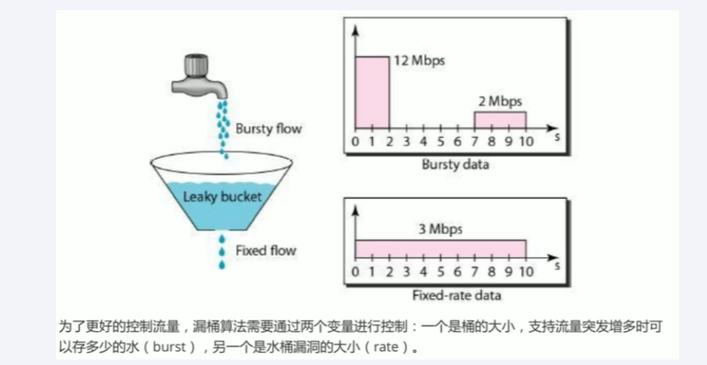
+ **令牌桶算法**
  + 该算法是SpringCloud默认所使用的算法
  + 它类似于食堂买饭，你买了东西，食堂会给你对应的序号牌来等待，饭做好以后，食堂会回收该序号牌，然后把饭给你。如果后面的人到了但是已经没有序号牌了，就只能等待
  + 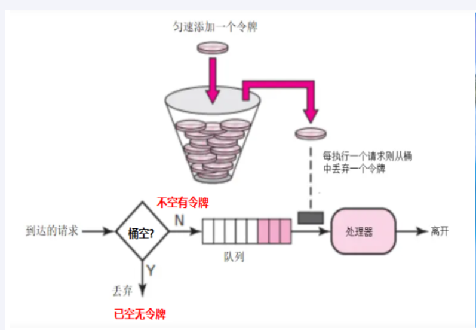
+ **计数器(固定窗口)**
  + 该算法以固定的时间周期对请求数量进行分割，当一个时间周期内的请求数量到达阈值时，触发限流策略。下一个时间周期开始时，将计数清零，重新计算
  + 但该算法存在缺陷:假设一个时间周期为1min，服务器总负载上限为1min处理100次请求
    + 某用户在00:00:59发送了100次请求，在此之前没有请求，因此请求在服务器负载范围内，进行处理
    + 00:01:00计数清零
    + 同时，又一用户在00:01:00发送了100次请求，由于计数器已经清零，算法认为服务器可以承受，因此放行请求
    + 因此服务器在2s内收到了200次请求，大大超过了服务器负载上限，因此会导致服务崩溃
  + 因此它的缺陷就是:**对于周期比较长的限流，存在很大的弊端**
  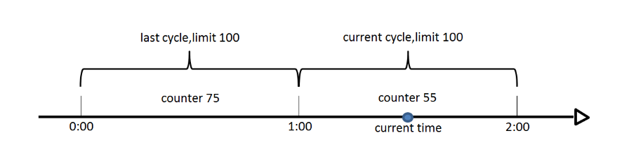
+ **滑动窗口算法**
  + 该算法是对上面的固定窗口算法的改进
  + 为了避免出现两个时间周期间隔高请求量导致服务器过量负载的问题，该算法又将一个时间周期分为多个小片段，每次统计小片段的请求数量，并且根据时间滑动删除过期的小周期
  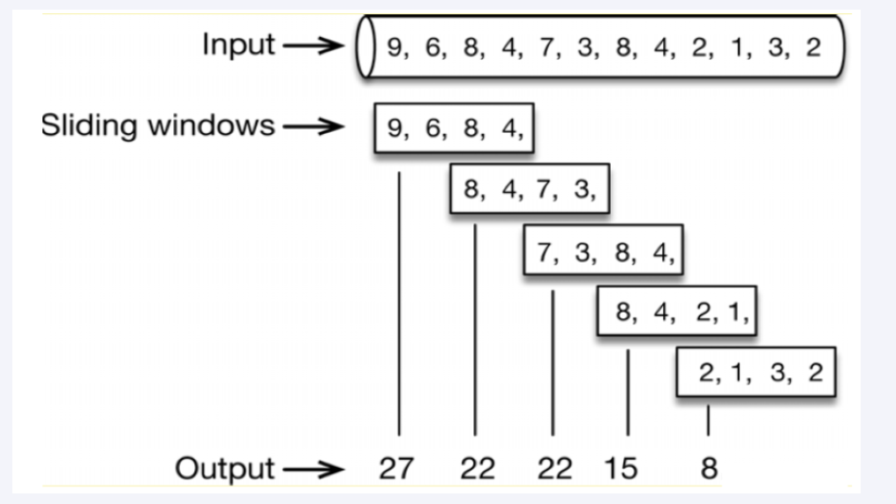

---

##### Ⅱ使用

+ 引入依赖:

~~~xml

        <!--resilience4j-ratelimiter-->
        <dependency>
            <groupId>io.github.resilience4j</groupId>
            <artifactId>resilience4j-ratelimiter</artifactId>
        </dependency>       
~~~

+ 在服务模块写对应的方法，同时提供对应的FeignAPI方法
+ 写配置文件:

~~~yml
resilience4j:
  timelimiter:
    configs:
      default:
        timeout-duration: 20s  # 该配置表示调用超过该秒数就进行服务降级，不再进行断路判断，因此需要把值设置的长一点
    instances:
      cloud-pay-service:
        base-config: default
  ratelimiter:
    configs:
      default:
        limit-for-period: 2  # 在一次刷新周期内，允许执行的最大请求数
        limit-refresh-period: 5s  #限流器每隔limitRefreshPeriod刷新一次，将允许处理的最大请求数量重置为limitForPeriod
        timeout-duration: 1s  # 线程等待其执行权限的最大时间，若超过该时间，执行服务降级
~~~

+ 说明样例如下:
  + 现在有四个请求
  + 前两个请求先到，直接开始执行
  + 后两个请求到了，此时最大请求数为2，因此其线程开始等待，如果等待时间超过了timeout-duration配置，就会触发服务降级
  + 如果等待时间没有超过timeout-duration配置，就执行
+ 在调用模块内新增方法，调用FeignAPI的方法，并使用@RateLimiter注解修饰方法，使用方式同@Bulkhead和@CircuitBreaker
+ [测试](../../源码/SpringCloud/SpringCloud-Feign-80/src/main/java/com/example/cloud/controller/OrderResilienceController.java)
+ [被调用微服务controller](../../源码/SpringCloud/SpringCloud-Pay/src/main/java/com/example/cloud/controller/ResilienceController.java)

---

### （五）Micrometer

#### ①简介

+ 在微服务框架中，一个由客户端发起的请求在后端系统中会经过多个不同的的服务节点调用来协同产生最后的请求结果，每一个前段请求都会形成一条复杂的分布式服务调用链路，链路中的任何一环出现高延时或错误都会引起整个请求最后的失败。
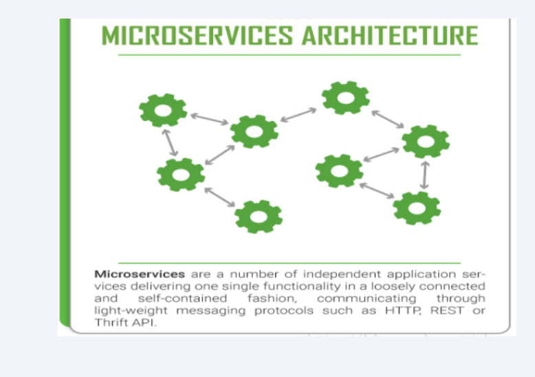
+ 为了查出上面存在的问题，我们需要一个工具来记录每个微服务调用环节的详细信息，Micrometer就提供了一套完整的分布式链路追踪解决方案并兼容实现了Zipkin展现
  + Zipkin是一个能可视化展示分布式链路调用信息的图形工具，它可以让我们直观的看到微服务调用环节的各个信息

#### ②原理

+ 对于一条调用链路，它有自己专门的一个id(TraceId)来表示本链路，微服务模块在互相调用时，如果在该链路上，那么id会随之传递
+ 对于每个服务模块，它们都有自己的独特的id(SpanId)，用于唯一标识自身
+ 调用模块转发请求时，请求时间被记录在`Client Sent`中，而服务模块收到请求时，收到请求的时间被记录在`Server Received`中。
+ 服务模块处理完请求后，处理完成的时间被记录在`Server Sent`中，而调用模块收到结果时，收到结果的时间被记录在`Client Received`中
+ 我们可以根据上面的信息来计算出网络传输时间（发送请求）（Server Received - Client Sent）、业务处理时间（Server Sent - Server Received）、远程调用耗时（Client Received - Client Sent）、网络传输时间（收到响应）（Client Received - Server Sent）

---

#### ③使用

+ 首先我们要下载[Zipkin](https://zipkin.io/pages/quickstart.html)
  + 直接找到Java，然后点击`latest release`就会下载得到一个jar包
  + 直接打开终端，运行`java -jar zipkinxxxx.jar`运行，默认占用的端口是[9411端口](http://localhost:9411)
  + 看到下图说明启动成功了
  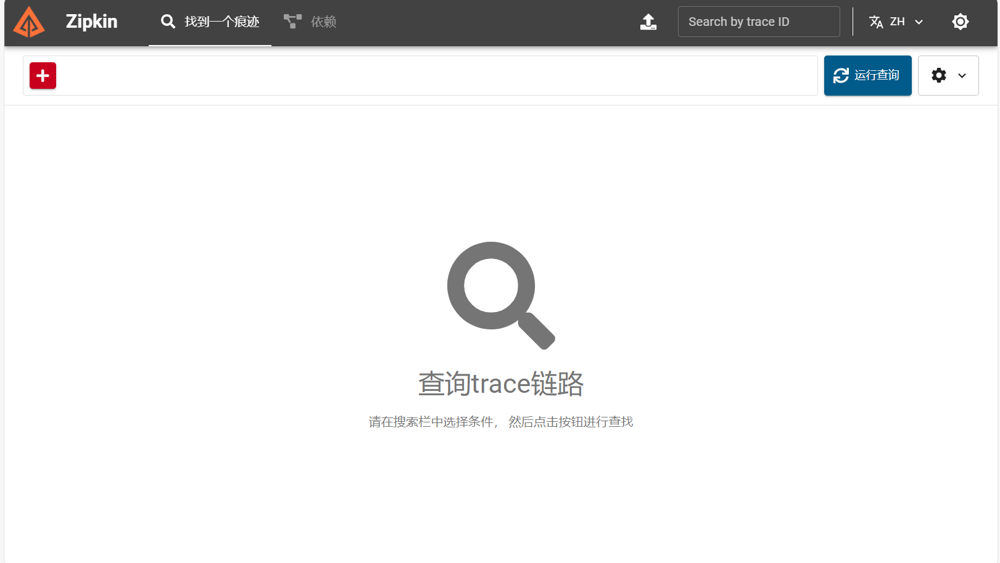
+ 接下来在父项目导入依赖:

~~~xml
        <properties>
          <micrometer-tracing.version>1.2.0</micrometer-tracing.version>
          <micrometer-observation.version>1.12.0</micrometer-observation.version>
          <feign-micrometer.version>12.5</feign-micrometer.version>
          <zipkin-reporter-brave.version>2.17.0</zipkin-reporter-brave.version>
        </properties>

        <!--micrometer-tracing-bom导入链路追踪版本中心  1-->
        <dependency>
            <groupId>io.micrometer</groupId>
            <artifactId>micrometer-tracing-bom</artifactId>
            <version>${micrometer-tracing.version}</version>
            <type>pom</type>
            <scope>import</scope>
        </dependency>
        <!--micrometer-tracing指标追踪  2-->
        <dependency>
            <groupId>io.micrometer</groupId>
            <artifactId>micrometer-tracing</artifactId>
            <version>${micrometer-tracing.version}</version>
        </dependency>
        <!--micrometer-tracing-bridge-brave适配zipkin的桥接包 3-->
        <dependency>
            <groupId>io.micrometer</groupId>
            <artifactId>micrometer-tracing-bridge-brave</artifactId>
            <version>${micrometer-tracing.version}</version>
        </dependency>
        <!--micrometer-observation 4-->
        <dependency>
            <groupId>io.micrometer</groupId>
            <artifactId>micrometer-observation</artifactId>
            <version>${micrometer-observation.version}</version>
        </dependency>
        <!--feign-micrometer 5-->
        <dependency>
            <groupId>io.github.openfeign</groupId>
            <artifactId>feign-micrometer</artifactId>
            <version>${feign-micrometer.version}</version>
        </dependency>
        <!--zipkin-reporter-brave 6-->
        <dependency>
            <groupId>io.zipkin.reporter2</groupId>
            <artifactId>zipkin-reporter-brave</artifactId>
            <version>${zipkin-reporter-brave.version}</version>
        </dependency>

~~~

+ 之后分别在服务模块和调用模块都导入如下依赖:

~~~xml
    <!--micrometer-tracing指标追踪  1-->
    <dependency>
        <groupId>io.micrometer</groupId>
        <artifactId>micrometer-tracing</artifactId>
    </dependency>
    <!--micrometer-tracing-bridge-brave适配zipkin的桥接包 2-->
    <dependency>
        <groupId>io.micrometer</groupId>
        <artifactId>micrometer-tracing-bridge-brave</artifactId>
    </dependency>
    <!--micrometer-observation 3-->
    <dependency>
        <groupId>io.micrometer</groupId>
        <artifactId>micrometer-observation</artifactId>
    </dependency>
    <!--feign-micrometer 4-->
    <dependency>
        <groupId>io.github.openfeign</groupId>
        <artifactId>feign-micrometer</artifactId>
    </dependency>
    <!--zipkin-reporter-brave 5-->
    <dependency>
        <groupId>io.zipkin.reporter2</groupId>
        <artifactId>zipkin-reporter-brave</artifactId>
    </dependency>
~~~

+ 在服务模块和调用模块的application.yml文件中都添加如下配置:

~~~yml
# zipkin图形展现地址和采样率设置
management:
  zipkin:
    tracing:
      endpoint: http://localhost:9411/api/v2/spans
  tracing:
    sampling:
      probability: 1.0 #采样率默认为0.1(0.1就是10次只能有一次被记录下来)，值越大收集越及时。
~~~

+ 接下来在服务模块下新建一个Controller类，添加对应的服务方法，同时添加对应的FeignAPI的方法
+ 在调用模块也添加对应的通过FeignAPI调用的方法
+ 最后启动模块，请求一次
+ 请求完成后，打开刚才的zipkin可视化网页
  + 点击下图的`运行查询`可以查看到我们的发送的请求的详细信息
  + 右边可以通过请求时间进行筛选
  + 下面还可以根据服务模块名称进行筛选
  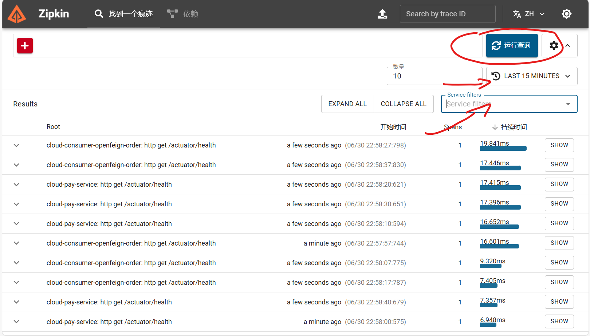
+ 筛选结果如下
  + 点击右侧的`SHOW`按钮可以查看各个链路调用之间的时间耗费的详细信息
  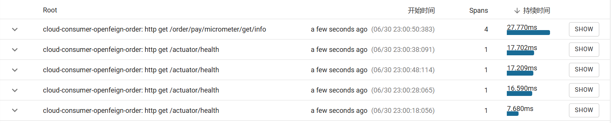
+ 详细信息展示:
  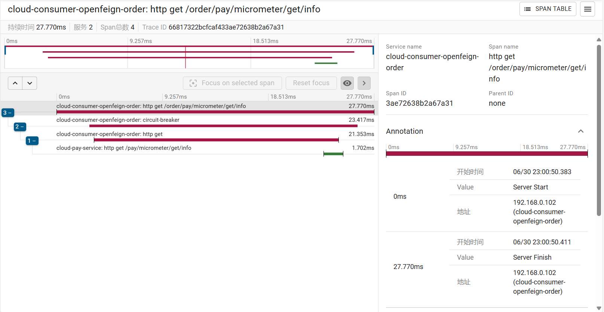
+ 点击网页最上面导航栏的`依赖`按钮，可以查看服务的调用链情况，左侧还有专门的Filter过滤按钮，可供筛选与对应服务模块相关的调用链
  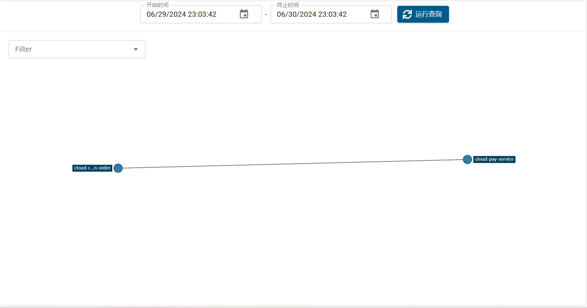

---

### （六）GateWay

#### ①简介

+ Gateway就是网关，它旨在为微服务架构提供一种简单而有效的统一的API路由管理方式。它不仅提供统一的路由方式，并且基于Filter链的方式提供了网关基本的功能:
  + 管理授权
  + 访问控制
  + 路由映射
  + 流量限制
  + 日志监控
  + 服务熔断
  + 反向代理
+ Gateway有三大核心
  + Route(路由):路由是网关的基本构件模块，它由一个ID、一个目标URI、一组断言和一组过滤器定义。如果断言为真，那么路由匹配
  + Predicate(断言):开发人员可以匹配HTTP请求中的所有内容，如果请求与断言相匹配，那么断言通过，即断言为真
  + Filter(过滤器):使用过滤器可以在请求被路由放行前或在请求响应之后进行相关操作
+ 请求在到达Gateway后，网关会对该请求进行路由匹配，期间进行断言，如果断言为真，那么执行过滤器操作，然后放行，最后在响应时再经过网关执行过滤器操作

---

#### ②HelloWorld

+ 首先新建一个项目，命名为`SpringCloud-Gateway-9527`
+ 导入依赖:

~~~xml
        <!--gateway-->
        <dependency>
            <groupId>org.springframework.cloud</groupId>
            <artifactId>spring-cloud-starter-gateway</artifactId>
        </dependency>
        <!--服务注册发现consul discovery,网关也要注册进服务注册中心统一管控-->
        <dependency>
            <groupId>org.springframework.cloud</groupId>
            <artifactId>spring-cloud-starter-consul-discovery</artifactId>
        </dependency>
        <!-- 指标监控健康检查的actuator,网关是响应式编程删除掉spring-boot-starter-web dependency-->
        <dependency>
            <groupId>org.springframework.boot</groupId>
            <artifactId>spring-boot-starter-actuator</artifactId>
        </dependency>
~~~

+ 配置文件内编写相关配置，以加入网关:

~~~yml
server:
  port: 9527

spring:
  application:
    name: cloud-gateway #以微服务注册进consul
  cloud:
    consul: #配置consul地址
      host: localhost
      port: 8500
      discovery:
        prefer-ip-address: true
        service-name: ${spring.application.name}
~~~

+ 如果想配置网关相关的路由，可以这样写:

~~~yml
spring:
  cloud:
    gateway:
      routes:
        - id: pay-get-info  # 该路由项的id，没什么要求，但是必须唯一，一般根据业务来进行命名
          uri: lb://cloud-pay-service  # 匹配的uri前缀，使用 lb://<服务注册名> 的方式来动态的通过注册中心来获得服务模块对应uri
          predicates:
            - Path=/pay/gateway/get/**  # 指定断言需要匹配的映射路径
~~~

+ 在服务模块和FeignApi接口上添加新的方法
  + 注意，**FeignApi接口上的@FeignClient注解的value属性应该配置网关的注册名，而不是服务的注册名**，因为不配置网关的注册名的话，我们的网关无论是否存在，都Feign接口都会直接调用服务模块的方法
  + 但是我认为网关是需要在Feign调用模块前面发挥作用的，也就是请求先到网关，网关把请求转发到调用模块，调用模块在调用服务模块。不知道为什么课程讲的是请求先到调用模块，调用模块再把请求转发到网关，网关再调服务模块的方法
+ 在对应的调用模块上也添加新的方法
+ 测试，如果网关存在那么请求成功，如果网关不存在那么报错
  + 测试的时候对着网关所在的端口发请求
  + 如果报错可能会报Fallback相关的错误，这是因为开启了circuitbreaker，关掉相关配置即可
  + 关掉以后，报的就是`FeignException$ServiceUnavailable`的错误了

---

#### ③Predicate断言

+ SpringCloud提供了多种断言的PredicateFactory,我们只需要在配置文件中进行一些配置即可
+ 配置参考[配置文件](../../源码/SpringCloud/SpringCloud-Gateway-9527/src/main/resources/application.yml)和[官方文档](https://docs.spring.io/spring-cloud-gateway/reference/spring-cloud-gateway-server-mvc/gateway-request-predicates.html)
+ 另外，我们也可以自定义断言
  + 自定义断言只需要根据官方的模板照葫芦画瓢就行
  + 大体上需要
    + 后缀必须为RoutePredicateFactory
    + @Component注解加入IOC容器
    + 继承AbstractRoutePredicateFactory类（或者实现RoutePredicateFactory接口），泛型指定表示校验对象的Config类。一般都是写自己的自定义类内自定义的Config类进去
    + 提供一个无参构造方法，调用父类构造方法，把自定义Config类的Class对象传入
    + 重写shortcutFieldOrder方法，该方法的重写使得shortcut方式的配置可用，否则会报错
    + 重写apply方法，这是进行校验的主方法
    + 自定义Config类，类中的属性即为我们想进行校验的配置文件中指定的值或表达式
    + 配置文件配置时，写类名的前缀进行配置
  + [自定义Predicate样例](../../源码/SpringCloud/SpringCloud-Gateway-9527/src/main/java/com/example/cloud/components/CustomRoutePredicateFactory.java)

---

#### ④Filter过滤器

+ 该过滤器与Servlet的Filter和SpringMVC的interceptor类似，都是在请求执行前后进行一些附加操作
+ 由于配置了网关，所以全部的请求都需要先经过网关，因此网关可以针对这些请求在服务模块过滤之前统一执行过滤操作，Filter的作用有:
  + 请求鉴权
  + 异常处理
  + 可以用来进行接口调用时长统计
  + ...
+ SpringCloud提供了多种类型的过滤器，详见[官方文档](https://docs.spring.io/spring-cloud-gateway/reference/spring-cloud-gateway-server-mvc/gateway-handler-filter-functions.html)，它们可以针对不同的请求进行附加操作，大致上可以分为:
  + 请求头相关
  + 请求参数相关
  + 响应头相关
  + 前缀与路径相关
  + 全局过滤
+ 配置详情见[配置文件示例](../../源码/SpringCloud/SpringCloud-Gateway-9527/src/main/resources/application.yml)
+ 自定义Filter基本上与自定义Predicate一致，都是照葫芦画瓢
  + 自定义全局Filter
    + 添加@Component注解
    + 实现GlobalFilter和Ordered接口
    + 实现它们的方法，其中`getOrder`方法返回值越小，自定义过滤器加载优先级就越高。而`filter`方法是进行过滤的主方法，通过传入的exchange参数可以得到请求对象和响应对象，GatewayFilterChain则是过滤器链，相当于Servlet的过滤器的过滤器链
    + 全局过滤器可以用于统计各接口的执行时长，[样例](../../源码/SpringCloud/SpringCloud-Gateway-9527/src/main/java/com/example/cloud/components/MyGlobalFilter.java)
  + 自定义条件Filter
    + 添加添加@Component注解
    + 类的后缀必须为GatewayFilterFactory
    + 继承AbstractGatewayFilterFactory类，泛型指定自定义Config类
    + 配置类声明为静态，提供getter、setter方法和无参构造器
    + 重写apply和shortcutFieldOrder方法，前者是进行过滤的主方法，后者是提供shortcut方式的必要配置
    + 本自定义类的构造器内调用父类构造器，传入自定义Config类的Class对象
    + 配置文件进行配置时，根据类名的前缀进行配置
    + [样例](../../源码/SpringCloud/SpringCloud-Gateway-9527/src/main/java/com/example/cloud/components/MyCustomGatewayFilterFactory.java)

---

## 三、SpringCloudAlibaba

+ [github官方](https://github.com/alibaba/spring-cloud-alibaba)
+ Spring Cloud Alibaba 致力于提供微服务开发的一站式解决方案

### （一）Nacos

+ 作用同Consul

#### ①安装

+ [官网](https://github.com/alibaba/nacos/releases)选择版本下载，注意，**下载的版本需要注意是否与SpringCloud相关的其他组件和SpringBoot版本相容**
+ 下载后缀是`.zip`的
+ 下载完之后，直接打开目录，执行`./startup.cmd -m standalone`来以单机模式运行Nacos（使用cmd不用带`./`，但是PowerShell要加）

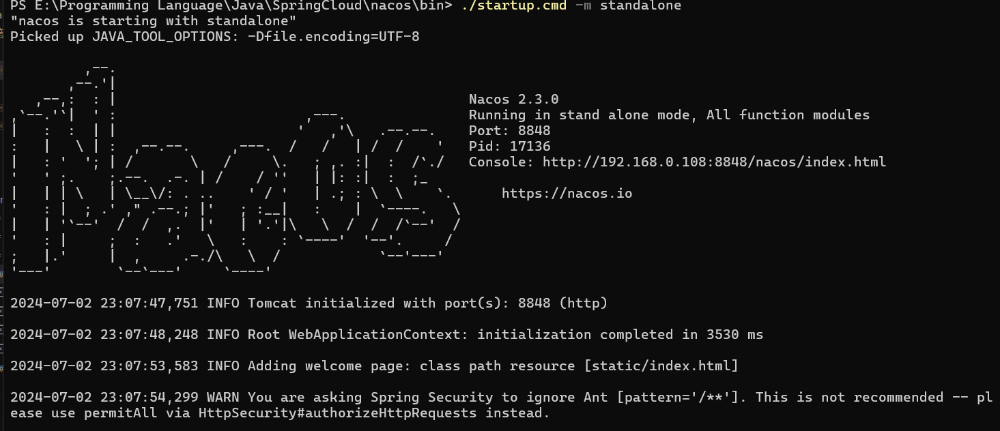

#### ②服务注册与发现

+ 主要依赖:

~~~xml

  <!--nacos-discovery-->
  <dependency>
      <groupId>com.alibaba.cloud</groupId>
      <artifactId>spring-cloud-starter-alibaba-nacos-discovery</artifactId>
  </dependency>
  <!--loadbalancer-->
  <dependency>
      <groupId>org.springframework.cloud</groupId>
      <artifactId>spring-cloud-starter-loadbalancer</artifactId>
  </dependency>

~~~

+ 编写项目的yml文件:
  + 与Consul不同的是，Nacos默认就自动的让注册名与spring.application.name保持一致
  + 同时，Nacos也能够**自动进行持久化**

~~~yml
  server:
    port: 9001
  spring:
    application:
      name: nacos-pay-service
    cloud:
      nacos:
        discovery:
          server-addr: localhost:8848 #配置Nacos地址
service-url:
  nacos-user-service: http://nacos-payment-provider # 这个是调用模块需要加的，它的意义就是在配置文件中引入对应的服务地址，以根据服务模块的名称来确定将请求转发的路径，从而避免硬编码的问题。另外，这个玩意是使用RestTemplate需要的配置
~~~

+ 接下来在启动类添加@EnableDiscoveryClient注解
+ 如果是使用了RestTemplate的模块，我们也需要对RestTemplate的Bean方法上面写@LoadBalanced注解

~~~java
    @Bean
    @LoadBalanced
    public RestTemplate restTemplate(){
        return new RestTemplate();
    }
~~~

+ 最后启动
+ Nacos支持负载均衡，默认采用轮询算法

---

#### ③分布式配置

+ nacos的分布式配置文件的命名格式为`<服务注册名>-<服务active>.<服务匹配的文件后缀>`，如我们的服务注册名为`pay-service`，当前的active为`dev`，要匹配的文件格式为yaml，那么文件就命名为`pay-service-dev.yaml`
+ 同样，我们也需要配置bootstrap.yml
+ Nacos的图形化界面很好理解，因为有中文，直接在配置管理->配置列表中创建即可
  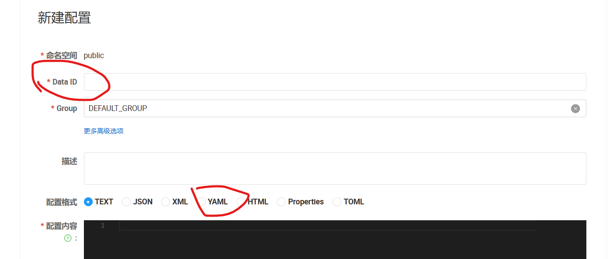
  + 根据上图，DataId就是我们要写的配置文件的名，遵循上面的命名格式
  + 之后选择yaml,在下面的输入框内输入值即可
+ Nacos默认支持自动刷新，不过我们想要后端支持，需要在controller类上面添加@RefreshScope注解

---

#### ④配置三原组

+ 如果我们的微服务项目非常大的话，我们的模块就会有很多子模块，这些子模块可能还会进行细分，而每个模块的配置都可能会有多种不同的active，因此Nacos提供了三元组的方式来进行配置文件的区分
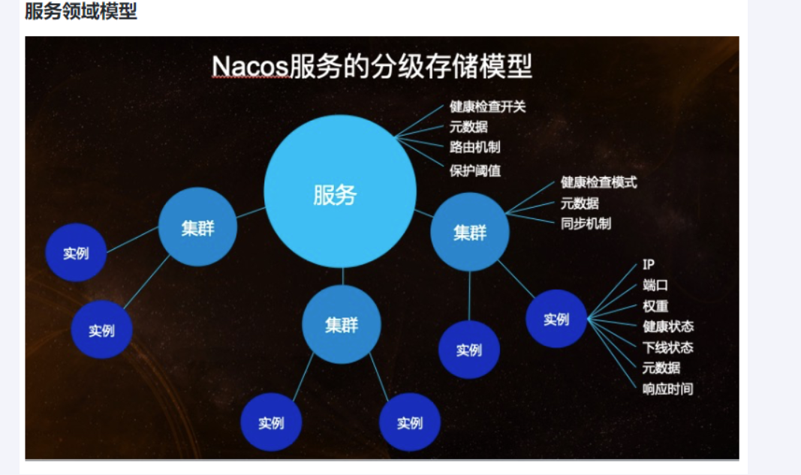
  + 首先区分**NameSpace**，它是第一大的分类，**默认是public**
  + NameSpace可以有多个**Group**，**默认是DEFAULT_GROUP**
  + 一个组内可以有多个配置文件
+ 我们的bootstrap.yml文件可以手动指定我们想读取的namespace和group内的配置文件
  + spring.cloud.nacos.config.group用来指定读取的配置文件所在的组
  + spring.cloud.nacos.config.namespace用来指定读取的配置文件所在的命名空间，**namespace需要写命名空间的id，不是命名空间的名称**
+ [bootstrap文件示例](../../源码/SpringCloud/SpringCloudAlibaba-Config-1234/src/main/resources/bootstrap.yml)

---

### （二）Sentinel

+ [官网](https://sentinelguard.io/zh-cn/)
+ [github地址](https://github.com/alibaba/Sentinel/wiki/%E4%BB%8B%E7%BB%8D)
+ Sentinel主要用于服务熔断与降级、限流等功能，与其对应的是Resilience4j

#### ①安装

+ [安装地址](https://github.com/alibaba/Sentinel/releases)
  + 下载Assets中的jar包即可
+ 下载完以后，在其所在目录内使用cmd打开，直接执行`java -jar xxx.jar`来进行运行
  + Sentinel默认占用8080端口，确保启动时8080端口未被占用
+ 运行起来以后，在浏览器打开[8080端口](http://localhost:8080)即可访问Sentinel控制台
  + 账号和密码默认都是`sentinel`

---

#### ②模块整合Sentinel

+ 创建模块
+ 导入依赖

~~~xml
  <!--SpringCloud alibaba sentinel -->
  <dependency>
      <groupId>com.alibaba.cloud</groupId>
      <artifactId>spring-cloud-starter-alibaba-sentinel</artifactId>
  </dependency>

~~~

+ 确保注册中心是打开的
+ 写一个控制类，并提供测试方法
+ 配置配置文件:

~~~yml
server:
  port: 9500 # 配置端口号
spring:
  application:
    name: sentinel-service  # Nacos中的注册名（默认与该配置保持一致）
  cloud:
    nacos:
      discovery:
        server-addr: localhost:8848         #Nacos服务注册中心地址
    sentinel:
      transport:
        dashboard: localhost:8080 #配置Sentinel dashboard控制台服务地址
        port: 8719 #默认8719端口，假如被占用会自动从8719开始依次+1扫描,直至找到未被占用的端口，它用来与sentinel控制台进行通信
~~~

+ 启动模块
+ 进行测试，Sentinel采用的是懒加载的策略，只有当服务模块第一次被访问时，才会加载进来
+ 此时刷新Sentinel控制台网页，可以看到下图所示:

---

#### ③流量控制

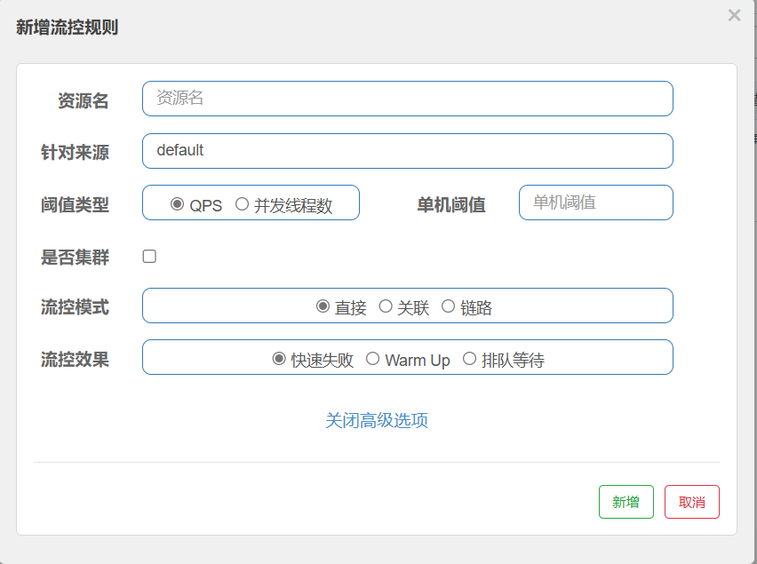
+ 资源名:其实是接口的请求路径
+ 针对来源:具体对那个微服务进行限流，默认default表示全局限流
+ 阈值类型:QPS（每秒处理请求数）表示通过QPS进行限流，并发线程数表示通过并发线程数限流
+ 单机阈值:与阈值类型组合使用。如果阈值类型选择的是QPS，表示当调用接口的QPS达到阈值时，进行限流操作。如果阈值类型选择的是并发线程数，则表示当调用接口的并发线程数达到阈值时，进行限流操作。
+ 是否集群:选中则表示集群环境，不选中则表示非集群环境
 
+ Sentinel的流量控制有三种流控模式和三种流控效果，我们可以自由进行组合
  + **流控模式**
    + 直接:单位时间内访问该接口的请求次数到达一定阈值时，进行限流
    + 关联:单位时间内访问B接口的请求次数到达一定阈值时，对A接口的访问进行限流
      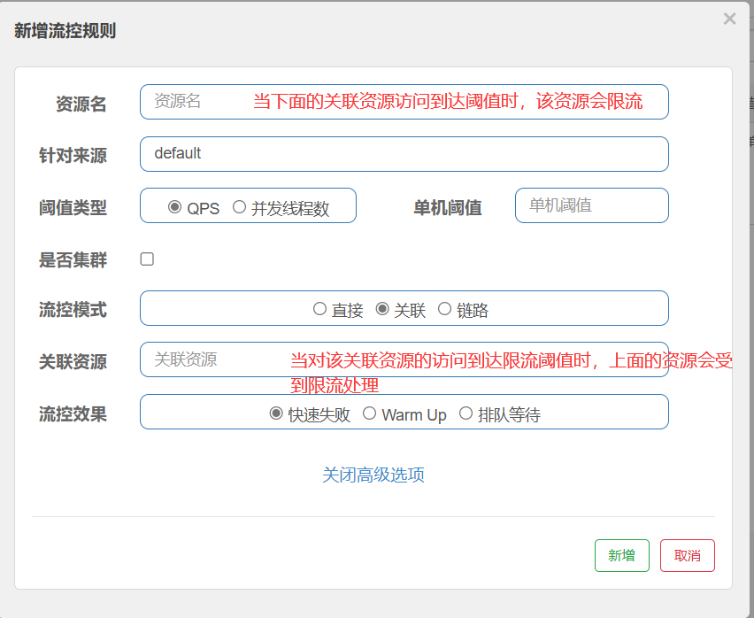
    + 链路:单位时间内通过不同的链路来访问同一服务时，如果某一链路对服务的访问流量超过了上限，那么仅对该链路进行限流处理，对其它链路没有影响
      + 例:用户通过`/sentinel/test5`和`/sentinel/test6`进行接口访问，这两个接口都调用了同一个Service类的同一个方法，它们应该算是同一个链路的
      + 但是我们可以通过配置文件使它们不属于同一个链路，将`spring.cloud.sentinel.web-context-unify`置为false即可
      + 此时如果我们配置`/sentinel/test5`的链路限流配置，那么对应的链路请求就会受到限制，但是`/sentinel/test6`不进行管控，因为没有配置关于它的链路限流配置
      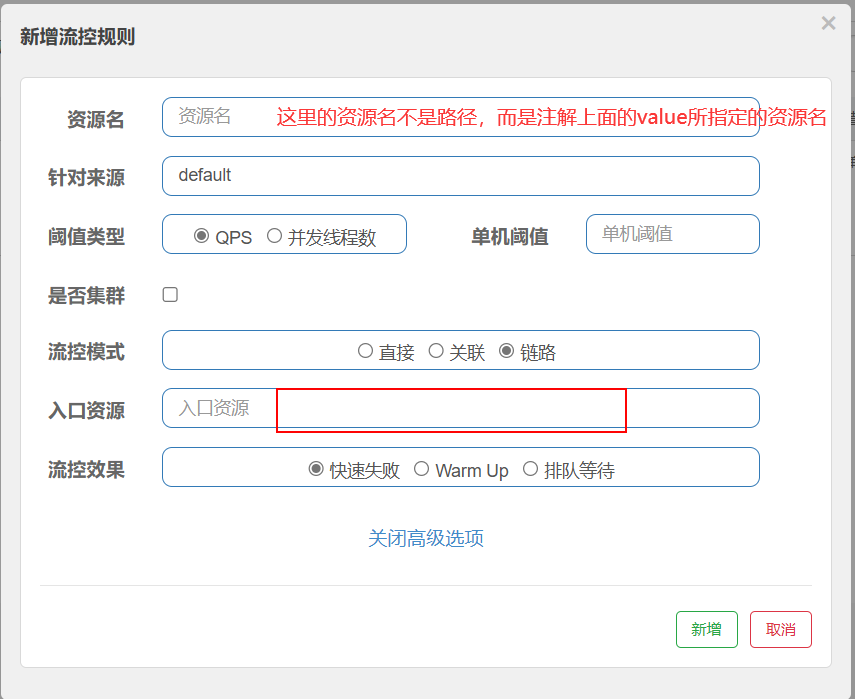
  + **流控效果**
    + 快速失败:即限流直接抛出异常
    + Warm Up:服务预热，即先设置一个较小的阈值，先使服务器承受比预定阈值要小的请求，之后随着时间推移逐渐放行更多请求到预定阈值
      + 我们需要配置预定阈值和预热时长
      + 小阈值的默认计算公式为`预定阈值/3`
      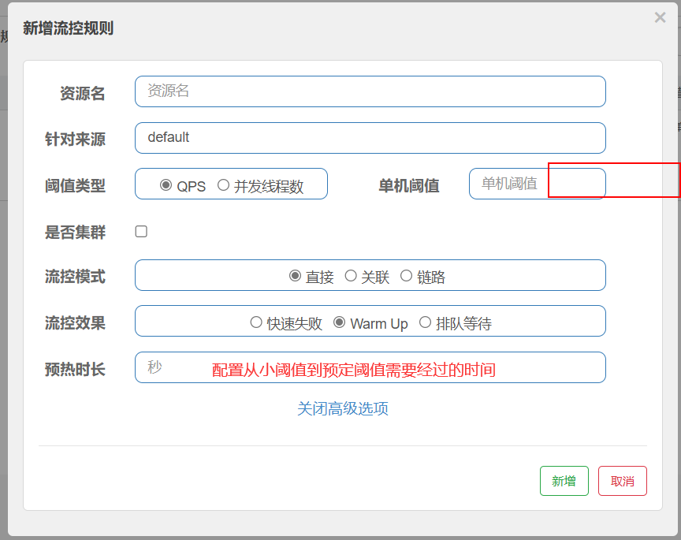
    + 排队等待:不管请求有多少个，都排队进行处理，可以配置如果请求到达一定时间还未处理，进行服务降级
      + 如果使通过QPS配置的阈值，那么每秒最大放行数就是阈值配置的值
      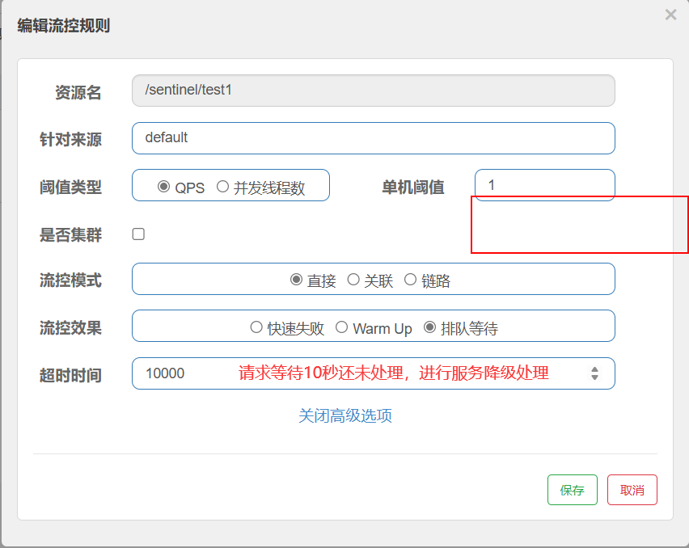

---

#### ④服务熔断

+ Sentinel提供了三个熔断策略
  + 慢调用比例，即当慢调用比例超过一定阈值时，进行服务熔断
  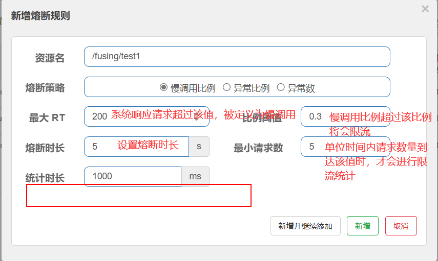
  + 异常比例:即当请求异常比例超过一定阈值时，进行服务熔断
  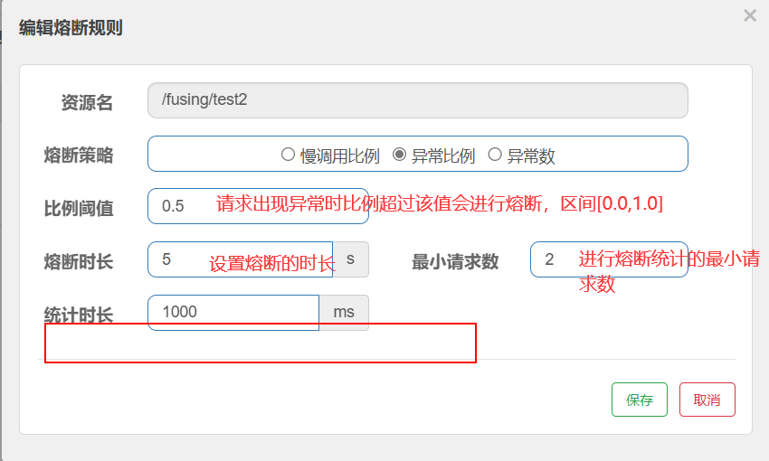
  + 异常数:即当请求异常数量到达一定阈值时，进行服务熔断
  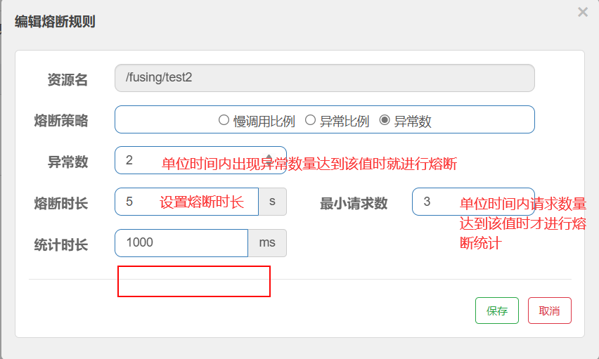

---

#### ⑤SentinelResource注解

+ SentinelResource注解专门用来标记Sentinel资源，它可以以另外的方式来表示一个资源
  + 资源有两种表示方式
    + 使用方法匹配的请求路径
    + 使用@SentinelResource注解所指定的value值
+ 它有很多属性:

~~~java
  public @interface SentinelResource {

      //指定资源的名称
      String value() default "";

      //entry类型，标记流量的方向，取值IN/OUT，默认是OUT
      EntryType entryType() default EntryType.OUT;
      //资源分类
      int resourceType() default 0;

      //处理BlockException的函数名称,函数要求：
      //1. 必须是 public
      //2.返回类型 参数与原方法一致
      //3. 默认需和原方法在同一个类中。若希望使用其他类的函数，可配置blockHandlerClass ，并指定blockHandlerClass里面的方法。
      String blockHandler() default "";

      //存放blockHandler的类,对应的处理函数必须static修饰。
      Class<?>[] blockHandlerClass() default {};

      //用于在抛出异常的时候提供fallback处理逻辑。 fallback函数可以针对所
      //有类型的异常（除了 exceptionsToIgnore 里面排除掉的异常类型）进行处理。函数要求：
      //1. 返回类型与原方法一致
      //2. 参数类型需要和原方法相匹配
      //3. 默认需和原方法在同一个类中。若希望使用其他类的函数，可配置fallbackClass ，并指定fallbackClass里面的方法。
      String fallback() default "";

      //存放fallback的类。对应的处理函数必须static修饰。
      String defaultFallback() default "";

      //用于通用的 fallback 逻辑。默认fallback函数可以针对所有类型的异常进
      //行处理。若同时配置了 fallback 和 defaultFallback，以fallback为准。函数要求：
      //1. 返回类型与原方法一致
      //2. 方法参数列表为空，或者有一个 Throwable 类型的参数。
      //3. 默认需要和原方法在同一个类中。若希望使用其他类的函数，可配置fallbackClass ，并指定 fallbackClass 里面的方法。
      Class<?>[] fallbackClass() default {};
  

      //需要trace的异常
      Class<? extends Throwable>[] exceptionsToTrace() default {Throwable.class};

      //指定排除忽略掉哪些异常。排除的异常不会计入异常统计，也不会进入fallback逻辑，而是原样抛出。
      Class<? extends Throwable>[] exceptionsToIgnore() default {};
  }
~~~

+ [例](../../源码/SpringCloud/SpringCloudAlibaba-Sentinel-Service-9500/src/main/java/com/example/cloud/controller/SentinelResourceController.java)
  + blockHandler与fallback属性是可以混合使用的
    + 当触发限流时，必定走blockHandler指定的方法
    + 当未触发限流且出现异常时，走fallback指定的方法
---

#### ⑥热点规则

+ Sentinel可以针对路径请求的参数数据进行限流，即通过URL传递的参数进行限流
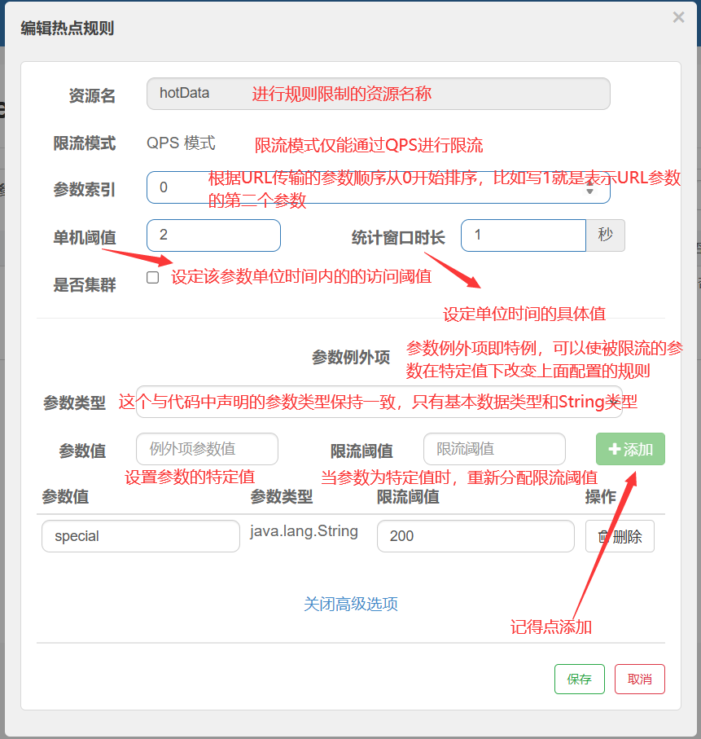

---

#### ⑦授权规则

+ 就是设置黑白名单
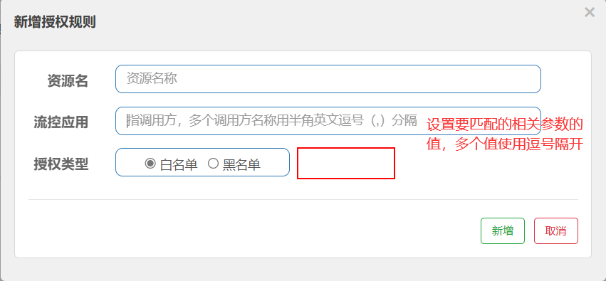
+ 需要在程序中实现`RequestOriginParser`接口，并在重写的方法中返回实际上要比较的值
  + [样例](../../源码/SpringCloud/SpringCloudAlibaba-Sentinel-Service-9500/src/main/java/com/example/cloud/config/EmpowerConfig.java)

---

#### ⑧持久化

+ 如果不设置持久化，那么模块一旦重新启动，或者Sentinel重新启动，都会导致配置丢失，因此我们需要Sentinel的持久化功能
+ Sentinel的持久化是把配置保存在Nacos中
+ 我们需要先导入依赖:

~~~xml
        <dependency>
            <groupId>com.alibaba.csp</groupId>
            <artifactId>sentinel-datasource-nacos</artifactId>
        </dependency>
~~~

+ 接下来在配置文件中添加如下配置:

~~~yml
spring:
  application:
    name: cloudalibaba-sentinel-service #8401微服务提供者后续将会被纳入阿里巴巴sentinel监管
  cloud:
    sentinel:
      datasource:
         ds1:
           nacos:
             server-addr: localhost:8848  # 告知nacos注册中心地址
             dataId: ${spring.application.name}  # 设置dataId
             groupId: DEFAULT_GROUP  # 设置默认组
             data-type: json  # 设置格式为JSON
             rule-type: flow # 设置规则类型，在com.alibaba.cloud.sentinel.datasource.RuleType中可以查看对应值
~~~

+ `spring.cloud.sentinel.datasource.<configName>.nacos.rule-type`的值有多个:

~~~java
public enum RuleType {
    FLOW("flow", FlowRule.class),  // 流量控制规则
    DEGRADE("degrade", DegradeRule.class),  // 熔断降级规则
    PARAM_FLOW("param-flow", ParamFlowRule.class),  // 访问控制规则
    SYSTEM("system", SystemRule.class),  // 系统保护规则
    AUTHORITY("authority", AuthorityRule.class),  // 热点规则
    ...
}
~~~

+ 接下来根据在配置文件中写的值在[Nacos](http://localhost:8848/nacos)中配置相关的值:
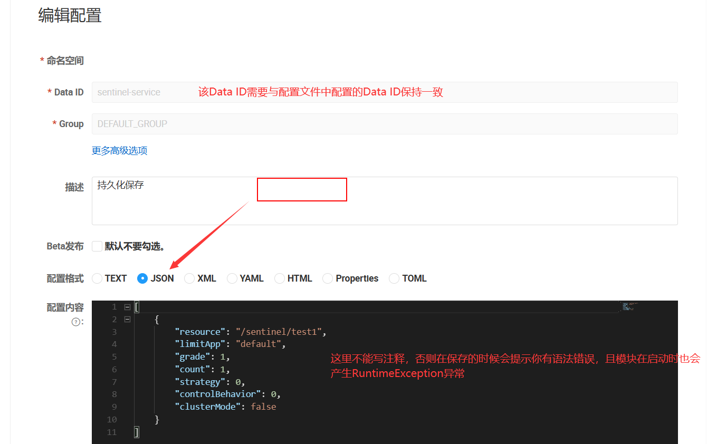

~~~json
// 复制到Nacos上面时，把注释删掉，否则会出错
[
    {
        "resource": "/sentinel/test1",  // 资源名，即Sentinel在配置时必须要写的资源名
        "limitApp": "default",  // 来源应用，这里用默认的
        "grade": 1,  // 阈值类型，1表示QPS，0表示线程数
        "count": 1,  // 设置单机阈值
        "strategy": 0,  // 流控模式，0表示直接，1表示关联，2表示链路
        "controlBehavior": 0,   // 流控效果，0表示快速失败，1表示Warm Up，2表示排队等待
        "clusterMode": false  // 是否集群，这里设置为false
    }
]
~~~

---

#### ⑨整合OpenFeign

+ 对于OpenFeign的整合较为简单，不需要导入额外的依赖，需要什么就导什么就行
+ @SentinelResource注解有两个属性我们需要进行处理
  + blockHandler
  + fallback
  + 这两个属性，我们每声明一个业务方法，就需要写它对应的限流方法和服务降级方法，而且都要写在一个类中，非常麻烦且耦合度过高
  + 因此我们需要想办法把业务方法、限流方法和服务降级方法分开
+ OpenFeign提供的@FeignClient注解也提供了一个fallback属性
  + 该属性需要一个Class对象，该Class对象所对应的类就是处理该注解所作用的Api进行请求调用时导致的异常的
  + 我们提供的类对象一般都是实现了该Api接口的类对象
  + 这样，我们就将服务降级方法与业务方法隔离开了
  + 例:A接口上面有@FeignClient，其属性fallback指定的是`B.class`，那么B类需要实现A类，B类实现A接口对应业务方法就成为了A接口在进行请求转发时出现异常时进行请求降级的方法
  + [A类示例](../../源码/SpringCloud/SpringCloud-Common-API/src/main/java/com/example/cloud/apis/SentinelPayFeignApi.java)
  + [B类示例](../../源码/SpringCloud/SpringCloud-Common-API/src/main/java/com/example/cloud/apis/fallback/SentinelPayFeignApiFallback.java)
+ 另外，我们在使用OpenFeign的API接口调用时，需要在配置文件中配置
  + 否则Feign接口可以使用，但是fallback不生效
~~~yml
feign:
  sentinel:
    enabled: true # 开启feign对Sentinel的支持
~~~
+ 很好，当配置完成以后可能会出现如下情况
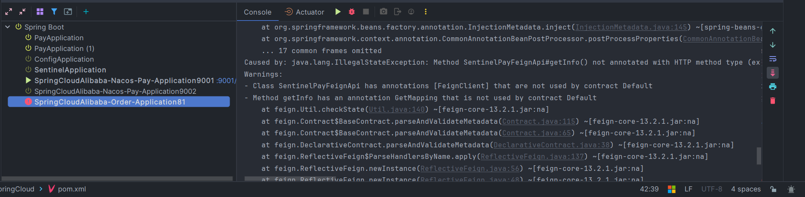
  + 这是版本不适配导致的问题，此时可以降低版本，需要在pom.xml文件中降级SpringBoot和SpringCloudAlibaba的版本:
~~~xml
  <spring.boot.version>3.0.9</spring.boot.version>
  <spring.cloud.version>2022.0.2</spring.cloud.version>
  <spring.cloud.alibaba.version>2022.0.0.0</spring.cloud.alibaba.version>
~~~
  + 或者尝试升高SpringCloudAlibaba版本
~~~xml
  <spring.boot.version>3.2.0</spring.boot.version>
  <spring.cloud.version>2023.0.0</spring.cloud.version>
  <spring.cloud.alibaba.version>2023.0.1.0</spring.cloud.alibaba.version>
~~~

+ 然后就没问题了

---

#### ⑩整合Gateway

+ 导入依赖:

~~~xml
  <!-- Nacos的依赖必须导入，否则可能在请求时报503错误 -->
  <!--nacos-discovery-->
  <dependency>
      <groupId>com.alibaba.cloud</groupId>
      <artifactId>spring-cloud-starter-alibaba-nacos-discovery</artifactId>
  </dependency>
  <!--loadbalancer-->
  <dependency>
      <groupId>org.springframework.cloud</groupId>
      <artifactId>spring-cloud-starter-loadbalancer</artifactId>
  </dependency>
  <!-- gateway相关依赖 -->
  <dependency>
      <groupId>org.springframework.cloud</groupId>
      <artifactId>spring-cloud-starter-gateway</artifactId>
  </dependency>
  <!--  -->
  <dependency>
      <groupId>com.alibaba.csp</groupId>
      <artifactId>sentinel-transport-simple-http</artifactId>
      <version>1.8.6</version>
  </dependency>
  <!-- sentinel适配gateway适配器 -->
  <dependency>
      <groupId>com.alibaba.csp</groupId>
      <artifactId>sentinel-spring-cloud-gateway-adapter</artifactId>
      <version>1.8.6</version>
  </dependency>
  <!-- javax相关依赖 -->
  <dependency>
      <groupId>javax.annotation</groupId>
      <artifactId>javax.annotation-api</artifactId>
      <version>1.3.2</version>
      <scope>compile</scope>
  </dependency>
~~~

+ 接下来进行配置:

~~~yml
server:
  port: 9528

spring:
  application:
    name: cloudalibaba-sentinel-gateway     # sentinel+gataway整合Case
  cloud:
    nacos:
      discovery:
        server-addr: localhost:8848
    gateway:
      routes:
        - id: pay_routh1 #pay_routh1                #路由的ID(类似mysql主键ID)，没有固定规则但要求唯一，建议配合服务名
          uri: lb://nacos-consumer-service              #匹配后提供服务的路由地址
          predicates:
            - Path=/feign/order/**                          # 断言，路径相匹配的进行路由
~~~

+ 在配置类中编写如下配置
  + 参考[官网](https://github.com/alibaba/Sentinel/wiki/%E7%BD%91%E5%85%B3%E9%99%90%E6%B5%81)
+ [示例](../../源码/SpringCloud/SpringCloudAlibaba-Gateway-Sentinel9528/src/main/java/com/example/cloud/config/GatewayConfig.java)
+ 测试

---

### （三）Seata

+ [官网](https://seata.apache.org/zh-cn/)
+ [github](https://github.com/apache/incubator-seata)
+ Seata用于进行分布式事务的相关操作，即**一次业务操作需要跨多个数据源**来完成对应操作

#### ①安装

+ [安装地址](https://github.com/apache/incubator-seata/releases)
  + 直接下载zip文件，解压
  + Seata的配置文件在其conf目录下，其最终会读取`application.yml`文件作为其配置，另外目录内还包含`application.example.yml`，该文件是官方为我们提供好的配置文件，我们可以参考其进行对应配置
  + 最终的参考配置如下:
~~~yml
server:

  port: 7091
spring:

  application:

    name: seata-server
logging:

  config: classpath:logback-spring.xml

  file:

    path: ${log.home:${user.home}/logs/seata}

  extend:

    logstash-appender:

      destination: 127.0.0.1:4560

    kafka-appender:

      bootstrap-servers: 127.0.0.1:9092

      topic: logback_to_logstash
console:

  user:

    username: seata

    password: seata
seata:

  config:

    type: nacos

    nacos:

      server-addr: 127.0.0.1:8848

      namespace:

      group: SEATA_GROUP #后续自己在nacos里面新建,不想新建SEATA_GROUP，就写DEFAULT_GROUP

      username: nacos

      password: nacos

  registry:

    type: nacos

    nacos:

      application: seata-server

      server-addr: 127.0.0.1:8848

      group: SEATA_GROUP #后续自己在nacos里面新建,不想新建SEATA_GROUP，就写DEFAULT_GROUP

      namespace:

      cluster: default

      username: nacos

      password: nacos    

  store:

    mode: db

    db:

      datasource: druid

      db-type: mysql

      driver-class-name: com.mysql.cj.jdbc.Driver

      url: jdbc:mysql://localhost:3306/seata?characterEncoding=utf8&useSSL=false&serverTimezone=GMT%2B8&rewriteBatchedStatements=true&allowPublicKeyRetrieval=true

      user: root

      # yyy对应的是密码，使用时修改为对应真实密码
      password: yyy

      min-conn: 10

      max-conn: 100

      global-table: global_table

      branch-table: branch_table

      lock-table: lock_table

      distributed-lock-table: distributed_lock

      query-limit: 1000

      max-wait: 5000
  #  server:

  #    service-port: 8091 #If not configured, the default is '${server.port} + 1000'

  security:

    secretKey: SeataSecretKey0c382ef121d778043159209298fd40bf3850a017

    tokenValidityInMilliseconds: 1800000

    ignore:

      urls: /,/**/*.css,/**/*.js,/**/*.html,/**/*.map,/**/*.svg,/**/*.png,/**/*.jpeg,/**/*.ico,/api/v1/auth/login,/metadata/v1/**
~~~
  + **在运行Seata前确认运行Nacos**
  + 到bin目录下打开cmd，运行`seata-server.bat`命令即可开启
  + Seata默认占用[7091端口](http://localhost:7091/)，访问其来打开Seata的图形化界面
    + 默认的用户名和密码都是Seata

---

#### ②相关概念

+ Seata有三个相关术语
  + TC(Transaction Coordinator):**事务协调器**，它用来维护全局和分支事务的状态,驱动全局事务提交或回滚。
  + TM(Transaction Manager):**事务管理器**，它用来定义全局事务的范围：开始全局事务、提交或回滚全局事务。
  + RM(Resource Manager):**资源管理器**，管理分支事务处理的资源，与TC交谈以注册分支事务和报告分支事务的状态，并驱动分支事务提交或回滚。
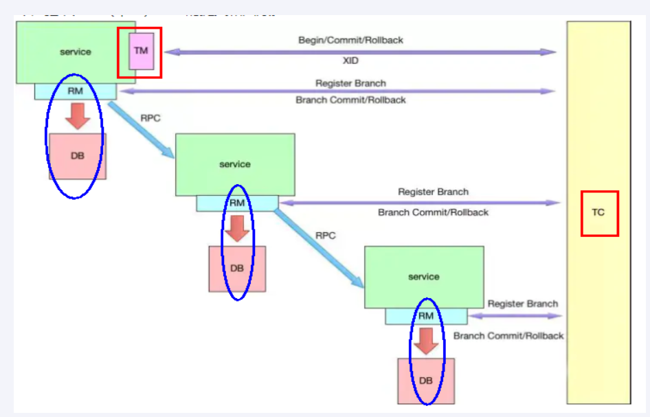

---

#### ③分布式事务样例

+ 例：三个微服务,Order、Account和Storage，Order用来开启分布式事务并调用另外两个微服务
  + [Order微服务服务类](../../源码/SpringCloud/SpringCloudAlibaba-Seata-Order-2001/src/main/java/com/example/cloud/service/impl/OrderServiceImpl.java)
  + [Order微服务启动类](../../源码/SpringCloud/SpringCloudAlibaba-Seata-Order-2001/src/main/java/com/example/cloud/SeataOrderApplication.java)
  + [Order微服务配置](../../源码/SpringCloud/SpringCloudAlibaba-Seata-Order-2001/src/main/resources/application.yml)
  + [Order微服务依赖](../../源码/SpringCloud/SpringCloudAlibaba-Seata-Order-2001/pom.xml)
  + [Account微服务服务类](../../源码/SpringCloud/SpringCloudAlibaba-Seata-Account-2003/src/main/java/com/example/cloud/service/impl/AccountServiceImpl.java)
  + [Account微服务配置](../../源码/SpringCloud/SpringCloudAlibaba-Seata-Account-2003/src/main/resources/application.yml)
  + [Storage微服务服务类](../../源码/SpringCloud/SpringCloudAlibaba-Seata-Storage-2002/src/main/java/com/example/cloud/service/impl/StorageServiceImpl.java)
  + [Storage微服务配置](../../源码/SpringCloud/SpringCloudAlibaba-Seata-Storage-2002/src/main/resources/application.yml)
+ 在版本不适配的情况下，可能启动是可以成功的，但是处理请求的操作会出异常:
  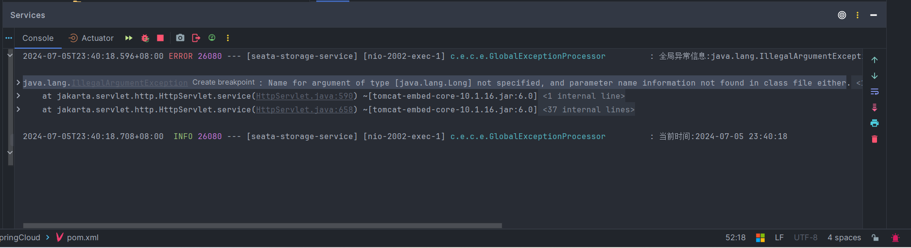
+ 哪个微服务的对应方法开启的事务，我们就需要在对应方法上面添加@GlobalTransactional注解
+ 另外，我们也可以在Seata查看当前事务的执行状态:

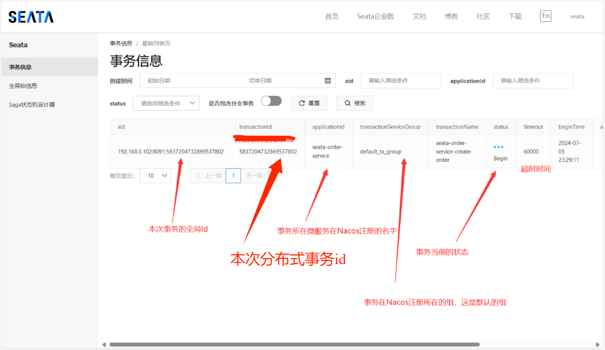
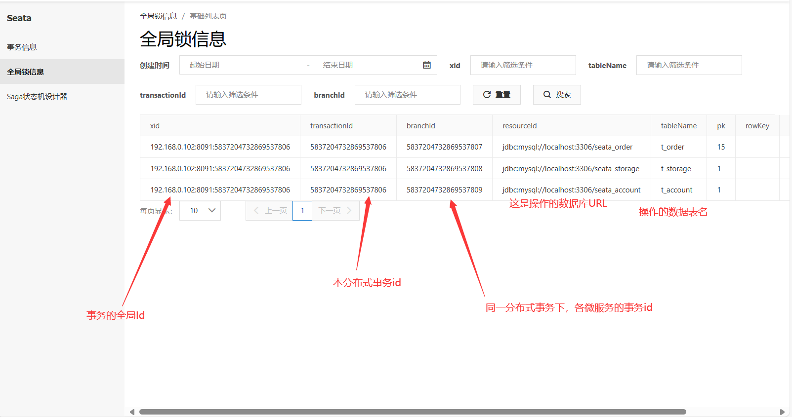

---