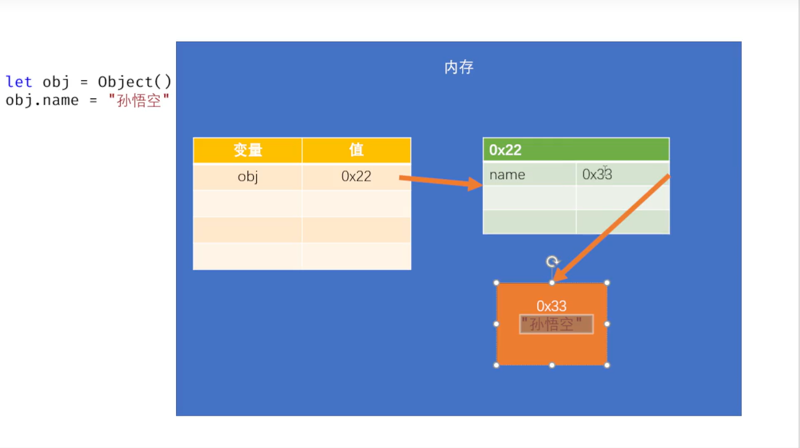
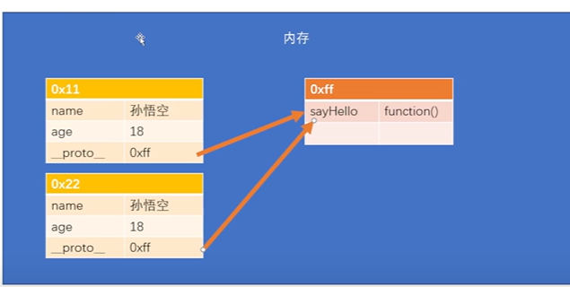

# JS基础

## 一、语法基础

### （一）编写位置

+ `JS`有多个可供编写代码的位置:
  1. 在**网页内部的`script`标签中**编写
  2. 将`js`代码写进`js`文件，然后通过`script`标签的`src`属性**引用**
  3. 在一些**特定的标签内的属性内**编写(如`a`标签的`href`属性、通用的`onclick`属性等)
+ 注:
>   1. `script`标签的`type`属性默认为`text/javascript`，可以不写
+ [样例](../笔记代码/源码/JavaScript/JS_编写位置.html)

---

### （二）输入输出

1. 输出
   + `console.log`方法用于在控制台输出
   + `document.write`方法用于在网页输出，其输出的文本会被直接注入到`body`标签内
   + `alert`方法用于在网页弹出警告
   + `confirm`方法用于在网页弹出确认框，用户可以选择“确认”或“取消”，根据用户选择的结果返回布尔值
2. 输入
   + `prompt`方法用于在网页弹出输入框供用户输入数据
     + 该方法**返回字符串**
     + **可以在方法的传参括号内写入提示语**提示用户输入注意事项
+ [样例](../笔记代码/源码/JavaScript/JS_输出信息.html)

---

### （三）语法规范与注释

1. 语法规范
> 1. `JS`**严格区分大小写**
> 2. `JS`中，浏览器会将多个空格与换行识别成一个，**可以利用此机制来进行代码的格式化**
> 3. `JS`的每条语句应该**以分号结尾**，但不写分号的话，浏览器会自动补上。
2. 标识符:在`JS`中，**所有可以被我们自主命名的内容**，可以被认为是标识符
>  + 如:`变量名`、`类名`、`函数名`等
>  + 使用标识符建议遵守以下命名规范: 
>     1. 标识符**仅能**含有数字、字母、下划线和`$`
>     2. 标识符**不能**为`JS`中的关键字和保留字
>     3. **不建议**使用内置的函数名或类名作为变量名
>     4. 对于类名，通常使用`大驼峰命名法`(首字母大写，每个单词开头大写。例:`borderleftwidth->BorderLeftWidth`)定义，对于常量一般用全大写定义，其它一般使用`驼峰命名法`(例:`maxlength->maxLength`)定义
>  + [标识符样例](../笔记代码/源码/JavaScript/JS_标识符.html)
3. 注释:
> 1. `多行注释`:使用`/**/`包含住要写的注释，该语法根据其闭合位置决定哪里为注释，**支持跨行**
> 2. `单行注释`:使用`//`，在其后加上要写的注释，该语法**仅能注释掉当前行的语句**

---

### （四）严格模式

+ `JS`的执行模式有两种形式
  1. 正常模式
     + **默认**情况下的代码都执行在正常模式下:
       1. 语法检查不严格
       2. 能不报错的地方尽量不报错
     + 这种处理方式导致代码的运行**性能较差**
  2. 严格模式
     + 在代码块最开始加上字符串`"use strict"`来开启严格模式
     + 在严格模式下，语法检查变得**严格**
       1. **禁止**一些语法
       2. 更容易报错
       3. 提升了性能
     + 在开发中，应尽量使用严格模式
+ 注意:
> 1. 类的代码块内，**默认就是严格模式**
+ [严格模式样例](../笔记代码/源码/JavaScript/JS_严格模式.html)

---

## 二、变量与数据类型

### （一）变量

> 1. 变量可以“存储”字面量
> 2. 变量中的字面量**可以随意修改**
> 3. 通过变量名**可以对字面量进行描述**，而且变量比较方便修改
> 4. **变量没有类型，变量指向的值才有类型**

#### ①变量的定义

1. 可以使用`var`或`let`直接声明变量并赋值
2. 与`let`相比，`var`的语法比较老，因此有一些缺陷，**推荐使用`let`定义变量**
3. [字面量与变量](../笔记代码/源码/JavaScript/JS_字面量与变量.html)

|区别|`let`|`const`|`var`|直接声明|
|:---:|:---:|:---:|:---:|:---:|
|块作用域|>|**具有块作用域**，即该变量的作用域仅在块内部，无法作用在块的外边|无块作用域|直接声明会使该变量作为`window`的属性存在，属于全局变量|
|函数作用域|>|>|有|^|
|变量存放路径|存放在秘密的小地方|不知道存在哪|存放在`window`对象内，**作为`window`对象的属性存在，具有安全隐患**|^|
|提升|>|提升，但在声明语句前**禁止**访问|提升，且在声明语句前可以访问|
|重复声明相同变量|>|报错|后面覆盖前面|
|样例|[let样例](../笔记代码/源码/JavaScript/JS_let关键字样例.html)|无|[var样例](../笔记代码/源码/JavaScript/JS_var关键字样例.html)|无|

---

#### ②变量的内存结构

+ `JS`将指赋值给变量时，它同时为变量与值开辟内存空间，并**将值的内存地址告诉给变量**，从而能让变量使用值
+ 在创建值的内存空间时，会首先查询是否内存已经有与该值相等的值了，如果有则**直接使用原来已有的内存空间并将地址赋值给对应变量**以节约内存空间，此时可能会出现多个变量指向同一个值的情况

---

#### ③字面量与常量

1. 字面量
> + 字面量就是一个值，它所代表的含义就是它字面的意思。如:`1`、`true`、`null`、`'hello'`等
> + 在`JS`中，所有的字面量**都可以直接使用**，但是直接使用字面量**不方便**
2. 常量
> + 常量通过`const`来定义，用来存储一些不可变的数据。
> + 常量仅能赋值一次，**重复赋值会报错**
> + 常量的定义其实是**在创建变量并赋值时锁住其指向的值的内存地址**，从而使该变量仅能指向对应的值并无法更改
> + [常量](../笔记代码/源码/JavaScript/JS_常量.html)

---

### （二）数据类型

[数据类型介绍](https://developer.mozilla.org/zh-CN/docs/Web/JavaScript/Data_structures#%E5%8E%9F%E5%A7%8B%E5%80%BC)

|所属|类型|含义|表示方法|备注|通用备注|更多|样例|
|:---:|:---:|:---:|:---:|:---:|:---:|:---:|:---:|
[原始数据类型](https://developer.mozilla.org/zh-CN/docs/Glossary/Primitive)|数值(`Number`)|表示小数和整数|直接写字面量|1.其表示整数时，其表示的整数实际上为浮点数，**当数值超过一定范围后可能会陆续以近似值、科学计数法和`Infinity`显示** 2.表示小数时，执行小数运算可能会**算不准确** 3.他可以表示的不丢失精度的数值范围为`2^53-1`至`-2^53+1`，**此区间仅适用于整数**|**原始数据类型都是不可变类型，一旦创建就不能修改**|[MDN文档](https://developer.mozilla.org/zh-CN/docs/Web/JavaScript/Reference/Global_Objects/Number#%E8%A7%84%E8%8C%83)|[数值类型](../笔记代码/源码/JavaScript/JS_数据类型_数值.html)|
|^|大整数(`BigInt`)|表示大的整数|在数字后面加上`n`|1.其能表示的数理论上说是**没有上限**的，取决于内存大小 2.它**仅能与自己类型相同的数值做运算**|^|[MDN文档](https://developer.mozilla.org/zh-CN/docs/Web/JavaScript/Reference/Global_Objects/BigInt)|^|
|^|其它进制数字|其它进制数字|1.二进制数字以`0b`开头 2.八进制数字以`0o`开头 十六进制数字以`0x`开头|1.输出时浏览器依旧按十进制输出 2.**该类型实际上应属于`Number`类型**|^|[MDN文档](https://developer.mozilla.org/zh-CN/docs/Web/JavaScript/Reference/Global_Objects/Number#%E8%A7%84%E8%8C%83)|^|
|^|`String`|字符串|使用双引号或单引号构建普通字符串，使用反单引号构建模板字符串|[详见下文](#JS_String)|^|[字符串详解](https://developer.mozilla.org/zh-CN/docs/Web/JavaScript/Reference/Template_literals)  [模板字符串详解](https://developer.mozilla.org/zh-CN/docs/Web/JavaScript/Reference/Template_literals)|[字符串样例](../笔记代码/源码/JavaScript/JS_数据类型_字符串.html)|
|^|`Boolean`|进行逻辑判断|布尔值仅有两个值，`true`和`false`|布尔类型的值的本质是数字|^|[MDN文档](https://developer.mozilla.org/zh-CN/docs/Glossary/Boolean)|[其它数据类型样例](../笔记代码/源码/JavaScript/JS_数据类型_其它数据类型.html)|
|^|`Null`|空值，特指对象的值未设置|仅有一个值`null`|**使用`typeof`关键词判断空值类型时会返回`object`，因此`typeof`无法检查空值**|^|[MDN文档](https://developer.mozilla.org/zh-CN/docs/Web/JavaScript/Reference/Operators/null)|^|
|^|`Undefined`|表示变量未定义|仅有一个值`undefined`|这是`JS`早期设计时的玩意，一般不怎么用|^|[MDN文档](https://developer.mozilla.org/zh-CN/docs/Web/JavaScript/Reference/Global_Objects/undefined)|^|
|^|`Symbol`|创建一个唯一的标识|使用`Symbol()`函数创建|无|^|[MDN文档](https://developer.mozilla.org/zh-CN/docs/Web/JavaScript/Reference/Global_Objects/Symbol)|^|

#### ①类型检查

+ 使用`typeof`关键词来判断该变量存储的值是什么类型的
+ 变量本身是没有类型的，因此**使用`typeof`关键词所检查的是变量所指向的值的类型**
+ `typeof`关键词返回一个字符串
+ [样例](../笔记代码/源码/JavaScript/JS_数据类型_类型检查.html)

#### ②数值

1. **整型(十进制)**:
>   + 在`JS`中，所有整数和浮点数都是`Number`类型，但整数其实是由浮点数表示的
>   + `JS`的**数值并不是无穷大**的，如果是整数且数值较大(**超过`2**53-1`**)或较小(**小于`-2**53+1`**)，那么会陆续以近似值、科学计数法和`Infinity`值表示；且**小数运算可能会不精确**。因此在`JS`**做一些精度较高的计算时应该特别注意**
>   + `Infinity`是一种特殊的`Number`类型值，表示**无穷大**。[详情](https://developer.mozilla.org/zh-CN/docs/Web/JavaScript/Reference/Global_Objects/Infinity)
>   + 如果`Number`类型的值与其它类型的值做运算，浏览器可能会返回`NaN`，该值是一个`Number`类型的**表示非数字的值**，且**不等于任何值(包括其本身)**。[详情](https://developer.mozilla.org/zh-CN/docs/Web/JavaScript/Reference/Global_Objects/NaN)
2. **大整数(`BigInt`)**:
>   + 该对象提供一种方法用来表示比`2**53-1`还大的整数
>   + **在数字的最后加上一个`n`**来使此字面量成为大整数类型
>   + 它**仅能与自己类型相同的数值做运算**
>   + 其能表示的数理论上说是**没有上限**的，取决于内存大小
3. **其它进制数字**:
>   + 二进制:**使用`0b`做前缀**来进行二进制表示
>   + 八进制:**使用`0o`做前缀**进行八进制表示
>   + 十六进制:**使用`0x`做前缀**进行十六进制表示
4. [样例](../笔记代码/源码/JavaScript/JS_数据类型_数值.html)

---

#### ③字符串

##### Ⅰ普通字符串

+ 在字符串中使用一对单引号(`''`)或一对多引号(`""`)来表示字符串，这些字符串通常为普通的字符串
+ 同时，为了表示一些特殊符号，需要使用**转义字符**来表示特殊符号,转义字符为`\`
+ 普通字符串**不能跨行生成字符串**，如果要跨行，需要**在行末添加`\`运算符将换行转义**，但转义后**无法维持**源代码中两行相隔的这么多空行与缩进。
+ [更多](https://developer.mozilla.org/zh-CN/docs/Learn/JavaScript/First_steps/Strings)
+ [样例](../笔记代码/源码/JavaScript/JS_数据类型_字符串.html)

---

##### Ⅱ模板字符串
+ 使用**反单引号**来表示模板字符串
+ 模板字符串**支持跨行生成字符串**，且**可以轻易在字符串内插入变量**
+ [更多](https://developer.mozilla.org/zh-CN/docs/Web/JavaScript/Reference/Template_literals)
+ [样例](../笔记代码/源码/JavaScript/JS_数据类型_字符串.html)

---

##### Ⅲ字符串比较

+ 使用关系运算符比较两个字符串时，浏览器会根据`Unicode`编码的值**逐位比较**两个字符串的每一个字母
+ 当某一次比较已经**分出结果时，直接返回比较结果**，不会再继续向下比较
+ 比较两个数字形式的字符串时，一定要使用类型转换，否则可能会出错
+ [样例](../笔记代码/源码/JavaScript/JS_数据类型_字符串_字符串比较.html)

---

##### Ⅳ字符串常用操作

|属性/方法/操作|参数描述|属性/方法/操作描述|返回值|备注|通用备注|样例|
|:---:|:---:|:---:|:---:|:---:|:---:|:---:|
|`str.length`|无参数|获取字符串长度|字符串长度|无|该方法属于**非破坏性方法**|略|
|`str[下标]`|无参数|获取下标指定的字符串字符|字符|无|^|^|
|`str.at(index)`|指定的索引|读取字符串元素|字符串索引对应的指定元素|**可以传入负值(从`-1`开始)**，负值相当于从字符串最后向前遍历|^|^|
|`str.charAt(index)`|指定的索引|读取字符串元素|字符串索引对应的指定元素|这是`JS`中比较老的方法，因此它**不支持**传入负值|^|^|
|`str.concat(参数1,参数2,....)`|**一个或多个**字符串对象|字符串的拼接|返回拼接后的新字符串|无|^|^|
|`str.indexOf(value,begin(可选))`|`value`:要查找的字符串 `begin`:指定要开始查找的下标索引|获取对应字符串在原字符串中**第一次**出现的位置|返回元素索引|找不到返回`-1`|^|^|
|`str.lastIndexOf(value,begin(可选))`|^|获取指定字符串在原字符串中**最后一次**出现的位置|^|^|^|^|
|`str.includes(value,begin(可选))`|^|查找指定的字符串是否在原字符串中|存在返回`true`,不存在返回`false`|无|^|^|
|`str.startsWith(value,begin(可选))`|^|判断原字符串是否以指定字符串开头|是返回`true`,不是返回`false`|无|^|^|
|`str.endsWith(value,begin(可选))`|^|判断原字符串是否以指定字符串结尾|^|无|^|^|
|`str.padStart(length,value(可选))`|`length`:指定填充后的字符串长度 `value`:要进行填充的字符,不写默认为空格|在原字符串**开头**用`value`字符串填充该字符串直到到达`length`的指定长度|返回处理后的字符串|如果指定的长度小于等于原字符串长度，直接返回原字符串|^|^|
|`str.padEnd(length,value(可选))`|^|在原字符串**结尾**用`value`字符串填充该字符串直到到达`length`的指定长度|^|^|^|^|
|`str.replace(regex.value)`|`regex`:使用**字符串或正则表达式**形式指定的要被替换的内容 `value`:替换的新字符串|使用一个新字符串**替换一个**指定内容|返回处理后的新字符串|^|^|^|
|`str.replaceAll(regex,value2)`|^|使用一个新字符串**替换全部**指定内容|^|^|^|^|
|`str.slice(begin,end(可选))`|`begin`:指定切片的起始位置 `end`:指定切片的结束位置|字符串切片|返回切片后的字符串|1.范围是**左闭右开**的 2.传入的索引**可以为负数** 3.`end`省略则从起始位置一直切到最后 4.该方法只能**从左至右**进行切片|^|^|
|`str.substring(begin,end(可选))`|^|^|^|它比`slice`方法聪明一点，当`end`小于`begin`时，在执行时相当于互换两个参数|^|^|
|`str.split(regex,limit(可选))`|`regex`:指定分割的依据,支持**字符串和正则表达式** `limit`:限制切割的数量|按照`value`将字符串切割为一个含多个元素的数组对象|返回该数组|如果正则表达式中有进行分组的括号，那么`split`方法会将此分组项也装入数组|^|^|
|`str.trim()`|无参数|去掉字符串**前后**的空格|返回处理后的字符串|无|^|^|
|`str.trimStart()`|^|去掉字符串**前面**的空格|^|^|^|^|
|`str.trimEnd()`|^|去掉字符串**后面**的空格|^|^|^|^|
|`str.toUpperCase()`|^|将字符串中的全部字符都转换为大写形式|^|无|^|^|
|`str.toLowerCase()`|^|将字符串中的全部字符都转换为小写格式|^|无|^|^|
|`str.rapeat(count)`|`count`:指定字符串的重复次数，该值必须为一个`0`到`Infinity`的整数|返回原字符串重复`count`次而形成的新字符串|重复的新字符串|无|^|^|
|[更多](https://developer.mozilla.org/zh-CN/docs/Web/JavaScript/Reference/Global_Objects/String)|

---

##### Ⅴ正则表达式

+ 正则表达式用来定义规则，来检验对应字符串是否符合这个规则
+ 它有两种创建方式
  1. `let 变量=new RegExp(pattern,flag)`
  2. `let 变量=/pattern/flag`
  3. `pattern`:[字符串匹配规则](#regexSyntax);`flag`:[字符串匹配模式](#regexFlag)

|匹配模式|描述|
|:---:|:---:|
|`i`|执行**对大小写不敏感**的匹配|
|`g`|执行全局匹配（**查找所有匹配而非在找到第一个匹配后停止**）|
|`m`|执行**多行匹配**。|
|`y`|执行粘性匹配(**下次查找从上次查找的结束位置开始查找**)|
|`s`|**允许`.`匹配所有字符**(包括换行等)|

|正则表达式语法|含义|
|:---:|:---:|
|`.`|除换行符或其他终止符以外的所有字符。|
|`^`|字符串开头。|
|`$`|字符串结尾。|
|`\d`,`\w`,`\s`,`\b` | 匹配数字、单词字符（包括大小写字母、数字0-9以及下划线）、空白字符（包括 空格、制表符、回车、换行符、回车制表符、换页符）、单词的开头或结尾。|
|`\D`,`\W`,`\S`|匹配非数字、非单词字符、非空白字符。|
|`[abc]`|查找方括号之间的任何字符。|
|`[a-z]`|匹配 `a` 到 `z` 中的一个字母。|
|`[0-9]`|查找任何从 `0` 至 `9` 的数字。|
|`[^abc]`|匹配除了 `a`、`b` 或 `c` 中的其他字母。|
|`?`|`0` 次或 `1` 次匹配。|
|`*`|匹配 `0` 次或多次。|
|`+`|匹配 `1` 次或多次。|
|`{n}`|匹配 `n`次。|
|`{n,}`|匹配 `n`次以上。|
|`{m,n}`|最少 `m` 次，最多 `n` 次匹配。|
|`\uxxxx`|查找以十六进制数 xxxx 规定的 `Unicode` 字符。|
|`?=n`|匹配任何其后紧接指定字符串 `n` 的字符串。|
|`?!n`|匹配任何其后没有紧接指定字符串 `n` 的字符串。|
|`\|`|**全局**或运算|

|方法|参数|方法描述|返回值|备注|样例|
|:---:|:---:|:---:|:---:|:---:|:---:|
|`regex.test(str)`|`str`:要进行检测的字符串|检查对应字符串是否符合正则表达式的要求|符合要求返回`true`，不符合返回`false`|无|[正则表达式样例](../笔记代码/源码/JavaScript/JS_正则表达式.html)|
|`regex.exec(str)`|^|将检索到符合正则表达式规范的第一个内容及其分组项装入数组并返回|如果检索到**返回一个装有该子串以及其按正则表达式括号分组的数组**，如果没有返回`null`|**使用`g`以激活`exec`记住上次检索的结束位置并在下次调用时从上次结束的位置开始寻找**|^|
|`str.match(regex)`|`regex`:正则表达式|将符合正则表达式要求的子串装入一个数组并返回|装有结果的数组|无|^|
|`str.matchAll(regex)`|^|^|返回一个装有这些结果的**迭代器**|该方法**可以分组**|^|
|`str.search(regex)`|^|将字符串中符合正则表达式规范的第一个内容的起始下标返回|符合正则表达式规范的第一个内容的起始下标|无|^|
|`str.split(regex,limit(可选))`|`regex`:指定分割的依据,支持**字符串和正则表达式** `limit`:限制切割的数量|按照`value`将字符串切割并将这些切割下来的元素装入数组并返回|返回该数组|如果正则表达式中有进行分组的括号，那么`split`方法会将此分组项也装入数组|^|
|`str.replace(regex,value)`|`regex`:使用**字符串或正则表达式**形式指定的要被替换的内容 `value`:替换的新字符串|使用一个新字符串**替换一个**指定内容|返回处理后的新字符串|^|^|
|`str.replaceAll(regex,value2)`|^|使用一个新字符串**替换全部**指定内容|^|正则表达式必须指定`g`进行全局匹配|^|

---

#### ④其他数据类型

1. **布尔类型`Boolean`**:
   + 布尔值用于进行逻辑判断
   + 它只有两个值:`true`和`false`
   + 布尔值的两个值本质是数字
2. **空类型`Null`**:
   + 空值特指对象的值未设置,其仅有一个值`null`
   + 使用`typeof`进行数据类型检查时，无法检查出`null`的值，仅会显示`object`，这是`JS`早期设计时的bug
3. **未定义类型`Undefined`**:
   + 该类型仅包括一个值`undefined`，表示变量未定义。
   + 该类型是`JS`早期设计的产物，目的是为了减少浏览器报错。现在基本不怎么用
4. `Symbol`类型:
   + `Symbol`类型可以创建一个唯一的标识

---

#### ⑤类型转换

+ 由于原始数据类型是不可变的，因此类型转换实际上是**创建了一个与待转换对象的值相同但类型不同的值并返回**,使其看起来像是发生了类型转换一样

|所属|函数/方法名|含义|返回类型|返回值|备注|详解|样例|
|:---:|:---:|:---:|:---:|:---:|:---:|:---:|:---:|
|转字符串|`x.toString()`|将部分类型的值转换为字符串|字符串|转换后的字符串对象|该方法无法转换`null`和`undefined`，转换这两个值时会报错|[MDN文档](https://developer.mozilla.org/zh-CN/docs/Web/JavaScript/Reference/Global_Objects/Object/toString)|[转字符串样例](../笔记代码/源码/JavaScript/JS_数据类型_转换字符串.html)|
|^|`String(value)`|将任意类型的值转换为字符串|字符串|转换后的字符串对象|该函数的作用原理为: 1.如果碰到可以`toString`的值，则直接调用`toString()`函数 2.如果碰到`null`，返回字符串`null` 3.如果碰到`undefined`,返回`undefined`|[MDN文档](https://developer.mozilla.org/zh-CN/docs/Web/JavaScript/Reference/Global_Objects/String)|^|
|转换数值|`Number(value)`|将字符串或者其他值转换到`Number`类型。如果该值不能被转换，它会返回`NaN`|数值或`NaN`|转换后的数字对象或`NaN`|该方法适用于全部类型转换数值|[MDN文档](https://developer.mozilla.org/zh-CN/docs/Web/JavaScript/Reference/Global_Objects/Number)|[转数值样例]()|
|^|`parseInt(string,radix)`|解析一个字符串并返回指定基数的十进制整数，`radix`是`2-36`之间的整数，表示被解析字符串的基数|数值或`NaN`|转换后的数字对象或`NaN`|1.该函数是**针对字符串转换整数数值**专门设计的 2.该函数的作用原理是从左到右依次遍历字符串，**直到读取到所有有效的整数** 3.该函数也可以用来取小数的整数部分，其在处理非字符串值时会先将待转换对象转换为字符串|[MDN文档](https://developer.mozilla.org/zh-CN/docs/Web/JavaScript/Reference/Global_Objects/parseInt)|^|
|^|`parseFloat(string)`|解析一个参数（必要时先转换为字符串）并返回一个浮点数|数值或`NaN`|转换后的数字对象或`NaN`|1.该函数是**专门针对字符串转换浮点数数值**设计的 2.该函数的作用原理是从左到右依次遍历字符串，**直到读取到所有有效的浮点数** 3.如果传入的参数不是字符串，会先将参数转换成字符串再进行操作 4.如果传入的为整数，那么返回的也是整数|[MDN文档](https://developer.mozilla.org/zh-CN/docs/Web/JavaScript/Reference/Global_Objects/parseFloat)|^|
|转换布尔值|`Boolean(value)`|将任意类型的值转换为布尔值|布尔类型|`true`或`false`|所有表示空的、错误的、没有的值都会被转换为`false`,而其余转换为`true`|[MDN文档](https://developer.mozilla.org/zh-CN/docs/Web/JavaScript/Reference/Global_Objects/Boolean)|[样例](../笔记代码/源码/JavaScript/JS_数据类型_转换布尔值.html)|

##### Ⅰ转换字符串

1. `toString()`方法:
   + 该方法可以将除`null`和`undefined`的值转换为字符串，但转这两个值时会报错
2. `String(value)`函数:
   + 该方法的作用原理为:
     1. 若碰到`null`，返回字符串`null`
     2. 若碰到`undefined`，返回字符串`undefined`
     3. 其它情况使用`toString()`方法进行操作
3. **使用`+`运算符进行类型转换**:
~~~Javascript
   let a=1+'';  //使用隐式类型转换
   console.log(typeof a,a);
~~~
   + 使用该方法转换`null`和`undefined`会转换成`Null`类型和`Undefined`类型
+ [转字符串样例](../笔记代码/源码/JavaScript/JS_数据类型_转换字符串.html)

---

##### Ⅱ转换数值

1. **`Number(value)`方法**:
>    + 该方法会将字符串或者其他值转换到`Number`类型。如果该值不能被转换，它会返回`NaN`
>    + 该方法适用于**全部类型**转换数值
>    + [样例](../笔记代码/源码/JavaScript/JS_数据类型_转换数值.html)
2. **`parseInt(string,radix)`函数:**
>    + 该函数可以解析一个字符串并返回指定基数的十进制整数，`radix`是`2-36`之间的整数，表示被解析字符串的基数
>    + **该函数是专门为字符串转换整数数值设计的**
>    + 其作用原理为:从左至右读取字符串，**直到读取到所有有效的整数**
>    + 该函数也可以用来得到小数的整数部分(虽然效率不是很高)。在传入非字符串参数后，函数会先将待转换参数转换为字符串
>    + 大部分情况下，如果不传入`radix`参数，其默认为`10`
3. **`parseFloat(string)`函数:**
>    + 该函数可以解析一个参数（必要时先转换为字符串）并返回一个浮点数
>    + **该函数是专门为字符串转换浮点数数值设计的，但如果传入的参数本来就是整数，函数会返回整数**
>    + 该函数的作用原理是从左到右依次遍历字符串，**直到读取到所有有效的浮点数**
>    + 在传入非字符串参数后，函数会先将待转换参数转换为字符串
4. **使用一元运算符进行类型转换**:
~~~JavaScript
      let a='11';
      a=+a; //对a进行取正(绝对值)操作，如果对应参数为非数值，需要先转换成数值
      console.log(typeof a,a);
~~~
5. [样例](../笔记代码/源码/JavaScript/JS_数据类型_转换数值.html)

---

##### Ⅲ转换布尔值

1. **`Boolean()`函数:**
   + 使用`Boolean()`函数来将其它类型的值转换为布尔值
   + 所有**表示空的、错误的、没有的值**都会被转换为`false`,而其余转换为`true`
   + 对象在绝大多数情况下的转换结果都为`true`
2. **使用逻辑非运算符转换**:
   + 逻辑非运算时，如果运算对象为非布尔类型对象，会先将其转换为布尔类型再进行取反操作
   ~~~JavaScript
      let a='123';
      console.log(typeof a,a);
      a=!!a;
      console.log(typeof a,a);
   ~~~
+ [样例](../笔记代码/源码/JavaScript/JS_数据类型_转换布尔值.html)

---

## 三、运算符

|所属|符号|含义|备注|通用备注|样例|
|:---:|:---:|:---:|:---:|:---:|:---:|
|**算术运算符**|`+`|加法|1.如果加法的双方有一方为字符串，那么另一方会**被强制转换为字符串**，并且他们被连接起来 2.如果双方都为`BigInt`,执行`BigInt`加法，如果一方是而一方不是，抛出`TypeError` 3.否则，双方会被**转换为数字**，执行数字加法|**1.`JS`是一门弱类型语言，当进行运算时会通过自动的类型转换来完成运算** 2.除字符串的加法外，其它运算**一般都会把操作数(值)转换为数字再进行运算**|[运算符样例1](../笔记代码/源码/JavaScript/JS_运算符1.html)|
|^|`-`|减法|无|^|^|
|^|`*`|乘法|无|^|^|
|^|`/`|除法|无|^|^|
|^|`**`|幂运算|无|^|^|
|^|`%`|取余|小数对`1`取余会返回小数|^|^|
|**赋值运算符**|`??=`|逻辑空赋值，该情况仅在左侧变量的原值为`null`或`undefined`时才会执行赋值操作|无|^|^|
|**一元运算符**|`typeof`|以字符串形式返回对应数据类型|无法查看`null`的类型|^|^|
|^|`+`|取正|1.如果处理对象不是数值，会**先将其转换为数值**再进行操作 2.可以利用以上特性将非数值转换为数值|^|^|
|^|`-`|取反|如果处理对象不是数值，会**先将其转换为数值**再进行操作|^|^|
|^|`delete`|删除对象属性|如果该属性的值是一个对象，并且没有更多对该对象的引用，该属性所持有的对象最终会自动释放。|^|^|
|^|`in`|判断指定的属性是否在指定的**对象或其原型链中**|1.是返回`true`，不是返回`false` 2.属性名应该使用**字符串**形式传入|^|^|
|^|`instanceof`|**判断某个实例对象的原型链上是否包含指定类**|1.是返回`true`，不是返回`false` 2.**`Object`对象是所有对象的原型**，因此任何类的实例对象对`Object`使用`instanceof`都会返回`true`|^|^|
|^|`...`|1.展开运算符，展开指定对象的属性 2.定义[可变参数](#Variable_parameters) 3.[解构赋值](#deconstruction)时接收剩余全部属性|1.常用来进行**浅拷贝**和**传递大量对象属性** 2.使用展开运算符对函数传参时，需要**确保展开的对象是可迭代的**|^|^|
|**自增自减运算符**|`++`|自增运算符|`++`写在前面变量先加后用，`++`写在后面变量先用后加|^|^|
|^|`--`|自增运算符|`--`写在前面变量先加后用，`--`写在后面变量先用后加|^|^|
|**逻辑运算符**|`!`|逻辑非|1.处理对象为非布尔类型时，会先将其转换为布尔值再判断,但**返回的依旧为最后判断的式子的原值** 2.运算遵循短路特性，与运算找到`false`便不再向下判断，或运算找到`true`便不再向下判断|^|[运算符样例2](../笔记代码/源码/JavaScript/JS_运算符2.html)|
|^|`&&`|逻辑与|^|^|^|
|^|`\|\|`|逻辑或|^|^|^|
|**相等运算符**|`==`|相等运算符|1.比较时如果碰到类型不相同的值，**一般(不是全部)会转换成数值再进行比较** 2.`null`和`undefined`进行相等比较时会返回`true`，这说明对这两个值比较时并没有将其转换为数值类型进行比较 3.**`NaN`与任何值都不相等(包括自身)**|^|[运算符样例3](../笔记代码/源码/JavaScript/JS_运算符3.html)|
|^|`===`|全等运算符|^|^|^|
|^|`!=`|不等运算符|^|^|^|
|^|`!==`|不全等运算符|^|^|^|
|**条件运算符**|`判断式?表达式1:表达式2`|判断式的值为`true`时，执行表达式1,否则执行表达式2|无|^|[运算符样例4](../笔记代码/源码/JavaScript/JS_运算符4.html)|
|[更多](https://developer.mozilla.org/zh-CN/docs/Web/JavaScript/Guide/Expressions_and_operators#%E7%AE%97%E6%9C%AF%E8%BF%90%E7%AE%97%E7%AC%A6)&nbsp;&nbsp;&nbsp;&nbsp;[运算符优先级](https://developer.mozilla.org/zh-CN/docs/Web/JavaScript/Reference/Operators/Operator_precedence)|

---

## 四、流程控制

### （一）代码块

+ 使用`{}`来创建代码块，**代码块可以对代码进行分组**
   +  `let`声明的变量**具有块作用域**，即该变量的作用域仅在块内部，无法作用在块的外边
   +  `var`声明的变量**不具有块作用域**
+ [样例](../笔记代码/源码/JavaScript/JS_流程控制_代码块.html)

---

### （二）判断语句

#### ①if-else语句

+ `if-else`示例:
~~~js
   if(判断语句){
      语句;
   }else if(判断语句){
      执行语句;
   }else{
      执行语句
   }
~~~

+ [if练习判断奇偶性](../笔记代码/源码/JavaScript/JS_流程控制_if练习.html)

---

#### ②switch语句

+ `switch`语句示例:
~~~js
   switch(表达式){
      case 表达式:执行表语句;break;
      case 表达式:执行语句;break;
      ...
      default:执行语句;break;
   }
~~~
+ `switch`语句的执行过程是:
  1. 从上至下以此判断`switch`括号内的表达式的值与`case`中表达式的值是否**全等**，如果全等则执行该`case`语句及其后的代码。
     + 可以使用`break`语句来等待该`case`语句执行结束后直接跳出`switch`语句
  2. 如果不全等则继续判断
  3. 前面的`case`全都不全等时，执行`default`中的内容

---

### （三）循环语句

#### ①while循环

+ 语法:
~~~js
   while(判断语句){
      代码...
   }
~~~
+ `do-while`语法:
~~~js
   do{
      代码...
   }while(判断语句)
~~~
> + `while`语句先判断再执行，`do-while`语句先执行再判断，二者在循环次数大于1时无区别，**但`do-while`循环可以保证循环体内的代码至少执行一次**

---

#### ②for循环

+ 语法:
~~~js
   for(定义表达式;判断语句;更新表达式){
      代码...
   }
~~~
+ 其执行流程为:
  1. `①`执行定义表达式
  2. `②`执行判断语句
  3. `③`执行循环体内部代码
  4. `④`执行更新表达式，更新表达式可以为多行代码，各代码之间使用逗号(英文)隔开
  5. `⑤`从`②`开始继续循环执行
+ 对于其定义表达式定义的变量
  + 当使用`var`定义时，该变量可以在循环外被使用或访问
  + 当使用`let`定义时，该变量为**局部变量**，仅能在循环内部被使用
+ [样例](../笔记代码/源码/JavaScript/JS_流程控制_循环样例.html)
+ [嵌套循环样例](../笔记代码/源码/JavaScript/JS_流程控制_嵌套循环样例.html)

---

#### ③break与continue

+ `break`可以跳出离他最近的当前循环
+ `continue`可以跳过离它最近的当前循环的一次循环

+ [样例](../笔记代码/源码/JavaScript/JS_流程控制_break与continue.html)

---

## 五、对象

### （一）对象基础

+ 对象主要分为三类
> 1. **内建对象**(如:`String`、`Number`、`Object`、`Function`等)
> 2. **宿主对象**:由浏览器提供的对象(如:`DOM`、`BOM`等)
> 3. **自定义对象**:由开发人员自己创建的对象

#### ①对象的创建

+ 对象可以存储**多个各种类型**的数据,对象中存储的数据，称为属性
+ 对象可以使用以下方式创建:
  1. `let a = new Object()`
  2. `let a = Object()`
  3. `let a={属性:值,....}`
+ 注意:
> + **对象创建时，不会在内存中寻找与其值相同的对象，而是会直接在内存中创建**
> + **使用`typeof`检查对象时，会返回`object`**

+ [样例](../笔记代码/源码/JavaScript/JS_对象_对象的创建.html)

---

#### ②对象属性

+ 通常属性名就是一个字符串，所以属性名可以是任意的值
  + 如果属性名过于特殊，系统是会报错的，此时需要用`['属性名']`来创建
  + 虽然其一般没有规范，但是还是**建议使用标识符规范来规范属性命名**
1. 创建属性
> + 对象的属性在创建时不必使用`let`或`var`关键词，**可以直接赋值**
> + 直接创建:`object.name="李子轩";`
> + 使用`[]`创建(**该方式与第一种方式实际效果是一样的**):`object["name"]="李子轩";`
> + 使用`Symbol`创建`object[Symbol对象]="李子轩";`
>    + 使用`Symbol`添加的属性，获取时也必须使用`Symbol`来获取
>    + 使用`Symbol`添加的属性，**通常是那些不想被外界访问的属性**
2. 访问属性
> + 打印对象没有的属性时，**会返回`undefined`而不会报错**
> + 直接访问:`console.log(object.name);`
> + 使用`[]`访问:`console.log(object['name']);`
> + 专门使用`Symbol`对象访问:`console.log(object[Symbol对象]);`
> + 通过变量(**变量指向的值需要为字符串**)访问:`console.log(object[变量]);`
3. 对象字面量:
> + 可以直接使用`let a={}`的方式创建一个对象
> + 可以直接使用字面量在对象里面填写属性，规则为`属性名:属性值`，以`,`隔开
> + 在字面量中，可以直接以`函数名(){语句}`的方式向字面量形式的对象增加属性
> + 在字面量中，如果要添加属性的属性名与函数名一样，可以略过`属性名:属性值`的方式添加属性，而是**直接在字面量内写该函数名**即可完成添加
4. 其它
> 1. 对象是可以嵌套对象的
+ [对象属性样例](../笔记代码/源码/JavaScript/JS_对象_对象属性样例.html)

---

#### ③对象方法

+ 由于函数也是一个对象，因此**函数也能成为对象的属性**
+ 当一个对象的属性指向一个函数时，我们称这个函数为此对象的**方法**
+ [样例](../笔记代码/源码/JavaScript/JS_对象_方法.html)

---

#### ④对象的内存结构

+ **对象属于可变类型**
1. 对于对象来说，因为其不属于原始数据类型，因此其内存结构与原始数据类型会有差异
  1. 对象的变量存储的是对象的内存地址
  2. 对象内部存储对象的属性名和属性名对应的属性值的内存地址
  3. 对象对应的属性值一般来说单独开辟内存空间并向对象返回其内存地址，方便属性名指向该值

2. 对象中的属性实际上是存储在两个区域中的
   1. 对象自身:**直接通过对象声明的**，以及在类中**通过`属性名=属性值`的方式定义的属性**，会存储在对象自身中
   2. 原型对象:使用`xxx(){...}`语法声明的函数，以及主动向原型对象中添加的属性或方法，会存储在原型对象中,而对象使用其默认拥有的`__proto__`属性来存储原型对象的内存地址
+ 注意:
> 1. 使用相等或全等运算符比较两个对象时，比较的是其**内存地址**
> 2. 指向相同对象的变量，当一个变量修改时其对象属性时，另一个变量指向的对象也一定会被修改。
> 3. 通常使用`const`来定义一个对象，定义后**指向该对象的变量无法更改，但对象依然可以更改**
3. 垃圾回收
   + `JS`会自动将不被任何变量所指向的值回收，以节省内存空间
   + 我们唯一能做的是不再使用某个变量时，将其值置空
+ [样例](../笔记代码/源码/JavaScript/JS_对象_可变类型.html)

---

### （二）对象的枚举

+ 使用`for-in`语句来实现对对象的枚举，其格式为:
~~~js
   for(let i in object){
      执行代码...
   }
~~~
+ [样例](../笔记代码/源码/JavaScript/JS_对象_枚举属性.html)

---

### （三）window对象

+ 在浏览器中，浏览器为我们提供了一个`window`对象，该对象为`Window`接口的实例对象,可以直接访问
> + `window`对象代表的是浏览器窗口，通过该对象可以对浏览器窗口进行各种操作
> + `window`对象还负责存储`JS`中的**内置对象**(如:`String()`、`Number()`等函数)和浏览器的**宿主对象**(如:`document`、`alert`、`console`等)
> + `window`对象的属性可以通过`window`对象访问，也可以**直接访问**
> + **使用`function`定义的函数也会被存放进`window`对象内**
> + `window`中的`EventTarget`、`Element`等属性仅为一个其实例对象的`__proto__`指向`EventTarget`、`Element`接口的函数，这些接口并不在`window`对象内

---

### （四）原型

+ 对象中的属性实际上是存储在两个区域中的
   1. 对象自身:**直接通过对象声明的**，以及在类中**通过`属性名=属性值`的方式定义的属性**，会存储在对象自身中
   2. 原型对象:使用`xxx(){...}`语法声明的函数，以及主动向原型对象中添加的属性或方法，会存储在原型对象中,而对象使用其默认拥有的`__proto__`属性来存储原型对象的内存地址

#### ①对象数据与原型链

1. 对象数据
> + 原型对象中的数据包括**对象中的属性(属性、方法等)**和**对象的构造函数**
> + 如果想访问一个对象的的原型对象，**推荐**的写法是`Object.getProtoTypeOf(对象)`，另一种写法是`对象实例.__proto__`，因为该写法**可以直接修改原型对象的内容**
> + 几乎所有函数的`__proto__`都指向`Function.prototype`
> + `__proto__`表示**当前对象所指向的原型对象**，而`prototype`表示**构造函数希望它的实例所指向的原型对象**
2. 原型链
> + 原型对象也有原型，如此循环，**直到`Object`对象的原型对象为`null`**，这样就构成了一条原型链。**根据对象的复杂程度不同，原型链的长度也不同(`Object`对象的长度为2,包括其自身和它的原型对象)**
> + 对象属性的读取:
>    1. 对象在读取属性时，会**优先读取自身的属性**
>    2. 如果没有，则在自己的原型对象中寻找
>    3. 如果还是没有，那么向自己的原型对象的原型对象中寻找....
>    4. 直到找到`Object`对象的原型对象(**所有对象最后都会找到这个对象**)还是没有，那么直接返回`undefined`
1. 注意:
> 1. [作用域链](#Scope_Chain)，是变量的链，最后找不到会**报错**
> 2. 原型链，是对象的链，最后找不到会**返回`undefined`**

---

#### ②原型的作用

+ 所有的同类型对象的原型对象都是**相同**的，这就意味着**它们的原型链是完全一致的**

+ 原型的作用:
> + 原型相当于是一个公共的区域，它**可以被所有的该类实例所访问**
>   + 因此，我们可以将公共属性统一存储到原型中，这样既可以**节约内存**也可以保证该属性可以**被任意该类的实例对象所访问**
> + 在`JS`中，**继承就是通过原型实现的**
>   + 继承时，子类的原型就是父类的一个实例
+ [原型作用样例](../笔记代码/源码/JavaScript/JS_对象_原型作用.html)

---

#### ③修改原型

+ 大部分情况下，我们是不需要修改原型对象的
+ 注意:
> 1. 不要通过类的实例去修改实例对象
>    + **一个实例对象的修改会影响所有同类对象**，这么做是不合适的
>    + 修改原型需要先创建实例，比较麻烦
>    + 这会导致可能的隐患
>    + 可以使用`Object.setPrototypeOf(obj,prototype)`方法来**指定修改某一个对象的prototype属性**
> 2. 如果要修改，应该通过类中隐藏的`prototype`属性修改
>    + 一经修改就可以影响到其全部的实例对象
>    + 无需创建实例即可完成修改
>    + **类的`prototype`属性是不可写的**
+ [修改原型样例](../笔记代码/源码/JavaScript/JS_对象_修改原型.html)

---

#### ④与原型有关的运算

|运算符/方法|作用|使用方法|备注|通用备注|样例|
|:---:|:---:|:---:|:---:|:---:|:---:|
|`instanceof`|**判断某个类是否存在于某个实例对象的原型链上**|`实例对象 instanceof 类`|**`Object`对象是所有对象的原型**，因此任何实例对象对`Object`对象使用`instanceof`运算符都会返回`true`|属性名一般要以字符串形式表示，因为**在对象中属性名本质上是通过字符串存储的**|[原型运算样例](../笔记代码/源码/JavaScript/JS_对象_原型运算.html)|
|`in`|**判断某个属性是否存在于某个实例对象或其原型链上**|`属性名 in 实例对象`|无|^|^|
|`hasOwnProperty()`|判断对象自身是否具有指定属性|`实例对象.hasOwnProperty(属性名)`|该方法无法作用于使用`Object.create(null)`生成的实例对象，因为该方法存在于`Object`类的原型对象中，而**使用`Object.create(null)`生成的实例对象的原型链中没有`Object`类的原型对象**，因此无法调用该方法,现在已经**不推荐使用**了|^|^|
|`Object.hasOwn()`|^|`Object.hasOwn(实例对象,属性名)`|该方法与`hasOwnProperty()`方法的不同在于支持使用`Object.create(null)`创建的实例对象判断属性是否在自身存在，因为该方法是`Object`类中的静态方法|^|^|
|`Object.getProtoTypeOf()`|获取指定实例对象的原型|`Object.getProtoTypeOf(对象)`|无|^|^|

---

### （五）对象的拷贝

+ 对象的拷贝分为两种
> 1. 浅拷贝(`shallow copy`):
>    + 仅对对象的浅层进行拷贝(只复制一层),即**只会对目标对象本身进行复制**，而不会复制其内部的属性(即新的对象中的属性与原对象属性中存储的**内存地址是相同的**。或者说二者做全等判断返回`true`)
>    + 如果对象中存储的数据全都是**原始数据类型**，那么拷贝的深浅是**不重要**的
> 2. 深拷贝(`deep copy`):
>    + 深拷贝**不仅复制对象本身，还会复制对象中的属性和元素**
>    + 深拷贝的性能一般不太好，一般**很少使用**深拷贝

|分类|方法|描述|备注|通用备注|样例|
|:---:|:---:|:---:|:---:|:---:|:---:|
|**浅拷贝**|`{...obj}`|使用**展开运算符**对**对象**进行浅拷贝|可以额外向里面添加一些属性，如果添加的属性与展开的对象的属性冲突: 1.若添加的属性**在展开运算符之前**，则**添加的属性值会被覆盖** 2.若添加的属性值**在展开运算符之后**，则`obj`对象的属性值将**被添加的属性值覆盖**|无|[对象拷贝样例](../笔记代码/源码/JavaScript/JS_对象_对象拷贝.html)|
|^|`[...array]`|使用展开运算符对**数组**进行浅拷贝|^|^|^|
|^|`Object.assign(参数1,参数2)`|将`参数2`中的属性复制到`参数1`中并返回|如果双方存在属性冲突，则根据**后来者居上**的原则覆盖|^|^|
|^|`array.slice()`|不传入参数使`slice`方法进行**数组的浅拷贝**|无|^|^|
|**深拷贝**|`structuredClone(参数)`|返回对传入参数的深拷贝对象|无|^|^|
|^|`JSON.parse(JSON.stringify(参数))`|^|需要保证传入的参数遵循[JSON规范](#JSON)|^|^|

---

### （六）面向对象

#### ①类

+ 如果仅使用`Object`来创建对象的问题:
  1. 无法区分出不同类型的对象
  2. 不方便批量创建对象
+ 在`JS`中，可以通过**类**来解决这个问题
  1. **类是对象的模板**，可以将对象中的属性和方法直接定义在类中。定义后，就可以直接通过类来创建对象
  2. 通过同一个类创建的对象，称为**同类对象**
     + 可以使用`new 类名()`的方式来创建对象
     + 如果某个对象是由某个类创建的，我们称这个对象是这个类的**实例**
     + 使用`instance`关键字可以判断该对象是否为对应类的实例
   3. 类的代码块内**默认就是严格模式**
+ 语法:
~~~js
   class 类名(大驼峰命名法){
      ...
   }
   或
   const 类名=class{
      ...
   }
~~~
+ [类样例](../笔记代码/源码/JavaScript/JS_面向对象_类.html)

---

#### ②构造函数

##### Ⅰ构造函数的创建

+ 在类中，可以添加一个特殊的方法`constructor`(构造函数/方法),对实例属性进行赋值
+ 在构造函数中,`this`表示当前所创建的对象
+ **构造函数会保存在对应类的原型对象中，而不是类本身**
+ [构造函数样例](../笔记代码/源码/JavaScript/JS_面向对象_构造函数.html)

---

##### Ⅱnew运算符

+ `new`运算符会创建一个用户定义的对象类型的实例或具有构造函数的内置对象的实例
+ 它的执行过程如下:
> 1. 创建一个普通的对象(即`{}`)
> 2. 将**构造函数的`prorotype`属性**设置为对象的原型
> 3. 传入实参，开始执行构造函数，并**令构造函数的`this`指向该对象**
> 4. 如果构造函数的返回值为**非原始数据类型**，则返回构造函数的返回值，如果不是，则返回该对象

---

#### ③属性与方法

##### Ⅰ属性

+ 类的代码块是**用来设置对象的属性**的，并不像函数那样什么都能写
+ 类中的属性分为两种:
  1. 实例属性:**仅能通过实例访问**的属性，定义方式与对象的属性定义方式相同
  2. 静态属性(类属性):使用`static`关键字声明的属性，**该属性仅能通过类名访问**
+ [属性样例](../笔记代码/源码/JavaScript/JS_面向对象_类的属性.html)

---

##### Ⅱ方法

+ 类的方法同样分成两种:
  1. 实例方法:**仅能通过实例访问**的方法，定义语法见下:
   ~~~js
            class 类名{
               方法名=function(){
                  ...
               }
               方法名=()=>{
                  ...
               }

               //使用该语法定义的方法，会被存储到原型对象中去，而不会被存储在对象自身内，因此打印该类实例时不会看到该方法
               //但貌似可以被静态方法的this打印到，因为this指向当前类
               方法名(){
                  ...
               }
            }
   ~~~
  2. 静态方法(类方法):**仅能通过类名调用**的方法，需要在方法定义前使用`static`关键字修饰
+ 注意:
> 1. 对于实例方法来说，`this`就是当前实例。而对于静态方法来说，`this`就是当前类
+ [方法样例](../笔记代码/源码/JavaScript/JS_面向对象_类的方法.html)

---

#### ④封装、继承与多态

##### Ⅰ封装

+ 对象不仅要存储属性，还需要**保证数据的安全**，即不能让对象中的属性被轻易的修改
+ 直接在对象内声明的属性，可以被外界直接访问和修改，因此需要对它们进行**限制**，可以通过**私有化数据**和**设置读(`getter`)写(`setter`)方法**开放对数据的操作
1. 私有属性
   + 在对象的属性前添加`#`，便可以将该属性设置为**私有属性**
   + 私有属性**仅能在类的内部被访问与修改**，且私有属性**必须先声明才能使用**
2. `getter`和`setter`方法
   + `getter`方法用来返回指定属性的值,`setter`方法用于检验传入的要修改的值是否正确并进行修改
   + 这两种方法可以控制属性的读写权限(例如，如果该属性不能修改，则仅定义该属性的`getter`方法而不定义该属性的`setter`方法)
+ **以上两个步骤即为实现封装的方式**
+ [封装样例](../笔记代码/源码/JavaScript/JS_面向对象_封装.html)

---

##### Ⅱ继承

+ 类可以通过继承来实现其它类的功能，继承使用`extends`关键字来完成
+ 通过继承，**可以减少重复的代码**，并可以在不修改一个类的前提下对其进行扩展，这可以减少代码冗余并**提高类的扩展性**
+ 继承发生时，被继承的类被称为父类(超类),而继承的类被称为子类
+ [继承样例](../笔记代码/源码/JavaScript/JS_面向对象_继承.html)

---

##### Ⅲ多态

+ 在`JS`中，传参时函数不会识别传入参数的类型，这就意味着任何类型的数据都可以作为参数传入
+ 多态就是以相同方式处理不同对象实现不同效果
+ [多态样例](../笔记代码/源码/JavaScript/JS_面向对象_多态.html)

---

#### ⑤旧类

+ 在`JS`早期，类是通过函数来定义的
> 1. 函数体内部用来写构造函数的代码,此时`this`表示新创建的对象
> 2. 使用`类名.prototype.xxx`来**向原型对象中添加或修改属性**
> 3. 使用`类名.属性名`来向类中添加**静态属性**
> 4. 使用`类名.方法名`来向类中添加**静态方法**
+ 由于使用该方法创建类，它的构造函数、修改原型、修改静态属性等操作并不在一个代码块内进行，因此**一般使用该方法创建类时会采用[立即执行函数](#Execute_immediately_function)对其进行创建**，并返回创建好的函数对象
+ [旧类样例](../笔记代码/源码/JavaScript/JS_面向对象_旧类.html)

---

### （七）内置对象

+ [MDN文档参考](https://developer.mozilla.org/zh-CN/docs/Web/JavaScript/Reference/Global_Objects)
+ 笔记中目前记录的内置对象有:
  1. [函数(Function)](#Function)
  2. [数组(Array)](#Array)
  3. [JSON](#JSON)
  4. [Object](#Object)
  5. [Map](#Map)
  6. [Set](#Set)
  7. [Math](#Math)
  8. [Date](#Date)
  9. [正则表达式(RegExp)](#Regex)

---

#### ①数组

+ 数组属于**复合数据类型**，且是`JS`的标准内置对象，它可以**有序的**存储多个**不同类型**的数据
+ 数组中的数据被称为**元素**

##### Ⅰ基本操作

|操作|方法名|语法|作用|备注|通用备注|样例|
|:---:|:---:|:---:|:---:|:---:|:---:|:---:|
|创建操作|`Array`|`let arr = new Array()`|创建数组|无|无|[数组样例1](../笔记代码/源码/JavaScript/JS_数组基本操作1.html)|
|^|`[]`|`let arr = []`|使用字面量的形式创建数组|可以在字面量中声明数组的初始元素|^|^|
|读取操作|>|`array[index]`|读取指定索引的数组的值|**超出索引不会报错，而是会返回`undefined`**|^|^|
|添加操作|>|`array[index]=value`|1.向数组的指定索引添加值|如果添加的索引不连续，数组会**扩容到最大索引处，并保留未赋值部分的内存空间且提示为空，此时数组成为非连续数组**，在实际编写时，应该**尽量避免**使数组成为非连续数组 2.利用数组的`length`特点，每次都可以使用`array[array.length]=value`的方法在数组的最后面添加元素|^|^|
|数组长度操作|`length`|`array.length`|获取数组长度，该长度实际为数组的最大索引值`+1`|无|^|^|
|^|`length`|`array.length=value`|将数组长度设为指定值|如果设置后的值比设置前的值大，则数组**扩容至指定大小**；如果比之前的值小，则数组会**从后向前删除数据直到数组长度与指定的值大小相同**|^|^|

---

##### Ⅱ遍历数组

+ 遍历数组除采用一般的`for(let i=0;i<array.length;i++){ console.log(array[i]) }`外，还可以使用`for-of`语句遍历
+ `for-of`语句用来**对可迭代对象(数组、字符串等)进行遍历**:
  + 语法:`for(let 变量 of 可迭代对象){ ... }`
  + 其**循环次数取决于数组长度**
  + 从可迭代对象的第一个值开始，依次赋值给声明的变量
+ [遍历数组样例](../笔记代码/源码/JavaScript/JS_数组基本操作1.html)

---

##### Ⅲ数组常用方法

|分类|方法名|语法|参数|描述|返回值|备注|通用备注|样例|
|:---:|:---:|:---:|:---:|:---:|:---:|:---:|:---:|:---:|
|[数组常用方法详解](https://developer.mozilla.org/zh-CN/docs/Web/JavaScript/Reference/Global_Objects/Array)|
|占位|`at`|`array.at(index)`|指定的索引|读取数组元素|数组索引对应的指定元素|**可以传入负值(从`-1`开始)**，负值相当于从数组最后向前遍历|该方法属于**非破坏性方法**(即不会对原数组有所更改)|[数组方法样例1](../笔记代码/源码/JavaScript/JS_数组常用方法1.html)|
|占位|`concat`|`array.concat(参数1,参数2,....)`|**一个或多个**数组对象|数组的拼接|返回拼接后的新数组|无|^|^|
|占位|`indexOf`|`array.indexOf(value,begin)`|`参数1`:指定要查找的元素 `参数2`:指定开始查找的索引|获取元素在数组中**第一次**出现的位置|返回元素索引|1.找不到返回`-1`|^|^|
|占位|`lastIndexOf`|`array.lastIndexOf(value,begin)`|^|获取元素在数组中**最后一次**出现的位置|^|^|^|^|
|占位|`join`|`array.join(参数)`|指定一个**字符串**作为连接符|将一个数组中的元素连接成一个字符串|返回拼接后的字符串|无|^|^|
|占位|`slice`|`array.slice(参数1,参数2)`|1.参数`1`:指定切片的起始位置 2.参数`2`:指定切片的结束位置|截取数组/数组切片|返回切片后的数组|1.范围是**左闭右开**的 2.传入的索引**可以为负数** 3.参数`2`省略则从起始位置一直切到最后 4.不写参数等同于对该数组进行[浅拷贝/浅复制](#Object_copy)|^|^|
|占位|`push`|`array.push(value)`|要插入的参数|在数组的**最后**插入指定值|无返回值|无|该方法属于破坏性方法|[数组方法样例2](../笔记代码/源码/JavaScript/JS_数组常用方法2.html)|
|占位|`pop`|`array.pop()`|无参数|取出数组**最后一个元素**并将其从数组中移除|数组的最后一个元素|无|^|^|
|占位|`unshift`|`array.unshift(value)`|要插入的参数|在数组的**开头**插入指定值|无返回值|无|^|^|
|占位|`shift`|`array.shift()`|无参数|取出数组中**第一个元素**并将其从数组中移除|数组中第一个元素|无|^|^|
|占位|`splice`|`array.splice(参数1,参数2,参数3,参数4,...)`|`参数1`用来指定插入和删除的起始位置，参数会被转换为整数 `参数2`用来指定从起始位置要删除的元素数量 后面的参数用来接收要插入的值|对数组中的元素进行**删除和插入**操作|包含了删除的元素的数组，没有返回空数组|1.如果`参数1`超过了数组最大索引或被省略，数组将不会执行删除操作 2.如果`参数1`是负数且绝对值大于数组长度则默认为`0` 3.详情见[MDN](https://developer.mozilla.org/zh-CN/docs/Web/JavaScript/Reference/Global_Objects/Array/splice)|^|^|
|[数组去重](../笔记代码/源码/JavaScript/JS_数组去重.html)|
|[高阶函数](#closure)|`sort`|`array.sort(回调函数(a,b){...})`|回调函数返回值将影响函数的排序顺序，`return a-b`即按升序排序，`return b-a`即按降序排序|数组排序|无返回值|如果不传入参数，该方法将**通过`Unicode`编码进行排序**，并默认**升序**排序，因此**通过不传参的方式对存有数字元素的数组进行排序可能会得到不正确的结果**|破坏性方法|[数组方法样例3](../笔记代码/源码/JavaScript/JS_数组常用方法3.html)|
|^|`filter`|`array.filter(回调函数(element,index(可选),array(可选)){...})`|`element`:待处理数组元素 `index(可选)`:待处理数组元素的对应索引 `array`:原数组 **回调函数的返回值将被存入新数组中**|将数组中符合条件的元素放入一个新的数组中并返回|符合条件的元素组成的数组|数组中有几个元素，该回调函数就会被调用几次|非破坏性方法|^|
|^|`forEach`|`array.forEach(回调函数(element,index(可选),array(可选)){...})`|`element`:待处理数组元素 `index(可选)`:待处理数组元素的对应索引 `array`:原数组 **可以通过回调函数输出对应元素**|对数组的每个元素执行一次给定的函数|无返回值|一般用于数组遍历|^|^|
|^|`map`|`array.map(回调函数(element,index(可选),array(可选)){...})`|`element`:待处理数组元素 `index(可选)`:待处理数组元素的对应索引 `array`:原数组 **回调函数的返回值将被存入新数组中**|处理后的元素组成的数组|一个新数组|无|^|^|
|^|`reduce`|`array.reduce(回调函数(a,b){...},参数2)`|`a`:待处理数组元素 `b(可选)`:待处理数组元素 `参数2`:起始值，数组最开始运算时，第一次调用回调函数时会将起始值作为变量`a`传入 回调函数将对两个变量进行处理,下一次回调函数被调用时`a`将会为上一次回调函数执行的返回值，而`b`为下一个数组元素|数组合并值|计算的最终值|无|^|^|
|`Array`静态方法|`isArray`|`Array.isArray(参数)`|传入的参数为要判断的对象|判断传入的参数是否为数组|是返回`true`,不是返回`false`|无|无|[数组方法样例4](../笔记代码/源码/JavaScript/JS_数组常用方法4.html)|
|^|`from`|`Array.from(arrayLike,mapFn(element,index)(可选),thisArg(可选))`|`arrayLike`:想要转换成数组的类数组或可迭代对象 `mapFn(element,index)(可选)`:每个将要添加到新数组中的元素将会被该函数处理，其返回值将作为处理后的元素加入新数组中 `thisArg(可选)`:指定`mapFn`函数的`this`|将**类数组或可迭代对象**转化为数组|转化后的新数组|1.该方法**不会破坏原对象** 2.该数组对象是对原对象**浅拷贝**的|无|^|

---

#### ②Map

+ `Map`用来存储键值对类型的数据
+ `Map`与`Object`的区别是`Map`的`key`可以是任意类型的数据，而`Object`中的`key`仅能为字符串

|常用方法/属性|参数描述|方法/属性描述|返回值|备注|样例|
|:---:|:---:|:---:|:---:|:---:|:---:|
|`new Map()`|无参数|生成一个空的Map对象|返回新生成的`Map`对象|无|[Map样例1](../笔记代码/源码/JavaScript/JS_Map样例1.html)|
|`map.size`|^|得到`map`中键值对的数量|返回`map`的键值对数量|无|^|
|`map.set(key,value)`|`key`为要向`map`修改/添加的键，`value`为键对应的值|**修改或添加**`map`的键值对|`null`|无|^|
|`map.get(key)`|`key`为要读取的`map`中键的值|**获取**`map`中指定键对应的值|键对应的值|如果`map`中没有这个键，则返回`undefined`|^|
|`map.delete(key)`|`key`为要删除的`map`中键的值|**删除**`map`中指定键对应的键值对|`null`|无|^|
|`map.has(key)`|`key`为要查找的键的值|**判断**`map`中是否存在指定的键|存在返回`true`,不存在返回`false`|无|^|
|`map.clear()`|无参数|清空对应`map`|`null`|无|[map样例2](../笔记代码/源码/JavaScript/JS_Map样例2.html)|
|`map.keys()`|^|返回包含`map`中全部键的可迭代对象|可迭代对象|无|^|
|`map.values()`|^|返回包含`map`中全部值的可迭代对象|可迭代对象|无|^|
|`map.entries()`|^|返回包含`map`中全部键值对的可迭代对象|可迭代对象|该可迭代对象对每个键值对的表示形式是数组形式的:`[key,value]`|^|
|`map.forEach(回调函数(value,key(可选),map(可选)))`|回调函数用来对每个数组参数进行处理(一般就是用来输出): `value`:待处理`map`值 `key`:待处理`map`键 `map`:调用`forEach`的`map`对象本身|一般用来进行`map`对象的遍历|无返回值|无|^|
|`for(let value of map)`|^|遍历`map`对象|无返回值|每次遍历`value`得到的结果是一个`[key,value]`形式的数组|^|

---

#### ③Set

+ `Set`的功能与数组类似，但它存储的数据全部都是不重复的，因此可以利用`Set`进行去重操作

|常用方法/属性|参数描述|方法/属性描述|返回值|备注|样例|
|:---:|:---:|:---:|:---:|:---:|:---:|
|`new Set()`|无参数|生成一个空的Set对象|返回新生成的`Set`对象|无|[Set样例1](../笔记代码/源码/JavaScript/JS_Set样例.html)|
|`set.size`|无参数|>|>|返回`set`对象目前包含的元素数量|^|
|`set.add(value)`|`value`:要向`set`中**添加**的值|向`set`中添加值|`null`|无|^|
|`set.delete(value)`|`value`:要删除的值|**删除**`set`中的值|`null`|无|^|
|`set.has(value)`|`value`:要进行判断的值|**判断**`set`中是否存在指定的值|存在返回`true`,不存在返回`false`|无|^|
|`set.values()`|无参数|得到`set`对象全部的值|返回类型为`Set`类型|无|^|
|`set.keys()`|>|>|>|**实际上与调用`set.values()`没有任何区别**|^|
|`set.entries()`|无参数|得到`set`对象的全部键值对|返回类型为`Set`类型|由于`Set`没有`key`,因此它的`key`和`value`完全一致|^|

---

#### ④Math

+ `Math`是一个工具类，它无法创建实例对象(即无法使用`new`运算符构造`Math`对象)
+ `Math`为我们提供了许多数学计算的函数

|分类|常用方法/属性|参数描述|方法/属性描述|返回值|备注|样例|
|:---:|:---:|:---:|:---:|:---:|:---:|:---:|
|常量|`Math.PI`|无参数|>|圆周率|无|略|
|^|`Math.E`|无参数|>|自然对数的底数|无|^|
|数学计算|`Math.abs(x)`|`x`:要进行计算的值|取绝对值|返回计算结果|无|^|
|^|`Math.max(value1,value2,value3,...)`|传入多个用于比较的值|取多个数据的最大值|最大值|可以用**展开运算符**像该函数传参|^|
|^|`Math.min(value1,value2,value3,...)`|^|取多个数据的最小值|最小值|^|^|
|^|`Math.pow(x,y)`|`x`:基数 `y`:幂|求`x`的`y`次方|返回计算结果|无|^|
|^|`Math.sqrt(x)`|`x`:要进行计算的值|求`x`的平方根|^|无|^|
|^|`Math.random()`|无参数|>|返回`[0,1)`范围内的浮点数|无|^|
|取整运算|`Math.floor(x)`|`x`:要取整的值|取不大于该数的最大整数(**向下取整**)|返回取整结果|无|^|
|^|`Math.ceil(x)`|^|取不小于该数的最小整数(**向上取整**)|^|无|^|
|^|`Math.round(x)`|^|**四舍五入**取整|^|无|^|
|^|`Math.floor(x)`|^|**去掉小数点**取整|^|无|^|
|[更多](https://developer.mozilla.org/zh-CN/docs/Web/JavaScript/Reference/Global_Objects/Math)|

---

#### ⑤Date

+ 在`JS`中，所有表示时间的数据都由`Date`对象来表示

|常用方法/属性|参数描述|方法/属性描述|返回值|备注|样例|
|:---:|:---:|:---:|:---:|:---:|:---:|
|`new Date(参数)`|[详见下表](#newDateParameter)|创建指定的`Date`对象|新的`Date`对象|无|[Date对象样例](../笔记代码/源码/JavaScript/JS_Date对象样例.html)|
|`date.getFullyear()`|无参数|得到对应`date`对象的四位年份|四位年份|无|^|
|`date.getMonth()`|无参数|得到对应`date`对象的月份|**返回范围为`[0,11]`**|无|^|
|`date.getDate()`|无参数|得到对应`date`对象的日|当前`date`对象是几日|无|^|
|`date.getTime()`|无参数|得到对应`date`对象的时间戳|时间戳|时间戳为`date`对象对应的格林尼治时间与格林尼治时间的`1970.1.1 00:00:00`所距离的**毫秒**值|^|
|`Date.now()`|无参数|获取当前的时间戳|^|^|^|
|`date.toLocaleDateString(locales(可选), options(可选))`|[MDN](https://developer.mozilla.org/zh-CN/docs/Web/JavaScript/Reference/Global_Objects/Date/toLocaleDateString)|将`date`对象的日期转化为特定地区(默认为当地)的日期格式|转换后的字符串|无|^|
|`date.toLocaleTimeString(locales(可选), options(可选))`|[MDN](https://developer.mozilla.org/zh-CN/docs/Web/JavaScript/Reference/Global_Objects/Date/toLocaleTimeString)|将`date`对象的时间转化为特定地区(默认为当地)的时间格式|^|无|^|
|`date.toLocaleString(locales(可选), options(可选))`|[MDN](https://developer.mozilla.org/zh-CN/docs/Web/JavaScript/Reference/Global_Objects/Date/toLocaleString)|将`date`对象为特定地区(默认为当地)的格式|^|无|^|

|分类|具体格式|描述|备注|
|:---:|:---:|:---:|:---:|
|字符串|`月/日/年 时/分/秒`|创建`Date`对象时传入字符串格式参数|年份必须为四位数，每个时间单位必须为二位数，不够要用`0`补|
|^|`年-月-日T时:分:秒`|创建`Date`对象时传入字符串格式参数|^|
|时间戳|`数值`|创建`Date`对象时传入时间戳格式参数|无|
|>|没有参数|没有参数表示返回当前创建`Date`对象时的日期对象|无|
|[更多](https://developer.mozilla.org/zh-CN/docs/Web/JavaScript/Reference/Global_Objects/Date/Date)|

### （八）解构

+ 在`JS`中，可以通过解构实现对多个变量的同时赋值

1. 对数组的解构:
> + 格式:`let [变量名1,变量名2,变量名3=值,...]=数组对象`
> + 在上述格式中，如果变量已被声明了则`let`可省略，可以使用`变量名=值`的格式设置默认值，它会给变量一个默认值，并在数组元素对该变量赋值时被**覆盖**
> + 如果被赋值的变量数量大于数组的元素数量，则剩余的会被赋`undefined`,如果不想被赋`undefined`可以定义默认值；如果被赋值的变量数量小于数组的元素数量，可以在最后**使用`...变量名n`来接收剩余的全部元素**
> + 如果不写`let`而进行数组的解构赋值且**不写分号**，`JS`编译器**可能会报错**，因为`JS`编译器可能会**将开头的大括号理解成对象的取值操作**。这个时候要加分号
> + 使用`[变量1,变量2]=[变量2,变量1]`来使两个变量值进行互换
2. 对对象的解构:
> + 格式:`let {对象属性名1:变量名1,对象属性名2:变量名2,对象属性名3:变量名3=值,...}=对象`或`let newObj={...对象,属性名1:属性值1,...}`
>     + 第一种格式:
>        + 在上述格式中，如果变量已被声明了则`let`可省略；如果想自定义变量名需要使用`对象属性名:自定义变量名`的方式来自定义变量名，它的意思是**将对象中属性名是“对象属性名”的属性值赋值给“自定义变量名”**；与数组解构同理，**对象解构也可以设置默认值**
>        + 如果指定的属性名为对象中没有的属性名，该变量会被赋值为`undefined`,可以通过设置默认值的方式避免被赋`undefined`，
>        + 如果不写`let`，`JS`解释器会**将开头的大括号理解成代码块**，它会认为给这个“代码块”赋值是不合法的，并报错，使**用括号将语句括起来**可以解决这个问题
>     + 第二种格式:
>        + 这实际上是**对对象的浅拷贝**，并在拷贝的同时向对象中修改或添加新的属性，如果**出现属性冲突按照后来者居上的原则处理**
+ [解构样例](../笔记代码/源码/JavaScript/JS_对象_解构.html)

---

### （九）对象序列化(JSON)

+ 序列化指将对象转换为一个可以存储的格式，`JS`中的序列化通常是**将对象转换为字符串(JSON字符串)**
+ `JSON(JavaScript Oject Notation)`是一种目前主流的编译语言通用的数据传输格式，在`JS`中，可以通过`JSON`类来对对象进行序列化

|方法格式|参数描述|方法描述|返回值|备注|样例|
|:---:|:---:|:---:|:---:|:---:|:---:|
|`JSON.parse(参数)`|待转换字符串|解析`JSON`字符串，并将其转换为`JS`对象|`JS`对象|无|[对象序列化样例](../笔记代码/源码/JavaScript/JS_对象序列化.html)|
|`JSON.stringify(参数)`|待转换对象|将一个`JS`对象或值转换为`JSON`字符串|字符串|无|^|

+ 很多程序的配置文件就是由`JSON`编写的
+ `JSON`的编写规范如下:
>   1. `JSON`字符串分为两种类型:1.`JSON对象`:`{....}`2.`JSON数组`:`[...]`
>   2. `JSON`字符串的属性名必须用**双引号**引起来，且其**最后一个元素/属性后面不能写逗号**
>   3. `JSON`字符串仅支持以下数据类型:
>      1. **数值**(`Number`)
>      2. **字符串**(`String`)
>      3. **布尔值**(`Boolean`)
>      4. **空值**(`Null`)
>      5. **数组**(`Array`)
>      6. **对象**(`Object`)
>   4. `JSON`的格式与`JS`的对象**基本上是一致的**

---

### （十）包装类

+ 在`JS`中,可以创建原始数据类型的对象

|包装类|描述|备注|
|:---:|:---:|:---:|
|`Number`|将数字包装为`Number`对象|无|
|`String`|将字符串包装为`String`对象|^|
|`Symbol`|将符号包装为`Symbol`对象|^|
|`Boolean`|将字符串包装为`String`对象|^|
|`BigInt`|将大整数包装为`BigInt`对象|^|

+ 当我们对一个原始值对象调用方法或属性时，`JS`解释器会**先将此原始值转换为对应对象**，然后调用这个对象中的方法或属性
+ 这就意味着，我们可以**直接使用原始值调用其对象中的方法**

---

### （十一）垃圾回收

+ 在`JS`中，不被任何变量所指向的内存中的值将会被`JS`解释器释放，我们无法干涉这种操作
+ 我们唯一能做的，就是将我们不需要使用的变量赋`null`空值来告诉`JS`解释器该值可以被释放了

### （十二）模块化处理

+ 目前，前端模块化有多种规范和实现，包括`CommonJS`、`AMD`和`ES6`模块化。`ES6`模块化是`JavaScript`语言的模块标准
+ 使用`import`和`export`关键字来实现模块的导入和导出。现在，大部分浏览器都已经原生支持`ES6`模块化，因此它成为了**最为广泛使用**的前端模块化标准. 

#### ①模块的导出

+ 导出方式有三种:
  1. 分别导出:使用`export`对想要导出的变量、函数、类等进行修饰，没有被`export`修饰的东西无法导出，也就无法被其它导入该模块的文件调用
  2. 统一导出:使用`export {变量/函数/类名(多个值用逗号隔开),... ..., .... ..., ...}`
  3. 默认导出:`export default xxx`,导出的东西最终默认使用`default`来访问
  + 无论`js`文件以何种方式被导出，导出的都是一个对象，导出的内容可以理解为该对象的属性或方法
+ [导入与导出样例](../笔记代码/源码/JavaScript/JS_模块化处理.html)

#### ②模块的导入

+ 导入时通过`import xxx from "路径" `的方式导入:
  + 导入局部变量:`import 变量名 from "路径" `
  + 导入全体变量:`import * as xxx from "路径" `
  + 导入默认:`import {default as xxx} from "路径" `

---

## 六、函数

### （一）函数基础

#### ①函数的创建

+ 函数创建共有三种方式:
   1. 使用`function`关键字创建:
   ~~~js
      function 函数名(参数){
         执行语句...
      }
   ~~~
   2. 使用匿名函数创建:
   ~~~js
      const fn=function(参数){ 
         执行语句... 
      }
   ~~~
   3. 使用箭头函数创建:
   ~~~js
      //函数体仅一句代码时，可以不写花括号
      const fn=(参数)=>console.log("函数创建方式");

      const fn=(参数)=>{
         执行语句...
      }
   ~~~
+ 注意:
> 1. 使用`typeof`检查函数时，会返回`function`
> 2. **函数属于对象**
> 3. 使用`function`创建的函数，会保存在`window`对象的属性内，即**作为`window`对象的方法存在**
+ [样例](../笔记代码/源码/JavaScript/JS_函数_创建函数.html)

---

#### ②参数

1. **参数的定义**
   + 在函数定义的括号里可以传入参数,且**参数可以指定默认值**
   + `JS`的参数不会检查类型，**可以传递任意类型的值作为参数**
   + 注意:
   > 1. 如果传入的参数**多于**函数定义的参数，那么函数**仅会取前面的参数并执行代码，后面的多余参数会被舍弃**
   > 2. 如果传入的参数**少于**函数定义的参数，那么**没有接收到值的参数会变成`undefined`**
   > 3. **函数每次被调用，都会重新生成其形参变量，因此反复调用函数变量是互不影响的**
   > 4. 箭头函数的参数为一个时，可以忽略括号
   + [样例](../笔记代码/源码/JavaScript/JS_函数_参数.html)
2. **参数的传递**
   1. 对象作为参数传递:
   > + 将对象传入时，**实际上传入的是对象的地址，而不是指向对象的变量的地址**
   > + 使用对象作参数时，函数如果对形参作修改，则传入的实参指向的值也会对应发生修改，因为**他们指向的是一个对象**
   > + 如果函数的形参发生了**重新赋值**，则该形参后续的修改与原实参便没有关系了
   > + [样例](../笔记代码/源码/JavaScript/JS_函数_参数_对象作为参数传递.html)
   2. 函数作为参数传递:
   > + 箭头函数可以**直接写在实参中**传入
   > + 函数是对象中的`一等公民/函数`，**所有对象能做的事函数都能做**
   > + 如果函数作为参数传递，一般来说，该函数被称为**回调函数**
   > + [样例](../笔记代码/源码/JavaScript/JS_函数_函数作为参数传递.html)
3. `arguments`:
   + `arguments`是函数中的隐藏参数，它会将用户传入的**所有实参**全部存储到其内部，并可以被调用
   + `arguments`是一种类数组，它**无法调用数组的方法**，但可以通过`for`循环和`for-of`语句遍历
   + `arguments`可以解决向函数传递**任意**参数的问题

4. 可变参数
   + 可变参数在函数的参数定义时使用`...参数名`的形式定义，它**必须写在函数参数定义的最后**
   + 可变参数与`arguments`的作用基本一致，不同的是，它会将实参保存到数组中(这就意味着它**可以使用数组中的方法**)、可以**与其它参数配合使用**(不会存储其它参数的值)且**名字可以自定义**
+ [可变参数样例](../笔记代码/源码/JavaScript/JS_函数_可变参数.html)

---

#### ③函数返回值

+ 在函数中，可以通过`return`关键字来指定函数的返回值
+ 返回值即函数的执行结果，**任何值(包括对象和函数)都可以作为返回值返回**
+ 注意:
> 1. 如果`return`后面不加返回值，那么默认返回`undefined`
> 2. 如果不写`return`,那么默认返回也是`undefined`
> 3. 执行`return`后，函数即终止执行，不会再向下执行
+ [样例](../笔记代码/源码/JavaScript/JS_函数_返回值.html)

---

#### ④作用域

+ 作用域指一个变量的可见区域
+ 作用域分为全局作用域和局部作用域
+ **函数的作用域在创建时就已经被确定,而与其在什么地方调用无关(词法作用域)**

|作用域类型|称呼|特点|样例|
|:---:|:---:|:---:|:---:|
|全局作用域|全局作用域|1.在网页运行时创建，在网页关闭时失效 2.所有直接编写到`script`标签内的代码都位于全局作用域中 3.全局作用域中的变量为全局变量，可以在任意地方被访问|[全局作用域和块作用域样例](../笔记代码/源码/JavaScript/JS_函数_全局作用域和块作用域.html)|
|局部作用域|块作用域|块作用域在代码块创建时随之创建，在代码块执行完毕失效|^|
|^|函数作用域|1.在函数**创建时**产生，与函数在何处调用无关 2.在函数中定义的是局部变量，仅可以在函数内部被访问，在函数外无法被访问|[函数作用域样例](../笔记代码/源码/JavaScript/JS_函数_函数作用域.html)|
|>|执行环境|函数每次执行时，都会产生一个执行环境，**执行环境负责存储函数执行时产生的一切数据**|^|
|>|作用域链|1.在调用一个变量时，`JS`解释器会**优先选择在当前作用域中寻找该变量**，如果找不到则向上一层作用域中寻找，找不到再向上找，一直重复直到变量被找到 2.如果全局作用域中都未找到该变量，则报错`xxx is not defined`(变量声明但未赋值返回`undefined`)|[作用域链样例](../笔记代码/源码/JavaScript/JS_函数_作用域链.html)|

---

#### ⑤函数方法

|分类|格式|参数详情|方法描述|返回值|备注|样例|
|:---:|:---:|:---:|:---:|:---:|:---:|:---:|
|函数调用方法|`函数名.call(thisArg,...args)`|`thisArg`可以指定函数的`this` `...arg`表示函数接收任意个函数所需实参|调用函数并执行|无返回值|无|[函数调用样例](../笔记代码/源码/JavaScript/JS_函数_函数调用.html)|
|^|`函数名.apply(thisArg,array)`|`thisArg`可以指定函数的`this` `array`表示要以数组传入函数所需实参|^|无返回值|无|^|
|函数创建方法|`函数名.bind(thisArg,...args)`|`thisArg`可以指定函数的`this` `...arg`表示函数接收任意个**需要插入到原函数之前的参数**|返回一个新函数，该新函数与原函数功能相同|一个新函数|1.当调用该新创建的函数时，该函数会调用原函数，并**将其`this`关键字设置为给定值**，同时**将传入的参数插入到原函数参数前** 2.使用`bind`函数后，返回的新函数的`this`会被永久绑定，**再次修改`this`会无效**|[bind方法样例](../笔记代码/源码/JavaScript/JS_函数_bind函数.html)|

---

### （二）箭头函数

+ 箭头函数使用如下语句定义:
~~~js
    ()=>{
       代码...
    }
~~~
+ 箭头函数可以作为参数**直接写在实参中**传入，且当箭头函数的参数仅有一个时，括号可以省略不写
+ 当箭头函数中代码块内的语句仅有一句时，可以忽略花括号且**该代码执行后会自动`return`**
+ 箭头函数的`this`不受调用方式影响，而是**继承自其外部作用域的`this`**,且其`this`**无法通过函数的`apply`、`call`、`bind`等方法修改**
+ 箭头函数**没有`arguments`**，但可以使用可变参数
+ [样例](../笔记代码/源码/JavaScript/JS_函数_箭头函数.html)

---

### （三）提升

+ 使用`var`声明的变量，会在所有代码执行前被声明但不会赋值，且**可以在声明语句前被访问**
+ 使用`let`和`const`声明的变量，会在所有代码执行前被声明但不会被赋值，**禁止在声明语句前被访问**
+ 使用`function`声明的函数，会在所有代码执行前被**创建**
+ 注意:
> 1. `funtion`提升的优先级比`var`的优先级更高，因此如果出现变量冲突，那么该变量的**值为`function`定义的函数**
> 2. 如果有多个`function`声明同一个变量，**根据“后来者居上”的原则执行**
+ [提升样例](../笔记代码/源码/JavaScript/JS_提升.html)
+ [提升小练习](../笔记代码/源码/JavaScript/JS_提升练习.html)

---

### （四）立即执行函数

+ 在开发中应该**尽量避免声明全局变量**,因此我们需要一种避免太多的全局变量发生冲突的方式
  + 使用`let`定义变量，由于其具有块作用域，因此可以**直接在代码块中声明**
  + 但`var`定义的变量由于没有块作用域，所以上述方法便无法对`var`生效
    + `IIFE`（立即调用函数表达式）**在定义时就会立即执行，且仅调用一次**
    + 该语法可以避免全局变量冲突，而且**由于`var`声明的变量具有函数作用域的特点**，也能应用在`var`变量的声明中
+ 语法:
~~~js
   /*
      1. 用括号将匿名函数括起来
      2. 在声明的匿名函数后直接加括号。这样会直接调用该函数
   */

   //使用function的匿名函数
   (
      function(){
         执行语句...
      }
   )();  //调用function匿名函数的括号可以写在里面

   //使用箭头函数
   (
      ()=>{
         执行语句...
      }
   )();  //箭头函数的调用函数的括号只能写在外面
~~~
+ 注意:
> 1. 箭头函数的调用函数的括号**只能写在外面**
> 2. 如果连续执行两次立即执行函数且不加分号，JS解释器会**报错**:
>    + 原因:`JS`解释器**错误的将第二个立即执行函数理解成了调用函数语法中的向函数传入参数的括号**，因此它会把这两个立即执行函数当成一个函数调用语法来执行
>    + 报错:`Uncaught TypeError: (intermediate value)(intermediate value)(...) is not a function`
>    + 需要在括号后加上分号来**避免**该情况的发生
+ [立即执行函数样例](../笔记代码/源码/JavaScript/JS_函数_立即执行函数.html)
+ [更多](https://developer.mozilla.org/zh-CN/docs/Glossary/IIFE)

---

### （五）this关键字

+ 无论是否在严格模式下，**在全局执行环境中(在任何函数体外部)`this`都指向全局对象**

#### ①函数的this

+ 使用`function`声明的函数的`this`遵循以下规则:
  + 如果作为函数被直接调用，那么其`this`为**默认的`window`全局对象**
  + 如果作为方法被调用，那么其`this`为**调用它的对象**
  + `function`声明的函数的`this`会根据情况的变化而变化
  + 如果使用了`bind`方法且指定了函数的`this`，那么该函数的`this`将被绑定且**无法修改**
  + 在[事件](#Event)的响应函数中，响应函数绑定给谁，`this`就指向谁
+ 如果是箭头函数，那么:
  + **不受调用方式影响**
  + 箭头函数的`this`继承自其外部作用域的`this`，因此其`this`永远都是**固定不变**的
+ [函数this样例](../笔记代码/源码/JavaScript/JS_函数的this.html)

---

#### ②类中的this

1. 对于实例方法来说，`this`就是当前实例
2. 对于静态方法来说，`this`就是当前类
3. 对于构造函数来说,`this`就是当前创建的对象
+ [类中的this样例](../笔记代码/源码/JavaScript/JS_类中的this.html)

---

### （六）高阶函数、闭包与递归

1. 高阶函数
>    + **参数**中或**返回值**中有函数的函数被称为高阶函数
>      + 将函数作为参数传入，可以给**提高对应函数的灵活性**，函数可以根据传入的函数参数实现不同的功能,作为参数的函数一般被称为**回调函数**
>      + 将函数作为返回值返回，可以**在不改动原函数的前提下，为函数“增加”新的功能**
>    + [高阶函数样例](../笔记代码/源码/JavaScript/JS_函数_高阶函数.html)
2. 闭包
   + 闭包就是**能访问到外部函数作用域中变量的函数**,当我们需要**隐藏一些不希望被别人访问的内容**时可以使用闭包
   + 构成闭包的条件:
   > 1. 函数的**嵌套**
   > 2. 内部函数**引用**外部函数中的变量
   > 3. 内部函数**作为返回值返回**
   + 注意:
   > 1. 闭包的作用原理就是**词法作用域(函数的作用域在其创建时就已经被确定)**
   > 2. 闭包在**外部函数被调用**时产生，在**内部函数丢失**时销毁。外部函数**每调用一次都会产生一个新的闭包**
   > 3. 闭包需要占用一定的内存空间，相比于类，**它无法使用原型**，因此它耗费的内存空间比类要多
   + [闭包样例](../笔记代码/源码/JavaScript/JS_函数_闭包.html)
   + [闭包原理](../笔记代码/源码/JavaScript/JS_函数_函数作用域.html)
3. 递归
   + 递归就是**函数自己调用自己**来实现一些功能
   + [递归样例](../笔记代码/源码/JavaScript/JS_函数_递归.html)

---

# JS进阶

## 一、DOM

### （一）文档节点

+ 文档节点即`document`对象，该对象为`window`对象的属性，可以直接被调用
+ `document`的原型链为:`HTMLDocument->Document->Node->EventTarget->Object.prototype->null`，在其原形链中定义的全部方法，它都可以使用

|属性|描述|备注|样例|
|:---:|:---:|:---:|:---:|
|`document.documentElement`|获取`html`根元素对象|无|[文档节点样例](../笔记代码/源码/JavaScript/JS_DOM_文档节点.html)|
|`document.head`|获取`head`元素对象|无|^|
|`document.title`|获取`title`元素对象|无|^|
|`document.body`|获取`body`元素对象|无|^|
|`document.links`|获取页面中所有的超链接对象|无|^|

### （二）元素节点

+ 元素节点一般都属于`HTMLElement`接口，其原型链为`HTMLElement->Element->Node->EventTarget->Object.prototype->null`
+ 可以通过查找其属于`HTMLElement`具体的哪一个分支来确定其具有什么属性
+ [HTMLElement](https://developer.mozilla.org/zh-CN/docs/Web/API/HTMLElement)
+ [HTMLInputElement](https://developer.mozilla.org/zh-CN/docs/Web/API/HTMLInputElement)

|分类|方法|参数|描述|返回值|备注|通用备注|样例|
|:---:|:---:|:---:|:---:|:---:|:---:|:---:|:---:|
|获取元素节点|`document(Element).getElementById(id)`|`id`:对应元素的`id`值|获取指定`id`的元素对象|指定`id`的元素对象|无|由于`HTMLElement`对象和`document`的原型链最终会汇聚在`Node`，因此`Node`中含有的方法和属性，`HTMLElement`对象也能用|[获取元素节点样例1](../笔记代码/源码/JavaScript/JS_DOM_获取元素节点1.html)|
|^|`document(Element).getElementsByClassName(class)`|`class`:对应元素的**类名**|获取使用了`class`类名的一组元素对象|以类数组形式返回该对象|该类数组(`HTMLCollection`)可以实时更新，即在不刷新网页的情况下向网页新增内容，它会将新增的符合规范的内容加入到类数组对象内|^|^|
|^|`document(Element).getElementsByTagName(tag)`|`tag`:对应元素的**标签名**|获取标签名为`tag`的一组元素对象|^|该类数组对象(`NodeList`)可以实时更新|^|^|
|^|`document(Element).getElementsByName(value)`|`value`:元素的`name`属性的值|获取`name`属性为`value`一组元素对象|^|该类数组对象(`NodeList`)可以实时更新|^|^|
|^|`document(Element).querySelector(selector)`|`selector`:以字符串形式表示的`css`选择器|获取符合`selector`选择器要求的**第一个**元素对象|元素对象|无|^|^|
|^|`document(Element).querySelectorAll(selector)`|^|获取符合`selector`选择器要求的**全部元素**对象集合|以类数组形式(`NodeList`)返回该对象|1.该方法的类数组对象**无法实时更新**|^|^|
|^|`element.childNodes`|无参数|获取当前元素的**子节点**(节点是包括元素和内容的，包括空白内容)|当前元素的子节点组成的集合|无|^|[获取元素节点样例2](../笔记代码/源码/JavaScript/JS_DOM_获取元素节点2.html)|
|^|`element.children`|^|获取当前元素的**子元素**|当前元素的子元素组成的集合|该属性为**只读属性**|^|^|
|^|`element.firstElementChild`|^|获取当前元素的**第一个子元素**|当前元素的第一个子元素|无|^|^|
|^|`element.lastElementChild`|^|获取当前元素的**最后一个子元素**|当前元素的最后一个子元素|无|^|^|
|^|`element.nextElementSibling`|^|获取当前元素的**后一个兄弟元素**|当前元素的后一个兄弟元素|无|^|^|
|^|`element.previousElementSibling`|^|获取当前元素的**前一个兄弟元素**|当前元素的前一个兄弟元素|无|^|^|
|^|`element.parentElement`|^|获取当前元素的**父元素**|当前元素的父元素|无|^|^|
|^|`element.parentNode`|^|获取当前元素的**父节点**|当前元素的父节点|与`element.parentElement`的区别是`html.parentNode`会返回`document`(因为`document`是文档节点),而`html.parentElement`会返回`null`|^|^|
|^|`element.tagName`|^|获取当前元素的**标签名**|字符串形式的标签名|无|^|^|
|创建元素节点|`document.createElement(tagName)`|`tagName`:要创建的节点的标签名|创建一个元素节点|创建的元素节点对象|无|^|[获取元素节点样例1](../笔记代码/源码/JavaScript/JS_DOM_获取元素节点1.html)|
|修改元素节点|`element.appendChild(element)`|`element`:要插入的元素节点|向指定的元素节点末尾添加一个子节点对象|`undefined`|无|^|[修改元素节点样例1](../笔记代码/源码/JavaScript/JS_DOM_修改元素节点样例1.html)|
|^|`element.insertAdjacentElement(position,element)`|`position`:有**四个固定值**可供选择: &nbsp;&nbsp;1.`beforebegin`表示在该元素的前面 &nbsp;&nbsp;2.`afterbegin`表示在该元素的第一个子节点前面 &nbsp;&nbsp;3.`beforeend`表示在该元素的最后一个子节点后 &nbsp;&nbsp;4.`afterend`表示在该元素的后面 `element`:要插入的元素节点|将指定元素节点插入到对应元素的指定位置|^|无|^|^|
|^|`element.insertAdjacentHTML(position,text)`|`position`:同`insertAdjacentElement`方法的`position` `text`:以字符串形式表示的`HTML`标签代码|将传入的文本解析为`element`元素，然后插入到对应元素的指定位置|^|无|^|^|
|^|`element.replaceWith(element)`|`element`:要替换该元素的节点对象|将对应元素被传入的指定元素替换|^|无|^|^|
|^|`element.remove()`|无参数|移除指定元素节点对象|^|无|^|^|
|复制节点|`element.cloneNode(deep)`|`deep`:传入布尔值,`true`表示该节点的所有后代节点也都会被复制,`false`则仅复制当前节点,不写默认为`false`|对节点的复制|复制的新节点对象|该方法会将原节点的属性也一并复制，无论是否进行深复制，**这可能会导致`id`或`name`重复、新节点也得到原节点的事件监听效果(如果原节点使用属性进行事件绑定)**|^|[复制节点样例](../笔记代码/源码/JavaScript/JS_DOM_复制节点样例.html)|

---

### （三）文本和属性节点

+ 文本节点即元素中的文本，一串空白字符也算一个文本节点，因此**一般来说元素的第一个节点都是空白字符节点**

|分类|方法|参数|描述|返回值|备注|通用备注|样例|
|:---:|:---:|:---:|:---:|:---:|:---:|:---:|:---:|
|文本节点|`element.textContent`|无参数|**获取或修改**其中的**文本内容**|文本内容(字符串)|1.获取的是元素中的所有子节点的文本内容(**包括空白字符的节点**)，**不会考虑`css`样式**|占位|[文本节点样例](../笔记代码/源码/JavaScript/JS_DOM_文本节点样例.html)|
|^|`element.innerText`|^|^|^|1.获取的是标签中的内容，**会考虑`css`样式**，因此每次使用该方法读取或修改样式，都会使浏览器重新计算对应元素的`css`属性(称为重排),性能较`textContent`较差 2.在添加标签时，会自动将标签符号`<>`转义为字符实体|^|^|
|^|`element.innerHTML`|^|**获取或修改**其中的`HTML`代码|^|1.获取的是元素内的**所有内容** 2.添加标签时，不会转义为字符实体 3.**有被`xss`注入的风险**|^|^|
|属性节点|`element.属性名`|无参数|**获取或修改**元素的指定属性|指定属性的值|读取`class`属性时，应该使用`className`读取|^|[属性节点样例](../笔记代码/源码/JavaScript/JS_DOM_属性节点样例.html)|
|^|`element.attributes`|无参数|获取其目前含有的**所有**属性|**可迭代的类数组对象**|无|^|^|
|^|`element.hasAttributes()`|无参数|检查该对象是否含有**至少一个**属性|满足条件返回`true`,不满足条件返回`false`|^|^|^|
|^|`element.hasAttribute(name)`|`name`:字符串形式的属性名|检查该对象是否含有指定属性|满足条件返回`true`,不满足条件返回`false`|^|^|^|
|^|`element.getAttribute(name)`|`name`:字符串形式的属性名|获取元素的指定属性|指定属性的值|^|^|^|
|^|`element.setAttribute(name,value)`|`name`:字符串形式的属性名 `value`:要修改的属性值|修改元素的指定属性值|`undefiend`|1.该方法会**将`value`值直接作为字符串设置为对应属性的值**，这对于`disabled`、`checked`等属性来说无法通过修改的方式来将其设置为`false`|^|^|^|^|
|^|`element.removeAttribute(name)`|`name`:字符串形式的属性名|移除元素的指定属性|`undefined`|无|^|^|

---

### （四）事件

+ **事件**是用户和页面之间发生的交互行为，如:点击按钮、移动鼠标、敲击键盘等
+ 事件分为三个阶段:
> 1. `Event.CAPTURING_PHASE`:事件捕获阶段,该过程会从`Window`对象开始，然后是`Document`，再往下一直寻找到事件的触发对象为止
> 2. `Event.AT_TARGET`:事件目标阶段,该阶段调用事件的监听函数。
> 3. `Event.BUBBLING_PHASE`:事件冒泡阶段，事件从事件的触发对象开始一级一级向上传递直到`Window`

#### ①处理事件

+ 可以通过为事件绑定响应函数(回调函数)来完成和用户之间的交互
+ 在事件的响应函数中，`this`会指向被响应函数绑定的对象
+ [事件参考](https://developer.mozilla.org/zh-CN/docs/Web/Events)

|事件操作/方法|参数|描述|返回值|备注|通用备注|样例|
|:---:|:---:|:---:|:---:|:---:|:---:|:---:|
|>|>|>|>|>|在元素属性中设置|[事件处理样例1](../笔记代码/源码/JavaScript/JS_DOM_事件处理样例1.html)|
|`element.事件属性=function(){...}`|无参数|处理事件|无返回值|1.使用该方法处理事件时，**无法实现同一个事件的多种处理方式全部展现给用户**，哪个处理方式在最后面会使用哪个处理方式 2.使用该方法时，其事件处理函数可以通过**在函数最后写`return false;`来阻止一些标签的默认行为(如阻止`a`标签的跳转网页功能)**|占位|^|
|`element.addEventListener(event,callback,useCapture(可选))`|`event`:字符串形式的事件类型 `callback`:处理对应事件的回调函数，可以接受事件对象作为参数 `useCapture`:布尔值，`true`表示在事件捕获时就进行事件处理，且事件不再进行冒泡.默认值为`false`|^|无返回值|该方法**可以实现将一个事件的多种处理方式全部展现给用户**|^|^|

---

#### ②事件对象

+ 事件对象是浏览器在事件触发时自动创建的对象，它**封装了对应事件的各种相关详细信息**
+ 浏览器在创建事件对象后，**该对象会作为回调函数的第一个参数传入**，因此可以在回调函数中定义一个参数来接收事件对象

##### Ⅰ常用方法

|方法|参数|描述|返回值|备注|通用备注|样例|
|:---:|:---:|:---:|:---:|:---:|:---:|:---:|
|`event.target`|无参数|获取**触发事件**的对象|触发事件的对象|详情参考[事件冒泡](#Event_Bubble)|该属性为只读属性|[事件对象样例1](../笔记代码/源码/JavaScript/JS_DOM_事件对象样例1.html)|
|`event.currentTarget`|^|获取**绑定事件**的对象|绑定事件的对象|同事件绑定函数的`this`|^|^|
|`event.stopPropagation()`|^|阻止捕获和冒泡阶段中当前事件的进一步传播|`none`|无|无|^|
|`event.preventDefault()`|^|阻止标签的**默认行为**|`undefined`|无|^|^|

---

##### Ⅱ事件冒泡

+ 当元素上的某个事件被触发后，其祖先元素的相同事件也会被随之触发，我们称为事件的冒泡
+ 冒泡的存在极大的简化了`JS`代码的编写
+ 事件冒泡**仅与元素的HTML结构相关**
+ 将本该绑定给多个元素的事件，**统一绑定给其共同的祖先节点(一般为`document`)**，称为事件的委派
+ [事件冒泡样例](../笔记代码/源码/JavaScript/JS_DOM_事件冒泡样例.html)

---

### （五）文档加载

+ 由于网页中的代码是自上而下加载的，因此`script`标签如果写在`head`标签内，其语句被执行时，可能所需的`body`内的元素尚未被加载，因此会出现问题
+ 解决方案:
> 1. 将`script`标签编写在`body`标签的最后
> 2. 将代码编写在`window.onload`的回调函数中，`window.onload`会等待网页中的**所有文档**加载完成后再执行其回调函数
> 3. 将代码编写到`document`对象的`DOMContentLoaded`(这是一个事件，需要使用`document.addEventListener方法来执行`)的回调函数中，该回调函数会在**当前网页文档**加载完成后执行回调函数，它的执行时机比使用`window.onload`时间要早一些
> 4. 将代码编写到外部的`js`文件中，并通过`defer`的形式引入，其执行时机早于`document.DOMContentLoaded`
+ [文档加载样例](../笔记代码/源码/JavaScript/JS_DOM_文档加载样例.html)

---

### （六）CSS样式

|方法|参数|描述|返回值|备注|通用备注|样例|
|:---:|:---:|:---:|:---:|:---:|:---:|:---:|
|`element.style.样式`|无参数|设置CSS样式|返回该元素的**内联样式**的值|无|无|[CSS样式样例1](../笔记代码/源码/JavaScript/JS_DOM_CSS样例1.html)|
|`window.getComputedStyle(element,pseudoElt(可选))`|`element`:要获取`CSS`样式的对象 `pseudoElt`:字符串形式的伪元素|获取指定元素的**当前生效的样式集合**|一个对象，对象内存储的当前元素生效的样式|1.使用该方法读取值时，**返回的值是带着单位的字符串**，可以使用`parseInt`方法来得到数值 2.该方法返回的对象的样式值不一定为默认值，有些值会直接被计算为当前的数值再返回 3.返回的集合是**动态更新**的 4.从该集合获取的属性值**仅为只读**|^|^|
|`element.clientHeight`|无参数|读取元素的`content+padding`**高度**值|数值|无|该属性为只读属性|[CSS样式样例2](../笔记代码/源码/JavaScript/JS_DOM_CSS样式样例2.html)|
|`element.clientWidth`|^|读取元素的`content+padding`**宽度**值|^|无|^|^|
|`element.offsetHeight`|^|读取元素的`content+padding+margin`**高度**值|^|无|^|^|
|`element.offsetWidth`|^|读取元素的`content+padding+margin`**宽度**值|^|无|^|^|
|`element.offsetParent`|^|读取元素的包含块元素或`body`元素|元素的包含块元素或`body`元素对象|无|^|^|
|`element.offsetLeft`|^|读取元素的左上角**相较于其`offsetParent`的`left`偏移量**|数值|无|^|^|
|`element.offsetTop`|^|读取元素的左上角**相较于其`offsetParent`的`top`偏移量**|数值|无|^|^|
|`element.scrollHeight`|^|读取元素的滚动区域的**高度**|数值|无|^|^|
|`element.scrollWidth`|^|读取元素的滚动区域的**宽度**|数值|无|^|^|
|`element.scrollTop`|^|读取或修改元素的**垂直滚动条的偏移量**|数值|无|^|^|
|`element.scrollLeft`|^|读取或修改元素的**水平滚动条的偏移量**|数值|无|^|^|
|`element.classList.add(...token)`|`...token`:**一个或多个**字符串形式的类名|向元素添加指定类名|`undefined`|无|无|[CSS样式样例3](../笔记代码/源码/JavaScript/JS_DOM_CSS样式样例3.html)|
|`element.classList.remove(...token)`|^|删除元素的指定类名|`undefined`|如果`classList`中不存在该类名，不会进行任何操作|^|^|
|`element.classList.toggle(token,force)`|`token`:要进行切换的类名(字符串) `force`:传入布尔值，`true`表示添加该类名后不会再删除,`false`表示删除该类名后不会再添加|切换类名，如果`token`存在则删除,如果`token`不存在则添加|添加后返回`true`,删除后返回`false`|无|^|^|
|`element.classList.replace(oldToken,newToken)`|`oldToken`:要替换的类名(字符串) `newToken`:替换后的类名(字符串)|替换一个指定类名|成功替换返回`true`,失败返回`false`|无|^|^|
|`element.classList.contains(token)`|`token`:字符串形式的类名|判断元素中是否含有指定类名|存在返回`true`,不存在返回`false`|无|^|^|

---

### （七）调用栈与消息队列

1. 调用栈:
> + 在`JS`中，函数和全局作用域执行时会先加入到调用栈。栈顶的元素为**当前正在执行的函数**，函数执行完后，会从调用栈中弹出
> + 在浏览器开发者工具的源代码项中，有调用栈的详细信息，通过设置断点可以在调试时查看当前的调用栈信息
2. 消息队列:
> + 事件的处理函数在执行时，会**先加入到消息队列中排队**，等待**调用栈空时**再根据先进先出的原则依次进入调用栈中执行
+ [样例](../笔记代码/源码/JavaScript/JS_DOM_调用栈与消息队列.html)

---

### （八）storage

+ LocalStorage和sessionStorage可以实现前端一定程度的数据持久化存储，它们都可以存储键值对数据
  + localStorage会将数据保存在浏览器本地，即使关闭浏览器再打开，数据也不会被删除
  + sessionStorage会将数据保存在浏览器内存中，它仅会保存浏览器一次会话（即一个标签页）的数据，不同的标签页之间的sessionStorage是独立的
    + sessionStorage的value只能是字符串类型，如果是其它类型可以通过JSON.stringfy方法转成字符串存储

---

### DOM小练习

+ [DOM小练习1.0——替换图片](../笔记代码/源码/JavaScript/JS_DOM_DOM小练习1.0.html)
+ [DOM小练习1.1——自动替换图片](../笔记代码/源码/JavaScript/JS_DOM_DOM小练习1.1.html)
+ [DOM小练习1.2——绝对定位自动轮播图](../笔记代码/源码/JavaScript/JS_DOM_DOM小练习1.2.html)
+ [DOM小练习2——连接多选框](../笔记代码/源码/JavaScript/JS_DOM_DOM小练习2.html)
+ [DOM小练习3——增删改查](../笔记代码/源码/JavaScript/JS_DOM_DOM小练习3.html)
+ [DOM小练习4——事件的委派](../笔记代码/源码/JavaScript/JS_DOM_DOM小练习4.html)
+ [DOM小练习5——贪吃蛇](../笔记代码/文件/小项目/贪吃蛇/snake.html)

---

## 二、BOM

+ `BOM(Browser Object Model)`浏览器对象模型提供了一组对象，通过这些对象我们可以实现对浏览器的各种操作
+ `BOM`中的对象主要有:
> 1. `window`对象:代表浏览器窗口
> 2. `navigator`:浏览器的对象(可以识别浏览器)
> 3. `location`:浏览器的地址栏信息
> 4. `history`:浏览器的历史记录
> 5. `screen`:屏幕的信息
+ 这些对象都作为`window`对象的属性存在，使用时**可以直接访问**

---

### （一）、navagator

+ `navigator`表示浏览器对象，它可以实现对浏览器的一些操作
+ [详情](https://developer.mozilla.org/zh-CN/docs/Web/API/Navigator)

---

### （二）、location

+ `location`存储的是浏览器的地址栏信息

|操作|参数|描述|返回值|备注|通用备注|样例|
|:---:|:---:|:---:|:---:|:---:|:---:|:---:|
|`location=url`|`url`:要跳转的链接(字符串)|将网页跳转至指定`url`|无返回值|无|无|[location样例](../笔记代码/源码/JavaScript/JS_BOM_location样例.html)|
|`location.assign(url)`|^|^|`undefined`|使用该方法可以回退网页|^|^|
|`location.replace(url)`|^|^|^|使用该方法会使得当前页面不会保存到浏览器的历史记录中，即**该方法跳转网页后无法回退**|^|^|
|`location.reload()`|无参数|重新加载当前网页|`undefined`|**火狐浏览器支持**向该方法中传入一个**不规范的`forceGet`布尔值参数**来控制火狐浏览器是否从服务器加载页面资源(即不加载浏览器缓存),但**在其它浏览器中无效**.`true`表示强制浏览器不使用缓存刷新网页|^|^|

---

### （三）、history

|操作|参数|描述|返回值|备注|通用备注|样例|
|:---:|:---:|:---:|:---:|:---:|:---:|:---:|
|`history.length`|无参数|查看当前网页对象的`history`页面数量|数值|无|无|[history样例](../笔记代码/源码/JavaScript/JS_BOM_history样例.html)|
|`history.back()`|无参数|回退到上一页面|`undefined`|无|^|^|
|`history.forward()`|^|前进到下一页面|`undefined`|无|^|^|
|`history.go(delta(可选))`|`delta`:要跳转的页数，正数表示向前跳转，负数表示向后跳转，默认值为`0`,表示刷新当前网页|跳转`history`中的网页|`undefiend`|无|^|^|

---

## 三、定时器

|操作|参数|描述|返回值|备注|通用备注|样例|
|:---:|:---:|:---:|:---:|:---:|:---:|:---:|
|`setTimeout(callback,delay,...args)`|`callback`:回调函数，每次定时器执行时都会调用该函数执行 `delay`:每次调用回调函数的时间间隔(单位`ms`) `...args`:在计时结束时传给回调函数的参数，可以为多个值|返回创建该定时器的标识,类型为`timeoutID`|无|[定时器样例](../笔记代码/源码/JavaScript/JS_定时器样例.html)|
|`setInterval(callback,delay,...args)`|^|每隔一段时间重复执行一个操作|返回创建该定时器的标识,类型为`intervalID`|无|^|^|
|`clearTimeout(timeoutID)`|`timeoutID`:要取消定时器的标识符|取消定时器|`undefined`|如果传入了错误的标识符，该方法不会报错|^|^|
|`clearInterval(intervalID)`|`intervalID`:要取消定时器的标识符|^|^|无|^|^|

+ 定时器的本质，实质上是每隔一段时间，将对应的函数添加进[消息队列](#stack_and_queue)中去
+ [定时器本质](../笔记代码/源码/JavaScript/JS_定时器本质.html)

---

## 四、Promise

### （一）简介

+ `Promise`是异步编程的一种解决方案，**比传统的解决方案——回调函数和事件——更合理和更强大**。它由社区最早提出和实现，`ES6`将其写进了语言标准，统一了用法，**原生提供**了`Promise`对象。
+ `Promise`对象有两个特点:
>  1. `Promise`对象代表一个异步操作，有**三种状态：`Pending`（进行中）、`Resolved`（已完成，又称 Fulfilled）和`Rejected`（已失败）**。只有**异步操作的结果**，可以**决定当前是哪一种状态**，**任何其他操作都无法改变这个状态**。
>  2. **一旦状态改变，就不会再变**，任何时候都可以得到这个结果。`Promise`对象的状态改变，只有两种可能：从`Pending`变为`Resolved`和从`Pending`变为`Rejected`。只要这两种情况发生，状态就凝固了，不会再变了，会一直保持这个结果。

---

### （二）常用方法

|方法|参数|描述|返回值|备注|样例|
|:---:|:---:|:---:|:---:|:---:|:---:|
|`Promise(executor(resolveFunc,rejectFunc))`|`executor`:一个函数，该**函数的返回值将被忽略，且其内部导致的任何异常都将使`promise`对象进入`rejected`状态**。它有两个参数: `resolveFunc`:`Promise`对象变为`Resolved`状态时执行该函数，函数接收一个任意类型的参数 `rejectFunc`:`Promise`对象变为`rejectFunc`状态时执行该函数，函数接收一个任意类型的参数|生成一个新的`Promise`对象|新的`Promise`对象|无|[原生promise样例](../源码/JavaWeb/前端工程/09Promise/原生promise样例.html)|
|`promise.then(onFulfilled,onRejected(可选))`|`onFulfilled`:`promise`对象**处于`Resolved`状态时**执行此函数,函数接收一个任意类型的参数`value` `onRejected`:`promise`对象**处于`Rejected`状态时或对象抛出异常时**执行此函数,函数接收一个任意类型的参数`value`|注册`promise`对象处于`Resolved`和`Rejected`状态时的函数|一个等效的`promise`对象，这意味着**它支持链式调用**|无|^|
|`promise.catch(onRejected)`|`onRejected`:该`promise`对象**处于`Rejected`状态时或抛出异常时**执行的函数，函数接收一个任意类型的参数|注册一个在`promise`对象处于`Rejected`状态时调用的函数|^|无|^|
|`async`|这是个关键字|得到`promise`对象的简易式写法|修饰函数，并根据其返回值返回`promise`对象或抛出异常|返回值正常返回会得到`resolved`状态的`promise`对象，如果出现异常则得到`rejected`状态的`promise`对象。如果返回值是一个`promise`对象，则返回结果取决于该`promise`对象的状态|[async与await关键字样例](../源码/JavaWeb/前端工程/09Promise/async与await关键字样例.html)|
|`await`|这也是个关键字|获取`promise`的对应函数执行完成的返回值，如果为异常直接抛出异常|正常返回时得到返回值，出现异常时抛出异常|1.`await`必须写在`async`关键字修饰的函数中 2.将`await`写在`return`语句中好像没有效果|^|

---

# 杂项

## 一、jQuery

+ `jQuery`是一个快速的、小型的、具有丰富功能的`JS`库，但现在几乎已经过时
+ `jQuery`能够解决的问题主要有两个:**简化`DOM`操作**与**兼容浏览器版本**。但现在随着`DOM`标准的更新、`IE`浏览器的消亡以及其它大型框架的出现，开发中对`jQuery`的需求已经不像以前那么强烈了
+ 现在一般使用`jQuery`的两个版本:`1.x`版本与`3.x`版本
  + `1.x`版本兼容性更强，它可以兼容到`IE6`
  + `3.x`版本兼容性仅能到`IE9+`，但其性能较`1.x`版本好一些，且方法多一些
+ [jQuery官网](https://jquery.com/)

### （一）引入Jquery

1. 本地引入:

~~~html
   
~~~

2. `CDN`引入:

~~~html
   
   
~~~

### （二）jQuery核心函数

+ `jQuery`核心函数可以通过它的两个名字被调用:`$`和`jQuery`
+ 核心函数有两个作用:
   1. 作为工具类使用
   2. 作为函数使用

|作用|操作|功能|返回值|备注|样例|
|:---:|:---:|:---:|:---:|:---:|:---:|
|作为工具类使用|>|>|>|>|无|
|作为函数使用|将**函数**作为参数传入|传入的函数将在文档加载完后执行|无|相当于`document.addEventListener("DOMContentLoaded",function(){})`|[jQuery核心函数作用](../笔记代码/源码/JavaScript/JS_jQuery_jQuery核心函数作用.html)|
|^|将**选择器字符串**作为参数传入|得到符合选择器规范的元素对象|`jQuery`特定的对象|作用类似于`document.querySelectorAll(select)`，但二者返回的对象类型不同，因此使用变量接收`jQuery`的函数返回值时，应该在变量前添加一个`$`以示区分|^|
|^|将**元素对象**作为参数传入|传入的对象将被转换为`jQuery`对象|一个转换后的`jQuery`对象|无|^|
|^|将**一段`html`代码字符串**作为参数传入|创建一个对应标签的`jQuery`元素对象|对应标签的`jQuery`元素对象|无|^|

---

### （三）jQuery对象

#### ①介绍

+ `jQuery`对象是`jQuery`自己定义的一种对象，它为我们提供了许多方法来简化`JS`代码。其本质上是一个`DOM`对象的类数组
+ `jQuery`对象具有如下特性:
  1. 当我们修改`jQuery`对象时，它会自动修改它里面的**所有元素**，这一特点称为`jQuery`的隐式迭代
  2. 当我们调用`jQuery`方法时，通常**其返回值仍为其本身**，因此可以在调用一个方法后继续调用该对象的其它方法，即`jQuery`的链式调用
+ 由于`jQuery`对象较为特殊，在接收该类型时，在接收它的变量前面可以加上`$`以和`JS`对象变量作区分
+ [jQuery对象样例](../笔记代码/源码/JavaScript/JS_jQuery_jQuery对象.html)

---

#### ②筛选jQuery对象

|操作|参数|描述|返回值|备注|样例|
|:---:|:---:|:---:|:---:|:---:|:---:|
|`jQueryElement.eq(index)`|`index`:要读取的元素的索引，**支持传入负数**|取出`jQuery`对象中对应索引的元素|`jQuery`对象|无|[筛选jQuery对象样例1](../笔记代码/源码/JavaScript/JS_jQuery_筛选jQuery对象样例1.html)|
|`jQueryElement.odd()`|无参数|取出对象中索引为**奇数**的元素|^|无|^|
|`jQueryElement.even()`|^|取出对象中索引为**偶数**的元素|^|无|^|
|`jQueryElement.first()`|^|取得`jQuery`对象内的**第一个**元素|^|无|^|
|`jQueryElement.last()`|^|取得`jQuery`对象内的**最后一个**元素|^|无|^|
|`jQueryElement.end()`|^|结束**距离其最近**的筛选操作，并将该`jQuery`对象恢复到其筛选前的状态|离该方法最近的`jQuery`对象筛选前状态的`jQuery`对象|该方法主要配合链式调用使用|^|
|`jQueryElement.filter(parameter)`|`parameter`: 1.传入选择器字符串、一个或多个`DOM`对象(**传入多个时，用数组传入**) 2.传入回调函数`callback(index,element)`作为参数，`element`为当前元素的`DOM`对象，函数返回一个布尔值以告知方法该元素是否符合规范|筛选满足参数要求的`jQuery`对象|`jQuery`对象|无|^|
|`jQueryElement.has(parameter)`|`parameter`:传入选择器字符串或`DOM`对象作为参数|筛选**子代**符合参数要求的`jQuery`对象|^|无|^|
|`jQueryElement.not(parameter)`|`parameter`: 1.传入选择器字符串或`jQuery`对象 2.传入回调函数`callback(index,element)`作为参数，函数用法与上面相同|筛选不符合参数要求的`jQuery`对象|`jQuery`对象|无|^|
|`jQueryElement.is(parameter)`|`parameter`: 1.传入选择器字符串、一个或多个`DOM`对象(**传入多个时，用数组传入**)、`jQuery`对象作为参数 2.传入回调函数`callback(index,element)`作为参数，函数用法与上面相同|检验对应对象是否**包含**符合参数规范的元素|布尔值，符合返回`true`,不符合返回`false`|无|^|
|`jQueryElement.map(callback(index,element))`|`callback`:回调函数 `index`:当前正在被处理元素的索引 `element`:当前正在被处理的`DOM`元素，回调函数的返回值将被添加进新的`jQuery`对象内|使用回调函数处理每一个`jQuery`对象内的元素，并将处理后的结果存放进一个**新的`jQuery`对象**内返回|`jQuery`对象|无|^|
|`jQueryElement.slice(start,end(可选))`|`start`:要切片的起始位置 `end`:切片的结束位置|对`jQuery`对象进行切片|^|切片**区间左闭右开**|^|
|`jQueryElement.add(parameter)`|`parameter`:传入选择器字符串、一个或多个`DOM`对象、`html`代码字符串、`jQuery`对象作为参数|向对象内添加元素|添加后的`jQuery`对象|**该方法是有返回值的**|[筛选jQuery对象样例2](../笔记代码/源码/JavaScript/JS_jQuery_筛选jQuery对象2.html)|
|`jQueryElement.addBack(selector(可选))`|`selector`:选择器字符串，用来筛选当前的元素|将当前对象内符合参数要求的元素添加到筛选前的对象|添加后的`jQuery`对象|无|^|
|`jQueryElement.contents()`|无参数|获取对象元素的所有子节点(包括元素、文本和注释)|`jQuery`对象|无|^|
|`jQueryElement.children(selector(可选))`|`selector`:选择器字符串，用来筛选子元素|筛选出对象元素内符合选择器要求的所有**子元素**|^|无|^|
|`jQueryElement.parent(selector(可选))`|`selector`:选择器字符串，用来筛选父元素|筛选出对象元素内符合选择器要求的所有**父元素**|^|无|^|
|`jQueryElement.parents(selector(可选))`|`selector`:选择器字符串，用来筛选祖先元素|筛选出对象元素内符合选择器要求的所有**祖先元素**|^|无|^|
|`jQueryElement.next(selector(可选))`|`selector`:选择器字符串，用来筛选兄弟元素|筛选出对象元素内符合选择器要求的**下一个兄弟元素**|^|无|^|
|`jQueryElement.nextAll(selector(可选))`|^|筛选出对象元素内符合选择器要求的**元素后的所有兄弟元素**|^|无|^|
|`jQueryElement.prev(selector(可选))`|^|筛选出对象元素内符合选择器要求的**上一个兄弟元素**|^|无|^|
|`jQueryElement.prevAll(selector(可选))`|^|筛选出对象元素内符合选择器要求的**元素前的所有兄弟元素**|^|无|^|
|`jQueryElement.siblings(selector(可选))`|^|筛选出对象元素内符合选择器要求的**所有兄弟元素**|^|无|^|

---

### （四）jQuery常用方法

|分类|操作|参数|描述|返回值|备注|通用备注|样例|
|:---:|:---:|:---:|:---:|:---:|:---:|:---:|:---:|
|操作类|`jQueryElement.addClass(parameter)`|`parameter`: 1.传入**字符串类型的`class`类名** 2.传入一个**函数`callback(index,className)`作为参数,该函数的调用次数取决于`jQuery`对象的元素数量**，`index`为`jQuery`对象当前被处理的元素的索引，`className`为当前元素已有的`class`类名组成的类数组对象，**该函数的返回值将会作为目前元素的类名被添加(可以返回数组)** 3.传入一个由字符串形式的类名组成的数组，`jQuery`对象的**每个元素都会被添加数组内的类名**|添加类名|调用方法的对象本身|无|回调函数的`this`为当前正在处理的对象|[addClass方法样例](../笔记代码/源码/JavaScript/JS_jQuery_addClass方法样例.html)|
|操作文本|`jQueryElement.text(parameter(可选))`|`parameter`: 1.传入字符串、数字或布尔类型的文本，后两者被传入时将被转换为对应字符串 2.传入回调函数`callback(index,oldText)`作为参数，`index`为当前正在被处理的元素的索引，`oldText`为当前元素在被修改文本前的文本，回调函数的返回值将作为新的元素文本替换旧的文本内容|**获取或修改**元素文本内容|不传入参数时，获得所有元素文本内容组成的一个字符串，传入参数进行设置时，返回对象本身|无|^|[text方法样例](../笔记代码/源码/JavaScript/JS_jQuery_text方法样例.html)|
|^|`jQueryElement.html(parameter(可选))`|`parameter`: 1.传入字符串类型的`html`代码 2.传入回调函数`callback(index,oldHTML)`作为参数，`index`为当前正在被处理的元素的索引，`oldHTML`为当前元素在被修改代码前的`html`代码，该参数为一个类数组对象，回调函数的返回值将作为新的代码被设置|**获取或修改**`html`内容|不传入参数时，获得所有`html`代码组成的一个字符串，传入参数进行设置时，返回对象本身|无|^|使用方法与`text`方法类似|
|对象的拷贝|`jQueryElement.clone(withDataAndEvents(可选),deepWithDataAndEvents(可选))`|`withDataAndEvents`:设置是否为新拷贝的对象绑定原来对象的事件处理,默认为`false` `deepWithDataAndEvents`:设置是否为新拷贝的对象的子对象绑定原来对象的子对象的事件处理,默认继承前面参数的值|元素的**深拷贝**|新生成的**深拷贝**的`jQuery`对象|无|^|[clone方法样例](../笔记代码/源码/JavaScript/JS_jQuery_clone方法样例.html)|
|插入元素|`jQueryElement.wrap(parameter)`|`parameter`: 1.传入字符串、`DOM`对象、`html`代码或`jQuery`对象作为参数 2.传入回调函数`callback(index)`作为参数,`index`为当前正在被处理的元素的索引,函数的返回值将作为要插入的对象|使`jQuery`对象内的**每个元素**都被一个新元素包裹|调用方法的对象本身|无|^|[wrap方法样例](../笔记代码/源码/JavaScript/JS_jQuery_wrap方法样例.html)|
|^|`jQueryElement.unwrap(parameter(可选))`|`parameter`:传入字符串形式的选择器|删除对应元素的父元素|删除的元素对象|如果父元素不符合传入的选择器规范，不会删除|^|^|
|^|`jQueryElement.wrapAll(parameter(可选))`|`parameter`: 1.传入字符串、`DOM`对象、`html`代码或`jQuery`对象作为参数 2.传入回调函数`callback(index)`作为参数,`index`为当前正在被处理的元素的索引,函数的返回值将作为要插入的对象|使`jQuery`对象内的**所有元素**都被一个新元素包裹|调用方法的`jQuery`对象|无|^|^|
|^|`jQueryElement.wrapInner(parameter(可选))`|^|使`jQuery`对象内的**每个元素**内部都包裹一个元素|调用方法的`jQuery`对象|无|^|^|
|^|`jQueryElement.append(parameter)`|`parameter`: 1.传入字符串、`DOM`对象、`html`代码或`jQuery`对象作为参数 2.传入回调函数`callback(index,oldHTML)`作为参数，`index`为当前正在被处理的元素的索引，`oldHTML`为当前元素在被修改代码前的`html`代码，该参数为一个类数组对象，回调函数的返回值将作为新的代码被插入|给对应元素添加一个子元素，且添加的元素是其最后一个子元素|^|无|^|[append方法样例](../笔记代码/源码/JavaScript/JS_jQuery_append方法样例.html)|
|^|`jQueryElement.appendTo(parameter)`|^|使对应元素成为指定元素的**最后一个**子元素|^|无|^|^|
|^|`jQueryElement.prepend(parameter)`|^|给对应元素添加一个子元素，且添加的元素是其**第一个**子元素|^|无|^|^|
|^|`jQueryElement.prependTo(parameter)`|^|使对应元素成为指定元素的**第一个**子元素|^|无|^|^|
|^|`jQueryElement.after(parameter)`|^|在对应元素的**后面**插入一个新元素，即新元素与对应元素为兄弟元素|^|无|^|该方法与`append`等方法类似|
|^|`jQueryElement.before(parameter)`|^|在对应元素的**前面**插入一个新元素,即新元素与对应元素为兄弟元素|^|无|^|^|
|^|`jQueryElement.insertAfter(parameter)`|^|将对应元素插入到指定元素**后面**，成为其兄弟元素|^|无|^|^|
|^|`jQueryElement.insertBefore(parameter)`|^|将对应元素插入到指定元素**前面**，成为其兄弟元素|^|无|^|^|
|删除元素|`jQueryElement.remove(parameter(可选))`|`parameter`:字符串形式的选择器|移除对象中满足参数要求的元素(包括其事件与数据)|^|不传入参数时，会将对象内的元素全部移除|^|[remove样例](../笔记代码/源码/JavaScript/JS_jQuery_删除元素样例.html)|
|^|`jQueryElement.empty()`|无参数|移除对应元素的全部子元素(包括其事件与数据)|^|无|^|^|
|^|`jQueryElement.detach(parameter(可选))`|`parameter`:字符串形式的选择器|移除对象中满足参数要求的元素(不包括其事件与数据)|^|不传入参数时，会将对象内的元素全部移除|^|^|
|操作属性|`jQueryElement.attr(attributeName,parameter(可选))`|`attributeName`:字符串形式的属性名 `parameter`:可以用字符串作为参数传入，表示要设置的属性值。也可以传入一个回调函数，函数接收`index`和`attr`两个参数，分别代表当前正在处理的元素索引和当前元素未修改属性前的属性值的类数组对象，函数的返回值将成为对应属性的新属性值|读取或设置属性|读取时，仅会读取对象内的第一个元素的属性值，设置时返回调用该方法的对象|读取属性时，读取布尔型的属性(如`disbled`)会返回该属性本身而不是布尔值|^|[操作属性样例](../笔记代码/源码/JavaScript/JS_jQuery_操作属性样例.html)|
|^|`jQueryElement.prop(attributeName,parameter(可选))`|^|^|^|读取属性时，读取布尔型的属性(如`disbled`)会返回布尔值|^|^|
|^|`jQueryElement.val(parameter(可选))`|`parameter`:回调函数(`callback(index,value)`,`value`为未修改时的`value`属性值，其余与上同)或字符串|读取或修改`value`值|`value`属性值或调用方法的对象本身|无|^|^|
|^|`jQueryElement.removeAttr(attributeName)`|`attributeName`:属性名|移除指定元素的属性|调用方法的对象|无|^|^|
|^|`jQueryElement.removeProp(propertyName)`|`propertyName`:可以理解为属性值|移除指定`propertyName`值|^|该方法无法移除`disabled`、`checked`之类的属性|^|^|
|`css`样式操作|`jQueryElement.css(propertyName,value(可选))`|`propertyName`:支持传入数组或字符串批量或单个读取`css`样式 `value`:支持传入对象(键为`css`样式，值为要修改的值)或字符串或回调函数(`callback(index,value)`,`value`为当前元素未修改的`css`样式参数)|读取或修改`css`样式|读取时根据参数传入的类型返回字符串或`Object`对象,修改时返回调用方法的对象|1.修改`css`传入数值时，默认将其转换为字符串并添加默认单位`px` 2.传入要修改的`css`值时，既可以使用`css`样式的写法，也可以使用`JS`的驼峰命名法|^|[css样式操作](../笔记代码/源码/JavaScript/JS_jQuery_css样式操作.html)|
|^|`jQueryElement.offset(parameter(可选))`|`parameter`:支持传入对象`{left:数值,right:数值}`(**修改值必须为数值，不能为字符串**)作为参数|读取或修改元素的偏移量|读取时返回一个对象，可以通过`.left`和`.top`读取两个偏移量，设置时返回调用方法的对象|如果在设置时元素未开启定位，方法会为其开启定位|^|^|
|^|>|>|>|>|>|[更多](https://api.jquery.com/category/css/)|

---

### （五）jQuery事件处理

|方法|参数|描述|返回值|备注|通用备注|样例|
|:---:|:---:|:---:|:---:|:---:|:---:|:---:|
|`jQueryElement.on(event,selector(可选),data(可选),callback(event,parameter))`|`event`:触发的事件，**可以在触发的事件后加上`.xxx`以给该事件起一个作为区分的名称** `selector`:进行事件委派时，以选择器字符串表示的指定触发事件的对象 `data`:事件被触发时要传给回调函数的数据 `callback(event,parameter)`:事件处理函数，`event`为`jQuery`包装过的`event`对象(主要是为了浏览器兼容),`parameter`接收`data`变量|进行事件绑定|调用方法的对象|请按照`event、selector(可选)、data(可选)、callback`的方式或`event、selector(可选)、data(可选)`的方式传参数|无|[jQuery事件处理样例](../笔记代码/源码/JavaScript/JS_jQuery_事件处理.html)|
|`jQueryElement.off(event)`|`event`:触发的事件，**传入通过`.xxx`命名的`event`变量可以在一个元素绑定多个相同事件时仅去除对应名称的事件绑定**|移除元素的事件绑定|占位|无|^|^|
|`jQueryElement.one(event,selector(可选),data(可选),callback(event,parameter))`|参数与`on`方法相同|绑定一个**一次性事件**|占位|无|^|^|
|[更多](https://api.jquery.com/category/events/)|

---

