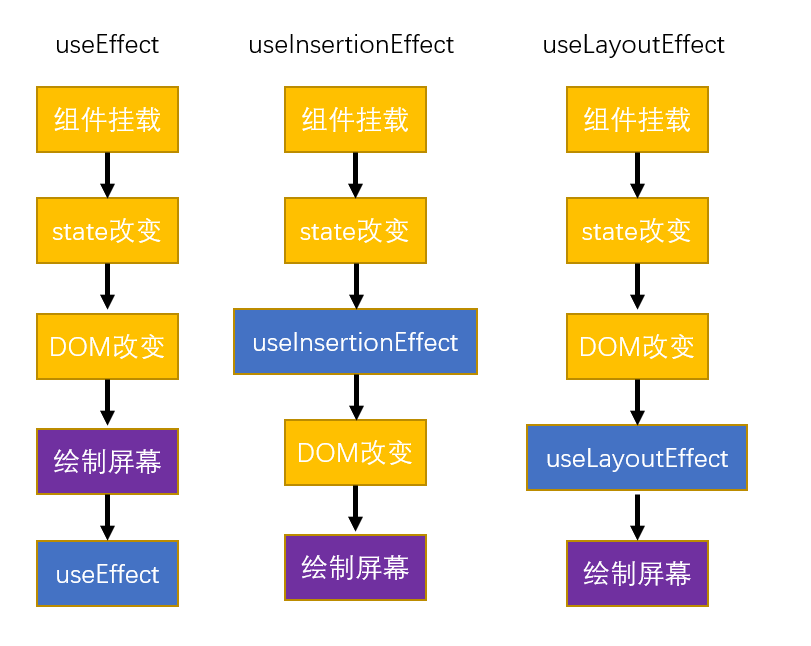

# React

+ [HelloWorld](../笔记代码/源码/React/React_HelloWorld.html)
+ 以下笔记除直接声明外，否则**默认为函数式组件的语法**

## 一、三个API

|三个依赖|描述|备注|导入源|
|:---:|:---:|:---:|:---:|
|`React`|`React`进行`js`操作的代码库|无|`import React from 'react'`|
|`ReactDOM`|`React`专门进行`DOM`操作的库|无|`import ReactDOM from 'react-dom/client'`(对于一些方法，`/client`可以忽略)|
|`babel`|翻译`jsx`代码为`react`的`js`代码|无|不知道|

|方法|描述|返回值|备注|样例|
|:---:|:---:|:---:|:---:|:---:|
|`React.createElement(type,props,...children)`|生成一个`react`对象|新生成的`react`对象|无|[样例](../笔记代码/源码/React/三个API样例.html)|
|`ReactDOM.createRoot(domNode,options(可选))`|创建`react`的根元素|`react`对象|无|^|
|`reactElement.render(element)`|将`element`挂载到根元素上|无|调用该方法时，根元素中的所有元素都会被删除，然后被`react`元素替换|^|

|对应方法|参数|描述|备注|
|:---:|:---:|:---:|:---:|
|`React.createElement()`|`type`|字符串形式的标签名|**必须小写**|
|^|`props`|对象形式的属性，键为属性名，值为属性值|1.`class`对应的属性值为`className` 2.事件使用驼峰命名法表示，且**值为一个函数对象，而不是函数调用** |
|^|`...children`|元素的子节点，可以传多个值|无|
|`ReactDOM.createRoot()`|`domNode`|一个想成为`react`根元素的`DOM`对象|无|
|^|`options(可选)`|一些其它配置|[详情见官方文档](https://react.docschina.org/reference/react-dom/client/createRoot)|
|`reactElement.render()`|`element`|要挂载到根元素的元素|无|

+ 注意:
> 1. `React`元素最终会通过虚拟`DOM`转换为真实的`DOM`元素添加在`DOM`树上
> 2. `React`元素**一旦创建便无法修改，只能通过新创建的元素去替换**
> 3. 修改`React`元素后，必须重新对根元素进行渲染
> 4. 当调用`render`方法渲染页面时，`React`会比较两次渲染的元素，只在真实的`DOM`中更新发生变化的部分，而没发生变化的保持不变

---

## 二、JSX

### （一）基本语法

+ 在使用`createElement`方法来创建对象时，如果想要创建的对象变多，很明显编写代码会变的非常麻烦
+ 且我们在创建时，是按部就班的一步一步创建的，需要告诉`JS`解释器我这一步要干什么，下一步要干什么，这种编程方式称为**命令式编程**
+ `React`提供了一种更为简洁的方式:使用`JSX`来以**结果导向式编程**来创建`react`元素,`JSX`需要被翻译为`JS`代码，才能被`React`执行
+ 使用[babel.js](https://unpkg.com/babel-standalone@6.26.0/babel.min.js)可以对`JSX`进行自动翻译，**需要在`script`标签上写上`type=text/babel`**,这是其[官网](https://babel.docschina.org/)
+ JSX语法:
> 1. `JSX`不是字符串，不要加引号
> 2. `JSX`中的`html`标签必须**小写**，`React`组件必须**大写**
> 3. `JSX`**有且只有一个根标签**
> 4. `JSX`的**标签必须正确结束(自结束标签必须写/)**
> 5. `JSX`中可以使用`{}`嵌入表达式(**有值的语句就是表达式**)，它可以被嵌在任意地方，
>    + 如果表达式是空值、布尔值、`undefined`将不会显示
>    + `{}`仅能存放`js`表达式，不能存放`if-else、for`等语句，但语句中可以放`JSX`代码，也就能存放`{}`
> 6. 在`JSX`的标签中，属性可以直接在标签上设置
>    + 但`class`属性需改为`className`
>    + `style`属性需要使用对象(`Object`)设置，且`CSS`样式需要使用驼峰命名法(如`background-color`改为`backgroundColor`)
>    + `dangerouslySetInnerHTML`接收一个必须包含`__html`的key的object对象，该`__html`key对应的value将被当作原生HTML代码直接渲染在页面上，可以据此用于**插入原生HTML代码**
>    + 事件处理需要使用驼峰命名法

+ [JSX样例](../笔记代码/源码/React/JSX样例.html)

---

### （二）渲染列表

+ 如果`JSX`中的`{}`中的变量是一个数组对象，它会被直接展开，其展开的全部内容会成为标签内容
+ 可以利用上述性质，使用`for`循环遍历得到`['<li>xxx</li>','<li>yyy</li>']`形式的数组，再利用上面的性质使用嵌入表达式将其插入到`<ul></ul>`标签内
+ 因为主要操作就是循环遍历原数组得到一个新数组对象，因此可以直接使用数组的`map`方法进行处理
+ [渲染列表样例](../笔记代码/源码/React/渲染列表样例.html)

---

## 三、虚拟DOM

+ 在`react`中，**我们操作的元素是`React`元素，而不是真正的`DOM`元素**
+ `React`通过虚拟`DOM`将`React`元素和原生`DOM`进行映射，虽然我们操作的是`React`元素，但是这些操作最终都会在真实`DOM`中体现出来
+ 虚拟`DOM`的好处如下:
  1. **降低`API`复杂度**：原生`JS`提供了大量可供操作的`API`,我们肯定记不住这么多的`API`,而`React`框架为我们提供的`API`数量少，但可以更简便的实现一些功能
  2. **降低兼容问题**
  3. **提升性能**（减少`DOM`的不必要操作）:
     1. 每当我们调用`root.render()`时，页面就会发生**重新渲染**
     2. `React`会通过`diffing算法`，**将新的元素和旧的元素进行比较**
     3. 通过比较找到发生变化的元素，并且只对变化的元素进行修改，没有发生的变化不予处理
     4. `React`每次比较数据时，都从祖先元素开始比，然后递归进行比较，**如果相同则不会渲染这些元素，如果不相同才会进行渲染**
+ 注意:
> + 如果我们使用数据动态生成列表，且不给其设置`id`值，那么依据上述比较情况，可能会出现[渲染导致的性能问题](../笔记代码/源码/React/列表渲染导致的性能问题.html)
> + 该问题可以通过给列表设置`key`来解决，每个元素的`key`都应该是**固定且唯一**的，**不能将索引作为`key`的值，因为索引也会变，除非生成的列表是固定不变的**
> + 设置了`key`后，`react`在比较这一段时会根据`key`比较，就不会顺序比较了，这样就可以保证避免渲染导致的性能问题。

---

## 四、项目创建与运行

### （一）手动创建项目

|npm指令|描述|备注|
|:---:|:---:|:---:|
|`npm config get registry`|得到`npm`当前下载包的镜像源|无|
|`npm config set registry`|设置`npm`下载包的镜像源,一般设置国内的`https://registry.npmmirror.com`|设置的路径不对会报错|
|`npm config get profix`|得到`npm`的全局依赖存储目录路径,一般在`C`盘|无|
|`npm config set profix`|设置`npm`的全局依赖存储目录路径|无|
|`npm version`|查看`npm`版本详细信息|无|
|`npm -v`|查看当前`npm`版本|无|
|`npm install -g npm@9.6.6`|更新`nom`到指定版本|无|
|`npm update`|更新`npm`到最新版本|无|
|`npm init`|初始化当前项目，需要逐一确认，可以进行基本信息的配置|会生成`json`文件，存储项目配置|
|`npm init -y`|初始化当前项目，所有信息使用默认值，无需逐一确认|^|
|`npm install jquery`|下载指定名称的包的最新版本到当前项目|无|
|`npm install jquery@3.7.1`|下载指定名称和版本的包到当前项目|无|
|`npm install`|下载项目的`package.json`文件中`dependencies`属性对应的所有包|无|
|`npm install -g jquery`|将指定包的最新版本下载到全局依赖目录中去|无|
|`npm install -g jquery@3.7.1`|将指定名称和版本的包下载到全局依赖目录中去|无|
|`npm uninstall jquery@3.7.1`|将指定名称和版本的包下载到全局依赖目录中去|无|
|`npm uninstall -g jquery@3.7.1`|将指定名称和版本的包下载到全局依赖目录中去|无|
|`npm ls`|查看项目依赖|无|
|`npm ls -g`|查看全局依赖|无|
|`npm run test`|执行`npm`脚本|只有在`package.json`文件中的`scripts`属性对应的对象中存在的脚本才能运行|
|`npm create vite`|在当前目录下创建一个`vite`项目|如果没有安装`vite`会被先提示安装`vite`|
|`npm create react-app 项目名称`|在当前目录下创建一个`react`项目|无|

+ `React`项目的结构如下:

~~~
根目录
    - public
        - index.html （添加标签 

）
    - src
        - App.js
        - index.js
    - package.json
~~~

|文件夹/文件|作用|是否必须|备注|
|:---:|:---:|:---:|:---:|
|`public`|存放静态文件|是|无|
|`src`|存放源代码的文件夹|是|无|
|`App.js`|在这里构建组件为一个整体|否|无|
|`index.js`|将组件挂载到根元素上|是|无|

1. 创建一个文件夹，打开终端，输入`cd 文件夹路径`进入文件夹路径中
2. `npm init -y`初始化文件夹，`-y`表示初始化时默认同意默认配置,完成后会生成一个`package.json`文件
3. `npm i react react-dom react-scripts`下载`react`、`react-dom`、`react-scripts`三个依赖进入文件夹，`package.json`文件会同步添加`dependencies`
4. 按照上面的项目结构创建文件
5. 编写`index.js`代码，`index.js`在导入`react-dom`时，如果在浏览器端，需要这样书写:`import ReactDOM from 'react-dom/client';`，不然在编译时会报错
6. 代码编写完之后，`npx react-scripts build`进行**项目的构建**
7. 构建完后，项目中会生成一个`build`文件夹，打开它并运行里面的`index.html`就可以看到结....会发现报错了:因为`index.html`中默认使用绝对路径读取一个`js`文件，我们需要在`/`前面加一个`.`使其变为相对路径，这样项目就能正常运行了
   + 我们发现这样做的话，**每次我们修改项目后，我们都需要重新构建这个项目并运行**，这显然非常麻烦
   + 相对的，我们可以通过`npx react-scripts start`命令来**启动一个内置测试服务器，它会对代码进行实时的编译并运行，并可以根据我们的修改自动更新页面**
   + 通过修改`package.json`文件中的`scripts`对应的对象中新加一个键值对`start:react-scripts start`，就可以仅通过`npm start`来直接开启测试运行了

---

### （二）自动创建项目

+ `npm create react-app 项目名称`、`npx create-react-app react-app`或`npm create vite`(需要选择React)可以在当前目录下创建一个`React`项目，它会为我们配好所有基本配置
+ 其目录结构如下

~~~
  react-app
    ├─ node_modules  // 用来存放依赖的包
    ├─ public  // 用来存储首页模板及静态资源
      ├─ favicon.ico    // 图标
      ├─ index.html   // 首页模板(必须)
      ├─ logo192.png    // 普通的图片文件
      ├─ logo512.png   
      ├─ manifest.json
      ├─ robots.txt
    ├─ src  // 源代码目录
      ├─ App.css  // App.js组件的css文件。可以删
      ├─ App.js   // 主组件，可改可删
      ├─ App.test.js  // 单元测试的文件
      ├─ index.css  // css文件，可以删
      ├─ index.js   // 必要组件，项目的入口文件
      ├─ logo.svg   // 网页的logo
      ├─ reportWebVitals.js   // 应用性能统计相关的代码
      ├─ setupTests.js  // 单元测试的文件
    ├─ package.json    // 记载基本配置的json文件
~~~

---

## 五、组件

+ 在`React`中，网页被拆分成了一个个组件，组件就是独立可复用的代码片段
+ `React`定义组件的方式有两种:**函数式组件**和**类组件**
+ 自定义组件内部**无法默认承载其它自定义组件**，如果我们想使用自定义组件进行嵌套，那么需要在容器组件中写入`props.children`

### （一）函数式组件

1. 函数式组件:
   + 函数名首字母大写
   + 返回值是一个`JSX`（`React`元素）

+ 函数式组件参见`笔记代码\源码\React\Demo2-components\01组件与组件传参\conponents`

~~~jsx
    import React from "react";
    /*
    *   类组件必须要继承React.Component
    *       相较于函数式组件，类组件的编写要麻烦一下，
    *           但是他俩的功能是一样的
    * */
    class App extends React.Component{
        // 类组件中，必须添加一个render()方法，且方法的返回值要是一个jsx
        render() {
            return 
我是一个类组件
;
        }
    }

    // 导出App
    export default App;

~~~

---

### （二）类组件

1. 类组件需要定义一个类，与函数式组件一样，类名必须大写
2. 类组件需要继承`React.component`
3. 类中必须实现一个`render`方法，返回值为一个`JSX`(`React`元素)

+ 注意:
> 1. 在类组件中，为了省事，除`render`方法的其它方法都应该使用**箭头函数**定义
> 2. 在`render`方法中，应该使用`this`来访问类中的属性
> 3. 类组件中，`state`存储在类的实例对象中，需要通过`this`进行调用，而设置要通过`this.setState`方法来进行设置
>     + 类组件中的`state`会存储所有的`state`属性，因此，**类组件的`state`必须为对象**
>     + 在类组件修改`state`时，`react`**只会修改我们返回对象中含有的属性**，并不会直接覆盖原来的`state`
> 4. 类组件中，通过`myRef=React.createRef()`来得到对应的`ref`，并通过在对应标签上设置`ref={this.myRef}`以得到指定标签的`DOM`对象

---

### （三）CSS样式的导入

+ `React`中共有四种方式用来导入`CSS`样式:
  1. 内联样式:
     + 直接在返回的`JSX`代码中设置`style={{xxx:xxxx}}`来设置`CSS`样式，以这种方式设定时，需要传一个对象，且样式名称必须改为驼峰命名法
     + 如果设置的内联样式太多，`JSX`代码会变的很乱
  2. `State`存储的`css`内联样式
     + 在组件内使用`useState`钩子函数来创建专门设置`css`样式的变量，并将该变量赋值给标签的`style`属性
     + 与内联样式一样，设置的太多会很乱，因为本质上都属于内联样式
  3. 导入外部样式表:
     + 使用`import './xxx.css`的形式直接导入外部的`css`样式，组件内的标签仅需要设置`className`属性即可
     + 该外部样式表是**作用于全局**的，因此我们需要注意`css`类名的作用区间
  4. `CSS Module`:
     + `React`默认支持该方法
     + 使用`CSS Module`创建的样式文件名称必须为`xxx.module.css`
     + 在组件中以**导入模块的形式**导入该文件:`import xxx from './xxx.module.css`，建议导入时取名为`classes`
     + 设置类名时需要写`className={xxx.yyy}`
     + 该方法**保证不同组件间设置相同类名不会冲突**
     + 导入多个类时，需要用**模板字符串**:`className='${classes.xxx} ${classes.yyy}'(这里用单引号是因为md的语法冲突)`
     + 如果使用id选择器、属性选择器、元素选择器等进行样式设置，只需要导入即可

---

## 六、语法

### （一）事件

+ 在`React`中，可以直接使用**驼峰命名法**在标签上添加事件，**事件对应的值也不再是调用函数，而是需要一个回调函数**
  + `<h1 onClick={(result)=>{return result+1;}}></h1>`
+ `React`会传递一个事件对象作为参数，该参数是回调函数的第一个参数，该事件对象并不是原生的事件对象，而是经过处理的`Object`类型的事件对象
  + `event.preventDefault()`取消默认行为
  + `event.stopPropagation()`取消事件冒泡
+ 注意:
> 1. `React`的事件冒泡并不能依据其在`DOM`树中的位置来检查，而**要根据组件在`React`组件之间的位置来进行事件冒泡检查**
+ [事件样例](../笔记代码/源码/React/DemoProject/03React事件/App.jsx)

---

### （二）组件传参

#### ①props

+ `props`是`React`存储属性的一种方式
+ 在使用组件时，可以通过向组件传递参数的形式来向组件传递数据
+ 只需要在组件的标签上写上**类似属性格式的键值对**，如`<Item key={item.id} myDate={item.myDate} desc={item.desc} time={item.time}></Item>`
+ 这些参数会被封装为**一个对象**(通常这个参数我们会命名为`props`)，传递给生成组件的函数，上述的参数将作为如下对象被传递给生成组件的函数:`{myDate:item.myDate,desc:item.desc,time:item.time}`
+ 这种方式传递的参数**只能由父组件向子组件传递**，而不能反向传递，`props`参数是**只读**的，**无法修改**
+ 样例见`笔记代码\源码\React\Demo2-components\01组件与组件传参\conponents`

#### ②参数向上传递

+ 该方法**通过父组件元素定义一个函数，将该函数传递给子元素，然后子元素将要传递的数据作为参数传给该函数**实现
  + 参数传入后，**由于函数的执行代码是定义在父组件中的**，因此父组件便得到了子组件中的参数
  + 该方法本质上依然是通过`props`进行参数的传递的
  + 该方法**仅适用于简单的参数传递**，如果组件结构变得复杂，那么该方法会变的很麻烦,如果跨度较大，建议使用[Context](#Context)进行参数传递

---

### （三）State

#### ①简单使用

+ 在`React`中，组件渲染完毕后，再修改组件中的变量并不会使组件呈现在前端的数值再次发生变化，因为组件已经渲染完毕了
+ 为了实现这个需求，我们需要在变量发生变化时再次渲染当前组件，`React`为我们提供了`State`进行操作
  + `State`与`props`类似，也是存储属性的一种方式，但它是**可变的**，且**只属于当前组件**，无法被其他组件访问
  + `State`相当于一个变量，它在`React`中被注册，`React`会**监听它的变化，在发生变化时重新渲染它所属的组件**
  + 使用`useState`钩子函数得到`State`
    + `useState`的需要一个参数,用来指定当前`State`的初始值
    + 它会返回一个**数组**，数组有两个元素
      + 第一个元素是`State`当前存储的值
      + 第二个元素是一个函数，**调用该函数来实现对`State`值的修改**，同时重新渲染组件。向函数传递的参数值将成为`State`的新值
      + 一般我们使用解构来得到该数组的两个值:`[count,setCount]=useState(1)`
+ 注意:
> 1. 修改`State`的操作是异步的，这表明**调用它的修改函数时，它会进入消息队列，等待调用栈中的操作全部实现后才执行**
> 2. 当`state`的值是一个对象时，修改时是**使用新的对象**去替换已有对象
> 3. 如果不进行浅拷贝直接修改原对象，不会发生任何变化，因为**对象之间比较的是内存地址**，`react`在比较后不会认为该变量发生了变化，就不会改变
> 4. 钩子函数必须写在函数组件内部
> 5. `setxxx`函数的作用就是触发重新渲染并给其对应的值进行赋值，这就意味着**如果我们对一个`state`变量手动进行了赋值，而通过其它渠道实现了其组件的重新渲染，该值也会变化**
> 6. 类组件中，`state`存储在类的实例对象中，需要通过`this`进行调用，而设置要通过`this.setState`方法来进行设置
>     + 类组件中的`state`会存储所有的`state`属性，因此，**类组件的`state`必须为对象**
>     + 在类组件修改`state`时，`react`只会修改我们返回对象中含有的属性，并不会直接覆盖原来的`state`
+ [state样例](../笔记代码/源码/React/DemoProject/04State/App.jsx)

---

#### ②提升

+ 如果一个变量在多个组件中都被需要，那么我们可以通过**在这些组件共同的且离他们最近的祖先元素设置`State`属性**来解决这一需求
  + 我们只需从该祖先元素开始，向需要的组件传递参数即可
  + 这种方式**仅适用于距离较近，且结构较为简单的组件传参**，如果跨组件过多，可能会导致需要连续传递多次参数才能传给对应组件的情况
  + 对于跨度较大的传参，应该使用[Context](#Context)进行参数传递

---

#### ③setState执行流程

+ 如果组件尚未渲染完毕
  + 不会检查`state`的值，直接重新渲染组件
+ 如果组件渲染完毕
  + 如果`state`更新的值与上一次的值不一致
    + 重新渲染组件并跟新
  + 如果`state`更新的值与上一次一致
    + 如果是第一次一致
      + 组件会重新渲染，但此次渲染没有实际效果，也不会挂载到`DOM`树上，也不会触发后代组件的渲染
    + 如果不是第一次一致
      + 不会渲染

---

#### ④函数的记忆

+ 我们已经知道，如果在渲染前读取`State`的值，那么得到的依然是原值，只有渲染后得到的才是新值
+ 但是，如果总是在即将渲染前生成`jsx`对象，并给予这些对象一些事件处理函数，那么在渲染后，这些函数读取的依然是渲染前的`state`值
+ 样例:

~~~jsx

import { useRef } from "react";
import { useState } from "react";

const App=()=>{

/* 
    在该组件中，我们定义了一个名字叫pageInfo的State变量
    在我们点击按钮时，由于setState是异步的，因此我们的btn会在渲染前被赋值
    渲染后，由于btn是在渲染前被赋给的printPageInfo函数，因此点击该按钮时依然会输出前面的值
    如果想要摆脱该影响，在btn是state变量时，可以考虑在组件函数中直接使用立即执行函数，这样可以保证组件渲染完毕后才生成该对象
    或使用useEffect在组件渲染完毕后再加载，同时传入数组参数指向pageInfo,使该操作仅在pageInfo变化时触发，并在操作最后调用setState更新该值
*/

    const [pageInfo,setPageInfo]=useState(1);
    const [other,setOther]=useState(1);
    const another=useRef(1);
    const btn=useRef([(<button key={'a'}>点我吧</button>)]);
    const clickHandler=()=>{
        setPageInfo((prev)=>prev+1);
        setOther((prev)=>prev+1);
        another.current++;
        btn.current=[<button onClick={printPageInfo} key={'a'}>点我吧</button>];
    };

    const printPageInfo=()=>{
        console.log(pageInfo);
        console.log(other);
        // 可以明显看出，函数依旧能得到最新的ref值
        console.log(another.current);
    };
    
    console.log(pageInfo);
    console.log(other);
    console.log(another.current);
    

    return (
        <>
            <button onClick={clickHandler}>点我一下</button>
            {btn.current}
        </>
        
    );
};

export default App;

~~~

+ 注意:

> 1. 使用`useRef`生成的变量**没有这一效果**

---

### （四）Ref

+ 我们有时需要在组件的多次渲染过程保留一些值，以进行后续操作，这样就要通过`useRef`钩子函数来得到一个对象
  + `useRef`函数返回的对象是仅有一个`current`属性的`Object`对象，我们在得到这个对象后，需要通过`current`索引才能得到对应的数据
  + `useRef`仅在**参数第一次被传递时**起效果，后面再执行时不会再生效，因此它在组件渲染前后负责传递数据
  + `useRef`生成的对象，**每次渲染后都会得到相同的对象**,而不是每次渲染后都会再创建一个里面的属性值与渲染前的属性值相同的对象
  + 由于`useRef`生成的对象是一个原生`JS`对象，因此我们也能手动创建一个对象，但这么做没有`useRef`好，因为`useRef`得到的对象每次都是相同的，不会消耗多余的内存空间，而我们手动创建的每次渲染都会重新创建一份
  + `useRef`得到的对象**无法被`react`监听变化而渲染**，因为它仅为一个原生js对象，这就意味着**除非我们手动去设置它，否则它不会变化**

+ 注意:
> 1. 类组件中，通过`myRef=React.createRef()`来得到对应的`ref`，并通过在对应标签上设置`ref={this.myRef}`以得到指定标签的`DOM`对象
+ [Ref样例](../笔记代码/源码/React/DemoProject/05useRef/App.jsx)

---

### （五）双向绑定

+ 如果我们只依靠`State`，那么对于一个标签来说，它只能随着变量的变化而变化，但是我们有时需要我们的变量也随着绑定它的表单的值变化而变化
  + 这种需求在表单类组件种最为常见，因此我们可以**通过`onChange`事件来监听表单组件**发生的变化
  + 在处理表单变化时，我们需要**通过`setState`更新变量的值并重新渲染组件，同时使标签的`value`值与变量绑定起来**
  + 这样我们就建立了两者之间的互相根据双方变化情况而随之变化的联系，我们称这种绑定方式为**双向绑定**
  + 双向绑定**保证了我们表单的可控性**，因为我们可以通过双向绑定来**实时得到用户输入的数据**
+ 双向绑定样例见``

---

### （六）Protal

+ 有时我们想将一个组件逻辑上在组件内部，以方便我们调用，但不希望它在实际上处于该组件内部，因为可能会出现一些问题
  + 用户在操作时弹出的提示框后面的遮罩(`backdrop`)就是典型的例子:
    + 遮罩一般设置了定位，使得它可以覆盖整个屏幕，但实现这个功能的前提是**保证它的层级要尽可能地高**，而为了方便，遮罩一般都被放置在组件内部来方便调用
  + `React`为我们提供了`Protal`来实现这个功能,`protal`可以**将我们的组件渲染到指定位置**:
    1. 在`index.html`内写入一个新的标签，用来承载组件
    2. 修改组件的渲染方式，一般在组件的自己的`jsx`文件内修改:
       + 得到承载组件的根元素`DOM`对象
       + 导入`import ReactDOM from 'react-dom'`，此时路径不需要带`/client`
       + **使用`ReactDOM.createPortal()`方法来指定组件的渲染**
         + 该方法的第一个参数用来接收`JSX`代码，即**我们想进行渲染的组件**
         + 该方法的第二个参数用来接收一个`DOM`对象，该对象就是**我们想渲染到的位置**，我们的组件会被渲染在该对象内部
+ 代码样例:

~~~jsx

  import classes from './BackDrop.module.css'
  import ReactDOM from 'react-dom';

  const BackDrop=(props)=>{
      const backDropRoot=document.getElementById("backdrop-root");  // 得到想渲染到的指定位置的DOM对象
      const change=()=>{
          props.notShow();  // 调用传递过来的函数进行backDrop的展示
      };

      // 调用createPortal方法将组件渲染到DOM的指定位置
      return ReactDOM.createPortal(
          (
              

                  {props.children}
              

          ),
          backDropRoot
      );
  };

  export default BackDrop;

~~~

+ 注意:
> 1. 组件虽然实际上被渲染到了指定位置，但由于逻辑上组件依然在其父组件内部，我们依然可以方便的对该组件进行操作
> 2. 虽然组件实际上被渲染到了我们想的指定位置，但**组件的事件冒泡等机制依然会遵循其在组件中的位置来进行冒泡**

---

### （七）Fragment

+ 在`React`中，`JSX`必须有且只有一个根元素。这就导致了在**有些情况下我们不得不在子元素的外部添加一个额外的父元素**
+ 遇到这种情况我们就非常希望能**有一种方式可以引入多个组件，但又不会在最终的网页中添加多余的结构**，那么我们可以定义这样一个组件:

~~~jsx
  import React from 'react';

  const MyFragment = (props) => {
      return props.children;  // 设定该组件返回其标签体中的内容，这就意味着它在返回时不返回其自身，即其自身就是个摆设
  };

  export default MyFragment;
~~~

+ 然后在使用时使用该组件嵌套我们想定义的组件

~~~jsx
  import React from 'react';
  import MyFragment from "./MyFragment";

  const MyComponent = () => {
      return (
          <MyFragment>
              
我是组件1

              
我是组件2

              
我是组件3

          </MyFragment>
      );
  };
  export default MyComponent;
~~~

+ 也可以修改引入`React`的方式，直接使用`Fragment`:

~~~jsx
import React from 'react'
import {Fragment} from 'react'  // 这样导入可以直接写Fragment而不用写React前缀

// 方法一

return (
  <React.Fragment>
    
我是组件1

    
我是组件2

    
我是组件3

  </React.Fragment>
);

// 方法二

return (
  <Fragment>
    
我是组件1

    
我是组件2

    
我是组件3

  </Fragment>
);

// 方法三

return (
  // React专门为我们提供了语法糖：直接在前面定义一个空的标签来作为根标签
  // 这三种方法的效果是一致的
  <>
    
我是组件1

    
我是组件2

    
我是组件3

  </>
);

~~~

---

### （八）Context

+ 我们有时需要祖先组件隔数个组件向其后代组件传递参数，而想这样做的方式之一就是使用`props`逐个组件向下传递
  + 这种方式**非常麻烦**
  + **中途的组件可能不会使用该参数，仅作为传递的桥梁继续向下传递**
+ 因此，`React`提供了`Context`来解决这一问题
  + `Context`可以使子组件或后代组件不需要接收`props`，而使用`Context`就能直接接收到祖先组件的参数
  + 然而，Context无法持久化保存数据，这意味着**页面一旦刷新，Context就会恢复原始值**
+ 使用:
  1. 首先，需要定义好一个`Context`,并使其暴露，一般我们都会新创建一个文件用以定义该`Context`:
     + `Context`**名称必须大写，因为它要作为`React`组件使用**
     + 定义后需要向外暴露
~~~jsx
    import React from 'react'

    const TestContext=React.createContext('test');  // 创建一个context,名称大写
    export default TestContext;  // 向外暴露
~~~
  2. 在想传参的祖先组件内引入该`Context`,且作为组件使用
     + 使用`<Context.Provider></Context.Provider>`标签包裹子组件，使得这些子组件和后代组件可以使用该`Context`
     + 该**标签的`value`属性可以重新设置原`Context`的值**，任意值都可以。设置后，被其包裹的后代组件读取的`Context`全都是**使用`value`属性重新设置的值**
     + 如果一个组件被多个`Context.Provider`标签包裹了，那么**它获得的`Context`是离其最近的`Context`标签中的**
~~~jsx
    import TestContext from './TestContext'
    import A from './A'
    import B from './B'

    const Test=()=>{
        return (
            

                {/* 使用Context.Provider标签包裹子组件，子组件及其后代组件都可以访问该Context */}
                <TestContext.Provider value={'aaa'}>
                    <A />  {/* B组件中得到的context结果为aaa */}
                    <TestContext.Provider value={'bbb'}>
                        <B />  {/* B组件中得到的context结果为bbb */}
                    </TestContext.Provider>
                </TestContext.Provider>
            

        );
    };
    export default Test;
~~~
  3. 在对应组件内接收`Context`
~~~jsx
    import {useContext} from 'react'
    import TestContext from './TestContext'

    // 方法一：简易方法(使用钩子函数得到Context)

    const A=()=>{
        const context=useContext(TestContext);
        return (
            
{context}

        );
    };

    // 方法二：麻烦方法(不使用钩子函数)

// 不使用钩子函数来得到context
    const B=()=>{
        return (
        // 返回时，想得到context的标签必须被context.Consumer标签包裹
            <TestContext.Consumer>
                {/* 标签内部必须要传递一个回调函数，该回调函数接收一个参数，该参数即为想要得到的context */}
                {
                    (context)=>{
                        console.log(1);
                        // 在回调函数中以进行jsx代码的编写
                        return (
                            
{context}

                        );
                    }
                }
            </TestContext.Consumer>
        );
    }

    export default A;
~~~

---

### （九）useEffect

#### ①副作用

+ 我们在函数式组件中直接写入的会影响到组件渲染的代码被称为“副作用”
+ 这些代码如果被写在函数组件内，可能会触发组件的循环渲染而导致报错
+ “副作用”不能直接写在函数式组件的函数体中，而需要专门的一个方法进行处理:`React`为我们提供了`useEffect`钩子函数来专门处理这些“副作用”

---

#### ②StrictMode

+ `React`为我们提供了专门用于检查“副作用”，且更易于排错的标签:`React.StrictMode`
  + 使用该标签包裹的后代组件，其在我们的**项目处于开发模式**时会**反复调用一些方法两次**，从而使我们的“副作用”代码显现出来，让我们及时纠正错误,这些会被反复调用的方法包括:
    + 类组件的`constructor`,`render`, 和`shouldComponentUpdate`方法
    + 类组件静态方法`getDerivedStateFromProps`
    + 函数组件的函数体
    + `setState`函数
    + 参数为函数的`useState`、`useMemo`、`useReducer`
  + 安装了浏览器插件`React Developer Tools`时，第二次调用而在控制台输出的值会被标记为灰色

---

#### ③useEffect

+ `useEffect`钩子函数专门用于处理我们的“副作用”代码
  + 函数接收一个回调函数作为参数，该回调函数会**在组件每次渲染完毕后再执行**，回调函数内便可以放置我们的“副作用”代码。函数还可以返回一个函数，**这个返回的函数可以在下一次`useEffect`的回调函数执行前执行**，它可以**用来清理上一次回调函数执行后产生的影响**，因此也被称为`useEffect`的清理函数
  + `useEffect`保证我们的“副作用”代码在组件渲染完毕后才会执行，这就避免了我们“副作用”代码导致的循环渲染的问题
  + 函数的第二个参数是一个数组对象，`useEffect`会**监视该数组对象内变量的变化**，只要有一个发生了变化，那么就会执行`useEffect`的回调函数，因此**一般都将在回调函数中出现的`State`变量放在数组内**。如果传入空数组，回调函数仅会在组件第一次渲染时执行，如果不传入该参数，每次组件重新渲染时回调函数都会执行
  + `useEffect`在监听变量变化时，执行顺序一般为`onChange监听事件->事件的回调函数->setState->组件重新渲染->useEffect监视到变量变化->回调函数执行`
+ 注意:
> + `useEffect`接收的回调函数**不能是异步函数(即被`async`修饰的函数)**，但是可以先传一个普通函数，再在该函数内写想实现的异步函数然后直接调用
> + `useEffect`一般用来在网页加载时向后端请求数据

---

#### ④其它Effect

+ 除`useEffect`外，`React`还提供了`useLayoutEffect`和`useInsertionEffect`
  + `useLayoutEffect`会**在屏幕渲染前，而`DOM`改变后执行**，比`useEffect`执行时机要提前。它一般用于添加`DOM`元素的样式等
  + `useInsertionEffect`会**在`State`变化后而`DOM`改变前执行**，比`useLayoutEffect`执行时机要提前。它一般用于在`DOM`改变前向`DOM`额外添加元素

+ [样例](../笔记代码/源码/React/DemoProject/29三个Effect/App.jsx)

---

### （十）useReducer

+ `useReducer`钩子函数用来整合对某一`State`变量的操作，使它们看起来更加规整:
  + 函数接收三个参数:
    + `reducer`:用于更新`State`变量的回调函数，它接收两个参数，第一个是**修改之前的`State`值**，第二个是**我们想自定义传给该函数的对象**
    + `initialArg`:指定`State`变量的初始值，它仅在`useReducer`第一次执行时被使用
    + `init`:用于计算初始值的回调函数，它会**接收`initialArg`作为参数**进行运算，并根据**其返回结果指定`State`对象的初始值**，如果没有指定该函数那么`State`变量会直接被赋值为`initialArg`，也就是说，**该函数是可选的**
  + 函数的返回值是一个数组对象，数组内有两个元素
    + 第一个元素即为`State`变量值
    + 第二个元素是对`State`变量进行操作的派发器，**想对该`State`变量进行一些操作时需要调用该派发器**，可以向派发器传入一个参数，该参数将**作为`reducer`函数的第二个参数被`reducer`函数使用**
+ [样例](../笔记代码/源码/React/DemoProject/08useReducer/App.jsx)

---

### （十一）memo与useCallback

+ `React.memo()`方法是`React`类的静态方法，将函数式组件作为参数传递给它，可以使其被缓存，**除非其`props`或`context`发生变化，或其自身主动触发了重新渲染，否则该函数组件不会再次渲染**
  + `React`官方推荐尽量不用`memo`，因为这会使得可读性变差且可能会没什么用。除非**重新渲染存在明显延迟**或者**网页的交互比较细腻**(例:移动图形.反例:直接替换页面或整个部分)
  + `memo`一般会与`useMemo`和`useCallback`钩子函数一起使用
+ `useCallback`钩子函数用来记住某一函数，并在组件重新渲染时都返回相同的函数对象
  + 第一个参数是一个回调函数，即**我们想让该钩子函数记住的函数**
  + 第二个函数是一个数组，**当数组内的元素发生变化时，将重新创建该函数对象**。如果传入空数组，钩子函数仅会在组件第一次渲染时执行，如果不传入该参数，每次组件重新渲染时该函数都会被重新创建
+ [样例](../笔记代码/源码/React/DemoProject/10memo与useCallback/App.jsx)

---

### （十二）自定义钩子

+ `React`规定**钩子函数只能在函数组件或自定义钩子中被调用**，有时我们想把那些带钩子函数调用的代码整合起来，一般函数无法做到，因此需要用到钩子函数
+ 一般在`src`目录下的`hooks`编写我们自定义的钩子函数
  + 钩子函数的名称前缀需要是`usexxx`
  + 除此以外，没有别的要求

---

### （十三）其它钩子

#### ①useMemo

+ `useMemo`用来缓存函数的执行结果，即当函数多次执行的结果是一样的值时，仅会执行一次
  + 函数接收的参数与`useEffect`类似，都是一个回调函数和一个依赖数组，当依赖数组中的元素变化时，再执行回调函数，也就是更新缓存
  + `useMemo`也可以作用于函数式组件，从而代行`React.memo`的作用
+ 该钩子函数一般用于进行性能优化
+ [样例](../笔记代码/源码/React/DemoProject/24useMemo/App.jsx)

---

#### ②useImperativeHandle

+ `useImperativeHandle`用于**子组件可控的向父组件提供`ref`值**，它需要与`React.forwardRef()`配合使用
+ `React.forwardRef()`接受一个函数作为参数，该函数就是作为组件的函数，它可以使函数式组件接受两个值:`props`与`ref`
+ [样例](../笔记代码/源码/React/DemoProject/25useImperativeHandle/App.jsx)

---

#### ③useDeferredValue与useTransition

+ `useDeferredValue`用来针对一个`state`值创建一个延迟的`state`
  + 该函数接受一个`state`值作为参数
  + 该函数会渲染组件两次
  + 函数第一次渲染时返回`state`的旧值，第二次渲染时才返回新值
+ `useTransition`可以用来降低指定的`setState`函数执行的优先级
  + 该函数不接收任何参数
  + 该函数返回一个数组对象，对象内有两个元素:
    + `ispending`是一个布尔值，它表示被降低优先级的`setState`函数是否在执行，如果是返回`true`
    + `startTransition`是一个函数，它接受一个回调函数，我们通过将`setState`在其回调函数中调用来降低这些`setState`的优先级。`React`实际上也**直接提供了该函数**
  + 该函数也会渲染组件两次
+ [useDeferredValue样例](../笔记代码/源码/React/DemoProject/26useDeferredValue/App.jsx)
+ [useTransition样例](../笔记代码/源码/React/DemoProject/27useTransition/App.jsx)

---

#### 其它

|钩子函数|参数|作用|返回值|返回值类型|备注|样例|
|:---:|:---:|:---:|:---:|:---:|:---:|:---:|
|`useID()`|无参|生成唯一`ID`|`ID`值|`String`|不适用于列表的`key`|[样例](../笔记代码/源码/React/DemoProject/28useId与useDebugValue/App.jsx)|
|`useDebugValue(desc)`|`desc`:指定自定义钩子的标签|使用了该钩子函数的**自定义钩子**可以在浏览器的`React`插件内查看到其指定的标签|不知道|不知道|仅适用于自定义钩子|^|

---

## 七、相关库

### （一）Font Awesome字体图标库

+ [react使用指南](https://fontawesome.com/docs/web/use-with/react/)

+ 简单使用:
  1. 使用`npm`下载:
     + `npm i --save @fortawesome/fontawesome-svg-core`
     + `npm i --save @fortawesome/free-solid-svg-icons`
     + `npm i --save @fortawesome/free-regular-svg-icons`
     + `npm i --save @fortawesome/free-brands-svg-icons`
     + `npm i --save @fortawesome/react-fontawesome@latest`
  2. 引入组件:
     + `import {FontAwesomeIcon} from '@fortawesome/react-fontawesome'`(引入`fontAwesome`封装好的`React`组件,这是固定格式)
     + `import {faPlus,faMinus} from '@fortawesome/free-solid-svg-icons'`,这里引入的是样式类名,根据需求进行引入
  3. 使用组件:
     + 在想要使用组件的地方使用`<FontAwesomeIcon icon={faPlus}></FontAwesomeIcon>`组件装入，标签名必须为引入的`fontAwesome`封装好的`React`组件，且应该使用`icon`属性传递引入的样式，这样该标签就会显示我们想要的字体图标了

---

### （二）Axios

+ [官方文档](https://www.axios-http.cn/)
+ `Axios`是一个基于`promise`网络请求库，作用于`node.js`和浏览器中
+ 安装:`npm install axios`

|方法|参数|方法描述|返回值|备注|
|:---:|:---:|:---:|:---:|:---:|
|`axios(config)`|[config:其它配置](#axiosConfig)|发送请求|`promise`对象|无|
|`axios.get(url[,config])`|`url`:请求的`url` [config:其它配置](#axiosConfig)|^|^|无|
|`axios.post(url[,data[,config]])`|`url`:请求的`url` `data`:请求体中的数据 [config:其它配置](#axiosConfig)|发送请求|`promise`对象|无|

|`config`参数可用键|对应值|描述|备注|
|:---:|:---:|:---:|:---:|
|`url`|字符串|要发送**请求的路径**|无|
|`method`|字符串|设置**请求方式**|无|
|`baseURL`|字符串|添加`url`公共前缀|无|
|`params`|对象，里面是想传给服务器的一些键值对形式的`parameter`|与请求一起发送的`url`参数，添加在`url`后面|无|
|`data`|对象，里面的键值对会作为请求体的数据|设置**请求体**中的数据|仅适用 `put`, `post`, `delete` 和 `patch` 请求方法|
|`responseType`|字符串|设置浏览器将要**响应的数据类型**|默认为`json`|
|`responseEncoding`|字符串|设置浏览器用于**解码响应的编码格式**|默认为`utf-8`|
|`timeout`|数值|设置请求超时的**毫秒**数|默认为`0`(永不超时)|
|详情查看[axios文档](https://www.axios-http.cn/docs/req_config)|

|响应信息|描述|备注|
|:---:|:---:|:---:|
|`data`|响应体数据,是一个对象|无|
|`status`|状态码|无|
|`statusText`|状态码描述信息|无|
|`headers`|自定义响应头信息，是一个对象|无|
|`config`|`axios`此次请求的配置信息|无|
|`request`|生成此响应的请求对象|无|

+ 一般我们会利用axios提供的拦截器API对axios进行封装以简化api的调用
+ [axios封装样例](../笔记代码/源码/axios/axios封装样例.js)
  + 通过该js文件将axios暴露出去之后，再通过其它的xxxApi.js调用就可以了
+ [api简化样例](../笔记代码/源码/axios/xxxApi封装axios样例.js)

---

### （三）Redux

#### ①概述

+ `Redux`是一个专为`JS`应用设计的可预期的状容器，用人话说就是管`State`变量的
+ `Redux`会将`State`变量统一管理，并通过派发器使各方法能够调用这些变量，和`useReducer`的功能类似，但比它更强
+ 安装:`npm install redux`

|方法|参数|描述|返回值|返回值类型|备注|样例|
|:---:|:---:|:---:|:---:|:---:|:---:|:---:|
|`Redux.createStore(reducer,preloadedState,enhancer)`|`reducer`:该函数的功能与`useReducer`的相应参数一致 `preloadedState`:`State`变量的初始值 `enhancer`:增强函数，用来进行第三方功能的拓展|保存了应用程序所有 state 的对象|`Redux`的`store`对象|无|[HelloRedux](../笔记代码/源码/React/DemoProject/12HelloRedux/redux.html)
|`store.getState()`|无参|得到当前的`State`值|`State`值|对象|无|^|
|`store.dispatch(action)`|`action`:`reducer`函数的`action`来源于此|派发器|要`dispatch`的`action`|对象|不能在`reducer`函数内部调用`dispatch`|^|
|`store.subscribe(listener)`|`listener`:针对`State`变量修改的变化监听器，即一个回调函数|添加一个变化监听器，该监听器在`dispatch`执行后执行|一个可以解绑变化监听器的函数|`Function`|无|^|
|`store.replaceReducer(nextReducer)`|`nextReducer`:用来替换原`reducer`的回调函数|替换`store`对象之前的`reducer`|好像没有返回值|`void`|无|^|

---

#### ②RTK与React-Redux

+ `Redux Toolkit（RTK）`是`Redux`官方推荐的旨在成为标准的`Redux`逻辑开发模式库，它定义了一系列方法来解决`Redux`的局限性并提高开发效率
+ 安装:`npm install @reduxjs/toolkit`
+ `React-Redux`是`Redux`的官方`React UI`绑定库，它用于辅助在`React`中读取和操作`store`
+ 在概述中的样例内，我们可以发现如下问题:
  + 如果`State`过于复杂，将难以维护
  + 如果使用对象集中管理`State`,那么`reducer`函数返回时必须先解构该对象，再针对想修改的对象属性一一修改然后返回，非常不方便
  + 一般都使用`switch-case`解构来进行条件判断，但`case`写多了维护起来比较麻烦
+ `RTK`和`React-Redux`为了解决以上的问题，提供了一系列的新方法，下面列举一些常用的:

|方法|参数|描述|返回值|返回值类型|备注|样例|
|:---:|:---:|:---:|:---:|:---:|:---:|:---:|
|`createSlice(obj)`|`obj`:配置参数|创建一个`reducer`切片对象|`reducer`切片对象|不知道|这是`RTK`编写`Redux`逻辑的标准方法|[样例](../笔记代码/源码/React/DemoProject/13RTK和React-Redux/App.jsx)|
|`configureStore(obj)`|`obj`:配置参数|创建`store`|`store`对象|不知道|无|^|
|`useSelector(callback)`|`callback`:回调函数，接收全部的`state`，**该`state`是`configureStore`配置对象中的`reducer`**。其返回值将为`useSelector`的返回值|返回回调函数内返回的`reducer`对象|对象|不知道|无|^|
|`useDispatch()`|无参|得到派发器|派发器对象|`Function`|无|^|

|切片配置参数|描述|类型|备注|
|:---:|:---:|:---:|:---:|
|`name`|指定该`reducer`对象的**可以作为唯一标识**的名称|`String`|无|
|`initialState`|指定该切片对象表示的`State`的具体值|任意值|无|
|`reducers`|该切片对象进行操作的具体方法|`Object`|对象内可以定义多个函数|
|`extraReducers`|
|`reducerPath`|
|`selectors`|

|创建`store`配置参数|描述|类型|备注|
|:---:|:---:|:---:|:---:|
|`reducer`|生成的`store`所对应的`reducer`|回调函数或切片对象|如果传递的为一个函数，那么该函数将作为该`store`的根`reducer`使用，如果传递的是一个对象，对象内有多个切片对象，那么会将这些对象整合在一起|
|`middleware`|
|`devTools`|是否应自动启用对 `Redux DevTools` 浏览器扩展的支持|
|`preloadedState`|要传递给`reducer`函数的默认初始状态值|对象|无|
|`enhancers`|

+ `createSlice`函数的返回格式如下:
~~~jsx
  {
      name: string,   // 为切片指定的名字
      reducer: ReducerFunction,  // 创建store时可以将该属性传递进configureStore函数接收对象的reducer对象内
      actions: Record<string, ActionCreator>,  // 通过解构该属性可以得到创建切片时定义在reducers内的函数构造器
      caseReducers: Record<string, CaseReducer>.  
      getInitialState: () => State,  // 指定初始的State
      reducerPath: string,  
      selectSlice: Selector,
      selectors: Record<string, Selector>,
      getSelectors: (selectState: (rootState: RootState) => State) => Record<string, Selector>
      injectInto: (injectable: Injectable, config?: InjectConfig & { reducerPath?: string }) => InjectedSlice
  }
~~~

---

#### ③RTKQ

+ `Redux Toolkit Query`是`Redux Toolkit`软件包中包含的一个可选插件，是一个强大的**数据获取和缓存工具**。它旨在简化在Web应用程序中加载数据的常见情况，**无需自己手动编写数据获取和缓存逻辑**，它可以:
  + **根据不同的加载状态显示不同UI组件**
  + 减少对相同数据重复发送请求，即**缓存数据**
  + 使用**乐观更新**，提升用户体验
  + 在用户与UI交互时，**管理缓存的生命周期**
+ 为了使用该插件，我们需要使用`createApi`函数，`RTKQ`提供了两个该函数的版本，一个位于`@reduxjs/toolkit/query`下，还有一个位于`@reduxjs/toolkit/query/react`，第二个路径下的函数会帮我们自动生成钩子，因此推荐使用第二个路径的
  + 自动生成的钩子函数格式为`use+endpoints方法返回的属性的驼峰写法+Query或Mutation`
+ 刚开始配置的时候可能会感觉很麻烦，习惯了就好了,下面展示样例:
~~~jsx
  import {createApi,fetchBaseQuery} from '@reduxjs/toolkit/query/react';

  export const testApi=createApi(
      {
          // reducerPath用来指定该Api对象的唯一标识，主要用来在创建store时指定action的type属性，如果不指定默认为api
          reducerPath:'testApi',
          // baseQuery用来设置发送请求的工具,而fetchBaseQuery是RTK提供的封装过的fetch
          baseQuery:fetchBaseQuery(
              {
                  baseUrl:'https://api.uomg.com/api/'  // 指定默认通用的url
              }
          ),
          // endpoints对象用来配置我们请求时的端点
          // 端点就是一类功能中的每一个具体功能
          endpoints:(build)=>{
              return {
                  // 该函数的返回值对象内的每一个属性都是createApi最终为我们生成的请求数据的钩子函数
                  // 如果是查询操作那么使用build.query()方法，如果是增删改操作那么使用build.mutation()方法
                  getInfo:build.query(
                      {
                          query:()=>{
                              return 'rand.qinghua?format=json';  // 这里返回的字符串会和上面的baseUrl字符串拼接起来形成一个完整的请求路径
                          }
                      }
                  )
              };
          }
      }
  );

  // 生成的api对象内就包含了其自动生成的钩子函数
  export const {useGetInfoQuery}=testApi;
~~~
+ [详细样例](../笔记代码/源码/React/DemoProject/14RTKQ/store/testApi.jsx)

|归属|属性|对应类型|描述|默认值|备注|
|:---:|:---:|:---:|:---:|:---:|:---:|
|`createApi`属性|`reducerPath`|任意类型|指定`reducer`的唯一标识|不知道|无|
|^|`baseQuery`|回调函数|配置发送请求的工具，`RTKQ`提供了`fetchBaseQuery`|不知道|无|
|^|`endpoints`|回调函数|来配置请求时的端点,端点就是一类功能中的每一个具体功能，这是一个回调函数，它接收一个叫`build`的参数，并返回一个对象，对象内用来设置各端点|不知道|无|
|^|`tagTypes`|数组|指定标签|无|无|
|`fetchBaseQuery`属性|`baseUrl`|字符串|指定url的公共前缀|不知道|无|
|`endpoints`相关参数/属性|返回值对象的属性名是自定义的，属性值一般都是`build.query/mutation()`，用来进行函数请求的各种操作|回调函数|无|不知道|无|
|^|参数`build`|对象|如果定义的函数用来进行查询，那么应使用`build.query()`。如果想进行增删改，那么应使用`build.mutation()`|不知道|无|
|`build.query()`接收的参数对象属性|`query`|回调函数|一个回调函数，详情见[后面](#useQuery)|不知道|无|
|^|`transformResponse`|回调函数|对返回的数据进行切片|不知道|**它无法过滤除数据(`data`)以外的属性**|
|^|`keepUnusedDataFor`|数值|指定数据的缓存时长（单位：秒）|默认为`60`|无|
|^|`providesTags`|数组对象或返回数组对象的回调函数|为属性提供标签|无|无|
|^|`invalidatesTags`|数组对象或返回数组对象的回调函数|去除属性的标签|无|无|

|使用`RTKQ`进行操作后返回的结构|描述|类型|备注|
|:---:|:---:|:---:|:---:|
|`status`|操作状态|`String`|无|
|`data`|服务器端响应回来的新数据|`JSON`|该属性不会考虑参数的变化|
|`currentData`|当前的数据|`JSON`|该属性会由于参数的变化而变成`undefined`|
|`error`|错误信息|`JSON`|无|
|`endpointName`|即端点的名称，由创建api时被确认|`String`|无|
|`isError`|是否出现错误|`Boolean`|无|
|`isLoading`|是否**第一次加载**|`Boolean`|无|
|`isFetching`|是否在加载|`Boolean`|无|
|`isSuccess`|是否请求成功|`Boolean`|无|
|`isUninitialized`|请求是否还未发送|`Boolean`|无|
|`refetch`|用来重新发送请求的函数，**可以用来强行无视缓存向服务器接收最新的值**|`Function`|无|
|还有一些...此处不再列举|

---

#### ④useQuery

+ `createApi`会自动为我们生成对应的用于查询的钩子函数，其具体格式为:`use+endpoints方法返回的属性的驼峰写法+Query或Mutation`
+ 这些自动生成的钩子函数被称为`useQuery`，他们来源于`endpoints`返回值的每个属性
+ 在调用这些钩子函数时，可以向`useQuery`传递一些参数:
  + 第一个参数一般用于设置`useQuery`查询或操作的依据
  + 第二个参数为一个对象，下表为它的部分可选属性

|属性|对应类型|描述|默认值|备注|
|:---:|:---:|:---:|:---:|:---:|
|`selectFromResult`|回调函数|对返回的结果对象进行切片|不知道|它是对对象层面的过滤，而不是仅数据层面的过滤|
|`pollingInterval`|数值（单位：毫秒）|设置轮询的间隔，轮询就是每隔一段时间向服务器发送指定请求|0|设置为0就是不发送轮询|
|`skip`|`Boolean`|设置是否跳过当前请求，即不发送当前请求|`false`|无|
|`refetchOnMountOrArgChange`|`Boolean`或数值|设置是否在组件重新渲染或参数改变时重新发送请求，或设置本数据的缓存持续多少秒|`false`|无|
|`refetchOnFocus`|`Boolean`|设置是否在重新聚焦时重新发送请求|`false`|需要使用`setupListeners(store.dispatch)`才能生效|
|`refetchOnReconnect`|`Boolean`|设置是否在重新连接时重新发送请求|`false`|^|

+ 对于`useQuery`的`useXXXQuery`函数，一旦调用就会发送请求
+ 对于`useXXXMutation`函数，调用后会返回一个有两个元素的数组对象:
  + 第一个元素是一个**函数构造器**，用于在想进行操作时调用
  + 第二个参数是调用后的结果，**它会随着请求的进行而发生变化**，其具体格式与查询返回的结果基本一致。**一般用该对象的`isSucess`、`isFetching`等判断请求是否完成**

---

#### ⑤数据标签

+ `createApi`函数接收的对象内包含了`tagTypes`属性，该属性可以用来指定标签
+ `build.query()`和`build.mutation()`函数接收的对象内包含了两个与标签相关的属性:
  + `providesTags`:用于提供标签
  + `invalidatesTags`:用于去除标签
  + 以上两个属性都可以直接以数组形式指定，也可以使用回调函数的方式指定
+ 示例如下:
~~~jsx
  import {createApi, fetchBaseQuery} from "@reduxjs/toolkit/dist/query/react";

  // 创建Api对象
  //createApi() 用来创建RTKQ中的API对象
  // RTKQ的所有功能都需要通过该对象来进行
  // createApi() 需要一个对象作为参数
  const studentApi = createApi({
      reducerPath: 'studentApi', // Api的标识，不能和其他的Api或reducer重复
      baseQuery: fetchBaseQuery({
          baseUrl: "http://localhost:1337/api/"
      }),// 指定查询的基础信息，发送请求使用的工具
      tagTypes: ['student'], // 用来指定Api中的标签类型
      endpoints(build) {
          // build是请求的构建器，通过build来设置请求的相关信息
          return {
              getStudents: build.query({
                  query() {
                      // 用来指定请求子路径
                      return 'students';
                  },
                  // transformResponse 用来转换响应数据的格式
                  transformResponse(baseQueryReturnValue, meta, arg) {
                      return baseQueryReturnValue.data;
                  },

                  providesTags: [{type: 'student', id: 'LIST'}]  // 为请求整体数据的函数提供特定的数组内属性
              }),
              getStudentById: build.query({
                  query(id) {
                      //http://localhost:1337/api/students/23
                      return `students/${id}`;
                  },
                  transformResponse(baseQueryReturnValue, meta, arg) {
                      return baseQueryReturnValue.data;
                  },
                  keepUnusedDataFor: 60, // 设置数据缓存的时间，单位秒 默认60s
                  providesTags: (result, error, id) => [{type: 'student', id}]  // 为请求单体数据的函数提供特定的数组内属性
              }),
              delStudent: build.mutation({
                  query(id) {
                      //http://localhost:1337/api/students/4
                      return {
                          // 如果发送的get请求，需要返回一个对象来设置请求的信息
                          url: `students/${id}`,
                          method: 'delete'
                      };
                  }
              }),
              addStudent: build.mutation({
                  query(stu) {
                      return {
                          url: 'students',
                          method: 'post',
                          body: {data: stu}
                      };
                  },
                  // 添加操作会使数组内含有相关元素的属性无效化，从而触发重新请求，因为是添加，因此无需使请求单体数据的请求标签无效化
                  invalidatesTags: [{type: 'student', id: 'LIST'}]  
              }),
              updateStudent: build.mutation({
                  query(stu) {
                      return {
                          url: `students/${stu.id}`,
                          method: 'put',
                          body: {data: stu.attributes}
                      };
                  },
                  // 更新操作需要使请求单体数据的请求和请求全体数据的请求都失效，因此需要二者都被无效化
                  invalidatesTags: ((result, error, stu) =>
                      [{type: 'student', id: stu.id}, {type: 'student', id: 'LIST'}])  
              }),

          };
      }// endpoints 用来指定Api中的各种功能，是一个方法，需要一个对象作为返回值
  });

  // Api对象创建后，对象中会根据各种方法自动的生成对应的钩子函数
  // 通过这些钩子函数，可以来向服务器发送请求
  // 钩子函数的命名规则 getStudents --> useGetStudentsQuery
  export const {
      useGetStudentsQuery,
      useGetStudentByIdQuery,
      useDelStudentMutation,
      useAddStudentMutation,
      useUpdateStudentMutation
  } = studentApi;

  export default studentApi;

~~~

### （四）React-Router

+ `React`的项目一般都是单页应用，但有时用户想要跳转到项目的其他网页，这就与单页应用的主旨相冲突
+ 为了解决这一问题,`React-Router`提供了客户端路由，**它可以将`URL`地址与`React`组件进行映射**，从而达到切换`URL`而跳转网页的目的
  + 该方式不依赖于服务器
+ 安装:`npm install react-router-dom@5`

#### ①React-Router5

##### ⅠHelloReactRouter

+ 在`index.jsx`中使用`BrowserRouter`来包裹`App`组件，这样可以使路由能作用到每一个组件
+ 在组件内部使用`Route`组件来进行路由的跳转判断:
  + `path`属性用于指定跳转`URL`
  + `component`属性用于指定匹配的`URL`对应要跳转的组件
  + `exact`是一个布尔类型的属性，用来表示`path`的匹配模式是前缀匹配还是完整匹配，如果写上该属性那么则指定为完整匹配。`exact`属性**无需被任何值赋值**

+ [样例](../笔记代码/源码/React/DemoProject/15HelloReactRouter/App.jsx)

---

##### ⅡRoute

+ `Route`组件的一些属性如下:

|属性|对应类型|描述|备注|
|:---:|:---:|:---:|:---:|
|`path`|字符串|指定映射路径|无|
|`exact`|布尔值|是否针对映射路径进行`URL`的完整匹配|无|
|`strict`|布尔值|是否针对映射路径进行相对严格的匹配(一般情况下，`/home/`与`/home`都可以被映射，但设置该属性后，只有后者才能被映射了)|无|
|`component`|对象|指定匹配路径后要挂载的组件|无|
|`render`|回调函数|回调函数的返回值用于指定匹配路径后要挂载的组件|无|
|`children`|对象或回调函数|指定组件的组件体|无|
|`location`|`Object`|表示浏览器地址栏的信息|无|
|`sensitive`|不知道干嘛的|

+ 使用`component`或`render`属性得到的组件，`React-Router`会自动向该组件中添加三个参数
  + `match`:对象，表示请求匹配的路径信息
  + `location`:对象，表示浏览器地址栏的信息
  + `history`:对象，用来读取和操作浏览器的历史记录（页面跳转）等功能

|参数|属性|类型|描述|备注|
|:---:|:---:|:---:|:---:|:---:|
|`match`|`params`|`Object`|请求参数|无|
|^|`isExact`|`Boolean`|请求路径是否完整匹配|无|
|^|`path`|`String`|请求路径规则|无|
|^|`url`|匹配到的`url`地址|无|
|`location`|`pathname`|`String`|请求路径|无|
|^|`search`|`String`|查询字符串|这玩意是`url`后面跟着的`?aaa=bbb,xxx=yyy`之类的东西|
|^|`hash`|`String`|哈希值|无|
|^|`state`|`Object`|历史记录中的状态对象，可以用来在跳转时传递数据|**这是页面跳转时给组件传递的额外参数**|
|`history`|`length`|`Number`|历史纪录的数量|无|
|^|`action`|`String`|当前历史记录的状态，有三个值: `pop`:前进、后退、新记录创建、索引发生变化 `push`:新记录添加 `replace`:历史纪录被替换|无|
|^|`location`|`Object`|即`location`对象|无|
|^|`push()`|`Function`|添加新的历史记录|无|
|^|`replace()`|`Function`|替换历史记录|**被替换的那条历史记录就无法通过回退到达了**|
|^|`go()`|`Function`|跳转到指定记录|无|
|^|`goBack()`|`Function`|回到上一个历史记录|无|
|^|`goForward()`|`Function`|进到下一个历史记录|无|
|^|`block()`|`Function`|阻止用户的跳转行为，可以使用`Prompt`组件替代|无|

+ 如果**使用`children`的方式添加属性，那么可以通过钩子函数来得到对应的属性**

|钩子函数|参数|描述|返回值|返回值类型|备注|
|:---:|:---:|:---:|:---:|:---:|:---:|
|`useRouteMatch()`|无参|得到`match`对象|`match`对象|`Object`|无|
|`useLocation()`|无参|得到`location`对象|`location`对象|`Object`|无|
|`useHistory()`|无参|得到`history`对象|`history`对象|`Object`|无|
|`useParams()`|无参|得到`params`对象|`match`的`params`属性对象|`Object`|无|

+ 更详情见[样例](../笔记代码/源码/React/DemoProject/18Route组件/App.jsx)

##### ⅢLink与NavLink

+ 在上面的示例中，用户需要手动的变更地址栏才能实现跳转，这显然是非常不友好的，因此我们应该指定一个超链接来让用户与超链接交互来实现页面跳转
+ `Link`和`NavLink`组件是`react-router5`专门提供的超链接组件：
  + 使用`to`属性来指定要跳转的路径
  + 使用`activeClassName`来指定超链接处于激活状态时的样式（`NavLink`独有）
  + 使用`exact`来设置路径的完整匹配
  + `NavLink`组件与`Link`的区别在于`NavLink`**可以用来指定链接激活后的样式**
+ `NavLink`有一些独有的属性:

|属性|对应类型|描述|备注|
|:---:|:---:|:---:|
|`activeClassName`|对象|激活时的`class`样式|无|
|`activeStyle`|对象|使用插值表达式设置激活时的样式|无|
|`isActive`|回调函数|使用函数判断链接是否被激活|无|
|`style`|回调函数|使用函数动态设置样式|无|
|`className`|回调函数|使用函数动态设置样式|无|

+ [样例](../笔记代码/源码/React/DemoProject/16Link与NavLink/App.jsx)

---

##### ⅣHashRouter与BrowserRouter

+ `HashRouter`和`BrowserRouter`在开发时没有区别，但当部署项目时，它们会出现差别:
  + 使用`BrowserRouter`访问非根路径，在刷新后会出现404错误。因为**刷新是向服务器发送请求，而向服务器发送请求使组件脱离了`React-Router`的控制**
  + 使用`HashRouter`可以避免上面的问题，因为每个路径都有其独有的哈希值，而服务器不会处理哈希值，因此会将其交给`React`处理，从而使控制权最终回到了`React-Router`手中
+ 以`Nginx`为例进行测试:
  + 去`Nginx`官网点击`download`下载稳定版本，得到压缩包，解压后点击`nginx.exe`文件进行运行
  + 如果想关闭，那么在命令提示符内输入`.\nginx -s stop`
  + 在开发的项目文件内使用终端调用`npm run build`命令构建项目，构建后将构建文件夹内的全部文件都扔到`nginx`文件夹内的`html`文件夹中去
  + 如果想使用`BrowserRouter`，需要在`nginx`文件夹的`conf`文件夹内找到`nginx.conf`，然后修改信息:
~~~
  location / {
      root   html;
      try_files $uri /index.html;
  }
~~~

---

##### Ⅴ路由嵌套

+ `React-Router`支持路由嵌套，该情况适用于我们在访问对应路径下的拓展路径时,如访问`/home`下的`/home/detail`路径
+ 可以直接在`Route`标签内进行嵌套，也可以在其组件内嵌套
+ 注意:
> + 不能设置给`Route`组件设置`exact`，因为**设置`exact`之后会导致父标签不匹配从而不会加载该组件**
+ [样例](../笔记代码/源码/React/DemoProject/19路由嵌套/App.jsx)

---

##### ⅥPrompt与Redirect

+ `Prompt`组件用于在组件即将跳转时提示用户是否进行跳转
  + `message`属性用来指定提示内容
+ `Redirect`组件用于在某种情况下进行组件的重定向
  + `to`属性用来指定重定向的`url`
  + `push`属性表示是否设置重定向模式为添加历史记录而不是覆盖历史记录
+ 注意:
> + 在路由嵌套模式下，只要嵌套链中的一个已经被加载且其中有`Prompt`组件，那么不管跳转甚么路径都会弹出该提示
+ [样例](../笔记代码/源码/React/DemoProject/20Prompt与Redirect/App.jsx)

---

#### ②React-Router6

##### ⅠHelloReactRouter

+ 与`React-Router5`相比，`React-Router`6变化较大:
  + `Route`组件需要写在`Routes`组件内,且其`path`属性默认为`exact`
  + `children`、`render`和`component`三个**与组件绑定的属性被`element`属性替代**。`element`属性接收的是`jsx`代码，因此给它赋值需要使用`{}`包起里面的值，**想绑定的组件需要以`{<Test />}`的方式赋值**
  + `useRouteMatch`和`useHistory`被替代，取而代之的是`useMatch(str)`和`useNavigate()`
    + `useMatch(str)`用来**判断传入的匹配字符串是否与当前`url`相匹配**，如果不匹配则返回`null`。如果匹配返回`match`对象
      + `str`:相匹配的字符串路径
    + `useNavigate()`用来**得到一个用于跳转的函数**，该函数`nav(to,obj)`接收两个参数
      + `to`:想跳转到的路径
      + `obj`:其它配置，常用的属性为`replace:true`
+ [样例](../笔记代码/源码/React/DemoProject/21React-Router6/App.jsx)

---

##### Ⅱ组件嵌套、NavLink与Outlet

+ `React-Router6`支持使用`Route`组件嵌套`Route`组件实现路由的嵌套功能
  + 但由于匹配到嵌套组件所在的路径时，其父组件的路径就不会成功匹配，因此嵌套组件组件就无法正常显示，因为**它的父组件没有办法显示导致它没有地方可以显示**
  + 因此需要**使用`Outlet`组件来保证其路由嵌套的子组件可以在URL匹配时正常显示**
+ `NavLink`组件在`React-Router6`版本在设置其`CSS`样式时，取消了`activeClassName`属性，取而代之的是`style`属性支持接受一个回调函数，**函数的返回值对象将能够使该组件在不同状态时启用不同的CSS样式**
  + 该回调函数会得到一个对象，对象内有三个属性:`isActive`、`isPending`、`isTransitioning`
  + 一般常用的是`isActive`
+ [样例](../笔记代码/源码/React/DemoProject/22React-Router6的组件嵌套、Outlet与NavLink/App.jsx)

---

### （五）nvm与npm

|nvm指令|描述|备注|
|:---:|:---:|:---:|
|`nvm ls/list`|查看当前已有的`node`|无|
|`nvm ls/list available`|查看可以下载的`node`版本|无|
|`nvm install 20.10.0`|下载指定版本的`node`|无|
|`nvm use 20.10.0`|选择指定版本的`node`来进行使用|无|
|`nvm uninstall 20.10.0`|卸载指定版本的`node`|无|
|`nvm node_mirror`|配置`nvm`下载`node`的镜像源|无|
|`nvm npm_mirror`|配置`npm`默认的下载镜像源|无|
|`nvm on`|解除对当前`nvm`的禁用状态|无|
|`nvm off`|禁用当前`nvm`|无|

|npm指令|描述|备注|
|:---:|:---:|:---:|
|`npm config get registry`|得到`npm`当前下载包的镜像源|无|
|`npm config set registry`|设置`npm`下载包的镜像源,一般设置国内的`https://registry.npmmirror.com`|设置的路径不对会报错|
|`npm config get profix`|得到`npm`的全局依赖存储目录路径,一般在`C`盘|无|
|`npm config set profix`|设置`npm`的全局依赖存储目录路径|无|
|`npm version`|查看`npm`版本详细信息|无|
|`npm -v`|查看当前`npm`版本|无|
|`npm install -g npm@9.6.6`|更新`npm`到指定版本|无|
|`npm update`|更新`npm`到最新版本|无|
|`npm init`|初始化当前项目，需要逐一确认，可以进行基本信息的配置|会生成`json`文件，存储项目配置|
|`npm init -y`|初始化当前项目，所有信息使用默认值，无需逐一确认|^|
|`npm install jquery`|下载指定名称的包的最新版本到当前项目|无|
|`npm install jquery@3.7.1`|下载指定名称和版本的包到当前项目|无|
|`npm install`|下载项目的`package.json`文件中`dependencies`属性对应的所有包|无|
|`npm install -g jquery`|将指定包的最新版本下载到全局依赖目录中去|无|
|`npm install -g jquery@3.7.1`|将指定名称和版本的包下载到全局依赖目录中去|无|
|`npm uninstall jquery@3.7.1`|将指定名称和版本的包下载到直接依赖目录中去|无|
|`npm uninstall -g jquery@3.7.1`|删除直接依赖中的指定包|无|
|`npm ls`|查看项目依赖|无|
|`npm ls -g`|查看全局依赖，并查看全局依赖的目录地址|无|
|`npm run test`|执行`npm`脚本|只有在`package.json`文件中的`scripts`属性对应的对象中存在的脚本才能运行|
|`npm create vite`|在当前目录下创建一个`vite`项目|如果没有安装`vite`会被先提示安装`vite`|

---

## 八、项目结构

+ 为了项目的简洁性，一般`src`内都需要创建如下文件夹:
  + `components`:承载组件的文件夹
  + `pages`:承载整合组件文件的文件夹，用来配合路由映射进行使用
  + `api`:用来存放封装的api方法
  + `store`:承载`redux`的`store`与定义其切片`reduce`文件的文件夹
    + `api`文件夹用来存放`RTKQ`的相关文件
    + `reducer`文件夹用来存放各`reduce`切片文件
  + `hooks`:承载自定义钩子的文件夹
  + `assets`:承载一些图片、视频之类的静态资源
+ 这里是比较综合的[样例](../笔记代码/源码/React/DemoProject/23用户登录小练习/App.jsx)

---

## 九、新增内容

### （一）文件上传

+ 此处演示使用axios进行文件上传:

~~~jsx
    import axios from 'axios';

    const Test = () => {

        const changeHandler=(e)=>{
            const file=e.target.files[0];
            // 发起一个post请求
            axios(
                {
                    method: 'post',
                    url: 'http://localhost:8080/fileUpload',
                    data: {
                        file:file  // key是后端接收到的请求体的key,值不需要使用FormData装，直接把对应的file文件传进去就行
                        // files:e.target.files  如果想传多个文件，可以这么传
                    },
                    headers:{
                        "Content-Type":'multipart/form-data' // 设置类型为multipart/form-data
                    }
                }
            );
        };
        return (
            <form>
                <input type="file" onChange={changeHandler}/>
            </form>
        );
    };
    export default Test;
~~~

---

### （二）项目部署

+ 这里描述如何使用redis进行部署，以CentOS7为例
  + 首先打开nginx所在目录，一般在`/usr/sbin`中，接下来直接`./nginx`运行，如果已经在运行了，使用`ps -ef|grep nginx`找到nginx进程，使用`kill -9 <...id>`结束
  + nginx的配置文件在`/etc/nginx`中的`nginx.conf`中，可以这样配置:

~~~conf
    server {
        listen       80;  # 监听80端口
        listen       [::]:80;
        server_name  _;
        root         /usr/share/nginx/html;

        # Load configuration files for the default server block.
        include /etc/nginx/default.d/*.conf;
        # 这里是匹配以/开头的请求，像/api开头的这样的请求，如果像本例的下面的location那样，指定了匹配/api开头的请求，同时也指定了匹配/开头的请求，那么会走
        # location /api 代码块内的内容，目前尚不知道为什么，可能与location的书写顺序有关
        location / {
            root /home/study/deploy/dist;  # 指定部署路径
            index index.html index.hml;  # 指定首页面路径
            try_files $uri $uri/ /index.html;  # 防止刷新时出现404，在浏览器刷新时尝试向浏览器返回try_files右边设置的几个项
        }
        # 这里是反向代理的配置
        location /api{
            proxy_pass http://8.130.44.112:8080;  # 后端服务器地址与端口
            proxy_set_header Host $host;             # 保留原始Host头
            proxy_set_header X-Real-IP $remote_addr; # 传递真实客户端IP
            proxy_set_header X-Forwarded-For $proxy_add_x_forwarded_for;
            proxy_set_header X-Forwarded-Proto $scheme;  # 传递请求协议（http/https）	
            # 使用正则表达式来进行初始url的截取，并将截取的部分加到反向代理的URL上，这里的意思是把原始请求的URL去掉/api/前缀然后和反向代理的服务器路径拼接，如 /api/user/info就会变成 http://8.130.44.112:8080/user/info
            # 转成代码就是 'http://8.130.44.112:8080' + url.replace(/^\/api/,'');
            rewrite ^/api(.*) $1 break;  
        }

        error_page 404 /404.html;
        location = /404.html {
        }

        error_page 500 502 503 504 /50x.html;
        location = /50x.html {
        }
    }
~~~

