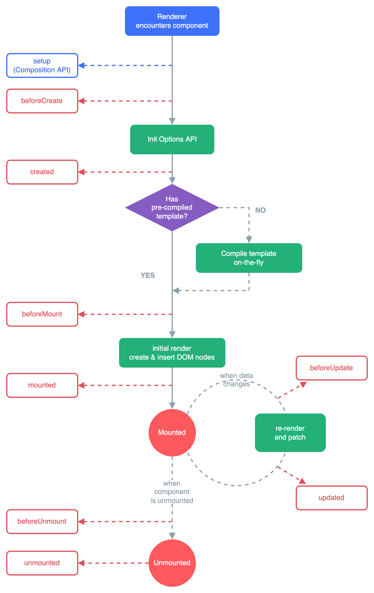
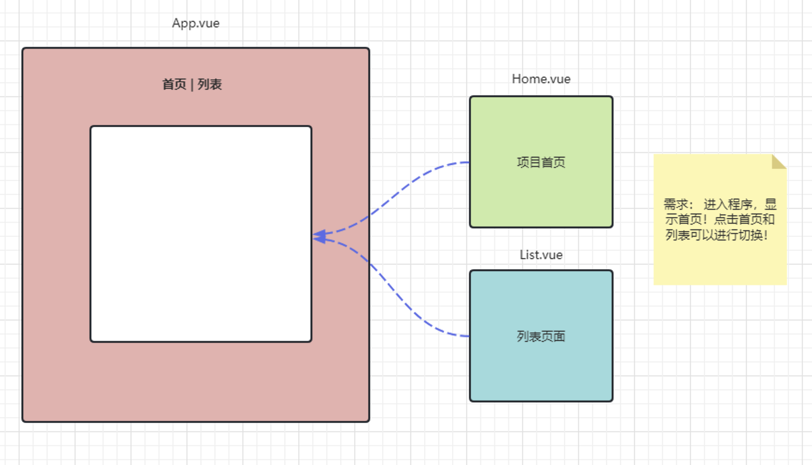

+ `Vue`是一个渐变式(即项目仅需下载自己当前需要的依赖)`JavaScript`框架,它有两个核心功能:
  1. 声明式渲染:`Vue`可以绑定`js`的指定变量和`HTML`元素的关系，并对他们之间进行操作
  2. 响应性:`Vue`会自动跟踪`JavaScript`状态并在其发生变化时响应式地更新`DOM`

# Vite

+ `Vite`是`Vue`团队官方推出的进行前端模块化管理的开发工具

## 一、构建vite项目

1. 创建一个文件夹，使用终端进入该文件夹
2. 使用`npm create vite`命令创建项目，第一次运行该命令会提示安装`vite`，输入`yes`同意即可
3. 在选择时，会要求选择项目名称、所使用的框架、要使用的语言等，依次进行项目命名、选择`Vue`、选择`JavaScript`
4. 项目构建完成后，用终端进入项目，执行`npm i`下载项目所需依赖
5. 下载完后，执行`npm run dev`检验项目能否正常运行，其显示在终端的`URL`可以复制到浏览器地址栏中

---

## 二、项目结构

+   `public` 目录：用于存放一些**公共资源**，如 `HTML` 文件、图像、字体等，这些资源会被直接复制到构建出的目标目录中。
+   `src` 目录：存放项目的源代码，包括 `JavaScript`、`CSS`、`Vue` 组件、图像和字体等资源。在开发过程中，这些文件会被 `Vite` 实时编译和处理，并在浏览器中进行实时预览和调试。以下是`src`内部划分建议：
    1.  `assets/` 目录：用于存放一些项目中用到的**静态资源**，如图片、字体、样式文件等。
    2.  `components/` 目录：用于存放**组件**相关的文件。组件是代码复用的一种方式，用于抽象出一个**可复用的 `UI` 部件**，方便在不同的场景中进行**重复使用**。
    3.  `layouts/` 目录：用于存放**布局组件**的文件。布局组件通常负责整个应用程序的整体布局，如头部、底部、导航菜单等。
    4.  `pages/` 目录：用于存放**页面级别的组件**文件，通常是路由对应的组件文件。在这个目录下，可以创建对应的文件夹，用于存储不同的页面组件。
    5.  `plugins/` 目录：用于存放 `Vite` **插件**相关的文件，可以按需加载不同的插件来实现不同的功能，如自动化测试、代码压缩等。
    6.  `router/` 目录：用于存放 `Vue.js` 的**路由配置**文件，负责管理视图和 `URL` 之间的映射关系，方便实现页面之间的跳转和数据传递。
    7.  `store/` 目录：用于存放 `Vuex` **状态管理**相关的文件，负责管理应用程序中的数据和状态，方便统一管理和共享数据，提高开发效率。
    8.  `utils/` 目录：用于存放一些**通用的工具函数**，如日期处理函数、字符串操作函数等。
+   `vite.config.js` 文件：`Vite` 的配置文件，可以通过该文件配置**项目的参数、插件、打包优化**等。该文件可以使用`CommonJS`或`ES6`模块的语法进行配置。
+   `package.json` 文件：标准的 `Node.js` 项目配置文件，包含了**项目的基本信息和依赖关系**。其中可以通过`scripts`字段定义几个命令，如`dev`、`build`、`serve`等，用于启动开发、构建和启动本地服务器等操作。
+   `Vite` 项目的入口为 `src`目录下的`main.js` 文件，**这是 `Vue.js` 应用程序的启动文件，也是整个前端应用程序的入口文件**。在该文件中，通常会引入 `Vue.js` 及其相关插件和组件，同时会创建 `Vue` 实例，挂载到 `HTML` 页面上指定的 `DOM` 元素中。
+ 项目运行机制:
  + `index.html`是项目的入口，其中的`

`是**用于挂载所有组建的元素**
  + `index.html`中的`script`标签引入了一个`main.js`文件,具体的挂载过程在`main.js`中执行
  + `main.js`可以**决定项目中使用哪些依赖**
  + `App.vue`是`vue`中的核心组件，**所有的其他组件都要通过该组件进行导入**,该组件通过路由可以控制页面的切换

+ 配置:

~~~js
  /*  在vite.config.js文件中修改此代码段可以设置占用的端口号  */
  export default defineConfig({
    plugins: [vue()],
    server:{
      port:3000
    }
  })
~~~

---

## 三、配置项

+ 结构:

~~~js
  export default defineConfig(
      {
          plugins: [
              vue(),
              vueJsx(),
          ],
          resolve: {
              alias: {
                  '@': fileURLToPath(new URL('./src', import.meta.url))
              }
          },
          lintOnSave:false,
          server:{
              // 与server相关的在这写
              proxy:{
                  '/api':{
                      target:'http://localhost:6379',
                      changeOrigin:true,
                      rewrite: path =>{ return path.replace(/^\/api/,'')},
                  }
              }
          }
      }
  )
~~~

|分类|配置项|参数|作用|值|备注|
|:---:|:---:|:---:|:---:|:---:|:---:|
|**服务器**|与服务器相关的配置都以server开头，value为一个对象|
|^|`server.host`|无参|指定服务器应该监听哪个IP地址|端口号|无|
|^|`server.port`|无参|指定vite启动项目时占用的端口号|默认为5173|无|
|^|`server.proxy`|无参|配置反向代理|值为对象，示例见[官网](https://vitejs.cn/vite3-cn/config/server-options.html#server-proxy)|无|

---

# 基本语法

## 一、响应式数据

+ 响应式数据就是`vue`中的数据修改后，`vue`也会**同步修改`DOM`树中的数据**，使呈现的`HTML`元素内容也发生变化
  + 在`vue2`中，定义的变量默认就会进行响应式更新
  + 但在`vue3`中，定义的变量默认**不会**再进行响应时更新了，**需要使用`ref`或`reactive`方法进行赋值**才行

|方法|参数|描述|备注|样例|
|:---:|:---:|:---:|:---:|:---:|
|`ref(attr)`|`attr`:`js`中的原始数据类型|针对原始数据类型进行响应式数据处理|使用该方法时，在`script`标签内应该使用`变量.value`进行修改，而`template`标签内只需写变量名即可|[ref样例](../../java/源码/JavaWeb/前端工程/02VueSetup/components/Ref.vue)|
|`reactive(attr)`|`attr`:`js`对象，数组、`Object`等|针对`js`对象进行响应式数据处理|使用该方法时，`script`和`template`标签都只需写变量名进行运算|[reactive样例](../../java/源码/JavaWeb/前端工程/02VueSetup/components/Reactive.vue)|
|`toRef(obj,attr)`|`obj`:`reactive`方法处理过的对象 `attr`:要进行转换的对象中的属性|将被`reactive`处理的对象的某一属性转换为`ref`处理的对象|无|无|
|`toRefs(obj)`|`obj`:`reactive`方法处理过的对象|将被`reactive`处理的对象转换为`ref`处理的对象|无|^|

## 二、渲染与绑定

|语法/方法|描述|备注|
|:---:|:---:|:---:|
|`v-text="变量/表达式"`|给标签中的文本与变量/表达式的值进行绑定而动态更新|无法渲染`html`代码|
|`v-html="变量/表达式"`|^|可以渲染`html`代码|
|`{{ 表达式 }}`|将数据渲染到元素的指定位置|无|
|`v-bind:属性="变量/表达式"`|对属性进行渲染|可以简写为`:属性="变量/表达式"`|
|`v-if="变量/表达式"`|判断结果是否为`true`,如果为`true`那么渲染该元素到`DOM`树中去，如果为`false`将该元素从`DOM`树中移除|无|
|`v-else`|与`v-if`对应|该指令会与离其最近的且在其元素上面的具有`v-if`相匹配|
|`v-show="变量/表达式"`|与`v-if`基本一致，但值为`false`时不会将元素从`DOM`树中移除，而是设置`display:none`|无|
|`v-for="(item,index(可选)) in items"`|渲染的`HTML`元素数量取决于`items`中的元素数量,每个`HTML`元素所对应的`item`和`index`都对应同位置的`items`中的元素和索引|语法上，每个元素都要写`:key="xxxx"`来指定每个渲染的元素的唯一标识，但不写也没事|
|`v-on:事件="函数"`|监听对应事件并作出处理|1.可以简写为`@事件="函数"` 可以在事件后添加[修饰符](#Vue_Event_Modifier)|
|`v-model:value="变量/表达式"`|进行双向绑定|无|
|`computed`|函数接受一个回调函数作为参数，并将该函数的返回值返回|一般使用一个变量接收该返回值，该变量被称为计算属性，计**算属性值会基于其响应式依赖被缓存。一个计算属性仅会在其响应式依赖更新时才重新计算**|

### （一）插值表达式

+ 插值表达式是`vue`定义的将数据渲染到元素的指定位置的手段之一,它使用的是`“Mustache”`语法 ,即双大括号`{{}}`
  + 插值表达式不依赖标签，可以在任意位置插入，相对比较自由
  + 插值表达式中支持`js`的运算表达式
  + 插值表达式支持函数调用
+ [样例](../../java/源码/JavaWeb/前端工程/03RenderAndBind/components/InterpolationExpression.vue)

---

### （二）属性渲染

+ 使用`v-bind:属性="表达式"`可以使指定属性与变量或表达式运行结果进行绑定，该操作可以进一步被简写为`:属性="表达式"`
+ [样例](../../java/源码/JavaWeb/前端工程/03RenderAndBind/components/Bind.vue)

---

### （三）条件渲染

+ 使用`v-if`、`v-else`来进行条件渲染
  + `v-if="表达式"`会根据表达式(可以为变量、`js`代码等)中的值来判断，如果为`true`那么该元素会被添加进`DOM`树中
  + `v-else`会在`v-if`中的表达式为`false`时进行判断
+ 使用`v-show`进行条件渲染
  + `v-show="表达式"`会根据表达式(可以为变量、`js`代码等)中的值来判断，如果为`true`那么该元素会被添加一个`display:none;`的`css`样式而**不会从`DOM`树中移除**
+ [样例](../../java/源码/JavaWeb/前端工程/03RenderAndBind/components/ConditionBind.vue)

---

### （四）列表渲染

+ 使用`v-for`指令以对列表进行渲染
+ 需要使用`:key="xxx"`来指定每个渲染的元素的唯一标识，该语法**不是必须的**，它是`vue`自己定义的
+ [样例](../../java/源码/JavaWeb/前端工程/03RenderAndBind/components/LiRender.vue)

---

### （五）事件绑定

+ 使用`v-on`以监听对应事件并作出处理
+ `vue`中的事件，全部都可以省略`on`:如`onclick->click`、`onfocus->focus`

+ 可以在事件后添加如下修饰符:

|修饰符|作用|备注|
|`.once`|该事件仅处理一次|无|
|`.prevent`|阻止默认事件|无|
|`.stop`|阻止事件冒泡|无|
|`capture`|使用事件捕获模式而不是冒泡模式|无|
|`self`|只有触发事件的是本身才进行处理|无|

+ 其具体格式为:`v-on:事件.once(修饰符可选)="回调函数"`
+ [示例](../../java/源码/JavaWeb/前端工程/03RenderAndBind/components/EventBind.vue)

---

### （六）双向绑定

+ `ref`和`reactive`处理的变量仅能进行单向绑定，即它们的变化会引起`HTML`元素的变化，但`HTML`元素的变化无法影响到这些变量的变化
+ `v-model`指令专门用于进行双向绑定,其语法为:`v-model:value=""`，可以简写为:`v-model=""`
+ [双向绑定样例](../../java/源码/JavaWeb/前端工程/03RenderAndBind/components/Two-Way-Bind.vue)

---

### （七）计算属性

+ 如果仅使用插值表达式进行运算，那么**碰到较为冗长的表达式时就会难以读懂其意思**
+ 此时就应该使用计算属性来进行运算了:
  + `computed`函数接收一个函数作为参数，他会立即执行该函数中的语句，函数中可以定义运算逻辑来得到想要的结果
  + 计算属性即**接收`computed`函数返回值的变量**，将该属性插入插值表达式而不是将一整串运算式子插入表达式更为简洁
  + 对于运算式的处理逻辑通过`computed`函数来完成，该函数**接收一个回调函数作为参数，并将该函数的执行结果返回**
  + **计算属性值会基于其响应式依赖被缓存。一个计算属性仅会在其响应式依赖更新时才重新计算**
+ [计算属性样例](../../java/源码/JavaWeb/前端工程/03RenderAndBind/components/CalculateAttribute.vue)

---

### （八）数据监听

|方法|参数|描述|备注|
|:---:|:---:|:---:|:---:|
|`watch(source,callback(newValue,oldValue),option(可选))`|`source`:要监测的数据源 `callback(newValue,oldValue)`:执行操作的回调函数，`newValue`表示监测对象变化后的值，`oldValue`表示监测对象变化前的值 `option`:一些可选参数，如:`{deep:true,immediate:false}`,这表示进行深度监测，且不在进入页面时就执行函数|针对指定数据源进行监听|无|
|`watchEffect(callback(parameter),option)`|`callback(onclean)`:执行操作的回调函数，`onclean`:一个注册清理回调函数的函数，它会在下次回调函数执行前执行 `opotion`:对象形式的可选参数,详情[查看文档](https://cn.vuejs.org/api/reactivity-core.html#watcheffect)|对所有的响应时数据进行监听并进行处理|只要**代码中出现过的变量发生了变化，那么所有代码都会执行**|

+ `watch`函数和`watchEffect`函数用于**对响应数据变化**进行监听，并针对监听对象的状态进行处理
  + `watch`函数:
    1. 有明确的数据源
    2. 不会追踪任何在回调中访问到的东西
    3. 会避免在发生副作用时追踪依赖
  + `watchEffect`函数:
    1. 没有明确的数据源
    2. 自动追踪所有能访问到的响应式属性
    3. 只要**代码中出现过的变量发生了变化，那么所有代码都会执行**
+ [数据监听样例](../../java/源码/JavaWeb/前端工程/03RenderAndBind/components/DataListen.vue)

---

# 生命周期

+ 每个`Vue`组件实例**在创建时都需要经历一系列的初始化步骤**，比如设置好数据侦听，编译模板，挂载实例到`DOM`，以及在数据改变时更新`DOM`。在此过程中，它也会运行被称为生命周期钩子的函数，让开发者有机会在特定阶段运行自己的代码。

+ 常见钩子函数
  + `onBeforeMount()`:注册一个钩子，在**组件被挂载之前**被调用。 
  + `onMounted()`:注册一个回调函数，在组件**挂载完成后**执行。 
  + `onBeforeUpdate()`:注册一个钩子，在**组件即将因为响应式状态变更而更新其`DOM`树之前**调用。 
  + `onUpdated()`:注册一个回调函数，在**组件因为响应式状态变更而更新其`DOM`树之后**调用。 
  + `onBeforeUnmount()`:注册一个钩子，在**组件实例被卸载之前**调用。 
  + `onUnmounted()`:注册一个回调函数，在**组件实例被卸载之后**调用。 

---

# vue组件

## 一、组件基础

+ 一个页面作为整体,是**由多个部分组成**的,每个部分可以理解为一个组件
  + 传统的页面一般由`html`、`css`、`js`三个文件组成
  
  

  + `vue`将这些文件合成为一个`.vue`文件(`Single-File Component`单文件组件，简称`SFC`)
+ `vue`文件有三个组成部分:
  + `script`标签:用来存放当前组件的`js`代码，通过setup语法糖可以简化js操作，直接在标签中使用变量、方法等，同时自动使组件导出
  + `style`标签:用来存放当前组件的`css`代码，通过scoped语法糖可以使在此标签写的css样式仅作用于本文件而不是全局
  + `template`标签:用来存放当前组件的`html`代码，**尽量不要嵌套使用template标签**

---

## 二、组件传参

+ 请查看`前端工程/Demo5-Assembly/src`中的三个`vue`文件和`app.vue`文件

---

# 路由

## 一、路由简介

+ 引入:`npm i vue-router`
+ 路由就是**根据不同的`URL`地址展示不同的内容或页面**
  + 单页应用程序（`SPA`）中，路由可以实现**不同视图之间的无刷新切换**，提升用户体验
  + 路由还可以实现页面的认证和权限控制，保护用户的隐私和安全
  + 路由还可以利用浏览器的前进与后退，帮助用户更好地回到之前访问过的页面

+ 查看`前端工程/Demo7-RouterPlus/srccomponents`中的三个`vue`文件和`app.vue`文件以**查看`路由传参样例`**

---

## 二、简单使用

### （一）创建路由

+ 想让路由生效，需要先创建路由并把它加载进vue中:
+ 一般都会创建一个router目录，然后创建一个对应js文件

~~~js

  // createRouter方法用来创建一个路由对象
  const router = createRouter(
      {
          // history表示路由的历史对象，createWebHashHistory用来创建哈希路由历史对象，也可以选择createMemoryHistory方法进行创建
          history: createWebHashHistory(),
          // routes表示路径与组件对应的映射关系
          routes:[
              {
                  path: '/',  // path表示对应的前端请求路径
                  name: 'home',  // name表示此次映射的名称，要求唯一
                  component: Login  // 前端请求访问匹配的路径时要呈现在屏幕上的组件
              },
              {
                  path:'/index',
                  name: 'index',
                  redirect: '/bed/bedMap',  // 设置重定向路径
                  component: Index,
                  meta: {
                      title: '首页'  // 设置此路由映射的路由信息
                  },
                  // 设置子路由（嵌套路由）
                  children:[
                      {
                          //  子路由下面的配置和上面的配置基本上是相关的
                          path:'/bed/bedMap',
                          component: BedMap,
                          name: 'bedMap',
                          meta: {
                              title: '床位示意图'
                          }
                      }
                  ]
              }
          ]
      }
  );
  export default router;  // 最后导出暴露出去
~~~

+ 接下来把它全局引入到Vue项目内，一般在`main.js`通过Vue的应用实例来进行引入:

~~~js
  import router from './router';  // 通过import导入
  const app = createApp(App);
  app.use(router);  // 通过应用实例引入路由
~~~

---

### （二）路由映射

+ 通过路由映射可以利用路由在用户访问不同路径是为其展现不同组件:

|标签|属性|属性描述|属性备注|标签描述|备注|依赖|
|:---:|:---:|:---:|:---:|:---:|:---:|:---:|
|`router-link`|`to`|要请求的项目路径|无|在路由组件之间跳转|标签也可以写在路由组件里面|`vue-router`|
|`router-view`|`name`|指定该标签呈现哪个路由对象|无|呈现路由对象|无|`vue-router`|

+ 一般情况下只需要在对应的组件中引入上面两个标签就可以映射对应的组件了，组件会在标签所在的位置被呈现出来
+ 子路由是嵌套的，那么根据其嵌套结构，对应的嵌套标签会根据其层级去寻找与其层级相同的子路由进行映射:
~~~js
    // 外面的标签会找外层路由映射
    <router-view>
      {/* 内部的标签找二级路由映射，以此类推 */}
      <router-view></ router-view>
    </ router-view>
~~~

---

### （三）路由操作

#### ①router对象

+ 使用`useRouter`方法得到用于进行路由操作的路由对象

|所属|方法|参数|描述|备注|导入源|
|:---:|:---:|:---:|:---:|:---:|:---:|
|钩子函数|`useRoute`|无参|获得进行路由跳转的对象|无|`vue-router`|
|router对象|`push(path)`|path:要跳转的路径|进行跳转，可以直接传入路径，也可以传入对象|详情查看示例代码|`vue-router`|
|^|`resolve(path)`|path:想解析的路径|解析指定路径，返回该路径对应的路由信息|无|^|

---

#### ②route对象

+ 通过`useRoute`方法用于得到本组件所属的路由信息，它包含的内容包括:
  + fullpath:本组件的从根路径开始的完整路径
  + meta:本组件在router映射文件中指定的meta
  + path:本组件的映射路径
  + name:本组件在router映射文件中指定的name
  + matched:本组件及祖先路由（如果存在嵌套关系）的路由信息所组成的数组，随着索引的增大从外层路由开始向内提供

---

#### ③路由传参

+ 在路径中，有两种传递参数的形式:
  1. `xxx/xx/xxxx?key1=value1&key2=value2`:我们称这种方式为键值对形式的参数
  2. `xxx/xx/xxxx/value1/value2/value3/....`:我们称这种方式为路径参数
+ 使用`push`方法进行传参时，其支持参数为:
  1. 直接传入一个路径(字符串)
  2. 传入一个对象:
     1. `path`:要传递的路径
     2. `params`:路径参数，是一个对象，指定传输的键值对
     3. `query`:键值对参数，也是一个对象，指定传输的键值对
+ 请查看`前端工程/07RouterPlus/components`中的三个`vue`文件和`app.vue`文件以**查看`路由重定向`和`编程式路由`样例**

---

#### ④路由守卫

|方法/属性|参数|描述|备注|导入源|
|:---:|:---:|:---:|:---:|:---:|
|`beforeEach`|传入一个函数，函数有三个参数:`to`:请求的路径、`from`:发出请求的路径、`next`:放行函数|全局前置路由守卫，在路由跳转前进行判断，可以阻止路由继续跳转|该方法需写在`router.js`中|`vue-router`|
|`afterEach()`|传入一个函数，函数有两个参数:`to`:请求的路径、`from`:发出请求的路径|全局后置路由守卫，在路由跳转后进行一些操作|^|^|

+ 例:

~~~js
  router.beforeEach(
      (to,from,next)=>{
          // 如果有token
          if(sessionStorage.getItem('token')!==null){
              // 如果路径是/login，因为此时是登录状态，因此无需登录，重定向到/index
              if(to.path==='/login'){
                  next('/index');
              }else{
                  // 剩下的随便走
                  next();
              }
          }else{
              // 这里是没有token的情况
              // 如果访问路径不是/login
              if(to.path!=='/login'){
                  // 重定向到/login
                  next('/login');
              }else{
                  // 否则放行
                  next();
              }
          }
      }
  );
~~~

---

# Pinia

