# MySQL高阶

## 一、Linux安装MySQL

+ 这里以Ubuntu24版本为例，进行linux安装mysql的教程:
  + 首先我们需要有一个Ubuntu24
  + 接下来打开终端，输入`su`并输入密码进入root用户状态
  + 接下来在终端输入`apt install mysql-client-core-8.0`

  + 接下来在终端输入`mysql --version`，如果弹出版本说明安装成功
  + 接下来继续输入`apt install mysql-server-core-8.0`

  + 接下来输入`mysqld --initialize --user=你的用户名(一般叫root)`来使mysql进行初始化，`--initialize`参数用来设置以安全模式进行初始化，它会自动生成一个密码，**这个密码会在初始化完成后在终端输出**，我们需要记住这个密码，或者把它复制(ctrl+insert)一下放到剪切板中

  + 接下来在终端输入`apt install mysql-server`

  + 在终端输入`systemctl status mysql.service`查看mysql的服务是否在启动状态:
    + 如果没开，输入`systemctl start mysql.service`或`service mysql start`来使服务启动起来

  + 接下来我们就可以连接mysql了:在终端输入`mysql -u root -p`，接下来输入之前让记住的密码直接进入

  + 我们连接上以后，需要做的第一件事就是改掉它自动生成的操蛋密码
    + 在终端输入`alter user 'root'@'localhost' identified by '自定义的密码'`
    + **出现0 row affected 是正常情况。说明你已经修改成功了**，但是如果你出现`you have an error ....`就不是正常情况了，该情况一般在语法错误时被输出

  + 密码修改完成后，输入`quit`退出mysql连接，再输入`mysql -u root -p`，再连接一次，查看密码是否修改完成
  + mysql安装完成

---

## 二、用户与权限管理

### （一）用户与密码管理

+ MySQL支持我们进行用户与密码的管理
  + 用户管理可以进行增删改查的操作
    + 在添加时，我们可以自行指定用户名和host作用域，**这两个字段共同组合成了聚合主键**
    + 删除时，仅指定用户名而不指定host作用域，默认删除的是`%`host作用域的用户，没有会报错。且推荐使用drop进行删除
    + 修改时，推荐使用alter的方式进行修改
    + 查询时，由于字段过多，可以挑出几个来进行查询
  + 密码管理支持我们修改密码并指定一些密码的配置
    + 推荐使用alter的方式进行密码的修改
    + 可以指定密码重用和密码过期策略
      + 密码过期后，需要重置密码，否则操作不可用
      + 密码重用策略用来限制我们的密码重置不能与之前的密码相同

~~~sql
  -- 用户登录，可以选择性的指定连接的主机和执行的操作
    -- 不写主机默认localhost
  mysql [-h 主机名称\|主机IP -P port ]-u username -p [数据库名 -e SQL语句]

  -- 查询mysql数据库的user表，得到当前用户的数据
    -- 它的列太多了，我们只摘一部分
  select * from mysql.user;

  -- 查询mysql数据库的user表的用户名和host作用域字段
  select user,host from mysql.user;

  -- 创建用户，可以一次性创建多个用户，每个用户间使用逗号隔开，也可以指定用户的密码过期天数
    -- 如果没有指定密码，用户直接就可以进行登录
    -- host作用域可以通过
    -- 后面的password选项，expire interval用来设置该用户的密码什么时候过期，可以指定指定天数、从不过期或继承全局配置
    -- 接下来的history是重置密码的时候指定新密码不能与过去的前n个密码一致，如指定3，那么指定的新密码就不能与在其之前设置的前3个密码中的一个一致
    -- reuse interval ... 用来配置新密码不能与之前多少天配置的密码一致，如指定365,那么新密码就不能与过去一年设置的全部密码中的一个一致
  create user 
  用户名[@host作用域]
  [identified by 密码 ]
  [PASSWORD [EXPIRE INTERVAL {天数 DAY\|NEVER\|DEFAULT} ][password {HISTORY 次数|REUSE INTERVAL 天数 DAY}]][,
  用户名[@host作用域]
  [identified by 密码 ]
  [PASSWORD [EXPIRE INTERVAL {天数 DAY\|NEVER\|DEFAULT} ][password {HISTORY 次数|REUSE INTERVAL 天数 DAY}]]
  ...
  ]

  -- 使用select host,user,password_lifetime,password_reuse_history from mysql.user;可以查看结果
  例:create user lzx@'localhost' identified by '123456' password expire never password history 3;

  -- 修改用户名
    -- 需要使用flush privileges使操作生效
  update mysql.user set user=用户名 where user=原用户名
  -- 这个不需要flush privileges就能生效
  rename user 用户名 to 新用户名

  -- 删除用户（推荐），可以一次性删除多个用户，每个用户之间使用逗号隔开
    -- 如果不写host作用域，那么默认删除host为%
  drop user 用户名[@host作用域][,用户名[@host作用域],....]

  -- 删除指定host作用域的用户
    -- 需要使用`flush privileges`使操作生效，不推荐，该操作会使系统有残留信息保留
  delete from mysql.user where user=用户名 and host=host作用域

  -- 修改当前登录用户密码（官方推荐）
  alter user user() identified by 新密码

  -- 修改当前登录用户密码
  set password = 新密码
  -- 修改当前登录用户密码
    -- 不推荐，password函数在MySQL8.0及以后被移除

  set password = PASSWORD(新密码)

  -- 修改指定用户的密码
  alter user 
  用户名[@host作用域] 
  [identified by 新密码][,
  用户名[@host作用域] 
  identified by 新密码,
  ...
  ]

  -- 修改指定用户的密码
  set password for 用户名[@host作用域] = 新密码

  -- 修改指定用户的密码
    -- 不推荐，password函数在MySQL8.0及以后被移除
  update mysql.user set authentication_string=PASSWORD(新密码) where user = 用户名 and host = host作用域

  -- 设置指定的密码过期，可以进行全局配置，也可以精确到指定用户进行配置
    -- 如果是全局配置，可以设定全局变量，或者配置配置文件
    -- 如果是局部配置，可以在创建用户时进行指定

  -- 使指定用户的密码过期
  alter user 用户名[@host作用域] password expire

  -- 设置全局变量，使所有用户的密码在指定天数后过期
  set persist default_password_lifetime = 天数

  -- 在配置文件内配置用户密码过期天数
  [mysqlId]
  default_password_lifetime=天数

  -- 设置密码重用策略，和密码过期策略一样，也能进行全局配置和精确到指定用户进行配置
    -- 如果是全局配置，可以设定全局变量，或者配置配置文件
    -- 如果是局部配置，可以在创建用户时进行指定

  SET PERSIST password_history = 6; -- 设置不能选择最近使用过的6个密码

  SET PERSIST password_reuse_interval = 365; -- 设置不能选择最近一年内的密码

  -- 使用配置文件进行配置
  [mysqld]
  password_history=6
  password_reuse_interval=365

~~~

---

### （二）权限

#### ①权限管理

+ MySQL为每个用户都设置了权限，其中，root用户的权限是最大的
+ 为了控制每个用户的权限，MySQL为我们提供了完备的权限管理语句:

~~~sql

  -- 查看当前用户权限，以下三个都可以
  SHOW GRANTS;
  SHOW GRANTS FOR CURRENT_USER;
  SHOW GRANTS FOR CURRENT_USER();

  -- 查看某用户的全局权限
  SHOW GRANTS FOR 'user'@'主机地址';

  -- 给用户授权的方式有两种: 直接给用户权限 和 把角色赋予用户使用户具有该角色的权限
  -- 这里仅演示第一种，第二种在后面的角色笔记中会提供
  -- 数据库名称、表名称可以进行模糊匹配，使用*来表示所有的数据库或所有的表
  -- GRANT命令会使权限叠加，而不是使上一条权限被该权限覆盖，也就是说，多条grant命令都执行时，对应用户会得到这些grant命令声明的所有权限而不是后面覆盖前面
  -- with grant option表示本次赋予的权限，该用户可以再赋给其他用户，写在后面用with的形式可以进一步限制该用户可以赋予其它用户的权限，如root用户给了修改和插入的权限，但是可以限制该用户仅下发修改权限而不能下发插入权限
  GRANT 权限1,权限2,…权限n ON 数据库名称.表名称 TO 用户名@用户地址 [IDENTIFIED BY ‘密码口令’ ][with grant option];
  -- 例:
  GRANT SELECT,INSERT,DELETE,UPDATE ON atguigudb.* TO li4@localhost ;
  -- 这里表示把所有的权限都赋值给对应用户:
    -- 它与root用户依然有区别，因为全部权限不包括向其它用户分配权限的权限，因此正常情况下仅root用户可以下发权限，而其它用户不能
    -- 如果想下发权限，需要加上with grant option
  GRANT ALL PRIVILEGES ON *.* TO joe@'%' IDENTIFIED BY '123';

  -- 收回权限
    -- 收回权限的操作需要在用户重新登陆后才重新生效
  REVOKE 权限1,权限2,…权限n ON 数据库名称.表名称 FROM 用户名@用户地址;

  -- 例:
  -- 收回全部权限
  REVOKE ALL PRIVILEGES ON *.* FROM joe@'%';
  -- 收回部分权限
  REVOKE SELECT,INSERT,UPDATE,DELETE ON mysql.* FROM joe@localhost;

~~~

#### ②权限表

+ MySQL底层通过表的形式存放各用户的权限，它们都存放在mysql数据库下,与权限相关的数据库内的表有如下表:
  + user表，该表在[用户与密码管理](#manageUserAndPassword)章节就遇到过，它用来存储用户对所有数据库的权限
  + db表，它用来存储用户对指定数据库的权限
  + tables_priv表:它用来存储用户对数据库内的表的权限
  + columns_priv表:它用来存储用户对表内字段的权限
  + procs_priv表:它用来存储存储过程与函数的设置操作权限

+ user表字段
  + 在user表中，host和user共同组成了聚合主键

|分类|字段|作用|备注|
|:---:|:---:|:---:|:---:|
|用户列|host|host作用域，表示连接类型，`%`表示支持所有通过TCP方式的连接，另外还支持localhost、IP地址、机器名等|无|
|^|user|用户名，只要host不一样，user可以重复|无|
|^|password/authentication_string|密码，5.7及之前称password,8.0及之后改为authentication_string|无|
|权限列|Grant_priv|表示是否拥有grant权限|无|
|^|Shutdown_priv|表示是否拥有停止mysql服务的权限|无|
|^|Super_priv|表示是否拥有超级权限|无|
|^|Execute_priv|表示是否拥有EXECUTE权限。拥有EXECUTE权限，可以执行存储过程和函数。|无|
|^|Select_priv、Insert_priv...|该用户所拥有的权限|无|
|资源控制列|max_questions|用户每小时允许执行的查询操作次数|无|
|^|max_updates|用户每小时允许执行的更新操作次数|无|
|^|max_connections|用户每小时允许执行的连接操作次数|无|
|^|max_user_connections|用户允许同时建立的连接次数|无|
|安全列|ssl_type|用于加密|无|
|^|ssl_cipher|用于加密|无|
|^|x509_issuer|标识用户|无|
|^|x509_subject|标识用户|无|
|^|plugin|指定验证用户身份的插件，如果为空，那么启用内建授权验证机制验证用户身份|无|

+ db表字段
  + 在db表中，host、user和Db共同组成了聚合主键

|分类|字段|作用|备注|
|:---:|:---:|:---:|:---:|
|用户列|host|host作用域，表示连接类型，`%`表示支持所有通过TCP方式的连接，另外还支持localhost、IP地址、机器名等|无|
|^|user|用户名，只要host不一样，user可以重复|无|
|^|password/authentication_string|密码，5.7及之前称password,8.0及之后改为authentication_string|无|
|权限列|Create_routine_priv|表示是否有创建存储过程的权限|无|
|^|Alter_routine_priv|表示是否有修改存储过程的权限|无|
|^|其他权限同user表|

+ 其它表也是如此，可以看到，**存储的权限越精确的表，组成其主键的列字段就越多**

---

#### ③访问控制

+ 访问控制分为两个阶段:
  + 连接核实阶段:当用户试图连接MySQL服务器时，服务器基于用户的身份以及用户是否能提供正确的密码验证身份来确定接受或者拒绝连接。服务端在进行核实时，会根据user表中的host、user和authentication_string字段对比客户端传来的信息，从而确定是否建立连接
  + 请求核实阶段:建立连接后服务器就进入了第二个阶段,此时用户在进行请求时，MySQL首先从user开始找，逐步向更精确的表(db、tables_priv、columns_priv、procs_priv)查找，**一旦找到对应权限就停止向下找，开始执行操作，如果都找不到，那么报错**

---

### （三）角色

+ 角色是MySQL8.0新添的特性，它的设计目的是**方便管理拥有相同权限的用户**
  + 我们可以通过将角色赋予给用户，来使得指定用户具有该角色的权限
  + 角色需要是激活的状态，这样其权限才会生效，如果我们对一个用户的角色进行了修改，那么最好退出再登陆一下，效果才会显现出来
+ 下面是对角色的相关管理代码:

~~~sql
  -- 创建一个角色
  CREATE ROLE 'role_name'[@'host_name'] [,'role_name'[@'host_name']]...
  
  -- 给角色赋予权限

  GRANT 权限 ON 数据库.表 TO 'role_name'[@'host_name'];

  -- 查看当前角色的权限
  SHOW GRANTS FOR 'role_name'[@'host_name'];

  -- 回收对应角色的权限
  REVOKE 权限 ON 数据库.表 FROM 'role_name'[@'host_name'];

  -- 删除角色
  DROP ROLE role [,role2]...

  -- 激活角色
    -- 查看当前被激活的角色
  select current_role();
    -- 通过set命令手动激活，这玩意在Windows的MySQL上好像不能使，不知道linux上怎么样
  SET DEFAULT ROLE ALL TO role1 [,role2,...];
    -- 通过设置全局配置自动激活，它的意思是对所有角色永久激活
  SET GLOBAL activate_all_roles_on_login=ON;
  -- 给用户赋予角色，我们可以同时将多个角色赋予给多个用户
    -- 这也是给用户权限的第二种方式
  GRANT role1 [,role2,...] TO user1 [,user2,...];

  -- 移除用户的指定角色
  REVOKE 'role_name'[@'host_name'] FROM 'user_name'[@'host_name'];

  -- 设置强制角色
    -- 在配置文件中设置
  [mysqld]
  mandatory_roles='role1,role2@localhost,r3@%.atguigu.com'
    -- 在运行时设置
      -- 系统重启后仍然有效
  SET PERSIST mandatory_roles = 'role1,role2@localhost,r3@%.example.com'; 
      -- 系统重启后失效
  SET GLOBAL mandatory_roles = 'role1,role2@localhost,r3@%.example.com'; 

~~~

---

## 三、逻辑架构与SQL执行

### （一）基本架构

+ 下面是MySQL5.7对应的MySQL逻辑架构,可以看到MySQL的逻辑架构组成包括:
  + 基础服务组件:负责进行基础服务
  + 连接池:提供了多个用于客户端与服务器进行交互的线程
  + SQL接口:接收SQL指令，并返回查询结果
  + 解析器:进行语法解析，如果我们编写的SQL语法不正确，将在这里返回并报错
  + 优化器:负责对SQL语句进行进一步优化
  + 查询缓存:以键值对的形式缓存查询结果，但效率低下，MySQL从5.7.20版本开始不再推荐使用查询缓存，并默认关闭了查询缓存配置，**MySQL8.0及之后被移除**
  + 存储引擎:与底层的文件系统进行交互，执行查询操作
  + 文件系统、日志文件:它们理论上来说并不属于MySQL架构，而是操作系统和硬盘的东西
.png)

+ 根据上面的逻辑架构，可以将MySQL的架构分为三层:
  + 第一层是**连接层**，包括连接池，该层**负责建立与客户端的连接，进行身份认证与权限获取**
  + 第二层是**服务层**，包括SQL接口、解析器、优化器、查询缓存组件等。该层负责**处理SQL语句以及SQL语句执行后的结果**
  + 第三层是**引擎曾**,包括存储引擎，该层**负责MySQL中数据的存储和提取，对物理服务器级别维护的底层数据执行操作**

---

### （二）SQL执行流程

+ SQL执行流程如下:
  + 首先客户端向服务器请求连接，进行TCP连接
  + 客户端连接完成后，向服务器发送请求，携带SQL语句
  + 服务器收到后，先查询缓存是否存在该SQL语句
    + 如果存在就直接从缓存中取出结果，然后直接返回
    + 若不存在再对SQL进行解析
      + 先放入解析器进行解析，判断语法是否正确
      + 再放入优化器进行优化
      + 执行SQL操作
      + 返回值进行缓存
      + 返回值向客户端返回
+ 因此，SQL语句的大致执行流程为:`SQL语句->查询缓存->优化器->执行器->查询结果缓存->返回结果`
+ 大部分情况下查询缓存都十分鸡肋，其效率并不高:
  + **查询缓存的key必须与后面的SQL语句完全匹配才能正确命中缓存**，这意味着大小写或者多一个空格等情况下，MySQL都会认为该SQL语句未在缓存中
  + 如果查询语句与时间相关，如调用了now函数，那么**缓存可能会返回错误的结果**
  + 在针对对应的数据库或表进行增删改操作时，与该数据库或表相关的所有缓存都将从缓存中移除，**对于频繁更新的数据库来说，这将导致缓存的命中率非常低**
+ 另外，解析器在对SQL语句进行解析时，会把SQL拆分成树形结构来判断其是否符合SQL语法
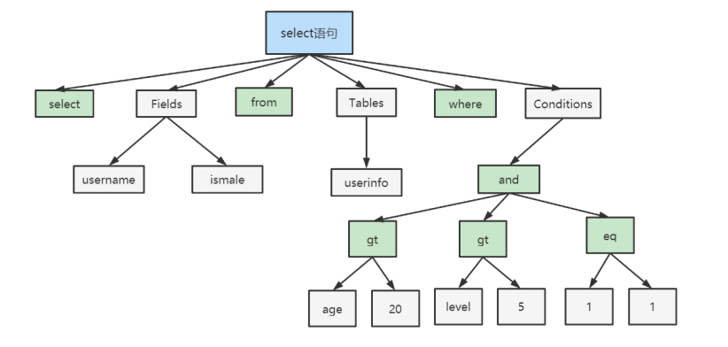
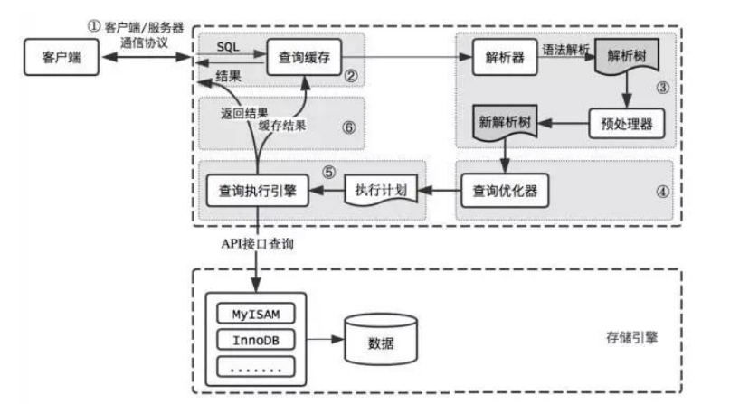

---

### （三）验证SQL执行原理

+ 我们可以使用代码对SQL执行流程进行查看与验证

~~~sql
  -- 查看是否开启profiling
  select @@profiling;  
  show variables like 'profiling';

  -- 如果是MySQL5.7，需要在配置文件内开启查询缓存配置，并重启服务使之生效
  -- 如果是MySQL8，此方式没有效果，且重启服务会失败，因为MySQL8.0不支持查询缓存
  [mysqld]
  query_cache_type=1

  -- 设置profiling，0代表关闭，1代表开启
  set profiling=1;
  -- 显示最近的几次查询
  show profiles;
  -- 显示上一次查询的详细步骤
  show profile;
  -- 使用profiles显示的查询的id来展示对应查询的详细步骤
  show profile for query 7;
  -- 展示更详细的步骤
  show profile cpu,block io for query 7;

~~~

+ 另外，SQL语句在语法层面的执行顺序为:
+ `FROM -> WHERE -> GROUP BY -> HAVING -> SELECT -> DISTINCT -> ORDER BY -> LIMIT`

---

### （四）数据库缓冲池

+ 我们的增删改查操作在最后都要与硬盘的数据库底层文件进行IO操作，与在内存中的操作相比，硬盘层面的IO操作更加的浪费时间，因此我们希望能尽量的减少IO带来的时间开销。
  + InnoDB存储引擎是以页为单位来管理存储空间的，**MySQL会申请占用内存来作为数据库缓冲池，将磁盘上的部分页缓存到内存中**，这样可以减少IO操作花费的时间并提高效率

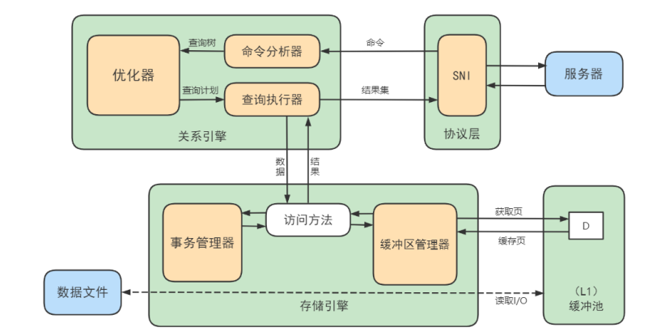

+ 以下是一些与缓冲池相关的操作:

~~~sql
  -- 查看缓冲池的总大小
  show variables like 'innodb_buffer_pool_size';
  -- 设置缓冲池大小，单位byte
  set global innodb_buffer_pool_size = 268435456;
  -- 使用配置文件配置缓冲池总大小
  [server]
  innodb_buffer_pool_size = 268435456
  -- 使用配置文件配置缓冲池实例数量
    -- 如果缓冲池总大小小于1Gb，MySQL会无视掉配置的缓冲池实例数量，强行配置实例为1个
  [server]
  innodb_buffer_pool_instances = 2
  -- 展示当前的缓冲池实例数量
  show variables like 'innodb_buffer_pool_instances';

~~~

---

### （五）存储引擎

+ 存储引擎就是表的存储方式，或者说是表的类型，它可以直接与底层的数据库文件交互并进行相关的SQL操作
+ 目前MySQL5.5之后，其默认的存储引擎变为了InnoDB，在此之前，其存储引擎是MyISAM
+ 有关存储引擎的相关SQL语句如下:

~~~sql
  -- 查看MySQL支持的所有存储引擎
  show engines;
  -- 查看当前默认的存储引擎
  show variables like '%storage_engine%';
  SELECT @@default_storage_engine;
  -- 设置默认存储引擎
  SET DEFAULT_STORAGE_ENGINE=MyISAM;
  -- 在配置文件内设置存储引擎
  [mysqld]
  default-storage-engine=MyISAM
  -- 建表时指定其存储引擎
  CREATE TABLE 表名(
    建表语句;
  ) ENGINE = 存储引擎名称;
  -- 修改表的存储引擎
  ALTER TABLE 表名 ENGINE = 存储引擎名称;

~~~

+ 下面介绍一些MySQL的存储引擎:
  + **InnoDB引擎**
    + MySQL从3.23.34a开始就包含InnoDB存储引擎。**大于等于5.5之后，默认采用InnoDB引擎**
    + InnoDB引擎支持事务，它被设计用来处理大量的短期(short-lived)事务。可以确保事务的完整提交(Commit)和回滚(Rollback)
    + 在以前的版本中，InnoDB引擎在存储表时会产生许多文件，MySQL8.0以后，这些存储信息被整合在了一个文件内
    + 它以索引来存储数据
    + 支持外键约束和事务，且可以上行锁
  + **MyISAM引擎**
    + 它是MySQL5.5之前的默认存储引擎
    + MyISAM引擎的访问速度快，但**不支持事务操作**
    + 该引擎在存储表时会产生三个文件:frm文件存储表结构，MYD存储数据，MYI存储索引
    + 不支持外键和事务，上的表锁
  + **Archive引擎**
    + 一般用于数据存档
    + 它仅能进行查询和插入操作，无法进行修改和删除操作
  + **Blackhole引擎**
    + 丢弃写操作，读操作会返回空内容
  + **CSV引擎**
    + 支持CSV数据格式，在底层以csv文件来存储内容
  + **Memory引擎**
    + 使用内存存储数据，但服务崩溃时数据会丢失，无法实现数据持久化存储。因此**它的数据易丢失，且生命周期短**
    + 支持哈希索引和B+树索引
    + Memory比MyISAM引擎更快
    + MEMORY表的大小是受到限制的。表的大小主要取决于两个参数，分别是max_rows和max_heap_table_size。其中，max_rows可以在创建表时指定；max_heap_table_size的大小默认为16MB，可以按需要进行扩大
  + **Federated引擎**
    + 是访问其他MySQL服务器的一个代理，尽管该引擎看起来提供了一种很好的跨服务器的灵活性 ，但也经常带来问题，因默认是禁用的
  + **Merge引擎**
    + 管理多个MyISAM表构成的表集合
  + **NDB引擎**
    + 也叫做NDB Cluster存储引擎，主要用于MySQL Cluster分布式集群环境，类似于Oracle的RAC集群

|对比项|MyISAM|InnDB|
|:---:|:---:|:---:|
|外键|不支持|支持|
|事务|不支持|支持|
|行表锁|表锁，即使操作一条记录也会锁住整个表，不适合高并发的操作|行锁，操作时只锁某一行，不对其它行有影响，适合高并发的操作|
|缓存|只缓存索引，不缓存真实数据|不仅缓存索引还要缓存真实数据，对内存要求较高，而且内存大小对性能有决定性的影响|
|自带系统表使用|Y|N|
|关注点|节省资源、消耗少、简单业务|并发写、事务、更大资源|
|默认安装|Y|Y|
|默认使用|N|Y|

|对比项|MyISAM|InnoDB|MEMORY|MERGE|NDB|
|:---:|:---:|:---:|:---:|:---:|:---:|
|存储限制|有|64TB|有|无|有|
|事务安全|×|√|×|×|×|
|锁机制|表锁|行锁|表锁|表锁|行锁|
|B树索引|√|√|√|√|√|
|哈希索引|×|×|√|×|√|
|全文索引|√|×|×|×|×|
|集群索引|×|√|×|×|×|
|数据缓存|×|√|√|×|√|
|索引缓存|仅缓存索引，不缓存真实数据|不仅缓存索引还要缓存真实数据，对内存要求较高，而且内存大小对性能有决定性的影响|支持|支持|支持|
|数据可压缩|√|×|×|×|×|
|空间使用|低|高|N/A|低|低|
|内存使用|低|高|中等|低|高|
|批量插入速度|高|低|高|高|高|
|支持外键|×|√|×|×|×|

---

## 四、索引

+ 如果没有索引，我们在查询数据时，要从头开始寻找并遍历每一个数据，从中筛选出满足我们条件的数据
+ 而有了索引，我们便可以根据索引，快速的得到我们想要的数据
+ **索引就是帮助MySQL高效获取数据的数据结构**

### （一）索引分类

+ MySQL的索引包括普通索引、唯一性索引、全文索引、单列索引、多列索引和空间索引等
  + 从功能逻辑上说，索引主要有 4 种，分别是普通索引、唯一索引、主键索引、全文索引
  + 按照物理实现方式，索引可以分为 2 种：聚簇索引和非聚簇索引
  + 按照作用字段个数进行划分，分成单列索引和联合索引

#### ①功能逻辑划分

|索引类型|描述|备注|
|:---:|:---:|:---:|
|普通索引|不附加任何条件，仅用于查询效率提升的索引，该类索引可以作用在任何类型的字段上|无|
|唯一性索引|可以使用唯一性约束来创建唯一性索引，唯一性索引允许有空值，但非空值必须是唯一的|无|
|主键索引|就是非空+唯一，一张表里最多只有一个主键索引，因为它由主键索引的物理存储实现方式决定，存储文件内的数据仅能按照一种顺序进行存储|无|
|单列索引|单列索引就是仅依据该字段的索引|无|
|多列/联合索引|就是依据多个字段的索引|无|
|全文索引|是目前搜索引擎的一种关键技术，查询数据量较大的字符串类型的字段时，使用全文索引可以提高查询速度|MySQL3.23.23版本时开始支持全文索引，但直到5.6.4版本前，仅MyISAM引擎支持。5.6.4后InnoDB也支持了，但不支持中文分词。5.7.6版本时MySQL内置了ngram全文解析器，用来支持亚洲语种的分词|
|空间索引|空间索引仅能作用于空间数据类型的字段上，目前仅MyISAM引擎支持，且索引的字段不能为空|无|

+ 另外，不同的存储引擎对不同的索引也有不同的支持能力:

|存储引擎|B+树索引|全文索引|哈希索引|
|:---:|:---:|:---:|:---:|
|InnoDB|√|√|×|
|MyISAM|√|√|×|
|Memory|√|×|√|
|NDB|×|×|√|
|Archive|×|×|×|

#### ②物理实现划分

##### Ⅰ聚簇索引

+ 优点:
  + 数据和索引保存在同一个B+树中，从聚簇索引中获取数据比非聚簇索引更快
  + 聚簇索引一般根据主键进行排序，对于主键的排序查找和范围查找速度非常快。
  + 按照聚簇索引排列顺序，查询显示一定范围数据的时候，由于数据都是紧密相连，数据库不用从多个数据块中提取数据，所以节省了大量的io操作
+ 缺点:
  + **插入速度严重依赖于插入顺序**，按照主键的顺序插入是最快的方式，否则将会出现页分裂，严重影响性能。因此，**对于InnoDB表，我们一般都会定义一个自增的ID列为主键**
  + **更新主键的代价很高**，因为将会导致被更新的行移动。因此，对于InnoDB表，我们一般定义主键为不可更新
  + 二级索引访问需要两次索引查找，第一次找到主键值，第二次根据主键值找到行数据
+ 特点:
  + 使用记录主键值的大小进行记录和页的排序，这包括三个方面的含义：
    + 页内的记录是按照主键的大小顺序排成一个单向链表
    + 各个存放用户记录的页也是根据页中用户记录的主键大小顺序排成一个双向链表
    + 存放目录项记录的页分为不同的层次，在同一层次中的页也是根据页中目录项记录的主键大小顺序排成一个双向链表

---

##### Ⅱ二级索引

+ 二级索引就是我们将排序的依据从主键改为其它字段
  + 由于索引的存在会占用额外的资源，因此我们需要确保二级索引仅留下能够实现该索引功能的数据，即将排序字段与主键数据留下，其它数据不要
  + 二级索引访问需要两次索引查找，由于我们为了减少二级索引的资源占用，仅摘取了一部分数据，因此我们仅能通过二级索引拿到对应数据的主键，还需要再去聚簇索引那里去拿取完整的数据

+ 联合索引
  + 联合索引实际上是二级索引的一种
  + 联合索引就是指定多个字段作为B+树排序的依据，来建立对应的索引
  + 联合索引虽然使用多个字段作为依据，但是实际上仅会生成一个B+树

---

### （二）索引实现

+ 这里主要讨论索引的相关实现方式，以及InnoDB索引结构，附带MyISAM索引结构

#### ①索引简易案例

+ 这里提供一个简易的小案例，来帮助我们理解索引的作用
+ 首先我们有一个表:

~~~sql
  CREATE TABLE index_demo(
  c1 INT,
  c2 INT,
  c3 CHAR(1),
  PRIMARY KEY(c1)
  ) ROW_FORMAT = Compact;  -- 指定该表使用Compact的行格式来存储数据
~~~

+ 我们这里来简化以下行格式，如下图所示:

+ 里面出现了两个表外的字段:
  + record_type:记录头信息的一项属性，0表示普通记录，1表示目录项记录，2表示最小记录，3表示最大记录
  + next_record:用来记录下一个数据项的偏移量，相当于链表的next指针
+ 我们先把一些数据放到表中:

+ 上面的情况是一个非常简单的示例，如果我们的数据变多，而InnoDB引擎使用页来存放数据，但InnoDB引擎一页是存不过来这么多数据的，因此就会导致出现多个页
  + **我们无需使这些页在内存中是连续的，我们只需要使它们在逻辑上是连续的，因此我们可以通过链表来连接这些页**
+ 为了方便数据的获取，我们需要以某种方式对这些数据进行排序，因此**每个页之间需要保证前面的页内存放的数据的排序权重小于后面的页存放的数据的排序权重，且同一个页内，前面数据的排序权重应小于后面数据的排序权重**
+ 但是即使这些页是有序的，我们依然无法知道我们想查找的数据范围究竟在哪些页中，因此我们还需要建立一个目录，该目录记录每个页的最小权重值的数据，并提供对应页的地址，方便快速定位，这样，我们通过查阅目录，就可以提高我们获取数据的效率了。**我们称这个目录为索引**

---

#### ②索引的迭代

+ 上面我们可以看到，我们为这些数据建立了目录，但是当数据太大的时候，我们的目录也会变得非常庞大，但我们还是想提高我们的性能
  + 因此我们需要把这些目录也分页，一页存放多个目录项，每个目录项之间使用链表进行连接
  + 这样我们就建立了多层的目录，为了进一步提高性能，只要我们的最上层目录的页数达到2层及以上，就向上层继续开辟一个新的目录，这样就形成了一个树状结构
  + 这样当我们查找时，从树的根节点向下查找，由于在每个页面内有所谓的Page Directory （页目录），所以在页面内也可以通过二分法实现快速定位记录，这样就提高了我们的查找效率
  + 另外，我们要**让每一层的页都用双向链表连接起来**，但页内的数据项或目录项是单向链表连接的
  + 最终的情况就如下图所示:

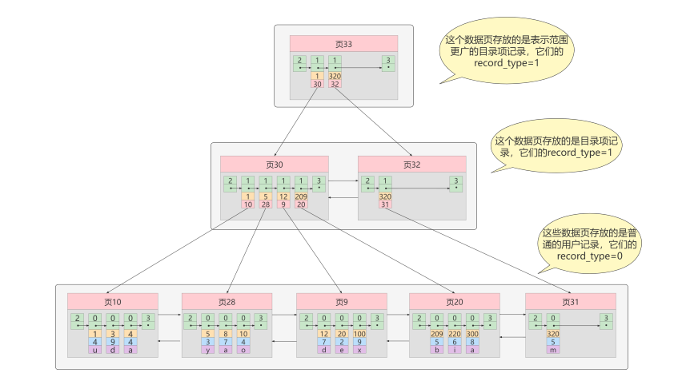

+ **基于这种思想所形成的树状数据结构，我们称为B+树**
  + 一般情况下，我们的B+树都不会超过4层
  + 原因:假设所有存放用户记录的叶子节点代表的数据页可以存放100条用户记录 ，所有存放目录项记录的内节点代表的数据页可以存放1000条目录项记录
    + 如果B+树只有1层，也就是只有1个用于存放用户记录的节点，最多能存放 100 条记录
    + 如果B+树有2层，最多能存放 1000×100=10,0000 条记录
    + 如果B+树有3层，最多能存放 1000×1000×100=1,0000,0000 条记录，这里已经最多有一亿条记录了
    + 如果B+树有4层，最多能存放 1000×1000×1000×100=1000,0000,0000 条记录。相当多的记录

---

#### ③实现方式

+ 索引的实现方式主要就两种:Hash结构与树

##### Ⅰ全表遍历

+ 简单粗暴，就是遍历

---

##### ⅡHash结构

+ 根据哈希算法，计算数据对应的哈希值，存到数组中
+ 时间复杂度极低，为O(1)，但操作空间有限，仅能应付与等值相关的操作（等于、不等于和in判断），且无法进行范围查询，因为存储在Hash结构中的数据是无序的

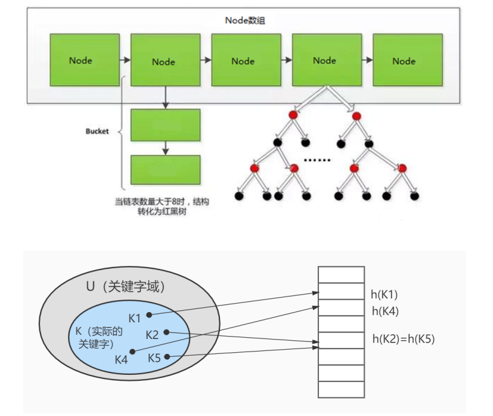

+ 目前仅Memory引擎支持，MyISAM和InnoDB都是不支持的
  + 虽然InnoDB不支持，但是它有自适应Hash索引:

---

##### Ⅲ二叉搜索树与AVL树

+ 二叉搜索树的结构就是，每个结点的左节点都比它小，每个结点的右节点都比它大，且每个结点的所有后代左树节点全比它小，每个结点的所有后代右树节点全比它大
  + 在极端情况下，二叉搜索树会成为链表
  + 如果我们对这些树加以限制，限制它们各叶子节点深度差不超过1，这就形成了AVL（平衡二叉）树

+ 为了降低我们IO的次数，我们需要增加节点的分叉，这样可以使树的深度变小。例如，一张表有31行数据，我们使用二叉搜索树，深度是5，如果我们改用三叉的，那么深度会变为4，这样就减少了对底层磁盘文件的IO

---

##### ⅣB树

+ B树是对二叉搜索树的一种改进，它有如下特点:
  + 根节点的儿子数的范围是 [2,M]。
  + 每个中间节点包含 k-1 个关键字和 k 个孩子，孩子的数量 = 关键字的数量 +1，k 的取值范围为[ceil(M/2), M]。
  + 叶子节点包括 k-1 个关键字（叶子节点没有孩子），k 的取值范围为 [ceil(M/2), M]
  + 假设中间节点节点的关键字为：Key[1], Key[2], …, Key[k-1]，且关键字按照升序排序，即 Key[i] < Key[i+1]。此时 k-1 个关键字相当于划分了 k 个范围，也就是对应着 k 个指针，即为：P[1], P[2], …,P[k]，其中 P[1] 指向关键字小于 Key[1] 的子树，P[i] 指向关键字属于 (Key[i-1], Key[i]) 的子树，P[k]指向关键字大于 Key[k-1] 的子树
  + 所有叶子节点位于同一层

+ 从上图中我们可以看出，如果我们想查找一定范围内的值，我们无法全都定位到叶子节点去找，因为有的数据在非叶子节点中也存在，这样会导致我们查询的效率不是很稳定
+ 但B树已经相对于平衡二叉树来说，IO操作减少了

---

##### ⅤB+树

+ B+树是MySQL默认的索引结构
+ B+树的特点如下:
  + 有 k 个孩子的节点就有 k 个关键字。也就是孩子数量 = 关键字数，而 B 树中，孩子数量 = 关键字数+1
  + 非叶子节点的关键字也会同时存在在子节点中，并且是在子节点中所有关键字的最大（或最小）
  + 非叶子节点仅用于索引，不保存数据记录，跟记录有关的信息都放在叶子节点中。而 B 树中，非叶子节点既保存索引，也保存数据记录
  + 所有关键字都在叶子节点出现，叶子节点构成一个有序链表，而且叶子节点本身按照关键字的大小从小到大顺序链接
+ 与B树相比
  + B+树**查询效率更稳定**，B+树每次都需要访问到叶子节点才能确认找到数据
  + B+树的**查询效率更高**，因为B+树通常比B树分叉更多
  + B+树的**查询范围也比B树高**，因为B+树只要找到叶子节点，由于叶子节点之间存在指针，我们就可以顺着指针一个个递增的向下找。但B树需要进行中序遍历，才能完成范围的查找
  + 不过B树和B+树各有各的应用场景，不能完全说B+树就是比B树好
+ **注意**:
> + InnoDB引擎在生成B+树索引时，它不是自底向上生成的，**它是从上向下生成的**:
>   + 最开始生成一个根节点，如果有数据，就向里添加
>   + 当一页存不了这么多数据时，它会创建一个新的页A，把根节点中的所有数据都放进新创建的页A，接下来再创建一个新的页B，将要添加的数据放进新页B（这里说的是聚簇索引），之后在根节点生成两个页的目录项
>   + 当一个根节点存不了这么多目录项时，它会再创建一个新的页C，将当前根节点的所有目录项数据放入新页C中，再创建一个新页D，将多余的目录项放入新页D，之后在根节点生成这些目录项的目录项
>   + 以此类推，它体现了InnoDB引擎的B+树索引的**根位置永远不动**的特性
> + InnoDB在生成B+树时，假设这样一种情况:
>   + 我们有两个目录项，它们的对应字段值都是相同的，也就是说，比如一页能存放100条数据，正好有101条数据的对应字段值全都是一样的，那么这两条目录项所用来标识的值就是完全一致的，但它们都指向两个不同的页
>   + 当我们想插入一条数据时，比如这条数据也与该字段值相同，那么InnoDB就不知道怎么办了
>   + 为了解决这一问题，InnoDB规定，**所有的B+树索引的目录项记录必须是唯一的**。为了实现该要求，我们可以把对应数据项的主键也取出来，放入目录项记录中，主键一定非空且必定不重复，因此保证了记录项的唯一性
>   + 如果我们没有指定某一张表的主键，MySQL会自动生成一个隐藏主键，该主键是长整数类型，占用6个字节
> + 另外，InnoDB规定**一个页面必须至少存储两条记录**
>   + 这很好理解，如果一个页面只能存储一条记录，那么树形结构无法起到“总结数据”的作用，导致我们白白浪费了资源，而且还降低了效率

---

##### ⅥR树

+ R-Tree在MySQL很少使用，仅支持 geometry数据类型
  + 支持该类型的存储引擎只有myisam、bdb、innodb、ndb、archive几种。
  + 举个R树在现实领域中能够解决的例子：查找20英里以内所有的餐厅。
    + 在没有R树的情况下我们会把餐厅的坐标(x,y)分为两个字段存放在数据库中，一个字段记录经度，另一个字段记录纬度。这样的话我们就需要遍历所有的餐厅获取其位置信息，然后计算是否满足要求。如果一个地区有100家餐厅的话，我们就要进行100次位置计算操作了，如果应用到谷歌、百度地图这种超大数据库中，这种方法便必定不可行了。
    + R树就很好的 解决了这种高维空间搜索问题 。它把B树的思想很好的扩展到了多维空间，采用了B树分割空间的思想，并在添加、删除操作时采用合并、分解结点的方法，保证树的平衡性。因此，R树就是一棵用来 存储高维数据的平衡树 。相对于B-Tree，R-Tree的优势在于范围查找。

---

#### ④MyISAM引擎索引结构

+ 如图所示:

+ 如果建立一个二级索引，那么结构变为:

+ MyISAM引擎的索引需要回表，回表就是通过索引得到的并不是对应的数据，而是关于该数据的直接“线索”，存储引擎还需要通过该“线索”来得到对应的数据，也就是说，他还需要再去表里找一遍，这个再找一遍的操作，叫做回表。

|对比项|MyISAM|InnoDB|
|:---:|:---:|:---:|
|索引方式|非聚簇|包含一个聚簇|
|回表|全部需要回表|二级索引需要回表|
|索引与数据|文件分离|其数据文件本身就是索引文件|
|目录项指针指向|地址|主键|
|回表操作速度|根据地址直接定位数据，快速|根据主键还要查找一遍数据，较慢|
|主键要求|无要求|必须要有主键|

---

### （三）索引管理

#### ①索引的创删查

+ 索引有两种创建方式:
  + 创建表的时候创建，可以通过在字段上声明一些约束，或者在字段最后手动指定来创建
  + 在已存在的表上创建索引,可以通过ALTER关键字或者CREATE关键字创建
  + 被主键约束、唯一性约束和外键约束声明的字段，MySQL会为其自动创建对应的索引
+ 索引的删除也有两种删除方式:
  + 使用ALTER关键字删除
  + 使用DROP关键字删除

+ 下面是索引的具体SQL语句:

~~~sql
  CREATE TABLE table_name (
    字段声明 [约束]  -- 主键、非空等约束一旦作用在字段上，MySQL就会自动生成其字段索引
    ...
    -- UNIQUE、FULLTEXT、SPATIAL分别表示非空、全文和空间索引，如果想创建普通索引，不用写这些项
    -- INDEX和KEY的意义是相同的，都是起声明索引的作用
    -- index_name表示索引名
    -- col_name表示索引排序所依据的字段名，length是可选项，用来表示该索引仅记录此字段的前length个字符组成的字符串，一旦声明了该部分，就意味着该索引是前缀索引。只有字符串类型的字段才能选择length。如果索引依据的字段有多个，那么各字段之间使用逗号隔开
    -- ASC和DESC表示该字段按照什么方式进行排序，降序索引是MySQL8.0才开始支持的
    [UNIQUE | FULLTEXT | SPATIAL] [INDEX | KEY] [index_name] (col_name [length]) [ASC | DESC]
  )

  -- 使用ALTER关键字进行索引的创建
  ALTER TABLE table_name
  ADD [UNIQUE | FULLTEXT | SPATIAL] [INDEX | KEY] [index_name] (col_name[length],...) [ASC | DESC] [,table_name (col_name[length],...) [ASC | DESC] ,...]

  -- 使用CREATE关键字进行索引的创建
  CREATE [UNIQUE | FULLTEXT | SPATIAL] INDEX index_name ON table_name (col_name[length],...) [ASC | DESC] [,table_name (col_name[length],...) [ASC | DESC] ,...]

  -- 使用ALTER关键字删除索引
  ALTER TABLE table_name DROP INDEX index_name;

  -- 使用DROP删除索引
  DROP INDEX index_name ON table_name;

  -- 查看指定表的索引
  show index from table_name;

~~~

+ [索引样例](../源码/MySQL/索引.sql)
+ 注意:
> + **如果我们删除了对应表的列，如果该列是索引的依据，那么索引内的依据也会被同步删除**
> + 如果使用了全文索引，那么使用`SELECT * FROM 表名 WHERE MATCH(字段1,字段2) AGAINST (‘查询字符串’);`的语句可以比like语句块数倍，但是存在查询精度问题，可能不能完整的查询到对应要求的值

---

#### ②索引的新特性

+ MySQL8.0开始**支持降序索引**，在此之前，索引仅支持升序
+ 另外，MySQL8.0还**支持了隐藏索引**
  + 当我们想删除某一索引时，我们如果贸然删掉它，就回复不过来了，但删掉他如果导致了一些问题，那可能就会造成非常严重的损失
  + MySQL提供的隐藏索引的作用就是让我们在真正删除某一索引前，先**让它隐藏，导致MySQL的优化器监测不到它，使得当前的程序就相当于删除了该索引，从而使SQL语句在执行时不会使用到该索引**。方便我们进行索引删除后的副作用效果测试。如果没问题的话，我们再删除它，否则不删除
  + 即使索引是隐藏的，但是**如果数据发生变动，它依然会同步更新**
  + 另外，MySQL又提供了一项配置，让我们的优化器能够在索引隐藏时能够检测到它

~~~sql

  -- 建表时就指定该索引是隐藏的
  CREATE TABLE tablename(
    propname1 type1[CONSTRAINT1],
    propname2 type2[CONSTRAINT2],
    ……
    propnamen typen,
    INDEX [indexname](propname1 [(length)]) INVISIBLE  -- 在建表时使用invisible指定索引的隐藏
  );

  -- 在CREATE关键字下使用INVISIBLE指定索引隐藏
  CREATE INDEX indexname ON tablename(propname[(length)]) INVISIBLE;  
  -- 在ALTER关键字下使用INVISIBLE指定索引隐藏
  ALTER TABLE tablename
  ADD INDEX indexname (propname [(length)]) INVISIBLE;

  -- 切换隐藏索引
  ALTER TABLE tablename ALTER INDEX index_name INVISIBLE;
  ALTER TABLE tablename ALTER INDEX index_name VISIBLE;
  -- 查看查询优化器的开关设置，其中use_invisible_indexes项表示的是查询优化器的开关，如果改成ON，那么就说明隐藏索引对查询优化器可见，为OFF说明不可见
  select @@optimizer_switch \G;
  -- 设置optimizer_switch字段，来打开该配置的开关
  set session optimizer_switch="use_invisible_indexes=on";  

~~~

---

#### ③索引的创建原则

+ 推荐的索引原则如下:
  + **字段数值有唯一性的限制**适合创建索引:因为是唯一的，把他们变得有序便于提高查找效率
  + **频繁作为WHERE子句的查询条件的字段**适合创建索引:一直用一直查，建索引查的效率更快
  + **经常ORDER BY和GROUP BY的字段**适合创建索引:ORDER BY可以通过索引快速的得到结果，否则MySQL默认的外部排序效率较低。GROUP BY的字段是需要分组的，而我们建立了索引更利于GROUP BY作用的字段的查找
  + **UPDATE和DELETE的WHERE子句条件列**适合创建索引:一直用一直查，查的快效率肯定高
  + **DISTINCT字段**适合创建索引:索引是有序的，因此去重比较方便
  + **多表连接操作时，两表的连接字段和WHERE条件字段**适合创建索引:两表连接时，连接字段会频繁查询，加索引来提高查询效率。WHERE条件也一样
  + **使用类型小的列创建索引**:索引的列最好字段范围小，这样浪费的空间比较少，能够提高索引更新的效率
  + **使用字符串前缀创建索引**:字符串有的时候会很长，但是我们不想浪费多余的资源，因此需要使用字符串的前缀来创建索引，但是使用什么长度是个问题。我们可以利用公式(count(distinct 字段)/count(*))来判断，当该指标大于0.9的时候，差不多就行了。一般20长度就行
  + **区分度高的列适合创建索引**:上面那个公式就是区分度高的
  + **使用最频繁的列放到联合索引的左侧**:因为使用频繁所以要放到排序优先级最高的最左边
  + **多个字段都需要创建索引时，联合索引优于单值索引**:是这样的
  + **删除不再使用或者很少使用的索引**:删掉可以节省资源
+ 不推荐的索引原则如下:
  + **在where中使用不到的字段，不要设置索引**:都用不到肯定就不创建索引了
  + **数据量小的表最好不要使用索引**:这样没什么区别，还浪费了资源
  + **有大量重复数据的列上不要建立索引**:这数据太重复了，一抓一大把，不用 
  + **避免对经常更新的表创建过多的索引**:经常更新，导致索引也经常更新，可能会降低表的更新速度。他其实有两层含义，频繁更新的字段不一定要创建索引，以及表上不建议有太多的索引
  + **不建议用无序的值作为索引**:不建议
  + **不要定义冗余或重复的索引**:多个字段都需要创建索引时，联合索引优于单值索引
+ 杂项:
  + **前缀索引索然能够提升性能，但是就无法使用索引覆盖这一特性了**

---

## 五、InnoDB

+ 由于MySQL默认的存储引擎是InnoDB引擎，因此这里着重描述InnoDB的数据存储结构

### （一）页

+ 在数据库中，**数据库管理存储空间的基本单位是页，数据库进行I/O操作的基本单位也是页**
  + 我们的记录是按照行来存储的，但是**数据库的读取不是以行为单位的**，否则每次IO就读取一行数据，效率会极低
+ InnoDB引擎存储数据时，会将这些数据以页的形式保存在文件内
  + 在MySQL中，一页的大小是16kb（InnoDB默认），不同的DBMS，它们的页大小也不同
+ 数据页被划分为如下七个区域:
  + 文件头
  + 页头
  + 最大最小记录
  + 用户记录
  + 空闲空间
  + 页目录
  + 文件尾

|区域|占用空间(Byte)|作用|备注|
|:---:|:---:|:---:|:---:|
|文件头(File Header)|38b|无|
|页头(Page Header)|56b|无|
|最大最小记录(infimum+supremum)|26b|无|
|用户记录(User Records)|不确定|无|
|空闲空间(Free Space)|不确定|无|
|页目录(Page Directory)|不确定|无|
|文件尾(File Tailer)|8b|无|

#### ①文件头部与尾部

+ 文件头部用来**描述页的通用信息**
+ 文件头部又被许多字段组成:

|名称|占用空间(Byte)|作用|备注|
|:---:|:---:|:---:|:---:|
|FIL_PAGE_OFFSET|4|页的唯一标识|无|
|FIL_PAGE_TYPE|2|当前页的类型|无|
|FIL_PAGE_PREV|4|上一个页的地址|无|
|FIL_PAGE_NEXT|4|下一个页的地址|无|
|FIL_PAGE_SPACE_ON_CHKSUM|4|页的校验和|用于校验是否与内存数据同步|
|FIL_PAGE_LSN|8|页面被修改时最后对应的日志序列位置|无|
|FIL_PAGE_FILE_PLUSH_LSN|8|仅在系统表空间的一个页内定义，代表文件至少被刷新到了对应的LSN值|无|
|FIL_PAGE_ARCH_LOG_NO_OR_SPACE_ID|4|页属于哪个表空间|无|

|FIL_PAGE_TYPE字段|十六进制表示|作用|备注|
|:---:|:---:|:---:|:---:|
|FIL_PAGE_TYPE_ALLOCATED|0x0000|最新分配，还没使用|无|
|FIL_PAGE_UNDO_LOG|0x0002|Undo日志页|无|
|FIL_PAGE_INODE|0X0003|段信息节点|无|
|FIL_PAGE_IBUF_FREE_LIST|0x0004|insert buffer空闲列表|无|
|FIL_PAGE_IBUF_BITMAP|0x0005|insert buffer位图|无|
|FIL_PAGE_TYPE_SYS|0x0006|系统页|无|
|FIL_PAGE_TYPE_TRX_SYS|0x0007|事务系统数据|无|
|FIL_PAGE_TYPE_FSP_HDR|0x0008|表空间头部信息|无|
|FIL_PAGE_TYPE_XDES|0x0009|扩展描述页|无|
|FIL_PAGE_TYPE_BLOB|0x000A|溢出页|无|
|FIL_PAGE_INDEX|0x45GF|索引页，即数据页|

+ 校验和，是经过某种算法，将很长的字节串转变为一个比较短的值，这个比较短的值是校验和
  + 页的头部和尾部都有校验和字段，如果他们相等，那么说明值是同步的。如果不相等，说明内存中的数据在更新到硬盘时，出现了问题，导致数据的不同步
  + 它的作用就是，在内存中的数据更新后，MySQL会更新加载进内存中的页的校验和的值，使其与磁盘中的页的校验和值不同。这样，在内存中的数据更新磁盘中的页数据时，如果出现了故障导致更新进行到一半，就会使得磁盘中的页文件内的头部和尾部的校验和值不同，从而使MySQL和我们能够判断出来该页数据出现了不同步
+ 同理，FIL_PAGE_LSN也在首尾都存在，它也是用来校验页是否同步的，即校验数据完整性

---

#### ②空闲空间、最大最小记录与用户记录

+ 用户记录用来记录我们数据库的数据，它的数据存储主要通过行格式的记录头信息来实现
  + 记录头信息的字段如下:

|字段名|大小(bit)|作用|备注|
|:---:|:---:|:---:|:---:|
|预留位1|1|没有使用|无|
|预留位2|1|没有使用|无|
|delete_mask|1|标记该记录是否被删除，1表示被删除，0表示未删除|无|
|min_rec_mask|1|B+树索引的每层非叶子节点中的最小记录都会添加该标记|无|
|n_owned|4|表示当前记录所拥有的记录数|无|
|heap_no|13|表示当前记录在记录堆的位置信息|无|
|record_type|3|当前记录的类型，0表示普通记录，1表示B+树非叶子节点记录，即目录项，2表示最小记录，3表示最大记录|无|
|next_record|16|表示下一条记录相对于本记录的相对位置|无|

+ 记录头信息解释:
  + delete_mask用来标记该记录是否被删除，它实际上并不会从磁盘中删除文件，而是只是把该记录的该字段记为1
    + 如果一个页内删的较多，MySQL会为这些记录单独组成一个链表。便于之后有数据插入时，使用这些已经被“删除”的记录空间
  + min_rec_mask字段用来记录B+树索引的每层非叶子节点中的最小记录，即**标记每个页的目录项的最小记录**，数据项都是0，因为他们所在的页是叶子节点
  + heap_no字段用来表示当前记录在记录堆的位置信息，即**表示记录在页内的位置**，0和1已经被占用了，这是因为MySQL会为每个页都自动创建一个最大记录和最小记录，最小记录是0，最大记录是1，因此我们手动添加的记录从2开始
+ 最小记录和最大记录都占用13字节，其中包括5字节的记录头信息和8字节的固定部分，它们用来指向当前页中的最小记录和最大记录。**这两个记录是MySQL自动创建的**，不是我们手动创建的
+ 空闲空间就是还剩下多少空间

---

#### ③页目录与页面头部

+ 页目录会对一个页内的记录进行分组
  + 最小记录单拎出来一组,我们称这些组叫slot（槽）
  + 后面的记录加上最大记录，依次进行分组，每组包含4-8个记录，最后一组包含1-8个记录
  + 将每个组中最大的值抽取出来，组成连续的数组，数组中的每个元素用来记录该值所在的组
  + 这样我们就能在IO操作到叶子结点的时候进行二分查找了，先二分查找数组，再查找对应的组，节省了时间并提高了效率
+ 分组的详情:
  + 首先，一个页默认只有最小记录和最大记录，最小记录自己是一组
  + 插入时，数据记录与最大记录一起组成另一组，这样就有了两组，这种情况会持续到页内一共有9个记录（包括最大、最小记录）
  + 当我们尝试插入第8个记录时（之前共有9个记录，去掉最大、最小记录就是7个，即我们此前插入了7个记录），由于超过了一组的最大限制，先进行插入，直接将有9条记录的组平均分开，一个组4个记录，另一个组5条记录
  + 之后插入时，向有5条记录的组插入，如果超限，再重复上面的操作
+ 页面头部详细的描述了页的状态，它占有56个字节的固定长度

|字段|占用大小|作用|备注|
|:---:|:---:|:---:|:---:|
|PAGE_N_DIR_SLOTS|2字节|在页目录中的槽数量|无|
|PAGE_HEAP_TOP|2字节|还未使用的空间最小地址，也就是说该地址之后就是Free Space|无|
|PAGE_N_HEAP|2字节|本页中记录的数量（包括最大、最小记录以及标记为删除的记录）|无|
|PAGE_FREE|2字节|第一个已经标记为删除的记录地址|无|
|PAGE_GARBAGE|2字节|已删除记录的占用的字节数|无|
|PAGE_LAST_INSERT|2字节|最后插入的记录的位置|无|
|PAGE_DIRECTION|2字节|记录插入的方向|无|
|PAGE_N_DIRECTION|2字节|记录连续向某一方向插入的次数|无|
|PAGE_N_RECS|2字节|该页中记录的数量（不包括最大、最小记录以及标记为删除的记录）|无|
|PAGE_MAX_TRX_ID|8字节|修改当前页的最大事务ID，该值仅在二级索引中定义|无|
|PAGE_LEVEL|2字节|当前页在B+索引中所处的层级|无|
|PAGE_INDEX_ID|8字节|索引ID,表示当前页属于哪个索引|无|
|PAGE_BTR_SEG_LEAF|10字节|B+树索引叶子段的头部信息，仅在B+树的Root页定义|无|
|PAGE_BTR_SEG_TOP|10字节|B+树索引非叶子段的头部信息，仅在B+树的Root页定义|无|

---

#### ④隐藏字段

+ 对于InnoDB引擎来说，每个行记录除了记录本身的数据之外，还有几个隐藏的列:
    + DB_ROW_ID:没有显式的提供主键时，该字段会被自动添加作为主键
    + DB_TRX_ID:事务的ID号，当该行记录被对应事务修改时，其事务id就会被该字段记录
    + DB_ROLL_PTR:回滚指针，指向undo log的指针，每次对某条聚簇索引记录进行改动时，都会把旧的版本写入到 undo日志 中，然后这个隐藏列就相当于一个指针，可以通过它来找到该记录修改前的信息

---

### （二）行格式

+ MySQL的数据以行为单位向表中插入，这些行在磁盘上的存放方式被称为行格式
+ MySQL有如下行格式，其中默认的行格式是Compact:
  + Compact
  + Redundant
  + Dynamic
  + Compressed
+ 下面是关于行格式的一些SQL语句

~~~sql
  -- 查看默认的行格式
  select @@innodb_default_row_format;

  -- 查看指定表的状态，这些状态中可以查看当前表的行格式
  show table status like 'mybatis_emp' \G;

~~~

#### ①Compact行格式

+ Compact是最经典的行格式，它包括
  + 变长字段长度列表:该列表按照与表结构中定义的字段相反的方向来表示该行的指定字段占用多少大小
  + NULL值列表:该列表也是按照与表结构中定义的字段相反的方向来表示当前行的字段是否是NULL,1表示是NULL,0表示不是NULL。如果该字段已经明确了不是NULL了，比如有主键约束或非空约束，它不会被表示（即不会在字节码文件中出现）。
  + 记录头信息:对于数据的一些描述，详情见[此处](#userData)
  + 真实数据:我们添加的真实数据

---

#### ②Dynamic与Compressed行格式

+ Dynamic与Compressed行格式与Compact行格式基本上没有什么太大区别，就是在处理行溢出问题上有不同的解决方案
  + 首先认识一下什么是行溢出:
    + 我们在声明一个字段时，如果声明VARCHAR类型，从理论上来说，VARCHAR是支持65536字节的，因此我们完全可以设置该字段最大就占用65536字节
    + 但是，当我们这样写的时候，就会报错:

~~~sql
  create table if not exists test2(
    name varchar(65535)
  );
~~~
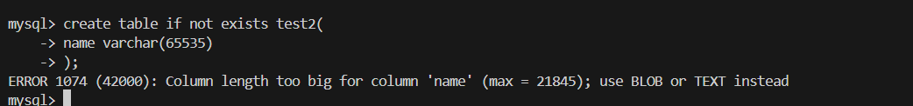

    + 这里解释为什么不行:1.我们在varchar内写的是字符数量而不是字节数量，这就意味着设置同样的varchar，如果字符集不同，那么该字段占用的内存也不同 2.我们的字段需要一些内存来表示它当前字段的长度，如果想表示65535字节，需要16bit，也就是需要2字节
    + 现在让我们来改进一下代码:

~~~sql
  create table if not exists test2(
    name varchar(65533)
  ) CHARSET=ascii;
~~~

    + 然后它就报错了:

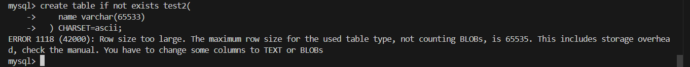

    + 继续解释:我们的字段还需要1bit来判断它是否是空值，因此我们需要将其设置为65532或增加非空约束或主键约束:

~~~sql
  create table if not exists test2(
    name varchar(65533) not null
  ) CHARSET=ascii;
~~~

  + 现在我们已经认识了行溢出，现在描述Compact与Redundant对行溢出的处理方式:
    + 很简单，就是分多个页来存储该段数据
    + 另外，在记录的真实数据处分出20字节来存储指向存储这些数据的页的地址，并存储每个页存储的数据量
  + 而Dynamic与Compressed对于行溢出的处理是:
    + 直接将移除的字段都装在一个页里面
    + 另外，在数据页中分出20字节，存放储存溢出数据的页的地址

---

#### ③Redundant行格式

+ Redundant行格式的开头并没有变长字段长度列表以及NULL值列表，但是多了一个字段长度便宜列表。虽然它东西少了，但是它变冗余了。因为没有变长字段长度列表和NULL值列表意味着它所有的字段长度和NULL值都要表示，会变得冗余
+ 另外，其记录头信息并不包含record_type项，取而代之的是n_field和1byte_offs_flag两个字段

---

### （三）区、段、碎片区与表空间

+ 对于数据页来说，它有三种方式被加载
  + 内存加载:如果数据页被缓存在了内存中，那么直接从内存进行加载
  + 随机加载:在磁盘上进行扫描，寻找该页，找到后进行加载，并将其缓存到内存中去
  + 顺序读取:如果我们请求的数据**在物理上是连续的**，我们就可以批量的读取数据，从而大大降低每想加载一个页就要去磁盘上查找花费的时间。且**顺序读取可以让我们批量的读取数据**

+ **区**:
  + 在没有区的时候，我们的页使用链表进行连接，但是链表是逻辑连续的，导致两个页之间可能相距很远，导致磁盘扫描浪费的时间很多
  + **区就是物理位置上连续的64个页**，它保证了页的物理连续，从而方便我们进行顺序读取
  + 当表中数据量大的时候，为每个索引分配空间的时候就不会以页为单位分配了，而是会变为以区为单位分配。虽然这可能会导致空间的浪费（数据无法填满整个区），但是效率有很大提高
+ **段**:
  + 我们的B+树索引，是有叶子节点和非叶子节点的，如果我们在向区内分配页时不加以区分两者，那么目录页和数据页将会杂乱的分布在一个区内，导致顺序读取的效率大打折扣。因此,InnoDB引擎对叶子节点和非叶子节点进行了区别对待。叶子节点有自己的区，非叶子节点也有自己的区
  + **存放叶子节点的区的集合就是段**，段是逻辑上连续的概念，InnoDB的一个索引会生成两个段，一个是叶子节点段，一个是非叶子节点段
  + 除上面两个段外，InnoDB引擎还有为一些特殊的数据而定义的段，像回滚段、数据段、索引段等。数据段就是叶子节点段，索引段即为非叶子节点段
  + InnoDB的段管理是引擎自己完成的，DBA不能也没有必要对其加以控制，这从一定程度上简化了DBA对于段的管理
+ **碎片区**:
  + 我们的表，如果即使仅存储十几条数据的话，就要申请一个包含64个页的区，那么对存储空间的浪费是巨大的
  + 为了解决该问题，InnoDB提供了碎片区。碎片区内的64个页并不是仅被一个表占用，可能有10个被A表占用，有10个被B表占用...
  + 但是这样会导致碎片区的归属问题，InnoDB直接就让碎片区直属于表空间了
  + 如果我们的表比较小时，数据较少，他会先申请碎片区的页来存储其数据。当它的数据量逐渐增大时，增大到占用了32个页，即相当于一半的区时，它会再申请一个完整的区存储其数据
+ **表空间**:
  + 表空间可以看作是InnoDB存储引擎**逻辑结构**的最高层，所有数据都存放在表空间内
  + **表空间是一个逻辑容器**，表空间存储的对象是段，一个表空间可以有多个段，但是一个段仅能属于一个表空间。
  + 表空间从管理上可以分为:
    + 独立表空间:每张表都有其独立的表空间，其空间可以回收，碎片不太影响性能，且可以在不同的数据库之间进行迁移
    + 系统表空间:系统表空间在一个MySQL进程中仅有一个，它额外记录了一些有关整个系统信息的页面，但用户并不能访问这些表，只能去底层文件查看
      + MySQL在information_schema系统数据库中提供了一些以innodb_sys开头的表，这些表是通过读取系统表中的数据，然后填充到自己表内的，并不是真正的系统表。它的目的是为了向用户提供一些系统表的内容，便于大家分析一些问题
      + 系统表即数据字典，我们在执行插入操作时，MySQL收到SQL语句并解析后，他需要找到要插入的表的索引的跟页面在哪个表空间的哪个页中，然后通过根页面找到要插入的地方，插入到B+索引树中。因此**MySQL在执行SQL相关操作时，还需要保存一些其他数据，这些数据被称为元数据，而这些数据被存储在了系统表内**
    + 撤销表空间
    + 临时表空间

~~~sql
  -- 查看表空间类型，如果出现innodb_file_per_table对应的Value是on，那么说明开启了独立表空间，且说明每张表都会单独创建一个idb文件
  show variables like 'innodb_file_per_table';
~~~

---

## 六、性能分析与调优

### （一）性能分析

#### ①调优步骤

+ 我们调优的步骤如下图所示:
  + 其中，被S标记的部分需要使用对应的分析工具进行分析
  + 被A标记的部分说明我们可以在此处采取一些行动来进行优化

#### ②性能参数

+ 在MySQL中，可以使用`SHOW STATUS`语句查询一些MySQL数据库服务器的性能参数、执行频率
  + 以下是一些常用的性能参数:

|性能参数|描述|备注|
|:---:|:---:|:---:|
|Connections|连接MySQL服务器的次数|无|
|Uptime|MySQL服务器的上线时间|无|
|Slow_queries|慢查询的次数|无|
|last_query_cost|统计SQL查询成本，其返回值描述使用样例说明:查询结果返回100条数据，这100条数据分别来自三个不同的页，因此返回3|无|
|Innodb_row_read|Select查询返回的次数|无|
|Innodb_row_inserted|执行INSERT操作插入的行数|无|
|Innodb_rows_updated|执行UPDATE操作更新的行数|无|
|Innodb_rows_deleted|执行DELETE操作删除的行数|无|
|Com_select|查询操作的次数|无|
|Com_insert|插入操作的次数|无|
|Com_update|更新操作的次数|无|
|Com_delete|删除操作的次数|无|

+ 查看性能参数的SQL语句:

~~~sql
  SHOW [GLOBAL|SESSION] STATUS LIKE '参数';
~~~

---

#### ③慢查询日志

+ 慢查询日志主要用来记录慢查询的相关信息，我们可以从这里得到慢查询的相关SQL语句、慢查询的条数等
+ 慢查询日志的相关SQL语句如下:

~~~sql
  -- -- 查询慢查询目录相关信息
  show variables like '%slow_query_log%';  -- 查看慢查询日志信息
  SHOW VARIABLES LIKE '%slow%'; -- 查询慢查询日志所在目录
  SHOW VARIABLES LIKE '%long_query_time%'; -- 查询超时时长
  -- 开启慢查询日志
  set global slow_query_log='ON';

  -- 查看慢查询时间阈值，超过该值时，该查询会被记录为慢查询
  show variables like '%long_query_time%';
  -- 手动设置该时间阈值，它的global和session都有该变量，因此都要设置上
  set global long_query_time = 1;
  set long_query_time=1;
  -- 查询当前的慢查询数量
  SHOW GLOBAL STATUS LIKE '%Slow_queries%';

  -- 关闭慢查询日志
    -- 通过配置文件关闭，需要重启服务
    [mysqld]
    slow_query_log=OFF  -- 或者把它注释掉
    -- 运行时关闭
    SET GLOBAL slow_query_log=off;
  
  -- 删除慢查询日志
  -- 一旦执行了该命令，慢查询日志将被删除，并在数据目录下重新生成新的慢查询日志文件
  mysqladmin -u root -p flush -logs slow

~~~

+ MySQL提供了慢查询日志分析工具mysqldumpslow，**它需要在终端调用**

~~~bash
  # 查看帮助信息
  mysqldumpslow --help

  # -a: 不将数字抽象成N，字符串抽象成S
  # -s: 是表示按照何种方式排序：
  #   c: 访问次数
  #   l: 锁定时间
  #   r: 返回记录
  #   t: 查询时间
  #   al:平均锁定时间
  #   ar:平均返回记录数
  #   at:平均查询时间 （默认方式）
  #   ac:平均查询次数
  # -t: 即为返回前面多少条的数据；
  # -g: 后边搭配一个正则匹配模式，大小写不敏感的；

  # 我们想要按照查询时间排序，查看前五条 SQL 语句，这样写即可
  mysqldumpslow -s t -t 5 日志所在路径

  # 常用参考

  #得到返回记录集最多的10个SQL
  mysqldumpslow -s r -t 10 日志所在路径
  #得到访问次数最多的10个SQL
  mysqldumpslow -s c -t 10 日志所在路径
  #得到按照时间排序的前10条里面含有左连接的查询语句
  mysqldumpslow -s t -t 10 -g "left join" 日志所在路径
  #另外建议在使用这些命令时结合 | 和more 使用 ，否则有可能出现爆屏情况
  mysqldumpslow -s r -t 10 日志所在路径 | more

~~~

#### ④PROFILE语句

+ 早在[逻辑架构](#Profile)时，就碰到过Profile
+ Profile用来计算SQL执行成本，它会向我们提供查询操作的每次执行步骤具体耗费的时间，从而让我们能够快速判断出导致慢查询的原因

~~~sql
  -- 查看是否开启profiling
  select @@profiling;  
  show variables like 'profiling';

  -- 如果是MySQL5.7，需要在配置文件内开启查询缓存配置，并重启服务使之生效
  -- 如果是MySQL8，此方式没有效果，且重启服务会失败，因为MySQL8.0不支持查询缓存
  [mysqld]
  query_cache_type=1

  -- 设置profiling，0代表关闭，1代表开启
  set profiling=1;
  -- 显示最近的几次查询
  show profiles;
  -- 显示上一次查询的详细步骤
  show profile;
  -- 使用profiles显示的查询的id来展示对应查询的详细步骤
  show profile for query 7;
  -- 展示更详细的步骤
  show profile cpu,block io for query 7;
~~~

+ SHOW PROFILE的常用参数有:

|参数|作用|备注|
|:---:|:---:|:---:|
|ALL|显示所有开销信息|无|
|BLOCK IO|显示IO块开销|无|
|CONTEXT SWITCHES|上下文切换开销|无|
|CPU|显示CPU开销|无|
|IPC|显示发送和接收开销信息|无|
|MEMORY|显示内存开销信息|无|
|PAGE FAULTS|显示页面错误开销信息|无|
|SOURCE|显示和Source_function，Source_file，Source_line相关的开销信息|无|
|SWAPS|显示交换次数开销信息|

---

#### ⑤EXPLAIN语句

+ 在MySQL5.6.3版本前，仅能使用EXPLAIN分析查询语句，即仅能分析SELECT语句。
+ MySQL5.6.3以后，EXPLAIN支持分析SELECT、UPDATE、DELETE语句了
+ 同时，在MySQL5.7版本以前，想显示partitions需要使用explain partitions命令，想要显示filtered需要使用explain extended命令。在5.7版本后，默认explain直接显示filtered中的信息
+ 语法:

~~~sql
  EXPLAIN SELECT select_options
  或者
  DESCRIBE SELECT select_options
~~~

+ Explain语句会输出如下内容

|列名|描述|备注|
|:---:|:---:|:---:|
|id|每个查询对应一个id|无|
|select_type|SELECT查询对应的查询类型|无|
|table|查询作用的表名|无|
|partitions|匹配的分区信息|无|
|type|针对单表的访问方法|无|
|possible_keys|可用的索引|无|
|key|实际上使用的索引|无|
|key_len|实际上使用到的索引长度，用来度量索引的效率|无|
|ref|当使用索引列等值查询时，与索引列进行等值匹配的对象信息|无|
|rows|预估查询结果的行数|无|
|filtered|某个表经过搜索条件过滤后剩余记录条数的百分比|无|
|Extra|额外信息，一般用来描述SQL语句是怎么执行的|

+ 下面详细描述上述字段

##### Ⅰid、table与select_type

+ id和select很简单，**查询语句有几张表，就有几行数据，table就是哪个。SELECT语句有多少，就有几个id**，如果碰上多个表在一个id内，可以看到它们的id都是相同的，但是table都对应着不同的表
  + id表示**对应的SELECT语句的标识**
    + **id的值越大，代表其优先级越高，语句越先执行。如果id相同，那么从上向下执行**
    + 一个SQL语句应该使id越少越好，这代表它执行的查询更少，效率更高
  + table表示**id所对应的查询语句所使用的表**
  + **我们所看到的结果是查询优化器对SQL语句进行优化后的结果，因此我们通过分析我们自己编写的SQL语句得到的结果可能与实际运行结果不符**
+ select_type是一个有很多值的字段，它表示**此次查询的类型**，通过该字段我们可以查看到我们的查询被优化器优化到了什么情况
  + 优化器一般会将子查询转换为连接查询，并将in运算之类的相关运算转换为exists运算

|select_type字段|含义|备注|
|:---:|:---:|:---:|
|SIMPLE|**普通的查询**就是SIMPLE|无|
|PRIMARY|**包含子查询或UNION或UNION ALL语句的大查询最左边的查询语句**是PRIMARY|无|
|UNION|在**上面的PRIMARY满足的条件下，右边的查询**UNION|无|
|UNION RESULT|MySQL用来**进行UNION操作而生成的临时表**的select_type字段是UNION RESULT|UNION ALL表不需要去重，一般没有临时表|
|SUBQUERY|在优化器优化时，如果**优化器会不能将子查询转变为连接查询**，且**该子查询是不相关子查询也不能被物化**，那么该子查询的第一个SELECT查询语句所查询的表的那个select_type字段就是SUBQUERY|无|
|DEPENDENT SUBQUERY|**在SUBQUERY的前提下，如果该子查询的第一个SELECT查询语句还是一个相关子查询**，那么所查询的表的那个select_type字段就是DEPENDENT SUBQUERY|无|
|DEPENDENT UNION|在**包含UNION或者UNION ALL的大查询中，如果各个小查询都依赖于外层查询的话，那除了最左边那个小查询外，其余的小查询**的select_type字段都是DEPENDENT UNION|无|
|DERIVED|对于**包含派生表的查询**，该派生表对应的子查询的select_type字段就是DERIVED|派生表就是大查询所from的那个表是通过SELECT语句查询出来的，而不是数据库的原生表|
|MATERIALIZED|当**子查询语句可以被物化**时,此时子查询对应的select_type字段就是MATERIALIZED|物化就是优化器意识到查询可以转换为一个有明确的值的集合（集合是不重复的，因此会去重），就会将其转换为集合然后与驱动表进行连接，最后进行查询。|

+ [样例](../源码/MySQL/explain样例.sql)

---

##### Ⅱpartitions

+ partitions是用来查看分区记录的
+ 如果想查看其作用，见下:

~~~sql
  -- 创建分区表，
  -- 按照id分区，id<100 p0分区，其他p1分区
  CREATE TABLE user_partitions (id INT auto_increment,
    NAME VARCHAR(12),PRIMARY KEY(id))
    PARTITION BY RANGE(id)(
    PARTITION p0 VALUES less than(100),  -- id<100时分区为p0
    PARTITION p1 VALUES less than MAXVALUE  -- 其他情况分区为p1
  );

  DESC SELECT * FROM user_partitions WHERE id>200;  -- 可以看到partitions是p1
~~~

---

##### Ⅲtype、possible_keys、key_len与key

+ possible_keys表示**此次查询可以使用的索引**，而key代表**优化器最终选择的索引**
+ key_len显示**MySQL决定使用的键长度**。如果键是 NULL，则长度为 NULL。使用的索引的长度。
  + key_len一般用来查看我们索引的实用程度，比如一个联合索引有三个字段，我们可以通过key_len的值来确定该索引究竟被使用了几个字段，从而确定其使用的充分程度
  + **从索引的使用充分性上来看，它的值越大越好**，因为值越大说明MySQL使用索引使用的越充分
  + **从性能的角度上考虑，它的值越小越好**，小说明优化器可能使用了更少的索引来做更简单的操作，性能可能会提升
  + 它的计算公式是:

|条件|计算公式|
|:---:|:---:|
|varchar(10) 且可以为NULL|10(规定的字段长度)*(utf8=3,GBK=2,latin=1)+1(可以为NULL)+2(变长字段)|
|varchar(10) 且不允许是NULL|10(规定的字段长度)*(utf8=3,GBK=2,latin=1)+2(变长字段)|
|char(10) 且允许是NULL|10(规定的字段长度)*(utf8=3,GBK=2,latin=1)+1(可以为NULL)|
|char(10) 且允许是NULL|10(规定的字段长度)*(utf8=3,GBK=2,latin=1)|
|int 且允许NULL|4(int类型占4个字节)+1(可以为NULL)|

+ type表示我们使用的查询方式，它有多种类型，从效率上从高到低可以分为:system、const、eq_ref、ref、fulltext、ref_of_null、index_merge、unique_subquery、index_subquery、range、index、ALL

|type字段值|含义|备注|
|:---:|:---:|:---:|
|system|当优化器能够非常直接的找到对应的字段时，就是system。例:MyISAM引擎的表仅一条记录，查询全表信息时，就是system|无|
|const|如果我们根据**主键或者唯一二级索引列**与**常数**进行匹配时，对单表的访问方法就是const|**必须是常数，而不是常量**|
|eq_ref|在查询连接时，如果**被驱动表是通过主键或者唯一二级索引列等值匹配**的方式进行比较的（如果是联合索引，那么所有的索引列都需要进行比较），那么被驱动表的type字段是eq_ref|无|
|ref|当**通过普通的二级索引列**与**常量**进行等值匹配时来查询某个表，那么对该表的type可能是ref|这里说了常量，常量是包括常数的，因此说的是type字段可能是ref|
|fulltext|使用到全文索引时|无|
|ref_of_null|当**对普通二级索引进行等值匹配查询，该索引列的值也可能是NULL时**，那么对该表的type字段可能是ref_or_null|无|
|index_merge|**单表访问方法时在某些场景下可以使用intersection（取交集）、union（取并集并去重）、Sort-Union（合并多个有序数据集）这三种索引合并的方式来执行查询**，此时字段值是index_merge|无|
|unique_subquery|如果**优化器决定将IN子查询转换为EXISTS子查询，即优化器没办法把子查询转换成连接查询时，而且子查询可以使用到主键或唯一键索引进行等值匹配**，那么该子查询的type字段就是unique_subquery|无|
|index_subquery|**与unique_subquery类似，只是索引使用的是普通索引**，而不是主键或唯一键索引|无|
|range|如果**使用索引获取某些范围区间的记录**，那么查询的type字段可能会变为range|无|
|index|当我们可以**使用索引覆盖，但需要扫描全部的索引记录时**，查询的type字段就是index|无|
|ALL|ALL就是全表扫描，说明**没有索引可用**|无|

+ 我们进行索引优化的目标，至少要达到range级别，要求是ref级别，最好是const级别
+ [样例](../源码/MySQL/explain样例.sql)

---

##### Ⅳref、rows、filtered、Extra

+ ref表示**使用索引进行等值匹配时，与索引进行等值匹配的对象引用类型信息**
+ rows表示**查询语句执行，预计得到的查询结果的行数**，**这是一个预估的数目，可能不准确**，它的值越小越好
+ filtered表示某个表在搜索条件过滤后剩余记录条数占原表总记录数的百分比。这个值越大越好，因为越大表示我们查询出来的数据越符合条件
+ Extra用来说明一些额外信息

|Extra值|描述|备注|
|:---:|:---:|:---:|
|No tables used|表示该**SELECT语句并没有使用任何的表**|无|
|Impossible WHERE|表示**WHERE子句中出现了自相矛盾的条件，导致无论任何情况下都没有一条数据能够经过筛选**|无|
|Using WHERE|表示**使用了WHERE进行过滤**|无|
|No matching min/max row|表示**一个匹配的字段都没有，表示查询结果一行都没有**|无|
|Select tables optimized away|表示该表被优化了|无|
|Using index|表示MySQL优化器动用了索引优化表的查询，它说明**发生了覆盖索引**。|无|
|Using index condition|表示**使用了索引下推**或WHERE无法直接使用索引，但优化器使用了索引来进行过滤操作|无|
|Using join buffer (hash join)|说明**被驱动表没办法通过索引加快其访问速度，然后MySQL为其专门开辟出一块内存来加快其访问速度**|无|
|Not exists|在**连接时指定对应字段的过滤条件是字段为空，但是对应字段又限制了不能为空，因此导致矛盾**，从而输出Not exists|无|
|Using union/Intersect/sort_union(index1,index2,...)|表示**MySQL在查询过程中准备取索引结果的并集/交集/合并多个有序数据集**，括号内表示要取并集的两个索引的名称|无|
|Zero limit|表示**limit子句参数为0时**的提示，来告诉我们这是无意义的|无|
|Using filesort|说明**排序操作无法使用索引，此次查询需要使用文件排序的方式进行查询**|无|
|Using temporary|表示**MySQL使用了临时表来处理一些查询结果的数据**|无|

+ 覆盖索引:MySQL在通过索引查到了结果以后，**它的数据项内已经存在了我们想要的字段值了，此时我们就不需要再去回表，而直接从数据项中取出数据即可**
  +  一般来说我们的数据项会存放二级索引的指定值和主键，只要我们的select语句查询这些字段，那么覆盖索引就能成立
+ 索引下推就是我们在进行多条件过滤时，使用索引筛选出第一层数据时，不立刻进行回表，而是寻找与该索引字段相关的多条件过滤的其他条件进一步过滤，直到找不到索引字段相关的条件时再进行回表，这样做**可以减少IO次数，并提高查询效率**
+ [样例](../源码/MySQL/explain样例.sql)

---

##### Ⅴ输出格式

+ EXPLAIN语句共有四种输出格式
  + 传统格式:就是一个表格形式，是默认的输出格式
  + JSON格式:以JSON格式输出
  + TREE格式:在8.0.16版本被引入，主要根据查询的各个部分之间的关系和各部分的执行顺序 来描述如何查询
  + 可视化输出:主要看IDE支不支持，WorkBench是支持的
  + 语法就是在EXPLAIN后面加上`FORMAT=xxx`，其中想输出JSON，就写JSON，输出TREE就写TREE，想输出表格就不写
+ 在JSON格式中，还多出了一些字段:

|字段|含义|子字段|子字段含义|备注|
|:---:|:---:|:---:|:---:|:---:|
|cost_info|预计查询所需的总成本|read_cost|预计读取数据所花费的成本，由IO成本与监测rows*filtered所需的CPU成本组成|无|
|^|^|eval_cost|检测rows × filter条记录的成本|无|
|^|^|prefix_cost|单独查询对应表的成本，即cost_info+eval_cost。如果是被联动表，其对应值为cost_info+eval_cost+联动表的prefix_cost|无|
|^|^|data_read_per_join|表示在此次查询中需要读取的数据量|无|

---

##### Ⅵ拓展信息查看

+ 我们在使用EXPLAIN语句进行了一次分析后，可以使用哦`SHOW WARNINGS`语句来进一步查看此次EXPLAIN分析的拓展信息，**实际上它展示的是最近一条执行的SQL语句产生的警告信息**
+ 智障Navicat输出不出来，需要在终端写才能看见
+ 如果嫌它输出的太乱，加上`\G`来让它输出变得好看一点
+ 最终的输出结果有三个值:
  + Level,表示警告的级别，有三个值
    + Warning表示警告，但是警告不会影响操作的继续执行
    + Note表示注意，它提供了一些关于操作的信息，他不是错误或者警告
    + Error表示发生了严重错误，可能会中断操作的执行
  + Code:就是我们的报错信息所呈现出来的[数值型错误代码](#Error)
  + Message:我们报错的详细信息，**如果没有报错且Code是1003，那么会输出优化器优化后的查询语句，也就是执行器最终执行的查询语句**

---

#### ⑥TRACE与sys_schema

+ optimizer_trace是MySQL5.6版本引入的一项跟踪功能，它可以**跟踪优化器做出的各种决策**，并将结果记录到对应的INFORMATION_SCHEMA_OPTIMIZER_TRACE表中
+ 此功能默认是关闭的，需要我们手动打开:

~~~sql
  -- 打开选项，并设置格式为JSON，同时设置trace能够使用的最大内存大小，避免解析过程中因分配给它的内存太小而无法展示全部内容
  set optimizer_trace="enabled=on",end_markers_in_json=on;
  set optimizer_trace_max_mem_size=1000000;
~~~

+ 该选项开启后，可以分析SELECT、INSERT、REPLACE、UPDATE、DELETE、EXPLAIN、SET、DECLARE、CASE、IF、RETURN、CALL等语句
+ 如果我们想查看相关的执行过程，我们可以在对应操作执行后执行`select * from information_schema.optimizer_trace\G`（在终端看）来查看

~~~json
*************************** 1. row ***************************
// 第一部分:执行的SQL语句
QUERY: SELECT explain_sample1.key1, explain_sample2.key1 FROM explain_sample1 LEFT JOIN explain_sample2 ON explain_sample1.key1 = explain_sample2.key1 WHERE explain_sample2.common_field IS NOT NULL
  // 第二部分:进行跟踪的步骤
  TRACE: {
  "steps": [
    {
      // 预备工作
      "join_preparation": {
        "select#": 1,
        "steps": [
          {
            "expanded_query": "/* select#1 */ select `explain_sample1`.`key1` AS `key1`,`explain_sample2`.`key1` AS `key1` from (`explain_sample1` left join `explain_sample2` on((`explain_sample1`.`key1` = `explain_sample2`.`key1`))) where (`explain_sample2`.`common_field` is not null)"
          },
          {
            "transformations_to_nested_joins": {
              "transformations": [
                "outer_join_to_inner_join",
                "JOIN_condition_to_WHERE",
                "parenthesis_removal"
              ] /* transformations */,
              "expanded_query": "/* select#1 */ select `explain_sample1`.`key1` AS `key1`,`explain_sample2`.`key1` AS `key1` from `explain_sample1` join `explain_sample2` where ((`explain_sample2`.`common_field` is not null) and (`explain_sample1`.`key1` = `explain_sample2`.`key1`))"
            } /* transformations_to_nested_joins */
          }
        ] /* steps */
      } /* join_preparation */
    },
    {
      // 执行优化
      "join_optimization": {
        "select#": 1,
        "steps": [
          {
            // 条件处理
            "condition_processing": {
              "condition": "WHERE",
              "original_condition": "((`explain_sample2`.`common_field` is not null) and (`explain_sample1`.`key1` = `explain_sample2`.`key1`))",
              "steps": [
                {
                  "transformation": "equality_propagation",
                  "resulting_condition": "((`explain_sample2`.`common_field` is not null) and multiple equal(`explain_sample1`.`key1`, `explain_sample2`.`key1`))"
                },
                {
                  "transformation": "constant_propagation",
                  "resulting_condition": "((`explain_sample2`.`common_field` is not null) and multiple equal(`explain_sample1`.`key1`, `explain_sample2`.`key1`))"
                },
                {
                  "transformation": "trivial_condition_removal",
                  "resulting_condition": "((`explain_sample2`.`common_field` is not null) and multiple equal(`explain_sample1`.`key1`, `explain_sample2`.`key1`))"
                }
              ] /* steps */
            } /* condition_processing */
          },
          {
            //替换生成的列
            "substitute_generated_columns": {
            } /* substitute_generated_columns */
          },
          {
            //表的依赖关系
            "table_dependencies": [
              {
                "table": "`explain_sample1`",
                "row_may_be_null": false,
                "map_bit": 0,
                "depends_on_map_bits": [
                ] /* depends_on_map_bits */
              },
              {
                "table": "`explain_sample2`",
                "row_may_be_null": true,
                "map_bit": 1,
                "depends_on_map_bits": [
                ] /* depends_on_map_bits */
              }
            ] /* table_dependencies */
          },
          {
            //使用键
            "ref_optimizer_key_uses": [
              {
                "table": "`explain_sample1`",
                "field": "key1",
                "equals": "`explain_sample2`.`key1`",
                "null_rejecting": true
              },
              {
                "table": "`explain_sample2`",
                "field": "key1",
                "equals": "`explain_sample1`.`key1`",
                "null_rejecting": true
              }
            ] /* ref_optimizer_key_uses */
          },
          {
            //行判断
            "rows_estimation": [
              {
                "table": "`explain_sample1`",
                "table_scan": {
                  "rows": 10152,
                  "cost": 24.25
                } /* table_scan */
              },
              {
                "table": "`explain_sample2`",
                "table_scan": {
                  "rows": 9895,
                  "cost": 24.25
                } /* table_scan */  //扫描表
              }
            ] /* rows_estimation */
          },
          {
            //考虑执行计划
            "considered_execution_plans": [
              {
                "plan_prefix": [
                ] /* plan_prefix */,
                "table": "`explain_sample2`",
                //最佳访问路径
                "best_access_path": {
                  "considered_access_paths": [
                    {
                      "access_type": "ref",
                      "index": "idx_key1",
                      "usable": false,
                      "chosen": false
                    },
                    {
                      "rows_to_scan": 9895,
                      "filtering_effect": [
                      ] /* filtering_effect */,
                      "final_filtering_effect": 0.9,
                      "access_type": "scan",
                      "resulting_rows": 8905.5,
                      "cost": 1013.75,
                      "chosen": true
                    }
                  ] /* considered_access_paths */
                } /* best_access_path */,
                //行过滤百分比
                "condition_filtering_pct": 100,
                "rows_for_plan": 8905.5,
                "cost_for_plan": 1013.75,
                "rest_of_plan": [
                  {
                    "plan_prefix": [
                      "`explain_sample2`"
                    ] /* plan_prefix */,
                    "table": "`explain_sample1`",
                    "best_access_path": {
                      "considered_access_paths": [
                        {
                          "access_type": "ref",
                          "index": "idx_key1",
                          "rows": 1.02308,
                          "cost": 3139.38,
                          "chosen": true
                        },
                        {
                          "access_type": "scan",
                          "chosen": false,
                          "cause": "covering_index_better_than_full_scan"
                        }
                      ] /* considered_access_paths */
                    } /* best_access_path */,
                    "condition_filtering_pct": 100,
                    "rows_for_plan": 9111.02,
                    "cost_for_plan": 4153.13,
                    "chosen": true
                  }
                ] /* rest_of_plan */
              },
              {
                "plan_prefix": [
                ] /* plan_prefix */,
                "table": "`explain_sample1`",
                "best_access_path": {
                  "considered_access_paths": [
                    {
                      "access_type": "ref",
                      "index": "idx_key1",
                      "usable": false,
                      "chosen": false
                    },
                    {
                      "rows_to_scan": 10152,
                      "filtering_effect": [
                      ] /* filtering_effect */,
                      "final_filtering_effect": 1,
                      "access_type": "scan",
                      "resulting_rows": 10152,
                      "cost": 1039.45,
                      "chosen": true
                    }
                  ] /* considered_access_paths */
                } /* best_access_path */,
                "condition_filtering_pct": 100,
                "rows_for_plan": 10152,
                "cost_for_plan": 1039.45,
                "rest_of_plan": [
                  {
                    "plan_prefix": [
                      "`explain_sample1`"
                    ] /* plan_prefix */,
                    "table": "`explain_sample2`",
                    "best_access_path": {
                      "considered_access_paths": [
                        {
                          "access_type": "ref",
                          "index": "idx_key1",
                          "rows": 1,
                          "cost": 3553.2,
                          "chosen": true
                        },
                        {
                          "rows_to_scan": 9895,
                          "filtering_effect": [
                          ] /* filtering_effect */,
                          "final_filtering_effect": 0.9,
                          "access_type": "scan",
                          "using_join_cache": true,
                          "buffers_needed": 12,
                          "resulting_rows": 8905.5,
                          "cost": 9.04243e+06,
                          "chosen": false
                        }
                      ] /* considered_access_paths */
                    } /* best_access_path */,
                    "condition_filtering_pct": 100,
                    "rows_for_plan": 10152,
                    "cost_for_plan": 4592.65,
                    "pruned_by_cost": true
                  }
                ] /* rest_of_plan */
              }
            ] /* considered_execution_plans */
          },
          {
            //将条件附加到表上
            "attaching_conditions_to_tables": {
              "original_condition": "((`explain_sample1`.`key1` = `explain_sample2`.`key1`) and (`explain_sample2`.`common_field` is not null))",
              "attached_conditions_computation": [
              ] /* attached_conditions_computation */,
              //附加条件概要
              "attached_conditions_summary": [
                {
                  "table": "`explain_sample2`",
                  "attached": "((`explain_sample2`.`common_field` is not null) and (`explain_sample2`.`key1` is not null))"
                },
                {
                  "table": "`explain_sample1`",
                  "attached": "(`explain_sample1`.`key1` = `explain_sample2`.`key1`)"
                }
              ] /* attached_conditions_summary */
            } /* attaching_conditions_to_tables */
          },
          {
            "finalizing_table_conditions": [
              {
                "table": "`explain_sample2`",
                "original_table_condition": "((`explain_sample2`.`common_field` is not null) and (`explain_sample2`.`key1` is not null))",
                "final_table_condition   ": "((`explain_sample2`.`common_field` is not null) and (`explain_sample2`.`key1` is not null))"
              },
              {
                "table": "`explain_sample1`",
                "original_table_condition": "(`explain_sample1`.`key1` = `explain_sample2`.`key1`)",
                "final_table_condition   ": null
              }
            ] /* finalizing_table_conditions */
          },
          {
            //精简计划
            "refine_plan": [
              {
                "table": "`explain_sample2`"
              },
              {
                "table": "`explain_sample1`"
              }
            ] /* refine_plan */
          }
        ] /* steps */
      } /* join_optimization */
    },
    {
      //执行
      "join_execution": {
        "select#": 1,
        "steps": [
        ] /* steps */
      } /* join_execution */
    }
  ] /* steps */
}
//第3部分：跟踪信息过长时，被截断的跟踪信息的字节数。
MISSING_BYTES_BEYOND_MAX_MEM_SIZE: 0  //丢失的超出最大容量的字节
//第4部分：执行跟踪语句的用户是否有查看对象的权限。当不具有权限时，该列信息为1且TRACE字段为空，一般在调用带有SQL SECURITY DEFINER的视图或者是存储过程的情况下，会出现此问题。
          INSUFFICIENT_PRIVILEGES: 0  //缺失权限
1 row in set (0.00 sec)

~~~

+ 另外，MySQL还提供了监控分析视图sys schema表
  + 关于MySQL的性能监控和问题诊断，我们一般都从performance_schema表中获取数据
  + sys schema是MySQL5.7.7版本新增的表，它将performance_schema和information_schema中的数据以更容易理解的方式总结归纳为视图，目的就是为了降低查询performance_schema的复杂度，使得DBA能够快速地定位到问题
  + 它包含如下字段:

|分类|对应字段|
|:---:|:---:|
|主机相关|以host_summary开头，主要汇总了IO延迟的信息|
|Innodb相关|以innodb开头，汇总了innodb buffer信息和事务等待innodb锁的信息。|
|I/o相关|以io开头，汇总了等待I/O、I/O使用量情况。|
|内存使用情况|以memory开头，从主机、线程、事件等角度展示内存的使用情况|
|连接与会话信息|processlist和session相关视图，总结了会话相关信息|
|表相关|以schema_table开头的视图，展示了表的统计信息|
|索引信息|统计了索引的使用情况，包含冗余索引和未使用的索引情况|
|语句相关|以statement开头，包含执行全表扫描、使用临时表、排序等的语句信息|
|用户相关|以user开头的视图，统计了用户使用的文件I/O、执行语句统计信息|
|等待事件相关信息|以wait开头，展示等待事件的延迟情况|

+ [sys_schema样例](../源码/MySQL/sys_schema样例.sql)

---

### （二）索引优化

+ SQL查询优化的技术有很多，大方向来看可以分为:
  + **物理查询优化**:通过索引和表连接方式来进行优化
  + **逻辑查询优化**:就是使用另外的SQL语句来达到与之前的SQL语句同样的效果，其实就是用别的思路再写一遍相同目的的SQL语句
  + 无论怎么优化，最终都是要经过优化器来进行查询成本分析，最终决定如何执行的

#### ①索引失效条件

+ MySQL中一个重要的提升性能的思路就是利用索引
  + 优化器在优化SQL语句时，**会根据查询成本来决定是否使用索引，使用什么索引的**
  + 如果我们想使用索引进行优化的话，我们就需要知道在什么情况下索引**可能**会失效，也就是优化器不用索引
+ 下面是一些索引**可能**会失效的情况

|情况|原因|备注|
|:---:|:---:|:---:|
|全值匹配，但是没有索引|都**没有索引**了，当然就使不了索引|无|
|不满足最佳左前缀原则|根据B+树的结构，对于联合索引来说，如果不满足最佳左前缀原则，实际上**索引的排序相对于过滤条件来说是乱序的**|WHERE子句中的AND条件之间的各字段顺序可以不满足索引字段定义的顺序，牛逼的优化器依然可以识别|
|计算、函数与类型转换|我们的索引是建立在表的字段上的，经过**计算、函数与类型转换之后，它们已经不算是表的字段值了**|无|
|范围条件右边的列索引失效|由于是范围，会导致**联合索引相对于过滤条件在该范围字段之后的所有字段的排序情况变为乱序**|MySQL8.0.36测试，索引依旧生效，可能是低版本的是无效的|
|不等于(!= 或<>)索引失效|索引是**建立在等值的前提下**的|无|
|is not null导致索引失效|这个原因与上面的原因相同|无|
|like以通配符%开头索引失效|%是多个字符的通配符，导致**优化器认为无法通过索引从左到右一个一个字符的比**|无|
|OR前后存在未建立独立二级索引的列|如果未建立独立的二级索引而是联合索引，因为**是or，相当于该过滤条件的每一个字段都应该是排序的最高优先级的字段，所以应该使每个字段都是独立的二级索引**|无|

+ 名词解释:
  + 最佳左前缀原则:即我们的条件在AND连接各条件的情况下，我们的**过滤字段应该在某次排列组合后，其顺序应该从左到右是对应索引所依赖字段从左到右的顺序，且从左到右不能有一个是空缺的，但是可以是其子集**
+ 总结:
> + 主键应该保证其自增，便于在插入数据时，聚簇索引更新索引速度更快
> + 数据库和表的字符集统一使用utf8mb4，来保证兼容性并避免乱码问题
+ [样例](../源码/MySQL/索引优化样例1.sql)

---

#### ②关联查询优化

+ 首先看[样例](../源码/MySQL/索引优化样例2.sql)

+ 接下来是对JOIN表连接的原理分析，JOIN表连接一共有如下算法:
  + JOIN在MySQL5.5之前，仅支持嵌套循环(Nested Loop Join)的方式进行表的连接
  + 在MySQL5.5以后，MySQL引入了BNLJ(Block Nested-Loop Join)算法来提升表连接的效率
  + MySQL8.0.20版本将开始废弃BNLJ算法，因为在MySQL8.0.18版本引入了hash join算法，在此版本后，默认都会采用hash join算法
+ 首先先说明最简单的NLP算法，我们把它进一步简化，改为Simple Nested Loop Join(SNLJ)算法:

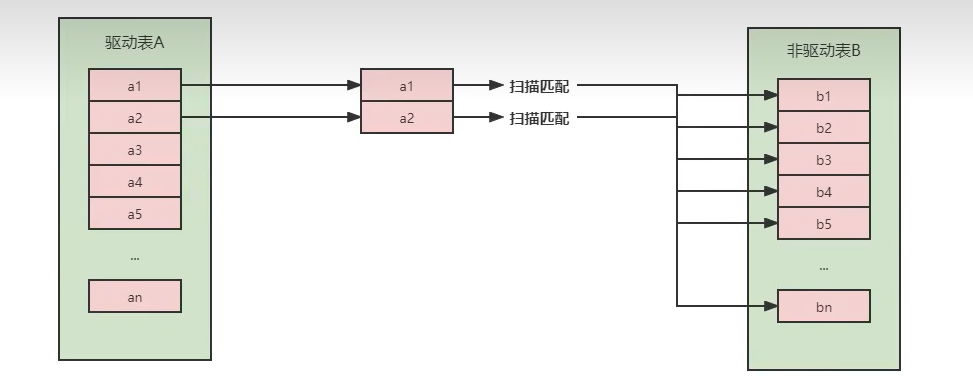

+ 该算法的流程就是从驱动表中取出一条数据，接下来拿着这条数据去和非驱动表的对应字段一一匹配
+ 可以看到，如果数据量变大，此算法是非常低效的

+ 该算法是对SNLJ算法的改进，就是选择有索引的表作为被联动表，在每次匹配时，先去索引中进行匹配，如果匹配到再进行回表
+ 由于使用了索引，因此效率有所提高

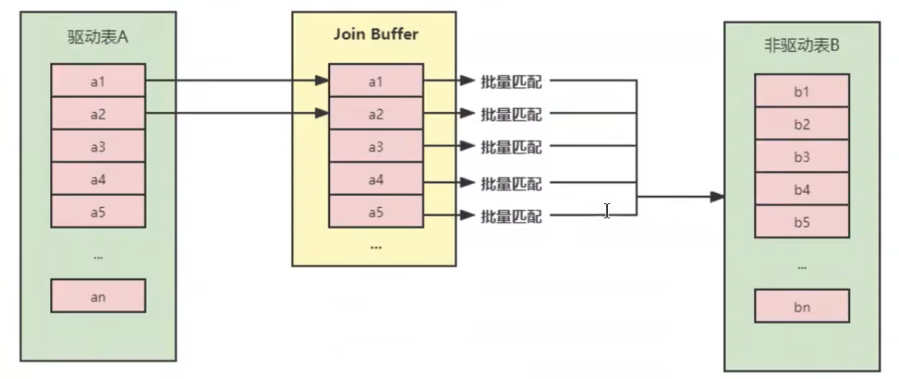

+ 该算法也是对SNLJ算法的改进，它不再一个一个的读取驱动表内的数据，而是划分出一块内存区域，批量的将一批驱动表内的数据读入到该内存块中，然后遍历被驱动表，把这一批的数据都与被驱动表的每一行数据进行匹配，这样可以达到**一次遍历被驱动表，使得有多条驱动表内的数据匹配完成**
+ 需要注意到，该算法的执行需要MySQL划分出一个单独的内存块，我们可以手动指定该内存块的大小（默认为256Kb）:
  + 32位系统最高设置到4Gb,64位系统可以继续提高（Windows系统例外，它的上限依旧是4Gb）

~~~sql
  -- 查看优化器的行为配置，其中的block_nested_loop状态表示是否支持MySQL为表连接开辟内存块
  show variables like '%optimizer_switch%';
  -- 查看当前MySQL能够为多表连接开辟多大的内存块大小
  show variables like '%join_buffer_size%';
~~~

|算法|变量A|变量B|联动表扫描次数|被联动表扫描次数|读取数据次数|数据比较次数|回表读取记录数|
|:---:|:---:|:---:|:---:|:---:|:---:|:---:|:---:|
|SNLJ|表A（假设为联动表）的数据总量|表B的数据总量|1|A|A+A*B（这个读取记录数相当于联动表的读取记录数+被联动表匹配的读取记录数）|B*A|0|
|INLJ|表A内的数据总量|表A的所有数据所匹配到的表B数据的总量，就是**表B满足连接条件的数据总量**|1|0|A+B|A*索引树高度|B|
|BNLJ|表A内的数据总量|表B满足连接条件的数据总量|1|ceil(A*每行的数据大小/缓冲块大小)|A+B|A*B表的数据总量|B|

+ 三个算法具体的效率对比:INLJ>BNLJ>SNLJ
+ 另外,Hash join算法在小表连接上性能可能没有上面的一些算法高，但是在大数据表的连接上，它的性能非常优秀

|比较字段|Nested Loop Join|Hash Join|
|:---:|:---:|:---:|
|使用条件|任何条件|等值连接|
|相关资源|CPU、磁盘I/O|内存、临时空间|
|特点|当有高选择性索引或进行限制性搜索时效率较高，能够快速返回第一次的搜索结果|当缺乏索引或索引条件模糊时，Hash Join比Nested Loop有效，在数据仓库环境下，如果表的记录数较多，效率高|
|缺点|当索引丢失或索引条件限制不够时，效率很低。当表的记录数多时，效率也低|建立哈希表需要大量的内存空间占用，第一次结果的返回较慢|

+ 结论:
> + 使用join语句，性能比强行拆成多个单表执行SQL语句的性能要好
> + 如果使用join语句的话，需要让小表做驱动表，**准确的说，是小结果集驱动大结果集**,其小的度量单位是`表的数据总量*每行的大小`
> + 我们应该为被驱动表匹配的条件增加索引
> + 尽量增加join_buffer_size的大小
> + 减少驱动表不必要的字段查询

---

#### ③子查询优化

+ MySQL从4.1版本开始支持子查询操作，但是子查询的效率并不是很高,原因如下:
  + 执行子查询时，MySQL需要为内层查询语句的查询结果建立一个临时表，然后外层查询语句从临时表中查询记录。查询完毕后，再撤销这些临时表。这样会消耗过多的CPU和IO资源，产生大量的慢查询。
  + 子查询的结果集存储的临时表，不论是内存临时表还是磁盘临时表都不会存在索引，所以查询性能会受到一定的影响。
+ 在MySQL中，应该尽量使用JOIN来替代子查询，这可以避免让MySQL生成临时表耗费资源，而且可以提高速度
+ 尽量不要使用NOT IN或者NOT EXISTS，用LEFT JOIN xxx ON xx WHERE xx IS NULL替代

---

#### ④排序优化

+ 首先明确一件事情，**索引默认是升序排序的**
+ ORDER BY子句也支持使用索引，下面是一些排序的优化建议:
  + **尽量让ORDER BY子句用上索引**，如果WHERE和ORDER BY后面是相同的字段，那就用单行索引，如果不是就用联合索引
  + **没办法使用索引时，就要对FileSort方法进行调优**了
  + **减少使用ORDER BY**,能不排序就不排，或者放到程序段去做
  + 包含了order by、group by、distinct这些查询的语句，**where条件过滤出来的结果集请保持在1000行以内，否则SQL会很慢**
+ 优化器对排序使用索引，思路比较奇特
  + 在不使用LIMIT语句的情况下，一般它不会用索引
  + 使用了LIMIT可能就会用
  + 如果ORDER BY中的字段不满足最佳左前缀原则，一样不会使用索引
  + 如果WHERE和ORDER BY一起出现，一般情况下
+ 当优化器未使用索引时，他会使用FileSort进行排序，这是一种低效的排序方式，虽然它在某些情况下比索引效率高，但是大部分情况下，**我们需要尽量避免优化器选择这种方式**
  + MySQL4.1之前使用的是双路排序，他需要扫描两次磁盘，最终得到数据。它的IO方式是随机IO的。
  + MySQL4.1之后，它引入了单路排序，这种排序方式仅需要扫描一次磁盘就能排好序。它的效率快一些，但是会占用更多的内存空间。它的IO方式是顺序IO的
+ 针对FileSort，优化方式如下:
  + 尝试提高sort_buffer_size:不管使用什么算法，提高该值都会提高排序效率。因为该参数是针对每个进程设置的。它的值需要保持在1-8Mb
  + 尝试提高max_length_for_sort_data:如果设置的太高，数据总量超过sort_buffer_size的概率就会增大，最终会导致IO活动频繁且处理器使用率降低。**如果需要返回的列的总长度大于该值，那么使用双路算法，否则使用单路算法**。它的值需要保持在1-8Mb
  + 避免使用select *，最好只选择想得到的字段

~~~sql
  show variables like '%sort_buffer_size%';
  show variables like '%max_length_for_sort_data%';
~~~

---

#### ⑤GROUP BY优化与LIMIT优化

+ GROUP BY使用索引的原则几乎与ORDER BY一致
  + group by 即使没有过滤条件用到索引，也可以直接使用索引
  + GROUP BY需要先排序再分组，也需要遵守最佳左前缀原则
  + 无法使用索引列时，推荐提高sort_buffer_size和max_length_for_sort_data
  + WHERE的效率比HAVING高，过滤条件应尽可能地写在WHERE中
+ 分页查询优化思路
  + 在索引上完成排序分页操作，最后根据主键关联回原表查询所需要的其他列内容
    + `EXPLAIN SELECT * FROM student t,(SELECT id FROM student ORDER BY id LIMIT 2000000,10)aWHERE t.id = a.id;`
  + 该方案适用于主键自增的表，可以把Limit 查询转换成某个位置的查询
    + `EXPLAIN SELECT * FROM student WHERE id > 2000000 LIMIT 10;`

---

#### ⑥索引覆盖

+ **一个索引包含了满足查询结果的数据就叫做覆盖索引**，或者说，**该索引包含的字段正好是覆盖查询条件中所涉及的字段**
+ 优化器该情况下会认为索引覆盖的情况成本较低，因此他会优先选择具备索引覆盖的索引
+ 索引覆盖有很明显的好处:
  + **避免Innodb表进行索引的二次查询**
  + **可以把随机IO变成顺序IO加快查询效率**
+ 弊端:
  + 索引字段的维护 总是有代价的。因此，在建立冗余索引来支持覆盖索引时就需要权衡考虑了。这是业务DBA，或者称为业务数据架构师的工作

---

#### ⑦索引下推

+ 索引下推是MySQL5.6的新特性，是一种在存储引擎层使用索引过滤数据的一种优化方式。**它可以减少存储引擎访问基表的次数以及MySQL服务器访问存储引擎的次数**
+ 索引下推，就是在数据过滤时，寻找包含尽可能多的条件字段且成本低的索引，然后在过滤时，通过索引尽可能多的进行相关字段的条件过滤，就是寻找条件字段中的属于索引字段中的字段相关条件，然后进行条件过滤。在使用这些字段相关的条件过滤掉数据之后，再去回表进行查找
  + 下面是索引下推的示例
    + (name,age)表是索引表
    + 那个主键索引是聚簇索引
    + 可以看到，在判断完name和age字段的条件之后，MySQL才去聚簇索引中去进行第三个条件的判断，而在以前，每判断一个条件，就要去聚簇索引中判断下一个条件了

  + 索引下推可以极大的提高效率，并减少IO
+ 索引下推并不是什么情况下都可以用的，他有明确的使用条件:
  + 只能用于二级索引
  + explain显示的执行计划中type值（join类型）为range、ref、eq_ref或者ref_or_null
  + 并非全部where条件都可以用ICP筛选，如果where条件的字段不在索引列中，还是要读取整表的记录到server端做where过滤。
  + ICP可以用于MyISAM和InnnoDB存储引擎
  + MySQL5.6版本的不支持分区表的ICP功能，5.7版本的开始支持
  + 当SQL使用覆盖索引时，不支持ICP优化方法。

---

#### ⑧前缀索引

+ MySQL是支持前缀索引的。默认地，如果你创建索引的语句不指定前缀长度，那么索引就会包含整个字符串

~~~sql
  mysql> alter table teacher add index index1(email);
  -- 或
  mysql> alter table teacher add index index2(email(6));
~~~

+ 下面是这俩索引的示例图:

+ 如果使用的是index1（即email整个字符串的索引结构），执行顺序是这样的：
  1. 从index1索引树找到满足索引值是’ zhangssxyz@xxx.com ’的这条记录，取得ID2的值；
  2. 到主键上查到主键值是ID2的行，判断email的值是正确的，将这行记录加入结果集；
  3. 取index1索引树上刚刚查到的位置的下一条记录，发现已经不满足email=' zhangssxyz@xxx.com ’的条件了，循环结束。这个过程中，只需要回主键索引取一次数据，所以系统认为只扫描了一行。
+ 如果使用的是index2（即email(6)索引结构），执行顺序是这样的：
  1. 从index2索引树找到满足索引值是’zhangs’的记录，找到的第一个是ID1；
  2. 到主键上查到主键值是ID1的行，判断出email的值不是’ zhangssxyz@xxx.com ’，这行记录丢弃；
  3. 取index2上刚刚查到的位置的下一条记录，发现仍然是’zhangs’，取出ID2，再到ID索引上取整行然后判断，这次值对了，将这行记录加入结果集；
  4. 重复上一步，直到在idxe2上取到的值不是’zhangs’时，循环结束。
+ 也就是说**使用前缀索引，定义好长度，就可以做到既节省空间，又不用额外增加太多的查询成本**。前面已经讲过区分度，区分度越高越好。因为区分度越高，意味着重复的键值越少
+ 但是，**前缀索引索然能够提升性能，但是就无法使用索引覆盖这一特性了**

---

#### ⑨普通索引与唯一索引

+ 为了说明普通索引和唯一索引对更新语句性能的影响这个问题，介绍一下change buffer。
  + 当需要更新一个数据页时，如果数据页在内存中就直接更新，而如果这个数据页还没有在内存中的话，在不影响数据一致性的前提下， InooDB会将这些更新操作缓存在change buffer中 ，这样就不需要从磁盘中读入这个数据页了。在下次查询需要访问这个数据页的时候，将数据页读入内存，然后执行changebuffer中与这个页有关的操作。通过这种方式就能保证这个数据逻辑的正确性。
  + 将change buffer中的操作应用到原数据页，得到最新结果的过程称为merge。除了访问这个数据页会触发merge外，系统有后台线程会定期merge。在数据库正常关闭（shutdown）的过程中，也会执行merge操作。
  + 如果能够将更新操作先记录在change buffer，减少读磁盘，语句的执行速度会得到明显的提升。而且，数据读入内存是需要占用bufferpool的，所以这种方式还能够避免占用内存，提高内存利用率。唯一索引的更新就不能使用change buffer ，实际上也只有普通索引可以使用。
+ 说了这么多，意思就是**普通索引相对于唯一索引的优势就是更新索引的速度快**，而**唯一索引对于普通索引的优势就是这个索引的字段值是唯一的**。而在查询效率上来看，二者没什么区别
+ 因此使用场景为:
  + 建议尽量选择普通索引，因为性能较高
  + 上面的前提是业务能够确保不会写入重复数据，如果无法确保，就需要**以业务正确性优先**
  + 另外，在一些归档库中，可以考虑使用唯一索引
    + 比如，线上数据只需要保留半年，然后历史数据保存在归档库。这时候，归档数据已经是确保没有唯一键冲突了。要提高归档效率，可以考虑把表里面的唯一索引改成普通索引

---

#### ⑩其它优化策略

+ EXESTS与IN的区分:
  + 当驱动表的结果集比被驱动表的结果集小时，使用EXISTS
  + 否则，使用IN
+ COUNT(*)与COUNT(具体字段)效率
  + COUNT(1)和COUNT(*)都是对所有行进行统计，理论上是没有什么区别的，而**COUNT(字段)不会统计此字段是NULL的行**
  + 对于MyISAM引擎来说，COUNT(1)和COUNT(*)很快，因为MyISAM引擎维护了一个row_count值，会记录每张表的数据量。
  + 而对于InnoDB引擎来说，它不会记录每张表的数据量。它如果碰到这种情况，会扫描全表，采取循环+统计的方式进行统计。**推荐优先使用key_len小的二级索引**。因为如果使用聚簇索引，也就是用主键，聚簇索引包含的是全部的数据集，比二级索引占用比较多，统计效率会变低。如果是COUNT(*)或者COUNT(1)，系统会自动找占用空间更小的二级索引进行统计。如果有多个二级索引，选择key_len最小的哪一个
+ 关于SELECT(*)
  + **建议明确字段，不要使用*作为查询的字段列表，推荐使用SELECT<字段列表>查询**，原因:
    + MySQL在**解析的过程中，会通过查询数据字典将`"*"`按序转换成所有列名，这会大大的耗费资源和时间**。
    + **无法使用索引覆盖**
+ LIMIT 1对优化的影响
  + **针对的是会扫描全表的SQL语句**，如果可以确定结果集只有一条，那么加上LIMIT 1的时候，当找到一条结果的时候就不会继续扫描了，这样会加快查询速度
  + 如果数据表已经对字段建立了唯一索引，那么可以通过索引进行查询，**不会全表扫描的话，就不需要加上LIMIT 1了**
+ 多使用COMMIT
  + COMMIT可以释放资源，提高效率，它释放的资源有:
    + 回滚段上用于恢复数据的信息
    + 被程序语句获得的锁
    + redo/undo log buffer中的空间
    + 管理上述3种资源中的内部花费

---

### （三）其他调优措施

+ 我们调优的目标是:
  + 尽量的节省系统资源，**以便系统提供更大负荷的服务**
  + 合理进行结构设计和参数调整，以**提高用户操作响应的速度**
  + 减少系统的瓶颈，**提高MySQL数据库整体的性能**

#### ①定位调优问题

+ 我们定位调优的方向会随着应用程序复杂度的提升，我们很难使用“更快”去定义数据库调优的目标了，因为不同的用户在不同情况下，或不同时间段遇到的问题不同。因此我们需要更加精细的去定位问题，一般我们有下面一些方式来定位调优目标:
  + **用户反馈**:用户反馈肯定是最直接的，也是主要的。而且我们开发的程序也是为用户服务的，应该重视用户的反馈，找到和数据相关的问题
  + **日志分析**:通过针对数据库运行日志进行查看，来找到异常情况，也是主要定位调优的渠道之一
  + **服务器资源使用监控**:通过监控服务器IO、CPU、内存等使用情况，来了解服务器的性能使用，找到问题所在
  + **服务器内部状况监控**:在服务器的监控中，活动会话(Active Session)监控是一个重要的指标，通过它，我们可以了解到数据库的繁忙状态，是否存在SQL堆积等
  + 其它:我们还可以对事务、锁等进行监控，这些都可以帮助我们监听数据库的运行状态

---

#### ②调优步骤

1. 选择合适的DBMS:就是根据业务需求，找合适的DBMS
2. 优化表设计:表结构尽量遵循第三范式要求，如果查询效率低下，或者查询应用较多，可以考虑使用反范式进行优化。另外，尽量的优化表字段的数据类型
3. 优化逻辑查询:见上面的[索引优化](#indexOptimize)
4. 优化物理查询:见上面的[索引优化](#indexOptimize)
5. 使用Redis或Memcached作为缓存:除对SQL本身进行优化外，还可以请外援提升查询效率
6. 进行库级优化:可以采用读写分离、分库分表等。但**在提升性能的同时，也会增加维护和使用成本**

---

#### ③数据库整体优化

+ 优化MySQL服务器一般从两个方面来优化:
  + 对硬件优化
  + 对MySQL服务参数进行优化

##### Ⅰ优化硬件

+ 服务器的硬件性能直接决定着MySQL数据库的性能。硬件的性能瓶颈直接决定MySQL数据库的运行速度和效率。针对性能瓶颈提高硬件配置，可以提高MySQL数据库查询、更新的速度:
  +  配置较大的内存:内存越大，MySQL性能越强
  +  配置高速磁盘系统:磁盘转的快可以减少IO时间，减少读盘等待时间，提高响应速度
  +  合理分布磁盘I/O:把磁盘IO分布在多个设备上，减少资源竞争，提高并行操作能力
  +  配置多处理器:MySQL支持多线程，给它整点多线程处理器

---

##### Ⅱ优化参数配置

+ `innodb_buffer_pool_size`：这个参数是Mysql数据库最重要的参数之一，表示**InnoDB类型的表和索引的最大缓存**。它不仅仅缓存索引数据 ，还会缓存表的数据。这个值越大，查询的速度就会越快。但是这个值太大会影响操作系统的性能。
+ `key_buffer_size`：表示**索引缓冲区的大小**。索引缓冲区是所有的线程共享。增加索引缓冲区可以得到更好处理的索引（对所有读和多重写）。当然，这个值不是越大越好，它的大小取决于内存的大小。如果这个值太大，就会导致操作系统频繁换页，也会降低系统性能。对于内存在4GB左右的服务器该参数可设置为256M或384M。
+ `table_cache`：表示同时打开的表的个数。这个值越大，能够同时打开的表的个数越多。物理内存越大，设置就越大。默认为2402，调到512-1024最佳。这个值不是越大越好，因为同时打开的表太多会影响操作系统的性能。
+ `query_cache_size`：表示**查询缓冲区的大小**。可以通过在MySQL控制台观察，如果Qcache_lowmem_prunes的值非常大，则表明经常出现缓冲不够的情况，就要增加Query_cache_size的值；如果Qcache_hits的值非常大，则表明查询缓冲使用非常频繁，如果该值较小反而会影响效率，那么可以考虑不用查询缓存Qcache_free_blocks，如果该值非常大，则表明缓冲区中碎片很多。MySQL8.0之后失效。该参数需要和query_cache_type配合使用。
+ `query_cache_type` 的值是0时，所有的查询都不使用查询缓存区。但是query_cache_type=0并不会导致MySQL释放query_cache_size所配置的缓存区内存。
  + 当query_cache_type=1时，所有的查询都将使用查询缓存区，除非在查询语句中指定SQL_NO_CACHE ，如SELECT SQL_NO_CACHE * FROM tbl_name。
  + 当query_cache_type=2时，只有在查询语句中使用 SQL_CACHE 关键字，查询才会使用查询缓存区。使用查询缓存区可以提高查询的速度，这种方式只适用于修改操作少且经常执行相同的查询操作的情况。
+ `sort_buffer_size` ：表示**每个需要进行排序的线程分配的缓冲区的大小**。增加这个参数的值可以提高 ORDER BY 或 GROUP BY 操作的速度。默认数值是2 097 144字节（约2MB）。对于内存在4GB左右的服务器推荐设置为6-8M，如果有100个连接，那么实际分配的总共排序缓冲区大小为100 × 6＝ 600MB。
+ `join_buffer_size` = 8M ：表示 联合查询操作所能使用的缓冲区大小 ，和sort_buffer_size一样，该参数对应的分配内存也是每个连接独享。
+ `read_buffer_size` ：表示 每个线程连续扫描时为扫描的每个表分配的缓冲区的大小（字节）。当线程从表中连续读取记录时需要用到这个缓冲区。SET SESSION read_buffer_size=n可以临时设置该参数的值。默认为64K，可以设置为4M。
+ `innodb_flush_log_at_trx_commit`：表示**何时将缓冲区的数据写入日志文件**，并且将日志文件写入磁盘中。该参数对于innoDB引擎非常重要。该参数有3个值，分别为0、1和2。该参数的默认值为1。
  + 值为 0 时，表示 每秒1次的频率将数据写入日志文件并将日志文件写入磁盘。每个事务的commit并不会触发前面的任何操作。该模式速度最快，但不太安全，mysqld进程的崩溃会导致上一秒钟所有事务数据的丢失。
  + 值为 1 时，表示 每次提交事务时将数据写入日志文件并将日志文件写入磁盘进行同步。该模式是最安全的，但也是最慢的一种方式。因为每次事务提交或事务外的指令都需要把日志写入（flush）硬盘。
  + 值为 2 时，表示 每次提交事务时将数据写入日志文件， 每隔1秒 将日志文件写入磁盘。该模式速度较快，也比0安全，只有在操作系统崩溃或者系统断电的情况下，上一秒钟所有事务数据才可能丢失。
+ `innodb_log_buffer_size`：这是**InnoDB存储引擎的事务日志所使用的缓冲区** 。为了提高性能，也是先将信息写入 Innodb Log Buffer中，当满足 innodb_flush_log_trx_commit 参数所设置的相应条件（或者日志缓冲区写满）之后，才会将日志写到文件（或者同步到磁盘）中。
+ `max_connections`：表示**允许连接到MySQL数据库的最大数量** ，默认值是 151。如果状态变量connection_errors_max_connections不为零，并且一直增长，则说明不断有连接请求因数据库连接数已达到允许最大值而失败，这是可以考虑增大max_connections 的值。在Linux 平台下，性能好的服务器，支持500-1000个连接不是难事，需要根据服务器性能进行评估设定。这个连接数 不是越大越好 ，因为这些连接会浪费内存的资源。过多的连接可能会导致MySQL服务器僵死。
+ `back_log`：用于**控制MySQL监听TCP端口时设置的积压请求栈大小**。如果MySql的连接数达到max_connections时，新来的请求将会被存在堆栈中，以等待某一连接释放资源，该堆栈的数量即back_log，如果等待连接的数量超过back_log，将不被授予连接资源，将会报错。5.6.6 版本之前默认值为 50 ， 之后的版本默认为 50 + （max_connections / 5）， 对于Linux系统推荐设置为小于512的整数，但最大不超过900。如果需要数据库在较短的时间内处理大量连接请求， 可以考虑适当增大back_log 的值。
+ `thread_cache_size` ：**线程池缓存线程数量的大小** ，当客户端断开连接后将当前线程缓存起来，当在接到新的连接请求时快速响应无需创建新的线程 。这尤其对那些使用短连接的应用程序来说可以极大的提高创建连接的效率。那么为了提高性能可以增大该参数的值。默认为60，可以设置为120。
  + 可以通过如下几个MySQL状态值来适当调整线程池的大小：

~~~sql
  show global status like 'Thread%';
  +-------------------+-------+
  | Variable_name | Value |
  +-------------------+-------+
  | Threads_cached | 2 |
  | Threads_connected | 1 |
  | Threads_created | 3 |
  | Threads_running | 2 |
  +-------------------+-------+
  4 rows in set (0.01 sec)
~~~

  + 当 Threads_cached 越来越少，但 Threads_connected 始终不降，且 Threads_created 持续升高，可适当增加 thread_cache_size 的大小
+ `wait_timeout` ：指定 一个请求的最大连接时间 ，对于4GB左右内存的服务器可以设置为5-10。
+ `interactive_timeout` ：表示服务器在关闭连接前等待行动的秒数
+ 此处给出一份my.cnf的参考配置:

~~~sql
[mysqld]
port = 3306 
serverid = 1 
socket = /tmp/mysql.sock 
skip-locking -- 避免MySQL的外部锁定，减少出错几率增强稳定性。 
-- 禁止MySQL对外部连接进行DNS解析，使用这一选项可以消除MySQL进行DNS解析的时间。但需要注意，如果开启该选项，则所有远程主机连接授权都要使用IP地址方式，否则MySQL将无法正常处理连接请求！ 
skip-name-resolve 
back_log = 384
key_buffer_size = 256M 
max_allowed_packet = 4M 
thread_stack = 256K
table_cache = 128K 
sort_buffer_size = 6M 
read_buffer_size = 4M
read_rnd_buffer_size=16M 
join_buffer_size = 8M 
myisam_sort_buffer_size =64M 
table_cache = 512 
thread_cache_size = 64 
query_cache_size = 64M
tmp_table_size = 256M 
max_connections = 768 
max_connect_errors = 10000000
wait_timeout = 10 
thread_concurrency = 8 --该参数取值为服务器逻辑CPU数量*2，在本例中，服务器有2颗物理CPU，而每颗物理CPU又支持H.T超线程，所以实际取值为4*2=8
-- 开启该选项可以彻底关闭MySQL的TCP/IP连接方式，如果WEB服务器是以远程连接的方式访问MySQL数据库服务器则不要开启该选项！否则将无法正常连接！ 
skip-networking 
table_cache=1024
-- 默认为2M
innodb_additional_mem_pool_size=4M 
innodb_flush_log_at_trx_commit=1
-- 默认为1M
innodb_log_buffer_size=2M  
-- 你的服务器CPU，有几个就设置为几。建议用默认一般为8 tmp_table_size=64M #默认为16M，调到64-256最挂
innodb_thread_concurrency=8 
thread_cache_size=120 
query_cache_size=32M

~~~

---

#### ④数据库结构优化

+ **拆分表-冷热数据分离**:如果一个表内存在多个字段，有些字段总是被访问，有些字段几乎都没有被访问到，此时可以将这些不常用的字段分解出另一个表
+ **增加中间表**:如果两个有关联的表经常进行连接，且连接查询的字段都是那一批字段，可以将这些字段抽取出来，创建一个新表，这样下次查询时直接在新表中查询了
+ 增加冗余字段:见[反范式化](#antiNF)
+ 优化数据类型
  + **对整数类型数据进行优化**:非负型数据建议使用UNSIGNED进行修饰，一般整型建议用int，因为INT型数据有足够大的取值范围，不用担心数据超出取值范围的问题
  + **既可以使用文本类型也可以使用整数类型的字段，要选择使用整数类型**：跟文本类型数据相比，大整数往往占用更少的存储空间
  + **避免使用TEXT、BLOB数据类型**:MySQL在排序TEXT、BLOB这种数据时，无法使用内存临时表，要使用磁盘临时表进行排序，且对此类数据还是要进行二次查询。效率极低。如果一定要用，建议把BLOB或TEXT放到单独的拓展表中，查询时不要使用`select *`，不需要TEXT列的数据时，不要对该列进行查询
  + **避免使用ENUM类型**:修改ENUM类型需要`ALTER TABLE`，ENUM类型的ORDER BY操作效率低，需要额外操作，推荐使用TINYINT替代
  + **使用TIMESTAMP存储时间**:TIMESTAMP占用四个字节，比DATETIME占用的8个字节少，同时TIMESTAMP具有自动赋值与自动更新的特性
  + **用DECIMAL代替FLOAT和DOUBLE存储精确浮点数**:DECIMAL是精确浮点数，FLOAT与DOUBLE存在精度误差
+ **优化插入记录的速度**:
  + 对MyISAM表:
    + 禁用索引
    + 禁用唯一性检查
    + 使用批量插入
    + 使用LOAD DATA INFILE 批量导入
  + 对InnoDB表:
    + 禁用唯一性检查
    + 禁用外键检查
    + 禁止自动提交
+ **尽量使用非空约束**:防止NULL值影响操作
+ **分析表、检查表与优化表**:
  + 分析表:即使用analyze进行表的分析，具体的格式为:`ANALYZE [LOCAL | NO_WRITE_TO_BINLOG] TABLE 表名[,表名]`。
    + 默认的，MySQL服务会将ANALYZE TABLE语句写到binlog中，以便在主从架构中，从服务能够同步数据。可以添加参数LOCAL或者NO_WRITE_TO_BINLOG取消将语句写到binlog中
    + 使用ANALYZE时，**数据库系统会对表加一个只读锁**，使在分析期间无法对表中的字段进行更新和删除操作。
    + ANALYZE TABLE语句能够分析InnoDB和MyISAM类型的表，但是不能作用于视图
    + ANALYZE TABLE分析后的统计结果会反应到 索引的cardinality 的值（使用`show index from 表名`查看），该值统计了表中某一键所在的列不重复的值的个数。**该值越接近表中的总行数，则在表连接查询或者索引查询时，就越优先被优化器选择使用**
    + ANALYZE TABLE语句可以更新MySQL当下没来得及更新的一些值，使其值与当前状态吻合
  + 检查表:使用CHECK TABLE语句来检查表,具体格式为`CHECK TABLE 表名 [, 表名] ... [option] ...option = {QUICK | FAST | MEDIUM | EXTENDED | CHANGED}`
    + CHECK TABLE语句能够检查InnoDB和MyISAM类型的表是否存在错误。**CHECK TABLE语句在执行过程中也会给表加上只读锁**
    + option参数有5个取值，分别是
      + `QUICK`:不扫描行，不检查错误的连接
      + `FAST`:只检查没有被正确关闭的表
      + `CHANGED`:只检查上次检查后被更改的表和没有被正确关闭的表
      + `MEDIUM`:扫描行，以验证被删除的连接是有效的。也可以计算各行的关键字校验和，并使用计算出的校验和验证这一点
      + `EXTENDED`:对每行的所有关键字进行一个全面的关键字查找。这可以确保表是100%一致的，但是花的时间较长
    + **option只对MyISAM类型的表有效，对InnoDB类型的表无效**
    + 该语句对于检查的表可能会产生多行信息。最后一行有一个状态的 Msg_type 值，Msg_text 通常为 OK。如果得到的不是 OK，通常要对其进行修复。是 OK 说明表已经是最新的了。表已经是最新的，意味着存储引擎对这张表不必进行检查
  + 优化表:可以使用`OPTIMIZE [LOCAL | NO_WRITE_TO_BINLOG] TABLE 表名 [, 表名]`来进行表的优化
    + LOCAL和NO_WRITE_TO_BINLOG关键字的意义和分析表相同，都是指定不写入二进制日志。
    + **OPTILMIZE TABLE语句只能优化表中的VARCHAR、BLOB或TEXT类型的字段**
    + OPTIMIZE TABLE语句对InnoDB和MyISAM类型的表都有效。**该语句在执行过程中也会给表加上只读锁**
    + 针对InnoDB引擎的表进行优化时，Msg_text字段可能显示`‘numysql.SYS_APP_USER’, ‘optimize’, ‘note’, ‘Table does not support optimize, doing recreate +analyze instead’`。不过**InnoDB确实支持优化功能，这个表确实也被优化了**
    + 在MyISAM中，是先分析这张表，然后会整理相关的MySQL datafile，之后回收未使用的空间
    + 在InnoDB中，回收空间是简单通过Alter table进行整理空间。在优化期间，MySQL会创建一个临时表，优化完成之后会删除原始表，然后会将临时表rename成为原始表
    + 在多数的设置中，根本不需要运行OPTIMIZE TABLE。即使对可变长度的行进行了大量的更新，也不需要经常运行， 每周一次 或 每月一次 即可，并且只需要对 特定的表运行

---

#### ⑤大表优化

+ **限定查询范围**:禁止不带任何限制数据范围条件的查询语句。比如：我们当用户在查询订单历史的时候，我们可以控制在一个月的范围内；
+ 读写分离:经典的数据库拆分方案，主库负责写，从库负责读

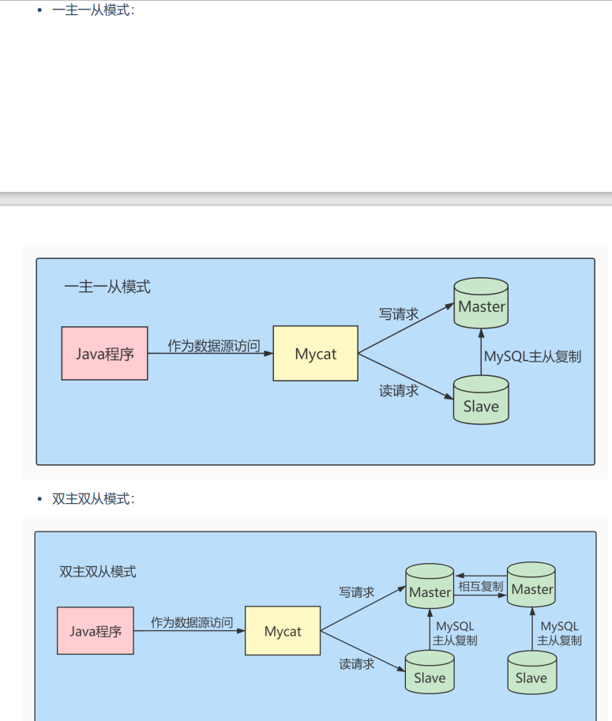

+ **垂直拆分**:当数据量级达到千万级以上时，有时候我们需要把一个数据库切成多份，放到不同的数据库服务器上，减少对单一数据库服务器的访问压力
  + 垂直拆分的优点： 可以使得列数据变小，在查询时减少读取的Block数，减少I/O次数。此外，垂直分区可以简化表的结构，易于维护
  + 垂直拆分的缺点： 主键会出现冗余，需要管理冗余列，并会引起 JOIN 操作。此外，垂直拆分会让事务变得更加复杂

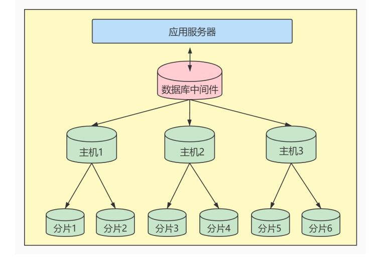

+ **水平拆分**:当某个表的数据量过大时，我们可以按某种分类规则将该表分成结构相同的小表，如按照年份划分，把2010、2011、2012等每年的数据放到对应年份的表中去。但**水平分表只是解决了单一表数据量过大的问题，对于MySQL并发能力没什么意义。因此水平拆分最好分库**
  + 客户端代理： 分片逻辑在应用端，封装在jar包中，通过修改或者封装JDBC层来实现。 当当网的Sharding-JDBC 、阿里的TDDL是两种比较常用的实现
  + 中间件代理： 在应用和数据中间加了一个代理层。分片逻辑统一维护在中间件服务中。我们现在谈的 Mycat 、360的Atlas、网易的DDB等等都是这种架构的实现

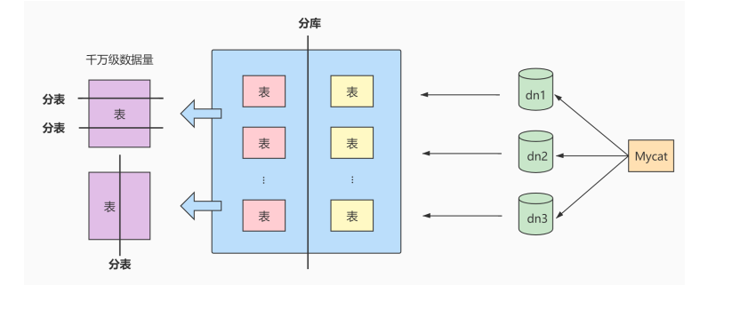

---

#### ⑥其它策略

+ 说是其他策略，其实是MySQL8.0之后新增的可以用来优化的新特性:
  + 服务器语句超时处理:在MySQL 8.0中可以设置`MAX_EXECUTION_TIME`来配置服务器语句超时的限制，它用来规定当执行语句超时时，服务器将终止查询影响不大的事务或连接，然后将错误报给客户端
    + 例:`SET GLOBAL MAX_EXECUTION_TIME=2000;`、`SET SESSION MAX_EXECUTION_TIME=2000;`。一个设置全局的，一个设置当前会话的
  + 创建全局通用表空间:MySQL8.0支持使用`CREATE TABLESPACE`来创建一个全局通用表空间。
    + 全局表空间可以被所有的数据库表共享，且相对于独享表空间，使用手动创建共享表空间可以节约元数据方面的内存。
    + 可以在创建表的时候，指定属于哪个表空间，也可以对已有的表进行表空间的修改
    + SQL语句如下:

~~~sql

  create tablespace 共享表空间名 add datafile '共享表空间底层的文件名称(InnoDB引擎以idb作为后缀)' file_block_size=空间大小
  -- 创建名为atguigu的共享表空间
  create tablespace atguigu add datafile 'atguigu.idb' file_block_size=16k;
  -- 为表指定表空间
  create table .... tablespace 表空间名
  -- 通过修改表来指定表空间
  alter table 表名 tablespace 表空间名
  -- 删除表空间
    -- 如果有表在使用表空间，需要先删除表，或者为该表指定其他表空间，才能删除该表空间
  drop tablespace 表空间名

~~~
  + MySQL8.0引进了隐藏索引（主键没办法被隐藏）和降序索引，对于性能调试非常有用

## 七、数据库设计规范

+ 我们在设计表的时候，需要考虑很多问题:
  + 用户需要什么数据
  + 如何设计表，怎么进行约束检查、如何保证数据的正确性
  + 如何降低数据表的数据冗余度
  + 如何让维护人员更方便的使用数据库
+ 而现实中，操蛋的数据库设计可能会导致如下后果:
  + 数据冗余、数据重复、存储空间浪费
  + 数据更新、插入、删除的异常
  + 无法正确表示信息或丢失有效信息
  + 程序性能差
+ 因此，在设计数据库的时候，我们就需要重视数据表的设计，为了建立冗余较小、结构合理的数据库，**设计数据库规范时必须遵守一定的规范**

### （一）前置名词

+ **范式**:在关系型数据库中，关于数据库表设计的基本原则、规则就成为范式
+ **元组**:就是表中的每一行
+ **超键**:能够唯一标识元组的属性集叫做超键
+ **候选键**:如果超键不包括多余的属性，那么称这个超键是候选键
+ **主键**:从候选键中任意选出一个来，称为主键
+ **外键**:依赖于另一个表的具有UNIQUE约束的键的键，就是之前的foreign key
+ **主属性**:包含在任一候选键中的属性称为主属性，即**它是候选键所有出现过的字段的集合**
+ **非主属性**:不是主属性的属性
+ 示例:
  + 球员表有`球员编号`、`姓名`、`身份证号`、`年龄`、`球队编号`这些字段
  + 球队表有`球队编号`、`主教练`、`球队所在地`
  + 超键可以是(球员编号)、(球员编号,姓名)、(身份证号,年龄)等，**它可以包含除主键之外的其它冗余字段，只要组成的集合能够唯一标识元组就行**
  + 候选键可以是:(球员编号)、(身份证号)，它不能包含除主键之外的其它冗余字段，因此**它是超键的子集**
  + 主键可以是(球员编号)或(身份证号)，“从候选键任意选一个”实际上是从候选键集合中选，从本例看，集合是`{(球员编号),(身份证号)}`
  + 外键是(球队编号)，没什么好说的
  + 主属性是`球员编号`、`身份证号`，非主属性是剩下那仨

---

### （二）范式

+ 范式(Normal Form)是**关系型数据库中，关于数据库表设计的基本原则、规则**，它可以分为:
  + 第一范式
  + 第二范式
  + 第三范式
  + 巴斯-科德范式/巴斯范式/BCNF范式
  + 第四范式
  + 第五范式

+ 这些范式，其设计越高阶，也就是**限制条件越严格，数据冗余度就越低，同时查询效率也越低**

#### ①第一范式

+ 第一范式确保每个字段的值必须具有原子性，即**数据表中每个字段的值为不可拆分的最小数据单元**
+ 例1:

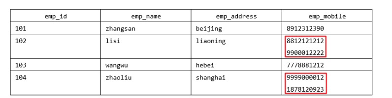

+ 我们可以看到emp_mobile这个字段存在明显的冗余，需要进一步拆分:

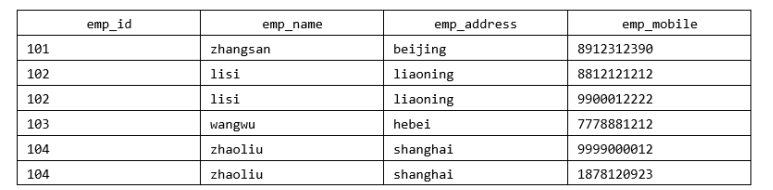

+ 例2:

+ 可以看到上图的user_info字段明显冗余，需要拆分:

+ 例3:

+ 根据上图来看，我们需要依据我们的业务分析其地址字段是否要继续细分。
+ 也就是说，**属性的原子性是主观的**

---

#### ②第二范式

+ 第二范式在满足第一范式的前提下，还要**满足数据表里的每一条数据都是可唯一标识的。且所有的非主键字段，都必须完全依赖主键，不能只依赖主键的一部分**
  + 用人话说，就是我们不能只提供一部分主键，就能从表里找到对应的唯一数据，即使这些数据并不是全部的字段，只要它们是唯一的就不行。即**所有主键集合的真子集没有办法推导出任何对应的非当前主键字段**，或者说，部分主键可以推导出部分非主键，即**不满足第二范式需要寻找主键字段与非主键字段之间的关系**
+ 例:
  + 成绩表（学号，课程号，成绩）关系中，（学号，课程号）可以决定成绩，但是**学号不能决定成绩，课程号也不能决定成绩**，所以“（学号，课程号）→成绩”就是完全依赖关系
  + 又如比赛表player_game ，里面包含`球员编号`、`姓名`、`年龄`、`比赛编号`、`比赛时间`和`比赛场地`等属性
    + 其中`球员编号->(姓名,年龄)`,同时`比赛编号->(比赛时间,比赛场地)`,因此主键是`(球员编号,比赛编号)`。但它不满足第二范式，因为**其真子集可以推导出一部分非主属性**
    + 在不满足第二范式的情况下，它会出现如下问题:
      + **数据冗余**：如果一个球员可以参加 m 场比赛，那么球员的姓名和年龄就重复了 m-1 次。一个比赛也可能会有 n 个球员参加，比赛的时间和地点就重复了 n-1 次
      + **插入异常**：如果我们想要添加一场新的比赛，但是这时还没有确定参加的球员都有谁，那么就没法插入
      + **删除异常**：如果我要删除某个球员编号，如果没有单独保存比赛表的话，就会同时把比赛信息删除掉
      + **更新异常**：如果我们调整了某个比赛的时间，那么数据表中所有这个比赛的时间都需要进行调整，否则就会出现一场比赛时间不同的情况
    + 为了解决该问题，我们需要将该表拆成三张表:
      + 因为球员与比赛是多对多关系，因此需要再多分出一张表:

  + 再如下图

    + 违反了第二范式，可以仅通过orderid找到订单的 orderdate，以及customerid和companyname，而没有必要再去使用productid
    + 因此该表也应该进行拆分:

+ 1NF告诉我们字段属性需要是原子性的，而2NF告诉我们**一张表就是一个独立的对象**，一张表只表达一个意思

---

#### ③第三范式

+ 第三范式在第二范式的基础上，确保所有非主键字段都与主键直接相关，即要求数据表中的所有非主键字段都不能依赖于其它非主键字段
  + 设主键为A，一部分非主键字段为B，另一部分非主键字段为C，B+C=非主键字段
  + 用人话说就是需要满足A->B+C，而不是A->B->C。即**非主键字段与非主键字段之间不能有依赖关系，必须全都直接依赖于主键字段**，即**不满足第三范式需要寻找非主键字段与非主键字段之间的关系**
+ 例1:

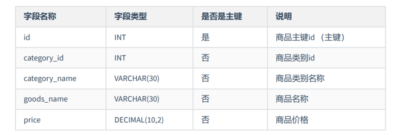

  + 上图的category_name字段直接依赖于category_id字段，因此不满足第三范式的条件，需要将表拆分:

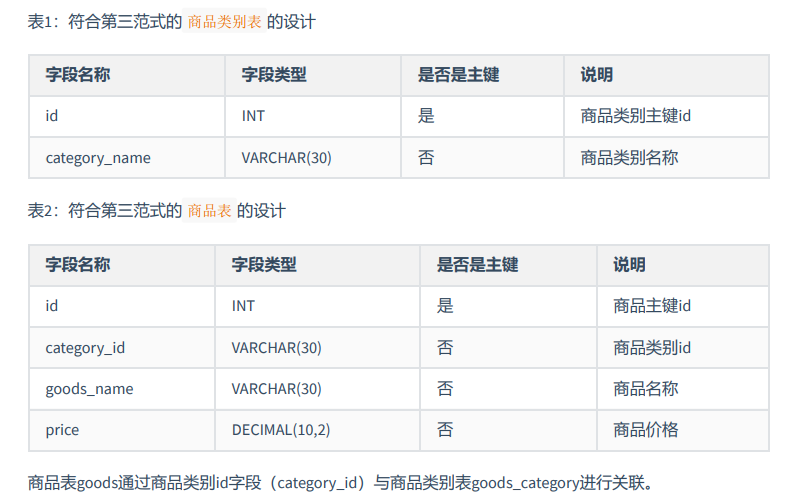

+ 例2:
  + 球员player表：`球员编号`、`姓名`、`球队名称`和`球队主教练`。现在，我们把属性之间的依赖关系画出来，如下图所示

  + 一个教练可能在多个球队担任主教练，但是一个球队只能有一个主教练，因此通过球队名称可以推导出球队主教练，不符合第三范式的要求，需要拆表:

+ 例3:
  + 在第二范式样例的一个例子中，我们将一个表拆分成了两个表:

  + 但是由此看来，companyname字段是依赖于customerid字段的，因此它不满足第三范式，需要拆表:

+ 符合3NF后的数据模型通俗地讲，2NF和3NF通常以这句话概括：“每个非键属性依赖于键，依赖于整个键，并且除了键别无他物”。

---

#### ④BCNF范式

+ 在第三范式的前提下，**该表仅一个候选键，或它的每个候选键都是单属性**，那我们就称该表满足BDNF范式，**不满足BCNF范式需要寻找主键字段与候选键字段之间的关系**
+ 我们根据下例进行分析:

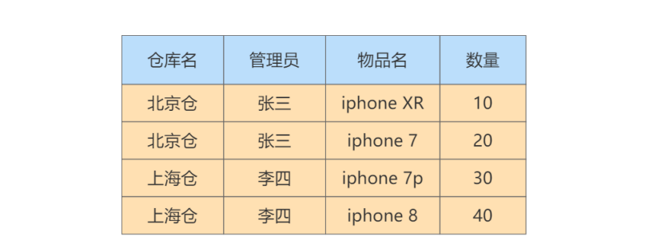

+ 在上图中，该表是满足第一、二、三范式的。
  + 先分析其各个依赖关系:
    + 管理员与仓库名之间是一对一关系，因此候选键集合为`{(管理员,物品名),(仓库名,物品名)}`
    + 主属性集合:`{管理员,物品名,仓库名}`
    + 非主属性集合:`{数量}`
    + 首先，各字段满足原子性，不可再分，满足第一范式
    + 其次，物品名、管理员和仓库名（这是主属性集合的三个字段）均不能独立推导出其所在主键的非主键字段（这仨主属性集合来自于俩候选键集合元素，因此是“其所在主键”），因此满足第二范式
    + 最后，管理员与数量，或者仓库名与数量均不满足依赖关系（有两套主键，因此有两套非主键字段），因此满足第三范式
  + 从依赖关系可以分析出，这是满足第一、二、三范式的，但是，它依旧存在问题:
    + **插入异常**:增加一个仓库，但是还没有存放任何物品。根据数据表实体完整性的要求，主键不能有空值，因此会出现
    + **修改数据表中的多条记录**:如果仓库更换了管理员，我们就可能会被迫修改多条记录
    + **删除异常**:如果仓库里的商品都卖空了，那么此时仓库名称和相应的管理员名称也会随之被删除
  + 出现此问题的原因在于，主属性的字段相对于其候选键字段存在依赖关系，所以需要拆表:
    + 仓库表:(仓库名，管理员)
    + 库存表:(仓库名，物品名，数量)
  + 上面表的设计便满足了BCNF的规范
+ 再来看一个例子:

+ 上表中，学生ID和专业是联合主键，但是“专业”依赖于“导师”，且是一对一关系。因此它不满足BCNF范式，实际上，它的候选键集合有两个元素:`{(StudentId,Major),(StudentId,Advisor)}`
+ 因此，该表也需要进行拆分:

---

#### ⑤第四范式

+ 现在需要解释一下多值依赖的概念:
  + 多值依赖即属性之间的一对多关系，记为K->->A
  + 函数依赖实际上是单值依赖，所以不能表达属性值之间的一对多关系
  + 平凡的多值依赖:全集U=K+A,，一个K对应多个A，即K->->A。此时整个表就是一组一对多关系
  + 非平凡的多值依赖:全集U=K+A+B,一个K对应多个A，也对应多个B，即K->->A,K->->B，A与B相互独立，因此整个表出现了多组一对多关系。且“一”部分是相同的属性集合，“多”部分是互相独立的属性集合
+ 第四范式，就是消除非平凡的多值依赖（即把同一表内的多对多关系删除）
+ 举例1：职工表(职工编号，职工孩子姓名，职工选修课程)。
  + 在这个表中，同一个职工可能会有多个职工孩子姓名。同样，同一个职工也可能会有多个职工选修课程，即这里存在着多值事实，不符合第四范式。
  + 如果要符合第四范式，只需要将上表分为两个表，使它们只有一个多值事实，例如： 职工表一 (职工编号，职工孩子姓名)， 职工表二 (职工编号，职工选修课程)，两个表都只有一个多值事实，所以符合第四范式。
+ 举例2：
  + 比如我们建立课程、教师、教材的模型。我们规定，每门课程有对应的一组教师，每门课程也有对应的一组教材，一门课程使用的教材和教师没有关系。我们建立的关系表如下：
  + 课程ID，教师ID，教材ID；这三列作为联合主键。
  + 为了表述方便，我们用Name代替ID，这样更容易看懂:

  + 这个表除了主键，就没有其他字段了，所以肯定满足BC范式，但是却存在多值依赖导致的异常。假如我们下学期想采用一本新的英版高数教材，但是还没确定具体哪个老师来教，那么我们就无法在这个表中维护Course高数和Book英版高数教材的的关系。解决办法是我们把这个多值依赖的表拆解成2个表，分别建立关系。这是我们拆分后的表:

  + 以及:

---

#### ⑥第五范式、域键范式

+ 除了第四范式外，我们还有更高级的第五范式（又称完美范式）和域键范式（DKNF）。
+ 在满足第四范式（4NF）的基础上，消除不是由候选键所蕴含的连接依赖。**如果关系模式R中的每一个连接依赖均由R的候选键所隐含**，则称此关系模式符合第五范式。
+ 函数依赖是多值依赖的一种特殊的情况，而多值依赖实际上是连接依赖的一种特殊情况。但连接依赖不像函数依赖和多值依赖可以由 语义直接导出 ，而是在 关系连接运算 时才反映出来。存在连接依赖的关系模式仍可能遇到数据冗余及插入、修改、删除异常等问题。
+ 第五范式处理的是 无损连接问题 ，这个范式基本 没有实际意义 ，因为无损连接很少出现，而且难以察觉。而域键范式试图定义一个 终极范式 ，该范式考虑所有的依赖和约束类型，但是实用价值也是最小的，只存在理论研究中

---

### （三）反范式化

+ 数据规范与性能:
  + 范式虽然规范了我们的数据库表设计要求，但是有时，一些看似冗余的数据实际上对业务来说是十分重要的，因此我们要遵循业务优先的原则，首先满足业务要求，再减少冗余
  + 通过在表内插入计算列，方便查询
  + 通过在给定的表中添加额外的字段，以大量减少需要从中搜索信息所花费的时间
  + 为满足某些商业目标，数据库性能比数据规范化更加重要
+ 在上面的情况下，我们就得到了反范式化的原因
+ 例1:
  + 员工的信息存储在employees表中，部门信息存储在departments表中。通过employees表中的department_id字段与departments表建立关联关系。如果要查询一个员工所在部门的名称:

~~~sql
  select employee_id,department_name
  from employees e join departments d
  on e.department_id = d.department_id;
~~~
  + 如果经常需要进行这个操作，连接查询就会浪费很多时间。可以在employees表中增加一个冗余字段department_name，这样就不用每次都进行连接操作了
+ 例2:
  + 反范式化的goods商品信息表设计如下

+ 例3:
  + 我们有2个表，分别是商品流水表（atguigu.trans ）和商品信息表（atguigu.goodsinfo） 。商品流水表里有400万条流水记录，商品信息表里有2000条商品记录:

  + 在上面的表设计中，如果我们想得到商品，我们就需要频繁的进行表的连接，这样会导致非常费时，因此我们可以在商品流水表中增加一个商品名称:
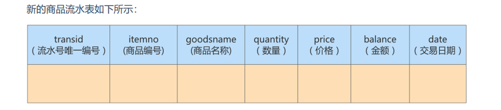

+ 总之，举了这么多例子，想表达的是，有时在追求性能的前提下，我们需要进行反范式化，通过数据冗余来达到性能的提升，因此，**反范式化的使用场景一般就是当冗余信息有价值或者能大幅度提高查询效率的时候**
+ 另外，反范式化除了能够提升性能，还带来了新的问题:
  + **空间变大**
  + **数据不一致**:一个表中字段做了修改，另一个表中冗余的字段也需要做同步修改
  + **系统资源消耗增加**:若采用存储过程来支持数据的更新、删除等额外操作，如果更新频繁，会导致系统资源消耗增加
  + **数据库的设计变复杂**:在数据量小的情况下，反范式不能体现性能的优势，可能还会让
+ 在考虑增加冗余字段时，有如下建议:
  + 该冗余字段不需要经常进行修改
  + 该冗余字段查询时不可或缺
  + 根据上面的建议，明显的反范式化设计一般出现在历史快照、历史数据等信息所在表中
    + 在现实生活中，我们经常需要一些冗余信息，比如订单中的收货人信息，包括姓名、电话和地址等。每次发生的订单收货信息都属于历史快照，需要进行保存，但用户可以随时修改自己的信息，这时保存这些冗余信息是非常有必要的
    + 数据仓库通常存储历史数据，对增删改的实时性要求不强，对历史数据的分析需求强。这时适当允许数据的冗余度，更方便进行数据分析
+ [示例](../源码/MySQL/数据库设计规范样例.sql)

---

### （四）ER模型

+ ER(entity-relationship)模型又叫实体关系模型，是用来描述现实生活中客观存在的事务、事务的属性以及事物之间关系的一种数据模型。**在开发基于数据库的信息系统的设计阶段，通常使用ER模型来描述信息需求和信息特性，帮助我们理清业务逻辑，从而设计出优秀的数据库**
+ ER模型包括三个要素:
  + 实体:可以看作数据对象，使用矩形表示，实体分为强实体（不依赖于其他实体的实体）和弱实体（对另一个实体有很强依赖关系的实体）
  + 属性:实体的特性，比如实体是一个人，其属性有身份证号、名字、电话等
  + 关系:指实体之间的关系，在ER模型中用菱形来表示
+ 注意:**可以独立存在的是实体，不可再分的是属性**

#### ①关系类型

+ `E-R（entity-relationship，实体-联系）模型`中有三个主要概念是`实体集` 、`属性` 、`联系集`
+ 一个实体集对应数据库中的一个表，一个实体对应数据表中的一行，一个属性表示数据库表内的一个字段

+ 表与表之间的关联关系有四种:
  + 一对一关联
  + 一对多关联
  + 多对多关联
  + 自我引用
+ 一对一关联
  + 在实际的开发中应用不多，因为**一对一可以合成一张表**
  + 它可以遵循两种建表原则:
    + **外键唯一**：主表的主键和从表的外键（唯一），形成主外键关系，外键唯一。
    + **外键是主键**：主表的主键和从表的主键，形成主外键关系。
  + 在一对一关系中，随便把一个表的主键放在另一个表内
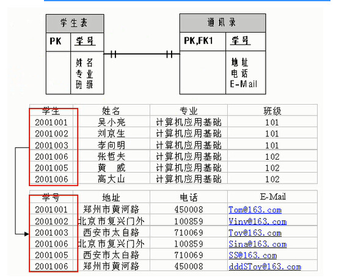
+ 一对多关联
  + 即两个表之间，其中A表的实体可以对B表的多个实体，而A表仅有一个实体与B表的一个实体对应
  + 举例:人和银行卡、部门与员工
  + 表示一对多关系，需要把“一”表的主键放在“多”表的一方内

+ 多对多关联
  + 即两个表之间，其中A表的实体可以对应B表的多个实体，而B表的一个实体也能对应A表的多个实体
  + 举例:学生与课程、产品与订单
  + **要表示多对多关系，必须创建第三个表**，该表通常称为`联接表`，它将多对多关系划分为两个一对多关系。**将这两个表的主键都插入到第三个表中**。
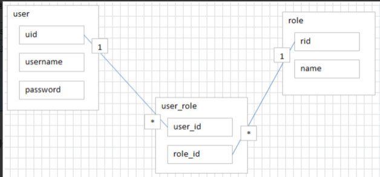
+ 自我引用
  + 不知道怎么描述
  + 举例:主管与员工
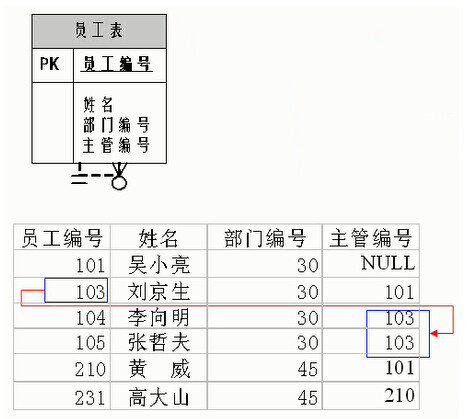

---

#### ②建模分析

+ 以电商业务为例，由于电商业务太过庞大且复杂，所以我们做了业务简化，本次电商业务设计总共有8个实体，如下所示:
  + 地址实体
  + 用户实体
  + 购物车实体
  + 评论实体
  + 商品实体
  + 商品分类实体
  + 订单实体
  + 订单详情实体
+ 其中，`用户`和`商品分类`是强实体，因为它们不需要依赖其他任何实体。而其他属于弱实体，因为它们虽然都可以独立存在，但是它们都依赖用户这个实体，因此都是弱实体。知道了这些要素，我们就可以给电商业务创建ER模型了，如图

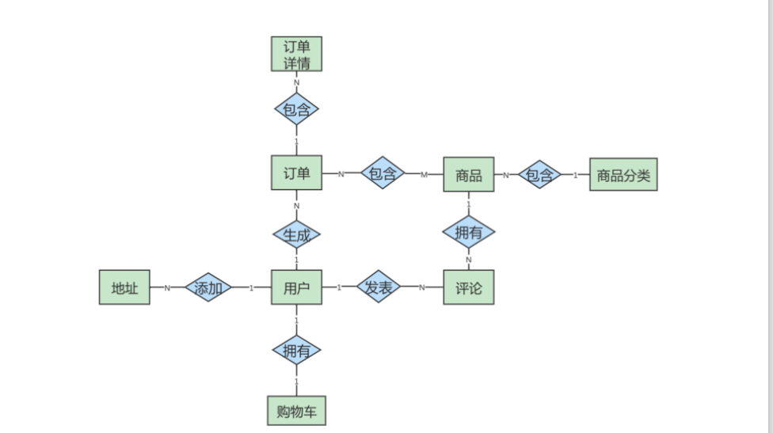

+ 在这个图中，地址和用户之间的添加关系，是一对多的关系，而商品和商品详情示一对1的关系，商品和订单是多对多的关系。 这个 ER 模型，包括了 8个实体之间的 8种关系:
  + （1）用户可以在电商平台添加多个地址；
  + （2）用户只能拥有一个购物车；
  + （3）用户可以生成多个订单；
  + （4）用户可以发表多条评论；
  + （5）一件商品可以有多条评论；
  + （6）每一个商品分类包含多种商品；
  + （7）一个订单可以包含多个商品，一个商品可以在多个订单里。
  + （8）订单中又包含多个订单详情，因为一个订单中可能包含不同种类的商品

---

#### ③ER模型细化

+ 我们在得到ER模型后，就可以根据该ER模型去建表了，但首先我们需要把属性加上，因此我们需要分析，各表需要什么属性:
  + （1） 地址实体 包括用户编号、省、市、地区、收件人、联系电话、是否是默认地址。
  + （2） 用户实体 包括用户编号、用户名称、昵称、用户密码、手机号、邮箱、头像、用户级别。
  + （3） 购物车实体 包括购物车编号、用户编号、商品编号、商品数量、图片文件url。
  + （4） 订单实体 包括订单编号、收货人、收件人电话、总金额、用户编号、付款方式、送货地址、下单
时间。
  + （5） 订单详情实体 包括订单详情编号、订单编号、商品名称、商品编号、商品数量。
  + （6） 商品实体 包括商品编号、价格、商品名称、分类编号、是否销售，规格、颜色。
  + （7） 评论实体 包括评论id、评论内容、评论时间、用户编号、商品编号
  + （8） 商品分类实体 包括类别编号、类别名称、父类别编号
+ 这样细分之后，我们就可以重新设计电商业务了，ER模型如图:

---

### （五）总结

+ 综合以上内容，总结出数据表设计的一般原则："三少一多"
  + **数据表的个数越少越好**:数据表越少，证明实体和联系设计的越简洁，既方便理解又方便操作
  + **数据表中的字段个数越少越好**:数据字段越多，数据冗余的可能性越大。
  + **数据表中联合主键的字段个数越少越好**:联合主键字段数越多，索引所占用的空间就越大，不仅会加大理解难度，还会增加运行时间和索引空间
  + **使用主键和外键越多越好**:这样做可以保证数据冗余度降低，提高实体利用度，且保证了数据表之间的独立性，还能提升相互之间的关联使用率
+ 注意，**这个原则并不是绝对的，需要根据业务情况来随机应变**

---

## 八、事务

+ 在存储引擎的学习中我们已经知道，**在MySQL支持的存储引擎中，只有InnoDB引擎是支持事务的**

### （一）事务特性与状态

+ **事务是一组逻辑操作单元，使数据从一种状态变换到另一种状态**
+ 事务处理的原则:保证所有事务都作为一个工作单元来执行，即使出现了故障，都不能改变这种执行方式。当在一个事务中执行多个操作时，要么所有的事务都被提交( commit)，那么这些修改就永久地保存下来；要么数据库管理系统将放弃所作的所有修改 ，整个事务回滚(rollback)到最初状态
+ 基于事务处理的原则，我们就可以总结事务的特性有四个:
  + **原子性**(Atomicity):原子性指事务是一个不可分割的工作单位，**要么全部提交，要么遇到问题就全部回滚**，不存在中间的状态。**原子性保证了数据的一致性**
  + **一致性**(Consistency):一致性指事务执行前后，其数据从一个合法性状态转变为另一个合法性状态。即**数据在事务处理前后，它的值都需要满足其约束条件**
    + 如转账的情况，A有100块钱，B没钱，现在A向B转200块钱，它的事务执行成功了，即它满足了原子性。但是A在转账之后就有了-100块钱，B有200块钱。而A的钱都是负数了，尽管事务满足了原子性，但是它的数据的值是非法的，不满足其约束条件，因此不满足一致性
  + **隔离性**(Isolation):事务的隔离性指一个事务在执行时不能被其它事务所干扰，导致它的执行出现问题
    + 例:假设A账户有200元，B账户0元。A账户往B账户转账两次，每次金额为50元，分别在两个事务中执行

    + 可以看到上图出现了脏读和脏写现象，导致了数据的不一致
  + **持久性**(Durability):持久性是指一个事务一旦被提交，它对数据库中数据的改变就是永久性的，接下来的其他操作和数据库故障不应该对其有任何影响
    + 持久性是通过日志来保证的，通过Redo日志和Undo日志保证事务的正常提交与回滚
+ 另外，MySQL把事务大致划分成几个状态:
  + 活动（active）:事务对应的数据库操作正在执行过程中时，我们就说该事务处在活动的状态
  + 部分提交（partially committed）:当事务中的最后一个操作执行完成，但由于操作都在内存中执行，所造成的影响并没有刷新到磁盘时，我们就说该事务处在部分提交的状态
  + 失败（failed）:当事务处在`活动`或者`部分提交`的状态时，可能遇到了某些错误（数据库自身的错误、操作系统错误或者直接断电等）而无法继续执行，或者人为的停止当前事务的执行，我们就说该事务处在`失败`的状态
  + 中止的（aborted）:如果事务执行了一部分而变为`失败`状态，那么就需要把已经修改的事务中的操作还原到事务执行前的状态。换句话说，就是要撤销失败事务对当前数据库造成的影响。我们把这个撤销的过程称之为回滚。当回滚操作执行完毕时，也就是数据库恢复到了执行事务之前的状态，我们就说该事务处在了`中止`状态
  + 提交的（committed）:当一个处在`部分提交`状态的事务将修改过的数据都同步到磁盘上之后，我们就可以说该事务处在了`提交`状态

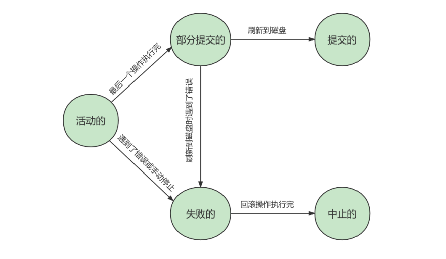

---

### （二）事务的使用

+ 使用事务有两种方式，分为显示事务和隐式事务
  + 显示事务就是我们用代码显式的开启一个事务，然后执行一些操作
  + 隐式事务就是我们在进行一些操作的时候，MySQL会为我们自动进行提交的行为，隐式事务在如下情况下默认会自动提交:
    + DML语句执行，即使用CREATE、ALTER、DROP语句对数据库对象进行操作时
    + 修改MySQL数据库中的表，即使用`ALTER USER`、`CREATE USER`、`DROP USER`、`GRANT`、`RENAME USER`、`REVOKE`、`SET PASSWORD`（这些都在隐式的修改mysql数据库内的表，详情见[用户与权限管理](#manageUserAndPassword)）
    + 事务控制或关于锁的语句
      + 当我们在事务内又运行了`BEGIN`、`START TRANSACTION`时，会使上一次的事务隐式的提交
      + 当前的autocommit系统变量的值是off,我们设置它为on时，也会隐式的自动提交该语句前面执行的语句
      + 使用`LOCK TABLES`、`UNLOCK TABLES`语句也会隐式的提交
      + 使用`LOAD DATA`批量导入数据时，也会自动隐式提交前面的语句
      + 使用`START SLAVE`、`STOP SLAVE`、`RESET SLAVE`、`CHANGE MASTER TO`等MySQL复制的相关语句时，也会自动隐式提交前面的语句
      + 使用`ANALYZE TABLE`、`CACHE INDEX`、`CHECK TABLE`、`FLUSH`、`LOAD INDEX INTO CACHE`、`OPTIMIZE TABLE`、`REPAIR TABLE`、`RESET`等语句时，也会自动隐式提交前面的语句
+ 不管什么事务，MySQL都会为事务分配一个唯一的id

~~~sql
  -- START TRANSACTION或BEGIN都表示开启一个显式的事务
  -- 在显示事务内，除非我们主动进行COMMIT，否则MySQL不会主动提交的
  -- START TRANSACTION相比BEGIN,可以跟随一些修饰符:
    -- READ ONLY:标识当前事务是一个只读事务，也就是属于该事务的数据库操作只能读取数据，而不能修改数据
    -- READ WRITE(默认) ：标识当前事务是一个读写事务，也就是属于该事务的数据库操作既可以读取数据，也可以修改数据(默认)
    -- WITH CONSISTENT SNAPSHOT：启动一致性读
  START TRANSACTION {READ ONLY|READ WRITE|WITH CONSISTENT SNAPSHOT}|BEGIN;
  -- 提交事务，表示当前事务结束
  COMMIT;

  --事务回滚，表示恢复到离它最近的BEGIN开始的状态之前
  ROLLBACK;

  -- 在此保存一个保存点(存档)
  SAVEPOINT 名称;
  -- 回滚到对应的保存点(读档)
  ROLLBACK TO 保存点名称;
  -- 关闭自动提交，该方式可以直接禁止使用隐式事务的自动提交，如果置为0，只有当我们主动COMMIT时，才会提交
  set autocommit=off;

~~~

---

### （三）并发问题与隔离级别

#### ①并发问题

+ MySQL支持事务的并发操作以提升事务的处理效率，但是事务在并发时，也会出现相关的问题
+ 这些问题根据严重程度从高到低分为:
  + **脏写**(Dirty Write):如果事务A修改了另一个**未提交**事务B修改过的数据，那么就称发生了脏写

  + **脏读**(Dirty Read):如果事务A读取了已经被事务B**更新但还没有被提交**的字段。之后若事务B回滚，事务A读取的内容就是临时且无效的

  + **不可重复读**(Non-Repeatable Read):如果事务A读取了一个字段，然后事务B**修改(未提交、已提交均可)**了该字段。之后事务A再次读取同一个字段，值就不同了。那就意味着发生了不可重复读

  + **幻读**(Phantom):如果事务A从一个表中读取了一个字段, 然后事务B在该表中**插入(未提交、已提交均可)**了一些新的行。之后, 如果事务A再次读取同一个表, 就会多出几行。那就意味着发生了幻读

+ 注意:
  + 如果事务B删除了一些值，而事务A读取到的字段较之前读取到的不同，但是**没有出现新的行**，这不算幻读，而不是不可重复读。**幻读强调几次读取读取到的是之前未出现的行**

---

#### ②隔离级别

+ 为了解决这些并发问题，SQL规范规定了四个隔离级别，MySQL对这四个隔离级别是都支持的，但**不意味着其它DBMS对这四个隔离级别是支持的**
+ 这四个隔离级别分别是:
  + 读未提交(READ UNCOMMITTED):在该隔离级别，所有事务都可以看到其他未提交事务的执行结果。不能避免脏读、不可重复读、幻读
  + 读已提交(READ COMMITTED):它满足了隔离的简单定义：一个事务只能看见已经提交事务所做的改变。这是大多数数据库系统的默认隔离级别（但**不是MySQL默认的**）。可以避免脏读，但不可重复读、幻读问题仍然存在
  + 可重复读(REPEATABLE READ):事务A在读到一条数据之后，此时事务B对该数据进行了修改并提交，那么事务A再读该数据，读到的还是原来的内容。可以避免脏读、不可重复读，但幻读问题仍然存在。**这是MySQL的默认隔离级别**
  + 可串行化(SERIALIZABLE):确保事务可以从一个表中读取相同的行。在这个事务持续期间，禁止其他事务对该表执行插入、更新和删除操作。**所有的并发问题都可以避免，但性能十分低下**。能避免脏读、不可重复读和幻读

|隔离级别|能否解决脏写|能否解决脏读|能否解决不可重复读|能否解决幻读|是否可以加锁读|
|:---:|:---:|:---:|:---:|:---:|:---:|
|读未提交|√|×|×|×|×|
|读已提交|√|√|×|×|×|
|可重复读|√|√|√|×|×|
|可串行化|√|√|√|√|√|

+ 从上表可以看到，可串行化的安全性是最好的，但是性能是最低下的
+ 下面是设置隔离级别的相关SQL语句
~~~sql

  -- 查看隔离级别，MySQL 5.7.20的版本之前：
  SHOW VARIABLES LIKE 'tx_isolation';
  -- MySQL 5.7.20版本之后，引入transaction_isolation来替换tx_isolation
  SHOW VARIABLES LIKE 'transaction_isolation';
  -- 或者不同MySQL版本中都可以使用的：
  SELECT @@transaction_isolation;

  -- 下面的两行语句选择一行，都可以设置隔离级别，但是隔离级别的格式略有不同
    -- 第一行代码的隔离级别格式: READ UNCOMMITTED、READ COMMITTED、REPEATABLE READ、SERIALIZABLE
    -- 第二行代码的隔离级别格式:READ-UNCOMMITTED、READ-COMMITTED、REPEATABLE-READ、SERIALIZABLE
  -- 在设置GLOBAL级别的隔离级别时，当前的会话并不会生效，而在此之后的新的会话才会生效
  -- 为了让它起作用，可以设置SESSION的隔离级别，或者退出MySQL连接再重连一次，或者再开一个会话
    -- 如果选择设置SESSION的隔离级别且当前存在事务在执行，那么本次事务不会受到该隔离级别的影响，下次开始才会生效
  SET [GLOBAL|SESSION] TRANSACTION ISOLATION LEVEL 隔离级别;
  SET [GLOBAL|SESSION] TRANSACTION_ISOLATION = '隔离级别';
~~~

+ 各并发问题演示:
  + 表需要自己建，代码内的表需要改成自己的表，字段改成自己自定义的字段
+ 脏读演示:

+ 不可重复读演示:
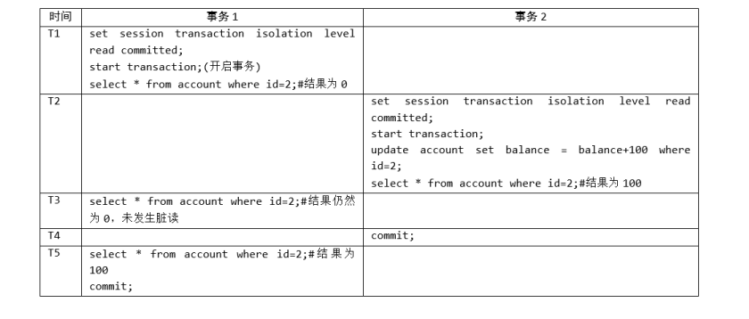
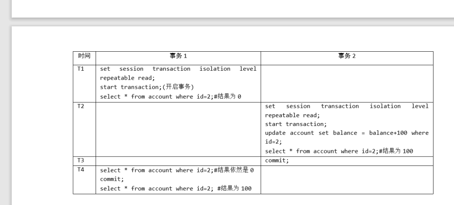
+ 幻读演示:

---

### （四）日志

+ 事务的隔离性由锁和隔离级别来确保，而事务的另外三个特性，原子性、持久性、一致性则由事务日志来保证。
+ MySQL有很多种不同种类的日志，包括`二进制日志`、`错误日志`、`通用查询日志`、`慢查询日志`等，MySQL8之后又更新了两种新的日志:`中继日志`和`数据定义语句日志`
  + 日志的类型如下:
    + **慢查询日志**:记录所有执行时间超过long_query_time的所有查询，方便我们对查询进行优化
    + **通用查询日志**:记录所有连接的起始时间和终止时间，以及连接发送给数据库服务器的所有指令，对我们复原操作的实际场景、发现问题，甚至是对数据库操作的审计都有很大的帮助
    + **错误日志**:记录MySQL服务的启动、运行或停止MySQL服务时出现的问题，方便我们了解服务器的状态，从而对服务器进行维护
    + **二进制日志**:记录所有更改数据的语句，可以用于主从服务器之间的数据同步，以及服务器遇到故障时数据的无损失恢复
    + **中继日志**:用于主从服务器架构中，从服务器用来存放主服务器二进制日志内容的一个中间文件。从服务器通过读取中继日志的内容，来同步主服务器上的操作
    + **数据定义语句日志**:记录数据定义语句执行的元数据操作
    + **事务日志**:与事务相关的日志，主要包括REDO和UNDO日志
      + REDO LOG 称为重做日志，提供再写入操作，恢复提交事务修改的页操作，用来保证事务的持久性
        + 它是存储引擎生成的日志，它**记录的是物理级别上的页修改操作**，如页号xxx,偏移量yyy，写入了zzz数据。主要为了保证数据的可靠性
      + UNDO LOG 称为回滚日志，回滚行记录到某个特定版本，用来保证事务的原子性、一致性
        + 他也是存储引擎生成的日志，它**记录的是逻辑操作日志**，如事务中执行了一句INSERT操作，那么undo日志就写一个相反的DELETE操作，主要用于**事务的回滚**和**一致性非锁定读(MVCC)**
  + **除二进制外，其他日志都是文本文件**，默认情况下，所有日志创建于MySQL数据目录中
+ 日志在带来方便的同时，也会带来弊端
  + 降低MySQL数据库的性能
  + 占用大量的磁盘空间

#### ①redo日志

+ **redo日志的引入**:
  + 从索引和存储引擎章节我们可以知道，InnoDB存储引擎是以页为单位来管理存储空间的，因此在进行事务操作时，它需要先把对应的页加载进`Buffer Pool`内存中，所有的数据变更都需要现在内存中进行修改，这些被修改了的，与磁盘中的页内的数据出现不一致的内存中的页被称为`脏页`。而后缓冲池的脏页会以一定的频率被刷新进磁盘中(CheckPoint机制)
  + 但是磁盘刷新需要时间，刷新时机也不是每次更新完成就刷新的，这就导致在刷新或者更新完成等待刷新时，MySQL服务器可能会出现宕机现象。**如果出现了宕机，那么内存中的数据就是不可恢复的，那么这段数据就会丢失，无法恢复**
  + 另一方面，如果发生了宕机，**事务的持久性要求我们对数据的更改不能丢失**，因此，为了保证事务的持久性，我们**只需要把修改了哪些东西记录一下就好**，而记录该修改记录的，就是redo日志
    + 其实还可以这么做:在提交之前，就把该事务所修改的所有页面都刷新到磁盘。但该操作会使得效率降低，因为可能会导致修改量与刷新磁盘工作量严重不成比例，且随机刷新IO较慢，会导致性能问题
+ **redo日志的好处**:
  + 降低了磁盘刷新
  + redo日志占用空间小
+ **redo日志的特点**:
  + 顺序写入磁盘
  + 事务执行过程中，redo log不断记录
+ **redo简单划分**:
  + 重做日志的缓冲(redo log buffer):其保存在内存中，通过`innodb_log_buffer_size`参数可以配置，默认16M，最小1M，最大4096M
  + 重做日志文件(redo log file):保存在磁盘中，有持久性
+ **redo整体流程**:
  + 第1步：先将原始数据从磁盘中读入内存中来，修改数据的内存拷贝
  + 第2步：生成一条重做日志并写入redo log buffer，记录的是数据被修改后的值
  + 第3步：当事务commit时，将redo log buffer中的内容刷新到redo log file，对redo log file采用追加写的方式
  + 第4步：定期将内存中修改的数据刷新到磁盘中
  + 以上步骤就是Write-Ahead Log(预先日志持久化)。**在持久化一个数据页之前，先将内存中相应的日志页持久化**
+ **redo的刷盘策略**:
  + 从redo的部分我们可以知道，redo log的写入并不是直接写入磁盘的，而是先写入内存，再通过刷盘策略刷到真正的redo log文件中
  + **这个刷盘并不是真正的把内存中的数据直接放到文件中去**，只是写入到文件系统缓存（`page cache`）中去，再由操作系统来决定这些数据什么时候写入。不过如果操作系统崩溃的话...那么数据就真的丢失了，但操作系统宕机的概率比较小
  + redo的刷盘策略有三种，MySQL提供了`innodb_flush_log_at_trx_commit`来供我们选择其刷盘策略:
    + 设置为0:表示每次事务提交时不进行刷盘操作。（系统默认master thread每隔1s进行一次重做日志的同步，该操作不仅会将内存中的redo写入到page cache，还会把page cache中的数据刷到磁盘文件中去。**该操作无论innodb_flush_log_at_trx_commit的值为多少都会执行**）
    + 设置为1:表示每次事务提交时都将进行同步，刷盘操作（默认值）
    + 设置为2:表示每次事务提交时都只把redo log buffer内容写入page cache，不进行同步。由os自己决定什么时候同步到磁盘文件。
  + 下面展示三种刷盘策略:

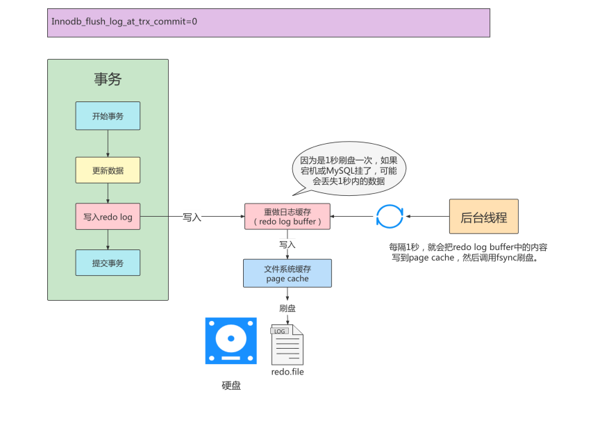
+ **redo写入redo log buffer过程**:
  + redo log buffer底层有三个结构:

  + 一个redo log buffer由多个redo log block组成:

  + 可以看到一个block的大小是512字节，它的设计其实是与磁盘的扇区有关的，因为机械磁盘的默认扇区就是512字节。如果我们要向扇区写入的block大小大于512k,那么就需要占两个及以上的扇区，如果有一个扇区写入成功了，另一个写入失败了，就会出现非原子性的写入，而**每次写入都写一个扇区，写入就是原子性的**

  + 在向redoBuffer填充日志内容时，是以mtr为基本单位的。一条语句由若干个mtr组成，而一个mtr又由若干个redo日志组成:

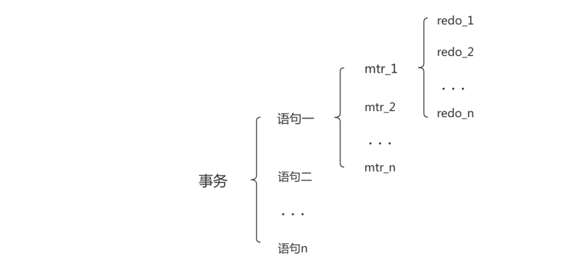

  + 不同的事务可能是并发执行的，因此对于redo log buffer来说，各个事务的mtr可能会杂乱的挨在一起:

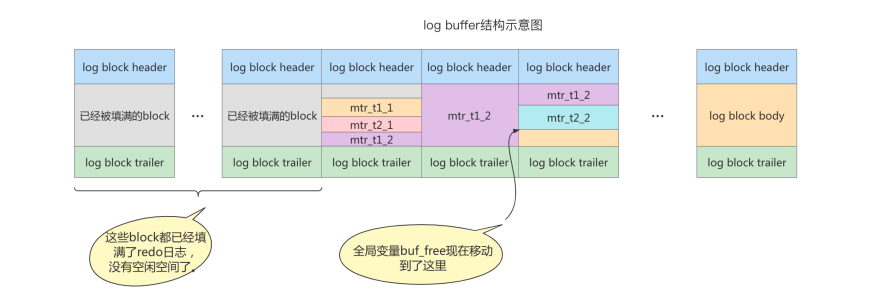

+ **相关参数**:
  + innodb_log_group_home_dir:**指定redo log文件组所在的路径**，默认值为`./`，表示在数据库的数据目录下，MySQL的默认数据目录（var/lib/mysql）(这是linux下的)下默认有两个名为ib_logfile0和ib_logfile1的文件，log buffer中的日志默认情况下就是刷新到这两个磁盘文件中。此redo日志文件位置还可以修改
  + innodb_log_files_in_group:**指明redo log file的个数**，默认2个，最大100个
  + innodb_flush_log_at_trx_commit:**控制redo log刷新到磁盘的策略**，默认为1
  + innodb_log_file_size:**单个redo log文件设置大小**，默认值为48M。最大值为(512G/innodb_log_files_in_group)
  + 最后，总共的redo日志文件大小其实就是：innodb_log_file_size*innodb_log_files_in_group
+ **checkpoint**:
  + **采用循环使用的方式向redo日志文件组里写数据的话，如果日志已经写满了，会导致后面继续写入的redo日志覆盖掉前边写的redo日志**，为了解决该问题，InnoDB的设计者提出了checkpoint的概念

+ 如果write pos追上checkpoint（即跑了一天），表示日志文件组满了，这时候不能再写入新的redo log记录，MySQL得停下来，清空一些记录，把checkpoint推进一下
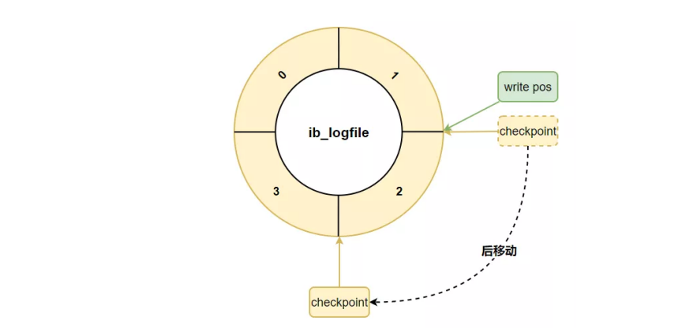

---

#### ②undo日志

+ **undo日志的作用**:
  + undo log是事务持久性的保证，而undo log是事务原子性的保证。undo log保证了在事务执行过程中，如果出现意外，可以进行对应的回滚操作以避免出现中间状态的问题。但**回滚仅仅是逻辑回滚，数据是可以回滚到事务开始之前的状态的，但是数据的物理位置可能发生了变化**，因为在并发的情况下，可能有多个事务一起执行，将指定事务回滚到事务开始之前的物理状态，可能会导致其它事务执行出现异常。另外是undo日志是通过执行一条语句就记录该语句的相反语句的方式进行记录的，而不是记录该语句执行前的物理状态，因此根据undo日志仅能够在逻辑上回滚到事务开始前的状态
  + 另外,undo log也可以进行MVCC操作，在InnoDB引擎中MVCC的实现是通过undo来完成的，当用户读取一行记录时，若该纪录已被其它事务占用，当前事务可以根据undo日志来得到对应的数据
+ **undo存储结构**:
  + InnoDB针对undo log采取段管理的方式，也就是` 回滚段（rollback segment）`每个回滚段记录了1024个undo log segment，而在每个undo log segment段中进行 undo页的申请
  + 在InnoDB1.1版本之前（不包括1.1版本），只有一个rollback segment，因此支持同时在线的事务限制为1024。虽然对绝大多数的应用来说都已经够用
  + 从1.1版本开始InnoDB支持最大128个rollback segment，故其支持同时在线的事务限制提高到了128*1024。但此时这些rollback segment都存放在共享表空间ibdata中
  + 从1.2版本开始，可以对参数rollback segment进行进一步的设置了:

~~~sql
  -- 这玩意好像已经被弃用了
  show variables like 'innodb_undo_logs';
  -- 可以通过下面的东西查看对应的undo log配置
    -- innodb_max_undo_log_size表示最大的日志大小
    -- innodb_undo_directory表示undo日志的保存位置
    -- innodb_undo_log_encrypt用于指定InnoDB存储引擎是否对undo日志进行加密(来自GPT)
    -- innodb_undo_log_truncate用于指定在数据库重启时是否要截断（删除）undo日志
    -- innodb_undo_tablespaces表示占用的表空间有几个，默认为两个
  show variables like '%undo%';

~~~
  + 我们的事务执行完毕后，并不会立刻清除对应的undo log，因为该undo log可能还夹杂着其它事务的相关信息。事务在执行完毕后，undo log就可以被重用了，在事务commit后，undo log会被放到一个链表内，然后判断undo页的使用空间是否小于3/4，**如果小于该值，则表示可以重用，其它事务的undo日志可以写在其后面并不会删除**。由于undo log是离散的，因此清理对应的磁盘空间时，效率不高
+ **回滚段与事务**:
  + 每个事务只会使用一个回滚段，一个回滚段在同一时刻可能会服务于多个事务
  + 当一个事务开始的时候，会制定一个回滚段，在事务进行的过程中，当数据被修改时，原始的数据会被复制到回滚段
  + 在回滚段中，事务会不断填充盘区，直到事务结束或所有的空间被用完。如果当前的盘区不够用，事务会在段中请求扩展下一个盘区，如果所有已分配的盘区都被用完，事务会覆盖最初的盘区或者在回滚段允许的情况下扩展新的盘区来使用
  + 回滚段存在于undo表空间中，在数据库中可以存在多个undo表空间，但同一时刻只能使用一个undo表空间
  + 当事务提交时，InnoDB存储引擎会做以下两件事情
    + 将undo log放入列表中，以供之后的purge操作
    + 判断undo log所在的页是否可以重用，若可以分配给下个事务使用
+ **回滚段的数据分类**:
  + 未提交的回滚数据(uncommitted undo information):该数据所关联的事务还未提交，因此该数据无法被其他事务的数据所覆盖
  + 已经提交但未过期的回滚数据(committed undo information):该数据关联的事务已经提交，但是仍受到undo retention参数的保持时间的影响
  + 事务已经提交并过期的数据(expired undo information):即已经过期的数据，当回滚段满时，会优先覆盖该数据
+ **undo类型**:
  + insert undo log:指在insert操作中产生的undo日志，其仅对当前事务可见，对其它事务不可见（事务的隔离性）。因此该**类型的undo日志在事务提交之后就可以直接删除**。不需要进行purge操作
  + update undo log:指在update操作中产生的undo日志，该类型的undo日志可能需要提供MVCC机制，因此不能在事务提交时就进行删除。**提交时需要进行purge操作，等待purge操作进行最后的删除**
+ **undo log的生命周期**:
  + 假设有两个数值，分别为A=1和B=2,我们想将A修改为3，将B修改为4:
    + 在1-8任意步骤出现问题，都需要进行undo操作
    + 在8-9之间宕机，可以选择回滚，也可以继续提交，因为持久化已经完成了
    + 在9之后宕机，内存映射中的数据还来不及刷回磁盘，但是持久化已经完成了，因此还是可以通过redo继续提交

~~~sql
  1. BEGIN;
  2. 记录A=1到undo log
  3. update A=3;
  4. 记录A=3到redo log
  5. 记录B=2到undo log
  6. update B=4;
  7. 记录B=4到redo log
  8. 将redo log写到磁盘
  9. commit
~~~

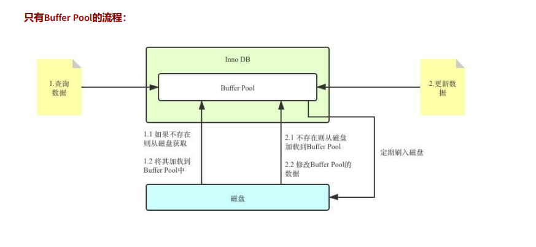
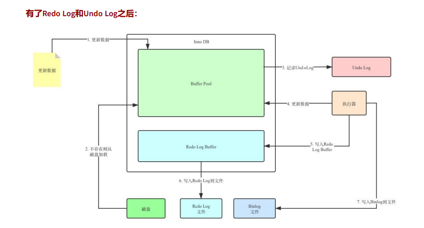

+ **日志详细生成过程**:
  + 对于InnoDB引擎来说，每个行记录除了记录本身的数据之外，还有几个隐藏的列:
    + DB_ROW_ID:没有显式的提供主键时，该字段会被自动添加作为主键
    + DB_TRX_ID:事务的ID号，当该行记录被对应事务修改时，其事务id就会被该字段记录
    + DB_ROLL_PTR:回滚指针，指向undo log的指针

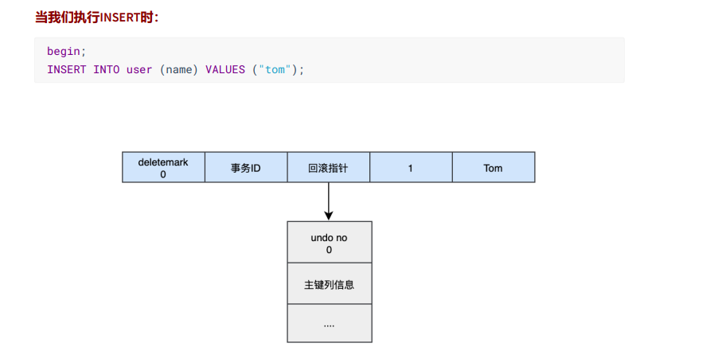
  + 执行insert时，插入的数据会生成一条insert undo log,且数据的回滚指针会指向它。undo log会记录其序号、插入主键的列和值。因此在回滚时，通过主键直接删除即可
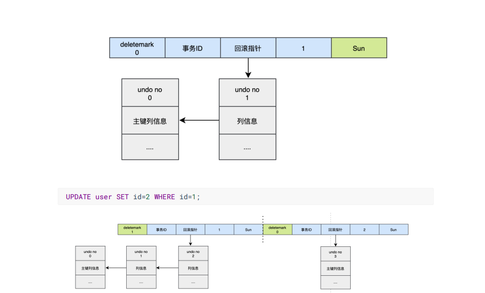
  + 执行update时，undo log又被区分为更新主键的和不更新主键的
    + 如果不更新主键，那么会把老的记录写入新的undo log,并让回滚指针指向新的undo log
    + 如果更新主键，需要先修改原来数据的delete_mask，置为0，但此时并未真正删除，真正的删除需要交给清理线程去判断。然后再插入一条新的数据，然后生成新的undo log

---

#### ③慢查询日志

+ 详见[性能分析与调优章节的慢查询日志](#slowQueryLog)

---

#### ④通用查询日志

+ 通用查询日志用来记录用户的所有操作，包括启动和关闭MySQL服务、所有用户的连接开始时间和截止时间、发给 MySQL 数据库服务器的所有 SQL 指令等

~~~sql
show variables like '%general%';  -- 查看与通用查询日志相关的变量，可以通过general_log看到通用查询日志默认是关闭状态的

+------------------+---------------------+
| Variable_name    | Value               |
+------------------+---------------------+
| general_log      | OFF                 |
| general_log_file | LZX的笔记本.log     |
+------------------+---------------------+

  -- 在配置文件内配置通用日志的相关内容
  [mysqld]
  general_log=ON
  general_log_file=[path[filename]] #日志文件所在目录路径，filename为日志文件名

  SET GLOBAL general_log=on; -- 开启通用查询日志
  SET GLOBAL general_log_file=’path/filename’; -- 设置日志文件保存位置
  SET GLOBAL general_log=off; -- 关闭通用查询日志
  mysqladmin -uroot -p flush-logs -- 刷新/删除日志。前提是需要开启通用日志功能，执行该操作会使之前的通用日志被删除，并创建一个新的出来

~~~

+ 如果我们想查看日志，那么可以找到我们的MySQL数据目录，然后根据general_log_file的值找到对应的目录文件然后打开。

---

#### ⑤错误日志

+ 错误日志记录了MySQL服务器启动、停止运行的时间，以及系统启动、运行和停止过程中的诊断信息，包括错误、警告和提示等
+ 通过错误日志可以查看系统的运行状态，便于及时发现故障、修复故障。如果MySQL服务器出现异常，错误日志是发现问题、解决故障的首选

~~~sql
  show variables like '%log_err%';
  +----------------------------+----------------------------------------+
  | Variable_name              | Value                                  |
  +----------------------------+----------------------------------------+
  | binlog_error_action        | ABORT_SERVER                           |
  | log_error                  | .\LZX的笔记本.err                      |
  | log_error_services         | log_filter_internal; log_sink_internal |
  | log_error_suppression_list |                                        |
  | log_error_verbosity        | 2                                      |
  +----------------------------+----------------------------------------+

  [mysqld]
  log_error=[path/[filename]]  -- 设置错误日志的存放路径

  rm -f 路径  -- 删除错误日志(方法1)，可以直接使用linux的命令删除
  mv 原日志文件名 新日志文件名  -- 步骤1:删除错误日志(方法2)
  mysqladmin -u root -p flush-logs  -- 重建日志，执行该操作时可能会报错
  mysqladmin: refresh failed; error: 'Could not open file '/var/log/mysqld.log' for error logging.'  -- 报错信息
  -- 如果出错，需要运行:
  install -omysql -gmysql -m0644 /dev/null /var/log/mysqld.log

~~~

+ **错误日志功能是默认开启的，且无法被禁止**
+ 默认情况下，错误日志存储在MySQL数据库的数据文件夹下，名称默认为 mysqld.log （Linux系统）或hostname.err （mac系统）。
+ 另外，MySQL8.0对错误日志进行了大修:
  + 采用组件架构，通过不同的组件执行日志的写入和过滤功能
  + 写入错误日志的全部信息都具有唯一的错误代码从10000开始
  + 增加了一个消息分类`system`用于在错误日志中始终可见的非错误但服务器状态更改事件的消息
  + 增加了额外的附加信息，例如关机时的版本信息、谁发起的关机等
  + 两种过滤方式,internal和Dragnet
  + 三种写入形式，经典、JSON和syseventlog
+ 通常情况下，DBA不需要查看错误日志。但是MySQL服务器发生异常时，管理员可以从错误日志中找到发生异常的时间、原因，然后根据这些信息来解决异常

---

#### ⑥二进制日志

+ 二进制日志又被称为bin log日志或update log，它是MySQL中比较重要的日志，**在日常开发以及运维中经常会碰到**
+ 二进制日志记录了数据库所有执行的DDL和DML等数据库更新事件的语句，但是不包含没有修改任何数据的语句。
+ 它以事件形式记录保存在**二进制文件**中。通过这些信息，我们可以再现数据更新操作的全过程。
+ 二进制日志的主要应用场景如下:
  + **数据恢复**:如果MySQL数据库意外停止，可以通过二进制日志文件来查看用户执行了哪些操作，对数据库服务器文件做了哪些修改，然后根据二进制日志文件中的记录来恢复数据库服务器
  + **数据复制**:由于日志的延续性和时效性，master(主机)把它的二进制日志传递给slaves(一群从机)来达到主-从架构数据一致性的目的
+ 可以说MySQL数据库的数据库备份、主备、主主、主从都离不开binlog,需要依靠binlog来同步数据，保证数据一致性
+ **MySQL服务器每启动一次，二进制日志就会生成新的一份，当二进制日志超过max_binlog_size时，也会考虑再生成一份新的**
  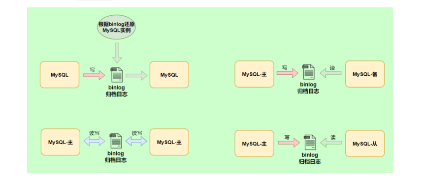

~~~sql

  -- *****************************************配置MySQL参数*******************************************************

  show variables like '%log_bin%';  -- 查看与二进制日志相关的变量
  -- 可以通过log-bin看到二进制日志默认是开启状态的
  -- log_bin_basename是binlog日志的基本文件名，后面会追加标识来表示每一个文件
  -- log_bin_index是binlog日志的索引文件，这个文件管理了所有binlog文件的目录
  -- 另外，log_bin_trust_function_creators代表的实际意义是是否限制存储过程，因为二进制日志的一个重要目的是为了进行主从复制，而存储函数可能会导致主从数据不一致，从而需要限制存储函数的创建、修改、调用
  -- log_bin_use_v1_row_events是一个只读的系统变量，ON表示使用版本1二进制日志行，OFF表示使用版本2二进制日志行，MySQL5.6时默认值为2，目前已弃用
  +---------------------------------+----------------------------------------------------------------------+
  | Variable_name                   | Value                                                                |
  +---------------------------------+----------------------------------------------------------------------+
  | log_bin                         | ON                                                                   |
  | log_bin_basename                | C:\ProgramData\MySQL\MySQL Server 8.0\Data\LZX的笔记本-bin           |
  | log_bin_index                   | C:\ProgramData\MySQL\MySQL Server 8.0\Data\LZX的笔记本-bin.index     |
  | log_bin_trust_function_creators | OFF                                                                  |
  | log_bin_use_v1_row_events       | OFF                                                                  |
  | sql_log_bin                     | ON                                                                   |
  +---------------------------------+----------------------------------------------------------------------+

  -- 下面的配置生效需要重启MySQL服务
  [mysqld]
  -- 启用二进制日志
  log-bin=atguigu-bin  -- log-bin参数用来替代上面的log_bin_basename的功能
  binlog_expire_logs_seconds=600  -- 表示一个二进制日志文件最多存在多少秒，超过指定时间就会被删除
  max_binlog_size=100M  -- 控制单个二进制文件的最大大小。但它并不能严格控制，因为如果事务较大时，为了保证事务的完整性，可能会导致单个二进制日志大小超过限定大小。

  set sql_bin_log=0;  -- 二进制日志的变量仅有session层面的，没有global层面的

  -- *****************************************查看二进制日志文件*******************************************************

  show binary logs;  -- 查看当前的二进制日志信息
  mysqlbinlog "二进制日志路径";  -- 使用MySQL提供的二进制日志查看工具查看二进制日志中的内容
  mysqlbinlog --no-defaults --help  -- 查看帮助
  mysqlbinlog --no-defaults --base64-output-decode-rows -vv "二进制日志路径" |tail -100    -- 查看指定二进制日志最后100行内容
  mysqlbinlog --no-defaults --base64-output-decode-rows -vv "二进制日志路径" |grep -A 20   -- 根据position方式查找
  show binlog events [in '二进制日志路径'] [from 查询起始行数] [limit [offset,] row_count]
  show binlog events in '二进制日志路径' from 300 limit 2,5\G;  -- 从300行开始查起，偏移两行（跳过前两个），查询五条
  -- 上面的查看方式都是基于binlog的默认格式的
  -- 我们还可以手动指定binlog的其它格式
  show variables like 'binlog_format';  -- 查看当前的binlog格式
  +---------------+-------+
  | Variable_name | Value |
  +---------------+-------+
  | binlog_format | ROW   |
  +---------------+-------+

  -- 默认的格式是ROW，还有Mixed和Statement
    -- Row:MySQL5.1.5才开始支持row level的复制，它不记录sql语句上下文相关信息，仅保存哪条记录被修改。该格式可以详细的记录每一行数据修改的细节，而且不会出现某些特定情况下的存储过程，或function，以及trigger的调用和触发无法被正确复制的问题
    -- Statement:每一条会修改数据的sql会记录在binlog中，它不需要记录每一行的变化，减少了binlog日志量，节约了IO，提高性能
    -- Mixed:MySQL5.1.8版本引入的新格式，实际上是Statement与Row的结合
  

~~~

---

### （五）锁

+ **事务的隔离性是由锁来保证并实现的**

#### ①概述

+ 在并发操作时，为了协调多个线程竞争统一资源，即保证数据的一致性，对并发操作进行控制。因此锁就诞生了
  + 锁并不是MySQL数据库独有的，在操作系统等其它领域也有锁的存在
  + **锁就是保证该数据在任何时刻最多只有一个线程在访问**
+ 在并发操作时，**并发事务访问相同记录的情况**大致可以划分为:
  + 读-读操作:
    + 都是读操作，并不会更改数据，因此没有什么影响，**一般不需要上锁**
  + 写-写操作:
    + 即并发事务都对相同数据进行更改，在该情况下可能会发生脏写的问题，任何一种隔离级别都不允许这种问题的发生。
    + 在多个未提交事务相继对一条记录做改动时，需要让它们排队执行。而这个**排队执行的过程就是通过锁来实现的**
  + 读-写操作或写-读操作:
    + 即一个事务写，一个事务读的情况，这种情况下可能发生脏读、不可重复读、幻读的问题
    + **各个数据库厂商对SQL标准的支持都可能不一样**。比如MySQL在 REPEATABLE READ 隔离级别上就已经解决了幻读问题
+ **当一个事务想对某个记录进行写操作时**
  + 先看看内存中有没有与这条记录关联的锁结构，如果没有，就会在内存中生成一个锁结构与之关联，就是上锁。当然可能会遇到如下情况:
    + 不加锁直接操作
    + 加锁成功，is_waiting属性为false
    + 检测到有锁，is_waiting属性为true，继续等待操作
  + 如果上锁成功了，事务就可以操作了，在commit操作后，事务就会将锁释放掉，此时如果有其它事务正在排队，那么排到的事务的is_waiting将被置为false
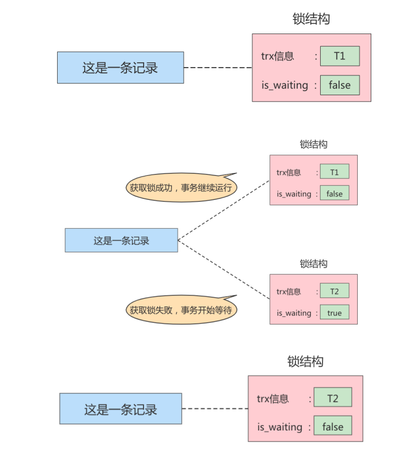
+ **并发问题的解决方案**
  + 读操作使用MVCC，写操作上锁
    + MVCC即生成一个ReadView,通过ReadView找到符合条件的记录版本（从undo日志找），查询语句只能读取到在生成ReadView之前的记录，从而避免脏读、不可重复读和幻读问题
      + 在`READ COMMITTED`隔离级别下，一个事务在执行过程中每次执行SELECT语句时都会产生一个ReadView,而**ReadView本身保证了事务不可以读取到未提交的改动数据这一特性**，这样就避免了脏读问题
      + 在`REPEATABLE READ`隔离级别下，一个事务在执行过程中只有第一次执行SELECT语句时会产生ReadView，这样就避免了脏读、不可重复读和幻读问题
  + 读写都上锁
  + 这两种方式中，**含有MVCC的方式效率较高，而都加锁的方式需要排队执行，效率低下**。但有的情况下，必须使用加锁的方式来确保事务的有序执行
+ **锁的分类**:

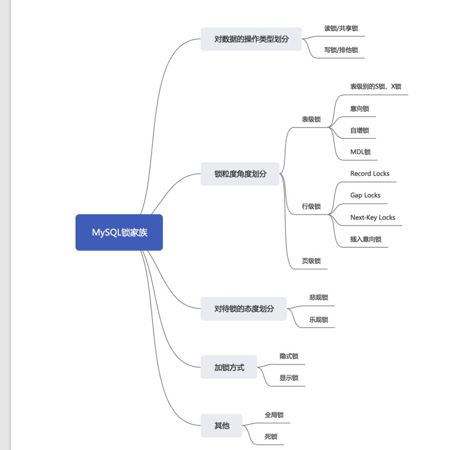

+ 锁升级:
  + 每个层级的锁数量都是有限制的，如果超过了这一限制，就会执行锁升级，用更大粒度的锁替代多个小粒度的锁。如InnoDB中的行锁升级为表锁。这样做的好处是**占用的锁空间降低了，但是并发效率也下降了**

---

#### ②S锁与X锁

+ S锁:即读锁(读锁其实也可以有排他性)，也称为共享锁，一般来讲，多个事务的读操作可以同时进行而不会互相影响、互相阻塞
+ X锁:即写锁，也成为排它锁，当前事务的写操作未完成时，他会阻塞其它写锁和读锁。这样就能确保在给定的时间里，只有一个事务能执行写入，并防止其他用户读取正在写入的同一资源

|锁类型|支持读锁|支持写锁|自己可读|自己可写|自己可操作其他表|他人可读|他人可写|
|:---:|:---:|:---:|:---:|:---:|:---:|:---:|:---:|
|S锁|√|×|√|×|×|√|×|
|X锁|×|×|√|√|×|×|×|

+ **对于InnoDB引擎来说，读锁和写锁可以加在表上，也可以加在行上**

~~~sql

  -- 对指定表上S锁
  LOCK TABLES 表名 READ
  -- 对指定表上X锁
  LOCK TABLES 表名 WRITE
  -- 为该事务的读取操作上锁
  查询语句 IN SHARE MODE
  -- MySQL8.0新增语法
  查询语句 FOR SHARE
  -- 为读取操作上X锁
  查询语句 FOR UPDATE

  查询语句 FOR UPDATE [{NOWAIT|SKIP LOCKED}]  -- 可选项是跳过锁等待

~~~

+ MySQL8.0之前，如果查询语句获取不到锁，会一直等待，直到`innodb_lock_wait_timeout`属性超时。在8.0以后，在查询语句后面写`NOWAIT`或`SKIP LOCKED`可以跳过锁等待。如果想查询的行被加上了锁:
  + NOWAIT会立即报错并返回
  + SKIP LOCKED语法也会立即返回，只是返回的结果不包含被上锁的行
+ DELETE、INSERT和UPDATE操作都会对行加上X锁:
  + 对一条记录做DELETE操作时，需要先在B+树索引中找到该行的位置，然后获取该记录的X锁，再将该记录标记为删除
  + 对记录做UPDATE操作时:
    + 若未修改记录的键值，且被更新的列的存储空间在修改前后未发生变化，那么先在B+树索引中找到该记录的位置后，再获取一下记录的X锁，最后在原记录的位置进行修改操作。我们可以将该情况下的操作看成是**锁定读**
    + 若未修改记录的键值，但被更新的列的存储空间在修改前后发生了变化，那么需要先在B+树索引中寻找该记录然后删除，再插入一条新记录。该操作也可以看成是**锁定读**，新插入的记录由INSERT操作提供的隐式锁进行保护
    + 修改了记录的键值，即在原记录上做DELETE操作，再做INSERT操作，**加锁操作就按DELETE和INSERT的规则进行**
  + 执行INSERT操作时。MySQL**通过一种叫做隐式锁的结构来保护新插入的记录在本事务提交前无法被别的事务访问**。

---

#### ③表锁

+ 加在表级别的锁称为表锁，表锁的粒度较粗，并发性能较差
+ 表锁包括元数据锁、意向锁、自增锁
+ **MDL锁**:
  + 如果一个查询正在遍历一个表中的数据，而执行期间另一个线程对这个表结构做变更，增加了一列，那么查询线程拿到的结果跟表结构对不上，肯定是不行的。
  + MySQL在5.5版本引入了MDL元数据锁(Metadata Locks)，**当对一个表做增删改查操作的时候，加MDL读锁；当要对表做结构变更操作的时候，加MDL写锁**
+ 表级的S锁与X锁:
  + 一般情况下InnoDB引擎不会提供表级别的S锁和X锁，只会在一些特殊情况下，比方说崩溃恢复过程中用到。InnoDB在进行记录相关的操作时，一般都会使用行锁
  + 想使用InnoDB的表级别锁，需要先修改系统变量`autocommit=0，innodb_table_locks=1`。
  + 手动获取InnoDB存储引擎提供的表t的S锁或者X锁可以这么写:

~~~sql
  LOCK TABLES 表名 READ -- 对表加读锁(S锁)
  LOCK TABLES 表名 WRITE  -- 对表加写锁(X锁)
~~~
+ **意向锁(Intention Lock)**:
  + InnoDB引擎支持多粒度锁(multiple granularity locking)，它允许行级锁与表级锁共存，意向锁就是该类的锁。
  + 意向锁分为两种:
    + 意向共享锁（`intention shared lock, IS`）:事务有意向对表中的某些行加共享锁（S锁）
    + 意向排他锁（`intention exclusive lock, IX`）:事务有意向对表中的某些行加排他锁（X锁）
  + 意向锁是存储引擎自己维护的，用户无法手动操作意向锁。在为数据行上S/X锁之前，InnoDB会先获取表的IS/IX锁:

~~~sql
  SELECT column FROM table ... LOCK IN SHARE MODE;  -- 事务想获得某些行的S锁，需要先获得表的IS锁
  SELECT column FROM table ... FOR UPDATE;  -- 事务想获得行的X锁，需要先获得表的IX锁
~~~
  + 意向锁解决的问题是**向其它事务提供一个快速地判断想操作的行是否存在锁的依据**。因为事务想上锁，必须先找是否该行存在锁，在判断时需要先找到该行（通过索引或遍历）来确定是否存在锁。但是这样做会耗费资源，因此**意向锁的存在使得事务只需要查看表锁就能判断其想操作的记录是否存在锁**
  + 例:有一个教师表，现在我们向里面插入6条记录，隔离级别为`可重复读`。
    + 在插入前，事务需要先判断该表是否被上了排它锁
    + 如果表没有排它锁，事务需要依次遍历每个行，判断它们是否存在排它锁，这就很浪费时间
    + 因此意向锁的作用就是快速地告诉事务某个行上存在锁

|锁类型|意向共享锁|意向排它锁|
|:---:|:---:|:---:|
|意向共享锁|兼容|兼容|
|意向排它锁|兼容|兼容|
|表级共享锁|兼容|不兼容|
|表级排它锁|不兼容|不兼容|

  + 意向锁不会与行级的共享锁和排它锁互斥
  + 同一个表中，意向锁可以有多个
  + 意向锁在保证并发的前提下，实现了行锁和表锁共存，且满足事务的隔离性的要求
+ **自增锁(Auto-Inc锁)**:
  + 自增锁是一种特殊的表级锁，MySQL在执行插入语句时就在表级别加一个AUTO-INC锁，然后为每条待插入记录的AUTO_INCREMENT修饰的列分配对应的自增值。
  + 自增相关的插入可以分为三类:
    + 简单插入:可以预先确定要插入的行数时，包括没有嵌套子查询的单行和多行插入语句，以及REPLACE语句的插入语句。
    + 批量插入:事先不知道要插入的行数，比如`insert .... select`、`replace ... select`、`load data`语句等，但不包括纯insert语句。InnoDB在处理每一行时，会为Auto_increment列分配一个新值。
    + 混合模式插入:该插入是简单插入中，手动指定新插入记录的自增值的，如`insert into test values (id,name) values (1,'a'),(NULL,b),(5,'c'),(NULL,d);`
  + 对于上面的三种插入方式，MySQL使用了自增锁的方式来实现。自增锁生效期间，其它事务的插入语句都会被阻塞，直到当前事务释放掉自增锁。但是这样做会使并发的效率显著降低，因此InnoDB提供了`innodb_autoinc_lock_mode`字段来让我们选择自增锁相关的不同处理机制:
    + `innodb_autoinc_lock_mode = 0(“传统”锁定模式)`:在此锁定模式下，所有类型的insert语句都会获得一个特殊的表级AUTO-INC锁。实际上就是我们上面的例子，它的**并发效率低下，但是安全性和可靠性强**。因为该模式使得插入语句中生成的auto_increment为顺序，且在binlog中重放的时候，可以保证master与slave中数据的auto_increment是相同的
    + `innodb_autoinc_lock_mode = 1(“连续”锁定模式)`:在MySQL8.0前，该模式是默认的。在此模式下，批量插入依然使用AUTO-INC表级锁，但是对于简单插入，就会通过mutex(轻量锁)获得所需数量的自动递增值来避免表级AUTO-INC锁。它只在分配过程的持续时间内保持，而不是直到语句完成。**它与AUTO-INC是互斥的**，即一个事务持有AUTO-INC锁时，本事务即使执行的是简单插入，也会等待。
    + `innodb_autoinc_lock_mode = 2(“交错”锁定模式)`:MySQL8.0开始，交错锁变为了默认配置。在此锁定模式下，自动递增值保证在所有并发执行的所有类insert语句中是唯一且单调递增的。但是，由于多个语句可以并发执行，**为任何给定语句插入的行生成的值可能不是连续的**

---

#### ④行锁

+ MySQL服务层并未实现行锁机制，因此行锁只在存储引擎层实现。MySQL支持的存储引擎中，InnoDB支持行级锁
+ 行锁的优点是**锁定力度小、发生锁冲突的概率低、可以实现的并发度高**；缺点是**对于锁的开销比较大、加锁较慢、容易出现死锁情况**
+ 行锁包括记录锁、间隙锁、临键锁、插入意向锁
+ **记录锁(Record Locks)**
  + 记录锁就是仅对一条记录加锁，官方的类型名称为`LOCK_REC_NOT_GAP`。
  + 例:
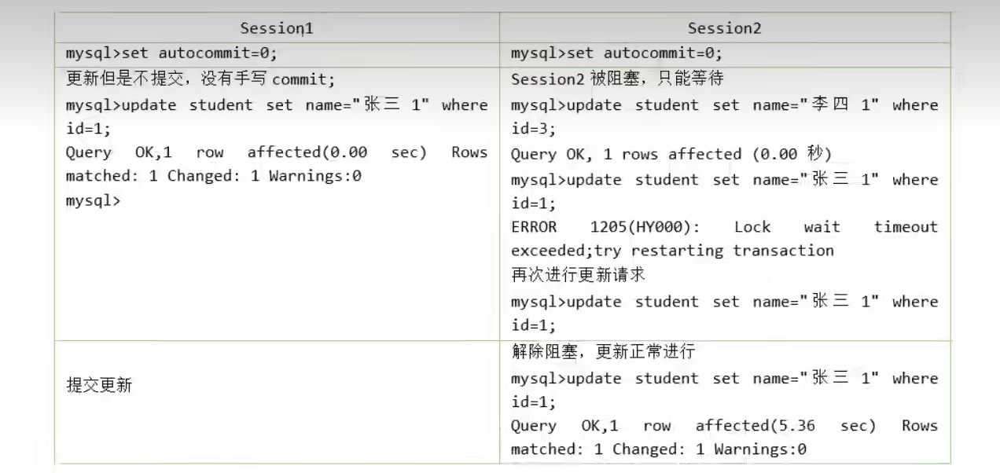
  + 记录锁也有S锁和X锁之分，他的兼容性也满足S锁和X锁的兼容性质
+ **间隙锁(Gap Locks)**
  + **间隙锁在可重复读及以上隔离级别下才会生效**
  + MySQL在不可重复读的隔离级别下就可以解决幻读问题了，解决方案有两种:一种是MVCC，另一种是加锁方案解决。
  + 如果出现幻读问题，事务在第一次读取数据时，由于这些幻影记录还未出现，无法给他们加锁。因此InnoDB提出了`Gap Lock`锁的概念，官方的称谓是`LOCK_GAP`，我们可以简称为gap锁

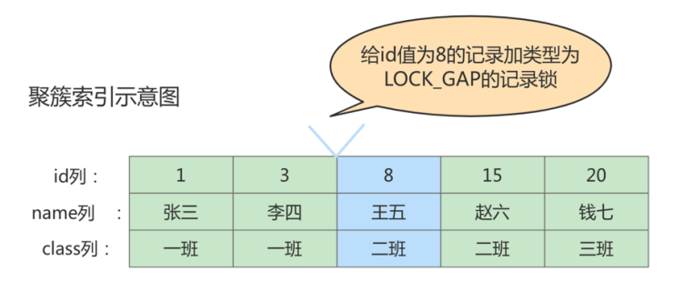

  + 图中id为8的纪录被添加上了gap锁，即表示id为8之前的间隙无法被插入记录，也就是id为3-8之间的这个间隙没办法插入记录。
  + gap锁的出现是为了防止插入幻影记录而提出的，虽然有共享gap锁和独占gap锁这样的说法，但是它们的作用是一样的。如果对一条记录加了gap锁，并不会影响其它事务对该记录继续加记录锁或gap锁
  + 例:

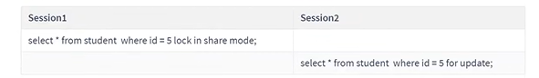

  + session2并不会被阻塞，因为表里面并没有id=5的记录，因此它们相当于都加入了gap锁。但是给一条记录加gap锁只能防止其前面的间隙插入新记录，如果想限制后面的间隙也不能插入新记录，就需要利用数据页中的最大最小记录(infimum、supremum)了
    + 为了防止其他事务向id=20之后的数据插入新记录，可以给索引中的最后一条记录，也就是id为20的记录所在的页面的supremum记录加一个gap锁
  + 监测gap锁的存在:

~~~sql
  select * from performance_schema.data_locks\G;
  select * from performance_schema.data_lock_wait\G;
~~~
  + 间隙锁的引入，使死锁出现的概率提高了，示例

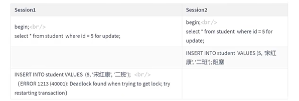

  + 在上例中，两个事务都上了间隙锁，但是它们都向其中插入了在间隙区间的记录，导致双方都在等待对方的锁释放，进入死锁状态
+ **临键锁**
  + 有时候我们既想锁住某条记录，又想阻止其他事务在该记录前边的间隙插入新记录 ，所以InnoDB就提供了临键锁。官方的类型名称为`LOCK_ORDINARY`，我们也可以称为next-key锁，该锁是在存储引擎为InnoDB，且事务级别在可重复读的情况下使用的数据库锁，它也是InnoDB默认的锁
  + 临键锁的本质就是记录锁+gap锁。它既能保护当前记录不受修改，也能保证该记录前面的间隙不被插入新记录
  + 例

~~~sql
  begin;
  select * from student where id<=8 and id >3 for update;
~~~
+ **插入意向锁**
  + 当有事务想向有间隙锁的间隙插入记录时，它会进行等待。在等待时也会在内存中创建一个锁，用来表示插入的意向，称为插入意向锁(insert intention lock)。当多个事务想向同一间隙的不同位置插入记录时，当间隙锁被释放时，这些事务之间不需要相互等待，直接插入就行。
  + 虽然插入意向锁名字看起来像意向锁，但是**它属于间隙锁**
  + 插入意向锁的特性:
    + 是一种特殊的间隙锁，可以锁上区间内的部分记录
    + 插入意向锁之间互不排斥
  + 例

  + 现在我们想向id为8的数据进行改动，事务1加了一个gap锁，事务2和事务3想向该间隙中插值，在等待，则锁结构就会成为:
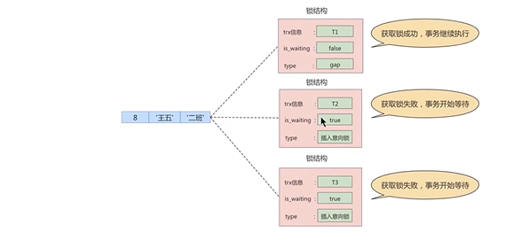
  + 从上例可以看出，**插入意向锁不会阻止止别的事务继续获取该记录上任何类型的锁**

---

#### ⑤页锁与全局锁

+ 页锁就是在页的粒度上进行锁定，锁定的数据资源比行锁要多，页锁的开销介于表锁和行锁之间，会出现死锁，且并发度一般。了解一下就行，不怎么用
+ 全局锁就是对整个数据库进行加锁，当我们想让整个数据库处于只读状态时，可以使用下面的命令:

~~~sql
  Flush tables with read lock  -- 上锁
  unlock tables;  -- 解锁
~~~

+ 使用命令以后，除查询之外的DDL、除查询之外的DML和更新类事务的提交语句都会被阻塞
+ 全局锁的典型应用场景是**全库逻辑备份**

---

#### ⑥乐观锁与悲观锁

+ 乐观锁与悲观锁是以对待锁的态度来划分的，从名字中可以看出这两种锁是两种看待数据并发的思维方式。**乐观锁和悲观锁并不是真正意义上的锁，而是一种设计思想**
  + **乐观锁(Optimistic Locking)**
    + 乐观锁认为对同一数据的并发操作并不总是发生，它是一种小概率事件，不用每次都对数据进行上锁，但是在更新的时候会判断一下在此期间别人有没有去更新这个数据。也就是**不采用数据库自身的锁机制，而是通过程序来实现**。程序上可以通过版本号机制或者CAS机制来实现。
    + 乐观锁适用于多读的应用类型，这样做可以提高吞吐量。在`java.util.concurrent.atomic`包下的原子变量类就是使用了乐观锁的一种实现方式。
    + 版本号机制
      + 在表中设计一个版本字段version，第一次读的时候，会获取version的字段值，然后对数据进行更新或删除操作时，执行`update ... set version=version+1 where version=version`。此时如果已经有事务对这条数据进行了更改，修改就不会成功
    + 时间戳机制
      + 与版本号机制类似，在执行更新的时候，将当前数据的时间戳与之前取得的时间戳进行比较，如果两者一致则更新成功，否则就是版本冲突。
    + 例:

~~~sql
  -- 以秒杀场景为例
  select quantity from items where id=1001;  -- 查询库存
  insert into orders (item_id) value(100);  -- 插入商品订单
  update items set quantity=quantity-num,version=version+1 where id = 1001 and version=#{version}  -- 减少对应库存

~~~
  + 在上例中，如果我们对同一个记录频繁进行修改的话，那么每次修改只有一个事务能够更新成功，在业务感知上面就会出现大量的失败操作，因此可以把第三段代码修改为:

~~~sql
  update items set quantity = quantity-num where id=1001 and quantity-num>0;
~~~
  + 这样每次修改就都能成功，且不会出现数据非法的情况了
  + **悲观锁(Pessimistic Locking)**
    + 悲观锁总是假设最坏的情况，每次去拿数据的时候都会认为别人会修改，所以每次拿数据的时候都会上锁。
    + 例

~~~sql
  -- 以秒杀场景为例
  select quantity from items where id=1001;  -- 查询库存
  insert into orders (item_id) value(100);  -- 插入商品订单
  update items set quantity=quantity-num where id = 1001  -- 减少对应库存
~~~

  + 以上面的方式写的话，在并发量小的情况没有什么问题，但是并发量很大时，就会出现问题:

  + 如果此时线程B已经完成修改并将库存减到了0，但是线程A依然执行了减库存的情况，就导致了超卖
  + 以悲观锁的角度来看，在查询库存时就应该上锁，然后在修改完毕之后才释放锁。

~~~sql
  select quantity from items where id=1001 for update;  -- 查询库存
  insert into orders (item_id) value(100);  -- 插入商品订单
  update items set quantity=quantity-num where id = 1001  -- 减少对应库存
~~~
  + 其中的`select ... for update`就是悲观锁。其它想修改id为1001的事务就必须要等待本事务执行完毕之后再执行，这样就保证了数据的一致性
  + 悲观锁不适用的场景较多，它存在一些不足，因为悲观锁大部分情况下都是依靠数据库的锁机制来实现以保证数据的并发访问性的，但这样会导致数据库的性能开销变大，特别是对于长事务来说，这样的开销往往非常巨大，无法承受。
+ **总结**
  + 乐观锁适合读操作多的场景，相对来说写的操作比较少。它的优点在于**程序实现，不存在死锁问题**，不过适用场景也会相对乐观，因为它阻止不了除了程序以外的据库操作
  + 悲观锁适合写操作多的场景，因为写的操作具有排它性。采用悲观锁的方式，**可以在数据库层面阻止其他事务对该数据的操作权限，防止读-写和写-写的冲突**

---

#### ⑦隐式锁与显式锁

+ 隐式锁与显式锁是以对待锁的态度来划分的
  + 隐式锁
    + 一个事务在执行insert操作时，如果它并未在内存中建立对应的锁结构，那么另一个事务如果想要读取他，而且能够读取，那么就会导致脏读问题。如果另一个事务想要修改它，而且可以修改，那么就会导致脏写问题
    + 这一问题的解决需要依赖我们的隐藏字段`trx_id`和`PAGE_MAX_TRX_ID`，如果是**聚簇索引**，`trx_id`可以记录最后改动该记录的事务id。当其它事务相对该字段添加S锁或X锁时，会先查看该记录对应的事务id是否是活跃状态，如果是活跃的，那就进入等待状态
    + 对于**二级索引记录**，他没有`trx_id`字段，但是它有`PAGE_MAX_TRX_ID`字段，该属性代表对本页面改动最大的事务id，如果它的值小于当前最小的活跃事务id，那么说明对该页面的所有修改都已经提交了，否则就要在页面中找到对应的二级索引记录，然后回表找到对应的聚簇索引记录，重复上面的操作
    + 即一个事务对新插入的记录可以不显式的加锁，但由于事务id的存在，相当于加了一个隐式锁。别的事务在对该记录加X锁或S锁的时候，由于隐式锁的存在，会帮助当前事务生成一个锁结构，然后自己再生成一个锁结构之后进入等待状态。也就是说，**隐式锁在实际的内存对象中并不含有这个锁信息，而当产生锁等待时，它会转换为显式锁**
    + 隐式锁是一种延迟加锁的机制，从而来减少加锁的数量
  + 显式锁
    + 显式锁就是通过特定的语句加的锁，就是显式锁

---

#### ⑧死锁

+ 死锁是指两个或多个事务在同一资源上相互占用，并请求锁定对方占用的资源，从而导致恶性循环

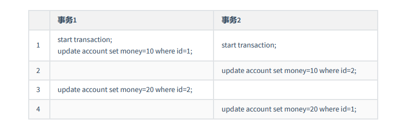

+ 产生**死锁的必要条件**有四个:
  + 两个或者两个以上的事务
  + 每个事物都持有锁，且申请新的锁
  + 锁资源同时只能被一个事务持有或者不兼容
  + 事务之间因为持有锁和申请锁导致彼此循环等待
+ **死锁的关键在于两个或两个以上的事务加锁的顺序不一致**
+ **死锁的处理**
  + 死锁的处理方式有两种:
    + **事务等待**，直到超时(innodb_lock_wait_timeout)。这种方式对于在线服务来说，等待时间往往是无法接受的。但将等待时间调低又会导致误伤到普通的锁等待
    + 使用**死锁检测**进行死锁处理
      + 被动等待效率过低，InnoDB就提供了`wait-for graph`算法来主动进行死锁问题检测，每当加锁请求无法立即满足并需要进行等待时，该算法就会被触发
      + 这是一种较主动的死锁监测方式，要求数据库保存锁的信息链表和事务等待链表两部分信息
        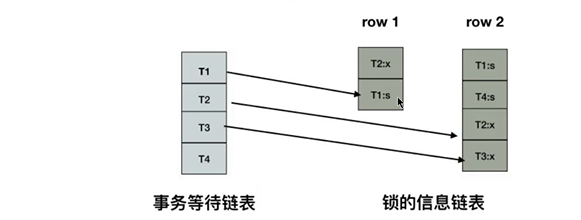
      + 基于该图(其中链表是从上到下的)，可以得到等待图
        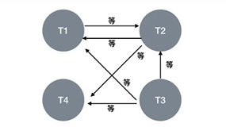
      + 死锁检测就是构建一个以事务为顶点，锁为边的有向图，如果该有向图存在环，那就说明有死锁
      + 但是当被阻塞的线程越来越多时，检测的线程数就会变多，从而导致监测占用的资源和时间大幅提升。解决方式就是**关闭死锁检测**，或者**控制并发访问的数量**，可以考虑将一行改为多行来减少锁冲突
+ **避免死锁**:
  + 合理设计索引，使业务SQL尽可能通过索引定位到更少的行，减少锁竞争
  + 调整业务逻辑SQL执行顺序，避免update/delete长时间持有锁的SQL在事务前面
  + 避免大事务，尽量将大事务拆成多个小事务来处理，小事务可以缩短锁定资源的时间，发生锁冲突的概率也更小
  + 在并发较高的系统中不要主动加锁，特别是在事务里面显式加锁的，如果在事务里面执行了start transaction或设置了autocommit的值为0，那么就会锁定所查找到的记录
  + 减低隔离级别，如果业务允许，可以避免掉很多因为间隙锁造成的死锁

---

#### ⑨内存结构

+ 锁结构会依据情况创建，当满足下列条件时，符合条件的记录将会被放到一条锁结构中:
  + 在同一个事务中进行加锁操作
  + 被加锁的记录在同一个页中
  + 加锁类型一致
  + 等待状态一致
+ 在InnoDB引擎中，锁的结构是这样的:

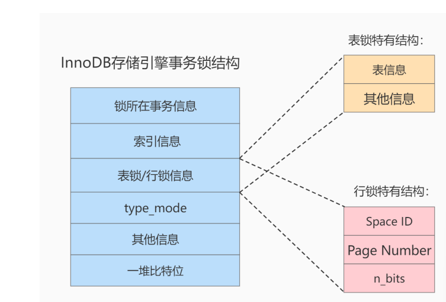

+ 结构解析:
  + 锁所在的事务信息:存储该锁所属的事务信息，它是一个指针
  + 索引信息:对于行锁来说，需要记录一下该行所在的索引信息，它也是一个指针
  + 表锁/行锁信息，**表锁结构和行锁结构在这个位置的内容是不同的**
    + 表锁:记载着是对哪个表加的锁，还有其他的一些信息
    + 行锁:记载了三个重要的信息:
      + `space ID`:记录所在表的空间
      + `Page number`:记录所在页号
      + `n_bits`:对于行锁来说，一条记录就对应着一个比特位，一个页面中包含很多记录，用不同的比特位来区分到底是哪一条记录加了锁。为此在行锁结构的末尾放置了一堆比特位，该属性代表使用了多少比特位。**n_bits的值一般都比页面中记录条数多一些**。主要是为了之后在页面中插入了新记录后也不至于重新分配锁结构
  + `type_mode`:这是一个32位的数，被分成了`lock_mode`、`lock_type`和`rec_lock_type`三个部分
    + `lock_mode`:锁的模式，占用低四位，可选的值如下:
      + LOCK_IS(十进制的0)，表示共享意向锁，也就是IS锁
      + LOCK_IX(十进制的1)，表示独占意向锁，也就是IX锁
      + LOCK_S(十进制的2)，表示共享锁，也就是S锁
      + LOCK_X(十进制的3)，表示独占锁，也就是X锁
      + LOCK_AUTO_INC(十进制的4)，表示自增锁，也就是AUTO-INC锁
      + 在InnoDB存储引擎中，LOCK_IS，LOCK_IX，LOCK_AUTO_INC都算是表级锁的模式，LOCK_S和LOCK_X既可以算是表级锁的模式，也可以是行级锁的模式
    + `lock_type`:锁的类型，占用第5～8位，不过现阶段只有第5位和第6位被使用:
      + LOCK_TABLE（十进制的16），也就是当第5个比特位置为1时，表示表级锁
      + LOCK_REC（十进制的32），也就是当第6个比特位置为1时，表示行级锁
    + `rec_lock_type`:行锁的具体类型，使用其余的位来表示。只有当`lock_type`值为`LOCK_REC`时该字段才会被细分为更多类型
      + LOCK_ORDINARY （十进制的 0 ）：表示临键锁，也就是next-key锁
      + LOCK_GAP （十进制的 512 ）：也就是当第10个比特位置为1时，表示间隙锁，也就是gap锁
      + LOCK_REC_NOT_GAP （十进制的 1024 ）：也就是当第11个比特位置为1时，表示正经记录锁
      + LOCK_INSERT_INTENTION （十进制的 2048 ）：也就是当第12个比特位置为1时，表示插入意向锁
      + 还有一些额外的，在此不再列举
    + `is_waiting`:该值是`type_mode`第九位的值，用来表示当前事务是否需要等待。当值为1时，表示true，值为0时表示false
  + 其他信息:为了更好的管理系统运行过程中生成的各种锁结构而设计了各种哈希表和链表
  + 一堆比特位:如果是行锁结构的话，在该结构末尾还放置了一堆比特位，比特位的数量是由上边提到的n_bits属性表示的

---

#### ⑩锁监控

+ 我们有时会有监控MySQL运行时的锁情况的需求，因此我们需要锁监控的帮助
+ 可以通过检查`InnoDB_row_lock`等状态变量来分析系统上的行锁竞争的情况:

~~~sql
  show status like '%innodb_row_lock%';
  +-------------------------------+-------+
  | Variable_name                 | Value |
  +-------------------------------+-------+
  | Innodb_row_lock_current_waits | 0     |
  | Innodb_row_lock_time          | 5847  |
  | Innodb_row_lock_time_avg      | 5847  |
  | Innodb_row_lock_time_max      | 5847  |
  | Innodb_row_lock_waits         | 1     |
  +-------------------------------+-------+
~~~

  + `Innodb_row_lock_current_waits`:当前正在等待锁定的数量
  + `Innodb_row_lock_time`:从系统启动到现在锁定总时间长度；（等待总时长）
  + `Innodb_row_lock_time_avg`:每次等待所花平均时间；（等待平均时长）
  + `Innodb_row_lock_time_max`:从系统启动到现在等待最常的一次所花的时间
  + `Innodb_row_lock_waits`:系统启动后到现在总共等待的次数；（等待总次数）
+ 这五个变量中，比较重要的是`Innodb_row_lock_time`、`Innodb_row_lock_time_avg`和`Innodb_row_lock_waits`
+ 另外，MySQL把事务和锁的信息记录在了information_schema库中，涉及到的三张表分别是`INNODB_TRX`、`INNODB_LOCKS`和`INNODB_LOCK_WAITS`
  + MySQL5.7之前，可以通过information_schema.INNODB_LOCKS查看到阻塞事务的锁，如果事务未被阻塞，那么该表中是看不到的
  + MySQL8.0删除了INNODB_LOCKS，添加了`performance_schema.data_locks`，可以通过它查看事务的锁情况，它既能看到被阻塞事务的锁，也能看到该事务所持有的锁
  + 同时information_schema.INNODB_LOCK_WAITS也被`performance_schema.data_lock_waits`所代替

---

### （六）MVCC

+ **MVCC（Multiversion Concurrency Control）**，多版本并发控制。顾名思义，MVCC是通过数据行的多个版本管理来实现数据库的并发控制。这项技术使得在InnoDB的事务隔离级别下执行一致性读操作有了保证。换言之，就是**为了查询一些正在被另一个事务更新的行，并且可以看到它们被更新之前的值，这样在做查询的时候就不用等待另一个事务释放锁**
+ MVCC主要解决的是读写或者写读问题

#### ①快照读与当前读

+ 快照读又叫一致性读，读取的是快照数据。不加锁的简单的SELECT都属于快照读，即不加锁的非阻塞读
  + 例:

    ~~~sql
        SELECT * FROM player WHERE ...
    ~~~
  + **快照读**的前提是隔离级别不是串行级别，串行级别下的快照读会退化成当前读
  + 因为是基于多版本，那么**快照读可能读到的并不一定是数据的最新版本，而有可能是之前的历史版本**
+ **当前读**读取的是记录的最新版本（最新数据，而不是历史版本的数据），**读取时还要保证其他并发事务不能修改当前记录，会对读取的记录进行加锁**。加锁的 SELECT，或者对数据进行增删改都会进行当前读
  + 例:

~~~sql
SELECT * FROM student LOCK IN SHARE MODE; -- 共享锁
SELECT * FROM student FOR UPDATE; -- 排他锁
INSERT INTO student values ... -- 排他锁
DELETE FROM student WHERE ... -- 排他锁
UPDATE student SET ... -- 排他锁
~~~

---

#### ②隐藏字段、Undo版本链与ReadView

+ MVCC不采用锁机制，而是使用乐观锁的思想来解决不可重复读和幻读问题。它可以在大多数情况下代替行锁，降低系统开销
+ **隐藏字段与Undo版本链**
  + MVCC使用的隐藏字段，主要有两个
    + `trx_id`:事务的ID号，当该行记录被对应事务修改时，其事务id就会被该字段记录
    + `roll_pointer`:回滚指针，指向undo log的指针，每次对某条聚簇索引记录进行改动时，都会把旧的版本写入到 undo日志 中，然后这个隐藏列就相当于一个指针，可以通过它来找到该记录修改前的信息
  + 假设插入记录的id是8:
    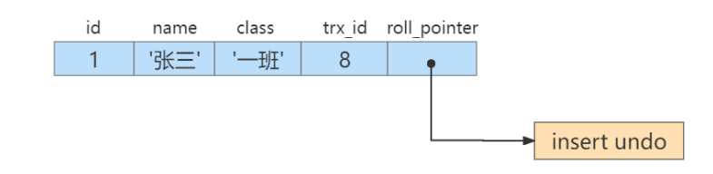
  + insert undo只在事务回滚时起作用，当事务提交后，该类型的undo日志就没用了，它占用的UndoLog Segment也会被系统回收（也就是该undo日志占用的Undo页面链表要么被重用，要么被释放）
  + 假设之后两个事务id分别为 10 、 20 的事务对这条记录进行 UPDATE 操作，操作流程如下：

    

  + 这里事务无法进行交叉更新，因为这样更新就是脏写问题了
  + 每次对记录进行改动，都会记录一条undo日志，每条undo日志也都有一个roll_pointer属性（ INSERT操作对应的undo日志没有该属性，因为该记录并没有更早的版本），可以将这些undo日志都连起来，串成一个链表

    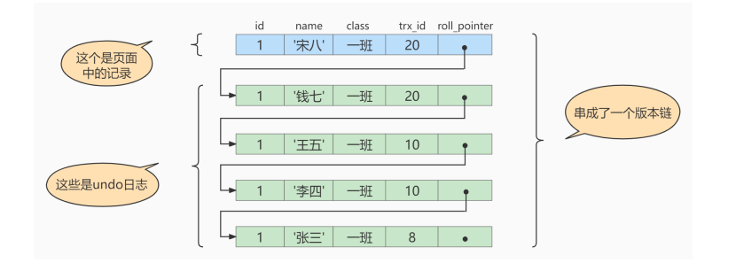

  + 对该记录每次更新后，都会将旧值放到一条undo日志中，就算是该记录的一个旧版本，随着更新次数的增多，所有的版本都会被roll_pointer属性连接成一个链表，我们把这个链表称之为版本链，版本链的头节点就是当前记录最新的值
  + 每个版本中还包含生成该版本时对应的事务id
+ **ReadView**
  + 在MVCC机制中，多个事务对同一个行记录进行更新会产生多个历史快照，这些历史快照保存在Undo里，上面的图已经交代过了
  + ReadView就是事务在使用MVCC机制进行快照读取操作时产生的读视图。当事务启动时，会生成数据库系统当前的一个快照，InnoDB为每个事务构造了一个数组，用来记录并维护当前活跃(事务已启动但未提交)事务的id。
  + **ReadView主要是针对的读已提交和可重复读的隔离级别**。读未提交都可以读取到未提交的记录了，就不需要快照和ReadView了，而可串行化使用了锁，因此也不需要MVCC
  + ReadView主要包含四个重要的字段
    + `creator_trx_id`:创建这个ReadView的事务ID
    + `trx_ids`:表示在生成ReadView时当前系统中活跃的读写事务的事务id列表 
    + `up_limit_id`:活跃的事务中**最小**的事务ID
    + `low_limit_id`:，表示生成ReadView时系统中应该分配给下一个事务的id值。low_limit_id是系统**最大**的事务id值，这里要注意是系统中的事务id，需要区别于正在活跃的事务ID。由于是下一个事务，所以是最大事务id+1。
      + **low_limit_id并不是trx_ids中的最大值**，事务id是递增分配的。比如，现在有id为1，2，3这三个事务，之后id为3的事务提交了。那么一个新的读事务在生成ReadView时，trx_ids就包括1和2，up_limit_id的值就是1，low_limit_id的值就是4。
    + 例:

      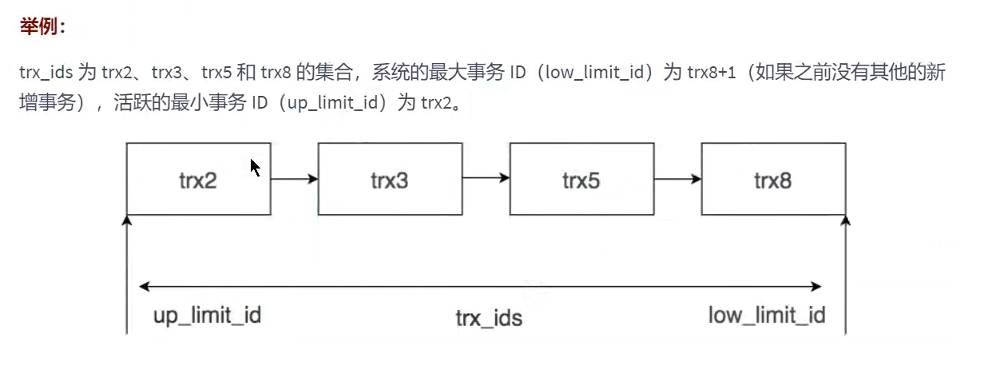

    + **ReadView规则**
      + 如果被访问版本的trx_id值与ReadView中的creator_trx_id相同，那么说明是同一个事务在读取值，所以该版本可以被访问
      + 如果被访问版本的trx_id属性值小于ReadView中的up_limit_id值，那么说明此事务已经提交了，当然可以被访问
      + 如果被访问版本的trx_id属性值大于或等于ReadView中的low_limit_id 值，说明此事务在当前ReadView生成之后才开始，因此该版本无法被当前事务所访问
      + 如果被访问版本的trx_id属性值在ReadView的up_limit_id和low_limit_id 之间，那就需要判断一下trx_id属性值是不是在trx_ids列表中
        + 如果在，说明创建ReadView时生成该版本的事务还是活跃的，该版本不可以被访问
        + 如果不在，说明创建ReadView时生成该版本的事务已经被提交，该版本可以被访问
    + MVCC整体操作流程
      + 首先获取事务自己的版本号，也就是事务 ID
      + 获取 ReadView
      + 查询得到的数据，然后与 ReadView 中的事务版本号进行比较
      + 如果不符合 ReadView 规则，就需要从 Undo Log 中获取历史快照
      + 最后返回符合规则的数据
    + 在**隔离级别为读已提交（Read Committed）时，一个事务中的每一次 SELECT 查询都会重新获取一次Read View**
      + 此时同样的查询语句都会重新获取一次Read View，这时如果Read View不同，就**可能产生不可重复读或者幻读的情况**

        

    + 当隔离级别为可重复读的时候，就避免了不可重复读，这是因为一个事务只在第一次 SELECT 的时候会获取一次 Read View，而后面所有的 SELECT 都会复用这个 Read View，如下表所示

        
+ **举例**
  + **在读已提交的隔离级别下**
    + 现在有两个事务id分别为10、20的事务在执行:
      + **事务在执行时，只有当真正的执行修改操作的语句时，才会被分配id**

        ~~~sql
          -- Transaction 10
          BEGIN;
          UPDATE student SET name="李四" WHERE id=1;
          UPDATE student SET name="王五" WHERE id=1;
          -- Transaction 20
          BEGIN;
          -- 更新了一些别的表的记录
          ...
        ~~~
    + 此刻，表student 中 id 为 1 的记录得到的版本链表如下所示

      
    + 假设现在有一个使用 READ COMMITTED 隔离级别的事务开始执行

      ~~~sql
        -- 使用READ COMMITTED隔离级别的事务
        BEGIN;
        -- SELECT1：Transaction 10、20未提交
        SELECT * FROM student WHERE id = 1; -- 得到的列name的值为'张三'
      ~~~
    + 这个SELECT1的执行流程如下:
      + 在执行SELECT语句之前生成一个ReadView,ReadView列表的内容就是[10,20]，up_limit_id为10，low_limit_id为21，creator_trx_id为0
      + 从版本链中挑选出可用的记录，可以看到，在trx_id为8的记录之前都是正在活跃中的事务，因此它们都不符合条件，最后就会得到trx_id为8的数据的记录

    + 之后，我们把 事务id 为 10 的事务提交一下

      ~~~sql
        -- Transaction 10
        BEGIN;
        UPDATE student SET name="李四" WHERE id=1;
        UPDATE student SET name="王五" WHERE id=1;
        COMMIT;
      
      ~~~

    + 然后再到 事务id 为 20 的事务中更新一下表 student 中 id 为 1 的记录

      ~~~sql
        -- Transaction 20
        BEGIN;
        -- 更新了一些别的表的记录
        ...
        UPDATE student SET name="钱七" WHERE id=1;
        UPDATE student SET name="宋八" WHERE id=1;
      ~~~
    + 此刻，表student中 id 为 1 的记录的版本链就长这样

      

    + 然后再到刚才使用 READ COMMITTED 隔离级别的事务中继续查找这个 id 为 1 的记录，如下:

      ~~~sql
        --  使用READ COMMITTED隔离级别的事务
        BEGIN;
        --  SELECT1：Transaction 10、20均未提交
        SELECT * FROM student WHERE id = 1; # 得到的列name的值为'张三'
        --  SELECT2：Transaction 10提交，Transaction 20未提交
        SELECT * FROM student WHERE id = 1; # 得到的列name的值为'王五'
      ~~~
    + 这个SELECT2的执行流程如下:
      + 在执行该SELECT语句时，又会单独生成一个ReadView
      + 此时生成的ReadView的列表内容仅有一个[20],up_limit_id为20，low_limit_id为21，creator_trx_id为0
      + 从版本链中挑选出可用的记录，可以看到，trx_id为10的记录因为已经提交了，所以读取trx_id为10对应的记录
  + **在可重复读隔离级别下**
    + 使用 REPEATABLE READ 隔离级别的事务来说，只会在第一次执行查询语句时生成一个 ReadView ，之后的查询就不会重复生成了
    + 比如，系统里有两个 事务id 分别为 10 、 20 的事务在执行

      ~~~sql
        -- Transaction 10
        BEGIN;
        UPDATE student SET name="李四" WHERE id=1;
        UPDATE student SET name="王五" WHERE id=1;
        -- Transaction 20
        BEGIN;
        -- 更新了一些别的表的记录
      ...
      ~~~
    + 此刻，表student 中 id 为 1 的记录得到的版本链表如下所示

      

    + 假设现在有一个使用 REPEATABLE READ 隔离级别的事务开始执行

      ~~~sql
        -- 使用REPEATABLE READ隔离级别的事务
        BEGIN;
        -- SELECT1：Transaction 10、20未提交
        SELECT * FROM student WHERE id = 1; # 得到的列name的值为'张三'
      ~~~
    + 执行SELECT语句之前，因为没有执行过SELECT语句，所以它是第一次执行，因此会生成一个ReadView，trx_ids的列表为[10,20],up_limit_id为10，low_limit_id为21，creator_trx_id为0
    + 之后，我们把 事务id 为 10 的事务提交一下，就像这样

      ~~~sql
        -- Transaction 10
        BEGIN;
        UPDATE student SET name="李四" WHERE id=1;
        UPDATE student SET name="王五" WHERE id=1;
        COMMIT;

      ~~~

    + 然后再到 事务id 为 20 的事务中更新一下表 student 中 id 为 1 的记录

      ~~~sql
        -- Transaction 20
        BEGIN;
        -- 更新了一些别的表的记录
        ...
        UPDATE student SET name="钱七" WHERE id=1;
        UPDATE student SET name="宋八" WHERE id=1;

      ~~~
    + 此刻，表student 中 id 为 1 的记录的版本链长这样

  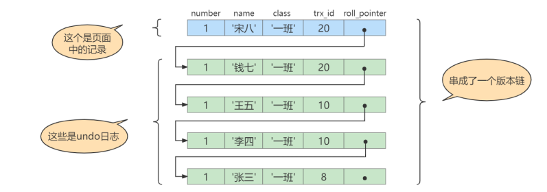

    + 然后再到刚才使用 REPEATABLE READ 隔离级别的事务中继续查找这个 id 为 1 的记录，如下

      ~~~sql
        -- 使用REPEATABLE READ隔离级别的事务
        BEGIN;
        -- SELECT1：Transaction 10、20均未提交
        SELECT * FROM student WHERE id = 1; # 得到的列name的值为'张三'
        -- SELECT2：Transaction 10提交，Transaction 20未提交
        SELECT * FROM student WHERE id = 1; # 得到的列name的值仍为'张三'
      ~~~

    + 步骤1:因为当前事务的隔离级别是REPEATABLE READ，而之前在执行SELECT1时已经生成过ReadView了，所以此时直接复用之前的ReadView，之前的ReadView的trx_ids列表的内容就是[10,20]，up_limit_id为10，low_limit_id为21,creator_trx_id为0
    + 步骤2:然后从版本链中挑选可见的记录，从图中可以看出，最新版本的列name的内容是`宋八`，该版本的trx_id
    + 步骤3:下一个版本的列name的内容是`钱七`，该版本的trx_id值为20，也在trx_ids列表内，所以也不符合要求，继续跳到下一个版本
    + 步骤4:下一个版本的列name的内容是`王五`，该版本的trx_id值为10，而trx_ids列表中是包含值10的事务id的，所以该版本也不符合要求，同理下一个列name的内容是`李四`的版本也不符合要求。继续跳到下一个版本。
    + 步骤5:下一个版本的列name的内容是`张三`，该版本的trx_id值为80，小于ReadView中的up_limit_id的值10，所以这个版本是符合要求的，最后返回给用户的版本就是这条列c为`张三`的记录
    + 两次SELECT查询得到的结果是重复的，记录的列c的值都是`张三`，这就是可重复读的含义，如果我们之后再把事务id为20的记录提交了，然后再到刚才使用`REAEATABLE READ`隔离级别的事务中继续查找这个id为1的记录，得到的结果还是`张三`，具体执行的过程具体自行分析。

---

#### ③解决幻读

+ 接下来来说明InnoDB如何解决幻读
+ 假设现在表 student 中只有一条数据，数据内容中，主键 id=1，隐藏的 trx_id=10，它的 undo log 如下图所示

+ 假设现在有事务A和事务B并发执行:
  + 步骤1:A执行了一条查询语句

    ~~~sql
      select * from student where id >= 1;
    ~~~

  + 在开始查询之前，MySQL 会为事务 A 产生一个 ReadView，此时 ReadView 的内容如下： trx_ids=[20,30] ， up_limit_id=20 ， low_limit_id=31 ， creator_trx_id=20
  + 由于此时表 student 中只有一条数据，且符合 where id>=1 条件，因此会查询出来。然后根据 ReadView机制，发现该行数据的trx_id=10，小于事务 A 的 ReadView 里 up_limit_id，这表示这条数据是事务 A 开启之前，其他事务就已经提交了的数据，因此事务 A 可以读取到
  + 结论：事务 A 的第一次查询，能读取到一条数据，id=1
  + 步骤2：接着事务 B(trx_id=30)，往表 student 中新插入两条数据，并提交事务

    ~~~sql
      insert into student(id,name) values(2,'李四');
      insert into student(id,name) values(3,'王五');
    ~~~

  + 此时表student 中就有三条数据了，对应的 undo 如下图所示

    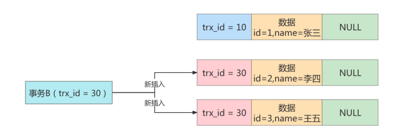

  + 步骤3：接着事务 A 开启第二次查询，根据可重复读隔离级别的规则，此时事务 A 并不会再重新生成ReadView。此时表 student 中的 3 条数据都满足 where id>=1 的条件，因此会先查出来。然后根据ReadView 机制，判断每条数据是不是都可以被事务 A 看到
    + （1）首先 id=1 的这条数据，前面已经说过了，可以被事务 A 看到
    + （2）然后是 id=2 的数据，它的 trx_id=30，此时事务 A 发现，这个值处于 up_limit_id 和 low_limit_id 之间，因此还需要再判断 30 是否处于 trx_ids 数组内。由于事务 A 的 trx_ids=[20,30]，因此在数组内，这表示 id=2 的这条数据是与事务 A 在同一时刻启动的其他事务提交的，所以这条数据不能让事务 A 看到
    + （3）同理，id=3 的这条数据，trx_id 也为 30，因此也不能被事务 A 看见

      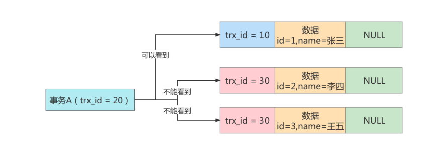

    + 结论：最终事务 A 的第二次查询，只能查询出 id=1 的这条数据。这和事务 A 的第一次查询的结果是一样的，因此没有出现幻读现象，所以说在 MySQL 的可重复读隔离级别下，不存在幻读问题

---

#### ④总结

+ 读已提交进行一次查询操作就要生成一个ReadView
+ 可重复读仅在第一次查询操作时才生成一个ReadView
+ MVCC可以解决的问题:
  + **读写之间阻塞的问题**:通过MVCC可以让读写互不阻塞，以提高事务的并发能力
  + **降低了死锁的概率**:因为MVCC采用了乐观锁的方式，读取数据时并不加锁。对于写操作，也仅是对必要的行加锁
  + **解决快照读的问题**:当我们查询数据库在某个时间点的快照时，只能看到这个时间点之前事务提交更新的结果，而不能看到这个时间点之后事务提交的更新结果。

---