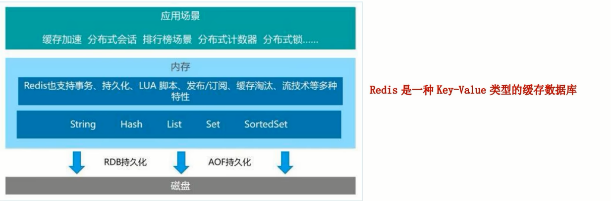
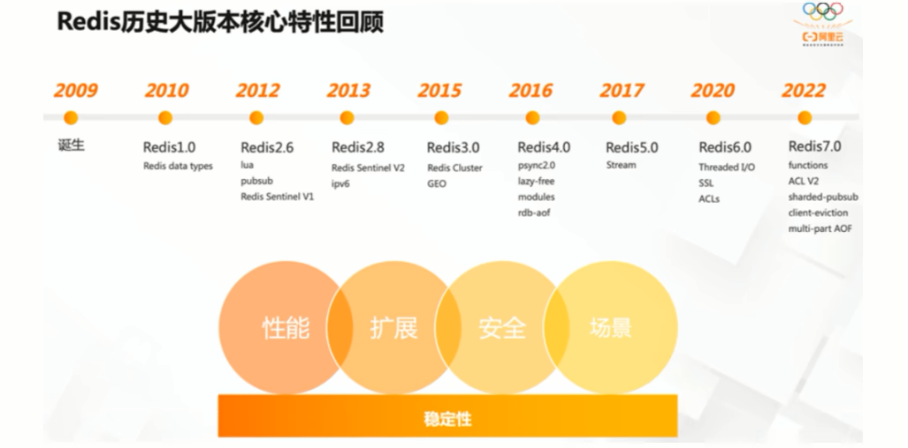
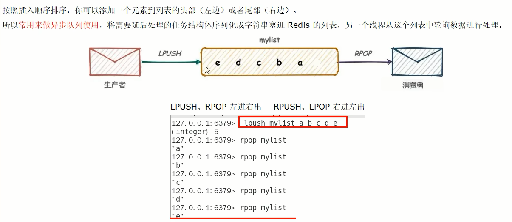
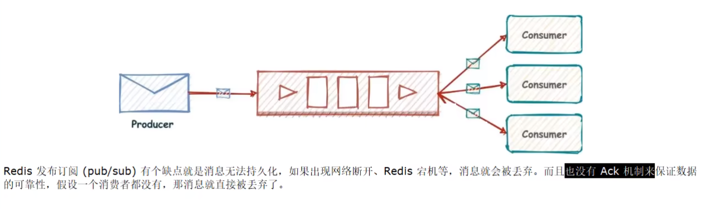
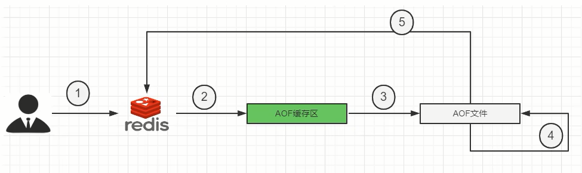
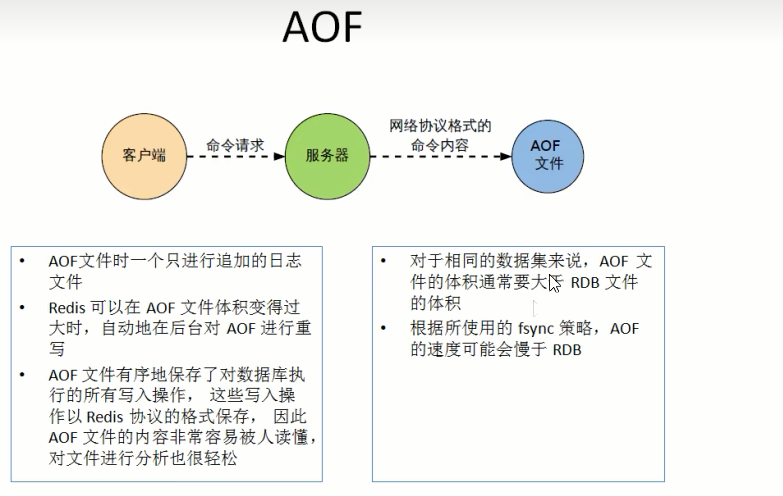
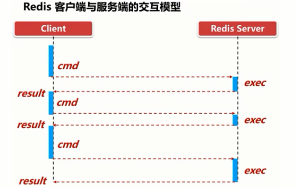
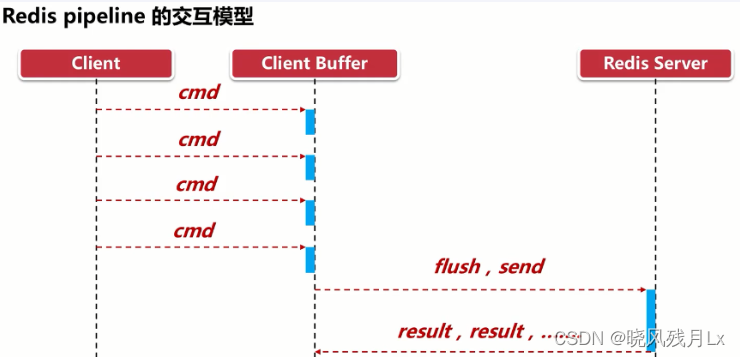
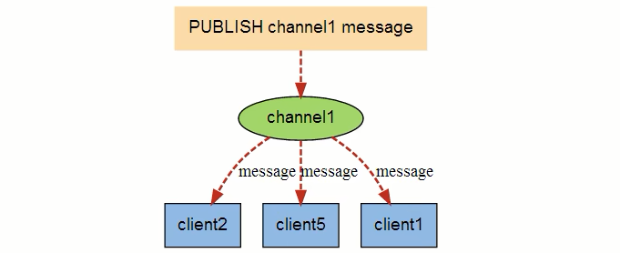

# Redis基础笔记

## 一、概述

+ Redis(Remote Dictionary Server)是一款开源的、使用ANSIC语言编写的高性能的键值型数据库，它支持多种丰富的数据类型，且数据存储在内存中。它支持事务、持久化、LUA脚本、发布/订阅、缓存淘汰、流技术等多种功能，提供了主从模式、Redis Sentinel和Redis Cluster集群架构方案
+ Redis一般与MySQL一起使用，**充当缓存的作用**

### （一）与MySQL的比较

+ Redis属于NoSQL数据库，是键值型数据库。MySQL是关系型数据库
+ Redis的数据操作主要在内存，MySQL的数据主要存储在磁盘
+ Redis在计数器、排行榜等方面要明显优于MySQL
+ Redis通常用于一些特定场景，需要与MySQL一起配合使用

---

### （二）功能

+ Redis有许多功能
  + 它可以作为缓存，在MySQL之前响应数据:用于提升性能
  + 内存存储和持久化:​ Redis支持异步将内存中的数据写到硬盘上，同时不影响继续服务
  + 高可用架构搭配:单机、主从、哨兵、集群
  + 预防缓存击穿、穿透、雪崩
  + 支持分布式锁
  + 支持队列
  + 排行榜+点赞功能性能高

---

### （三）优势

+ 在内存中操作数据，性能优秀
+ 支持丰富的数据类型
+ 支持数据的持久化，避免突发事件导致数据丢失
+ 支持数据备份，即使用主从架构

---

### （四）版本

+ Redis从2009年诞生，目前的Redis版本是7

+ Redis版本的命名规则是:
  + 版本号第二位如果是奇数，则为非稳定版本，如2.7、2.9、3.1
  + **版本号第二位如果是偶数**，则为**稳定版本**，如2.6、2.8、3.2
  + 当前奇数版本就是下一个稳定版本的开发版，如2.9版本就是3.0版本的开发版本
+ 我们可以通过redis.io[官网](https://download.redis.io/releases/)来下载自己感兴趣的版本进行源码阅读

---

## 二、安装与卸载

### （一）安装

+ 这里以CentOS7为例进行安装
+ Redis安装需要依赖如下环境:
  + gcc编译器:我们可以通过`gcc -v`来查看当前gcc的版本，一般CentOS都自带gcc编译器，如果没有，就执行`yum -y install gcc-c++`进行安装
+ 接下来开始安装
  + 使用cd命令进入到想存放redis压缩包的文件夹内
  + 使用`wget https://download.redis.io/releases/redis-7.0.2.tar.gz`命令下载Redis压缩包，想查阅版本有哪些[点击这里](https://download.redis.io/releases/)
  + 使用`tar -zxvf redis压缩包路径 [-C 目标路径]`来解压缩Redis压缩包
  + 进入压缩好的redis目录，执行`make && make install`来进行安装，当出现`It's a good idea to run 'make test'`就说明安装好了，安装时需要确保网络通畅。安装默认放入默认安装目录`/usr/local/bin`目录中，它相当于Windows系统C盘的`C://ProgramFiles`文件夹。到这里我们的Redis就安装好了，但是我们还需要进行一些配置
  + 对应的配置文件在解压完的redis目录中，该文件名叫`redis.conf`，我们一般不会修改这里的配置文件，而是会拷贝一份。使用cp命令把这玩意拷到一个目录里面
  + 接下来使用vim对它进行编辑
    + 默认`daemonize no`改为`daemonize yes`
    + 默认`protected-mode yes`改为`protected-mode no`，将保护模式关闭以让外界可以连接到Redis
    + 默认`bind 127.0.0.1`改为直接注释掉(默认bind 127.0.0.1只能本机访问)或改成本机IP，否则影响远程IP连接
    + 默认requirepass后面加上自己设置的密码，**这个密码就是之后Redis连接要用到的密码**
  + 接下来就可以启动了:
    + `redis-server 我们自己写的配置文件路径`来启动Redis服务。我们可以输入`ps -ef|grep redis|grep -v grep`来查看redis服务的详情
    + `redis-cli -a 密码 -p [端口号]`来连接Redis。端口号可以不写，不写默认是6379。因为Redis默认占用6379端口号
    + 连接后可能会出现一段报错信息:`Warning: Using a password with '-a' or '-u' option on the command line interface may not be safe.`。不用管它
    + 接下来输入`set k1 helloWorld`放一个键值对进去，再输入`get k1`它就可以输出`helloWorld`了
    + 输入`ping`,显示`pong`时，代表安装成功
    + 输入`quit`可以退出Redis连接
  + 如果我们想关闭服务器
    + 如果在连接中，直接使用`shutdown`命令，关闭服务
    + 如果在连接之外，使用`redis-cli -a 123456 shutdown`来关闭单实例服务
    + 如果在连接之外，使用`redis-cli -p 6379 shutdown`来指定端口进行关闭

---

### （二）卸载

+ 首先停止`redis-server`服务
  + `redis-cli -a 123456 shutdown`
+ 接下来删除`/usr/local/bin`目录中所有与redis相关的文件
  + `rm -rf /usr/local/bin/redis-*`
+ 这样就删除成功了

---

## 三、数据类型

+ Redis现在共有[十大数据类型](https://redis.io/docs/data-types/)，它们分别是:
  + String
    + 即字符串，**Redis最基本的数据类型。**
    + String类型是二进制安全的，它可以包含任何数据，包括图片或者序列化的对象。
    + 一个redis中字符串value最大为512M
  + List
    + 即**简单的字符串列表，按照插入顺序排序**
    + 我们可以在头部插入，也可以在尾部插入。它的底层实际上是一个双端链表
    + 最多可以包含2^32-1个元素
  + Hash
    + 是string类型的field（字段）和value（值）的映射表，**Hash特别适合用户存储对象**
    + Redis中每个Hash可以存储2^32-1个键值对（40多亿）
  + Set
    + 是**String类型的值组成的无序、不重复的数据集合**。集合对象的编码可以是inset和HashTable
    + Set是通过哈希表实现的，因此添加、删除和查找的时间复杂度都是O(1)
    + 集合中最大的成员数为2^32-1
  + sorted Set(ZSet)
    + **可以排序的Set集合**，它的每个元素都关联着一个double类型的分数，通过元素关联的分数来为元素进行排序
    + ZSet中的元素是不重复的，但Set元素关联的分数可以重复
    + 它也是通过哈希表实现的，因此添加、删除和查找的时间复杂度都是O(1)
  + Geospatial
    + Redis GEO**主要用于存储地理位置信息**，并对存储的信息进行操作
    + 操作包括:添加地理位置的坐标、获取地理位置的坐标、计算两个位置之间的距离
  + HyperLogLog
    + HyperLogLog是用来做基数统计的算法，其优点是**在输入元素的数量或者体积非常非常大时，计算基数所需要的空间总是固定且是很小的**
    + 在Redis里面，每个HyperLogLog键只需要花费12KB内存，就可以计算接近2^64个不同元素的基数
    + 但是，因为HyperLogLog只会根据输入元素来计算基数，而不会存储输入元素本身，所以HyperLogLog不能像集合那样，返回输入的各个元素
  + Bitmap
    + 由0和1状态表现的二进制位的bit数组
  + Bitfield
    + 通过bitfield命令我们可以一次性对多个比特位域进行操作
  + Stream
    + Redis Stream是Redis5.0版本新增加的数据结构，主要用于消息队列
    + Redis Stream提供了消息的持久化和主备复制功能，可以让任何客户端访问任何时刻的数据，并且能记住每一个客户端的访问位置，还能保证消息不丢失。以弥补Redis无法记录历史消息的缺点

---

### （一）String类型

+ [官网文档](https://redis.io/docs/data-types/strings/)
+ 字符串是最Redis基本的数据类型，它可以包含任何数据，包括图片或者序列化的对象
+ 一个redis中字符串value最大为512M

|命令|参数|作用|备注|
|:---:|:---:|:---:|:---:|
|`set key value [NX\|XX] [GET] [EX 秒值\|PX 毫秒值\|EXAT unix时间戳值(秒)\|PXAT unix时间戳值(毫秒)\|KEEPTTL]`|NX:对应键不存在时，创建一个键值对 XX:对应键存在时，创建一个键值对 GET:返回指定键原本的value值 EX:以秒为单位设置过期时间 PX:以毫秒为单位设置过期时间 EXAT:以以秒为单位的Unix时间戳设置过期时间 PXAT:以以毫秒为单位的Unix时间戳设置过期时间 KEEPTTL:保留之前的键值对设置的过期时间|修改或添加一个键值对|如果上一个键值对有过期时间，而本次未指定过期时间，那么修改后的键值对过期时间将被覆盖|
|`get key`|无参|得到对应的键所对应的值|无|
|`mset key1 value1 [key2 value2 ....]`|无参|批量设置键值对|无|
|`mget key1 [key2...]`|无参|批量获取键对应的值|无|
|`mesetnx key1 value1 [key2 value2 ....]`|无参|批量设置键值对，且这些键值对必须在之前都不存在|只要这些键有一个存在，那么就都不会执行|
|`getrange key start end`|start:开始下标 end:结束下标|截取字符串，**截取的区间是[start,end]**|可以传入负数|
|`setrange ket offset value`|offset:要进行覆盖的开始下标 value:替换的新值|将key对应的value从开始下标起替换为新值，即替换部分值|无|
|`incr key`|无参|自增+1|需要字符串是纯整数|
|`incrby key number`|number:增加的值|自增对应的number值|^|
|`decr key`|无参|自减-1|^|
|`decrby key number`|number:减少的值|自减对应的number值|^|
|`strlen key`|无参|获得字符串长度|无|
|`append key value`|value:值|字符串的拼接|无|
|`getset key value`|value:值|先get再set|无|

---

### （二）List

+ 简单的字符串列表，按照插入顺序排序，我们**可以在头部插入，也可以在尾部插入**。它的底层实际上是一个双端链表。因此我们通过索引下标操作中间的节点性能会较差
+ 最多可以包含2^32-1个元素

|命令|参数|作用|备注|
|:---:|:---:|:---:|:---:|
|`lpush list value1 [value2....]`|无参|在头部连续插入对应的值|无|
|`rpush list value1 [value2 ....]`|无参|在尾部连续插入对应的值|无|
|`lrange list start end`|start:开始下标 end:结束下标|列表的切片，**截取的区间是[start,end]**|可以传入负数|
|`lpop list`|无参|删除指定列表的头部元素并返回|无|
|`rpop list`|无参|删除指定列表的尾部元素并返回|无|
|`lindex list index`|index:指定的索引|按照索引获取元素值（从头到尾）|无|
|`llen list`|无参|得到列表的元素数量|无|
|`lrem key count element`|count:指定要删除的数量 element:要删除的元素|从头到尾删除对应数量的element|无|
|`ltrim key start stop`|start:开始下标 end:结束下标|仅使列表保留切片区间内的值,**截取的区间是[start,end]**|可以传入负数|
|`rpoplpush list1 list2`|list1:源列表 list2:目的列表|移除源列表的最后一个元素，并将该元素添加到目的列表并返回|无|
|`lset key index value`|index:下标 value:新值|为指定下标的元素赋值|无|
|`linsert key {before\|after} pivot element`|pivot:指定的标志元素 element:要插入的值|在指定的标志元素前面或后面插入新值|无|

---

### （三）Hash

+ 省流:`Map<String,Map<Object,Object>>`

|命令|参数|作用|备注|
|:---:|:---:|:---:|:---:|
|`hset key field1 value1 [field2 value2]`|fieldn valuen:键值对|向key对应的Map中添加值|无|
|`hget key field`|field:Map中的键|得到key对应的Map中的键对应的值|无|
|`hmset key field1 value1 [field2 value2]`|fieldn valuen:键值对|向key对应的Map中添加值|当前版本的hmset功能已被hset取代，该命令已弃用|
|`hmget key field1 [field2]`|field:Map中的键|得到key对应的Map中的多个键对应的值|无|
|`hgetall key`|无参|得到key对应的Map中的全部键值对|无|
|`hdel key field1 [field2]`|field:Map中的键|通过传入键的方式批量删除key对应的Map中的键值对|无|
|`hlen key`|无参|获取对应key对应的Map的键值对数量|无|
|`hexists key field`|field:Map中的键|判断指定的键是否存在|无|
|`hkeys key`|无参|获取Map中全部的键|无|
|`kvals key`|无参|获取Map中全部的值|无|
|`hincrby key field increment`|field:Map中的键 increment:自增值，需要是**整数**|给Map中的键对应的值自增指定的值|无|
|`hincrbyfloat key field increment`|field:Map中的键 increment:自增值，需要是**浮点数**|^|无|
|`hsetnx key field value`|field value:键值对|如果Map中不存在，就进行赋值|无|

---

### （四）Set

+ 不重复的无序集合
+ Set是通过哈希表实现的，因此添加、删除和查找的时间复杂度都是O(1)

|命令|参数|作用|备注|
|:---:|:---:|:---:|:---:|
|`sadd key value1 [value2...]`|无参|向set中添加value|无|
|`smembers key`|无参|遍历输出对应set的值|无|
|`sismember key value`|value:要检验的值|检查对应的值是否在member|无|
|`srem key value1 [value2]`|value:要删除的元素|批量删除set中的元素|无|
|`scard key`|无参|统计set中的元素个数|无|
|`srandmember key number`|number:指定要取出的元素|从set中随机取出指定数量的元素|不会使set中的元素被删除|
|`spop key number`|number:指定要删除的元素|从set中随机删除指定数量的元素并返回|无|
|`smove key1 key2 value`|key1:源set key2:目的set value:源set的值|将key1中的对应值取出并添加进key2中|无|
|`sdiff key1 [key2 ...]`|无参|计算多个set的差集，从左到右进行运算|无|
|`sunion key1 [key2 ...]`|无参|计算集合的并集，从左到右进行运算|无|
|`sinter key1 [key2 ...]`|无参|计算集合的交集，从左到右进行运算|无|
|`SINTERCARD [numkeys] key1 [key2...] [limit count]`|numkeys:由输入的key个数决定 count:限制交集的最大元素数量，若取交集时元素数量到达该阈值，那么直接退出并返回|返回各set集交集的结果内包含的元素数量|该命令是7.0新增命令|

---

### （五）ZSet

+ sorted set(ZSet)在set的基础上，使每个set元素关联一个分数，使set集合依据该分数进行排序。这个分数不是数学上的分子分母的分数，是score那个意思的分数

|命令|参数|作用|备注|
|:---:|:---:|:---:|:---:|
|`zadd key score1 value1 [score2 value2]`|scoren valuen:与分数相关联的元素值|向ZSet中添加元素|无|
|`zrange key min max [withscores]`|min:最小索引 max:最大索引|输出指定区间内的元素，**截取的区间是[min,max]**。如果写了withscores，那么连着分数一起输出|无|
|`zrevrange key min max [withscores]`|^|倒序输出指定区间内的元素，**截取的区间是[min,max]**。如果写了withscores，那么连着分数一起输出|无|
|`zrangebyscore key min max [withscores] [limit offset count]`|min:最小索引 max:最大索引 offset:截取偏移量 count:截取的最大数量|获取指定区间内（[min,max]）的元素，如果想有一方开区间，在前面加一个`(`即可，如果有withscores那么连着分数一起输出；如果有limit那么还要进行切片|无|
|`zscore key value`|value:值|获得对应值关联的分数|无|
|`zcard key`|无参|获取集合中元素的数量|无|
|`zrem key value1 [value2]`|valuen:要删除的值|批量删除对应的元素|无|
|`zincrby key count value`|count:自增的值 value:要自增的值|给指定的zset中的元素自增值顶的值|无|
|`ZCOUNT key min max`|min:最小分数值 max:最大分数值|获得指定**分数区间**内的元素个数|无|
|`zmpop numkeys key1 [key2....] {min\|max} [count number]`|numkeys:该值取决于后面key的个数 number:指定删除并输出的元素数量|**从左到右开始寻找，找到第一个非空的zset集合**，并依据min和max来决定删除该集合并输出的元素，依据number来决定删除的元素数量。**如果第一个非空集合都删空了也没有达到number的指标，那么直接退出**|该命令是7.0新增命令 |
|`zrank key value [withscore]`|无参|获得value的顺序下标值|无|
|`zrevrank key value [withscore]`|无参|获得value的逆序下标值|无|

---

### （六）Bitmap

+ Bitmap由0和1状态表现的二进制位的bit数组，它的本质是一个数组

|命令|参数|作用|备注|
|:---:|:---:|:---:|:---:|
|`setbit key offset value`|offset:数组下标 value:指定位，只能是0或1|指定数组下标的位值|无|
|`getbit key offset`|offset:数组下标|得到对应下标的值|无|
|`strlen key`|无参|统计字节的占用量，每8位组成一个字节|无|
|`bitcount key [start end [byte\|bit]]`|start:开始下标 end:结束下标|统计指定区间内值是1的有多少个，如果没有写明区间默认是统计整个数组|无|
|`bitop operation destkey key1 [key2...]`|destkey:存储运算结果的bitmap operation:共有四种模式,and、or、xor、not分别对应与运算、或运算、异或运算和取反运算|对一个或多个bitmap执行位运算|无|

---

### （七）HyperLogLog

+ HyperLogLog是用来做基数统计的算法，就是去重统计
+ 该类型不会存储数据，且有一定的误差(0.83%)，但其性能优异

|命令|参数|作用|备注|
|:---:|:---:|:---:|:---:|
|`pfadd key value1 [value2 ...]`|valuen:元素值|将指定元素添加到HyperLogLog中进行统计|无|
|`pfcount key1 [key2...]`|无参|将多个HyperLogLog取并集并统计去重元素的个数|无|
|`pfmerge destkey key1 [key2...]`|destkey:接收结果的HyperLogLog|将多个HyperLogLog合并为一个|无|

---

### （八）GEO

+ Geospatial主要用来存储地理位置信息，它可以有效解决传统数据库对于地理空间表示缺陷的问题:
  + 查询性能问题:如果并发高，数据量大这种查询是要搞垮数据库的
  + 我们有时希望得到以我们为中心的圆的地理位置信息，而不是以我们为中心的矩形的地理位置信息
  + 精准度问题:地球不是平面坐标系，而是一个圆球，这种矩形计算在长距离计算时会有很大误差
+ GEO底层实际上是使用zset进行存储的

|命令|参数|作用|备注|
|:---:|:---:|:---:|:---:|
|`geoadd key longitude latitude value [longitude latitude value ...]`|longitude:经度信息 latitude 纬度信息 value:该位置的名称|添加位置信息|无|
|`geopos key value1 [value2]`|valuen:位置名称|根据位置名称得到位置的经纬度信息|无|
|`geodist key value1 value2 {m\|km\|ft\|mi}`|value1:位置名称1 value2:位置名称2 m:以米为单位 km:以千米为单位 ft:以英寸为单位 mi:以英里为单位|得到两个给定位置之间的距离|无|
|`georadius key longitude latitude radius {m\|km\|ft\|mi} [withcoord] [withdist] [withhash] [count number [any]]`|longitude:中心的经度信息 latitude:中心的纬度信息 radius:半径距离 number:限制返回数量 withcoord:连带返回匹配项与指定中心的距离 withdist:连带返回匹配项的经纬度坐标 withhash:连带返回匹配项的经纬度哈希映射|以给定的经纬度为中心，返回与中心的距离不超过给定最大距离的所有元素位置|从Redis6.2.0开始，此命令被弃用，它的作用被GEOSEARCH和GEOSEARCHSTORE替代|
|`GEOSEARCH key {FROMMEMBER member \| FROMLONLAT longitude latitude} {BYRADIUS radius {m\|km\|ft\|mi} \| BYBOX width height {m\|km\|ft\|mi}}[ASC \| DESC] [COUNT count [ANY]] [WITHCOORD] [WITHDIST] [WITHHASH]`|member:指定的在key中的位置名称 longitude:中心的经度信息 latitude:中心的纬度信息 radius:半径距离 width:宽度 height:长度 asc:结果升序排序 desc:结果降序排序 count:限制返回数量，一旦匹配到指定数量就会直接返回 withcoord:连带返回匹配项与指定中心的距离 withdist:连带返回匹配项的经纬度坐标 withhash:连带返回匹配项的经纬度哈希映射|以给定的位置或经纬度坐标为中心，选择矩形匹配或半径匹配方式查找区间内的位置|于Redis6.2.0被引入|
|`GEOSEARCHSTORE destination source <FROMMEMBER member \| FROMLONLAT longitude latitude> <BYRADIUS radius <M \| KM \| FT \| MI> \| BYBOX width height <M \| KM \| FT \| MI>> [ASC \| DESC] [COUNT count [ANY]] [STOREDIST]`|storedist:存储结果的GEO对象，其余参数见上|此命令类似于 GEOSEARCH，但将结果存储在目标键中|无|
|`GEOHASH key [member [member ...]]`|member:位置名称|批量计算给定的位置名称所对应经纬度的哈希值并返回|于Redis6.2.0被引入|

---

### （九）Stream

+ 在Redis5.0之前，Redis共有两种消息队列的方案:
  + List实现消息队列:常用来做异步队列使用，将需要延后处理的任务结构体序列化成字符串塞进Redis的列表，另一个线程从这个列表中轮询数据进行处理
  
  + 发布订阅(pub/sub)模式:没有办法保证持久化，如果中途出现故障，消息就会丢失
  
+ 在Redis5.0之后，Redis引入了一个新的数据类型Stream来解决当时Redis面临的消息队列的问题
  
  + Stream使用一个链表，将所有加入进来的消息都串起来，每个消息都有一个唯一的ID和对应的内容

|字段|作用|
|:---:|:---:|
|Message Content|消息内容|
|Consumer group|消费组，通过XGROUP CREATE命令创建，同一个消费组可以有多个消费者|
|Last_delivered_id|游标，每个消费组会有一个游标last_delivered_id,任意一个消费者读取了消息都会使游标last_delivered_id往前移动|
|Consumer|消费者，消费组中的消费者|
|Pending_ids|消费者会有一个状态变量，用于记录被当前消费已读取但未ack的消息id,如果客户端没有ack，这个变量里面的消息id会越来越多，一旦某个消息被ack它就开始减少。这个pending_ids变量在Redis官方被称为PEL(Pending Entries List)，记录了当前已经被客户端读取的消息，但是还没有ack(Acknowledge character:确认字符)，它用来确保客户端至少消费了消息一次，而不会在网络传输的中途丢失了没处理|

|特殊符号|作用|
|:---:|:---:|
|-、+|最小和最大可能出现的id|
|$|$表示只消费新的消息，当前流中最大的Id，可用于将要到来的信息|
|`>(大于号)`|用于XREADGROUP命令，表示迄今还没有发送给组中使用者的信息，会更新消费者组的最后Id|
|*|用于XADD命令，让系统自动生成Id|

|命令|参数|作用|备注|
|:---:|:---:|:---:|:---:|
|`xadd key {* \| id} field1 value1 [field2 value2 ...]`|fieldn valuen:表示消息属性的键值对|添加消息队列到末尾|无|
|`XRANGE key start end [COUNT count]`|start:起始的Stream的id，可以使用`-`替代 end:结束的Stream的id，可以使用`+`替代 count:限制切片的最大元素数量|Stream的切片|无|
|`xrevrange key end start [COUNT count]`|start:起始的Stream的id，可以使用`-`替代 end:结束的Stream的id，可以使用`+`替代 count:限制切片的最大元素数量|Stream的倒序切片|无|
|`xdel key id [id ....]`|id:Stream的id|批量删除Stream中的指定id的元素|无|
|`xlen key`|无参|查看当前key的元素数量|无|
|`xtrim key {maxlen\|minid}`|maxlen:限制Stream的最大元素数量,从开始到最大数量时，超过数量的元素会被丢弃 minid:限制Stream的最小id，比该id小的元素会被丢弃|对Stream长度进行截取，可以通过限制最大数量或限制最小id来进行截取|
|`xread [COUNT count] [BLOCK milliseconds] STREAMS key [key...] id [id...]`|count:限制读取的消息数量 milliseconds:该参数不写默认是不会阻塞的，设置为0代表永远阻塞，直到收到消息再解除阻塞。设置大于0表示阻塞对应毫秒值 id:**对于非阻塞情况下**，它表示只要id比该id大，就会被读取（想读取全部，可以取`0-0`）。但当该值取`$`时，它表示读取Stream最大的id的后面的消息，如果没有返回NIL。**对于阻塞情况下**，如果当前的限制条件（限制条件生效的方式和非阻塞的情况一致）取不到一条信息，那么就会等到直到收到消息返回或时间到了返回NIL，如果有满足条件的信息，那么就返回。**对应位置的id对应着对应位置的key的限制条件**|无|
|`xgroup create key group {id\|$}`|id:指定开始消费的id，即在该id之后的消息会被消费；如果取`$`表示只消费新消息|创建消费组|无|
|`XGROUP DESTROY key group`|group:指定的消费组|删除指定的消费组|无|
|`XGROUP SETID key group {id \| $}`|group:指定的消费组 id:指定开始消费的id，即在该id之后的消息会被消费；如果取`$`表示只消费新消息|修改消费组消费的起始id|无|
|`xreadgroup GROUP group consumer [COUNT count] STREAMS key [key ....] id [id....]`|group:指定的消费组 consumer:指定要进行消费的消费者 count:限制读取的数量 key:要读取的目标stream id:取`>`时，表示从第一条尚未被消费的消息开始读取，取详细id时，读取该id以后的未消费信息，取0时，表示读取所有未被消费的消息|让指定组的指定消费者消费消息|不同消费组的消费者可以消费同一条消息，但是同一个组内的消费者消费完以后，同组的其它消费者就不能消费消息了|
|`XPENDING key group [start end count [consumer]]`|group:指定消费组 start:最小id end:最大id count:限制查询数量 consumer:指定查询的消费者|查询指定消费组内所有消费者或指定消费者在指定区间内的指定数量的消费的相关信息(状态为已读取，但尚未确认)|如果读取的消息已被确认处理完毕，那么不会显示|
|`xack key group id [id...]`|group:指定消费组 id:指定已处理完的消息id|确认指定的消息已处理完成|无|
|`xinfo STREAM key `|无参|打印流的详细信息|无|

---

### （十）Bitfield

+ Bitfield能够将很多小整数存到一个长度较大的位图中，或将一个非常庞大的键分割为多个较小的键来存储，从而高效的使用内存

|命令|参数|作用|备注|
|:---:|:---:|:---:|:---:|
|`bitfield key set type offset value`|type:模式 offset:偏移量，表示模式后的区间范围 value:要替换的值|将指定bitfield以type模式开始，将接下来offset位用value替换|会返回修改前的原值|
|`bitfield key [get type offset]`|type:模式，其中`u<数字>`表示无符号整型，u8表示使用8位存储无符号整型，`i<数字>`表示有符号整型，i8表示使用8位存储无符号整型 offset:偏移量，表示模式后的区间范围 |得到指定区间内的位值|无|
|`bitfield key [incrby type offset increment]`|type:模式 offset:偏移量，表示模式后的区间范围 increment:自增的值|使对应区间内的值自增对应的值|无|
|`overflow [wrap\|sat\|fail]`|wrap:循环溢出处理，如果最大值溢出那么就从头开始填，最小值溢出就从尾开始填 sat:最大值溢出时，取最大值，最小值溢出时取最小值 fail:出现溢出情况时返回空值，表示命令未执行|处理溢出|无|

---

## 四、持久化

+ 由于Redis的数据处理和操作是在内存中的，如果出现宕机，会导致严重的数据丢失。因此，Redis也提供了数据持久化的功能
+ Redis的持久化方式主要有三种:
  + RDB(Redis DataBase)
  + AOF(Append Only File)
  + 混合使用

### （一）RDB

#### ①持久化配置与恢复

+ RDB持久化就是以指定的时间间隔执行数据集的时间点快照，它会在指定的时间间隔内将内存中的数据集快照写入磁盘，也就是快照。这样一来即使故障宕机，快照文件也不会丢失，数据的可靠性也就得到了保证。该快照文件就被称为RDB

|配置项|参数|作用|备注|
|:---:|:---:|:---:|:---:|
|`save seconds frequency [seconds frequency]`|seconds frequency:**在seconds秒内修改key达frequency次及以上**，或者**两次修改key的时间间隔大于seconds秒**，那么就进行一次持久化|设置持久化策略|Redis6.0.16版本前，使用该方式配置|
|`dir filepath`|filepath:设置rdb文件的存放路径，默认存放在`./`文件夹下|设置rdb文件的存放路径|无|
|`dbfilename filename`|filename:rdb文件的名称|设置rdb文件的名称|无|
|`save`|无参|以阻塞的方式进行持久化|无|
|`bgsave`|无参|以非阻塞的方式进行持久化|**推荐**|
|`lastsave`|无参|获得最后一次执行持久化的时间戳|无|
|`stop-writes-on-bgsave-error`|无参|默认yes，如果配置成no，表示不在乎数据不一致或者有其他的手段发现和控制这种不一致，那么在快照写入失败时，也能确保redis继续接受新的请求|无|
|`rdbcompression`|无参|默认yes，对于存储到磁盘中的快照，可以设置是否进行压缩存储。如果是的话，Redis会采用LZF算法进行压缩。如果你不想消耗CPU来进行压缩的话，可以设置为关闭此功能|无|
|`rdbchecksum`|无参|默认yes，在存储快照后，还可以让redis使用CRC64算法来进行数据校验，但是这样做会增加大约10%的性能消耗，如果希望获取到最大的性能提升，可以关闭此功能|
|`rdb-del-sync-files`|无参|在没有持久化的情况下删除复制中使用的RDB文件。默认情况下no，此选项是禁用的。|无|

+ 除save所指定的持久化策略，Redis在**执行shutdown或flush时也会自动进行持久化**，执行flush时，会产生一个空的rdb文件，无意义
+ 我们也可以通过`save`或`bgsave`手动进行持久化处理，推荐使用`bgsave`，因为它不会导致阻塞，它的实现原理是Redis会调用LinuxAPI让它产生一个和父进程相同的子进程，让该进程专门负责进行持久化处理
+ 如果我们想利用备份文件恢复数据，只需要将备份文件扔进Redis安装目录并启动服务即可

---

#### ②优劣

+ 优势:
  + 适合大规模的数据恢复
  + 按照业务定时备份
  + 对数据完整性和一致性要求不高
  + RDB文件在内存中的加载速度要比AOF快很多
+ 劣势
  + 在一定间隔时间做一次备份，所以如果redis意外down掉的话，就会丢失从当前至最近一次快照期间的数据，快照之间的数据会丢失
  + 内存数据的全量同步，如果数据量太大会导致IO严重影响服务器性能
  + RDB依赖于主进程的fork，在更大的数据集中，这可能会导致服务请求的瞬间延迟。fork的时候内存中的数据被克隆了一份，大致2倍的膨胀性，需要考虑

---

#### ③RDB相关

+ **RDB文件的生成时机**:
  + 配置文件中默认的文件快照配置
  + 手动save、bgsave
  + 执行flush、flushall
  + 执行shutdown且未开启AOF持久化
  + 主从复制时，主节点自动触发
+ **禁用RDB**:
  + 使用`redis-cli config set value ""`
  + 手动修改配置文件的`save`项，将值赋一个空串:`save ""`
+ 检查修复RDB文件
  + 进入到Redis安装目录，执行`redis-check-rdb`命令:`redis-check-rdb rdb文件路径`

---

### （二）AOF

#### ①概述

+ AOF以日志的形式来记录每个写操作，它会将Redis执行过的所有写指令记录下来，只许追加文件但是不可以改写文件。而Redis在启动时会读取该文件重新构建数据，即Redis在启动时就按照AOF记录的操作执行一次
+ AOF的工作流程如下:
  + 客户端向Redis服务器发送请求
  + Redis执行请求，并向AOF缓冲区写入对应指令，AOF缓冲区存在的目的是**当这些命令达到一定量以后再写入磁盘，避免频繁的磁盘IO操作**
  + 缓冲区根据同步文件的三种写回策略将命令写入磁盘上的AOF文件
  + 随着写入AOF内容的增加为避免文件膨胀，会根据规则进行命令的合并(又称AOF重写)，从而起到AOF文件压缩的目的
  + 当Redis Server服务器重启的时候会队AOF文件载入数据

  

---

#### ②配置

|配置项|参数|作用|备注|
|:---:|:---:|:---:|:---:|
|`appendfsync {always\|everysec\|no}`|always:每次写操作时，都直接进行同步 everysec:每秒同步一次 no:把同步时机丢给操作系统处理|设置AOF同步文件的策略|无|
|`appendonly {yes\|no}`|略|设置AOF是否开启|无|
|`appenddirname dirname`|dirname:装AOF文件的文件夹名称|指定装AOF文件的文件夹名称|该配置项在Redis7才有，在Redis7之前，AOF文件都是与RDB文件放在一起的。该配置使得AOF的保存路径变成了dir+appenddirname|
|`appendfilename filename`|filename:AOF文件名称，默认为appendonly.aof|设置AOF文件名称|无|
|`auto-aof-rewrite-percentage`|无参|指定当前的AOF文件是上一个AOF文件的百分之多少时，执行重写|auto-aof-rewrite-percentage和auto-aof-rewrite-min-size**同时满足限制条件时，才会触发重写**|
|`auto-aof-rewrite-min-size`|无参|指定当前AOF大小超过该值时，执行重写|^|

---

#### ③特性与优劣

+ Redis7使AOF有了自己独有的文件夹，且文件从1个被拆分为3个
  + MP-AOF方案将一个AOF文件拆成了三个文件:
    + BASE:表示基础AOF，它一般由子进程通过重写产生，最多只有一个
    + INCR:表示增量AOF,它一般会在AOFRW开始执行时被创建，该文件可能存在多个
    + HISTORY:表示历史AOF，它由BASE和INCR AOF变化而来，每次AOFRW成功完成时，本次AOFRW之前对应的BASE和INCR AOF都将变为HISTORY，**HISTORY类型的AOF会被Redis自动删除**
  + 为了管理这些AOF文件，Redis引入了一个manifest(清单)文件来跟踪、管理这些AOF，另外，为了便于AOF备份和拷贝，我们将所有的AOF文件和manifest文件放入一个单独的文件目录中，目录名由appenddirname配置决定
+ 优势
  + 更好的保护数据不丢失、性能高、可做紧急恢复
+ 劣势
  + 相同数据集的数据而言aof文件要远大于rdb文件，恢复速度慢于rdb
  + aof运行效率要慢于rdb，每秒同步策略效率较好，不同步效率和rdb相同

---

#### ④AOF触发、重写与修复

+ AOF将在如下条件下被触发
  + 满足配置文件中的选项后，Redis会记录上次重写时地AOF大小
  + 默认配置是当AOF文件大小是上次rewrite后大小的一倍且文件大于64M时
  + 也可以使用`bgrewriteaof`命令手动触发
+ **重写**
  + AOF在写入时，由于是都写进一个文件里，导致随着时间推移，AOF文件会越来越大。为了解决该问题，Redis使用重写机制来进行AOF的内容压缩。
  + **AOF文件重写并不是对原文件进行重新整理，而是直接读取服务器现有的键值对，然后用一条命令去代替之前记录这个键值对的多条命令，生成一个新的文件后去替换原来的AOF文件**，这就会导致base.aof文件和incr.aof文件变成了新的，具体表现为它们的序号发生了变化，一般都是加了1
  + 重写原理
    + 在重写开始前，redis会创建一个“重写子进程”，这个子进程会读取现有的AOF文件，并将其包含的指令进行分析压缩并写入到一个临时文件中
    + 与此同时，主进程会将新接收到的写指令一边累积到内存缓冲区中，一边继续写入到原有的AOF文件中，这样做是保证原有的AOF文件的可用性，避免在重写过程中出现意外
    + 当“重写子进程”完成重写工作后，它会给父进程发一个信号，父进程收到信号后就会将内存中缓存的写指令追加到新AOF文件中
    + 当追加结束后，redis就会用新AOF文件来代替旧AOF文件，之后再有新的写指令，就都会追加到新的AOF文件中
    + 重写aof文件的操作，并没有读取旧的aof文件，而是将整个内存中的数据库内容用命令的方式重写了一个新的aof文件，这点和快照有点类似
+ **修复**
  + 使用`redis-check-aof --fix 文件路径`进行修复，注意不要丢掉`--fix`那个参数

---

### （三）混合持久化

+ 开启混合持久化很简单:
  + 先把`aof-use-rdb-preamble`的值置为yes
  + 然后配置`appendonly`为yes开启AOF
+ 混合持久化，就是RDB镜像做全量持久化，AOF做增量持久化。先使用RDB进行快照存储，然后使用AOF持久化记录所有的写操作，当重写策略满足或手动触发重写的时候，将最新的数据存储为新的RDB记录。这样的话，重启服务的时候会从RDB和AOF两部分恢复数据，既保证了数据完整性，又提高了恢复数据的性能。简单来说:**混合持久化方式产生的文件一部分是RDB格式，一部分是AOF格式。AOF包括了RDB头部+AOF混写**

+ 在Redis重启时，会先查看是否存在AOF，如果存在就执行AOF。如果不存在查看是否存在RDB，存在就执行，不存在就完蛋

---

## 五、事务

### （一）概述

+ 事务就是在一次连接数据库的会话中，执行的相关操作。它是一组逻辑操作单元，使数据从一种状态变换到另一种状态
+ Redis事务与传统的关系型数据库(如MySQL)有极大的不同:
  + 单独的隔离操作:Redis的事务仅仅是保证事务里的操作会被连续独占的执行，redis命令执行是单线程架构，**在执行完事务内所有指令前是不可能再去同时执行其他客户端的请求的**
  + 没有隔离级别的概念:因为**事务提交前任何指令都不会被实际执行**，也就不存在”事务内的查询要看到事务里的更新，在事务外查询不能看到”这种问题了
  + 不保证原子性:Redis的事务不保证原子性，也就是不保证所有指令同时成功或同时失败，只有决定是否开始执行全部指令的能力，**没有执行到一半进行回滚的能力**
  + 排它性:**Redis保证一个事务内的命令依次执行，而不会被其它命令插入**

---

### （二）使用

|命令|作用|备注|
|:---:|:---:|:---:|
|`multi`|表示事务开始|无|
|`exec`|将事务开始以后记录的所有操作依次执行|无|
|`discard`|取消事务，放弃执行事务块内的所有命令|无|
|`watch key [key....]`|监视一个或多个key，如果事务执行前这些key被其它命令改动，那么事务将被打断|无|
|`unwatch`|取消对key的监视|无|

+ Redis的事务在multi执行后，我们之后所写的操作是先经过语法检查，然后加入到一个队列中去，在执行exec命令时才真正执行
  + 如果语法检查不通过，那么将会报错
+ Redis的事务执行总体可以划分为:
  + 正常执行:事务正常执行了，并没有出什么问题
  + 放弃事务:执行了discard命令，事务被取消，事务队列中的所有操作都不会执行
  + 全体连坐:如果某个操作未通过语法检查，或者由于什么原因在exec执行前出现了错误，那么事务将被取消，此时执行exec会报错
  + 执行到底:即使出错也会继续执行，出错的就操作失败，但不影响其它操作继续执行
  + 监控执行:使用watch进行监控时，Redis使用乐观锁来判断该key是否在事务执行时被别的事务所修改了，如果被修改，那么事务整体执行失败。另外，在客户端连接丢失的时候，监控也会被取消。但如果在exec执行前执行了unwatch，那么即使key已被修改，事务依然会执行，因为监控已经在执行前被取消了

---

## 六、管道

+ edis是一种**基于客户端-服务端模型**以及请求/响应协议的TCP服务。一个请求会遵循以下步骤
  + 客户端向服务端发送命令分四步(发送命令→命令排队→命令执行-返回结果)，并监听Socket返回，通常以阻塞模式等待服务端响应
  + 服务端处理命令，并将结果返回给客户端。 上述两步称为: Round Trip Time(简称RTT,数据包往返于两端的时间)

+ 如果同时需要执行大量的命令，那么就要等待上一条命令应答后再执行，这中间不仅仅多了RTT (Round Time Trip) ，而且还频繁调用系统IO， 发送网络请求，同时需要redis调用多次read()和write()系统方法，系统方法会将数据从用户态转移到内核态，这样就会对进程上下文有比较大的影响了，性能不太好。这时候Redis管道就出现了
+ **管道(pipeline)可以一次性发送多条命令给服务端**
  + 服务端依次处理完完毕后，通过一条响应一次性将结果返回，通过减少客户端与redis的通信次数来实现降低往返延时时间。
  + pipeline实现的原理是队列，先进先出特性就保证数据的顺序性。
  + 管道相当于对命令进行顺序的批处理

+ 我们可以将命令存在一个txt文件，然后执行管道命令统一处理

~~~bash
  cat test.txt | redis -cli -a 123456 --pipe
~~~

+ pipeline与原生批量命令对比
  + 原生批量命令是原子性（如：mset，mget），**pipeline是非原子性**
  + 原生批量命令一次只能执行一种命令，**pipeline支持批量执行不同命令**
  + 原生批命令是服务端实现，而**pipeline需要服务端与客户端共同完成**
+ Pipeline 与事务对比
  + 事务具有原子性，管道不具有原子性
  + 管道一次性将多条命令发送到服务器，事务是一条一条发的，事务只有在接收到exec命令后才会执行，管道不会
  + 执行事务时会阻塞其他命令的执行，而执行管道中的命令时不会
+ Pipeline 注意事项
  + pipeline缓冲的指令只是会依次执行，**不保证原子性，如果执行中指令发生异常，将会继续执行后续的指令**
  + 使用pipeline组装的命令个数不能太多，不然数据量过大客户端阻塞的时间可能过久，同时服务器也被迫回复一个队列答复，占用很多内存

---

## 七、发布订阅

### （一）概述

+ 发布订阅是一种消息通信模式：发送者(PUBLISH)发送消息，订阅者(SUBSCRIBE)接收消息，可以实现进程间的消息传递
  + Redis客户端可以订阅任意数量的频道，类似我们微信关注多个公众号
  
  + 当有新消息通过publish命令发送给频道channel1时，订阅客户端都会收到消息
  
  + 发布订阅实际上就是一个轻量级的队列，只不过数据不会被持久化，一般用来处理实时性较高的异步信息
  

---

### （二）常用命令

|命令|参数|作用|备注|
|:---:|:---:|:---:|:---:|
|`psubscribe pattern [pattern]`|pattern:匹配模式，可以通过*或者?进行匹配|订阅一个或多个满足匹配规则的频道|推荐先订阅再发布，**订阅前发布的消息是收不到的**|
|`pubsub channels [pattern]`|^|查看频道的信息|无|
|`SUBSCRIBE channel [channel ...]`|channel:频道|订阅一个或多个频道|无|
|`PUBLISH channel message`|channel:指定频道 message:消息|发送消息到指定频道|无|
|`PUBSUB NUMSUB [channel [channel ...]]`|channel:指定频道|查看某个或某些频道有多少订阅者|无|
|`PUBSUB NUMPAT`|无参|​只统计使用PSUBSCRIBE命令执行的返回客户端订阅的唯一模式的数量|无|
|`UNSUBSCRIBE [channel [channel ...]]`|channel:指定频道|退订指定的频道|无|
|`PUNSUBSCRIBE [pattern [pattern ...]]`|pattern:匹配模式|退订所有符合匹配模式的频道|无|

---

### （三）小结

+ 发布订阅可以实现消息中间件MQ的功能，通过发布订阅实现消息的引导和分流。但是**不推荐使用该功能，专业的事情交给专业的中间件处理，redis就做好分布式缓存功能**
+ 缺点:
  + 发布的消息在Redis系统中不能持久化，因此，必须先执行订阅，在等待消息发布。如果先发布了消息，那么该消息由于没有订阅者，**消息将被直接丢弃**
  + 消息只管发送，对于发布者而言消息是即发即失，不管接受，也没有ACK机制，**无法保证消息的消费成功**
  + 以上的缺点导致Redis的Pub/Sub模式就像个小玩具，在生产环境中几乎无用武之地，为此Redis5.0版本新增了Stream数据结构，不但支持多播，还支持数据持久化，相比Pub/Sub更加的强大

---

## 八、主从复制

---

## 九、哨兵监控

---

## 十、集群

---

# 汇总

## 一、常用命令汇总

|分类|命令|参数|作用|备注|
|:---:|:---:|:---:|:---:|:---:|
|**基本命令**|`keys *`|无参|显示当前库中全部的key|无|
|^|`exists key1 [key2 ...]`|^|判断给出的key有多少个是存在的，返回数值|无|
|^|`type key`|^|查看key的类型|无|
|^|`del key1 [key2...]`|^|删除指定的key|如果删除的key较大，那么会阻塞后续的操作|
|^|`unlink key1 [key2...]`|^|非阻塞删除指定的key|仅仅将keys从keyspace元数据中删除，真正的删除会在后续的异步操作中删除|无|
|^|`ttl key`|^|查看指定的key还有多长时间（单位:秒）过期，-1表示永不过期，-2表示已过期|无|
|^|`expire key 时间`|^|给指定的key设置过期时间|无|
|^|`move key 库序号`|^|将指定的key移到对应序号的库中，默认的库序号是0~15|无|
|^|`select 库序号`|^|切换数据库序号，默认为0|无|
|^|`dbsize`|^|查看当前序号的库的key数量|无|
|^|`flushdb`|^|清空当前库|无|
|^|`flushall`|^|清空全部库|无|
|^|`config get x`|x:想查看的配置项|得到配置文件的对应配置值|无|
|**redis终端命令**|`redis-server [configpath]`|configpath:配置文件相对于当前终端所在目录的路径|根据指定配置文件的内容启动redis服务|无|
|^|`redis-cli -a password [-p port] [--raw\|--charset code]`|password:密码 port:指定端口，默认为6379，如果没改端口，可以不用写 code:字符集编码|连接redis，可以指定端口，且可以指定是否显示原始字节码(可以查看中文)或者指定字符集编码|无|
|**帮助命令**|`help {@string\|@list\|@hash...}`|>|列出对应数据类型的语法|无|
|^|[文档](https://redis.io/commands/)|