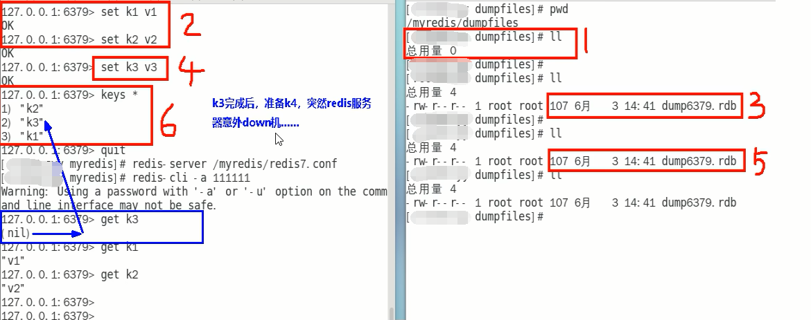
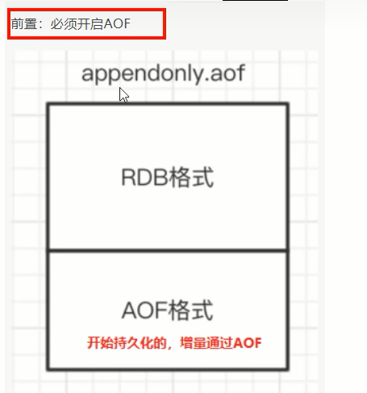
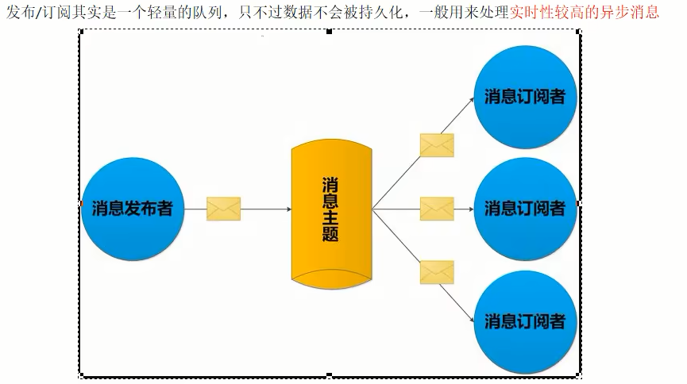
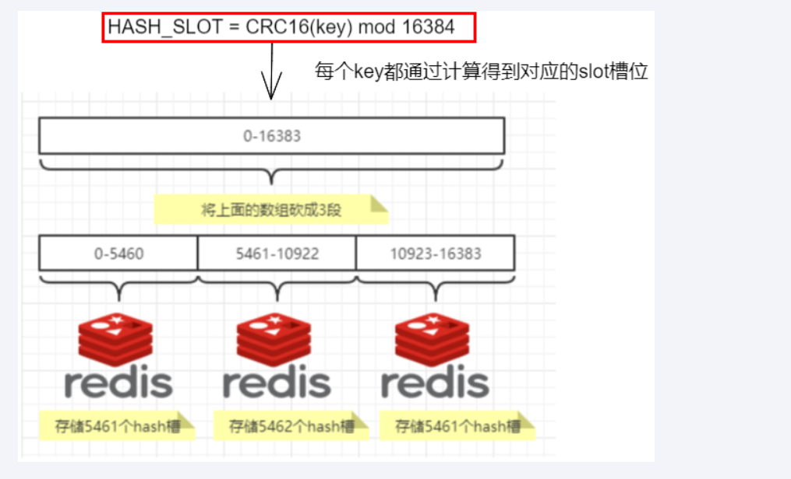

# Redis基础笔记

## 一、概述

+ Redis(Remote Dictionary Server)是一款开源的、使用ANSIC语言编写的高性能的键值型数据库，它支持多种丰富的数据类型，且数据存储在内存中。它支持事务、持久化、LUA脚本、发布/订阅、缓存淘汰、流技术等多种功能，提供了主从模式、Redis Sentinel和Redis Cluster集群架构方案
+ Redis一般与MySQL一起使用，**充当缓存的作用**

### （一）与MySQL的比较

+ Redis属于NoSQL数据库，是键值型数据库。MySQL是关系型数据库
+ Redis的数据操作主要在内存，MySQL的数据主要存储在磁盘
+ Redis在计数器、排行榜等方面要明显优于MySQL
+ Redis通常用于一些特定场景，需要与MySQL一起配合使用

---

### （二）功能

+ Redis有许多功能
  + 它可以作为缓存，在MySQL之前响应数据:用于提升性能
  + 内存存储和持久化:​ Redis支持异步将内存中的数据写到硬盘上，同时不影响继续服务
  + 高可用架构搭配:单机、主从、哨兵、集群
  + 预防缓存击穿、穿透、雪崩
  + 支持分布式锁
  + 支持队列
  + 排行榜+点赞功能性能高

---

### （三）优势

+ 在内存中操作数据，性能优秀
+ 支持丰富的数据类型
+ 支持数据的持久化，避免突发事件导致数据丢失
+ 支持数据备份，即使用主从架构

---

### （四）版本

+ Redis从2009年诞生，目前的Redis版本是7

+ Redis版本的命名规则是:
  + 版本号第二位如果是奇数，则为非稳定版本，如2.7、2.9、3.1
  + **版本号第二位如果是偶数**，则为**稳定版本**，如2.6、2.8、3.2
  + 当前奇数版本就是下一个稳定版本的开发版，如2.9版本就是3.0版本的开发版本
+ 我们可以通过redis.io[官网](https://download.redis.io/releases/)来下载自己感兴趣的版本进行源码阅读

---

## 二、安装与卸载

### （一）安装

+ 这里以CentOS7为例进行安装
+ Redis安装需要依赖如下环境:
  + gcc编译器:我们可以通过`gcc -v`来查看当前gcc的版本，一般CentOS都自带gcc编译器，如果没有，就执行`yum -y install gcc-c++`进行安装
+ 接下来开始安装
  + 使用cd命令进入到想存放redis压缩包的文件夹内
  + 使用`wget https://download.redis.io/releases/redis-7.0.2.tar.gz`命令下载Redis压缩包，想查阅版本有哪些[点击这里](https://download.redis.io/releases/)
  + 使用`tar -zxvf redis压缩包路径 [-C 目标路径]`来解压缩Redis压缩包
  + 进入压缩好的redis目录，执行`make && make install`来进行安装，当出现`It's a good idea to run 'make test'`就说明安装好了，安装时需要确保网络通畅。安装默认放入默认安装目录`/usr/local/bin`目录中，它相当于Windows系统C盘的`C://ProgramFiles`文件夹。到这里我们的Redis就安装好了，但是我们还需要进行一些配置
  + 对应的配置文件在解压完的redis目录中，该文件名叫`redis.conf`，我们一般不会修改这里的配置文件，而是会拷贝一份。使用cp命令把这玩意拷到一个目录里面
  + 接下来使用vim对它进行编辑
    + 默认`daemonize no`改为`daemonize yes`
    + 默认`protected-mode yes`改为`protected-mode no`，将保护模式关闭以让外界可以连接到Redis
    + 默认`bind 127.0.0.1`改为直接注释掉(默认bind 127.0.0.1只能本机访问)或改成本机IP，否则影响远程IP连接
    + 默认`requirepass`后面加上自己设置的密码，**这个密码就是之后Redis连接要用到的密码**
  + 接下来就可以启动了:
    + `redis-server 我们自己写的配置文件路径`来启动Redis服务。我们可以输入`ps -ef|grep redis|grep -v grep`来查看redis服务的详情
    + `redis-cli -a 密码 -p [端口号]`来连接Redis。端口号可以不写，不写默认是6379。因为Redis默认占用6379端口号
    + 连接后可能会出现一段报错信息:`Warning: Using a password with '-a' or '-u' option on the command line interface may not be safe.`。不用管它
    + 接下来输入`set k1 helloWorld`放一个键值对进去，再输入`get k1`它就可以输出`helloWorld`了
    + 输入`ping`,显示`pong`时，代表安装成功
    + 输入`quit`可以退出Redis连接
  + 如果我们想关闭服务器
    + 如果在连接中，直接使用`shutdown`命令，关闭服务
    + 如果在连接之外，使用`redis-cli -a 123456 shutdown`来关闭单实例服务
    + 如果在连接之外，使用`redis-cli -p 6379 shutdown`来指定端口进行关闭

---

### （二）卸载

+ 首先停止`redis-server`服务
  + `redis-cli -a 123456 shutdown`
+ 接下来删除`/usr/local/bin`目录中所有与redis相关的文件
  + `rm -rf /usr/local/bin/redis-*`
+ 这样就删除成功了

---

## 三、数据类型

+ Redis现在共有[十大数据类型](https://redis.io/docs/data-types/)，它们分别是:
  + String
    + 即字符串，**Redis最基本的数据类型。**
    + String类型是二进制安全的，它可以包含任何数据，包括图片或者序列化的对象。
    + 一个redis中字符串value最大为512M
  + List
    + 即**简单的字符串列表，按照插入顺序排序**
    + 我们可以在头部插入，也可以在尾部插入。它的底层实际上是一个双端链表
    + 最多可以包含2^32-1个元素
  + Hash
    + 是string类型的field（字段）和value（值）的映射表，**Hash特别适合用户存储对象**
    + Redis中每个Hash可以存储2^32-1个键值对（40多亿）
  + Set
    + 是**String类型的值组成的无序、不重复的数据集合**。集合对象的编码可以是inset和HashTable
    + Set是通过哈希表实现的，因此添加、删除和查找的时间复杂度都是O(1)
    + 集合中最大的成员数为2^32-1
  + sorted Set(ZSet)
    + **可以排序的Set集合**，它的每个元素都关联着一个double类型的分数，通过元素关联的分数来为元素进行排序
    + ZSet中的元素是不重复的，但Set元素关联的分数可以重复
    + 它也是通过哈希表实现的，因此添加、删除和查找的时间复杂度都是O(1)
  + Geospatial
    + Redis GEO**主要用于存储地理位置信息**，并对存储的信息进行操作
    + 操作包括:添加地理位置的坐标、获取地理位置的坐标、计算两个位置之间的距离
  + HyperLogLog
    + HyperLogLog是用来做基数统计的算法，其优点是**在输入元素的数量或者体积非常非常大时，计算基数所需要的空间总是固定且是很小的**
    + 在Redis里面，每个HyperLogLog键只需要花费12KB内存，就可以计算接近2^64个不同元素的基数
    + 但是，因为HyperLogLog只会根据输入元素来计算基数，而不会存储输入元素本身，所以HyperLogLog不能像集合那样，返回输入的各个元素
  + Bitmap
    + 由0和1状态表现的二进制位的bit数组
  + Bitfield
    + 通过bitfield命令我们可以一次性对多个比特位域进行操作
  + Stream
    + Redis Stream是Redis5.0版本新增加的数据结构，主要用于消息队列
    + Redis Stream提供了消息的持久化和主备复制功能，可以让任何客户端访问任何时刻的数据，并且能记住每一个客户端的访问位置，还能保证消息不丢失。以弥补Redis无法记录历史消息的缺点

---

### （一）String类型

+ [官网文档](https://redis.io/docs/data-types/strings/)
+ 字符串是最Redis基本的数据类型，它可以包含任何数据，包括图片或者序列化的对象
+ 一个redis中字符串value最大为512M

|命令|参数|作用|备注|
|:---:|:---:|:---:|:---:|
|`set key value [NX\|XX] [GET] [EX 秒值\|PX 毫秒值\|EXAT unix时间戳值(秒)\|PXAT unix时间戳值(毫秒)\|KEEPTTL]`|NX:对应键不存在时，创建一个键值对 XX:对应键存在时，创建一个键值对 GET:返回指定键原本的value值 EX:以秒为单位设置过期时间 PX:以毫秒为单位设置过期时间 EXAT:以以秒为单位的Unix时间戳设置过期时间 PXAT:以以毫秒为单位的Unix时间戳设置过期时间 KEEPTTL:保留之前的键值对设置的过期时间|修改或添加一个键值对|如果上一个键值对有过期时间，而本次未指定过期时间，那么修改后的键值对过期时间将被覆盖|
|`get key`|无参|得到对应的键所对应的值|无|
|`mset key1 value1 [key2 value2 ....]`|无参|批量设置键值对|无|
|`mget key1 [key2...]`|无参|批量获取键对应的值|无|
|`mesetnx key1 value1 [key2 value2 ....]`|无参|批量设置键值对，且这些键值对必须在之前都不存在|只要这些键有一个存在，那么就都不会执行|
|`getrange key start end`|start:开始下标 end:结束下标|截取字符串，**截取的区间是[start,end]**|可以传入负数|
|`setrange ket offset value`|offset:要进行覆盖的开始下标 value:替换的新值|将key对应的value从开始下标起替换为新值，即替换部分值|无|
|`incr key`|无参|自增+1|需要字符串是纯整数|
|`incrby key number`|number:增加的值|自增对应的number值|^|
|`decr key`|无参|自减-1|^|
|`decrby key number`|number:减少的值|自减对应的number值|^|
|`strlen key`|无参|获得字符串长度|无|
|`append key value`|value:值|字符串的拼接|无|
|`getset key value`|value:值|先get再set|无|

---

### （二）List

+ 简单的字符串列表，按照插入顺序排序，我们**可以在头部插入，也可以在尾部插入**。它的底层实际上是一个双端链表。因此我们通过索引下标操作中间的节点性能会较差
+ 最多可以包含2^32-1个元素

|命令|参数|作用|备注|
|:---:|:---:|:---:|:---:|
|`lpush list value1 [value2....]`|无参|在头部连续插入对应的值|无|
|`rpush list value1 [value2 ....]`|无参|在尾部连续插入对应的值|无|
|`lrange list start end`|start:开始下标 end:结束下标|列表的切片，**截取的区间是[start,end]**|可以传入负数|
|`lpop list`|无参|删除指定列表的头部元素并返回|无|
|`rpop list`|无参|删除指定列表的尾部元素并返回|无|
|`lindex list index`|index:指定的索引|按照索引获取元素值（从头到尾）|无|
|`llen list`|无参|得到列表的元素数量|无|
|`lrem key count element`|count:指定要删除的数量 element:要删除的元素|从头到尾删除对应数量的element|无|
|`ltrim key start stop`|start:开始下标 end:结束下标|仅使列表保留切片区间内的值,**截取的区间是[start,end]**|可以传入负数|
|`rpoplpush list1 list2`|list1:源列表 list2:目的列表|移除源列表的最后一个元素，并将该元素添加到目的列表并返回|无|
|`lset key index value`|index:下标 value:新值|为指定下标的元素赋值|无|
|`linsert key {before\|after} pivot element`|pivot:指定的标志元素 element:要插入的值|在指定的标志元素前面或后面插入新值|无|

---

### （三）Hash

+ 省流:`Map<String,Map<Object,Object>>`

|命令|参数|作用|备注|
|:---:|:---:|:---:|:---:|
|`hset key field1 value1 [field2 value2]`|fieldn valuen:键值对|向key对应的Map中添加值|无|
|`hget key field`|field:Map中的键|得到key对应的Map中的键对应的值|无|
|`hmset key field1 value1 [field2 value2]`|fieldn valuen:键值对|向key对应的Map中添加值|当前版本的hmset功能已被hset取代，该命令已弃用|
|`hmget key field1 [field2]`|field:Map中的键|得到key对应的Map中的多个键对应的值|无|
|`hgetall key`|无参|得到key对应的Map中的全部键值对|无|
|`hdel key field1 [field2]`|field:Map中的键|通过传入键的方式批量删除key对应的Map中的键值对|无|
|`hlen key`|无参|获取对应key对应的Map的键值对数量|无|
|`hexists key field`|field:Map中的键|判断指定的键是否存在|无|
|`hkeys key`|无参|获取Map中全部的键|无|
|`kvals key`|无参|获取Map中全部的值|无|
|`hincrby key field increment`|field:Map中的键 increment:自增值，需要是**整数**|给Map中的键对应的值自增指定的值|无|
|`hincrbyfloat key field increment`|field:Map中的键 increment:自增值，需要是**浮点数**|^|无|
|`hsetnx key field value`|field value:键值对|如果Map中不存在，就进行赋值|无|

---

### （四）Set

+ 不重复的无序集合
+ Set是通过哈希表实现的，因此添加、删除和查找的时间复杂度都是O(1)

|命令|参数|作用|备注|
|:---:|:---:|:---:|:---:|
|`sadd key value1 [value2...]`|无参|向set中添加value|无|
|`smembers key`|无参|遍历输出对应set的值|无|
|`sismember key value`|value:要检验的值|检查对应的值是否在member|无|
|`srem key value1 [value2]`|value:要删除的元素|批量删除set中的元素|无|
|`scard key`|无参|统计set中的元素个数|无|
|`srandmember key number`|number:指定要取出的元素|从set中随机取出指定数量的元素|不会使set中的元素被删除|
|`spop key number`|number:指定要删除的元素|从set中随机删除指定数量的元素并返回|无|
|`smove key1 key2 value`|key1:源set key2:目的set value:源set的值|将key1中的对应值取出并添加进key2中|无|
|`sdiff key1 [key2 ...]`|无参|计算多个set的差集，从左到右进行运算|无|
|`sunion key1 [key2 ...]`|无参|计算集合的并集，从左到右进行运算|无|
|`sinter key1 [key2 ...]`|无参|计算集合的交集，从左到右进行运算|无|
|`SINTERCARD [numkeys] key1 [key2...] [limit count]`|numkeys:由输入的key个数决定 count:限制交集的最大元素数量，若取交集时元素数量到达该阈值，那么直接退出并返回|返回各set集交集的结果内包含的元素数量|该命令是7.0新增命令|

---

### （五）ZSet

+ sorted set(ZSet)在set的基础上，使每个set元素关联一个分数，使set集合依据该分数进行排序。这个分数不是数学上的分子分母的分数，是score那个意思的分数

|命令|参数|作用|备注|
|:---:|:---:|:---:|:---:|
|`zadd key score1 value1 [score2 value2]`|scoren valuen:与分数相关联的元素值|向ZSet中添加元素|无|
|`zrange key min max [withscores]`|min:最小索引 max:最大索引|输出指定区间内的元素，**截取的区间是[min,max]**。如果写了withscores，那么连着分数一起输出|无|
|`zrevrange key min max [withscores]`|^|倒序输出指定区间内的元素，**截取的区间是[min,max]**。如果写了withscores，那么连着分数一起输出|无|
|`zrangebyscore key min max [withscores] [limit offset count]`|min:最小索引 max:最大索引 offset:截取偏移量 count:截取的最大数量|获取指定区间内（[min,max]）的元素，如果想有一方开区间，在前面加一个`(`即可，如果有withscores那么连着分数一起输出；如果有limit那么还要进行切片|无|
|`zscore key value`|value:值|获得对应值关联的分数|无|
|`zcard key`|无参|获取集合中元素的数量|无|
|`zrem key value1 [value2]`|valuen:要删除的值|批量删除对应的元素|无|
|`zincrby key count value`|count:自增的值 value:要自增的值|给指定的zset中的元素自增值顶的值|无|
|`ZCOUNT key min max`|min:最小分数值 max:最大分数值|获得指定**分数区间**内的元素个数|无|
|`zmpop numkeys key1 [key2....] {min\|max} [count number]`|numkeys:该值取决于后面key的个数 number:指定删除并输出的元素数量|**从左到右开始寻找，找到第一个非空的zset集合**，并依据min和max来决定删除该集合并输出的元素，依据number来决定删除的元素数量。**如果第一个非空集合都删空了也没有达到number的指标，那么直接退出**|该命令是7.0新增命令 |
|`zrank key value [withscore]`|无参|获得value的顺序下标值|无|
|`zrevrank key value [withscore]`|无参|获得value的逆序下标值|无|

---

### （六）Bitmap

+ Bitmap由0和1状态表现的二进制位的bit数组，它的本质是一个数组

|命令|参数|作用|备注|
|:---:|:---:|:---:|:---:|
|`setbit key offset value`|offset:数组下标 value:指定位，只能是0或1|指定数组下标的位值|无|
|`getbit key offset`|offset:数组下标|得到对应下标的值|无|
|`strlen key`|无参|统计字节的占用量，每8位组成一个字节|无|
|`bitcount key [start end [byte\|bit]]`|start:开始下标 end:结束下标|统计指定区间内值是1的有多少个，如果没有写明区间默认是统计整个数组|无|
|`bitop operation destkey key1 [key2...]`|destkey:存储运算结果的bitmap operation:共有四种模式,and、or、xor、not分别对应与运算、或运算、异或运算和取反运算|对一个或多个bitmap执行位运算|无|

---

### （七）HyperLogLog

+ HyperLogLog是用来做基数统计的算法，就是去重统计
+ 该类型不会存储数据，且有一定的误差(0.83%)，但其性能优异

|命令|参数|作用|备注|
|:---:|:---:|:---:|:---:|
|`pfadd key value1 [value2 ...]`|valuen:元素值|将指定元素添加到HyperLogLog中进行统计|无|
|`pfcount key1 [key2...]`|无参|将多个HyperLogLog取并集并统计去重元素的个数|无|
|`pfmerge destkey key1 [key2...]`|destkey:接收结果的HyperLogLog|将多个HyperLogLog合并为一个|无|

---

### （八）GEO

+ Geospatial主要用来存储地理位置信息，它可以有效解决传统数据库对于地理空间表示缺陷的问题:
  + 查询性能问题:如果并发高，数据量大这种查询是要搞垮数据库的
  + 我们有时希望得到以我们为中心的圆的地理位置信息，而不是以我们为中心的矩形的地理位置信息
  + 精准度问题:地球不是平面坐标系，而是一个圆球，这种矩形计算在长距离计算时会有很大误差
+ GEO底层实际上是使用zset进行存储的

|命令|参数|作用|备注|
|:---:|:---:|:---:|:---:|
|`geoadd key longitude latitude value [longitude latitude value ...]`|longitude:经度信息 latitude 纬度信息 value:该位置的名称|添加位置信息|无|
|`geopos key value1 [value2]`|valuen:位置名称|根据位置名称得到位置的经纬度信息|无|
|`geodist key value1 value2 {m\|km\|ft\|mi}`|value1:位置名称1 value2:位置名称2 m:以米为单位 km:以千米为单位 ft:以英寸为单位 mi:以英里为单位|得到两个给定位置之间的距离|无|
|`georadius key longitude latitude radius {m\|km\|ft\|mi} [withcoord] [withdist] [withhash] [count number [any]]`|longitude:中心的经度信息 latitude:中心的纬度信息 radius:半径距离 number:限制返回数量 withcoord:连带返回匹配项与指定中心的距离 withdist:连带返回匹配项的经纬度坐标 withhash:连带返回匹配项的经纬度哈希映射|以给定的经纬度为中心，返回与中心的距离不超过给定最大距离的所有元素位置|从Redis6.2.0开始，此命令被弃用，它的作用被GEOSEARCH和GEOSEARCHSTORE替代|
|`GEOSEARCH key {FROMMEMBER member \| FROMLONLAT longitude latitude} {BYRADIUS radius {m\|km\|ft\|mi} \| BYBOX width height {m\|km\|ft\|mi}}[ASC \| DESC] [COUNT count [ANY]] [WITHCOORD] [WITHDIST] [WITHHASH]`|member:指定的在key中的位置名称 longitude:中心的经度信息 latitude:中心的纬度信息 radius:半径距离 width:宽度 height:长度 asc:结果升序排序 desc:结果降序排序 count:限制返回数量，一旦匹配到指定数量就会直接返回 withcoord:连带返回匹配项与指定中心的距离 withdist:连带返回匹配项的经纬度坐标 withhash:连带返回匹配项的经纬度哈希映射|以给定的位置或经纬度坐标为中心，选择矩形匹配或半径匹配方式查找区间内的位置|于Redis6.2.0被引入|
|`GEOSEARCHSTORE destination source <FROMMEMBER member \| FROMLONLAT longitude latitude> <BYRADIUS radius <M \| KM \| FT \| MI> \| BYBOX width height <M \| KM \| FT \| MI>> [ASC \| DESC] [COUNT count [ANY]] [STOREDIST]`|storedist:存储结果的GEO对象，其余参数见上|此命令类似于 GEOSEARCH，但将结果存储在目标键中|无|
|`GEOHASH key [member [member ...]]`|member:位置名称|批量计算给定的位置名称所对应经纬度的哈希值并返回|于Redis6.2.0被引入|

---

### （九）Stream

+ 在Redis5.0之前，Redis共有两种消息队列的方案:
  + List实现消息队列:常用来做异步队列使用，将需要延后处理的任务结构体序列化成字符串塞进Redis的列表，另一个线程从这个列表中轮询数据进行处理
  
  + 发布订阅(pub/sub)模式:没有办法保证持久化，如果中途出现故障，消息就会丢失
  
+ 在Redis5.0之后，Redis引入了一个新的数据类型Stream来解决当时Redis面临的消息队列的问题
  
  + Stream使用一个链表，将所有加入进来的消息都串起来，每个消息都有一个唯一的ID和对应的内容

|字段|作用|
|:---:|:---:|
|Message Content|消息内容|
|Consumer group|消费组，通过XGROUP CREATE命令创建，同一个消费组可以有多个消费者|
|Last_delivered_id|游标，每个消费组会有一个游标last_delivered_id,任意一个消费者读取了消息都会使游标last_delivered_id往前移动|
|Consumer|消费者，消费组中的消费者|
|Pending_ids|消费者会有一个状态变量，用于记录被当前消费已读取但未ack的消息id,如果客户端没有ack，这个变量里面的消息id会越来越多，一旦某个消息被ack它就开始减少。这个pending_ids变量在Redis官方被称为PEL(Pending Entries List)，记录了当前已经被客户端读取的消息，但是还没有ack(Acknowledge character:确认字符)，它用来确保客户端至少消费了消息一次，而不会在网络传输的中途丢失了没处理|

|特殊符号|作用|
|:---:|:---:|
|-、+|最小和最大可能出现的id|
|$|$表示只消费新的消息，当前流中最大的Id，可用于将要到来的信息|
|`>(大于号)`|用于XREADGROUP命令，表示迄今还没有发送给组中使用者的信息，会更新消费者组的最后Id|
|*|用于XADD命令，让系统自动生成Id|

|命令|参数|作用|备注|
|:---:|:---:|:---:|:---:|
|`xadd key {* \| id} field1 value1 [field2 value2 ...]`|fieldn valuen:表示消息属性的键值对|添加消息队列到末尾|无|
|`XRANGE key start end [COUNT count]`|start:起始的Stream的id，可以使用`-`替代 end:结束的Stream的id，可以使用`+`替代 count:限制切片的最大元素数量|Stream的切片|无|
|`xrevrange key end start [COUNT count]`|start:起始的Stream的id，可以使用`-`替代 end:结束的Stream的id，可以使用`+`替代 count:限制切片的最大元素数量|Stream的倒序切片|无|
|`xdel key id [id ....]`|id:Stream的id|批量删除Stream中的指定id的元素|无|
|`xlen key`|无参|查看当前key的元素数量|无|
|`xtrim key {maxlen\|minid}`|maxlen:限制Stream的最大元素数量,从开始到最大数量时，超过数量的元素会被丢弃 minid:限制Stream的最小id，比该id小的元素会被丢弃|对Stream长度进行截取，可以通过限制最大数量或限制最小id来进行截取|
|`xread [COUNT count] [BLOCK milliseconds] STREAMS key [key...] id [id...]`|count:限制读取的消息数量 milliseconds:该参数不写默认是不会阻塞的，设置为0代表永远阻塞，直到收到消息再解除阻塞。设置大于0表示阻塞对应毫秒值 id:**对于非阻塞情况下**，它表示只要id比该id大，就会被读取（想读取全部，可以取`0-0`）。但当该值取`$`时，它表示读取Stream最大的id的后面的消息，如果没有返回NIL。**对于阻塞情况下**，如果当前的限制条件（限制条件生效的方式和非阻塞的情况一致）取不到一条信息，那么就会等到直到收到消息返回或时间到了返回NIL，如果有满足条件的信息，那么就返回。**对应位置的id对应着对应位置的key的限制条件**|无|
|`xgroup create key group {id\|$}`|id:指定开始消费的id，即在该id之后的消息会被消费；如果取`$`表示只消费新消息|创建消费组|无|
|`XGROUP DESTROY key group`|group:指定的消费组|删除指定的消费组|无|
|`XGROUP SETID key group {id \| $}`|group:指定的消费组 id:指定开始消费的id，即在该id之后的消息会被消费；如果取`$`表示只消费新消息|修改消费组消费的起始id|无|
|`xreadgroup GROUP group consumer [COUNT count] STREAMS key [key ....] id [id....]`|group:指定的消费组 consumer:指定要进行消费的消费者 count:限制读取的数量 key:要读取的目标stream id:取`>`时，表示从第一条尚未被消费的消息开始读取，取详细id时，读取该id以后的未消费信息，取0时，表示读取所有未被消费的消息|让指定组的指定消费者消费消息|不同消费组的消费者可以消费同一条消息，但是同一个组内的消费者消费完以后，同组的其它消费者就不能消费消息了|
|`XPENDING key group [start end count [consumer]]`|group:指定消费组 start:最小id end:最大id count:限制查询数量 consumer:指定查询的消费者|查询指定消费组内所有消费者或指定消费者在指定区间内的指定数量的消费的相关信息(状态为已读取，但尚未确认)|如果读取的消息已被确认处理完毕，那么不会显示|
|`xack key group id [id...]`|group:指定消费组 id:指定已处理完的消息id|确认指定的消息已处理完成|无|
|`xinfo STREAM key `|无参|打印流的详细信息|无|

---

### （十）Bitfield

+ Bitfield能够将很多小整数存到一个长度较大的位图中，或将一个非常庞大的键分割为多个较小的键来存储，从而高效的使用内存

|命令|参数|作用|备注|
|:---:|:---:|:---:|:---:|
|`bitfield key set type offset value`|type:模式 offset:偏移量，表示模式后的区间范围 value:要替换的值|将指定bitfield以type模式开始，将接下来offset位用value替换|会返回修改前的原值|
|`bitfield key [get type offset]`|type:模式，其中`u<数字>`表示无符号整型，u8表示使用8位存储无符号整型，`i<数字>`表示有符号整型，i8表示使用8位存储无符号整型 offset:偏移量，表示模式后的区间范围 |得到指定区间内的位值|无|
|`bitfield key [incrby type offset increment]`|type:模式 offset:偏移量，表示模式后的区间范围 increment:自增的值|使对应区间内的值自增对应的值|无|
|`overflow [wrap\|sat\|fail]`|wrap:循环溢出处理，如果最大值溢出那么就从头开始填，最小值溢出就从尾开始填 sat:最大值溢出时，取最大值，最小值溢出时取最小值 fail:出现溢出情况时返回空值，表示命令未执行|处理溢出|无|

---

## 四、持久化

+ 由于Redis的数据处理和操作是在内存中的，如果出现宕机，会导致严重的数据丢失。因此，Redis也提供了数据持久化的功能
+ Redis的持久化方式主要有三种:
  + RDB(Redis DataBase)
  + AOF(Append Only File)
  + 混合使用

### （一）RDB

#### ①持久化配置与恢复

+ RDB持久化就是以指定的时间间隔执行数据集的时间点快照，它会在指定的时间间隔内将内存中的数据集快照写入磁盘，也就是快照。这样一来即使故障宕机，快照文件也不会丢失，数据的可靠性也就得到了保证。该快照文件就被称为RDB

|配置项|参数|作用|备注|
|:---:|:---:|:---:|:---:|
|`save <seconds> <frequency> [<seconds> <frequency>]`|seconds frequency:**在seconds秒内修改key达frequency次及以上**，或者**两次修改key的时间间隔大于seconds秒**，那么就进行一次持久化|设置持久化策略|Redis6.0.16版本前，使用该方式配置|
|`dir <filepath>`|filepath:设置rdb文件的存放路径，默认存放在`./`文件夹下（相对于配置文件）|设置rdb文件的存放路径|无|
|`dbfilename <filename>`|filename:rdb文件的名称，相对路径是相对于dir的路径|设置rdb文件的名称|无|
|`save`|无参|以阻塞的方式进行持久化|无|
|`bgsave`|无参|以非阻塞的方式进行持久化|**推荐**|
|`lastsave`|无参|获得最后一次执行持久化的时间戳|无|
|`stop-writes-on-bgsave-error {yes\|no}`|无参|默认yes，如果配置成no，表示不在乎数据不一致或者有其他的手段发现和控制这种不一致，那么在快照写入失败时，也能确保redis继续接受新的请求|无|
|`rdbcompression {yes\|no}`|无参|默认yes，对于存储到磁盘中的快照，可以设置是否进行压缩存储。如果是的话，Redis会采用LZF算法进行压缩。如果你不想消耗CPU来进行压缩的话，可以设置为关闭此功能|无|
|`rdbchecksum {yes\|no}`|无参|默认yes，在存储快照后，还可以让redis使用CRC64算法来进行数据校验，但是这样做会增加大约10%的性能消耗，如果希望获取到最大的性能提升，可以关闭此功能|
|`rdb-del-sync-files {yes\|no}`|无参|在没有持久化的情况下删除复制中使用的RDB文件。默认情况下no，此选项是禁用的。|无|

+ 除save所指定的持久化策略，Redis在**执行shutdown或flush时也会自动进行持久化**，执行flush时，会产生一个空的rdb文件，无意义
+ 我们也可以通过`save`或`bgsave`手动进行持久化处理，推荐使用`bgsave`，因为它不会导致阻塞，它的实现原理是Redis会调用LinuxAPI让它产生一个和父进程相同的子进程，让该进程专门负责进行持久化处理
+ 如果我们想利用备份文件恢复数据，只需要将备份文件扔进Redis安装目录并启动服务即可

---

#### ②优劣

+ 优势:
  + 适合大规模的数据恢复
  + 按照业务定时备份
  + 对数据完整性和一致性要求不高
  + RDB文件在内存中的加载速度要比AOF快很多
+ 劣势
  + 在一定间隔时间做一次备份，所以如果redis意外down掉的话，就会丢失从当前至最近一次快照期间的数据，快照之间的数据会丢失
  + 内存数据的全量同步，如果数据量太大会导致IO严重影响服务器性能
  + RDB依赖于主进程的fork，在更大的数据集中，这可能会导致服务请求的瞬间延迟。fork的时候内存中的数据被克隆了一份，大致2倍的膨胀性，需要考虑

---

#### ③RDB相关

+ **RDB文件的生成时机**:
  + 配置文件中默认的文件快照配置
  + 手动save、bgsave
  + 执行flush、flushall
  + 执行shutdown且未开启AOF持久化
  + 主从复制时，主节点自动触发
+ **禁用RDB**:
  + 使用`redis-cli config set value ""`
  + 手动修改配置文件的`save`项，将值赋一个空串:`save ""`
+ 检查修复RDB文件
  + 进入到Redis安装目录，执行`redis-check-rdb`命令:`redis-check-rdb rdb文件路径`

---

### （二）AOF

#### ①概述

+ AOF以日志的形式来记录每个写操作，它会将Redis执行过的所有写指令记录下来，只许追加文件但是不可以改写文件。而Redis在启动时会读取该文件重新构建数据，即Redis在启动时就按照AOF记录的操作执行一次
+ AOF的工作流程如下:
  + 客户端向Redis服务器发送请求
  + Redis执行请求，并向AOF缓冲区写入对应指令，AOF缓冲区存在的目的是**当这些命令达到一定量以后再写入磁盘，避免频繁的磁盘IO操作**
  + 缓冲区根据同步文件的三种写回策略将命令写入磁盘上的AOF文件
  + 随着写入AOF内容的增加为避免文件膨胀，会根据规则进行命令的合并(又称AOF重写)，从而起到AOF文件压缩的目的
  + 当Redis Server服务器重启的时候会队AOF文件载入数据

  

---

#### ②配置

|配置项|参数|作用|备注|
|:---:|:---:|:---:|:---:|
|`appendfsync {always\|everysec\|no}`|always:每次写操作时，都直接进行同步 everysec:每秒同步一次 no:把同步时机丢给操作系统处理|设置AOF同步文件的策略|无|
|`appendonly {yes\|no}`|略|设置AOF是否开启|无|
|`appenddirname <dirname>`|dirname:装AOF文件的文件夹名称|指定装AOF文件的文件夹名称|该配置项在Redis7才有，在Redis7之前，AOF文件都是与RDB文件放在一起的。该配置使得AOF的保存路径变成了dir+appenddirname|
|`appendfilename <filename>`|filename:AOF文件名称，默认为appendonly.aof|设置AOF文件名称|无|
|`auto-aof-rewrite-percentage <number>`|number:百分比的数值，想80%就写80|指定当前的AOF文件是上一个AOF文件的百分之多少时，执行重写|auto-aof-rewrite-percentage和auto-aof-rewrite-min-size**同时满足限制条件时，才会触发重写**|
|`auto-aof-rewrite-min-size <number>`|number:设定上限|指定当前AOF大小超过指定值时，执行重写|^|

---

#### ③特性与优劣

+ Redis7使AOF有了自己独有的文件夹，且文件从1个被拆分为3个
  + MP-AOF方案将一个AOF文件拆成了三个文件:
    + BASE:表示基础AOF，它一般由子进程通过重写产生，最多只有一个
    + INCR:表示增量AOF,它一般会在AOFRW开始执行时被创建，该文件可能存在多个
    + HISTORY:表示历史AOF，它由BASE和INCR AOF变化而来，每次AOFRW成功完成时，本次AOFRW之前对应的BASE和INCR AOF都将变为HISTORY，**HISTORY类型的AOF会被Redis自动删除**
  + 为了管理这些AOF文件，Redis引入了一个manifest(清单)文件来跟踪、管理这些AOF，另外，为了便于AOF备份和拷贝，我们将所有的AOF文件和manifest文件放入一个单独的文件目录中，目录名由appenddirname配置决定
+ 优势
  + 更好的保护数据不丢失、性能高、可做紧急恢复
+ 劣势
  + 相同数据集的数据而言aof文件要远大于rdb文件，恢复速度慢于rdb
  + aof运行效率要慢于rdb，每秒同步策略效率较好，不同步效率和rdb相同

---

#### ④AOF触发、重写与修复

+ AOF将在如下条件下被触发
  + 满足配置文件中的选项后，Redis会记录上次重写时地AOF大小
  + 默认配置是当AOF文件大小是上次rewrite后大小的一倍且文件大于64M时
  + 也可以使用`bgrewriteaof`命令手动触发
+ **重写**
  + AOF在写入时，由于是都写进一个文件里，导致随着时间推移，AOF文件会越来越大。为了解决该问题，Redis使用重写机制来进行AOF的内容压缩。
  + **AOF文件重写并不是对原文件进行重新整理，而是直接读取服务器现有的键值对，然后用一条命令去代替之前记录这个键值对的多条命令，生成一个新的文件后去替换原来的AOF文件**，这就会导致base.aof文件和incr.aof文件变成了新的，具体表现为它们的序号发生了变化，一般都是加了1
  + 重写原理
    + 在重写开始前，redis会创建一个“重写子进程”，这个子进程会读取现有的AOF文件，并将其包含的指令进行分析压缩并写入到一个临时文件中
    + 与此同时，主进程会将新接收到的写指令一边累积到内存缓冲区中，一边继续写入到原有的AOF文件中，这样做是保证原有的AOF文件的可用性，避免在重写过程中出现意外
    + 当“重写子进程”完成重写工作后，它会给父进程发一个信号，父进程收到信号后就会将内存中缓存的写指令追加到新AOF文件中
    + 当追加结束后，redis就会用新AOF文件来代替旧AOF文件，之后再有新的写指令，就都会追加到新的AOF文件中
    + 重写aof文件的操作，并没有读取旧的aof文件，而是将整个内存中的数据库内容用命令的方式重写了一个新的aof文件，这点和快照有点类似
+ **修复**
  + 使用`redis-check-aof --fix 文件路径`进行修复，注意不要丢掉`--fix`那个参数

---

### （三）混合持久化

+ 开启混合持久化很简单:
  + 先把`aof-use-rdb-preamble`的值置为yes
  + 然后配置`appendonly`为yes开启AOF
+ 混合持久化，就是RDB镜像做全量持久化，AOF做增量持久化。先使用RDB进行快照存储，然后使用AOF持久化记录所有的写操作，当重写策略满足或手动触发重写的时候，将最新的数据存储为新的RDB记录。这样的话，重启服务的时候会从RDB和AOF两部分恢复数据，既保证了数据完整性，又提高了恢复数据的性能。简单来说:**混合持久化方式产生的文件一部分是RDB格式，一部分是AOF格式。AOF包括了RDB头部+AOF混写**

+ 在Redis重启时，会先查看是否存在AOF，如果存在就执行AOF。如果不存在查看是否存在RDB，存在就执行，不存在就完蛋

---

## 五、事务

### （一）概述

+ 事务就是在一次连接数据库的会话中，执行的相关操作。它是一组逻辑操作单元，使数据从一种状态变换到另一种状态
+ Redis事务与传统的关系型数据库(如MySQL)有极大的不同:
  + 单独的隔离操作:Redis的事务仅仅是保证事务里的操作会被连续独占的执行，redis命令执行是单线程架构，**在执行完事务内所有指令前是不可能再去同时执行其他客户端的请求的**
  + 没有隔离级别的概念:因为**事务提交前任何指令都不会被实际执行**，也就不存在”事务内的查询要看到事务里的更新，在事务外查询不能看到”这种问题了
  + 不保证原子性:Redis的事务不保证原子性，也就是不保证所有指令同时成功或同时失败，只有决定是否开始执行全部指令的能力，**没有执行到一半进行回滚的能力**
  + 排它性:**Redis保证一个事务内的命令依次执行，而不会被其它命令插入**

---

### （二）使用

|命令|作用|备注|
|:---:|:---:|:---:|
|`multi`|表示事务开始|无|
|`exec`|将事务开始以后记录的所有操作依次执行|无|
|`discard`|取消事务，放弃执行事务块内的所有命令|无|
|`watch key [key....]`|监视一个或多个key，如果事务执行前这些key被其它命令改动，那么事务将被打断|无|
|`unwatch`|取消对key的监视|无|

+ Redis的事务在multi执行后，我们之后所写的操作是先经过语法检查，然后加入到一个队列中去，在执行exec命令时才真正执行
  + 如果语法检查不通过，那么将会报错
+ Redis的事务执行总体可以划分为:
  + 正常执行:事务正常执行了，并没有出什么问题
  + 放弃事务:执行了discard命令，事务被取消，事务队列中的所有操作都不会执行
  + 全体连坐:如果某个操作未通过语法检查，或者由于什么原因在exec执行前出现了错误，那么事务将被取消，此时执行exec会报错
  + 执行到底:如果语法检查未查出错误，那么执行时即使出错也会继续执行，出错的就操作失败，但不影响其它操作继续执行
  + 监控执行:使用watch进行监控时，Redis使用乐观锁来判断该key是否在事务执行时被别的事务所修改了，如果被修改，那么事务整体执行失败。另外，在客户端连接丢失的时候，监控也会被取消。但如果在exec执行前执行了unwatch，那么即使key已被修改，事务依然会执行，因为监控已经在执行前被取消了

---

## 六、管道

+ edis是一种**基于客户端-服务端模型**以及请求/响应协议的TCP服务。一个请求会遵循以下步骤
  + 客户端向服务端发送命令分四步(发送命令→命令排队→命令执行-返回结果)，并监听Socket返回，通常以阻塞模式等待服务端响应
  + 服务端处理命令，并将结果返回给客户端。 上述两步称为: Round Trip Time(简称RTT,数据包往返于两端的时间)

+ 如果同时需要执行大量的命令，那么就要等待上一条命令应答后再执行，这中间不仅仅多了RTT (Round Time Trip) ，而且还频繁调用系统IO， 发送网络请求，同时需要redis调用多次read()和write()系统方法，系统方法会将数据从用户态转移到内核态，这样就会对进程上下文有比较大的影响了，性能不太好。这时候Redis管道就出现了
+ **管道(pipeline)可以一次性发送多条命令给服务端**
  + 服务端依次处理完完毕后，通过一条响应一次性将结果返回，通过减少客户端与redis的通信次数来实现降低往返延时时间。
  + pipeline实现的原理是队列，先进先出特性就保证数据的顺序性。
  + 管道相当于对命令进行顺序的批处理

+ 我们可以将命令存在一个txt文件，然后执行管道命令统一处理

~~~bash
  cat test.txt | redis -cli -a 123456 --pipe
~~~

+ pipeline与原生批量命令对比
  + 原生批量命令是原子性（如：mset，mget），**pipeline是非原子性**
  + 原生批量命令一次只能执行一种命令，**pipeline支持批量执行不同命令**
  + 原生批命令是服务端实现，而**pipeline需要服务端与客户端共同完成**
+ Pipeline 与事务对比
  + 事务具有原子性，管道不具有原子性
  + 管道一次性将多条命令发送到服务器，事务是一条一条发的，事务只有在接收到exec命令后才会执行，管道不会
  + 执行事务时会阻塞其他命令的执行，而执行管道中的命令时不会
+ Pipeline 注意事项
  + pipeline缓冲的指令只是会依次执行，**不保证原子性，如果执行中指令发生异常，将会继续执行后续的指令**
  + 使用pipeline组装的命令个数不能太多，不然数据量过大客户端阻塞的时间可能过久，同时服务器也被迫回复一个队列答复，占用很多内存

---

## 七、发布订阅

### （一）概述

+ 发布订阅是一种消息通信模式：发送者(PUBLISH)发送消息，订阅者(SUBSCRIBE)接收消息，可以实现进程间的消息传递
  + Redis客户端可以订阅任意数量的频道，类似我们微信关注多个公众号
  
  + 当有新消息通过publish命令发送给频道channel1时，订阅客户端都会收到消息
  
  + 发布订阅实际上就是一个轻量级的队列，只不过数据不会被持久化，一般用来处理实时性较高的异步信息
  

---

### （二）常用命令

|命令|参数|作用|备注|
|:---:|:---:|:---:|:---:|
|`psubscribe pattern [pattern]`|pattern:匹配模式，可以通过*或者?进行匹配|订阅一个或多个满足匹配规则的频道|推荐先订阅再发布，**订阅前发布的消息是收不到的**|
|`pubsub channels [pattern]`|^|查看频道的信息|无|
|`SUBSCRIBE channel [channel ...]`|channel:频道|订阅一个或多个频道|无|
|`PUBLISH channel message`|channel:指定频道 message:消息|发送消息到指定频道|无|
|`PUBSUB NUMSUB [channel [channel ...]]`|channel:指定频道|查看某个或某些频道有多少订阅者|无|
|`PUBSUB NUMPAT`|无参|​只统计使用PSUBSCRIBE命令执行的返回客户端订阅的唯一模式的数量|无|
|`UNSUBSCRIBE [channel [channel ...]]`|channel:指定频道|退订指定的频道|无|
|`PUNSUBSCRIBE [pattern [pattern ...]]`|pattern:匹配模式|退订所有符合匹配模式的频道|无|

---

### （三）小结

+ 发布订阅可以实现消息中间件MQ的功能，通过发布订阅实现消息的引导和分流。但是**不推荐使用该功能，专业的事情交给专业的中间件处理，redis就做好分布式缓存功能**
+ 缺点:
  + 发布的消息在Redis系统中不能持久化，因此，必须先执行订阅，在等待消息发布。如果先发布了消息，那么该消息由于没有订阅者，**消息将被直接丢弃**
  + 消息只管发送，对于发布者而言消息是即发即失，不管接受，也没有ACK机制，**无法保证消息的消费成功**
  + 以上的缺点导致Redis的Pub/Sub模式就像个小玩具，在生产环境中几乎无用武之地，为此Redis5.0版本新增了Stream数据结构，不但支持多播，还支持数据持久化，相比Pub/Sub更加的强大

---

## 八、主从复制

+ 主从复制可以:
  + 实现读写分离:master负责写，一众slave负责读
  + 支持容灾恢复:一个节点数据出现问题，可以从其它节点得到数据进行同步
  + 实现数据备份:
  + 水平扩容支持高并发

### （一）一主二从

+ 就是多个Redis服务器一起处理业务，一般有一台负责写，多台负责读。负责写的当主机，负责读的当从机
+ 实现主从复制需要修改如下配置:
  + daemonize yes
  + 注释 bind 127.0.0.1
  + protected-mode no
  + requirepass设置密码
  + port指定端口（可选）
  + dir指定当前工作目录（可选）
  + pidfile指定pid文件名称（可选）
  + logfile指定日志文件名称（可选）
  + dbfilename指定rdb文件名称（可选）
  + [AOF相关配置](#AOF)（可选）
  + masterauth配置连接主机时需要的密码（**从机配置项，必须**）
  + replicaof配置连接的主机和主机的redis服务器所占用的端口（**从机配置项，必须**）。或者该项我们可以不配置，在我们的从服务器（如果不配置启动后是主服务器，因为它还没有指定一个主服务器当主机）启动后，使用`slaveof 主机IP 主机redis端口号`来找一个主机当主服务器
+ 接下来启动服务器，**先启动主机，再启动从机**
  + 从机启动以后，我们可以在主机的日志中找到主从配置是否成功的信息:
  
+ 运行`info replication`命令可以得到主从复制的相关信息
+ 在使用配置文件配置的情况下（也就是在配置文件中配置了replicaof）
  + 主服务器既能读又能写，从服务器只能写
  + 主服务器的写入操作会被从服务器同步
  + 如果从服务器挂掉，而主服务器继续写入，那么从服务器在恢复以后会同步之前的数据，也就是从主服务器中拿到它不工作的这段时间内主服务器修改的数据
  + 如果主服务器挂掉，那么从服务器会等待主服务器恢复
+ 在使用`slaveof`命令配置主从的前提下
  + 主服务器既能读又能写，从服务器只能写
  + 主服务器的写入操作会被从服务器同步
  + 如果主服务器挂掉，那么从服务器会等待主服务器恢复
  + 如果从服务器挂掉再启动，那么它不会再作为之前主机的从服务器了，而是又变成自己做主了，因为它的配置文件中并没有配置相关的主从复制内容

### （二）薪火相传

+ 就是主机的从机能当别的从机的主机
+ 这样做可以减轻master的负担，但是会增加延迟，因为树的叉减少了，深度就会增加

+ 这个可以直接用`slaveof`直接实现

---

### （三）反客为主

+ 即从机自己独立出去成为主机
+ 使用`slaveof no one`命令实现

---

### （四）主从复制流程

1. slave启动成功（假设通过配置连接）并连接到master后，会向master发送一个sync命令，且slave第一次全新连接master时，将执行一次完全同步，slave自身的全部数据将被master传来的同步数据覆盖
2. master节点收到sync命令后，会在后台保存快照，同时在保存快照期间将收到的修改命令缓存起来，等快照保存完毕将快照数据和所有缓存的命令一并发送给slave
3. slave收到数据和缓存命令后，将数据存盘并加载到内存，完成复制初始化
4. master通过向slave定时发送ping包，以确认slave是否存活,该配置可以通过`repl-ping-replica-period`配置项修改
5. 稳定下来以后，master继续将收集到的修改命令自动依次传送给slave,完成同步
6. slave下线再上线时，master会检查backlog日志文件中的offset字段（master和slave都会保存一个复制要用的offset，保存于backlog,类似于进度条，还有一个masterId。），master会从slave下线的offset字段开始，把后面的数据传送给slave,类似断点续传

---

### （五）主从复制缺点

+ 所有的写操作在master上进行，然后同步到slave中，如果系统非常繁忙，延迟问题会变得严重，而slave机器数量的增加会使该问题更加严重
+ 另外，如果master出现了故障导致崩溃，那么slave就只能在那里干等着，因为它们不会默认自动再选出一个master

---

## 九、哨兵监控

+ 为了避免master挂掉导致整个redis主从复制架构出现问题，Redis官方提出了哨兵监控的解决方案
+ 哨兵监控有如下功能:
  + 主从监控:哨兵可以监控redis主从机是否正常运行
  + 消息通知:哨兵可以将故障转移的结果发送给客户端
  + 故障转移: 如果master出现故障，将进行主从切换，从剩下的Slave中选一个当master，保证主从架构的正常运行
  + 配置中心:客户端通过连接哨兵来获得当前Redis服务器的主节点地址

### （一）配置

+ 在我们安装的redis目录中找到`sentinel.conf`文件，将它拷贝一份，放到配置目录中
+ 修改一些配置，或者直接创建一个conf文件，具体要写的配置如下:

~~~conf
  bind 0.0.0.0
  daemonize yes
  protected-mode no
  port 26379
  logfile "sentinel26379.log"
  pidfile "/var/run/redis-sentinel26379.pid"
  dir "/home/study/redis/data"
  sentinel monitor mymaster 8.130.87.94 6379 2
  sentinel auth-pass mymaster 123456
~~~

+ 修改conf文件名，因为默认占用的是26379端口，因此可以叫`sentinel26379.conf`
+ 再搞俩文件出来，分别命名为`sentinel26380`和`sentinel26381.conf`
+ 接下来是主从复制的配置，[详情见上](#masterSlave)。这里需要给master也配置一下masterauth，方便之后测试，否则可能会报错
+ 接下来启动master和slave，之后执行`redis-sentinel 配置文件路径`来启动redis哨兵（哨兵一般都是单独运行在一个服务器上的，一个服务器运行一个，但是由于服务器成本限制，可以把哨兵跟master放在一起。
+ 启动完成以后，打开sentinel相关的配置文件，发现redis自己向配置文件写了一些东西。打开日志，发现日志也多了一些东西

---

### （二）测试

+ 现在我们在master的redis上面加点键值对，然后shutdown一下
+ 接下来转到slave,get一下刚才的键值对，它就会报`not connected`，这是正常现象，是哨兵机制为了调整主从结构而导致的正常情况，因此我们可以再get一下，发现就好了
+ 接下来对两个slave执行`info replication`，发现它们其中有一个已经变成master了
+ 再启动原来的master,发现它已经不是master了，已经变成slave了
+ 打开原master的redis配置文件，发现哨兵在它的配置文件最后添加了一些额外配置，包括RDM的生成策略、主机的ip和端口号还有其他一些东西

+ 打开当前master的配置文件，发现哨兵把它配置文件配置的`masterauth`移除掉了
+ 哨兵对配置文件的改动保证当前master在下一次启动时依旧是master,而原master在重启后依旧为slave

---

### （三）运行流程与选举原理

+ 假定现在有一主两从，三个哨兵:

+ 在master失效后，哨兵会自动在slave中推选出一个新的master,然后让原master和其它slave都认新上台的master做主机，然后进行数据同步
+ **主观下线**(SDown):主观下线就是说如果Redis服务器在哨兵配置文件中的`down-after-milliseconds`给定的毫秒数之内没有回应某一哨兵的PING命令或者返回一个错误消息， 那么这个哨兵会主观的(单方面的)认为这个master不可以用了，`down-after-milliseconds`的默认值是30000(单位：毫秒)，即30s。**主观下线可能会受到网络波动、延迟等网络因素的影响**，因此还需要进行客观下线的判断
+ **客观下线**(ODown):即有的哨兵认定master主观下线以后，需要在哨兵集群内进行投票，当多个哨兵达成一致意见数到达指定数量时，才认定此master。该配置由`sentinel monitor <master-name> <ip> <redis-port> <quorum>`来配置，其中的`quorum`来决定客观下线的最小票数，即至少要quorum个哨兵同意后，该master才会被认定为ODown，然后执行下线和故障转移操作
+ **选举领导哨兵**:主节点被宣布为判断客观下线后，各哨兵就会进行协商，先选举出一个领导哨兵(leader)，然后由该leader执行故障迁移
  + 选举流程可以在对应leader哨兵的日志中找到
  
  + 哨兵leader是根据Raft算法算出来的
  
  + Raft算法的基本思路是**先到先得**:即在一轮选举中，哨兵A向B发送成为领导者的申请，如果B没有同意过其他哨兵，则会同意A成为领导者，然后给A投票
  + 在上图中，哨兵1先给2和3发送了请求，然后它就得到了两票，而2先给1发的请求，所以1要把票投给2，但是2给3发的请求比1给3发的请求要晚，所以3不会投票给2。3给1和2发的请求是最晚的，因此3没有任何票
+ **领导哨兵执行故障迁移**:
  + 首先选出一个新的master:它依次根据slave的优先级（通过slave-priority、replica-priority等配置设置，数字越小优先级越高）高的、复制偏移量offset最大的从节点、最小run ID的从节点（按字典序，ASCii码比较）来选出新的master
  + 哨兵leader通过`slaveof`命令来使其它slave的master指向新的master，并对新的master执行`slaveof no one`操作将其提升为master
  + 让原master降级为slave，也指向新的master

---

### （四）常用配置项

|配置项|参数|作用|备注|
|:---:|:---:|:---:|:---:|
|`sentinel monitor <master-name> <ip> <redis-port> <quorum>`|master-name:标识指定master的称呼 ip:master所在服务器的ip redis-port:redis占用的端口 quorum:客观下线需要的的最小票数|设置哨兵对指定master的监控和客观下线需要的最小票数|无|
|`sentinel auth-pass <master-name> <password>`|master-name:标识指定master的称呼 password:连接master需要的密码，对应requirepass|配置连接指定master需要的密码|无|
|`sentinel down-after-milliseconds <master-name> <milliseconds>`|master-name:标识指定master的称呼 milliseconds:指定判断主观下线的最大毫秒数，即哨兵未收到master回复多少毫秒时判定为主观下线|设置判断主观下线的时间指标|无|
|`sentinel parallel-syncs <master-name> <nums>`|master-name:标识指定master的称呼 nums:允许并行同步的slave个数|限制允许并行同步的slave个数|无|
|`sentinel failover-timeout <master-name> <milliseconds>`|master-name:标识指定master的称呼 milliseconds:指定判断故障转移失效的时间，单位毫秒|设置故障转移的超时时间|无|
|`sentinel notification-script <master-name> <script-path>`|master-name:标识指定master的称呼 script-path:执行的脚本|配置当某一事件发生时所需要执行的脚本|无|
|`sentinel client-reconfig-script <master-name> <script-path>`|master-name:标识指定master的称呼 script-path:执行的脚本|配置客户端重新配置主节点参数脚本|无|

---

### （五）使用建议

+ 哨兵节点的数量应该为多个，烧饼本身应该集群，保证高可用
+ 哨兵节点的数量应该是奇数
+ 各个哨兵节点的配置应该一致
+ 如果哨兵节点部署在Docker等容器里面，尤其要注意端口的正确映射
+ 哨兵集群+主从复制，并**不能保证数据零丢失**

---

## 十、集群

### （一）概述

+ Redis集群是当前Redis推荐的方案，它是一个提供在多个Redis节点间共享数据的程序集
+ **Redis集群并不保证强一致性**，这意味着在特定条件下，Redis集群可能会丢掉一些被系统收到的写入请求命令

+ **Redis集群支持存在多个master**，每个master又可以挂载多个slave
  + 实现了读写分离
  + 支持数据的高可用
  + 支持海量数据的读写存储操作
+ 由于Cluster自带哨兵的故障转移机制，内置了高可用的支持，**无需再使用哨兵功能**
+ 客户端只需要连接Redis集群的一个节点，便可以进行操作
+ 槽位slot负责分配到各个物理服务节点，由对应的集群来负责维护节点、插槽和数据之间的关系

---

### （二）槽位与分片

#### ①槽

+ Redis集群并没有使用一致性hash,而是引入了哈希槽
  + Redis集群有16384个哈希槽，每个key通过CRC16校验后对16384取模来决定放置在哪个槽中，集群的 每个节点负责一部分槽

  

---

#### ②分片

+ 使用Redis集群时，存储的数据会分散到多台Redis机器上，称为分片。集群中的每个实例都被认为是整个数据的一个分片
+ 为了找到给定的分片，需要对key进行CRC16校验，然后对总分片数量取模，然后使用确定性哈希函数来确保给定的key将多次映射到同一个分片中

---

#### ③槽位映射算法

+ 目前业界有三种解决方案，它们分别是**哈希取余分区**、**一致性哈希算法分区**和**哈希槽分区**
  + **哈希取余分区**:
    + 就是有多少台Redis节点就对多少取余
    + 优点:简单粗暴，可以保证数据大致平均的分摊到每个Redis节点上，保证了负载均衡，达到了分而治之的目的
    + 缺点:由于节点数写死了，再进行扩容和缩容就变得麻烦，同一个key在扩容或缩容所映射到的节点可能会发生变化，因为取模的数变了。另外如果某台Redis机器宕机了，也会导致hash取余全部数据重新洗牌
  + **一致性哈希算法分区**:
    + 该算法于1997年由麻省理工学院提出，设计目的就是为了解决上面的哈希取余算法导致的数据变动和映射问题
    + 首先需要构建一个哈希环，一致性哈希算法是对2^32进行取模的，因此哈希环的范围就是0~2^32-1
    
    + 接下来将各个Redis服务器节点按照哈希算法进行一次映射，将它们映射到哈希环的对应下标下，这样就能确定每台机器在哈希环上的位置了
    
    + 最后是key存储的映射，当想存储一个key时，先使用与服务器节点相同的确定性哈希函数计算出该key所在的哈希环映射，然后按顺时针方向“行走”，直到碰到第一台Redis服务器，然后把它装进该服务器中
    
    + 优点:
      + **容错性强**:如果一台服务器发生故障，只需要继续顺时针寻找在哈希环上的下一台服务器即可。
      + **拓展性强**:插入新的节点X时，X在A到B之间，那么只需要把A到X之间的数据从B迁移到X即可
    + 缺点:该算法无法保证节点是平均分布在哈希环中的，因此容易出现因节点分布不均匀而导致数据大量存储在一个或几个服务器中，而其余服务器则仅存储了少量数据
    
  + **哈希槽分区**:
    + 哈希槽就是在数据和服务器之间加了一层哈希槽，用于管理数据与节点之间的关系，相当于节点中放的是槽，而槽中存放的是数据
    
    + **槽解决的是粒度问题**，相当于把粒度变大了，这样便于数据移动。**哈希解决的是映射问题**，使用key的哈希值来计算所在的槽，便于数据分配
    + Redis规定一个集群有16384个哈希槽，而官方推荐节点不应该超过1000个。这些哈希槽会被**分配给集群中的所有主节点**
    + 当想存储一个key时，会根据哈希算法对key求哈希值并对16384取模，这样就能决定key会被放在哪个槽中，因为槽的数量是固定的，因此一个key始终能映射到对应的槽，这样就解决了数据移动的问题
    

---

#### ④最大槽数16384原因

+ CRC16算法所产生的哈希值有16bit,也就是可以得到2^16=65536个值，但是哈希槽的数量是16384，原因如下:
  + master每隔一段时间会发送心跳包，该心跳包发送的信息之一是它本身负责的槽信息，它的大小由其负责的槽数量决定（槽数量/8），如果槽有65536个，那么需要发送65536/8/1024（C++一个char字符占用一个字节）=8kb的槽信息，这会导致**发送心跳包需要的消息头太大，浪费带宽**
  
  + Redis的主节点数量一般不会超过1000个，因为集群节点越多，心跳包的消息体内携带的数据越多。如果节点过1000个，也会导致网络拥堵。因此Redis官方也不推荐节点数量超过1000个，**对于1000个以内的节点，16384个哈希槽已经够用了**，没有必要再拓展到65536个
  + Redis主节点的配置信息中它所负责的哈希槽是通过一张bitmap的形式来保存的，在传输过程中会对bitmap进行压缩，但是如果bitmap的填充率slots / N很高的话(slots表示哈希槽总量，N表示当前节点数)，bitmap的压缩率就很低。 **如果节点数很少，而哈希槽数量很多的话，bitmap的压缩率就很低**。 

---

### （三）搭建集群

+ 由于服务器限制，这里每个服务器上跑两个redis来模拟三主三从集群
  + 先进行文件配置，酌情修改:

  ~~~conf
    bind 0.0.0.0
    daemonize yes
    protected-mode no
    port 6382
    logfile "cluster6382.log"
    pidfile cluster6382.pid
    dir ../data
    dbfilename dump6382.rdb
    appendonly yes
    appendfilename "appendonly6382.aof"
    requirepass 123456
    masterauth 123456

    cluster-enabled yes
    cluster-config-file nodes-6382.conf
    cluster-node-timeout 5000
  ~~~

  + 接下来启动各redis服务器:`redis-server xxx.conf`
  + 然后`redis-cli -a 123456 --cluster create --cluster-replicas 1 8.130.44.112:6381 8.130.44.112:6382 8.130.66.96:6383 8.130.66.96:6384 8.130.87.94:6385 8.130.87.94:6386`来搭建集群
    + 搭建之前确保端口开放，**每个集群节点需要两个端口**，如果服务器要占用6379端口，那么还需要一个16379（占用端口+10000）端口来与集群总线连接，用来进行节点的失败检测、配置更新、故障转移等
    + 密码需要写自己的redis设置的密码
    + IP需要写当前redis实际所在的IP,端口也一样
    + `--cluster create`是创建集群实例列表的命令，选项后跟`IP:PORT IP:PORT IP:PORT`格式
    + `--cluster-replicas`指定复制因子，即每个主节点需要多少个从节点
  + 然后跟着它的指引来。如果卡在命令开始或者`Waiting for the cluster to join`大概率是因为服务器端口未开放
  
  + 接下来使用`info replication`、`cluster info`、`cluster nodes`来确认集群的状态

---

### （四）集群读写与主从容错

+ **集群读写**
  + 如果我们依然像以前一样连接某一台redis实例时，那么在进行读写操作时就会出现问题，大致就是我们想存储的key经过哈希槽映射算法计算出来的值不归这个节点管，因此它就会提示我们去对应的节点进行操作
  + 为了解决该问题，我们可以在连接时指定`-c`参数，来进行路由优化，从而解决该问题
+ **主从切换**
  + 集群自带了哨兵的功能，因此可以自动地进行主从切换，如果主机挂掉，那么从机就会变成主机，而之后恢复的主机就变成了从机
  + 在原主机上执行`cluster failover`可以重新变成主机

---

### （五）扩容与缩容

+ **扩容**:
  + 首先我们再启动俩redis服务，配置文件与之前的一样，设新启动的端口分别是6387和6388
  + 接下来使用`redis-cli -a <password> --cluster add-node <addHost>:<addPort> <clusterHost>:<clusterPort>`来将6387的redis服务器加到集群里，但是加集群需要集群里面的一个节点处理，因此还需要提供一个集群里面的节点的ip和端口号，大概就是这个新来的是某个老节点推荐进去的这个意思
  + 使用`redis-cli -a <password> --cluster check <host>:<port>`来检查当前的集群节点状态，可以得到各节点的职责、ip、端口、节点id、分配的槽数等信息，需要提供一个主节点的ip和端口
  + 检查后发现新加进来的这个玩意没分配到槽，因此需要给它分配槽
  + 使用`redis-cli -a <password> --cluster reshard <host>:<port>`来给新来的分配槽，host和port写一个主节点的host和port就行
    + 首先它会问`How many slots do you want to move (from 1 to 16384)?`，写一个具体数值进去
    + 接下来问`What is the receiving node ID?`，把我们想扩容的redis服务器id写进去，，这个玩意可以通过上面的查看节点状态的代码运行结果得到
    + 接下来有个下图的玩意，它是让你选择要拨给刚才指定的id对应的主机哈希槽的源主节点，也就是指定都是谁出一些槽给新来的节点。写`all`意味着除该id对应的主节点，所有其它主节点都要匀一些槽出来给它
    
    + 然后会输出一个plan,他会先规划好哪些槽位需要分配，然后问`Do you want to proceed with the proposed reshard plan (yes/no)?`，写yes
    + 等着分配完，分配完以后可以再`--cluster check`一下看看是不是分配成功了
  + 分配完槽位以后，再`redis-cli -a <password> --cluster add-node <addHost>:<addPort> <clusterHost>:<clusterPort> --cluster-slave --cluster-master-id <id>`，最后那个id是要认的master的id
  + 最后`redis-cli -a <password> --cluster check <host>:<port>`检查一下，确认扩容成功
+ **缩容**:
  + 缩容和扩容的步骤是相反的，也就是删掉从节点->主节点归还哈希槽->删去主节点
  + 使用`redis-cli -a <password> --cluster del-node <host>:<port> <id>`，host和port随便指一个节点，id指向需要删除的节点
  + 删完以后`redis-cli -a <password> --cluster check <host>:<port>`检查一下
  + 接下来归还哈希槽:`redis-cli -a <password> --cluster reshard <host>:<port>`
    + 基本上是与扩容的步骤一致的，只是选择哪些节点需要分槽时，只提供想删除的主节点id就行了，然后写入`done`继续
  + 归还完成以后，可以发现归还的主节点已经变成它归还的节点的从节点了
  + 最后删除该节点，完成

---

### （六）注意事项

+ **通识占位符**
  + 在集群下，如果各key不在同一个槽位下，无法使用`mset`、`mget`等操作
  + 可以通过`{}`来定义同一个组的概念，使key中{}内相同内容的键值对放到一个slot槽位去。如下图所示
  

---

# 汇总

## 一、常用命令汇总

|分类|命令|参数|作用|备注|
|:---:|:---:|:---:|:---:|:---:|
|文档|[文档](https://redis.io/commands/)|
|**基本命令**|`keys *`|无参|显示当前库中全部的key|无|
|^|`exists key1 [key2 ...]`|^|判断给出的key有多少个是存在的，返回数值|无|
|^|`type key`|^|查看key的类型|无|
|^|`del key1 [key2...]`|^|删除指定的key|如果删除的key较大，那么会阻塞后续的操作|
|^|`unlink key1 [key2...]`|^|非阻塞删除指定的key|仅仅将keys从keyspace元数据中删除，真正的删除会在后续的异步操作中删除|无|
|^|`ttl key`|^|查看指定的key还有多长时间（单位:秒）过期，-1表示永不过期，-2表示已过期|无|
|^|`expire key 时间`|^|给指定的key设置过期时间|无|
|^|`move key 库序号`|^|将指定的key移到对应序号的库中，默认的库序号是0~15|无|
|^|`select 库序号`|^|切换数据库序号，默认为0|无|
|^|`dbsize`|^|查看当前序号的库的key数量|无|
|^|`flushdb`|^|清空当前库|无|
|^|`flushall`|^|清空全部库|无|
|^|`config get x`|x:想查看的配置项|得到配置文件的对应配置值|无|
|^|`config set <key> <value>`|key:配置项，参考下面的配置项汇总 value:配置项的值|设置配置项的值|它仅会在本次服务启动时生效，下次就会失效|
|**连接、启动redis**|`redis-server [configpath]`|configpath:配置文件相对于当前终端所在目录的路径|根据指定配置文件的内容启动redis服务|无|
|^|`redis-cli -a <password> [-p <port>] [--raw\|--charset <code>] [-c]`|password:密码 port:指定端口，默认为6379，如果没改端口，可以不用写 code:字符集编码|连接redis，可以指定端口，且可以指定是否显示原始字节码(可以查看中文)或者指定字符集编码 -c:开启路由，解决集群节点没办法向不归自己管的槽进行操作的问题|无|
|**帮助命令**|`help {@string\|@list\|@hash...}`|>|列出对应数据类型的语法|无|
|**RDB持久化**|`save`|无参|以阻塞的方式进行持久化|无|
|^|`bgsave`|无参|以非阻塞的方式进行持久化|**推荐**|
|^|`lastsave`|无参|获得最后一次执行持久化的时间戳|无|
|^|`redis-check-rdb <filepath>`|filepath:RDB文件路径|检查并修复RDB文件|无|
|**AOF持久化**|bgrewriteaof|无参|手动执行AOF持久化|无|
|^|`redis-check-aof --fix <filepath>`|filepath:文件路径|检查并修复AOF文件|无|
|**主从复制**|`slaveof <host> <port>`|host:主机IP port:redis主机占用端口|指定本redis服务器的master|无|
|**集群**|`redis-cli -a <password> --cluster create --cluster-replicas <number> <host> <port> [<host> <port>]`|password:连接redis客户端需要的密码 number:指定复制因子，即每个主节点需要多少个从节点 host:连接端口 port:redis占用的端口|创建集群|无|
|^|`cluster info`|无参|查看集群整体的信息|无|
|^|`cluster nodes`|无参|查看集群各节点的信息|无|
|^|`cluster failover`|无参|使原master在故障转移后重新变成master|无|
|^|`redis-cli -a <password> --cluster add-node <addHost>:<addPort> <clusterHost>:<clusterPort>[ --cluster-slave --cluster-master-id <id>]`|password:密码 addHost:要添加的redis所在ip addport:要添加的redis占用的端口 clusterHost:集群中已存在的redis所在ip clusterPort:集群中已存在的redis所占用的端口 id:master的id|添加redis服务器进入集群[并认master]|无|
|^|`redis-cli -a <password> --cluster del-node <host>:<port> <id>`|password:密码 host:集群中已存在的redis所在ip port:集群中已存在的redis所占用的端口 id:想删除的在集群中的redis服务器的id|将指定id的redis服务器移除集群|无|
|^|`redis-cli -a <password> --cluster check <host>:<port>`|password:密码 host:集群中已存在的redis所在ip port:集群中已存在的redis所占用的端口|查看当前集群中的节点状态|无|
|^|`redis-cli -a <password> --cluster reshard <host>:<port>`|password:密码 host:集群中已存在的redis所在ip port:集群中已存在的redis所占用的端口|进行哈希槽的分配|无|
|^|`cluster keyslot <key>`|key:想查看的key|得到指定key对应的哈希槽序号|无|
|^|`cluster countkeysinslot <number>`|number:槽位序号|判断槽位是否被占用，1表示占用，0表示未占用|无|
|^|`cluster keyslot <key>`|key:想查询的键|查看指定键会映射到哪个哈希槽中|无|

---

## 二、配置项汇总

|分类|配置项|参数|作用|备注|
|:---:|:---:|:---:|:---:|:---:|
|**初始化**|`requirepass <password>`|password:密码|设置redis密码|无|
|^|`daemonize {yes\|no}`|无参|不知道，但是要设成yes|无|
|^|`protected-mode {yes\|no}`|无参|不知道，但是要设成no|无|
|^|`bind`|不知道|不知道，但是要注掉|无|
|**RDB数据持久化**|`save <seconds> <frequency> [<seconds> <frequency>]`|seconds frequency:**在seconds秒内修改key达frequency次及以上**，或者**两次修改key的时间间隔大于seconds秒**，那么就进行一次持久化|设置持久化策略|Redis6.0.16版本前，使用该方式配置|
|^|`dir <filepath>`|filepath:设置rdb文件的存放路径，默认存放在`./`文件夹下（相对于配置文件）|设置rdb文件的存放路径|无|
|^|`dbfilename <filename>`|filename:rdb文件的名称，相对路径是相对于dir的路径|设置rdb文件的名称|无|
|^|`stop-writes-on-bgsave-error {yes\|no}`|无参|默认yes，如果配置成no，表示不在乎数据不一致或者有其他的手段发现和控制这种不一致，那么在快照写入失败时，也能确保redis继续接受新的请求|无|
|^|`rdbcompression {yes\|no}`|无参|默认yes，对于存储到磁盘中的快照，可以设置是否进行压缩存储。如果是的话，Redis会采用LZF算法进行压缩。如果你不想消耗CPU来进行压缩的话，可以设置为关闭此功能|无|
|^|`rdbchecksum {yes\|no}`|无参|默认yes，在存储快照后，还可以让redis使用CRC64算法来进行数据校验，但是这样做会增加大约10%的性能消耗，如果希望获取到最大的性能提升，可以关闭此功能|
|**AOF数据持久化**|`appendfsync {always\|everysec\|no}`|always:每次写操作时，都直接进行同步 everysec:每秒同步一次 no:把同步时机丢给操作系统处理|设置AOF同步文件的策略|无|
|^|`appendonly {yes\|no}`|略|设置AOF是否开启|无|
|^|`appenddirname <dirname>`|dirname:装AOF文件的文件夹名称|指定装AOF文件的文件夹名称|该配置项在Redis7才有，在Redis7之前，AOF文件都是与RDB文件放在一起的。该配置使得AOF的保存路径变成了dir+appenddirname|
|^|`appendfilename <filename>`|filename:AOF文件名称，默认为appendonly.aof|设置AOF文件名称|无|
|^|`auto-aof-rewrite-percentage <number>`|number:百分比的数值，想80%就写80|指定当前的AOF文件是上一个AOF文件的百分之多少时，执行重写|auto-aof-rewrite-percentage和auto-aof-rewrite-min-size**同时满足限制条件时，才会触发重写**|
|^|`auto-aof-rewrite-min-size <number>`|number:设定上限|指定当前AOF大小超过指定值时，执行重写|^|
|^|`rdb-del-sync-files {yes\|no}`|无参|在没有持久化的情况下删除复制中使用的RDB文件。默认情况下no，此选项是禁用的。|无|
|**主从复制**|`masterauth <password>`|password:密码|设置slave连接master时的密码|无|
|^|`replicaof <host> <port>`|host:主机ip port:端口号|设置本服务器的master所在的主机IP和占用的端口号|无|
|^|`repl-ping-replica-period {yes\|no}`|无|设置master每次向slave发送ping包进行心跳检测的频率，单位秒|无|
|**集群**|`cluster-enabled`|无参|开启集群|无|
|^|`cluster-config-file <filename>`|filename:指定集群信息配置文件|指定集群信息配置文件|**这并不是运行redis服务的配置文件，需要保证二者名称不冲突**|
|^|`cluster-node-timeout <time>`|time:超时时间|节点互连超时时间，单位:毫秒|无|
|^|`cluster failover`|无参|使原master在变成slave之后再恢复成master|无|
|^|`cluster-require-full-coverage {yes\|no}`|默认是yes|集群是否完整才对外服务，即如果集群中的主节点有的失效了，那么集群将不对外提供服务|无|