# MySQL基础

## 一、数据库概述

### （一）简要说明

+ 数据库可以将我们内存中的数据保存在硬盘上，从而实现**持久化**，避免突发情况导致的数据丢失

|分类|描述|
|:---:|:---:|
|`DB(DataBase)`|数据库，即存储数据的“仓库”，其**本质是一个文件系统**。它保存了一系列有组织的数据|
|`DBMS(DataBase Management System)`|数据库管理系统是一种操纵和管理数据库的大型软件，用于建立、使用和维护数据库，对数据库进行统一管理和控制。**用户通过数据库管理系统访问数据库中表内的数据**|
|`SQL(Structured Query Language)`|结构化查询语言，专门用来与数据库通信的语言|

+ 各常见数据库如下:

|数据库|介绍|
|:---:|:---:|
|`Oracle`|第一个商用的`RDBMS`（关系型数据库管理系统），由于其软件名气很大，其公司也改名叫`Oracle`公司|
|`SQL Server`|微软开发的大型商业数据库，与`C#`、`.net`等语言常搭配使用，可以很好的与微软的相关产品集成|
|`DB2`|`IBM`公司的商用数据库产品，常应用在银行系统中|
|`mySql`|开源的关系型数据库管理系统,由瑞典`MySQL AB`（创始人`Michael Widenius`）公司1995年开发，2008年被`Sun`公司收购，2009年被`Oracle`收购|
|`PostgreSQL`|开源、稳定性极强，且最符合`SQL`标准的数据库，具备商业级DBMS质量。PG对数据量大的文本以及SQL处理较快|
|`SyBase`|已淡出历史舞台，提供了一个非常专业数据建模的工具`PowerDesigner`|
|`SQLite`|嵌入式的小型数据库，应用在手机端|
|`informix`|`IBM`公司出品的仅适用于`unix/linux`平台的数据库，也是第一个被移植到`Linux`上的商业数据库产品。性能较高，支持集群，适应于安全性要求极高的系统，尤其是银行，证券系统的应用|

---

### （二）mySql介绍

|时间|事件|
|:---:|:---:|
|1995年|瑞典`MySQL AB`（创始人`Michael Widenius`）公司开发出`mySql`|
|2008年|被`Sun`公司收购|
|2009年|`Sun`公司被`Oracle`收购，因此`mySql`归属于`Oracle`|
|未知|为防止`mySql`被闭源，`mySql`的创造者又开发了`mySql`的分支项目`MariaDB`来作备用|
|未知|`mySql6.x`版本后，分为社区版和商业版|
|未知|`mySql5.7`后，由于下一个版本更新的特性很多，`mySql`官方直接将下一个版本的版本号命名为`mySql8.0`|

+ `mySql`经过长时间的更新，它的优点有很多:
  + 开放源代码，使用成本低
  + 性能卓越，服务稳定
  + 软件体积小，使用简单且易于维护
  + 历史悠久，社区活跃
  + 使用率高，仅次于`Oracle`

---

### （三）关系型数据库

+ 关系型数据库是**最古老**的数据库类型，关系型数据库模型是**把复杂的数据结构归结为简单的二元关系**（即二维表格形式）
  + 它以**行(row)**和**列(column)**的形式存储数据，以便于用户理解，一系列的行与列被称为**表(table)**
    + 数据库的表相当于`Java`中的类
    + 数据库的一行相当于`Java`中的一个实例
    + 数据库的一个字段相当于`Java`中的属性
  + 表与表之间的数据记录有**关系(relationship)**，现实世界中的各种实体以及实体之间的各种联系均用`关系模型`来表示
  + 关系型数据库，就是建立在`关系模型`基础上的数据库
  + `SQL`就是关系型数据库的查询语言
+ 关系型数据库支持`复杂查询`和`事务支持`，使得**它可以确保数据的安全性，也可以保证可以执行复杂的数据查询**

---

### （四）非关系型数据库

+ 键值型数据库
  + 键值型数据库通过`Key-Value键值`的方式来存储数据
  + `key`作为唯一的标识，优点很明显:**查找速度快**。但缺点也很明显:**无法使用条件过滤**，且**条件不足时会想查找需要遍历整个表**
  + 键值型数据库典型的使用场景是作为内存缓存,**`redis`是目前最流行的键值型数据库**
+ 文档型数据库
  + 此类数据库可存放并获取文档，可以是`XML`、`JSON`等格式
  + **`MongoDB`是最流行的文档型数据库**。此外，还有`CouchDB`等
+ 搜索引擎数据库
  + 搜索引擎数据库是应用在搜索引擎领域的数据存储形式，由于搜索引擎会爬取大量的数据，并以特定的格式进行存储，这样在检索的时候才能保证性能最优。核心原理是“倒排索引”。
  + 典型产品：`Solr`、`Elasticsearch`、`Splunk`等。
+ 列式数据库
  + 列式数据库是相对于行式存储的数据库，它与行式数据库(每行每行的存)相反，将数据每列每列的存，这样可以**大量降低系统的`I/O`**，适合于分布式文件系统，不足在于**功能相对有限**
  + 典型数据库有`HBase`
+ 图形数据库
  + 图形数据库利用了图存储了实体（对象）之间的关系，能**高效地解决复杂的关系问题**
  + `Neo4J`、`InfoGrid`等是典型的图形数据库

---

### （五）关联关系

---

## 二、mySql安装与卸载

### （一）卸载

+ ①打开任务管理器，选择“服务”,关闭`mySql`进程(一般叫`MySQL8.0`)
+ ②通过控制面板、应用管理软件或其它方式卸载`MySQL`，它们都会调出`MySQL`的删除程序，依次选择`remove->next->勾选Remove the data directory->next->Execute->(可选)勾选Yes,uninstall MySQL installer(选择是否继续卸载安装向导程序)->finish`卸载
+ ③清理残余文件
  + `MySQL`程序所在的目录
  + 默认在`C:/program/MySQL`目录下的数据目录
+ ④(选做)`win+R`输入`regedit`打开注册表，删除如下的注册表文件或目录:
~~~
HKEY_LOCAL_MACHINE\SYSTEM\ControlSet001\Services\MySQL服务 目录删除
HKEY_LOCAL_MACHINE\SYSTEM\ControlSet002\Services\Eventlog\Application\MySQL服务 目录删除
HKEY_LOCAL_MACHINE\SYSTEM\ControlSet002\Services\MySQL服务 目录删除
HKEY_LOCAL_MACHINE\SYSTEM\CurrentControlSet\Services\Eventlog\Application\MySQL服务目录
删除
HKEY_LOCAL_MACHINE\SYSTEM\CurrentControlSet\Services\MySQL服务删除

// 注册表中的ControlSet001,ControlSet002,不一定是001和002,可能是ControlSet005、006之类

~~~
+ ⑤删除环境变量配置，在`高级系统设置`内找到`path`内的关于`MySQL`的环境变量
+ ⑥重启电脑

---

### （二）安装

+ `MySQL`目前有四个版本
  + `MySQL Community Server`社区版本，**开源免费，自由下载**，但不提供官方技术支持，适用于
大多数普通用户
  + `MySQL Enterprise Edition`企业版本，**需付费**，不能在线下载，可以试用30天。提供了更多的
功能和更完备的技术支持，更适合于对数据库的功能和可靠性要求较高的企业客户
  + `MySQL Cluster`**集群版，开源免费。用于架设集群服务器**，可将几个`MySQL Server`封装成一个
Server。需要在社区版或企业版的基础上使用。
  + `MySQL Cluster CGE`高级集群版，**需付费**。
+ 我们下载第一个社区版本:
  + ①去[官网](https://www.mysql.com/)
  + ②点击导航栏的`DOWNLOADS`，然后点击相对右下角的` MySQL Community(GPL) Downloads`，随后点击`MySQL Community Server`，找到后缀是`.msi`的文件进行下载
  + ③如果想下载老版本的，需要点击`Archives`，选择合适的版本再下载
  + ④下载完后，双击`msi`文件开始安装
    + 打开后会看到`MySQL Installer`程序界面，选择最下面的`Custom`，然后点击`Next`
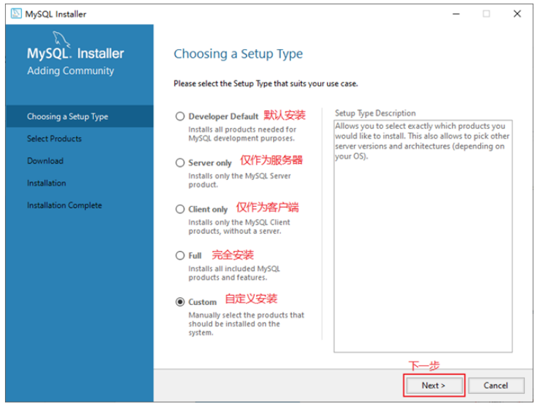
    + 从`Available Products->MySQL Servers->MySQL Server->MySQL Server8.0`中选择对应版本，点击右移的符号将其挪到右侧
    + 选中右侧的版本，下面会浮现一个超链接，点击该超链接，可以**指定`MySQL`安装的基本路径和存放数据的数据目录路径**，确认好后点击`Next`
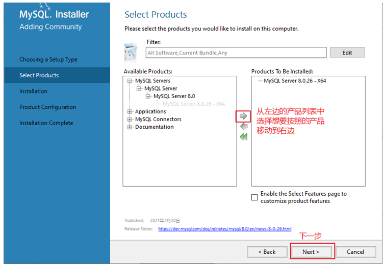
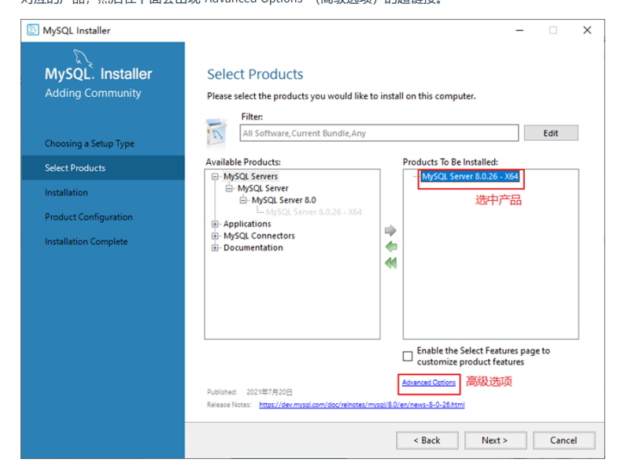
    + 显示`Ready to install`，没什么可点的，直接点`Excute`
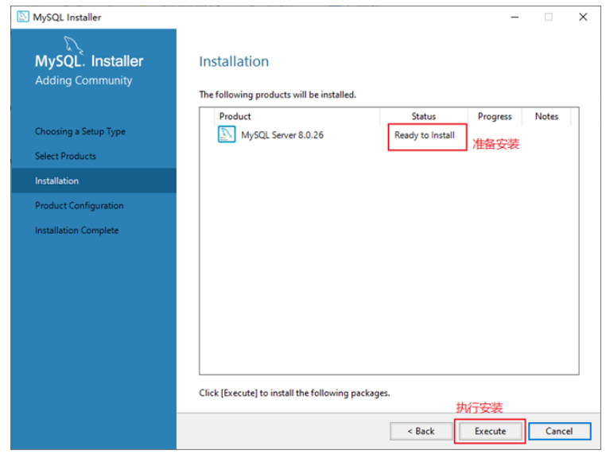
    + 安装完后，点击`Next`，看到`Ready to configure`，再点`Next`进入配置界面
    + 配置界面可以指定端口和主机类型，**如果同一设备上存在不同版本的`MySQL`,那么需要将它们的端口号设置不同**
    + `Config Type`选项用于指定服务器的类型:
      + `Development Computer`:默认，就是开发者的本地电脑，`MySQL`会**占用少的内存资源**
      + `Server Computer`:服务器，`MySQL`服务器可以同其他服务器应用程序一起运行，例如`Web服务器`等。**MySQL服务器配置成适当比例的系统资源**
      + `Dedicated Machine`:只运行MySQL服务的服务器。`MySQL`服务器配置成**使用所有可用系统资源**
    + 配置好后点击`Next`
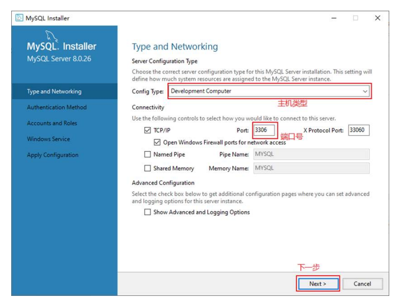
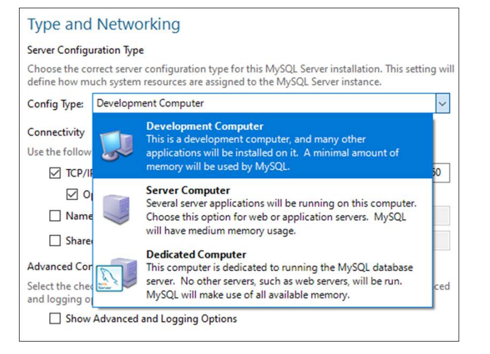
    + 转到授权方式选择界面，上面的带`RECOMMENDED`标识的是新的授权方式，而下面的是`MySQL5`版本使用的授权方式，这里默认选推荐的就好了，点击`Next`
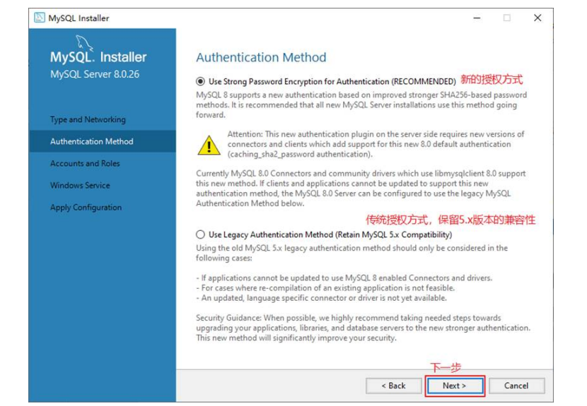
    + 转到密码设置界面，填写为`root`用户设置的密码，并重复输入一次密码后选择`Next`
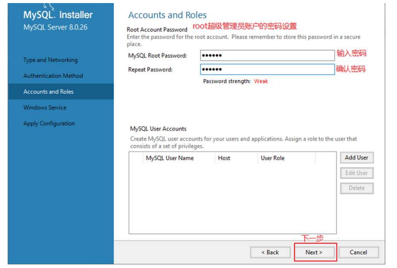
    + 转到服务名称窗口，这里可以设置`MySQL`服务进程的名称，是否开机自启动，使用什么样的账户，设置好后点击`Next`
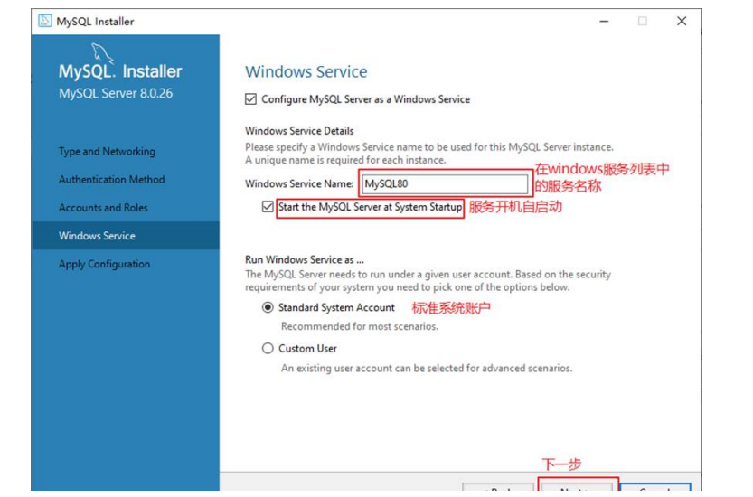
    + 接下来一路向下点`Exceute`、`Finish`、`Next`、`Finish`即可
  + ⑤在高级系统设置内向`path`内添加`MySQL`的`bin`目录所在的路径,配置环境变量
  + ⑥输入`mysql --version`来验证是否已安装成功
+ 问题:
  + 如果出现安装失败的问题，可能是缺少如下依赖:
    + `.Net Frameword`相关软件
    + `Microsoft Visual C++ 2015-2019`依赖项

---

### （三）配置

+ `MySQL`安装完成后，**需要启动其服务进程来保证客户端能够连接到数据库**
  + 方法一:直接右击`此电脑`，点击`管理`，在`服务和应用程序`栏下的`服务`中找到我们安装时给它起的进程名(8.0一般为`MySQL80`)，然后右击`启动`。如果想关闭，直接右击`关闭`
  + 方法二:在命令提示符内输入`net start MySQL80`打开服务，输入`net stop MySQL80`关闭服务，**如果输出权限不足，那么以管理员方式打开**
+ 启动完服务后，可以登录
  + 方法一:打开命令提示符，输入如下格式的代码:
  + `mysql -h 主机名(127.0.0.1或localhost) -P 端口号(一般为3306) -p 密码(可选)`
  + 例:`mysql -h 127.0.0.1 -P 3306 -p 123456`
  + 注意
    + `-p`与密码之间不能有空格，其它参数与值之间可以无视空格
    + 密码建议不写，即写到`-p`就直接回车，此时会弹出`Enter password`的提示，在此处输入密码，比较安全
    + 如果**客户端与服务器在同一设备上，且端口号为默认端口**，可以省略，此时格式简化为`mysql -u root -p`
+ 登陆后，通过`mysql -V`、`mysql -version`、`select version()`可以获得当前`mysql`的版本，**登陆后，想执行操作时必须使用`;`结尾，不然`mysql`会认为回车是换行操作而不是执行操作**

---

### （四）配置字符集

+ `mysql8.0`之前的版本默认的字符集是`latin`字符集，该字符集是欧洲普遍采用的一种字符集(因为`mysql`原公司是瑞典公司)，**它不支持中文，因此需要配置其字符集**
+ `mysql8.0`之后，默认字符集无需配置，因为**更新后字符集变为`Unicode`字符集**了，并使用`utf-8`编码
+ 配置过程如下:
  + ①找到`mysql`的数据目录，一般位于`C:\ProgramData\MySQL\MySQL Server 8.0`中
  + ②打开里面的`my.ini`配置文件，添加如下配置(建议**修改配置文件使用`notepad++`等高级文本编辑器**，使用记事本等软件打开修改后可能会导致文件编码修改为“含BOM头”的编码，从而服务重启失败)
~~~ini
[mysql]  #大概在63行左右，在其下添加
... 
default-character-set=utf8  #默认字符集
 
[mysqld]  # 大概在76行左右，在其下添加
...
character-set-server=utf8
collation-server=utf8_general_ci
~~~
  + ③**重启服务**
  + ④使用`show variables like 'character_%';`来检查是否配置成功
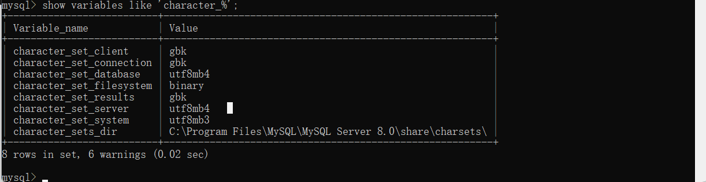

|指令|描述|备注|
|:---:|:---:|:---:|
|`show variables like 'character_%';`|查看当前使用的字符集情况|无|
|`show create table xxx`|展示表结构|无|

|目录/文件|作用|备注|归属|
|:---:|:---:|:---:|:---:|
|`bin`|所有`MySQL`的可执行文件|无|在软件目录下|
|`data目录`|存储数据库的目录|无|在数据目录下|
|`my.ini`|`MySQL`的配置文件|无|^|

---

### （五）常见问题

#### ①安装失败

+ 大概率是缺少安装依赖，确保安装了`.Net Frameword`相关软件和`Microsoft Visual C++ 2015-2019`依赖项

---

#### ②root密码忘记

+ ①关闭`MySQL`服务进程
+ ②命令行输入`mysqld --defaults-file="D:\ProgramFiles\mysql\MySQLServer5.7Data\my.ini" --skip-grant-tables`**打开`mysqld服务进程`，且无需权限检查**
+ ③输入`mysql -u root`无密码登录
+ ④修改权限表:
~~~mysql
use mysql;
update user set authentication_string=password('新密码') where user='root' and Host='localhost';
flush privileges;
~~~
+ ⑤关闭`MySQLId`进程服务
+ ⑥打开`MySQL`服务，使用修改后的新密码登录

---

#### ③不是内部或外部命令

+ 配置环境变量，将`bin`目录的地址添加进`path`中

---

#### ④ERROR 1046 (3D000): No database selected

+ 原因是在建表时未指定数据库
  + 解决方案1:`use 数据库名;`
  + 解决方案2:所有表对象前都加上`数据库.`以声明该表是哪个数据库的

---

## 三、SQL基础

### （一）SQL分类

+ `SQL`语言根据功能可以分为如下三大类:
  + `DDL（Data Definition Languages、数据定义语言）`:这些语句定义了不同的数据库、表、视图、索引等数据库对象，还可以用来**创建、删除、修改数据库和数据表的结构**
    + 主要的语句关键字为:`CREATE`、`DROP`、`ALTER`、`RENAME`、`TRUNCATE`等
  + `DML（Data Manipulation Language、数据操作语言）`:用于**添加、删除、更新和查询数据库记录**，并检查数据完整性。
    + 主要的语句关键字为:`INSERT`、`UPDATE`、`DELETE`、`SELECT`等
    + **`SELECT`是`SQL`语言的基础，最为重要**
  + `DCL（Data Control Language、数据控制语言）`:用于**定义数据库、表、字段、用户的访问权限和安全级别**
    + 主要的语句关键字为:`GRANT`、`REVOKE`、`COMMIT`、`ROLLBACK`、`SAVEPOINT`等
+ 由于查询操作相比其它`DML`语言更频繁，因此有些人单将查询语句专门分为`DQL（数据查询语言）`
+ 还有将`COMMIT`、`CALLBACK`去取出称为`TCL （Transaction Control Language，事务控制语言）`

---

### （二）SQL语言基础

#### ①基本规则与规范

+ 规则是必须遵守的硬性规定，不遵守会出错
  + `SQL`可以写在一行或者多行。**为了提高可读性，各子句分行写，必要时使用缩进**
  + 每条命令以`;`或`\g`或`\G`结束
  + **关键字不能被缩写也不能分行**
  + 双引号、单引号、反引号必须**成对结束，且必须为英文**
+ 规范是建议遵守的要求:
  + 由于`MySQL`在`Windows`下不区分大小写，但在`Linux`系统下区分大小写，因此建议:
    + 数据库名、表名、表别名、字段名、字段别名等都小写
    + `SQL`关键字、函数名、绑定变量等都大写

---

#### ②命名规则

+ 数据库的表名、数据库名或其它字段命名时:
  + 数据库、表名不得超过30个字符，变量名限制为29个
  + 仅能使用大小写的英文字母、数字和下划线
  + 不能包含空格
  + 同一个MySQL软件中，数据库不能同名；同一个库中，表不能重名；同一个表中，字段不能重名

---

#### ③注释

+ `MySQL`有三种注释:
  + 单行注释:`# xxxxx`，这是`MySQL`独有的注释方式
  + 单行注释:`-- xxxx`，这是数据库通用的注释方式，`--`后必须写空格
  + 多行注释:`/**/`
~~~sql
  # 这是单行注释
  -- 这是单行注释
 /*
  这是多行注释
 */ 
~~~

---

#### ④导入sql脚本

+ 可以通过命令行，在登陆后使用`source 文件路径的方式导入`
~~~sql
  mysql> source d:\mysqldb.sql

  mysql> desc employees;
  +----------------+-------------+------+-----+---------+-------+
  | Field          | Type        | Null | Key | Default | Extra |
  +----------------+-------------+------+-----+---------+-------+
  | employee_id    | int(6)      | NO   | PRI | 0       |       |
  | first_name     | varchar(20) | YES  |     | NULL    |       |
  | last_name      | varchar(25) | NO   |     | NULL    |       |
  | email          | varchar(25) | NO   | UNI | NULL    |       |
  | phone_number   | varchar(20) | YES  |     | NULL    |       |
  | hire_date      | date        | NO   |     | NULL    |       |
  | job_id         | varchar(10) | NO   | MUL | NULL    |       |
  | salary         | double(8,2) | YES  |     | NULL    |       |
  | commission_pct | double(2,2) | YES  |     | NULL    |       |
  | manager_id     | int(6)      | YES  | MUL | NULL    |       |
  | department_id  | int(4)      | YES  | MUL | NULL    |       |
  +----------------+-------------+------+-----+---------+-------+
  11 rows in set (0.00 sec)
~~~
+ 也可以通过数据库可视化工具手动导入，每个工具导入流程都类似，不做赘述

---

## 四、关键字与运算符

+ 下面是一些可能会用到的关键字或者重要的词

|分类|关键字|描述|备注|
|:---:|:---:|:---:|:---:|
|查询|`DUAL`|伪表|无|
|^|`DISTINCT`|去重|1.作用于多个列时，表示对每个列属性组成的集合去重，因此**作用于多个列时可能会出现单列重复现象** 2.该关键字**必须写在列名前面**|
|^|`AS`|1.给查询的列取别名 2.依据查询结果创建表或视图|无|
|^|`INTO`|1.将查询结果赋值给指定变量 2.向表内插入数据|无|
|过滤|`WHERE`|过滤|无|
|^|`IS`|一般使用`IS NULL`来判断值是否为空|无|
|^|`IN`|判断字段是否属于某个集合|无|
|^|`BETWEEN`|与`AND`配合使用可以判断字段的值是否处于某个区间内|无|
|^|`AND`|与`BETWEEN`配合使用可以判断字段的值是否处于某个区间内|无|
|^|`LIKE`|模糊匹配，使用`_`表示任意一个字符，`%`表示0个或多个字符|**由于`MySQL`并未完全遵守规范，导致匹配时字符串不区分大小写**|
|^|`REGEXP`|正则匹配|无|
|^|`ORDER BY`|排序|无|
|^|`ASC`|升序排序|无|
|^|`DESC`|降序排序|无|
|^|`LIMIT`|对查询结果切片|无|
|^|`OFFSET`|指定切片起始偏移量|`MySQL8.0`新增|
|多表查询|`LEFT/RIGHT/INNER [OUTER] JOIN`|左/右/内连接|无|
|^|`ON`|指定连接条件|无|
|^|`UNION [ALL]`|将多个查询结果合并,如果有`ALL`那么去重|无|
|^|`USING`|指定表连接时匹配的字段，**必须保证字段名是一致的**|无|
|^|`NATURAL JOIN`|自动查询两个表内相同的属性名下的字段是否相等，然后做等值连接|无|
|^|`GROUP BY`|按照指定字段或集合分组|无|
|^|`HAVING`|指定过滤条件，**支持使用聚合函数**|无|
|其它DML语句|`DELETE`|删除|无|
|^|`INSERT`|插入|无|
|^|`UPDATE`|更新|无|
|^|`SET`|设置表字段/变量的值|无|
|数据库管理|`CREATE`|创建数据库对象|无|
|^|`TABLE/PROCEDURE/VIEW/FUNCTION/TRIGGER`|指定数据库对象类型为表/存储过程/视图/函数/触发器|无|
|^|`EXISTS`|判断数据库对象或查询结果是否存在|无|
|^|`SHOW`|呈现数据库对象结构|无|
|^|`DESC/DESCRIPTION`|查看表结构|无|
|^|`REPLACE`|覆盖/替换同名数据库对象|无|
|^|`ALTER`|修改数据库对象|无|
|^|`DROP`|删除数据库对象|无|
|^|`ADD`|向数据库对象内添加一些内容|无|
|^|`MODIFY`|修改数据库对象的一些属性|无|
|^|`RENAME`|重命名表|无|
|^|`TRUNCATE`|清空表数据，但不删除表结构|无|
|^|`CHANGE`|修改表内字段名|无|
|^|`FIRST`|使指定字段在表内排第一|无|
|^|`AFTER`|使指定字段在某一字段次序之后|无|
|约束|`NOT NULL`|非空约束|无|
|^|`UNIQUE`|唯一性约束|无|
|^|`PRIMARY KEY`|主键约束|无|
|^|`AUTO_INCREMENT`|自增|无|
|^|`FOREIGN KEY`|外键约束|无|
|^|`CHECK`|检查约束|无|
|^|`DEFAULT`|默认值约束|无|
|^|`CONSTRAINT`|指定约束名|无|
|约束等级|`CASCADE`|主表执行更新/删除操作时，从表同步进行更新/删除|无|
|^|`SET NULL`|主表执行更新/删除操作时，从表对应的外键项被更改为`NULL`|需要外键项没有`NOT NULL`约束|
|^|`NO ACTION`|如果从表中存在匹配项，不允许主表的更新/删除操作|如果不指定约束等级，默认为该等级|
|^|`RESTRICT`|同`NO ACTION`|无|
|^|`SET DEFAULT`|主表执行更新/删除操作时，从表对应外键项被设置为`DEFAULT`值|`InnoDB`无法识别|
|变量与流程控制|`SET`|定义系统变量或会话用户变量|无|
|^|`DECLARE`|声明局部变量或错误|无|
|^|`GLOBAL`|指定全局标识|无|
|^|`SESSION`|指定会话标识|无|
|流程控制|`IF`|判断表达式是否成立|无|
|^|`ELSEIF`|上面对应的判断式不满足时判断自己的表达式是否满足|无|
|^|`ELSE`|判断表达式全不满足时，执行其后面的语句|无|
|^|`THEN`|执行后面的语句|无|
|^|`END`|结束指定操作|无|
|^|`CASE`|指定分支起始|无|
|^|`WHEN`|同`IF`|无|
|^|`LOOP`|循环|无|
|^|`WHILE DO`|循环|无|
|^|`REPEAT`|循环|无|
|^|`UTIL`|指定`REPEAT`循环结束的条件|无|
|^|`LEAVE`|跳出循环或`BEGIN-END`块|无|
|^|`ITERATE`|立刻执行下一轮循环|无|
|游标|`CURSOR FOR`|指定游标对应的查询结果|无|
|^|`OPEN`|打开游标|无|
|^|`CLOSE`|关闭游标|无|
|错误处理|`CONDITION FOR`|指定错误码|无|
|^|`HANDLER FOR`|指定待处理的错误类型|无|
|触发器|`NEW`|更改后的数据|无|
|^|`OLD`|更改前的数据|无|
|^|`FOLLOWS`|指定在某一触发器执行后执行|无|
|^|`PRECEDES`|指定在某一触发器执行前执行|无|
|DCL操作|`COMMIT`|提交|无|
|^|`ROLLBACK`|回滚至最近的提交操作|DML语句无法回滚|

|分类|运算符|描述|备注|样例|
|:---:|:---:|:---:|:---:|:---:|
|算术运算符|`+`|加法运算符|**没有拼接作用**|[运算符样例](../源码/MySQL/运算符样例.sql)|
|^|`-`|减法运算符|无|^|
|^|`*`|乘法运算符|无|^|
|^|`/`或`DIV`|加法运算符|无|^|
|^|`%`或`MOD`|加法运算符|**结果与被余数的正负号相同**|^|
|比较运算符|`<>`或`!=`|不等判断|无|^|
|^|`=`|等于判断|无|^|
|^|`<=>`|安全等于判断|该运算符可以区分出`NULL`|^|
|^|`大于号(>)`|大于判断|无|^|
|^|`>=`|大于等于判断|无|^|
|^|`<`|小于判断|无|^|
|^|`<=`|小于等于判断|无|^|
|逻辑|`AND`或`&&`|逻辑与|无|^|
|^|`OR`或`\|\|`|逻辑或|无|^|
|^|`NOT`或`!`|逻辑非|无|^|
|^|`XOR`|逻辑异或|无|^|
|非符号运算符|`IS NULL`|判断空值|无|^|
|^|`ISNULL`|^|^|^|
|^|`IS NOT NULL`|判断非空值|无|^|
|^|`LEAST`|获得最小值|无|^|
|^|`GREATEST`|获得最大值|无|^|
|^|`BETWEEN ... AND ...`|范围判断运算符|1.**`BETWEEN`后跟下限，`AND`后跟上限，不能颠倒** 2.是**全闭区间**的|^|
|^|`IN`|属于运算符|无|^|
|^|`NOT IN`|不属于运算符|无|^|
|^|`LIKE`|模糊匹配|无|^|
|^|`ESCAPE`|定义转义字符|无|^|
|^|`REGEXP`|正则匹配|无|^|
|位运算|`&`|按位与|无|^|
|^|`\|`|按位或|无|^|
|^|`^`|按位异或|无|^|
|^|`~`|按位取反|无|^|
|^|`>>`|按位左移，即除以2|无|^|
|^|`<<`|按位右移，即乘以2|无|^|

---

## 五、数据类型

+ 为了存放多样的数据，`MySQL`提供了很多数据类型供我们存储各式各样的数据:

|类型|类型举例|
|:---:|:---:|
|整数类型|TINYINT、SMALLINT、MEDIUMINT、**INT(或INTEGER)**、BIGINT|
|浮点类型|FLOAT、DOUBLE|
|定点数类型|**DECIMAL**|
|位类型|BIT|
|日期时间类型|YEAR、TIME、**DATE**、**DATETIME**、TIMESTAMP|
|文本字符串类型|CHAR、**VARCHAR**、TINYTEXT、TEXT、MEDIUMTEXT、LONGTEXT|
|枚举类型|ENUM|
|集合类型|SET|
|二进制字符串类型|BINARY、VARBINARY、TINYBLOB、BLOB、MEDIUMBLOB、LONGBLOB|

### （一）整型

+ 整型共分为5种类型:

|类型|所占字节|取值范围|无符号取值范围|
|:---:|:---:|:---:|:---:|
|`TINYINT`|1|-128-127|0-255|
|`SMALLINT`|2|-32768-32767|0-65535|
|`MEDIUMINT`|3|-8388608~8388607|0-16777215|
|`INT/INTEGER`|4|-2147483648~2147483647|0-4294967295|
|`BIGINT`|8|-9223372036854775808~9223372036854775807|0~18446744073709551615|

|可选属性|格式|描述|备注|
|:---:|:---:|:---:|:---:|
|显式宽度|`INT(M)`|指定数字的显式宽度，通常与`ZEROFULL`属性搭配使用，在数字不足宽度时，使用0填充|1.指定显式宽度并不会影响该类型可存储的数值范围 `MySQL8.0.17`开始，`MySQL`不再推荐使用显式宽度属性|
|无符号|`UNSIGNED`|使数值的最小范围值从0开始|无|
|0填充|`ZEROFULL`|当数值宽度不足显式宽度时，用0填充|无|

+ 一般使用`INT`类型居多，**需要优先保证数据大小在数值存储范围之内**
+ 查看表结构时，出现的类型后括号内的数字就是当前类型下的数值的最大宽度

~~~sql
  CREATE TABLE test_int1 ( 
    x TINYINT, 
    y SMALLINT, 
    z MEDIUMINT, 
    m INT(5) UNSIGNED ZEROFULL, 
    n BIGINT 
);

~~~

---

### （二）浮点型

+ 浮点型用于表示小数，但它们无法绝对精确的表示小数，也就是说，**它们存在一定的精度误差**

|类型|有符号取值范围|无符号取值范围|所占字节|
|:---:|:---:|:---:|:---:|
|`FLOAT`|(-3.402823466E+38,-1.175494351E-38),0,(1.175494351E-38,3.402823466E+38)|0,(1.175494351E-38,3.402823466E+38)|4|
|`DOUBLE`|(-1.7976931348623157E+308,-2.2250738585072014E-308),0,(2.2250738585072014E-308,1.7976931348623157E+308)|0,(2.2250738585072014E-308,1.7976931348623157E+308)|8|

+ 浮点数可以指定**宽度和小数点后保留的位数**来保证其精度:`DOUBLE(10,2)`。该举例用来指定除去小数点后数值位数为10，且小数点后保留2位的浮点数
  + 如果传入值的整数部分大于该数，那么`MySQL`会报错
  + 如果小数部分超过了精度，那么会进行四舍五入
+ `MySQL8.17.0`开始，`MySQL`不再推荐使用该方法来指定精度

~~~sql
举例
  CREATE TABLE test_double1(
  f1 FLOAT,
  f2 FLOAT(5,2),
  f3 DOUBLE,
  f4 DOUBLE(5,2)
  );
  DESC test_double1;
  INSERT INTO test_double1
  VALUES(123.456,123.456,123.4567,123.45);
  -- Out of range value for column 'f2' at row 1
  INSERT INTO test_double1
  VALUES(123.456,1234.456,123.4567,123.45);
  SELECT * FROM test_double1;
~~~

---

### （三）定点型

+ `DECIMAL`可以绝对精确的表示各个小数，因此推荐使用该类型来表示小数
  + `DECIMAL(M,D)`是其类型声明的格式
    + `M`被称为精度，它表示除去小数点后数值的位数。其取值范围为`[0,65]`，`DECIMAL`占用的字节数为`M+2`字节
    + `D`被称为标度，它表示保留的小数点位数。其取值范围为`[0,30]`，且`D<M`
  + 定点数在内部以字符串形式被存储，因此它一定是精准的
  + 不指定精度时，默认的精度为`DECIMAL(10,0)`

~~~sql
  CREATE TABLE test_decimal1(
  f1 DECIMAL,
  f2 DECIMAL(5,2)
  );
  DESC test_decimal1;
  INSERT INTO test_decimal1(f1,f2)
  VALUES(123.123,123.456);
  -- Out of range value for column 'f2' at row 1
  INSERT INTO test_decimal1(f2)
  VALUES(1234.34);

~~~

---

### （四）位类型

+ `BIT`类型存储的是二进制值，其格式为`BIT(M)`
  + `M`指定其能存储的最大二进制位,其范围为`[0,64]`
  + 该类型约占用`(M+7)/8`个字节

~~~sql
  CREATE TABLE test_bit1(
  f1 BIT,
  f2 BIT(5),
  f3 BIT(64)
  );
  INSERT INTO test_bit1(f1)
  VALUES(1);
  -- Data too long for column 'f1' at row 1
  INSERT INTO test_bit1(f1)
  VALUES(2);
  INSERT INTO test_bit1(f2)
  VALUES(23);
~~~

### （五）日期与时间类型

|类型|描述|格式|取值范围|占用字节|
|:---:|:---:|:---:|:---:|:---:|
|`YEAR`|年|`YYYY`或`YY`|`[1901,2055]`|1|
|`TIME`|时间|`D HH:MM:SS`、`HH:MM:SS`、`HHMMSS`、`HH:MM`、`D HH:MM`、`D HH`、`SS`|`[-839:59:59,839:59:59]`|3|
|`DATE`|日期|`YYYY-MM-DD`、`YY-MM-DD`、`YYYYMMDD`、`YYMMDD`|`[1000-01-01,9999-12-03]`|3|
|`DATETIME`|日期时间|`YYYY-MM-DD HH:MM:SS`、` YYYY-MM-DD HH:MM:SS`、` YYYYMMDDHHMMSS`|`[1000-01-01 00:00:00,9999-12-31 23:59:59]`|8|
|`TIMESTAMP`|日期时间|`YYYY-MM-DD HH:MM:SS`、`YYMMDDHHMMSS`|`[1970-01-01 00:00:00 UTC,2038-01-19 03:14:07 UTC]`|4|

+ `YEAR`类型有两种表示方法:
  + 四位字符串表示:取值范围见上
  + 两位字符串表示:
    + 取值`01-69`时，表示`2001-2069`
    + 取值`70-99`时，表示`1970-1999`
    + 取值整数`0`或`00`时，表示`0000`
    + 取值字符串/日期的`0`时，表示`2000`

~~~sql
  CREATE TABLE test_datetime1(
  dt DATETIME
  );
  INSERT INTO test_datetime1
  VALUES ('2021-01-01 06:50:30'), ('20210101065030');
  INSERT INTO test_datetime1
  VALUES ('99-01-01 00:00:00'), ('990101000000'), ('20-01-01 00:00:00'),
  ('200101000000');
  INSERT INTO test_datetime1
  VALUES (20200101000000), (200101000000), (19990101000000), (990101000000);
  INSERT INTO test_datetime1
  VALUES (CURRENT_TIMESTAMP()), (NOW());
~~~

---

### （六）文本字符串类型

|类型|值长度|长度范围|可变性|占用字节|
|:---:|:---:|:---:|:---:|:---:|
|`CHAR(M)`|`M`|`0<=M<=255`|不可变|M个字节|
|`VARCHAR(M)`|`M`|`0<=M<=65536`|可变长|M+1个字节|
|`TINYTEXT`|`L`|`0<=L<=255`|可变长|L+2字节|
|`TEXT`|`L`|`0 <= L <= 65535`|可变长|L+2字节|
|`MEDIUMTEXT`|`L`|`0 <= L <= 16777215`|可变长|L+3字节|
|`LONGTEXT`|`L`|`0 <= L <= 4294967295`(相当于4Gb)|可变长|L+4字节|

+ `CHAR`类型文本
  + 需要预先指定字符串长度，若不指定默认为1
  + 如果传入的字符串长度不足，会**在尾部添加适量的空格**到达指定长度后存储。当`MySQL`检索`CHAR`类型的数据时，`CHAR`类型的字段会去除尾部的空格
  + 是不可变长度的字符串，且可存储的字符串长度较小。但效率高
+ `VARCHAR`类型文本
  + **必须预先指定字符串长度，否则报错**
  + `MySQL4.0`以下时，`M`指字节，这意味着使用`UTF-8`存储汉字时，`M=20`时仅能存6个汉字。`MySQL5.0`版本以上后，`M`指字符数
  + 是可变长度的字符串，存储长字符串时可以节省内存空间，但效率较低
+ 各`TEXT`类型本文
  + 主要区别就是可以容纳的字符串长度不同
  + 都是可变长的
  + 通常用来存储文章主要内容信息
  + **由于实际长度不确定，无法作为主键**

---

### （七）枚举与集合

|类型|值长度|长度范围|占用字节|
|:---:|:---:|:---:|:---:|
|`ENUM`|`L`|`1<=L<=65535`|1或2个字节|
|`SET`|`L`|`1<=L<=64`|如下表所示|

|类型|成员个数范围（L表示实际成员个数）|占用的存储空间|
|:---:|:---:|:---:|
|`ENUM`|`[1,255]`|1字节|
|^|`[256,65535]`|2字节|
|`SET`|`[1,8]`|1字节|
|^|`[9,16]`|2字节|
|^|`[17,24]`|3字节|
|^|`[25,32]`|4字节|
|^|`[33,64]`|8字节|

+ `ENUM`格式为`ENUM(value1,value2,value3...)`，在插入数据时，只能插入事先声明好的单个数据

~~~sql
  CREATE TABLE test_enum(
  season ENUM('春','夏','秋','冬','unknow')
  );
  INSERT INTO test_enum
  VALUES('春'),('秋');
  -- 忽略大小写
  INSERT INTO test_enum
  VALUES('UNKNOW');
  -- 允许按照角标的方式获取指定索引位置的枚举值
  INSERT INTO test_enum
  VALUES('1'),(3);
  -- Data truncated for column 'season' at row 1
  INSERT INTO test_enum
  VALUES('ab');
  -- 当ENUM类型的字段没有声明为NOT NULL时，插入NULL也是有效的
  INSERT INTO test_enum
  VALUES(NULL);

~~~

+ `SET`格式为`SET(value1,value2,value3...)`,插入数据时，可以将声明的多个数据组合在一起插入，但如果有重复数据，会去重

~~~sql
CREATE TABLE test_set(
s SET ('A', 'B', 'C')
);
INSERT INTO test_set (s) VALUES ('A'), ('A,B');
-- 插入重复的SET类型成员时，MySQL会自动删除重复的成员
INSERT INTO test_set (s) VALUES ('A,B,C,A');
-- 向SET类型的字段插入SET成员中不存在的值时，MySQL会抛出错误。
INSERT INTO test_set (s) VALUES ('A,B,C,D');
SELECT *
FROM test_set;

CREATE TABLE temp_mul(
gender ENUM('男','女'),
hobby SET('吃饭','睡觉','打豆豆','写代码')
);

INSERT INTO temp_mul VALUES('男','睡觉,打豆豆'); -- 成功
--  Data truncated for column 'gender' at row 1
INSERT INTO temp_mul VALUES('男,女','睡觉,写代码'); -- 失败
--  Data truncated for column 'gender' at row 1
INSERT INTO temp_mul VALUES('妖','睡觉,写代码');-- 失败
INSERT INTO temp_mul VALUES('男','睡觉,写代码,吃饭'); -- 成功

~~~

### （八）二进制字符串类型

|类型|值长度|长度范围|可变性|占用字节|
|:---:|:---:|:---:|:---:|:---:|
|`BINARY`|`M`|`0<=M<=255`|不可变|`M`字节|
|`VARBINARY`|`M`|`0<=M<=65535`|可变|`M+1`字节|

+ 该情况类似于`CHAR`与`VARCHAR`
+ `BINARY`在不足长度时使用`\0`补齐指定长度

~~~sql
  CREATE TABLE test_binary1(
  f1 BINARY,
  f2 BINARY(3),
  --  f3 VARBINARY,
  f4 VARBINARY(10)
  );

  INSERT INTO test_binary1(f1,f2)
  VALUES('a','a');
  INSERT INTO test_binary1(f1,f2)
  VALUES('尚','尚');-- UTF-8中，每个汉字占用三个字符来表示
~~~

### （九）JSON类型

+ `MySQL5.7`就开始支持`JSON`类型的数据，直接使用`JSON`来定义是`JSON`类型的数据
+ 查询时，使用`字段名->'$.属性'`的方式来详细的读取`JSON`串内的各个属性

~~~sql
  create table test1(
    test1 JSON
  );

  insert into test1 values('{"name":"李子轩"}');

  select test1->'$.name' from test1;
~~~

---

### （十）空间类型

+ MySQL中使用`Geometry`（几何）来表示所有地理特征。`Geometry`指一个点或点的集合，代表世界上任何具有位置的事物
+ MySQL的空间数据类型（`Spatial Data Type`）对应于`OpenGIS`类，包括单值类型：`GEOMETRY`、`POINT`、`LINESTRING`、`POLYGON`以及集合类型：`MULTIPOINT`、`MULTILINESTRING`、`MULTIPOLYGON`、`GEOMETRYCOLLECTION`
+ Geometry是所有空间集合类型的基类，其他类型如POINT、LINESTRING、POLYGON都是Geometry的子类
  + Point，顾名思义就是点，有一个坐标值。例如POINT(121.213342 31.234532)，POINT(30 10)，坐标值支持DECIMAL类型，经度（longitude）在前，维度（latitude）在后，用空格分隔
  + LineString，线，由一系列点连接而成。如果线从头至尾没有交叉，那就是简单的（simple）；如果起点和终点重叠，那就是封闭的（closed）。例如LINESTRING(30 10,10 30,4040)，点与点之间用逗号分隔，一个点中的经纬度用空格分隔，与POINT格式一致

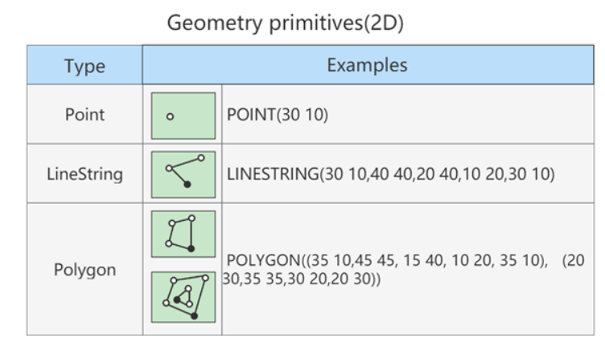
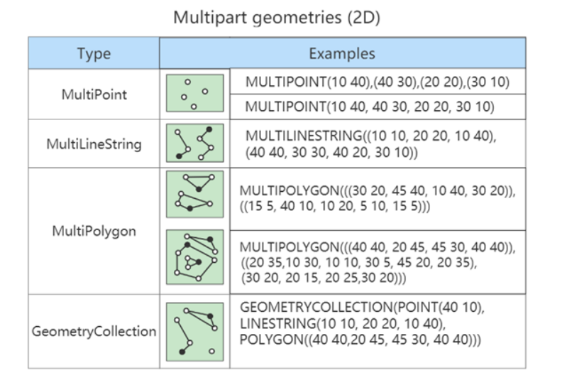

---

## 六、DDL语句

+ `DDL（Data Definition Languages、数据定义语言）`定义了不同的数据库、表、视图、索引等数据库对象，还可以用来**创建、删除、修改数据库和数据表的结构**
+ **所有DDL语句执行后就会生效，不需要进行刷新**

### （一）数据库管理

|分类|操作|描述|备注|样例|
|:---:|:---:|:---:|:---:|:---:|
|创建数据库|`CREATE DATABASE 数据库名;`|可以创建数据库。但**如果数据库已经存在，则会报错**|无|[样例](../源码/MySQL/数据库管理样例.sql)|
|^|`CREATE DATABASE 数据库名 CHARACTER SET 字符集;`|创建数据库并指定字符集，**也存在上面的弊端**|无|^|
|^|`CREATE DATABASE IF NOT EXISTS 数据库名;`|创建数据库，**如果数据库已经存在，就不做任何操作**|无|^|
|使用数据库|`USE 数据库名`|用来显式的指定要使用的数据库|无|^|
|查看数据库信息|`SHOW DATABASE1,DATABASE2,....;`|查看指定数据库内的内容|无|^|
|^|`SHOW TABLES FROM 数据库名;`|展示指定数据库的所有表|无|^|
|^|`SHOW CREATE DATABASE 数据库名;`|查看数据库的创建信息|无|^|
|^|`SELECT DATABASE();`|查看当前正在使用的数据库|无|^|
|修改数据库|`ALTER DATABASE 数据库名 ...`|修改数据库|无|无|
|删除数据库|`DROP DATABASE 数据库名;`|删除指定数据库,**如果不存在，则会报错**|无|^|
|^|`DROP DATABASE IF EXISTS 数据库名;`|如果存在，删除指定的数据库|无|^|

~~~sql
  -- 数据库创建
  CREATE DATABASE 数据库名
  [[DEFAULT] CHARACTER SET 字符集名称]
  [[DEFAULT] COLLATE 比较规则名称];

  -- 修改数据库数据编码字符集
  ALTER DATABASE dbtest1 DEFAULT CHARACTER SET 'utf8' COLLATE 'utf8_general_ci';
~~~

---

### （二）表管理

#### ①创建表

+ 使用`CREATE TABLE [IF NOT EXISTS] 表名`来创建一个表，详情如下:

~~~sql
  CREATE TABLE [IF NOT EXISTS] 表名(
    字段1, 数据类型 [约束条件] [默认值] comment '字段描述',
    字段2, 数据类型 [约束条件] [默认值] comment '字段描述',
    字段3, 数据类型 [约束条件] [默认值] comment '字段描述',
    ……
  )
  [
    CHARSET=xxx
    ENGINE=xxx
    ROW_FORMAT=xxx
    comment '表描述'
  ]
  ;
~~~

+ 创建表时，必须指定表名，和至少一个字段
  + 字段必须含有字段名和其对应的数据类型
   
+ 也可以使用`CREATE TABLE 表名 AS SELECT语句`来创建一个表，并**将查询结果的数据和字段变为该表的数据和字段**
~~~sql
  CREATE TABLE emp1 
  AS 
  SELECT * FROM employees;  -- 创建emp1表，并把employees表中的数据全部复制给emp1表
  
  CREATE TABLE emp2 AS SELECT * FROM employees WHERE 1=2; -- 创建的emp2是空表
  CREATE TABLE dept80
  AS 
  SELECT  employee_id emp_id, last_name name, salary*12 ANNSAL, hire_date   -- 别名充当新创建表的字段名
  FROM    employees
  WHERE   department_id = 80;

  DESCRIBE dept80;

~~~

+ [样例](../源码/MySQL/表创建样例.sql)

---

#### ②查看、修改、删除与清空

|分类|操作|描述|备注|样例|
|:---:|:---:|:---:|:---:|:---:|
|查看表|`DESC/DESCRIPTION 表名;`|查看表结构|无|[样例](../源码/MySQL/表管理样例.sql)|
|^|`SHOW CREATE TABLE 表名\G;`|查看表结构|无|^|
|^|`SHOW INDEX FROM 表名称;`|查看索引|无|^|
|^|`SHOW TABLES`|查看数据库内的表与视图|无|^|
|^|`SHOW TABLE STATUS LIKE '表名'`|查看表或视图的属性信息|无|^|
|修改表|`ALTER TABLE 表名 ADD [COLUMN] 字段名 字段类型 [FIRST/AFTER 字段名];`|新增表字段、字段类型，并决定该字段在表内的位置|无|^|
|^|`ALTER TABLE 表名 MODIFY [COLUMN] 字段名1 字段类型 [DEFAULT 默认值][FIRST/AFTER 字段名2];`|修改表的字段类型，指定默认值并决定该字段在表内的位置|无|^|
|^|`ALTER TABLE emp1 DEFAULT CHARACTER SET [编码字符集] COLLATE [比较规则];`|修改表的存储数据所用的字符集和其比较规则|无|无|
|^|`ALTER TABLE 表名 CHANGE [column] 列名 新列名 新数据类型;`|该变表的字段名称|无|^|
|^|`ALTER TABLE 表名 DROP [COLUMN] 字段名`|删除表的字段名|无|^|
|^|`RENAME TABLE 表名 TO 新名称`|修改表名|无|^|
|^|`ALTER TABLE 表名 RENAME TO 新名称`|^|无|^|
|^|`ALTER TABLE 表名 ROW_FORMAT=行格式`|修改行格式|无|无|
|删除表|`DROP TABLE [IF EXISTS] 数据表1 [, 数据表2, …, 数据表n];`|如果数据库存在指定表的话，删除|无|^|
|清空表|`TRUNCATE TABLE 表名`|清空表数据，但不删除表结构|**不推荐**|^|

---

### （三）回滚与原子化

+ 针对`DDL`操作，`MySQL`会在`DDL`执行后自动提交(`COMMIT`)一次，且该次提交不会被`SET autocommit = FALSE`影响。因此**全部的`DDL`操作都无法被回滚**
  + `COMMIT`用来进行提交，相当于存档
  + `ROLLBACK`用来进行回滚，回滚操作会回到离它最近的`COMMIT`操作的状态，相当于读档
+ 如果想回滚，需要在执行前`COMMIT`一次，并设置`SET autocommit = FALSE`，再进行操作，如果操作出现问题，那么回滚:
~~~sql
  -- 这里执行了一次DELETE操作，可以DELETE操作执行前执行了COMMIT操作，执行完毕后可以执行COLLBACK回滚操作
  -- 由于DELETE操作属于DML语言，因此可以回滚
  -- 另外，DELETE可以替代TRUNCATE TABLE的作用，因此推荐使用DELETE语句，而不使用无法回滚，不可控的TRUNCATE TABLE语句
  COMMIT;

  SELECT *
  FROM myemp3;

  SET autocommit = FALSE;

  DELETE FROM myemp3;

  SELECT *
  FROM myemp3;

  ROLLBACK;

  SELECT *
  FROM myemp3;
~~~
+ `MySQL8.0`后，`MySQL`使`DDL`操作被原子化，即**该操作如果执行就要全部执行完毕，如果中途出现错误，则回滚到操作前的位置**

---

## 七、DML语句

### （一）查询

#### ①基本语法

+ **最基本语法**:`select 列名 from 表名`

|操作|描述|语法|备注|样例|
|:---:|:---:|:---:|:---:|:---:|
|**得到全部列的全部信息**|使用`*`|`select * from 表名;`|无|[样例](../源码/MySQL/基本查询语句.sql)|
|**给列取别名**|使用双引号将别名括起来|`select 列名 "别名" from 表名;`|`MySQL`并没有严格实现`SQL`语法标准，因此`MySQL`中使用单引号括起来也是可以的，但**不要这样做**|^|
|^|列名与别名之间使用空格隔开|`select 列名 别名 from 表名;`|无|^|
|^|使用`as`关键字|`select 列名 as 别名 from 表名;`|无|^|
|**去重**|去除列的重复数据|`select distinct 列名 from 表名;`|无|^|
|**空值运算**|**使用空值运算得到的结果一定是空值(`NULL`)**|见样例|无|^|
|**反引号去歧义化**|使用反引号去除关键字和表名的歧义，或其它情况产生的歧义|^|无|^|
|**常数查询**|使用常数查询添加常数列|^|无|^|
|**查看表结构**|使用`desc`或`description`关键字|`DESC 表名;`|无|^|
|**过滤数据**|使用`where`关键字|`select 列名 from 表名 where 条件;`|无法使用聚合函数|^|
|**创建临时表**|使用`TEMPORARY`关键字|`CREATE TEMPORARY TABLE 临时表名 SELECT语句`|无|^|

---

#### ②排序与切片

+ `ORDER BY`用来对查询到的数据进行排序
  + 语法:`ORDER BY 排序依据1 ASC/DESC,排序依据2 ASC/DESC, ....`
  + `ORDER BY`子句要写在`where`的后面
  + `ORDER BY`子句可以作用于列的别名，但`WHERE`子句不能，这是因为`MySQL`执行顺序并不是从上至下，而是**先找到查询的表执行`WHERE`过滤，再抽出列名并取别名，再排序**。因此`WHERE`过滤时列还没有别名
  + `DESC`表示降序
  + `ASC`表示升序，**不写默认升序**
  + 如果想实现多级排序，各排序依据使用逗号隔开
+ `LIMIT`可以对查询到的数据进行切片，即分页
  + 格式:`LIMIT [偏移量],行数`
  + **`LIMIT`语句必须写在查询语句最后**
  + `MySQL8.0`新增了`OFFSET`关键字用来指定偏移量，此时格式可以为`LIMIT 行数 OFFSET 偏移量`
  + **偏移量为0时，可以忽略**
+ [排序与分页样例](../源码/MySQL/排序与切片样例.sql)

---

#### ③多表查询

##### Ⅰ基础的多表查询

+ 多表查询，也称为关联查询，指两个或多个表一起完成查询操作
  + 多表查询如果不使用限制条件，查询就会得到`笛卡尔积`的问题，一些不存在的数据就会被查询出来
  + 为了解决该问题，我们**在进行多表查询时必须使用`WHERE`子句进行过滤**，主要操作是找到各表中都共有的列，将它们关联起来
  + 在进行多表查询时，筛选出来的列可能因为多个表都有该列名会报错，因此需要**指定该列具体是哪个表里的**
  + 可以给要查询的表起别名，但**起别名后便无法再使用原来的表名，必须使用别名**，这是因为`sql`语句执行时先执行`FROM`子句，执行后原表名被别名覆盖，导致后面再使用原表名，`sql`语句执行时会不知道它表示的是哪个表
+ 笛卡尔积:
  + 笛卡尔积就是将各集合的所有组合都列举出来，如表A有10行，表B有20行，那么它们各行能够组合出来的总数为`10*20=200`行
  + 当**省略多个表的连接条件**、**连接条件无效**、**所有表中的所有行互相连接时**，多表查询就会出现笛卡尔积现象
+ [样例](../源码/MySQL/多表查询1.sql)

---

##### Ⅱ七种join操作

+ 多表查询可以分为多种连接方式:
  + **等值连接**与**非等值连接**:通过判断`where`语句的判断条件是否为相等判断来区分
  + **自连接**与**非自连接**:通过判断连接的表是否为自己来区分
  + **内连接**与**外连接**
    + 等值连接、非等值连接、自连接等属于**内连接**
    + 左外连接、右外连接和满外连接等属于**外连接**，**只要涉及“所有”，一般都需要使用外连接**
+ 连接会出现七种情况，如下图所示:

+ [实现七种连接的样例](../源码/MySQL/七种连接方式.sql)

---

##### ⅢC92与C99标准

+ `C92`标准
  + 使用`+`来进行左连接和右连接，被`+`修饰的是从表(**`MySQL`不支持该语法**)。
  + 只有左外连接和右外连接，没有满外连接
+ `C99`标准
  + 使用`JOIN ON`语句来进行连接
    + `INNER JOIN`表示内连接，`INNER`可被省略
    + `LEFT/RIGHT OUTER JOIN`表示外连接，`OUTER`可被省略
    + `ON`用来指定连接条件
  + 使用`FULL JOIN`来进行满外连接。**`MySQL`不支持该语句，但可以通过`UNION`语句达到相同的效果**
    + `UNION`用来**将两个或多个查询结果拼接起来**
    + 只写`UNION`会对两个查询结果内重复的结果集**去重**再进行拼接
    + `UNION ALL`则**不会执行去重操作**
  + 使用`NATURAL JOIN`进行自然连接,它会**自动查询两个表内相同的属性名下的字段是否相等，然后做等值连接**。**灵活性不强**
  + 使用`USING`指定两表连接的属性名，要求**两个表的属性名必须一致**
+ [样例](../源码/MySQL/多表查询2.sql)

---

#### ④GROUP BY与HAVING

+ `GROUP BY`可以以某一字段或集合为中心进行分组
  + `MySQL8.0`新增了`WITH ROLLUP`语句用来在查询结果出来后在最后面新添一行以表示所有记录的总和，**但`WITH ROLLUP`与`ORDER BY`是互斥的**
  + `GROUP BY`需要写在`WHERE`之后，`ORDER BY`之前
+ `HAVING`可以执行聚合函数作为过滤条件，用来弥补`WHERE`无法使用聚合函数的短板
  + `HAVING`也支持执行`WHERE`支持的过滤条件。但效率没有`WHERE`高，因此一般除非必须要用`HAVING`，否则建议使用`WHERE`
  + `HAVING`必须与`GROUP BY`一起使用，且`HAVING`紧随其后
+ [样例](../源码/MySQL/GROUP%20BY与HAVING样例.sql)

---

#### ⑤SELECT语句执行流程

+ 编写顺序为:
+ `SELECT -> FROM -> WHERE -> GROUP BY -> HAVING -> ORDER BY -> LIMIT`
+ 执行顺序为:
+ `FROM -> WHERE -> GROUP BY -> HAVING -> SELECT -> DISTINCT -> ORDER BY -> LIMIT`
+ `WHERE`之所以比`HAVING`效率高，就是因为**它执行的顺序比较早，将数据先过滤后得到的数据较之前就会变少**，此时再交给`HAVING`处理花费的时间就会减少，从而提高效率。

---

#### ⑥子查询

+ 子查询指外部的查询对内部查询的结果进行查询而得到结果的操作，该特性于`MySQL4.1`被引入
+ 子查询分为`相关子查询`与`不相关子查询`，也可以分为`单行子查询`与`多行子查询`
  + 单行子查询:子查询得到的结果是单行的:[样例](../源码/MySQL/单行子查询样例.sql)
  + 多行子查询:子查询得到的结果是多行的:[样例](../源码/MySQL/多行子查询样例.sql)
  + 相关子查询:子查询执行时需要外层的属性参与查询，**主查询的每一行都执行一次子查询**
    + 关联子查询有时也会与`EXISTS`与`NOT EXISTS`一起使用
    + [样例](../源码/MySQL/相关子查询样例.sql)
+ 子查询**可以写在除`ORDER BY`和`LIMIT`子句的任意位置**
+ [子查询练习](../源码/MySQL/子查询练习.sql)

|单行操作符|描述|备注|
|:---:|:---:|:---:|
|`>`|大于|无|
|`>=`|大于等于|无|
|`<`|小于|无|
|`<=`|小于等于|无|
|`=`|等于|无|
|`<>`|不等于|无|

|多行比较操作符|描述|备注|
|:---:|:---:|:---:|
|`IN`|判断字段是否**属于**多行返回值的集合|无|
|`ANY`|**与单行操作符一起使用**，只要多行的任意值符合条件就返回true|无|
|`ALL`|**与单行操作符一起使用**，需要多行的全部值符合条件才返回true|无|
|`SOME`|`ANY`的别名，与其作用相同|无|

---

### （二）增删改

+ `INSERT`语句用来对表数据进行插入:
~~~sql
  -- 插入方式1:
  -- VALUES也可以写成VALUE,但sql标准规定的标准写法是VALUES
  -- 在插入全部字段时，指定的插入字段可以省略
  INSERT INTO 表名 [(column1 [, column2, …, columnn])]
  VALUES(value1[, value2, …, valuen]),
  (),
  (),...
  ();

  -- 插入方式2:

  INSERT INTO 表名
  SELECT 语句
~~~
+ 使用INSERT同时插入多条记录时，MySQL会返回一些在执行单行插入时没有的额外信息:
  + `Records`：表明插入的记录条数
  + `Duplicates`：表明插入时被忽略的记录，原因可能是这些记录包含了重复的主键值
  + `Warnings`：表明有问题的数据值，例如发生数据类型转换
+ 注意:
> + 字符和日期型数据应包含在单引号中，即**它们都通过字符串插入**
> + 一个同时插入多行记录的`INSERT`语句等同于多个单行插入的`INSERT`语句，但是**多行的`INSERT`语句在处理过程中效率更高**

---

+ `UPDATE`用来更新表数据
~~~sql
  UPDATE 表名
  SET column1=value1, column2=value2, … , column=valuen
  WHERE 语句(可选);
~~~
+ `WHERE`子句可以过滤要更新的数据
+ 可以一次性更新多条数据和多个列

---

+ `DELETE`用来删除表数据
~~~sql
  DELETE FROM 表名 WHERE 语句;
~~~

+ [样例](../源码/MySQL/增删改样例.sql)
+ [增删改练习](../源码/MySQL/增删改练习.sql)

---

### （三）回滚

+ `DML`不像`DDL`一样无法回滚，可以在执行操作前通过设置`SET AUTOCOMMIT = FALSE;`以限制自动提交，从而保证可以执行`ROLLBACK`
~~~sql

  SET AUTOCOMMIT = FALSE;

  UPDATE employees
  SET    department_id = 70
  WHERE  employee_id = 113;

  ROLLBACK;
~~~

---

## 八、约束

### （一）概述

+ 为了保证数据的完整性，`SQL规范`以约束的方式对表数据进行额外的条件限制。从以下四个方面考虑
  + **实体完整性**:同一个表中，不能存在两条完全相同无法区分的记录
  + **域完整性**:年龄范围0-120，性别范围“男/女”
  + **引用完整性**:员工所在部门，在部门表中要能找到这个部门
  + **用户自定义完整性**:用户名唯一、密码不能为空、本部门经理的工资不得高于本部门职工的平均工资的5倍等
+ 为了解决上面的问题，`MySQL`提供了约束。
  + 约束是表级的强制规定
  + 可以**在创建表时规定约束**，也可以**在表创建之后通过`ALTER TABLE`语句修改约束**
+ 根据不同的分类依据，约束的分类如下:
  + 根据约束数据列的限制，分为**单列约束**和**多列约束**
  + 根据约束的作用范围，分为**列级约束**和**表级约束**
  + 根据约束的作用，分为下表:

|约束|描述|备注|
|:---:|:---:|:---:|
|`NOT NULL`|非空约束|无|
|`UNIQUE`|唯一约束，即不能重复|无|
|`PRIMARY KEY`|主键(非空且唯一)约束|无|
|`FOREIGN KEY`|外键约束|无|
|`CHECK`|检查约束|无|
|`DEFAULT`|默认值约束|无|

~~~sql
  -- information_schema数据库名（系统库）
  -- table_constraints表名称（专门存储各个表的约束）
  SELECT * FROM information_schema.table_constraints
  WHERE table_name = '表名称';
~~~

---

### （二）非空约束

+ `NOT NULL`用来指定非空约束
  + 非空约束仅能在列上声明，不能通过组合声明
  + 默认时，所有类型的值都可以是NULL

~~~sql
  -- 建表时添加约束
  CREATE TABLE student(
  sid int,
  sname varchar(20) not null,
  tel char(11) ,
  cardid char(18) not null
  );

  -- 建表后修改为非空约束
  alter table 表名称 modify 字段名 数据类型 not null;

  -- 删除非空约束
  -- 下面两句话，执行任意一句即可
  alter table 表名称 modify 字段名 数据类型 NULL; -- 去掉not null，相当于修改某个非注解字段，该字段允许为空
  alter table 表名称 modify 字段名 数据类型; -- 去掉not null，相当于修改某个非注解字段，该字段允许为空

~~~

+ 注意:
> + 如果想修改的表中的列已经有的数据是`NULL`了，此时再给它强行修改为非空约束会报错

---

### （三）唯一性约束

+ `UNIQUE`用来指定列的唯一性约束，即不能出现重复的数据
  + 该约束既可以作用于单个列，也可以通过组合声明
  + `NULL`可以在被该约束限制的列中多次出现
  + 在创建唯一约束的时候，如果不给唯一约束命名，就**默认和列名相同**
  + `MySQL`会给唯一约束的列上默认**创建一个唯一索引**
+ 删除唯一约束只能通过唯一索引删除
  + 删除时需要制定唯一索引名，唯一索引名就和唯一约束名一样
  + 如果创建唯一约束时未指定名称，**如果是单列，就默认和列名相同；如果是组合列，那么默认和()中排在第一个的列名相同**。也可以自定义唯一性约束名。

~~~sql
  -- 格式
  create table 表名称(
  字段名 数据类型,
  字段名 数据类型 unique,
  字段名 数据类型 unique key,
  字段名 数据类型
  );
  create table 表名称(
  字段名 数据类型,
  字段名 数据类型,
  字段名 数据类型,
  [constraint 约束名] unique key(字段名)
  );

  -- 下面是使用组合约束的语法
  -- 如果是组合的，那么只有当出现组合内的所有字段都重复时，MySQL才认为违反了唯一性约束

  CREATE TABLE USER(
  id INT NOT NULL,
  NAME VARCHAR(25),
  PASSWORD VARCHAR(16),
  -- 使用表级约束语法
  CONSTRAINT uk_name_pwd UNIQUE(NAME,PASSWORD)
  );

  -- 字段列表中如果是一个字段，表示该列的值唯一。如果是两个或更多个字段，那么复合唯一，即多个字段的组合是唯一的
  -- 方式1：
  alter table 表名称 add unique key(字段列表);
  -- 方式2：
  alter table 表名称 modify 字段名 字段类型 unique;

  -- 删除唯一性约束

  SELECT * FROM information_schema.table_constraints WHERE table_name = '表名'; -- 查看都有哪些约束

  ALTER TABLE USER DROP INDEX uk_name_pwd;  -- 使用DROP INDEX来删除索引来删除掉约束

  -- 可以通过下面的代码来得到表的索引结构

  show index from 表名称;

~~~

---

### （四）主键约束

+ `PRIMARY KEY`相当于`UNIQUE+NOT NULL`，即不允许重复且不能非空
  + 主键约束可以作用于单列，也可以组合约束
  + 如果是组合约束，那么这些字段全都不允许非空，且组合的值不能重复
  + `MySQL`的主键名总是`PRIMARY`,就算命名了主键约束名也没用
  + 当创建主键约束时，**系统默认会在所在的列或列组合上建立对应的主键索引**（能够根据主键查询的，就根据主键查询，效率更高）。如果删除主键约束了，主键约束对应的索引就自动删除了
  + 实际上，当我们没有显式的指定主键时，MySQL会自己创建一个隐藏主键，该主键的类型是长整型，占用6字节

~~~sql
  -- 格式
  create table 表名称(
  字段名 数据类型,
  字段名 数据类型 primary key,
  字段名 数据类型
  );
  create table 表名称(
  字段名 数据类型,
  字段名 数据类型,
  字段名 数据类型,
  [constraint 约束名] primary key(字段名) -- 表级模式
  );

  -- 演示一个表建立两个主键约束
  create table temp(
  id int primary key,
  name varchar(20) primary key
  );
  -- 报错:ERROR 1068 (42000): Multiple（多重的） primary key defined（定义）

  -- 删除主键约束
  -- 删除后，依然会存在非空约束

  alter table 表名称 drop primary key;

~~~

+ 主键的设计原则如下:
  + 建议尽量不要用跟业务有关的字段做主键，作为项目设计的技术人员，我们谁也无法预测在项目的整个生命周期中，哪个业务字段会因为项目的业务需求而有重复，或者重用之类的情况出现
  + 主键设计至少应该是全局唯一且是单调递增
  + 可以使用UUID用作主键，但是**UUID是无序的**，所以我们要把它转成有序，**MySQL8.0提供了uuid_to_bin函数转换为有序、使用二进制存储且占用空间更少的ID号**。同时，UUID也提供了bin_to_uuid函数进行转化
  + 如果不是MySQL8.0，那么就需要手动赋值做主键了
    + 比如，设计各个分店的会员表的主键，因为如果每台机器各自产生的数据需要合并，就可能会出现主键重复的问题。
    + 可以在总部 MySQL 数据库中，有一个管理信息表，在这个表中添加一个字段，专门用来记录当前会员编号的最大值。
    + 门店在添加会员的时候，先到总部 MySQL 数据库中获取这个最大值，在这个基础上加 1，然后用这个值作为新会员的“id”，同时，更新总部 MySQL 数据库管理信息表中的当 前会员编号的最大值。
    + 这样一来，各个门店添加会员的时候，都对同一个总部 MySQL 数据库中的数据表字段进 行操作，就解决了各门店添加会员时会员编号冲突的问题
  + 顺便一提，直接让自增ID做主键有很严重的弊端:
    + 可靠性不高:存在自增ID回溯的问题，这个问题直到最新版本的MySQL8.0才修复
    + 安全性不高:对外暴露的接口可以非常容易猜测对应的信息，如Restful风格的`/User/1/`，可以轻易猜测出用户的id是1
    + 性能差:**自增ID的性能较差**，需要在数据库服务器端生成
    + 交互多:业务还需要额外执行一次类似`last_insert_id()`的函数才能知道刚才插入的自增值，这需要多一次的网络交互。在海量并发的系统中，多1条SQL，就多一次性能上的开销
    + 局部唯一性:最重要的一点，**自增ID是局部唯一，只在当前数据库实例中唯一，而不是全局唯一，在任意服务器间都是唯一的**。对于目前分布式系统来说，这简直就是噩梦

~~~sql
  SET @uuid = UUID();
  SELECT @uuid,uuid_to_bin(@uuid),uuid_to_bin(@uuid,TRUE);
~~~

---

### （五）自增列

+ `AUTO_INCREMENT`用来使作用的列自增，**通常作用于主键**
  + 一个表最多只能有一个自增长列
  + 自增长列约束的列**必须是键列**(如:主键列、唯一键列)，且**类型必须为整型**
  + 自增约束无法进行组合约束
  + 如果自增列指定了0和`NULL`，`MySQL`会按平常情况自增，如果手动指定了合法的值，那么直接赋值为具体的值
  + `MySQL8.0`添加了自增列的持久化存储，即`MySQL`服务关闭再重启后，它依然会记得自增到的值，而在此之前，它不会记得

~~~sql
  -- 语法
  create table 表名称(
  字段名 数据类型 primary key auto_increment,
  字段名 数据类型 unique key not null,
  字段名 数据类型 unique key,
  字段名 数据类型 not null default 默认值,
  );
  -- 建表后修改自增列
  alter table 表名称 modify 字段名 数据类型 auto_increment;

  -- MySQL8.0的持久化存储
    -- 如果我们的表此时自增到了4，而我们删除了第四行，又新增了一行，此时的子增值会来到5
    -- 然后我们关闭数据库服务再重启，再新增一行
      -- 在MySQL8.0之前，新增的行的值是4，因为离它最近的行的值为3
      -- MySQL8.0及以后，新增的行的值是6，因为它可以实现持久化存储了
~~~

+ [索引样例]()

### （六）外键约束

+ `FOREIGN KEY`用来指定外键约束，它使该表内的列字段的值必须是其它表某字段中的值组成的集合中的一个元素
  + **外键仅能依赖于主键或具有UNIQUE约束的键**
  + 拥有外键约束的表叫做从表，被参考的表叫做主表
  + 创建外键约束时，如果不指定外键的约束名，`MySQL`会自动产生一个外键名，但**默认不是列名**
  + 使用外键约束需要确保主表是存在的
  + 删除表时，需要先删除从表，再删除主表
  + 当主表的字段值被从表参照时，它所在的行无法被删除。如果需要删除数据，需要先对从表的指定数据进行修改或进行删除
  + **一个表可以拥有多个外键约束**
  + 从表的外键列可以与主表的外键列不一致，但是数据类型必须一致，逻辑意义必须一致
  + 删除外键约束时，还要手动删除对应的索引
  + 外键的效率并不高。外键与级联更新适用于`单机低并发`，不适合分布式 、 高并发集群 ；级联更新是强阻塞，存在数据库`更新风暴`的风险；**外键影响数据库的插入速度**
+ 为了解决外键约束过强无法删除和修改一些数据的问题，`MySQL`提供了外键的约束等级:

|约束等级|描述|备注|
|:---:|:---:|:---:|
|`CASCADE`|主表执行更新/删除操作时，从表同步进行更新/删除|无|
|`SET NULL`|主表执行更新/删除操作时，从表对应的外键项被更改为`NULL`|需要外键项没有`NOT NULL`约束|
|`NO ACTION`|如果从表中存在匹配项，不允许主表的更新/删除操作|如果不指定约束等级，默认为该等级|
|`RESTRICT`|同`NO ACTION`|无|
|`SET DEFAULT`|主表执行更新/删除操作时，从表对应外键项被设置为`DEFAULT`值|`InnoDB`无法识别|

+ 推荐使用`ON UPDATE CASCADE ON DELETE RESTRICT`的方式

~~~sql
  -- 外键语法
  create table 主表名称(
  字段1 数据类型 primary key,
  字段2 数据类型
  );
  create table 从表名称(
  字段1 数据类型 primary key,
  字段2 数据类型,
  [CONSTRAINT <外键约束名称>] FOREIGN KEY（从表的某个字段) references 主表名(被参考字段)
  );

  -- 主表
  create table dept( 
    did int primary key, -- 部门编号
    dname varchar(50) -- 部门名称
  );

  -- 从表
  create table emp(
    eid int primary key, -- 员工编号
    ename varchar(5), -- 员工姓名
    deptid int, -- 员工所在的部门
    foreign key (deptid) references dept(did) -- 在从表中指定外键约束
    -- emp表的deptid和和dept表的did的数据类型一致，意义都是表示部门的编号
  );

  -- 建表后新增外键

  ALTER TABLE 从表名 ADD [CONSTRAINT 约束名] FOREIGN KEY (从表的字段) REFERENCES 主表名(被引用字段) [on update xx][on delete xx];

  -- 删除外键约束

  -- 1.第一步先查看约束名和删除外键约束
  SELECT * FROM information_schema.table_constraints WHERE table_name = '表名称';-- 查看某个表的约束名

  ALTER TABLE 从表名 DROP FOREIGN KEY 外键约束名;

  -- 2.第二步查看索引名和删除索引。（注意，只能手动删除）
  SHOW INDEX FROM 表名称; -- 查看某个表的索引名
  ALTER TABLE 从表名 DROP INDEX 索引名;

~~~

+ 注意:
> + 不推荐使用外键进行约束，应该在`Java`应用层层面上对外键需求进行解决。**在阿里的开发规范中，明确规定了禁止使用外键约束**
> + **从表的引擎必须与主表的引擎一致**

---

### （七）检查约束

+ `CHECK`约束用来检查某个字段的值是否符合某种要求
  + `MySQL5.7`可以使用`CHECK`约束，但插入不合法的数据没有任何警报和错误，形同虚设
  + `MySQL8.0`支持了`CHECK`约束

~~~sql

-- 格式

  create table 主表名称(
    字段1 数据类型 primary key,
    字段2 数据类型 check (条件)
  );

  -- 例
  CREATE TABLE temp(
    id INT AUTO_INCREMENT,
    `name` VARCHAR(20),
    age INT CHECK(age > 20),
    PRIMARY KEY(id)
  );

~~~

---

### （八）默认值约束

+ `DEFAULT`用来给字段设置默认值，默认值会在插入数据而未显式赋值时自动赋值

~~~sql

  -- 格式
  create table 表名称(
    字段名 数据类型 primary key,
    字段名 数据类型 unique key not null,
    字段名 数据类型 unique key,
    字段名 数据类型 not null default 默认值,
  );

  -- 例

  create table employee(
    eid int primary key,
    ename varchar(20) not null,
    gender char default '男',
    tel char(11) not null default '' -- 默认是空字符串
  );

  -- 建表后进行修改
  alter table 表名称 modify 字段名 数据类型 default 默认值;
  -- 如果这个字段原来有非空约束，你还保留非空约束，那么在加默认值约束时，还得保留非空约束，否则非空约束就被删除了
  -- 同理，在给某个字段加非空约束也一样，如果这个字段原来有默认值约束，你想保留，也要在modify语句中保留默认值约束，否则就删除了
  alter table 表名称 modify 字段名 数据类型 default 默认值 not null;

  -- 删除默认值约束

  alter table 表名称 modify 字段名 数据类型 ;-- 删除默认值约束，也不保留非空约束
  alter table 表名称 modify 字段名 数据类型 not null; -- 删除默认值约束，保留非空约束
  alter table employee modify gender char; -- 删除gender字段默认值约束，如果有非空约束，也一并删除
  alter table employee modify tel char(11) not null;-- 删除tel字段默认值约束，保留非空约束

~~~

---

### （九）非负约束

+ `unsigned`用来约束数值类型的字段非负

---

## 九、视图

+ 视图是数据库对象之一，它是一个或者多个数据表里的数据的逻辑显示
  + 视图是一种虚拟表，**它本身不存储任何数据**，仅占用很少的内存空间
  + 视图建立在已有表的基础之上
  + 视图的创建和删除仅影响视图本身，但**如果对视图执行增删改操作，数据表内的数据也会对应发生变化**
    + 如果视图A基于视图B和视图C创建，在删除视图B与视图C后，视图A将无法正常使用
    + 使用`CREATE OR REPLACE`用来创建或覆盖视图

~~~sql

-- 格式

CREATE [OR REPLACE]  -- OR REPLACE是视图存在时进行覆盖操作
[ALGORITHM = {UNDEFINED | MERGE | TEMPTABLE}]
VIEW 视图名称 [(查询结果各列的别名)]  -- 给表的各个列起别名
AS 查询语句
[WITH [CASCADED|LOCAL] CHECK OPTION]

-- 精简版

  CREATE VIEW 视图名称
  AS 查询语句

-- 例

CREATE VIEW empvu80
AS
SELECT employee_id, last_name, salary
FROM employees
WHERE department_id = 80;
-- 生成视图后查询

SELECT *
FROM salvu80;

-- 可以通过视图对数据进行格式化，如果视图已经存在了，那么覆盖该视图
-- 视图名称后面的括号用来给查询结果的表中各个列名起别名，它的优先级更高。如果没有指定，那么沿用查询结果的列名
CREATE OR REPLACE VIEW emp_depart(e_dept)
AS
SELECT CONCAT(last_name,'(',department_name,')') AS emp_dept
FROM employees e JOIN departments d
WHERE e.department_id = d.department_id;

-- 对视图的修改操作，与修改表的操作没有什么区别，但修改视图仅能修改视图中存在的字段
-- 如果针对视图进行了修改，则视图对应的数据表项也会同步修改
UPDATE emp_tel SET tel = '13789091234' WHERE ename = '孙洪亮';

-- 删除视图
DROP VIEW IF EXISTS 视图名称;

-- 如果视图A基于视图B和视图C创建，在删除视图B与视图C后，视图A将无法正常使用

~~~

+ 并非所有的视图都是可以更新的，下面列举出来的情况，视图都无法进行更新:
  + 在定义视图的时候指定了“`ALGORITHM = TEMPTABLE`”，视图将不支持INSERT和DELETE操作；
  + 视图中**不包含基表中所有被定义为非空又未指定默认值的列**，视图将不支持INSERT操作；
  + 在定义视图的SELECT语句中使用了JOIN联合查询，视图将不支持INSERT和DELETE操作；
  + 在定义视图的SELECT语句后的字段列表中使用了`数学表达式`或`子查询`，视图将不支持INSERT，也不支持UPDATE使用了数学表达式、子查询的字段值；
  + 在定义视图的SELECT语句后的字段列表中使用`DISTINCT`、`聚合函数`、`GROUP BY`、`HAVING`、`UNION`等，视图将不支持INSERT、UPDATE、DELETE；
  + 在定义视图的SELECT语句中包含了`子查询`，而子查询中引用了FROM后面的表，视图将不支持INSERT、UPDATE、DELETE；
  + 视图定义基于一个 不可更新视图 ；
  + 常量视图。

~~~sql
  create emp_dept
  AS SELECT ename,salary,birthday,tel,email,hiredate,dname
  FROM t_employee INNER JOIN t_department
  ON t_employee.did = t_department.did ;

  INSERT INTO emp_dept(ename,salary,birthday,tel,email,hiredate,dname)
  VALUES('张三',15000,'1995-01-08','18201587896',
  'zs@atguigu.com','2022-02-14','新部门');

  -- 报错:  ERROR 1393 (HY000): Can not modify more than one base table through a join view'atguigu_chapter9.emp_dept'

~~~

---

## 十、存储过程与函数

### （一）存储过程

#### ①语法

+ `MySQL5.0`起开始支持存储过程与函数
+ 存储过程能够将复杂的SQL逻辑封装在一起,从而供开发人员和程序调用
+ 存储过程是一组经过预编译的`SQL`语句的封装，它会预先存储在`MySQL`服务器上，需要执行的时候，客户端只需要发出调用请求，就能执行全部的语句
+ 它可以:
  + 简化操作，提高`SQL`重用性
  + 减少操作过程中的失误，提高效率
  + 减少网络传输量
  + 减少`SQL`语句暴露在网上的风险，提高了数据查询的安全性
+ 相比于视图，存储过程可以**直接操作底层数据表**，并实现更复杂的数据处理
+ 相比于函数，存储过程**没有返回值**
 
+ 其格式如下:

~~~sql
  -- IN、OUT、INOUT表示参数的类型，是输入型、输出型还是输入输出型
  -- 输入型是只读的，输出型是只写的，输入输出型是读写都可的
  -- 后面跟着参数名，再后面跟着该参数的类型
  CREATE PROCEDURE 存储过程名(IN|OUT|INOUT 参数名 参数类型,...)
  [characteristics ...]  --  characteristics表示创建存储过程时指定的对存储过程的约束条件
  BEGIN
  存储过程体
  END

  CALL 存储过程名(参数);  -- 使用CALL来调用存储过程

    -- 删除存储过程

  DROP PROCEDURE IF EXISTS 存储过程名;

  -- 修改存储过程
  -- 修改仅能修改存储过程的一些属性，而无法修改其逻辑代码
  ALTER PROCEDURE 存储过程名 [characteristic ...]

~~~

+ `characteristics`的约束条件如下:

~~~sql
LANGUAGE SQL  -- 指明使用的是SQL语言
 [NOT] DETERMINISTIC  -- 指明返回值是否是确定的，如果有NOT说明返回值不确定
--  被大括号包裹表示多选一
-- 下面这四个玩意是互斥的，如果写了多个，按照后面覆盖前面的原则来决定
 { CONTAINS SQL | NO SQL | READS SQL DATA | MODIFIES SQL DATA }
  -- CONTAINS SQL 表示当前存储过程的子程序包含SQL语句，但不包含读写数据的SQL语句。这是默认的情况下，系统指定的模式
  --  NO SQL 表示当前存储过程的子程序中不包含任何SQL语句
  -- READS SQL DATA 表示存储过程的子程序包含读数据的SQL语句
  -- MODIFIES SQL DATA 表示当前存储过程的子程序中包含写数据的SQL语句
 SQL SECURITY { DEFINER | INVOKER }
  --  SQL SECURITY 用来指定调用当前存储过程的权限
  -- DEFINER 表示只有当前存储过程的创建者或定义者才能执行当前存储过程
  -- INVOKER 表示拥有当前存储过程的访问权限的用户能够执行当前存储过程
 COMMENT 'string'
  -- COMMENT 用来描述当前存储过程，相当于注释 
~~~

+ 编写存储过程时，由于可能会读取到`;`直接结束，导致存储过程提前结束，因此需要使用`DELIMITER`来指定结束的标记

~~~sql

  -- 一般结束标记可以标记为 $ 和 //
  DELIMITER //  -- 指定结束标记为//

  存储过程

  DELIMITER ;  -- 重新指定结束标记为 ;

~~~

+ 因此，完整的存储过程声明与调用语法格式一般为:

~~~sql

  DELIMITER $
  CREATE PROCEDURE 存储过程名(IN|OUT|INOUT 参数名 参数类型,...)
  [characteristics ...]
  BEGIN
  sql语句1;
  sql语句2;
  END $

  DELIMITER ;

  CALL 存储过程名(参数);  -- 使用CALL来调用存储过程

  -- 删除存储过程

  DROP PROCEDURE IF EXISTS 存储过程名;

~~~

+ 存储过程使用`CALL`关键字声明

~~~sql
CALL sp1('值');

SET @name;
CALL sp1(@name);
SELECT @name;

SET @name=值;
CALL sp1(@name);
SELECT @name;
~~~

+ [存储过程样例](../源码/MySQL/存储过程样例.sql)

---

#### ②优缺点

+ 优点:
  + 存储过程可以**一次编译多次使用**。存储过程只在创建时进行编译，之后的使用都不需要重新编译，这就提升了 SQL 的执行效率。
  + 可以**减少开发工作量**。将代码 封装 成模块，实际上是编程的核心思想之一，这样可以把复杂的问题拆解成不同的模块，然后模块之间可以 重复使用 ，在减少开发工作量的同时，还能保证代码的结构清晰。
  + 存储过程的**安全性强**。我们在设定存储过程的时候可以 设置对用户的使用权限 ，这样就和视图一样具有较强的安全性。
  + 可以**减少网络传输量**。因为代码封装到存储过程中，每次使用只需要调用存储过程即可，这样就减少了网络传输量。
  + **良好的封装性**。在进行相对复杂的数据库操作时，原本需要使用一条一条的 SQL 语句，可能要连接多次数据库才能完成的操作，现在变成了一次存储过程，只需要 连接一次即可 。
+ 缺点:
  + **可移植性差**。存储过程不能跨数据库移植，比如在 MySQL、Oracle 和 SQL Server 里编写的存储过程，在换成其他数据库时都需要重新编写。
  + **调试困难**。只有少数 DBMS 支持存储过程的调试。对于复杂的存储过程来说，开发和维护都不容易。虽然也有一些第三方工具可以对存储过程进行调试，但要收费。
  + 存储过程的**版本管理很困难**。比如数据表索引发生变化了，可能会导致存储过程失效。我们在开发软件的时候往往需要进行版本管理，但是存储过程本身没有版本控制，版本迭代更新的时候很麻烦。
  + 它**不适合高并发的场景**。高并发的场景需要减少数据库的压力，有时数据库会采用分库分表的方式，而且对可扩展性要求很高，在这种情况下，存储过程会变得难以维护， 增加数据库的压力 ，显然就不适用了。

---

### （二）函数

+ `MySQL`的函数分为两种:聚合函数与单行函数

> + 不同的`DBMS`提供的函数以及其它非`SQL`标准的操作差异性很强，因此**采用 SQL 函数的代码可移植性是很差的**

#### ①单行函数

+ 单行函数
  + **每次执行时仅对一行进行操作，但每行都要执行**
  + 每行**仅返回一个结果**
  + 操作的是数据对象
  + 可以嵌套
  + 参数可以是一列或一个值

##### Ⅰ数值函数

|函数|参数|描述|返回值|返回值类型|备注|样例|
|:---:|:---:|:---:|:---:|:---:|:---:|:---:|
|`ABS(x)`|`x`:待处理数值|返回x的绝对值|>|数值|无|[样例](../源码/MySQL/数值类单行函数.sql)|
|`SIGN(X)`|`x`:待处理数值|返回X的符号。正数返回1，负数返回-1，0返回0|>|数值|无|^|
|`PI()`|无参|返回圆周率的值|>|数值|无|^|
|`CEIL(x)/CEILING(x)`|`x`:待处理数值|返回大于或等于某个值的最小整数|>|数值|无|^|
|`FLOOR(x)`|`x`:待处理数值|返回小于或等于某个值的最大整数|>|数值|无|^|
|`LEAST(...data)`|`data`:任意数量的数值|返回列表中的最小值|>|数值|无|^|
|`GREATEST(...data)`|`data`:任意数量的数值|返回列表中的最大值|>|数值|无|^|
|`MOD(x,y)`|`x`:被除数 `y`:除数|返回X除以Y后的余数|>|数值|无|^|
|`RAND()`|无参|返回0~1的随机值|>|数值|无|^|
|`RAND(x)`|`x`:指定随机数种子|返回0~1的随机值，其中x的值用作种子值，相同的X值会产生相同的随机数|>|数值|无|^|
|`ROUND(x)`|`x`:待处理数值|返回一个对x的值进行四舍五入后，最接近于X的整数|>|数值|无|^|
|`ROUND(x,y)`|`x`:待处理数值 `y`:指定截断的小数位|返回一个对x的值进行四舍五入后最接近X的值，并保留到小数点后面Y位|>|数值|**可以指定截断位为负数**|^|
|`TRUNCATE(x,y)`|`x`:待处理数值 `y`:指定截断的小数位|返回数字x截断为y位小数的结果|>|数值|**可以指定截断位为负数**|^|
|`FORMAT(value,n)`|`value`:待处理数值 `n`:保留的小数位数|返回数字x截断为y位小数的结果|>|数值|无|^|
|`SQRT(x)`|`x`:待处理数值|返回x的平方根。当X的值为负数时，返回`NULL`|>|数值|无|^|

---

##### Ⅱ字符串函数

+ `MySQL`内，字符串的索引从1开始

|函数|参数|描述|返回值|返回值类型|备注|样例|
|:---:|:---:|:---:|:---:|:---:|:---:|:---:|
|`ASCII(S)`|`s`:待处理字符串|返回字符串S中的**第一个字符**的ASCII码值|>|字符串|无|[样例](../源码/MySQL/字符串类单行函数.sql)|
|`CHAR_LENGTH(s)`|`s`:待处理字符串|返回字符串长度，和下面的函数作用一致|>|字符串|无|^|
|`LENGTH(s)`|`s`:待处理字符串|返回字符串长度|>|字符串|无|^|
|`CONCAT(...s)`|`s`:任意数量的字符串|连接s1,s2,......,sn为一个字符串|>|字符串|无|^|
|`CONCAT_WS(x,...s)`|`x`:分隔各连接的字符串的字符串 `s`:任意数量的字符串|同CONCAT(s1,s2,...)函数，但是每个字符串之间要加上x|>|字符串|无|^|
|`INSERT(str, idx, len, replacestr)`|`str`:待处理字符串 `idx`:指定替换的起始位置 `len`:替换的范围是`[idx,idx+len)`,这是该参数的作用 `replacestr`:要替换上去的字符串|将字符串str从第idx位置开始，len个字符长的子串替换为字符串replacestr|>|字符串|无|^|
|`REPLACE(str, a, b)`|`str`:待处理字符串 `a`:被替换的字符串 `b`:要替换上去的字符串|用字符串b替换字符串str中所有出现的字符串a|>|字符串|无|^|
|`UPPER(s) 或 UCASE(s)`|`s`:待处理字符串|将字符串s的所有字母转成大写字母|>|字符串|无|^|
|`LOWER(s) 或LCASE(s)`|`s`:待处理字符串|将字符串s的所有字母转成小写字母|>|字符串|无|^|
|`LEFT(str,n)`|`str`:待处理字符串 `n`:指定左切片的长度|返回字符串str最左边的n个字符|>|字符串|无|^|
|`RIGHT(str,n)`|`str`:待处理字符串 `n`:指定右切片的长度|返回字符串str最右边的n个字符|>|字符串|无|^|
|`LPAD(str, len, pad)`|`str`:待处理字符串 `len`:字符串最大长度限制 `pad`:填充字符串|用字符串pad对str最左边进行填充，直到str的长度为len个字符|>|字符串|无|^|
|`RPAD(str ,len, pad)`|`str`:待处理字符串 `len`:字符串最大长度限制 `pad`:填充字符串|用字符串pad对str最右边进行填充，直到str的长度为len个字符|>|字符串|无|^|
|`LTRIM(s)`|`s`:待处理字符串|去掉字符串s左侧的空格|>|字符串|无|^|
|`RTRIM(s)`|`s`:待处理字符串|去掉字符串s右侧的空格|>|字符串|无|^|
|`TRIM(s)`|`s`:待处理字符串|去掉字符串s开始与结尾的空格|>|字符串|无|^|
|`TRIM(s1 FROM s)`|`s1`:要去除的字符串 `s`:待处理字符串|去掉字符串s开始与结尾的s1|>|字符串|无|^|
|`TRIM(LEADING s1 FROM s)`|`s1`:要去除的字符串 `s`:待处理字符串|去掉字符串s开始处的s1|>|字符串|无|^|
|`TRIM(TRAILING s1 FROM s)`|`s1`:要去除的字符串 `s`:待处理字符串|去掉字符串s结尾处的s1|>|字符串|无|^|
|`REPEAT(str, n)`|`str`:待处理字符串 `n`:重复次数|返回str重复n次的结果|>|字符串|无|^|
|`SPACE(n)`|`n`:空格数量|返回n个空格|>|字符串|无|^|
|`STRCMP(s1,s2)`|`s1`:待比较字符串 `s2`:待比较字符串|比较字符串s1,s2的ASCII码值的大小|>|字符串|无|^|
|`SUBSTR(s,index,len)`|`s`:待处理字符串 `index`:起始下标 `len`:切片长度|字符串切片|>|字符串|无|^|
|`LOCATE(substr,str)`|`substr`:待查找字符串 `s`:待处理字符串|字符串切片|>|字符串|无|^|
|`ELT(m,...s)`|`m`:下标索引 `s`:任意数量的字符串|返回指定下标的字符串列表的值|>|字符串|无|^|
|`FIELD(str,...s)`|`s`:待处理字符串 `s`:任意数量的字符串|返回字符串`str`在字符串列表中第一次出现的位置|>|字符串|无|^|
|`FIND_IN_SET(s1,s2)`|`s1`:待查找字符串 `s2`:待处理字符串|返回字符串s1在字符串s2中出现的位置。其中，**s1与s2以逗号分隔**|>|字符串|无|^|
|`REVERSE(s)`|`s`:待处理字符串|返回s反转后的字符串|>|字符串|无|^|
|`NULLIF(value1,value2)`|`s`:待处理字符串|比较两个字符串，如果value1与value2相等，则返回NULL，否则返回value1|>|字符串|无|^|

---

##### Ⅲ日期和时间函数

+ [日期和时间函数样例](../源码/MySQL/日期时间类单行函数.sql)

1. 获取日期、时间

|函数|参数|描述|返回值|返回值类型|备注|
|:---:|:---:|:---:|:---:|:---:|:---:|
|`CURDATE()/CURRENT_DATE()`|无参|返回当前日期，只包含年、月、日|>|日期|无|
|`CURTIME()/CURRENT_TIME()`|无参|返回当前时间，只包含时、分、秒|>|日期|无|
|`NOW() / SYSDATE() / CURRENT_TIMESTAMP() / LOCALTIME() / LOCALTIMESTAMP()` |无参|返回当前系统日期和时间|>|日期|无|
|`UTC_DATE()`|无参|返回UTC（世界标准时间）日期|>|日期|无|
|`UTC_TIME()`|无参|返回UTC（世界标准时间）时间|>|日期|无|

2. 日期与时间戳的转换

|函数|参数|描述|返回值|返回值类型|备注|
|:---:|:---:|:---:|:---:|:---:|:---:|
|`UNIX_TIMESTAMP()`|无参|以UNIX时间戳的形式返回当前时间。SELECT UNIX_TIMESTAMP() ->1634348884|>|日期|无|
|`UNIX_TIMESTAMP(date)`|`date`:日期值|将时间date以UNIX时间戳的形式返回|>|日期|无|
|`FROM_UNIXTIME(timestamp)`|`timestamp`:时间戳|将UNIX时间戳的时间转换为普通格式的时间|>|日期|无|

3. 获取月份、星期、星期数、天数等函数

|函数|参数|描述|返回值|返回值类型|备注|
|:---:|:---:|:---:|:---:|:---:|:---:|
|`YEAR(date) / MONTH(date) / DAY(date)`|`date`:日期值|返回具体的日期值|>|日期|无|
|`HOUR(time) / MINUTE(time) / SECOND(time)`|`time`:时间值|返回具体的时间值|>|日期|无|
|`MONTHNAME(date)`|`date`:日期值|返回月份：January，...|>|日期|无|
|`DAYNAME(date)`|`date`:日期值|返回星期几：MONDAY，TUESDAY.....SUNDAY|>|日期|无|
|`WEEKDAY(date)`|`date`:日期值|返回周几，注意，周1是0，周2是1，。。。周日是6|>|日期|无|
|`QUARTER(date)`|`date`:日期值|返回日期对应的季度，范围为1～4|>|日期|无|
|`WEEK(date) / WEEKOFYEAR(date)`|`date`:日期值|返回一年中的第几周|>|日期|无|
|`DAYOFYEAR(date)`|`date`:日期值|返回日期是一年中的第几天|>|日期|无|
|`DAYOFMONTH(date)`|`date`:日期值|返回日期位于所在月份的第几天|>|日期|无|
|`DAYOFWEEK(date)`|`date`:日期值|返回周几，注意：周日是1，周一是2，。。。周六是7|>|日期|无|

4. 日期操作函数

|函数|参数|描述|返回值|返回值类型|备注|
|:---:|:---:|:---:|:---:|:---:|:---:|
|`EXTRACT(type FROM date)`|`type`:想得到的日期部分 `date`:日期值|返回指定日期中特定的部分|>|日期|无|

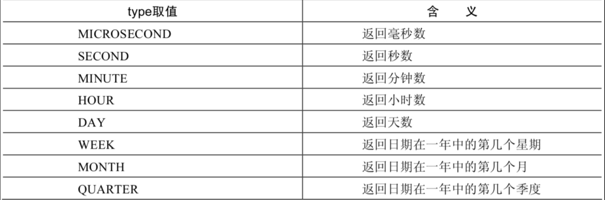

5. 时间与秒转换函数

|函数|参数|描述|返回值|返回值类型|备注|
|:---:|:---:|:---:|:---:|:---:|:---:|
|TIME_TO_SEC(time)|`time`:时间值|将 time 转化为秒并返回结果值。转化的公式为：`小时*3600+分钟*60+秒`|>|日期|无|
|SEC_TO_TIME(seconds)|`seconds`:秒值|将 seconds 描述转化为包含小时、分钟和秒的时间|>|日期|无|

6. 计算日期和时间的函数

|函数|参数|描述|返回值|返回值类型|备注|
|:---:|:---:|:---:|:---:|:---:|:---:|
|`DATE_ADD(datetime, INTERVAL expr type)/ADDDATE(date,INTERVAL expr type)`|`type`:见下图 `datetime/time`:日期值|返回与给定日期时间相差INTERVAL时间段的日期时间|>|日期|括号内的`INTERVAL`也要写|
|`DATE_SUB(date,INTERVAL expr type)/SUBDATE(date,INTERVAL expr type)`|`type`:见下图 `datetime/time`:日期值|返回与date相差INTERVAL时间间隔的日期|>|日期|括号内的`expr`也要写|
|`ADDTIME(time1,time2)`|`time1`:时间值 `time2`:时间值|返回time1加上time2的时间。当time2为一个数字时，代表的是`秒`，可以为负数|>|日期|无|
|`SUBTIME(time1,time2)`|`time1`:时间值 `time2`:时间值|返回time1减去time2后的时间。当time2为一个数字时，代表的是`秒`，可以为负数|>|日期|无|
|`DATEDIFF(date1,date2)`|`date1`:日期值 `date2`:日期值|返回date1 - date2的日期间隔天数|>|日期|无|
|`TIMEDIFF(time1, time2)`|`time1`:时间值 `time2`:时间值|返回time1 - time2的时间间隔|>|日期|无|
|`FROM_DAYS(N)`|`N`:数值|返回从0000年1月1日起，N天以后的日期|>|日期|无|
|`TO_DAYS(date)`|`date`:日期值|返回日期date距离0000年1月1日的天数|>|日期|无|
|`LAST_DAY(date)`|`date`:日期值|返回date所在月份的最后一天的日期|>|日期|无|
|`MAKEDATE(year,n)`|`year`:年份 `n`:年份的天数|针对给定年份与所在年份中的天数返回一个日期|>|日期|无|
|`MAKETIME(hour,minute,second)`|`hour`:小时 `minute`:分钟数 `second`:秒数|将给定的小时、分钟和秒组合成时间并返回|>|日期|无|
|`PERIOD_ADD(time,n)`|`time`:时间值 `n`:时间值|返回time加上n后的时间|>|日期|无|

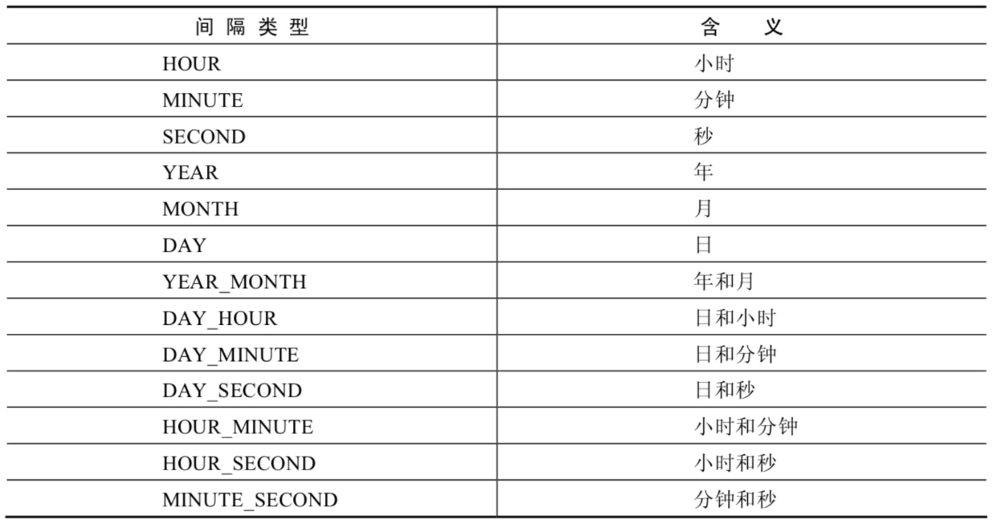

7. 日期的格式化与解析

|函数|参数|描述|返回值|返回值类型|备注|
|:---:|:---:|:---:|:---:|:---:|:---:|
|`DATE_FORMAT(date,fmt)`|`date`:日期值 `fmt`:自定义格式|按照字符串fmt格式化日期date值|>|日期|无|
|`TIME_FORMAT(time,fmt)`|`time`:时间值 `fmt`:自定义格式|按照字符串fmt格式化时间time值|>|日期|无|
|`GET_FORMAT(date_type,format_type)`|`date_type`:日期格式 `format_type`:显示格式|返回日期字符串的显示格式|>|日期|无|
|`STR_TO_DATE(str, fmt)`|`str`:待处理字符串 `fmt`:自定义格式|按照字符串fmt对str进行解析，解析为一个日期|>|日期|无|

|格式符|说明|格式符|说明|
|:---:|:---:|:---:|:---:|
|`%Y`|4位数字表示年份|`%y`|表示两位数字表示年份|
|`%M`|月名表示月份（January,....）|`%m`|两位数字表示月份（01,02,03。。。）|
|`%b`|缩写的月名（Jan.，Feb.，....）|`%c`|数字表示月份（1,2,3,...）|
|`%D`|英文后缀表示月中的天数（1st,2nd,3rd,...）|`%d`|两位数字表示月中的天数(01,02...)|
|`%e`|数字形式表示月中的天数（1,2,3,4,5.....）|
|`%H`|两位数字表示小数，24小时制（01,02..）|`%h和%I`|两位数字表示小时，12小时制（01,02..）|
|`%k`|数字形式的小时，24小时制(1,2,3)|`%l`|数字形式表示小时，12小时制（1,2,3,4....）|
|`%i`|两位数字表示分钟（00,01,02）|`%S和%s`|两位数字表示秒(00,01,02...)|
|`%W`|一周中的星期名称（Sunday...）|`%a`|一周中的星期缩写（Sun.，Mon.,Tues.，..）|
|`%w`|以数字表示周中的天数(0=Sunday,1=Monday....)|
|`%j`|以3位数字表示年中的天数(001,002...)|`%U`|以数字表示年中的第几周，（1,2,3。。）其中Sunday为周中第一天 |
|`%u`|以数字表示年中的第几周，（1,2,3。。）其中Monday为周中第一天 |
|`%T`|24小时制|`%r`|12小时制|
|`%p`|AM或PM|`%%`|表示%|

---

##### Ⅳ流程控制函数

+ 流程控制函数相当于其它编程语言的流程控制语句

|函数|参数|描述|返回值|返回值类型|备注|样例|
|:---:|:---:|:---:|:---:|:---:|:---:|:---:|
|IF(value,value1,value2)|`value`:判断表达式 `value1`:如果表达式为真返回的值 `value2`:表达式为假返回的值|如果value的值为TRUE，返回value1，否则返回value2|>|无返回值|无|[样例](../源码/MySQL/流程控制函数.sql)|
|IFNULL(value1, value2)|`value1`:值不为空时的返回值 `value2`:值不为空时的返回值|如果value1不为NULL，返回value1，否则返回value2|>|无返回值|无|^|
|`CASE WHEN 条件1 THEN 结果1 WHEN 条件2 THEN 结果2 .... [ELSE resultn] END`|>|>|>|相当于Java的if...else if...else...|无|>|无返回值|无|^|
|`CASE expr WHEN 常量值1 THEN 值1 WHEN 常量值1 THEN 值1 .... [ELSE 值n] END`|>|>|>|相当于Java的switch...case...|无|>|无返回值|无|^|

---

##### Ⅴ加密与解密函数

+ 加密与解密函数主要用于对数据库中的数据进行加密和解密处理，以防止数据被他人窃取

|函数|参数|描述|返回值|返回值类型|备注|样例|
|:---:|:---:|:---:|:---:|:---:|:---:|:---:|
|`PASSWORD(str)`|`str`:待处理字符串|返回字符串str的加密版本，41位长的字符串。加密结果`不可逆`，常用于用户的密码加密|>|字符串|`MySQL8`被废弃|[样例](../源码/MySQL/加密与解密函数.sql)|
|`MD5(str)`|`str`:待处理字符串|返回字符串str的md5加密后的值，也是一种加密方式。若参数为NULL，则会返回NULL|>|字符串|无|^|
|`SHA(str)`|`str`:待处理字符串|从原明文密码str计算并返回加密后的密码字符串，当参数为NULL时，返回NULL。`SHA加密算法比MD5更加安全`。|>|字符串|无|^|
|`ENCODE(value,password_seed)`|`value`:要加密的值 `password_seed`:|返回使用password_seed作为加密密码加密value|>|字符串|`MySQL8`被废弃|^|
|`DECODE(value,password_seed)`|`value`:要加密的值 `password_seed`:|返回使用password_seed作为加密密码解密value|>|字符串|`MySQL8`被废弃|^|

---

##### ⅥMySQL信息函数

|函数|参数|描述|返回值|返回值类型|备注|样例|
|:---:|:---:|:---:|:---:|:---:|:---:|:---:|
|`VERSION()`|无参|返回当前MySQL的版本号|>|不知道|无|[样例](../源码/MySQL/信息函数.sql)|
|`CONNECTION_ID()`|无参|返回当前MySQL服务器的连接数|>|字符串|无|^|
|`DATABASE()/SCHEMA()`|无参|返回MySQL命令行当前所在的数据库|>|字符串|无|^|
|`USER()/CURRENT_USER()/SYSTEM_USER()/SESSION_USER()`|无参|返回当前连接MySQL的用户名，返回结果格式为“主机名@用户名”|>|字符串|无|^|
|`CHARSET(value)`|`value`:指定字符串值|返回字符串value自变量的字符集|>|字符串|无|^|
|`COLLATION(value)`|`value`:指定字符串值|返回字符串value的比较规则|>|字符串|无|^|
|`uuid_to_bin(uuid,isAutoIncrement)`|uuid:uuid值 isAutoIncrement:是否有序，true为设置有序|将UUID值转为有序的二进制值|>|二进制值|无|^|
|`bin_to_uuid(bin)`|bin:二进制值|将二进制值转为UUID值|>|字符串|无|^|

---

#### ②聚合函数

+ 聚合函数**作用于一组数据**，且**仅返回一个值**

|函数|参数|描述|返回值|返回值类型|备注|样例|
|:---:|:---:|:---:|:---:|:---:|:---:|:---:|
|`COUNT(value)`|`value`:想统计的字段，可以是`*`和常数|统计某一字段的出现频率|>|数值|如果碰到`NULL`,该值不会参与运算|[样例](../源码/MySQL/聚合函数样例.sql)|
|`MAX(...value)`|`value`:一个或多个参与运算的值|得到最大值|>|数值|^|^|
|`MIN(...value)`|^|得到最小值|>|数值|^|^|
|`AVG(...value)`|^|得到平均值|>|数值|^|^|
|`SUM(...value)`|^|得到各数之和|>|数值|^|^|

+ 注意:
> + 使用`COUNT(*)、COUNT(1)和COUNT(字段)`会出现不同的结果，`COUNT(*)和COUNT(1)`相当于统计各行的数量，**而`COUNT(字段)`不会统计值为`NULL`的字段**

---

#### ③自定义函数

+ `MySQL`支持我们自定义一些函数:

~~~sql
  -- FUNCTION中默认参数被IN修饰
  CREATE FUNCTION 函数名(参数名 参数类型,...)
  RETURNS 返回值类型  -- RETURNS 表示函数返回的数据类型
  [characteristics ...]  -- characteristics用来设置FUNCTION的一些属性，同存储过程
  BEGIN
  函数体 -- 函数体中必须有 RETURN 语句
  END

  -- 调用函数
  SELECT 函数(参数...)  -- 函数可以被SELECT语句调用

  -- 修改函数
  -- 修改仅能修改函数的一些属性，而无法修改其逻辑代码

  ALTER FUNCTION 函数名 [characteristic ...]

  -- 删除函数

  DROP FUNCTION [IF EXISTS] 函数名;

~~~

+ [样例](../源码/MySQL/自定义函数样例.sql)

---

### （三）二者区别

||关键字|调用方式|返回值|应用场景|
|:---:|:---:|:---:|:---:|:---:|
|存储过程|`PROCEDURE`|使用`CALL`调用|可以理解为有0个或多个|用于更新数据|
|函数|`FUNCTION`|使用`SELECT`调用|只能且必须有一个|一般用于查询结果为一个值并返回时|

---

## 十一、变量与流程控制

### （一）变量

+ 在`MySQL`中，变量被分为系统变量和用户自定义变量

#### ①系统变量

+ 系统变量可以分为全局系统变量(使用`GLOBAL`关键字修饰)和会话系统变量(使用`SESSION`关键字修饰)
  + 全局系统变量又被简称为全局变量，相当于`JavaWeb`中的`Context`，它针对于所有会话均有效，但**服务重启后会失效**
  + 会话系统变量相当于`JavaWeb`中的`SESSION`，每一个会话都有其对应的会话系统变量。**如果没有使用任何关键字修饰变量，默认为会话系统变量**
+ `@@`标记专门用于标记系统变量
  + `@@global`专门表示全局系统变量
  + `@@session`专门表示会话系统变量
  + **不写（即直接写变量名而不写任何修饰符）默认从会话系统变量开始找，找不到再去找全局的，直到找到或全找不到为止**
+ 我们可以通过修改配置文件内的值来修改系统变量，但为了使他们生效，我们需要重启`MySQL`服务，但我们更希望在`MySQL`服务运行过程中就能修改系统变量的值
  + `SET`关键字可以在`MySQL`服务运行过程中修改系统变量的值。但在服务重启后会失效
  + 格式为`SET @@[global./session.]变量名=值;`

|操作|作用|备注|
|:---:|:---:|:---:|
|`SHOW GLOBAL VARIABLES [like 'xxx'];`|查看满足条件的全局变量|不写`like`语句相当于查看全部的全局系统变量|
|`SHOW [SESSION] VARIABLES [like 'xxx'];`|查看满足条件的当前会话变量|**不写修饰符默认为会话系统变量**，不写`like`语句相当于查看全部的会话系统变量|
|`SELECT @@global.变量名;`|查看指定的全局系统变量|无|
|`SELECT @@session.变量名;`|查看指定的会话系统变量|无|
|`SELECT @@变量名;`|查找某一系统变量|无|
|`SET @@[global.\|session.]变量名=值;`|在`MySQL`服务运行过程中修改系统变量的值|重启后失效|
|`set global 变量名=值;`|在`MySQL`服务运行过程中修改全局系统变量的值|重启后失效|
|`set session 变量名=值;`|在`MySQL`服务运行过程中修改会话系统变量的值|重启后失效|

---

#### ②用户变量

+ 用户变量是用户自己定义的变量
  + 根据其作用域的不同，将其分为会话用户变量和局部变量
    + 会话用户变量和会话系统变量的作用域是一致的，都作用于当前会话
    + 局部变量仅在`BEGIN`和`END`内有效，且仅能在存储过程和函数中被使用，而且**需要在`BEGIN`的最开始位置使用DECLARE语句创建才能使用**，否则
    + 会话用户变量需要使用@来修饰，可以在任意地方定义。**局部变量不需要使用@修饰，但需要先定义。否则读取的是系统变量**
    + **局部变量必须先声明才能调用，否则读取的是系统变量**

|操作|作用|备注|
|:---:|:---:|:---:|
|`SET @变量名 [:]= 值;`|定义会话用户变量|那个冒号可有可无|
|`SELECT 表达式 INTO @用户变量 各子句`|使用`SELECT`语句给会话用户变量赋值|无|
|`SELECT 用户变量 := 表达式 各子句`|^|无|
|`DECLARE 变量名1[,变量名2,...] 数据类型 [DEFAULT 值];`|定义并初始化变量|无|
|`SET 变量名 = 值;`|给局部变量赋值|无|
|`SELECT 表达式 INTO 变量名`|使用`SELECT`语句给局部变量赋值|无|
|`SELECT 变量1,变量2,变量3;`|查看局部变量的值|无|

||作用域|定义位置|语法|
|:---:|:---:|:---:|:---:|
|会话用户变量|当前会话|会话的任何地方|`SET @变量名 [:]= 值;`|
|局部变量|`BEGIN-END`块内|`BEGIN END`的第一句话|不用加@，但需要指定类型|

---

### （二）分支

#### ①IF语句

+ `IF`语句的语法结构如下:

~~~sql

  -- 下面的ELSEIF和ELSE都是可忽略的

  IF 表达式1 THEN 
    操作1
  ELSEIF 表达式2 THEN 
    操作2
  ELSE 
    操作N
  END IF

~~~

+ `IF`语句仅能在`BEGIN`和`END`作用域内使用，无法在其它位置使用
+ [分支样例](../源码/MySQL/分支样例.sql)

#### ②CASE语句

+ `CASE`语句的语法结构如下:

~~~sql
  -- 情况一：类似于switch
  CASE 表达式
  WHEN 值1 THEN 
    结果1或语句1(如果是语句，需要加分号)
  WHEN 值2 THEN 
    结果2或语句2(如果是语句，需要加分号)
  ...
  ELSE 
    结果n或语句n(如果是语句，需要加分号)
  END [case] -- 如果是放在begin end中需要加上case，如果放在select后面不需要

  -- 情况二：类似于多重if
  CASE
  WHEN 条件1 THEN 
    结果1或语句1(如果是语句，需要加分号)
  WHEN 条件2 THEN 
    结果2或语句2(如果是语句，需要加分号)
  ...
  ELSE 
    结果n或语句n(如果是语句，需要加分号)
  END [case] -- 如果是放在begin end中需要加上case，如果放在select后面不需要
~~~

+ [分支样例](../源码/MySQL/分支样例.sql)

### （三）循环

#### ①LOOP循环

+ 格式:

~~~sql

  -- 可以给LOOP循环上一个标签，以便于结束其循环时根据标签结束

  [label:] LOOP
    语句
  END LOOP [label];

~~~

---

#### ②WHILE循环

+ 格式

~~~sql

  -- 可以给WHILE循环上一个标签，以便于结束其循环时根据标签结束
  [abel:] WHILE 循环条件 DO
  循环体
  END WHILE [label];

~~~

---

#### ③REPEAT循环

+ 格式:

~~~sql

  REPEAT
    循环体
    UNTIL 条件  -- 这里不要写分号
  END REPEAT;
  
~~~

+ `repeat`循环无论如何都会**至少执行一次**

---

#### ④LEAVE与ITERATE

+ `LEAVE`相当于`break`，`ITERATE`相当于`continue`
+ `LEAVE`可以直接跳出`BEGIN`与`END`的作用域，即立刻让存储过程或函数停止执行
+ [循环样例](../源码/MySQL/循环样例.sql)

### （四）游标

+ 为了让我们能够操作查询结果的每一行，`MySQL`提供了**游标**

~~~sql
  -- 第一步
  -- 定义游标
  DECLARE 游标名 CURSOR FOR select_statement;
  -- 这是Oracle和PostgreSQL的写法
  DECLARE 游标名 CURSOR IS select_statement;

  -- 第二步 打开游标

  open 游标名;

  -- 第三步 使用游标（从游标中取得数据）
  -- 该操作提取出来的值是按照查询结果提取的
  -- 无法提取除查询结果内的列名以外的值
  FETCH cursor_name INTO 变量1 [, 变量2] ...

~~~

+ 注意:
> + 游标在打开状态时，会对数据进行加锁，导致效率变低，且会消耗系统资源。因此，我们需要养成**用完就关闭**的习惯，避免游标占用大量的系统资源并影响性能

+ [游标样例](../源码/MySQL/游标样例.sql)

---

### （五）错误处理

#### ①定义

+ 定义条件就是给`MySQL`中的错误码命名，这有助于存储的程序代码更清晰
+ 它将一个 错误名字 和 指定的错误条件 关联起来。这个名字可以随后被用在定义处理程序的 DECLARE HANDLER 语句中
+ 语法:`DECLARE 错误名称 CONDITION FOR 错误码（或错误条件）`
  + `MySQL_error_code`是数值型错误代码
  + `sqlstate_value`是长度为5的字符串类型错误代码
  + 二者都可以表示错误，如`在ERROR 1418 (HY000)`中，1418为数值型错误码，'HY000'是字符串型错误码
+ 示例1:`DECLARE Field_Not_Be_NULL CONDITION FOR 1048;`
+ 示例2:`DECLARE Field_Not_Be_NULL CONDITION FOR SQLSTATE '23000'`
+ 如果想手动报错，使用`SIGNAL SQLSTATE 'xxxxx' SET MESSAGE_TEXT = '报错信息' ; `

#### ②处理

+ 语法:`DECLARE 处理方式 HANDLER FOR 错误类型 处理语句;`

|各项分类|关键字|作用|备注|
|:---:|:---:|:---:|:---:|
|处理方式|`CONTINUE`|遇到错误不处理，继续执行|无|
|^|`EXIT`|遇到错误后马上退出|无|
|^|`UNDO`|遇到错误后撤回之前的操作。**MySQL中暂时不支持这样的操作**|无|
|错误类型|`SQLSTATE 'xxxxx'`|长度为5的字符串错误码|无|
|^|`MySQL_error_code`|匹配数值类型错误代码|无|
|^|错误名称|之前通过`DECLARE`定义的错误名称|无|
|^|`SQLWARNING`|匹配所有以`01`开头的`SQLSTATE`错误代码|无|
|^|`NOT FOUND`|匹配所有以`02`开头的`SQLSTATE`错误代码|无|
|^|`SQLEXCEPTION`|匹配`SQLWARNING`和`NOT FOUND`未匹配到的错误代码|无|
|处理语句|可以为简单的一句话的处理语句，也可以为`BEGIN-END`块包围的复合语句|对错误进行处理|无|

~~~sql
-- 方法1：捕获sqlstate_value
DECLARE CONTINUE HANDLER FOR SQLSTATE '42S02' SET @info = 'NO_SUCH_TABLE';
-- 方法2：捕获mysql_error_value
DECLARE CONTINUE HANDLER FOR 1146 SET @info = 'NO_SUCH_TABLE';
-- 方法3：先定义条件，再调用
DECLARE no_such_table CONDITION FOR 1146;
DECLARE CONTINUE HANDLER FOR NO_SUCH_TABLE SET @info = 'NO_SUCH_TABLE';
-- 方法4：使用SQLWARNING
DECLARE EXIT HANDLER FOR SQLWARNING SET @info = 'ERROR';
-- 方法5：使用NOT FOUND
DECLARE EXIT HANDLER FOR NOT FOUND SET @info = 'NO_SUCH_TABLE';
-- 方法6：使用SQLEXCEPTION
DECLARE EXIT HANDLER FOR SQLEXCEPTION SET @info = 'ERROR';

~~~

+ [错误处理样例](../源码/MySQL/错误处理样例.sql)

---

## 十二、触发器

+ 触发器可以使我们进行增删改操作时同步触发指定的操作
+ 语法:

~~~sql

  -- 创建触发器对象
CREATE
    -- 定义触发器的定义者，默认为当前用户
    [DEFINER = { user | CURRENT_USER }]
    TRIGGER trigger_name  -- 指定触发器名称
    {BEFORE | AFTER} {INSERT | UPDATE | DELETE}
    ON table_name  -- 指定触发器所在的表名
    -- FOR EACH ROW表示每行数据更改时，触发器都要执行一次
    -- FOR EACH STATEMENT表示每条语句更新时，触发器才执行一次
    [FOR EACH ROW | FOR EACH STATEMENT] 
    [FOLLOWS another_trigger_name]  -- 指定该触发器在某一触发器执行后执行
    [PRECEDES another_trigger_name] -- 指定该触发器在某一触发器执行前执行
BEGIN
    -- 触发器执行的 SQL 语句
END;

-- 删除触发器对象

DROP TRIGGER trigger_name;

-- 查看触发器的信息
SHOW TRIGGERS\G

-- 使用select查看触发器的信息

SELECT * FROM information_schema.TRIGGERS;

~~~

+ 触发器可以使用`NEW`和`OLD`来表示新的和旧的数据: 
  + 当插入时，使用`NEW`表示待插入的数据
  + 更新时，使用`NEW`表示更新后的数据，`OLD`表示更新前的数据
  + 删除时，使用`OLD`表示删除前的数据
+ 触发器的优缺点:
  + 优点:
    + 触发器可以确保数据的完整性。
    + 触发器可以帮助我们记录操作日志。
    + 触发器还可以用在操作数据前，对数据进行合法性检查。
  + 缺点
    + 可读性差:调用一个语句，但是报错信息与我们直接调用的语句根本没有关联
    + 相关数据的变更，可能会导致触发器出错。
+ [触发器样例](../源码/MySQL/触发器样例.sql)
+ 注意:
> + 如果在子表中定义了**外键约束**，并且外键指定了`ON UPDATE/DELETE CASCADE/SET NULL`子句，此时修改父表被引用的键值或删除父表被引用的记录行时，也会引起子表的修改和删除操作，此时基于子表的UPDATE和DELETE语句定义的触发器并**不会被激活**。

---

## 十三、字符集与比较规则

+ MySQL有四个级别的字符集和比较规则，分别是:
  + 服务器级别
  + 数据库级别
  + 表级别
  + 列级别
+ 执行如下SQL语句:`show variables like 'character_%`，可以查看当前mysql默认的字符集

~~~shell
  mysql> show variables like '%char%';
  +--------------------------+---------------------------------------------------------+
  | Variable_name            | Value                                                   |
  +--------------------------+---------------------------------------------------------+
  | character_set_client     | gbk                                                     |
  | character_set_connection | gbk                                                     |
  | character_set_database   | utf8mb4                                                 |
  | character_set_filesystem | binary                                                  |
  | character_set_results    | gbk                                                     |
  | character_set_server     | utf8mb4                                                 |
  | character_set_system     | utf8mb3                                                 |
  | character_sets_dir       | C:\Program Files\MySQL\MySQL Server 8.0\share\charsets\ |
  +--------------------------+---------------------------------------------------------+
  8 rows in set, 6 warnings (0.01 sec)
~~~

|变量名称|含义|备注|
|:---:|:---:|:---:|
|character_set_client|mysql收到请求后，用来进行解码的字符集|无|
|character_set_connection|mysql收到请求后，用character_set_client指定的字符集解码后，对解码后的字符串进行编码的字符集|无|
|character_set_database|数据库存储数据默认使用的字符集|无|
|character_set_filesystem|文件系统字符集|无|
|character_set_results|mysql处理完请求，向客户端回复数据所使用的字符集|无|
|character_set_server|mysql服务使用的编码字符集，当mysql的数据库或表没有显式的指定字符集时，默认使用它指定的字符集|无|
|character_set_system|与系统相关的字符集|无|
|character_sets_dir|一个目录|无|

+ character_set_client、character_set_connection、character_set_results是**与客户端请求和响应相关的字符集**
  + 如果我们想手动更改，我们需要在ini配置文件中编写对应的配置:

~~~ini
  # 我们需要在这个[musqld]下编写配置，而不是[mysql]和[client]下
  [mysqld]
  # 用于控制客户端与服务器之间字符集协商行为的选项。如果启用此选项（即将其设置为ON），MySQL服务器将忽略客户端在连接时指定的字符集信息，而是强制使用服务器配置中的默认字符集和排序规则。
  skip-character-set-client-handshake  
  # 设置与server相关的所有编码字符集
  # 如果没有上面的那一句配置，该配置仅能作用于character_set_server和character_set_database
  # 加上那一句话以后，作用返回就增加到character_set_server、character_set_database、character_set_client、character_set_connection、character_set_results五个了
  character-set-server=utf8mb4
~~~

+ 这三个配置项的工作流程如下图所示:

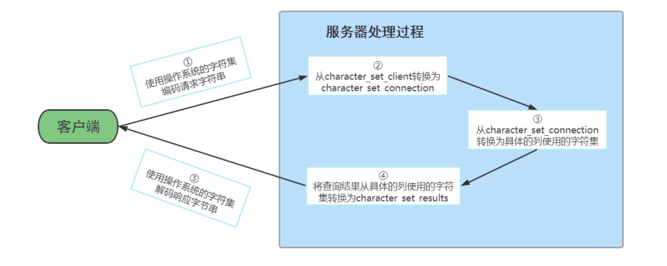

+ **character_set_server是服务器级别的字符集配置，character_set_server是数据库级的字符集配置**，它们是配置与数据库和表相关的存储数据的字符集的，一般来说，这两个配置的值都是一致的。它们的配置方式和上面一样，注释中已经体现出来了
+ 我们也可以在创建和修改表的时候指定表的字符集配置，这是**表级别的字符集配置**

~~~sql
  CREATE DATABASE 数据库名
  [[DEFAULT] CHARACTER SET 字符集名称]
  [[DEFAULT] COLLATE 比较规则名称];
  ALTER DATABASE 数据库名
  [[DEFAULT] CHARACTER SET 字符集名称]
  [[DEFAULT] COLLATE 比较规则名称];
~~~

+ 我们也可以指定表中每一个列的字符集，这是**列级别的字符集配置**

~~~sql
  CREATE TABLE 表名(
  列名 字符串类型 [CHARACTER SET 字符集名称] [COLLATE 比较规则名称],
  其他列...
  );
  ALTER TABLE 表名 MODIFY 列名 字符串类型 [CHARACTER SET 字符集名称] [COLLATE 比较规则名称];
~~~

+ 字符集还有其对应的比较规则，一个字符集可能有多个比较规则，我们可以为该字符集指定一个我们想要的比较规则
+ 使用`SHOW COLLATION LIKE '[{gbk\|utf8}]%';`来查看GBK或UTF-8字符集的比较规则

---

## 十四、宽松模式与严格模式

+ MySQL可以通过sql_mode变量指定MySQL在进行操作时，是否以某些标准来进行操作
  + 变量名叫sql_mode
  + 可以通过set对global或session域中的该变量进行设置，来设置不同的作用域下的模式效果
  + 也可以在ini配置文件中修改,我们可以在ini文件中看到MySQL默认开启了很多模式，因此它的默认模式是严格模式

---

## 新特性

|版本|新特性|备注|
|:---:|:---:|:---:|
|`MySQL8.0`|引入`OFFSET`关键字|无|
|`MySQL8.0`|`DDL`操作原子化|无|
|`MySQL8.0`|支持使用`CHECK`约束，|无|
|`MySQL8.0.17`|不推荐使用显式宽度属性|无|

|情况|5.7版本|8.0版本|
|:---:|:---:|:---:|
|默认编码字符集|latin|UTF-8|
|JSON支持|√|√|
|CHECK约束|支持，但插入不合法的数据没有任何警报和错误，形同虚设|支持|

### （一）计算列

+ `MySQL8`支持了表中的字段值可以通过表内的其它字段值推断而来:
+ 其字段可以通过`GENERATED ALWAYS AS 表达式 VIRTUAL`
~~~sql
  CREATE TABLE tb1(
  id INT,
  a INT,
  b INT,
  c INT GENERATED ALWAYS AS (a + b) VIRTUAL  -- 这里可以看到c由同一行的a+b推出
  );

  INSERT INTO tb1(a,b) VALUES (100,200); -- 插入时只需要插入a和b的数据

~~~

---

### （二）窗口函数

+ 窗口函数可以对表进行分组并执行操作后，将操作结果返回给表中的每一行字段。相比于`group by`，它并不会导致一组只有一个对应结果

|分类|函数|描述|备注|
|:---:|:---:|:---:|:---:|
|序号函数|`ROW_NUMBER()`|顺序排序|无|
|^|`RANK()`|并列排序，会跳过重复的序号，如序号`1,1,3`|无|
|^|`DENSE_RANK()`|并列排序，不会跳过重复的序号，如序号`1,1,2`|无|
|分布函数|`PERCENT_RANK()`|等级值百分比|它遵循`(rank-1)/rows-1`以计算|
|^|`CUME_DIST()`|累积分布值|无|
|前后函数|`LAG(字段名,n)`|返回当前行的前n行的字段值|无|
|^|`LEAD(字段名,n)`|返回当前行的后n行的字段值|无|
|首尾函数|`FIRST_VALUE(字段)`|返回第一个字段的值|无|
|^|`LAST_VALUE(字段)`|返回最后一个的字段值|无|
|其它函数|`NTH_VALUE(字段,n)`|返回第n个字段的值|无|
|^|`NTILE(n)`|将分区中的有序数据分成n个桶，记录桶编号|无|

+ 格式:

~~~sql

-- 下面两个格式都是窗口函数的合法调用格式
-- PARTITION BY后跟的字段名实际上就是根据该字段进行分类
-- ORDER BY后的字段名指定按哪一字段进行分类
select 窗口函数 OVER([PARTITION BY 字段名 ORDER BY 字段名 ASC|DESC]) [字段2,字段3,....] FROM 表 [各子句];

或

SELECT 函数 OVER 窗口名 [字段2,字段3,....] FROM 表 [各子句] WINDOW 窗口名 AS ([PARTITION BY 字段名 ORDER BY 字段名 ASC|DESC]);

~~~

+ [窗口函数样例](../源码/MySQL/窗口函数样例.sql)

---

### （三）公用表表达式

+ 公用表表达式（或通用表表达式）简称为CTE（Common Table Expressions）
  + 它是一个命名的临时结果集，作用范围是当前语句
  + 它可以理解成一个可复用的子查询
  + 依据语法结构和执行方式的不同，公用表表达式分为**普通公用表表达式**和**递归公用表表达式**2种。

#### ①普通公用表表达式

+ 格式:

~~~sql
  WITH CTE名称
  AS （子查询）
  SELECT|DELETE|UPDATE 语句;

~~~

---

#### ②递归公用表表达式

+ 格式:

~~~sql
  WITH RECURSIVE
  CTE名称 AS (
    种子查询
    UNION [ALL]
    递归查询
  )
  SELECT|DELETE|UPDATE 语句;
~~~

+ [共用表表达式样例](../源码/MySQL/公用表表达式样例.sql)

---

# MySQL高阶

## 一、Linux安装MySQL

+ 这里以Ubuntu24版本为例，进行linux安装mysql的教程:
  + 首先我们需要有一个Ubuntu24
  + 接下来打开终端，输入`su`并输入密码进入root用户状态
  + 接下来在终端输入`apt install mysql-client-core-8.0`

  + 接下来在终端输入`mysql --version`，如果弹出版本说明安装成功
  + 接下来继续输入`apt install mysql-server-core-8.0`

  + 接下来输入`mysqld --initialize --user=你的用户名(一般叫root)`来使mysql进行初始化，`--initialize`参数用来设置以安全模式进行初始化，它会自动生成一个密码，**这个密码会在初始化完成后在终端输出**，我们需要记住这个密码，或者把它复制(ctrl+insert)一下放到剪切板中
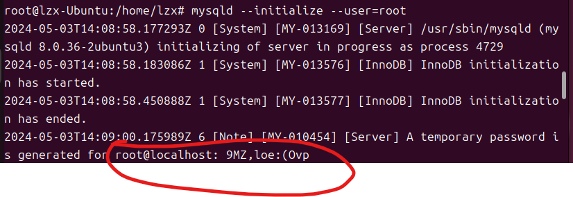
  + 接下来在终端输入`apt install mysql-server`
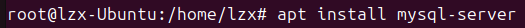
  + 在终端输入`systemctl status mysql.service`查看mysql的服务是否在启动状态:
    + 如果没开，输入`systemctl start mysql.service`或`service mysql start`来使服务启动起来
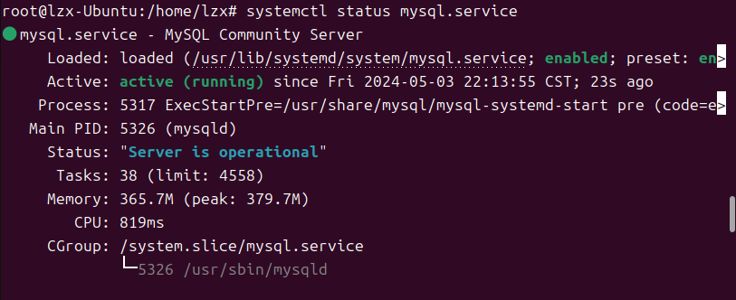
  + 接下来我们就可以连接mysql了:在终端输入`mysql -u root -p`，接下来输入之前让记住的密码直接进入
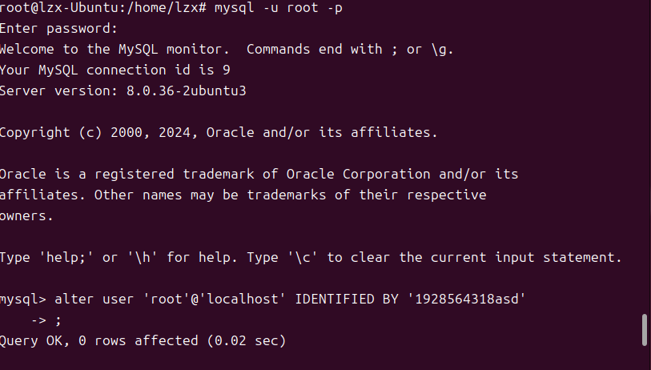
  + 我们连接上以后，需要做的第一件事就是改掉它自动生成的操蛋密码
    + 在终端输入`alter user 'root'@'localhost' identified by '自定义的密码'`
    + **出现0 row affected 是正常情况。说明你已经修改成功了**，但是如果你出现`you have an error ....`就不是正常情况了，该情况一般在语法错误时被输出

  + 密码修改完成后，输入`quit`退出mysql连接，再输入`mysql -u root -p`，再连接一次，查看密码是否修改完成
  + mysql安装完成

---

## 二、用户与权限管理

### （一）用户与密码管理

+ MySQL支持我们进行用户与密码的管理
  + 用户管理可以进行增删改查的操作
    + 在添加时，我们可以自行指定用户名和host作用域，**这两个字段共同组合成了聚合主键**
    + 删除时，仅指定用户名而不指定host作用域，默认删除的是`%`host作用域的用户，没有会报错。且推荐使用drop进行删除
    + 修改时，推荐使用alter的方式进行修改
    + 查询时，由于字段过多，可以挑出几个来进行查询
  + 密码管理支持我们修改密码并指定一些密码的配置
    + 推荐使用alter的方式进行密码的修改
    + 可以指定密码重用和密码过期策略
      + 密码过期后，需要重置密码，否则操作不可用
      + 密码重用策略用来限制我们的密码重置不能与之前的密码相同

~~~sql
  -- 用户登录，可以选择性的指定连接的主机和执行的操作
    -- 不写主机默认localhost
  mysql [-h 主机名称\|主机IP -P port ]-u username -p [数据库名 -e SQL语句]

  -- 查询mysql数据库的user表，得到当前用户的数据
    -- 它的列太多了，我们只摘一部分
  select * from mysql.user;

  -- 查询mysql数据库的user表的用户名和host作用域字段
  select user,host from mysql.user;

  -- 创建用户，可以一次性创建多个用户，每个用户间使用逗号隔开，也可以指定用户的密码过期天数
    -- 如果没有指定密码，用户直接就可以进行登录
    -- host作用域可以通过
    -- 后面的password选项，expire interval用来设置该用户的密码什么时候过期，可以指定指定天数、从不过期或继承全局配置
    -- 接下来的history是重置密码的时候指定新密码不能与过去的前n个密码一致，如指定3，那么指定的新密码就不能与在其之前设置的前3个密码中的一个一致
    -- reuse interval ... 用来配置新密码不能与之前多少天配置的密码一致，如指定365,那么新密码就不能与过去一年设置的全部密码中的一个一致
  create user 
  用户名[@host作用域]
  [identified by 密码 ]
  [PASSWORD [EXPIRE INTERVAL {天数 DAY\|NEVER\|DEFAULT} ][password {HISTORY 次数|REUSE INTERVAL 天数 DAY}]][,
  用户名[@host作用域]
  [identified by 密码 ]
  [PASSWORD [EXPIRE INTERVAL {天数 DAY\|NEVER\|DEFAULT} ][password {HISTORY 次数|REUSE INTERVAL 天数 DAY}]]
  ...
  ]

  -- 使用select host,user,password_lifetime,password_reuse_history from mysql.user;可以查看结果
  例:create user lzx@'localhost' identified by '123456' password expire never password history 3;

  -- 修改用户名
    -- 需要使用flush privileges使操作生效
  update mysql.user set user=用户名 where user=原用户名
  -- 这个不需要flush privileges就能生效
  rename user 用户名 to 新用户名

  -- 删除用户（推荐），可以一次性删除多个用户，每个用户之间使用逗号隔开
    -- 如果不写host作用域，那么默认删除host为%
  drop user 用户名[@host作用域][,用户名[@host作用域],....]

  -- 删除指定host作用域的用户
    -- 需要使用`flush privileges`使操作生效，不推荐，该操作会使系统有残留信息保留
  delete from mysql.user where user=用户名 and host=host作用域

  -- 修改当前登录用户密码（官方推荐）
  alter user user() identified by 新密码

  -- 修改当前登录用户密码
  set password = 新密码
  -- 修改当前登录用户密码
    -- 不推荐，password函数在MySQL8.0及以后被移除

  set password = PASSWORD(新密码)

  -- 修改指定用户的密码
  alter user 
  用户名[@host作用域] 
  [identified by 新密码][,
  用户名[@host作用域] 
  identified by 新密码,
  ...
  ]

  -- 修改指定用户的密码
  set password for 用户名[@host作用域] = 新密码

  -- 修改指定用户的密码
    -- 不推荐，password函数在MySQL8.0及以后被移除
  update mysql.user set authentication_string=PASSWORD(新密码) where user = 用户名 and host = host作用域

  -- 设置指定的密码过期，可以进行全局配置，也可以精确到指定用户进行配置
    -- 如果是全局配置，可以设定全局变量，或者配置配置文件
    -- 如果是局部配置，可以在创建用户时进行指定

  -- 使指定用户的密码过期
  alter user 用户名[@host作用域] password expire

  -- 设置全局变量，使所有用户的密码在指定天数后过期
  set persist default_password_lifetime = 天数

  -- 在配置文件内配置用户密码过期天数
  [mysqlId]
  default_password_lifetime=天数

  -- 设置密码重用策略，和密码过期策略一样，也能进行全局配置和精确到指定用户进行配置
    -- 如果是全局配置，可以设定全局变量，或者配置配置文件
    -- 如果是局部配置，可以在创建用户时进行指定

  SET PERSIST password_history = 6; -- 设置不能选择最近使用过的6个密码

  SET PERSIST password_reuse_interval = 365; -- 设置不能选择最近一年内的密码

  -- 使用配置文件进行配置
  [mysqld]
  password_history=6
  password_reuse_interval=365

~~~

---

### （二）权限

#### ①权限管理

+ MySQL为每个用户都设置了权限，其中，root用户的权限是最大的
+ 为了控制每个用户的权限，MySQL为我们提供了完备的权限管理语句:

~~~sql

  -- 查看当前用户权限，以下三个都可以
  SHOW GRANTS;
  SHOW GRANTS FOR CURRENT_USER;
  SHOW GRANTS FOR CURRENT_USER();

  -- 查看某用户的全局权限
  SHOW GRANTS FOR 'user'@'主机地址';

  -- 给用户授权的方式有两种: 直接给用户权限 和 把角色赋予用户使用户具有该角色的权限
  -- 这里仅演示第一种，第二种在后面的角色笔记中会提供
  -- 数据库名称、表名称可以进行模糊匹配，使用*来表示所有的数据库或所有的表
  -- GRANT命令会使权限叠加，而不是使上一条权限被该权限覆盖，也就是说，多条grant命令都执行时，对应用户会得到这些grant命令声明的所有权限而不是后面覆盖前面
  -- with grant option表示本次赋予的权限，该用户可以再赋给其他用户，写在后面用with的形式可以进一步限制该用户可以赋予其它用户的权限，如root用户给了修改和插入的权限，但是可以限制该用户仅下发修改权限而不能下发插入权限
  GRANT 权限1,权限2,…权限n ON 数据库名称.表名称 TO 用户名@用户地址 [IDENTIFIED BY ‘密码口令’ ][with grant option];
  -- 例:
  GRANT SELECT,INSERT,DELETE,UPDATE ON atguigudb.* TO li4@localhost ;
  -- 这里表示把所有的权限都赋值给对应用户:
    -- 它与root用户依然有区别，因为全部权限不包括向其它用户分配权限的权限，因此正常情况下仅root用户可以下发权限，而其它用户不能
    -- 如果想下发权限，需要加上with grant option
  GRANT ALL PRIVILEGES ON *.* TO joe@'%' IDENTIFIED BY '123';

  -- 收回权限
    -- 收回权限的操作需要在用户重新登陆后才重新生效
  REVOKE 权限1,权限2,…权限n ON 数据库名称.表名称 FROM 用户名@用户地址;

  -- 例:
  -- 收回全部权限
  REVOKE ALL PRIVILEGES ON *.* FROM joe@'%';
  -- 收回部分权限
  REVOKE SELECT,INSERT,UPDATE,DELETE ON mysql.* FROM joe@localhost;

~~~

#### ②权限表

+ MySQL底层通过表的形式存放各用户的权限，它们都存放在mysql数据库下,与权限相关的数据库内的表有如下表:
  + user表，该表在[用户与密码管理](#manageUserAndPassword)章节就遇到过，它用来存储用户对所有数据库的权限
  + db表，它用来存储用户对指定数据库的权限
  + tables_priv表:它用来存储用户对数据库内的表的权限
  + columns_priv表:它用来存储用户对表内字段的权限
  + procs_priv表:它用来存储存储过程与函数的设置操作权限

+ user表字段
  + 在user表中，host和user共同组成了聚合主键

|分类|字段|作用|备注|
|:---:|:---:|:---:|:---:|
|用户列|host|host作用域，表示连接类型，`%`表示支持所有通过TCP方式的连接，另外还支持localhost、IP地址、机器名等|无|
|^|user|用户名，只要host不一样，user可以重复|无|
|^|password/authentication_string|密码，5.7及之前称password,8.0及之后改为authentication_string|无|
|权限列|Grant_priv|表示是否拥有grant权限|无|
|^|Shutdown_priv|表示是否拥有停止mysql服务的权限|无|
|^|Super_priv|表示是否拥有超级权限|无|
|^|Execute_priv|表示是否拥有EXECUTE权限。拥有EXECUTE权限，可以执行存储过程和函数。|无|
|^|Select_priv、Insert_priv...|该用户所拥有的权限|无|
|资源控制列|max_questions|用户每小时允许执行的查询操作次数|无|
|^|max_updates|用户每小时允许执行的更新操作次数|无|
|^|max_connections|用户每小时允许执行的连接操作次数|无|
|^|max_user_connections|用户允许同时建立的连接次数|无|
|安全列|ssl_type|用于加密|无|
|^|ssl_cipher|用于加密|无|
|^|x509_issuer|标识用户|无|
|^|x509_subject|标识用户|无|
|^|plugin|指定验证用户身份的插件，如果为空，那么启用内建授权验证机制验证用户身份|无|

+ db表字段
  + 在db表中，host、user和Db共同组成了聚合主键

|分类|字段|作用|备注|
|:---:|:---:|:---:|:---:|
|用户列|host|host作用域，表示连接类型，`%`表示支持所有通过TCP方式的连接，另外还支持localhost、IP地址、机器名等|无|
|^|user|用户名，只要host不一样，user可以重复|无|
|^|password/authentication_string|密码，5.7及之前称password,8.0及之后改为authentication_string|无|
|权限列|Create_routine_priv|表示是否有创建存储过程的权限|无|
|^|Alter_routine_priv|表示是否有修改存储过程的权限|无|
|^|其他权限同user表|

+ 其它表也是如此，可以看到，**存储的权限越精确的表，组成其主键的列字段就越多**

---

#### ③访问控制

+ 访问控制分为两个阶段:
  + 连接核实阶段:当用户试图连接MySQL服务器时，服务器基于用户的身份以及用户是否能提供正确的密码验证身份来确定接受或者拒绝连接。服务端在进行核实时，会根据user表中的host、user和authentication_string字段对比客户端传来的信息，从而确定是否建立连接
  + 请求核实阶段:建立连接后服务器就进入了第二个阶段,此时用户在进行请求时，MySQL首先从user开始找，逐步向更精确的表(db、tables_priv、columns_priv、procs_priv)查找，**一旦找到对应权限就停止向下找，开始执行操作，如果都找不到，那么报错**

---

### （三）角色

+ 角色是MySQL8.0新添的特性，它的设计目的是**方便管理拥有相同权限的用户**
  + 我们可以通过将角色赋予给用户，来使得指定用户具有该角色的权限
  + 角色需要是激活的状态，这样其权限才会生效，如果我们对一个用户的角色进行了修改，那么最好退出再登陆一下，效果才会显现出来
+ 下面是对角色的相关管理代码:

~~~sql
  -- 创建一个角色
  CREATE ROLE 'role_name'[@'host_name'] [,'role_name'[@'host_name']]...
  
  -- 给角色赋予权限

  GRANT 权限 ON 数据库.表 TO 'role_name'[@'host_name'];

  -- 查看当前角色的权限
  SHOW GRANTS FOR 'role_name'[@'host_name'];

  -- 回收对应角色的权限
  REVOKE 权限 ON 数据库.表 FROM 'role_name'[@'host_name'];

  -- 删除角色
  DROP ROLE role [,role2]...

  -- 激活角色
    -- 查看当前被激活的角色
  select current_role();
    -- 通过set命令手动激活，这玩意在Windows的MySQL上好像不能使，不知道linux上怎么样
  SET DEFAULT ROLE ALL TO role1 [,role2,...];
    -- 通过设置全局配置自动激活，它的意思是对所有角色永久激活
  SET GLOBAL activate_all_roles_on_login=ON;
  -- 给用户赋予角色，我们可以同时将多个角色赋予给多个用户
    -- 这也是给用户权限的第二种方式
  GRANT role1 [,role2,...] TO user1 [,user2,...];

  -- 移除用户的指定角色
  REVOKE 'role_name'[@'host_name'] FROM 'user_name'[@'host_name'];

  -- 设置强制角色
    -- 在配置文件中设置
  [mysqld]
  mandatory_roles='role1,role2@localhost,r3@%.atguigu.com'
    -- 在运行时设置
      -- 系统重启后仍然有效
  SET PERSIST mandatory_roles = 'role1,role2@localhost,r3@%.example.com'; 
      -- 系统重启后失效
  SET GLOBAL mandatory_roles = 'role1,role2@localhost,r3@%.example.com'; 

~~~

---

## 三、逻辑架构与SQL执行

### （一）基本架构

+ 下面是MySQL5.7对应的MySQL逻辑架构,可以看到MySQL的逻辑架构组成包括:
  + 基础服务组件:负责进行基础服务
  + 连接池:提供了多个用于客户端与服务器进行交互的线程
  + SQL接口:接收SQL指令，并返回查询结果
  + 解析器:进行语法解析，如果我们编写的SQL语法不正确，将在这里返回并报错
  + 优化器:负责对SQL语句进行进一步优化
  + 查询缓存:以键值对的形式缓存查询结果，但效率低下，MySQL从5.7.20版本开始不再推荐使用查询缓存，并默认关闭了查询缓存配置，**MySQL8.0及之后被移除**
  + 存储引擎:与底层的文件系统进行交互，执行查询操作
  + 文件系统、日志文件:它们理论上来说并不属于MySQL架构，而是操作系统和硬盘的东西
.png)

+ 根据上面的逻辑架构，可以将MySQL的架构分为三层:
  + 第一层是**连接层**，包括连接池，该层**负责建立与客户端的连接，进行身份认证与权限获取**
  + 第二层是**服务层**，包括SQL接口、解析器、优化器、查询缓存组件等。该层负责**处理SQL语句以及SQL语句执行后的结果**
  + 第三层是**引擎曾**,包括存储引擎，该层**负责MySQL中数据的存储和提取，对物理服务器级别维护的底层数据执行操作**

---

### （二）SQL执行流程

+ SQL执行流程如下:
  + 首先客户端向服务器请求连接，进行TCP连接
  + 客户端连接完成后，向服务器发送请求，携带SQL语句
  + 服务器收到后，先查询缓存是否存在该SQL语句
    + 如果存在就直接从缓存中取出结果，然后直接返回
    + 若不存在再对SQL进行解析
      + 先放入解析器进行解析，判断语法是否正确
      + 再放入优化器进行优化
      + 执行SQL操作
      + 返回值进行缓存
      + 返回值向客户端返回
+ 因此，SQL语句的大致执行流程为:`SQL语句->查询缓存->优化器->执行器->查询结果缓存->返回结果`
+ 大部分情况下查询缓存都十分鸡肋，其效率并不高:
  + **查询缓存的key必须与后面的SQL语句完全匹配才能正确命中缓存**，这意味着大小写或者多一个空格等情况下，MySQL都会认为该SQL语句未在缓存中
  + 如果查询语句与时间相关，如调用了now函数，那么**缓存可能会返回错误的结果**
  + 在针对对应的数据库或表进行增删改操作时，与该数据库或表相关的所有缓存都将从缓存中移除，**对于频繁更新的数据库来说，这将导致缓存的命中率非常低**
+ 另外，解析器在对SQL语句进行解析时，会把SQL拆分成树形结构来判断其是否符合SQL语法

---

### （三）验证SQL执行原理

+ 我们可以使用代码对SQL执行流程进行查看与验证

~~~sql
  -- 查看是否开启profiling
  select @@profiling;  
  show variables like 'profiling';

  -- 如果是MySQL5.7，需要在配置文件内开启查询缓存配置，并重启服务使之生效
  -- 如果是MySQL8，此方式没有效果，且重启服务会失败，因为MySQL8.0不支持查询缓存
  [mysqld]
  query_cache_type=1

  -- 设置profiling，0代表关闭，1代表开启
  set profiling=1;
  -- 显示最近的几次查询
  show profiles;
  -- 显示上一次查询的详细步骤
  show profile;
  -- 使用profiles显示的查询的id来展示对应查询的详细步骤
  show profile for query 7;
  -- 展示更详细的步骤
  show profile cpu,block io for query 7;

~~~

+ 另外，SQL语句在语法层面的执行顺序为:
+ `FROM -> WHERE -> GROUP BY -> HAVING -> SELECT -> DISTINCT -> ORDER BY -> LIMIT`
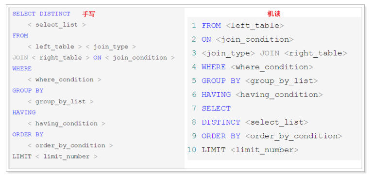

---

### （四）数据库缓冲池

+ 我们的增删改查操作在最后都要与硬盘的数据库底层文件进行IO操作，与在内存中的操作相比，硬盘层面的IO操作更加的浪费时间，因此我们希望能尽量的减少IO带来的时间开销。
  + InnoDB存储引擎是以页为单位来管理存储空间的，**MySQL会申请占用内存来作为数据库缓冲池，将磁盘上的部分页缓存到内存中**，这样可以减少IO操作花费的时间并提高效率

+ 以下是一些与缓冲池相关的操作:

~~~sql
  -- 查看缓冲池的总大小
  show variables like 'innodb_buffer_pool_size';
  -- 设置缓冲池大小，单位byte
  set global innodb_buffer_pool_size = 268435456;
  -- 使用配置文件配置缓冲池总大小
  [server]
  innodb_buffer_pool_size = 268435456
  -- 使用配置文件配置缓冲池实例数量
    -- 如果缓冲池总大小小于1Gb，MySQL会无视掉配置的缓冲池实例数量，强行配置实例为1个
  [server]
  innodb_buffer_pool_instances = 2
  -- 展示当前的缓冲池实例数量
  show variables like 'innodb_buffer_pool_instances';

~~~

---

### （五）存储引擎

+ 存储引擎就是表的存储方式，或者说是表的类型，它可以直接与底层的数据库文件交互并进行相关的SQL操作
+ 目前MySQL5.5之后，其默认的存储引擎变为了InnoDB，在此之前，其存储引擎是MyISAM
+ 有关存储引擎的相关SQL语句如下:

~~~sql
  -- 查看MySQL支持的所有存储引擎
  show engines;
  -- 查看当前默认的存储引擎
  show variables like '%storage_engine%';
  SELECT @@default_storage_engine;
  -- 设置默认存储引擎
  SET DEFAULT_STORAGE_ENGINE=MyISAM;
  -- 在配置文件内设置存储引擎
  [mysqld]
  default-storage-engine=MyISAM
  -- 建表时指定其存储引擎
  CREATE TABLE 表名(
    建表语句;
  ) ENGINE = 存储引擎名称;
  -- 修改表的存储引擎
  ALTER TABLE 表名 ENGINE = 存储引擎名称;

~~~

+ 下面介绍一些MySQL的存储引擎:
  + **InnoDB引擎**
    + MySQL从3.23.34a开始就包含InnoDB存储引擎。**大于等于5.5之后，默认采用InnoDB引擎**
    + InnoDB引擎支持事务，它被设计用来处理大量的短期(short-lived)事务。可以确保事务的完整提交(Commit)和回滚(Rollback)
    + 在以前的版本中，InnoDB引擎在存储表时会产生许多文件，MySQL8.0以后，这些存储信息被整合在了一个文件内
    + 它以索引来存储数据
    + 支持外键约束和事务，且可以上行锁
  + **MyISAM引擎**
    + 它是MySQL5.5之前的默认存储引擎
    + MyISAM引擎的访问速度快，但**不支持事务操作**
    + 该引擎在存储表时会产生三个文件:frm文件存储表结构，MYD存储数据，MYI存储索引
    + 不支持外键和事务，上的表锁
  + **Archive引擎**
    + 一般用于数据存档
    + 它仅能进行查询和插入操作，无法进行修改和删除操作
  + **Blackhole引擎**
    + 丢弃写操作，读操作会返回空内容
  + **CSV引擎**
    + 支持CSV数据格式，在底层以csv文件来存储内容
  + **Memory引擎**
    + 使用内存存储数据，但服务崩溃时数据会丢失，无法实现数据持久化存储。因此**它的数据易丢失，且生命周期短**
    + 支持哈希索引和B+树索引
    + Memory比MyISAM引擎更快
    + MEMORY表的大小是受到限制的。表的大小主要取决于两个参数，分别是max_rows和max_heap_table_size。其中，max_rows可以在创建表时指定；max_heap_table_size的大小默认为16MB，可以按需要进行扩大
  + **Federated引擎**
    + 是访问其他MySQL服务器的一个代理，尽管该引擎看起来提供了一种很好的跨服务器的灵活性 ，但也经常带来问题，因默认是禁用的
  + **Merge引擎**
    + 管理多个MyISAM表构成的表集合
  + **NDB引擎**
    + 也叫做NDB Cluster存储引擎，主要用于MySQL Cluster分布式集群环境，类似于Oracle的RAC集群

|对比项|MyISAM|InnDB|
|:---:|:---:|:---:|
|外键|不支持|支持|
|事务|不支持|支持|
|行表锁|表锁，即使操作一条记录也会锁住整个表，不适合高并发的操作|行锁，操作时只锁某一行，不对其它行有影响，适合高并发的操作|
|缓存|只缓存索引，不缓存真实数据|不仅缓存索引还要缓存真实数据，对内存要求较高，而且内存大小对性能有决定性的影响|
|自带系统表使用|Y|N|
|关注点|节省资源、消耗少、简单业务|并发写、事务、更大资源|
|默认安装|Y|Y|
|默认使用|N|Y|

|对比项|MyISAM|InnoDB|MEMORY|MERGE|NDB|
|:---:|:---:|:---:|:---:|:---:|:---:|
|存储限制|有|64TB|有|无|有|
|事务安全|×|√|×|×|×|
|锁机制|表锁|行锁|表锁|表锁|行锁|
|B树索引|√|√|√|√|√|
|哈希索引|×|×|√|×|√|
|全文索引|√|×|×|×|×|
|集群索引|×|√|×|×|×|
|数据缓存|×|√|√|×|√|
|索引缓存|仅缓存索引，不缓存真实数据|不仅缓存索引还要缓存真实数据，对内存要求较高，而且内存大小对性能有决定性的影响|支持|支持|支持|
|数据可压缩|√|×|×|×|×|
|空间使用|低|高|N/A|低|低|
|内存使用|低|高|中等|低|高|
|批量插入速度|高|低|高|高|高|
|支持外键|×|√|×|×|×|

---

## 四、索引

+ 如果没有索引，我们在查询数据时，要从头开始寻找并遍历每一个数据，从中筛选出满足我们条件的数据
+ 而有了索引，我们便可以根据索引，快速的得到我们想要的数据
+ **索引就是帮助MySQL高效获取数据的数据结构**

### （一）索引分类

+ MySQL的索引包括普通索引、唯一性索引、全文索引、单列索引、多列索引和空间索引等
  + 从功能逻辑上说，索引主要有 4 种，分别是普通索引、唯一索引、主键索引、全文索引
  + 按照物理实现方式，索引可以分为 2 种：聚簇索引和非聚簇索引
  + 按照作用字段个数进行划分，分成单列索引和联合索引

#### ①功能逻辑划分

|索引类型|描述|备注|
|:---:|:---:|:---:|
|普通索引|不附加任何条件，仅用于查询效率提升的索引，该类索引可以作用在任何类型的字段上|无|
|唯一性索引|可以使用唯一性约束来创建唯一性索引，唯一性索引允许有空值，但非空值必须是唯一的|无|
|主键索引|就是非空+唯一，一张表里最多只有一个主键索引，因为它由主键索引的物理存储实现方式决定，存储文件内的数据仅能按照一种顺序进行存储|无|
|单列索引|单列索引就是仅依据该字段的索引|无|
|多列/联合索引|就是依据多个字段的索引|无|
|全文索引|是目前搜索引擎的一种关键技术，查询数据量较大的字符串类型的字段时，使用全文索引可以提高查询速度|MySQL3.23.23版本时开始支持全文索引，但直到5.6.4版本前，仅MyISAM引擎支持。5.6.4后InnoDB也支持了，但不支持中文分词。5.7.6版本时MySQL内置了ngram全文解析器，用来支持亚洲语种的分词|
|空间索引|空间索引仅能作用于空间数据类型的字段上，目前仅MyISAM引擎支持，且索引的字段不能为空|无|

+ 另外，不同的存储引擎对不同的索引也有不同的支持能力:

|存储引擎|B+树索引|全文索引|哈希索引|
|:---:|:---:|:---:|:---:|
|InnoDB|√|√|×|
|MyISAM|√|√|×|
|Memory|√|×|√|
|NDB|×|×|√|
|Archive|×|×|×|

#### ②物理实现划分

##### Ⅰ聚簇索引

+ 优点:
  + 数据和索引保存在同一个B+树中，从聚簇索引中获取数据比非聚簇索引更快
  + 聚簇索引一般根据主键进行排序，对于主键的排序查找和范围查找速度非常快。
  + 按照聚簇索引排列顺序，查询显示一定范围数据的时候，由于数据都是紧密相连，数据库不用从多个数据块中提取数据，所以节省了大量的io操作
+ 缺点:
  + **插入速度严重依赖于插入顺序**，按照主键的顺序插入是最快的方式，否则将会出现页分裂，严重影响性能。因此，**对于InnoDB表，我们一般都会定义一个自增的ID列为主键**
  + **更新主键的代价很高**，因为将会导致被更新的行移动。因此，对于InnoDB表，我们一般定义主键为不可更新
  + 二级索引访问需要两次索引查找，第一次找到主键值，第二次根据主键值找到行数据
+ 特点:
  + 使用记录主键值的大小进行记录和页的排序，这包括三个方面的含义：
    + 页内的记录是按照主键的大小顺序排成一个单向链表
    + 各个存放用户记录的页也是根据页中用户记录的主键大小顺序排成一个双向链表
    + 存放目录项记录的页分为不同的层次，在同一层次中的页也是根据页中目录项记录的主键大小顺序排成一个双向链表

---

##### Ⅱ二级索引

+ 二级索引就是我们将排序的依据从主键改为其它字段
  + 由于索引的存在会占用额外的资源，因此我们需要确保二级索引仅留下能够实现该索引功能的数据，即将排序字段与主键数据留下，其它数据不要
  + 二级索引访问需要两次索引查找，由于我们为了减少二级索引的资源占用，仅摘取了一部分数据，因此我们仅能通过二级索引拿到对应数据的主键，还需要再去聚簇索引那里去拿取完整的数据

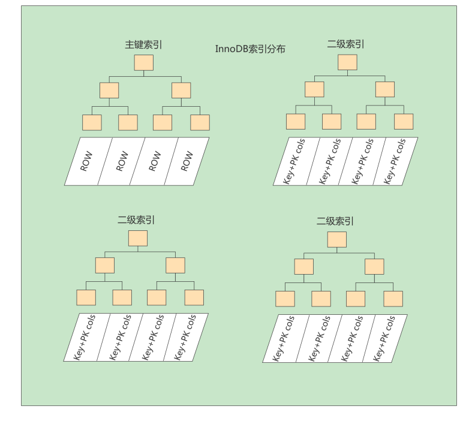

+ 联合索引
  + 联合索引实际上是二级索引的一种
  + 联合索引就是指定多个字段作为B+树排序的依据，来建立对应的索引
  + 联合索引虽然使用多个字段作为依据，但是实际上仅会生成一个B+树

---

### （二）索引实现

+ 这里主要讨论索引的相关实现方式，以及InnoDB索引结构，附带MyISAM索引结构

#### ①索引简易案例

+ 这里提供一个简易的小案例，来帮助我们理解索引的作用
+ 首先我们有一个表:

~~~sql
  CREATE TABLE index_demo(
  c1 INT,
  c2 INT,
  c3 CHAR(1),
  PRIMARY KEY(c1)
  ) ROW_FORMAT = Compact;  -- 指定该表使用Compact的行格式来存储数据
~~~

+ 我们这里来简化以下行格式，如下图所示:

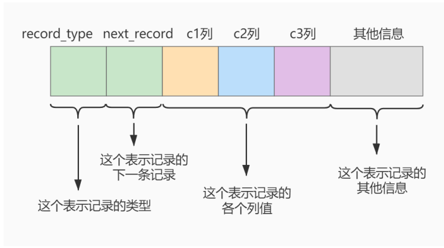

+ 里面出现了两个表外的字段:
  + record_type:记录头信息的一项属性，0表示普通记录，1表示目录项记录，2表示最小记录，3表示最大记录
  + next_record:用来记录下一个数据项的偏移量，相当于链表的next指针
+ 我们先把一些数据放到表中:

+ 上面的情况是一个非常简单的示例，如果我们的数据变多，而InnoDB引擎使用页来存放数据，但InnoDB引擎一页是存不过来这么多数据的，因此就会导致出现多个页
  + **我们无需使这些页在内存中是连续的，我们只需要使它们在逻辑上是连续的，因此我们可以通过链表来连接这些页**
+ 为了方便数据的获取，我们需要以某种方式对这些数据进行排序，因此**每个页之间需要保证前面的页内存放的数据的排序权重小于后面的页存放的数据的排序权重，且同一个页内，前面数据的排序权重应小于后面数据的排序权重**
+ 但是即使这些页是有序的，我们依然无法知道我们想查找的数据范围究竟在哪些页中，因此我们还需要建立一个目录，该目录记录每个页的最小权重值的数据，并提供对应页的地址，方便快速定位，这样，我们通过查阅目录，就可以提高我们获取数据的效率了。**我们称这个目录为索引**

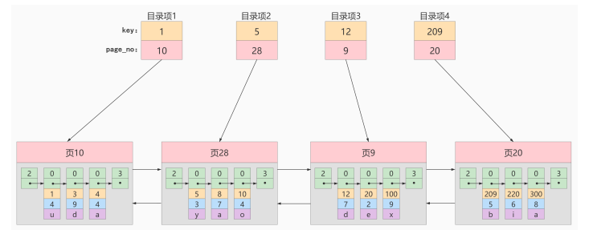

---

#### ②索引的迭代

+ 上面我们可以看到，我们为这些数据建立了目录，但是当数据太大的时候，我们的目录也会变得非常庞大，但我们还是想提高我们的性能
  + 因此我们需要把这些目录也分页，一页存放多个目录项，每个目录项之间使用链表进行连接
  + 这样我们就建立了多层的目录，为了进一步提高性能，只要我们的最上层目录的页数达到2层及以上，就向上层继续开辟一个新的目录，这样就形成了一个树状结构
  + 这样当我们查找时，从树的根节点向下查找，由于在每个页面内有所谓的Page Directory （页目录），所以在页面内也可以通过二分法实现快速定位记录，这样就提高了我们的查找效率
  + 另外，我们要**让每一层的页都用双向链表连接起来**，但页内的数据项或目录项是单向链表连接的
  + 最终的情况就如下图所示:

+ **基于这种思想所形成的树状数据结构，我们称为B+树**
  + 一般情况下，我们的B+树都不会超过4层
  + 原因:假设所有存放用户记录的叶子节点代表的数据页可以存放100条用户记录 ，所有存放目录项记录的内节点代表的数据页可以存放1000条目录项记录
    + 如果B+树只有1层，也就是只有1个用于存放用户记录的节点，最多能存放 100 条记录
    + 如果B+树有2层，最多能存放 1000×100=10,0000 条记录
    + 如果B+树有3层，最多能存放 1000×1000×100=1,0000,0000 条记录，这里已经最多有一亿条记录了
    + 如果B+树有4层，最多能存放 1000×1000×1000×100=1000,0000,0000 条记录。相当多的记录

---

#### ③实现方式

+ 索引的实现方式主要就两种:Hash结构与树

##### Ⅰ全表遍历

+ 简单粗暴，就是遍历

---

##### ⅡHash结构

+ 根据哈希算法，计算数据对应的哈希值，存到数组中
+ 时间复杂度极低，为O(1)，但操作空间有限，仅能应付与等值相关的操作（等于、不等于和in判断），且无法进行范围查询，因为存储在Hash结构中的数据是无序的

+ 目前仅Memory引擎支持，MyISAM和InnoDB都是不支持的
  + 虽然InnoDB不支持，但是它有自适应Hash索引:

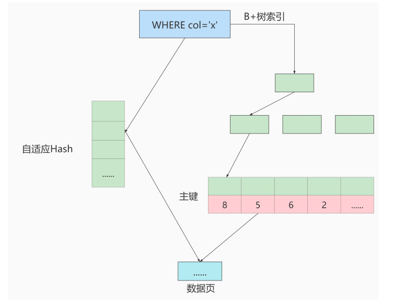

---

##### Ⅲ二叉搜索树与AVL树

+ 二叉搜索树的结构就是，每个结点的左节点都比它小，每个结点的右节点都比它大，且每个结点的所有后代左树节点全比它小，每个结点的所有后代右树节点全比它大
  + 在极端情况下，二叉搜索树会成为链表
  + 如果我们对这些树加以限制，限制它们各叶子节点深度差不超过1，这就形成了AVL（平衡二叉）树

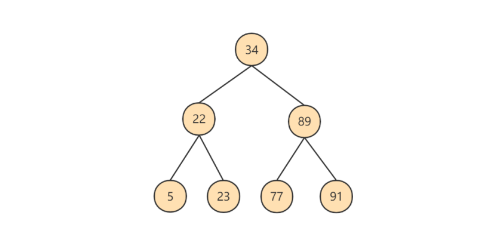
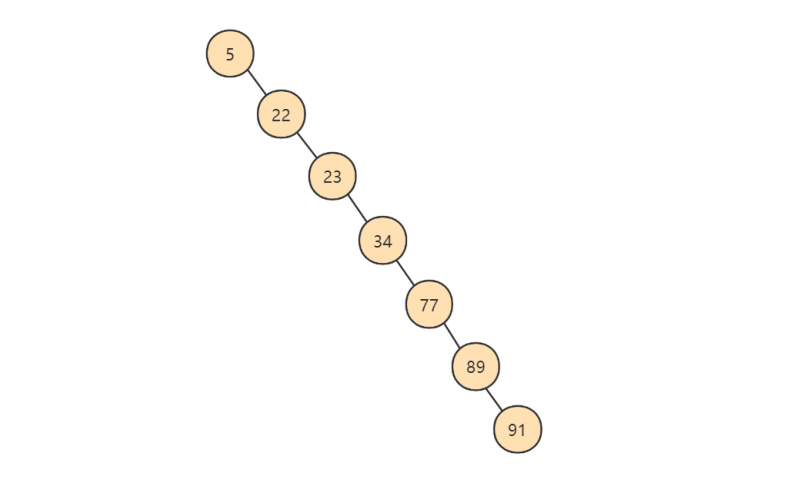

+ 为了降低我们IO的次数，我们需要增加节点的分叉，这样可以使树的深度变小。例如，一张表有31行数据，我们使用二叉搜索树，深度是5，如果我们改用三叉的，那么深度会变为4，这样就减少了对底层磁盘文件的IO

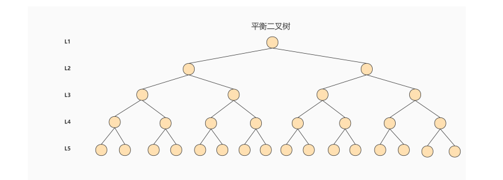
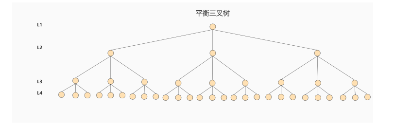

---

##### ⅣB树

+ B树是对二叉搜索树的一种改进，它有如下特点:
  + 根节点的儿子数的范围是 [2,M]。
  + 每个中间节点包含 k-1 个关键字和 k 个孩子，孩子的数量 = 关键字的数量 +1，k 的取值范围为[ceil(M/2), M]。
  + 叶子节点包括 k-1 个关键字（叶子节点没有孩子），k 的取值范围为 [ceil(M/2), M]
  + 假设中间节点节点的关键字为：Key[1], Key[2], …, Key[k-1]，且关键字按照升序排序，即 Key[i] < Key[i+1]。此时 k-1 个关键字相当于划分了 k 个范围，也就是对应着 k 个指针，即为：P[1], P[2], …,P[k]，其中 P[1] 指向关键字小于 Key[1] 的子树，P[i] 指向关键字属于 (Key[i-1], Key[i]) 的子树，P[k]指向关键字大于 Key[k-1] 的子树
  + 所有叶子节点位于同一层

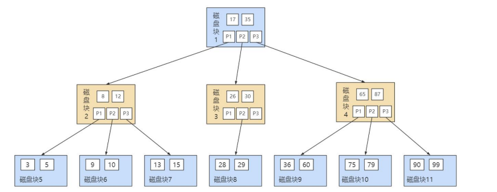

+ 从上图中我们可以看出，如果我们想查找一定范围内的值，我们无法全都定位到叶子节点去找，因为有的数据在非叶子节点中也存在，这样会导致我们查询的效率不是很稳定
+ 但B树已经相对于平衡二叉树来说，IO操作减少了

---

##### ⅤB+树

+ B+树是MySQL默认的索引结构
+ B+树的特点如下:
  + 有 k 个孩子的节点就有 k 个关键字。也就是孩子数量 = 关键字数，而 B 树中，孩子数量 = 关键字数+1
  + 非叶子节点的关键字也会同时存在在子节点中，并且是在子节点中所有关键字的最大（或最小）
  + 非叶子节点仅用于索引，不保存数据记录，跟记录有关的信息都放在叶子节点中。而 B 树中，非叶子节点既保存索引，也保存数据记录
  + 所有关键字都在叶子节点出现，叶子节点构成一个有序链表，而且叶子节点本身按照关键字的大小从小到大顺序链接
+ 与B树相比
  + B+树**查询效率更稳定**，B+树每次都需要访问到叶子节点才能确认找到数据
  + B+树的**查询效率更高**，因为B+树通常比B树分叉更多
  + B+树的**查询范围也比B树高**，因为B+树只要找到叶子节点，由于叶子节点之间存在指针，我们就可以顺着指针一个个递增的向下找。但B树需要进行中序遍历，才能完成范围的查找
  + 不过B树和B+树各有各的应用场景，不能完全说B+树就是比B树好
+ **注意**:
> + InnoDB引擎在生成B+树索引时，它不是自底向上生成的，**它是从上向下生成的**:
>   + 最开始生成一个根节点，如果有数据，就向里添加
>   + 当一页存不了这么多数据时，它会创建一个新的页A，把根节点中的所有数据都放进新创建的页A，接下来再创建一个新的页B，将要添加的数据放进新页B（这里说的是聚簇索引），之后在根节点生成两个页的目录项
>   + 当一个根节点存不了这么多目录项时，它会再创建一个新的页C，将当前根节点的所有目录项数据放入新页C中，再创建一个新页D，将多余的目录项放入新页D，之后在根节点生成这些目录项的目录项
>   + 以此类推，它体现了InnoDB引擎的B+树索引的**根位置永远不动**的特性
> + InnoDB在生成B+树时，假设这样一种情况:
>   + 我们有两个目录项，它们的对应字段值都是相同的，也就是说，比如一页能存放100条数据，正好有101条数据的对应字段值全都是一样的，那么这两条目录项所用来标识的值就是完全一致的，但它们都指向两个不同的页
>   + 当我们想插入一条数据时，比如这条数据也与该字段值相同，那么InnoDB就不知道怎么办了
>   + 为了解决这一问题，InnoDB规定，**所有的B+树索引的目录项记录必须是唯一的**。为了实现该要求，我们可以把对应数据项的主键也取出来，放入目录项记录中，主键一定非空且必定不重复，因此保证了记录项的唯一性
>   + 如果我们没有指定某一张表的主键，MySQL会自动生成一个隐藏主键，该主键是长整数类型，占用6个字节
> + 另外，InnoDB规定**一个页面必须至少存储两条记录**
>   + 这很好理解，如果一个页面只能存储一条记录，那么树形结构无法起到“总结数据”的作用，导致我们白白浪费了资源，而且还降低了效率

---

##### ⅥR树

+ R-Tree在MySQL很少使用，仅支持 geometry数据类型
  + 支持该类型的存储引擎只有myisam、bdb、innodb、ndb、archive几种。
  + 举个R树在现实领域中能够解决的例子：查找20英里以内所有的餐厅。
    + 在没有R树的情况下我们会把餐厅的坐标(x,y)分为两个字段存放在数据库中，一个字段记录经度，另一个字段记录纬度。这样的话我们就需要遍历所有的餐厅获取其位置信息，然后计算是否满足要求。如果一个地区有100家餐厅的话，我们就要进行100次位置计算操作了，如果应用到谷歌、百度地图这种超大数据库中，这种方法便必定不可行了。
    + R树就很好的 解决了这种高维空间搜索问题 。它把B树的思想很好的扩展到了多维空间，采用了B树分割空间的思想，并在添加、删除操作时采用合并、分解结点的方法，保证树的平衡性。因此，R树就是一棵用来 存储高维数据的平衡树 。相对于B-Tree，R-Tree的优势在于范围查找。

---

#### ④MyISAM引擎索引结构

+ 如图所示:

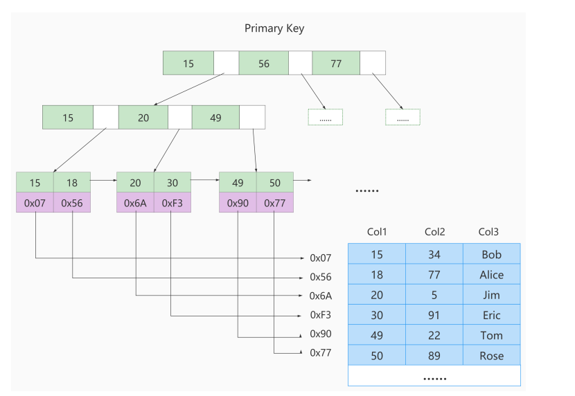

+ 如果建立一个二级索引，那么结构变为:

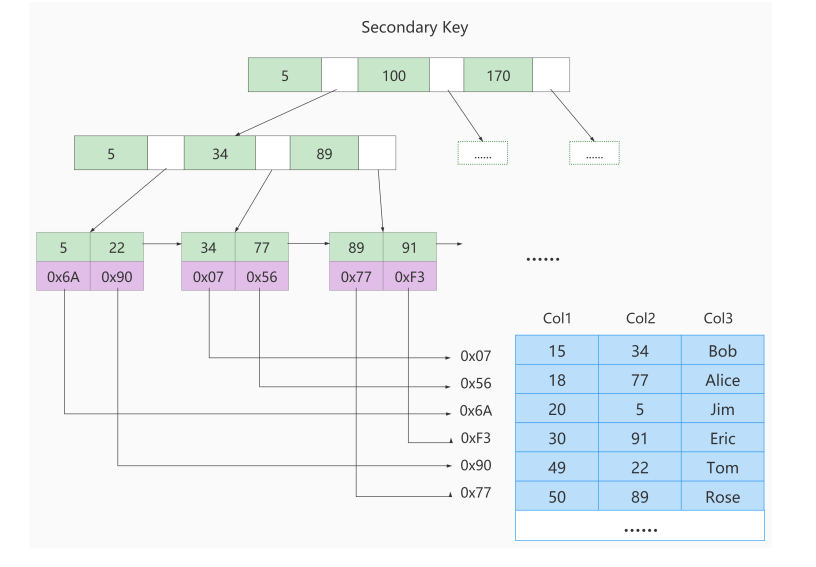

+ MyISAM引擎的索引需要回表，回表就是通过索引得到的并不是对应的数据，而是关于该数据的直接“线索”，存储引擎还需要通过该“线索”来得到对应的数据，也就是说，他还需要再去表里找一遍，这个再找一遍的操作，叫做回表。

|对比项|MyISAM|InnoDB|
|:---:|:---:|:---:|
|索引方式|非聚簇|包含一个聚簇|
|回表|全部需要回表|二级索引需要回表|
|索引与数据|文件分离|其数据文件本身就是索引文件|
|目录项指针指向|地址|主键|
|回表操作速度|根据地址直接定位数据，快速|根据主键还要查找一遍数据，较慢|
|主键要求|无要求|必须要有主键|

---

### （三）索引管理

#### ①索引的创删查

+ 索引有两种创建方式:
  + 创建表的时候创建，可以通过在字段上声明一些约束，或者在字段最后手动指定来创建
  + 在已存在的表上创建索引,可以通过ALTER关键字或者CREATE关键字创建
  + 被主键约束、唯一性约束和外键约束声明的字段，MySQL会为其自动创建对应的索引
+ 索引的删除也有两种删除方式:
  + 使用ALTER关键字删除
  + 使用DROP关键字删除

+ 下面是索引的具体SQL语句:

~~~sql
  CREATE TABLE table_name (
    字段声明 [约束]  -- 主键、非空等约束一旦作用在字段上，MySQL就会自动生成其字段索引
    ...
    -- UNIQUE、FULLTEXT、SPATIAL分别表示非空、全文和空间索引，如果想创建普通索引，不用写这些项
    -- INDEX和KEY的意义是相同的，都是起声明索引的作用
    -- index_name表示索引名
    -- col_name表示索引排序所依据的字段名，length是可选项，用来表示该索引仅记录此字段的前length个字符组成的字符串，一旦声明了该部分，就意味着该索引是前缀索引。只有字符串类型的字段才能选择length。如果索引依据的字段有多个，那么各字段之间使用逗号隔开
    -- ASC和DESC表示该字段按照什么方式进行排序，降序索引是MySQL8.0才开始支持的
    [UNIQUE | FULLTEXT | SPATIAL] [INDEX | KEY] [index_name] (col_name [length]) [ASC | DESC]
  )

  -- 使用ALTER关键字进行索引的创建
  ALTER TABLE table_name
  ADD [UNIQUE | FULLTEXT | SPATIAL] [INDEX | KEY] [index_name] (col_name[length],...) [ASC | DESC] [,table_name (col_name[length],...) [ASC | DESC] ,...]

  -- 使用CREATE关键字进行索引的创建
  CREATE [UNIQUE | FULLTEXT | SPATIAL] INDEX index_name ON table_name (col_name[length],...) [ASC | DESC] [,table_name (col_name[length],...) [ASC | DESC] ,...]

  -- 使用ALTER关键字删除索引
  ALTER TABLE table_name DROP INDEX index_name;

  -- 使用DROP删除索引
  DROP INDEX index_name ON table_name;

  -- 查看指定表的索引
  show index from table_name;

~~~

+ [索引样例](../源码/MySQL/索引.sql)
+ 注意:
> + **如果我们删除了对应表的列，如果该列是索引的依据，那么索引内的依据也会被同步删除**
> + 如果使用了全文索引，那么使用`SELECT * FROM 表名 WHERE MATCH(字段1,字段2) AGAINST (‘查询字符串’);`的语句可以比like语句块数倍，但是存在查询精度问题，可能不能完整的查询到对应要求的值

---

#### ②索引的新特性

+ MySQL8.0开始**支持降序索引**，在此之前，索引仅支持升序
+ 另外，MySQL8.0还**支持了隐藏索引**
  + 当我们想删除某一索引时，我们如果贸然删掉它，就回复不过来了，但删掉他如果导致了一些问题，那可能就会造成非常严重的损失
  + MySQL提供的隐藏索引的作用就是让我们在真正删除某一索引前，先**让它隐藏，导致MySQL的优化器监测不到它，使得当前的程序就相当于删除了该索引，从而使SQL语句在执行时不会使用到该索引**。方便我们进行索引删除后的副作用效果测试。如果没问题的话，我们再删除它，否则不删除
  + 即使索引是隐藏的，但是**如果数据发生变动，它依然会同步更新**
  + 另外，MySQL又提供了一项配置，让我们的优化器能够在索引隐藏时能够检测到它

~~~sql

  -- 建表时就指定该索引是隐藏的
  CREATE TABLE tablename(
    propname1 type1[CONSTRAINT1],
    propname2 type2[CONSTRAINT2],
    ……
    propnamen typen,
    INDEX [indexname](propname1 [(length)]) INVISIBLE  -- 在建表时使用invisible指定索引的隐藏
  );

  -- 在CREATE关键字下使用INVISIBLE指定索引隐藏
  CREATE INDEX indexname ON tablename(propname[(length)]) INVISIBLE;  
  -- 在ALTER关键字下使用INVISIBLE指定索引隐藏
  ALTER TABLE tablename
  ADD INDEX indexname (propname [(length)]) INVISIBLE;

  -- 切换隐藏索引
  ALTER TABLE tablename ALTER INDEX index_name INVISIBLE;
  ALTER TABLE tablename ALTER INDEX index_name VISIBLE;
  -- 查看查询优化器的开关设置，其中use_invisible_indexes项表示的是查询优化器的开关，如果改成ON，那么就说明隐藏索引对查询优化器可见，为OFF说明不可见
  select @@optimizer_switch \G;
  -- 设置optimizer_switch字段，来打开该配置的开关
  set session optimizer_switch="use_invisible_indexes=on";  

~~~

---

#### ③索引的创建原则

+ 推荐的索引原则如下:
  + **字段数值有唯一性的限制**适合创建索引:因为是唯一的，把他们变得有序便于提高查找效率
  + **频繁作为WHERE子句的查询条件的字段**适合创建索引:一直用一直查，建索引查的效率更快
  + **经常ORDER BY和GROUP BY的字段**适合创建索引:ORDER BY可以通过索引快速的得到结果，否则MySQL默认的外部排序效率较低。GROUP BY的字段是需要分组的，而我们建立了索引更利于GROUP BY作用的字段的查找
  + **UPDATE和DELETE的WHERE子句条件列**适合创建索引:一直用一直查，查的快效率肯定高
  + **DISTINCT字段**适合创建索引:索引是有序的，因此去重比较方便
  + **多表连接操作时，两表的连接字段和WHERE条件字段**适合创建索引:两表连接时，连接字段会频繁查询，加索引来提高查询效率。WHERE条件也一样
  + **使用类型小的列创建索引**:索引的列最好字段范围小，这样浪费的空间比较少，能够提高索引更新的效率
  + **使用字符串前缀创建索引**:字符串有的时候会很长，但是我们不想浪费多余的资源，因此需要使用字符串的前缀来创建索引，但是使用什么长度是个问题。我们可以利用公式(count(distinct 字段)/count(*))来判断，当该指标大于0.9的时候，差不多就行了。一般20长度就行
  + **区分度高的列适合创建索引**:上面那个公式就是区分度高的
  + **使用最频繁的列放到联合索引的左侧**:因为使用频繁所以要放到排序优先级最高的最左边
  + **多个字段都需要创建索引时，联合索引优于单值索引**:是这样的
  + **删除不再使用或者很少使用的索引**:删掉可以节省资源
+ 不推荐的索引原则如下:
  + **在where中使用不到的字段，不要设置索引**:都用不到肯定就不创建索引了
  + **数据量小的表最好不要使用索引**:这样没什么区别，还浪费了资源
  + **有大量重复数据的列上不要建立索引**:这数据太重复了，一抓一大把，不用 
  + **避免对经常更新的表创建过多的索引**:经常更新，导致索引也经常更新，可能会降低表的更新速度。他其实有两层含义，频繁更新的字段不一定要创建索引，以及表上不建议有太多的索引
  + **不建议用无序的值作为索引**:不建议
  + **不要定义冗余或重复的索引**:多个字段都需要创建索引时，联合索引优于单值索引
+ 杂项:
  + **前缀索引索然能够提升性能，但是就无法使用索引覆盖这一特性了**

---

## 五、InnoDB数据存储结构

+ 由于MySQL默认的存储引擎是InnoDB引擎，因此这里着重描述InnoDB的数据存储结构

### （一）页

+ 在数据库中，**数据库管理存储空间的基本单位是页，数据库进行I/O操作的基本单位也是页**
  + 我们的记录是按照行来存储的，但是**数据库的读取不是以行为单位的**，否则每次IO就读取一行数据，效率会极低
+ InnoDB引擎存储数据时，会将这些数据以页的形式保存在文件内
  + 在MySQL中，一页的大小是16kb（InnoDB默认），不同的DBMS，它们的页大小也不同
+ 数据页被划分为如下七个区域:
  + 文件头
  + 页头
  + 最大最小记录
  + 用户记录
  + 空闲空间
  + 页目录
  + 文件尾

|区域|占用空间(Byte)|作用|备注|
|:---:|:---:|:---:|:---:|
|文件头(File Header)|38b|无|
|页头(Page Header)|56b|无|
|最大最小记录(infimum+supremum)|26b|无|
|用户记录(User Records)|不确定|无|
|空闲空间(Free Space)|不确定|无|
|页目录(Page Directory)|不确定|无|
|文件尾(File Tailer)|8b|无|

#### ①文件头部与尾部

+ 文件头部用来**描述页的通用信息**
+ 文件头部又被许多字段组成:

|名称|占用空间(Byte)|作用|备注|
|:---:|:---:|:---:|:---:|
|FIL_PAGE_OFFSET|4|页的唯一标识|无|
|FIL_PAGE_TYPE|2|当前页的类型|无|
|FIL_PAGE_PREV|4|上一个页的地址|无|
|FIL_PAGE_NEXT|4|下一个页的地址|无|
|FIL_PAGE_SPACE_ON_CHKSUM|4|页的校验和|用于校验是否与内存数据同步|
|FIL_PAGE_LSN|8|页面被修改时最后对应的日志序列位置|无|
|FIL_PAGE_FILE_PLUSH_LSN|8|仅在系统表空间的一个页内定义，代表文件至少被刷新到了对应的LSN值|无|
|FIL_PAGE_ARCH_LOG_NO_OR_SPACE_ID|4|页属于哪个表空间|无|

|FIL_PAGE_TYPE字段|十六进制表示|作用|备注|
|:---:|:---:|:---:|:---:|
|FIL_PAGE_TYPE_ALLOCATED|0x0000|最新分配，还没使用|无|
|FIL_PAGE_UNDO_LOG|0x0002|Undo日志页|无|
|FIL_PAGE_INODE|0X0003|段信息节点|无|
|FIL_PAGE_IBUF_FREE_LIST|0x0004|insert buffer空闲列表|无|
|FIL_PAGE_IBUF_BITMAP|0x0005|insert buffer位图|无|
|FIL_PAGE_TYPE_SYS|0x0006|系统页|无|
|FIL_PAGE_TYPE_TRX_SYS|0x0007|事务系统数据|无|
|FIL_PAGE_TYPE_FSP_HDR|0x0008|表空间头部信息|无|
|FIL_PAGE_TYPE_XDES|0x0009|扩展描述页|无|
|FIL_PAGE_TYPE_BLOB|0x000A|溢出页|无|
|FIL_PAGE_INDEX|0x45GF|索引页，即数据页|

+ 校验和，是经过某种算法，将很长的字节串转变为一个比较短的值，这个比较短的值是校验和
  + 页的头部和尾部都有校验和字段，如果他们相等，那么说明值是同步的。如果不相等，说明内存中的数据在更新到硬盘时，出现了问题，导致数据的不同步
  + 它的作用就是，在内存中的数据更新后，MySQL会更新加载进内存中的页的校验和的值，使其与磁盘中的页的校验和值不同。这样，在内存中的数据更新磁盘中的页数据时，如果出现了故障导致更新进行到一半，就会使得磁盘中的页文件内的头部和尾部的校验和值不同，从而使MySQL和我们能够判断出来该页数据出现了不同步
+ 同理，FIL_PAGE_LSN也在首尾都存在，它也是用来校验页是否同步的，即校验数据完整性

---

#### ②空闲空间、最大最小记录与用户记录

+ 用户记录用来记录我们数据库的数据，它的数据存储主要通过行格式的记录头信息来实现
  + 记录头信息的字段如下:

|字段名|大小(bit)|作用|备注|
|:---:|:---:|:---:|:---:|
|预留位1|1|没有使用|无|
|预留位2|1|没有使用|无|
|delete_mask|1|标记该记录是否被删除，1表示被删除，0表示未删除|无|
|min_rec_mask|1|B+树索引的每层非叶子节点中的最小记录都会添加该标记|无|
|n_owned|4|表示当前记录所拥有的记录数|无|
|heap_no|13|表示当前记录在记录堆的位置信息|无|
|record_type|3|当前记录的类型，0表示普通记录，1表示B+树非叶子节点记录，即目录项，2表示最小记录，3表示最大记录|无|
|next_record|16|表示下一条记录相对于本记录的相对位置|无|

+ 记录头信息解释:
  + delete_mask用来标记该记录是否被删除，它实际上并不会从磁盘中删除文件，而是只是把该记录的该字段记为1
    + 如果一个页内删的较多，MySQL会为这些记录单独组成一个链表。便于之后有数据插入时，使用这些已经被“删除”的记录空间
  + min_rec_mask字段用来记录B+树索引的每层非叶子节点中的最小记录，即**标记每个页的目录项的最小记录**，数据项都是0，因为他们所在的页是叶子节点
  + heap_no字段用来表示当前记录在记录堆的位置信息，即**表示记录在页内的位置**，0和1已经被占用了，这是因为MySQL会为每个页都自动创建一个最大记录和最小记录，最小记录是0，最大记录是1，因此我们手动添加的记录从2开始
+ 最小记录和最大记录都占用13字节，其中包括5字节的记录头信息和8字节的固定部分，它们用来指向当前页中的最小记录和最大记录。**这两个记录是MySQL自动创建的**，不是我们手动创建的
+ 空闲空间就是还剩下多少空间

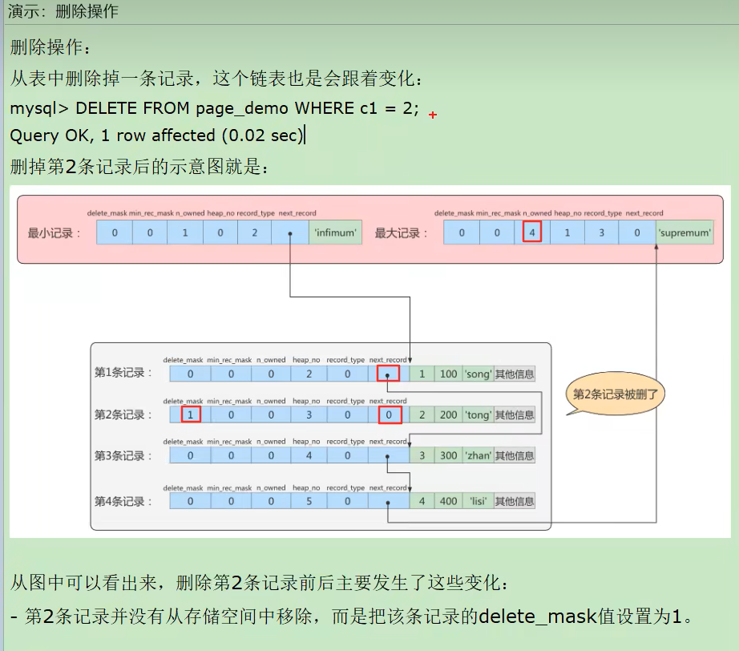
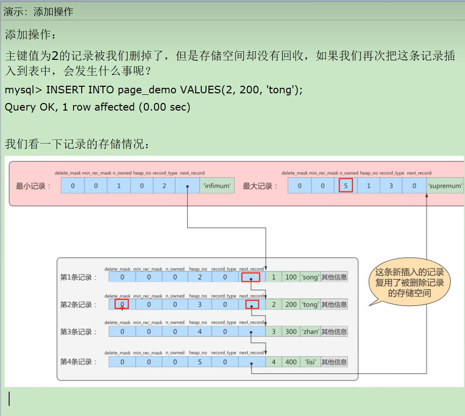

---

#### ③页目录与页面头部

+ 页目录会对一个页内的记录进行分组
  + 最小记录单拎出来一组,我们称这些组叫slot（槽）
  + 后面的记录加上最大记录，依次进行分组，每组包含4-8个记录，最后一组包含1-8个记录
  + 将每个组中最大的值抽取出来，组成连续的数组，数组中的每个元素用来记录该值所在的组
  + 这样我们就能在IO操作到叶子结点的时候进行二分查找了，先二分查找数组，再查找对应的组，节省了时间并提高了效率
+ 分组的详情:
  + 首先，一个页默认只有最小记录和最大记录，最小记录自己是一组
  + 插入时，数据记录与最大记录一起组成另一组，这样就有了两组，这种情况会持续到页内一共有9个记录（包括最大、最小记录）
  + 当我们尝试插入第8个记录时（之前共有9个记录，去掉最大、最小记录就是7个，即我们此前插入了7个记录），由于超过了一组的最大限制，先进行插入，直接将有9条记录的组平均分开，一个组4个记录，另一个组5条记录
  + 之后插入时，向有5条记录的组插入，如果超限，再重复上面的操作
+ 页面头部详细的描述了页的状态，它占有56个字节的固定长度

|字段|占用大小|作用|备注|
|:---:|:---:|:---:|:---:|
|PAGE_N_DIR_SLOTS|2字节|在页目录中的槽数量|无|
|PAGE_HEAP_TOP|2字节|还未使用的空间最小地址，也就是说该地址之后就是Free Space|无|
|PAGE_N_HEAP|2字节|本页中记录的数量（包括最大、最小记录以及标记为删除的记录）|无|
|PAGE_FREE|2字节|第一个已经标记为删除的记录地址|无|
|PAGE_GARBAGE|2字节|已删除记录的占用的字节数|无|
|PAGE_LAST_INSERT|2字节|最后插入的记录的位置|无|
|PAGE_DIRECTION|2字节|记录插入的方向|无|
|PAGE_N_DIRECTION|2字节|记录连续向某一方向插入的次数|无|
|PAGE_N_RECS|2字节|该页中记录的数量（不包括最大、最小记录以及标记为删除的记录）|无|
|PAGE_MAX_TRX_ID|8字节|修改当前页的最大事务ID，该值仅在二级索引中定义|无|
|PAGE_LEVEL|2字节|当前页在B+索引中所处的层级|无|
|PAGE_INDEX_ID|8字节|索引ID,表示当前页属于哪个索引|无|
|PAGE_BTR_SEG_LEAF|10字节|B+树索引叶子段的头部信息，仅在B+树的Root页定义|无|
|PAGE_BTR_SEG_TOP|10字节|B+树索引非叶子段的头部信息，仅在B+树的Root页定义|无|

---

### （二）行格式

+ MySQL的数据以行为单位向表中插入，这些行在磁盘上的存放方式被称为行格式
+ MySQL有如下行格式，其中默认的行格式是Compact:
  + Compact
  + Redundant
  + Dynamic
  + Compressed
+ 下面是关于行格式的一些SQL语句

~~~sql
  -- 查看默认的行格式
  select @@innodb_default_row_format;

  -- 查看指定表的状态，这些状态中可以查看当前表的行格式
  show table status like 'mybatis_emp' \G;

~~~

#### ①Compact行格式

+ Compact是最经典的行格式，它包括
  + 变长字段长度列表:该列表按照与表结构中定义的字段相反的方向来表示该行的指定字段占用多少大小
  + NULL值列表:该列表也是按照与表结构中定义的字段相反的方向来表示当前行的字段是否是NULL,1表示是NULL,0表示不是NULL。如果该字段已经明确了不是NULL了，比如有主键约束或非空约束，它不会被表示（即不会在字节码文件中出现）。
  + 记录头信息:对于数据的一些描述，详情见[此处](#userData)
  + 真实数据:我们添加的真实数据

---

#### ②Dynamic与Compressed行格式

+ Dynamic与Compressed行格式与Compact行格式基本上没有什么太大区别，就是在处理行溢出问题上有不同的解决方案
  + 首先认识一下什么是行溢出:
    + 我们在声明一个字段时，如果声明VARCHAR类型，从理论上来说，VARCHAR是支持65536字节的，因此我们完全可以设置该字段最大就占用65536字节
    + 但是，当我们这样写的时候，就会报错:

~~~sql
  create table if not exists test2(
    name varchar(65535)
  );
~~~

    + 这里解释为什么不行:1.我们在varchar内写的是字符数量而不是字节数量，这就意味着设置同样的varchar，如果字符集不同，那么该字段占用的内存也不同 2.我们的字段需要一些内存来表示它当前字段的长度，如果想表示65535字节，需要16bit，也就是需要2字节
    + 现在让我们来改进一下代码:

~~~sql
  create table if not exists test2(
    name varchar(65533)
  ) CHARSET=ascii;
~~~

    + 然后它就报错了:

    + 继续解释:我们的字段还需要1bit来判断它是否是空值，因此我们需要将其设置为65532或增加非空约束或主键约束:

~~~sql
  create table if not exists test2(
    name varchar(65533) not null
  ) CHARSET=ascii;
~~~

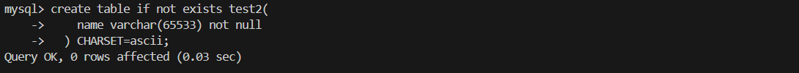

  + 现在我们已经认识了行溢出，现在描述Compact与Redundant对行溢出的处理方式:
    + 很简单，就是分多个页来存储该段数据
    + 另外，在记录的真实数据处分出20字节来存储指向存储这些数据的页的地址，并存储每个页存储的数据量
  + 而Dynamic与Compressed对于行溢出的处理是:
    + 直接将移除的字段都装在一个页里面
    + 另外，在数据页中分出20字节，存放储存溢出数据的页的地址

---

#### ③Redundant行格式

+ Redundant行格式的开头并没有变长字段长度列表以及NULL值列表，但是多了一个字段长度便宜列表。虽然它东西少了，但是它变冗余了。因为没有变长字段长度列表和NULL值列表意味着它所有的字段长度和NULL值都要表示，会变得冗余
+ 另外，其记录头信息并不包含record_type项，取而代之的是n_field和1byte_offs_flag两个字段

---

### （三）区、段、碎片区与表空间

+ 对于数据页来说，它有三种方式被加载
  + 内存加载:如果数据页被缓存在了内存中，那么直接从内存进行加载
  + 随机加载:在磁盘上进行扫描，寻找该页，找到后进行加载，并将其缓存到内存中去
  + 顺序读取:如果我们请求的数据**在物理上是连续的**，我们就可以批量的读取数据，从而大大降低每想加载一个页就要去磁盘上查找花费的时间。且**顺序读取可以让我们批量的读取数据**

+ **区**:
  + 在没有区的时候，我们的页使用链表进行连接，但是链表是逻辑连续的，导致两个页之间可能相距很远，导致磁盘扫描浪费的时间很多
  + **区就是物理位置上连续的64个页**，它保证了页的物理连续，从而方便我们进行顺序读取
  + 当表中数据量大的时候，为每个索引分配空间的时候就不会以页为单位分配了，而是会变为以区为单位分配。虽然这可能会导致空间的浪费（数据无法填满整个区），但是效率有很大提高
+ **段**:
  + 我们的B+树索引，是有叶子节点和非叶子节点的，如果我们在向区内分配页时不加以区分两者，那么目录页和数据页将会杂乱的分布在一个区内，导致顺序读取的效率大打折扣。因此,InnoDB引擎对叶子节点和非叶子节点进行了区别对待。叶子节点有自己的区，非叶子节点也有自己的区
  + **存放叶子节点的区的集合就是段**，段是逻辑上连续的概念，InnoDB的一个索引会生成两个段，一个是叶子节点段，一个是非叶子节点段
  + 除上面两个段外，InnoDB引擎还有为一些特殊的数据而定义的段，像回滚段、数据段、索引段等。数据段就是叶子节点段，索引段即为非叶子节点段
  + InnoDB的段管理是引擎自己完成的，DBA不能也没有必要对其加以控制，这从一定程度上简化了DBA对于段的管理
+ **碎片区**:
  + 我们的表，如果即使仅存储十几条数据的话，就要申请一个包含64个页的区，那么对存储空间的浪费是巨大的
  + 为了解决该问题，InnoDB提供了碎片区。碎片区内的64个页并不是仅被一个表占用，可能有10个被A表占用，有10个被B表占用...
  + 但是这样会导致碎片区的归属问题，InnoDB直接就让碎片区直属于表空间了
  + 如果我们的表比较小时，数据较少，他会先申请碎片区的页来存储其数据。当它的数据量逐渐增大时，增大到占用了32个页，即相当于一半的区时，它会再申请一个完整的区存储其数据
+ **表空间**:
  + 表空间可以看作是InnoDB存储引擎**逻辑结构**的最高层，所有数据都存放在表空间内
  + **表空间是一个逻辑容器**，表空间存储的对象是段，一个表空间可以有多个段，但是一个段仅能属于一个表空间。
  + 表空间从管理上可以分为:
    + 独立表空间:每张表都有其独立的表空间，其空间可以回收，碎片不太影响性能，且可以在不同的数据库之间进行迁移
    + 系统表空间:系统表空间在一个MySQL进程中仅有一个，它额外记录了一些有关整个系统信息的页面，但用户并不能访问这些表，只能去底层文件查看
      + MySQL在information_schema系统数据库中提供了一些以innodb_sys开头的表，这些表是通过读取系统表中的数据，然后填充到自己表内的，并不是真正的系统表。它的目的是为了向用户提供一些系统表的内容，便于大家分析一些问题
      + 系统表即数据字典，我们在执行插入操作时，MySQL收到SQL语句并解析后，他需要找到要插入的表的索引的跟页面在哪个表空间的哪个页中，然后通过根页面找到要插入的地方，插入到B+索引树中。因此**MySQL在执行SQL相关操作时，还需要保存一些其他数据，这些数据被称为元数据，而这些数据被存储在了系统表内**
    + 撤销表空间
    + 临时表空间

~~~sql
  -- 查看表空间类型，如果出现innodb_file_per_table对应的Value是on，那么说明开启了独立表空间，且说明每张表都会单独创建一个idb文件
  show variables like 'innodb_file_per_table';
~~~

---

## 六、性能分析与调优

### （一）性能分析

#### ①调优步骤

+ 我们调优的步骤如下图所示:
  + 其中，被S标记的部分需要使用对应的分析工具进行分析
  + 被A标记的部分说明我们可以在此处采取一些行动来进行优化

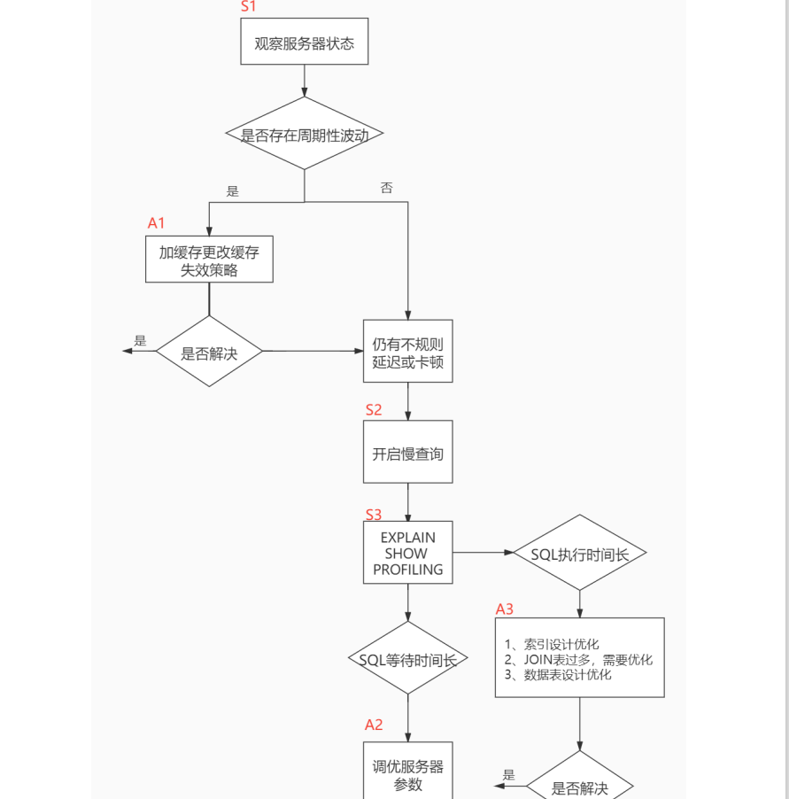
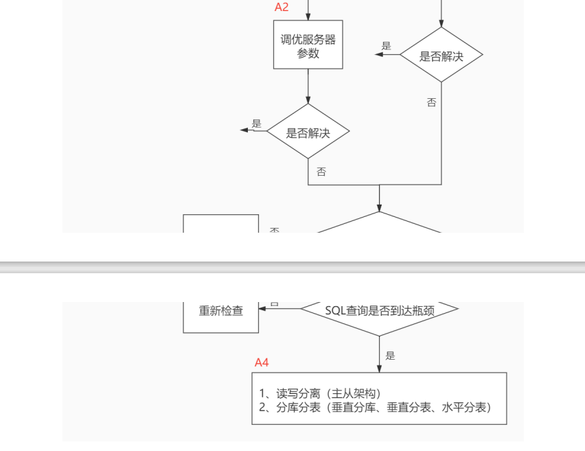

#### ②性能参数

+ 在MySQL中，可以使用`SHOW STATUS`语句查询一些MySQL数据库服务器的性能参数、执行频率
  + 以下是一些常用的性能参数:

|性能参数|描述|备注|
|:---:|:---:|:---:|
|Connections|连接MySQL服务器的次数|无|
|Uptime|MySQL服务器的上线时间|无|
|Slow_queries|慢查询的次数|无|
|last_query_cost|统计SQL查询成本，其返回值描述使用样例说明:查询结果返回100条数据，这100条数据分别来自三个不同的页，因此返回3|无|
|Innodb_row_read|Select查询返回的次数|无|
|Innodb_row_inserted|执行INSERT操作插入的行数|无|
|Innodb_rows_updated|执行UPDATE操作更新的行数|无|
|Innodb_rows_deleted|执行DELETE操作删除的行数|无|
|Com_select|查询操作的次数|无|
|Com_insert|插入操作的次数|无|
|Com_update|更新操作的次数|无|
|Com_delete|删除操作的次数|无|

+ 查看性能参数的SQL语句:

~~~sql
  SHOW [GLOBAL|SESSION] STATUS LIKE '参数';
~~~

---

#### ③慢查询日志

+ 慢查询日志主要用来记录慢查询的相关信息，我们可以从这里得到慢查询的相关SQL语句、慢查询的条数等
+ 慢查询日志的相关SQL语句如下:

~~~sql
  -- -- 查询慢查询目录相关信息
  show variables like '%slow_query_log%';  -- 查看慢查询日志信息
  SHOW VARIABLES LIKE '%slow%'; -- 查询慢查询日志所在目录
  SHOW VARIABLES LIKE '%long_query_time%'; -- 查询超时时长
  -- 开启慢查询日志
  set global slow_query_log='ON';

  -- 查看慢查询时间阈值，超过该值时，该查询会被记录为慢查询
  show variables like '%long_query_time%';
  -- 手动设置该时间阈值，它的global和session都有该变量，因此都要设置上
  set global long_query_time = 1;
  set long_query_time=1;
  -- 查询当前的慢查询数量
  SHOW GLOBAL STATUS LIKE '%Slow_queries%';

  -- 关闭慢查询日志
    -- 通过配置文件关闭，需要重启服务
    [mysqld]
    slow_query_log=OFF  -- 或者把它注释掉
    -- 运行时关闭
    SET GLOBAL slow_query_log=off;
  
  -- 删除慢查询日志
  -- 一旦执行了该命令，慢查询日志将被删除，并在数据目录下重新生成新的慢查询日志文件
  mysqladmin -u root -p flush -logs slow

~~~

+ MySQL提供了慢查询日志分析工具mysqldumpslow，**它需要在终端调用**

~~~bash
  # 查看帮助信息
  mysqldumpslow --help

  # -a: 不将数字抽象成N，字符串抽象成S
  # -s: 是表示按照何种方式排序：
  #   c: 访问次数
  #   l: 锁定时间
  #   r: 返回记录
  #   t: 查询时间
  #   al:平均锁定时间
  #   ar:平均返回记录数
  #   at:平均查询时间 （默认方式）
  #   ac:平均查询次数
  # -t: 即为返回前面多少条的数据；
  # -g: 后边搭配一个正则匹配模式，大小写不敏感的；

  # 我们想要按照查询时间排序，查看前五条 SQL 语句，这样写即可
  mysqldumpslow -s t -t 5 日志所在路径

  # 常用参考

  #得到返回记录集最多的10个SQL
  mysqldumpslow -s r -t 10 日志所在路径
  #得到访问次数最多的10个SQL
  mysqldumpslow -s c -t 10 日志所在路径
  #得到按照时间排序的前10条里面含有左连接的查询语句
  mysqldumpslow -s t -t 10 -g "left join" 日志所在路径
  #另外建议在使用这些命令时结合 | 和more 使用 ，否则有可能出现爆屏情况
  mysqldumpslow -s r -t 10 日志所在路径 | more

~~~

#### ④PROFILE语句

+ 早在[逻辑架构](#Profile)时，就碰到过Profile
+ Profile用来计算SQL执行成本，它会向我们提供查询操作的每次执行步骤具体耗费的时间，从而让我们能够快速判断出导致慢查询的原因

~~~sql
  -- 查看是否开启profiling
  select @@profiling;  
  show variables like 'profiling';

  -- 如果是MySQL5.7，需要在配置文件内开启查询缓存配置，并重启服务使之生效
  -- 如果是MySQL8，此方式没有效果，且重启服务会失败，因为MySQL8.0不支持查询缓存
  [mysqld]
  query_cache_type=1

  -- 设置profiling，0代表关闭，1代表开启
  set profiling=1;
  -- 显示最近的几次查询
  show profiles;
  -- 显示上一次查询的详细步骤
  show profile;
  -- 使用profiles显示的查询的id来展示对应查询的详细步骤
  show profile for query 7;
  -- 展示更详细的步骤
  show profile cpu,block io for query 7;
~~~

+ SHOW PROFILE的常用参数有:

|参数|作用|备注|
|:---:|:---:|:---:|
|ALL|显示所有开销信息|无|
|BLOCK IO|显示IO块开销|无|
|CONTEXT SWITCHES|上下文切换开销|无|
|CPU|显示CPU开销|无|
|IPC|显示发送和接收开销信息|无|
|MEMORY|显示内存开销信息|无|
|PAGE FAULTS|显示页面错误开销信息|无|
|SOURCE|显示和Source_function，Source_file，Source_line相关的开销信息|无|
|SWAPS|显示交换次数开销信息|

---

#### ⑤EXPLAIN语句

+ 在MySQL5.6.3版本前，仅能使用EXPLAIN分析查询语句，即仅能分析SELECT语句。
+ MySQL5.6.3以后，EXPLAIN支持分析SELECT、UPDATE、DELETE语句了
+ 同时，在MySQL5.7版本以前，想显示partitions需要使用explain partitions命令，想要显示filtered需要使用explain extended命令。在5.7版本后，默认explain直接显示filtered中的信息
+ 语法:

~~~sql
  EXPLAIN SELECT select_options
  或者
  DESCRIBE SELECT select_options
~~~

+ Explain语句会输出如下内容

|列名|描述|备注|
|:---:|:---:|:---:|
|id|每个查询对应一个id|无|
|select_type|SELECT查询对应的查询类型|无|
|table|查询作用的表名|无|
|partitions|匹配的分区信息|无|
|type|针对单表的访问方法|无|
|possible_keys|可用的索引|无|
|key|实际上使用的索引|无|
|key_len|实际上使用到的索引长度，用来度量索引的效率|无|
|ref|当使用索引列等值查询时，与索引列进行等值匹配的对象信息|无|
|rows|预估查询结果的行数|无|
|filtered|某个表经过搜索条件过滤后剩余记录条数的百分比|无|
|Extra|额外信息，一般用来描述SQL语句是怎么执行的|

+ 下面详细描述上述字段

##### Ⅰid、table与select_type

+ id和select很简单，**查询语句有几张表，就有几行数据，table就是哪个。SELECT语句有多少，就有几个id**，如果碰上多个表在一个id内，可以看到它们的id都是相同的，但是table都对应着不同的表
  + id表示**对应的SELECT语句的标识**
    + **id的值越大，代表其优先级越高，语句越先执行。如果id相同，那么从上向下执行**
    + 一个SQL语句应该使id越少越好，这代表它执行的查询更少，效率更高
  + table表示**id所对应的查询语句所使用的表**
  + **我们所看到的结果是查询优化器对SQL语句进行优化后的结果，因此我们通过分析我们自己编写的SQL语句得到的结果可能与实际运行结果不符**
+ select_type是一个有很多值的字段，它表示**此次查询的类型**，通过该字段我们可以查看到我们的查询被优化器优化到了什么情况
  + 优化器一般会将子查询转换为连接查询，并将in运算之类的相关运算转换为exists运算

|select_type字段|含义|备注|
|:---:|:---:|:---:|
|SIMPLE|**普通的查询**就是SIMPLE|无|
|PRIMARY|**包含子查询或UNION或UNION ALL语句的大查询最左边的查询语句**是PRIMARY|无|
|UNION|在**上面的PRIMARY满足的条件下，右边的查询**UNION|无|
|UNION RESULT|MySQL用来**进行UNION操作而生成的临时表**的select_type字段是UNION RESULT|UNION ALL表不需要去重，一般没有临时表|
|SUBQUERY|在优化器优化时，如果**优化器会不能将子查询转变为连接查询**，且**该子查询是不相关子查询也不能被物化**，那么该子查询的第一个SELECT查询语句所查询的表的那个select_type字段就是SUBQUERY|无|
|DEPENDENT SUBQUERY|**在SUBQUERY的前提下，如果该子查询的第一个SELECT查询语句还是一个相关子查询**，那么所查询的表的那个select_type字段就是DEPENDENT SUBQUERY|无|
|DEPENDENT UNION|在**包含UNION或者UNION ALL的大查询中，如果各个小查询都依赖于外层查询的话，那除了最左边那个小查询外，其余的小查询**的select_type字段都是DEPENDENT UNION|无|
|DERIVED|对于**包含派生表的查询**，该派生表对应的子查询的select_type字段就是DERIVED|派生表就是大查询所from的那个表是通过SELECT语句查询出来的，而不是数据库的原生表|
|MATERIALIZED|当**子查询语句可以被物化**时,此时子查询对应的select_type字段就是MATERIALIZED|物化就是优化器意识到查询可以转换为一个有明确的值的集合（集合是不重复的，因此会去重），就会将其转换为集合然后与驱动表进行连接，最后进行查询。|

+ [样例](../源码/MySQL/explain样例.sql)

---

##### Ⅱpartitions

+ partitions是用来查看分区记录的
+ 如果想查看其作用，见下:

~~~sql
  -- 创建分区表，
  -- 按照id分区，id<100 p0分区，其他p1分区
  CREATE TABLE user_partitions (id INT auto_increment,
    NAME VARCHAR(12),PRIMARY KEY(id))
    PARTITION BY RANGE(id)(
    PARTITION p0 VALUES less than(100),  -- id<100时分区为p0
    PARTITION p1 VALUES less than MAXVALUE  -- 其他情况分区为p1
  );

  DESC SELECT * FROM user_partitions WHERE id>200;  -- 可以看到partitions是p1
~~~

---

##### Ⅲtype、possible_keys、key_len与key

+ possible_keys表示**此次查询可以使用的索引**，而key代表**优化器最终选择的索引**
+ key_len显示**MySQL决定使用的键长度**。如果键是 NULL，则长度为 NULL。使用的索引的长度。
  + key_len一般用来查看我们索引的实用程度，比如一个联合索引有三个字段，我们可以通过key_len的值来确定该索引究竟被使用了几个字段，从而确定其使用的充分程度
  + **从索引的使用充分性上来看，它的值越大越好**，因为值越大说明MySQL使用索引使用的越充分
  + **从性能的角度上考虑，它的值越小越好**，小说明优化器可能使用了更少的索引来做更简单的操作，性能可能会提升
  + 它的计算公式是:

|条件|计算公式|
|:---:|:---:|
|varchar(10) 且可以为NULL|10(规定的字段长度)*(utf8=3,GBK=2,latin=1)+1(可以为NULL)+2(变长字段)|
|varchar(10) 且不允许是NULL|10(规定的字段长度)*(utf8=3,GBK=2,latin=1)+2(变长字段)|
|char(10) 且允许是NULL|10(规定的字段长度)*(utf8=3,GBK=2,latin=1)+1(可以为NULL)|
|char(10) 且允许是NULL|10(规定的字段长度)*(utf8=3,GBK=2,latin=1)|
|int 且允许NULL|4(int类型占4个字节)+1(可以为NULL)|

+ type表示我们使用的查询方式，它有多种类型，从效率上从高到低可以分为:system、const、eq_ref、ref、fulltext、ref_of_null、index_merge、unique_subquery、index_subquery、range、index、ALL

|type字段值|含义|备注|
|:---:|:---:|:---:|
|system|当优化器能够非常直接的找到对应的字段时，就是system。例:MyISAM引擎的表仅一条记录，查询全表信息时，就是system|无|
|const|如果我们根据**主键或者唯一二级索引列**与**常数**进行匹配时，对单表的访问方法就是const|**必须是常数，而不是常量**|
|eq_ref|在查询连接时，如果**被驱动表是通过主键或者唯一二级索引列等值匹配**的方式进行比较的（如果是联合索引，那么所有的索引列都需要进行比较），那么被驱动表的type字段是eq_ref|无|
|ref|当**通过普通的二级索引列**与**常量**进行等值匹配时来查询某个表，那么对该表的type可能是ref|这里说了常量，常量是包括常数的，因此说的是type字段可能是ref|
|fulltext|使用到全文索引时|无|
|ref_of_null|当**对普通二级索引进行等值匹配查询，该索引列的值也可能是NULL时**，那么对该表的type字段可能是ref_or_null|无|
|index_merge|**单表访问方法时在某些场景下可以使用intersection（取交集）、union（取并集并去重）、Sort-Union（合并多个有序数据集）这三种索引合并的方式来执行查询**，此时字段值是index_merge|无|
|unique_subquery|如果**优化器决定将IN子查询转换为EXISTS子查询，即优化器没办法把子查询转换成连接查询时，而且子查询可以使用到主键或唯一键索引进行等值匹配**，那么该子查询的type字段就是unique_subquery|无|
|index_subquery|**与unique_subquery类似，只是索引使用的是普通索引**，而不是主键或唯一键索引|无|
|range|如果**使用索引获取某些范围区间的记录**，那么查询的type字段可能会变为range|无|
|index|当我们可以**使用索引覆盖，但需要扫描全部的索引记录时**，查询的type字段就是index|无|
|ALL|ALL就是全表扫描，说明**没有索引可用**|无|

+ 我们进行索引优化的目标，至少要达到range级别，要求是ref级别，最好是const级别
+ [样例](../源码/MySQL/explain样例.sql)

---

##### Ⅳref、rows、filtered、Extra

+ ref表示**使用索引进行等值匹配时，与索引进行等值匹配的对象引用类型信息**
+ rows表示**查询语句执行，预计得到的查询结果的行数**，**这是一个预估的数目，可能不准确**，它的值越小越好
+ filtered表示某个表在搜索条件过滤后剩余记录条数占原表总记录数的百分比。这个值越大越好，因为越大表示我们查询出来的数据越符合条件
+ Extra用来说明一些额外信息

|Extra值|描述|备注|
|:---:|:---:|:---:|
|No tables used|表示该**SELECT语句并没有使用任何的表**|无|
|Impossible WHERE|表示**WHERE子句中出现了自相矛盾的条件，导致无论任何情况下都没有一条数据能够经过筛选**|无|
|Using WHERE|表示**使用了WHERE进行过滤**|无|
|No matching min/max row|表示**一个匹配的字段都没有，表示查询结果一行都没有**|无|
|Select tables optimized away|表示该表被优化了|无|
|Using index|表示MySQL优化器动用了索引优化表的查询，它说明**发生了覆盖索引**。|无|
|Using index condition|表示**使用了索引下推**或WHERE无法直接使用索引，但优化器使用了索引来进行过滤操作|无|
|Using join buffer (hash join)|说明**被驱动表没办法通过索引加快其访问速度，然后MySQL为其专门开辟出一块内存来加快其访问速度**|无|
|Not exists|在**连接时指定对应字段的过滤条件是字段为空，但是对应字段又限制了不能为空，因此导致矛盾**，从而输出Not exists|无|
|Using union/Intersect/sort_union(index1,index2,...)|表示**MySQL在查询过程中准备取索引结果的并集/交集/合并多个有序数据集**，括号内表示要取并集的两个索引的名称|无|
|Zero limit|表示**limit子句参数为0时**的提示，来告诉我们这是无意义的|无|
|Using filesort|说明**排序操作无法使用索引，此次查询需要使用文件排序的方式进行查询**|无|
|Using temporary|表示**MySQL使用了临时表来处理一些查询结果的数据**|无|

+ 覆盖索引:MySQL在通过索引查到了结果以后，**它的数据项内已经存在了我们想要的字段值了，此时我们就不需要再去回表，而直接从数据项中取出数据即可**
  +  一般来说我们的数据项会存放二级索引的指定值和主键，只要我们的select语句查询这些字段，那么覆盖索引就能成立
+ 索引下推就是我们在进行多条件过滤时，使用索引筛选出第一层数据时，不立刻进行回表，而是寻找与该索引字段相关的多条件过滤的其他条件进一步过滤，直到找不到索引字段相关的条件时再进行回表，这样做**可以减少IO次数，并提高查询效率**
+ [样例](../源码/MySQL/explain样例.sql)

---

##### Ⅴ输出格式

+ EXPLAIN语句共有四种输出格式
  + 传统格式:就是一个表格形式，是默认的输出格式
  + JSON格式:以JSON格式输出
  + TREE格式:在8.0.16版本被引入，主要根据查询的各个部分之间的关系和各部分的执行顺序 来描述如何查询
  + 可视化输出:主要看IDE支不支持，WorkBench是支持的
  + 语法就是在EXPLAIN后面加上`FORMAT=xxx`，其中想输出JSON，就写JSON，输出TREE就写TREE，想输出表格就不写
+ 在JSON格式中，还多出了一些字段:

|字段|含义|子字段|子字段含义|备注|
|:---:|:---:|:---:|:---:|:---:|
|cost_info|预计查询所需的总成本|read_cost|预计读取数据所花费的成本，由IO成本与监测rows*filtered所需的CPU成本组成|无|
|^|^|eval_cost|检测rows × filter条记录的成本|无|
|^|^|prefix_cost|单独查询对应表的成本，即cost_info+eval_cost。如果是被联动表，其对应值为cost_info+eval_cost+联动表的prefix_cost|无|
|^|^|data_read_per_join|表示在此次查询中需要读取的数据量|无|

---

##### Ⅵ拓展信息查看

+ 我们在使用EXPLAIN语句进行了一次分析后，可以使用哦`SHOW WARNINGS`语句来进一步查看此次EXPLAIN分析的拓展信息，**实际上它展示的是最近一条执行的SQL语句产生的警告信息**
+ 智障Navicat输出不出来，需要在终端写才能看见
+ 如果嫌它输出的太乱，加上`\G`来让它输出变得好看一点
+ 最终的输出结果有三个值:
  + Level,表示警告的级别，有三个值
    + Warning表示警告，但是警告不会影响操作的继续执行
    + Note表示注意，它提供了一些关于操作的信息，他不是错误或者警告
    + Error表示发生了严重错误，可能会中断操作的执行
  + Code:就是我们的报错信息所呈现出来的[数值型错误代码](#Error)
  + Message:我们报错的详细信息，**如果没有报错且Code是1003，那么会输出优化器优化后的查询语句，也就是执行器最终执行的查询语句**

---

#### ⑥TRACE与sys_schema

+ optimizer_trace是MySQL5.6版本引入的一项跟踪功能，它可以**跟踪优化器做出的各种决策**，并将结果记录到对应的INFORMATION_SCHEMA_OPTIMIZER_TRACE表中
+ 此功能默认是关闭的，需要我们手动打开:

~~~sql
  -- 打开选项，并设置格式为JSON，同时设置trace能够使用的最大内存大小，避免解析过程中因分配给它的内存太小而无法展示全部内容
  set optimizer_trace="enabled=on",end_markers_in_json=on;
  set optimizer_trace_max_mem_size=1000000;
~~~

+ 该选项开启后，可以分析SELECT、INSERT、REPLACE、UPDATE、DELETE、EXPLAIN、SET、DECLARE、CASE、IF、RETURN、CALL等语句
+ 如果我们想查看相关的执行过程，我们可以在对应操作执行后执行`select * from information_schema.optimizer_trace\G`（在终端看）来查看

~~~json
*************************** 1. row ***************************
// 第一部分:执行的SQL语句
QUERY: SELECT explain_sample1.key1, explain_sample2.key1 FROM explain_sample1 LEFT JOIN explain_sample2 ON explain_sample1.key1 = explain_sample2.key1 WHERE explain_sample2.common_field IS NOT NULL
  // 第二部分:进行跟踪的步骤
  TRACE: {
  "steps": [
    {
      // 预备工作
      "join_preparation": {
        "select#": 1,
        "steps": [
          {
            "expanded_query": "/* select#1 */ select `explain_sample1`.`key1` AS `key1`,`explain_sample2`.`key1` AS `key1` from (`explain_sample1` left join `explain_sample2` on((`explain_sample1`.`key1` = `explain_sample2`.`key1`))) where (`explain_sample2`.`common_field` is not null)"
          },
          {
            "transformations_to_nested_joins": {
              "transformations": [
                "outer_join_to_inner_join",
                "JOIN_condition_to_WHERE",
                "parenthesis_removal"
              ] /* transformations */,
              "expanded_query": "/* select#1 */ select `explain_sample1`.`key1` AS `key1`,`explain_sample2`.`key1` AS `key1` from `explain_sample1` join `explain_sample2` where ((`explain_sample2`.`common_field` is not null) and (`explain_sample1`.`key1` = `explain_sample2`.`key1`))"
            } /* transformations_to_nested_joins */
          }
        ] /* steps */
      } /* join_preparation */
    },
    {
      // 执行优化
      "join_optimization": {
        "select#": 1,
        "steps": [
          {
            // 条件处理
            "condition_processing": {
              "condition": "WHERE",
              "original_condition": "((`explain_sample2`.`common_field` is not null) and (`explain_sample1`.`key1` = `explain_sample2`.`key1`))",
              "steps": [
                {
                  "transformation": "equality_propagation",
                  "resulting_condition": "((`explain_sample2`.`common_field` is not null) and multiple equal(`explain_sample1`.`key1`, `explain_sample2`.`key1`))"
                },
                {
                  "transformation": "constant_propagation",
                  "resulting_condition": "((`explain_sample2`.`common_field` is not null) and multiple equal(`explain_sample1`.`key1`, `explain_sample2`.`key1`))"
                },
                {
                  "transformation": "trivial_condition_removal",
                  "resulting_condition": "((`explain_sample2`.`common_field` is not null) and multiple equal(`explain_sample1`.`key1`, `explain_sample2`.`key1`))"
                }
              ] /* steps */
            } /* condition_processing */
          },
          {
            //替换生成的列
            "substitute_generated_columns": {
            } /* substitute_generated_columns */
          },
          {
            //表的依赖关系
            "table_dependencies": [
              {
                "table": "`explain_sample1`",
                "row_may_be_null": false,
                "map_bit": 0,
                "depends_on_map_bits": [
                ] /* depends_on_map_bits */
              },
              {
                "table": "`explain_sample2`",
                "row_may_be_null": true,
                "map_bit": 1,
                "depends_on_map_bits": [
                ] /* depends_on_map_bits */
              }
            ] /* table_dependencies */
          },
          {
            //使用键
            "ref_optimizer_key_uses": [
              {
                "table": "`explain_sample1`",
                "field": "key1",
                "equals": "`explain_sample2`.`key1`",
                "null_rejecting": true
              },
              {
                "table": "`explain_sample2`",
                "field": "key1",
                "equals": "`explain_sample1`.`key1`",
                "null_rejecting": true
              }
            ] /* ref_optimizer_key_uses */
          },
          {
            //行判断
            "rows_estimation": [
              {
                "table": "`explain_sample1`",
                "table_scan": {
                  "rows": 10152,
                  "cost": 24.25
                } /* table_scan */
              },
              {
                "table": "`explain_sample2`",
                "table_scan": {
                  "rows": 9895,
                  "cost": 24.25
                } /* table_scan */  //扫描表
              }
            ] /* rows_estimation */
          },
          {
            //考虑执行计划
            "considered_execution_plans": [
              {
                "plan_prefix": [
                ] /* plan_prefix */,
                "table": "`explain_sample2`",
                //最佳访问路径
                "best_access_path": {
                  "considered_access_paths": [
                    {
                      "access_type": "ref",
                      "index": "idx_key1",
                      "usable": false,
                      "chosen": false
                    },
                    {
                      "rows_to_scan": 9895,
                      "filtering_effect": [
                      ] /* filtering_effect */,
                      "final_filtering_effect": 0.9,
                      "access_type": "scan",
                      "resulting_rows": 8905.5,
                      "cost": 1013.75,
                      "chosen": true
                    }
                  ] /* considered_access_paths */
                } /* best_access_path */,
                //行过滤百分比
                "condition_filtering_pct": 100,
                "rows_for_plan": 8905.5,
                "cost_for_plan": 1013.75,
                "rest_of_plan": [
                  {
                    "plan_prefix": [
                      "`explain_sample2`"
                    ] /* plan_prefix */,
                    "table": "`explain_sample1`",
                    "best_access_path": {
                      "considered_access_paths": [
                        {
                          "access_type": "ref",
                          "index": "idx_key1",
                          "rows": 1.02308,
                          "cost": 3139.38,
                          "chosen": true
                        },
                        {
                          "access_type": "scan",
                          "chosen": false,
                          "cause": "covering_index_better_than_full_scan"
                        }
                      ] /* considered_access_paths */
                    } /* best_access_path */,
                    "condition_filtering_pct": 100,
                    "rows_for_plan": 9111.02,
                    "cost_for_plan": 4153.13,
                    "chosen": true
                  }
                ] /* rest_of_plan */
              },
              {
                "plan_prefix": [
                ] /* plan_prefix */,
                "table": "`explain_sample1`",
                "best_access_path": {
                  "considered_access_paths": [
                    {
                      "access_type": "ref",
                      "index": "idx_key1",
                      "usable": false,
                      "chosen": false
                    },
                    {
                      "rows_to_scan": 10152,
                      "filtering_effect": [
                      ] /* filtering_effect */,
                      "final_filtering_effect": 1,
                      "access_type": "scan",
                      "resulting_rows": 10152,
                      "cost": 1039.45,
                      "chosen": true
                    }
                  ] /* considered_access_paths */
                } /* best_access_path */,
                "condition_filtering_pct": 100,
                "rows_for_plan": 10152,
                "cost_for_plan": 1039.45,
                "rest_of_plan": [
                  {
                    "plan_prefix": [
                      "`explain_sample1`"
                    ] /* plan_prefix */,
                    "table": "`explain_sample2`",
                    "best_access_path": {
                      "considered_access_paths": [
                        {
                          "access_type": "ref",
                          "index": "idx_key1",
                          "rows": 1,
                          "cost": 3553.2,
                          "chosen": true
                        },
                        {
                          "rows_to_scan": 9895,
                          "filtering_effect": [
                          ] /* filtering_effect */,
                          "final_filtering_effect": 0.9,
                          "access_type": "scan",
                          "using_join_cache": true,
                          "buffers_needed": 12,
                          "resulting_rows": 8905.5,
                          "cost": 9.04243e+06,
                          "chosen": false
                        }
                      ] /* considered_access_paths */
                    } /* best_access_path */,
                    "condition_filtering_pct": 100,
                    "rows_for_plan": 10152,
                    "cost_for_plan": 4592.65,
                    "pruned_by_cost": true
                  }
                ] /* rest_of_plan */
              }
            ] /* considered_execution_plans */
          },
          {
            //将条件附加到表上
            "attaching_conditions_to_tables": {
              "original_condition": "((`explain_sample1`.`key1` = `explain_sample2`.`key1`) and (`explain_sample2`.`common_field` is not null))",
              "attached_conditions_computation": [
              ] /* attached_conditions_computation */,
              //附加条件概要
              "attached_conditions_summary": [
                {
                  "table": "`explain_sample2`",
                  "attached": "((`explain_sample2`.`common_field` is not null) and (`explain_sample2`.`key1` is not null))"
                },
                {
                  "table": "`explain_sample1`",
                  "attached": "(`explain_sample1`.`key1` = `explain_sample2`.`key1`)"
                }
              ] /* attached_conditions_summary */
            } /* attaching_conditions_to_tables */
          },
          {
            "finalizing_table_conditions": [
              {
                "table": "`explain_sample2`",
                "original_table_condition": "((`explain_sample2`.`common_field` is not null) and (`explain_sample2`.`key1` is not null))",
                "final_table_condition   ": "((`explain_sample2`.`common_field` is not null) and (`explain_sample2`.`key1` is not null))"
              },
              {
                "table": "`explain_sample1`",
                "original_table_condition": "(`explain_sample1`.`key1` = `explain_sample2`.`key1`)",
                "final_table_condition   ": null
              }
            ] /* finalizing_table_conditions */
          },
          {
            //精简计划
            "refine_plan": [
              {
                "table": "`explain_sample2`"
              },
              {
                "table": "`explain_sample1`"
              }
            ] /* refine_plan */
          }
        ] /* steps */
      } /* join_optimization */
    },
    {
      //执行
      "join_execution": {
        "select#": 1,
        "steps": [
        ] /* steps */
      } /* join_execution */
    }
  ] /* steps */
}
//第3部分：跟踪信息过长时，被截断的跟踪信息的字节数。
MISSING_BYTES_BEYOND_MAX_MEM_SIZE: 0  //丢失的超出最大容量的字节
//第4部分：执行跟踪语句的用户是否有查看对象的权限。当不具有权限时，该列信息为1且TRACE字段为空，一般在调用带有SQL SECURITY DEFINER的视图或者是存储过程的情况下，会出现此问题。
          INSUFFICIENT_PRIVILEGES: 0  //缺失权限
1 row in set (0.00 sec)

~~~

+ 另外，MySQL还提供了监控分析视图sys schema表
  + 关于MySQL的性能监控和问题诊断，我们一般都从performance_schema表中获取数据
  + sys schema是MySQL5.7.7版本新增的表，它将performance_schema和information_schema中的数据以更容易理解的方式总结归纳为视图，目的就是为了降低查询performance_schema的复杂度，使得DBA能够快速地定位到问题
  + 它包含如下字段:

|分类|对应字段|
|:---:|:---:|
|主机相关|以host_summary开头，主要汇总了IO延迟的信息|
|Innodb相关|以innodb开头，汇总了innodb buffer信息和事务等待innodb锁的信息。|
|I/o相关|以io开头，汇总了等待I/O、I/O使用量情况。|
|内存使用情况|以memory开头，从主机、线程、事件等角度展示内存的使用情况|
|连接与会话信息|processlist和session相关视图，总结了会话相关信息|
|表相关|以schema_table开头的视图，展示了表的统计信息|
|索引信息|统计了索引的使用情况，包含冗余索引和未使用的索引情况|
|语句相关|以statement开头，包含执行全表扫描、使用临时表、排序等的语句信息|
|用户相关|以user开头的视图，统计了用户使用的文件I/O、执行语句统计信息|
|等待事件相关信息|以wait开头，展示等待事件的延迟情况|

+ [sys_schema样例](../源码/MySQL/sys_schema样例.sql)

---

### （二）索引优化

+ SQL查询优化的技术有很多，大方向来看可以分为:
  + **物理查询优化**:通过索引和表连接方式来进行优化
  + **逻辑查询优化**:就是使用另外的SQL语句来达到与之前的SQL语句同样的效果，其实就是用别的思路再写一遍相同目的的SQL语句
  + 无论怎么优化，最终都是要经过优化器来进行查询成本分析，最终决定如何执行的

#### ①索引失效的条件

+ MySQL中一个重要的提升性能的思路就是利用索引
  + 优化器在优化SQL语句时，**会根据查询成本来决定是否使用索引，使用什么索引的**
  + 如果我们想使用索引进行优化的话，我们就需要知道在什么情况下索引**可能**会失效，也就是优化器不用索引
+ 下面是一些索引**可能**会失效的情况

|情况|原因|备注|
|:---:|:---:|:---:|
|全值匹配，但是没有索引|都**没有索引**了，当然就使不了索引|无|
|不满足最佳左前缀原则|根据B+树的结构，对于联合索引来说，如果不满足最佳左前缀原则，实际上**索引的排序相对于过滤条件来说是乱序的**|WHERE子句中的AND条件之间的各字段顺序可以不满足索引字段定义的顺序，牛逼的优化器依然可以识别|
|计算、函数与类型转换|我们的索引是建立在表的字段上的，经过**计算、函数与类型转换之后，它们已经不算是表的字段值了**|无|
|范围条件右边的列索引失效|由于是范围，会导致**联合索引相对于过滤条件在该范围字段之后的所有字段的排序情况变为乱序**|MySQL8.0.36测试，索引依旧生效，可能是低版本的是无效的|
|不等于(!= 或<>)索引失效|索引是**建立在等值的前提下**的|无|
|is not null导致索引失效|这个原因与上面的原因相同|无|
|like以通配符%开头索引失效|%是多个字符的通配符，导致**优化器认为无法通过索引从左到右一个一个字符的比**|无|
|OR前后存在未建立独立二级索引的列|如果未建立独立的二级索引而是联合索引，因为**是or，相当于该过滤条件的每一个字段都应该是排序的最高优先级的字段，所以应该使每个字段都是独立的二级索引**|无|

+ 名词解释:
  + 最佳左前缀原则:即我们的条件在AND连接各条件的情况下，我们的**过滤字段应该在某次排列组合后，其顺序应该从左到右是对应索引所依赖字段从左到右的顺序，且从左到右不能有一个是空缺的，但是可以是其子集**
+ 总结:
> + 主键应该保证其自增，便于在插入数据时，聚簇索引更新索引速度更快
> + 数据库和表的字符集统一使用utf8mb4，来保证兼容性并避免乱码问题
+ [样例](../源码/MySQL/索引优化样例1.sql)

---

#### ②关联查询优化

+ 首先看[样例](../源码/MySQL/索引优化样例2.sql)

+ 接下来是对JOIN表连接的原理分析，JOIN表连接一共有如下算法:
  + JOIN在MySQL5.5之前，仅支持嵌套循环(Nested Loop Join)的方式进行表的连接
  + 在MySQL5.5以后，MySQL引入了BNLJ(Block Nested-Loop Join)算法来提升表连接的效率
  + MySQL8.0.20版本将开始废弃BNLJ算法，因为在MySQL8.0.18版本引入了hash join算法，在此版本后，默认都会采用hash join算法
+ 首先先说明最简单的NLP算法，我们把它进一步简化，改为Simple Nested Loop Join(SNLJ)算法:

+ 该算法的流程就是从驱动表中取出一条数据，接下来拿着这条数据去和非驱动表的对应字段一一匹配
+ 可以看到，如果数据量变大，此算法是非常低效的

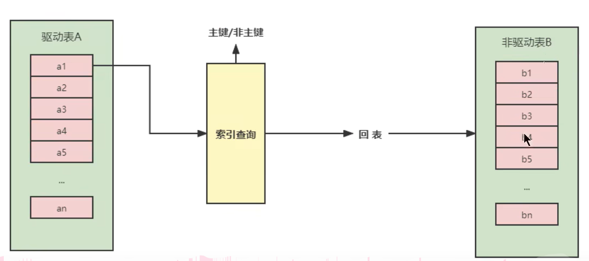

+ 该算法是对SNLJ算法的改进，就是选择有索引的表作为被联动表，在每次匹配时，先去索引中进行匹配，如果匹配到再进行回表
+ 由于使用了索引，因此效率有所提高

+ 该算法也是对SNLJ算法的改进，它不再一个一个的读取驱动表内的数据，而是划分出一块内存区域，批量的将一批驱动表内的数据读入到该内存块中，然后遍历被驱动表，把这一批的数据都与被驱动表的每一行数据进行匹配，这样可以达到**一次遍历被驱动表，使得有多条驱动表内的数据匹配完成**
+ 需要注意到，该算法的执行需要MySQL划分出一个单独的内存块，我们可以手动指定该内存块的大小（默认为256Kb）:
  + 32位系统最高设置到4Gb,64位系统可以继续提高（Windows系统例外，它的上限依旧是4Gb）

~~~sql
  -- 查看优化器的行为配置，其中的block_nested_loop状态表示是否支持MySQL为表连接开辟内存块
  show variables like '%optimizer_switch%';
  -- 查看当前MySQL能够为多表连接开辟多大的内存块大小
  show variables like '%join_buffer_size%';
~~~

|算法|变量A|变量B|联动表扫描次数|被联动表扫描次数|读取数据次数|数据比较次数|回表读取记录数|
|:---:|:---:|:---:|:---:|:---:|:---:|:---:|:---:|
|SNLJ|表A（假设为联动表）的数据总量|表B的数据总量|1|A|A+A*B（这个读取记录数相当于联动表的读取记录数+被联动表匹配的读取记录数）|B*A|0|
|INLJ|表A内的数据总量|表A的所有数据所匹配到的表B数据的总量，就是**表B满足连接条件的数据总量**|1|0|A+B|A*索引树高度|B|
|BNLJ|表A内的数据总量|表B满足连接条件的数据总量|1|ceil(A*每行的数据大小/缓冲块大小)|A+B|A*B表的数据总量|B|

+ 三个算法具体的效率对比:INLJ>BNLJ>SNLJ
+ 另外,Hash join算法在小表连接上性能可能没有上面的一些算法高，但是在大数据表的连接上，它的性能非常优秀

|比较字段|Nested Loop Join|Hash Join|
|:---:|:---:|:---:|
|使用条件|任何条件|等值连接|
|相关资源|CPU、磁盘I/O|内存、临时空间|
|特点|当有高选择性索引或进行限制性搜索时效率较高，能够快速返回第一次的搜索结果|当缺乏索引或索引条件模糊时，Hash Join比Nested Loop有效，在数据仓库环境下，如果表的记录数较多，效率高|
|缺点|当索引丢失或索引条件限制不够时，效率很低。当表的记录数多时，效率也低|建立哈希表需要大量的内存空间占用，第一次结果的返回较慢|

+ 结论:
> + 使用join语句，性能比强行拆成多个单表执行SQL语句的性能要好
> + 如果使用join语句的话，需要让小表做驱动表，**准确的说，是小结果集驱动大结果集**,其小的度量单位是`表的数据总量*每行的大小`
> + 我们应该为被驱动表匹配的条件增加索引
> + 尽量增加join_buffer_size的大小
> + 减少驱动表不必要的字段查询

---

#### ③子查询优化

+ MySQL从4.1版本开始支持子查询操作，但是子查询的效率并不是很高,原因如下:
  + 执行子查询时，MySQL需要为内层查询语句的查询结果建立一个临时表，然后外层查询语句从临时表中查询记录。查询完毕后，再撤销这些临时表。这样会消耗过多的CPU和IO资源，产生大量的慢查询。
  + 子查询的结果集存储的临时表，不论是内存临时表还是磁盘临时表都不会存在索引，所以查询性能会受到一定的影响。
+ 在MySQL中，应该尽量使用JOIN来替代子查询，这可以避免让MySQL生成临时表耗费资源，而且可以提高速度
+ 尽量不要使用NOT IN或者NOT EXISTS，用LEFT JOIN xxx ON xx WHERE xx IS NULL替代

---

#### ④排序优化

+ 首先明确一件事情，**索引默认是升序排序的**
+ ORDER BY子句也支持使用索引，下面是一些排序的优化建议:
  + **尽量让ORDER BY子句用上索引**，如果WHERE和ORDER BY后面是相同的字段，那就用单行索引，如果不是就用联合索引
  + **没办法使用索引时，就要对FileSort方法进行调优**了
  + **减少使用ORDER BY**,能不排序就不排，或者放到程序段去做
  + 包含了order by、group by、distinct这些查询的语句，**where条件过滤出来的结果集请保持在1000行以内，否则SQL会很慢**
+ 优化器对排序使用索引，思路比较奇特
  + 在不使用LIMIT语句的情况下，一般它不会用索引
  + 使用了LIMIT可能就会用
  + 如果ORDER BY中的字段不满足最佳左前缀原则，一样不会使用索引
  + 如果WHERE和ORDER BY一起出现，一般情况下
+ 当优化器未使用索引时，他会使用FileSort进行排序，这是一种低效的排序方式，虽然它在某些情况下比索引效率高，但是大部分情况下，**我们需要尽量避免优化器选择这种方式**
  + MySQL4.1之前使用的是双路排序，他需要扫描两次磁盘，最终得到数据。它的IO方式是随机IO的。
  + MySQL4.1之后，它引入了单路排序，这种排序方式仅需要扫描一次磁盘就能排好序。它的效率快一些，但是会占用更多的内存空间。它的IO方式是顺序IO的
+ 针对FileSort，优化方式如下:
  + 尝试提高sort_buffer_size:不管使用什么算法，提高该值都会提高排序效率。因为该参数是针对每个进程设置的。它的值需要保持在1-8Mb
  + 尝试提高max_length_for_sort_data:如果设置的太高，数据总量超过sort_buffer_size的概率就会增大，最终会导致IO活动频繁且处理器使用率降低。**如果需要返回的列的总长度大于该值，那么使用双路算法，否则使用单路算法**。它的值需要保持在1-8Mb
  + 避免使用select *，最好只选择想得到的字段

~~~sql
  show variables like '%sort_buffer_size%';
  show variables like '%max_length_for_sort_data%';
~~~

---

#### ⑤GROUP BY优化与LIMIT优化

+ GROUP BY使用索引的原则几乎与ORDER BY一致
  + group by 即使没有过滤条件用到索引，也可以直接使用索引
  + GROUP BY需要先排序再分组，也需要遵守最佳左前缀原则
  + 无法使用索引列时，推荐提高sort_buffer_size和max_length_for_sort_data
  + WHERE的效率比HAVING高，过滤条件应尽可能地写在WHERE中
+ 分页查询优化思路
  + 在索引上完成排序分页操作，最后根据主键关联回原表查询所需要的其他列内容
    + `EXPLAIN SELECT * FROM student t,(SELECT id FROM student ORDER BY id LIMIT 2000000,10)aWHERE t.id = a.id;`
  + 该方案适用于主键自增的表，可以把Limit 查询转换成某个位置的查询
    + `EXPLAIN SELECT * FROM student WHERE id > 2000000 LIMIT 10;`

---

#### ⑥索引覆盖

+ **一个索引包含了满足查询结果的数据就叫做覆盖索引**，或者说，**该索引包含的字段正好是覆盖查询条件中所涉及的字段**
+ 优化器该情况下会认为索引覆盖的情况成本较低，因此他会优先选择具备索引覆盖的索引
+ 索引覆盖有很明显的好处:
  + **避免Innodb表进行索引的二次查询**
  + **可以把随机IO变成顺序IO加快查询效率**
+ 弊端:
  + 索引字段的维护 总是有代价的。因此，在建立冗余索引来支持覆盖索引时就需要权衡考虑了。这是业务DBA，或者称为业务数据架构师的工作

---

#### ⑦索引下推

+ 索引下推是MySQL5.6的新特性，是一种在存储引擎层使用索引过滤数据的一种优化方式。**它可以减少存储引擎访问基表的次数以及MySQL服务器访问存储引擎的次数**
+ 索引下推，就是在数据过滤时，寻找包含尽可能多的条件字段且成本低的索引，然后在过滤时，通过索引尽可能多的进行相关字段的条件过滤，就是寻找条件字段中的属于索引字段中的字段相关条件，然后进行条件过滤。在使用这些字段相关的条件过滤掉数据之后，再去回表进行查找
  + 下面是索引下推的示例
    + (name,age)表是索引表
    + 那个主键索引是聚簇索引
    + 可以看到，在判断完name和age字段的条件之后，MySQL才去聚簇索引中去进行第三个条件的判断，而在以前，每判断一个条件，就要去聚簇索引中判断下一个条件了
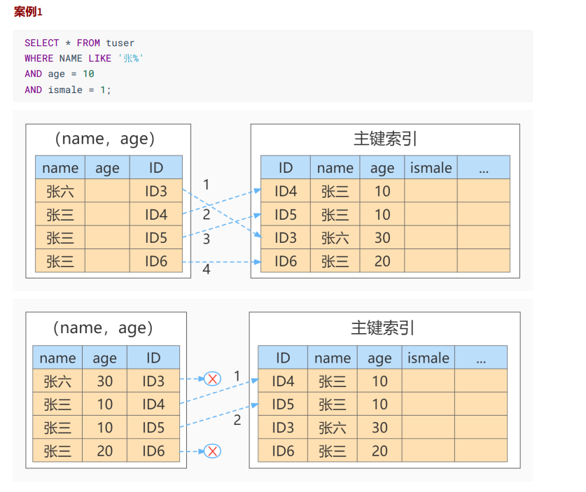

  + 索引下推可以极大的提高效率，并减少IO
+ 索引下推并不是什么情况下都可以用的，他有明确的使用条件:
  + 只能用于二级索引
  + explain显示的执行计划中type值（join类型）为range、ref、eq_ref或者ref_or_null
  + 并非全部where条件都可以用ICP筛选，如果where条件的字段不在索引列中，还是要读取整表的记录到server端做where过滤。
  + ICP可以用于MyISAM和InnnoDB存储引擎
  + MySQL5.6版本的不支持分区表的ICP功能，5.7版本的开始支持
  + 当SQL使用覆盖索引时，不支持ICP优化方法。

---

#### ⑧前缀索引

+ MySQL是支持前缀索引的。默认地，如果你创建索引的语句不指定前缀长度，那么索引就会包含整个字符串

~~~sql
  mysql> alter table teacher add index index1(email);
  -- 或
  mysql> alter table teacher add index index2(email(6));
~~~

+ 下面是这俩索引的示例图:

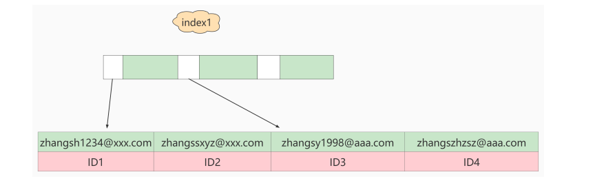
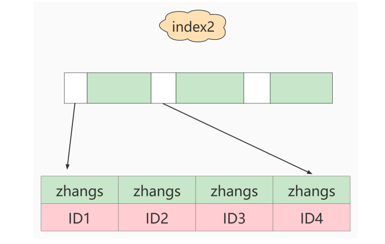

+ 如果使用的是index1（即email整个字符串的索引结构），执行顺序是这样的：
  1. 从index1索引树找到满足索引值是’ zhangssxyz@xxx.com ’的这条记录，取得ID2的值；
  2. 到主键上查到主键值是ID2的行，判断email的值是正确的，将这行记录加入结果集；
  3. 取index1索引树上刚刚查到的位置的下一条记录，发现已经不满足email=' zhangssxyz@xxx.com ’的条件了，循环结束。这个过程中，只需要回主键索引取一次数据，所以系统认为只扫描了一行。
+ 如果使用的是index2（即email(6)索引结构），执行顺序是这样的：
  1. 从index2索引树找到满足索引值是’zhangs’的记录，找到的第一个是ID1；
  2. 到主键上查到主键值是ID1的行，判断出email的值不是’ zhangssxyz@xxx.com ’，这行记录丢弃；
  3. 取index2上刚刚查到的位置的下一条记录，发现仍然是’zhangs’，取出ID2，再到ID索引上取整行然后判断，这次值对了，将这行记录加入结果集；
  4. 重复上一步，直到在idxe2上取到的值不是’zhangs’时，循环结束。
+ 也就是说**使用前缀索引，定义好长度，就可以做到既节省空间，又不用额外增加太多的查询成本**。前面已经讲过区分度，区分度越高越好。因为区分度越高，意味着重复的键值越少
+ 但是，**前缀索引索然能够提升性能，但是就无法使用索引覆盖这一特性了**

---

#### ⑨普通索引与唯一索引

+ 为了说明普通索引和唯一索引对更新语句性能的影响这个问题，介绍一下change buffer。
  + 当需要更新一个数据页时，如果数据页在内存中就直接更新，而如果这个数据页还没有在内存中的话，在不影响数据一致性的前提下， InooDB会将这些更新操作缓存在change buffer中 ，这样就不需要从磁盘中读入这个数据页了。在下次查询需要访问这个数据页的时候，将数据页读入内存，然后执行changebuffer中与这个页有关的操作。通过这种方式就能保证这个数据逻辑的正确性。
  + 将change buffer中的操作应用到原数据页，得到最新结果的过程称为merge。除了访问这个数据页会触发merge外，系统有后台线程会定期merge。在数据库正常关闭（shutdown）的过程中，也会执行merge操作。
  + 如果能够将更新操作先记录在change buffer，减少读磁盘，语句的执行速度会得到明显的提升。而且，数据读入内存是需要占用bufferpool的，所以这种方式还能够避免占用内存，提高内存利用率。唯一索引的更新就不能使用change buffer ，实际上也只有普通索引可以使用。
+ 说了这么多，意思就是**普通索引相对于唯一索引的优势就是更新索引的速度快**，而**唯一索引对于普通索引的优势就是这个索引的字段值是唯一的**。而在查询效率上来看，二者没什么区别
+ 因此使用场景为:
  + 建议尽量选择普通索引，因为性能较高
  + 上面的前提是业务能够确保不会写入重复数据，如果无法确保，就需要**以业务正确性优先**
  + 另外，在一些归档库中，可以考虑使用唯一索引
    + 比如，线上数据只需要保留半年，然后历史数据保存在归档库。这时候，归档数据已经是确保没有唯一键冲突了。要提高归档效率，可以考虑把表里面的唯一索引改成普通索引

---

#### ⑩其它优化策略

+ EXESTS与IN的区分:
  + 当驱动表的结果集比被驱动表的结果集小时，使用EXISTS
  + 否则，使用IN
+ COUNT(*)与COUNT(具体字段)效率
  + COUNT(1)和COUNT(*)都是对所有行进行统计，理论上是没有什么区别的，而**COUNT(字段)不会统计此字段是NULL的行**
  + 对于MyISAM引擎来说，COUNT(1)和COUNT(*)很快，因为MyISAM引擎维护了一个row_count值，会记录每张表的数据量。
  + 而对于InnoDB引擎来说，它不会记录每张表的数据量。它如果碰到这种情况，会扫描全表，采取循环+统计的方式进行统计。**推荐优先使用key_len小的二级索引**。因为如果使用聚簇索引，也就是用主键，聚簇索引包含的是全部的数据集，比二级索引占用比较多，统计效率会变低。如果是COUNT(*)或者COUNT(1)，系统会自动找占用空间更小的二级索引进行统计。如果有多个二级索引，选择key_len最小的哪一个
+ 关于SELECT(*)
  + **建议明确字段，不要使用*作为查询的字段列表，推荐使用SELECT<字段列表>查询**，原因:
    + MySQL在**解析的过程中，会通过查询数据字典将`"*"`按序转换成所有列名，这会大大的耗费资源和时间**。
    + **无法使用索引覆盖**
+ LIMIT 1对优化的影响
  + **针对的是会扫描全表的SQL语句**，如果可以确定结果集只有一条，那么加上LIMIT 1的时候，当找到一条结果的时候就不会继续扫描了，这样会加快查询速度
  + 如果数据表已经对字段建立了唯一索引，那么可以通过索引进行查询，**不会全表扫描的话，就不需要加上LIMIT 1了**
+ 多使用COMMIT
  + COMMIT可以释放资源，提高效率，它释放的资源有:
    + 回滚段上用于恢复数据的信息
    + 被程序语句获得的锁
    + redo/undo log buffer中的空间
    + 管理上述3种资源中的内部花费

---

### （三）其他调优措施

+ 我们调优的目标是:
  + 尽量的节省系统资源，**以便系统提供更大负荷的服务**
  + 合理进行结构设计和参数调整，以**提高用户操作响应的速度**
  + 减少系统的瓶颈，**提高MySQL数据库整体的性能**

#### ①定位调优问题

+ 我们定位调优的方向会随着应用程序复杂度的提升，我们很难使用“更快”去定义数据库调优的目标了，因为不同的用户在不同情况下，或不同时间段遇到的问题不同。因此我们需要更加精细的去定位问题，一般我们有下面一些方式来定位调优目标:
  + **用户反馈**:用户反馈肯定是最直接的，也是主要的。而且我们开发的程序也是为用户服务的，应该重视用户的反馈，找到和数据相关的问题
  + **日志分析**:通过针对数据库运行日志进行查看，来找到异常情况，也是主要定位调优的渠道之一
  + **服务器资源使用监控**:通过监控服务器IO、CPU、内存等使用情况，来了解服务器的性能使用，找到问题所在
  + **服务器内部状况监控**:在服务器的监控中，活动会话(Active Session)监控是一个重要的指标，通过它，我们可以了解到数据库的繁忙状态，是否存在SQL堆积等
  + 其它:我们还可以对事务、锁等进行监控，这些都可以帮助我们监听数据库的运行状态

---

#### ②调优步骤

1. 选择合适的DBMS:就是根据业务需求，找合适的DBMS
2. 优化表设计:表结构尽量遵循第三范式要求，如果查询效率低下，或者查询应用较多，可以考虑使用反范式进行优化。另外，尽量的优化表字段的数据类型
3. 优化逻辑查询:见上面的[索引优化](#indexOptimize)
4. 优化物理查询:见上面的[索引优化](#indexOptimize)
5. 使用Redis或Memcached作为缓存:除对SQL本身进行优化外，还可以请外援提升查询效率
6. 进行库级优化:可以采用读写分离、分库分表等。但**在提升性能的同时，也会增加维护和使用成本**

---

#### ③数据库整体优化

+ 优化MySQL服务器一般从两个方面来优化:
  + 对硬件优化
  + 对MySQL服务参数进行优化

##### Ⅰ优化硬件

+ 服务器的硬件性能直接决定着MySQL数据库的性能。硬件的性能瓶颈直接决定MySQL数据库的运行速度和效率。针对性能瓶颈提高硬件配置，可以提高MySQL数据库查询、更新的速度:
  +  配置较大的内存:内存越大，MySQL性能越强
  +  配置高速磁盘系统:磁盘转的快可以减少IO时间，减少读盘等待时间，提高响应速度
  +  合理分布磁盘I/O:把磁盘IO分布在多个设备上，减少资源竞争，提高并行操作能力
  +  配置多处理器:MySQL支持多线程，给它整点多线程处理器

---

##### Ⅱ优化参数配置

+ `innodb_buffer_pool_size`：这个参数是Mysql数据库最重要的参数之一，表示**InnoDB类型的表和索引的最大缓存**。它不仅仅缓存索引数据 ，还会缓存表的数据。这个值越大，查询的速度就会越快。但是这个值太大会影响操作系统的性能。
+ `key_buffer_size`：表示**索引缓冲区的大小**。索引缓冲区是所有的线程共享。增加索引缓冲区可以得到更好处理的索引（对所有读和多重写）。当然，这个值不是越大越好，它的大小取决于内存的大小。如果这个值太大，就会导致操作系统频繁换页，也会降低系统性能。对于内存在4GB左右的服务器该参数可设置为256M或384M。
+ `table_cache`：表示同时打开的表的个数。这个值越大，能够同时打开的表的个数越多。物理内存越大，设置就越大。默认为2402，调到512-1024最佳。这个值不是越大越好，因为同时打开的表太多会影响操作系统的性能。
+ `query_cache_size`：表示**查询缓冲区的大小**。可以通过在MySQL控制台观察，如果Qcache_lowmem_prunes的值非常大，则表明经常出现缓冲不够的情况，就要增加Query_cache_size的值；如果Qcache_hits的值非常大，则表明查询缓冲使用非常频繁，如果该值较小反而会影响效率，那么可以考虑不用查询缓存Qcache_free_blocks，如果该值非常大，则表明缓冲区中碎片很多。MySQL8.0之后失效。该参数需要和query_cache_type配合使用。
+ `query_cache_type` 的值是0时，所有的查询都不使用查询缓存区。但是query_cache_type=0并不会导致MySQL释放query_cache_size所配置的缓存区内存。
  + 当query_cache_type=1时，所有的查询都将使用查询缓存区，除非在查询语句中指定SQL_NO_CACHE ，如SELECT SQL_NO_CACHE * FROM tbl_name。
  + 当query_cache_type=2时，只有在查询语句中使用 SQL_CACHE 关键字，查询才会使用查询缓存区。使用查询缓存区可以提高查询的速度，这种方式只适用于修改操作少且经常执行相同的查询操作的情况。
+ `sort_buffer_size` ：表示**每个需要进行排序的线程分配的缓冲区的大小**。增加这个参数的值可以提高 ORDER BY 或 GROUP BY 操作的速度。默认数值是2 097 144字节（约2MB）。对于内存在4GB左右的服务器推荐设置为6-8M，如果有100个连接，那么实际分配的总共排序缓冲区大小为100 × 6＝ 600MB。
+ `join_buffer_size` = 8M ：表示 联合查询操作所能使用的缓冲区大小 ，和sort_buffer_size一样，该参数对应的分配内存也是每个连接独享。
+ `read_buffer_size` ：表示 每个线程连续扫描时为扫描的每个表分配的缓冲区的大小（字节）。当线程从表中连续读取记录时需要用到这个缓冲区。SET SESSION read_buffer_size=n可以临时设置该参数的值。默认为64K，可以设置为4M。
+ `innodb_flush_log_at_trx_commit`：表示**何时将缓冲区的数据写入日志文件**，并且将日志文件写入磁盘中。该参数对于innoDB引擎非常重要。该参数有3个值，分别为0、1和2。该参数的默认值为1。
  + 值为 0 时，表示 每秒1次的频率将数据写入日志文件并将日志文件写入磁盘。每个事务的commit并不会触发前面的任何操作。该模式速度最快，但不太安全，mysqld进程的崩溃会导致上一秒钟所有事务数据的丢失。
  + 值为 1 时，表示 每次提交事务时将数据写入日志文件并将日志文件写入磁盘进行同步。该模式是最安全的，但也是最慢的一种方式。因为每次事务提交或事务外的指令都需要把日志写入（flush）硬盘。
  + 值为 2 时，表示 每次提交事务时将数据写入日志文件， 每隔1秒 将日志文件写入磁盘。该模式速度较快，也比0安全，只有在操作系统崩溃或者系统断电的情况下，上一秒钟所有事务数据才可能丢失。
+ `innodb_log_buffer_size`：这是**InnoDB存储引擎的事务日志所使用的缓冲区** 。为了提高性能，也是先将信息写入 Innodb Log Buffer中，当满足 innodb_flush_log_trx_commit 参数所设置的相应条件（或者日志缓冲区写满）之后，才会将日志写到文件（或者同步到磁盘）中。
+ `max_connections`：表示**允许连接到MySQL数据库的最大数量** ，默认值是 151。如果状态变量connection_errors_max_connections不为零，并且一直增长，则说明不断有连接请求因数据库连接数已达到允许最大值而失败，这是可以考虑增大max_connections 的值。在Linux 平台下，性能好的服务器，支持500-1000个连接不是难事，需要根据服务器性能进行评估设定。这个连接数 不是越大越好 ，因为这些连接会浪费内存的资源。过多的连接可能会导致MySQL服务器僵死。
+ `back_log`：用于**控制MySQL监听TCP端口时设置的积压请求栈大小**。如果MySql的连接数达到max_connections时，新来的请求将会被存在堆栈中，以等待某一连接释放资源，该堆栈的数量即back_log，如果等待连接的数量超过back_log，将不被授予连接资源，将会报错。5.6.6 版本之前默认值为 50 ， 之后的版本默认为 50 + （max_connections / 5）， 对于Linux系统推荐设置为小于512的整数，但最大不超过900。如果需要数据库在较短的时间内处理大量连接请求， 可以考虑适当增大back_log 的值。
+ `thread_cache_size` ：**线程池缓存线程数量的大小** ，当客户端断开连接后将当前线程缓存起来，当在接到新的连接请求时快速响应无需创建新的线程 。这尤其对那些使用短连接的应用程序来说可以极大的提高创建连接的效率。那么为了提高性能可以增大该参数的值。默认为60，可以设置为120。
  + 可以通过如下几个MySQL状态值来适当调整线程池的大小：

~~~sql
  show global status like 'Thread%';
  +-------------------+-------+
  | Variable_name | Value |
  +-------------------+-------+
  | Threads_cached | 2 |
  | Threads_connected | 1 |
  | Threads_created | 3 |
  | Threads_running | 2 |
  +-------------------+-------+
  4 rows in set (0.01 sec)
~~~

  + 当 Threads_cached 越来越少，但 Threads_connected 始终不降，且 Threads_created 持续升高，可适当增加 thread_cache_size 的大小
+ `wait_timeout` ：指定 一个请求的最大连接时间 ，对于4GB左右内存的服务器可以设置为5-10。
+ `interactive_timeout` ：表示服务器在关闭连接前等待行动的秒数
+ 此处给出一份my.cnf的参考配置:

~~~sql
[mysqld]
port = 3306 
serverid = 1 
socket = /tmp/mysql.sock 
skip-locking -- 避免MySQL的外部锁定，减少出错几率增强稳定性。 
-- 禁止MySQL对外部连接进行DNS解析，使用这一选项可以消除MySQL进行DNS解析的时间。但需要注意，如果开启该选项，则所有远程主机连接授权都要使用IP地址方式，否则MySQL将无法正常处理连接请求！ 
skip-name-resolve 
back_log = 384
key_buffer_size = 256M 
max_allowed_packet = 4M 
thread_stack = 256K
table_cache = 128K 
sort_buffer_size = 6M 
read_buffer_size = 4M
read_rnd_buffer_size=16M 
join_buffer_size = 8M 
myisam_sort_buffer_size =64M 
table_cache = 512 
thread_cache_size = 64 
query_cache_size = 64M
tmp_table_size = 256M 
max_connections = 768 
max_connect_errors = 10000000
wait_timeout = 10 
thread_concurrency = 8 --该参数取值为服务器逻辑CPU数量*2，在本例中，服务器有2颗物理CPU，而每颗物理CPU又支持H.T超线程，所以实际取值为4*2=8
-- 开启该选项可以彻底关闭MySQL的TCP/IP连接方式，如果WEB服务器是以远程连接的方式访问MySQL数据库服务器则不要开启该选项！否则将无法正常连接！ 
skip-networking 
table_cache=1024
-- 默认为2M
innodb_additional_mem_pool_size=4M 
innodb_flush_log_at_trx_commit=1
-- 默认为1M
innodb_log_buffer_size=2M  
-- 你的服务器CPU，有几个就设置为几。建议用默认一般为8 tmp_table_size=64M #默认为16M，调到64-256最挂
innodb_thread_concurrency=8 
thread_cache_size=120 
query_cache_size=32M

~~~

---

#### ④数据库结构优化

+ **拆分表-冷热数据分离**:如果一个表内存在多个字段，有些字段总是被访问，有些字段几乎都没有被访问到，此时可以将这些不常用的字段分解出另一个表
+ **增加中间表**:如果两个有关联的表经常进行连接，且连接查询的字段都是那一批字段，可以将这些字段抽取出来，创建一个新表，这样下次查询时直接在新表中查询了
+ 增加冗余字段:见[反范式化](#antiNF)
+ 优化数据类型
  + **对整数类型数据进行优化**:非负型数据建议使用UNSIGNED进行修饰，一般整型建议用int，因为INT型数据有足够大的取值范围，不用担心数据超出取值范围的问题
  + **既可以使用文本类型也可以使用整数类型的字段，要选择使用整数类型**：跟文本类型数据相比，大整数往往占用更少的存储空间
  + **避免使用TEXT、BLOB数据类型**:MySQL在排序TEXT、BLOB这种数据时，无法使用内存临时表，要使用磁盘临时表进行排序，且对此类数据还是要进行二次查询。效率极低。如果一定要用，建议把BLOB或TEXT放到单独的拓展表中，查询时不要使用`select *`，不需要TEXT列的数据时，不要对该列进行查询
  + **避免使用ENUM类型**:修改ENUM类型需要`ALTER TABLE`，ENUM类型的ORDER BY操作效率低，需要额外操作，推荐使用TINYINT替代
  + **使用TIMESTAMP存储时间**:TIMESTAMP占用四个字节，比DATETIME占用的8个字节少，同时TIMESTAMP具有自动赋值与自动更新的特性
  + **用DECIMAL代替FLOAT和DOUBLE存储精确浮点数**:DECIMAL是精确浮点数，FLOAT与DOUBLE存在精度误差
+ **优化插入记录的速度**:
  + 对MyISAM表:
    + 禁用索引
    + 禁用唯一性检查
    + 使用批量插入
    + 使用LOAD DATA INFILE 批量导入
  + 对InnoDB表:
    + 禁用唯一性检查
    + 禁用外键检查
    + 禁止自动提交
+ **尽量使用非空约束**:防止NULL值影响操作
+ **分析表、检查表与优化表**:
  + 分析表:即使用analyze进行表的分析，具体的格式为:`ANALYZE [LOCAL | NO_WRITE_TO_BINLOG] TABLE 表名[,表名]`。
    + 默认的，MySQL服务会将ANALYZE TABLE语句写到binlog中，以便在主从架构中，从服务能够同步数据。可以添加参数LOCAL或者NO_WRITE_TO_BINLOG取消将语句写到binlog中
    + 使用ANALYZE时，**数据库系统会对表加一个只读锁**，使在分析期间无法对表中的字段进行更新和删除操作。
    + ANALYZE TABLE语句能够分析InnoDB和MyISAM类型的表，但是不能作用于视图
    + ANALYZE TABLE分析后的统计结果会反应到 索引的cardinality 的值（使用`show index from 表名`查看），该值统计了表中某一键所在的列不重复的值的个数。**该值越接近表中的总行数，则在表连接查询或者索引查询时，就越优先被优化器选择使用**
    + ANALYZE TABLE语句可以更新MySQL当下没来得及更新的一些值，使其值与当前状态吻合
  + 检查表:使用CHECK TABLE语句来检查表,具体格式为`CHECK TABLE 表名 [, 表名] ... [option] ...option = {QUICK | FAST | MEDIUM | EXTENDED | CHANGED}`
    + CHECK TABLE语句能够检查InnoDB和MyISAM类型的表是否存在错误。**CHECK TABLE语句在执行过程中也会给表加上只读锁**
    + option参数有5个取值，分别是
      + `QUICK`:不扫描行，不检查错误的连接
      + `FAST`:只检查没有被正确关闭的表
      + `CHANGED`:只检查上次检查后被更改的表和没有被正确关闭的表
      + `MEDIUM`:扫描行，以验证被删除的连接是有效的。也可以计算各行的关键字校验和，并使用计算出的校验和验证这一点
      + `EXTENDED`:对每行的所有关键字进行一个全面的关键字查找。这可以确保表是100%一致的，但是花的时间较长
    + **option只对MyISAM类型的表有效，对InnoDB类型的表无效**
    + 该语句对于检查的表可能会产生多行信息。最后一行有一个状态的 Msg_type 值，Msg_text 通常为 OK。如果得到的不是 OK，通常要对其进行修复。是 OK 说明表已经是最新的了。表已经是最新的，意味着存储引擎对这张表不必进行检查
  + 优化表:可以使用`OPTIMIZE [LOCAL | NO_WRITE_TO_BINLOG] TABLE 表名 [, 表名]`来进行表的优化
    + LOCAL和NO_WRITE_TO_BINLOG关键字的意义和分析表相同，都是指定不写入二进制日志。
    + **OPTILMIZE TABLE语句只能优化表中的VARCHAR、BLOB或TEXT类型的字段**
    + OPTIMIZE TABLE语句对InnoDB和MyISAM类型的表都有效。**该语句在执行过程中也会给表加上只读锁**
    + 针对InnoDB引擎的表进行优化时，Msg_text字段可能显示`‘numysql.SYS_APP_USER’, ‘optimize’, ‘note’, ‘Table does not support optimize, doing recreate +analyze instead’`。不过**InnoDB确实支持优化功能，这个表确实也被优化了**
    + 在MyISAM中，是先分析这张表，然后会整理相关的MySQL datafile，之后回收未使用的空间
    + 在InnoDB中，回收空间是简单通过Alter table进行整理空间。在优化期间，MySQL会创建一个临时表，优化完成之后会删除原始表，然后会将临时表rename成为原始表
    + 在多数的设置中，根本不需要运行OPTIMIZE TABLE。即使对可变长度的行进行了大量的更新，也不需要经常运行， 每周一次 或 每月一次 即可，并且只需要对 特定的表运行

---

#### ⑤大表优化

+ **限定查询范围**:禁止不带任何限制数据范围条件的查询语句。比如：我们当用户在查询订单历史的时候，我们可以控制在一个月的范围内；
+ 读写分离:经典的数据库拆分方案，主库负责写，从库负责读

+ **垂直拆分**:当数据量级达到千万级以上时，有时候我们需要把一个数据库切成多份，放到不同的数据库服务器上，减少对单一数据库服务器的访问压力
  + 垂直拆分的优点： 可以使得列数据变小，在查询时减少读取的Block数，减少I/O次数。此外，垂直分区可以简化表的结构，易于维护
  + 垂直拆分的缺点： 主键会出现冗余，需要管理冗余列，并会引起 JOIN 操作。此外，垂直拆分会让事务变得更加复杂

+ **水平拆分**:当某个表的数据量过大时，我们可以按某种分类规则将该表分成结构相同的小表，如按照年份划分，把2010、2011、2012等每年的数据放到对应年份的表中去。但**水平分表只是解决了单一表数据量过大的问题，对于MySQL并发能力没什么意义。因此水平拆分最好分库**
  + 客户端代理： 分片逻辑在应用端，封装在jar包中，通过修改或者封装JDBC层来实现。 当当网的Sharding-JDBC 、阿里的TDDL是两种比较常用的实现
  + 中间件代理： 在应用和数据中间加了一个代理层。分片逻辑统一维护在中间件服务中。我们现在谈的 Mycat 、360的Atlas、网易的DDB等等都是这种架构的实现

---

#### ⑥其它策略

+ 说是其他策略，其实是MySQL8.0之后新增的可以用来优化的新特性:
  + 服务器语句超时处理:在MySQL 8.0中可以设置`MAX_EXECUTION_TIME`来配置服务器语句超时的限制，它用来规定当执行语句超时时，服务器将终止查询影响不大的事务或连接，然后将错误报给客户端
    + 例:`SET GLOBAL MAX_EXECUTION_TIME=2000;`、`SET SESSION MAX_EXECUTION_TIME=2000;`。一个设置全局的，一个设置当前会话的
  + 创建全局通用表空间:MySQL8.0支持使用`CREATE TABLESPACE`来创建一个全局通用表空间。
    + 全局表空间可以被所有的数据库表共享，且相对于独享表空间，使用手动创建共享表空间可以节约元数据方面的内存。
    + 可以在创建表的时候，指定属于哪个表空间，也可以对已有的表进行表空间的修改
    + SQL语句如下:

~~~sql

  create tablespace 共享表空间名 add datafile '共享表空间底层的文件名称(InnoDB引擎以idb作为后缀)' file_block_size=空间大小
  -- 创建名为atguigu的共享表空间
  create tablespace atguigu add datafile 'atguigu.idb' file_block_size=16k;
  -- 为表指定表空间
  create table .... tablespace 表空间名
  -- 通过修改表来指定表空间
  alter table 表名 tablespace 表空间名
  -- 删除表空间
    -- 如果有表在使用表空间，需要先删除表，或者为该表指定其他表空间，才能删除该表空间
  drop tablespace 表空间名

~~~
  + MySQL8.0引进了隐藏索引（主键没办法被隐藏）和降序索引，对于性能调试非常有用

## 七、数据库设计规范

+ 我们在设计表的时候，需要考虑很多问题:
  + 用户需要什么数据
  + 如何设计表，怎么进行约束检查、如何保证数据的正确性
  + 如何降低数据表的数据冗余度
  + 如何让维护人员更方便的使用数据库
+ 而现实中，操蛋的数据库设计可能会导致如下后果:
  + 数据冗余、数据重复、存储空间浪费
  + 数据更新、插入、删除的异常
  + 无法正确表示信息或丢失有效信息
  + 程序性能差
+ 因此，在设计数据库的时候，我们就需要重视数据表的设计，为了建立冗余较小、结构合理的数据库，**设计数据库规范时必须遵守一定的规范**

### （一）前置名词

+ **范式**:在关系型数据库中，关于数据库表设计的基本原则、规则就成为范式
+ **元组**:就是表中的每一行
+ **超键**:能够唯一标识元组的属性集叫做超键
+ **候选键**:如果超键不包括多余的属性，那么称这个超键是候选键
+ **主键**:从候选键中任意选出一个来，称为主键
+ **外键**:依赖于另一个表的具有UNIQUE约束的键的键，就是之前的foreign key
+ **主属性**:包含在任一候选键中的属性称为主属性，即**它是候选键所有出现过的字段的集合**
+ **非主属性**:不是主属性的属性
+ 示例:
  + 球员表有`球员编号`、`姓名`、`身份证号`、`年龄`、`球队编号`这些字段
  + 球队表有`球队编号`、`主教练`、`球队所在地`
  + 超键可以是(球员编号)、(球员编号,姓名)、(身份证号,年龄)等，**它可以包含除主键之外的其它冗余字段，只要组成的集合能够唯一标识元组就行**
  + 候选键可以是:(球员编号)、(身份证号)，它不能包含除主键之外的其它冗余字段，因此**它是超键的子集**
  + 主键可以是(球员编号)或(身份证号)，“从候选键任意选一个”实际上是从候选键集合中选，从本例看，集合是`{(球员编号),(身份证号)}`
  + 外键是(球队编号)，没什么好说的
  + 主属性是`球员编号`、`身份证号`，非主属性是剩下那仨

---

### （二）范式

+ 范式(Normal Form)是**关系型数据库中，关于数据库表设计的基本原则、规则**，它可以分为:
  + 第一范式
  + 第二范式
  + 第三范式
  + 巴斯-科德范式/巴斯范式/BCNF范式
  + 第四范式
  + 第五范式
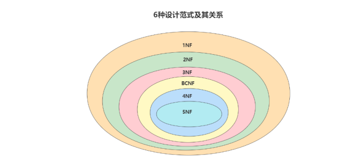

+ 这些范式，其设计越高阶，也就是**限制条件越严格，数据冗余度就越低，同时查询效率也越低**

#### ①第一范式

+ 第一范式确保每个字段的值必须具有原子性，即**数据表中每个字段的值为不可拆分的最小数据单元**
+ 例1:

+ 我们可以看到emp_mobile这个字段存在明显的冗余，需要进一步拆分:

+ 例2:

+ 可以看到上图的user_info字段明显冗余，需要拆分:

+ 例3:

+ 根据上图来看，我们需要依据我们的业务分析其地址字段是否要继续细分。
+ 也就是说，**属性的原子性是主观的**

---

#### ②第二范式

+ 第二范式在满足第一范式的前提下，还要**满足数据表里的每一条数据都是可唯一标识的。且所有的非主键字段，都必须完全依赖主键，不能只依赖主键的一部分**
  + 用人话说，就是我们不能只提供一部分主键，就能从表里找到对应的唯一数据，即使这些数据并不是全部的字段，只要它们是唯一的就不行。即**所有主键集合的真子集没有办法推导出任何对应的非当前主键字段**，或者说，部分主键可以推导出部分非主键，即**不满足第二范式需要寻找主键字段与非主键字段之间的关系**
+ 例:
  + 成绩表（学号，课程号，成绩）关系中，（学号，课程号）可以决定成绩，但是**学号不能决定成绩，课程号也不能决定成绩**，所以“（学号，课程号）→成绩”就是完全依赖关系
  + 又如比赛表player_game ，里面包含`球员编号`、`姓名`、`年龄`、`比赛编号`、`比赛时间`和`比赛场地`等属性
    + 其中`球员编号->(姓名,年龄)`,同时`比赛编号->(比赛时间,比赛场地)`,因此主键是`(球员编号,比赛编号)`。但它不满足第二范式，因为**其真子集可以推导出一部分非主属性**
    + 在不满足第二范式的情况下，它会出现如下问题:
      + **数据冗余**：如果一个球员可以参加 m 场比赛，那么球员的姓名和年龄就重复了 m-1 次。一个比赛也可能会有 n 个球员参加，比赛的时间和地点就重复了 n-1 次
      + **插入异常**：如果我们想要添加一场新的比赛，但是这时还没有确定参加的球员都有谁，那么就没法插入
      + **删除异常**：如果我要删除某个球员编号，如果没有单独保存比赛表的话，就会同时把比赛信息删除掉
      + **更新异常**：如果我们调整了某个比赛的时间，那么数据表中所有这个比赛的时间都需要进行调整，否则就会出现一场比赛时间不同的情况
    + 为了解决该问题，我们需要将该表拆成三张表:
      + 因为球员与比赛是多对多关系，因此需要再多分出一张表:

  + 再如下图
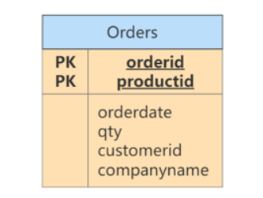
    + 违反了第二范式，可以仅通过orderid找到订单的 orderdate，以及customerid和companyname，而没有必要再去使用productid
    + 因此该表也应该进行拆分:
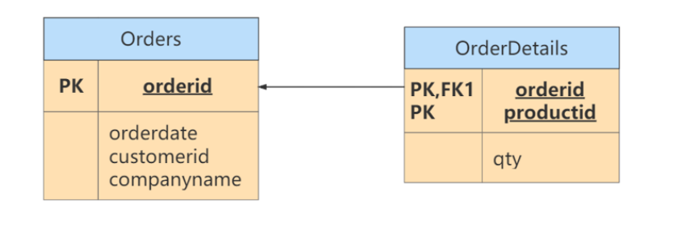

+ 1NF告诉我们字段属性需要是原子性的，而2NF告诉我们**一张表就是一个独立的对象**，一张表只表达一个意思

---

#### ③第三范式

+ 第三范式在第二范式的基础上，确保所有非主键字段都与主键直接相关，即要求数据表中的所有非主键字段都不能依赖于其它非主键字段
  + 设主键为A，一部分非主键字段为B，另一部分非主键字段为C，B+C=非主键字段
  + 用人话说就是需要满足A->B+C，而不是A->B->C。即**非主键字段与非主键字段之间不能有依赖关系，必须全都直接依赖于主键字段**，即**不满足第三范式需要寻找非主键字段与非主键字段之间的关系**
+ 例1:

  + 上图的category_name字段直接依赖于category_id字段，因此不满足第三范式的条件，需要将表拆分:

+ 例2:
  + 球员player表：`球员编号`、`姓名`、`球队名称`和`球队主教练`。现在，我们把属性之间的依赖关系画出来，如下图所示

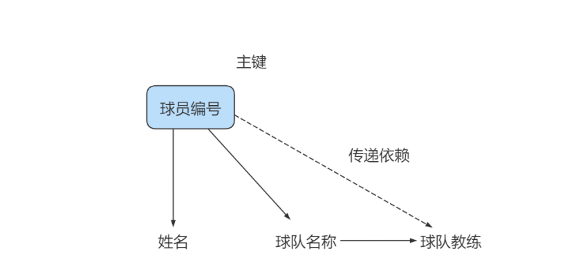

  + 一个教练可能在多个球队担任主教练，但是一个球队只能有一个主教练，因此通过球队名称可以推导出球队主教练，不符合第三范式的要求，需要拆表:

+ 例3:
  + 在第二范式样例的一个例子中，我们将一个表拆分成了两个表:

  + 但是由此看来，companyname字段是依赖于customerid字段的，因此它不满足第三范式，需要拆表:

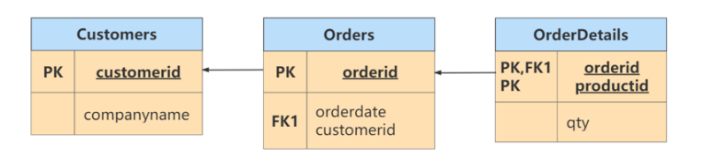

+ 符合3NF后的数据模型通俗地讲，2NF和3NF通常以这句话概括：“每个非键属性依赖于键，依赖于整个键，并且除了键别无他物”。

---

#### ④BCNF范式

+ 在第三范式的前提下，**该表仅一个候选键，或它的每个候选键都是单属性**，那我们就称该表满足BDNF范式，**不满足BCNF范式需要寻找主键字段与候选键字段之间的关系**
+ 我们根据下例进行分析:

+ 在上图中，该表是满足第一、二、三范式的。
  + 先分析其各个依赖关系:
    + 管理员与仓库名之间是一对一关系，因此候选键集合为`{(管理员,物品名),(仓库名,物品名)}`
    + 主属性集合:`{管理员,物品名,仓库名}`
    + 非主属性集合:`{数量}`
    + 首先，各字段满足原子性，不可再分，满足第一范式
    + 其次，物品名、管理员和仓库名（这是主属性集合的三个字段）均不能独立推导出其所在主键的非主键字段（这仨主属性集合来自于俩候选键集合元素，因此是“其所在主键”），因此满足第二范式
    + 最后，管理员与数量，或者仓库名与数量均不满足依赖关系（有两套主键，因此有两套非主键字段），因此满足第三范式
  + 从依赖关系可以分析出，这是满足第一、二、三范式的，但是，它依旧存在问题:
    + **插入异常**:增加一个仓库，但是还没有存放任何物品。根据数据表实体完整性的要求，主键不能有空值，因此会出现
    + **修改数据表中的多条记录**:如果仓库更换了管理员，我们就可能会被迫修改多条记录
    + **删除异常**:如果仓库里的商品都卖空了，那么此时仓库名称和相应的管理员名称也会随之被删除
  + 出现此问题的原因在于，主属性的字段相对于其候选键字段存在依赖关系，所以需要拆表:
    + 仓库表:(仓库名，管理员)
    + 库存表:(仓库名，物品名，数量)
  + 上面表的设计便满足了BCNF的规范
+ 再来看一个例子:

+ 上表中，学生ID和专业是联合主键，但是“专业”依赖于“导师”，且是一对一关系。因此它不满足BCNF范式，实际上，它的候选键集合有两个元素:`{(StudentId,Major),(StudentId,Advisor)}`
+ 因此，该表也需要进行拆分:

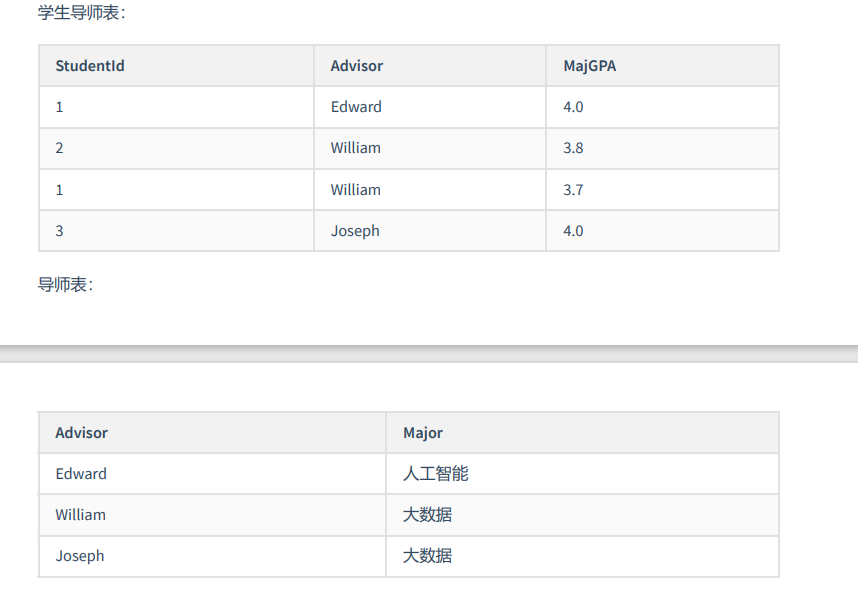

---

#### ⑤第四范式

+ 现在需要解释一下多值依赖的概念:
  + 多值依赖即属性之间的一对多关系，记为K->->A
  + 函数依赖实际上是单值依赖，所以不能表达属性值之间的一对多关系
  + 平凡的多值依赖:全集U=K+A,，一个K对应多个A，即K->->A。此时整个表就是一组一对多关系
  + 非平凡的多值依赖:全集U=K+A+B,一个K对应多个A，也对应多个B，即K->->A,K->->B，A与B相互独立，因此整个表出现了多组一对多关系。且“一”部分是相同的属性集合，“多”部分是互相独立的属性集合
+ 第四范式，就是消除非平凡的多值依赖（即把同一表内的多对多关系删除）
+ 举例1：职工表(职工编号，职工孩子姓名，职工选修课程)。
  + 在这个表中，同一个职工可能会有多个职工孩子姓名。同样，同一个职工也可能会有多个职工选修课程，即这里存在着多值事实，不符合第四范式。
  + 如果要符合第四范式，只需要将上表分为两个表，使它们只有一个多值事实，例如： 职工表一 (职工编号，职工孩子姓名)， 职工表二 (职工编号，职工选修课程)，两个表都只有一个多值事实，所以符合第四范式。
+ 举例2：
  + 比如我们建立课程、教师、教材的模型。我们规定，每门课程有对应的一组教师，每门课程也有对应的一组教材，一门课程使用的教材和教师没有关系。我们建立的关系表如下：
  + 课程ID，教师ID，教材ID；这三列作为联合主键。
  + 为了表述方便，我们用Name代替ID，这样更容易看懂:

  + 这个表除了主键，就没有其他字段了，所以肯定满足BC范式，但是却存在多值依赖导致的异常。假如我们下学期想采用一本新的英版高数教材，但是还没确定具体哪个老师来教，那么我们就无法在这个表中维护Course高数和Book英版高数教材的的关系。解决办法是我们把这个多值依赖的表拆解成2个表，分别建立关系。这是我们拆分后的表:

  + 以及:

---

#### ⑥第五范式、域键范式

+ 除了第四范式外，我们还有更高级的第五范式（又称完美范式）和域键范式（DKNF）。
+ 在满足第四范式（4NF）的基础上，消除不是由候选键所蕴含的连接依赖。**如果关系模式R中的每一个连接依赖均由R的候选键所隐含**，则称此关系模式符合第五范式。
+ 函数依赖是多值依赖的一种特殊的情况，而多值依赖实际上是连接依赖的一种特殊情况。但连接依赖不像函数依赖和多值依赖可以由 语义直接导出 ，而是在 关系连接运算 时才反映出来。存在连接依赖的关系模式仍可能遇到数据冗余及插入、修改、删除异常等问题。
+ 第五范式处理的是 无损连接问题 ，这个范式基本 没有实际意义 ，因为无损连接很少出现，而且难以察觉。而域键范式试图定义一个 终极范式 ，该范式考虑所有的依赖和约束类型，但是实用价值也是最小的，只存在理论研究中

---

### （三）反范式化

+ 数据规范与性能:
  + 范式虽然规范了我们的数据库表设计要求，但是有时，一些看似冗余的数据实际上对业务来说是十分重要的，因此我们要遵循业务优先的原则，首先满足业务要求，再减少冗余
  + 通过在表内插入计算列，方便查询
  + 通过在给定的表中添加额外的字段，以大量减少需要从中搜索信息所花费的时间
  + 为满足某些商业目标，数据库性能比数据规范化更加重要
+ 在上面的情况下，我们就得到了反范式化的原因
+ 例1:
  + 员工的信息存储在employees表中，部门信息存储在departments表中。通过employees表中的department_id字段与departments表建立关联关系。如果要查询一个员工所在部门的名称:

~~~sql
  select employee_id,department_name
  from employees e join departments d
  on e.department_id = d.department_id;
~~~
  + 如果经常需要进行这个操作，连接查询就会浪费很多时间。可以在employees表中增加一个冗余字段department_name，这样就不用每次都进行连接操作了
+ 例2:
  + 反范式化的goods商品信息表设计如下

+ 例3:
  + 我们有2个表，分别是商品流水表（atguigu.trans ）和商品信息表（atguigu.goodsinfo） 。商品流水表里有400万条流水记录，商品信息表里有2000条商品记录:
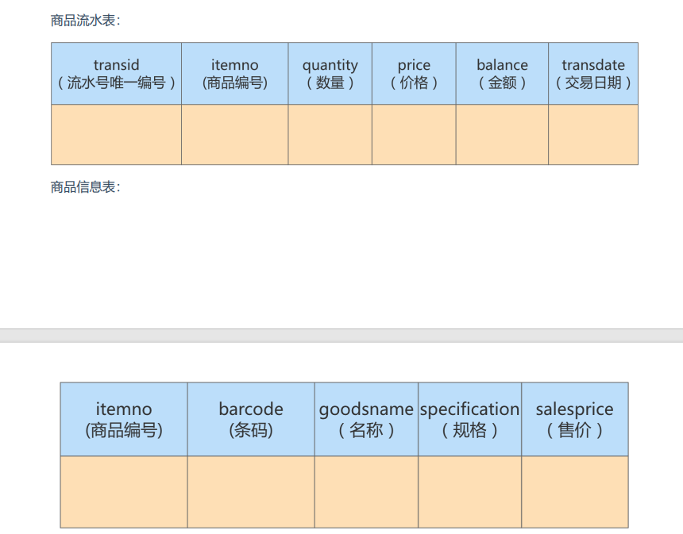
  + 在上面的表设计中，如果我们想得到商品，我们就需要频繁的进行表的连接，这样会导致非常费时，因此我们可以在商品流水表中增加一个商品名称:

+ 总之，举了这么多例子，想表达的是，有时在追求性能的前提下，我们需要进行反范式化，通过数据冗余来达到性能的提升，因此，**反范式化的使用场景一般就是当冗余信息有价值或者能大幅度提高查询效率的时候**
+ 另外，反范式化除了能够提升性能，还带来了新的问题:
  + **空间变大**
  + **数据不一致**:一个表中字段做了修改，另一个表中冗余的字段也需要做同步修改
  + **系统资源消耗增加**:若采用存储过程来支持数据的更新、删除等额外操作，如果更新频繁，会导致系统资源消耗增加
  + **数据库的设计变复杂**:在数据量小的情况下，反范式不能体现性能的优势，可能还会让
+ 在考虑增加冗余字段时，有如下建议:
  + 该冗余字段不需要经常进行修改
  + 该冗余字段查询时不可或缺
  + 根据上面的建议，明显的反范式化设计一般出现在历史快照、历史数据等信息所在表中
    + 在现实生活中，我们经常需要一些冗余信息，比如订单中的收货人信息，包括姓名、电话和地址等。每次发生的订单收货信息都属于历史快照，需要进行保存，但用户可以随时修改自己的信息，这时保存这些冗余信息是非常有必要的
    + 数据仓库通常存储历史数据，对增删改的实时性要求不强，对历史数据的分析需求强。这时适当允许数据的冗余度，更方便进行数据分析
+ [示例](../源码/MySQL/数据库设计规范样例.sql)

---

### （四）ER模型

+ ER(entity-relationship)模型又叫实体关系模型，是用来描述现实生活中客观存在的事务、事务的属性以及事物之间关系的一种数据模型。**在开发基于数据库的信息系统的设计阶段，通常使用ER模型来描述信息需求和信息特性，帮助我们理清业务逻辑，从而设计出优秀的数据库**
+ ER模型包括三个要素:
  + 实体:可以看作数据对象，使用矩形表示，实体分为强实体（不依赖于其他实体的实体）和弱实体（对另一个实体有很强依赖关系的实体）
  + 属性:实体的特性，比如实体是一个人，其属性有身份证号、名字、电话等
  + 关系:指实体之间的关系，在ER模型中用菱形来表示
+ 注意:**可以独立存在的是实体，不可再分的是属性**

#### ①关系类型

+ `E-R（entity-relationship，实体-联系）模型`中有三个主要概念是`实体集` 、`属性` 、`联系集`
+ 一个实体集对应数据库中的一个表，一个实体对应数据表中的一行，一个属性表示数据库表内的一个字段
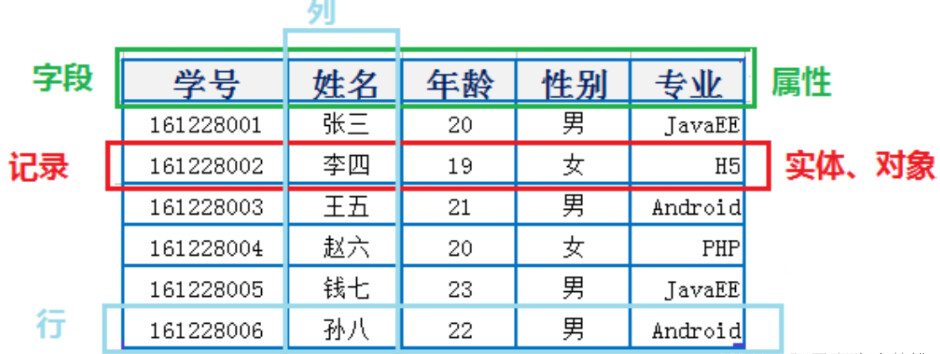
+ 表与表之间的关联关系有四种:
  + 一对一关联
  + 一对多关联
  + 多对多关联
  + 自我引用
+ 一对一关联
  + 在实际的开发中应用不多，因为**一对一可以合成一张表**
  + 它可以遵循两种建表原则:
    + **外键唯一**：主表的主键和从表的外键（唯一），形成主外键关系，外键唯一。
    + **外键是主键**：主表的主键和从表的主键，形成主外键关系。
  + 在一对一关系中，随便把一个表的主键放在另一个表内

+ 一对多关联
  + 即两个表之间，其中A表的实体可以对B表的多个实体，而A表仅有一个实体与B表的一个实体对应
  + 举例:人和银行卡、部门与员工
  + 表示一对多关系，需要把“一”表的主键放在“多”表的一方内
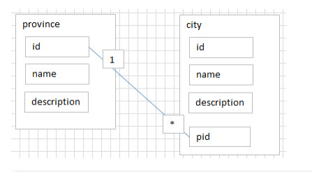
+ 多对多关联
  + 即两个表之间，其中A表的实体可以对应B表的多个实体，而B表的一个实体也能对应A表的多个实体
  + 举例:学生与课程、产品与订单
  + **要表示多对多关系，必须创建第三个表**，该表通常称为`联接表`，它将多对多关系划分为两个一对多关系。**将这两个表的主键都插入到第三个表中**。

+ 自我引用
  + 不知道怎么描述
  + 举例:主管与员工

---

#### ②建模分析

+ 以电商业务为例，由于电商业务太过庞大且复杂，所以我们做了业务简化，本次电商业务设计总共有8个实体，如下所示:
  + 地址实体
  + 用户实体
  + 购物车实体
  + 评论实体
  + 商品实体
  + 商品分类实体
  + 订单实体
  + 订单详情实体
+ 其中，`用户`和`商品分类`是强实体，因为它们不需要依赖其他任何实体。而其他属于弱实体，因为它们虽然都可以独立存在，但是它们都依赖用户这个实体，因此都是弱实体。知道了这些要素，我们就可以给电商业务创建ER模型了，如图

+ 在这个图中，地址和用户之间的添加关系，是一对多的关系，而商品和商品详情示一对1的关系，商品和订单是多对多的关系。 这个 ER 模型，包括了 8个实体之间的 8种关系:
  + （1）用户可以在电商平台添加多个地址；
  + （2）用户只能拥有一个购物车；
  + （3）用户可以生成多个订单；
  + （4）用户可以发表多条评论；
  + （5）一件商品可以有多条评论；
  + （6）每一个商品分类包含多种商品；
  + （7）一个订单可以包含多个商品，一个商品可以在多个订单里。
  + （8）订单中又包含多个订单详情，因为一个订单中可能包含不同种类的商品

---

#### ③ER模型细化

+ 我们在得到ER模型后，就可以根据该ER模型去建表了，但首先我们需要把属性加上，因此我们需要分析，各表需要什么属性:
  + （1） 地址实体 包括用户编号、省、市、地区、收件人、联系电话、是否是默认地址。
  + （2） 用户实体 包括用户编号、用户名称、昵称、用户密码、手机号、邮箱、头像、用户级别。
  + （3） 购物车实体 包括购物车编号、用户编号、商品编号、商品数量、图片文件url。
  + （4） 订单实体 包括订单编号、收货人、收件人电话、总金额、用户编号、付款方式、送货地址、下单
时间。
  + （5） 订单详情实体 包括订单详情编号、订单编号、商品名称、商品编号、商品数量。
  + （6） 商品实体 包括商品编号、价格、商品名称、分类编号、是否销售，规格、颜色。
  + （7） 评论实体 包括评论id、评论内容、评论时间、用户编号、商品编号
  + （8） 商品分类实体 包括类别编号、类别名称、父类别编号
+ 这样细分之后，我们就可以重新设计电商业务了，ER模型如图:

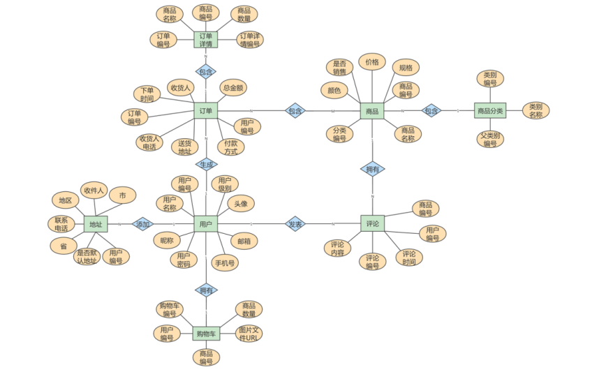

---

### （五）总结

+ 综合以上内容，总结出数据表设计的一般原则："三少一多"
  + **数据表的个数越少越好**:数据表越少，证明实体和联系设计的越简洁，既方便理解又方便操作
  + **数据表中的字段个数越少越好**:数据字段越多，数据冗余的可能性越大。
  + **数据表中联合主键的字段个数越少越好**:联合主键字段数越多，索引所占用的空间就越大，不仅会加大理解难度，还会增加运行时间和索引空间
  + **使用主键和外键越多越好**:这样做可以保证数据冗余度降低，提高实体利用度，且保证了数据表之间的独立性，还能提升相互之间的关联使用率
+ 注意，**这个原则并不是绝对的，需要根据业务情况来随机应变**

---

## 八、事务

+ 在存储引擎的学习中我们已经知道，**在MySQL支持的存储引擎中，只有InnoDB引擎是支持事务的**

### （一）事务特性与状态

+ **事务是一组逻辑操作单元，使数据从一种状态变换到另一种状态**
+ 事务处理的原则:保证所有事务都作为一个工作单元来执行，即使出现了故障，都不能改变这种执行方式。当在一个事务中执行多个操作时，要么所有的事务都被提交( commit)，那么这些修改就永久地保存下来；要么数据库管理系统将放弃所作的所有修改 ，整个事务回滚(rollback)到最初状态
+ 基于事务处理的原则，我们就可以总结事务的特性有四个:
  + **原子性**(Atomicity):原子性指事务是一个不可分割的工作单位，**要么全部提交，要么遇到问题就全部回滚**，不存在中间的状态。**原子性保证了数据的一致性**
  + **一致性**(Consistency):一致性指事务执行前后，其数据从一个合法性状态转变为另一个合法性状态。即**数据在事务处理前后，它的值都需要满足其约束条件**
    + 如转账的情况，A有100块钱，B没钱，现在A向B转200块钱，它的事务执行成功了，即它满足了原子性。但是A在转账之后就有了-100块钱，B有200块钱。而A的钱都是负数了，尽管事务满足了原子性，但是它的数据的值是非法的，不满足其约束条件，因此不满足一致性
  + **隔离性**(Isolation):事务的隔离性指一个事务在执行时不能被其它事务所干扰，导致它的执行出现问题
    + 例:假设A账户有200元，B账户0元。A账户往B账户转账两次，每次金额为50元，分别在两个事务中执行

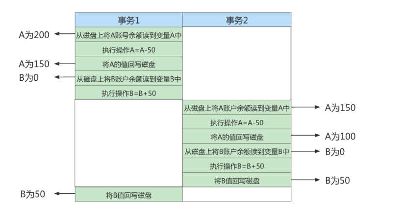
    + 可以看到上图出现了脏读和脏写现象，导致了数据的不一致
  + **持久性**(Durability):持久性是指一个事务一旦被提交，它对数据库中数据的改变就是永久性的，接下来的其他操作和数据库故障不应该对其有任何影响
    + 持久性是通过日志来保证的，通过Redo日志和Undo日志保证事务的正常提交与回滚
+ 另外，MySQL把事务大致划分成几个状态:
  + 活动（active）:事务对应的数据库操作正在执行过程中时，我们就说该事务处在活动的状态
  + 部分提交（partially committed）:当事务中的最后一个操作执行完成，但由于操作都在内存中执行，所造成的影响并没有刷新到磁盘时，我们就说该事务处在部分提交的状态
  + 失败（failed）:当事务处在`活动`或者`部分提交`的状态时，可能遇到了某些错误（数据库自身的错误、操作系统错误或者直接断电等）而无法继续执行，或者人为的停止当前事务的执行，我们就说该事务处在`失败`的状态
  + 中止的（aborted）:如果事务执行了一部分而变为`失败`状态，那么就需要把已经修改的事务中的操作还原到事务执行前的状态。换句话说，就是要撤销失败事务对当前数据库造成的影响。我们把这个撤销的过程称之为回滚。当回滚操作执行完毕时，也就是数据库恢复到了执行事务之前的状态，我们就说该事务处在了`中止`状态
  + 提交的（committed）:当一个处在`部分提交`状态的事务将修改过的数据都同步到磁盘上之后，我们就可以说该事务处在了`提交`状态

---

### （二）事务的使用

+ 使用事务有两种方式，分为显示事务和隐式事务
  + 显示事务就是我们用代码显式的开启一个事务，然后执行一些操作
  + 隐式事务就是我们在进行一些操作的时候，MySQL会为我们自动进行提交的行为，隐式事务在如下情况下默认会自动提交:
    + DML语句执行，即使用CREATE、ALTER、DROP语句对数据库对象进行操作时
    + 修改MySQL数据库中的表，即使用`ALTER USER`、`CREATE USER`、`DROP USER`、`GRANT`、`RENAME USER`、`REVOKE`、`SET PASSWORD`（这些都在隐式的修改mysql数据库内的表，详情见[用户与权限管理](#manageUserAndPassword)）
    + 事务控制或关于锁的语句
      + 当我们在事务内又运行了`BEGIN`、`START TRANSACTION`时，会使上一次的事务隐式的提交
      + 当前的autocommit系统变量的值是off,我们设置它为on时，也会隐式的自动提交该语句前面执行的语句
      + 使用`LOCK TABLES`、`UNLOCK TABLES`语句也会隐式的提交
      + 使用`LOAD DATA`批量导入数据时，也会自动隐式提交前面的语句
      + 使用`START SLAVE`、`STOP SLAVE`、`RESET SLAVE`、`CHANGE MASTER TO`等MySQL复制的相关语句时，也会自动隐式提交前面的语句
      + 使用`ANALYZE TABLE`、`CACHE INDEX`、`CHECK TABLE`、`FLUSH`、`LOAD INDEX INTO CACHE`、`OPTIMIZE TABLE`、`REPAIR TABLE`、`RESET`等语句时，也会自动隐式提交前面的语句

~~~sql
  -- START TRANSACTION或BEGIN都表示开启一个显式的事务
  -- 在显示事务内，除非我们主动进行COMMIT，否则MySQL不会主动提交的
  -- START TRANSACTION相比BEGIN,可以跟随一些修饰符:
    -- READ ONLY:标识当前事务是一个只读事务，也就是属于该事务的数据库操作只能读取数据，而不能修改数据
    -- READ WRITE(默认) ：标识当前事务是一个读写事务，也就是属于该事务的数据库操作既可以读取数据，也可以修改数据(默认)
    -- WITH CONSISTENT SNAPSHOT：启动一致性读
  START TRANSACTION {READ ONLY|READ WRITE|WITH CONSISTENT SNAPSHOT}|BEGIN;
  -- 提交事务，表示当前事务结束
  COMMIT;

  --事务回滚，表示恢复到离它最近的BEGIN开始的状态之前
  ROLLBACK;

  -- 在此保存一个保存点(存档)
  SAVEPOINT 名称;
  -- 回滚到对应的保存点(读档)
  ROLLBACK TO 保存点名称;
  -- 关闭自动提交，该方式可以直接禁止使用隐式事务的自动提交，如果置为0，只有当我们主动COMMIT时，才会提交
  set autocommit=off;

~~~

---

### （三）并发问题与隔离级别

#### ①并发问题

+ MySQL支持事务的并发操作以提升事务的处理效率，但是事务在并发时，也会出现相关的问题
+ 这些问题根据严重程度从高到低分为:
  + **脏写**(Dirty Write):如果事务A修改了另一个**未提交**事务B修改过的数据，那么就称发生了脏写
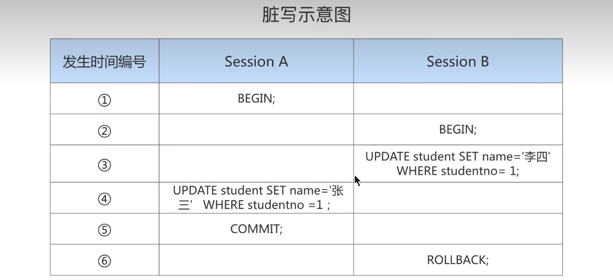
  + **脏读**(Dirty Read):如果事务A读取了已经被事务B**更新但还没有被提交**的字段。之后若事务B回滚，事务A读取的内容就是临时且无效的

  + **不可重复读**(Non-Repeatable Read):如果事务A读取了一个字段，然后事务B**修改(未提交、已提交均可)**了该字段。之后事务A再次读取同一个字段，值就不同了。那就意味着发生了不可重复读

  + **幻读**(Phantom):如果事务A从一个表中读取了一个字段, 然后事务B在该表中**插入(未提交、已提交均可)**了一些新的行。之后, 如果事务A再次读取同一个表, 就会多出几行。那就意味着发生了幻读

+ 注意:
  + 如果事务B删除了一些值，而事务A读取到的字段较之前读取到的不同，但是**没有出现新的行**，这不算幻读，而不是不可重复读。**幻读强调几次读取读取到的是之前未出现的行**

---

#### ②隔离级别

+ 为了解决这些并发问题，SQL规范规定了四个隔离级别，MySQL对这四个隔离级别是都支持的，但**不意味着其它DBMS对这四个隔离级别是支持的**
+ 这四个隔离级别分别是:
  + 读未提交(READ UNCOMMITTED):在该隔离级别，所有事务都可以看到其他未提交事务的执行结果。不能避免脏读、不可重复读、幻读
  + 读已提交(READ COMMITTED):它满足了隔离的简单定义：一个事务只能看见已经提交事务所做的改变。这是大多数数据库系统的默认隔离级别（但**不是MySQL默认的**）。可以避免脏读，但不可重复读、幻读问题仍然存在
  + 可重复读(REPEATABLE READ):事务A在读到一条数据之后，此时事务B对该数据进行了修改并提交，那么事务A再读该数据，读到的还是原来的内容。可以避免脏读、不可重复读，但幻读问题仍然存在。**这是MySQL的默认隔离级别**
  + 可串行化(SERIALIZABLE):确保事务可以从一个表中读取相同的行。在这个事务持续期间，禁止其他事务对该表执行插入、更新和删除操作。**所有的并发问题都可以避免，但性能十分低下**。能避免脏读、不可重复读和幻读

|隔离级别|能否解决脏写|能否解决脏读|能否解决不可重复读|能否解决幻读|是否可以加锁读|
|:---:|:---:|:---:|:---:|:---:|:---:|
|读未提交|√|×|×|×|×|
|读已提交|√|√|×|×|×|
|可重复读|√|√|√|×|×|
|可串行化|√|√|√|√|√|

+ 从上表可以看到，可串行化的安全性是最好的，但是性能是最低下的
+ 下面是设置隔离级别的相关SQL语句
~~~sql

  -- 查看隔离级别，MySQL 5.7.20的版本之前：
  SHOW VARIABLES LIKE 'tx_isolation';
  -- MySQL 5.7.20版本之后，引入transaction_isolation来替换tx_isolation
  SHOW VARIABLES LIKE 'transaction_isolation';
  -- 或者不同MySQL版本中都可以使用的：
  SELECT @@transaction_isolation;

  -- 下面的两行语句选择一行，都可以设置隔离级别，但是隔离级别的格式略有不同
    -- 第一行代码的隔离级别格式: READ UNCOMMITTED、READ COMMITTED、REPEATABLE READ、SERIALIZABLE
    -- 第二行代码的隔离级别格式:READ-UNCOMMITTED、READ-COMMITTED、REPEATABLE-READ、SERIALIZABLE
  -- 在设置GLOBAL级别的隔离级别时，当前的会话并不会生效，而在此之后的新的会话才会生效
  -- 为了让它起作用，可以设置SESSION的隔离级别，或者退出MySQL连接再重连一次，或者再开一个会话
    -- 如果选择设置SESSION的隔离级别且当前存在事务在执行，那么本次事务不会受到该隔离级别的影响，下次开始才会生效
  SET [GLOBAL|SESSION] TRANSACTION ISOLATION LEVEL 隔离级别;
  SET [GLOBAL|SESSION] TRANSACTION_ISOLATION = '隔离级别';
~~~

+ 各并发问题演示:
  + 表需要自己建，代码内的表需要改成自己的表，字段改成自己自定义的字段
+ 脏读演示:
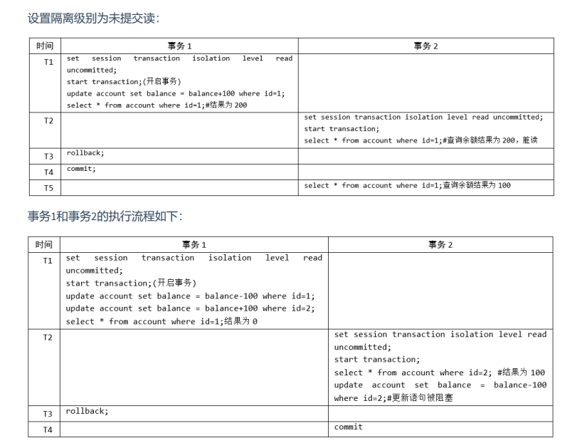
+ 不可重复读演示:

+ 幻读演示:
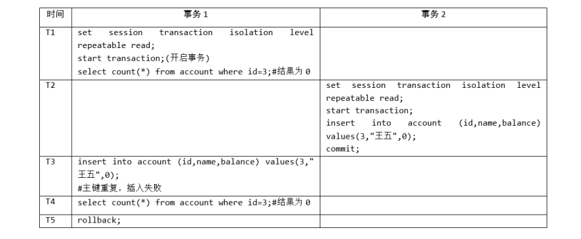

---

### （四）事务日志

+ 事务的隔离性由锁和隔离级别来确保，而事务的另外三个特性，原子性、持久性、一致性则由事务日志来保证:
  + REDO LOG 称为重做日志，提供再写入操作，恢复提交事务修改的页操作，用来保证事务的持久性
    + 它是存储引擎生成的日志，它**记录的是物理级别上的页修改操作**，如页号xxx,偏移量yyy，写入了zzz数据。主要为了保证数据的可靠性
  + UNDO LOG 称为回滚日志，回滚行记录到某个特定版本，用来保证事务的原子性、一致性
    + 他也是存储引擎生成的日志，它**记录的是逻辑操作日志**，如事务中执行了一句INSERT操作，那么undo日志就写一个相反的DELETE操作，主要用于**事务的回滚**和**一致性非锁定读(MVCC)**

#### ①redo日志

+ **redo日志的引入**:
  + 从索引和存储引擎章节我们可以知道，InnoDB存储引擎是以页为单位来管理存储空间的，因此在进行事务操作时，它需要先把对应的页加载进`Buffer Pool`内存中，所有的数据变更都需要现在内存中进行修改，这些被修改了的，与磁盘中的页内的数据出现不一致的内存中的页被称为`脏页`。而后缓冲池的脏页会以一定的频率被刷新进磁盘中(CheckPoint机制)
  + 但是磁盘刷新需要时间，刷新时机也不是每次更新完成就刷新的，这就导致在刷新或者更新完成等待刷新时，MySQL服务器可能会出现宕机现象。**如果出现了宕机，那么内存中的数据就是不可恢复的，那么这段数据就会丢失，无法恢复**
  + 另一方面，如果发生了宕机，**事务的持久性要求我们对数据的更改不能丢失**，因此，为了保证事务的持久性，我们**只需要把修改了哪些东西记录一下就好**，而记录该修改记录的，就是redo日志
    + 其实还可以这么做:在提交之前，就把该事务所修改的所有页面都刷新到磁盘。但该操作会使得效率降低，因为可能会导致修改量与刷新磁盘工作量严重不成比例，且随机刷新IO较慢，会导致性能问题
+ **redo日志的好处**:
  + 降低了磁盘刷新
  + redo日志占用空间小
+ **redo日志的特点**:
  + 顺序写入磁盘
  + 事务执行过程中，redo log不断记录
+ **redo简单划分**:
  + 重做日志的缓冲(redo log buffer):其保存在内存中，通过`innodb_log_buffer_size`参数可以配置，默认16M，最小1M，最大4096M
  + 重做日志文件(redo log file):保存在磁盘中，有持久性
+ **redo整体流程**:
  + 第1步：先将原始数据从磁盘中读入内存中来，修改数据的内存拷贝
  + 第2步：生成一条重做日志并写入redo log buffer，记录的是数据被修改后的值
  + 第3步：当事务commit时，将redo log buffer中的内容刷新到redo log file，对redo log file采用追加写的方式
  + 第4步：定期将内存中修改的数据刷新到磁盘中
  + 以上步骤就是Write-Ahead Log(预先日志持久化)。**在持久化一个数据页之前，先将内存中相应的日志页持久化**
+ **redo的刷盘策略**:
  + 从redo的部分我们可以知道，redo log的写入并不是直接写入磁盘的，而是先写入内存，再通过刷盘策略刷到真正的redo log文件中
  + **这个刷盘并不是真正的把内存中的数据直接放到文件中去**，只是写入到文件系统缓存（`page cache`）中去，再由操作系统来决定这些数据什么时候写入。不过如果操作系统崩溃的话...那么数据就真的丢失了，但操作系统宕机的概率比较小
  + redo的刷盘策略有三种，MySQL提供了`innodb_flush_log_at_trx_commit`来供我们选择其刷盘策略:
    + 设置为0:表示每次事务提交时不进行刷盘操作。（系统默认master thread每隔1s进行一次重做日志的同步，该操作不仅会将内存中的redo写入到page cache，还会把page cache中的数据刷到磁盘文件中去。**该操作无论innodb_flush_log_at_trx_commit的值为多少都会执行**）
    + 设置为1:表示每次事务提交时都将进行同步，刷盘操作（默认值）
    + 设置为2:表示每次事务提交时都只把redo log buffer内容写入page cache，不进行同步。由os自己决定什么时候同步到磁盘文件。
  + 下面展示三种刷盘策略:

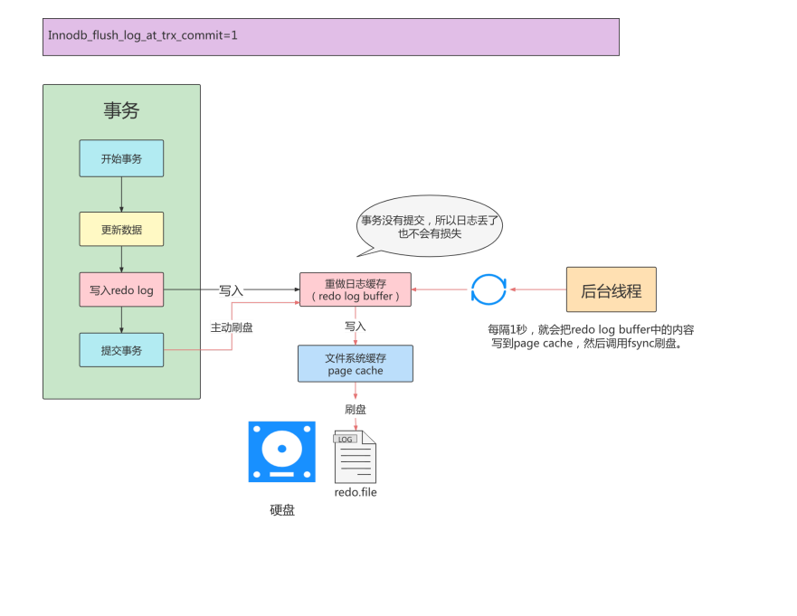
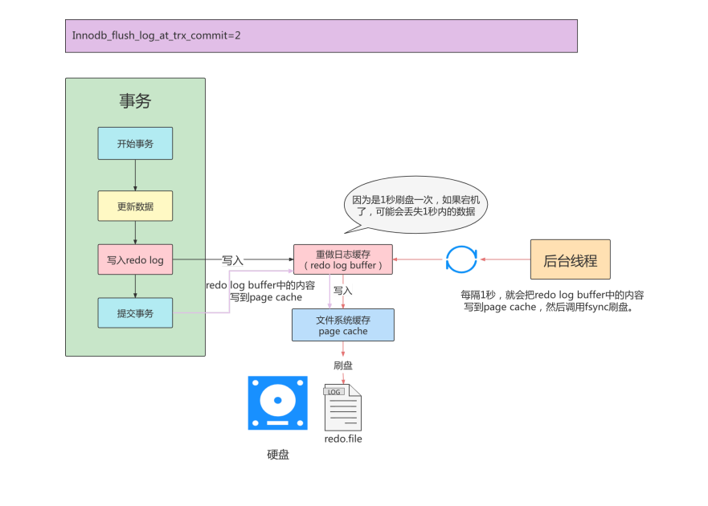

+ **redo写入redo log buffer过程**:
  + redo log buffer底层有三个结构:

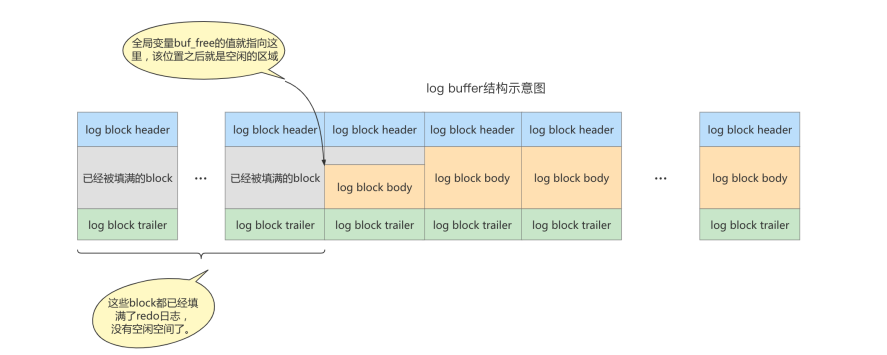

  + 一个redo log buffer由多个redo log block组成:

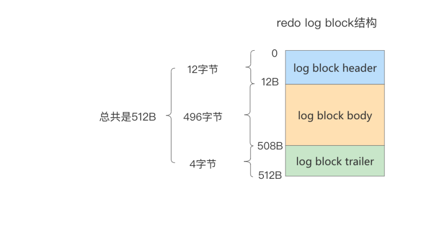

  + 可以看到一个block的大小是512字节，它的设计其实是与磁盘的扇区有关的，因为机械磁盘的默认扇区就是512字节。如果我们要向扇区写入的block大小大于512k,那么就需要占两个及以上的扇区，如果有一个扇区写入成功了，另一个写入失败了，就会出现非原子性的写入，而**每次写入都写一个扇区，写入就是原子性的**

  + 在向redoBuffer填充日志内容时，是以mtr为基本单位的。一条语句由若干个mtr组成，而一个mtr又由若干个redo日志组成:

  + 不同的事务可能是并发执行的，因此对于redo log buffer来说，各个事务的mtr可能会杂乱的挨在一起:

+ **相关参数**:
  + innodb_log_group_home_dir:**指定redo log文件组所在的路径**，默认值为`./`，表示在数据库的数据目录下，MySQL的默认数据目录（var/lib/mysql）(这是linux下的)下默认有两个名为ib_logfile0和ib_logfile1的文件，log buffer中的日志默认情况下就是刷新到这两个磁盘文件中。此redo日志文件位置还可以修改
  + innodb_log_files_in_group:**指明redo log file的个数**，默认2个，最大100个
  + innodb_flush_log_at_trx_commit:**控制redo log刷新到磁盘的策略**，默认为1
  + innodb_log_file_size:**单个redo log文件设置大小**，默认值为48M。最大值为(512G/innodb_log_files_in_group)
  + 最后，总共的redo日志文件大小其实就是：innodb_log_file_size*innodb_log_files_in_group
+ **checkpoint**:
  + **采用循环使用的方式向redo日志文件组里写数据的话，如果日志已经写满了，会导致后面继续写入的redo日志覆盖掉前边写的redo日志**，为了解决该问题，InnoDB的设计者提出了checkpoint的概念

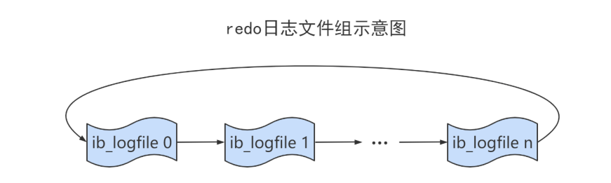
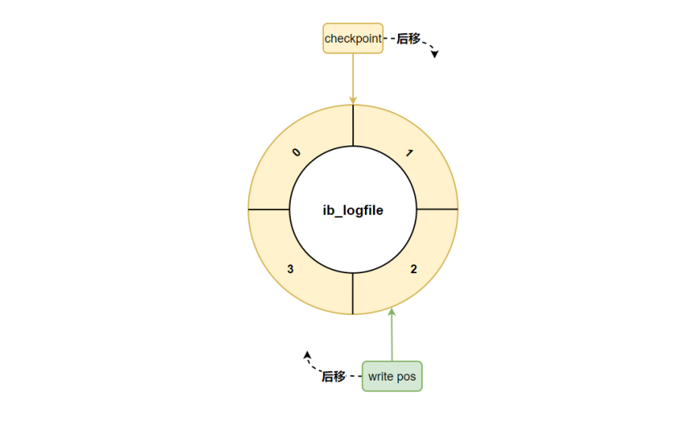
+ 如果write pos追上checkpoint（即跑了一天），表示日志文件组满了，这时候不能再写入新的redo log记录，MySQL得停下来，清空一些记录，把checkpoint推进一下

---

#### ②undo日志

+ **undo日志的作用**:
  + undo log是事务持久性的保证，而undo log是事务原子性的保证。undo log保证了在事务执行过程中，如果出现意外，可以进行对应的回滚操作以避免出现中间状态的问题。但**回滚仅仅是逻辑回滚，数据是可以回滚到事务开始之前的状态的，但是数据的物理位置可能发生了变化**，因为在并发的情况下，可能有多个事务一起执行，将指定事务回滚到事务开始之前的物理状态，可能会导致其它事务执行出现异常。另外是undo日志是通过执行一条语句就记录该语句的相反语句的方式进行记录的，而不是记录该语句执行前的物理状态，因此根据undo日志仅能够在逻辑上回滚到事务开始前的状态
  + 另外,undo log也可以进行MVCC操作，在InnoDB引擎中MVCC的实现是通过undo来完成的，当用户读取一行记录时，若该纪录已被其它事务占用，当前事务可以根据undo日志来得到对应的数据
+ **undo存储结构**:
  + InnoDB针对undo log采取段管理的方式，也就是` 回滚段（rollback segment）`每个回滚段记录了1024个undo log segment，而在每个undo log segment段中进行 undo页的申请
  + 在InnoDB1.1版本之前（不包括1.1版本），只有一个rollback segment，因此支持同时在线的事务限制为1024。虽然对绝大多数的应用来说都已经够用
  + 从1.1版本开始InnoDB支持最大128个rollback segment，故其支持同时在线的事务限制提高到了128*1024。但此时这些rollback segment都存放在共享表空间ibdata中
  + 从1.2版本开始，可以对参数rollback segment进行进一步的设置了:

~~~sql
  -- 这玩意好像已经被弃用了
  show variables like 'innodb_undo_logs';
  -- 可以通过下面的东西查看对应的undo log配置
    -- innodb_max_undo_log_size表示最大的日志大小
    -- innodb_undo_directory表示undo日志的保存位置
    -- innodb_undo_log_encrypt用于指定InnoDB存储引擎是否对undo日志进行加密(来自GPT)
    -- innodb_undo_log_truncate用于指定在数据库重启时是否要截断（删除）undo日志
    -- innodb_undo_tablespaces表示占用的表空间有几个，默认为两个
  show variables like '%undo%';

~~~
  + 我们的事务执行完毕后，并不会立刻清除对应的undo log，因为该undo log可能还夹杂着其它事务的相关信息。事务在执行完毕后，undo log就可以被重用了，在事务commit后，undo log会被放到一个链表内，然后判断undo页的使用空间是否小于3/4，**如果小于该值，则表示可以重用，其它事务的undo日志可以写在其后面并不会删除**。由于undo log是离散的，因此清理对应的磁盘空间时，效率不高
+ **回滚段与事务**:
  + 每个事务只会使用一个回滚段，一个回滚段在同一时刻可能会服务于多个事务
  + 当一个事务开始的时候，会制定一个回滚段，在事务进行的过程中，当数据被修改时，原始的数据会被复制到回滚段
  + 在回滚段中，事务会不断填充盘区，直到事务结束或所有的空间被用完。如果当前的盘区不够用，事务会在段中请求扩展下一个盘区，如果所有已分配的盘区都被用完，事务会覆盖最初的盘区或者在回滚段允许的情况下扩展新的盘区来使用
  + 回滚段存在于undo表空间中，在数据库中可以存在多个undo表空间，但同一时刻只能使用一个undo表空间
  + 当事务提交时，InnoDB存储引擎会做以下两件事情
    + 将undo log放入列表中，以供之后的purge操作
    + 判断undo log所在的页是否可以重用，若可以分配给下个事务使用
+ **回滚段的数据分类**:
  + 未提交的回滚数据(uncommitted undo information):该数据所关联的事务还未提交，因此该数据无法被其他事务的数据所覆盖
  + 已经提交但未过期的回滚数据(committed undo information):该数据关联的事务已经提交，但是仍受到undo retention参数的保持时间的影响
  + 事务已经提交并过期的数据(expired undo information):即已经过期的数据，当回滚段满时，会优先覆盖该数据
+ **undo类型**:
  + insert undo log:指在insert操作中产生的undo日志，其仅对当前事务可见，对其它事务不可见（事务的隔离性）。因此该**类型的undo日志在事务提交之后就可以直接删除**。不需要进行purge操作
  + update undo log:指在update操作中产生的undo日志，该类型的undo日志可能需要提供MVCC机制，因此不能在事务提交时就进行删除。**提交时需要进行purge操作，等待purge操作进行最后的删除**
+ **undo log的生命周期**:
  + 假设有两个数值，分别为A=1和B=2,我们想将A修改为3，将B修改为4:
    + 在1-8任意步骤出现问题，都需要进行undo操作
    + 在8-9之间宕机，可以选择回滚，也可以继续提交，因为持久化已经完成了
    + 在9之后宕机，内存映射中的数据还来不及刷回磁盘，但是持久化已经完成了，因此还是可以通过redo继续提交

~~~sql
  1. BEGIN;
  2. 记录A=1到undo log
  3. update A=3;
  4. 记录A=3到redo log
  5. 记录B=2到undo log
  6. update B=4;
  7. 记录B=4到redo log
  8. 将redo log写到磁盘
  9. commit
~~~

---

# 小问题

1. 为什么建表时，加 not null default '' 或 default 0
> + 不想让表中出现null值。

2. 为什么不想要 null 的值
> + 不好比较。null是一种特殊值，比较时只能用专门的is null 和 is not null来比较。碰到运算符，通常返回null。
> + 效率不高。影响提高索引效果。因此，我们往往在建表时 not null default '' 或 default 0

3. 带AUTO_INCREMENT约束的字段值是从1开始的吗？
> + 在MySQL中，默认AUTO_INCREMENT的初始值是1，每新增一条记录，字段值自动加1。设置自增属性（AUTO_INCREMENT）的时候，还可以指定第一条插入记录的自增字段的值，这样新插入的记录的自增字段值从初始值开始递增，如在表中插入第一条记录，同时指定id值为5，则以后插入的记录的id值就会从6开始往上增加。添加主键约束时，往往需要设置字段自动增加属性。

4. 并不是每个表都可以任意选择存储引擎？

> + 外键约束（FOREIGN KEY）不能跨引擎使用。MySQL支持多种存储引擎，每一个表都可以指定一个不同的存储引擎，需要注意的是：外键约束是用来保证数据的参照完整性的，如果表之间需要关联外键，却指定了不同的存储引擎，那么这些表之间是不能创建外键约束的。所以说，存储引擎的选择也不完全是随意的

5. 为了减少IO，索引树会一次性加载吗？

> + 数据库索引存放在磁盘上，内存空间可能不足。当内存空间不足时，我们只能逐一加载每一个磁盘页，因为磁盘对应着索引树的节点

6. B+树的存储能力如何？为何说一般查找行记录，最多只需1~3次磁盘IO

> + InnoDB存储引擎中的页大小为16kb，一般表的主键类型是INT，或BIGINT，指针类型一般也为4或者8个字节，也就是说，一个页中大概存放了16Kb/(8b+8b)≈1K个键值，那么一个深度为3的B+树索引已经可以维护10^3^3=10^9=10亿条记录了
> + 实际情况中，大部分情况下不会有这么多数据，B+树的高度一般在2-4层，MySQL的InnoDB在设计时是将根节点常驻在内存中的，也就是说，根节点无需进行IO操作即可读取到，那么我们实际进行查找某一键值的行记录时仅需要进行1-3次IO操作

7. 为什么说B+树比B-树更适合实际应用中操作系统的文件索引和数据库索引？

> + B+树的磁盘读写代价更低，B+树的内部节点并没有指向关键字具体信息的指针，因此其内部节点相对于B树来说更小，如果把所有同一内部节点的关键字存放在同一盘块中，那么盘块所能容纳的关键字数量也就越多，一次性读入内存的需要查找的关键字就越多，相对来说IO读写次数也就降低了
> + B+树的查询效率更稳定。由于非终结点并不是指向最终文件的结点，而只是叶子节点中关键的索引，所以任何关键字的查找必须走一条从根节点到叶子节点的路。所有关键字查询的路径长度相同，导致每一个数据的查询效率相当。

8. Hash索引与B+索引的区别

> + **Hash索引无法进行范围查询**，而B+树可以，因为Hash索引存储的数据是无序的，但B+树存储的数据是按一定的规则排序的
> + **Hash索引不支持联合索引的最左侧原则**，而B+树可以，对于联合索引来说，Hash索引在计算Hash值的时候是将索引键合并后再一起计算哈希值的，所以不会根据单个索引单独计算哈希值，因此如果用到联合索引的一到多个索引时，联合索引无法被引用
> + **Hash索引不支持ORDER BY排序**，还是因为Hash索引存储的数据是无序的，而B+树可以，因此它支持排序。同理**Hash索引也无法进行模糊查询**
> + **InnoDB引擎不支持Hash索引**

9. Hash 索引与 B+ 树索引是在建索引的时候手动指定的吗？

> + 这要看引擎支不支持，以及DBMS默认的索引是什么，MySQL默认的是B+树索引，默认引擎是InnoDB引擎，但是InnoDB引擎不支持Hash索引。Memeory引擎支持，我们可以手动指定

---

# 信息汇总

## 一、查看信息代码汇总

|分类|代码|描述|备注|
|:---:|:---:|:---:|:---:|
|字符集|`show variables like 'character_%';`、`show variables like '%char%';`|查看数据库所用的默认字符集|无|
|^|`show charset;`|查看MySQL所有可用的字符集|无|
|^|`SHOW VARIABLES LIKE '%_server';`、`SHOW VARIABLES LIKE '%_database';`|查看服务器、数据库的字符集|无|
|^|`SHOW COLLATION LIKE '[{gbk\|utf8}]%';`|查看GBK或UTF-8字符集的比较规则|无|
|查看变量|`SHOW GLOBAL VARIABLES [like 'xxx'];`|查看满足条件的全局变量|不写`like`语句相当于查看全部的全局系统变量|
|^|`SHOW [SESSION] VARIABLES [like 'xxx'];`|查看满足条件的当前会话变量|**不写修饰符默认为会话系统变量**，不写`like`语句相当于查看全部的会话系统变量|
|^|`SELECT @@global.变量名;`|查看指定的全局系统变量|无|
|^|`SELECT @@session.变量名;`|查看指定的会话系统变量|无|
|^|`SELECT @@变量名;`|查找某一系统变量|无|
|^|`SELECT 变量名;`|查看局部变量|无|
|^|`SELECT @变量名`|查看会话用户变量|无|
|数据库|`SHOW DATABASE1,DATABASE2,....;`|查看指定数据库内的内容|无|
|^|`SHOW TABLES FROM 数据库名;`|展示指定数据库的所有表|无|
|^|`SHOW CREATE DATABASE 数据库名;`|查看数据库的创建信息|可用于查看当前数据库字符集|
|^|`SELECT DATABASE();`|查看当前正在使用的数据库|无|
|表或视图|`DESC/DESCRIPTION 表名;`|查看表结构|无|
|^|`SHOW CREATE TABLE 表名\G;`|查看表结构|可以用来查看表的字符集、引擎等|
|^|`SHOW INDEX FROM 表名称;`|查看索引|无|
|^|`SHOW TABLES`|查看数据库内的表与视图|无|
|^|`SHOW TABLE STATUS LIKE '表名'`|查看表或视图的属性信息|也可以用它来查看表的比较规则|
|^|`DESC/DESCRIPTION 表名`|查看表结构|无|
|约束|`SELECT * FROM information_schema.表名 WHERE table_name = '表名称';`|查看指定表的约束|无|
|存储过程和函数|`SHOW CREATE PROCEDURE/FUNCTION 存储过程名或函数名`|查看指定的存储过程或函数的结构|无|
|^|`SHOW CREATE FUNCTION test_db.CountProc \G`|查看函数|无|
|^|`SHOW PROCEDURE/FUNCTION STATUS [LIKE 'pattern']`|查看存储过程或函数的状态信息|无|
|^|`SELECT * FROM information_schema.Routines WHERE ROUTINE_NAME='存储过程或函数的名' [AND ROUTINE_TYPE = 'PROCEDURE/FUNCTION'];`|
|触发器|`SELECT * FROM information_schema.TRIGGERS;`|查看触发器信息|无|
|^|`SHOW TRIGGERS\G`|查看触发器详情|无|
|用户与权限管理|`select * from mysql.user;`|查询当前数据库内存在的用户信息|使用*号会得到很多字段，一般取host和user字段就够了|
|^|`SHOW GRANTS;`、`SHOW GRANTS FOR CURRENT_USER;`、`SHOW GRANTS FOR CURRENT_USER();`|查看当前用户的权限|无|
|^|`SHOW GRANTS FOR 'user'@'主机地址';`|查看某用户的全局权限|无|
|^|`SHOW GRANTS FOR 'role_name'[@'host_name'];`|查看指定角色的权限|无|
|^|`select current_role();`|查看当前被激活的角色|无|
|逻辑架构|`select @@profiling;`、`show variables like 'profiling';`|查询是否开启了profiling|无|
|^|`show profiles;`|展示最近几次的查询操作|无|
|^|`show profile [cpu,block io ][for query 7];`|查看指定的某一次查询的详细步骤|如果没有写查询id，那么默认查看最近一次查询操作的信息|
|^|`show variables like 'innodb_buffer_pool_size';`|查看缓冲池大小|无|
|^|`show variables like 'innodb_buffer_pool_instances';`|查看当前的数据库缓冲池实例数量|无|
|^|`show engines;`|查看MySQL的所有引擎|无|
|^|`show variables like '%storage_engine%';`、`SELECT @@default_storage_engine;`|查看当前的默认存储引擎|无|
|^|`show variables like 'innodb_file_per_table';`|查看表空间类型，如果出现innodb_file_per_table对应的Value是on，那么说明开启了独立表空间，且说明每张表都会单独创建一个idb文件|无|
|索引|`show index from 表名;`|查看指定表的索引|无|
|^|`select @@optimizer_switch \G;`、`show variables like '%join_buffer_size%';`|查看优化器的行为配置 其中use_invisible_indexes项表示的是查询优化器的开关，如果改成ON，那么就说明隐藏索引对查询优化器可见，为OFF说明不可见 block_nested_loop状态表示是否支持MySQL为表连接开辟内存块|无|
|性能分析与调优|`SHOW [GLOBAL\|SESSION] STATUS LIKE '参数';`|展示性能参数|无|
|^|`show variables like '%slow_query_log%';`|查看慢查询日志信息|无|
|^|`SHOW VARIABLES LIKE '%slow%';`|查询慢查询日志所在目录|无|
|^|`SHOW VARIABLES LIKE '%long_query_time%';`|查询超时时长|无|
|^|`show variables like '%long_query_time%';`|查看慢查询时间阈值，超过该值时，该查询会被记录为慢查询|无|
|^|`SHOW GLOBAL STATUS LIKE '%Slow_queries%';`|查询当前的慢查询数量|无|
|^|`select @@profiling;`、`show variables like 'profiling';`|查看是否开启profiling|无|
|^|`show profiles;`|显示最近的几次查询|无|
|^|`show profile;`|显示上一次查询的详细步骤|无|
|^|`show profile for query id;`|使用profiles显示的查询的id来展示对应查询的详细步骤|无|
|^|`show profile cpu,block io for query id;`|展示更详细的字段|无|
|^|`show variables like '%join_buffer_size%';`|查看当前MySQL能够为多表连接开辟多大的内存块大小|无|

---

## 二、配置文件配置汇总

|分类|配置项|作用|备注|
|:---:|:---:|:---:|:---:|
|[client]|aaa|
|[mysql]|bbb|
|[mysqld]|skip-character-set-client-handshake|使配置文件中的配置项能够覆盖客户端指定的编码字符集|无|
|^|character-set-server=utf8mb4|配置客户端请求相关配置、数据库编码与服务编码|**如果想配置客户端请求相关配置，需要先指定上面的配置项**|
|^|sql-mode|配置MySQL在执行操作时的标准|无|
|^|default_password_lifetime|默认密码的过期天数|无|
|^|password_history|设置修改的密码不能与前多少次密码一致|无|
|^|password_reuse_interval|设置修改的密码不能与前多少天密码一致|无|
|^|mandatory_roles|设置强制角色|无|
|^|query_cache_type|开启查询缓存|MySQL8.0以后，无此配置项|
|^|default-storage-engine|配置默认的存储引擎|无|
|^|slow_query_log|设置是否开启慢查询日志|无|
|^|query_cache_type|默认为0，1开启查询配置|MySQL8.0后，此选项被移除|
|[server]|innodb_buffer_pool_size|设置数据库缓冲池总大小|无|
|^|innodb_buffer_pool_instances|设置数据库缓冲池数量|如果总大小未超1Gb，那么MySQL会强制将此字段设置为1|

---

## 三、数据库设计原则汇总

### （一）关于库

1. 【强制】库的名称必须控制在32个字符以内，只能使用英文字母、数字和下划线，建议以英文字
母开头。
2. 【强制】库名中英文 一律小写 ，不同单词采用 下划线 分割。须见名知意。
3. 【强制】库的名称格式：业务系统名称_子系统名。
4. 【强制】库名禁止使用关键字（如type,order等）。
5. 【强制】创建数据库时必须 显式指定字符集 ，并且字符集只能是utf8或者utf8mb4。
创建数据库SQL举例：CREATE DATABASE crm_fund DEFAULT CHARACTER SET 'utf8' ;
6. 【建议】对于程序连接数据库账号，遵循 权限最小原则
使用数据库账号只能在一个DB下使用，不准跨库。程序使用的账号 原则上不准有drop权限 。
7. 【建议】临时库以 tmp_ 为前缀，并以日期为后缀；
备份库以 bak_ 为前缀，并以日期为后缀。

---

### （二）关于表、列

1. 【强制】表和列的名称必须控制在32个字符以内，表名只能使用英文字母、数字和下划线，建议
以 英文字母开头 。
2. 【强制】 表名、列名一律小写 ，不同单词采用下划线分割。须见名知意。
3. 【强制】表名要求有模块名强相关，同一模块的表名尽量使用 统一前缀 。比如：crm_fund_item
4. 【强制】创建表时必须 显式指定字符集 为utf8或utf8mb4。
5. 【强制】表名、列名禁止使用关键字（如type,order等）。
6. 【强制】创建表时必须 显式指定表存储引擎 类型。如无特殊需求，一律为InnoDB。
7. 【强制】建表必须有comment。
8. 【强制】字段命名应尽可能使用表达实际含义的英文单词或 缩写 。如：公司 ID，不要使用
corporation_id, 而用corp_id 即可。
9. 【强制】布尔值类型的字段命名为 is_描述 。如member表上表示是否为enabled的会员的字段命
名为 is_enabled。
10. 【强制】禁止在数据库中存储图片、文件等大的二进制数据
通常文件很大，短时间内造成数据量快速增长，数据库进行数据库读取时，通常会进行大量的随
机IO操作，文件很大时，IO操作很耗时。通常存储于文件服务器，数据库只存储文件地址信息。
11. 【建议】建表时关于主键： 表必须有主键 (1)强制要求主键为id，类型为int或bigint，且为
auto_increment 建议使用unsigned无符号型。 (2)标识表里每一行主体的字段不要设为主键，建议
设为其他字段如user_id，order_id等，并建立unique key索引。因为如果设为主键且主键值为随机
插入，则会导致innodb内部页分裂和大量随机I/O，性能下降。
12. 【建议】核心表（如用户表）必须有行数据的 创建时间字段 （create_time）和 最后更新时间字段
（update_time），便于查问题。
13. 【建议】表中所有字段尽量都是 NOT NULL 属性，业务可以根据需要定义 DEFAULT值 。 因为使用
NULL值会存在每一行都会占用额外存储空间、数据迁移容易出错、聚合函数计算结果偏差等问
题。
14. 【建议】所有存储相同数据的 列名和列类型必须一致 （一般作为关联列，如果查询时关联列类型
不一致会自动进行数据类型隐式转换，会造成列上的索引失效，导致查询效率降低）。
15. 【建议】中间表（或临时表）用于保留中间结果集，名称以 tmp_ 开头。
备份表用于备份或抓取源表快照，名称以 bak_ 开头。中间表和备份表定期清理。
16. 【示范】一个较为规范的建表语句：

~~~sql
  CREATE TABLE user_info (
  `id` int unsigned NOT NULL AUTO_INCREMENT COMMENT '自增主键',
  `user_id` bigint(11) NOT NULL COMMENT '用户id',
  `username` varchar(45) NOT NULL COMMENT '真实姓名',
  `email` varchar(30) NOT NULL COMMENT '用户邮箱',
  `nickname` varchar(45) NOT NULL COMMENT '昵称',
  `birthday` date NOT NULL COMMENT '生日',
  `sex` tinyint(4) DEFAULT '0' COMMENT '性别',
  `short_introduce` varchar(150) DEFAULT NULL COMMENT '一句话介绍自己，最多50个汉字',
  `user_resume` varchar(300) NOT NULL COMMENT '用户提交的简历存放地址',
  `user_register_ip` int NOT NULL COMMENT '用户注册时的源ip',
  `create_time` timestamp NOT NULL DEFAULT CURRENT_TIMESTAMP COMMENT '创建时间',
  `update_time` timestamp NOT NULL DEFAULT CURRENT_TIMESTAMP ON UPDATE
  CURRENT_TIMESTAMP COMMENT '修改时间',
  `user_review_status` tinyint NOT NULL COMMENT '用户资料审核状态，1为通过，2为审核中，3为未
  通过，4为还未提交审核',
  PRIMARY KEY (`id`),
  UNIQUE KEY `uniq_user_id` (`user_id`),
  KEY `idx_username`(`username`),
  KEY `idx_create_time_status`(`create_time`,`user_review_status`)
  ) ENGINE=InnoDB DEFAULT CHARSET=utf8 COMMENT='网站用户基本信息'
~~~
17.  【建议】创建表时，可以使用可视化工具。这样可以确保表、字段相关的约定都能设置上。
实际上，我们通常很少自己写 DDL 语句，可以使用一些可视化工具来创建和操作数据库和数据表。
可视化工具除了方便，还能直接帮我们将数据库的结构定义转化成 SQL 语言，方便数据库和数据表结构
的导出和导入。

---

### （三）关于索引

1. 【强制】InnoDB表必须主键为id int/bigint auto_increment，且主键值 禁止被更新 。
2. 【强制】InnoDB和MyISAM存储引擎表，索引类型必须为 BTREE 。
3. 【建议】主键的名称以 pk_ 开头，唯一键以 uni_ 或 uk_ 开头，普通索引以 idx_ 开头，一律
使用小写格式，以字段的名称或缩写作为后缀。
4. 【建议】多单词组成的columnname，取前几个单词首字母，加末单词组成column_name。如:
sample 表 member_id 上的索引：idx_sample_mid。
5. 【建议】单个表上的索引个数 不能超过6个 。
6. 【建议】在建立索引时，多考虑建立 联合索引 ，并把区分度最高的字段放在最前面。
7. 【建议】在多表 JOIN 的SQL里，保证被驱动表的连接列上有索引，这样JOIN 执行效率最高。
8. 【建议】建表或加索引时，保证表里互相不存在 冗余索引 。 比如：如果表里已经存在key(a,b)，
则key(a)为冗余索引，需要删除。

---

### （四）SQL编写

1. 【强制】程序端SELECT语句必须指定具体字段名称，禁止写成 *。
2. 【建议】程序端insert语句指定具体字段名称，不要写成INSERT INTO t1 VALUES(…)。
3. 【建议】除静态表或小表（100行以内），DML语句必须有WHERE条件，且使用索引查找。
4. 【建议】INSERT INTO…VALUES(XX),(XX),(XX).. 这里XX的值不要超过5000个。 值过多虽然上线很
快，但会引起主从同步延迟。
5. 【建议】SELECT语句不要使用UNION，推荐使用UNION ALL，并且UNION子句个数限制在5个以
内。
6. 【建议】线上环境，多表 JOIN 不要超过5个表。
7. 【建议】减少使用ORDER BY，和业务沟通能不排序就不排序，或将排序放到程序端去做。ORDER
BY、GROUP BY、DISTINCT 这些语句较为耗费CPU，数据库的CPU资源是极其宝贵的。
8. 【建议】包含了ORDER BY、GROUP BY、DISTINCT 这些查询的语句，WHERE 条件过滤出来的结果
集请保持在1000行以内，否则SQL会很慢。
9. 【建议】对单表的多次alter操作必须合并为一次
对于超过100W行的大表进行alter table，必须经过DBA审核，并在业务低峰期执行，多个alter需整
合在一起。 因为alter table会产生 表锁 ，期间阻塞对于该表的所有写入，对于业务可能会产生极
大影响。
10. 【建议】批量操作数据时，需要控制事务处理间隔时间，进行必要的sleep。
11. 【建议】事务里包含SQL不超过5个。
因为过长的事务会导致锁数据较久，MySQL内部缓存、连接消耗过多等问题。
12. 【建议】事务里更新语句尽量基于主键或UNIQUE KEY，如`UPDATE… WHERE id=XX;`否则会产生间隙锁，内部扩大锁定范围，导致系统性能下降，产生死锁。
