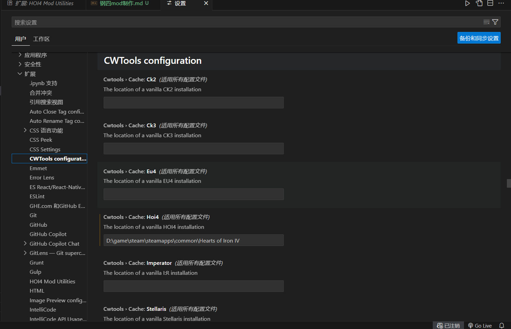
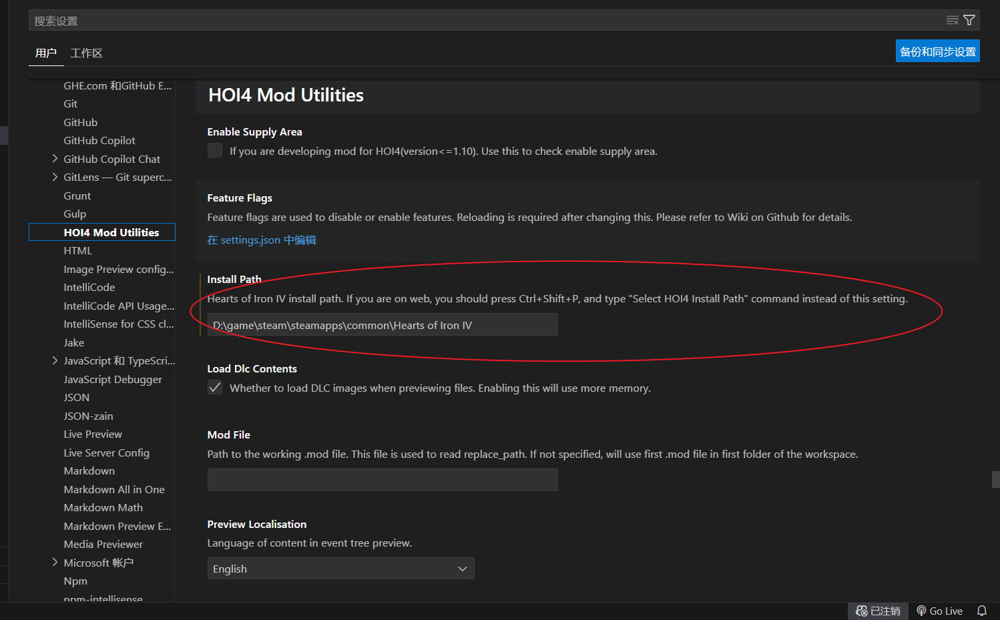
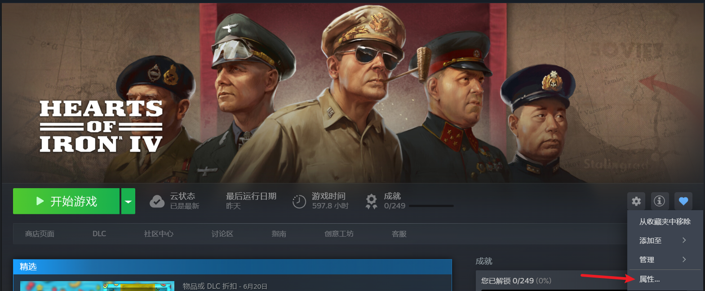
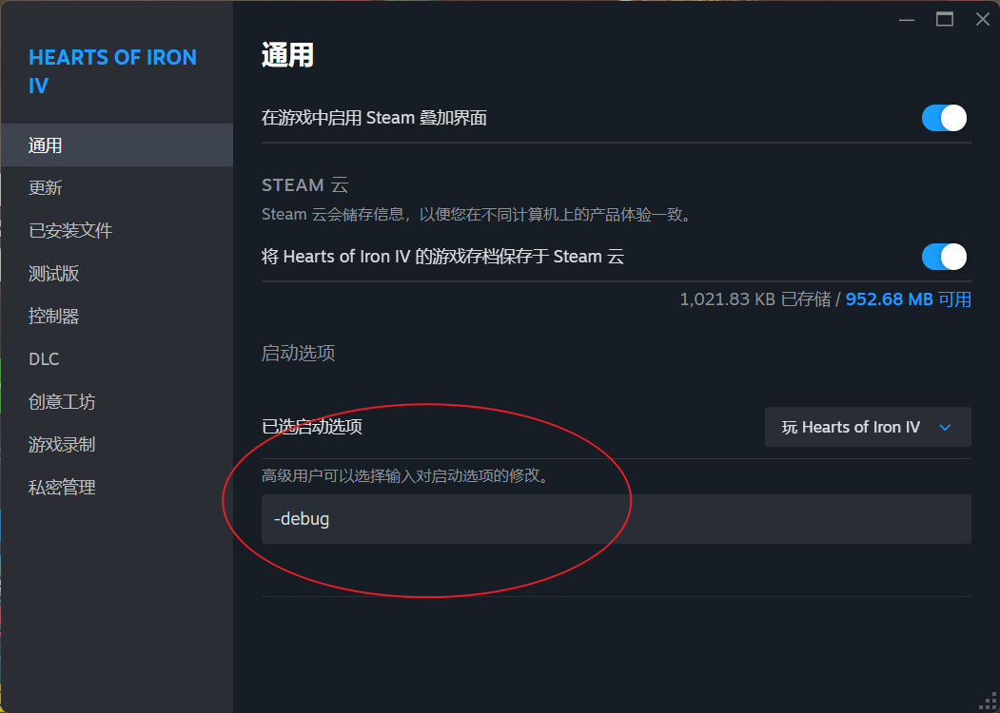
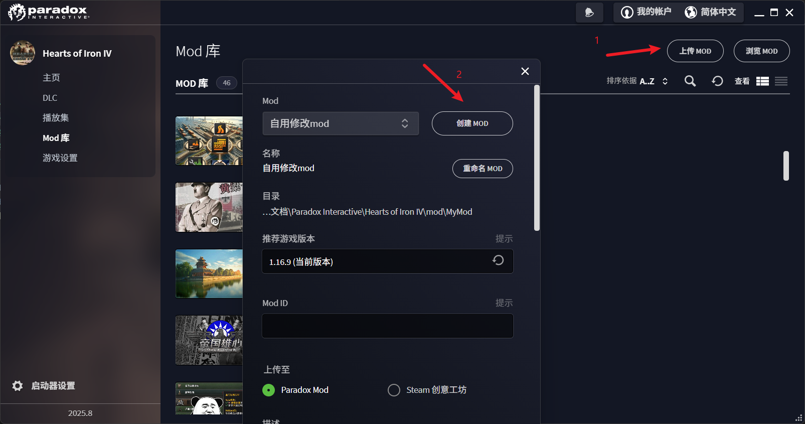
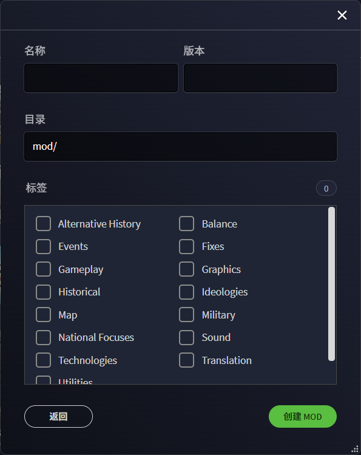
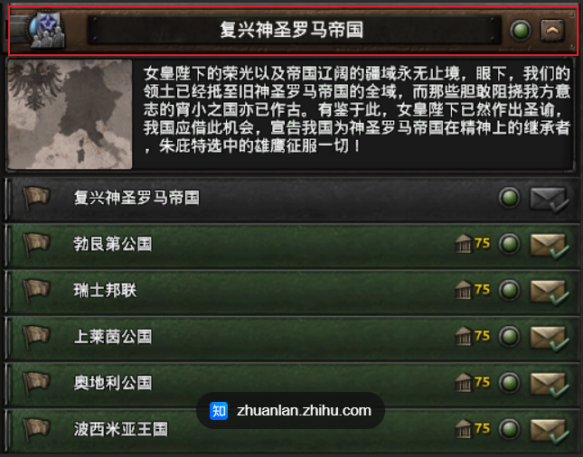

# mod制作

## 前置准备

首先使用VSCode安装`HOI4 Mod Utilities`和`CWTools - Paradox Language Servises`插件
接下来在扩展设置中告诉这两个插件钢四所在文件夹的位置

---

## 开发基础知识

### 开发流程与注意事项

#### 原理与基本要求

钢四的Mod开发主要是编写对应的`txt`、`gui`、`gfx`、`yml`等文本文件，大型Mod还会制作地图、自定义图标等，但大部分基本情况下，实际上只需要照着官方的文件改就行了。
在编写文本文件时，必须注意这些文件要求的编码格式，因为它们并不是统一的，最简单的避免编码出现问题的方法是**直接复制原游戏目录下对应路径下的文件**，然后改

钢四的Mod实际上就是**Mod优先级比原版高，同名文件覆盖原版文件，不同名文件做增量添加**。

需要注意的是，钢四的Mod开发必须保证如下要求
  + 文档在C盘
  + 没有中文路径，严格地说，要求路径上的字符全都是ASCii码
  + 不在One Drive文件夹里边(否则会导致游戏启动后，虽然勾选了Mod但是不生效)

---

#### 加载顺序

一般情况下，游戏会按照如下顺序加载:
  + 基础游戏内容
  + DLC
  + 用户文档下的相关文件
  + MOD
如果是同一个文件夹下的文件，其加载顺序则是将文件名按照ASCii码倒序排序的顺序加载的，即文件名的字符串更大的文件最先加载，文件名的字符串更小的文件靠后加载。

---

### debug调试与日志(Log)

调试模式可以使游戏随着游戏的开发而不断更新，而日志无论在什么开发中都是极为重要的一环。
日志的位置都位于`文档/Paradox Interactive/Hearts of Iron Ⅳ/logs`文件夹下

#### debug调试模式

debug模式可以使游戏在Mod文件发生变动时自动热更新而不需要重启游戏，大部分情况下的文件变动是可以通过热更新显示出来的，而少部分情况下，即使热更新了，Mod文件中的更改也不会生效，此时必须要重启游戏。
steam开启debug模式如下图所示，开启debug(调试)模式更利于mod开发

可以热更新的情况:本地化文件修改、决议效果修改、GUI界面修改、defines修改
无法热更新的情况:音乐修改、Idea修改图标

#### 报错日志

报错日志即error.log日志文件，在开启`-debug`启动项下启动游戏时，它会在游戏启动期间被自动打开并随着游戏启动逐步**记录游戏启动和游戏过程中出现的错误**，需要注意的是，**并不是写在文件中的报错就一定会导致游戏崩溃**

---

### Effects(效果)

Effects即对游戏数值非动态性影响的buff，它具体表现为民族精神、法案、顾问以及工厂等的效果，如`稳定度+10%`是Effect，但`稳定度每周增长+0.5%`就属于`Modifiers`，因为该修正会随时间增长动态影响稳定度

|分类|代码|作用|参数|备注|例子|
|:---:|:---:|:---:|:---:|:---:|:---:|
|**数据结构**|`set_country_flag`|设置国家级Flag|`<flag>`:给你的flag起个名字 `flag=<flag>`给你的flag起个名字 `days=<int>`flag的持续时间 `value=<int>`flag的值，需要是数字|有两种写法，一种简单，一种详细|`set_country_flag = my_flag` `set_country_flag = {flag = my_flag    days = 123  value = 1}`|
|**决议**|activate_mission|激活任务型决议|`<mission>`:任务型决议名称|无|`activate_mission = my_mission`|
|

---

### Triggers(条件)

Triggers就是触发条件，比如点击国策需要满足何种条件，点击决议需要满足何种条件。

---

### Modifiers(临时效果)

Modifiers可以简单地理解为是临时的Effects,它一般会在比较短的时间内给国家、省份或指定地块持续提供一些buff。

---

### Localisation(本地化)

本地化用于将对应的内容翻译为指定语言，就是翻译

---

### On actions(监听器/触发器)

监听器，顾名思义就是持续监听指定的行为，直到某个对象触发了该行为时，监听器就会执行对应操作。
实际上，该监听器也包含了定时器的功能

---

### Data structures(基本数据结构)

#### 变量

钢四的变量只能表示数字，虽然它也可以表示Idea、国家、省份、地区等，但是其实际上也是通过其内部的唯一数字ID标识来表示的。
变量遵循如下规则:
+ 仅能在Effect块和Trigger块中声明和使用
+ 如果要表示表面上是字符串的玩意（如：民族精神），需要这样表示:`set_variable={<var_name>=token:<idea_name>}`，即在赋值时，对要赋值的值前面加上`token`
+ 在读取变量时，需要使用`var:`做前缀，表示这里读取的东西是一个变量，如:

~~~bash
    swap_ideas = {
        remove_idea = var:NATIONAL_INDUSTRY_BUILD_STATE
        add_idea = NATIONAL_INDUSTRY_BUILD_PLAN_3
    }
~~~

#### flag

Flag通常用来表示布尔值（即真值(true)和假值(false)），但它并不是只能表示布尔值，它也可以表示其它东西，只是从常量层面，它不如Constants，而从灵活性层面，它又没有变量灵活。
flag有Global（全局）、Country（国家）、State（省份）、Character（字符）、MIO（军工组织）等作用域，它们都可以通过`set_xxx_flag`这样的Effect进行定义和修改，通过`clr_country_flag`进行移除。

---

#### Constants常量

常量，即全局不变的，写死了的值，一般可以存在于大部分`txt`或`gui`文件中。
如果要声明一个常量，只需要在对应的块中这样写:`@<Constant_Name> = <value>`，而读取时，这样读取:`cost=@<Constant_Name>`
常量适用于大量使用重复值、且一旦其中一个值变动其它值也要同步变动的场景，此时可以直接使用常量，在需要修改时只需要直接修改对应的常量值就可以减少很多工作量了。也就是说，常量的作用就是实现一个固定值的复用以及统一修改对应值。

---

---

### Defines(全局规则定义)

Defines中的

---

### 控制台命令

在进行Mod开发时，会使用`~`可以在开发时节省很多时间并提高开发效率，下面是一些**常见的，且对Mod开发有辅助作用**的控制台命令:

|命令|作用|参数|参数作用|备注|
|:---:|:---:|:---:|:---:|:---:|
|`gui`|使游戏显示gui文件编写的各个组件的名称、大小、位置等重要属性|>|无参|无|
|`ic`|立即建造，不需要走时间就能添加建筑|>|无参|无|
|`pp[ <number>]`|添加政治点数，默认加1000|`number`|指定要添加的政治点数值|无|

---

## 常见功能开发

### Mod创建

Mod新建流程如下，一般都是在P社的启动器里找到对应的mod选项，然后创建一个mod

之后在依次填写名称、版本、目录(路径一般和名称一致)和Tag

随后就能创建好了，刚创建的Mod只有一个descriptor.mod文件

`descriptor.mod`非常重要，它用来声明Mod的基本信息，它的结构如下所示:

~~~mod
    version="v0.0.1"  // 这是刚才填写的版本号
    // 这是Tags,在创意工坊检索时会用到
    tags={
        "Fixes"
    }
    name="自用修改mod"  // Mod的名称
    // 声明Mod的依赖，这在做子mod时才有用，声明以后本mod开发的内容将会覆盖其声明的父依赖mod内容
    dependencies={
        "52 Chinese Localisation"
    }
    // 声明以后，游戏启动时的对应路径下的全部文件(不包括文件夹)将会被全部覆盖
    // 默认是Mod内容里面的相同路径下存在同名文件时，才会被覆盖，该配置则会导致无论是否存在同名文件，游戏都只会读取Mod内容而不读取(即覆盖)原游戏内容
    replace_path="common/national_focus"
    supported_version="1.16.9"  // 支持的游戏版本，如果支持的游戏版本号不一致会报黄标

~~~

---

### 创建国家(Country)

要新建一个国家，需要从如下方面来设置:
  + `common/country_tags/`:用以设置国家缩写，以及该国家与其国家文件路径的关联关系
  + `common/countries/[countryName].txt`:用以设置国家颜色，以及引用对应的兵模
  + `common/countries/colors.txt`:用以设置国家颜色
  + `history/countries/[countryTag] - [countryName].txt`:用以设置该国家的基本信息
  + `history/states`:设置国家占有的地块
  + `localisation/simp_chinese/*_l_simp_chinese.txt`:国家基本信息文本的中文化
  + `gfx/flags`:设置国家国旗
  + `common/national_focus/[countryTag].txt`:编写国家国策树
  + `history/TAG_1936.txt`:设置国家开局士兵分布

---

### 决议(Decision)

---

### 国策(National Focus)

---

### 间谍

---

### 科研

---

### 贸易与战略资源(Resource)

---

### 建造

---

### 训练与部署

---

### 建造(Building)

---

### 电台(Music)

要自定义电台，首先要在`music`**或其子文件夹**里面添加`.ogg`格式的歌曲，并提供一个`*.asset`文件和一个`*.txt`文件，歌曲文件、`asset`文件和`txt`文件必须放在一起，也就是在同一级目录下。
**推荐`.ogg`文件的采样率为44.1KHz**，否则游戏会报错并记录在`log.error`中。
接下来要定义`.gui`文件，其位于`interface/*.gui`下，需要自己创建，其格式是固定的:
  + 将`MUSIC_STATION`修改为自己在`*.txt`文件中声明的电台名，**二者必须保持一致，否则电台将不会显示并在`error.log`中报错**
  + `quadTextureSprite`用于定义电台的封面图，他需要引用`interface/*.gfx`(该文件也需要自己创建并编写)中定义sprite的`name`值

~~~bash
    guiTypes = {
        containerWindowType = {
            name = "<MUSIC_STATION>_faceplate"
            position = { x =0 y=0 }
            size = { width = 590 height = 46 }

            iconType ={
                name ="musicplayer_header_bg"
                spriteType = "GFX_musicplayer_header_bg"
                position = { x= 0 y = 0 }
                alwaystransparent = yes
            }

            instantTextboxType = {
                name = "track_name"
                position = { x = 72 y = 20 }
                font = "hoi_20b"
                text = "Roger Pontare - Nar vindarna viskar mitt namn"
                maxWidth = 450
                maxHeight = 25
                format = center
            }

            instantTextboxType = {
                name = "track_elapsed"
                position = { x = 124 y = 30 }
                font = "hoi_18b"
                text = "00:00"
                maxWidth = 50
                maxHeight = 25
                format = center
            }

            instantTextboxType = {
                name = "track_duration"
                position = { x = 420 y = 30 }
                font = "hoi_18b"
                text = "02:58"
                maxWidth = 50
                maxHeight = 25
                format = center
            }

            buttonType = {
                name = "prev_button"
                position = { x = 220 y = 20 }
                quadTextureSprite ="GFX_musicplayer_previous_button"
                buttonFont = "Main_14_black"
                Orientation = "LOWER_LEFT"
                clicksound = click_close
                pdx_tooltip = "MUSICPLAYER_PREV"
            }

            buttonType = {
                name = "play_button"
                position = { x = 263 y = 20 }
                quadTextureSprite ="GFX_musicplayer_play_pause_button"
                buttonFont = "Main_14_black"
                Orientation = "LOWER_LEFT"
                clicksound = click_close
            }

            buttonType = {
                name = "next_button"
                position = { x = 336 y = 20 }
                quadTextureSprite ="GFX_musicplayer_next_button"
                buttonFont = "Main_14_black"
                Orientation = "LOWER_LEFT"
                clicksound = click_close
                pdx_tooltip = "MUSICPLAYER_NEXT"
            }

            extendedScrollbarType = {
                name = "volume_slider"
                position = { x = 100 y = 45}
                size = { width = 75 height = 18 }
                tileSize = { width = 12 height = 12}
                maxValue =100
                minValue =0
                stepSize =1
                startValue = 50
                horizontal = yes
                orientation = lower_left
                origo = lower_left
                setTrackFrameOnChange = yes

                slider = {
                    name = "Slider"	
                    quadTextureSprite = "GFX_scroll_drager"
                    position = { x=0 y = 1 }
                    pdx_tooltip = "MUSICPLAYER_ADJUST_VOL"
                }

                track = {
                    name = "Track"
                    quadTextureSprite = "GFX_volume_track"
                    position = { x=0 y = 3 }
                    alwaystransparent = yes
                    pdx_tooltip = "MUSICPLAYER_ADJUST_VOL"
                }
            }

            buttonType = {
                name = "shuffle_button"
                position = { x = 425 y = 20 }
                quadTextureSprite ="GFX_toggle_shuffle_buttons"
                buttonFont = "Main_14_black"
                Orientation = "LOWER_LEFT"
                clicksound = click_close
            }
        }

        containerWindowType={
            name = "<MUSIC_STATION>_stations_entry"
            size = { width = 162 height = 130 }
            
            checkBoxType = {
                name = "select_station_button"
                position = { x = 0 y = 0 }
                quadTextureSprite = "<SPRITE>"
                clicksound = decisions_ui_button
            }
        }
    }
~~~

`interface/*.gfx`可以以如下格式定义sprite:

~~~bash
    spriteType = {
        name = "<SPRITE>"  # sprite名称
        texturefile = "gfx//interface//topbar//musicplayer//<FILE NAME>.dds"  # 图片路径，也支持png、jpg等格式，图片大小应该为304 × 120
        noOfFrames = 2
    }
~~~

最后，可以在localisation的对应本地化文件中进行本地化翻译:
  + MUSIC_STATION即在`.txt`文件中定义的电台名

~~~yml
    <MUSIC_STATION>_TITLE: "localisation"  # 只需要翻译这一项就够了
~~~

---

# 汇总

## mod结构解析

Mod的目录结构是与钢四游戏本体的目录结构具有强一致性的，它的各个目录以及作用如下所示

~~~json
    "common":{
        "作用":"声明游戏最基本，也是最核心的内容",
        "内容":{
            "abilities":{},
            "aces":{},
            "ai_areas":{},
            "ai_equipment":{},
            "ai_focus":{},
            "ai_strategy":{},
            "ai_strategy_plans":{},
            "ai_templates":{},
            "autonomous_states":{},
            "bookmarks":{},
            "bop":{},
            "buildings":{"作用":"定义建筑栏中的建筑信息"},
            "characters":{},
            "continuous_focus":{},
            "countries":{"作用":"使对应国家引用声明的兵模，并声明国家颜色"},
            "country_leader":{},
            "country_tag_aliases":{},
            "country_tags":{"作用":"声明国家缩写与其对应的国家文件的关联关系"},
            "decisions":{"作用":"定义决议"},
            "defines":{"作用":"修改一些全局常量的值"},
            "difficulty_settings":{},
            "dynamic_modifiers":{"作用":"定义动态修正引用"},
            "equipment_groups":{},
            "focus_inlay_windows":{},
            "game_rules":{},
            "generation":{},
            "idea_tags":{},
            "ideas":{},
            "ideologies":{},
            "intelligence_agencies":{},
            "intelligence_agency_upgrades":{},
            "map_modes":{},
            "medals":{},
            "military_industrial_organization":{},
            "modifier_definitions":{"作用":"定义自定义修正键"},
            "modifiers":{"作用":"定义修正引用"},
            "mtth":{},
            "names":{},
            "national_focus":{},
            "occupation_laws":{},
            "on_actions":{},
            "operation_phases":{},
            "operation_tokens":{},
            "operations":{},
            "opinion_modifiers":{},
            "peace_conference":{},
            "profile_backgrounds":{},
            "profile_pictures":{},
            "raids":{},
            "resistance_activity":{},
            "resistance_compliance_modifiers":{},
            "resources":{},
            "ribbons":{},
            "scientist_traits":{},
            "scorers":{},
            "script_constants":{},
            "scripted_diplomatic_actions":{},
            "scripted_effects":{},
            "scripted_guis":{},
            "scripted_localisation":{},
            "scripted_triggers":{},
            "special_projects":{},
            "state_category":{},
            "technologies":{},
            "technology_sharing":{},
            "technology_tags":{},
            "terrain":{},
            "timed_activities":{},
            "unit_leader":{},
            "unit_medals":{},
            "unit_tags":{},
            "units":{},
            "wargoals":{},
            "acclimatation.txt":{},
            "achievements.txt":{},
            "ai_attitudes.txt":{},
            "ai_personalities.txt":{},
            "alerts.txt":{},
            "combat_tactics.txt":{},
            "event_modifiers.txt":{},
            "graphicalculturetype.txt":{},
            "msgrdk_achievements.json":{},
            "region_colors.txt":{},
            "script_enums.txt":{},
            "triggered_modifiers.txt":{},
            "weather.txt":{},
            "graphicalculturetype.txt":{},
            "graphicalculturetype.txt":{},
            "graphicalculturetype.txt":{}
        }
    },
    "events":{
        "作用":"",
        "内容":{
            
        }
    },
    "gfx":{
        "作用":"",
        "内容":{
            "3dviewenv":{},
            "aces":{},
            "achievements":{},
            "army_icons":{},
            "cursors":{},
            "entities":{},
            "event_pictures":{},
            "flags":{"作用":"定义国家使用的国旗"},
            "fonts":{},
            "FX":{},
            "game_rules":{},
            "interface":{},
            "keyicons":{},
            "leaders":{},
            "loadingscreens":{},
            "maparrows":{},
            "mapitems":{},
            "minimap":{},
            "models":{},
            "particles":{},
            "texticons":{},
            "train_gfx_database":{},
            "world":{},
            "HOI4_icon.bmp":{},
            "mip_debug.dds":{},
            "naval_combat.txt":{},
            "posteffect_volumes.txt":{}
        }
    },
    "history":{
        "作用":"",
        "内容":{
            "countries":{"作用":"定义国家开局的基本信息，即国家初始化","命名格式":"[国家缩写] - [国家名].txt"},
            "general":{},
            "states":{"作用":"定义省份的基本信息"},
            "units":{}
        }
    },
    "interface":{
        "作用":"",
        "内容":{
            "buildings":{},
            "career_profile":{},
            "equipmentdesigner":{},
            "integrity":{},
            "international_market":{},
            "military_industrial_organization":{},
            "military_raids":{},
            "notifications":{},
            "pdx_online":{},
            "special_projects":{},
            "widgets":{},
            "_dynamic_modifiers.gfx":{},
            "_leader_portraits.gfx":{},
            "_random_portraits.gfx":{},
            "_scientists_portraits.gfx":{},
            "aat_traits.gfx":{}
        }
    },
    "localisation":{
        "作用":"",
        "内容":{
            "braz_por":{},
            "english":{},
            "french":{},
            "german":{},
            "japanese":{},
            "polish":{},
            "russian":{},
            "simp_chinese":{"作用":"中文本地化"},
            "spanish":{},
            "ignored_loc_keys.txt":{},
            "languages.yml":{}
        }
    },
    "music":{
        "作用":"",
        "内容":{
            "hoi2":{},
            "hoi3":{},
            "_songs.txt":{},
            "music.asset":{}
        }
    },
    "portraits":{
        "作用":"声明该Mod的名称、版本号、依赖、适配游戏版本等基本信息",
        "内容":""
    },
    "descriptor.mod":{
        "作用":"声明该Mod的名称、版本号、依赖、适配游戏版本等基本信息",
        "内容":""
    },
    "thumbnail.png":{
        "作用":"在创意工坊以及启动器做封面图",
        "内容":""
    }
~~~

## 各文件格式详解

### common

#### buldings

buildings文件夹下的txt文件主要用于定义游戏中使用民用工厂可以建造的建筑，其主要格式如下:

~~~bash
    buildings = {
        landmark_big_ben = {
            base_cost = 20000  # base_cost表示建筑成本
            per_level_extra_cost = 1000  # 每升一级，就额外增加的成本
            per_controlled_building_extra_cost = 100 # 被国家控制，但并不是该国家的核心领土时，每升一级额外增加的成本
            dlc_allowed = { has_dlc = Gotterdammerung }
            show_on_map = 1
            damage_factor = 0.1 # 设定此建筑收到空袭或陆军攻击所收到的伤害，置0时不会受到伤害，置正数时会增加受到的伤害，而置负数时会抵消对应伤害
            icon_frame = 22
            value = 5  # 建筑的耐久值，当收到空袭时会扣除，同时它也会决定在和谈时其所在省份的和谈点数价值
            is_buildable = no
            disable_grow_animation = yes
            spawn_point = landmark_spawn
            repair_speed_factor = @landmark_repair_speed_factor
            only_display_if_exists = yes
            special_icon = GFX_big_ben_icon_small
            level_cap = {
                province_max = 1
            }
            always_shown = yes
            show_modifier = yes
            country_modifiers = {
                enable_for_controllers = { ENG }
                modifiers = {
                    political_power_factor = 0.03 # England has a lot of pp sinks, so this is simply a small helpful bump on the way
                }
            }
        }
    }
~~~

#### countries

该文件夹下的文件用以**引用国家兵模和定义国家颜色**
该文件夹下有两种文件，一种是单独的`colors.txt`文件，另一种是国家文件。国家文件在制作自定义国家时可以随意命名，而`colors.txt`则只能被覆盖
首先看国家文件:

~~~bash
    graphical_culture = eastern_european_gfx  # 设置国家兵模
    graphical_culture_2d = eastern_european_2d  # 设置国家兵模

    #graphical_culture = middle_eastern_gfx
    #graphical_culture_2d = middle_eastern_2d

    # 设置国家在地图上的颜色，默认是RGB格式的，也支持HSV格式，如果是RGB格式，可以在大括号前加rgb也可以不加，而HSV必须在大括号前面加上“HSV”，如 color = hsv{ 184 21 198 }
    # 如果认真看的话，可以发现我们实际游戏中定义的国家和我们在文件中编写的颜色有一些区别，但这是正常的，原因请见下面的 注意 ，或参见P社官方的HOI4 WIKI: https://hoi4.paradoxwikis.com/Country_creation#Country_file，里面有解释详细的原因
    color = { 184 21 198 }
~~~

接下来是`colors.txt`文件，其实主要就是对国家颜色的再定义

~~~bash
    #reload countrycolors

    GER = {
        color = HSV { 0.1 0.15 0.4 }
        color_ui = rgb { 138 155 116 }
    }
    ENG = {
        color = rgb { 201 56 93 }
        color_ui = rgb { 255 73 121 }
    }
    SOV = {
        color = rgb { 125 13 24 }
        color_ui = rgb { 163 17 31 }
    }

    ...
~~~

> 注意:
> 我们指定对应的颜色时，**游戏在启动时并不会完全遵照我们自己提供的RGB或HSV来渲染颜色，而是会对颜色的颜色值和饱和度的值与对应系数进行相乘**，最终根据这个结果渲染呈现在页面上的颜色。

---

#### country_tags

该文件夹下的文件用来**声明国家缩写与其对应的国家文件的关联关系**，目前包含两个文件:`00_countries.txt`以及`zz_dynamic_countries.txt`
`00_countries.txt`主要用来定义初始国家的缩写(TAG)以及国家文件引用路径
`zz_dynamic_countries.txt`主要用来定义动态国家(如内战爆出来的国家)的缩写(TAG)以及国家文件引用路径

~~~bash
    # 格式就是 缩写 = "文件路径"
    GER	= "countries/Germany.txt"
    ENG = "countries/United Kingdom.txt"
~~~

以下的TAG是被**禁止使用**的，因为它们涉及到了一些关键字:

|非法缩写TAG|非法原因|
|:---:|:---:|
|**RED**|在自定义地图模式中作为变量存在|
|**OOB**|作为参数用于决定战斗文件的加载顺序|
|**NUM**|用于存储数组的元素数量|
|**LOG**|此参数用于记录日志|
|**TAG**|此参数用于检查所选国家/地图的触发器|
|**NOT**|取反运算符，用于布尔运算|
|**AND**|与运算符，用于布尔运算|
|**以数字开头**|以数字开头是非法的，这很容易理解，因为这会使该ID指代的是国家还是省份或者地块被混淆。从编程的角度来看，几乎所有主流编程语言都不支持变量以数字开头|

---

#### decisions

详情参见[钢四wiki](https://hoi4.paradoxwikis.com/Decision_modding)
decisions用于定义决议，为了定义决议，需要在`decisions/categories`文件夹下创建txt文件并声明一个`category`，再在decisions文件夹下创建一个txt以声明决议
  + `category`相当于是游戏里众多决议里的一个分类目录一样，它下面包含多个决议，就是下面这个玩意

  + 而决议就好理解了，就是上图中`category`目录下的各个决议

##### categories

首先是`category`，只需要在文本文件中这样编写:

~~~bash
    # 决议组名称，可以被本地化
    POL_my_category={}
~~~

这样，一个决议组就被声明了，接下来介绍其参数:

###### 基本参数

`icon`用来声明决议组图标，图标显示在决议组标题的左侧
`priority`用来声明决议组的优先级，值越大，其在游戏中的决议栏里越靠上
`picture`用来设置决议的图片，如上面的神罗决议，就有张神罗版图的图片，它在描述文本的左边
`visible_when_empty`用来设置是否在决议组为空时依旧显示该决议组

~~~bash
    priority = 10
    picture = GFX_decision_category_picture  # 直接使用定义在/Hearts of Iron IV/interface/*.gfx中定义的name值
    icon = POL_category  # 直接使用定义在/Hearts of Iron IV/interface/*.gfx中定义的name值
    visible_when_empty = yes
~~~

###### 触发块

`allowed`用来在游戏开始时判断是否某个国家可以看到并使用该决议组。仅在游戏开始时、重新读档或决议重新加载时判断。
如果可以，尽量使用allowed而不是visible以及available去判定国家是否能够使用该决议组，因为visible以及available的判断频率很高(应该是一天，wiki中使用frame作为单位，不是很清楚frame到底代表什么)，这会对CPU造成负担
allowed中通常用来判断是否为指定国家或是否拥有对应的DLC

~~~bash
    allowed = {
        tag = POL
    }
~~~

`visible`用来决定是否显示该决议组，它的判断频率高，仅在allowed为true，有决议可供选择且该决议组设置了在决议栏中可见时它才会显示出来。

~~~bash
    visible = {
        has_completed_focus = my_focus
    }
~~~

`available`用来决定决议组是否可用，它的判断频率高，如果不满足条件，那么决议组会显示出来，但是不能点。

~~~bash
    has_war = yes
~~~

###### 省份高亮

`highlight_states`用于配置省份高亮，典型样例就是一些MOD的苏联五年计划决议要求在指定省份建设民工、军工时，这些省份会在地图上高亮显示
highlight_states的代码块中支持多种选择形式:
  + `highlight_state_targets`:直接指定state
  + `highlight_states_trigger`:使用条件语句确定高亮省份
  + `highlight_provinces`:在 补丁 'Stella Pollaris' 1.13.6 以后新添加的，它将高亮程度精确到了省份地块
  + `highlight_color_before_active`:在开启决议之前，高亮显示的颜色，范围从0到3，未设置默认为白色轮廓
  + `highlight_color_while_active`:在开启决议之后，而决议定时器未结束时省份高亮显示的颜色，范围从0到3，未设置默认为白色轮廓

~~~bash
    highlight_states = {
        highlight_states_trigger = {
            is_owned_by = ROOT
            is_capital = yes
        }
        highlight_state_targets = {
            state = 123
            state = 321
        }
        highlight_provinces = { 123 213 321 232 }
        highlight_color_before_active = 2
        highlight_color_while_active = 3
    }
~~~

###### 地图区域显示

`on_map_area`用于设置地图区域显示的决议组，该决议组比较特殊，它会将世界地图的部分区域映射在决议上，并能够实时显示这些区域各个省份或地区的状态，地图区域将会显示在决议组最上面。
`on_map_area`实际上算是一种新的决议组类型，因此除available外，它支持决议和决议组支持的**所有条件语句**。

~~~bash
    on_map_area = {
        name = occupied_states_map_area  # 这是将视角移动到地图区域的决议名称
        state = 123 # 设置state以后，点击地图，视角就会以设置的该省份为中心，移动到对应区域，相当于设置一个参照物
        targets = { capital }  # targets属条件语句
        zoom = 350  # 控制展示在决议上的地图的缩放大小，区间在50~3000
    }
~~~

###### Scripted GUI

`scripted_gui`决议也支持与GUI一起搭配起作用

~~~bash
    scripted_gui = POL_scripted_gui
~~~

###### 示例

~~~bash
    # 首先最外面这个被赋值的东西就是category，可以在localisation中的yml文件中被本地化处理
    POL_my_category = {
        # allowed用来在游戏开始时判断是否某个国家可以看到并使用该决议组。仅在游戏开始时、重新读档或决议重新加载时判断。
        # 如果可以，尽量使用allowed而不是visible以及available去判定国家是否能够使用该决议组，因为visible以及available的判断频率很高(应该是一天，wiki中使用frame作为单位，不是很清楚frame到底代表什么)，这会对CPU造成负担
        # allowed中通常用来判断是否为指定国家或是否拥有对应的DLC
        allowed = {
            tag = POL
        }
        priority = 10  # 决议组的优先级，优先级越高，其在游戏中的决议栏里越靠上
        picture = GFX_decision_category_picture  # 可以选择给决议添加图片，
        icon = POL_category  # 决议的图标，如上面的神罗决议，该图标在决议组标题的左侧
        visible_when_empty = yes  # 如果决议组中的决议为空，那么也显示该决议组
        scripted_gui = POL_scripted_gui  # 设置决议的自定义GUI
    }

    my_map_category = {
        visible = {
            has_completed_focus = my_focus
        }
        icon = my_map  
        highlight_states = {
            highlight_states_trigger = {
                is_owned_by = ROOT
                is_capital = yes
            }
            highlight_state_targets = {
                state = 123
                state = 321
            }
            highlight_provinces = { 123 213 321 232 }
            highlight_color_before_active = 2
            highlight_color_while_active = 3
        }
        # 决策上还可以显示地图的部分区域，该地图会显示在决议组的最顶层，点击地图会使视角移动到对应的省份附近
        # on_map_area实际上算是一种新的决议组类型，因此除available外，它支持决议和决议组支持的所有触发器语句
        on_map_area = {
            name = occupied_states_map_area  # 这是将视角移动到地图区域的决议名称
            state = 123 # 设置state以后，点击地图，视角就会以设置的该省份为中心，移动到对应区域，相当于设置一个参照物
            targets = { capital }  # 
            zoom = 350  # 控制展示在决议上的地图的缩放大小，区间在50~3000
        }
    }
~~~

##### decision

###### 基本决议

基本决议即花费指定数量的政治点数，点击以后就会生效并赋予一些效果的决议，下面是其例子:

~~~bash
    # 在decision的文件中，决议属于决议组，因此最外层是决议组的名字，里面是这个决议组包含的决议
    # 这是示例1
    QAT_category = {
        # 这是决议名，支持本地化
        QAT_example = {
            # allowed是一种trigger块，其仅在游戏刚开局或加载存档时触发，一般用它来检验游玩的国家、是否存在对应的DLC等
            allowed = {
                tag = QAT
            }
            # visible也是一种trigger块，它会持续每帧都检查是否满足对应的条件，如果满足就显示，不满足就不显示。
            visible={
                ROOT={
                    OR={
                        has_idea=idea_name
                    }
                }
            }
            # available也是一种trigger块，它会持续每帧都检查是否满足对应的条件，无论条件是否满足，它都会显示。
            # 同时，当玩家的光标移动到对应决议上时，它会详细的显示该决议是因为满足/不满足available的什么条件才能执行/不能执行的
            # 由于available和visible是每帧都会检查，由于检查频率过高
            # 因此它们是导致玩家点开决议栏后，游戏流动时间显著变慢的最主要原因
            available={
                ROOT={
                    OR={
                        has_idea=idea_name
                    }
                }
            }
            icon = QAT_example  # icon负责设置它左侧的图标，与category一样，原版游戏的决议icon图标可以在gfx/interface/dicisions找到
            cost = 50 # 决议花费的政治点数
            # 是否在决议组中的决议为空时，也显示该决议组
            visible_when_empty = yes
            fire_only_once = yes  # 该决议是否只能执行一次
            # priority可以更改决议组或决议的显示顺序，其值越大，显示就越靠上
            # 除下面展示的这种写法外，还有一种简洁写法 : priority = 10
            # 下面的意思是除波兰的优先级是13外，其它国家的该决议的优先级是3
            priority={
                base = 3
                modifier = {
                    add = 10
                    tag = POL
                }
            }
            # complete_effect提供的效果在点击决议后就会生效
            complete_effect = {
                hidden_effect = {
                    add_command_power = -15
                }
                annex_country = { target = QAT }
                random = {
                    chance = 50
                    OMA = { load_oob = "OMA_prepared" }
                }
                declare_war_on = {
                    target = OMA
                    type = annex_everything
                }
            }
        }
    }
~~~

###### 持续性决议

持续性决议通常在点击后会持续一段时间，在点击时、持续时间结束后以及中途中断时都可以带来一些效果:

~~~bash
    category_name={
        decision_name={
            visible={tag=QAT}
            cost = 10
            icon = GFX_decision_category_SOV_merge_designers
            days_remove = 30  # 该决议正常会持续多长时间
            days_re_enable = 100 # 该决议完成后，经过多少天后决议会再次出现，默认不指定的情况下，第二天决议就会重新出现
            # complete_effect提供的效果在点击决议后就会生效，无论决议是否走完其持续时间
            complete_effect = {
                set_country_flag = TEST_FLAG
            }
            # 这是决议持续期间，带来的效果，上面是30天，那么这里就是持续的30天内带来的效果
            modifier = {
                political_power_cost = 0.5
            }
            # 这也是决议持续期间，带来的效果，不过它是targeted_modifier块，具有指向性和针对性
            targeted_modifier = {
                tag = ENG
                attack_bonus_against = 0.1
                defense_bonus_against = -0.15
            }
            # 这是决议持续时间结束后带来的效果，即30天正常结束后带来的效果，同时modifier因为过了30天，会失效
            remove_effect={
                swap_ideas = {
                    remove_idea = var:TEST_IDEA
                    add_idea = TEST_IDEA
                }
                ROOT={
                    set_variable={TEST_STATE=token:TEST_VAR}
                    clr_country_flag = TEST_FLAG
                }
            }
            # 当cancel_trigger中的限制条件为true时，决议在持续期间会被中断，且remove_effect不会执行，而是会转而执行cancel_effect
            cancel_trigger = { amount_research_slots > 4 }
            # cancel_effect是决议在持续期间因为cancel_trigger的条件被满足而被异常中断时而执行的effect块
            cancel_effect = { 
                swap_ideas = {
                    remove_idea = var:TEST_IDEA
                    add_idea = TEST_IDEA
                }
            }
        }
    }

~~~

---

###### 任务型决议

任务型决议即决议的显示模式是倒计时模式的，它要求玩家在规定时间完成一些任务以获得奖励，或者要求玩家坚持到决议倒计时结束以获得奖励。
这种类型的决议选项与常规决议的选项基本上是一致的，但是还是存在一些差异。
这种类型的决议常见于类似内战拖时间、一些苏联MOD的五年计划的决议组中。
例:

~~~bash
    category_name={
        my_mission = {
            # activation用于替代visible，因为在任务型决议中，visible是一个失效的属性
            activation = {
                has_civil_war = yes
            }
            # 当available为true时，complete_effect将会生效，且任务将被完成
            available = {
                has_civil_war = no
                has_war = yes
            }
            # 当cancel_trigger为true时，任务也会中断，但此时执行的是cancel_effect而不是complete_effect
            cancel_trigger = {
                has_war = no
            }
            icon = mission_icon
            # 置为yes会使决议的tooltip显示complete_effect为失败时的效果，而置为no则反之，主要用于顺应玩家的直觉，加快玩家对该决议的理解
            is_good = yes  
            war_with_on_timeout = SOV  # 该选项会使游戏假设若任务超时将向苏联宣战，同时盟友也会收到该信息
            days_mission_timeout = 100  # 任务的倒计时天数
            selectable_mission = yes  # 置为yes会使该决议变成一个带按钮的决议，只有点击了按钮之后，任务倒计时才会开始
            # 当available为true时，complete_effect将会生效，且任务将被完成
            complete_effect = {
                add_ideas = my_idea
            }
            # 任务倒计时结束，赋予的效果
            timeout_effect = {
                declare_war_on = {
                    target = SOV
                    type = annex_everything
                }
            }
        }
    }
~~~

---

#### defines

defines文件夹下的文件是lua文件，它用于定义或修改游戏中的全局常量，如 国策花费的基本日期系数、国策最长能保存的时间、最大陆军经验限制等
原版游戏的该目录下存在`00_defines`的文件，但**作为Mod不应该包含该文件**，因为该文件用于初始化这些全局常量，而Mod下的文件一旦与该文件重名，则就会导致原版游戏文件被覆盖，若Mod下的该文件声明的全局常量不全或有错误，游戏就会发生崩溃。
对于defines的常量名以及值，参见[此处](https://hoi4.paradoxwikis.com/Defines)，或见笔记的汇总部分的[常用Defines](#defines)
对于Mod的defines文件夹下的lua脚本内容，我们可以这样编写:
  + 这样编写的作用是仅修改对应的键值对，而保证其它无关键值对不受修改

~~~lua
    NDefines.NGame.START_DATE = "1936.1.2.12" -- 游戏的开始时间
    NDefines.NGraphics.COUNTRY_FLAG_TEX_MAX_SIZE = 2048 
~~~

如果我们修改的defines过多，那么上面的写法可能看起来就会很乱，那么我们也可以以如下方式编写:

~~~lua
    -- 如果以此方式声明，最外层的key名称不能叫NDefines，因为如果叫这个，游戏就会认为Mod提供的文件企图提供一个新的NDefines来替换掉原版游戏提供的初始化的NDefines，大概率会崩溃，崩溃原因一般为缺少指定的键值对
    -- 这种声明lua表的编写格式类似JSON格式，每个键值对之间使用逗号隔开，键值对的值被赋多个键值对时使用大括号包住里面的值
    NCustomDefines = {
        NGame={
            START_DATE="1936.1.2.12"
        },
        NGraphics={
            COUNTRY_FLAG_TEX_MAX_SIZE=2048
        }
    }

    -- 最下面的是将我们上面定义的lua表的对应键值对替换到全局的NDefines lua表中去，从而使其生效

    for k1, v1 in pairs(NCustomDefines) do
        -- 遍历该类别下的所有自定义值
        for k2, v2 in pairs(v1) do
            -- 如果目标表中存在这个键，则覆盖
            NDefines[k1][k2]=v2
        end
    end
~~~

---

### history

#### countries

该文件夹下的文件用来**定义国家开局的基本信息**，即国家初始化。其命名格式也有要求，需要`[国家TAG][额外命名].txt`，注意此处命名格式的空格也是必须的。
该命名格式要求文件名的前三个字符是国家缩写TAG，后面的东西想怎么写怎么写,如`GER_aefseg.txt`、`GER - GERMANY.txt`等，一般推荐以`[国家TAG] - [国家英文全称].txt`为命名格式编写
由于是定义国家基本信息的，因此信息量很大，格式也很长:

~~~bash
    capital = 121 #设置首都，此处是设置的省份ID
    oob = "SCO_1936"  # 加载位于history/units中的军队文件，使国家拥有该军队，它不是一个effect，无法作用在其它语句中（如if语句）
    # set_oob = "ABK_1936"  # 与上面的情况同理，区别是它是一个effect，可以作用在其它语句中
    # set_air_oob = "xxx" # 加载空军
    # set_naval_oob = "xxx" # 加载海军
    
    # 可以直接在文件中写effect
    set_research_slots = 3  # 设置科研槽数量，不指定默认拥有2个
    set_stability = 0.7 # 设置稳定度
    set_war_support = 0.5 # 设置战争支持度

    # Starting tech 设置开局拥有的科技
    set_technology = {infantry_weapons = 1}

    # 设置国家领导人，在设置政治信息后再设置领导人可能会导致其无法正常显示，推荐将其放在政治信息设置的前面
    # 如果使用该effect指定了多个国家领导人，且它们都属于同一个政党，最先声明（最上面）的领导人会生效
    # 不能将该行置于文件的最后一行，否则会设置失败，解决办法是将代码提前或向后增加空行
    recruit_character = ABK_kirilli_bechvaya

    # 设置ideas，包括 贸易-经济-军事法案、民族精神以及工业厂商
    # 如果未设置法案，那么按照 重视出口-民营经济-志愿兵役制 赋予国家法案
    add_ideas = {
        henschel
        GER_autarky_idea
        #laws #Remember that the sharp sign is used to mark comments.
        war_economy
        extensive_conscription
    }

    # 条件判断
    if = {
        limit = { has_dlc = "Man the Guns" }
        set_technology = {
            basic_naval_mines = 1
            submarine_mine_laying = 1
            early_ship_hull_light = 1
            early_ship_hull_submarine = 1
            basic_ship_hull_submarine = 1
            basic_battery = 1
            basic_torpedo = 1
            basic_depth_charges = 1
        }
        create_equipment_variant = {
            name = "Celtic Series"
            type = ship_hull_submarine_1
            name_group = SCO_SS_HISTORICAL
            modules = {
                fixed_ship_torpedo_slot = ship_torpedo_sub_1
                fixed_ship_engine_slot = sub_ship_engine_1
                rear_1_custom_slot = empty
            }
            obsolete = yes
        }
        set_naval_oob = "SCO_1936_naval_mtg"
    }

    # 向指定目标设置额外effect
    ENG = {
        if = {
            limit = {
                has_dlc = "Together for Victory"
            }
            set_autonomy = {
                target = SCO
                autonomous_state = autonomy_integrated_puppet
            }
        }
        else = {
            puppet = SCO
        }
    }

    # 使用日期可以设置指定时间的剧本下，该国家的额外effect
    # 意思是在此时间下开始的剧本会被附加额外的effect,当然上面定义的基本effect也会生效
    1939.1.1 = {
        oob = "SCO_1939"
        set_technology = {
            atomic_research = 1
            nuclear_reactor = 1
            nukes = 1
        }
    }

    

    # 设置执政党基本信息
    set_politics = {
        ruling_party = democratic  # 设置执政意识形态
        last_election = "1936.1.1"  # 最后选举时间
        election_frequency = 48  # 选举周期，单位:月
        elections_allowed = yes  # 是否允许选举
    }

    # 本国意识形态基本信息，需要总和为100
    set_popularities = {
        democratic = 60  # 民主
        fascism = 30  # 法西斯
        communism = 10  # 共产
        neutrality = 0  # 中立
    }

    

    
~~~

---

#### states

用来**进行省份基本信息的定义**，命名格式为`[递增数字]-[省份名称].txt`
在钢四中，我们认为的省被称为State(州)，而我们认为的市/地块被称为Province(省)，后续描述将仍以中国式理解（即省、地块等名词）编写下去。

~~~bash

    state={
        id=1 # 设置省份ID，一般与所属文件的递增数字一致
        name="STATE_1" # 格式为 [STATE]_[id]
        manpower = 322900  # 设置省份人力
        
        state_category = town  # 设置省份发展情况

        history={
            owner = FRA  # 设置省份当前归属于那个国家管，写缩写
            victory_points = { 3838 1 }  # 设置胜利电，格式为 [地块ID1] [胜利点] [地块ID2] [胜利点]
            # 设置省份拥有的建筑
            buildings = {
                infrastructure = 2 
                industrial_complex = 1
                air_base = 1
                3838 = {
                    naval_base = 3
                }
            }
            add_core_of = COR  # 设置哪些国家对该省份有宣称，写缩写
            add_core_of = FRA
        }

        # 设置该省份下辖的地块
        provinces={
            3838 9851 11804 
        }

        local_supplies=0.0 
    }

~~~

---

### localisation

#### simp_chinese

用来进行国际化(I18n)翻译，是yml文件格式，key为常量名，value为翻译文本。命名格式为`[前缀]_l_simp_chinese.yml`

~~~yml
l_simp_chinese:
  TST_fascism: "测试民族国"
~~~

---

### music

music文件夹中用于存储电台可以播放的歌曲，支持使用子文件夹根据各个电台进行歌曲分类。
歌曲需要是`.ogg`格式的，并需要提供一个`*.asset`文件和一个`*.txt`文件，歌曲文件、`asset`文件和`txt`文件必须放在一起。
**推荐`.ogg`文件的采样率为44.1KHz**，否则游戏会报错并记录在`log.error`中
`*.asset`文件用于提供歌单，游戏会读取其歌单内容呈现在游戏中的电台歌单中，其具体格式为:

~~~bash
    music = {
        name = "song_name"  # 歌曲的名称，支持中文，这就是直接显示在电台歌单中的歌曲名称
        file = "song_file.ogg"  # 要读取的歌曲路径，因为是同级的直接写歌曲的文件名即可
        volume = 0.65  # 播放歌曲时的音量
    }
    music = { ... }  # 下一首歌
~~~

`*.txt`文件用于定义电台，必须将歌曲归属到对应的电台，游戏才能正常播放歌曲。具体格式为:

~~~bash
    music_station = "station_name"  # 定义歌曲所属的电台的名称
    music = {
        song = "song_name"  # 歌曲的名称，需要与.asset文件中的歌曲名保持一致
        # 当播放模式为Weighted Shuffle(加权随机)时，播放该歌曲的概率
        chance = {
            factor = 1  # factor是基础概率，该值越高，播放歌曲的概率越高
            add = 1  # add用于增加播放概率
            base = 10  # base用于完全替换chance代码块中的值
            # modifier用于在满足其条件时修改播放该歌曲的概率
            modifier = {
                factor = 0
                has_war = no
            }
        }
    }
    music = { ... }  # 下一首歌
~~~

---

## 键值汇总

### Defines

这里仅收录常用的defines,全部请参见[维基百科](https://hoi4.paradoxwikis.com/Defines)

|分类|Key|作用|默认值|值|备注|
|:---:|:---:|:---:|:---:|:---:|:---:|
|**国家/NCountry**|`DAYS_OF_WAR_BEFORE_SURRENDER`|战争持续的最短天数|7|数值|无|
|**科研/NTechnology**|`BASE_RESEARCH_POINTS_SAVED`|科研槽能够保留的最大科研天数进度|30.0|浮点数值|无|
|**政治/NPolitics**|`BASE_POLITICAL_POWER_INCREASE`|每天增加的政治点数基值|2|数值|无|
|**工厂建造/NProduction**|`MAX_CIV_FACTORIES_PER_LINE`|建造一个建筑时，同时建造该建筑的最大民工数量|15|数值|无|
|^|`MINIMUM_NUMBER_OF_FACTORIES_TAKEN_BY_CONSUMER_GOODS_VALUE`|生产消费品所需的最低民用工厂数量|1|数值|以默认值举例，如果我有100座总工厂，那么我生产消费品的民工最少只能减少到 1 座|
|^|`MINIMUM_NUMBER_OF_FACTORIES_TAKEN_BY_CONSUMER_GOODS_PERCENT`|生产消费品所需的最低民用工厂数量占总工厂数量的百分比|0.1|浮点数|以默认值举例，如果我有100座总工厂，那么我生产消费品的民工最少只能减少到 100*0.1=10座|
|^|`MAX_CIV_FACTORIES_PER_LINE`|建造建筑的最大民用工厂数量上限|15|数值|无|
|^|`DEFAULT_MAX_NAV_FACTORIES_PER_LINE`|建造小型海军船只时分配的最大海军船坞上限|10|数值|无|
|^|`FLOATING_HARBOR_MAX_NAV_FACTORIES_PER_LINE`|建造浮动港口时分配的最大海军船坞上限|5|数值|无|
|^|`CONVOY_MAX_NAV_FACTORIES_PER_LINE`|建造运输船时分配的最大海军船坞上限|15|数值|无|
|^|`CAPITAL_SHIP_MAX_NAV_FACTORIES_PER_LINE`|建造大型船只时分配的最大海军船坞上限|5|数值|无|
|^|`MAX_MIL_FACTORIES_PER_LINE`|生产军用装备时分配的最大军用工厂数量上限|150|数值|无|
|^|`RAILWAY_GUN_MAX_MIL_FACTORIES_PER_LINE`|生产列车炮时分配的最大军用工厂数量上限|5|数值|无|
|**军事/NMilitary**|`CORPS_COMMANDER_DIVISIONS_CAP`|正常情况下，一个集团军将领能够指挥的师数量|24|数值|无|
|^|`FIELD_MARSHAL_ARMIES_CAP`|正常情况下，一个元帅能够指挥的集团军数量|5|数值|无|
|^|`BASE_DIVISION_BRIGADE_GROUP_COST`|修改编制时，添加一个团需要多少陆军经验|5|数值|无|
|^|`BASE_DIVISION_BRIGADE_CHANGE_COST`|修改编制时，添加一个新列需要多少陆军经验|20|数值|无|
|^|`BASE_DIVISION_SUPPORT_SLOT_COST`|修改编制时，添加一个支援营的花费|10|数值|无|
|^|`MAX_DIVISION_SUPPORT_WIDTH`|支援连的最大列数量|1|数值|无|
|^|`MAX_DIVISION_SUPPORT_HEIGHT`|支援连的最大行数量|5|数值|无|
|^|`MAX_ARMY_EXPERIENCE`|陆军经验最大上限|500|数值|无|
|^|`MAX_NAVY_EXPERIENCE`|海军经验最大上限|500|数值|无|
|^|`MAX_AIR_EXPERIENCE`|空军经验最大上限|500|数值|无|
|^|`FIELD_EXPERIENCE_MAX_PER_DAY`|玩家每天可以获得的最大陆军经验|1.2|浮点数|无|
|^|`TRAINING_MAX_DAILY_COUNTRY_EXP`|每天通过训练能获得的最大陆军经验|0.08|浮点数|无|
|^|`LAND_EQUIPMENT_BASE_COST`|陆军装备改装基础花费|10|浮点数|无|
|^|`LAND_EQUIPMENT_RAMP_COST`|陆军装备改装花费加成|5|浮点数|无|
|^|`NAVAL_EQUIPMENT_BASE_COST`|海军装备改装基础花费|25|浮点数|无|
|^|`NAVAL_EQUIPMENT_RAMP_COST`|海军装备改装花费加成|5|浮点数|无|
|^|`AIR_EQUIPMENT_BASE_COST`|空军装备改装基础花费|25|浮点数|无|
|^|`AIR_EQUIPMENT_RAMP_COST`|空军装备改装花费加成|5|浮点数|无|
|^|`FASTER_ORG_REGAIN_LEVEL`|触发师组织度快速回复所需的组织度百分比|0.25|浮点数|无|
|^|`FASTER_ORG_REGAIN_MULT`|师组织度快速回复时提供组织度回复的百分比加成|1.0|浮点数|无|
|^|`SLOWER_ORG_REGAIN_LEVEL`|触发师组织度减速回复所需的组织度百分比|0.80|浮点数|无|
|^|`SLOWER_ORG_REGAIN_MULT`|师组织度减速回复的组织度百分比回复惩罚|-0.5|浮点数|无|
|^|`BORDER_WAR_WIN_DAYS_AGAINST_EMPTY_OPPONENTS`|如果经过该值的天数后，我方或对方的部队还未在边境战争中出现，则有部队的一方自动获胜|14|数值|无|
|**空军/NAir**|`FIELD_EXPERIENCE_MAX_PER_DAY`|玩家每天可以获得的最高空军经验|2.0|浮点数|无|
|**海军/NNavy**|`NAVAL_INVASION_PREPARE_HOURS`|陆军登录作战所需的基本准备小时数|168|数值，单位小时|无|
|^|`NAVAL_SUPREMACY_CAN_INVADE`|需要海军优势到达多少才能执行登陆作战|0.50|浮点数|无|
|^|`INITIAL_ALLOWED_DOCKYARD_RATIO_FOR_REPAIRS`|游戏开局，各国将分配该比例的海军船坞用于修理船只|0.25|浮点数|无|
|^|`TRAINING_MAX_DAILY_COUNTRY_EXP`|每日海军训练所能获得的最大海军经验|3.5|浮点数|无|
|**补给/NSupply**|`CAPITAL_SUPPLY_BASE`|首都基础补给量|5.0|浮点数|无|
|^|`CAPITAL_SUPPLY_CIVILIAN_FACTORIES`|每个民用工厂提供的补给量|0.3|浮点数|无|
|^|`CAPITAL_SUPPLY_MILITARY_FACTORIES`|每个军用工厂提供的补给量|0.6|浮点数|无|
|^|`CAPITAL_SUPPLY_DOCKYARDS`|海军船坞提供的补给量|0.4|浮点数|无|
|^|`CAPITAL_INITIAL_SUPPLY_FLOW`|首都基础补给值，距离首都越远，该值越少|5.0|浮点数|无|
|^|`NODE_INITIAL_SUPPLY_FLOW`|补给节点提供的补给值|2.8|浮点数|无|
|^|`FLOATING_HARBOR_BASE_SUPPLY`|浮动港口提供的补给|15.0|浮点数|无|
|^|`RIVER_RAILWAY_LEVEL`|河流运送补给时，河流相当于几级铁路|1|数值|无|
|^|`FLOATING_HARBOR_BASE_DURATION`|浮动港口能漂浮的时间|21|数值|无|
|^|`RAILWAY_BASE_FLOW`|当补给中心之间通过铁路连通时，铁路提供的补给量|10.0|浮点数|无|
|^|`RAILWAY_FLOW_PER_LEVEL`|铁路每升一级额外提供多少补给量|5.0|浮点数|无|
|^|`RAILWAY_FLOW_PENALTY_PER_DAMAGED`|每个受损铁路损失的补给量|5.0|浮点数|无|
|^|`RAILWAY_MIN_FLOW`|铁路补给量会减少到的最小值|5.0|浮点数|无|
|^|`NAVAL_BASE_FLOW`|港口提供的基本补给量|5.0|浮点数|无|
|^|`NAVAL_FLOW_PER_LEVEL`|港口每升一级，增加的补给量|3.0|浮点数|无|
|^|`INFRA_TO_SUPPLY`|每个级别的基础设施提供的补给量|0.3|浮点数|无|
|^|`RAILWAY_CONVERSION_COOLDOWN`|铁路被占领后的冷却时间，期间铁路处于无法使用的状态|10|数值|无|
|^|`SUPPLY_POINTS_PER_TRAIN`|一列火车能够容纳的补给量|1.0|浮点数|无|
|^|`DAYS_TO_START_GIVING_SUPPLY_AFTER_MOVING_SUPPLY_CAPITAL`|国家在搬迁首都后，经过该值的天数后将能够获得从首都运来的补给|7|数值|无|
|^|`DAYS_TO_START_GIVING_FULL_SUPPLY_AFTER_MOVING_SUPPLY_CAPITAL`|国家在搬迁首都后，经过该值的天数后将能够获得从首都运来的补给最大|21|数值|无|
|^|`AVAILABLE_MANPOWER_STATE_SUPPLY`|人力对补给的修正系数|0.18|浮点数|无|
|**武器制造商/NIndustrialOrganisation**|`ASSIGN_DESIGN_TEAM_PP_COST_PER_DAY`|使用军工企业研究科技时，每日消耗的政治点数|0.1|浮点数|无|

---

### 建筑汇总

|分类|名称|代码|最高等级|类型|
|:---:|:---:|:---:|:---:|:---:|
|**基建**|基础设施|`infrastructure`|5|非共享|
|**工业**|军用工厂|`arms_factory`|20|共享|
|^|民用工厂|`industrial_complex`|20|共享|
|^|海军船坞|`dockyard`|20|非共享|
|**补给**|补给中心|`supply_node`|1|地块性建筑|
|^|海军基地|`naval_base`|10|地块性建筑|
|^|铁路|`rail_way`|5|地块性建筑|
|**要塞**|陆军要塞|`bunker`|10|地块性建筑|
|^|海军要塞|`coastal_bunker`|10|地块性建筑|
|^|要塞群|`stronghold_network`|1|共享|
|**空军**|空军基地|`air_base`|10|非共享|
|^|雷达|`radar_station`|6|非共享|
|^|防空设备|`anti_air_building`|5|非共享|
|^|火箭设备|`rocket_site`|3|共享|
|**油**|合成炼油厂|`synthetic_refinery`|3|共享|
|^|油料库|`fuel_silo`|15|共享|
|**核**|核反应堆|`nuclear_reactor`|1|共享|
|^|重水核反应堆|`nuclear_reactor_heavy_water`|1|共享|
|^|民用核反应堆|`commercial_nuclear_reactor`|1|共享|
|**研究设施**|陆战设施|`land_facility`|1|地块性建筑|
|^|空气动力学与航空电子设施|`air_facility`|1|地块性建筑|
|^|海军工程设施|`naval_facility`|1|地块性建筑|
|^|核研究设施|`nuclear_facility`|1|地块性建筑|

---

## 命令汇总

|分类|命令|作用|例|参数|参数作用|参数值|备注|
|:---:|:---:|:---:|:---:|:---:|:---:|:---:|:---:|
|**战争**|`civilwar [<ideology>] [<target country tag>]`|引发内战|`civilwar communism ENG`|ideology|哪个意识形态的政党引发的内战|有四个枚举值:`fascism`、`communism`、`democratic`、`neutrality`|无|
|^|^|^|^|target country tag|引发内战的国家TAG|可以使用`tdebug`命令查看|无|

### gui

`gui`命令用来使游戏显示gui文件编写的各个组件的名称、大小、位置等重要属性，只需要把鼠标移动到对应组件上就可以显示该组件的属性。
但是，`grid_box_type`、`icon_type`等组件，即使把鼠标挪到上边去也无法显示。
`containerWindowType`也无法显示，但移动到其子组件时，它会显示其子组件的name，顺便也将其父组件name一并显示。
`button_type`、`background`、`instantTextboxType`等是可以显示的

---

## 崩溃原因汇总

+ 音乐文件不是音频格式而是视频格式，若使用游戏播放器播放该音乐，会导致游戏崩溃