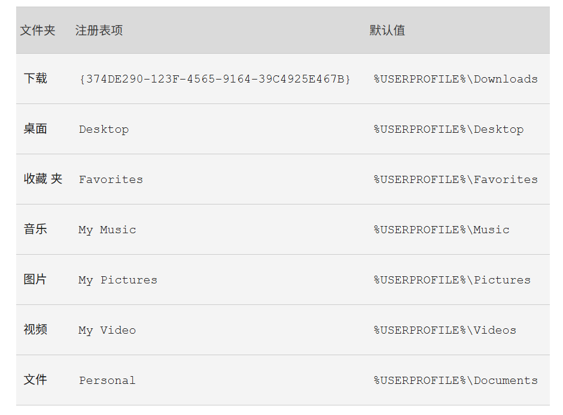

1. `c:/ProgramData/Microsoft/Windows/Start Menu/Programs`是Windows的起始固定菜单路径

+ Windows端口
  + `netstat -ano`查看当前的端口占用情况
  + `netstat -aon|findstr "端口号"`查看指定端口的占用情况，它会在右侧显示进程号
  + `tasklist|findstr "进程号"`查看哪个B应用程序在占用该端口
  + `taskkill /T /F /PID 进程号`来把该进程干掉
+ 清理C盘
  + `win+R`->`%temp%`显示缓存文件夹，里面的文件可以随便删
  + `win+R`->`cmd`->以管理员程序运行->`powercfg -h off`关毕休眠文件，如果想打开再按原操作输入`powercfg -h on`
  + `win+i`->`存储`->`临时文件`->全删掉
  + 微信->设置->文件管理->修改存储路径为其它盘并删掉原数据
+ cmd设置UTF-8编码
  + 临时修改:cmd执行`chcp 65001`
  + 永久修改:`Win+R`输入`regedit`打开注册表，导航到`HKEY_LOCAL_MACHINE\SOFTWARE\Microsoft\Command Processor`。在右侧空白处右键，选择`新建 -> 字符串值`，命名为`Autorun`，设置其值为`chcp 65001`然后保存再重启cmd即可生效
+ 处理器架构:
  + x64:又称AMD64或Intel64，一般在PC上很常见，可以执行64位操作，由AMD设计开发，可以执行复杂指令集操作，能耗高
  + ARM64:又称为AArch64，一般在移动设备、嵌入式设备、服务器等设备上很常见，它在低能耗情况下依然能维持优秀的性能
  + Windows在cmd下输入`systeminfo`，在`System Type`栏可以看到自己的设备处理器架构
+ 移动系统文件夹(如文档、下载、视频等)位置
  + 详见[Windows官方文档](https://support.microsoft.com/zh-cn/topic/%E5%9C%A8-windows-%E4%B8%AD%E6%9B%B4%E6%94%B9%E4%B8%AA%E4%BA%BA%E6%96%87%E4%BB%B6%E5%A4%B9%E4%BD%8D%E7%BD%AE%E7%9A%84%E6%93%8D%E4%BD%9C%E5%A4%B1%E8%B4%A5-ffb95139-6dbb-821d-27ec-62c9aaccd720)
  + `Win+R`输入`regedit`打开注册表编辑器，寻找`HKEY_CURRENT_USER\Software\Microsoft\Windows\CurrentVersion\Explorer\User Shell Folders`,根据下表设置对应的自定义位置

  + 最后重启电脑，或者使用任务管理器重启`explorer.exe`服务
+ 任务栏文件夹路径:
  + 用户级任务栏 (TaskBar) 文件夹(即“固定到任务栏”文件夹)：`%AppData%\Microsoft\Internet Explorer\Quick Launch\User Pinned\TaskBar`
  + 系统级任务栏 (TaskBar) 文件夹：`C:\ProgramData\Microsoft\Windows\Start Menu\Programs\StartUp`
  + “固定到开始屏幕”文件夹:`C:\ProgramData\Microsoft\Windows\Start Menu\Programs`
  + 这些路径直接`Win+R`然后输入路径回车就能直接通过命令行打开
+ 任务栏图标显示异常：
  1. 右击该图标，点击“固定到任务栏”，然后关掉程序。然后点击任务栏上的该图标，一般会显示应用程序不存在，是否删除，点击确认。最后再通过正常途径打开程序就能显示正确的任务栏图标了
  2. `Win+R`，输入`cmd`，输入`cmd /c taskkill /f /im explorer.exe & del /a /f /q "%localappdata%\IconCache.db" & del /a /f /q "%localappdata%\Microsoft\Windows\Explorer\iconcache*" & start explorer.exe`，然后执行，系统会自动清除任务栏缓存并重启资源管理器
+ steam打开游戏慢
  + `设置`->`云`->关闭steam云
  + `设置`->`下载`->关闭启用着色器预缓存